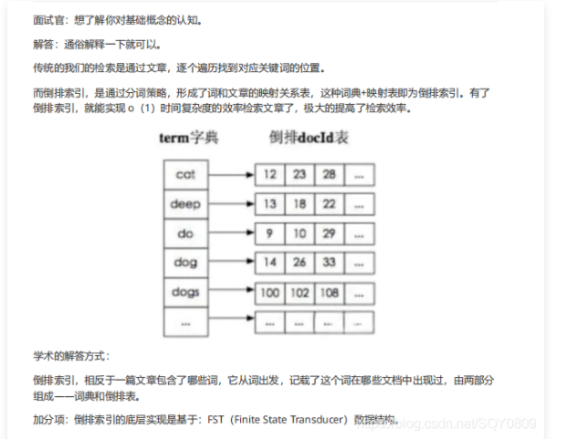
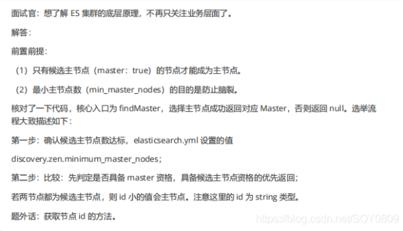
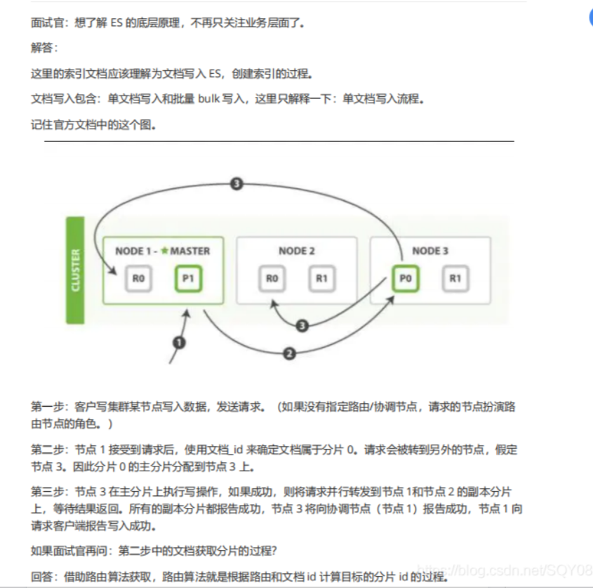
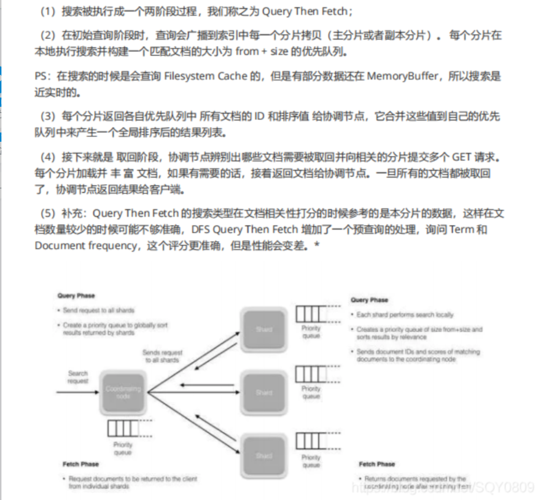

[toc]


# Elasticsearch


## 1、倒排索引是什么




lucene 从 4+版本后开始大量使用的数据结构是 FST。FST 有两个优点： 

（1）空间占用小。通过对词典中单词前缀和后缀的重复利用，压缩了存储空间； 

（2）查询速度快。O(len(str))的查询时间复杂度。 


## 2、索引数据多了怎么办，如何调优，部署

索引数据的规划，应在前期做好规划，正所谓“设计先行，编码在后”，这样才能有效的避免突如其来的数据激增导致集群处理能力不足引发的线上客户检索或者其他业务受到影响。 

如何调优：

### 2.1 动态索引层面

基于模板+时间+rollover api 滚动创建索引，举例：设计阶段定义：blog 索引的模板格式为： blog_index_时间戳的形式，每天递增数据。这样做的好处：不至于数据量激增导致单个索引数据量非 常大，接近于上线 2 的32 次幂-1，索引存储达到了 TB+甚至更大。 

一旦单个索引很大，存储等各种风险也随之而来，所以要提前考虑+及早避免。 

### 2.2 存储层面

冷热数据分离存储，热数据（比如最近 3 天或者一周的数据），其余为冷数据。 

对于冷数据不会再写入新数据，可以考虑定期 force_merge 加 shrink 压缩操作，节省存储空间和检索效率。 

### 2.3 部署层面

- 一旦之前没有规划，这里就属于应急策略。 
- 结合 ES 自身的支持动态扩展的特点，动态新增机器的方式可以缓解集群压力，注意：如果之前主节点等规划合理，不需要重启集群也能完成动态新增的。 


## 3、如何实现master选举



（1）Elasticsearch 的选主是 ZenDiscovery 模块负责的，主要包含 Ping（节点之间通过这个 RPC 来发 现彼此）和 Unicast（单播模块包含一个主机列表以控制哪些节点需要 ping 通）这两部分； 

（2）对所有可以成为 master 的节点（node.master: true）根据 nodeId 字典排序，每次选举每个节 点都把自己所知道节点排一次序，然后选出第一个（第 0 位）节点，暂且认为它是 master 节点。 

（3）如果对某个节点的投票数达到一定的值（可以成为 master 节点数 n/2+1）并且该节点自己也选 举自己，那这个节点就是 master。否则重新选举一直到满足上述条件。 

（4）补充：master 节点的职责主要包括集群、节点和索引的管理，不负责文档级别的管理；data 节点可以关闭 http 功能。


## 4、索引文档的过程




协调节点默认使用文档 ID 参与计算（也支持通过 routing），以便为路由提供合适的分片

```js
shard = hash(document_id) % (num_of_primary_shards)
```


（1）当分片所在的节点接收到来自协调节点的请求后，会将请求写入到 MemoryBuffffer，然后定时（默认是每隔 1 秒）写入到 Filesystem Cache，这个从 MomeryBuffffer 到 Filesystem Cache 的过程就叫做 refresh； 

（2）当然在某些情况下，存在 Momery Buffffer 和 Filesystem Cache 的数据可能会丢失，ES 是通过translog 的机制来保证数据的可靠性的。其实现机制是接收到请求后，同时也会写入到 translog 中 ， 当 Filesystem cache 中的数据写入到磁盘中时，才会清除掉，这个过程叫做 flflush； 

（3）在 flflush 过程中，内存中的缓冲将被清除，内容被写入一个新段，段的 fsync将创建一个新的提交点，并将内容刷新到磁盘，旧的 translog 将被删除并开始一个新的 translog。 

（4）flflush 触发的时机是定时触发（默认 30 分钟）或者 translog 变得太大（默认为 512M）时；补充：关于 Lucene 的 Segement： 

（1）Lucene 索引是由多个段组成，段本身是一个功能齐全的倒排索引。 

（2）段是不可变的，允许 Lucene 将新的文档增量地添加到索引中，而不用从头重建索引。 

（3）对于每一个搜索请求而言，索引中的所有段都会被搜索，并且每个段会消耗CPU 的时钟周、文件句柄和内存。这意味着段的数量越多，搜索性能会越低。 

（4）为了解决这个问题，Elasticsearch 会合并小段到一个较大的段，提交新的合并段到磁盘，并删除那些旧的小段。 


## 5、搜索过程

搜索拆解为“query then fetch” 两个阶段。 

query 阶段的目的：定位到位置，但不取。 

步骤拆解如下： 

（1）假设一个索引数据有 5 主+1 副本 共 10 分片，一次请求会命中（主或者副本分片中）的一个。 

（2）每个分片在本地进行查询，结果返回到本地有序的优先队列中。 

（3）第 2）步骤的结果发送到协调节点，协调节点产生一个全局的排序列表。 

fetch 阶段的目的：取数据。 

路由节点获取所有文档，返回给客户端。 





## 6、更新、删除文档过程

（1）删除和更新也都是写操作，但是 Elasticsearch 中的文档是不可变的，因此不能被删除或者改动以展示其变更； 

（2）磁盘上的每个段都有一个相应的.del 文件。当删除请求发送后，文档并没有真的被删除，而是在.del 文件中被标记为删除。该文档依然能匹配查询，但是会在结果中被过滤掉。当段合并时，在.del 文件中被标记为删除的文档将不会被写入新段。 

（3）在新的文档被创建时，Elasticsearch 会为该文档指定一个版本号，当执行更新时，旧版本的文档在.del 文件中被标记为删除，新版本的文档被索引到一个新段。旧版本的文档依然能匹配查询，但是会在结果中被过滤掉


## 7、在 Elasticsearch 中，是怎么根据一个词找到对应的倒排索引的？

（1）Lucene的索引过程，就是按照全文检索的基本过程，将倒排表写成此文件格式的过程。 

（2）Lucene的搜索过程，就是按照此文件格式将索引进去的信息读出来，然后计算每篇文档打分(score)的过程。


