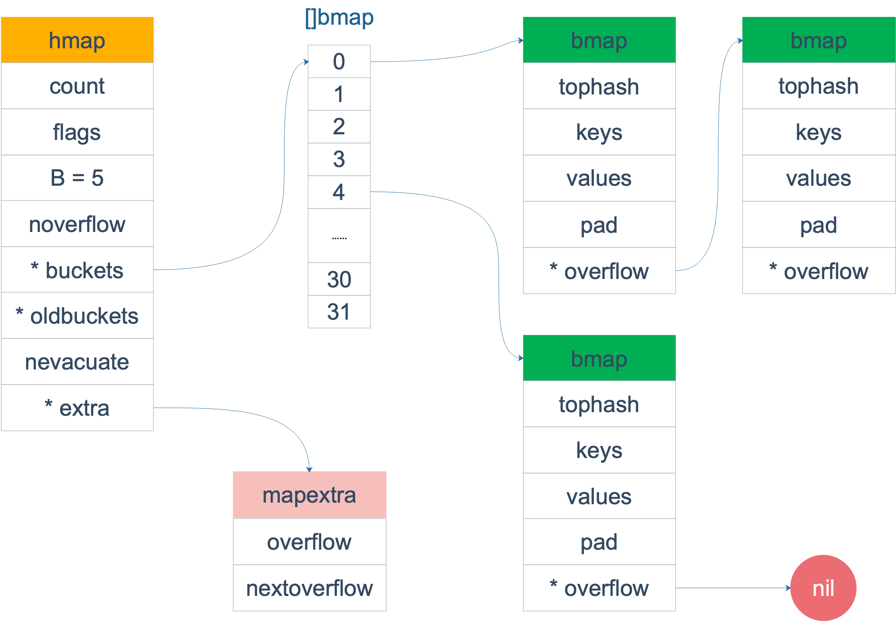
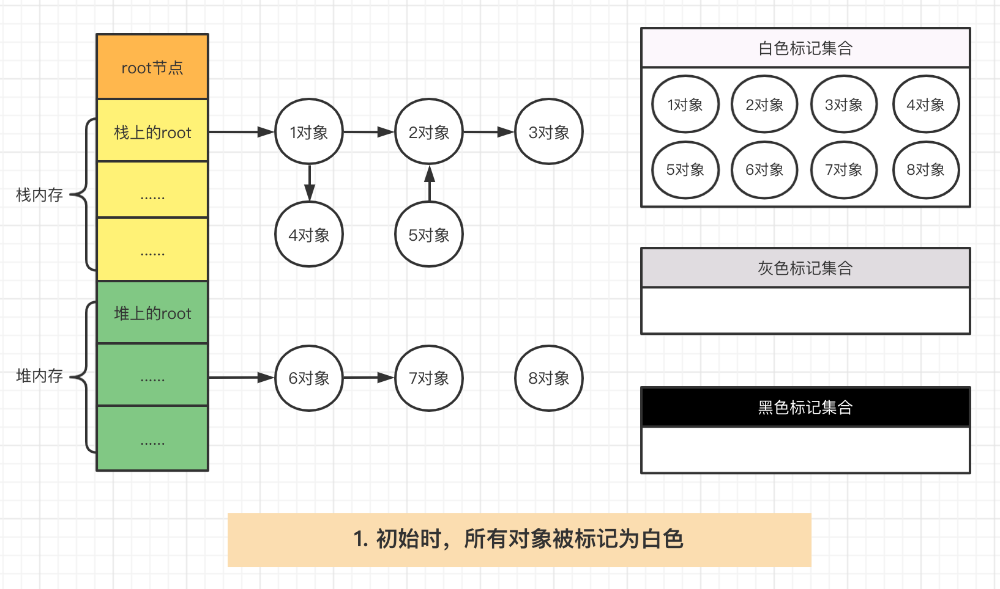
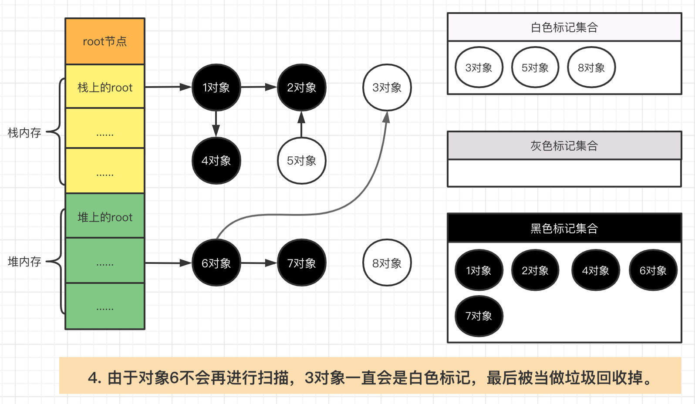
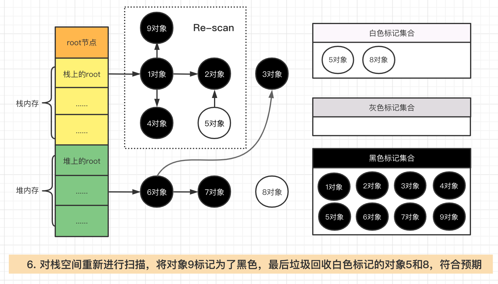
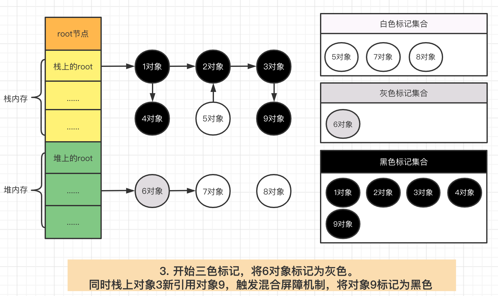

<!-- vscode-markdown-toc -->
* 1. [数组与切片](#)
	* 1.1. [扩容机制](#-1)
	* 1.2. [切片作为函数参数](#-1)
* 2. [Map](#Map)
	* 2.1. [创建map](#map)
	* 2.2. [哈希函数](#-1)
	* 2.3. [key的定位过程](#key)
	* 2.4. [扩容机制](#-1)
* 3. [Channel](#Channel)
	* 3.1. [Channel 简要说明](#Channel-1)
	* 3.2. [Channel 类型定义](#Channel-1)
	* 3.3. [Channel 有无缓冲 & 同步、异步](#Channel-1)
	* 3.4. [Channel 各种操作导致阻塞和协程泄漏的场景](#Channel-1)
	* 3.5. [Channel 的缺点：](#Channel-1)
	* 3.6. [Go Channel 实现协程同步](#GoChannel)
	* 3.7. [注意](#-1)
* 4. [Context](#Context)
* 5. [Unsafe](#Unsafe)
* 6. [编译](#-1)
	* 6.1. [GOPATH、GOROOT](#GOPATHGOROOT)
* 7. [GOROUTING](#GOROUTING)
	* 7.1. [Scheduler](#Scheduler)
* 8. [垃圾回收](#-1)
	* 8.1. [根对象](#-1)
	* 8.2. [三色标记法](#-1)
		* 8.2.1. [强三色不变式](#-1)
		* 8.2.2. [弱三色不变式](#-1)
		* 8.2.3. [屏障机制](#-1)

<!-- vscode-markdown-toc-config
	numbering=true
	autoSave=true
	/vscode-markdown-toc-config -->
<!-- /vscode-markdown-toc --># GO

##  1. <a name=''></a>数组与切片
slice的底层数据是数组，slice是对数组的封装， 描述一个数组的片段。
数组是定长的，长度定义好之后，不能再更改。在 Go 中，数组是不常见的，因为其长度是类型的一部分，限制了它的表达能力，比如 [3]int 和 [4]int 就是不同的类型。

而切片则非常灵活，它可以动态地扩容。切片的类型和长度无关。

数组就是一片连续的内存， slice 实际上是一个结构体，包含三个字段：长度、容量、底层数组。

```go
// runtime/slice.go
type slice struct {
	array unsafe.Pointer // 元素指针
	len   int // 长度 
	cap   int // 容量
}
```


注意，底层数组是可以被多个 slice 同时指向的，因此对一个 slice 的元素进行操作是有可能影响到其他 slice 的。

【引申1】 [3]int 和 [4]int 是同一个类型吗？

不是。因为数组的长度是类型的一部分，这是与 slice 不同的一点。

【引申2】 下面的代码输出是什么？
```go
package main

import "fmt"

func main() {
	slice := []int{0, 1, 2, 3, 4, 5, 6, 7, 8, 9}
    // s1是slice第二到第五，cap为8， s1=[2,3,4]
	s1 := slice[2:5]
    // s2是从s1上搞下来的，容量到索引7，所以cap为5， s2=[4,5,6,7]
	s2 := s1[2:6:7]

    // 追加100，由于地层的数组是同一个，所以slice索引8都改为了100
	s2 = append(s2, 100)
    // 扩容，会重新分配内存，所以改的只是s2的引用，不会改到slice下的数据
	s2 = append(s2, 200)

	s1[2] = 20

	fmt.Println(s1)
	fmt.Println(s2)
	fmt.Println(slice)
}
```
结果：
[2 3 20]
[4 5 6 7 100 200]
[0 1 2 3 20 5 6 7 100 9]


###  1.1. <a name='-1'></a>扩容机制
使用 append 可以向 slice 追加元素，实际上是往底层数组添加元素。但是底层数组的长度是固定的，如果索引 len-1 所指向的元素已经是底层数组的最后一个元素，就没法再添加了。

这时，slice 会迁移到新的内存位置，新底层数组的长度也会增加，这样就可以放置新增的元素。同时，为了应对未来可能再次发生的 append 操作，新的底层数组的长度，也就是新 slice 的容量是留了一定的 buffer 的。否则，每次添加元素的时候，都会发生迁移，成本太高。

新 slice 预留的 buffer 大小是有一定规律的。在golang1.18版本更新之前网上大多数的文章都是这样描述slice的扩容策略的：

｜当原 slice 容量小于 1024 的时候，新 slice 容量变成原来的 2 倍；原 slice 容量超过 1024，新 slice 容量变成原来的1.25倍。

在1.18版本更新之后，slice的扩容策略变为了：

｜当原slice容量(oldcap)小于256的时候，新slice(newcap)容量为原来的2倍；原slice容量超过256，新slice容量newcap = oldcap+(oldcap+3*256)/4

确定容量之后，会进行容量对其

golang版本1.9.5

```go
// go 1.9.5 src/runtime/slice.go:82
func growslice(et *_type, old slice, cap int) slice {
    // ……
    newcap := old.cap
	doublecap := newcap + newcap
	if cap > doublecap {
		newcap = cap
	} else {
		if old.len < 1024 {
			newcap = doublecap
		} else {
			for newcap < cap {
				newcap += newcap / 4
			}
		}
	}
	// ……
	
	capmem = roundupsize(uintptr(newcap) * ptrSize)
	newcap = int(capmem / ptrSize)
}
```

golang版本1.18
```go
// go 1.18 src/runtime/slice.go:178
func growslice(et *_type, old slice, cap int) slice {
    // ……
    newcap := old.cap
	doublecap := newcap + newcap
	if cap > doublecap {
		newcap = cap
	} else {
		const threshold = 256
		if old.cap < threshold {
			newcap = doublecap
		} else {
			for 0 < newcap && newcap < cap {
                // Transition from growing 2x for small slices
				// to growing 1.25x for large slices. This formula
				// gives a smooth-ish transition between the two.
				newcap += (newcap + 3*threshold) / 4
			}
			if newcap <= 0 {
				newcap = cap
			}
		}
	}
	// ……
    
	capmem = roundupsize(uintptr(newcap) * ptrSize)
	newcap = int(capmem / ptrSize)
}
```

后半部分还对 newcap 作了一个内存对齐，这个和内存分配策略相关。进行内存对齐之后，新 slice 的容量是要 大于等于 按照前半部分生成的newcap。

之后，向 Go 内存管理器申请内存，将老 slice 中的数据复制过去，并且将 append 的元素添加到新的底层数组中。

最后，向 growslice 函数调用者返回一个新的 slice，这个 slice 的长度并没有变化，而容量却增大了。

```go
package main

import "fmt"

func main() {
	s := []int{1,2}
    // cap为2，增加三个元素之后，新的cap为5，此时double都无法解决，所以就用新的cap，然后再进行容量对其，所以后续最新的cap是6
	s = append(s,4,5,6)
	fmt.Printf("len=%d, cap=%d",len(s),cap(s))
}
```
运行结果是：
len=5, cap=6


###  1.2. <a name='-1'></a>切片作为函数参数
当 slice 作为函数参数时，就是一个普通的结构体。其实很好理解：若直接传 slice，在调用者看来，实参 slice 并不会被函数中的操作改变；若传的是 slice 的指针，在调用者看来，是会被改变原 slice 的。

值得注意的是，不管传的是 slice 还是 slice 指针，如果改变了 slice 底层数组的数据，会反应到实参 slice 的底层数据。为什么能改变底层数组的数据？很好理解：底层数据在 slice 结构体里是一个指针，尽管 slice 结构体自身不会被改变，也就是说底层数据地址不会被改变。 但是通过指向底层数据的指针，可以改变切片的底层数据，没有问题。

通过 slice 的 array 字段就可以拿到数组的地址。在代码里，是直接通过类似 s[i]=10 这种操作改变 slice 底层数组元素值。

另外，值得注意的是，Go 语言的函数参数传递，只有值传递，没有引用传递。

```go
package main

func main() {
	s := []int{1, 1, 1}
	f(s)
	fmt.Println(s)
}

func f(s []int) {
	// i只是一个副本，不能改变s中元素的值
	/*for _, i := range s {
		i++
	}
	*/

	for i := range s {
		s[i] += 1
	}
}
```

运行一下，程序输出：
[2 2 2]

果真改变了原始 slice 的底层数据。这里传递的是一个 slice 的副本，在 f 函数中，s 只是 main 函数中 s 的一个拷贝。在f 函数内部，对 s 的作用并不会改变外层 main 函数的 s。

要想真的改变外层 slice，只有将返回的新的 slice 赋值到原始 slice，或者向函数传递一个指向 slice 的指针

```go
package main

import "fmt"

func myAppend(s []int) []int {
	// 这里 s 虽然改变了，但并不会影响外层函数的 s
    fmt.Printf("%p", s) // 打印地层数组的地址
	s = append(s, 100)
    fmt.Printf("%p", s) // 打印地层数组的地址
	return s
}

func myAppendPtr(s *[]int) {
	// 会改变外层 s 本身
	*s = append(*s, 100)
	return
}

func main() {
    // s的cap是3，当myappend增加新元素时候，需要扩容
	s := []int{1, 1, 1}
    fmt.Printf("%p", s) // 打印地层数组的地址
	newS := myAppend(s)

	fmt.Println(s)
	fmt.Println(newS)

	s = newS

	myAppendPtr(&s)
	fmt.Println(s)
}
```
运行结果：
[1 1 1]
[1 1 1 100]
[1 1 1 100 100]

myAppend 函数里，虽然改变了 s，但它只是一个值传递，并不会影响外层的 s，因此第一行打印出来的结果仍然是 [1 1 1]。

而 newS 是一个新的 slice，它是基于 s 得到的。因此它打印的是追加了一个 100 之后的结果： [1 1 1 100]。

最后，将 newS 赋值给了 s，s 这时才真正变成了一个新的slice。之后，再给 myAppendPtr 函数传入一个 s 指针，这回它真的被改变了：[1 1 1 100 100]。


##  2. <a name='Map'></a>Map
map底层采用哈希查找表，并且使用链表解决哈希冲突。

```go
// A header for a Go map.
type hmap struct {
    // 元素个数，调用 len(map) 时，直接返回此值
	count     int
	flags     uint8
	// buckets 的对数 log_2，也就是说buckets的数量是2^B个
	B         uint8
	// overflow 的 bucket 近似数
	noverflow uint16
	// 计算 key 的哈希的时候会传入哈希函数
	hash0     uint32
    // 指向 buckets 数组，大小为 2^B
    // 如果元素个数为0，就为 nil
	buckets    unsafe.Pointer
	// 等量扩容的时候，buckets 长度和 oldbuckets 相等
	// 双倍扩容的时候，buckets 长度会是 oldbuckets 的两倍
	oldbuckets unsafe.Pointer
	// 指示扩容进度，小于此地址的 buckets 迁移完成
	nevacuate  uintptr
	extra *mapextra // optional fields
}
```

buckets 是一个指针，最终它指向的是一个结构体：
```go
type bmap struct {
	tophash [bucketCnt]uint8
}
```

但这只是表面(src/runtime/hashmap.go)的结构，编译期间会给它加料，动态地创建一个新的结构：

```go
type bmap struct {
    topbits  [8]uint8
    keys     [8]keytype
    values   [8]valuetype
    pad      uintptr
    overflow uintptr
}
```
bmap 就是我们常说的“桶”，桶里面会最多装 8 个 key，这些 key 之所以会落入同一个桶，是因为它们经过哈希计算后，哈希结果是“一类”的。在桶内，又会根据 key 计算出来的 hash 值的高 8 位来决定 key 到底落入桶内的哪个位置（一个桶内最多有8个位置）。



当 map 的 key 和 value 都不是指针，并且 size 都小于 128 字节的情况下，会把 bmap 标记为不含指针，这样可以避免 gc 时扫描整个 hmap。但是，我们看 bmap 其实有一个 overflow 的字段，是指针类型的，破坏了 bmap 不含指针的设想，这时会把 overflow 移动到 extra 字段来。

```go
type mapextra struct {
	// overflow[0] contains overflow buckets for hmap.buckets.
	// overflow[1] contains overflow buckets for hmap.oldbuckets.
	overflow [2]*[]*bmap

	// nextOverflow 包含空闲的 overflow bucket，这是预分配的 bucket
	nextOverflow *bmap
}
```
bmap 是存放 k-v 的地方，我们把视角拉近，仔细看 bmap 的内部组成。

key和value各自放在一起，可以省略掉padding字段，节省内存空间。

每个 bucket 设计成最多只能放 8 个 key-value 对，如果有第 9 个 key-value 落入当前的 bucket，那就需要再构建一个 bucket ，通过 overflow 指针连接起来。

###  2.1. <a name='map'></a>创建map
```go
ageMp := make(map[string]int)
// 指定 map 长度
ageMp := make(map[string]int, 8)

// ageMp 为 nil，不能向其添加元素，会直接panic
var ageMp map[string]int
```
实际上底层调用的是 makemap 函数，主要做的工作就是初始化 hmap 结构体的各种字段，例如计算 B 的大小，设置哈希种子 hash0 等等

###  2.2. <a name='-1'></a>哈希函数
hash 函数，有加密型和非加密型。 加密型的一般用于加密数据、数字摘要等，典型代表就是 md5、sha1、sha256、aes256 这种； 非加密型的一般就是查找。在 map 的应用场景中，用的是查找。 选择 hash 函数主要考察的是两点：性能、碰撞概率。
```go
type _type struct {
	size       uintptr
	ptrdata    uintptr // size of memory prefix holding all pointers
	hash       uint32
	tflag      tflag
	align      uint8
	fieldalign uint8
	kind       uint8
	alg        *typeAlg
	gcdata    *byte
	str       nameOff
	ptrToThis typeOff
}
```
其中 alg 字段就和哈希相关，它是指向如下结构体的指针：


```go
// src/runtime/alg.go
type typeAlg struct {
	// (ptr to object, seed) -> hash
	hash func(unsafe.Pointer, uintptr) uintptr
	// (ptr to object A, ptr to object B) -> ==?
	equal func(unsafe.Pointer, unsafe.Pointer) bool
}
```
typeAlg 包含两个函数，hash 函数计算类型的哈希值，而 equal 函数则计算两个类型是否“哈希相等”。

对于 string 类型，它的 hash、equal 函数如下：
```go
func strhash(a unsafe.Pointer, h uintptr) uintptr {
	x := (*stringStruct)(a)
	return memhash(x.str, h, uintptr(x.len))
}

func strequal(p, q unsafe.Pointer) bool {
	return *(*string)(p) == *(*string)(q)
}
```
根据 key 的类型，_type 结构体的 alg 字段会被设置对应类型的 hash 和 equal 函数。

###  2.3. <a name='key'></a>key的定位过程
key 经过哈希计算后得到哈希值，共 64 个 bit 位（64位机，32位机就不讨论了，现在主流都是64位机），计算它到底要落在哪个桶时，只会用到最后 B 个 bit 位。还记得前面提到过的 B 吗？如果 B = 5，那么桶的数量，也就是 buckets 数组的长度是 2^5 = 32。

例如，现在有一个 key 经过哈希函数计算后，得到的哈希结果是：

 10010111 | 000011110110110010001111001010100010010110010101010 │ 01010
用最后的 5 个 bit 位，也就是 01010，值为 10，也就是 10 号桶。这个操作实际上就是取余操作，但是取余开销太大，所以代码实现上用的位操作代替。

再用哈希值的高 8 位，找到此 key 在 bucket 中的位置，这是在寻找已有的 key。最开始桶内还没有 key，新加入的 key 会找到第一个空位，放入。

buckets 编号就是桶编号，当两个不同的 key 落在同一个桶中，也就是发生了哈希冲突。冲突的解决手段是用链表法：在 bucket 中，从前往后找到第一个空位。这样，在查找某个 key 时，先找到对应的桶，再去遍历 bucket 中的 key。


上图中，假定 B = 5，所以 bucket 总数就是 2^5 = 32。首先计算出待查找 key 的哈希，使用低 5 位 00110，找到对应的 6 号 bucket，使用高 8 位 10010111，对应十进制 151，在 6 号 bucket 中寻找 tophash 值（HOB hash）为 151 的 key，找到了 2 号槽位，这样整个查找过程就结束了。

如果在 bucket 中没找到，并且 overflow 不为空，还要继续去 overflow bucket 中寻找，直到找到或是所有的 key 槽位都找遍了，包括所有的 overflow bucket。
```go
func mapaccess1(t *maptype, h *hmap, key unsafe.Pointer) unsafe.Pointer {
	// ……
	
	// 如果 h 什么都没有，返回零值
	if h == nil || h.count == 0 {
		return unsafe.Pointer(&zeroVal[0])
	}
	
	// 写和读冲突
	if h.flags&hashWriting != 0 {
		throw("concurrent map read and map write")
	}
	
	// 不同类型 key 使用的 hash 算法在编译期确定
	alg := t.key.alg
	
	// 计算哈希值，并且加入 hash0 引入随机性
	hash := alg.hash(key, uintptr(h.hash0))
	
	// 比如 B=5，那 m 就是31，二进制是全 1
	// 求 bucket num 时，将 hash 与 m 相与，
	// 达到 bucket num 由 hash 的低 8 位决定的效果
	m := uintptr(1)<<h.B - 1
	
	// b 就是 bucket 的地址
	b := (*bmap)(add(h.buckets, (hash&m)*uintptr(t.bucketsize)))
	
	// oldbuckets 不为 nil，说明发生了扩容
	if c := h.oldbuckets; c != nil {
	    // 如果不是同 size 扩容（看后面扩容的内容）
	    // 对应条件 1 的解决方案
		if !h.sameSizeGrow() {
			// 新 bucket 数量是老的 2 倍
			m >>= 1
		}
		
		// 求出 key 在老的 map 中的 bucket 位置
		oldb := (*bmap)(add(c, (hash&m)*uintptr(t.bucketsize)))
		
		// 如果 oldb 没有搬迁到新的 bucket
		// 那就在老的 bucket 中寻找
		if !evacuated(oldb) {
			b = oldb
		}
	}
	
	// 计算出高 8 位的 hash
	// 相当于右移 56 位，只取高8位
	top := uint8(hash >> (sys.PtrSize*8 - 8))
	
	// 增加一个 minTopHash
	if top < minTopHash {
		top += minTopHash
	}
	for {
	    // 遍历 bucket 的 8 个位置
		for i := uintptr(0); i < bucketCnt; i++ {
		    // tophash 不匹配，继续
			if b.tophash[i] != top {
				continue
			}
			// tophash 匹配，定位到 key 的位置
			k := add(unsafe.Pointer(b), dataOffset+i*uintptr(t.keysize))
			// key 是指针
			if t.indirectkey {
			    // 解引用
				k = *((*unsafe.Pointer)(k))
			}
			// 如果 key 相等
			if alg.equal(key, k) {
			    // 定位到 value 的位置
				v := add(unsafe.Pointer(b), dataOffset+bucketCnt*uintptr(t.keysize)+i*uintptr(t.valuesize))
				// value 解引用
				if t.indirectvalue {
					v = *((*unsafe.Pointer)(v))
				}
				return v
			}
		}
		
		// bucket 找完（还没找到），继续到 overflow bucket 里找
		b = b.overflow(t)
		// overflow bucket 也找完了，说明没有目标 key
		// 返回零值
		if b == nil {
			return unsafe.Pointer(&zeroVal[0])
		}
	}
}
```

整个大循环的写法，最外层是一个无限循环，通过
b = b.overflow(t)
遍历所有的 bucket，这相当于是一个 bucket 链表。

当定位到一个具体的 bucket 时，里层循环就是遍历这个 bucket 里所有的 cell，或者说所有的槽位，也就是 bucketCnt=8 个槽位。整个循环过程：


minTopHash，当一个 cell 的 tophash 值小于 minTopHash 时，标志这个 cell 的迁移状态。因为这个状态值是放在 tophash 数组里，为了和正常的哈希值区分开，会给 key 计算出来的哈希值一个增量：minTopHash。这样就能区分正常的 top hash 值和表示状态的哈希值。

下面的这几种状态就表征了 bucket 的情况：

```go
// 空的 cell，也是初始时 bucket 的状态
empty          = 0
// 空的 cell，表示 cell 已经被迁移到新的 bucket
evacuatedEmpty = 1
// key,value 已经搬迁完毕，但是 key 都在新 bucket 前半部分，
// 后面扩容部分会再讲到。
evacuatedX     = 2
// 同上，key 在后半部分
evacuatedY     = 3
// tophash 的最小正常值
minTopHash     = 4
```
源码里判断这个 bucket 是否已经搬迁完毕，用到的函数：

```go
func evacuated(b *bmap) bool {
	h := b.tophash[0]
	return h > empty && h < minTopHash
}
```
只取了 tophash 数组的第一个值，判断它是否在 0-4 之间。对比上面的常量，当 top hash 是 evacuatedEmpty、evacuatedX、evacuatedY 这三个值之一，说明此 bucket 中的 key 全部被搬迁到了新 bucket。

###  2.4. <a name='-1'></a>扩容机制
loadFactor := count / (2^B)
count 就是 map 的元素个数，2^B 表示 bucket 数量。

再来说触发 map 扩容的时机：在向 map 插入新 key 的时候，会进行条件检测，符合下面这 2 个条件，就会触发扩容：
1、装载因子超过阈值，源码里定义的阈值是 6.5。
2、overflow 的 bucket 数量过多：当 B 小于 15，也就是 bucket 总数 2^B 小于 2^15 时，如果 overflow 的 bucket 数量超过 2^B；当 B >= 15，也就是 bucket 总数 2^B 大于等于 2^15，如果 overflow 的 bucket 数量超过 2^15。

触发扩容的源码如下：
```go
// src/runtime/hashmap.go/mapassign

// 触发扩容时机
if !h.growing() && (overLoadFactor(int64(h.count), h.B) || tooManyOverflowBuckets(h.noverflow, h.B)) {
		hashGrow(t, h)
	}

// 装载因子超过 6.5, 条件1
func overLoadFactor(count int64, B uint8) bool {
	return count >= bucketCnt && float32(count) >= loadFactor*float32((uint64(1)<<B))
}

// overflow buckets 太多， 条件2
func tooManyOverflowBuckets(noverflow uint16, B uint8) bool {
	if B < 16 {
		return noverflow >= uint16(1)<<B
	}
	return noverflow >= 1<<15
}
```
对于条件 1，元素太多，而 bucket 数量太少，很简单：将 B 加 1，bucket 最大数量（2^B）直接变成原来 bucket 数量的 2 倍。于是，就有新老 bucket 了。注意，这时候元素都在老 bucket 里，还没迁移到新的 bucket 来。而且，新 bucket 只是最大数量变为原来最大数量（2^B）的 2 倍（2^B * 2）。

对于条件 2，其实元素没那么多，但是 overflow bucket 数特别多，说明很多 bucket 都没装满。解决办法就是开辟一个新 bucket 空间，将老 bucket 中的元素移动到新 bucket，使得同一个 bucket 中的 key 排列地更紧密。这样，原来，在 overflow bucket 中的 key 可以移动到 bucket 中来。结果是节省空间，提高 bucket 利用率，map 的查找和插入效率自然就会提升。

由于 map 扩容需要将原有的 key/value 重新搬迁到新的内存地址，如果有大量的 key/value 需要搬迁，会非常影响性能。因此 Go map 的扩容采取了一种称为“渐进式”地方式，原有的 key 并不会一次性搬迁完毕，每次最多只会搬迁** 2 个 bucket**。

真正搬迁 buckets 的动作在 growWork() 函数中，而调用 growWork() 函数的动作是在 mapassign 和 mapdelete 函数中。也就是插入或修改、删除 key 的时候，都会尝试进行搬迁 buckets 的工作。先检查 oldbuckets 是否搬迁完毕，具体来说就是检查 oldbuckets 是否为 nil。

```go
func hashGrow(t *maptype, h *hmap) {
	// B+1 相当于是原来 2 倍的空间
	bigger := uint8(1)

	// 对应条件 2
	if !overLoadFactor(int64(h.count), h.B) {
		// 进行等量的内存扩容，所以 B 不变
		bigger = 0
		h.flags |= sameSizeGrow
	}
	// 将老 buckets 挂到 buckets 上
	oldbuckets := h.buckets
	// 申请新的 buckets 空间
	newbuckets, nextOverflow := makeBucketArray(t, h.B+bigger)

	flags := h.flags &^ (iterator | oldIterator)
	if h.flags&iterator != 0 {
		flags |= oldIterator
	}
	// 提交 grow 的动作
	h.B += bigger
	h.flags = flags
	h.oldbuckets = oldbuckets
	h.buckets = newbuckets
	// 搬迁进度为 0
	h.nevacuate = 0
	// overflow buckets 数为 0
	h.noverflow = 0

	// ……
}
```
主要是申请到了新的 buckets 空间，把相关的标志位都进行了处理：例如标志 nevacuate 被置为 0， 表示当前搬迁进度为 0。

值得一说的是对 h.flags 的处理：

```go
flags := h.flags &^ (iterator | oldIterator)
if h.flags&iterator != 0 {
	flags |= oldIterator
}
```
这里得先说下运算符：&^。这叫按位置 0运算符。例如：

x = 01010011
y = 01010100
z = x &^ y = 00000011
如果 y bit 位为 1，那么结果 z 对应 bit 位就为 0，否则 z 对应 bit 位就和 x 对应 bit 位的值相同。

所以上面那段对 flags 一顿操作的代码的意思是：先把 h.flags 中 iterator 和 oldIterator 对应位清 0，然后如果发现 iterator 位为 1，那就把它转接到 oldIterator 位，使得 oldIterator 标志位变成 1。潜台词就是：buckets 现在挂到了 oldBuckets 名下了，对应的标志位也转接过去吧。


```go
// 可能有迭代器使用 buckets
iterator     = 1
// 可能有迭代器使用 oldbuckets
oldIterator  = 2
// 有协程正在向 map 中写入 key
hashWriting  = 4
// 等量扩容（对应条件 2）
sameSizeGrow = 8
```
看看真正执行搬迁工作的 growWork() 函数。

```go
func growWork(t *maptype, h *hmap, bucket uintptr) {
	// 确认搬迁老的 bucket 对应正在使用的 bucket
	evacuate(t, h, bucket&h.oldbucketmask())

	// 再搬迁一个 bucket，以加快搬迁进程
	/*
	func (h *hmap) growing() bool {
		return h.oldbuckets != nil
	}
	*/
	if h.growing() {
		evacuate(t, h, h.nevacuate)
	}
}
```

bucket&h.oldbucketmask() 这行代码，如源码注释里说的，是为了确认搬迁的 bucket 是我们正在使用的 bucket。oldbucketmask() 函数返回扩容前的 map 的 bucketmask。

所谓的 bucketmask，作用就是将 key 计算出来的哈希值与 bucketmask 相与，得到的结果就是 key 应该落入的桶。比如 B = 5，那么 bucketmask 的低 5 位是 11111，其余位是 0，hash 值与其相与的意思是，只有 hash 值的低 5 位决策 key 到底落入哪个 bucket。


搬迁的目的就是将老的 buckets 搬迁到新的 buckets。而通过前面的说明我们知道，应对条件 1，新的 buckets 数量是之前的一倍，应对条件 2，新的 buckets 数量和之前相等。

对于条件 2，从老的 buckets 搬迁到新的 buckets，由于 bucktes 数量不变，因此可以按序号来搬，比如原来在 0 号 bucktes，到新的地方后，仍然放在 0 号 buckets。

对于条件 1，就没这么简单了。要重新计算 key 的哈希，才能决定它到底落在哪个 bucket。例如，原来 B = 5，计算出 key 的哈希后，只用看它的低 5 位，就能决定它落在哪个 bucket。扩容后，B 变成了 6，因此需要多看一位，它的低 6 位决定 key 落在哪个 bucket。这称为 rehash。

##  3. <a name='Channel'></a>Channel
###  3.1. <a name='Channel-1'></a>Channel 简要说明
Channel(一般简写为 chan) 管道提供了一种机制，它在两个并发执行的协程之间进行同步，并通过传递与该管道元素类型相符的值来进行通信。Channel 是用来在不同的 goroutine 中交换数据的，千万不要把 Channel 拿来在同一个 goroutine 中的不同函数之间间交换数据，chan 可以理解为一个管道或者先进先出的队列。

###  3.2. <a name='Channel-1'></a>Channel 类型定义
最简单形式： chan elementType，通过这个类型的值，你可以发送和接收elementType 类型的元素。Channel 是引用类型，如果将一个 chan 变量赋值给另外一个，则这两个变量访问的是相同的 chann。
当然，我们可以用 make 分配一个channel：var c = make(chan int)

###  3.3. <a name='Channel-1'></a>Channel 有无缓冲 & 同步、异步
channel 分为有缓冲 channel 和无缓冲 channel，两种 channel 的创建方法如下:

var ch = make(chan int) //无缓冲 channel,等同于make(chan int ,0)，是一个同步的 Channel

无缓冲 channel 在读和写的过程中是都会阻塞，由于阻塞的存在，所以使用 channel 时特别注意使用方法，防止死锁和协程泄漏的产生。
无缓冲 channel 的发送动作一直要到有一个接收者接收这个值才算完成，否则都是阻塞着的，也就是说，发送的数据需要被读取后，发送才会完成
一般要配合 select + timeout 处理，然后再在这里添加超时时间


var ch = make(chan int,10) //有缓冲channel,缓冲大小是10，是一个异步的Channel

带缓存的 channel 实际上是一个阻塞队列。队列满时写协程会阻塞，队列空时读协程阻塞。
有缓冲的时候，写操作是写完之后直接返回的。相对于不带缓存 channel，带缓存 channel 不易造成死锁。


###  3.4. <a name='Channel-1'></a>Channel 各种操作导致阻塞和协程泄漏的场景
写操作，什么时候会被阻塞？

- 向 nil 通道发送数据会被阻塞
- 向无缓冲 channel 写数据，如果读协程没有准备好，会阻塞
  - 无缓冲 channel ，必须要有读有写，写了数据之后，必须要读出来，否则导致 channel 阻塞，从而使得协程阻塞而使得协程泄漏
  - 一个无缓冲 channel，如果每次来一个请求就开一个 go 协程往里面写数据，但是一直没有被读取，那么就会导致这个 chan 一直阻塞，使得写这个 chan 的 go 协程一直无法释放从而协程泄漏。
- 向有缓冲 channel 写数据，如果缓冲已满，会阻塞
  - 有缓冲的 channel，在缓冲 buffer 之内，不读取也不会导致阻塞，当然也就不会使得协程泄漏，但是如果写数据超过了 buffer 还没有读取，那么继续写的时候就会阻塞了。如果往有缓冲的 channel 写了数据但是一直没有读取就直接退出协程的话，一样会导致 channel 阻塞，从而使得协程阻塞并泄漏。


读操作，什么时候会被阻塞？

- 从 nil 通道接收数据会被阻塞
- 从无缓冲 channel 读数据，如果写协程没有准备好，会阻塞
- 从有缓冲 channel 读数据，如果缓冲为空，会阻塞

close 操作，什么时候会被阻塞？

close channel 对 channel 阻塞是没有任何效果的，写了数据但是不读，直接 close，还是会阻塞的。


###  3.5. <a name='Channel-1'></a>Channel 的缺点：

Channel 可能会导致循环阻塞或者协程泄漏，这个是最最最要重点关注的。
Channel 中传递指针会导致数据竞态问题（data race/ race conditions）
Channel 中传递的都是数据的拷贝，可能会影响性能，但是就目前我们的机器性能来看，这点数据拷贝所带来的 CPU 消耗，大多数的情况下可以忽略。

###  3.6. <a name='GoChannel'></a>Go Channel 实现协程同步
channel 实现并发同步的说明
channel 作为 Go 并发模型的核心思想：不要通过共享内存来通信，而应该通过通信来共享内存，那么在 Go 里面，当然也可以很方便通过 channel 来实现协程的并发和同步了，并且 channel 本身还可以支持有缓冲和无缓冲的，通过 channel + timeout 实现并发协程之间的同步也是常见的一种使用姿势。

###  3.7. <a name='-1'></a>注意
- channel接收操作两种写法
```go
// entry points for <- c from compiled code
func chanrecv1(c *hchan, elem unsafe.Pointer) {
	chanrecv(c, elem, true)
}

// 如果是false，说明channle已经被关闭，这时候就可以判断nil值是元素为nil还是channle是否关闭	
func chanrecv2(c *hchan, elem unsafe.Pointer) (received bool) {
	_, received = chanrecv(c, elem, true)
	return
}
```

- channle元素传递方式
channel 的发送和接收操作本质上都是 “值的拷贝”，无论是从 sender goroutine 的栈到 chan buf，还是从 chan buf 到 receiver goroutine，或者是直接从 sender goroutine 到 receiver goroutine。


##  4. <a name='Context'></a>Context
context 用来解决 goroutine 之间退出通知、元数据传递的功能。

**传递共享数据**
例如：
```go
package main

import (
	"context"
	"fmt"
)

func main() {
	ctx := context.Background()
	process(ctx)

	ctx = context.WithValue(ctx, "traceId", "qcrao-2019")
	process(ctx)
}

func process(ctx context.Context) {
	traceId, ok := ctx.Value("traceId").(string)
	if ok {
		fmt.Printf("process over. trace_id=%s\n", traceId)
	} else {
		fmt.Printf("process over. no trace_id\n")
	}
}
```

**取消gorouting**
```go
func Perform(ctx context.Context) {
    for {
        calculatePos()
        sendResult()

        select {
        case <-ctx.Done():
            // 被取消，直接返回
            return
        case <-time.After(time.Second):
            // block 1 秒钟 
        }
    }
}

func main(){
	ctx, cancel := context.WithTimeout(context.Background(), time.Hour)
	go Perform(ctx)

	// ……
	// app 端返回页面，调用cancel 函数
	cancel()
}
```

**防止gorouting泄漏**

```go
func gen() <-chan int {
	ch := make(chan int)
	go func() {
		var n int
		for {
			ch <- n
			n++
			time.Sleep(time.Second)
		}
	}()
	return ch
}

func main() {
	for n := range gen() {
		fmt.Println(n)
		if n == 5 {
			break
		}
	}
	// ……
}
```

这样在break掉之后，那么 gen 函数的协程就会执行无限循环，永远不会停下来。发生了 goroutine 泄漏。

改进：
```go
func gen(ctx context.Context) <-chan int {
	ch := make(chan int)
	go func() {
		var n int
		for {
			select {
			case <-ctx.Done():
				return
			case ch <- n:
				n++
				time.Sleep(time.Second)
			}
		}
	}()
	return ch
}

func main() {
	ctx, cancel := context.WithCancel(context.Background())
	defer cancel() // 避免其他地方忘记 cancel，且重复调用不影响

	for n := range gen(ctx) {
		fmt.Println(n)
		if n == 5 {
			cancel()
			break
		}
	}
	// ……
}
```


##  5. <a name='Unsafe'></a>Unsafe
- 任何类型的指针和unsafe.Pointer可以相互转换
- uintptr类型和unsafe.Pointer可以相互转换


pointer不能直接进行数学运算，可以将它转换成uintptr，对uintptr类型进行数学运算，再转成pointer类型

uintptr 并没有指针的语义，意思就是 uintptr 所指向的对象会被 gc 无情地回收。而 unsafe.Pointer 有指针语义，可以保护它所指向的对象在“有用”的时候不会被垃圾回收。

**unsafe可以修改结构体成员变量**
对于一个结构体，通过 offset 函数可以获取结构体成员的偏移量，进而获取成员的地址，读写该地址的内存，就可以达到改变成员值的目的。

##  6. <a name='-1'></a>编译

###  6.1. <a name='GOPATHGOROOT'></a>GOPATH、GOROOT
GOROOT是go的安装目录，例如是：/usr/local/go

GOPATH的作用在于提供一个可查找 `.go`源码的路径，是一个工作空间的概念，可以设置多个目录
GOPATH下必须包含三个目录：
- bin：存放可执行文件
- pkg：存放源文件编译后的库文件
- src：存放源文件


##  7. <a name='GOROUTING'></a>GOROUTING

**gorouting和线程有什么区别？**

从三个方面可以解释：内存消耗、创建与销毁、切换
- 内存占用
  - 创建一个gorouting的栈内存消耗为2kb，如果空间不够用，会自动进行扩容
  - 创建一个线程则需要消耗1MB空间
- 创建与销毁
  - Thread 创建和销毀都会有巨大的消耗，因为要和操作系统打交道，是内核级的，通常解决的办法就是线程池。
  - 而 goroutine 因为是由 Go runtime 负责管理的，创建和销毁的消耗非常小，是用户级。
- 切换
  - thread切换时，需要保存各种寄存器，便于将来恢复
  - 而 goroutines 切换只需保存三个寄存器：Program Counter, Stack Pointer and BP。


###  7.1. <a name='Scheduler'></a>Scheduler
Go scheduler 可以说是 Go 运行时的一个最重要的部分了。Runtime 维护所有的 goroutines，并通过 scheduler 来进行调度。Goroutines 和 threads 是独立的，但是 goroutines 要依赖 threads 才能执行。

Go 程序执行的高效和 scheduler 的调度是分不开的。

**Go scheduler 的核心思想是：**
- reuse threads；
- 限制同时运行（不包含阻塞）的线程数为 N，N 等于 CPU 的核心数目；
- 线程私有的 runqueues，并且可以从其他线程 stealing goroutine 来运行，线程阻塞后，可以将 runqueues 传递给其他线程。


**M:N模型**
Go runtime 会负责 goroutine 的生老病死，从创建到销毁，都一手包办。Runtime 会在程序启动的时候，创建 M 个线程（CPU 执行调度的单位），之后创建的 N 个 goroutine 都会依附在这 M 个线程上执行。这就是 M:N 模型：


在同一时刻，一个线程上只能跑一个 goroutine。当 goroutine 发生阻塞（例如上篇文章提到的向一个 channel 发送数据，被阻塞）时，runtime 会把当前 goroutine 调度走，让其他 goroutine 来执行。目的就是不让一个线程闲着，榨干 CPU 的每一滴油水

**GMP**
有三个基础的结构体来实现 goroutines 的调度。g，m，p。

g 代表一个 goroutine，它包含：表示 goroutine 栈的一些字段，指示当前 goroutine 的状态，指示当前运行到的指令地址，也就是 PC 值。

m 表示内核线程，包含正在运行的 goroutine ， 与之绑定的P等信息，G需要调度到M上才能运行， 当M被阻塞时，整个P会被其他M接管。

p 代表一个虚拟的 Processor，它维护一个处于 Runnable 状态的 g 队列，m 需要获得 p 才能运行 g。

当然还有一个核心的结构体：sched，它总览全局。

Runtime 起始时会启动一些 G：垃圾回收的 G，执行调度的 G，运行用户代码的 G；并且会创建一个 M 用来开始 G 的运行。随着时间的推移，更多的 G 会被创建出来，更多的 M 也会被创建出来。

GPM 三足鼎力，共同成就 Go scheduler。G 需要在 M 上才能运行，M 依赖 P 提供的资源，P 则持有待运行的 G。


Go scheduler 使用 M:N 模型，在任一时刻，M 个 goroutines（G） 要分配到 N 个内核线程（M），这些 M 跑在个数最多为 GOMAXPROCS 的逻辑处理器（P）上。每个 M 必须依附于一个 P，每个 P 在同一时刻只能运行一个 M。如果 P 上的 M 阻塞了，那它就需要其他的 M 来运行 P 的 LRQ 里的 goroutines。


##  8. <a name='-1'></a>垃圾回收

- 赋值器：指用户态的代码，在程序执行的过程中，可能会改变对象的引用关系，或者创建新的引用。
- 回收器：回收内存中不被引用的对象。

###  8.1. <a name='-1'></a>根对象
根对象是指赋值器不需要通过其他对象就可以直接访问到的对象，通过Root对象，可以追踪到其他存活的对象

Root对象有：
- 全局变量：程序在编译器就能确定那些存在于程序整个生命周期的变量
- 执行栈：每个 goroutine (包括main函数)都拥有自己的执行栈，这些执行栈上包含栈上的变量及堆内存指针。【堆内存指针即在gorouine中申请或者引用了在堆内存的变量】

###  8.2. <a name='-1'></a>三色标记法



遍历灰色对象，将可达对象标记成灰色，然后再将原来灰色对象标记成黑色。


对于上述的三色标记法来说，仍然是需要STW（Stop The World）的，如果不暂停的话，程序有可能会改变对象的引用关系，影响标记的结果，造成对象的错误回收。

例如：




上述例子中，造成对象被错误回收的原因在于：
- 黑色对象引用了白色对象
- 灰色对象跟白色对象的可达关系遭到破坏

为了解决上述问题，有两种破坏条件的方式：**强三色不变式**和**弱三色不变式**

####  8.2.1. <a name='-1'></a>强三色不变式
规则：不允许黑色对象引用白色对象

####  8.2.2. <a name='-1'></a>弱三色不变式
规则：黑色对象可以引用白色对象，但是白色对象的上游必须存在灰色对象


####  8.2.3. <a name='-1'></a>屏障机制
对于上述的两种不变式，分别有两种不同的实现机制：`插入写屏障`和`删除写屏障`

**插入写屏障**
规则：当一个对象引用另外一个对象时候，将另外一个兑现标记成灰色。

生效区域：堆内存，不在栈区域生效是因为go在并发运行时，会有大量的函数调用，屏障回引入性能问题


可以发现，对象3在插入写屏障机制下，得到了保护，但是由于栈上的对像没有插入写机制，在扫描完成后，仍然可能存在栈上的白色对象被黑色对象引用，所以在最后需要对栈上的空间进行STW，防止对象误删除。如下所示：




插入写屏障的缺点在于，在一次正常的三色标记流程结束后，需要对栈上对象重新进行一次stw，然后在rescan一次。

**删除写屏障**
规则：在删除引用时，如果被删除引用的对象自身为灰色或者白色，那么被标记为灰色。


但是引入删除写屏障，有一个弊端，就是一个对象的引用被删除后，即使没有其他存活的对象引用它，它仍然会活到下一轮。如此一来，会产生很多的冗余扫描成本，且降低了回收精度，举例来讲。


对比：
- 插入写屏障
  - 无法管理栈上对象，所以最后需要对栈空间进行stw保护，然后rescan保证引用的白色对象存活。
- 删除写屏障
  - 在GC开始时，会扫描记录整个栈做快照，从而在删除操作时，可以拦截操作，将白色对象置为灰色对象。
  - 回收精度低


##### 混合写机制
- GC刚开始的时候，会将栈上所有可达对象全部标记成黑色
- GC期间，任何栈上创建的新对象，都被标记成黑色
- 堆上被删除的对象被标记成灰色
- 堆上新创建的对象被标记成灰色





	


注意：对象被引用的前提是这个对象是可达的。