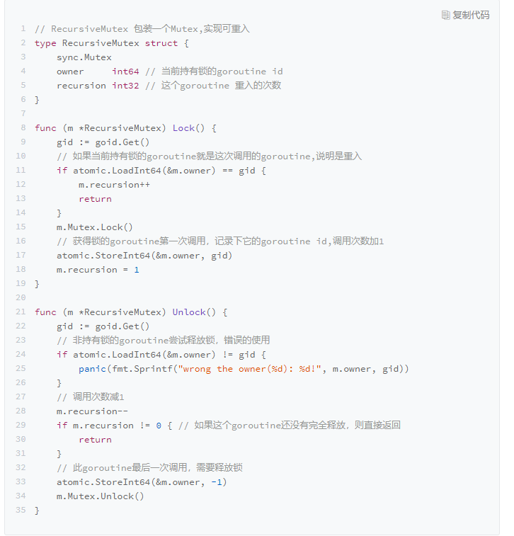

[toc]


# Go并发编程


互斥锁Mutex、读写锁RWMutex、并发编排WaitGroup、条件变量Cond、Channel等同步原语

适用场景：

- 共享资源：并发读写共享资源，会出现数据竞争（data race）的问题，所以需要Mutex、RWMutex
- 任务编排：需要goroutine按照一定的规律执行，而goroutine之间有相互等待或者依赖的顺序关系，需要使用WaitGroup或者Channel来实现
- 消息传递：信息交流以及不同的goroutine之间的线程安全的数据交流，常常使用Channel来实现


go语言的并发标准库是  sync


## 一、常用关键字

### （1）for、range


### （2）select


### （3）defer

defer会在当前函数返回前执行传入的函数，相当于java中的final代码块

被用于关闭文件描述符、关闭数据库链接以及解锁资源


1、作用域


defer传入的函数不是在退出代码块的作用域时执行的，只会在当前函数和方法返回之前被调用。


### （4）panic、recover

#### 1、panic

panic能改变程序的控制流，调用panic后会立刻停止执行当前函数的剩余代码，并在当前Goroutine中递归执行调用方的defer


#### 2、recover

recover可以中止panic造成的程序崩溃，是一个只能在defer中发挥作用的函数，在其它作用域中调用不会发挥作用


- `panic` 只会触发当前 Goroutine 的 `defer`；
- `recover` 只有在 `defer` 中调用才会生效；
- `panic` 允许在 `defer` 中嵌套多次调用；


### （5）make、new


- make是初始化内置的数据结构，例如切片、哈希表和channel
- new是根据传入的类型分配一片内存空间并返回指向这片内存空间的指针


## 二、Mutex

**不是可重入锁**

Mutex是Locker的实现类

```go
type Locker interface {
	Lock()
	Unlock()
}
```


互斥锁Mutex就提供了两个方法Lock和UnLock

例如：开启十个goroutine去对一个变量进行加1操作


```go
func test1()  {
	var count = 0

	var wg sync.WaitGroup

	wg.Add(10)

	var mutex sync.Mutex

	for i := 0; i < 10; i++ {
		go func() {
			defer wg.Done()
			for j := 0; j < 100000; j++ {
				mutex.Lock()
				count++
				mutex.Unlock()
			}
		}()
	}

	wg.Wait()

	fmt.Println(count)
}
```


使用Go race detector可以帮忙发现并发问题

使用方法：go run -race xxx.go，可在运行期发现问题

运行： go tool compile -race -S xxx.go， 可在编译器发现问题


Mutex一般会嵌入到其它struct中使用

```go
type Counter2 struct {
	mu sync.Mutex

	count uint64
}
```


也可以采用嵌入字段的方式：

```go
type Counter struct {
	sync.Mutex
	Count uint64
}
```

此时就可以在struct上直接调用Lock/Unlock方法

```go
func test2()  {
	var counter Counter
	var wg sync.WaitGroup

	wg.Add(10)

	for i := 0; i < 10; i++ {
		go func() {
			defer wg.Done()
			for j := 0; j < 10000; j++ {
				counter.Lock()
				counter.Count++
				counter.Unlock()
			}
		}()
	}

	wg.Wait()

	fmt.Println(counter.Count)

}
```


也可以通过struct中方法进行封装，用方法进行调用，而不是直接使用字段

```go
type Counter2 struct {
	mu sync.Mutex

	count uint64
}

func (c *Counter2) Incr() {
	c.mu.Lock()
	c.count++
	c.mu.Unlock()
}

func (c *Counter2) GetCount() uint64  {
	c.mu.Lock()

	defer c.mu.Unlock()

	return c.count
}
```


**可重入锁方案**

- 通过hacker的方式获取到goroutine id，记录下获取锁的goroutine id，可以实现Locker接口
- 调用Lock/Unlock方法时，由goroutine提供一个token，用来标识它自己，而不是通过hacker的方式获取到goroutine id，但是，这样就不满足Locker接口


（1）goroutine id

获取goroutine id，方式有两种，分别是简单方式和hacker方式


简单方式，就是通过runtime.Stack方法获取栈帧信息，栈帧里面包含goroutine id，

```go
func GoID() int {
	var buf [64]byte
	n := runtime.Stack(buf[:], false)
	//获取id字符串
	idField := strings.Fields(strings.TrimPrefix(string(buf[:n]),"goroutine "))[0]
	id, err := strconv.Atoi(idField)

	if err != nil {
		panic(fmt.Sprintf("cannot get goroutine id"))
	}

	return id
}
```


（2）hacker方式

首先，我们获取运行时的 g 指针，反解出对应的 g 的结构。每个运行的 goroutine 结构的 g 指针保存在当前 goroutine 的一个叫做 TLS 对象中。

第一步：我们先获取到 TLS 对象；

第二步：再从 TLS 中获取 goroutine 结构的 g 指针；

第三步：再从 g 指针中取出 goroutine id。


实现可重入锁：




**token**


**使用Mutex实现一个线程安全的队列：**

利用Mutex来保证线程安全

队列可通过Slice来实现


## 三、RWMutex

标准库中的RWMutex是一个reader/writer互斥锁。

在某一时刻只能由任意数量的reader持有，或者是只被单个的writer持有

方法：

- Lock/Unlock：写操作时调用的方法，如果锁已经被reader或者writer持有，那么Lock方法会一直阻塞，知道能获取到锁；Unlock则是配对的释放锁的方法
- RLock/RUnlock：读操作时调用的方法。如果锁已经被writer持有的话，RLock方法会一直阻塞，知道能获取到锁，否则就直接返回，而RUnlock是reader释放锁的方法
- RLocker：这个方法的作用是为读操作返回一个Locker接口的对象，它的Lock方法发会调用RWMutex的RLock方法 ，它的Unlock方法会调用RWMutex的RUnlock方法。


RWMutex的零值是未加锁的状态，所以，当使用的时候，无论是声明变量还是嵌入到其它struct中，都不必显式地初始化。


如果遇到可明确区分reader和writer goroutine地场景，且有大量地并发读、少量地并发写，并有强烈的性能需求，就可考虑使用RWMutex替换Mutex


RWMutex是基于Mutex实现的


**读写锁的设计实现分成三类：**

- Read-preferring：读优先可提供很高的并发量，但在竞争激烈的情况下可能会导致写饥饿，原因是如果有大量读，这种设计会导致只有所有的读都释放了锁之后，写才有可能获取到锁
- Write-preferring：写优先，如果已有一个writer在等待请求锁的话，会阻止新的reader获取到锁，优先保障writer。如果有一些reader已经请求了锁的话，新的writer也会等待已有的reader都释放锁之后才能获取。
- 不指定优先级


Go标准库中的RWMutex设计是Write-preferring方案，一个正在阻塞的Lock调用会排除新的reader请求到锁。


## 四、WaitGroup

相当于java的CountDownLatch或者是CyclicBarrier


三个方法：

- Add：设置WaitGroup的计数值
- Done：用来将WaitGroup的计数值减一，相当于Add(-1)，
- Wait：调用这个方法的goroutine会一直阻塞，直到计数值变为0


```go
import (
	"fmt"
	"sync"
)

type Counter3 struct {
	sync.Mutex
	counter uint64
}


func (c *Counter3) Incr () {
	c.Lock()
	defer c.Unlock()
	c.counter++
}

func (c *Counter3) Get() uint64 {
	c.Lock()
	defer c.Unlock()
	return c.counter
}

func work(c *Counter3 , wg *sync.WaitGroup) {
	defer wg.Done()
	c.Incr()
}


func main() {

	var c Counter3

	var wg sync.WaitGroup

	wg.Add(10)

	for i := 0; i < 10; i++ {
		go work(&c, &wg)
	}


	wg.Wait()

	fmt.Println(c.Get())


}
```


注意：

- 不重用 WaitGroup。新建一个 WaitGroup 不会带来多大的资源开销，重用反而更容易出错。
- 保证所有的 Add 方法调用都在 Wait 之前。
- 不传递负数给 Add 方法，只通过 Done 来给计数值减 1。
- 不做多余的 Done 方法调用，保证 Add 的计数值和 Done 方法调用的数量是一样的。
- 不遗漏 Done 方法的调用，否则会导致 Wait hang 住无法返回。


## 五、Cond

相当于java中的wait/notify/notifyAll

Cond 是和某个条件相关，这个条件需要一组 goroutine 协作共同完成，在条件还没有满足的时候，所有等待这个条件的 goroutine 都会被阻塞住，只有这一组 goroutine 通过协作达到了这个条件，等待的 goroutine 才可能继续进行下去。


**基本用法：**

- Signal：允许调用者 Caller 唤醒一个等待此 Cond 的 goroutine。如果此时没有等待的 goroutine，显然无需通知 waiter；如果 Cond 等待队列中有一个或者多个等待的 goroutine，则需要从等待队列中移除第一个 goroutine 并把它唤醒。在其他编程语言中，比如 Java 语言中，Signal 方法也被叫做 notify 方法。

  调用 Signal 方法时，不强求你一定要持有 c.L 的锁。

- Broadcast：，允许调用者 Caller 唤醒所有等待此 Cond 的 goroutine。如果此时没有等待的 goroutine，显然无需通知 waiter；如果 Cond 等待队列中有一个或者多个等待的 goroutine，则清空所有等待的 goroutine，并全部唤醒。在其他编程语言中，比如 Java 语言中，Broadcast 方法也被叫做 notifyAll 方法。

  不强求你一定要持有 c.L 的锁。

- Wait：，会把调用者 Caller 放入 Cond 的等待队列中并阻塞，直到被 Signal 或者 Broadcast 的方法从等待队列中移除并唤醒。

  必须要持有c.L的锁


```go
func add1(a *int64, c *sync.Cond)  {

	c.L.Lock()

	if *a % 2 == 0 {
		c.Wait()
	}

	atomic.AddInt64(a,1)
	fmt.Println("add1....d%",*a)

	c.L.Unlock()

	c.Signal()
}


func add2(a *int64, c *sync.Cond)  {
	c.L.Lock()

	if *a % 2 != 0 {
		c.Wait()
	}

	atomic.AddInt64(a,1)
	fmt.Println("add2....d%",*a)

	c.L.Unlock()

	c.Signal()

}

func main() {

	c := sync.NewCond(&sync.Mutex{})

	var a int64

	for a<10 {
		go add1(&a,c)
		go add2(&a,c)
	}


}
```


**注意：Wait调用需要加锁**


## 六、Once

Once可以用来执行且仅仅执行一次动作，常常用于单例对象的初始化场景

sync.Once 只暴露了一个方法 Do，你可以多次调用 Do 方法，但是只有第一次调用 Do 方法时 f 参数才会执行，这里的 f 是一个无参数无返回值的函数。

```go
func (o *Once) Do(f func())
```


## 七、Map

Go的内置对象Map是线程不安全的


**如何实现线程安全的map类型？**

避免map并发读写panic的方式之一就是加锁，考虑到读写性能，可以使用读写锁


```GO
type RWMap struct {
	sync.RWMutex
	m map[int]int
}

func NewRWMap(n int) *RWMap  {
	return &RWMap{
		m: make(map[int]int,n),
	}
}

func (m *RWMap) Get(k int) (int, bool) {
	m.RLock()
	defer m.RUnlock()
	v, existed := m.m[k]
	return v, existed
}

func (m *RWMap) Set(k, v int) {
	m.Lock()
	defer m.Unlock()
	m.m[k] = v
}

func (m *RWMap) Delete(k int)  {
	m.Lock()
	defer m.Unlock()
	delete(m.m,k)
}

func (m *RWMap) Each(f func(k, v int) bool) {
	m.RLock()
	defer m.RUnlock()
	for k, v := range m.m {
		if !f(k,v) {
			return
		}
	}
}
```


**分片加锁：更高效的并发map**

将一把锁分成几把锁，每个锁控制一个分片


**特殊场景的sync.Map**

使用场景：

- 只会增长的缓存系统中，一个key值写入一次而被读很多次
- 多个goroutine为不相交的键集读、写和重写键值对


## 七、Pool

go标准库中提供了一个通用的Pool数据结果，就是sync.Pool，使用它可以创建池化的对象


## sync.Pool

sync.Pool数据类型用来保存一组可独立访问的临时对象，它池化的对象会在未来的某个时候被垃圾回收掉


- sync.Pool本身就是线程安全的，多个goroutine可并发调用它的方法存取对象
- sync.Pool不可再使用之后再复制使用


方法：


#### （1）New

Pool struct 包含一个 New 字段，这个字段的类型是函数 func() interface{}。当调用 Pool 的 Get 方法从池中获取元素，没有更多的空闲元素可返回时，就会调用这个 New 方法来创建新的元素。如果你没有设置 New 字段，没有更多的空闲元素可返回时，Get 方法将返回 nil，表明当前没有可用的元素。

New是可变的字段，可在程序运行的时候改变创建元素的方法


#### （2）Get

如果调用这个方法，就会从Pool取走一个元素，这也就意味着，这个元素会从 Pool 中移除，返回给调用者。不过，除了返回值是正常实例化的元素，Get 方法的返回值还可能会是一个 nil（Pool.New 字段没有设置，又没有空闲元素可以返回），所以你在使用的时候，可能需要判断。


#### （3）Put

这个方法用于将一个元素返还给 Pool，Pool 会把这个元素保存到池中，并且可以复用。但如果 Put 一个 nil 值，Pool 就会忽略这个值。


```go
var buffers = sync.Pool{
	New: func() interface{} {
		return new(bytes.Buffer)
	},
}

func GetBuffer() *bytes.Buffer {
	return buffers.Get().(*bytes.Buffer)
}

func PutBuffer(buf *bytes.Buffer) {
	buf.Reset()
	buffers.Put(buf)
}
```


#### 第三方库


##### （1）bytebufferpool

基本功能和sync.Pool相同，底层使用sync.Pool实现


##### （2）oxtoacart/bpool

这也是比较常用的 buffer 池，它提供了以下几种类型的 buffer。

bpool.BufferPool： 提供一个固定元素数量的 buffer 池，元素类型是 bytes.Buffer，如果超过这个数量，Put 的时候就丢弃，如果池中的元素都被取光了，会新建一个返回。Put 回去的时候，不会检测 buffer 的大小。

bpool.BytesPool：提供一个固定元素数量的 byte slice 池，元素类型是 byte slice。Put 回去的时候不检测 slice 的大小。

bpool.SizedBufferPool： 提供一个固定元素数量的 buffer 池，如果超过这个数量，Put 的时候就丢弃，如果池中的元素都被取光了，会新建一个返回。Put 回去的时候，会检测 buffer 的大小，超过指定的大小的话，就会创建一个新的满足条件的 buffer 放回去。


bpool 最大的特色就是能够保持池子中元素的数量，一旦 Put 的数量多于它的阈值，就会自动丢弃，而 sync.Pool 是一个没有限制的池子，只要 Put 就会收进去。

bpool 是基于 Channel 实现的，不像 sync.Pool 为了提高性能而做了很多优化，所以，在性能上比不过 sync.Pool。不过，它提供了限制 Pool 容量的功能，所以，如果你想控制 Pool 的容量的话，可以考虑这个库。


#### **连接池**


##### （1）标准库中的http client池

http.Client 实现连接池的代码是在 Transport 类型中，它使用 idleConn 保存持久化的可重用的长连接：


##### （2）TCP连接池

fatih/pool


##### （3）数据库连接池

标准库 sql.DB 还提供了一个通用的数据库的连接池，通过 MaxOpenConns 和 MaxIdleConns 控制最大的连接数和最大的 idle 的连接数。默认的 MaxIdleConns 是 2，这个数对于数据库相关的应用来说太小了，我们一般都会调整它。


##### （4）Memcached Client连接池

gomemcache Client 有一个 freeconn 的字段，用来保存空闲的连接。当一个请求使用完之后，它会调用 putFreeConn 放回到池子中，请求的时候，调用 getFreeConn 优先查询 freeConn 中是否有可用的连接。它采用 Mutex+Slice 实现 Pool：


##### （5）Worker Pool

一个 goroutine 初始的栈大小是 2048 个字节，并且在需要的时候可以扩展到 1GB


大部分的 Worker Pool 都是通过 Channel 来缓存任务的，因为 Channel 能够比较方便地实现并发的保护，有的是多个 Worker 共享同一个任务 Channel，有些是每个 Worker 都有一个独立的 Channel。


- gammazero/workerpool 可以无限制地提交任务，提供了更便利的 Submit 和 SubmitWait 方法提交任务，还可以提供当前的 worker 数和任务数以及关闭 Pool 的功能。
- grpool 创建 Pool 的时候需要提供 Worker 的数量和等待执行的任务的最大数量，任务的提交是直接往 Channel 放入任务。
- dpaks/goworkers 提供了更便利的 Submi 方法提交任务以及 Worker 数、任务数等查询方法、关闭 Pool 的方法。它的任务的执行结果需要在 ResultChan 和 ErrChan 中去获取，没有提供阻塞的方法，但是它可以在初始化的时候设置 Worker 的数量和任务数。

