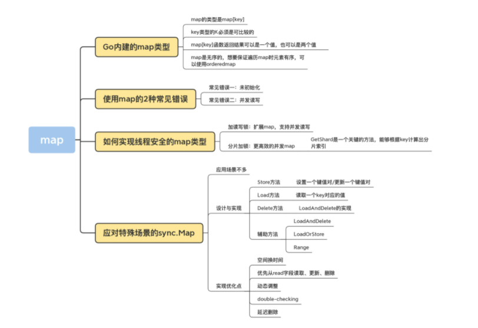
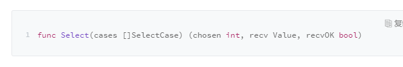

[toc]


# Go并发编程


互斥锁Mutex、读写锁RWMutex、并发编排WaitGroup、条件变量Cond、Channel等同步原语

适用场景：

- 共享资源：并发读写共享资源，会出现数据竞争（data race）的问题，所以需要Mutex、RWMutex
- 任务编排：需要goroutine按照一定的规律执行，而goroutine之间有相互等待或者依赖的顺序关系，需要使用WaitGroup或者Channel来实现
- 消息传递：信息交流以及不同的goroutine之间的线程安全的数据交流，常常使用Channel来实现


go语言的并发标准库是  sync


## 一、常用关键字

### （1）for、range


### （2）select

**Go 语言的 `select` 与操作系统中的 `select` 比较相似**

Go 语言中的 `select` 也能够让 Goroutine 同时等待多个 Channel 可读或者可写，在多个文件或者 Channel状态改变之前，`select` 会一直阻塞当前线程或者 Goroutine。


当我们在 Go 语言中使用 `select` 控制结构时，会遇到两个有趣的现象：

1. `select` 能在 Channel 上进行非阻塞的收发操作；
2. `select` 在遇到多个 Channel 同时响应时，会随机执行一种情况；

这两个现象是学习 `select` 时经常会遇到的，我们来深入了解具体场景并分析这两个现象背后的设计原理。


### 非阻塞的收发 [#](https://draveness.me/golang/docs/part2-foundation/ch05-keyword/golang-select/#非阻塞的收发)

在通常情况下，`select` 语句会阻塞当前 Goroutine 并等待多个 Channel 中的一个达到可以收发的状态。但是如果 `select` 控制结构中包含 `default` 语句，那么这个 `select` 语句在执行时会遇到以下两种情况：

1. 当存在可以收发的 Channel 时，直接处理该 Channel 对应的 `case`；
2. 当不存在可以收发的 Channel 时，执行 `default` 中的语句；

当我们运行下面的代码时就不会阻塞当前的 Goroutine，它会直接执行 `default` 中的代码。

```go
func main() {
	ch := make(chan int)
	select {
	case i := <-ch:
		println(i)

	default:
		println("default")
	}
}

$ go run main.go
default
```


### 随机执行 [#](https://draveness.me/golang/docs/part2-foundation/ch05-keyword/golang-select/#随机执行)

另一个使用 `select` 遇到的情况是同时有多个 `case` 就绪时，`select` 会选择哪个 `case` 执行的问题，我们通过下面的代码可以简单了解一下：

```go
func main() {
	ch := make(chan int)
	go func() {
		for range time.Tick(1 * time.Second) {
			ch <- 0
		}
	}()

	for {
		select {
		case <-ch:
			println("case1")
		case <-ch:
			println("case2")
		}
	}
}

$ go run main.go
case1
case2
case1
...
```

从上述代码输出的结果中我们可以看到，`select` 在遇到多个 `<-ch` 同时满足可读或者可写条件时会随机选择一个 `case` 执行其中的代码。

这个设计是在十多年前被 [select](https://github.com/golang/go/commit/cb9b1038db77198c2b0961634cf161258af2374d) 提交[5](https://draveness.me/golang/docs/part2-foundation/ch05-keyword/golang-select/#fn:5)引入并一直保留到现在的，虽然中间经历过一些修改[6](https://draveness.me/golang/docs/part2-foundation/ch05-keyword/golang-select/#fn:6)，但是语义一直都没有改变。在上面的代码中，两个 `case` 都是同时满足执行条件的，如果我们按照顺序依次判断，那么后面的条件永远都会得不到执行，而随机的引入就是为了避免饥饿问题的发生。


### （3）defer

defer会在当前函数返回前执行传入的函数，相当于java中的final代码块

被用于关闭文件描述符、关闭数据库链接以及解锁资源


1、作用域


defer传入的函数不是在退出代码块的作用域时执行的，只会在当前函数和方法返回之前被调用。


### （4）panic、recover

#### 1、panic

panic能改变程序的控制流，调用panic后会立刻停止执行当前函数的剩余代码，并在当前Goroutine中递归执行调用方的defer


#### 2、recover

recover可以中止panic造成的程序崩溃，是一个只能在defer中发挥作用的函数，在其它作用域中调用不会发挥作用


- `panic` 只会触发当前 Goroutine 的 `defer`；
- `recover` 只有在 `defer` 中调用才会生效；
- `panic` 允许在 `defer` 中嵌套多次调用；


### （5）make、new


- make是初始化内置的数据结构，例如切片、哈希表和channel
- new是根据传入的类型分配一片内存空间并返回指向这片内存空间的指针


## 二、Mutex

**不是可重入锁**

Mutex是Locker的实现类

```go
type Locker interface {
	Lock()
	Unlock()
}
```


互斥锁Mutex就提供了两个方法Lock和UnLock

例如：开启十个goroutine去对一个变量进行加1操作


```go
func test1()  {
	var count = 0

	var wg sync.WaitGroup

	wg.Add(10)

	var mutex sync.Mutex

	for i := 0; i < 10; i++ {
		go func() {
			defer wg.Done()
			for j := 0; j < 100000; j++ {
				mutex.Lock()
				count++
				mutex.Unlock()
			}
		}()
	}

	wg.Wait()

	fmt.Println(count)
}
```


使用Go race detector可以帮忙发现并发问题

使用方法：go run -race xxx.go，可在运行期发现问题

运行： go tool compile -race -S xxx.go， 可在编译器发现问题


Mutex一般会嵌入到其它struct中使用

```go
type Counter2 struct {
	mu sync.Mutex

	count uint64
}
```


也可以采用嵌入字段的方式：

```go
type Counter struct {
	sync.Mutex
	Count uint64
}
```

此时就可以在struct上直接调用Lock/Unlock方法

```go
func test2()  {
	var counter Counter
	var wg sync.WaitGroup

	wg.Add(10)

	for i := 0; i < 10; i++ {
		go func() {
			defer wg.Done()
			for j := 0; j < 10000; j++ {
				counter.Lock()
				counter.Count++
				counter.Unlock()
			}
		}()
	}

	wg.Wait()

	fmt.Println(counter.Count)

}
```


也可以通过struct中方法进行封装，用方法进行调用，而不是直接使用字段

```go
type Counter2 struct {
	mu sync.Mutex

	count uint64
}

func (c *Counter2) Incr() {
	c.mu.Lock()
	c.count++
	c.mu.Unlock()
}

func (c *Counter2) GetCount() uint64  {
	c.mu.Lock()

	defer c.mu.Unlock()

	return c.count
}
```


**可重入锁方案**

- 通过hacker的方式获取到goroutine id，记录下获取锁的goroutine id，可以实现Locker接口
- 调用Lock/Unlock方法时，由goroutine提供一个token，用来标识它自己，而不是通过hacker的方式获取到goroutine id，但是，这样就不满足Locker接口


（1）goroutine id

获取goroutine id，方式有两种，分别是简单方式和hacker方式


简单方式，就是通过runtime.Stack方法获取栈帧信息，栈帧里面包含goroutine id，

```go
func GoID() int {
	var buf [64]byte
	n := runtime.Stack(buf[:], false)
	//获取id字符串
	idField := strings.Fields(strings.TrimPrefix(string(buf[:n]),"goroutine "))[0]
	id, err := strconv.Atoi(idField)

	if err != nil {
		panic(fmt.Sprintf("cannot get goroutine id"))
	}

	return id
}
```


（2）hacker方式

首先，我们获取运行时的 g 指针，反解出对应的 g 的结构。每个运行的 goroutine 结构的 g 指针保存在当前 goroutine 的一个叫做 TLS 对象中。

第一步：我们先获取到 TLS 对象；

第二步：再从 TLS 中获取 goroutine 结构的 g 指针；

第三步：再从 g 指针中取出 goroutine id。


实现可重入锁：


**token**


**使用Mutex实现一个线程安全的队列：**

利用Mutex来保证线程安全

队列可通过Slice来实现


## 三、RWMutex

标准库中的RWMutex是一个reader/writer互斥锁。

在某一时刻只能由任意数量的reader持有，或者是只被单个的writer持有

方法：

- Lock/Unlock：写操作时调用的方法，如果锁已经被reader或者writer持有，那么Lock方法会一直阻塞，知道能获取到锁；Unlock则是配对的释放锁的方法
- RLock/RUnlock：读操作时调用的方法。如果锁已经被writer持有的话，RLock方法会一直阻塞，知道能获取到锁，否则就直接返回，而RUnlock是reader释放锁的方法
- RLocker：这个方法的作用是为读操作返回一个Locker接口的对象，它的Lock方法发会调用RWMutex的RLock方法 ，它的Unlock方法会调用RWMutex的RUnlock方法。


RWMutex的零值是未加锁的状态，所以，当使用的时候，无论是声明变量还是嵌入到其它struct中，都不必显式地初始化。


如果遇到可明确区分reader和writer goroutine地场景，且有大量地并发读、少量地并发写，并有强烈的性能需求，就可考虑使用RWMutex替换Mutex


RWMutex是基于Mutex实现的


**读写锁的设计实现分成三类：**

- Read-preferring：读优先可提供很高的并发量，但在竞争激烈的情况下可能会导致写饥饿，原因是如果有大量读，这种设计会导致只有所有的读都释放了锁之后，写才有可能获取到锁
- Write-preferring：写优先，如果已有一个writer在等待请求锁的话，会阻止新的reader获取到锁，优先保障writer。如果有一些reader已经请求了锁的话，新的writer也会等待已有的reader都释放锁之后才能获取。
- 不指定优先级


Go标准库中的RWMutex设计是Write-preferring方案，一个正在阻塞的Lock调用会排除新的reader请求到锁。


## 四、WaitGroup

相当于java的CountDownLatch或者是CyclicBarrier


三个方法：

- Add：设置WaitGroup的计数值
- Done：用来将WaitGroup的计数值减一，相当于Add(-1)，
- Wait：调用这个方法的goroutine会一直阻塞，直到计数值变为0


```go
import (
	"fmt"
	"sync"
)

type Counter3 struct {
	sync.Mutex
	counter uint64
}


func (c *Counter3) Incr () {
	c.Lock()
	defer c.Unlock()
	c.counter++
}

func (c *Counter3) Get() uint64 {
	c.Lock()
	defer c.Unlock()
	return c.counter
}

func work(c *Counter3 , wg *sync.WaitGroup) {
	defer wg.Done()
	c.Incr()
}


func main() {

	var c Counter3

	var wg sync.WaitGroup

	wg.Add(10)

	for i := 0; i < 10; i++ {
		go work(&c, &wg)
	}


	wg.Wait()

	fmt.Println(c.Get())


}
```


注意：

- 不重用 WaitGroup。新建一个 WaitGroup 不会带来多大的资源开销，重用反而更容易出错。
- 保证所有的 Add 方法调用都在 Wait 之前。
- 不传递负数给 Add 方法，只通过 Done 来给计数值减 1。
- 不做多余的 Done 方法调用，保证 Add 的计数值和 Done 方法调用的数量是一样的。
- 不遗漏 Done 方法的调用，否则会导致 Wait hang 住无法返回。


## 五、Cond

相当于java中的wait/notify/notifyAll

Cond 是和某个条件相关，这个条件需要一组 goroutine 协作共同完成，在条件还没有满足的时候，所有等待这个条件的 goroutine 都会被阻塞住，只有这一组 goroutine 通过协作达到了这个条件，等待的 goroutine 才可能继续进行下去。


**基本用法：**

- Signal：允许调用者 Caller 唤醒一个等待此 Cond 的 goroutine。如果此时没有等待的 goroutine，显然无需通知 waiter；如果 Cond 等待队列中有一个或者多个等待的 goroutine，则需要从等待队列中移除第一个 goroutine 并把它唤醒。在其他编程语言中，比如 Java 语言中，Signal 方法也被叫做 notify 方法。

  调用 Signal 方法时，不强求你一定要持有 c.L 的锁。

- Broadcast：，允许调用者 Caller 唤醒所有等待此 Cond 的 goroutine。如果此时没有等待的 goroutine，显然无需通知 waiter；如果 Cond 等待队列中有一个或者多个等待的 goroutine，则清空所有等待的 goroutine，并全部唤醒。在其他编程语言中，比如 Java 语言中，Broadcast 方法也被叫做 notifyAll 方法。

  不强求你一定要持有 c.L 的锁。

- Wait：，会把调用者 Caller 放入 Cond 的等待队列中并阻塞，直到被 Signal 或者 Broadcast 的方法从等待队列中移除并唤醒。

  必须要持有c.L的锁


```go
func add1(a *int64, c *sync.Cond)  {

	c.L.Lock()

	if *a % 2 == 0 {
		c.Wait()
	}

	atomic.AddInt64(a,1)
	fmt.Println("add1....d%",*a)

	c.L.Unlock()

	c.Signal()
}


func add2(a *int64, c *sync.Cond)  {
	c.L.Lock()

	if *a % 2 != 0 {
		c.Wait()
	}

	atomic.AddInt64(a,1)
	fmt.Println("add2....d%",*a)

	c.L.Unlock()

	c.Signal()

}

func main() {

	c := sync.NewCond(&sync.Mutex{})

	var a int64

	for a<10 {
		go add1(&a,c)
		go add2(&a,c)
	}


}
```


**注意：Wait调用需要加锁**


## 六、Once

Once可以用来执行且仅仅执行一次动作，常常用于单例对象的初始化场景

sync.Once 只暴露了一个方法 Do，你可以多次调用 Do 方法，但是只有第一次调用 Do 方法时 f 参数才会执行，这里的 f 是一个无参数无返回值的函数。

```go
func (o *Once) Do(f func())
```


## 七、Map

Go的内置对象Map是线程不安全的


**如何实现线程安全的map类型？**

避免map并发读写panic的方式之一就是加锁，考虑到读写性能，可以使用读写锁


```GO
type RWMap struct {
	sync.RWMutex
	m map[int]int
}

func NewRWMap(n int) *RWMap  {
	return &RWMap{
		m: make(map[int]int,n),
	}
}

func (m *RWMap) Get(k int) (int, bool) {
	m.RLock()
	defer m.RUnlock()
	v, existed := m.m[k]
	return v, existed
}

func (m *RWMap) Set(k, v int) {
	m.Lock()
	defer m.Unlock()
	m.m[k] = v
}

func (m *RWMap) Delete(k int)  {
	m.Lock()
	defer m.Unlock()
	delete(m.m,k)
}

func (m *RWMap) Each(f func(k, v int) bool) {
	m.RLock()
	defer m.RUnlock()
	for k, v := range m.m {
		if !f(k,v) {
			return
		}
	}
}
```


**分片加锁：更高效的并发map**

将一把锁分成几把锁，每个锁控制一个分片


**特殊场景的sync.Map**

使用场景：

- 只会增长的缓存系统中，一个key值写入一次而被读很多次
- 多个goroutine为不相交的键集读、写和重写键值对





## 八、Pool

go标准库中提供了一个通用的Pool数据结果，就是sync.Pool，使用它可以创建池化的对象


### sync.Pool

sync.Pool数据类型用来保存一组可独立访问的临时对象，它池化的对象会在未来的某个时候被垃圾回收掉


- sync.Pool本身就是线程安全的，多个goroutine可并发调用它的方法存取对象
- sync.Pool不可再使用之后再复制使用


方法：


#### （1）New

Pool struct 包含一个 New 字段，这个字段的类型是函数 func() interface{}。当调用 Pool 的 Get 方法从池中获取元素，没有更多的空闲元素可返回时，就会调用这个 New 方法来创建新的元素。如果你没有设置 New 字段，没有更多的空闲元素可返回时，Get 方法将返回 nil，表明当前没有可用的元素。

New是可变的字段，可在程序运行的时候改变创建元素的方法


#### （2）Get

如果调用这个方法，就会从Pool取走一个元素，这也就意味着，这个元素会从 Pool 中移除，返回给调用者。不过，除了返回值是正常实例化的元素，Get 方法的返回值还可能会是一个 nil（Pool.New 字段没有设置，又没有空闲元素可以返回），所以你在使用的时候，可能需要判断。


#### （3）Put

这个方法用于将一个元素返还给 Pool，Pool 会把这个元素保存到池中，并且可以复用。但如果 Put 一个 nil 值，Pool 就会忽略这个值。


```go
var buffers = sync.Pool{
	New: func() interface{} {
		return new(bytes.Buffer)
	},
}

func GetBuffer() *bytes.Buffer {
	return buffers.Get().(*bytes.Buffer)
}

func PutBuffer(buf *bytes.Buffer) {
	buf.Reset()
	buffers.Put(buf)
}
```


#### 第三方库


##### （1）bytebufferpool

基本功能和sync.Pool相同，底层使用sync.Pool实现


##### （2）oxtoacart/bpool

这也是比较常用的 buffer 池，它提供了以下几种类型的 buffer。

bpool.BufferPool： 提供一个固定元素数量的 buffer 池，元素类型是 bytes.Buffer，如果超过这个数量，Put 的时候就丢弃，如果池中的元素都被取光了，会新建一个返回。Put 回去的时候，不会检测 buffer 的大小。

bpool.BytesPool：提供一个固定元素数量的 byte slice 池，元素类型是 byte slice。Put 回去的时候不检测 slice 的大小。

bpool.SizedBufferPool： 提供一个固定元素数量的 buffer 池，如果超过这个数量，Put 的时候就丢弃，如果池中的元素都被取光了，会新建一个返回。Put 回去的时候，会检测 buffer 的大小，超过指定的大小的话，就会创建一个新的满足条件的 buffer 放回去。


bpool 最大的特色就是能够保持池子中元素的数量，一旦 Put 的数量多于它的阈值，就会自动丢弃，而 sync.Pool 是一个没有限制的池子，只要 Put 就会收进去。

bpool 是基于 Channel 实现的，不像 sync.Pool 为了提高性能而做了很多优化，所以，在性能上比不过 sync.Pool。不过，它提供了限制 Pool 容量的功能，所以，如果你想控制 Pool 的容量的话，可以考虑这个库。


#### **连接池**


##### （1）标准库中的http client池

http.Client 实现连接池的代码是在 Transport 类型中，它使用 idleConn 保存持久化的可重用的长连接：


##### （2）TCP连接池

fatih/pool


##### （3）数据库连接池

标准库 sql.DB 还提供了一个通用的数据库的连接池，通过 MaxOpenConns 和 MaxIdleConns 控制最大的连接数和最大的 idle 的连接数。默认的 MaxIdleConns 是 2，这个数对于数据库相关的应用来说太小了，我们一般都会调整它。


##### （4）Memcached Client连接池

gomemcache Client 有一个 freeconn 的字段，用来保存空闲的连接。当一个请求使用完之后，它会调用 putFreeConn 放回到池子中，请求的时候，调用 getFreeConn 优先查询 freeConn 中是否有可用的连接。它采用 Mutex+Slice 实现 Pool：


##### （5）Worker Pool

一个 goroutine 初始的栈大小是 2048 个字节，并且在需要的时候可以扩展到 1GB


大部分的 Worker Pool 都是通过 Channel 来缓存任务的，因为 Channel 能够比较方便地实现并发的保护，有的是多个 Worker 共享同一个任务 Channel，有些是每个 Worker 都有一个独立的 Channel。


- gammazero/workerpool 可以无限制地提交任务，提供了更便利的 Submit 和 SubmitWait 方法提交任务，还可以提供当前的 worker 数和任务数以及关闭 Pool 的功能。
- grpool 创建 Pool 的时候需要提供 Worker 的数量和等待执行的任务的最大数量，任务的提交是直接往 Channel 放入任务。
- dpaks/goworkers 提供了更便利的 Submi 方法提交任务以及 Worker 数、任务数等查询方法、关闭 Pool 的方法。它的任务的执行结果需要在 ResultChan 和 ErrChan 中去获取，没有提供阻塞的方法，但是它可以在初始化的时候设置 Worker 的数量和任务数。


## 九、Context


使用场景：

- 上下文信息传递，比如处理http请求、在请求处理链路上传递信息
- 控制子goroutine的运行
- 超时控制的方法调用
- 可以取消的方法调用


方法：

**（1）DeadLine**

返回这个Context被取消的截至日期，如果没有设置截止日期，ok的值是false，后续每次调用这个对象的Deadline方法时，都会返回和第一次调用相同的结果


**（2）Done**

 返回一个 Channel 对象。在 Context 被取消时，此 Channel 会被 close，如果没被取消，可能会返回 nil。后续的 Done 调用总是返回相同的结果。当 Done 被 close 的时候，你可以通过 ctx.Err 获取错误信息。Done 这个方法名其实起得并不好，因为名字太过笼统，不能明确反映 Done 被 close 的原因，因为 cancel、timeout、deadline 都可能导致 Done 被 close，不过，目前还没有一个更合适的方法名称。

关于 Done 方法，你必须要记住的知识点就是：如果 Done 没有被 close，Err 方法返回 nil；如果 Done 被 close，Err 方法会返回 Done 被 close 的原因。


**（3）Value**

Context中实现了2个常用的生成顶层Context的方法：

- context.Background()：返回一个非 nil 的、空的 Context，没有任何值，不会被 cancel，不会超时，没有截止日期。一般用在主函数、初始化、测试以及创建根 Context 的时候。
- context.TODO()：返回一个非 nil 的、空的 Context，没有任何值，不会被 cancel，不会超时，没有截止日期。当你不清楚是否该用 Context，或者目前还不知道要传递一些什么上下文信息的时候，就可以使用这个方法。


在使用Context的时候，有一些约定俗成的规则：

- 一般函数使用 Context 的时候，会把这个参数放在第一个参数的位置。
- 从来不把 nil 当做 Context 类型的参数值，可以使用 context.Background() 创建一个空的上下文对象，也不要使用 nil。
- Context 只用来临时做函数之间的上下文透传，不能持久化 Context 或者把 Context 长久保存。把 Context 持久化到数据库、本地文件或者全局变量、缓存中都是错误的用法。
- key 的类型不应该是字符串类型或者其它内建类型，否则容易在包之间使用 Context 时候产生冲突。使用 WithValue 时，key 的类型应该是自己定义的类型。
- 常常使用 struct{}作为底层类型定义 key 的类型。对于 exported key 的静态类型，常常是接口或者指针。这样可以尽量减少内存分配。


**创建特殊用法Context的方法：**

WithValue、WithCancel、WithTimeout、WithDeadline


（1）WithValue

WithValue 基于 parent Context 生成一个新的 Context，保存了一个 key-value 键值对。它常常用来传递上下文。

WithValue 方法其实是创建了一个类型为 valueCtx 的 Context，它的类型定义如下：


它持有一个 key-value 键值对，还持有 parent 的 Context。它覆盖了 Value 方法，优先从自己的存储中检查这个 key，不存在的话会从 parent 中继续检查。


（2）WithCancel

WithCancel方法返回parent的副本，只是副本中的Done Channel是新建的对象，它的类型是cancelCtx

在一些需要主动取消长时间的任务时，创建这种类型的 Context，然后把这个 Context 传给长时间执行任务的 goroutine。当需要中止任务时，我们就可以 cancel 这个 Context，这样长时间执行任务的 goroutine，就可以通过检查这个 Context，知道 Context 已经被取消了。

WithCancel 返回值中的第二个值是一个 cancel 函数。其实，这个返回值的名称（cancel）和类型（Cancel）也非常迷惑人。

只要任务正常完成了，就需要调用cancel，这样Context才能释放它的资源


（3）WithTimeout

WithTimeout 其实是和 WithDeadline 一样，只不过一个参数是超时时间，一个参数是截止时间。超时时间加上当前时间，其实就是截止时间，因此，WithTimeout 的实现是：


（4）WithDeadline

WithDeadline会返回一个parent的副本，并且设置了一个不晚于参数d的截止时间，类型为timerCtx

如果它的截止时间晚于 parent 的截止时间，那么就以 parent 的截止时间为准，并返回一个类型为 cancelCtx 的 Context，因为 parent 的截止时间到了，就会取消这个 cancelCtx。

如果当前时间已经超过了截止时间，就直接返回一个已经被 cancel 的 timerCtx。否则就会启动一个定时器，到截止时间取消这个 timerCtx。


综合起来，timerCtx 的 Done 被 Close 掉，主要是由下面的某个事件触发的：

- 截止时间到了
- cancel函数被调用
- parent的Done被close


和cancelCtx一样，WithDeadline（WithTimeout）返回的cancel一定要调用，并且要尽可能早地被调用，不要单纯地依赖截止时间被动取消，


## 十、Channel


### 1、应用场景

（1）数据交流：当作并发的buffer或者queue，解决生产者-消费者问题，多个goroutine可以并发当作生产者和消费者

（2）数据传递：一个goroutine将数据交给另一个goroutine，相当于把数据的拥有权托付出去

（3）信号通知：一个goroutine可以将信号传递给另一个或组goroutine

（4）任务编排：可以让一组goroutine按照一定的顺序并发或串行执行

（5）锁：利用Channel可以实现互斥锁的机制


### 2、基本用法

只能接收、只能发送、既可以接收又可以发送

例如：

```go
chan string //可以发送接收string
chan <- struct{}  //只能发送struct{}
<-chan int //只能从chan接收int
```


通过make，可以初始化chan，未初始化的chan的零值是nil，可以设置它的容量，设置了容量的chan叫做buffered chan；如果没有设置，容量为0，叫做unbuffered chan

```go
make(chan int, 100)
```


如果chan中还有数据，接收数据就不会阻塞，如果chan中数据已满，那么发送数据就会阻塞

unbuffered chan只有读写都准备好之后才不会阻塞


nil是chan的零值，是一种特殊的chan，对值是nil的chan的发送接收调用者总是会阻塞


（1）发送数据

例如：

```go
ch <- 2000
```


（2）接收数据

例如：

```go
v := <-ch
```


接收数据时，还可以返回两个值。第一个值是返回的 chan 中的元素，很多人不太熟悉的是第二个值。第二个值是 bool 类型，代表是否成功地从 chan 中读取到一个值，如果第二个参数是 false，chan 已经被 close 而且 chan 中没有缓存的数据，这个时候，第一个值是零值。所以，如果从 chan 读取到一个零值，可能是 sender 真正发送的零值，也可能是 closed 的并且没有缓存元素产生的零值。


（2）其它操作

Go 内建的函数 close、cap、len 都可以操作 chan 类型：close 会把 chan 关闭掉，cap 返回 chan 的容量，len 返回 chan 中缓存的还未被取走的元素数量。


send和recv都可以作为select语句的case clause，例如：

```go
func main() {

	ch := make(chan int, 10)

	for i := 0; i < 10; i++ {
		select {
		case ch <- i:
		case v:= <-ch:
			fmt.Println(v)
		}
	}


}
```


### 3、产生panic的情况

（1）close为nil的chan

（2）send已经close的chan

（3）close已经close的chan


### 4、经验

（1）共享资源的并发访问使用传统并发原语

（2）复杂的任务编排和消息传递使用channel

（3）消息通知机制使用channel，除非只想signal一个goroutine，才使用cond

（4）简单等待所有任务的完成用WaitGroup，也可以使用Channel

（5）需要和Select语句结合，使用Channel

（6）需要和超时配合时，使用Channel和Context


有一道经典的使用 Channel 进行任务编排的题，你可以尝试做一下：有四个 goroutine，编号为 1、2、3、4。每秒钟会有一个 goroutine 打印出它自己的编号，要求你编写一个程序，让输出的编号总是按照 1、2、3、4、1、2、3、4、……的顺序打印出来。


```go
func main() {
	ch1 := make(chan int)
	ch2 := make(chan int)
	ch3 := make(chan int)
	ch4 := make(chan int)
	go func() {
		for {
			fmt.Println("I'm goroutine 1")
			time.Sleep(1 * time.Second)
			ch2 <- 1 //I'm done, you turn
			<-ch1
		}
	}()
	go func() {
		for {
			<-ch2
			fmt.Println("I'm goroutine 2")
			time.Sleep(1 * time.Second)
			ch3 <-1
		}
	}()
	go func() {
		for {
			<-ch3
			fmt.Println("I'm goroutine 3")
			time.Sleep(1 * time.Second)
			ch4 <-1
		}
	}()
	go func() {
		for {
			<-ch4
			fmt.Println("I'm goroutine 4")
			time.Sleep(1 * time.Second)
			ch1 <-1}
	}()
	select {}
}
```


### 5、应用模式

#### （1）使用反射操作Channel

select语句可以处理chan的send和recv，都可以作为case clause，如果同时处理两个chan


如果需要处理三个，只需在添加一个case clause

如果需要处理n个呢

这个就需要用到反射大法了

通过reflect.Select函数，可以将一组运行时的case clause传入，当做参数执行。Go的select是伪随机的，可以在执行的case中随机选择一个case，并把选择的这个case的索引返回，如果没有可用的case返回，会返回一个bool类型的返回值，这个返回值用来标识是否有case成功被选择，如果是recv case，还会返回接收的元素，




动态处理多个chan的情况


首先，createCases 函数分别为每个 chan 生成了 recv case 和 send case，并返回一个 reflect.SelectCase 数组。

然后，通过一个循环 10 次的 for 循环执行 reflect.Select，这个方法会从 cases 中选择一个 case 执行。第一次肯定是 send case，因为此时 chan 还没有元素，recv 还不可用。等 chan 中有了数据以后，recv case 就可以被选择了。这样，你就可以处理不定数量的 chan 了。


```go
func main() {
	var ch1 = make(chan int, 10)
	var ch2 = make(chan int, 10)

	var cases = createCases(ch1,ch2)

	for i := 0; i < 10; i++ {
		chosen, recv, ok := reflect.Select(cases)

		if recv.IsValid() {
			fmt.Println("recv:", cases[chosen].Dir, recv, ok)
		} else {
			fmt.Println("send:", cases[chosen].Dir, ok)
		}
	}
}

func createCases(chs ...chan int) []reflect.SelectCase {
	var cases []reflect.SelectCase

	// 创建recv case
	for _,ch := range chs {
		cases = append(cases,reflect.SelectCase{
			Dir: reflect.SelectRecv,
			Chan: reflect.ValueOf(ch),
		})
	}

	//创建send case
	for i, ch := range chs {
		v := reflect.ValueOf(i)
		cases = append(cases,reflect.SelectCase{
			Dir: reflect.SelectSend,
			Chan: reflect.ValueOf(ch),
			Send: v,
		})
	}
	
	return cases
}
```


#### （2）消息交流

从chan的内部实现看，它是以一个循环队列的方式存放数据，所以，有时候也会被当成线程安全的队列和buffer使用，一个goroutine可以安全的往channel中塞数据，另外一个goroutine可以安全的从channel中读取数据，goroutine就可以安全的实现信息交流。


#### （3）数据传递

有 4 个 goroutine，编号为 1、2、3、4。每秒钟会有一个 goroutine 打印出它自己的编号，要求你编写程序，让输出的编号总是按照 1、2、3、4、1、2、3、4……这个顺序打印出来。


为了实现顺序的数据传递，可以定义一个令牌的变量，谁得到令牌就可以打印一次编号，同时将令牌传递给下一个goroutine，

```go
type Token struct{}


func newWorker(id int, ch chan Token, nextCh chan Token) {
    for {
        token := <-ch
        fmt.println((id+1))
        time.Sleep(time.Second)
        nextCh <- token
    }
    
}


func main() {
    chs := []chan Token{make(chan Token),make(chan Token),make(chan Token),make(chan Token)}
    
    for i:=0;i<4;i++ {
        go newWorker(i, chs[i], chs[(i+1)%4])
    }
    
    chs[0] <- struct{}{}
    
    select{}
}

```


#### （4）信号通知

chan 类型有这样一个特点：chan 如果为空，那么，receiver 接收数据的时候就会阻塞等待，直到 chan 被关闭或者有新的数据到来。利用这个机制，我们可以实现 wait/notify 的设计模式。


传统的并发原语 Cond 也能实现这个功能，但是，Cond 使用起来比较复杂，容易出错，而使用 chan 实现 wait/notify 模式就方便很多了。

除了正常的业务处理时的 wait/notify，我们经常碰到的一个场景，就是程序关闭的时候，我们需要在退出之前做一些清理（doCleanup 方法）的动作。这个时候，我们经常要使用 chan。


比如使用chan实现程序的graceful shutdown，在退出之气那执行一些连接关闭、文件close、缓存落盘等

有时候，doCleanup 可能是一个很耗时的操作，比如十几分钟才能完成，如果程序退出需要等待这么长时间，用户是不能接受的，所以，在实践中，我们需要设置一个最长的等待时间。只要超过了这个时间，程序就不再等待，可以直接退出。所以，退出的时候分为两个阶段：

1、closing，代表程序退出，但是清理工作还没做

2、closed，代表清理工作已经做完


```go
func main() {
    var closing = make (chan struct{})
    var closed = make (chan struct{})
    
    go func() {
        for {
            select {
                case <- closing:
                	return 
            default:
                //执行业务计算
            }
        }
    } ()
    
    //处理ctrl+c等中断信号
     
    termChan := make(chan os.Signal)
    signal.Notify(termChan,syscall.Sigint, syscall.SigTerm)
    
    <- termChan
    
    close(closing)
    //执行退出之前的清理动作
    go doCheanup(closed)
    
    select {
    case <- closed:
        case <-time.After(time.Second):
        fmt.Println("清理超时")
    }
    
    fmt.Println("优雅退出")
}


func doCleanup(closed chan struct{}) {
    time.Sleep((time.Minute))
    close(closed)
}
```


#### （5）锁


使用chan也可以实现互斥锁


有两种方式，一种是先初始化一个capacity为1的Channel，然后再放入一个元素，这个元素就代表锁，谁取得这个元素，就相当于获取了这个锁。

另一个方式是先初始化一个capacity为1的channel，它的空槽代表所，谁能成功的把元素发送到这个channel，谁就获取了这个锁


```go
type Mutex struct {
    ch chan struct{}
}

//初始化
func NewMutex () *Mutex{
    mu := &Mutex{make(chan struct{},1)}
    mu.ch <- struct{}
    return mu
}

//请求锁
func (m *Mutex) Lock() {
    <- m.ch
}


func (m *Mutex) UnLock() {
    select {
        case m.ch <- struct{}{}:
        default:
        panic("unlock of unlocked mutex")
    }
}

func (m *Mutex) TryLock() {
    select {
        case <- m.ch:
        	return true
        default:
    }
    return false
}

func (m *Mutex) LockTimeout(timeout time.Duration) bool {
    timer := time.NewTimer(timeout)
    select {
        case <- m.ch:
        	timer.Stop()
        	return true
        case <-timer.C:
    }
    
    return false
}

func (m *Mutex) IsLocked() bool {
    return len(m.ch) == 0
}


func main() {
    m := NewMutex()
    ok := m.TryLock()
    fmt.Printf("locked v %v", ok)
    ok =- m.TryLock()
    fmt.Printf("locked v %v", ok)
}

```

你可以用 buffer 等于 1 的 chan 实现互斥锁，在初始化这个锁的时候往 Channel 中先塞入一个元素，谁把这个元素取走，谁就获取了这把锁，把元素放回去，就是释放了锁。元素在放回到 chan 之前，不会有 goroutine 能从 chan 中取出元素的，这就保证了互斥性。


#### （6）任务编排

一是安排goroutine按照指定的顺序执行

二是多个chan按照指定的方式组合处理


多个chan的编排方式，总共五种，分别是Or-Done模式、扇入模式、扇出模式、Stream和Map-Reduce


##### 1、Or-Done模式

我们会使用“信号通知”实现某个任务执行完成后的通知机制，在实现时，我们为这个任务定义一个类型为 chan struct{}类型的 done 变量，等任务结束后，我们就可以 close 这个变量，然后，其它 receiver 就会收到这个通知。

这是有一个任务的情况，如果有多个任务，只要有任意一个任务执行完，就像获得这个信号，这就是Or-Done模式


比如：发送同一个请求到多个微服务节点，只要任意一个微服务节点返回结果，就算成功

```go
func or(channels ...<-chan interface{}) <- chan interface{} {
    //特殊情况，只有零个或1个chan
    switch len(channels) {
    case 0:
        return nil
    case 1:
        return channels[0]
    }
    
    orDone := make(chan interface{})
    go func() {
        defer close(orDone)
        
        switch len(channels) {
            case 2:
            select {
                case <- channels[0]:
                case <- channels[1]:
            }
        default: //超过两个，二分法递归处理
            m := len(channels)/2
            select {
                case <- or(channels[:m]...):
                case <- or(channels[m:]...):
            }
        }
    }()
    
    return orDone
}
```


测试程序：

```go
func sig(after time.Duration) <- chan interface{} {
    c := make(chan interface{})
    go func () {
        defer close(c)
        time.Sleep(after)
    }()
    return c
}

func main() {
    start := time.Now()
    <- or(
        sig(10*time.Second),
        sig(20*time.Second),
        sig(30*time.Second),
        sig(40*time.Second),
        sig(50*time.Second),
        sig(60*time.Second)
    )
    
    fmt.Printf("done after %v", time.Since(start))
}
```


在chan数量比较多的请开给你下，递归并不是一个很好的解决方法，可以使用反射

```go
func or(channels...chan interface{}) <-chan interface{} {
    //特殊情况，只有零个或1个chan
    switch len(channels) {
    case 0:
        return nil
    case 1:
        return channels[0]
    }
    
    orDone := make(chan interface{})
    go func() {
        defer close(orDone)
        //利用反射构建SelectCase
        var cases []reflect.SelectCase
        for _,c := range channels {
            cases = append(cases,reflect.SelectCase{
                Dir: reflect.SelectRecv,
                Chan: reflect.ValueOf(c),
            })
        }
       
        //随机选择一个可用的case
        reflect.Select(cases)
    }()
    
    return orDone
}
```


##### 2、扇入模式

多个源Channel输入、一个目的Channel输出的情况

每个源 Channel 的元素都会发送给目标 Channel，相当于目标 Channel 的 receiver 只需要监听目标 Channel，就可以接收所有发送给源 Channel 的数据。


反射：

```go
func fanInReflect (chans ...<-chan interface{}) <-chan interface{} {
    out := make(chan interface{})
    go func () {
        defer close(out)
        
        var cases []reflect.SelectCase
        for _,c := range chans {
            cases = append(cases,reflect.SelectCase{
                Dir: reflect.SelectRecv,
                Chan: reflect.ValueOf(c),
            })
        }
        
        for len(cases) >0 {
            i,v,ok := reflect.Select(cases)
            if !ok {
                cases = append(cases[:i],cases[i+1:]...)
                continue
            }
            out <- v.Interface()
        }
    }()
    
    return out
}
```


递归模式：

```go
func fanInRec(chans ...<-chan interface{}) <-chan interface{} {
    switch len(chans) {
    case 0:
        c := make(chan interface{})
        close(c)
        return c
    case 1:
        return chans[0]
    case 2:
        return mergeTwo(chans[0],chans[1])
    default:
        m:=len(chans)/2
        return mergeTwo(fanInRec(chans[:m]...),fanInRec(chans[m+1:]...))
    }
}

func mergeTwo(a,b <-chan interface[]) <-chan interface{} {
    c := make(chan interface[])
    
    go func () {
        defer close(c)
        
        for a != nil || b!=nil {
            select {
                case v,ok:=<-a:
                if !ok {
                    a = nil
                    continue
                }
                c <- v
                case v,ok:=<-b:
                if !ok {
                    b = nil
                    continue
                }
                c<-v
            }
        }
    }()
    
    return c
}
```


##### 3、扇出模式

一个输入源channel，多个输出目的Channel


##### 4、Stream

把channel看作流，提供跳过几个元素，或者是只取几个元素等方法


##### 5、Map-Reduce


