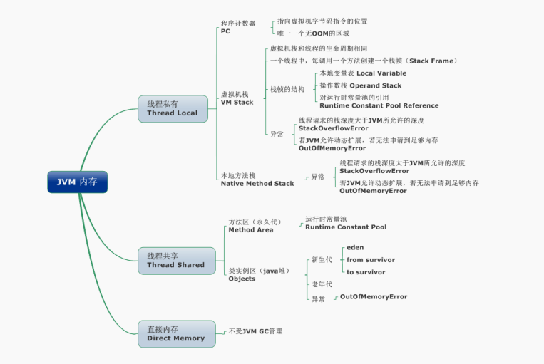

[toc]


# JAM

JVM是可运行java代码的假想计算机，包括一套字节码指令集、一组寄存器、一个栈、一个垃圾回收堆和一个存储方法域。


## 1、线程

程序执行过程中的一个线程实体。

JVM允许一个应用并发执行多个线程。

Hotspot JVM中的Java线程于原生操作系统线程有直接的映射关系。当线程本地存储、缓冲区分配、同步对象、栈、程序计数器等准备好以后，就会创建一个操作系统原生线程。

Java线程结束，原生线程随之被回收。操作系统负责调度所有线程，并把他们分配到任何可用的CPU上。当原生线程初始化完毕，就会调用Java线程的run方法。当线程结束时，会释放原生线程和Java线程的所有资源。


Hotspot JVM后台运行的系统线程主要有下面几个：


## 2、JVM内存区域




**直接内存：** 不是JVM运行时数据区的一部分，也会被频繁的使用。NIO提供了基于Channel于Buffer的IO方式，可以使用Native函数库直接分配对外内存，然后使用DirectByteBuffer对象作为整个内存的引用进行操作，避免了再Java堆和Native堆中来回复制数据，在某些场景中可以显著提高性能。


### （1）程序计数器：线程私有

当前线程所执行的字节码的行号指示器，每条线程都要有一个独立的程序计数器，为线程私有的内润。

正在执行java方法的话，计数器记录的是虚拟机字节码指令的地址。如果是Native方法，则为空。

此内存区域是唯一一个在虚拟机中没有规定任何OutOfMemoryError情况的区域。


### （2）虚拟机栈：线程私有

描述java方法执行的内存模型，每个方法在执行的同时都会创建一个栈帧用于存储局部变量表、操作数栈、动态链接、方法出口等信息。

每个方法从调用直至执行完成的过程，就对应着一个栈帧在虚拟机栈中入栈到出栈的过程 。

栈帧是用来存储数据和部分过程结果的数据结构，同时也被用来处理动态链接、方法返回值和异常分派。栈帧随着方法调用而创建，随着方法结束而销毁。


### （3）本地方法栈：线程私有

与虚拟机栈作用类似，区别是虚拟机栈为执行Java方法服务，本地方法栈为执行Native方法服务。


### （4）堆：线程共享

创建的对象和数组都保存在堆内存中，也是垃圾收集器进行垃圾收集的最重要的内存区域。

分为新生代和老年代，默认比例是1：2

垃圾收集分代回收。


### （5）方法区/永久代：线程共享

用于存储被JVM加载的类信息、常量、静态变量、即时编译器编译后的代码等数据 。

Hotspot VM把GC分代收集扩展至方法区，即使用Java堆的永久代来实现方法区，这样HotSpot的垃圾收集器就可以像管理Java堆一样管理这部分内存，而不必为方法区开发专门的内存管理器。永久代的内存回收的主要目标是针对常量池的回收和类型的卸载

**运行时常量池：** 方法区的一部分，class文件中除了有类的版本、字段、方法、接口等描述信息外，还有一项信息就是常量池。

用于存放编译器生成的各种字面量和符号引用，这部分内容将在类加载后存放到方法区的运行时常量池中。


## 3、JVM运行时内存

java堆从GC的角度可细分为： 新生代（Eden区、From Survivor区、To Survivor区）和老年代


### （1）新生代

用来存放新生的对象，一般占据堆的1/3空间。

由于频繁的创建对象，所以新生代会频繁出发MinorGC进行垃圾回收

新生代又分为Eden、SurvivorForm、SurvivorTo 三个区

#### 1>Eden

Java新对象的出生地，（如果新创建对象占内存很大，则直接分配到老年区）

当Eden区内存不够的时候就会出发MinorGC，对新生代进行一次垃圾回收

#### 2>SurvivorFrom

上一次GC的幸存者，作为此次GC的被扫描者

#### 3>SurvivorTo

保留了一次MinorGC过程中的幸存者


#### 4>MinorGC的过程（复制-清空-交换）

- eden、servicorFrom 复制到 ServicorTo，年龄+1
  首先，把 Eden 和 ServivorFrom 区域中存活的对象复制到 ServicorTo 区域（如果有对象的年
  龄以及达到了老年的标准，则赋值到老年代区），同时把这些对象的年龄+1（如果 ServicorTo 不
  够位置了就放到老年区）；
- 清空 eden、servicorFrom
  然后，清空 Eden 和 ServicorFrom 中的对象；
- ServicorTo 和 ServicorFrom 互换
  最后，ServicorTo 和 ServicorFrom 互换，原 ServicorTo 成为下一次 GC 时的 ServicorFrom
  区。


### （2）老年代

主要存放应用程序中生命周期长的内存对象

老年代的对象比较稳定，所以MajorGC不会频繁执行。在进行Major GC前一半先进行一次MinorGC，使得新生代的对象晋升老年代，导致空间不够用时才出发。当无法找到足够大的连续空间分配给新创建的大对象时也会出发一次MajorGC进行垃圾回收。


### （3）永久代

内存的永久保存区域，主要存放Class和Meta元数据的信息，Class在被加载的时候被放入永久区域，和存放实例的区域不同，GC不会再主程序运行期对永久区域进行清理，所以会导致永久代的区域会随着加载的Class的增多而内存不足，抛出OOM异常。

**Java8中的元数据**

在Java8中，永久代已经被移除，被一个称为“元数据区（元空间）”的区域取代

元空间与永久代的最大区别在于：元空间并不在虚拟机中，而是使用本地内存。因此，默认情况下，元空间的大小仅受本地内存限制，类的元数据放入native memory、字符串池和类的静态变量放入java堆中。这样可以加载多少类的元数据就不再由MaxPermSize 控制, 而由系统的实际可用空间来控制。


## 3、垃圾回收算法


#### （1）如何确认垃圾

##### 1、引用计数法

对象如果没有任何与之关联的引用，即他们的引用计数都不为 0，则说明对象不太可能再被用到，那么这个对象就是可回收对象

#### 2、可达性分析

为了解决引用计数法的循环引用问题，Java 使用了可达性分析的方法。通过一系列的“GC roots”对象作为起点搜索。如果在“GC roots”和一个对象之间没有可达路径，则称该对象是不可达的。13/04/2018 要注意的是，不可达对象不等价于可回收对象，不可达对象变为可回收对象至少要经过两次标记过程。两次标记后仍然是可回收对象，则将面临回收。


#### （2）标记-清除算法（Mark-Sweep）

分为两个阶段，标记、清除

先标记出所有需要回收的对象，然后清除被标记的对象所占用的空间。


存在内存碎片


### （3）复制算法（copying）

按内存容量将内存划分为大小相等的两块，每次只使用其中一块，当这一块内存满后将依然存活的对象复制到另一块上，把以使用的内存清理掉。


虽然没有了空间碎片，但是内存利用率只有百分之五十，且存活的对象增多的话，Copying算法的效率会大大降低。


### （4）标记整理算法（Mark-Compact）

标记后先将存活对象移向内存的一端，然后清除其它的空间。


### （5）分代收集算法

老生代的特点是每次垃圾回收时只有少量对象需要被回收，新生代的特点是每次垃圾回收时都有大量垃圾需要被回收，因此可以根据不同区域选择不同的算法。

#### 1、新生代与复制算法

新生代中每次垃圾回收都要回收大部分对象，即要复制的操作比较少，但通常并不是按照 1：1 来划分新生代。一般将新生代划分为一块较大的 Eden 空间和两个较小的 Survivor 空间(From Space, To Space)，每次使用Eden 空间和其中的一块 Survivor 空间，当进行回收时，将该两块空间中还存活的对象复制到另一块 Survivor 空间中。


#### 2、老年代与标记复制算法

而老年代因为每次只回收少量对象，因而采用 Mark-Compact 算法。


1. JAVA 虚拟机提到过的处于方法区的永生代(Permanet Generation)，它用来存储 class 类，
常量，方法描述等。对永生代的回收主要包括废弃常量和无用的类。
2. 对象的内存分配主要在新生代的 Eden Space 和 Survivor Space 的 From Space(Survivor 目
前存放对象的那一块)，少数情况会直接分配到老生代。
3. 当新生代的 Eden Space 和 From Space 空间不足时就会发生一次 GC，进行 GC 后，Eden 
Space 和 From Space 区的存活对象会被挪到 To Space，然后将 Eden Space 和 From 
Space 进行清理。
4. 如果 To Space 无法足够存储某个对象，则将这个对象存储到老生代。
5. 在进行 GC 后，使用的便是 Eden Space 和 To Space 了，如此反复循环。
6. 当对象在 Survivor 区躲过一次 GC 后，其年龄就会+1。默认情况下年龄到达 15 的对象会被
移到老生代中。


### （6）分区收集算法

分区算法则将整个堆空间划分为连续的不同小区间, 每个小区间独立使用, 独立回收. 这样做的好处是可以控制一次回收多少个小区间 , 根据目标停顿时间, 每次合理地回收若干个小区间(而不是整个堆), 从而减少一次 GC 所产生的停顿。


## 5、四种引用类型

### （1）强引用

把一个对象赋给一个引用变量，这个引用变量就是一个强引用。

当一个对象被强引用变量引用时，它处于可达状态，它是不可能被垃圾回收机制回收的，即使该对象以后永远都不会被用到 JVM 也不会回收。因此强引用是造成 Java 内存泄漏的主要原因之一。


### （2）软引用

软引用需要用 SoftReference 类来实现，对于只有软引用的对象来说，当系统内存足够时它不会被回收，当系统内存空间不足时它会被回收。软引用通常用在对内存敏感的程序中。


### （3）弱引用

弱引用需要用 WeakReference 类来实现，它比软引用的生存期更短，对于只有弱引用的对象来说，只要垃圾回收机制一运行，不管 JVM 的内存空间是否足够，总会回收该对象占用的内存。


### （4）虚引用

虚引用需要 PhantomReference 类来实现，它不能单独使用，必须和引用队列联合使用。虚引用的主要作用是跟踪对象被垃圾回收的状态


## 6、GC垃圾收集器

堆内存被划分为新生代和年老代两部分，新生代主要使用复制和标记-清除垃圾回收算法；年老代主要使用标记-整理垃圾回收算法，因此 java 虚拟中针对新生代和年老代分别提供了多种不同的垃圾收集器，JDK1.6 中 Sun HotSpot 虚拟机的垃圾收集器如下：


### （1） Serial垃圾收集器（单线程、复制算法）

Serial 是一个单线程的收集器，它不但只会使用一个 CPU 或一条线程去完成垃圾收集工作，并且在进行垃圾收集的同时，必须暂停其他所有的工作线程，直到垃圾收集结束。Serial 垃圾收集器虽然在收集垃圾过程中需要暂停所有其他的工作线程，但是它简单高效，对于限定单个 CPU 环境来说，没有线程交互的开销，可以获得最高的单线程垃圾收集效率，因此 Serial垃圾收集器依然是 java 虚拟机运行在 Client 模式下默认的新生代垃圾收集器。


### （2）ParNew垃圾收集器（Serial+多线程）

是 Serial 收集器的多线程版本，也使用复制算法，除了使用多线程进行垃圾收集之外，其余的行为和 Serial 收集器完全一样，ParNew 垃圾收集器在垃圾收集过程中同样也要暂停所有其他的工作线程

ParNew 收集器默认开启和 CPU 数目相同的线程数，可以通过-XX:ParallelGCThreads 参数来限制垃圾收集器的线程数。【Parallel：平行的】ParNew虽然是除了多线程外和Serial 收集器几乎完全一样，但是ParNew垃圾收集器是很多 java虚拟机运行在 Server 模式下新生代的默认垃圾收集器


### （3）Parallel Scavenge收集器（多线程复制算法、高效）

Parallel Scavenge 收集器也是一个新生代垃圾收集器，同样使用复制算法，也是一个多线程的垃圾收集器，它重点关注的是程序达到一个可控制的吞吐量（Thoughput，CPU 用于运行用户代码的时间/CPU 总消耗时间，即吞吐量=运行用户代码时间/(运行用户代码时间+垃圾收集时间)），高吞吐量可以最高效率地利用 CPU 时间，尽快地完成程序的运算任务，主要适用于在后台运算而不需要太多交互的任务。自适应调节策略也是 ParallelScavenge 收集器与 ParNew 收集器的一个重要区别。


### （4）Serial Old收集器（单线程标记整理算法）

Serial Old 是 Serial 垃圾收集器年老代版本，它同样是个单线程的收集器，使用标记-整理算法，这个收集器也主要是运行在 Client 默认的 java 虚拟机默认的年老代垃圾收集器。

在 Server 模式下，主要有两个用途：

1. 在 JDK1.5 之前版本中与新生代的 Parallel Scavenge 收集器搭配使用。

2. 作为年老代中使用 CMS 收集器的后备垃圾收集方案。

新生代 Serial 与年老代 Serial Old 搭配垃圾收集过程图


新生代 Parallel Scavenge 收集器与 ParNew 收集器工作原理类似，都是多线程的收集器，都使用的是复制算法，在垃圾收集过程中都需要暂停所有的工作线程。

新生代 Parallel Scavenge/ParNew 与年老代 Serial Old 搭配垃圾收集过程图：


### （5）Parallel Old收集器（多线程标记整理算法）

Parallel Old 收集器是Parallel Scavenge的年老代版本，使用多线程的标记-整理算法

在 JDK1.6 之前，新生代使用 ParallelScavenge 收集器只能搭配年老代的 Serial Old 收集器，只能保证新生代的吞吐量优先，无法保证整体的吞吐量，Parallel Old 正是为了在年老代同样提供吞吐量优先的垃圾收集器，如果系统对吞吐量要求比较高，可以优先考虑新生代 Parallel Scavenge和年老代 Parallel Old 收集器的搭配策略。

新生代 Parallel Scavenge 和年老代 Parallel Old 收集器搭配运行过程图：


### （6）CMS收集器（多线程标记清除算法）

Concurrent mark sweep(CMS)收集器是一种年老代垃圾收集器，其最主要目标是获取最短垃圾回收停顿时间，和其他年老代使用标记-整理算法不同，它使用多线程的标记-清除算法。

整个过程分为4个阶段：

#### 1、初始标记

只是标记一下 GC Roots 能直接关联的对象，速度很快，仍然需要暂停所有的工作线程

#### 2、并发标记

进行 GC Roots 跟踪的过程，和用户线程一起工作，不需要暂停工作线程。

#### 3、重新标记

为了修正在并发标记期间，因用户程序继续运行而导致标记产生变动的那一部分对象的标记记录，仍然需要暂停所有的工作线程。

#### 4、并发清除

清除 GC Roots 不可达对象，和用户线程一起工作，不需要暂停工作线程。由于耗时最长的并发标记和并发清除过程中，垃圾收集线程可以和用户现在一起并发工作，所以总体上来看CMS 收集器的内存回收和用户线程是一起并发地执行


### （7）G1收集器

详细参考：https://www.cnblogs.com/aspirant/p/8663872.html

​				  https://tech.meituan.com/2016/09/23/g1.html

相比于CMS收集器来说，G1收集器两个最突出的改进是：

1. 基于标记-整理算法，不产生内存碎片。

2. 可以非常精确控制停顿时间，在不牺牲吞吐量前提下，实现低停顿垃圾回收。

G1 收集器避免全区域垃圾收集，它把堆内存划分为大小固定的几个独立区域，并且跟踪这些区域的垃圾收集进度，同时在后台维护一个优先级列表，每次根据所允许的收集时间，优先回收垃圾最多的区域。区域划分和优先级区域回收机制，确保 G1 收集器可以在有限时间获得最高的垃圾收集效率

**G1虽然也把内存分成了这三大类，但是在G1里面这三大类不是泾渭分明的三大块内存，G1把内存划分成很多小块, 每个小块会被标记为E/S/O中的一个，可以前面一个是Eden后面一个就变成Survivor了。**


#### （1）Region

传统的GC收集器将连续的内存空间划分为新生代、老年代和永久代（元空间），个贷的存储地址是连续的。

  

而G1的各代存储地址是不连续的，每一代都是用了n个不连续的大小相同的Region，每个Region占有一块连续的虚拟内存地址。

  

**H：** 表示这些Region存储的是巨大对象（H-Objs），即是大小大于等于region一半的对象。


 H-obj有如下几个特征：

* H-obj直接分配到了old gen，防止了反复拷贝移动。 
* H-obj在global concurrent marking阶段的cleanup 和 full GC阶段回收。 
* 在分配H-obj之前先检查是否超过 initiating heap occupancy percent和the marking threshold, 如果超过的话，就启动global concurrent marking，为的是提早回收，防止 evacuation failures 和 full GC。 


一个Region的大小可通过参数-XX:G1HeapRegionSize设定，取值范围是 1m~32m，且是2的指数。

默认的Region个数是2048个。


#### （2）RSet

Remembered Set，辅助GC过程的一种结构，典型的空间换时间工具，和Card Table类似。还有一种数据结构也是辅助GC的：Collection Set（CSet），记录了GC要收集的Region集合，集合里的Region可是任意年代的。

在GC时，对于old->young 和old->old的跨代对象引用，只要扫描对应的CSet中的RSet即可。

 逻辑上说每个Region都有一个RSet，RSet记录了其他Region中的对象引用本Region中对象的关系，属于points-into结构（谁引用了我的对象）。而Card Table则是一种points-out（我引用了谁的对象）的结构，每个Card 覆盖一定范围的Heap（一般为512Bytes）。G1的RSet是在Card Table的基础上实现的：每个Region会记录下别的Region有指向自己的指针，并标记这些指针分别在哪些Card的范围内。 这个RSet其实是一个Hash Table，Key是别的Region的起始地址，Value是一个集合，里面的元素是Card Table的Index。 

  

 上图中有三个Region，每个Region被分成了多个Card，在不同Region中的Card会相互引用，Region1中的Card中的对象引用了Region2中的Card中的对象，蓝色实线表示的就是points-out的关系，而在Region2的RSet中，记录了Region1的Card，即红色虚线表示的关系，这就是points-into。 而维系RSet中的引用关系靠post-write barrier和Concurrent refinement threads来维护 


#### （3）停顿预测模型

 用户可以设定整个GC过程的期望停顿时间，参数-XX:MaxGCPauseMillis指定一个G1收集过程目标停顿时间，默认值200ms，不过它不是硬性条件，只是期望值。

**那么G1怎么满足用户的期望呢？**

就需要这个停顿预测模型了。G1根据这个模型统计计算出来的历史数据来预测本次收集需要选择的Region数量，从而尽量满足用户设定的目标停顿时间。 


#### （4）GC过程

G1提供了两种GC模式：Young GC和Mixed GC。两种都是完全stop the world的。

**Young GC：** 选定所有年轻代里的Region，通过控制年轻代的region个数，即年轻代内存大小，来控制Young GC的时间开销。

**Mixed GC：** 选定所有年轻代的Region，外加根据global concurrent marking统计得出收集收益高的若干老年代region。在用户指定的开销目标范围内尽可能选择收益高的老年代Region。

Mixed GC不是fullGC，只能回收部分老年代的region，如果mixed GC是在无法跟上程序分配内存的速度，导致老年代填满无法继续进行Mixed GC，就会使用Serial Old（full GC）来收集整个gc heap。

 global concurrent marking，它的执行过程类似CMS，但是不同的是，在G1 GC中，它主要是为Mixed GC提供标记服务的，并不是一次GC过程的一个必须环节。

global concurrent marking的执行过程分为四个步骤： 

* 初始标记（initial mark，STW）。它标记了从GC Root开始直接可达的对象。 
* 并发标记（Concurrent Marking）。这个阶段从GC Root开始对heap中的对象标记，标记线程与应用程序线程并行执行，并且收集各个Region的存活对象信息。 
* 最终标记（Remark，STW）。标记那些在并发标记阶段发生变化的对象，将被回收。 
* 清除垃圾（Cleanup）。清除空Region（没有存活对象的），加入到free list。 

 第一阶段initial mark是共用了Young GC的暂停，这是因为他们可以复用root scan操作，所以可以说global concurrent marking是伴随Young GC而发生的。第四阶段Cleanup只是回收了没有存活对象的Region，所以它并不需要STW。 


**什么时候发生Mixed GC呢？**

其实是由一些参数控制着的，另外也控制着哪些老年代Region会被选入CSet。

* G1HeapWastePercent：在global concurrent marking结束之后，我们可以知道old gen regions中有多少空间要被回收，在每次YGC之后和再次发生Mixed GC之前，会检查垃圾占比是否达到此参数，只有达到了，下次才会发生Mixed GC。 
*  G1MixedGCLiveThresholdPercent：old generation region中的存活对象的占比，只有在此参数之下，才会被选入CSet。 
* G1MixedGCCountTarget：一次global concurrent marking之后，最多执行Mixed GC的次数。 
*  G1OldCSetRegionThresholdPercent：一次Mixed GC中能被选入CSet的最多old generation region数量。 

| 参数                               | 含义                                                         |
| :--------------------------------- | :----------------------------------------------------------- |
| -XX:G1HeapRegionSize=n             | 设置Region大小，并非最终值                                   |
| -XX:MaxGCPauseMillis               | 设置G1收集过程目标时间，默认值200ms，不是硬性条件            |
| -XX:G1NewSizePercent               | 新生代最小值，默认值5%                                       |
| -XX:G1MaxNewSizePercent            | 新生代最大值，默认值60%                                      |
| -XX:ParallelGCThreads              | STW期间，并行GC线程数                                        |
| -XX:ConcGCThreads=n                | 并发标记阶段，并行执行的线程数                               |
| -XX:InitiatingHeapOccupancyPercent | 设置触发标记周期的 Java 堆占用率阈值。默认值是45%。这里的java堆占比指的是non_young_capacity_bytes，包括old+humongous |


#### （1）G1的年轻代

堆空间最多被分成2048个区域。最小1M，最大32M，蓝色区域保持年老代对象，绿色区域保持年轻代对象。 


#### 关键命令行开关

**-XX:+UseG1GC** - 告诉Java虚拟机使用G1垃圾收集器 
**-XX:MaxGCPauseMillis=200** - 为最大GC暂停时间设置一个指标。这是一个软目标，Java虚拟机将尽最大努力实现它。因此，暂停时间目标有时候可能不会达到。默认值是200毫秒。 
**-XX:InitiatingHeapOccupancyPercent=45** - 触发并发垃圾收集周期的整个堆的百分比时机。

这是一个G1垃圾收集器开关的完整列表，记着去使用上述的最佳实践。

| 选项和默认值                         | 描述                                                         |
| ------------------------------------ | ------------------------------------------------------------ |
| -XX:+UseG1GC                         | 使用垃圾优先(G1,Garbage First)收集器                         |
| -XX:MaxGCPauseMillis=n               | 设置垃圾收集暂停时间最大值指标。这是一个软目标，Java虚拟机将尽最大努力实现它 |
| -XX:InitiatingHeapOccupancyPercent=n | 触发并发垃圾收集周期的整个堆空间的占用比例。它被垃圾收集使用，用来触发并发垃圾收集周期，基于整个堆的占用情况，不只是一个代上(比如：G1)。0值 表示’do constant GC cycles’。默认是45 |
| -XX:NewRatio=n                       | 年轻代与年老代的大小比例，默认值是2                          |
| -XX:SurvivorRatio=n                  | eden与survivor空间的大小比例，默认值8                        |
| -XX:MaxTenuringThreshold=n           | 最大晋升阈值，默认值15                                       |
| -XX:ParallerGCThreads=n              | 设置垃圾收集器并行阶段的线程数量。默认值根据Java虚拟机运行的平台有所变化 |
| -XX:ConcGCThreads=n                  | 并发垃圾收集器使用的线程数量，默认值根据Java虚拟机运行的平台有所变化 |
| -XX:G1ReservePercent=n               | 为了降低晋升失败机率设置一个假的堆的储备空间的上限大小，默认值是10 |
| -XX:G1HeapRegionSize=n               | 使用G1收集器，Java堆被细分成一致大小的区域。这设置个体的细分的大小。这个参数的默认值由工学意义上的基于堆的大小决定 |


G1回收的过程：

- 在垃圾回收的最开始有一个短暂的时间段(Inital Mark)会停止应用(stop-the-world)
- 然后应用继续运行，同时G1开始Concurrent Mark
- 再次停止应用，来一个Final Mark (stop-the-world)
- 最后根据Garbage First的原则，选择一些内存块进行回收。(stop-the-world)


G1为什么能设置应用的暂停时间：

**因为其可以选择内存块进行回收，而不是整代内存来回收，这是G1跟其它GC不同的而一点。其它GC每次回收都会回收整个Generation的内存(Eden, Old), 而回收内存所需的时间就取决于内存的大小，以及实际垃圾的多少，所以垃圾回收时间是不可控的；而G1每次并不会回收整代内存，到底回收多少内存就看用户配置的暂停时间，配置的时间短就少回收点，配置的时间长就多回收点，伸缩自如。**


**缺点：**

如果应用的内存非常吃紧，对内存进行部分回收根本不够，始终要进行整个Heap的回收，那么G1要做的工作量就一点也不会比其它垃圾回收器少，而且因为本身算法复杂了一点，可能比其它回收器还要差。因此G1比较适合内存稍大一点的应用(一般来说至少4G以上)，小内存的应用还是用传统的垃圾回收器比如CMS比较合适。


**总结：**

G1通过在垃圾回收领域应用并行化的策略，把几块大内存块的回收问题，变成了几百块小内存的回收问题，使得回收算法可以高度并行化，同时也因为分成很多小块，使得垃圾回收的单位变成了小块内存，而不是整代内存，使得用户可能对回收时间进行配置，垃圾回收变得可以预期了。


## 7、JVM类加载机制

JVM类加载机制分为五个部分：加载、验证、解析、准备、初始化、


### （1）加载

会在内存中生成一个代表这个类的java.lang.Class对象，作为方法区这个类的各种数据的入口。

获取源头：

- Class文件
- Zip包
- jar包、war包
- 运行时计算生成（动态代理）
- 可由其它文件生成（将JSP文件转换成对应的Class类）


### （2）验证

为了确保Class文件的字节流中包含的信息是否符合当前虚拟机的要求，并不会危害虚拟机自身的安全

验证阶段包括4个阶段：

1. 文件格式验证： 验证字节流是否符合Class文件格式的规范，比如是否以0xCAFEBABE开头、主次版本好是否在当前虚拟机的处理范围之内、常量池中的常量是否有不被支持的类型
2. 元数据验证： 对字节码描述的信息进行语义分析（注意：对比javac编译阶段的语义分析），以保证其描述的信息符合Java语言规范的要求，比如这个类是否有父类，除了Object类之外
3. 字节码验证：通过数据流和控制流分析，确定程序语义是合法的、符合逻辑的
4. 符号引用验证： 确保解析动作能正确执行


### （3）准备

为类的**静态变量**分配内存，并将其初始化为默认值

为类变量分配内存并设置类变量的初始值阶段，即在方法区中分配这些便来给你所使用的内存空间

​	1、这时候进行内存分配的仅包括类变量（static），而不包括实例变量，实例变量会在对象实例化时随着对象一块分配在Java堆中。

​    2、这里所设置的初始值通常情况下是数据类型默认的零值（如0、0L、null、false等），而不是被在Java代码中被显式地赋予的值。

注意这里所说的处置使概念，例如一个类变量定义为：

```java
public static int v = 8080;
```

实际上便来给你v在准备阶段过后的初始值为0而不是8080，将v赋值为8080的put static指令是在程序被编译后，存放于类构造器<clinit>方法中

但是注意如果声明为：

```java
public static final int v = 8080;
```

在编译阶段会为 v 生成 ConstantValue 属性，在准备阶段虚拟机会根据 ConstantValue 属性将 v赋值为 8080


**注意：**

```
· 对基本数据类型来说，对于类变量（static）和全局变量，如果不显式地对其赋值而直接使用，则系统会为其赋予默认的零值，而对于局部变量来说，在使用前必须显式地为其赋值，否则编译时不通过。
· 对于同时被static和final修饰的常量，必须在声明的时候就为其显式地赋值，否则编译时不通过；而只被final修饰的常量则既可以在声明时显式地为其赋值，也可以在类初始化时显式地为其赋值，总之，在使用前必须为其显式地赋值，系统不会为其赋予默认零值。
· 对于引用数据类型reference来说，如数组引用、对象引用等，如果没有对其进行显式地赋值而直接使用，系统都会为其赋予默认的零值，即null。
· 如果在数组初始化时没有对数组中的各元素赋值，那么其中的元素将根据对应的数据类型而被赋予默认的零值。
```

 3、如果类字段的字段属性表中存在ConstantValue属性，即同时被final和static修饰，那么在准备阶段变量value就会被初始化为ConstValue属性所指定的值。

### （4）解析

虚拟机将常量池中的符号引用替换为直接引用的过程。

解析动作主要针对类或接口、字段、类方法、接口方法、方法类型、方法句柄和调用点限定符7类符号引用进行。**符号引用**就是一组符号来描述目标，可以是任何字面量。

符号引用就是class文件中的：

1. CONSTANT_Class_info

2. CONSTANT_Field_info

3. CONSTANT_Method_info

等类型的常量。

#### 1、符号引用

符号引用与虚拟机实现的布局无关，引用过的目标并不一定要已经加载到内存中。各种虚拟机实现的内存布局可以各不相同，但是他们能接受的符号引用必须是一致的，因为符号引用的字面量形式明确定义在Java虚拟机规范的Class文件格式中。

#### 2、直接引用

直接引用可以是指向目标的指针，相对偏移量或是一个能间接定位到目标的句柄。如果有了直接引用，那引用的目标必定已经在内存中存在。


### （5）初始化

初始化，为类的静态变量赋予正确的初始值，JVM负责对类进行初始化，主要对类变量进行初始化。在Java中对类变量进行初始值设定有两种方式：

 ①声明类变量是指定初始值

 ②使用静态代码块为类变量指定初始值

JVM初始化步骤

 1、假如这个类还没有被加载和连接，则程序先加载并连接该类

 2、假如该类的直接父类还没有被初始化，则先初始化其直接父类

 3、假如类中有初始化语句，则系统依次执行这些初始化语句


类初始化时机：只有当对类的主动使用的时候才会导致类的初始化，类的主动使用包括以下六种：

- 创建类的实例，也就是new的方式
- 访问某个类或接口的静态变量，或者对该静态变量赋值
- 调用类的静态方法
- 反射（如Class.forName(“com.shengsiyuan.Test”)）
- 初始化某个类的子类，则其父类也会被初始化
- Java虚拟机启动时被标明为启动类的类（Java Test），直接使用java.exe命令来运行某个主类


### （6）类构造器<clinit>

初始化阶段是执行类构造器<clinit>方法的过程。<clinit>方法是由编译器自动收集类中的类变量的赋值操作和静态语句块中的语句合并而成的。

虚拟机会保证子<clinit>方法执行之前，父类的<clinit>方法已经执行完毕

如果一个类中没有对静态变量赋值也没有静态语句块，那么编译器可以不为这个类生成<client>方法。


注意以下集中情况不会执行类初始化：

1. 通过子类引用父类的静态字段，只会触发父类的初始化，不会触发子类的初始化
2. 定义对象数组，不会触发该类的初始化
3. 常量在编译期间会存入调用类的常量池中，本质上并没有直接引用定义常量的类，不会触发定义常量所在的类
4. 通过类名获取Class对象，不会触发类的初始化
5. 通过Class.forName加载指定类时，如果指定参数initialize为false时，也不会触发类初始化，其实这个参数是告诉虚拟机，是否要对类进行初始化
6. 通过ClassLoader默认的loadClass方法，也不会触发初始化动作。


### 7、类加载器

#### （1）. 启动类加载器(Bootstrap ClassLoader)

负责加载 JAVA_HOME\lib 目录中的，或通过-Xbootclasspath 参数指定路径中的，且被虚拟机认可（按文件名识别，如 rt.jar）的类。

#### （2） 扩展类加载器(Extension ClassLoader)

负责加载 JAVA_HOME\lib\ext 目录中的，或通过 java.ext.dirs 系统变量指定路径中的类库。

#### （3）. 应用程序类加载器(Application ClassLoader)：

负责加载用户路径（classpath）上的类库。JVM 通过双亲委派模型进行类的加载，当然我们也可以通过继承 java.lang.ClassLoader实现自定义的类加载器。


### 8、双亲委派

当一个类收到了类加载请求，他首先不会尝试自己去加载这个类，而是把这个请求委派给父类去完成，每一个层次类加载器都是如此，因此所有的加载请求都应该传送到启动类加载其中，只有当父类加载器反馈自己无法完成这个请求的时候（在它的加载路径下没有找到所需加载的Class），子类加载器才会尝试自己去加载。

采用双亲委派的一个好处是比如加载位于 rt.jar 包中的类 java.lang.Object，不管是哪个加载器加载这个类，最终都是委托给顶层的启动类加载器进行加载，这样就保证了使用不同的类加载器最终得到的都是同样一个 Object 对象。


### 8、OSGI（动态模型系统）

OSGi(Open Service Gateway Initiative)，是面向 Java 的动态模型系统，是 Java 动态化模块化系统的一系列规范。

### （1）动态改变构造

OSGi 服务平台提供在多种网络设备上无需重启的动态改变构造的功能。为了最小化耦合度和促使这些耦合度可管理，OSGi 技术提供一种面向服务的架构，它能使这些组件动态地发现对方。

#### （2）模块化编程与热插拔

OSGi 旨在为实现 Java 程序的模块化编程提供基础条件，基于 OSGi 的程序很可能可以实现模块级的热插拔功能，当程序升级更新时，可以只停用、重新安装然后启动程序的其中一部分，这对企业级程序开发来说是非常具有诱惑力的特性。

OSGi 描绘了一个很美好的模块化开发目标，而且定义了实现这个目标的所需要服务与架构，同时也有成熟的框架进行实现支持。但并非所有的应用都适合采用 OSGi 作为基础架构，它在提供强大功能同时，也引入了额外的复杂度，因为它不遵守了类加载的双亲委托模型。


## 8、JVM调优

 **活跃数据的大小**是指，应用程序稳定运行时长期存活对象在堆中占用的空间大小，也就是Full GC后堆中老年代占用空间的大小。 

| 空间   | 倍数                                    |
| :----- | :-------------------------------------- |
| 总大小 | **3-4** 倍活跃数据的大小                |
| 新生代 | **1-1.5** 活跃数据的大小                |
| 老年代 | **2-3** 倍活跃数据的大小                |
| 永久代 | **1.2-1.5** 倍Full GC后的永久代空间占用 |


### （1）何时进行JVM调优

- Heap内存（老年代）持续上涨达到设置的最大内存值
- Full GC次数频繁
- GC停顿时间过长（超过1秒）
- 应用出现OutOfMemory等内存异常
- 应用中有使用本地缓存且占用大量内存空间
- 系统吞吐量与响应性能不高或下降。


### （2）调优目标

- 延迟：GC低停顿和GC低频率
- 低内存占用
- 高吞吐量


### （3）调优步骤

1. 分析GC日志及dump文件，判断是否需要优化，确定瓶颈问题点
2. 确定JVM调优量化目标


4. 依次调优内存、延迟、吞吐量等指标
5. 对比观察调优前后的差异
6. 不断分析和调整，直至找到合适的JVM参数配置
7. 找到最合适的参数，将这些参数应用至所有服务器，并进行后续跟踪。


从满足程序的内存使用需求，之后是时间延迟的要求，最后才是吞吐量的要求。


### （4）参数解析及调优

例如：

```
-Xmx4g –Xms4g –Xmn1200m –Xss512k -XX:NewRatio=4 -XX:SurvivorRatio=8 -XX:PermSize=100m -XX:MaxPermSize=256m -XX:MaxTenuringThreshold=15
```

参数解析：

- -Xmx4g：堆内存最大值为4GB。 
- -Xms4g：初始化堆内存大小为4GB。 
- -Xmn1200m：设置年轻代大小为1200MB。增大年轻代后，将会减小年老代大小。此值对系统性能影响较大，Sun官方推荐配置为整个堆的3/8。 
- -Xss512k：设置每个线程的堆栈大小。JDK5.0以后每个线程堆栈大小为1MB，以前每个线程堆栈大小为256K。应根据应用线程所需内存大小进行调整。在相同物理内存下，减小这个值能生成更多的线程。但是操作系统对一个进程内的线程数还是有限制的，不能无限生成，经验值在3000~5000左右。 
- -XX:NewRatio=4：设置年轻代（包括Eden和两个Survivor区）与年老代的比值（除去持久代）。设置为4，则年轻代与年老代所占比值为1：4，年轻代占整个堆栈的1/5 
- -XX:SurvivorRatio=8：设置年轻代中Eden区与Survivor区的大小比值。设置为8，则两个Survivor区与一个Eden区的比值为2:8，一个Survivor区占整个年轻代的1/10 
- -XX:PermSize=100m：初始化永久代大小为100MB。 
- -XX:MaxPermSize=256m：设置持久代大小为256MB。 
- -XX:MaxTenuringThreshold=15：设置垃圾最大年龄。如果设置为0的话，则年轻代对象不经过Survivor区，直接进入年老代。对于年老代比较多的应用，可以提高效率。如果将此值设置为一个较大值，则年轻代对象会在Survivor区进行多次复制，这样可以增加对象再年轻代的存活时间，增加在年轻代即被回收的概论。


**可调优参数：**

-Xms：初始化堆内存大小，默认为物理内存的1/64(小于1GB)。

-Xmx：堆内存最大值。默认(MaxHeapFreeRatio参数可以调整)空余堆内存大于70%时，JVM会减少堆直到-Xms的最小限制。

-Xmn：新生代大小，包括Eden区与2个Survivor区。

-XX:SurvivorRatio=1：Eden区与一个Survivor区比值为1:1。

-XX:MaxDirectMemorySize=1G：直接内存。报java.lang.OutOfMemoryError: Direct buffer memory异常可以上调这个值。

-XX:+DisableExplicitGC：禁止运行期显式地调用System.gc()来触发fulll GC。

注意: Java RMI的定时GC触发机制可通过配置-Dsun.rmi.dgc.server.gcInterval=86400来控制触发的时间。

-XX:CMSInitiatingOccupancyFraction=60：老年代内存回收阈值，默认值为68。

-XX:ConcGCThreads=4：CMS垃圾回收器并行线程线，推荐值为CPU核心数。

-XX:ParallelGCThreads=8：新生代并行收集器的线程数。

-XX:MaxTenuringThreshold=10：设置垃圾最大年龄。如果设置为0的话，则年轻代对象不经过Survivor区，直接进入年老代。对于年老代比较多的应用，可以提高效率。如果将此值设置为一个较大值，则年轻代对象会在Survivor区进行多次复制，这样可以增加对象再年轻代的存活时间，增加在年轻代即被回收的概论。

-XX:CMSFullGCsBeforeCompaction=4：指定进行多少次fullGC之后，进行tenured区 内存空间压缩。

-XX:CMSMaxAbortablePrecleanTime=500：当abortable-preclean预清理阶段执行达到这个时间时就会结束。

在设置的时候，如果关注性能开销的话，应尽量把永久代的初始值与最大值设置为同一值，因为永久代的大小调整需要进行FullGC才能实现。


### （5）内存优化示例

  

以上gc日志中，在发生fullGC之时，整个应用的堆占用以及GC时间。为了更加精确需多次收集，计算平均值。或者是采用耗时最长的一次FullGC来进行估算。上图中，老年代空间占用在93168kb（约93MB），以此定为老年代空间的活跃数据。则其他堆空间的分配，基于以下规则来进行。

- java heap：参数-Xms和-Xmx，建议扩大至3-4倍FullGC后的老年代空间占用。 
- 永久代：-XX:PermSize和-XX:MaxPermSize，建议扩大至1.2-1.5倍FullGc后的永久代空间占用。 
- 新生代：-Xmn，建议扩大至1-1.5倍FullGC之后的老年代空间占用。 
- 老年代：2-3倍FullGC后的老年代空间占用。

**注意：都是以FullGC后的空间占用为基础**


### （6）延迟优化示例

对延迟性优化，首先需要了解延迟性需求及可调优的指标有哪些。

- 应用程序可接受的平均停滞时间: 此时间与测量的Minor 
- GC持续时间进行比较。可接受的Minor GC频率：Minor 
- GC的频率与可容忍的值进行比较。 
- 可接受的最大停顿时间:最大停顿时间与最差情况下FullGC的持续时间进行比较。 
- 可接受的最大停顿发生的频率：基本就是FullGC的频率。 

其中，平均停滞时间和最大停顿时间，对用户体验最为重要

 对于上面的指标，相关数据采集包括：MinorGC的持续时间、统计MinorGC的次数、FullGC的最差持续时间、最差情况下，FullGC的频率。 


 新生代空间越大，Minor GC的GC时间越长，频率越低。如果想减少其持续时长，就需要减少其空间大小。如果想减小其频率，就需要加大其空间大小。 


### （7）吞吐量调优

吞吐量调优主要是基于应用程序的吞吐量要求而来的，应用程序应该有一个综合的吞吐指标，这个指标基于整个应用的需求和测试而衍生出来的。

评估当前吞吐量和目标差距是否巨大，如果在20%左右，可以修改参数，加大内存，再次从头调试，如果巨大就需要从整个应用层面来考虑，设计以及目标是否一致了，重新评估吞吐目标。

对于垃圾收集器来说，提升吞吐量的性能调优的目标就是尽可能避免或者很少发生FullGC或者Stop-The-World压缩式垃圾收集（CMS），因为这两种方式都会造成应用程序吞吐降低。尽量在MinorGC 阶段回收更多的对象，避免对象提升过快到老年代。


