[toc]


# Kafka

## 1、简介

Kafka是一个分布式、分区的、多副本的、多订阅者，基于zookeeper协调的分布式日志系统（也可以当做MQ系统），常见可以用于web/nginx日志、访问日志，消息服务等。

**主要应用场景：**日志收集系统和消息系统。

**主要设计目标：**

- 以时间复杂度O(1)的方式提供消息持久化的功能，对TB级以上数据也能保证常数时间的访问性能。
- 高吞吐量，即使在廉价的机器上也能做到单机100k条/s消息的传输
- 支持kafka Server间的消息分区、分布式消费，同时保证各个partition内的消息顺序传输。
- 同时支持离线数据处理和实时数据处理
- Scale out：支持在线水平扩展。


### （1）点对点消息传递模式

 在点对点消息系统中，消息持久化到一个队列中。

此时，将有一个或多个消费者消费队列中的数据。

但是一条消息只能被消费一次。当一个消费者消费了队列中的某条数据之后，该条数据则从消息队列中删除。

该模式即使有多个消费者同时消费数据，也能保证数据处理的顺序。这种架构描述示意图如下： 

  

**生产者发送一条消息到queue，只有一个消费者能收到**。


### （2）发布-订阅消息传递模式

 在发布-订阅消息系统中，消息被持久化到一个topic中。

与点对点消息系统不同的是，消费者可以订阅一个或多个topic，消费者可以消费该topic中所有的数据，同一条数据可以被多个消费者消费，数据被消费后不会立马删除。

在发布-订阅消息系统中，消息的生产者称为发布者，消费者称为订阅者。该模式的示例图如下： 


## 2、优点

### （1）解耦

 在项目启动之初来预测将来项目会碰到什么需求，是极其困难的。消息系统在处理过程中间插入了一个隐含的、基于数据的接口层，两边的处理过程都要实现这一接口。这允许你独立的扩展或修改两边的处理过程，只要确保它们遵守同样的接口约束。 

### （2）冗余（副本）

 有些情况下，处理数据的过程会失败。除非数据被持久化，否则将造成丢失。消息队列把数据进行持久化直到它们已经被完全处理，通过这一方式规避了数据丢失风险。许多消息队列所采用的"插入-获取-删除"范式中，在把一个消息从队列中删除之前，需要你的处理系统明确的指出该消息已经被处理完毕，从而确保你的数据被安全的保存直到你使用完毕。 

### （3）扩展性

 因为消息队列解耦了你的处理过程，所以增大消息入队和处理的频率是很容易的，只要另外增加处理过程即可。不需要改变代码、不需要调节参数。扩展就像调大电力按钮一样简单。 

### （4）灵活性&峰值处理能力

 在访问量剧增的情况下，应用仍然需要继续发挥作用，但是这样的突发流量并不常见；如果为以能处理这类峰值访问为标准来投入资源随时待命无疑是巨大的浪费。使用消息队列能够使关键组件顶住突发的访问压力，而不会因为突发的超负荷的请求而完全崩溃。 

### （5）可恢复性

 系统的一部分组件失效时，不会影响到整个系统。消息队列降低了进程间的耦合度，所以即使一个处理消息的进程挂掉，加入队列中的消息仍然可以在系统恢复后被处理。 

### （6）顺序保证

 在大多使用场景下，数据处理的顺序都很重要。大部分消息队列本来就是排序的，并且能保证数据会按照特定的顺序来处理。Kafka保证一个Partition内的消息的有序性。 

### （7）缓冲

 在任何重要的系统中，都会有需要不同的处理时间的元素。例如，加载一张图片比应用过滤器花费更少的时间。消息队列通过一个缓冲层来帮助任务最高效率的执行———写入队列的处理会尽可能的快速。该缓冲有助于控制和优化数据流经过系统的速度。 

### （8）异步通信

 很多时候，用户不想也不需要立即处理消息。消息队列提供了异步处理机制，允许用户把一个消息放入队列，但并不立即处理它。想向队列中放入多少消息就放多少，然后在需要的时候再去处理它们。 


## 3、重要概念

  

  


上图中一个topic配置了3个partition。Partition1有两个offset：0和1。Partition2有4个offset。Partition3有1个offset。副本的id和副本所在的机器的id恰好相同。

如果一个topic的副本数为3，那么Kafka将在集群中为每个partition创建3个相同的副本。集群中的每个broker存储一个或多个partition。多个producer和consumer可同时生产和消费数据。


### （1）broker

Kafka 集群包含一个或多个服务器，服务器节点称为broker。

broker存储topic的数据。如果某topic有N个partition，集群有N个broker，那么每个broker存储该topic的一个partition。

如果某topic有N个partition，集群有(N+M)个broker，那么其中有N个broker存储该topic的一个partition，剩下的M个broker不存储该topic的partition数据。

如果某topic有N个partition，集群中broker数目少于N个，那么一个broker存储该topic的一个或多个partition。在实际生产环境中，尽量避免这种情况的发生，这种情况容易导致Kafka集群数据不均衡。

### （2）topic

每条发布到Kafka集群的消息都有一个类别，这个类别被称为Topic。（物理上不同Topic的消息分开存储，逻辑上一个Topic的消息虽然保存于一个或多个broker上但用户只需指定消息的Topic即可生产或消费数据而不必关心数据存于何处）

类似于数据库的表名

### （3）partition

 topic中的数据分割为一个或多个partition。每个topic至少有一个partition。每个partition中的数据使用多个segment文件存储。partition中的数据是有序的，不同partition间的数据丢失了数据的顺序。如果topic有多个partition，消费数据时就不能保证数据的顺序。在需要严格保证消息的消费顺序的场景下，需要将partition数目设为1。 

### （4）producer

 生产者即数据的发布者，该角色将消息发布到Kafka的topic中。broker接收到生产者发送的消息后，broker将该消息**追加**到当前用于追加数据的segment文件中。生产者发送的消息，存储到一个partition中，生产者也可以指定数据存储的partition。 

### （5）consumer

 消费者可以从broker中读取数据。消费者可以消费多个topic中的数据。 

### （6）consumer group

每个Consumer属于一个特定的Consumer Group（可为每个Consumer指定group name，若不指定group name则属于默认的group）。

### （7）leader

 每个partition有多个副本，其中有且仅有一个作为Leader，Leader是当前负责数据的读写的partition。 

### （8）follower

 Follower跟随Leader，所有写请求都通过Leader路由，数据变更会广播给所有Follower，Follower与Leader保持数据同步。如果Leader失效，则从Follower中选举出一个新的Leader。当Follower与Leader挂掉、卡住或者同步太慢，leader会把这个follower从“in sync replicas”（ISR）列表中删除，重新创建一个Follower。 

### （9）Zookeeper

 kafka集群依赖zookeeper来保存集群的的元信息，来保证系统的可用性。 


### （10）Rebalance

重平衡：Rebalance。消费者组内某个消费者实例挂掉后，其他消费者实例自动重新分配订阅主题分区的过程。Rebalance 是 Kafka 消费者端实现高可用的重要手段。

这个过程会产生STW（stop the world）问题


那么 Consumer Group 何时进行 Rebalance 呢？Rebalance 的触发条件有 3 个。

1、组成员数发生变更。比如有新的 Consumer 实例加入组或者离开组，抑或是有 Consumer 实例崩溃被“踢出”组。
2、订阅主题数发生变更。Consumer Group 可以使用正则表达式的方式订阅主题，比如 consumer.subscribe(Pattern.compile(“t.*c”)) 就表明该 Group 订阅所有以字母 t 开头、字母 c 结尾的主题。在 Consumer Group 的运行过程中，你新创建了一个满足这样条件的主题，那么该 Group 就会发生 Rebalance。
3、订阅主题的分区数发生变更。Kafka 当前只能允许增加一个主题的分区数。当分区数增加时，就会触发订阅该主题的所有 Group 开启 Rebalance。

重平衡过程是如何通知到其他消费者实例的？答案就是，靠消费者端的心跳线程（Heartbeat Thread）。

Kafka 为消费者组定义了 5 种状态，它们分别是：Empty、Dead、PreparingRebalance、CompletingRebalance 和 Stable。

  

一个消费者组最开始是 Empty 状态，当重平衡过程开启后，它会被置于 PreparingRebalance 状态等待成员加入，之后变更到 CompletingRebalance 状态等待分配方案，最后流转到 Stable 状态完成重平衡。

当有新成员加入或已有成员退出时，消费者组的状态从 Stable 直接跳到 PreparingRebalance 状态，此时，所有现存成员就必须重新申请加入组。当所有成员都退出组后，消费者组状态变更为 Empty。Kafka 定期自动删除过期位移的条件就是，组要处于 Empty 状态。因此，如果你的消费者组停掉了很长时间（超过 7 天），那么 Kafka 很可能就把该组的位移数据删除了


消费者端的重平衡的2个步骤：加入组和等待领导者消费者分配方案，分别对应JoinGroup请求和SyncGroup请求

协调者端处理重平衡的4个场景：新成员入组，成员主动离组，成员崩溃离组，重平衡时协调者对组内成员提交位移的处理。


## 4、工作流程分析

  

### （1）发送数据

  **Producer在写入数据的时候永远的找leader**，不会直接将数据写入**follower**！ 

 

 消息写入leader后，follower是主动的去leader进行同步的！producer采用push模式将数据发布到broker，每条消息追加到分区中，顺序写入磁盘，所以保证同一分区内的数据是有序的！

写入示意图如下： 

  


**Kafka分区的主要目的是：**

1. **方便扩展**：因为一个topic可以有多个partition，所以我们可以通过扩展机器去轻松的应对日益增长的数据量。
2. **提高并发**：以partition为读写单位，可以多个消费者同时消费数据，提高了消息的处理效率。


 在kafka中，如果某个topic有多个partition，producer又怎么知道该将数据发往哪个partition呢？

kafka中有几个原则： 

1. 指定：partition在写入的时候可以指定需要写入的partition，如果有指定，则写入对应的partition。
2. 哈希：如果没有指定partition，但是设置了数据的key，则会根据key的值hash出一个partition。
3. 轮询：如果既没指定partition，又没有设置key，则会轮询选出一个partition。
4. 随机：随机选择一个partition进行写入


 保证消息不丢失是一个消息队列中间件的基本保证，那producer在向kafka写入消息的时候，怎么保证消息不丢失呢？

其实上面的写入流程图中有描述出来，那就是通过ACK应答机制！在生产者向队列写入数据的时候可以设置参数来确定是否确认kafka接收到数据，这个参数可设置的值为**0、1、all**。 

- 0 代表producer往集群发送数据不需要等到集群的返回，不确保消息发送成功。安全性最低但是效率最高。
- 1 代表producer往集群发送数据只要leader应答就可以发送下一条，只确保leader发送成功。
- all 代表producer往集群发送数据需要所有的follower都完成从leader的同步才会发送下一条，确保leader发送成功和所有的副本都完成备份。安全性最高，但是效率最低。


 最后要注意的是，如果往不存在的topic写数据，能不能写入成功呢？kafka会自动创建topic，分区和副本的数量根据默认配置都是1。 


### （2）保存数据

Producer将数据写入kafka后，集群就需要对数据进行保存。kafka将数据保存在磁盘，初始会单独开辟一块磁盘空间，进行顺序写入，比随机写入的效率高。


#### 1、partition结构

一个Partition就是一个文件夹，每个Partition的文件夹下面会有多组segment文件，每组segment文件包含.index、.log、.timeindex三个文件，log文件就是存储message的地方，而index和timeindex文件为索引文件，用于检索消息。

   

每个log文件的大小是一样的，存储的message数量不一定相等（没调message大小不一致）。

文件的命名是以该segment最小offset来命名的，如000.index存储的就是offset为0~368765的消息，kafka就是利用分段+索引的方式来解决查找效率的问题。


#### 2、Message结构

message就是存储在log文件中，消息主要包含消息体、消息大小、offset、压缩类型等。

重点是下面三个：

- **offset**：offset是一个占8byte的有序id号，它可以唯一确定每条消息在parition内的位置！
- **消息大小**：消息大小占用4byte，用于描述消息的大小。
- **消息体**：消息体存放的是实际的消息数据（被压缩过），占用的空间根据具体的消息而不一样。


#### 3、存储策略

无论消息是否被消费，kafka都会保存所有的消息。

旧数据删除策略：

- 基于时间，默认配置是168小时（7天）。
- 基于大小，默认配置是1073741824。

 需要注意的是，kafka读取特定消息的时间复杂度是O(1)，所以这里删除过期的文件并不会提高kafka的性能！ 


### （3）消费数据

kafka采用的是点对点的模式，消费者主动去kafka集群拉去消息，与Producer相同的是，消费者在拉取消息的时候也是找leader去拉取。

 多个消费者可以组成一个消费者组（consumer group），每个消费者组都有一个组id！同一个消费组者的消费者可以消费同一topic下不同分区的数据，但是不会组内多个消费者消费同一分区的数据！！！ 

  

 图示是消费者组内的消费者小于partition数量的情况，所以会出现某个消费者消费多个partition数据的情况，消费的速度也就不及只处理一个partition的消费者的处理速度！ 

 如果是消费者组的消费者多于partition的数量，那会不会出现多个消费者消费同一个partition的数据呢？上面已经提到过不会出现这种情况！多出来的消费者不消费任何partition的数据。所以在实际的应用中，**建议消费者组的consumer的数量与partition的数量一致**！ 


**查找消息的时候是怎么利用segment+offset配合查找的呢？ **

 假如现在需要查找一个offset为368801的message是什么样的过程呢 

  

1. 先找到offset的368801message所在的segment文件（利用二分法查找），这里找到的就是在第二个segment文件。
2. 打开找到的segment中的.index文件（也就是368796.index文件，该文件起始偏移量为368796+1，我们要查找的offset为368801的message在该index内的偏移量为368796+5=368801，所以这里要查找的相对offset为5）。由于该文件采用的是稀疏索引的方式存储着相对offset及对应message物理偏移量的关系，所以直接找相对offset为5的索引找不到，这里同样利用二分法查找相对offset小于或者等于指定的相对offset的索引条目中最大的那个相对offset，所以找到的是相对offset为4的这个索引。
3. 根据找到的相对offset为4的索引确定message存储的物理偏移位置为256。打开数据文件，从位置为256的那个地方开始顺序扫描直到找到offset为368801的那条Message。


 这套机制是建立在offset为有序的基础上，利用segment+有序offset+稀疏索引+二分查找+顺序查找等多种手段来高效的查找数据！至此，消费者就能拿到需要处理的数据进行处理了。那每个消费者又是怎么记录自己消费的位置呢？在早期的版本中，消费者将消费到的offset维护zookeeper中，consumer每间隔一段时间上报一次，这里容易导致重复消费，且性能不好！在新的版本中消费者消费到的offset已经直接维护在kafk集群的__consumer_offsets这个topic中！ 


## 5、Kafka的高可用

### （1）由来

#### 1、为何需要Replication

如果没有Replication，一旦某一个Broker宕机，则其上所有的Partition数据都不可被消费。同时Producer也不能再将数据存储在这些Partition中。

如果Producer使用同步模式则Producer会在尝试重新发送 message.send.max.retries（默认值为3） 次后抛出Exception，用户可选择停止发送后续数据或者继续发送，前者会造成数据阻塞，后者造成数据丢失。

如果Producer使用异步模式，则Producer会在尝试重新发送 message.send.max.retries（默认值为3）后记录该异常并继续发送后续数据，会造成数据丢失，同时kafka的Producer并未对一步模式提供回调接口。

 由此可见，在没有Replication的情况下，一旦某机器宕机或者某个Broker停止工作则会造成整个系统的可用性降低。随着集群规模的增加，整个集群中出现该类异常的几率大大增加，因此对于生产系统而言Replication机制的引入非常重要。 

#### 2、Leader 选举

 同一个Partition可能会有多个Replica，而这时需要在这些Replication之间选出一个Leader，Producer和Consumer只与这个Leader交互，其它Replica作为Follower从Leader中复制数据。 

 因为需要保证同一个Partition的多个Replica之间的数据一致性（其中一个宕机后其它Replica必须要能继续服务并且即不能造成数据重复也不能造成数据丢失）。

如果没有一个Leader，所有Replica都可同时读/写数据，那就需要保证多个Replica之间互相（N×N条通路）同步数据，数据的一致性和有序性非常难保证，大大增加了Replication实现的复杂性，同时也增加了出现异常的几率。

而引入Leader后，只有Leader负责数据读写，Follower只向Leader顺序Fetch数据（N条通路），系统更加简单且高效。 


### （2）HA解析

#### （1）如何将所有Replica均匀分布到整个集群

典型的部署方式是一个Topic的Partition数量大于Broker数量。同时需要将Partition的Replica尽量分散到不同搞得而机器。

算法如下：

- 将所有Broker（假设共n个）和待分配的Partition排序
- 将第i个Partition分配到第（i mod n）个Broker上
- 将第i个Partition的第j个Replica分配到第（（i+j）mod n）个Broker上

#### （2）副本策略

健壮的副本策略保障了Kafka的高可靠性

##### 1、消息传递同步策略

Producer发布消息到某个Partition，都是先通过ZK找到Leader，Producer只将消息发送到Leader，Leader将消息写入本地log，每个Follower都从Leader 拉取数据。

此时，Follower上的数据顺序与Leader保持一致，在写入本地log后，向leader发送ACK。

一旦Leader受到了ISR（in-sync Replica）中的所有Replica的ACK，该消息就被认为已经Commit，Leader将增加HW并且向Producer发送ACK


 为了提高性能，每个Follower在接收到数据后就立马向Leader发送ACK，而非等到数据写入Log中。因此，对于已经commit的消息，Kafka只能保证它被存于多个Replica的内存中，而不能保证它们被持久化到磁盘中，也就不能完全保证异常发生后该条消息一定能被Consumer消费。 

 Consumer读消息也是从Leader读取，只有被commit过的消息才会暴露给Consumer。 

  


##### 2、ACK前需要保证有多少个备份

对于Kafka来说，定义一个Broker是否存活包含两个条件：

- 必须维护与zk的session，通过zk的Headbeat实现
- Follower必须能及时将Leader的消息复制过来，不能差太多

 Leader会跟踪与其保持同步的Replica列表，该列表称为ISR（即in-sync Replica）。如果一个Follower宕机，或者落后太多，Leader将把它从ISR中移除。

这里所描述的“落后太多”指Follower复制的消息落后于Leader后的条数超过预定值（该值可在$KAFKA_HOME/config/server.properties中通过replica.lag.max.messages配置，其默认值是4000）或者Follower超过一定时间（该值可在$KAFKA_HOME/config/server.properties中通过replica.lag.time.max.ms来配置，其默认值是10000）未向Leader发送fetch请求。 

 Kafka的复制机制既不是完全的同步复制，也不是单纯的异步复制。事实上，完全同步复制要求所有能工作的Follower都复制完，这条消息才会被认为commit，这种复制方式极大的影响了吞吐率（高吞吐率是Kafka非常重要的一个特性）。而异步复制方式下，Follower异步的从Leader复制数据，数据只要被Leader写入log就被认为已经commit，这种情况下如果Follower都复制完都落后于Leader，而如果Leader突然宕机，则会丢失数据。而Kafka的这种使用ISR的方式则很好的均衡了确保数据不丢失以及吞吐率。Follower可以批量的从Leader复制数据，这样极大的提高复制性能（批量写磁盘），极大减少了Follower与Leader的差距。 

 需要说明的是，Kafka只解决fail/recover，不处理“Byzantine”（“拜占庭”）问题。一条消息只有被ISR里的所有Follower都从Leader复制过去才会被认为已提交。这样就避免了部分数据被写进了Leader，还没来得及被任何Follower复制就宕机了，而造成数据丢失（Consumer无法消费这些数据）。而对于Producer而言，它可以选择是否等待消息commit，这可以通过request.required.acks来设置。这种机制确保了只要ISR有一个或以上的Follower，一条被commit的消息就不会丢失。 


##### 3、Leader 选举算法

Leader选举本质上是一个分布式锁，有两种方式实现基于ZooKeeper的分布式锁：

- 节点名称唯一性：多个客户端创建一个节点，只有成功创建节点的客户端才能获得锁
- 临时顺序节点：所有客户端在某个目录下创建自己的临时顺序节点，只有序号最小的才获得锁

 Kafka在ZooKeeper中动态维护了一个ISR（in-sync replicas），这个ISR里的所有Replica都跟上了leader，只有ISR里的成员才有被选为Leader的可能。在这种模式下，对于f+1个Replica，一个Partition能在保证不丢失已经commit的消息的前提下容忍f个Replica的失败。在大多数使用场景中，这种模式是非常有利的。事实上，为了容忍f个Replica的失败，Majority Vote和ISR在commit前需要等待的Replica数量是一样的，但是ISR需要的总的Replica的个数几乎是Majority Vote的一半。 


##### 4、如何处理所有Replica都不工作

在ISR中至少有一个follower时，Kafka可以确保已经commit的数据不丢失，但如果某个Partition的所有Replica都宕机了，就无法保证数据不丢失了。这种情况下有两种可行的方案：

1.等待ISR中的任一个Replica“活”过来，并且选它作为Leader

2.选择第一个“活”过来的Replica（不一定是ISR中的）作为Leader


##### 5、选举Leader

 最简单最直观的方案是，所有Follower都在ZooKeeper上设置一个Watch，一旦Leader宕机，其对应的ephemeral znode会自动删除，此时所有Follower都尝试创建该节点，而创建成功者（ZooKeeper保证只有一个能创建成功）即是新的Leader，其它Replica即为Follower。 


但是该方法会有3个问题：

1.split-brain 这是由ZooKeeper的特性引起的，虽然ZooKeeper能保证所有Watch按顺序触发，但并不能保证同一时刻所有Replica“看”到的状态是一样的，这就可能造成不同Replica的响应不一致

2.herd effect 如果宕机的那个Broker上的Partition比较多，会造成多个Watch被触发，造成集群内大量的调整

3.ZooKeeper负载过重 每个Replica都要为此在ZooKeeper上注册一个Watch，当集群规模增加到几千个Partition时ZooKeeper负载会过重。

Kafka 0.8.*的Leader Election方案解决了上述问题，它在所有broker中选出一个controller，所有Partition的Leader选举都由controller决定。controller会将Leader的改变直接通过RPC的方式（比ZooKeeper Queue的方式更高效）通知需为为此作为响应的Broker。同时controller也负责增删Topic以及Replica的重新分配。


### （3）HA相关Zookeeper结构

  


### （4）Producer发布消息

#### 1、写入方式

producer采用push模式将消息发布到broker，每条消息都被append到partition中，属于顺序写磁盘（效率比随机写磁盘高，保障吞吐量）


#### 2、消息路由

```
1、 指定了 patition，则直接使用；
2、 未指定 patition 但指定 key，通过对 key 的 value 进行hash 选出一个 patition
3、 patition 和 key 都未指定，使用轮询选出一个 patition。
```


#### 3、写入流程

  

1、 producer 先从 zookeeper 的 "/brokers/.../state" 节点找到该 partition 的 leader 
2、 producer 将消息发送给该 leader 
3、 leader 将消息写入本地 log 
4、 followers 从 leader pull 消息，写入本地 log 后 leader 发送 ACK 
5、 leader 收到所有 ISR 中的 replica 的 ACK 后，增加 HW（high watermark，最后 commit 的 offset） 并向 producer 发送 ACK


### （5）broker保存消息

 物理上把 topic 分成一个或多个 patition（对应 server.properties 中的 num.partitions=3 配置），每个 patition 物理上对应一个文件夹（该文件夹存储该 patition 的所有消息和索引文件），如下： 

  


无论消息是否被消费，kafka 都会保留所有消息。有两种策略可以删除旧数据：

```
1、 基于时间：log.retention.hours=168 
2、 基于大小：log.retention.bytes=1073741824
```


### （6）Topic的创建和删除

#### 1、创建

  

1、 controller 在 ZooKeeper 的 /brokers/topics 节点上注册 watcher，当 topic 被创建，则 controller 会通过 watch 得到该 topic 的 partition/replica 分配。
2、 controller从 /brokers/ids 读取当前所有可用的 broker 列表，对于 set_p 中的每一个 partition：
     2.1、 从分配给该 partition 的所有 replica（称为AR）中任选一个可用的 broker 作为新的 leader，并将AR设置为新的 ISR 
     2.2、 将新的 leader 和 ISR 写入 /brokers/topics/[topic]/partitions/[partition]/state 
3、 controller 通过 RPC 向相关的 broker 发送 LeaderAndISRRequest。


#### 2、删除topic

  


1、 controller 在 zooKeeper 的 /brokers/topics 节点上注册 watcher，当 topic 被删除，则 controller 会通过 watch 得到该 topic 的 partition/replica 分配。 
2、 若 delete.topic.enable=false，结束；否则 controller 注册在 /admin/delete_topics 上的 watch 被 fire，controller 通过回调向对应的 broker 发送 StopReplicaRequest。


### （7）broker failover

  

1、 controller 在 zookeeper 的 /brokers/ids/[brokerId] 节点注册 Watcher，当 broker 宕机时 zookeeper 会 fire watch
2、 controller 从 /brokers/ids 节点读取可用broker 
3、 controller决定set_p，该集合包含宕机 broker 上的所有 partition 
4、 对 set_p 中的每一个 partition 
    4.1、 从/brokers/topics/[topic]/partitions/[partition]/state 节点读取 ISR 
    4.2、 决定新 leader 
    4.3、 将新 leader、ISR、controller_epoch 和 leader_epoch 等信息写入 state 节点
5、 通过 RPC 向相关 broker 发送 leaderAndISRRequest 命令


### （8）Controller failover

当 controller 宕机时会触发 controller failover。每个 broker 都会在 zookeeper 的 "/controller" 节点注册 watcher，当 controller 宕机时 zookeeper 中的临时节点消失，所有存活的 broker 收到 fire 的通知，每个 broker 都尝试创建新的 controller path，只有一个竞选成功并当选为 controller。

当新的 controller 当选时，会触发 KafkaController.onControllerFailover 方法，在该方法中完成如下操作：

1、 读取并增加 Controller Epoch。 
2、 在 reassignedPartitions Patch(/admin/reassign_partitions) 上注册 watcher。 
3、 在 preferredReplicaElection Path(/admin/preferred_replica_election) 上注册 watcher。 
4、 通过 partitionStateMachine 在 broker Topics Patch(/brokers/topics) 上注册 watcher。 
5、 若 delete.topic.enable=true（默认值是 false），则 partitionStateMachine 在 Delete Topic Patch(/admin/delete_topics) 上注册 watcher。 
6、 通过 replicaStateMachine在 Broker Ids Patch(/brokers/ids)上注册Watch。 
7、 初始化 ControllerContext 对象，设置当前所有 topic，“活”着的 broker 列表，所有 partition 的 leader 及 ISR等。 
8、 启动 replicaStateMachine 和 partitionStateMachine。 
9、 将 brokerState 状态设置为 RunningAsController。 
10、 将每个 partition 的 Leadership 信息发送给所有“活”着的 broker。 
11、 若 auto.leader.rebalance.enable=true（默认值是true），则启动 partition-rebalance 线程。 
12、 若 delete.topic.enable=true 且Delete Topic Patch(/admin/delete_topics)中有值，则删除相应的Topic。


## 6、Kafka为什么快？


- partition 并行处理
- 顺序写磁盘，充分利用磁盘特性
- 数据查找方式，使用segment+index
- 利用了现代操作系统分页存储 Page Cache 来利用内存提高 I/O 效率
- 采用了零拷贝技术
  - Producer 生产的数据持久化到 broker，采用 mmap 文件映射，实现顺序的快速写入
  - Customer 从 broker 读取数据，采用 sendfile，将磁盘文件读到 OS 内核缓冲区后，转到 NIO buffer进行网络发送，减少 CPU 消耗


### （1）利用Partition实现并行处理


### （2）顺序写磁盘


### （3）充分利用Page Cache

使用 Page Cache 的好处：

- I/O Scheduler 会将连续的小块写组装成大块的物理写从而提高性能
- I/O Scheduler 会尝试将一些写操作重新按顺序排好，从而减少磁盘头的移动时间
- 充分利用所有空闲内存（非 JVM 内存）。如果使用应用层 Cache（即 JVM 堆内存），会增加 GC 负担
- 读操作可直接在 Page Cache 内进行。如果消费和生产速度相当，甚至不需要通过物理磁盘（直接通过 Page Cache）交换数据
- 如果进程重启，JVM 内的 Cache 会失效，但 Page Cache 仍然可用

 Broker 收到数据后，写磁盘时只是将数据写入 Page Cache，并不保证数据一定完全写入磁盘。从这一点看，可能会造成机器宕机时，Page Cache 内的数据未写入磁盘从而造成数据丢失。但是这种丢失只发生在机器断电等造成操作系统不工作的场景，而这种场景完全可以由 Kafka 层面的 Replication 机制去解决。如果为了保证这种情况下数据不丢失而强制将 Page Cache 中的数据 Flush 到磁盘，反而会降低性能。也正因如此，Kafka 虽然提供了 `flush.messages` 和 `flush.ms` 两个参数将 Page Cache 中的数据强制 Flush 到磁盘，但是 Kafka 并不建议使用。 


### （4）零拷贝技术

 Kafka 中存在大量的网络数据持久化到磁盘（Producer 到 Broker）和磁盘文件通过网络发送（Broker 到 Consumer）的过程。 

> 操作系统的核心是内核，独立于普通的应用程序，可以访问受保护的内存空间，也有访问底层硬件设备的权限
>
> 为了避免用户进程直接操作内核，保证内核安全，操作系统将虚拟内存划分为两部分，一部分是内核空间（Kernel-space），一部分是用户空间（User-space）。

传统的 Linux 系统中，标准的 I/O 接口（例如read，write）都是基于数据拷贝操作的，即 I/O 操作会导致数据在内核地址空间的缓冲区和用户地址空间的缓冲区之间进行拷贝，所以标准 I/O 也被称作缓存 I/O。这样做的好处是，如果所请求的数据已经存放在内核的高速缓冲存储器中，那么就可以减少实际的 I/O 操作，但坏处就是数据拷贝的过程，会导致 CPU 开销。 

把 Kafka 的生产和消费简化成如下两个过程来看[2]：

1. 网络数据持久化到磁盘 (Producer 到 Broker)
2. 磁盘文件通过网络发送（Broker 到 Consumer）


#### 1、网络数据持久化到磁盘 (Producer 到 Broker)

 传统模式下，数据从网络传输到文件需要 4 次数据拷贝、4 次上下文切换和两次系统调用。 

这一过程实际上发生了四次数据拷贝：

1. 首先通过 DMA copy 将网络数据拷贝到内核态 Socket Buffer
2. 然后应用程序将内核态 Buffer 数据读入用户态（CPU copy）
3. 接着用户程序将用户态 Buffer 再拷贝到内核态（CPU copy）
4. 最后通过 DMA copy 将数据拷贝到磁盘文件

>  DMA（Direct Memory Access）：直接存储器访问。DMA 是一种无需 CPU 的参与，让外设和系统内存之间进行双向数据传输的硬件机制。使用 DMA 可以使系统 CPU 从实际的 I/O 数据传输过程中摆脱出来，从而大大提高系统的吞吐率。 


数据落盘通常都是非实时的，kafka 生产者数据持久化也是如此。Kafka 的数据**并不是实时的写入硬盘**，它充分利用了现代操作系统分页存储来利用内存提高 I/O 效率，就是上面提到的 Page Cache。 

对于 kafka 来说，Producer 生产的数据存到 broker，这个过程读取到 socket buffer 的网络数据，其实可以直接在内核空间完成落盘。并没有必要将 socket buffer 的网络数据，读取到应用进程缓冲区；在这里应用进程缓冲区其实就是 broker，broker 收到生产者的数据，就是为了持久化。

在此`特殊场景`下：接收来自 socket buffer 的网络数据，应用进程不需要中间处理、直接进行持久化时。可以使用 mmap 内存文件映射。

> **Memory Mapped Files**：简称 mmap，也有叫 **MMFile** 的，使用 mmap 的目的是将内核中读缓冲区（read buffer）的地址与用户空间的缓冲区（user buffer）进行映射。从而实现内核缓冲区与应用程序内存的共享，省去了将数据从内核读缓冲区（read buffer）拷贝到用户缓冲区（user buffer）的过程。它的工作原理是直接利用操作系统的 Page 来实现文件到物理内存的直接映射。完成映射之后你对物理内存的操作会被同步到硬盘上。
>
> 使用这种方式可以获取很大的 I/O 提升，省去了用户空间到内核空间复制的开销。

 mmap 也有一个很明显的缺陷——不可靠，写到 mmap 中的数据并没有被真正的写到硬盘，操作系统会在程序主动调用 flush 的时候才把数据真正的写到硬盘。Kafka 提供了一个参数——`producer.type` 来控制是不是主动flush；如果 Kafka 写入到 mmap 之后就立即 flush 然后再返回 Producer 叫同步(sync)；写入 mmap 之后立即返回 Producer 不调用 flush 就叫异步(async)，默认是 sync。 


> 零拷贝（Zero-copy）技术指在计算机执行操作时，CPU 不需要先将数据从一个内存区域复制到另一个内存区域，从而可以减少上下文切换以及 CPU 的拷贝时间。
>
> 它的作用是在数据报从网络设备到用户程序空间传递的过程中，减少数据拷贝次数，减少系统调用，实现 CPU 的零参与，彻底消除 CPU 在这方面的负载。
>
> 目前零拷贝技术主要有三种类型[3]：
>
> - 直接I/O：数据直接跨过内核，在用户地址空间与I/O设备之间传递，内核只是进行必要的虚拟存储配置等辅助工作；
> - 避免内核和用户空间之间的数据拷贝：当应用程序不需要对数据进行访问时，则可以避免将数据从内核空间拷贝到用户空间
>   - mmap
>   - sendfile
>   - splice && tee
>   - sockmap
> - copy on write：写时拷贝技术，数据不需要提前拷贝，而是当需要修改的时候再进行部分拷贝。


#### 2、磁盘文件通过网络发送（Broker 到 Consumer）

这一过程可以类比上边的生产消息：

1. 首先通过系统调用将文件数据读入到内核态 Buffer（DMA 拷贝）
2. 然后应用程序将内存态 Buffer 数据读入到用户态 Buffer（CPU 拷贝）
3. 接着用户程序通过 Socket 发送数据时将用户态 Buffer 数据拷贝到内核态 Buffer（CPU 拷贝）
4. 最后通过 DMA 拷贝将数据拷贝到 NIC Buffer

 Linux 2.4+ 内核通过 sendfile 系统调用，提供了零拷贝。数据通过 DMA 拷贝到内核态 Buffer 后，直接通过 DMA 拷贝到 NIC Buffer，无需 CPU 拷贝。这也是零拷贝这一说法的来源。除了减少数据拷贝外，因为整个读文件 - 网络发送由一个 sendfile 调用完成，整个过程只有两次上下文切换，因此大大提高了性能。 、


 Kafka 在这里采用的方案是通过 NIO 的 `transferTo/transferFrom` 调用操作系统的 sendfile 实现零拷贝。总共发生 2 次内核数据拷贝、2 次上下文切换和一次系统调用，消除了 CPU 数据拷贝 


### （5）批处理

 Kafka 的客户端和 broker 还会在通过网络发送数据之前，在一个批处理中累积多条记录 (包括读和写)。记录的批处理分摊了网络往返的开销，使用了更大的数据包从而提高了带宽利用率。 


### （6）数据压缩

 Producer 可将数据压缩后发送给 broker，从而减少网络传输代价，目前支持的压缩算法有：Snappy、Gzip、LZ4。数据压缩一般都是和批处理配套使用来作为优化手段的。 


## 7、消息幂等处理

生产者可能会重复发送消息，因此消费者必须做消息的幂等处理，常用的解决方案有：

### （1）查询操作

查询一次和查询多次，数据不变，查询结构都一样，select是天然的幂等操作。


### （2）删除操作

删除操作也是幂等的，删除一次和多次删除都是把数据删除，返回结果不一样，删除的数据不存在，返回0，删除的数据多条，返回的数据多个。


### （3）唯一索引

防止新增脏数据


### （4）token机制

防止页面重复提交，业务要求：页面的数据只能被点击提交一次；发生原因：由于重复点击或者网络重发或者nginx重发等情况会导致数据被重复提交；

解决方法：

集群环境采用token加redis；单JVM环境：采用token加redis或token加JVM内存。

处理流程：

- 数据提交前要向服务申请token，token放到redis或jvm内存，token有效时间
- 提交后后台校验token，同时删除token，生成新的token返回，

token特点：需申请、一次性、可限流。

注意：redis要用删除操作判断token，删除成功代表token校验通过，如果用select+delete来校验token，存在并发问题，


### （5）悲观锁

获取数据的时候加锁获取。select * from table_xxx where id='xxx' for update; 注意：id字段一

定是主键或者唯一索引，不然是锁表，


### （6）乐观锁

—乐观锁只是在更新数据那一刻锁表，其他时间不锁表，所以相对于悲观锁，效率更高。乐观锁的实现方式多种多样可以通过version或者其他状态条件：1. 通过版本号实现update table_xxx setname=#name#,version=version+1 where version=#version#如下图(来自网上)；2. 通过条件限制 updatetable_xxx set avai_amount=avai_amount-#subAmount# where avai_amount-#subAmount# >= 0要求：quality-#subQuality# >= ，这个情景适合不用版本号，只更新是做数据安全校验，适合库存模型，扣份额和回滚份额，性能更高；

```sql
update table_xxx set name=#name#,version=version+1 where id=#id# and version=#version#； 
update table_xxx set avai_amount=avai_amount-#subAmount# where id=#id# and avai_amount- #subAmount# >= 0；
```


### （7）分布式锁

还是拿插入数据的例子，如果是分布是系统，构建全局唯一索引比较困难，例如唯一性的字段没法确定，这时候可以引入分布式锁，通过第三方的系统(redis或zookeeper)，在业务系统插入数据或者更新数据，获取分布式锁，然后做操作，之后释放锁，这样其实是把多线程并发的锁的思路，引入多多个系统，也就是分布式系统中得解决思路。要点：某个长流程处理过程要求不能并发执行，可以在流程执行之前根据某个标志(用户ID+后缀等)获取分布式锁，其他流程执行时获取锁就会失败，也就是同一时间该流程只能有一个能执行成功，执行完成后，释放分布式锁(分布式锁要第三方系统提供)；


### （8）select + insert

并发不高的后台系统，或者一些任务JOB，为了支持幂等，支持重复执行，简单的处理方法是，先查询下一些关键数据，判断是否已经执行过，在进行业务处理，就可以了。注意：核心高并发流程不要用这种方法；


## 8、消息的按序处理

消息的按序不能完全依靠TCP的

无论是RocketMQ，还是Kafka，缺省都不能保证消息的严格按序消费。

**严格的顺序消费 有多困难：**

发送端：

​	发送端不能异步发送，异步发送在发送失败的情况下，没办法保证消息顺序。

存储端：

​	对于存储端，要保证消息顺序，会有以下几个问题： （1）消息不能分区。也就是1个topic，只能有1个队列。在

Kafka中，它叫做partition；在RocketMQ中，它叫做queue。 如果你有多个队列，那同1个topic的消息，会分散

到多个分区里面，自然不能保证顺序。

（2）即使只有1个队列的情况下，会有第2个问题。该机器挂了之后，能否切换到其他机器？也就是高可用问题。

比如你当前的机器挂了，上面还有消息没有消费完。此时切换到其他机器，可用性保证了。但消息顺序就乱掉了。

要想保证，一方面要同步复制，不能异步复制；另1方面得保证，切机器之前，挂掉的机器上面，所有消息必须消

费完了，不能有残留。很明显，这个很难！！！

接收端：

​	对于接收端，不能并行消费，也即不能开多线程或者多个客户端消费同1个队列。


Kafka可以通过指定生产者消息发送应答机制为all和指定partition，同时一个partition对应一个消费者，就能保证按序消费。


## 9、kafka副本机制


### （1）什么是副本机制？

通常是指分布式系统在多台网络互联的机器上保存有相同的数据拷贝


### （2)副本机制的好处
1、提供数据冗余

 系统部分组件失效，系统依然能够继续运转，因而增加了整体可用性以及数据持久性。

2、提供高伸缩性

  支持横向扩展，能通过增加机器的方式来提升读性能，进而提高读操作吞吐量

3、改善数据局部性

  允许将数据放入与用户地理位置相近的地方，从而降低系统延时。


### （3）Kafka的副本
1、本质就是一个只能追加写消息的日志文件
2、同一个分区下的所有副本保存有相同的消息序列
3、副本分散保存在不同的broker上，能预防部分Broker宕机带来的数据不可用问题。


​    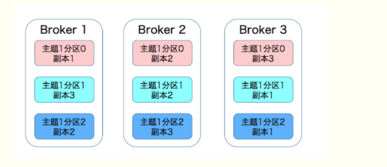


### （4）Kafka如何保证同一个分区下的所有副本保存有相同的消息队列

Kafka是基于领导者的副本机制

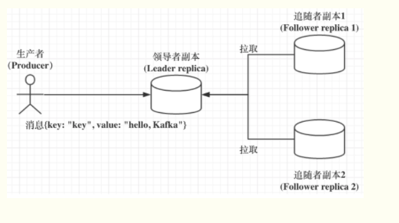

1、kafka中分成两类副本：领导者副本（leader replica）和追随者副本（follower replica），每个分区在创建时都要选举一个副本，称为领导者副本，其余的副本称为追随者副本

2、从副本不提供读写服务，所有读写请求都会在主副本上

3、主副本所在的Broker宕机后，kafka依托于zk提供的监控功能能够实时感知并开启新一轮的leader选举。在从副本中选出leader，老leader重启回来后，只能作为从副本加入集群。


### （5）Kafka从副本在什么条件下才算与Leader同步

Kafka引入了 In-Sync-Replicas，即是所谓的ISR副本集合，ISR中的副本都是与Leader同步的副本


### （6） kafka In-sync Replicas（ISR） 

1、ISR不只是从副本集合，也包括Leader副本，有时候，ISR只有主副本存在

2、通过Broker端replica.lag.time.max.ms参数 （Follower 副本能够落后 Leader 副本的最长时间间隔）值来控制哪个追随者副本与 Leader 同步？只要一个 Follower 副本落后 Leader 副本的时间不连续超过 10 秒，那么 Kafka 就认为该 Follower 副本与 Leader 是同步的，即使此时 Follower 副本中保存的消息明显少于 Leader 副本中的消息。 

3、ISR是一个动态调整的集合，非静态不变
某个追随者副本从领导者副本中拉取数据的过程持续慢于 Leader 副本的消息写入速度，那么在 replica.lag.time.max.ms 时间后，此 Follower 副本就会被认为是与 Leader 副本不同步的，因此不能再放入 ISR 中。此时，Kafka 会自动收缩 ISR 集合，将该副本“踢出”ISR。

倘若该副本后面慢慢地追上了 Leader 的进度，那么它是能够重新被加回 ISR 的。

4、ISR集合为空则Leader副本也挂了，这个分区就不可用了


### （7）如何选举

1、ISR不为空，从ISR中选举

2、ISR为空，Kafka也可从不在ISR中的存活副本中选举，这个称为Unclean领导者选举。，通过Broker 端参数 unclean.leader.election.enable 控制是否允许 Unclean 领导者选举。开启 Unclean 领导者选举可能会造成数据丢失，但好处是，它使得分区 Leader 副本一直存在，不至于停止对外提供服务，因此提升了高可用性。反之，禁止 Unclean 领导者选举的好处在于维护了数据的一致性，避免了消息丢失，但牺牲了高可用性。


## 10、如何保证消息消费一次且只消费一次？

精确一次处理语义（exactly onece semantic-EOS），Kafka的EOS主要体现在3个方面：

（1）幂等producer： 保证单个分区的只发送一次，不会出现重复消息

（2）事务transaction：保证原子性的写入多个分区，即写入到多个分区的消息要么全部成功，要么全部回滚。

（3）流式EOS：流处理本质上可看成是“读取-处理-写入管道”。整个过程的操作是原子性的。


幂等producer只能保证单个分区上无重复消息

事务可保证多分区写入消息的完整性

流式EOS保证的是端到端消息处理的EOS


**启用方法：**

（1）启用幂等producer：在producer程序中设置属性`enabled.idempotence=true`，但不要设置transactional_id。

（2）启用事务支持：在producer程序中设置属性`transactional.id`为一个指定的字符串，同时设置`enabled.idempotence=true`

（3）启用流处理EOS：在Kafka Streams程序中设置`processing.guarantee=exactly_once`


**幂等producer：**

producer.send的逻辑是幂等的，即发送相同的Kafka消息，broker端不会重复写入。同一条消息kafka保证底层日志中指挥持久化一次，既不会丢失也不会重复。

幂等可极大地减轻下游consumer系统实现消息去重的工作负担。

幂等producer提供的语义保证是有条件的：

- 单分区幂等性：幂等producer无法实现多分区上的幂等性，若要实现多分区上的原子性，需要引入事务
- 单会话幂等性：幂等producer无法跨会话实现幂等性，即使同一个producer宕机并重启也无法保证消息的EOS语义


*设计原理：*

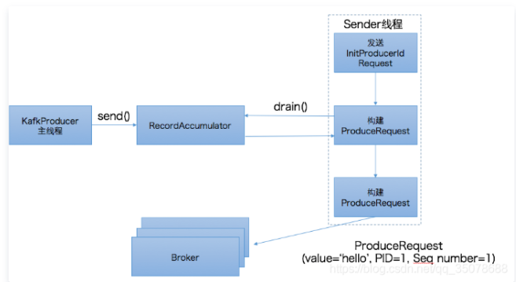


Kafka实现幂等producer的设计思路：

　　1. 为每个producer设置唯一的PID；

　　2. 引入seq number以及broker端seq number缓存更新机制来去重。

和consumer端的offset类似，seq number从0开始计数并严格单调增加，同时在broker端会为每个PID保存该producer发送过来的消息batch的某些元信息：比如PID信息、消息batch的起始seq number及结束seq number等。

每当PID发送新的消息batch时，kafka broker就会对比这些消息，如果发生冲突（比如起始seq number和结束seq number与当前缓存的相同），那么broker就会拒绝这次写入请求，如果没有冲突，那么broker端就会更新这部分缓存然后在开始写入消息。


### **（1）kafka如何保证消息仅被消费一次？**


#### **1、重复消费（最少一次消费语义实现）：**

 消费数据处理业务完成后，然后提交offset，因为在提交offset的过程中，可能会出现提交失败的情况，已经消费了数据，但是offset没提交，从而导致数据重复消费。


解决方法：

至少成功发送一次 + 去重操作（幂等性）

1、如何保证至少成功发送一次？

保证不丢失消息：

生产者（ack=all 代表至少成功发送一次)

消费者 （offset手动提交，业务逻辑成功处理后，提交offset）去重问题：消息可以使用唯一id标识

2、保证消费幂等性：

落表（主键或者唯一索引的方式，避免重复数据）。


业务逻辑处理（选择唯一主键存储到[Redis](https://cloud.tencent.com/product/crs?from=10680)或者mongdb中，先查询是否存在，若存在则不处理；若不存在，先插入Redis或Mongdb,再进行业务逻辑处理）。


#### 2、丢失数据（最多一次消费语义实现）

在消费数据业务“处理前”进行offset提交。因为在后续数据业务处理过程中，如果出现故障，没有消费到消息，那么将导致数据丢失。为了避免数据丢失，可以设置：

`enable.auto.commit=false`  关闭自动提交位移，这样，在消息被完整处理之后再手动提交位移。

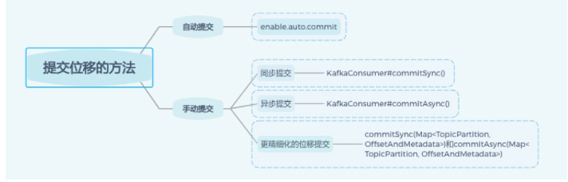

丢包：指发送方发送的数据未到达接收方。常见的丢包可能发生在发送端，网络，接收端。


解决方案：

对kafka进行限速，平滑流量

启用重试机制，重试间隔时间设置长一些。

Kafka设置acks=all，即需要相应的所有处于ISR的分区都确认收到该消息后，才算发送成功。

说明：假如 leader 副本所在的 broker 突然挂掉，那么就要从 follower 副本重新选出一个 leader ，但是 leader 的数据还有一些没有被 follower 副本的同步的话，就会造成消息丢失。

解决办法就是，设置 acks = all。

acks 是 Kafka 生产者(Producer) 很重要的一个参数。

acks 的默认值即为1，代表我们的消息被leader副本接收之后就算被成功发送。当我们配置 acks = all 代表则所有副本都要接收到该消息之后该消息才算真正成功被发送。

从kafka的消费机制，我们可以得到是否能够精确的消费关键在消费进度信息的准确性，如果能够保证消费进度的准确性，也就保证了消费数据的准确性。

数据有状态：可以根据数据信息进行确认数据是否重复消费，这时候可以使用手动提交的最少一次消费语义实现，即使消费的数据有重复，可以通过状态进行数据去重，以达到幂等的效果。

存储数据容器具备幂等性：在数据存入的容器具备天然的幂等（比如ElasticSearch的put操作具备幂等性，相同的数据多次执行Put操作和一次执行Put操作的结果是一致的），这样的场景也可以使用手动提交的最少一次消费语义实现，由存储数据端来进行数据去重。

数据无状态，并且存储容器不具备幂等：这种场景需要自行控制offset的准确性，这里数据不具备状态，存储使用关系型[数据库](https://cloud.tencent.com/solution/database?from=10680)，比如MySQL。通过自己管理offset的方式，来确保数据和offset信息是同时变化，通过数据库事务的特性来保证一致性和原子性。

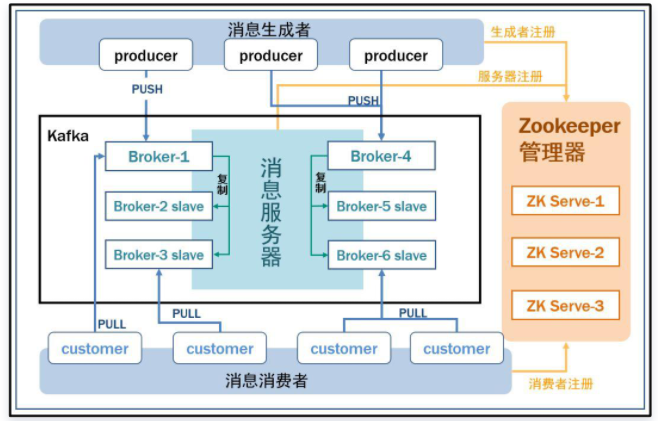


### 2、Kafka的ISR机制是什么？

就是会自动给每个 Partition 维护一个 ISR 列表，这个列表里一定会有 Leader，然后还会包含跟 Leader 保持同步的 Follower。

也就是说，只要 Leader 的某个 Follower 一直跟他保持数据同步，那么就会存在于 ISR 列表里。

但是如果 Follower 因为自身发生一些问题，导致不能及时的从 Leader 同步数据过去，那么这个 Follower 就会被认为是“out-of-sync”，被从 ISR 列表里踢出去。

所以大家先得明白这个 ISR 是什么，说白了，就是 Kafka 自动维护和监控哪些 Follower 及时的跟上了 Leader 的数据同步。

Kafka 写入的数据如何保证不丢失？

所以如果要让写入 Kafka 的数据不丢失，你需要保证如下几点：

-  每个 Partition 都至少得有 1 个 Follower 在 ISR 列表里，跟上了 Leader 的数据同步。

- 每次写入数据的时候，都要求至少写入 Partition Leader 成功，同时还有至少一个 ISR 里的 Follower 也写入成功，才算这个写入是成功了。

- 如果不满足上述两个条件，那就一直写入失败，让生产系统不停的尝试重试，直到满足上述两个条件，然后才能认为写入成功。

- 按照上述思路去配置相应的参数，才能保证写入 Kafka 的数据不会丢失。


第一条，必须要求至少一个 Follower 在 ISR 列表里。

那必须的啊，要是 Leader 没有 Follower 了，或者是 Follower 都没法及时同步 Leader 数据，那么这个事儿肯定就没法弄下去了。

第二条，每次写入数据的时候，要求 Leader 写入成功以外，至少一个 ISR 里的 Follower 也写成功。

这个要求就是保证说，每次写数据，必须是 Leader 和 Follower 都写成功了，才能算是写成功，保证一条数据必须有两个以上的副本。

这个时候万一 Leader 宕机，就可以切换到那个 Follower 上去，那么 Follower 上是有刚写入的数据的，此时数据就不会丢失了。


### 3、总结

消费端重复消费：利用去重表解决

消费端丢失数据：关闭自动提交offset，处理完之后受到移位。

生产端重复发送：消费端消费之前去重就行了

生产端丢失数据：这个是最麻烦的情况。

解决策略：

1.异步方式缓冲区满了，就阻塞在那，等着缓冲区可用，不能清空缓冲区。

2.发送消息之后回调函数，发送成功就发送下一条，发送失败就记在日志中，等着定时脚本来扫描。（发送失败可能并不真的发送失败，只是没收到反馈，定时脚本可能会重发）。


### 4、如何保证有序

如果有一个发送失败了，后面的就不能继续发了，不然重发的那个肯定乱序了。

生产者在收到发送成功的反馈之前，不能发下一条数据，但我感觉生产者是一个流，阻塞生产者感觉业务上不可行，怎么会因为一条消息发出去没收到反馈，就阻塞生产者。

同步发送模式：发出消息后，必须阻塞等待收到通知后，才发送下一条消息。

异步发送模式：一直往缓冲区写，然后一把写到队列中去。

两种都是各有利弊：

同步发送模式虽然吞吐量小，但是发一条收到确认后再发下一条，既能保证不丢失消息，又能保证顺序。

设置 acks = all。

设置 replication.factor >= 3

为了保证 leader 副本能有 follower 副本能同步消息，我们一般会为 topic 设置 replication.factor >= 3。这样就可以保证每个 分区(partition) 至少有 3 个副本。虽然造成了数据冗余，但是带来了数据的安全性。

设置 min.insync.replicas > 1

一般情况下我们还需要设置 min.insync.replicas> 1 ，这样配置代表消息至少要被写入到 2 个副本才算是被成功发送。min.insync.replicas 的默认值为 1 ，在实际生产中应尽量避免默认值 1。

但是，为了保证整个 Kafka 服务的高可用性，你需要确保 replication.factor > min.insync.replicas 。为什么呢？设想一下加入两者相等的话，只要是有一个副本挂掉，整个分区就无法正常工作了。这明显违反高可用性！一般推荐设置成 replication.factor = min.insync.replicas + 1。

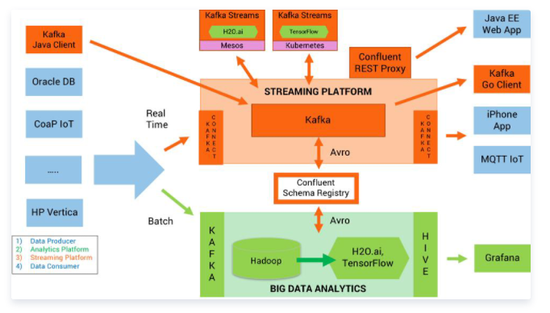


## 11、Kafka消费失败后该怎么处理？

### （1）背景

kafka没有重试机制，不支持消息重试，也没有死信队列。

因此kafka做消息队列时，如果遇到了消息在业务处理时出现异常，就很难进行下一步处理，需要自己实现消息重试功能。

RocketMQ的消息重试机制相当完善。


### （2）方案

申请一个新的kafka topic作为重试队列，步骤如下：

- 创建一个topic作为重试topic用于接受等待重试的消息
- 普通topic消费者给待重试的消息设置下一次的消费事件后发送到重试topic
- 从重试topic获取待重试消息储存到redis的zset中，并以下一次消费时间排序
- 定时任务从redis获取到达消费时间的消息，并把消息发送到对应的topic
- 同一个消息重试次数过多则不再重试


### （3）概念

**死信队列：**

当一条消息初次消费失败，MQ会自动进行消息重试；达到最大重试次数后，若消费依然失败，则表明消费者在正常情况下无法正确的消费该消息，此时MQ不会立刻将消息丢弃，而是
将其发送到该消费者对应的特殊队列中，这种正常情况下无法被消费的消息称为**死信消息（Dead-Letter Message）**，存储死信消息的特殊队列就称为**死信队列**


**回退队列：**

消费者在消费时发生了异常，就不会对这次消费进行确认（ACK，如果是kafka，则需要关闭自动提交），进而发生回滚消息的操作之后，消息始终会放在队列头，然后不断的回滚和处理，导致陷入死循环。
为解决这问题，可为每个队列设置一个回退队列，它和死信队列都是为异常的处理提供的一种机制保障。

**重试队列：**

回退队列的一种，具体指消费端消费消息失败时，为防止消息无故丢失而重新将消息回滚到Broker中。
与回退队列不同的是重试队列一般分成多个重试等级，每个重试等级一般也会设置重新投递延时，重试次数越多投递延时就越大。

举个例子：
消息第一次消费失败入重试队列Q1，Q1的重新投递延迟为5s，在5s过后重新投递该消息；如果消息再次消费失败则入重试队列Q2，Q2的重新投递延迟为10s，在10s过后再次投递该消息。
以此类推，重试越多次重新投递的时间就越久，为此需要设置一个上限，超过投递次数就入死信队列。
重试队列与延迟队列有相同的地方，都是需要设置延迟级别，它们彼此的区别是：延迟队列动作由内部触发，重试队列动作由外部消费端触发；延迟队列作用一次，而重试队列的作用范围会向后传递。


### （4）Spring-Kafka

Spring-Kafka 提供消费重试的机制，当消息消费失败时，Spring-Kafka会通过消费重试机制，重新投递该消息给Consumer，让Consumer重新消费消息

默认情况下，Spring-Kafka达到配置的重试次数时（每条消息的失败重试时间，由配置的时间间隔决定），Consumer如果依然消费失败，那么该消息就会进入死信队列

Spring-Kafka封装了消费重试和死信队列，将正常情况下无法被消费的消息称为**死信消息**，将存储死信消息的队列称为**死信队列**


参考：https://blog.csdn.net/yangshangwei/article/details/113846000


## 12、压缩

在kafka中，压缩可能发生在两个地方：生产者端、Broker端

**生产者端：**

``` 
 Properties props = new Properties();
 props.put("bootstrap.servers", "localhost:9092");
 props.put("acks", "all");
 props.put("key.serializer", "org.apache.kafka.common.serialization.StringSerializer");
 props.put("value.serializer", "org.apache.kafka.common.serialization.StringSerializer");
 // 开启 GZIP 压缩
 props.put("compression.type", "gzip");
 
 Producer<String, String> producer = new KafkaProducer<>(props);
```

配置了`compression.type` 属性后，Producer启动后发送的每条消息集合都是经过GZIP压缩过的，能很好的节省网络传输带宽以及Broker端的磁盘占用。


**Broker端进行压缩的情况有两种：**

（1）Broker端的压缩算法跟producer端的不一样

但默认broker端的 `compression.type = producer` 表示跟producer一样

（2）Broker端发生了消息格式转换

主要是为了兼容老版本的消费者程序。Kafka集群中同时保存多种版本的消息格式是很常见的，为了兼容，通常需要加解压进行格式转换。

此时会让kafka丧失掉 零拷贝 的特性。


Kafka会将启用了何种压缩算法封装到消息集合中，这样consumer读取到消息集合时候，就能获取压缩算法类型进行解压缩。

**Producer 端压缩、Broker 端保持、Consumer 端解压缩**

Broker 端也会进行解压缩。注意了，这和前面提到消息格式转换时发生的解压缩是不同的场景。
每个压缩过的消息集合在 Broker 端写入时都要发生解压缩操作，目的就是为了对消息执行各种验证。
这种会对Broker的CPU负载造成影响

压缩算法对比：

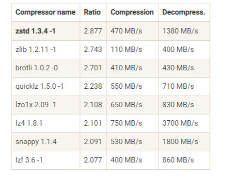


## 13、Kafka无消息丢失配置

（1）不要使用producer.send(msg)，这是异步发送的方法，如果发生网络抖动等情况，失败了就无从得知，需要使用带回调的方法 producer.send(msg,callback)

（2）设置ack = all，表示所有副本都提交成功，再返回给producer确认

（3）设置retries，这个参数是producer的自动重试次数

（4）设置unclean.leader.election.enable = false ， 在选举leader时只从ISR中选取

（5）设置replication.factor >= 3 ，这是broker参数

（6）设置 min.insync.replicas > 1， 这是broker参数，控制的是消息至少要被写入到多少个副本才算是“已提交”，设置成大于1可提升消息持久性

（7）确保replication.factor > min.insync.replicas。如果两者相等，那么只要一个副本挂机，整个分区就无法正常工作，
    推荐是 replication.factory = min.insync.replicas + 1
    
（8）确保消息消费完再提交，关闭kafka自动提交功能，Consumber参数 enable.auto.commit = false，采用手动提交位移的方式。


## 14、Java Producer如何管理TCP连接

（1）KafkaProducer 实例创建时启动 Sender 线程，从而创建与 bootstrap.servers 中所有 Broker 的 TCP 连接。

（2）KafkaProducer 实例首次更新元数据信息之后，还会再次创建与集群中所有 Broker 的 TCP 连接。

（3）如果 Producer 端发送消息到某台 Broker 时发现没有与该 Broker 的 TCP 连接，那么也会立即创建连接。

（4）如果设置 Producer 端 connections.max.idle.ms 参数大于 0，则步骤 1 中创建的 TCP 连接会被自动关闭；如果设置该参数 =-1，那么步骤 1 中创建的 TCP 连接将无法被关闭，从而成为“僵尸”连接。


## 15、Kafka中的位移主题（__consumber_offsets）

老版本的kafka的consumer_offset信息是保存在zk中，但zk不适合高频读写的一个操作

新版本的位移管理机制是将Consumber的位移数据作为一条条普通的Kafka消息，提交到__consumber_offsets中，这个topic的主要作用是保存kafka消费者的位移消息。

位移主题的 Key 中应该保存 3 部分内容：<Group ID，主题名，分区号 >


当 Kafka 集群中的第一个 Consumer 程序启动时，Kafka 会自动创建位移主题，分区数默认是50，副本数是3

目前 Kafka Consumer 提交位移的方式有两种：自动提交位移和手动提交位移。

Consumer 端有个参数叫 enable.auto.commit，如果值是 true，则 Consumer 在后台默默地为你定期提交位移，提交间隔由一个专属的参数 auto.commit.interval.ms 来控制。

如果选择的是自动提交位移，那么就可能存在一个问题：只要 Consumer 一直启动着，它就会无限期地向位移主题写入消息。

假设 Consumer 当前消费到了某个主题的最新一条消息，位移是 100，之后该主题没有任何新消息产生，故 Consumer 无消息可消费了，所以位移永远保持在 100。由于是自动提交位移，位移主题中会不停地写入位移 =100 的消息。显然 Kafka 只需要保留这类消息中的最新一条就可以了，之前的消息都是可以删除的。这就要求 Kafka 必须要有针对位移主题消息特点的消息删除策略，否则这种消息会越来越多，最终撑爆整个磁盘。

Kafka 使用Compact 策略来删除位移主题中的过期消息，避免该主题无限期膨胀。那么应该如何定义 Compact 策略中的过期呢？对于同一个 Key 的两条消息 M1 和 M2，如果 M1 的发送时间早于 M2，那么 M1 就是过期消息。Compact 的过程就是扫描日志的所有消息，剔除那些过期的消息，然后把剩下的消息整理在一起。我在这里贴一张来自官网的图片，来说明 Compact 过程。

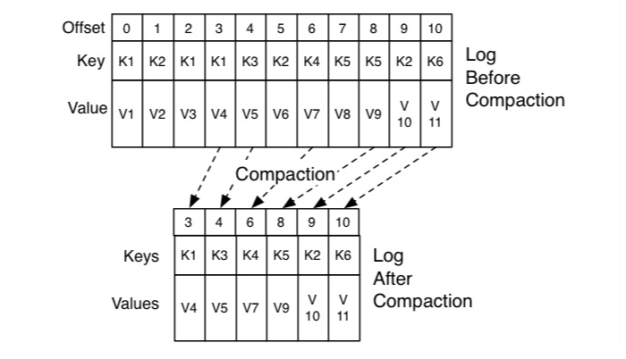

Kafka 提供了专门的后台线程定期地巡检待 Compact 的主题，看看是否存在满足条件的可删除数据。


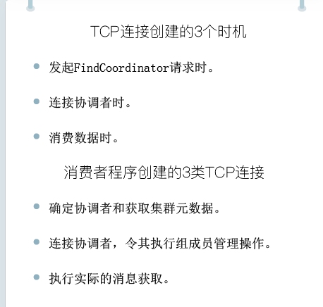

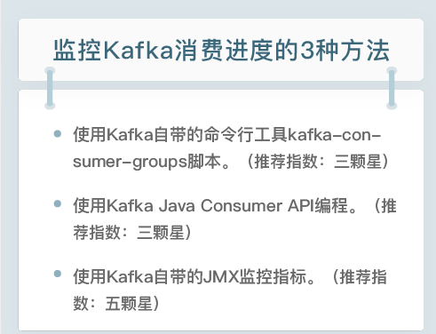


## 16、Kafka的网络IO模型

Kafka自定义了一组请求协议，所有的请求都是通过TCP网络以socket的方式进行通讯的。


Kafka使用的是Reactor模式。

Reactor模式是事件驱动架构的一种实现方式，特别适合应用于处理多个客户端并发向服务器端发送请求的场景。

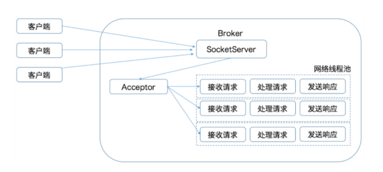


kafka的Broker端有个SocketServer组件，类似于Reactor模式中的Dispatcher，也有对应的Acceptor线程和一个工作线程池，
只不过在kafka中，这个工作线程池有个专属的名字，叫网络线程池。

Kafka 提供了 Broker 端参数 num.network.threads，用于调整该网络线程池的线程数。其默认值是 3，表示每台 Broker 启动时会创建 3 个网络线程，专门处理客户端发送的请求。

Acceptor线程采用轮询方式将入站请求公平的发到所有网络线程中。

Kafka在其中又做了一层异步线程池的处理。

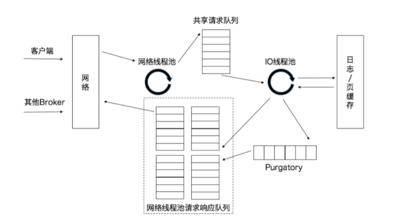

当网络线程拿到请求后，会将请求放入到一个共享请求队列中，Broker端还有个IO线程池，负责从该队列中取出请求，执行真正的处理。
如果是producer请求，则将消息写入到磁盘，如果是fetch请求，则从磁盘或也缓存中读取消息。

IO 线程池处中的线程才是执行请求逻辑的线程。Broker 端参数num.io.threads控制了这个线程池中的线程数。目前该参数默认值是 8，表示每台 Broker 启动后自动创建 8 个 IO 线程处理请求。

当 IO 线程处理完请求后，会将生成的响应发送到网络线程池的响应队列中，然后由对应的网络线程负责将 Response 返还给客户端。


请求队列是所有网络线程共享的，而响应队列则是每个网络线程专属的。这么设计的原因就在于，Dispatcher 只是用于请求分发而不负责响应回传，因此只能让每个网络线程自己发送 Response 给客户端，所以这些 Response 也就没必要放在一个公共的地方。

有一个叫 Purgatory 的组件，这是 Kafka 中著名的“炼狱”组件。它是用来缓存延时请求（Delayed Request）的。所谓延时请求，就是那些一时未满足条件不能立刻处理的请求。比如设置了 acks=all 的 PRODUCE 请求，一旦设置了 acks=all，那么该请求就必须等待 ISR 中所有副本都接收了消息后才能返回，此时处理该请求的 IO 线程就必须等待其他 Broker 的写入结果。当请求不能立刻处理时，它就会暂存在 Purgatory 中。稍后一旦满足了完成条件，IO 线程会继续处理该请求，并将 Response 放入对应网络线程的响应队列中。


## 17、高水位和Leader Epoch机制

**高水位的作用**

在 Kafka 中，高水位的作用主要有 2 个。

- 定义消息可见性，即用来标识分区下的哪些消息是可以被消费者消费的。
- 帮助 Kafka 完成副本同步。

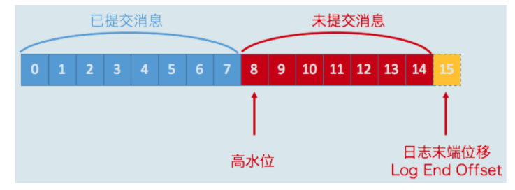

上图中8是HW，在高水位以下的消息是已提交消息，反之就是未提交消息。

消费者只能消费已提交消息，也就是位移小于8的所有消息。

注意：位移值等于高水位的消息也属于未提交消息，也就是说，高水位上的消息是不能被消费者消费的。


日志末端位移，Log End Offset，简写是LEO，表示副本写入下一条消息的位移值

同一个副本对象，其高水位值不会大于LEO值

高水位和LEO是副本对象的两个重要属性，Kafka所有副本都有对应的HW和LEO，而不仅仅是Leader副本。分区的高水位就是其leader副本的高水位。


### （1）高水位更新机制

每个副本都保存有自身的HW和LEO，但Leader副本比较特殊的是它还保存这其他Follow副本（远程副本）的HW和LEO

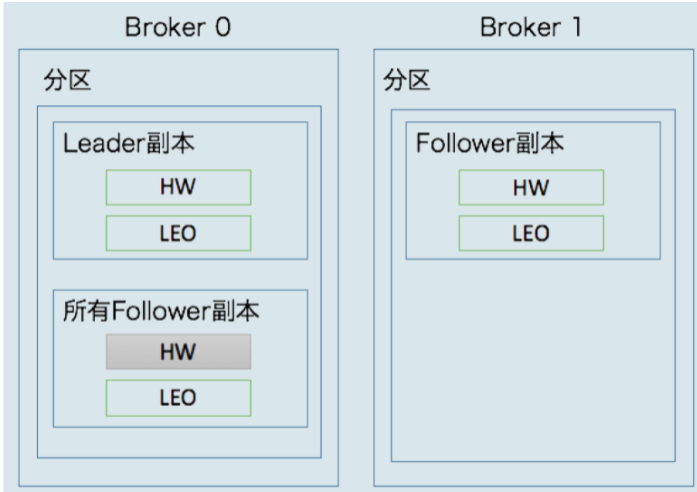

Kafka会更新Follow副本的HW和LEO，同时也会更新Leader副本上的HW、LEO以及远程副本的LEO，但不会更新远程副本的HW


**为什么Leader副本所在的Broker上保存远程副本的LEO和HW？**

主要作用是帮助Leader副本确定其高水位，也就是分区高水位

| 更新对象 | 更新时机 |
| --- | --- |
| follow leo | 从Leader副本拉取消息写入磁盘后，更新 |
| leader leo | leader副本接收到生产者消息并写入磁盘后，更新|
| 远程副本 leo | follow从leader拉取消息，会带过来从哪个位移开始拉取，leader用这个位移值来更新远程副本的leo |
| follow hw | follow更新完leo后，比较leo和leader发过来的hw，两者较小值就是新的follow hw |
| leader hw | leader更新leo后或者更新完远程leo后，从这俩值中取较小值|


与 Leader 副本保持同步。判断的条件有两个。

1.该远程 Follower 副本在 ISR 中。

2.该远程 Follower 副本 LEO 值落后于 Leader 副本 LEO 值的时间，不超过 Broker 端参数 replica.lag.time.max.ms 的值。如果使用默认值的话，就是不超过 10 秒。


**Leader 副本**

处理生产者请求的逻辑如下：

写入消息到本地磁盘。
更新分区高水位值。
i. 获取 Leader 副本所在 Broker 端保存的所有远程副本 LEO 值{LEO-1，LEO-2，……，LEO-n}。
ii. 获取 Leader 副本高水位值：currentHW。
iii. 更新 currentHW = min(currentHW, LEO-1，LEO-2，……，LEO-n)。
处理 Follower 副本拉取消息的逻辑如下：

读取磁盘（或页缓存）中的消息数据。
使用 Follower 副本发送请求中的位移值更新远程副本 LEO 值。
更新分区高水位值（具体步骤与处理生产者请求的步骤相同）。

**Follower 副本**

从 Leader 拉取消息的处理逻辑如下：

写入消息到本地磁盘。
更新 LEO 值。
更新高水位值。
i. 获取 Leader 发送的高水位值：currentHW。
ii. 获取步骤 2 中更新过的 LEO 值：currentLEO。
iii. 更新高水位为 min(currentHW, currentLEO)。


### （2）Leader Epoch

follow副本的高水位更新需要一轮额外的拉取请求才能实现，如果有多个follow副本，也许需要多轮拉取请求，
也就是说，Leader 副本高水位更新和 Follower 副本高水位更新在时间上是存在错配的。这种错配是很多“数据丢失”或“数据不一致”问题的根源。
基于此，社区在 0.11 版本正式引入了 Leader Epoch 概念，来规避因高水位更新错配导致的各种不一致问题。


所谓 Leader Epoch，我们大致可以认为是 Leader 版本。它由两部分数据组成。

1、Epoch。一个单调增加的版本号。每当副本领导权发生变更时，都会增加该版本号。小版本号的 Leader 被认为是过期 Leader，不能再行使 Leader 权力。
2、起始位移（Start Offset）。Leader 副本在该 Epoch 值上写入的首条消息的位移。

假设现在有两个 Leader Epoch<0, 0> 和 <1, 120>，那么，第一个 Leader Epoch 表示版本号是 0，这个版本的 Leader 从位移 0 开始保存消息，一共保存了 120 条消息。之后，Leader 发生了变更，版本号增加到 1，新版本的起始位移是 120。

Kafka Broker 会在内存中为每个分区都缓存 Leader Epoch 数据，同时它还会定期地将这些信息持久化到一个 checkpoint 文件中。
当 Leader 副本写入消息到磁盘时，Broker 会尝试更新这部分缓存。
如果该 Leader 是首次写入消息，那么 Broker 会向缓存中增加一个 Leader Epoch 条目，否则就不做更新。
这样，每次有 Leader 变更时，新的 Leader 副本会查询这部分缓存，取出对应的 Leader Epoch 的起始位移，以避免数据丢失和不一致的情况。


## 18、重设消费者位移


### （1）七种策略

- Earliest： 把位移调整到当前最早位移处
- Latest：把位移调整到当前最新位移处
- Current：把位移调整到当前最新提交位移处
- Specified-Offset：把唯一调整成指定位移
- Shift-By-N：把位移调整到当前位移+N处
- DateTime：把位移调整到大于给定时间的最小位移处
- Duration：把位移调整到距离当前时间指定间隔的位移处


### （2）两种方法

- 通过Java API方式重设位移：调用KafkaConsumer的seek方法，或者是它的扩展方法seekToBeginning和seekToEnd
- 用命令行方式重设位移。


## 19、监控Kafka的3个维度


### （1）主机监控

监控Kafka集群Broker所在的节点机器的性能


常见主机监控指标：机器负载、CPU只用率、内存使用率、磁盘IO使用率、网络IO使用率、TCP连接数，fd数以及inode使用情况


### （2）JVM监控

Full GC的频率和时间、活跃对象大小和应用线程总数


### （3）集群监控

- 查看Broker进程是否活动、端口是否建立
- 查看broker端关键日志
- 查看broker端关键线程的运行状态
- 查看broker端的关键JMX指标
- 监控kafka客户端


## 20、Kafka调优


#### （1）目标

高吞吐量、低延时


### （2）优化漏斗

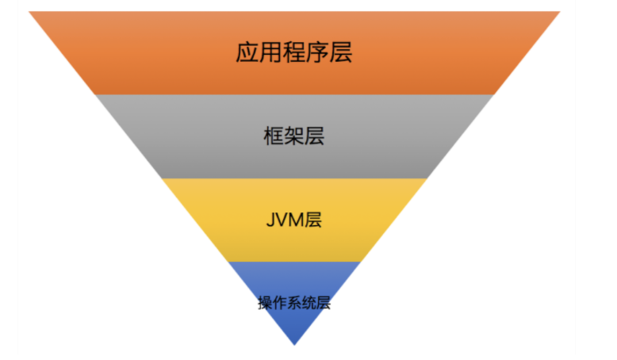


**第 1 层：应用程序层**。它是指优化 Kafka 客户端应用程序代码。比如，使用合理的数据结构、缓存计算开销大的运算结果，抑或是复用构造成本高的对象实例等。这一层的优化效果最为明显，通常也是比较简单的。

**第 2 层：框架层**。它指的是合理设置 Kafka 集群的各种参数。毕竟，直接修改 Kafka 源码进行调优并不容易，但根据实际场景恰当地配置关键参数的值，还是很容易实现的。

**第 3 层：JVM 层**。Kafka Broker 进程是普通的 JVM 进程，各种对 JVM 的优化在这里也是适用的。优化这一层的效果虽然比不上前两层，但有时也能带来巨大的改善效果。

**第 4 层：操作系统层**。对操作系统层的优化很重要，但效果往往不如想象得那么好。与应用程序层的优化效果相比，它是有很大差距的。


### （3）操作系统层

挂载文件系统时禁掉atime更新

选择ext4或XFS文件系统

swap空间设置

页缓存大小


### （4）JVM层

堆设置和GC收集器


### （5）Broker端

保持服务端和客户端版本一致


### （6）应用层

不要频繁创建Producer和Consumer对象实例；用完即使关闭；合理利用多线程来改善性能


## 21、Kafka源码

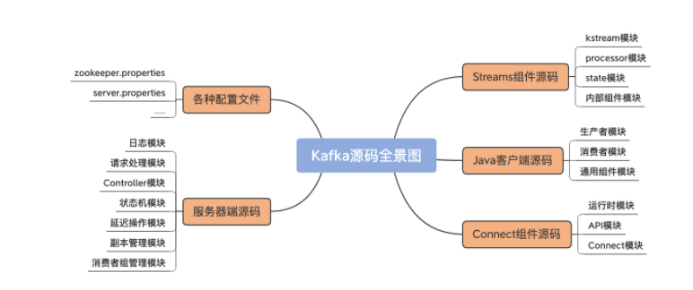


从功能上看，Kafka源码分为四大模块：

- 服务器端源码：实现Kafka架构和各类优秀特性的基础
- Java客户端源码：定义了与Broker端的交互机制，以及通用的Broker端组件支撑代码
- Connect源码： 用于实现Kafka与外部系统的高性能数据传输
- Streams源码： 用于实现实时的流处理功能。


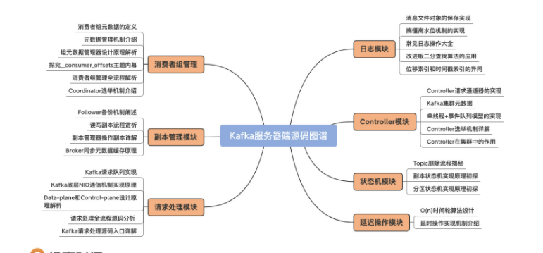


### （1）环境准备

kafka 代码：https://github.com/apache/kafka.git
jdk1.8
scala-2.13以上
gradle5.4以上


代码下载之后，更换maven地址，不然构建很慢：
``` 
buildscript {
    repositories {
        maven {
            url 'http://maven.aliyun.com/nexus/content/groups/public/'
        }
        maven {
            url 'http://maven.aliyun.com/nexus/content/repositories/jcenter'
        }
    }
}
 
allprojects {
    repositories {
        maven {
            url 'http://maven.aliyun.com/nexus/content/groups/public/'
        }
        maven {
            url 'http://maven.aliyun.com/nexus/content/repositories/jcenter'
        }
    }
}
```


## 问题：
### 1、kafka 报错：kafka server：Message was too large ，server rejected it to avoid allocation
https://blog.csdn.net/yizhiniu_xuyw/article/details/108881728
原因分析：
查看kafka配置，默认单条消息最大为1M，当单条消息长度超过1M时，就会出现发送到broker
失败，从而导致消息在producer的队列中一直累积，直到撑爆生产者的内存。
 
于是赶紧修改kafka配置，解决问题。主要修改步骤如下：
1.修改kafka的broker配置：message.max.bytes（默认:1000000B），这个参数表示单条
消息的最大长度。在使用kafka的时候，应该预估单条消息的最大长度，不然导致发送失败。
2.修改kafka的broker配置：replica.fetch.max.bytes (默认: 1MB)，broker可复制的
消息的最大字节数。这个值应该比message.max.bytes大，否则broker会接收此消息，但无
法将此消息复制出去，从而造成数据丢失。
3.修改消费者程序端配置：fetch.message.max.bytes (默认 1MB) – 消费者能读取的最大
消息。这个值应该大于或等于message.max.bytes。如果不调节这个参数，就会导致消费者无
法消费到消息，并且不会爆出异常或者警告，导致消息在broker中累积，此处要注意。
需要考虑的问题：
 1.从性能上考虑：通过性能测试，kafka在消息为10K时吞吐量达到最大，更大的消息会降低
吞吐量，在设计集群的容量时，尤其要考虑这点。
2.可用的内存和分区数：Brokers会为每个分区分配replica.fetch.max.bytes参数指定的
内存空间，假设replica.fetch.max.bytes=1M，且有1000个分区，则需要差不多1G的内存，
确保 分区数*最大的消息不会超过服务器的内存，否则会报OOM错误。同样地，消费端
的fetch.message.max.bytes指定了最大消息需要的内存空间，同样，分区数*最大需要内存
空间不能超过服务器的内存。所以，如果你有大的消息要传送，则在内存一定的情况下，只
能使用较少的分区数或者使用更大内存的服务器。
3.垃圾回收：更大的消息会让GC的时间更长（因为broker需要分配更大的块），随时关注GC的
日志和服务器的日志信息。如果长时间的GC导致kafka丢失了zookeeper的会话，则需要配
置zookeeper.session.timeout.ms参数为更大的超时时间。
 
 
解决办法：
 
在kafka的文件server.properties中添加如下三个个配置项，均设置为标准的10M：
 
#broker能接收消息的最大字节数
message.max.bytes=10485760    (10M)
#broker可复制的消息的最大字节数
replica.fetch.max.bytes=10485760   (10M)
#消费者端的可读取的最大消息
fetch.message.max.bytes=10485760    (10M)
 
或者在启动的时候加入到参数后面：
bin/kafka-topics.sh --zookeeper localhost:2181 --alter --topic my-topic --config max.message.bytes=128000