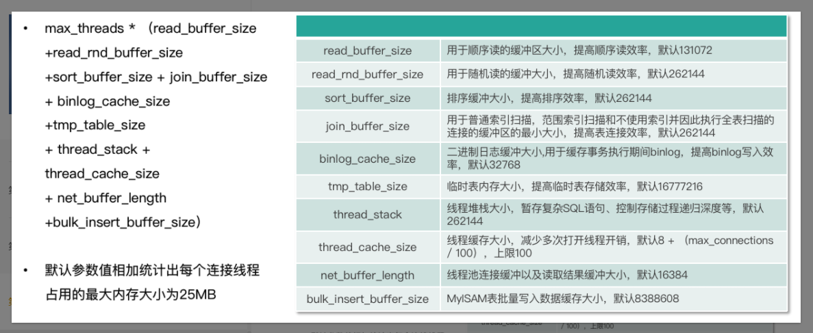
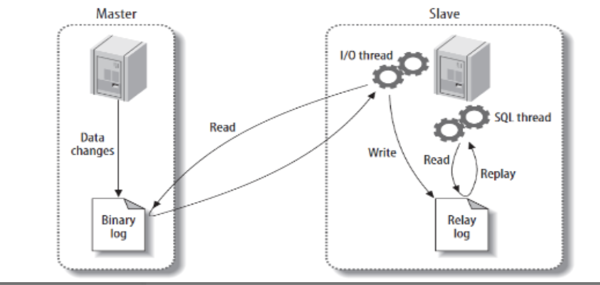
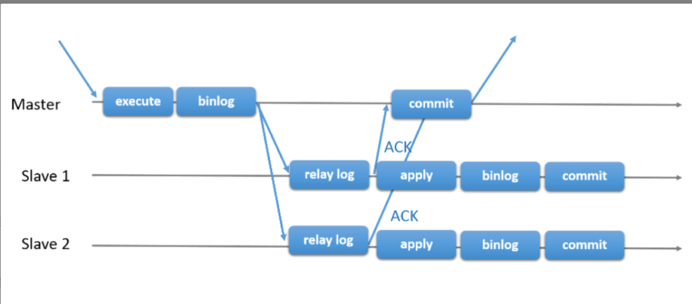

#  MySQL


## EXPLAIN


参考文档：https://blog.csdn.net/Dreamhai/article/details/104558854


| 字段          | 解释                                                         |
| ------------- | ------------------------------------------------------------ |
| id            | select查询的序列号，包含一组数字，表示查询中执行select子句或操作表的顺序 |
| select_type   | 查询类型                                                     |
| table         | 正在访问哪个表                                               |
| partitions    | 匹配的分区                                                   |
| type          | 访问的类型                                                   |
| possible_keys | 显示可能应用在这张表中的索引，一个或多个，但不一定实际使用到 |
| key           | 实际使用到的索引，如果为NULL，则没有使用索引                 |
| key_len       | 表示索引中使用的字节数，可通过该列计算查询中使用的索引的长度 |
| ref           | 显示索引的哪一列被使用了，如果可能的话，是一个常数，哪些列或常量被用于查找索引列上的值 |
| rows          | 根据表统计信息及索引选用情况，大致估算出找到所需的记录所需读取的行数 |
| filtered      | 查询的表行占表的百分比                                       |
| Extra         | 包含不适合在其它列中显示但十分重要的额外信息                 |


### EXPLAIN有两个变种

（1）EXPLAIN EXTENDED：为一个Select语句逆向编译执行计划。可以执行SHOW WARNINGS看到生成的语句，可检测查询优化器到底是如何转化语句的。

（2）EXPLAIN PARTITIONS：显示查询将访问的分区。


### EXPLAIN中的列

#### （1）id

1、标识Select所属的行，有几个Select就有几个Id，并且id的顺序是按照select出现的顺序增长的。

2、临时表并不在原SQL中，所以id列为Null。

3、id越大执行优先级越高，id相同则从上往下执行，id为NULL的最后执行。


#### （2）select_type

显示对应行是简单还是复杂select。SIMPLE值表明查询不包括子查询和Union。如果查询有任何复杂的子部分，则最外层部分标记为PRIMARY。

##### SUBQUERY

包含在select列表中的子查询的select，不在From子句中。

##### DERIVED

包含在From子句中的select，MySQL会递归执行并将结果放在一个临时表中，成为派生表，从子查询中派生出来的。

##### UNION

在UNION中的第二个和随后的select被标记为Union。第一个select被标记它以部分外查询来执行。如果UNION被From子句中的子查询包含，那么它的第一个Select会被标记为DERIVED。

##### UNION RESULT

用来从UNION的匿名临时表检索结果的select被标记为UNION RESULT。

##### DEPENDENT

以为着select依赖于外层查询中发现的数据。

##### UNCACHEABLE

select中的某些特性阻止结果被缓存在一个Item_cache中。


#### （3）table

显示当前行的数据是来自哪一张表。


#### （4）type

访问类型，结果值从最好到最坏依次是：

system>const>eq_ref>ref>fulltext>ref_or_null>index_merge>unique_subquery>index_subquery>range>index>ALL

**需要记忆的**
NULL>system>const>eq_ref>ref>range>index>ALL

一般来说，得保证查询至少达到range级别，最好能达到ref。

##### system

表只有一行记录（等于系统表）。

##### const

表示通过索引一次就找到了，通常是用于primary key和unique key。如果将主键置于where中，就能将改查询转换成一个常量。

##### eq_ref

唯一性索引扫描，对于每个索引键，表中只有一条记录与之匹配。常见于主键或唯一索引扫描。

##### ref

非唯一性索引扫描，返回匹配某个单独值得所有行。

##### range

1、只检索给定范围的行，使用一个索引来选择行，key列显示使用了哪个索引

2、一般就是where条件中出现“>”、“<”、“between”、“in”等条件

3、这种范围扫描索引扫描比全表扫描要好，因为它只需要开始于索引的某一点，而结束语另一点，不用扫描全部索引。


#### （5）possible_keys

可能会使用的key


#### （6）key

实际使用的key


#### （7）key_len

索引中使用的字节数，可通过该列计算出查询中使用的索引的长度。长度越短越好。

显示的是索引字段的最大可能长度，并非实际使用长度，根据表定义计算而来，不是通过表内检索而来。

**字符串类型**


1、变长字段需要额外的2个字节（VARCHAR值保存时只保存需要的字符数，另加一个字节来记录长度(如果列声明的长度超过255，则使用两个字节)，所以VARCAHR索引长度计算时候要加2），固定长度字段不需要额外的字节。
2、而NULL都需要1个字节的额外空间,所以索引字段最好不要为NULL，因为NULL让统计更加复杂并且需要额外的存储空间。
3、复合索引有最左前缀的特性，如果复合索引能全部使用上，则是复合索引字段的索引长度之和，这也可以用来判定复合索引是否部分使用，还是全部使用。


**数值类型**


**日期和时间类型**


NOT NULL=字段本身的字段长度
NULL=字段本身的字段长度+1(因为需要有是否为空的标记，这个标记需要占用1个字节)

datetime类型在5.6中字段长度是5个字节，datetime类型在5.5中字段长度是8个字节


#### （8）ref

显示索引的哪一列被使用了，如果可能的话，是一个常数。哪些列或者常量被用于查找索引列上的值。


#### （9）rows

根据表统计信息及索引选用情况，大致估算出找到所需的记录需要读取的行数。


#### （10）extra

| 值                | 描述                                                         |
| ----------------- | ------------------------------------------------------------ |
| Using filesort    | 说明mysql会对数据使用一个外部的索引排序，而不是按照表内的索引顺序进行读取。MySQL中无法利用索引完成的排序操作称为"文件排序" |
| Using temporary   | 使了用临时表保存中间结果,MySQL在对查询结果排序时使用临时表。常见于排序 order by 和分组查询 group by。 |
| Using index       | 表示相应的select操作中使用了覆盖索引(Covering Index)，避免访问了表的数据行，效率不错！   如果同时出现using where，表明索引被用来执行索引键值的查找;   如果没有同时出现using where，表明索引用来读取数据而非执行查找动作 |
| Using where       | 使用了where条件                                              |
| Using join buffer | 使用了连接缓存                                               |
| impossible where  | where子句的值总是false,不能用来获取任何元素                  |
| distinct          | 一单mysql找到了与形相联合匹配的行,就不在搜索了               |


**Using filesort**

会对数据使用一个外部的索引排序，而不是按照表内的索引顺序进行读取。无法利用索引完成的排序操作称为“文件排序”

当发现了有“Using filesort”的地方，实际就是发现了可优化的地方，可以建立相应的索引。

**Using temporary**

使用了临时表保存中间数据，常见于Order by操作和Group by操作中。

**Using index**

使用到了覆盖索引，避免回表。

如果同时出现了Using Where，表示索引被用来执行索引键值的查找，反之则表示索引用来读取数据而非查找操作。

**Using where**

使用where过滤

**Using join buffer**

使用了连接缓存。

```sql
-- 查询MySQl 默认的join_buffer_size
show VARIABLES like '%join_buffer_size%'
```

**impossible where**

where中的子句总是false，不能用来获取任何元组。

**distinct**

一旦找到了与行相匹配的行，就不再进行搜索。


## 一、并发控制

### 1、读写锁

在处理并发读或写时，可通过实现一个由两种类型的锁组成的锁系统来解决问题，这两种类型的锁通常被称为共享锁（SLock）和排他锁（XLock），也称为读锁和写锁。

### 2、锁粒度

#### （1）表锁

最基本的锁策略，开销最小，锁定整张表。读锁不阻塞，当一个用户获取写锁后，其他用户对该表的所有读写操作都会阻塞。

#### （2）行级锁

最大程度支持并发处理，开销也最大。


## 二、事务

MySQL中使用START TRANSACTION语句开始一个事务，使用COMMIT提交事务，使用ROLLBACK回滚事务。

### 1、ACID

#### （1）Atomicity原子性

事务被视为不可分割的最小单元，一个事务中所有操作要么全都成功，要么全都失败。通过 WAL（Write Ahead Log）技术来实现

#### （2）Consistency一致性

数据库总是从一个一致性的状态转换到另外一个一致性的状态。所有事务对一个数据的读取结果都是相同的。是由原子性、持久性、隔离性共同保证的结果


数据的完整性是通过其他三个特性来保证的，包括原子性、隔离性、持久性，而这三个特性，又是通过 Redo/Undo 来保证的，正所谓：合久必分，分久必合，三足鼎力，三分归晋，数据库也是，为了保证数据的完整性，提出来三个特性，这三个特性又是由同一个技术来实现的，所以理解 Redo/Undo 才能理解数据库的本质。


#### （3）Isolation隔离性

一个事务所作的修改在最终提交之前，对其他事务是不可见的。即一个事务内部的操作及使用的数据对其他的并发事务是隔离的。锁和多版本控制就符合隔离性。

#### （4）Durability持久性

一旦事务提交，其所做的修改就会永久保存到数据库中。


### 2、隔离级别

#### （1）READ UNCOMMITTED  未提交读

事务所做的修改，即使未提交，对其他事务也是可见的。事务可以读取未提交的数据，也成为脏读。

#### （2）READ COMMITTED 提交读，也称不可重复读

一个事务从开始直到提交之前，所作的修改对其他事务是不可见的。也称为不可重复读，因为执行多次一样的查询，可能得到不一样的结果。

#### （3）REPEATABLE READ 可重复读

同一个事务中多次读取同样的记录的结果是一样的。可能导致幻读，在多次读取间隙中，可能有其它事务插入新的记录，就会出现幻读。

MySQL的默认事务隔离级别。

#### （4）SERIALIZABLE 可串行化

最高隔离级别，强制事务串行执行，避免了幻读的问题。


### 3、死锁

两个或多个事务在同一资源上相互占用，并请求锁定对方占有的资源，从而导致一直等待的现象。

解决：

数据库实现了各种死锁检测和死锁检测机制。Innodb是将持有最少行级排他锁的事务进行回滚。


### 4、事务日志

使用事务日志，存储引擎在修改表数据时只需要修改其内存拷贝，再把该修改行为记录到硬盘中的事务日志中，而不用每次都将修改的数据持久到磁盘中。

事务日志持久之后，内存中被修改的数据可以慢慢的持久到磁盘中，这就是预写日志（Write-Ahead Logging）。


### 5、并发事务问题及解决方案

#### 脏读

一个事务正在对一条记录做修改，在这个事务完成并提交前，这条记录的数据就处于不一致状态；这时，另一个事务也来读取同一条记录，如果不加控制，第二个事务读取了这些“脏”数据，并据此做进一步的处理，就会产生未提交的数据依赖关系。这种现象被形象的叫作"脏读"（Dirty Reads）。

#### 不可重复读

一个事务在读取某些数据后的某个时间，再次读取以前读过的数据，却发现其读出的数据已经发生了改变、或某些记录已经被删除了！这种现象就叫作“ 不可重复读”（Non-Repeatable Reads）。

#### 幻读

一个事务按相同的查询条件重新读取以前检索过的数据，却发现其他事务插入了满足其查询条件的新数据，这种现象就称为“幻读”（Phantom Reads）。

  

不可重复读重点在于 UPDATA 和 DELETE，而幻读的重点在于 INSERT


## 三、MVCC多版本并发控制

MVCC（Multi-Version Concurrency Control），行级锁的一个变种，在很多情况下避免了加锁操作，开销更低。

通过保存数据在某个时间点的快照来实现。即是不管执行多长时间，每个事务看到的数据都是一致的。

根据事务开始时间不同，每个事务对同一张表，同一时刻看到的数据可能是不一样的。


是指在数据库中，为了实现高并发的数据访问，对数据进行多版本处理，并通过事务的可见性来保证事务能看到自己应该看到的数据版本。

那个多版本是如何生成的呢？每一次对数据库的修改，都会在 Undo 日志中记录当前修改记录的事务号及修改前数据状态的存储地址（即 ROLL_PTR），以便在必要的时候可以回滚到老的数据版本。


InnoDB的MVCC，是通过在每行记录后面保存两个隐藏的列来实现的。两列，一个保存了行的创建时间，一个保存了行的过期时间（或删除时间），存储的并不是实际的时间值，而是系统版本号。每开始一个事务，系统版本号都会自动递增。事务开始时刻的系统版本号会作为事务的版本号，用来和查询到的每行记录的版本号进行比较。

 MySQL 的 InnoDB 存储引擎实现隔离级别的一种具体方式，用于实现提交读和可重复读这两种隔离级别。而未提交读隔离级别总是读取最新的数据行，无需使用 MVCC。可串行化隔离级别需要对所有读取的行都加锁，单纯使用 MVCC 无法实现。


### 快照读与当前读

在 MVCC 并发控制中，读操作可以分为两类: 快照读（Snapshot Read）与当前读 （Current Read）。

快照读：读取的是记录的可见版本（有可能是历史版本），不用加锁。

当前读：读取的是记录的最新版本，并且当前读返回的记录，都会加锁，保证其他事务不会再并发修改这条记录。 

注意：MVCC 只在 Read Commited 和 Repeatable Read 两种隔离级别下工作。

 

如何区分快照读和当前读呢？ 可以简单的理解为：

快照读：简单的 select 操作，属于快照读，不需要加锁。 

当前读：特殊的读操作，插入/更新/删除操作，属于当前读，需要加锁。 


## 四、锁

MySQL有三种级别的锁：页级锁、表级锁、行级锁。

表级锁：开销小，加锁快；不会出现死锁；锁定粒度大，发生锁冲突的概率最高，并发度最低。 会发生在：MyISAM、memory、InnoDB、BDB 等存储引擎中。

行级锁：开销大，加锁慢；会出现死锁；锁定粒度最小，发生锁冲突的概率最低，并发度最高。会发生在：InnoDB 存储引擎。

页级锁：开销和加锁时间界于表锁和行锁之间；会出现死锁；锁定粒度界于表锁和行锁之间，并发度一般。会发生在：BDB 存储引擎。


### InnoDB中的锁

InnoDB中有表锁和行锁。

#### 行锁

行锁包括两种锁：共享锁（S）和排它锁（X）。

共享锁（S）：多个事务可以一起读，共享锁之间不互斥，共享锁会阻塞排它锁。

排他锁（X）：允许获得排他锁的事务更新数据，阻止其他事务取得相同数据集的共享读锁和排他写锁。


通过对索引数据页上的记录（record）加锁实现的。主要实现算法有 3 种：Record Lock、Gap Lock 和 Next-key Lock。

Record Lock 锁：单个行记录的锁（锁数据，不锁 Gap）。

Gap Lock 锁：间隙锁，锁定一个范围，不包括记录本身（不锁数据，仅仅锁数据前面的Gap）。

Next-key Lock 锁：同时锁住数据，并且锁住数据前面的 Gap。


#### 表锁

InnoDB 有两种内部使用的意向锁（Intention Locks），这两种意向锁都是表锁。表锁又分为三种：

意向共享锁（IS）：事务计划给数据行加行共享锁，事务在给一个数据行加共享锁前必须先取得该表的 IS 锁。

意向排他锁（IX）：事务打算给数据行加行排他锁，事务在给一个数据行加排他锁前必须先取得该表的 IX 锁。

自增锁（AUTO-INC Locks）：特殊表锁，自增长计数器通过该“锁”来获得子增长计数器最大的计数值。

在加行锁之前必须先获得表级意向锁，否则等待 innodb_lock_wait_timeout 超时后根据innodb_rollback_on_timeout 决定是否回滚事务。


#### InnoDB自增锁

在 MySQL InnoDB 存储引擎中，我们在设计表结构的时候，通常会建议添加一列作为自增主键。这里就会涉及一个特殊的锁：自增锁（即：AUTO-INC Locks），它属于表锁的一种，在 INSERT 结束后立即释放。我们可以执行 show engine innodb status\G 来查看自增锁的状态信息。


#### 死锁

InnoDB 是逐行加锁的，极容易产生死锁。那么死锁产生的四个条件是什么呢？

互斥条件：一个资源每次只能被一个进程使用； 

请求与保持条件：一个进程因请求资源而阻塞时，对已获得的资源保持不放； 

不剥夺条件：进程已获得的资源，在没使用完之前，不能强行剥夺； 

循环等待条件：多个进程之间形成的一种互相循环等待资源的关系。


在发生死锁时，InnoDB 存储引擎会自动检测，并且会自动回滚代价较小的事务来解决死锁问题。


##### 避免死锁：

加锁顺序一致；

尽量基于 primary 或 unique key 更新数据。

单次操作数据量不宜过多，涉及表尽量少。

减少表上索引，减少锁定资源。

相关工具：pt-deadlock-logger。


#### 元数据锁

  

session1 和 session2 都在抢占 id=1 和 id=6 的元数据的资源，产生死锁。


查看 MySQL 数据库中死锁的相关信息，可以执行 show engine innodb status\G 来进行查看，重点关注 “LATEST DETECTED DEADLOCK” 部分


## 五、MySQL存储引擎

可以使用 SHOW TABLE STATUS 命令显示表的相关信息。

例如：SHOW TABLE STATUS  LIKE 'user' \G

Engine：表的存储引擎类型

Row_format：行的格式，对于MyISAM表，可选值是Dynamic、Fixed或者Compressed。Dynamic的行长度是可变的，一般包含可变长字段，如Varchar或Blob，Fixed的行长度固定，只包含固定长度的列，Compressed的行只在压缩表中存在。


### （1）InnoDB存储引擎

MySQL默认事务型存储引擎，最重要、使用最广泛的存储引擎。用来处理大量的短期事务，短期事务大部分情况都是正常提交的，很少会被回滚。InnoDB的性能和自动崩溃恢复特性，使得它在非事务性存储的需求中也有广泛的应用。

InnoDB的数据存储在表空间中，表空间是由InnoDB管理的一个黑盒子，由一系列的数据文件组成。4.1版本后，可将每个表的数据和索引存放在单独的文件中。

采用MVVC来支持高并发，并且实现了四个标准的隔离级别。默认级别是REPEATABLE READ（可重复读），并且通过间隙锁（next-key locking）策略来防止幻读的出现。间隙锁使得InnoDB不仅仅锁定查询设计的行，还会对索引中的间隙进行锁定，防止幻影行的插入。

InnoDB表是基于聚簇索引建立的，聚簇索引对主键查询由很高的性能，不过它的二级索引（非主键索引）必须包含主键列。


InnoDB 存储引擎的具体架构如下图，上半部分是实例层（计算层），位于内存中，下半部分是物理层，位于文件系统中。


#### 实例层

分为线程和内存，InnoDB 重要的线程有 Master Thread，Master Thread 是 InnoDB 的主线程，负责调度其他各线程。

Master Thread 的优先级最高, 其内部包含几个循环：主循环（loop）、后台循环（background loop）、刷新循环（flush loop）、暂停循环（suspend loop）。Master Thread 会根据其内部运行的相关状态在各循环间进行切换。

大部分操作在主循环（loop）中完成，其包含 1s 和 10s 两种操作。

1s 操作主要包括如下：

​	`日志缓冲刷新到磁盘（这个操作总是被执行，即使事务还没有提交）。`

​	`最多可能刷 100 个新脏页到磁盘。`

​	`执行并改变缓冲的操作。`

​	`若当前没有用户活动，可能切换到后台循环（background loop）等。`

10s 操作主要包括如下：

​	`最多可能刷新 100 个脏页到磁盘。`

​	`合并至多 5 个被改变的缓冲（总是）。`

​	`日志缓冲刷新到磁盘（总是）。`

​	`删除无用的 Undo 页（总是）。`

​	`刷新 100 个或者 10 个脏页到磁盘（总是）产生一个检查点（总是）等。`

buf_dump_thread 负责将 buffer pool 中的内容 dump 到物理文件中，以便再次启动 MySQL 时，可以快速加热数据。

page_cleaner_thread 负责将 buffer pool 中的脏页刷新到磁盘，在 5.6 版本之前没有这个线程，刷新操作都是由主线程完成的，所以在刷新脏页时会非常影响 MySQL 的处理能力，在5.7 版本之后可以通过参数设置开启多个page_cleaner_thread。

purge_thread 负责将不再使用的 Undo 日志进行回收。

read_thread 处理用户的读请求，并负责将数据页从磁盘上读取出来，可以通过参数设置线程数量。

write_thread 负责将数据页从缓冲区写入磁盘，也可以通过参数设置线程数量，page_cleaner 线程发起刷脏页操作后 write_thread 就开始工作了。

redo_log_thread 负责把日志缓冲中的内容刷新到 Redo log 文件中。

insert_buffer_thread 负责把 Insert Buffer 中的内容刷新到磁盘。实例层的内存部分主要包含 InnoDB Buffer Pool，这里包含 InnoDB 最重要的缓存内容。数据和索引页、undo 页、insert buffer 页、自适应 Hash 索引页、数据字典页和锁信息等。additional memory pool 后续已不再使用。Redo buffer 里存储数据修改所产生的 Redo log。double write buffer 是 double write 所需的 buffer，主要解决由于宕机引起的物理写入操作中断，数据页不完整的问题。


#### 物理层

物理层在逻辑上分为系统表空间、用户表空间和 Redo日志。

系统表空间里有 ibdata 文件和一些 Undo，ibdata 文件里有 insert buffer 段、double write段、回滚段、索引段、数据字典段和 Undo 信息段。

用户表空间是指以 .ibd 为后缀的文件，文件中包含 insert buffer 的 bitmap 页、叶子页（这里存储真正的用户数据）、非叶子页。InnoDB 表是索引组织表，采用 B+ 树组织存储，数据都存储在叶子节点中，分支节点（即非叶子页）存储索引分支查找的数据值。

Redo 日志中包括多个 Redo 文件，这些文件循环使用，当达到一定存储阈值（0.75）时会触发checkpoint 刷脏页操作，同时也会在 MySQL 实例异常宕机后重启，InnoDB 表数据自动还原恢复过程中使用。


#### 内存和物理结构


用户读取或者写入的最新数据都存储在 Buffer Pool 中，如果 Buffer Pool 中没有找到则会读取物理文件进行查找，之后存储到 Buffer Pool 中并返回给 MySQL Server。Buffer Pool 采用LRU 机制。

Buffer Pool 决定了一个 SQL 执行的速度快慢，如果查询结果页都在内存中则返回结果速度很快，否则会产生物理读（磁盘读），返回结果时间变长，性能远不如存储在内存中。


#### Redo 和 Undo

Redo log 是一个循环复用的文件集，负责记录 InnoDB 中所有对 Buffer Pool的物理修改日志，当 Redo log文件空间中，检查点位置的 LSN 和最新写入的 LSN 差值（checkpoint_age）达到 Redo log 文件总空间的 75% 后，InnoDB 会进行异步刷新操作，直到降至 75% 以下，并释放 Redo log 的空间；当 checkpoint_age 达到文件总量大小的 90% 后，会触发同步刷新，此时 InnoDB 处于挂起状态无法操作。

Redo记录变更后的数据。

Undo记录事务数据变更前的值，用于回滚和其他事务多版本读。


#### ARIES 三原则

ARIES 三原则，是指 Write Ahead Logging（WAL）。

先写日志后写磁盘，日志成功写入后事务就不会丢失，后续由 checkpoint 机制来保证磁盘物理文件与 Redo 日志达到一致性；

利用 Redo 记录变更后的数据，即 Redo 记录事务数据变更后的值；

利用 Undo 记录变更前的数据，即 Undo 记录事务数据变更前的值，用于回滚和其他事务多版本读。

show engine innodb status\G 的结果里面有详细的 InnoDB 运行态信息，分段记录的，包括内存、线程、信号、锁、事务等


### （2）MyISAM存储引擎

MyISAM提供了全文索引、压缩、空间函数等特性，但是MyISAM不支持事务和行级锁，并且崩溃后无法恢复。对于只读的数据、或者表比较小、可容忍修复操作，可以使用MyISAM存储引擎。数据插入速度非常快。

#### 存储

将表存储在两个文件中：数据文件和索引文件，分别以.MYD和.MYI为扩展名。表可以包含动态和静态（长度固定）行。在5.0版本中，MyISAM表如果是变长行，则默认配置只能处理256T的数据，因为指针长度是6个字节。而MySQL支持8个字节的指针，如果想要改变MyISAM的指针长度，可以修改表的MAX_ROWS和AVG_ROW_LENGTH选项的值来实现，两者相乘就是表能达到的最大大小，修改这两个参数会导致重建整个表和表的所有索引，耗时很长。                                                           

#### 特性

1、加锁与并发

对整张表加锁。读取时会对所有读到的表加共享锁，写入时加入排他锁。但在表读取的同时，也可以往表中插入数据，称为并发插入。

2、修复

可手工或自动执行检查和修复操作。执行表的修复可能导致丢失一些数据，而且修复操作时很耗时的。可通过Check Table mytable来检查表的错误，如有错误可通过Repeat Table mytable来修复。

3、索引特性

对Blob和Text等长字段，可以基于前500个字符创建索引。MyISAM也支持全文索引，一种基于分词创建的索引，可支持复杂的查询。

4、延迟更新索引键

创建MyISAM表的时候，如果指定了DELAY_KEY_WRITE选项，在每次修改执行完成后，不会立刻将修改的索引数据写入磁盘，而是写到内存中的缓冲区（in-memory key buffer）。只有在清理缓冲区或者关闭表的时候才会将对应的索引块写入磁盘。可在全局设置，也可单表设置。

#### 压缩表

如果表在创建之后不会再进行修改数据，那么此表适合采用压缩表。压缩表不能进行修改（需要先解压、修改数据、最后再压缩），可极大的减少磁盘空间占用，减少磁盘IO，从而提升性能。


### （3）转换表的存储引擎

```SQL
ALTER TABLE TABLE-NAME ENGINE=InnoDB
```


#### 导出与导入

可先将数据导出，然后修改create table的语句，再执行导入。

#### 创建与查询

先创建一个新的存储引擎的表，然后使用Insert into .. select语句

```sql
create table new_name like old_name;
alter table new_name engine=InnoDB;
insert into new_name select * from old_name;
```


## 六、Scheme与数据类型优化

### （1）选择优化的数据类型

更小更好、简单、尽量皮面NULL

#### 整数类型

整数有几种类型：TINYINT、SMALLINT、MEDIUMINT、INT、BIGINT，分别是8、16、24、32、64位。当选为UNSIGNED类型时，表示不允许负值，这可以使得正数的上限提高一倍。

#### 实数类型

带小数的数字。

DECIMAL类型用于存储精确的小数。例如DECIMAL(18,9)小数点两边各有9个数字，一共使用九个字节。小数点前后用四个字节，小数点占一个字节。

#### 字符串类型

VARCHAR：可变长，有专门的字节数用来存储长度

CHAR：定长，去除字符串后面的空格。

BINARY、VARBINARY：存储二进制字符串

BLOB、TEXT：存储大字符串，分别采用二进制和字符方式存储。

ENUM：枚举，替代字符串类型，实际存储的是整数，而不是字符串。

#### 日期和时间类型

DATETIME：精度为秒，格式为YYYYMMDDHHMMSS，使用八个字节

TIMESTAMP：时间戳，使用四个字节

#### 位数据存储

BIT：最长64位。

SET：

#### 选择标识符


##  七、索引

索引是存储引擎用于快速找到记录的一种数据结构。

存储引擎现在索引中找到对应值，然后根据匹配的索引记录找到对应的数据行。

索引可以包含一个或多个列，如果是多个列，那么列的顺序很重要，MySQL只能高效的使用索引的最左前缀列。


### （1）索引的类型

#### B-Tree

平衡多路查找树

 一棵m阶的B-Tree有如下特性： 
\1. 每个节点最多有m个孩子。 
\2. 除了根节点和叶子节点外，其它每个节点至少有Ceil(m/2)个孩子。 
\3. 若根节点不是叶子节点，则至少有2个孩子 
\4. 所有叶子节点都在同一层，且不包含其它关键字信息 
\5. 每个非终端节点包含n个关键字信息（P0,P1,…Pn, k1,…kn） 
\6. 关键字的个数n满足：ceil(m/2)-1 <= n <= m-1 
\7. ki(i=1,…n)为关键字，且关键字升序排序。 
\8. Pi(i=1,…n)为指向子树根节点的指针。P(i-1)指向的子树的所有节点关键字均小于ki，但都大于k(i-1) 

 B-Tree中的每个节点根据实际情况可以包含大量的关键字信息和分支，如下图所示为一个3阶的B-Tree：  


每个节点占用一个盘块的磁盘空间，一个节点上有两个升序排序的关键字和三个指向子树根节点的指针，指针存储的是子节点所在磁盘块的地址。两个关键词划分成的三个范围域对应三个指针指向的子树的数据的范围域。以根节点为例，关键字为17和35，P1指针指向的子树的数据范围为小于17，P2指针指向的子树的数据范围为17~35，P3指针指向的子树的数据范围为大于35。

模拟查找关键字29的过程：

1. 根据根节点找到磁盘块1，读入内存。【磁盘I/O操作第1次】
2. 比较关键字29在区间（17,35），找到磁盘块1的指针P2。
3. 根据P2指针找到磁盘块3，读入内存。【磁盘I/O操作第2次】
4. 比较关键字29在区间（26,30），找到磁盘块3的指针P2。
5. 根据P2指针找到磁盘块8，读入内存。【磁盘I/O操作第3次】
6. 在磁盘块8中的关键字列表中找到关键字29。

分析上面过程，发现需要3次磁盘I/O操作，和3次内存查找操作。由于内存中的关键字是一个有序表结构，可以利用二分法查找提高效率。而3次磁盘I/O操作是影响整个B-Tree查找效率的决定因素。B-Tree相对于AVLTree缩减了节点个数，使每次磁盘I/O取到内存的数据都发挥了作用，从而提高了查询效率。


#### B+Tree 

B+Tree是在B-Tree基础上的一种优化，使其更适合实现外存储索引结构，InnoDB存储引擎就是用B+Tree实现其索引结构。

从上一节中的B-Tree结构图中可以看到每个节点中不仅包含数据的key值，还有data值。而每一个页的存储空间是有限的，如果data数据较大时将会导致每个节点（即一个页）能存储的key的数量很小，当存储的数据量很大时同样会导致B-Tree的深度较大，增大查询时的磁盘I/O次数，进而影响查询效率。在B+Tree中，所有数据记录节点都是按照键值大小顺序存放在同一层的叶子节点上，而非叶子节点上只存储key值信息，这样可以大大加大每个节点存储的key值数量，降低B+Tree的高度。

B+Tree相对于B-Tree有几点不同：

1. 非叶子节点只存储键值信息。
2. 所有叶子节点之间都有一个链指针。
3. 数据记录都存放在叶子节点中。


 通常在B+Tree上有两个头指针，一个指向根节点，另一个指向关键字最小的叶子节点，而且所有叶子节点（即数据节点）之间是一种链式环结构。因此可以对B+Tree进行两种查找运算：一种是对于主键的范围查找和分页查找，另一种是从根节点开始，进行随机查找。 

可能上面例子中只有22条数据记录，看不出B+Tree的优点，下面做一个推算：

InnoDB存储引擎中页的大小为16KB，一般表的主键类型为INT（占用4个字节）或BIGINT（占用8个字节），指针类型也一般为4或8个字节，也就是说一个页（B+Tree中的一个节点）中大概存储16KB/(8B+8B)=1K个键值（因为是估值，为方便计算，这里的K取值为〖10〗^3）。也就是说一个深度为3的B+Tree索引可以维护10^3 * 10^3 * 10^3 = 10亿 条记录。


#### B-Tree索引

所有值都是按顺序存储，并且每一个叶子页到根的距离都相同


B-Tree对索引列是顺序组织存储的，很适合查找范围数据。


#### 哈希索引

基于哈希表实现，只有精确匹配索引所有列的查询才有效。对于每一行数据，存储引擎都会对所有的索引列计算一个哈希码。哈希索引将所有的哈希码存储在索引中，同时在哈希表中保存指向每个数据行的指针。

如果某个哈希索引包含A、B列，那么只查询条件只有A列，索引是不生效的。

哈希索引不支持范围查询。只支持等值查询。


#### 空间数据索引

MyISAM表支持空间索引，可以用作地理数据存储。空间索引会从所有维度来索引数据


#### 全文索引

全文索引更类似于搜索引擎做的事情，而不是简单的Where条件匹配。


### （2）索引优点

1、大大减少了服务器需要扫描的数据量

2、可帮助服务器避免排序和临时表

3、可将随机IO变成顺序IO


### （3）高性能的索引策略

#### 独立的列

如果查询中的列不是独立的列，则MySQL就不会使用索引。独立的列指的是索引列不能是表达式的一部分，也不能是函数的参数。

例如：下列sql无法使用age列的索引。

```sql
select * from table where age+1=5
```


#### 前缀索引和索引选择性

索引开始的部分字符，可以节约索引空间，提高索引效率，但也会降低索引的选择性。索引的选择性是指不重复的索引值和数据表的记录总数的比值，范围从1/N到1之间。索引选择性越高，查询效率越高，可以过滤掉更多的行。

对于BLOB、TEXT或者很长的Varchar类型的列，必须使用前缀索引，MySQL不支持索引这些列的完整长度。

计算合适的前缀长度的即是计算完整列的选择性，并使前缀列的选择性接近于完整列的选择性。

如何计算完整列的选择性：

```sql
select count(distinct a)/count(*) from table
```

当结果趋近于0.031，基本就可用。


创建前缀索引，n指的是前n个字符。

```sql
alter table table_name add key (colume(n))
```


#### 多列索引

索引合并策略有时候是一种优化的结果，但实际上更多时候说明表上的索引建的很糟糕：

1、当出现对多个索引做相交操作时候（AND），意味着需要一个包含所有相关列的多列索引，而不是多个独立的单列索引。

2、当需要对多个索引做联合操作（OR）时候。


#### 选择合适的索引列顺序

正确的顺序依赖于使用该索引的查询，并且同时需要考虑如何更好的满足排序和分组的需要。

索引列的顺序意味着索引首先按照最左列进行排序，其次是第二列，等等。索引可以按照升序和降序进行扫描，以满足精确符合列顺序的GROUP BY、ORDER BY和DISTINCT等子句的查询需求。

##### 经验法则：

将选择性最高的列放在索引最前列


#### 聚簇索引

聚簇索引并不是一种单独的索引类型，而是一种数据存储方式，InnoDB上的聚簇索引实际上在同一个结构中保存了B-Tree索引和数据行。

当表有聚簇索引时，数据行实际存放在索引的叶子页中，表示数据行和相邻的键值紧凑的存储在一起。同时无法将数据行存储在两个不同的地方，所以一个表只能由一个聚簇索引。

叶子页包含了行的全部数据，节点页只包含了索引列。


如果没有定义主键，InnoDB会选择一个唯一的非空索引代替。如果没有这样的索引，会隐式定义一个主键来作为聚簇索引

##### 优点

（1）可把相关数据保存在一起

（2）数据访问更快。将索引和数据保存在同一个B-Tree中

（3）使用覆盖索引扫描的查询可以直接使用页节点的主键值。

##### 缺点

（1）最大限度提高了IO密集型应用的性能，但如果数据全部存放在内存中，那么访问的顺序就没那么重要了。

（2）插入速度严重依赖于插入顺序。按照主键的顺序插入是加载数据到InnoDB表中速度最快的方式。如果不是按照主键顺序插入，那么加载完成后最好使用OPTIMIZE TABLE命令重新组织一下表。

（3）更新聚簇索引代价很高，会把行数据移到一个新的位置。

（4）基于聚簇索引的表在插入新行，或者主键被更新导致需要移动行的时候，可能面领“页分裂”的问题。当行的主键值要求必须将这一行插入到某个已满的页中，存储引擎会将该页面分裂成两个页面来容纳该行，导致表占用更多的存储空间。

（5）可能导致全表扫描变慢，尤其是行比较稀疏，或者由于页分裂导致数据存储不连续的时候。

（6）二级索引（非聚簇索引）可能比想象的更要大，因为在二级索引的叶子节点中包含了引用行的主键列。

（7）二级索引访问需要两次索引查找。因为二级索引叶子节点中保存的不是指向行的物理位置的指针，而是行的主键值。


聚簇索引的每一个叶子节点都包含了主键值、事务ID、用于事务和MVVC的回滚指针以及所有的剩余列。如果主键是一个列前缀索引，InnoDB也会包含完整的主键列和剩下的其他列。


#### 覆盖索引

如果一个索引包含或覆盖所有需要查询的字段的值，我们就称之为覆盖索引。

查询只需要扫描索引无需回表的好处：

（1）索引条目通常小于数据行大小，如果只读取索引，那么会极大的减少数据访问量。

（2）索引按照列值顺序存储，对于IO密集型的范围查询会比随机从磁盘读取的每一行数据的IO要少得多。

（3）部分存储引擎如MyISAM在内存中只缓存索引，数据则依赖于操作系统来缓存，因此需要一次系统调用，造成性能问题。

（4）由于InnoDB的聚簇索引，覆盖索引对InnoDB表非常有益。InnoDB的二级索引在叶子节点保存了行的主键值，所以如果二级索引能够覆盖查询，则可以避免对主键索引的二次查询。所以InnoDB的二级索引查询时也可以用到覆盖索引。


当发起一个覆盖索引查询时，在EXPLAIN的Extra列可以看到“Using index”的信息。


MySQL不能在索引中执行Like操作。Select * 不能使用覆盖索引，因为没有索引可以包含全部列。


#### 使用索引扫描来做排序

MySQL有两种方式可以生成有序的结果：通过操作排序、或者按索引顺序排序，如果EXPLAIN出来的type值是index，则说明MySQL使用了索引扫描来做排序。

如果索引不能覆盖查询所需的全部列，那就不得不没扫描一条索引记录就回表查询一次对应的行。这基本上都是随机IO。

MySQL可以使用同一个索引既满足排序、又满足查找行。

只有当索引的列顺序和Order by子句的顺序完全一致，并且所有列的排序方向（desc或asc）都一致时，才能使用索引对结果进行排序。

如果查询需要关联多张表，只有当Order by子句引用的字段全部为第一个表时，才能使用索引进行排序。

Order by子句和查找型查询的限制是一样的，需要满足索引最左前缀的要求。否则，都需要执行排序操作。

有一种情况下可以不满足最左前缀的要求，就是前导列为常量的时候。如果Where或Join子句中对这些列指定了常量，就可以弥补索引的不足。

例如：表T中有多列索引（A，B，C）

```sql
select * from T where A='1' order by B,C
```

最左前缀：

```sql
select * from T where A='1' order by B desc
```

```sql
select * from T where A > '1' order by A desc,B desc 
```


不能使用索引排序的情况：

不同的排序方向：

```sql
select * from T where A = '1' order by A desc,B asc
```

order by子句存在不在索引中的列：

```sql
select * from T order by A desc,D desc
```

非最左前缀：

```sql
select * from T where A=1 order by C desc
```

范围查询：

```sql
select * from T where A>1 order by B,C
```

```sql
select * from T where A=1 and B in ('a','b') order by C desc
```


#### 冗余和重复索引

重复索引是指相同的列上按照相同的顺序创建相同类型的索引。

冗余索引指已有一个多列索引，又创建了这个多列索引的最左前缀索引，比如又一个（A，B，C）的索引，同时建立一个（A）或者（A，B），这就时冗余索引。


#### 未使用的索引

未使用的索引应当删除


#### 索引和锁

索引可以让查询锁定更少的行。

锁定行的时候会带来额外开销，锁定超过需要的行会增加锁争用并减少并发性。


EXPLAIN的Extra列出现“Using Where”，表示服务器将存储引擎返回行以后再应用where条件。

不管是范围条件查询还是In条件查询，EXPLAIN的type都是range，对于范围条件查询，MySQL无法再使用范维列后面的其他索引列了，但是IN查询则没有这个限制。


## 八、查询性能优化


### （1）执行查询，MySQL的流程


1、客户端发送一条查询给服务端

2、服务端先检查查询缓存，如果命中了缓存，则立刻返回存储再缓存中的结果。否则进入下一阶段

3、服务器端进行SQL解析、预处理，再由优化器生成对应的执行计划

4、根据执行计划，调用存储引擎的API来执行查询。

5、返回结果。


### （2）一条Update语句的执行流程

```sql
update table t set a=a+1 where id = 2;
```


图中浅色框表示是在 InnoDB 内部执行的， 深色框表示是在执行器中执行的。

redolog+binlog，WAL(write-ahead logging) 

redo log 的写入拆成了两个步骤： 

prepare 和 commit，这就是"两阶段提交" 

事务=更新内存+写redolog+写binlog


#### 查询状态

可使用SHOW FULL PROCESSLIST命令查看当前状态

（1）sleep：线程正在等待客户端发起请求

（2）query：线程正在执行查询或将结果返回给客户端

（3）locked：线程正在等待表锁。存储引擎级别实现的表锁，例如InnoDB的行锁。

（4）analyzing and statistics：线程正在收集存储引擎的统计信息，并生成查询的执行计划。

（5）copying to tmp table [on disk]：线程正在执行查询，并将结果集复制到临时表中，这种状态一般是在执行Group by、文件排序、Union操作。如果由on disk，表示正将一个内存临时表放到磁盘上。

（6）sorting result：线程正在对结果集进行排序。

（7）sending data：线程可能在多个状态之间传送数据，或者生成结果集，或者在向客户端返回数据。


### （2）优化特定类型的查询

#### 优化count查询

count是一个统计函数，可统计某个列值的数量，也可以统计行数。

count(*)并不会扩展成所有的列，而是会忽略所有的列而直接统计所有的行数。最好使用通配符


#### 优化关联查询

（1）确保ON或者Using子句中的列上有索引。

（2）确保Group by和Order by的表达式只涉及到一个表上的列。


#### 优化Group by和Distinct


#### 优化Limit分页

（1）尽可能使用覆盖索引

（2）可改写sql

比如：

```sql
select a,b,c from t limit 50,10
```

改成如下的：

```sql
select a,b,c from t inner join (select a from t limit 50,10) using(a)
```

也可以先获取到开始的id：

```sql
select a,b,c from t where a>1000 limit 0,10
```


### MySQL 执行计划分析“三步曲”

1. 查看 SQL 执行计划：

   explain SQL；

   desc 表名；

   show create table 表名。

2. 通过 Profile 定位 QUERY 代价消耗：

   set profiling=1；

   执行 SQL；

   show profiles; 获取 Query_ID。

   show profile for query Query_ID; 查看详细的 profile 信息。

3. 通过 Optimizer Trace 表查看 SQL 执行计划树：

   set session optimizer_trace='enabled=on'；

   执行 SQL；

   查询 information_schema.optimizer_trace 表，获取 SQL 查询计划树；

   set session optimizer_trace=‘enabled=off'；开启此项影响性能，记得用后关闭。


#### MySQL 执行计划查询分析

首先，MySQL 可以通过设置一些参数，将运行时间长或者非索引查找的 SQL 记录到慢查询文件中。可以分析慢查询文件中的 SQL，有针对性的进行优化。

参数 slow_query_log，表示是否开启慢查询日志，ON 或者 1 表示开启，OFF 或者 0 表示关闭。

参数 long_query_time，设置慢查询的阈值，MySQL 5.7 版本支持微秒级。

参数 slow_query_log_file，慢查询文件的存放路径。

参数 log_queries_not_using_indexes，表示是否将非索引查找的 SQL 也记录到慢查询文件中。

参数 log_throttle_queries_not_using_indexes，表示每分钟记录到慢查询文件中未使用索引的 SQL 语句上限，0 表示没限制。

参数 max_execution_time，用来控制 SELECT 语句的最大执行时间，单位毫秒，超过此值MySQL 自动 kill 掉该查询。


### 如何优化 SQL

1. 全表扫描还是索引扫描。对于小表来说，二者 IO 调用次数和返回时间相差不大；但对于大表，如果全表扫描，那么查询返回的时间就会很长，就需要使用索引扫描加快查询速度。但并不是要求 DBA 根据每一种查询条件组合都要创建索引，索引过多也会降低写入和修改的速度，而且如果导致表数据和索引数据比例失调，也不利于后期的正常维护。


2. 如何创建索引，在哪些列上建立索引适合业务需求？一般情况下，你可以在选择度高的列上创建索引，也可以在 status 列上创建索引。创建索引时，要注意避免冗余索引，除非一些特殊情况外。如 index(a,b,c) 和 index(a)，其中 a 的单列索引就是冗余索引。


3. 创建索引以后，尽量不要过频修改。业务可以根据现有的索引情况合理使用索引，而不是每次都去修改索引。能在索引中完成的查找，就不要回表查询。比如 SELECT 某个具体字段，就有助于实现覆盖索引从而降低 IO 次数，达到优化 SQL 的目的。


4. 多表关联的 SQL，在关联列上要有索引且字段类型一致，这样 MySQL 在进行嵌套循环连接查找时可以使用索引，且不会因为字段类型不匹配而发生隐式转换进而导致无法使用索引的情况发生。在现实情况中，开发经常会出现 SQL 中关联列字段类型不一致或者传入的参数类型与字段类型不匹配的情况，这样就会导致无法使用索引，在优化 SQL 时需要重点排查这种情况。另外索引列上使用函数也不会涉及索引。

多表关联时，尽量让结果集小的表作为驱动表，注意是结果集小的表，不是小表。


5. 在日常中你会发现全模糊匹配的查询，由于 MySQL 的索引是 B+ 树结构，所以当查询条件为全模糊时，例如‘%**%’，索引无法使用，这时需要通过添加其他选择度高的列或者条件作为一种补充，从而加快查询速度。


当然也可以通过强制 SQL 进行全索引扫描，但这种方式不好，尽量不要在 SQL 中添加hints。对于这种全模糊匹配的场景，可以放到 ES 或者 solr 中解决。尽量不要使用子查询，对子查询产生的临时表再扫描时将无索引可查询，只能进行全表扫描，并且 MySQL 对于出现在 from 中的表无所谓顺序，对于 where 中也无所谓顺序，这也是可以优化 SQL 的地方。


6. 另外 order by/group by 的 SQL 涉及排序，尽量在索引中包含排序字段，并让排序字段的排序顺序与索引列中的顺序相同，这样可以避免排序或减少排序次数。


7. 除此之外，复杂查询还是简单查询？貌似总会面临这样的疑问和选择。不要总想着用一个SQL 解决所有事情，可以分步骤来进行，MySQL 也十分擅长处理短而简单的 SQL，总体耗时会更短，而且也不会产生臃肿的 SQL，让人难以理解和优化。


### 参数优化

MySQL 参数优化可以分为系统全局内存参数（SGA）和线程全局内存（PGA）。首先先聊下 SGA 系统全局内存分配的相关参数：

（1）innodb_buffer_pool_size ，用于缓存行数据、索引数据，以及事务锁和自适应哈希等。 单机多实例的情况内存建议按实际数据热点数据量的30%规划，单机单实例（独享实例）的情况建议是分配50%～80%。

（2）innodb_buffer_pool_instances，用于提升性能。

（3）innodb_additional_mem_pool_size，用于缓存所有数据字典。

（4）innodb_log_buffer_size ，InnoDB Redo日志缓冲，提高Redo日志写入效率。

（5）key_buffer_size，MyISAM 表索引高速缓冲，提高 MyISAM 表索引读写效率。

（6）query_cache_size，查询缓存，缓存相同SQL查询结果，提高查询结果返回效率，建议禁用。

（7）table_cache && table_definiton_cache，表空间文件描述符缓存和表定义文件描述符缓存，提供数据表打开效率。


PGA 系统全局内存分配，这个是每个连接使用时需要申请对应的内存。使用默认参数值相加统计出每个连接线程占用的最大内存大小为 25MB， 线程级参数不宜设置过大。




#### Redo Log

第一个参数是控制 Redo Log 刷盘策略的 innodb_flush_log_at_trx_commit，它有三个取值策略，如下图所示。


#### Binlog

第二个参数是控制 Binlog 刷盘策略的 sync_binlog，其取值分为 0、1、N（N>1）三类，


#### Log

 Log 相关参数的介绍，对于写入压力大的 OLTP 场景，扩容 Redo Log 有助于提升写入性能。主要关注的参数如下。

innodb_flush_log_at_timeout：每隔 N 秒写入并刷新日志，默认为 1 即每秒 flush一次,可选 [1-2700]。该参数值允许增加 flush 之间的间隔以减少刷新，避免影响二进制日志组提交的性能。

innodb_log_file_size：日志文件大小，建议设置1～2GB。

innodb_log_files_in_group：日志文件组个数。


## 九、特性

### （1）分区表

分区表是一个独立的逻辑表，但是底层由多个物理子表组成。索引也是按照分区的子表定义的，没有全局索引。

在创建表时使用partition by子句定义每个分区存放的数据。执行查询的时候，优化器会根据分区定义过滤那些没有相关数据的分区。

以下场景中，适合用分区表：

（1）数据量大，无法全放入内存中，或者有热点数据，其他都是历史数据。

（2）分区表的数据更容易维护，可对一个独立分区进行优化、检查、修复、删除等。

（3）可分布在不同的物理设备上，高效利用多个设备。

（4）可用分区表避免某些特殊的瓶颈，例如Innodb上的单索引互斥查询。

（4）可备份和恢复独立的分区。

限制：

（1）一个表最多只能由1024个分区

（2）分区字段中包含主键和唯一索引的列，那么主键列和唯一索引列必须包含进来。

（3）无法使用外键约束。


#### 原理

在每个分区都有一个完全相同的索引。

操作：

select：分区层先打开并锁住所有底层表，优化器先判断是否先过滤掉部分分区，再调用对应的存储引擎接口访问各个分区的数据。

insert：分区层先打开并锁住所有底层表，然后确定哪个分区接收这条记录，再将记录写入对应的分区。

update：分区层先打开并锁住所有底层表，确定需要更新的数据在哪个分区，取出数据并更新，在判断更新后的数据放在哪个分区，最后写入分区，然后对原有分区的数据进行删除。

delete：分区层先打开并锁住所有底层表，确定数据在哪个分区，然后对相应的分区删除数据。


#### 分区表类型

例如：根据范围进行分区

```sql
create table t (
	create_year int;
) engine=InnoDB partition by range(create_year)(
	partition p_2010 values less then (2010),
    partition p_2011 values less then (2011),
    partition p_other values less then MAXVALUE
);
```


MySQL还支持键值、哈希和列表等分区。


### （2）Replication



1、主库 Master 将数据库的变更操作记录在二进制日志 Binary Log 中。

2、备库 Slave 读取主库上的日志并写入到本地中继日志 Relay Log 中。

3、备库读取中继日志 Relay Log 中的 Event 事件在备库上进行重放 Replay。


其具体参与主从复制的数据同步过程如下。

1、Master 服务器上对数据库的变更操作记录在 Binlog 中。

2、Master 的 Binlog Dump Thread 接到写入请求后读取 Binlog 推送给 Slave I/O Thread。

3、Slave I/O Thread 将读取的 Binlog 写入到本地 relay log 文件。

4、Slave SQL thread 检测到 relay log 的变更请求，解析 relay log 并在从库上进行应用。

 

以上整个复制过程都是异步操作，所以主从复制俗称异步复制，存在数据延迟。


MySQL 事务写入碰到主从复制时的完整过程，主库事务写入分为 4 个步骤：

1、InnoDB Redo File Write (Prepare Write)；

2、Binlog File Flush & Sync to Binlog File；

3、InnoDB Redo File Commit（Commit Write）；

4、Send Binlog to Slave。


当 Master 不需要关注 Slave 是否接受到 Binlog Event 时，即为传统的主从复制。

当 Master 需要在第三步等待 Slave 返回 ACK 时，即为 after-commit。

当 Master 需要在第二步等待 Slave 返回 ACK 时，即为 after-sync。


#### after_commit

MySQL Master 将事务写入 Binlog（sync_binlog=1）并推送给 Slave 后主库将事务提交到存储引擎（此时未返回客户端但是其他会话可以访问到事务提交信息），Slave  I/O Thread 将读取的 Binlog 写入到本地 relay log 文件（sync_relay=1）后向 Master 返回 ACK 消息，当主库 Master 等到 Slave 返回的 ACK 消息后 Master 将事务提交成功的结果返回给客户端。


对于当前会话的客户端进行事务提交后，主库等待 ACK 的过程中有两种情况。

事务还没发送到从库，主库 crash 并发起切换，从库为新主库。客户端收到事务提交失败的信息，需要重新提交该事务。

事务已经发送到从库，主库 crash 并发起切换，从库为新主库。从库已经应用该事务并写入数据，但客户端连接重置同样会收到事务提交失败的信息，重新提交该事务时会报错数据已存在（如订单已提交成功）。


#### after-sync

将 Master 等待 ACK 消息放到了 Binlog File Flush & Sync to Binlog File 之后，Engine Commit 之前，这样就可以保证数据不会丢失，因为 Slave 接受到event 并写入自身 relay log。


数据安全的场景，参数 innodb_flush_log_at_trx_commit 和 sync_log 配置为双一配合 after-sync 半同步模式是一个好的选择





#### Galera Cluster

同步复制（准同步）Galera Cluster 和 MySQL Group Replication。


通常由三个实例组成的一个集群，三个节点均可以提供读写，即常见的 Multi-Master 多主架构。客户端可以读写访问集群任意一个节点，集群节点间组成了 Group communication，如下图所示。这可以用来保证集群节点数据的强一致性，这种架构是 Share-Nothing，不共享数据、多副本的高冗余架构，拥有多点写入、同步复制、无复制延迟、并发复制、随意切换、节点自动配置、健康检查等功能。        


Group communication 的本质是 Galera Cluster，它来实现强一致性、支持多点写入的同步复制集群架构，Galera Cluter 提供了一系列的 API，为上层 MySQL 提供丰富的状态信息及回调函数，API 即 Write-Set Replication API，简称 wsrep API。通过这些API 来提供基于写集验证的乐观的同步复制，当一个节点组装完写集后，每个节点在复制事务时都会在组内广播写集并进行写集比对，如果没有冲突的话，那么 Galera Cluster 层对该写集对应的事务就可以继续提交或 APPLY，当数据库 MySQL 层得到Galera Cluster 层返回的回调状态信息后继续事务提交或回滚的操作。

 

Galera Cluster是一个强一致性集群，当集群节点有数据写入时，Group communication 会向组内所有成员广播写集（初步可简单理解为写入的Binlog），所有节点验证通过之后写节点开始提交，其他节点执行写集应用和提交，当出现数据冲突时则写节点执行回滚，其他节点丢弃该写集。


#### MySQL Group Replication

MGR 同样是一个支持多点写入的多主复制架构，它基于原生 MySQL 主从复制的基础上构建组通信层，由 Group Replication 提供一组原子消息并且按照全局顺序进行消息传递，集群任何节点均可写入，但所有写入事务只有在获得复制组认证通过（多数派协议 Paxos）后才能进行提交。例如由若干个节点共同组成一个复制组，一个事务的提交必须经过组内大多数节点（N / 2 + 1）决议并通过，才能得以提交。

​     

如下是 MySQL Group Replication /Galera Cluster 的时序图：由 3 个节点组成一个复制组，Consensus 层为一致性协议层，在事务提交过程中，发生组间通信，由 2 个节点决议（certify）通过这个事务，事务才能够最终得以提交并响应。        


### 扩展性


在数据库的架构设计中主要有三种方法论，分别是：Shared Everything、Shared Nothing和 Shared Disk。

（1）Shared Everything：一般是针对单个系统，完全透明共享 CPU/MEMORY/IO，并行处理能力是最差的，典型的代表 SQL Server。

（2）Shared Nothing：系统中的各个处理单元都有私有的 CPU/MEMORY/IO 等，不存在共享资源，类似于 MPP（大规模并行处理）模式，各处理单元之间相互独立，各自处理自己的数据，它们之间通过协议通信，处理后的结果或向上层汇总或在节点间流转。这种方式的并行处理和扩展能力更好。典型的代表 DB2 DPF、Hadoop、GreenPlum 等。

（3）Shared Disk：系统中的各个处理单元使用私有 CPU 和 MEMORY，共享磁盘系统。典型的代表 Oracle Rac、AWS Aurora 和极数云舟自主研发的 ArkDB 等，它们都是数据共享，可通过增加节点来提高并行处理的能力，做到了计算与存储分离，扩展能力较好。


