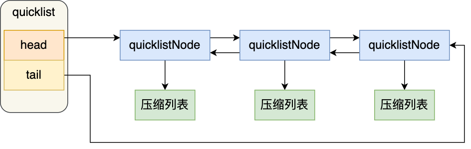

[toc]


# 1、Redis集群模式


## （1）主从模式

**主从复制原理：**（旧版）

- 从服务器连接主服务器，发送SYNC命令； 
- 主服务器接收到SYNC命名后，开始执行BGSAVE命令生成RDB文件并使用缓冲区记录此后执行的所有写命令； 
- 主服务器BGSAVE执行完后，向所有从服务器发送快照文件，并在发送期间继续记录被执行的写命令； 
- 从服务器收到快照文件后丢弃所有旧数据，载入收到的快照； 
- 主服务器快照发送完毕后开始向从服务器发送缓冲区中的写命令； 
- 从服务器完成对快照的载入，开始接收命令请求，并执行来自主服务器缓冲区的写命令；（**从服务器初始化完成**）
- 主服务器每执行一个写命令就会向从服务器发送相同的写命令，从服务器接收并执行收到的写命令（**从服务器初始化完成后的操作**）

  


**主从复制优缺点：**

**优点：**

- 支持主从复制，主机会自动将数据同步到从机，可以进行读写分离
- 为了分载Master的读操作压力，Slave服务器可以为客户端提供只读操作的服务，写服务仍然必须由Master来完成
- Slave同样可以接受其它Slaves的连接和同步请求，这样可以有效的分载Master的同步压力。
- Master Server是以非阻塞的方式为Slaves提供服务。所以在Master-Slave同步期间，客户端仍然可以提交查询或修改请求。
- Slave Server同样是以非阻塞的方式完成数据同步。在同步期间，如果有客户端提交查询请求，Redis则返回同步之前的数据

**缺点：**

- Redis不具备自动容错和恢复功能，主机从机的宕机都会导致前端部分读写请求失败，需要等待机器重启或者手动切换前端的IP才能恢复。
- 主机宕机，宕机前有部分数据未能及时同步到从机，切换IP后还会引入数据不一致的问题，降低了系统的可用性。
- Redis较难支持在线扩容，在集群容量达到上限时在线扩容会变得很复杂。


**新版本：**

使用PSYNC命令代替SYNC命令

PSYNC命令具有**完整重同步**和**部分重同步**这两种模式：

1、完整重同步

​	用于处理初次复制情况，执行步骤跟SYNC命令步骤基本一样，都是通过让主服务器创建并发送RDB文件，以及向从服务器发送保存在缓冲区里面的写命令来进行同步

2、部分重同步

​	处理断线后重复制情况，当从服务器在断线后重新连接主服务器时，如果条件允许，主服务器可将断开期间执行的写命令发送给从服务器，从服务器只要执行这些命令即可完成与主服务器的同步。


**部分重同步：**

由以下三部分构成：

- 主服务器的复制偏移量和从服务器的复制偏移量
- 主服务器的复制积压缓冲区
- 服务器的运行ID


（1）复制偏移量

执行复制的双方----主从服务器分别维护一个复制偏移量：

- 主服务器每次向从服务器传播N个字节数据，就将自身偏移量加上N
- 从服务器每次收到主服务器传来的N个字节，就将自身偏移量加上N


当主从偏移量不一致时，就说明不同步


（2）复制积压缓冲区

由主服务器维护的一个固定长度、先进先出（FIFO）队列，默认大小为1MB

当主服务器进行命令传播时，不仅会将写命令发送给所有从服务器，还会将写命令入队到复制积压缓冲区里


所以，主服务器的复制积压缓冲区里面会保存着一部分最近传播的写命令，并且复制积压缓冲区会为队列中的每个字节记录相应的复制偏移量。


当从服务器重连主服务器时，从服务器会通过PSYNC命令将自身的复制偏移量offset发送给主服务器，主服务器根据这个复制偏移量决定对从服务器执行哪种同步操作：

- 如果offset偏移量之后的数据仍然存在于复制积压缓冲区里面，那么主服务器将对从服务器执行部分重同步操作。
- 如果offset偏移量之后的数据以及不存在于复制积压缓冲区里，那么主服务器将对从服务器执行完全重同步。


（3）服务器运行ID

每个Redis服务器，都有运行ID，启动时自动生成

当从服务器对主服务器进行初次复制时，从服务器收到主服务器的运行ID并保存起来

当从服务器断线重连后，将校验主服务器ID是否还是原来的

如果是，则可以执行部分重同步，反之，则执行完全重同步


**PSYNC命令步骤：**


- 如果是首次连主服务器，或者之前执行过SLAVE no one命令，那么从服务器在开始一次新的复制时将向主服务器发送 `PSYNC ? -1`命令，主动请求进行完全重同步
- 如果已复制过某个主服，那么从服务器在开始一次新的复制时将向主服务器发送`PSYNC <runid> <offset>`命令，runid是上一次复制的主服务器运行ID，而offset则是从服务器当前的复制偏移量
- 如果主服务器返回`+FULLRESYNC <runid> <offset>` ，表示主服务器将于从服务器执行完整重同步，runid是当前主服务器的运行id，offset是当前主服务器的复制偏移量，从服务器将这个偏移量作为初始偏移量。
- 如果主服返回`+CONTINUE`，表示主服将与从服执行部分重同步
- 如果主服返回`-ERR`，表示主服版本低于2.8，识别不了PSYNC命令，主服将发送SYNC命令进行完整重同步。

  


## （2）哨兵模式

 （哨兵）是Redis的高可用性解决方案：由一个或多个Sentinel实例组成的Sentinel系统可以监视任意多个主服务器，以及这些主服务器属下的所有从服务器，并在被监视的主服务器进入下线状态时，自动将下线主服务器属下的某个从服务器升级为新的主服务器。 

  

**哨兵的工作方式：**

- 每个Sentinel（哨兵）进程以每秒钟一次的频率向整个集群中的Master主服务器，Slave从服务器以及其他Sentinel（哨兵）进程发送一个 PING 命令。
- 如果一个实例（instance）距离最后一次有效回复 PING 命令的时间超过 down-after-milliseconds 选项所指定的值， 则这个实例会被 Sentinel（哨兵）进程标记为主观下线（SDOWN）
- 如果一个Master主服务器被标记为主观下线（SDOWN），则正在监视这个Master主服务器的所有 Sentinel（哨兵）进程要以每秒一次的频率确认Master主服务器的确进入了主观下线状态
- 当有足够数量的 Sentinel（哨兵）进程（大于等于配置文件指定的值）在指定的时间范围内确认Master主服务器进入了主观下线状态（SDOWN）， 则Master主服务器会被标记为客观下线（ODOWN）
- 在一般情况下， 每个 Sentinel（哨兵）进程会以每 10 秒一次的频率向集群中的所有Master主服务器、Slave从服务器发送 INFO 命令，通过分析返回数据来获取服务器的信息。
- 当Master主服务器被 Sentinel（哨兵）进程标记为客观下线（ODOWN）时，Sentinel（哨兵）进程向下线的 Master主服务器的所有 Slave从服务器发送 INFO 命令的频率会从 10 秒一次改为每秒一次。
- 若没有足够数量的 Sentinel（哨兵）进程同意 Master主服务器下线， Master主服务器的客观下线状态就会被移除。若 Master主服务器重新向 Sentinel（哨兵）进程发送 PING 命令返回有效回复，Master主服务器的主观下线状态就会被移除。


**哨兵模式的优缺点**

**优点：**

- 哨兵模式是基于主从模式的，所有主从的优点，哨兵模式都具有。
- 主从可以自动切换，系统更健壮，可用性更高。

**缺点：**

- Redis较难支持在线扩容，在集群容量达到上限时在线扩容会变得很复杂。


**选举sentinel领导者：** 

使用的raft算法(https://raft.github.io)，大致思路：

- 每次进行leader选举之后，不论是否成功，所有Sentinel的配置纪元的值都会自增一次，就是一个计数器
- 在一个配置纪元（epoch）里，所有Sentinel都有一次将某个Sentinel设置为局部领头Sentinel的机会，并且一旦设置，无法更改
- 每个发现主服客观下线的Sentinel都会要求其他Sentinel将自己设置为局部领头Sentinel
- 当一个Sentinel（源）向另一个Sentinel（目标）发送命令时，并且命令中的runid参数不是*符号而是源sentinel的运行id时，表示源Sentinel要求目标Sentinel将其设置为局部领头Sentinel
- Sentinel设置局部领头的顺序是先到先到，后来的拒绝
- 目标Sentinel将回复一条信息，包含leader-runid和leader-epoch，都是局部领头Sentinel的信息
- 源Sentinel受到回复后，判断上述两个信息是否跟自身一致，如果一致，则表明目标Sentinel将源sentinel设置为局部领头
- 如果有一半以上的Sentinel认定某个Sentinel是领头时，那么这个Sentinel就是leader
- 如果给定时间内没选出来，那么进行下一次配置纪元。


1. 每个做主观下线的sentinel节点向其他sentinel节点发送命令，要求将自己设置为领导者
2. 接收到的sentinel可以同意或者拒绝

3. 如果该sentinel节点发现自己的票数已经超过半数并且超过了quorum
4. 如果此过程选举出了多个领导者，那么将等待一段时重新进行选举


**主节点选举：**

选举出可以代替主节点的slave从节点

- 1、选择健康状态从节点（排除主观下线、断线），排除5秒钟没有心跳的、排除主节点失联超过10*down-after-millisecends
- 2、选择slave-priority高的从节点优先级列表
- 4、选择偏移量大的
- 5、选择runid小的


**进行故障转移**

- 1、sentinel的领导者从slave中选举出合适的从节点进行故障转移
- 2、对选取的slave执行slave of no one
- 3、更新应用程序端的链接到新的主节点

- 4、对其他从节点变更master为新的节点

- 5、修复原来的master并将其设置为新master的slave


## （3）Cluster模式

Redis-Cluster采用无中心结构,它的特点如下：

- 所有的redis节点彼此互联(PING-PONG机制),内部使用二进制协议优化传输速度和带宽。
- 节点的fail是通过集群中超过半数的节点检测失效时才生效。
- 客户端与redis节点直连,不需要中间代理层.客户端不需要连接集群所有节点,连接集群中任何一个可用节点即可。

**工作方式：**

在redis的每一个节点上，都有这么两个东西，一个是插槽（slot），它的的取值范围是：0-16383。还有一个就是cluster，可以理解为是一个集群管理的插件。当我们的存取的key到达的时候，redis会根据crc16的算法得出一个结果，然后把结果对 16384 求余数，这样每个 key 都会对应一个编号在 0-16383 之间的哈希槽，通过这个值，去找到对应的插槽所对应的节点，然后直接自动跳转到这个对应的节点上进行存取操作。

为了保证高可用，redis-cluster集群引入了主从模式，一个主节点对应一个或者多个从节点，当主节点宕机的时候，就会启用从节点。当其它主节点ping一个主节点A时，如果半数以上的主节点与A通信超时，那么认为主节点A宕机了。如果主节点A和它的从节点A1都宕机了，那么该集群就无法再提供服务了。


**数据迁移方式**

Redis使用了哈希槽的概念，并没有使用一致性hash。

数据迁移是slot（槽）和key的迁移，此功能可实现平滑的扩容和缩容。

 现在要将Master A节点中编号为1、2、3的slot迁移到Master B节点中，在slot迁移的中间状态下，slot 1、2、3在Master A节点的状态表现为MIGRATING（迁移）,在Master B节点的状态表现为IMPORTING（入口）。 

  

**此时并不会刷新node的映射关系**


**IMPORTING状态**

被迁移slot在目标Master B节点中出现的一种状态 ，准备迁移slot从Mater A到Master B的时候，被迁移slot的状态首先变为IMPORTING状态。 


**键空间迁移**

 键空间迁移是指当满足了slot迁移前提的情况下，通过相关命令将slot 1、2、3中的键空间从Master A节点转移到Master B节点。此时刷新node的映射关系。 

  


**重新分片：**

Redis集群的重新分片操作可将任意数量已经指派给某个节点（源节点）的槽改为指派给另一个节点（目标节点），并且相关槽所属的键对值也会从源节点被移动到目标节点。

重新分片操作可在线运行，在重新分片过程中，集群不需要下线，并且源节点和目标节点都可继续处理命令请求。

重新分片操作由Redis的集群管理软件redis-trib负责执行的，Redis提供了进行重新分片所需的所有命令，而redis-trib则通过向源节点和目标节点发送命令来进行重新分片操作。

步骤：

1）redis-trib对目标节点发送`CLUSTER SETSLOT＜slot＞IMPORTING＜source_id＞`命令，让目标节点准备好从源节点导入（import）属于槽slot的键值对。

2）redis-trib对源节点发送`CLUSTER SETSLOT＜slot＞MIGRATING＜target_id＞`命令，让源节点准备好将属于槽slot的键值对迁移（migrate）至目标节点。

3）redis-trib向源节点发送`CLUSTER GETKEYSINSLOT＜slot＞＜count＞`命令，获得最多count个属于槽slot的键值对的键名（key name）。

4）对于步骤3获得的每个键名，redis-trib都向源节点发送一个`MIGRATE＜target_ip＞＜target_port＞＜key_name＞0＜timeout＞`命令，将被选中的键原子地从源节点迁移至目标节点。

5）重复执行步骤3和步骤4，直到源节点保存的所有属于槽slot的键值对都被迁移至目标节点为止。每次迁移键的过程如图17-24所示。

6）redis-trib向集群中的任意一个节点发送`CLUSTER SETSLOT＜slot＞NODE＜target_id＞`命令，将槽slot指派给目标节点，这一指派信息会通过消息发送至整个集群，最终集群中的所有节点都会知道槽slot已经指派给了目标节点。


如果重新分片涉及多个槽，那么redis-trib将对每个给定的槽分别执行上面给出的步骤。


**故障检测：**

集群中的每个节点都会定期地向集群中的其他节点发送PING消息，以此来检测对方是否在线，如果没有在规定的时间内返回PONG消息，则会被发送命令的节点标记为疑似下线。

如果某个主节点被集群中半数以上的处理槽的主节点标记为疑似下线，那么这个主节点就被标记为已下线。此时第一个将这个节点标记为已下线的会广播一条消息，集群中的所有收到这个FAIL消息的节点会立即将此节点标记为已下线。


**故障转移：**

当从节点发现主节点已下线后，开始对下线主节点进行故障转移：

1. 复制下线主节点的所有从节点里，选出一个节点
2. 被选中的从节点会执行SLAVEOF no one命令，称为新的主节点
3. 新主节点撤销所有对前主节点的槽指派，并将这些槽全指派给自己。
4. 新主节点向集群广播一条PING消息，让其他节点知道此节点已变成主节点并已接管原本由已下线节点负责处理的槽。
5. 新主节点开始接收和处理相关命令。


**选举新的主节点：**

1. 集群的配置纪元是一个自增计数器，初始值为0，开始一次故障转移操作时，配置纪元增一
2. 在每个配置纪元里，集群中每个负责处理槽的主节点都有一次投票机会，先到先得
3. 当从节点发现主节点下线，会向集群中广播一条消息，要求所有具有投票权的主节点向这个从节点投票
4. 每个参选的从节点会根据自身收到的ACK信息来统计自己获得了多少主节点的支持。
5. 如果集群中有个从节点收到过半数主节点的支持，那么就成为新的主节点
6. 如果没有从节点能成为主节点，那么开始新的配置纪元，直至选出新主节点为止。


# 2、Redis持久化方式

Redis提供了两种持久化方式，分别是RDB和AOF。


**一、RDB（保存数据库键对值）**

（1）redis默认开启了RDB持久化方式

```
#下面这一行取消注释，下面三行注释掉，就是关闭RDB
#save ""
#下面三行是开启RDB持久化方式
save 900 1
save 300 10
save 60 10000
```

开启之后，会生成一个dump.rdb文件，这个就是数据落在磁盘上的实际存储文件。下面是对这三行配置的解读。

```
#每900秒内，数据库至少有1次修改就进行保存 
save 900 1
#每300 秒内，数据库至少有10次修改就进行保存
save 300 10
#每60 秒内，数据库至少有10000次修改就进行保存
save 60 10000
```

（2）开启RDB持久化之后，数据库启动的时候就会先加载dump.rdb文件进内存 ，这个过程是阻塞的


（3）执行***SAVE***或***BGSAVE***命令可以触发RDB方式数据落盘保存

SAVE命令是阻塞的，BGSAVE命令是非阻塞的，其实上述的几秒内有至少几次修改就保存的后台也是执行的BGSAVE命令。


**二、AOF（Append Only File，保存数据库执行过的命令）**

（1）开启AOF持久化非常简单，配置一下两个配置项就行

```
#开启aof命令
appendonly yes
#aof文件名称
appendfilename "appendonly.aof"
```


（2）开启AOF之后，redis启动会去加载aof文件，但是不会去加载rdb文件，因为aof文件的更新速度比rdb文件快，所以redis会优先加载aof文件，只有当aof没开启时，才会去加载rdb文件。


（3）AOF重写
AOF 日志是一个文件，随着执行的写操作命令越来越多，文件的大小会越来越大。

AOF 重写机制是在重写时，读取当前数据库中的所有键值对，然后将每一个键值对用一条命令记录到「新的 AOF 文件」，等到全部记录完后，就将新的 AOF 文件替换掉现有的 AOF 文件。

举个例子，在没有使用重写机制前，假设前后执行了「set name xiaolin」和「set name xiaolincoding」这两个命令的话，就会将这两个命令记录到 AOF 文件。


重写机制的妙处在于，尽管某个键值对被多条写命令反复修改，最终也只需要根据这个「键值对」当前的最新状态，然后用一条命令去记录键值对，代替之前记录这个键值对的多条命令，这样就减少了 AOF 文件中的命令数量。最后在重写工作完成后，将新的 AOF 文件覆盖现有的 AOF 文件。

为什么重写 AOF 的时候，不直接复用现有的 AOF 文件，而是先写到新的 AOF 文件再覆盖过去。

因为如果 AOF 重写过程中失败了，现有的 AOF 文件就会造成污染，可能无法用于恢复使用。

写入 AOF 日志的操作虽然是在主进程完成的，因为它写入的内容不多，所以一般不太影响命令的操作。

但是在触发 AOF 重写时，比如当 AOF 文件大于 `64M` 时，就会对 AOF 文件进行重写，这时是需要读取所有缓存的键值对数据，并为每个键值对生成一条命令，然后将其写入到新的 AOF 文件，重写完后，就把现在的 AOF 文件替换掉。

这个过程其实是很耗时的，所以重写的操作不能放在主进程里。

所以，Redis 的重写 AOF 过程是由后台子进程 bgrewriteaof 来完成的，这么做可以达到两个好处：

- 子进程进行 AOF 重写期间，主进程可以继续处理命令请求，从而避免阻塞主进程；
- 子进程带有主进程的数据副本（数据副本怎么产生的后面会说），这里使用子进程而不是线程，因为如果是使用线程，多线程之间会共享内存，那么在修改共享内存数据的时候，需要通过加锁来保证数据的安全，而这样就会降低性能。而使用子进程，创建子进程时，父子进程是共享内存数据的，不过这个共享的内存只能以只读的方式，而当父子进程任意一方修改了该共享内存，就会发生「写时复制」，于是父子进程就有了独立的数据副本，就不用加锁来保证数据安全。

**大key对持久化的影响**
当 AOF 写回策略配置了 Always 策略，如果写入是一个大 Key，主线程在执行 fsync() 函数的时候，阻塞的时间会比较久，因为当写入的数据量很大的时候，数据同步到硬盘这个过程是很耗时的。

AOF 重写机制和 RDB 快照（bgsave 命令）的过程，都会分别通过 fork() 函数创建一个子进程来处理任务。会有两个阶段会导致阻塞父进程（主线程）：

- 创建子进程的途中，由于要复制父进程的页表等数据结构，阻塞的时间跟页表的大小有关，页表越大，阻塞的时间也越长；
- 创建完子进程后，如果父进程修改了共享数据中的大 Key，就会发生写时复制，这期间会拷贝物理内存，由于大 Key 占用的物理内存会很大，那么在复制物理内存这一过程，就会比较耗时，所以有可能会阻塞父进程。

大 key 除了会影响持久化之外，还会有以下的影响。

- 客户端超时阻塞。由于 Redis 执行命令是单线程处理，然后在操作大 key 时会比较耗时，那么就会阻塞 Redis，从客户端这一视角看，就是很久很久都没有响应。

- 引发网络阻塞。每次获取大 key 产生的网络流量较大，如果一个 key 的大小是 1 MB，每秒访问量为 1000，那么每秒会产生 1000MB 的流量，这对于普通千兆网卡的服务器来说是灾难性的。

- 阻塞工作线程。如果使用 del 删除大 key 时，会阻塞工作线程，这样就没办法处理后续的命令。

- 内存分布不均。集群模型在 slot 分片均匀情况下，会出现数据和查询倾斜情况，部分有大 key 的 Redis 节点占用内存多，QPS 也会比较大

# 3、分布式锁


## （1）何为分布式锁

在分布式模型下，数据只有一份，此时需要利用锁的技术控制某一时刻修改数据的进程数。与单机模式下的锁不仅需要保证进程可见，还需要考虑进程与锁之间的网络问题。


## （2）需要什么样的分布式锁？

- 可保证在分布式部署的应用集群中，同一个方法在同一时间只能被一台机器上的一个线程执行
- 可重入锁
- 公平锁
- 阻塞锁
- 高可用的获取锁和释放锁，并且性能要好


## （3）基于数据库做分布式锁

### 1、基于乐观锁

利用表主键唯一做分布式锁，需要获取锁的线程同时插入同一条数据，插入成功的就获取了锁

**问题：**

- 强依赖数据库可用性，数据库是单点的话会导致系统不可用
- 没有失效时间，一旦解锁操作失败，会导致数据一直在数据库中，其它线程无法获取锁
- 锁只能是非阻塞的，因为数据的insert操作，插入失败会直接报错，没获取到锁的进程并不会进入排队队列，想获取锁只能再次触发获取锁的操作。
- 非重入，同一线程在没释放锁之前无法再次获取锁
- 非公平的
- 在 MySQL 数据库中采用主键冲突防重，大并发情况下可能会造成锁表现象


**解决方法：**

- 数据库进行主备同步，主节点挂掉后备用节点顶上
- 定时清除数据
- 非阻塞，用while循环，直至获取锁
- 记录拥有锁的主机信息和线程信息，当线程相同可直接获取锁
- 可用另一张表记录等待锁的线程，根据创建时间排序，只允许最先创建的线程获取锁


### 2、基于悲观锁

基于数据库排他锁做分布式锁 在查询语句后面增加for update，数据库会在查询过程中给数据库表增加排他锁。

可以认为获得排他锁的线程即可获得分布式锁，当获取到锁之后，可以执行方法的业务逻辑，执行完方法之后，通过connection.commit()操作来释放锁。

 这种方法可以有效的解决上面提到的无法释放锁和阻塞锁的问题。 阻塞锁 for update语句会在执行成功后立即返回，在执行失败时一直处于阻塞状态，直到成功。 锁定之后服务宕机，无法释放？使用这种方式，服务宕机之后数据库会自己把锁释放掉。

无法直接解决数据库单点和可重入的问题。


虽然我们对方法字段名使用了唯一索引，并且显示使用 for update 来使用行级锁。但是，MySQL 会对查询进行优化，即便在条件中使用了索引字段，但是否使用索引来检索数据是由 MySQL 通过判断不同执行计划的代价来决定的，如果 MySQL 认为全表扫效率更高，比如对一些很小的表，它就不会使用索引，这种情况下 InnoDB 将使用表锁，而不是行锁。如果发生这种情况就悲剧了。。。 还有一个问题，就是我们要使用排他锁来进行分布式锁的 lock，那么一个排他锁长时间不提交，就会占用数据库连接。一旦类似的连接变得多了，就可能把数据库连接池撑爆。


## （4）基于Redis做分布式锁

### 1、setnx()、expire()方法做分布式锁

setnx(key,value)，此方法是原子的，如果key不存在，则设置当前key成功，返回1；如果当前key已经存在，则设置当前key失败，返回0，expire()方法用来设置过期时间

setnx命令不能设置key的超时时间，只能通过expire来对key设置。

**步骤：**

- setnx(lockkey, 1) 如果返回 0，则说明占位失败；如果返回 1，则说明占位成功
- expire() 命令对 lockkey 设置超时时间，为的是避免死锁问题。
- 执行完业务代码后，可以通过 delete 命令删除 key


**问题：**

setnx执行成功后，在expire命令执行成功前，发生了宕机，那么会出现死锁的问题。


### 2、利用setnx、get、getset方法做

getset(key,new_value)，是原子的，对key设置new_value，并且返回key原来的旧值，如果key不存在，就返回null，此时key就被设置位new_value。

**步骤：**

- setnx(lockkey, 当前时间+过期超时时间)，如果返回 1，则获取锁成功；如果返回 0 则没有获取到锁，转向2。
- get(lockkey) 获取值 oldExpireTime ，并将这个 value 值与当前的系统时间进行比较，如果小于当前系统时间，则认为这个锁已经超时，可以允许别的请求重新获取，转向 3。
- 计算 newExpireTime = 当前时间+过期超时时间，然后 getset(lockkey, newExpireTime) 会返回当前 lockkey的值currentExpireTime。
- 判断 currentExpireTime 与 oldExpireTime 是否相等，如果相等，说明当前 getset 设置成功，获取到了锁。如果不相等，说明这个锁又被别的请求获取走了，那么当前请求可以直接返回失败，或者继续重试。
- 在获取到锁之后，当前线程可以开始自己的业务处理，当处理完毕后，比较自己的处理时间和对于锁设置的超时时间，如果小于锁设置的超时时间，则直接执行 delete 释放锁；如果大于锁设置的超时时间，则不需要再锁进行处理。


## （5）基于Zookeeper做分布式锁

**zk** **基本锁 原理：**

利用临时节点与 watch 机制。每个锁占用一个普通节点 /lock，当需要获取锁时在 /lock 目录下创建一个临时节点，创建成功则表示获取锁成功，失败则 watch/lock 节点，有删除操作后再去争锁。临时节点好处在于当进程挂掉后能自动上锁的节点自动删除即取消锁。 **缺点：**所有取锁失败的进程都监听父节点，很容易发生羊群效应，即当释放锁后所有等待进程一起来创建节点，并发量很大。

**zk** **锁优化 原理：**

上锁改为创建临时有序节点，每个上锁的节点均能创建节点成功，只是其序号不同。只有序号最小的可以拥有锁，如果这个节点序号不是最小的则 watch 序号比本身小的前一个节点 (公平锁)。

 **步骤：**

- 在 /lock 节点下创建一个有序临时节点 (EPHEMERAL_SEQUENTIAL)。
- 判断创建的节点序号是否最小，如果是最小则获取锁成功。不是则取锁失败，然后 watch 序号比本身小的前一个节点。（避免很多线程watch同一个node，导致羊群效应）
- 当取锁失败，设置 watch 后则等待 watch 事件到来后，再次判断是否序号最小。
- 取锁成功则执行代码，最后释放锁（删除该节点）。

**优缺点** 

优点： 有效的解决单点问题，不可重入问题，非阻塞问题以及锁无法释放的问题。实现起来较为简单。

缺点： 性能上可能并没有缓存服务那么高，因为每次在创建锁和释放锁的过程中，都要动态创建、销毁临时节点来实现锁功能。ZK 中创建和删除节点只能通过 Leader 服务器来执行，然后将数据同步到所有的 Follower 机器上。还

需要对 ZK的原理有所了解


# 4、Redis为什么这么快

- 纯内存操作
- 单线程操作，避免了频繁的上下文切换
- 采用了非阻塞的IO多路复用机制


Redis单线程仅是指负责存取这一块的线程只有一个，而不是redis只有一个进程


# 5、redis的过期策略以及内存淘汰机制


## **（1）三种删除策略：**


**定时删除：**

设置键过期时间同时，创建定时器，让定时器在键过期时间来临时，立即执行删除操作。

对内存友好，对CPU不友好。在内存不紧张但是CPU紧张的情况下会造成性能瓶颈。


**惰性删除：**

在访问某个键的时候，检查是否已过期，如果过期就删除，否则返回。

对CPU友好，对内存不友好。如果有一些key过期了，但是不会没有访问，那么会一直待在内存中，造成内存泄露。


**定期删除：**

每隔一段时间，程序就对数据库进行一次检查，删除里面的过期键。至于删除多少，执行多长时间，检查多少数据库，由算法决定。

通过限制删除操作执行的时长和频率来减少对CPU时间的影响。


数据设置了过期时间，时间到了内存占用为什么还高？

**redis采用的是定期删除+惰性删除策略**


**为什么不是定时删除？**

用一个定时器负责监视key，过期自动删除，虽然内存及时释放，但是十分消耗CPU资源，在大并发请求下，CPU要将时间应用在处理请求，而不是删除key，所以没有采取定时删除。


**定期删除+惰性删除：**

定期删除，redis默认每隔100ms检查，是否有过期的key，有就删除。

redis并不是每隔100ms将所有的key检查一次，而是随机抽取进行检查，如果每隔100ms就需要检查一次，那么redis会卡死。

此时惰性删除就有了，在获取某个key的时候，redis会检查是否过期，如果过期就删除。

如果定期+惰性都没删除key，那么就需要采用内存淘汰机制。


**内存淘汰机制：**

（1）noeviction：内存不够写入失败

（2）allkeys-lru：内存不足，在所有key中移除最近最少使用的key

（3）allkeys-random：内存不足时，所有key中随机删除

（4）volatile-lru：内存不足时，在设置了过期时间的key中移除最近最少使用的key

（5）volatile-random：内存不足时，在设置了过期时间的key中随机移除

（6）volatile-ttl：内存不足时，在设置了过期时间的key中删除最先过期的key


## （2）AOF、RDB和复制功能对过期键的处理


### 1、RDB

如果服务器开启了RDB功能，那么服务器将对RDB文件进行载入：

（1）如果服务器以主服务器模式运行，那么在载入RDB文件时，程序会对文件中保存的键进行检查，未过期的被载入，过期的忽略。

（2）如果服务器以从服务器模式运行，不论是否过期都会被载入。


### 2、AOF

当服务器以AOF持久化模式运行时，如果数据库中的某个键已经过期，但它还没被惰性删除或定期删除，那么AOF文件不会因为这个过期键而产生任何影响。

当过期键被惰性删除或者定期删除之后，程序会向AOF文件追加一条DEL命令，显示记录该键已被删除。


### 3、AOF重写

AOF重写过程中，程序会对数据库中的键进行检查，已过期的键不会被保存到重写后的AOF文件中。


### 4、复制

当服务器运行在复制模式下，从服务器的过期键删除动作由主服务器控制。

- 主服务器在删除一个过期键后，显示向所有从服务器发送一个DEL命令，告知从服务器删除这个过期键。
- 从服务器在执行客户端发送的读命令时，即使碰到过期键也不会删除，而是像处理未过期键一样
- 从服务器只有在接到主服务器发来的DEL命令后，才会删除过期键。


# 6、缓存穿透、击穿、雪崩

## （1）**缓存穿透**

概念访问一个不存在的key，缓存不起作用，请求会穿透到DB，流量大时DB会挂掉。

**解决方案**：

采用布隆过滤器，使用一个足够大的bitmap，用于存储可能访问的key，不存在的key直接被过滤；

访问key未在DB查询到值，也将空值写进缓存，但可以设置较短过期时间。

## （2）**缓存雪崩**

大量的key设置了相同的过期时间，导致在缓存在同一时刻全部失效，造成瞬时DB请求量大、压力骤增，引起雪崩。

**解决方案**

可以给缓存设置过期时间时加上一个随机值时间，使得每个key的过期时间分布开来，不会集中在同一时刻失效；

采用限流算法，限制流量；

采用分布式锁，加锁访问。

## （3）缓存击穿

热门数据突然失效，大量请求到服务器数据库中


**解决方案：**

热点数据永不过期


# 7、渐进式ReHash


ht属性是一个包含两个项的数组，数组中的每个项都是一个哈希表，一般情况下，字典只使用ht[0]哈希表，ht[1]哈希表只会在对ht[0]进行rehash时使用

**原因：**

rehash过程不是一步完成的，分多次、渐进式完成。如果哈希表中保存着数量巨大的键对值时，如果一次进行rehash，很可能会导致服务器宕机。


**步骤：**

- 为ht[1]分配空间，让字典同时持有ht[0]和ht[1]两个哈希表
- 维持索引计数器变量rehashidx，并将它的值设置为0，表示rehash开始
- 每次对字典执行增删改查时，将ht[0]的rehashidx索引上的所有键值对rehash到ht[1]，将rehashidx值+1。 
- 当ht[0]的所有键值对都被rehash到ht[1]中，程序将rehashidx的值设置为-1，表示rehash操作完成


注：渐进式rehash的好处在于它采取分为而治的方式，将rehash键值对的计算均摊到每个字典增删改查操作，避免了集中式rehash的庞大计算量。


在进行渐进式rehash的过程中，字典会同时使用ht[0]和ht[1]两个哈希表，所以字典的删除、查抄、更新等操作会在两个哈希表上进行。例如，查找一个键，会先在ht[0]里面先找，如果没找到，就会继续到ht[1]里面进行查找。

在此过程中，新添加的字典键值对会保存在ht[1]里面，而ht[0]不再进行任何添加操作。


随着操作的不断执行， 哈希表保存的键值对会逐渐地增多或者减少， 为了让哈希表的负载因子（load factor）维持在一个合理的范围之内， 当哈希表保存的键值对数量太多或者太少时， 程序需要对哈希表的大小进行相应的扩展或者收缩。
扩展和收缩哈希表的工作可以通过执行 rehash （重新散列）操作来完成， Redis 对字典的哈希表执行 rehash 的步骤如下：

为字典的 ht[1] 哈希表分配空间， 这个哈希表的空间大小取决于要执行的操作， 以及 ht[0] 当前包含的键值对数量 （也即是 ht[0].used属性的值）：

- 如果执行的是扩展操作， 那么 ht[1] 的大小为第一个大于等于 ht[0].used * 2 的 2^n （2 的 n 次方幂）；
- 如果执行的是收缩操作， 那么 ht[1] 的大小为第一个大于等于 ht[0].used 的 2^n 。

将保存在 ht[0] 中的所有键值对 rehash 到 ht[1] 上面： rehash 指的是重新计算键的哈希值和索引值， 然后将键值对放置到 ht[1] 哈希表的指定位置上。
当 ht[0] 包含的所有键值对都迁移到了 ht[1] 之后 （ht[0] 变为空表）， 释放 ht[0] ， 将 ht[1] 设置为 ht[0]， 并在 ht[1] 新创建一个空白哈希表， 为下一次 rehash 做准备。


# 8、BitMap

## （1）基本思想

32位机器上，对于一个整型数，比如int a=1 在内存中需要占用32bit位，这是为了方便计算机运算，但在内存中属于一种浪费，因此可用对应的32bit位对应存储十进制的0-31个数字，这就是bit-map的基本思想。

利用bitmap可处理大量数据的排序、查询及去重，做交集并集运算也有极大的便利。


## （2）快速排序

假设我们要对0-7内的5个元素(4,7,2,5,3)排序（这里假设这些元素没有重复）,我们就可以采用Bit-map的方法来达到排序的目的。要表示8个数，我们就只需要8个Bit（1Bytes），首先我们开辟1Byte的空间，将这些空间的所有Bit位都置为0，然后再将对应下标的位置设置为1，然后遍历bit区域，将1的下标输出，就是排序了，时间复杂度是O(n)


## （3）快速去重

一个数字的状态只有三种，分别为不存在，只有一个，有重复。因此，我们只需要2bits就可以对一个数字的状态进行存储了，假设我们设定一个数字不存在为00，存在一次01，存在两次及其以上为11。那我们大概需要存储空间几十兆左右。 接下来的任务就是遍历一次这2.5亿个数字，如果对应的状态位为00，则将其变为01；如果对应的状态位为01，则将其变为11；如果为11，,对应的转态位保持不变。 最后，我们将状态位为01的进行统计，就得到了不重复的数字个数，时间复杂度为O(n)。


## （4）快速查询

如何快速判断一个数字是够存在于上述的2.5亿个数字集合中。 同之前一样，首先我们先对所有的数字进行一次遍历，然后将相应的转态位改为1。遍历完以后就是查询，由于我们的Bit-map采取的是连续存储（整型数组形式，一个数组元素对应32bits），我们实际上是采用了一种分桶的思想。一个数组元素可以存储32个状态位，那将待查询的数字除以32，定位到对应的数组元素（桶），然后再求余 （%32），就可以定位到相应的状态位。如果为1，则代表改数字存在；否则，该数字不存在。


# 9、布隆过滤器

当一个元素被加入集合中时,通过k个散列函数将这个元素映射成一个位数组中的k个点,并将这k个点全部置为1.

有一定的误判率--在判断一个元素是否属于某个集合时,有可能会把不属于这个集合的元素误判为属于这个集合.

因此,它不适合那些"零误判"的应用场合.在能容忍低误判的应用场景下,布隆过滤器通过极少的误判换区了存储空间的极大节省. 


Bloom Filter使用k个相互独立的哈希函数（Hash Function），它们分别将集合中的每个元素映射到{1,…,m}的范围中。对任意一个元素x，第i个哈希函数映射的位置hi(x)就会被置为1（1≤i≤k）。注：如果一个位置多次被置为1，那么只有第一次会起作用，后面几次将没有任何效果。 在判断y是否属于这个集合时，对y应用k次哈希函数，若所有hi(y)的位置都是1（1≤i≤k），就认为y是集合中的元素，否则就认为y不是集合中的元素。


# 10、为什么有序集合需要同时用到字典和跳跃表


可以单独使用字典或者跳跃表的其中一种数据结构来实现，但是性能上对比起同时使用会有所降低。

比如，只使用字典，可以以O(1)时间复杂度查找成员，但是范围性操作需要先进行排序，时间复杂度高，O(nlogn)以及O(n)内存空间。

只使用跳跃表，查找复杂度会是O(logn)


- 服务器在执行命令之前，会先检查给定键的类型能否执行指定的命令，而检查一个键的类型就是检查键的值对象的类型。
- Redis的对象系统带有引用计数实现的内存回收机制，当一个对象不再被使用时，该对象所占用的内存就会被自动释放
- Redis会共享值为0到9999的字符串对象


# 11、Redis中哈希表负载因子问题

Redis中的哈希表也是根据负载因子进行扩容和缩容

当以下条件中的任意一个被满足时，程序会自动开始对哈希表进行扩展操作：

- 服务器目前没有在执行BGSAVE或者BGREWRITEAOF命令，并且哈希表的负载因子大于等于1
- 服务器目前再执行BGSAVE或者BGREWRITEAOF命令，并且哈希表的负载因子大于等于5

也就是redis在进行RDB快照备份的时候，负载因子是5，没有执行RDB快照时负载因子是1。


Redis的负载因子计算：
```
load_factor = ht[0].used / ht[0].size
```

因为已保存节点数量是包括冲突的节点数量，所以已保存节点数量是有可能大于哈希表大小的，所以也就可以达到5。


**为什么执行BGSAVE或者BGREWRITEAOF时，负载因子`>=5`,而未执行时`>=1`**

根据 BGSAVE 命令或 BGREWRITEAOF 命令是否正在执行， 服务器执行扩展操作所需的负载因子并不相同， 
这是因为在执行BGSAVE 命令或BGREWRITEAOF 命令的过程中， Redis 需要创建当前服务器进程的子进程，
而大多数操作系统都采用写时复制（copy-on-write）技术来优化子进程的使用效率， 所以在子进程存在期间，
服务器会提高执行扩展操作所需的负载因子， 从而尽可能地避免在子进程存在期间进行哈希表扩展操作， 这可以避免不必要的内存写入操作，最大限度地节约内存


**写时复制：**

（1）fork

在linux系统中，fork是类Unix操作系统上创建进程的主要方法。fork用于创建子进程(等同于当前进程的副本)。

（2）copy on write原理

fork创建出的子进程，与父进程共享内存空间。如果子进程不对内存空间进行写入操作的话，内存空间中的数据并不会赋值给子进程，这样就可以加快创建子进程速度。

（3）copy on write 技术实现原理

fork()之后，kernel（内核）把父进程中所有的内存页的权限都设为read-only，然后子进程的地址空间指向父进程。
当父子进程都只读内存时，相安无事。当其中某个进程写内存时，CPU硬件检测到内存页是read-only的，于是触发页异常中断（page-fault），陷入kernel（内核）的一个中断例程。
中断例程中，kernel就会把触发的异常的页复制一份，于是父子进程各自持有独立的一份。

（4）好处

COW技术可减少分配和复制大量资源时带来的瞬间延时。

COW技术可减少不必要的资源分配。比如fork进程时，并不是所有的页面都需要复制，父进程的代码段和只读数据段都不被允许修改，所以无需复制。

（5）技术缺点

如果在fork()之后，父子进程都还需要继续进行写操作，那么会产生大量的分页错误(页异常中断page-fault)，这样就得不偿失。


# 12、Redis使用的哈希算法

当要将一个新的键值对添加到字典里面时， 程序需要先根据键值对的键计算出哈希值和索引值， 然后再根据索引值， 将包含新键值对的哈希表节点放到哈希表数组的指定索引上面。

Redis 计算哈希值和索引值的方法如下：

```
# 使用字典设置的哈希函数，计算键 key 的哈希值
hash = dict->type->hashFunction(key);

# 使用哈希表的 sizemask 属性和哈希值，计算出索引值
# 根据情况不同， ht[x] 可以是 ht[0] 或者 ht[1]
index = hash & dict->ht[x].sizemask;
```


举个例子， 对于上图所示的字典来说， 如果我们要将一个键值对 k0 和 v0 添加到字典里面， 那么程序会先使用语句：

``` 
hash = dict->type->hashFunction(k0);
```

计算键 k0 的哈希值。

假设计算得出的哈希值为 8 ， 那么程序会继续使用语句：

``` 
index = hash & dict->ht[0].sizemask = 8 & 3 = 0;
```

计算出键 k0 的索引值 0 ， 这表示包含键值对 k0 和 v0 的节点应该被放置到哈希表数组的索引 0 位置上， 如下图所示。


当字典被用作数据库的底层实现， 或者哈希键的底层实现时， Redis 使用 MurmurHash2 算法来计算键的哈希值。


# 13、Redis数据结构

Redis五种常见数据类型，分别是

- string
- list
- hash
- set
- zset


Redis 五种数据类型的应用场景：

- String 类型的应用场景：缓存对象、常规计数、分布式锁、共享session信息等。
- List 类型的应用场景：消息队列（有两个问题：1. 生产者需要自行实现全局唯一 ID；2. 不能以消费组形式消费数据）等。
- Hash 类型：缓存对象、购物车等。
- Set 类型：聚合计算（并集、交集、差集）场景，比如点赞、共同关注、抽奖活动等。
- Zset 类型：排序场景，比如排行榜、电话和姓名排序等。

Redis 后续版本又支持四种数据类型，它们的应用场景如下：

- BitMap（2.2 版新增）：二值状态统计的场景，比如签到、判断用户登陆状态、连续签到用户总数等；
- HyperLogLog（2.8 版新增）：海量数据基数统计的场景，比如百万级网页 UV 计数等；
- GEO（3.2 版新增）：存储地理位置信息的场景，比如滴滴叫车；
- Stream（5.0 版新增）：消息队列，相比于基于 List 类型实现的消息队列，有这两个特有的特性：自动生成全局唯一消息ID，支持以消费组形式消费数据。


## String

由SDS（简单动态字符串）实现

- **SDS 不仅可以保存文本数据，还可以保存二进制数据**。因为 SDS 使用 len 属性的值而不是空字符来判断字符串是否结束，并且 SDS 的所有 API 都会以处理二进制的方式来处理 SDS 存放在 buf[] 数组里的数据。所以 SDS 不光能存放文本数据，而且能保存图片、音频、视频、压缩文件这样的二进制数据。
- **SDS 获取字符串长度的时间复杂度是 O(1)**。因为 C 语言的字符串并不记录自身长度，所以获取长度的复杂度为 O(n)；而 SDS 结构里用 len 属性记录了字符串长度，所以复杂度为 O(1)。
- **Redis 的 SDS API 是安全的，拼接字符串不会造成缓冲区溢出**。因为 SDS 在拼接字符串之前会检查 SDS 空间是否满足要求，如果空间不够会自动扩容，所以不会导致缓冲区溢出的问题。


## List

List 类型的底层数据结构是由**双向链表或压缩列表**实现的：

- 如果列表的元素个数小于 512 个（默认值，可由 list-max-ziplist-entries 配置），列表每个元素的值都小于 64 字节（默认值，可由 list-max-ziplist-value 配置），Redis 会使用**压缩列表**作为 List 类型的底层数据结构；
- 如果列表的元素不满足上面的条件，Redis 会使用**双向链表**作为 List 类型的底层数据结构；

但是**在 Redis 3.2 版本之后，List 数据类型底层数据结构就只由 quicklist 实现了，替代了双向链表和压缩列表**。

## Hash

Hash 类型的底层数据结构是由**压缩列表或哈希表**实现的：

- 如果哈希类型元素个数小于 512 个（默认值，可由 hash-max-ziplist-entries 配置），所有值小于 64 字节（默认值，可由 hash-max-ziplist-value 配置）的话，Redis 会使用**压缩列表**作为 Hash 类型的底层数据结构；
- 如果哈希类型元素不满足上面条件，Redis 会使用**哈希表**作为 Hash 类型的底层数据结构。

**在 Redis 7.0 中，压缩列表数据结构已经废弃了，交由 listpack 数据结构来实现了**。

## Set

Set 类型的底层数据结构是由**哈希表或整数集合**实现的：

- 如果集合中的元素都是整数且元素个数小于 512 （默认值，set-maxintset-entries配置）个，Redis 会使用**整数集合**作为 Set 类型的底层数据结构；
- 如果集合中的元素不满足上面条件，则 Redis 使用**哈希表**作为 Set 类型的底层数据结构。

## Zset

Zset 类型的底层数据结构是由**压缩列表或跳表**实现的：

- 如果有序集合的元素个数小于 128 个，并且每个元素的值小于 64 字节时，Redis 会使用**压缩列表**作为 Zset 类型的底层数据结构；
- 如果有序集合的元素不满足上面的条件，Redis 会使用**跳表**作为 Zset 类型的底层数据结构；

**在 Redis 7.0 中，压缩列表数据结构已经废弃了，交由 listpack 数据结构来实现了。**


## 底层数据结构

### SDS


- **len，记录了字符串长度**。这样获取字符串长度的时候，只需要返回这个成员变量值就行，时间复杂度只需要 O（1）。
- **alloc，分配给字符数组的空间长度**。这样在修改字符串的时候，可以通过 `alloc - len` 计算出剩余的空间大小，可以用来判断空间是否满足修改需求，如果不满足的话，就会自动将 SDS 的空间扩展至执行修改所需的大小，然后才执行实际的修改操作，所以使用 SDS 既不需要手动修改 SDS 的空间大小，也不会出现前面所说的缓冲区溢出的问题。
- **flags，用来表示不同类型的 SDS**。一共设计了 5 种类型，分别是 sdshdr5、sdshdr8、sdshdr16、sdshdr32 和 sdshdr64，后面在说明区别之处。
- **buf[]，字符数组，用来保存实际数据**。不仅可以保存字符串，也可以保存二进制数据。

SDS 扩容的规则代码如下：

```c
hisds hi_sdsMakeRoomFor(hisds s, size_t addlen)
{
    ... ...
    // s目前的剩余空间已足够，无需扩展，直接返回
    if (avail >= addlen)
        return s;
    //获取目前s的长度
    len = hi_sdslen(s);
    sh = (char *)s - hi_sdsHdrSize(oldtype);
    //扩展之后 s 至少需要的长度
    newlen = (len + addlen);
    //根据新长度，为s分配新空间所需要的大小
    if (newlen < HI_SDS_MAX_PREALLOC)
        //新长度<HI_SDS_MAX_PREALLOC 则分配所需空间*2的空间
        newlen *= 2;
    else
        //否则，分配长度为目前长度+1MB
        newlen += HI_SDS_MAX_PREALLOC;
       ...
}
```

- 如果所需的 sds 长度**小于 1 MB**，那么最后的扩容是按照**翻倍扩容**来执行的，即 2 倍的newlen
- 如果所需的 sds 长度**超过 1 MB**，那么最后的扩容长度应该是 newlen **+ 1MB**。

### 链表

```c
typedef struct listNode {
    //前置节点
    struct listNode *prev;
    //后置节点
    struct listNode *next;
    //节点的值
    void *value;
} listNode;

typedef struct list {
    //链表头节点
    listNode *head;
    //链表尾节点
    listNode *tail;
    //节点值复制函数
    void *(*dup)(void *ptr);
    //节点值释放函数
    void (*free)(void *ptr);
    //节点值比较函数
    int (*match)(void *ptr, void *key);
    //链表节点数量
    unsigned long len;
} list;
```

list 结构为链表提供了链表头指针 head、链表尾节点 tail、链表节点数量 len、以及可以自定义实现的 dup、free、match 函数。

Redis 的链表实现优点如下：

- listNode 链表节点的结构里带有 prev 和 next 指针，**获取某个节点的前置节点或后置节点的时间复杂度只需O(1)，而且这两个指针都可以指向 NULL，所以链表是无环链表**；
- list 结构因为提供了表头指针 head 和表尾节点 tail，所以**获取链表的表头节点和表尾节点的时间复杂度只需O(1)**；
- list 结构因为提供了链表节点数量 len，所以**获取链表中的节点数量的时间复杂度只需O(1)**；
- listNode 链表节使用 void* 指针保存节点值，并且可以通过 list 结构的 dup、free、match 函数指针为节点设置该节点类型特定的函数，因此**链表节点可以保存各种不同类型的值**；

链表的缺陷也是有的：

- 链表每个节点之间的内存都是不连续的，意味着**无法很好利用 CPU 缓存**。能很好利用 CPU 缓存的数据结构就是数组，因为数组的内存是连续的，这样就可以充分利用 CPU 缓存来加速访问。
- 还有一点，保存一个链表节点的值都需要一个链表节点结构头的分配，**内存开销较大**。

### 压缩列表

压缩列表的最大特点，就是它被设计成一种内存紧凑型的数据结构，占用一块连续的内存空间，不仅可以利用 CPU 缓存，而且会针对不同长度的数据，进行相应编码，这种方法可以有效地节省内存开销。

但是，压缩列表的缺陷也是有的：

- 不能保存过多的元素，否则查询效率就会降低；
- 新增或修改某个元素时，压缩列表占用的内存空间需要重新分配，甚至可能引发连锁更新的问题。

因此，Redis 对象（List 对象、Hash 对象、Zset 对象）包含的元素数量较少，或者元素值不大的情况才会使用压缩列表作为底层数据结构。


压缩列表在表头有三个字段：

- ***zlbytes***，记录整个压缩列表占用对内存字节数；
- ***zltail***，记录压缩列表「尾部」节点距离起始地址由多少字节，也就是列表尾的偏移量；
- ***zllen***，记录压缩列表包含的节点数量；
- ***zlend***，标记压缩列表的结束点，固定值 0xFF（十进制255）。

要查找定位第一个元素和最后一个元素，可以通过表头三个字段（zllen）的长度直接定位，复杂度是 O(1)。而**查找其他元素时，就没有这么高效了，只能逐个查找，此时的复杂度就是 O(N) 了，因此压缩列表不适合保存过多的元素**。


- ***prevlen***，记录了「前一个节点」的长度，目的是为了实现从后向前遍历；
- ***encoding***，记录了当前节点实际数据的「类型和长度」，类型主要有两种：字符串和整数。
- ***data***，记录了当前节点的实际数据，类型和长度都由 `encoding` 决定；

压缩列表里的每个节点中的 prevlen 属性都记录了「前一个节点的长度」，而且 prevlen 属性的空间大小跟前一个节点长度值有关，比如：

- 如果**前一个节点的长度小于 254 字节**，那么 prevlen 属性需要用 **1 字节的空间**来保存这个长度值；
- 如果**前一个节点的长度大于等于 254 字节**，那么 prevlen 属性需要用 **5 字节的空间**来保存这个长度值；


#### 连锁效应

如果要插入一个元素，元素的长度大于254字节，那么prevlen就会有变化，导致后续的节点都需要进行更改。

**压缩列表新增某个元素或修改某个元素时，如果空间不不够，压缩列表占用的内存空间就需要重新分配。而当新插入的元素较大时，可能会导致后续元素的 prevlen 占用空间都发生变化，从而引起「连锁更新」问题，导致每个元素的空间都要重新分配，造成访问压缩列表性能的下降**。


### 哈希表

**Redis 采用了「链式哈希」来解决哈希冲突**，在不扩容哈希表的前提下，将具有相同哈希值的数据串起来，形成链接起，以便这些数据在表中仍然可以被查询到。

```c
typedef struct dictht {
    //哈希表数组
    dictEntry **table;
    //哈希表大小
    unsigned long size;  
    //哈希表大小掩码，用于计算索引值
    unsigned long sizemask;
    //该哈希表已有的节点数量
    unsigned long used;
} dictht;
```


```c
typedef struct dictEntry {
    //键值对中的键
    void *key;
  
    //键值对中的值
    union {
        void *val;
        uint64_t u64;
        int64_t s64;
        double d;
    } v;
    //指向下一个哈希表节点，形成链表
    struct dictEntry *next;
} dictEntry;
```


##### Rehash

```c
typedef struct dict {
    …
    //两个Hash表，交替使用，用于rehash操作
    dictht ht[2]; 
    …
} dict;
```

之所以定义了 2 个哈希表，是因为进行 rehash 的时候，需要用上 2 个哈希表了。


随着数据逐步增多，触发了 rehash 操作，这个过程分为三步：

- 给「哈希表 2」 分配空间，一般会比「哈希表 1」 大 2 倍；
- 将「哈希表 1 」的数据迁移到「哈希表 2」 中；
- 迁移完成后，「哈希表 1 」的空间会被释放，并把「哈希表 2」 设置为「哈希表 1」，然后在「哈希表 2」 新创建一个空白的哈希表，为下次 rehash 做准备。


##### 渐进式 rehash

- 给「哈希表 2」 分配空间；
- **在 rehash 进行期间，每次哈希表元素进行新增、删除、查找或者更新操作时，Redis 除了会执行对应的操作之外，还会顺序将「哈希表 1 」中索引位置上的所有 key-value 迁移到「哈希表 2」 上**；
- 随着处理客户端发起的哈希表操作请求数量越多，最终在某个时间点会把「哈希表 1 」的所有 key-value 迁移到「哈希表 2」，从而完成 rehash 操作。

在进行渐进式 rehash 的过程中，会有两个哈希表，所以在渐进式 rehash 进行期间，哈希表元素的删除、查找、更新等操作都会在这两个哈希表进行。

比如，查找一个 key 的值的话，先会在「哈希表 1」 里面进行查找，如果没找到，就会继续到哈希表 2 里面进行找到。

另外，在渐进式 rehash 进行期间，新增一个 key-value 时，会被保存到「哈希表 2 」里面，而「哈希表 1」 则不再进行任何添加操作，这样保证了「哈希表 1 」的 key-value 数量只会减少，随着 rehash 操作的完成，最终「哈希表 1 」就会变成空表

##### rehash 触发条件

负载因子可以通过下面这个公式计算：


触发 rehash 操作的条件，主要有两个：

- **当负载因子大于等于 1 ，并且 Redis 没有在执行 bgsave 命令或者 bgrewiteaof 命令，也就是没有执行 RDB 快照或没有进行 AOF 重写的时候，就会进行 rehash 操作。**
- **当负载因子大于等于 5 时，此时说明哈希冲突非常严重了，不管有没有有在执行 RDB 快照或 AOF 重写，都会强制进行 rehash 操作**

### 整数集合

整数集合是 Set 对象的底层实现之一。当一个 Set 对象只包含整数值元素，并且元素数量不大时，就会使用整数集这个数据结构作为底层实现

整数集合本质上是一块连续内存空间，它的结构定义如下：

```c
typedef struct intset {
    //编码方式
    uint32_t encoding;
    //集合包含的元素数量
    uint32_t length;
    //保存元素的数组
    int8_t contents[];
} intset;
```

保存元素的容器是一个 contents 数组，虽然 contents 被声明为 int8_t 类型的数组，但是实际上 contents 数组并不保存任何 int8_t 类型的元素，contents 数组的真正类型取决于 intset 结构体里的 encoding 属性的值。比如：

- 如果 encoding 属性值为 INTSET_ENC_INT16，那么 contents 就是一个 int16_t 类型的数组，数组中每一个元素的类型都是 int16_t；
- 如果 encoding 属性值为 INTSET_ENC_INT32，那么 contents 就是一个 int32_t 类型的数组，数组中每一个元素的类型都是 int32_t；
- 如果 encoding 属性值为 INTSET_ENC_INT64，那么 contents 就是一个 int64_t 类型的数组，数组中每一个元素的类型都是 int64_t；

不同类型的 contents 数组，意味着数组的大小也会不同


整数集合会有一个升级规则，就是当我们将一个新元素加入到整数集合里面，如果新元素的类型（int32_t）比整数集合现有所有元素的类型（int16_t）都要长时，整数集合需要先进行升级，也就是按新元素的类型（int32_t）扩展 contents 数组的空间大小，然后才能将新元素加入到整数集合里，当然升级的过程中，也要维持整数集合的有序性。


### 跳表

Redis 只有 Zset 对象的底层实现用到了跳表，跳表的优势是能支持平均 O(logN) 复杂度的节点查找。

zset 结构体里有两个数据结构：一个是跳表，一个是哈希表。这样的好处是既能进行高效的范围查询，也能进行高效单点查询。

```c
typedef struct zset {
    dict *dict;
    zskiplist *zsl;
} zset;
```

Zset 对象在执行数据插入或是数据更新的过程中，会依次在跳表和哈希表中插入或更新相应的数据，从而保证了跳表和哈希表中记录的信息一致。

Zset 对象能支持范围查询（如 ZRANGEBYSCORE 操作），这是因为它的数据结构设计采用了跳表，而又能以常数复杂度获取元素权重（如 ZSCORE 操作），这是因为它同时采用了哈希表进行索引。

####  跳表结构设计

链表在查找元素的时候，因为需要逐一查找，所以查询效率非常低，时间复杂度是O(N)，于是就出现了跳表。**跳表是在链表基础上改进过来的，实现了一种「多层」的有序链表**，这样的好处是能快读定位数据。


```c
typedef struct zskiplistNode {
    //Zset 对象的元素值
    sds ele;
    //元素权重值
    double score;
    //后向指针
    struct zskiplistNode *backward;
  
    //节点的level数组，保存每层上的前向指针和跨度
    struct zskiplistLevel {
        struct zskiplistNode *forward;
        unsigned long span;
    } level[];
} zskiplistNode;
```

Zset 对象要同时保存「元素」和「元素的权重」，对应到跳表节点结构里就是 sds 类型的 ele 变量和 double 类型的 score 变量。每个跳表节点都有一个后向指针（struct zskiplistNode *backward），指向前一个节点，目的是为了方便从跳表的尾节点开始访问节点，这样倒序查找时很方便。

跳表是一个带有层级关系的链表，而且每一层级可以包含多个节点，每一个节点通过指针连接起来，实现这一特性就是靠跳表节点结构体中的**zskiplistLevel 结构体类型的 level 数组**。

level 数组中的每一个元素代表跳表的一层，也就是由 zskiplistLevel 结构体表示，比如 leve[0] 就表示第一层，leve[1] 就表示第二层。zskiplistLevel 结构体里定义了「指向下一个跳表节点的指针」和「跨度」，跨度时用来记录两个节点之间的距离。

比如，下面这张图，展示了各个节点的跨度。


```c
typedef struct zskiplist {
    struct zskiplistNode *header, *tail;
    unsigned long length;
    int level;
} zskiplist;
```

跳表结构里包含了：

- 跳表的头尾节点，便于在O(1)时间复杂度内访问跳表的头节点和尾节点；
- 跳表的长度，便于在O(1)时间复杂度获取跳表节点的数量；
- 跳表的最大层数，便于在O(1)时间复杂度获取跳表中层高最大的那个节点的层数量

#### 跳表节点查询过程

查找一个跳表节点的过程时，跳表会从头节点的最高层开始，逐一遍历每一层。在遍历某一层的跳表节点时，会用跳表节点中的 SDS 类型的元素和元素的权重来进行判断，共有两个判断条件：

- 如果当前节点的权重「小于」要查找的权重时，跳表就会访问该层上的下一个节点。
- 如果当前节点的权重「等于」要查找的权重时，并且当前节点的 SDS 类型数据「小于」要查找的数据时，跳表就会访问该层上的下一个节点。

如果上面两个条件都不满足，或者下一个节点为空时，跳表就会使用目前遍历到的节点的 level 数组里的下一层指针，然后沿着下一层指针继续查找，这就相当于跳到了下一层接着查找。

举个例子，下图有个 3 层级的跳表。


如果要查找「元素：abcd，权重：4」的节点，查找的过程是这样的：

- 先从头节点的最高层开始，L2 指向了「元素：abc，权重：3」节点，这个节点的权重比要查找节点的小，所以要访问该层上的下一个节点；
- 但是该层的下一个节点是空节点（ leve[2]指向的是空节点），于是就会跳到「元素：abc，权重：3」节点的下一层去找，也就是 leve[1];
- 「元素：abc，权重：3」节点的 leve[1] 的下一个指针指向了「元素：abcde，权重：4」的节点，然后将其和要查找的节点比较。虽然「元素：abcde，权重：4」的节点的权重和要查找的权重相同，但是当前节点的 SDS 类型数据「大于」要查找的数据，所以会继续跳到「元素：abc，权重：3」节点的下一层去找，也就是 leve[0]；
- 「元素：abc，权重：3」节点的 leve[0] 的下一个指针指向了「元素：abcd，权重：4」的节点，该节点正是要查找的节点，查询结束


**跳表的相邻两层的节点数量最理想的比例是 2:1，查找复杂度可以降低到 O(logN)**。

Redis 则采用一种巧妙的方法是，**跳表在创建节点的时候，随机生成每个节点的层数**，并没有严格维持相邻两层的节点数量比例为 2 : 1 的情况。

具体的做法是，**跳表在创建节点时候，会生成范围为[0-1]的一个随机数，如果这个随机数小于 0.25（相当于概率 25%），那么层数就增加 1 层，然后继续生成下一个随机数，直到随机数的结果大于 0.25 结束，最终确定该节点的层数**。

这样的做法，相当于每增加一层的概率不超过 25%，层数越高，概率越低，层高最大限制是 64。

虽然我前面讲解跳表的时候，图中的跳表的「头节点」都是 3 层高，但是其实**如果层高最大限制是 64，那么在创建跳表「头节点」的时候，就会直接创建 64 层高的头节点**。


#### 为什么用跳表而不用平衡树？

- **从内存占用上来比较，跳表比平衡树更灵活一些**。平衡树每个节点包含 2 个指针（分别指向左右子树），而跳表每个节点包含的指针数目平均为 1/(1-p)，具体取决于参数 p 的大小。如果像 Redis里的实现一样，取 p=1/4，那么平均每个节点包含 1.33 个指针，比平衡树更有优势。
- **在做范围查找的时候，跳表比平衡树操作要简单**。在平衡树上，我们找到指定范围的小值之后，还需要以中序遍历的顺序继续寻找其它不超过大值的节点。如果不对平衡树进行一定的改造，这里的中序遍历并不容易实现。而在跳表上进行范围查找就非常简单，只需要在找到小值之后，对第 1 层链表进行若干步的遍历就可以实现。
- **从算法实现难度上来比较，跳表比平衡树要简单得多**。平衡树的插入和删除操作可能引发子树的调整，逻辑复杂，而跳表的插入和删除只需要修改相邻节点的指针，操作简单又快速

### quicklist

quicklist 就是「双向链表 + 压缩列表」组合，因为一个 quicklist 就是一个链表，而链表中的每个元素又是一个压缩列表。

quicklist 解决办法，**通过控制每个链表节点中的压缩列表的大小或者元素个数，来规避连锁更新的问题。因为压缩列表元素越少或越小，连锁更新带来的影响就越小，从而提供了更好的访问性能**

```c
typedef struct quicklist {
    //quicklist的链表头
    quicklistNode *head;      //quicklist的链表头
    //quicklist的链表尾
    quicklistNode *tail; 
    //所有压缩列表中的总元素个数
    unsigned long count;
    //quicklistNodes的个数
    unsigned long len;       
    ...
} quicklist;
```

```c
typedef struct quicklistNode {
    //前一个quicklistNode
    struct quicklistNode *prev;     //前一个quicklistNode
    //下一个quicklistNode
    struct quicklistNode *next;     //后一个quicklistNode
    //quicklistNode指向的压缩列表
    unsigned char *zl;              
    //压缩列表的的字节大小
    unsigned int sz;                
    //压缩列表的元素个数
    unsigned int count : 16;        //ziplist中的元素个数 
    ....
} quicklistNode;
```



在向 quicklist 添加一个元素的时候，不会像普通的链表那样，直接新建一个链表节点。而是会检查插入位置的压缩列表是否能容纳该元素，如果能容纳就直接保存到 quicklistNode 结构里的压缩列表，如果不能容纳，才会新建一个新的 quicklistNode 结构。

quicklist 会控制 quicklistNode 结构里的压缩列表的大小或者元素个数，来规避潜在的连锁更新的风险，但是这并没有完全解决连锁更新的问题

### listpack

目的是替代压缩列表，它最大特点是 listpack 中每个节点不再包含前一个节点的长度了，压缩列表每个节点正因为需要保存前一个节点的长度字段，就会有连锁更新的隐患。


listpack 头包含两个属性，分别记录了 listpack 总字节数和元素数量，然后 listpack 末尾也有个结尾标识。图中的 listpack entry 就是 listpack 的节点了。


主要包含三个方面内容：

- encoding，定义该元素的编码类型，会对不同长度的整数和字符串进行编码；
- data，实际存放的数据；
- len，encoding+data的总长度；

可以看到，**listpack 没有压缩列表中记录前一个节点长度的字段了，listpack 只记录当前节点的长度，当我们向 listpack 加入一个新元素的时候，不会影响其他节点的长度字段的变化，从而避免了压缩列表的连锁更新问题**。


> 压缩列表的entry为什么要保存prevlen呢？listpack改成len之后不会影响功能吗？

压缩列表的 entry 保存 prevlen 是为了实现节点从后往前遍历，知道前一个节点的长度，就可以计算前一个节点的偏移量。

listpack 一样可以支持从后往前遍历的。详细的算法可以看：https://github.com/antirez/listpack/blob/master/listpack.c 里的lpDecodeBacklen函数，lpDecodeBacklen 函数就可以从当前列表项起始位置的指针开始，向左逐个字节解析，得到前一项的 entry-len 值。