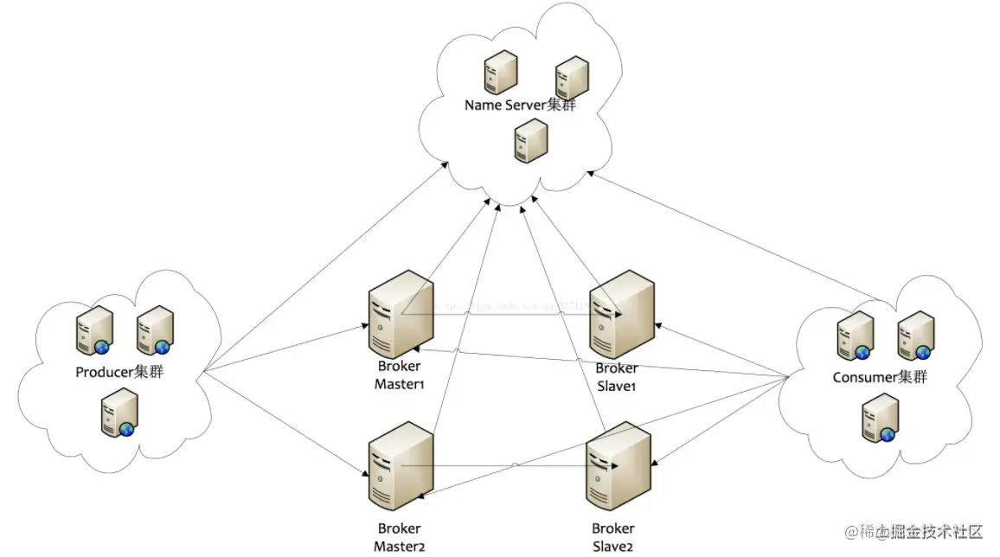
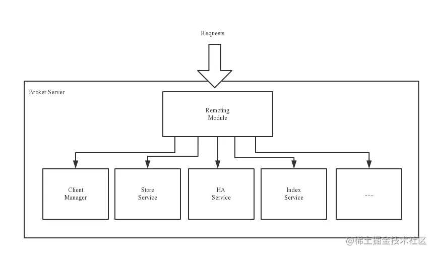
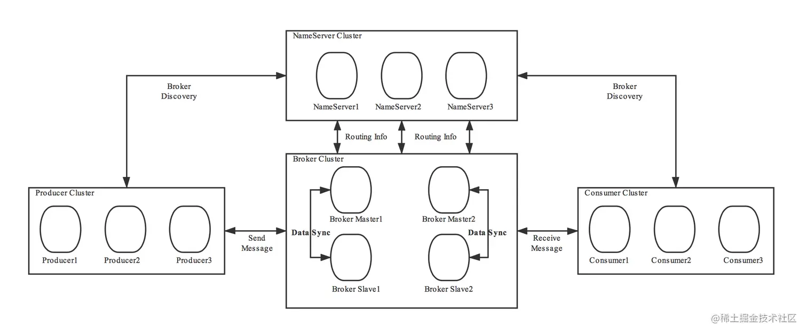
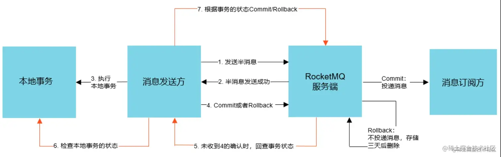

<!-- vscode-markdown-toc -->
* 1. [特点](#)
* 2. [术语](#-1)
* 3. [架构](#-1)
	* 3.1. [NameServer](#NameServer)
		* 3.1.1. [为什么不使用zk作为注册中心？](#zk)
	* 3.2. [Broker](#Broker)
* 4. [RocketMq的工作流程](#RocketMq)
* 5. [NameServer](#NameServer-1)
	* 5.1. [路由剔除](#-1)
	* 5.2. [路由更新](#-1)
	* 5.3. [客户端（生产者、消费者）对NameServer的选择策略](#NameServer-1)
* 6. [刷盘策略](#-1)
* 7. [复制策略](#-1)
* 8. [Broker](#Broker-1)
	* 8.1. [四种集群模式](#-1)
* 9. [Producer](#Producer)
	* 9.1. [发送消息的三种方式](#-1)
* 10. [消息的存储](#-1)
	* 10.1. [消息的写入过程](#-1)
* 11. [消费](#-1)
	* 11.1. [Comsumer消费方式](#Comsumer)
	* 11.2. [消费模式](#-1)
	* 11.3. [Reblance机制](#Reblance)
* 12. [负载均衡策略](#-1)
	* 12.1. [消费者负载均衡](#-1)
	* 12.2. [生产者的负载均衡](#-1)
	* 12.3. [重试队列](#-1)
	* 12.4. [offset的同步提交与异步提交](#offset)
* 13. [RocketMQ为什么这么快？](#RocketMQ)
* 14. [RocketMQ如何保证消息不被重复消费（幂等性）?](#RocketMQ-1)
	* 14.1. [消息重复场景](#-1)
	* 14.2. [解决消息重复](#-1)
* 15. [RocketMQ怎么保证消息不丢失（可靠性）？](#RocketMQ-1)
* 16. [RocketMQ是怎么实现分布式事务消息的？](#RocketMQ-1)

<!-- vscode-markdown-toc-config
	numbering=true
	autoSave=true
	/vscode-markdown-toc-config -->
<!-- /vscode-markdown-toc -->
# RocketMQ

参考： https://juejin.cn/post/7066064544837140510

##  1. 特点
- 亿级消息的堆积能力，单个队列中百万级消息的累积容量
- 高可用性：Broker服务器支持多Master多Slave的同步双写以及Master多Slave的异步复制模式，其中同步双写可保证消息不丢失
- 高可靠性：生产者将消息发送至Broker有三种方式：同步、异步和单向，同步和异步都可以保证消息成功发送。Broker对于消息刷盘有两种策略：同步刷盘和异步刷盘，同步刷盘可以保证消息可以成功的存储到磁盘中。消费者的消费模式也有集群消费和广播消费两种，模式是集群消费，如果集群消费中消费者挂掉了，同个组里的其他消费者会接替进行消费。
- 支持分布式事务：使用半消息确认和消息回查机制来保证分布式事务消息的。
- 支持消息过滤：建议使用消费者业务端的tag进行过滤
- 支持顺序消息：Broker中的队列是FIFO存储的
- 支持定时消息和延迟消息

##  2. 术语
- 消息（Message）
  - 消息系统所传输信息的物理载体，生产和消费数据的最小单位，每条消息必须属于一个主题。
- 主题（Topic）
  - Topic表示一类消息的集合，每个主题包含若干条消息，每条消息只能属于一个主题，是RocketMQ进行消息订阅的基本单位。 topic:message 1:n message:topic 1:1；
  - 一个生产者可以同时发送多种Topic的消息；而一个消费者只对某种特定的Topic感兴趣，即只可以订阅和消费一种Topic的消息。 producer:topic 1:n consumer:topic 1:1
- 标签（Tag）
  - 为消息设置的标签，用于同一主题下区分不同类型的消息。来自同一业务单元的消息，可以根据不同业务目的在同一主题下设置不同标签。标签能够有效地保持代码的清晰度和连贯性，并优化RocketMQ提供的查询系统。消费者可以根据Tag实现对不同子主题的不同消费逻辑，实现更好的扩展性。
  - Topic是消息的一级分类，Tag是消息的二级分类。例如：Topic：货物 tag=上海 tag=江苏 tag=浙江
- 队列（Queue）
  - 存储消息的物理实体。一个Topic中可以包含多个Queue，每个Queue中存放的就是该Topic的消息。一个Topic的Queue也被称为一个Topic中消息的分区（Partition）。一个Topic的Queue中的消息只能被一个消费者组中的一个消费者消费。一个Queue中的消息不允许同一个消费者组中的多个消费者同时消费。
- 消息标识（Message/Key）
  - RocketMQ中每个消息拥有唯一的MessageId，且可以携带具有业务标识的Key，以方便对消息的查询。
  - 不过需要注意的是，MessageId有两个：在生产者send()消息时会自动生成一个MessageId（msgId），当消息到Broker后，Broker也会自动生成一个MessageId(offsetMsgId)。msgId、offsetMsgId与key都称为消息标识。
  - msgId：由producer端生成，其生成规则为
    - producerIp + 进程pid + MessageClientIDSetter类的ClassLoader的hashCode +当前时间 + AutomicInteger自增计数器
  - offsetMsgId：由broker端生成，其生成规则为：
    - brokerIp + 物理分区的offset（Queue中的偏移量）
  - key：由用户指定的业务相关的唯一标识
- 组（Group）
  - 组，可分为ProducerGroup生产者组和ConsumerGroup消费者组，一个组可以订阅多个Topic。
  - 一般来说，某一类相同业务的生产者和消费者放在一个组里。
- 偏移量（offset）
  - 消息队列中的offset，可以认为就是下标，消息队列可看做数组。offset是java long型，64位，理论上100年不会溢出，所以可以认为消息队列是一个长度无限的数据结构。

##  3. 架构

RocketMq一共有四个部分组成：NameServer，Broker，Producer生产者，Consumer消费者，每一部分都是集群部署的。

- Broker在启动的时候去向所有的NameServer注册，并保持长链接，心跳保持30s/次
- Producer发送消息的时候从NameServer拉取Broker信息，根据负载均衡算法选择一台服务器来发送消息
- Conusmer消费消息的时候同样从NameServer获取Broker地址，然后**主动拉取**消息来消费

###  3.1. NameServer
NameServer是一个Broker与Topic路由的注册中心，支持Broker的动态注册与发现。

主要包括两个功能：

- Broker管理：接受Broker集群的注册信息并且保存下来作为路由信息的基本数据；提供心跳检测机制，检查Broker是否还存活。
- 路由信息管理：每个NameServer中都保存着Broker集群的整个路由信息和用于客户端查询的队列信息。Producer和Conumser通过NameServer可以获取整个Broker集群的路由信息，从而进行消息的投递和消费

####  3.1.1. 为什么不使用zk作为注册中心？
1、zk是cp的，leader选举期间整个集群是不可用的

2、zk需要单独部署集群

3、NameServer是去中心化的，只要有一台存活，整个注册中心就可用

###  3.2. Broker
消息存储和中转角色，负责接收、存储和转发消息，同时为消费者拉取消息做好准备

Broker同时存储着消息相关的元数据，包括消费者消费进度的offset、主题、队列等。

- Remoting Module：整个Broker的实体，负责处理来自clients端的请求。而这个Broker实体则由以下模块构成。
- Client Manager：客户端管理器。负责接收、解析客户端(Producer/Consumer)请求，管理客户端。例如，维护Consumer的Topic订阅信息
- Store Service：存储服务。提供方便简单的API接口，处理消息存储到物理硬盘和消息查询功能。
- HA Service：高可用服务，提供Master Broker 和 Slave Broker之间的数据同步功能。
- Index Service：索引服务。根据特定的Message key，对投递到Broker的消息进行索引服务，同时也提供根据Message Key对消息进行快速查询的功能。

##  4. RocketMq的工作流程

- 启动NameServer，NameServer启动后开始监听端口，等待Broker、Producer、Consumer连接。
- 启动Broker时，Broker会与所有的NameServer建立并保持长连接，然后每30秒向NameServer定时发送心跳包。
- Producer发送消息前，可以先创建Topic，创建Topic时需要指定该Topic要存储在哪些Broker上，当然，在创建Topic时也会将Topic与Broker的关系写入到NameServer中。不过，这步是可选的，也可以在发送消息时自动创建Topic。
- Producer发送消息，启动时先和NameServer集群中的其中一台建立长连接，并从NameServer中获取路由信息（当前发送的Topic消息的Queue与Broker的地址（IP+Port）的映射关系）。然后根据算法策略选择一个Queue，与队列所在的Broker建立长连接从而向Broker发消息。当然，在获取到路由信息后，Producer会首先将路由信息缓存到本地，再每30秒从NameServer更新一次路由信息。
- Consumer跟Producer类似，启动时先和NameServer集群中的其中一台建立长连接，并从NameServer中获取路由信息（订阅Topic的路由信息）。然后根据算法策略从路由信息中获取到其所要消费的Queue，然后与队列所在的Broker建立长连接，开始消费其中的消息。Consumer在获取到路由信息后，同样也会每30秒从NameServer更新一次路由信息。不过不同于Producer的是，Consumer还会向Broker发送心跳，以确保Broker的存活状态。

##  5. NameServer
集群状态部署，但是无状态，每个NameServer上的数据是无差异的。

Broker启动后，跟每个NameServer都会保持长链接，进行注册和心跳（30s一次）。

缺点在于如果未指明NameServer地址，则Broker不会进行注册。

###  5.1. 路由剔除
NameServer每隔10s扫描Broker列表，如果发现Broker的最新心跳时间戳超过120s，就会将Broker从列表中剔除。

###  5.2. 路由更新
采用Pull模型，当有路由更新时，NameServer不会主动推送给客户端，客户端每隔30s从NameServer中拉取最新路由数据。

###  5.3. 客户端（生产者、消费者）对NameServer的选择策略
客户端生成一个随机数，然后对NameServer节点数量进行取模，如果连接失败，则采用轮训法。

##  6. 刷盘策略
RocketMQ提供了两种刷盘策略：同步刷盘和异步刷盘

- 同步刷盘：在消息达到Broker的内存之后，必须刷到commitLog日志文件中才算成功，然后返回Producer数据已经发送成功。
- 异步刷盘：异步刷盘是指消息达到Broker内存（PageCache）后就返回Producer数据已经发送成功，会唤醒一个线程去将数据持久化到CommitLog日志文件中。

同步刷盘保证了消息不丢失，但是响应时间相对异步刷盘要多出10%左右，适用于对消息可靠性要求比较高的场景。

异步刷盘的吞吐量比较高，RT小，但是如果broker断电了内存中的部分数据会丢失，适用于对吞吐量要求比较高的场景。

##  7. 复制策略

复制策略是Broker的Master与Slave间的数据同步方式。分为同步复制与异步复制：

- 同步复制：消息写入master后，master会等待slave同步数据成功后才向producer返回成功ACK；
- 异步复制：消息写入master后，master立即向producer返回成功ACK，无需等待slave同步数据成功；

##  8. Broker

Master与Slave 的对应关系是通过指定相同的BrokerName、不同的BrokerId 来确定的。BrokerId为0表示Master，非0表示Slave。每个Broker与NameServer集群中的所有节点建立长连接，定时注册Topic信息到所有NameServer。

###  8.1. 四种集群模式
- 单Master
- 多Master
  - 单台机器宕机期间，这台机器上未被消费的消息在机器恢复之前不可订阅（不可消费），消息实时性会受到影响。
- 多Master和多Slave节点-异步复制
  - master负责处理消息的读写请求，而slave仅负责消息的备份与master宕机后的角色切换。异步复制即前面所讲的复制策略中的异步复制策略，即消息写入master成功后，master立即向producer返回成功ACK，无需等待slave同步数据成功。该模式的最大特点之一是，当master宕机后slave能够自动切换为master。不过由于slave从master的同步具有短暂的延迟（毫秒级），所以当master宕机后，这种异步复制方式可能会存在少量消息的丢失问题。
- 多Master和多Slave节点-同步复制
  - 同步双写，指的是消息写入master成功后，master会等待slave同步数据成功后才向producer返回成功ACK，即master与slave都要写入成功后才会返回成功ACK，也即双写。该模式与异步复制模式相比，优点是消息的安全性更高，不存在消息丢失的情况。但单个消息的RT略高，从而导致性能要略低（大约低10%）。该模式存在一个大的问题：对于目前的版本，Master宕机后，Slave不会自动切换到Master。

##  9. Producer

Producer可以将消息写入到某Broker中的某Queue中，其经历了如下过程：

- Producer发送消息之前，会先向NameServer发出获取消息Topic的路由信息的请求
- NameServer返回该Topic的路由表及Broker列表
- Producer根据代码中指定的Queue选择策略，从Queue列表中选出一个队列，用于后续存储消息
- Produer对消息做一些特殊处理，例如，消息本身超过4M，则会对其进行压缩
- Producer向选择出的Queue所在的Broker发出RPC请求，将消息发送到选择出的Queue

###  9.1. 发送消息的三种方式
- 同步：同步发送是指发送方发出数据后等待接收方发回响应后在发送下一个数据包。一般用于重要的消息通知，如重要的通知邮件或者营销短信等。
- 异步：异步发送是指发送方发出数据后不等接收方发回响应就发出下一个数据包。一般用于可能链路耗时较长而对响应时间比较敏感的场景。如视频上传后通知启动转码服务。
- 单向：单向发送是指只负责发送消息而不等待接收方发送响应且没有回调函数，适合那些耗时比较短且对可靠性要求不高的场景，例如日志收集。

##  10. 消息的存储
消息存储在本地文件系统中，这些相关文件默认在当前用户主目录下的store目录中。

- abort：该文件在Broker启动后会自动创建，正常关闭Broker，该文件会自动消失。若在没有启动Broker的情况下，发现这个文件是存在的，则说明之前Broker的关闭是非正常关闭。
- checkpoint：其中存储着commitlog、consumequeue、index文件的最后刷盘时间戳
- commitlog：其中存放着commitlog文件，而消息是写在commitlog文件中的，不以Topic区分文件
- config：存放着Broker运行期间的一些配置数据
- consumequeue：其中存放着consumequeue文件，队列就存放在这个目录中，consumequeue保存commitlog中消息的偏移量的物理地址，这样消费者在消费的时候先从consumequeue中根据偏移量定位到具体的commitlog物理文件，然后根据一定的规则（offset和文件大小取模）在commitlog中快速定位。
- index：其中存放着消息索引文件indexFile
- lock：运行期间使用到的全局资源锁

###  10.1. 消息的写入过程
- Broker根据queueId，获取到该消息对应索引条目要在consumequeue目录中的写入偏移量，即QueueOffset
- 将queueId、queueOffset等数据，与消息一起封装为消息单元
- 将消息单元写入到commitlog
- 同时，形成消息索引条目
- 将消息索引条目分发到相应的consumequeue

##  11. 消费
###  11.1. Comsumer消费方式

- 拉取式消费

    Consumer主动从Broker中拉取消息，主动权由Consumer控制。一旦获取了批量消息，就会启动消费过程。不过，该方式的实时性较弱，即Broker中有了新的消息时消费者并不能及时发现并消费。

- 推送式消费（项目就采用这种模式）

    该模式下Broker收到数据后会主动推送给Consumer。该获取方式一般实时性较高。该获取方式是典型的发布-订阅模式，即Consumer向其关联的Queue注册了监听器，一旦发现有新的消息到来就会触发回调的执行，回调方法是Consumer去Queue中拉取消息。而这些都是基于Consumer与Broker间的长连接的。长连接的维护是需要消耗系统资源的。

###  11.2. 消费模式

- 广播式消费
  - 每条消息都会被发送到Consumer Group中的每个Consumer。
- 集群消费
  - 每条消息只会被发送到Consumer Group中的某个Consumer。

###  11.3. Reblance机制

将⼀个Topic下的多个Queue在同⼀个Consumer Group中的多个Consumer间进行重新分配的过程。

由于⼀个队列最多分配给⼀个消费者，因此当某个消费者组下的消费者实例数量大于队列的数量时，多余的消费者实例将分配不到任何队列

**Rebalance产生的原因？**

- 消费者所订阅Topic的Queue数量发生变化
- 消费者组中消费者的数量发生变化

**Rebalance的危害？**

- 消费暂停：在只有一个Consumer时，其负责消费所有队列；在新增了一个Consumer后会触发Rebalance的发生。此时原Consumer就需要暂停部分队列的消费，等到这些队列分配给新的Consumer后，这些暂停消费的队列才能继续被消费。
- 消费重复：Consumer 在消费新分配给自己的队列时，必须接着之前Consumer 提交的消费进度的offset继续消费。然而默认情况下，offset是异步提交的，这个异步性导致提交到Broker的offset与Consumer实际消费的消息并不一致。这个不一致的差值就是可能会重复消费的消息。
- 消费突刺：由于Rebalance可能导致重复消费，如果需要重复消费的消息过多，或者因为Rebalance暂停时间过长从而导致积压了部分消息。那么有可能会导致在Rebalance结束之后瞬间需要消费很多消息。

##  12. 负载均衡策略
RocketMQ是分布式消息服务，负载均衡是在生产者和消费者的客户端完成的。

###  12.1. 消费者负载均衡
1、 平均分配策略

该算法是要根据avg = QueueCount / ConsumerCount的计算结果进行分配的。如果能够整除，则按顺序将avg个Queue逐个分配Consumer；如果不能整除，则将多余出的Queue按照Consumer顺序逐个分配。

2、 环形平均

根据消费者的顺序，依次在由queue队列组成的环形图中逐个分配。

就像给多个消费者发牌，按顺序将queue发给consumer

3、一致性hash

该算法会将consumer的hash值作为Node节点存放到hash环上，然后将queue的hash值也放到hash环上，通过顺时针方向，距离queue最近的那个consumer就是该queue要分配的consumer。

4、同机房策略

该算法会根据queue的部署机房位置和consumer的位置，过滤出当前consumer相同机房的queue。然后按照平均分配策略或环形平均策略对同机房queue进行分配。如果没有同机房queue，则按照平均分配策略或环形平均策略对所有queue进行分配。

###  12.2. 生产者的负载均衡

1、轮询算法

默认选择算法。该算法保证了每个Queue中可以均匀的获取到消息。该算法存在一个问题：由于某些原因，在某些Broker上的Queue可能投递延迟较严重。从而导致Producer的缓存队列中出现较大的消息积压，影响消息的投递性能。

2、最小投递延迟算法

该算法会统计每次消息投递的时间延迟，然后根据统计出的结果将消息投递到时间延迟最小的Queue。如果延迟相同，则采用轮询算法投递。该算法可以有效提升消息的投递性能。该算法也存在一个问题：消息在Queue上的分配不均匀。投递延迟小的Queue其可能会存在大量的消息。而对该Queue的消费者压力会增大，降低消息的消费能力，可能会导致MQ中消息的堆积。

###  12.3. 重试队列
当RocketMQ对消息的消费出现异常时，会将发生异常的消息的offset提交到Broker中的重试队列。系统在发生消息消费异常时会为当前的topic@group创建一个重试队列，该队列以%RETRY%开头，到达重试时间后进行消费重试。

###  12.4. offset的同步提交与异步提交
集群消费模式下，Consumer消费完消息后会向Broker提交消费进度offset，其提交方式分为两种：

- 同步提交：消费者在消费完一批消息后会向broker提交这些消息的offset，然后等待broker的成功响应。若在等待超时之前收到了成功响应，则继续读取下一批消息进行消费（从ACK中获取nextBeginOffset）。若没有收到响应，则会重新提交，直到获取到响应。而在这个等待过程中，消费者是阻塞的。其严重影响了消费者的吞吐量。
- 异步提交：消费者在消费完一批消息后向broker提交offset，但无需等待Broker的成功响应，可以继续读取并消费下一批消息。这种方式增加了消费者的吞吐量。但需要注意，broker在收到提交的offset后，还是会向消费者进行响应的。可能还没有收到ACK，此时Consumer会从Broker中直接获取、nextBeginOffset。

##  13. RocketMQ为什么这么快？
是因为使用了顺序存储、Page Cache、异步刷盘、mmap零拷贝技术。

- 在写入commitlog的时候是顺序写入的，这样比随机写入的性能就会提高很多;
- 写入commitlog的时候并不是直接写入磁盘，而是先写入操作系统的PageCache;
- 写操作：OS会先将数据写入到Page Cache中，随后会以异步方式由pdflush内核线程将Cache中的数据刷盘到物理磁盘；
- 读操作：若用户要读取数据，其首先会从Page Cache中读取，若没有命中，则OS在从物理磁盘上加载该数据到PageCache的同时，也会顺序对其相邻数据块中的数据进行预读取；
- RocketMQ对文件的读写操作是通过mmap零拷贝进行的，将对文件的操作转化为直接对内存地址进行操作，从而极大地提高了文件的读写效率。

##  14. RocketMQ如何保证消息不被重复消费（幂等性）?

###  14.1. 消息重复场景
1、发送时消息重复

当一条消息已被成功发送到Broker并完成持久化，此时出现了网络闪断，从而导致Broker对Producer应答失败。 如果此时Producer意识到消息发送失败并尝试再次发送消息，此时Broker中就可能会出现两条内容相同并且Message ID也相同的消息，那么后续Consumer就一定会消费两次该消息。

2、消费时消息重复

消息已投递到Consumer并完成业务处理，当Consumer给Broker反馈应答时网络闪断，Broker没有接收到消费成功响应。为了保证消息至少被消费一次的原则，Broker将在网络恢复后再次尝试投递之前已被处理过的消息。此时消费者就会收到与之前处理过的内容相同、Message ID也相同的消息。

3、Rebalance时消息重复

当Consumer Group中的Consumer数量发生变化时，或其订阅的Topic的Queue数量发生变化时，会触发Rebalance，此时Consumer可能会收到曾经被消费过的消息。

###  14.2. 解决消息重复
1、数据库主键

2、redis+数据库

以支付场景为例：

- 当支付请求到达后，首先在Redis缓存中却获取key为支付流水号的缓存value。若value不空，则说明本次支付是重复操作，业务系统直接返回调用侧重复支付标识；若value为空，则进入下一步操作
- 到DBMS中根据支付流水号查询是否存在相应实例。若存在，则说明本次支付是重复操作，业务系统直接返回调用侧重复支付标识；若不存在，则说明本次操作是首次操作，进入下一步完成唯一性处理
- 在分布式事务中完成三项操作：
  - 完成支付任务
  - 将当前支付流水号作为key，任意字符串作为value，通过set(key, value, expireTime)将数据写入到Redis缓存
  - 将当前支付流水号作为主键，与其它相关数据共同写入到DBMS

##  15. RocketMQ怎么保证消息不丢失（可靠性）？
需要在三个阶段处理：
Producer发送消息阶段。
Broker处理消息阶段。
Consumer消费消息阶段。

##  16. RocketMQ是怎么实现分布式事务消息的？
半消息：是指暂时还不能被Consumer消费的消息，Producer成功发送到broker端的消息，但是此消息被标记为“暂不可投递”状态，只有等Producer端执行完本地事务后经过二次确认了之后，Consumer才能消费此条消息。

上图就是分布式事务消息的实现过程，依赖半消息，二次确认以及消息回查机制。

- Producer向broker发送半消息
- Producer端收到响应，消息发送成功，此时消息是半消息，标记为“不可投递”状态，Consumer消费不了。
- Producer端执行本地事务。
- 正常情况本地事务执行完成，Producer向Broker发送Commit/Rollback，如果是Commit，Broker端将半消息标记为正常消息，Consumer可以消费，如果是Rollback，Broker丢弃此消息。
- 异常情况，Broker端迟迟等不到二次确认。在一定时间后，会查询所有的半消息，然后到Producer端查询半消息的执行情况。
- Producer端查询本地事务的状态
- 根据事务的状态提交commit/rollback到broker端。（5，6，7是消息回查）
