[toc]


# Service Mesh 服务网格


## 一、Service Mesh

服务网格是用于处理服务到服务通信的专用基础设施层。 它负责通过组成现代云本地应用程序的复杂服务拓扑来可靠地交付请求。 在实践中，服务网格通常被实现为一组轻量级网络代理，这些代理与应用程序代码一起部署，而应用程序不需要知道。  


Service Mesh是一种新型的用于处理服务与服务之间通信的技术，尤其适用以云原生应用形式部署的服务，能够保证服务与服务之间调用的可靠性。

在实际部署时，Service Mesh通常以轻量级的网络代理的方式跟应用的代码部署在一起，从而以应用无感知的方式实现服务治理


下图中，通过Bouyant公司开发的第一代Service Mesh产品Linkerd

服务A调用服务B，经过Linkerd来代理转发，A、B的业务代码不需要关心服务框架功能的实现，所以Linkerd需要具备负载均衡、熔断、超时重试、监控统计以及服务路由等功能

对于跨语言服务调用来说，即使服务消费者和服务提供者采用的语言不同，也不需要继承各自语言的SDK


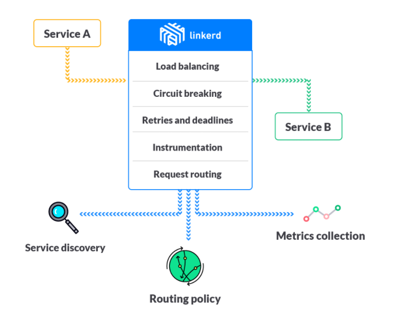


对于云原生应用来说，可以在每个服务部署的实例上，都同等部署一个Linkerd，如下，A调用B，首先调用本地的Linkerd，经过本地的Linkerd转发给B节点上的Linkerd，最后由B本地的Linkerd把请求转发给B。

所有的服务调用都得经过LInker进行代理转发，所有的LInkerd组合起来就像一个网格一样，这就是为什么称为Service Mesh

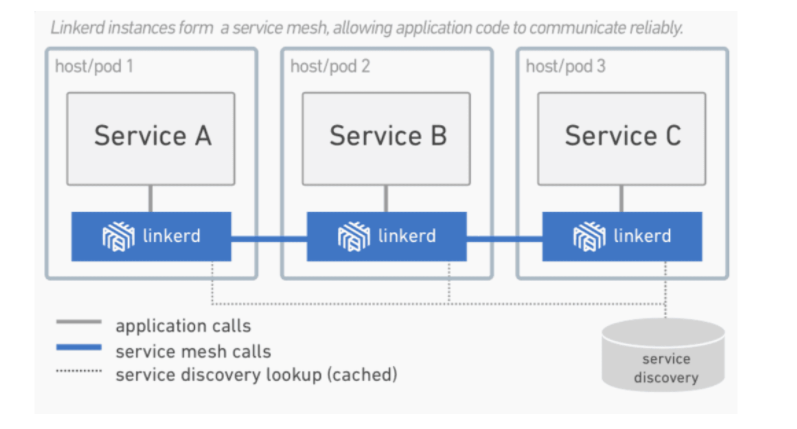


## 二、实现原理

Service Mesh实现的关键在于两点：

一个是轻量级网络代理，也就是SideCar，它的作用是转发服务之间的调用

一个是基于SideCar的服务治理也被叫做Control Plane，它的作用是像SideCar发送各种指令，已完成各种服务治理功能


### 1、SideCar

在传统的微服务架构下，服务消费者、服务提供者在实现自身逻辑情况下还需要实现其它功能。

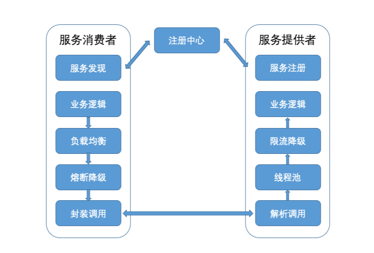


而在Service Mesh架构中，服务框架的功能都集中实现在SideCar里，并在每一个服务消费者和服务提供者的本地都部署了SideCar，服务消费者和提供者只管自己的业务实现，服务消费者向本地的 SideCar 发起请求，本地的 SideCar 根据请求的路径向注册中心查询，得到服务提供者的可用节点列表后，再根据负载均衡策略选择一个服务提供者节点，并向这个节点上的 SideCar 转发请求，服务提供者节点上的 SideCar 完成流量统计、限流等功能后，再把请求转发给本地部署的服务提供者进程，从而完成一次服务请求。整个流程你可以参考下面这张图。

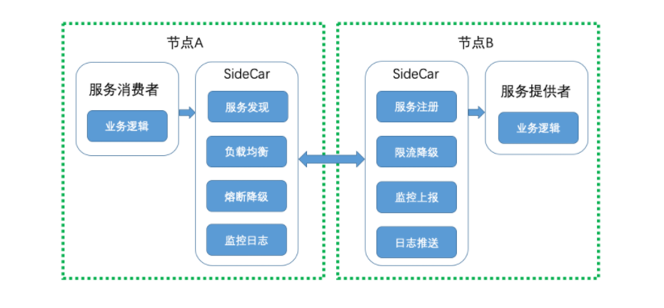


可以把服务消费者节点上的SideCar叫做正向代理，服务提供者节点上的SideCar叫做反向代理，那么Serivce Mesh架构的关键点就在于服务消费者发出的请求如何通过正向代理转发以及服务提供者收到的请求如何通过反向代理转发。

两种实现方案：

- 基于 iptables 的网络拦截。这种方案请见下图，节点 A 上服务消费者发出的 TCP 请求都会被拦截，然后发送给正向代理监听的端口 15001，正向代理处理完成后再把请求转发到节点 B 的端口 9080。节点 B 端口 9080 上的所有请求都会被拦截发送给反向代理监听的端口 15001，反向代理处理完后再转发给本机上服务提供者监听的端口 9080。

  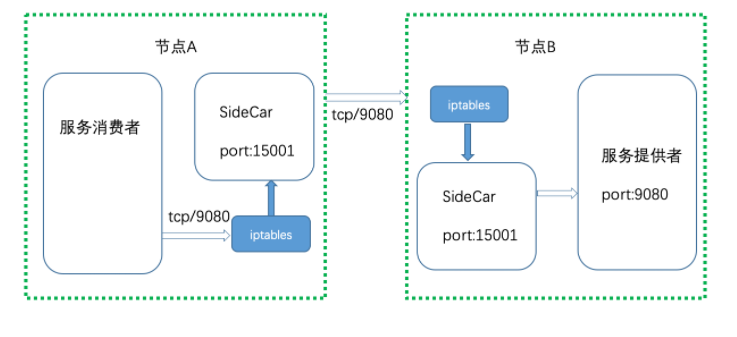

- 采用协议转换的方式。这种方案请见下图，节点 A 上的服务消费者请求直接发给正向代理监听的端口 15001，正向代理处理完成后，再把请求转发到节点 B 上反向代理监听的端口 15001，反向代理处理完成后再发送给本机上的服务提供者监听的端口 9080。

  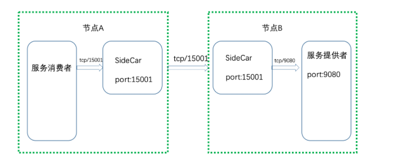


两种方案最大的不同之处在于，一个是通过iptables网络拦截实现代理转发的，一个是靠直接把请求发送给代理来转发的。

基于iptables网络拦截的方式，优点是从网络层实现调用拦截，能做到完全的业务无感知，所以适合云原生应用，


### 2、Control Plane

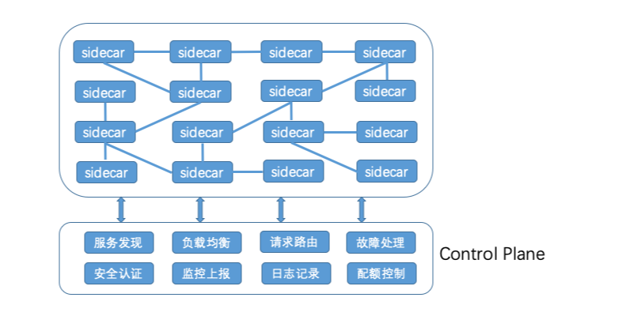


既然SideCar能实现服务之间的调用拦截功能，那么服务之间的所有流量都可以通过SideCar来转发，这样的话所有的SideCar就组成了一个服务网格，再通过一个统一的地方与各个SideCar交互，就能控制网络中流量的运转了，这个统一的地方在Service Mesh中就被称为Control Plane。


#### （1）服务发现

服务提供者会通过SideCar注册到Control Plane的注册中心，这样的话服务消费者把请求发送到SideCar后，SideCar就会查询Control Plane的注册中心来获取服务提供者节点列表。


#### （2）负载均衡

SideCar从Control Plane获取到服务提供者节点列表信息后，就需要按照一定的负载均衡算法从可用的节点列表中选取一个节点发起调用，可以通过Control Plane动态修改SideCAr的负载均衡配置


#### （3）请求路由

SideCar从Control Plane获取的服务提供者节点列表，也可以通过Control Plane来动态改变，比如需要继续宁A/B测试、灰度发布或者流量切换时，就可以动态的改变请求路由


#### （4）故障处理

服务之间的调用如果出现故障，就需要加以控制，通常的手段有超时重试、熔断等，这些都可以在SideCar转发请求时，通过Control Plane动态配置


#### （5）安全认证

可以通过Control Plane控制一个服务可以被谁访问，以及访问哪些信息


#### （6）监控上报

所有SideCar转发的请求信息，都会发送到Control Plane，再由Control Plane发送到监控系统，比如Prometheus等


#### （6）日志记录

所有SideCar转发的日志信息，也会发送到Control Plane，再由Control Plane发送给日志系统，比如Stackdriver等


#### （7）配额控制

可以在Control Plane里给服务的每个调用方配置最大调用次数，在SideCar转发请求给某个服务时，会审计调用是否超出服务对应的次数限制。


### 3、思考

Service Mesh 中 SideCar 的部署模式是在每个服务节点的本地，都同等部署一个 SideCar 实例，为什么不使用集中式的部署模式，让多个服务节点访问一个 SideCar 实例？


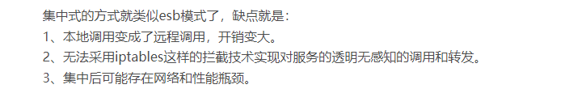


## 三、Istio

Istio的架构由两部分组成，分别是Proxy和Control Plane

- Proxy，也就是SideCar，与应用程序部署在同一个主机上，应用程序之间的调用都通过Proxy来转发，目前支持Http1.1、Http2、gRPC以及TCP请求
- Control Plane，与Proxy通信，来实现各种服务治理功能，包括三个基本组件：Pilot、Mixer以及Citadel

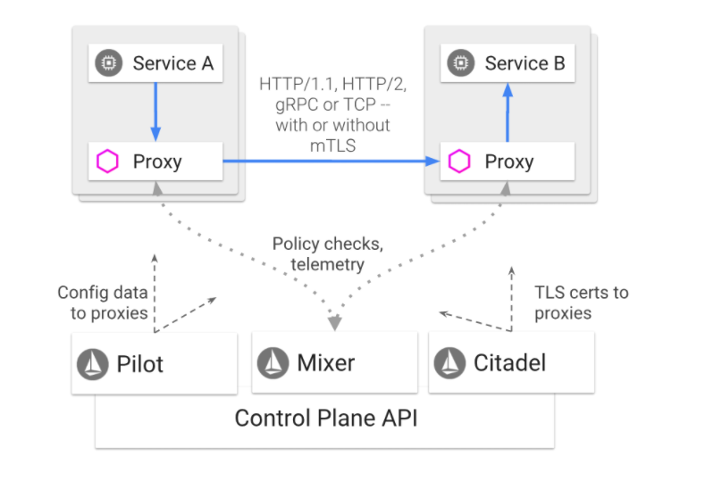


### 1、Proxy

Istio的Proxy采用的是Envoy，既要作为服务消费者端的正向代理，又要作为服务提供者端的反向代理，一般要具备服务发现、服务注册、负载均衡、限流降级、超时熔断、动态路由、监控上报和日志推送等功能

主要包含一下几个特性：

（1）性能损耗低，采用C++实现，Envoy能提供极高的吞吐量和极少的长尾延迟，而且对系统的CPU和内存资源占用也不大，所以跟业务进程部署在一起不会对业务进行造成影响。

（2）可扩展性高，Envoy提供了可插播过滤器的能力，用户可开发定制过滤器以满足自己特定的需求

（3）动态可配置，Envoy对外提供了统一的API，包括CDS（集群发现服务）、RDS（路由发现服务）、LDS（监听器发现服务）、EDS（EndPoint发现服务）、HDS（健康检查服务）、ADS（聚合发现服务）等，通过调用这些API，可实现相应配置的动态变更，而不需要重启Envoy


Envoy是Istio中最基础的组件，所有其它组件的功能都是通过调用Envoy提供的API，在请求经过Envoy转发时，由Envoy执行相关的控制逻辑来实现的。


### 2、Pilot

Pilot的作用是实现流量控制，通过像Envoy下发各种指令来实现流量控制，

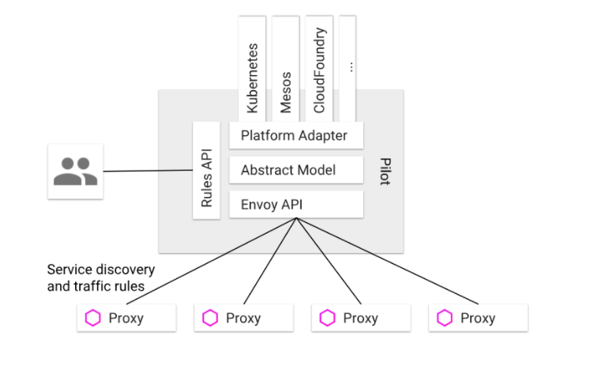


（1）Rules API，对外封装统一的API，共服务的开发者或者运维人员调用，可以用于流量控制

（2）Envoy API，对内封装统一的API，供Envoy调用工艺获取注册信息、流量控制信息等

（3）抽象模型层，对服务的注册信息、流量控制规则等进行抽线给，使其描述与平台无关

（4）平台适配层，用于适配各个平台如kubernetes、Mesos、Cloud Foundry等，把平台特定的注册信息、资源信息等转换成抽象模型层定义的平台无关的描述。


**Pilot是如何实现流量管理功能的呢？**


1、服务发现和负载均衡

服务 B 也就是服务提供者注册到对应平台的注册中心中去，比如 Kubernetes 集群中的 Pod，启动时会注册到注册中心 etcd 中。然后服务 A 也就是服务消费者在调用服务 B 时，请求会被 Proxy 拦截，然后 Proxy 会调用 Pilot 查询可用的服务提供者节点，再以某种负载均衡算法选择一个节点发起调用。

除此之外，Proxy 还会定期检查缓存的服务提供者节点的健康状况，当某个节点连续多次健康检查失败就会被从 Proxy 从缓存的服务提供者节点列表中剔除。

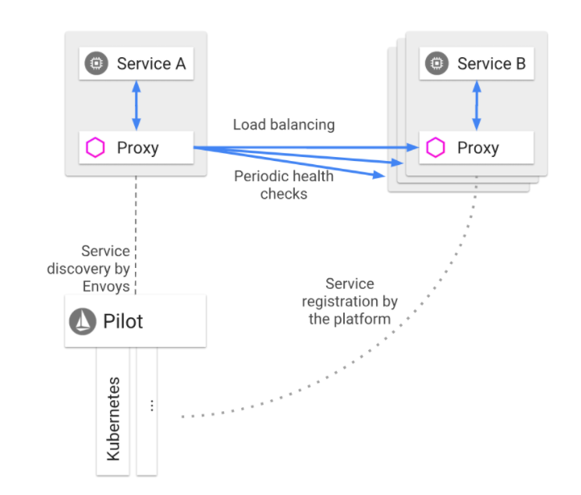


2、请求路由

Pilot 可以对服务进行版本和环境的细分，服务 B 包含两个版本 v1.5 和 v2.0-alpha，其中 v1.5 是生产环境运行的版本，而 v2.0-alpha 是灰度环境运行的版本。当需要做 A/B 测试时，希望灰度服务 B 的 1% 流量运行 v2.0-alpha 版本，就可以通过调用 Pilot 提供的 Rules API，Pilot 就会向 Proxy 下发路由规则，Proxy 在转发请求时就按照给定的路由规则，把 1% 的流量转发给服务 B 的 v2.0-alpha 版本，99% 的流量转发给服务 B 的 v1.5 版本。


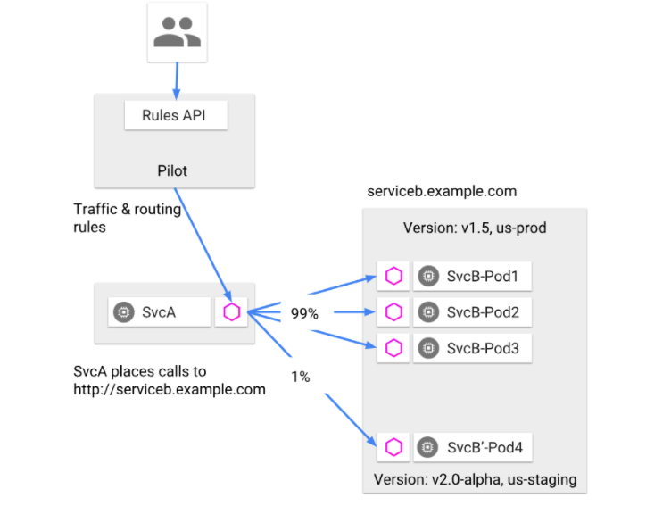


3、超时重试

缺省状态下，Proxy 转发 HTTP 请求时的超时是 15s，可以通过调用 Pilot 提供的 Rules API 来修改路由规则，覆盖这个限制。比如下面这段路由规则，表达的意思是 ratings 服务的超时时间是 10s。

```yaml
apiVersion: networking.istio.io/v1alpha3
kind: VirtualService
metadata:
  name: ratings
spec:
  hosts:
    - ratings
  http:
  - route:
    - destination:
        host: ratings
        subset: v1
    timeout: 10s
```

还可以通过修改路由规则，来指定某些 HTTP 请求的超时重试次数，比如下面这段路由规则，表达的意思就是 ratings 服务的超时重试次数总共是 3 次，每一次的超时时间是 2s。

```yaml
apiVersion: networking.istio.io/v1alpha3
kind: VirtualService
metadata:
  name: ratings
spec:
  hosts:
    - ratings
  http:
  - route:
    - destination:
        host: ratings
        subset: v1
    retries:
      attempts: 3
      perTryTimeout: 2s
```


4、故障注入

Istio 还提供了故障注入的功能，能在不杀死服务节点的情况下，通过修改路由规则，将特定的故障注入到网络中。它的原理是在 TCP 层制造数据包的延迟或者损坏，从而模拟服务超时和调用失败的场景，以此来观察应用是否健壮。比如下面这段路由规则的意思是对 v1 版本的 ratings 服务流量中的 10% 注入 5s 的延迟。

```yaml
apiVersion: networking.istio.io/v1alpha3
kind: VirtualService
metadata:
  name: ratings
spec:
  hosts:
  - ratings
  http:
  - fault:
      delay:
        percent: 10
        fixedDelay: 5s
    route:
    - destination:
        host: ratings
        subset: v1

```

而下面这段路由规则意思是对 v1 版本的 ratings 服务流量中的 10% 注入 HTTP 400 的错误。

```
apiVersion: networking.istio.io/v1alpha3
kind: VirtualService
metadata:
  name: ratings
spec:
  hosts:
  - ratings
  http:
  - fault:
      abort:
        percent: 10
        httpStatus: 400
    route:
    - destination:
        host: ratings
        subset: v1
```


### 3、Mixer

Mixer的作用是实现策略控制和监控给日志收集等功能，实现方式是每一次Proxy转发的请求都要调用Mixer，而且Mixer的实现是可扩展的，通过适配层来适配不同的后端平台，这样Istio的其它部分就不需要关心各个基础设置比如日志系统、监控系统的实现细节

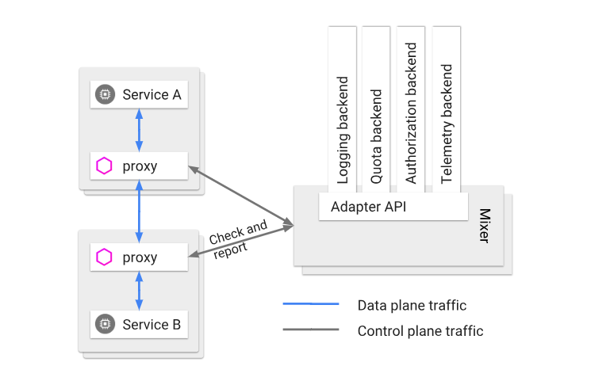

理论上每一次的服务调用 Proxy 都需要调用 Mixer，一方面检查调用的合法性，一方面要上报服务的监控信息和日志信息，所以这就要求 Mixer 必须是高可用和低延迟的

Mixer实现原理：

- Proxy 端的本地缓存。为了减少 Proxy 对 Mixer 的调用以尽量降低服务调用的延迟，在 Proxy 这一端会有一层本地缓存，但由于 Proxy 作为 SideCar 与每个服务实例部署在同一个节点上，所以不能对服务节点有太多的内存消耗，所以就限制了 Proxy 本地缓存的大小和命中率。
- Mixer 的本地缓存。Mixer 是独立运行的，所以可以在 Mixer 这一层使用大容量的本地缓存，从而减少对后端基础设施的调用，一方面可以减少延迟，另一方面也可以最大限度减少后端基础设施故障给服务调用带来的影响。

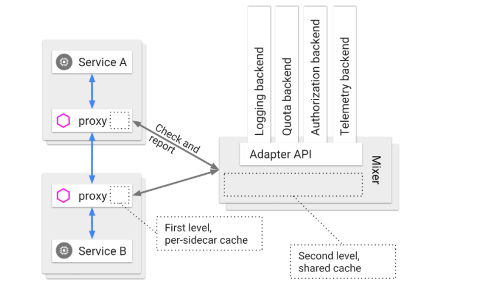


Mixer是如何实现策略控制和监控日志收集功能呢？

1、策略控制

Istio 支持两类的策略控制，一类是对服务的调用进行速率限制，一类是对服务的调用进行访问控制，它们都是通过在 Mixer 中配置规则来实现的。

速率限制需要配置速率控制的 yaml 文件，每一次 Proxy 转发请求前都会先调用 Mixer，Mixer 就会根据这个 yaml 文件中的配置，来对调用进行速率限制。

比如下面这段配置表达的意思是服务默认访问的速率限制是每秒 5000 次，除此之外还定义了两个特殊限制，第一个是 v3 版本的 reviews 服务请求 ratings 服务的速率限制是每 5 秒 1 次，第二个是其他服务请求 ratings 服务的速率限制是每 10 秒 5 次。

```yaml
apiVersion: config.istio.io/v1alpha2
kind: memquota
metadata:
  name: handler
  namespace: istio-system
spec:
  quotas:
  - name: requestcount.quota.istio-system
    maxAmount: 5000
    validDuration: 1s
    overrides:
    - dimensions:
        destination: ratings
        source: reviews
        sourceVersion: v3
      maxAmount: 1
      validDuration: 5s
    - dimensions:
        destination: ratings
      maxAmount: 5
      validDuration: 10s
```

而访问控制需要配置访问控制的 yaml 文件，每一次 Proxy 转发请求前都会先调用 Mixer，Mixer 就会根据这个 yaml 文件中的配置，来对调用进行访问控制。比如下面这段配置表达的意思是 v3 版本的 reviews 服务调用 ratings 服务就会被拒绝。

```yaml
apiVersion: "config.istio.io/v1alpha2"
kind: rule
metadata:
  name: denyreviewsv3
spec:
  match: destination.labels["app"] == "ratings" && source.labels["app"]=="reviews" && source.labels["version"] == "v3"
  actions:
  - handler: denyreviewsv3handler.denier
    instances: [ denyreviewsv3request.checknothing ]
```


2、监控和日志收集

跟策略控制的实现原理类似，Mixer 的监控、日志收集功能也是通过配置监控 yaml 文件来实现的，Proxy 发起的每一次服务调用都会先调用 Mixer，把监控信息发给 Mixer，Mixer 再根据配置的 yaml 文件来决定监控信息该发到哪。


### 4、Citadel

Citadel的作用是保证服务之间访问的安全

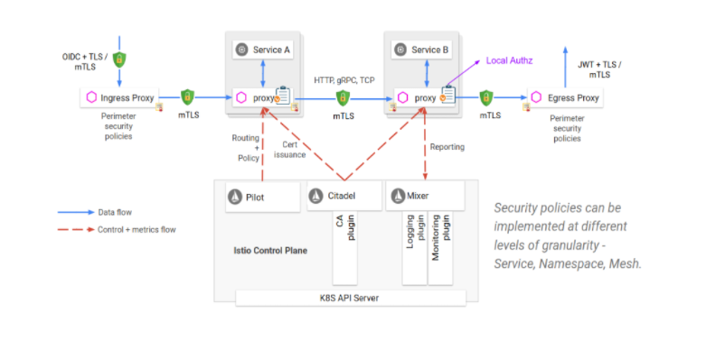

实际的安全保障并不是Citadel独立完成的，而是需要Proxy、Pilot以及Mixer的配置

- Citadel 里存储了密钥和证书。
- 通过 Pilot 把授权策略和安全命名信息分发给 Proxy。
- Proxy 与 Proxy 之间的调用使用双向 TLS 认证来保证服务调用的安全。
- 最后由 Mixer 来管理授权和审计。


