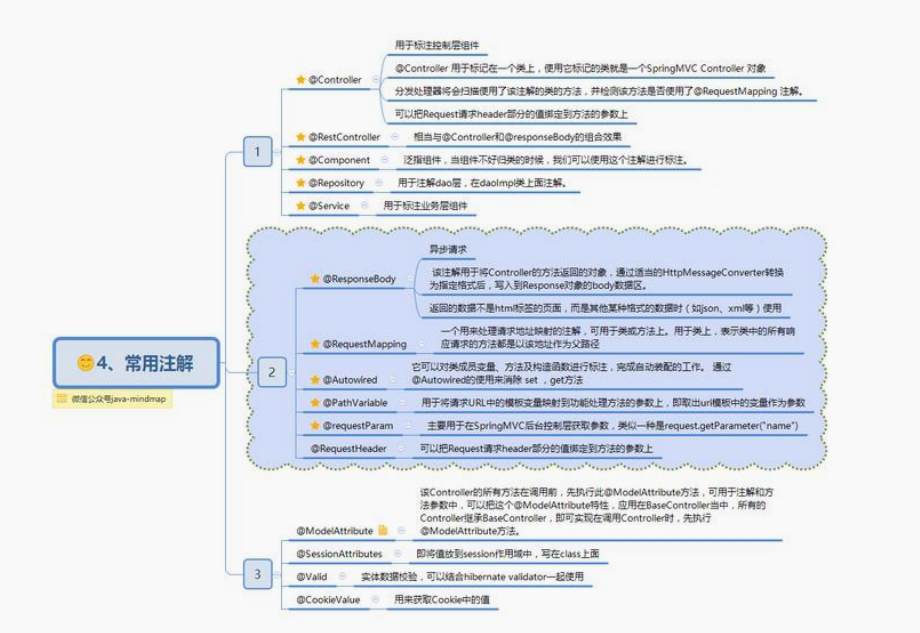

[toc]

# Spring


Spring是一个全面的、企业应用开发一站式的解决方案，贯穿表现层、业务层、持久层。但是Spring任然可以可其它的框架无缝整合。

## 1、Spring特点

- 轻量级
- 控制反转
- 面向切面
- 容器
- 框架集合


## 2、Spring核心组件


## 3、Spring常用模块

### （1）核心容器

提供Spring框架的基本功能，核心容器的主要组件时BeanFactory，是工厂模式的实现，BeanFactory使用控制反转（IOC）模式将应用程序的配置和依赖性规范与实际的应用程序代码分开。

### （2）Spring上下文

是一个配置文件，向Spring框架提供上下文信息，Spring上下文包括企业服务，例如JNDI、EJB、电邮、国家化、校验和调度功能

### （3）Spring AOP

通过配置管理特性，Spring AOP模块直接将面向切面的编程功能集成到了Spring框架中，可以将一些通用任务，如安全、事务、日志等集中进行管理，提高了复用性和管理的便捷性。

### （4）Spring DAO

为JDBC DAO抽象层提供了有意义的异常层次结构，可用该结构来管理异常处理和不同数据库供应商抛出的错误消息，异常层次结构简化了错误处理，并极大地降低了需要编写的异常代码数量。Spring DAO的面向JDBC的异常遵从通用的DAO的异常层次结构。

### （5）Spring ORM

Spring框架插入了若干个ORM框架，从而提供了ORM的对象关系工具，其中包括JDO、Hibernate和Ibatis SQL Map，所有这些都遵从Spring的通用事务和DAO异常层次结构。

### （6）Spring Web模块

Web上下文模块建立在应用程序上下文模块之上，为基于Web的应用程序提供了上下文，所以，Spring支持与Jakarta Struts的继承。

Web模块还简化了处理多部份请求以及将请求参数绑定到域对象的工作。

### （7）Spring MVC框架

MVC框架始于i个全功能的构建Web应用程序的MVC实现，通过策略接口，MVC框架便成为高度可配置的，MVC容纳了大量试图技术，包括JSP、Velocity等


## 4、Spring主要包


## 5、Spring常用注解

bean注入与装配的方式有很多，可通过xml，get set方式，构造函数或者注解等，

最常用的还是注解。




## 6、Spring与第三方结合


## 7、Spring IOC原理

### （1）概念

Spring通过一个配置文件描述Bean及Bean之间的依赖关系，利用Java语言的反射功能实例化Bean并建立Bean之间的依赖关系。

Spring的IOC容器在完成这些底层工作的基础上，还提供了Bean实例缓存、生命周期管理、Bean实例代理、事件发布、资源装载等高级服务。


### （2）Spring容器高层视图

Spring启动时读取应用程序提供的Bean配置信息，并在Spring容器中生成一份相应的BEan配置注册表，然后根据这张注册表实例化Bean，装配好Bean之间的依赖关系，为上层应用提供准备就绪的运行环境，其中Bean缓存池为HashMap实现。


### （3）IOC容器实现

#### 1、**BeanFactory-框架基础设施**

BeanFactory是框架的基础设施，面向Spring本身

ApplicationContext面向使用Spring的开发者，几乎所有的应用场合都直接使用ApplicationContext而非底层的BeanFactory


##### 1、BeanDefinitionRegistry注册表

Spring配置文件中每一个节点元素在Spring都通过一个BeanDefinition对象表示，描述了Bean的骗子hi信息，而BeanDefinitionRegistry接口提供了像容器手工注册BeanDefinition对象的方法。

##### 2、BeanFactory顶层接口

最主要的方法就是getBean(String beanName)，该方法从容器中返回特定名称的BEan，BeanFActory的功能通过其他的接口得到不断扩展

##### 3、ListableBeanFactory

定义了访问容器中Bean基本信息的若干方法，如查看Bean的个数、获取某一个类型Bean的配置名、查看容器中是否包括某一Bean等方法

##### 4、HierarchicalBeanFactory 父子级联

父子级联IOC容器的接口，子容器可通过接口方法访问父容器；通过HierarchicalBeanFactory接口，Spring的IOC可以建立父子层级关联的容器体系，子容器可以访问父容器中的Bean，但父容器不能访问子容器的Bean。Spring使用父子容器实现很多功能，比如Spring MVC中，展现层Bean位于一个子容器中，而业务层和持久层的Bean位于父容器中，此时，展现层Bean就可以引用业务层和持久层的Bean，而业务层和持久层的BEan则看不到展现层的Bean。

##### 5、ConfigurableBeanFactory

增强了IOC容器的可定制性，定义了设置类装载器、属性编辑器、容器初始化后置处理器等方法。

##### 6、AutowireCapableBeanFactory自动装配

定义了将容器中的Bean按某种规则进行自动装配的方法，比如名字匹配或者类型匹配等

##### 7、SingletonBeanRegistry运行期间注册单例Bean

定义了允许在运行期间向容器注册单实例 Bean 的方法；对于单实例（ singleton）的 Bean 来说，BeanFactory 会缓存 Bean 实例，所以第二次使用 getBean() 获取 Bean 时将直接从IoC 容器的缓存中获取 Bean 实例。Spring 在 DefaultSingletonBeanRegistry 类中提供了一个用于缓存单实例 Bean 的缓存器，它是一个用 HashMap 实现的缓存器，单实例的 Bean 以beanName 为键保存在这个 HashMap 中。

##### 8、依赖日志框架

在初始化BeanFactory时，必须为其提供一种日志框架，比如使用Log4J，即在类路径下提供Log4J配置文件，这样启动Spring容器才不会报错。


#### 2、ApplicationContext面向开发应用

ApplicationContext由BeanFactory派生而来，提供了更多面向实际应用的功能。

还继承了HierarchicalBeanFactory和ListableBeanFactory接口，在此基础上，还通过多个其它的接口拓展了BeanFActory的功能。


1. ClassPathXmlApplicationContext：默认从类路径加载配置文件13/04/2018
2. FileSystemXmlApplicationContext：默认从文件系统中装载配置文件

3. ApplicationEventPublisher：让容器拥有发布应用上下文事件的功能，包括容器启动事

件、关闭事件等。

4. MessageSource：为应用提供 i18n 国际化消息访问的功能；

5. ResourcePatternResolver ： 所 有 ApplicationContext 实现类都实现了类似于PathMatchingResourcePatternResolver 的功能，可以通过带前缀的 Ant 风格的资源文件路径装载 Spring 的配置文件。

6. LifeCycle：该接口是 Spring 2.0 加入的，该接口提供了 start()和 stop()两个方法，主要用于控制异步处理过程。在具体使用时，该接口同时被 ApplicationContext 实现及具体Bean 实现， ApplicationContext 会将 start/stop 的信息传递给容器中所有实现了该接口的 Bean，以达到管理和控制 JMX、任务调度等目的。

7. ConfigurableApplicationContext 扩展于 ApplicationContext，它新增加了两个主要的方法： refresh()和 close()，让 ApplicationContext 具有启动、刷新和关闭应用上下文的能力。在应用上下文关闭的情况下调用 refresh()即可启动应用上下文，在已经启动的状态下，调用 refresh()则清除缓存并重新装载配置信息，而调用 close()则可关闭应用 上下文


#### 3、WebApplication体系架构

WebApplicationContext 是专门为 Web 应用准备的，它允许从相对于 Web 根目录的路径中装载配置文件完成初始化工作。从 WebApplicationContext 中可以获得ServletContext 的引用，整个 Web 应用上下文对象将作为属性放置到 ServletContext 中，以便 Web 应用环境可以访问 Spring 应用上下文。


### 4、Spring Bean的作用域

5种作用域，分别是Singleton、ptorotype、request、session和global session

#### 		singleton：单例模式（多线程下不安全）

1. singleton：单例模式，Spring IoC 容器中只会存在一个共享的 Bean 实例，无论有多少个Bean 引用它，始终指向同一对象。该模式在多线程下是不安全的。Singleton 作用域是Spring 中的缺省作用域，也可以显示的将 Bean 定义为 singleton 模式，配置为：
  <bean id="userDao" class="com.ioc.UserDaoImpl" scope="singleton"/>

  #### prototype:原型模式每次使用时创建

2. prototype:原型模式，每次通过 Spring 容器获取 prototype 定义的 bean 时，容器都将创建一个新的 Bean 实例，每个 Bean 实例都有自己的属性和状态，而 singleton 全局只有一个对象。根据经验，对有状态的bean使用prototype作用域，而对无状态的bean使用singleton作用域。 

   #### Request：一次 request 一个实例

3. request：在一次 Http 请求中，容器会返回该 Bean 的同一实例。而对不同的 Http 请求则会产生新的 Bean，而且该 bean 仅在当前 Http Request 内有效,当前 Http 请求结束，该 bean实例也将会被销毁。
  <bean id="loginAction" class="com.cnblogs.Login" scope="request"/>

  #### session

4. session：在一次 Http Session 中，容器会返回该 Bean 的同一实例。而对不同的 Session 请求则会创建新的实例，该 bean 实例仅在当前 Session 内有效。同 Http 请求相同，每一次session 请求创建新的实例，而不同的实例之间不共享属性，且实例仅在自己的 session 请求内有效，请求结束，则实例将被销毁。
  <bean id="userPreference" class="com.ioc.UserPreference" scope="session"/>

  #### global Session

5. global Session：在一个全局的 Http Session 中，容器会返回该 Bean 的同一个实例，仅在使用 portlet context 时有效。


### 5、Spring Bean的生命周期

#### 实例化

1. 实例化一个 Bean，也就是我们常说的 new。

#### IOC 依赖注入

2. 按照 Spring 上下文对实例化的 Bean 进行配置，也就是 IOC 注入。

#### setBeanName 实现

3. 如果这个 Bean 已经实现了 BeanNameAware 接口，会调用它实现的 setBeanName(String)
方法，此处传递的就是 Spring 配置文件中 Bean 的 id 值

#### BeanFactoryAware 实现

4. 如果这个 Bean 已经实现了 BeanFactoryAware 接口，会调用它实现的 setBeanFactory，
setBeanFactory(BeanFactory)传递的是 Spring 工厂自身（可以用这个方式来获取其它 Bean，
只需在 Spring 配置文件中配置一个普通的 Bean 就可以）。

#### ApplicationContextAware 实现

5. 如果这个 Bean 已经实现了 ApplicationContextAware 接口，会调用
setApplicationContext(ApplicationContext)方法，传入 Spring 上下文（同样这个方式也
可以实现步骤 4 的内容，但比 4 更好，因为 ApplicationContext 是 BeanFactory 的子接
口，有更多的实现方法）

#### postProcessBeforeInitialization 接口实现-初始化预处理

6. 如果这个 Bean 关联了 BeanPostProcessor 接口，将会调用
postProcessBeforeInitialization(Object obj, String s)方法，BeanPostProcessor 经常被用
作是 Bean 内容的更改，并且由于这个是在 Bean 初始化结束时调用那个的方法，也可以被应
用于内存或缓存技术。

#### init-method

7. 如果 Bean 在 Spring 配置文件中配置了 init-method 属性会自动调用其配置的初始化方法

  

  #### postProcessAfterInitialization

8. 如果这个 Bean 关联了 BeanPostProcessor 接口，将会调用postProcessAfterInitialization(Object obj, String s)方法。

注：以上工作完成以后就可以应用这个 Bean 了，那这个 Bean 是一个 Singleton 的，所以一
般情况下我们调用同一个 id 的 Bean 会是在内容地址相同的实例，当然在 Spring 配置文件中
也可以配置非 Singleton。 

#### Destroy 过期自动清理阶段

9. 当 Bean 不再需要时，会经过清理阶段，如果 Bean 实现了 DisposableBean 这个接口，会调
  用那个其实现的 destroy()方法；

  #### destroy-method 自配置清理

10. 最后，如果这个 Bean 的 Spring 配置中配置了 destroy-method 属性，会自动调用其配置的
    销毁方法。


11. bean 标签有两个重要的属性（init-method 和 destroy-method）。用它们你可以自己定制初始化和注销方法。它们也有相应的注解（@PostConstruct 和@PreDestroy）。

<bean id="" class="" init-method="初始化方法" destroy-method="销毁方法">


### 6、Spring依赖注入四种方式

#### （1）构造器注入

```java
/*带参数，方便利用构造器进行注入*/ 
 public CatDaoImpl(String message){ 
 this. message = message; 
 } 
<bean id="CatDaoImpl" class="com.CatDaoImpl"> 
	<constructor-arg value=" message "></constructor-arg> 
</bean>
```


#### （2）Setter方法注入

```java
public class Id { 
 private int id; 
 public int getId() { return id; } 
 public void setId(int id) { this.id = id; } 
} 
<bean id="id" class="com.id "> <property name="id" value="123"></property> </bean>
```


#### （3）静态工厂注入

通过调用静态工厂的方法来获取自己需要的对象，为了让 spring 管理所有对象，我们不能直接通过"工程类.静态方法()"来获取对象，而是依然通过 spring 注入的形式获取：

```java
public class DaoFactory { //静态工厂 
 public static final FactoryDao getStaticFactoryDaoImpl(){ 
 return new StaticFacotryDaoImpl(); 
 } 
} 
public class SpringAction { 
 private FactoryDao staticFactoryDao; //注入对象
 //注入对象的 set 方法 
 public void setStaticFactoryDao(FactoryDao staticFactoryDao) { 
 this.staticFactoryDao = staticFactoryDao; 
 } 
} 
//factory-method="getStaticFactoryDaoImpl"指定调用哪个工厂方法
 <bean name="springAction" class=" SpringAction" > 
 <!--使用静态工厂的方法注入对象,对应下面的配置文件--> 
 <property name="staticFactoryDao" ref="staticFactoryDao"></property> 
 </bean> 
 <!--此处获取对象的方式是从工厂类中获取静态方法--> 
<bean name="staticFactoryDao" class="DaoFactory" 
factory-method="getStaticFactoryDaoImpl"></bean>
```

#### （4）实例工厂

实例工厂的意思是获取对象实例的方法不是静态的，所以你需要首先 new 工厂类，再调用普通的实例方法

```java
public class DaoFactory { //实例工厂 
 public FactoryDao getFactoryDaoImpl(){ 
 return new FactoryDaoImpl(); 
 } 
} 
public class SpringAction { 
 private FactoryDao factoryDao; //注入对象 
 public void setFactoryDao(FactoryDao factoryDao) { 
 this.factoryDao = factoryDao; 
 } 
} 
 <bean name="springAction" class="SpringAction"> 
 <!--使用实例工厂的方法注入对象,对应下面的配置文件--> 
 <property name="factoryDao" ref="factoryDao"></property> 
 </bean> 
 <!--此处获取对象的方式是从工厂类中获取实例方法--> 
<bean name="daoFactory" class="com.DaoFactory"></bean> 
<bean name="factoryDao" factory-bean="daoFactory"
factory-method="getFactoryDaoImpl"></bean>
```


#### （5）五种不同方式的自动装配

Spring 装配包括手动装配和自动装配，手动装配是有基于 xml 装配、构造方法、setter 方法等
自动装配有五种自动装配的方式，可以用来指导 Spring 容器用自动装配方式来进行依赖注入。
1. no：默认的方式是不进行自动装配，通过显式设置 ref 属性来进行装配。
2. byName：通过参数名 自动装配，Spring 容器在配置文件中发现 bean 的 autowire 属性被设
置成 byname，之后容器试图匹配、装配和该 bean 的属性具有相同名字的 bean。
3. byType：通过参数类型自动装配，Spring 容器在配置文件中发现 bean 的 autowire 属性被
设置成 byType，之后容器试图匹配、装配和该 bean 的属性具有相同类型的 bean。如果有多
个 bean 符合条件，则抛出错误。
4. constructor：这个方式类似于 byType， 但是要提供给构造器参数，如果没有确定的带参数
的构造器参数类型，将会抛出异常。
5. autodetect：首先尝试使用 constructor 来自动装配，如果无法工作，则使用 byType 方式。


## 8、Spring AOP原理

### （1）概念

“横切”的技术，剖解开封装的对象内部，并将那些影响了多个类的公共行为封装到一个可重用模块，并将其命名为“Aspect”，即切面，与业务无关，却为业务模块所共同调用的逻辑封装起来，便于减少系统的重复代码，降低模块之间的耦合度，并有利于未来的可操作性和可维护性。

使用"横切"技术，AOP 把软件系统分为两个部分：核心关注点和横切关注点。业务处理的主要流程是核心关注点，与之关系不大的部分是横切关注点。横切关注点的一个特点是，他们经常发生在核心关注点的多处，而各处基本相似，比如权限认证、日志、事物。AOP 的作用在于分离系统中的各种关注点，将核心关注点和横切关注点分离开来。

AOP 主要应用场景有：
1. Authentication 权限
2. Caching 缓存
3. Context passing 内容传递
4. Error handling 错误处理
5. Lazy loading 懒加载
6. Debugging 调试
7. logging, tracing, profiling and monitoring 记录跟踪 优化 校准
8. Performance optimization 性能优化
9. Persistence 持久化
10. Resource pooling 资源池
11. Synchronization 同步
12. Transactions 事务


### （2）AOP核心概念

#### 1、切面 aspect

类是对物体特征的抽象，切面就是对横切关注点的抽象

#### 2、横切关注点

对那些方法进行拦截，拦截后怎么处理，这些关注点都称为横切关注点

#### 3、连接点 joinpoint

被拦截到的点，因为Spring支支持方法类型的连接点，所以在Spring中连接点指的就是被拦截到的方法，实际上连接点还可以是字段或者构造器。

#### 4、切入点 pointcut

对连接点进行拦截的定义

#### 5、通知 advice

指拦截到连接点之后要执行的代码，通知分为前置、后置、异常、最终、环绕通知 五类

#### 6、目标对象

代理的目标对象

#### 7、织入 weave

将切面应用到目标对象并导致代理对象创建的过程

#### 8、引入 introduction

在不修改代码的前提下，引入可以在运行期为类动态地添加一些方法或字段


### （3）AOP两种代理方式

Spring提供了两种方式来生成代理对象：JDKProxy 和 CGlib，具体使用哪种方式生成由AopProxyFactory 根据AdvisedSupport对象的配置来决定。

默认的策略是如果目标类是接口，则使用JDK动态代理技术，否则使用CGlib来生成代理。

#### 1、JDK动态接口代理

JDK 动态代理主要涉及到 java.lang.reflect 包中的两个类：Proxy 和 InvocationHandler。InvocationHandler是一个接口，通过实现该接口定义横切逻辑，并通过反射机制调用目标类的代码，动态将横切逻辑和业务逻辑编制在一起。Proxy 利用 InvocationHandler 动态创建一个符合某一接口的实例，生成目标类的代理对象


#### 2、CGlib动态代理

CGlib全称为Code Generation Library，是一个强大的高性能，高质量的代码生成类库，可在运行期扩展Java类与实现Java接口，CGlib封装了asm，可在运行期动态生成新的Class

和JDK动态代理相比较，JDK动态代理有一个限制，就是只能为接口创建代理实例，而对于没有通过接口定义业务方法的类，则可通过CGLib创建动态代理。


## 9、Spring MVC原理

Spring 的模型-视图-控制器（MVC）框架是围绕一个 DispatcherServlet 来设计的，这个 Servlet会把请求分发给各个处理器，并支持可配置的处理器映射、视图渲染、本地化、时区与主题渲染等，甚至还能支持文件上传。


### （1）MVC流程


#### Http 请求到 DispatcherServlet

(1) 客户端请求提交到 DispatcherServlet。

#### HandlerMapping 寻找处理器

(2) 由 DispatcherServlet 控制器查询一个或多个 HandlerMapping，找到处理请求的
Controller。

#### 调用处理器 Controller

(3) DispatcherServlet 将请求提交到 Controller。

#### Controller 调用业务逻辑处理后，返回 ModelAndView

(4)(5)调用业务处理和返回结果：Controller 调用业务逻辑处理后，返回 ModelAndView。

#### DispatcherServlet 查询 ModelAndView

(6)(7)处理视图映射并返回模型： DispatcherServlet 查询一个或多个 ViewResoler 视图解析器，
找到 ModelAndView 指定的视图。

#### ModelAndView 反馈浏览器 HTTP

(8) Http 响应：视图负责将结果显示到客户端。


### （2）MVC常用注解


## 10、循环依赖解决方案


Spring循环依赖的理论依据其实是Java基于引用传递，当我们获取到对象的引用时，对象的field或者或属性是可以延后设置的。
 Spring单例对象的初始化其实可以分为三步：

- createBeanInstance， 实例化，实际上就是调用对应的构造方法构造对象，此时只是调用了构造方法，spring xml中指定的property并没有进行populate
- populateBean，填充属性，这步对spring xml中指定的property进行populate
- initializeBean，调用spring xml中指定的init方法，或者AfterPropertiesSet方法
   会发生循环依赖的步骤集中在第一步和第二步。


### （1）三级缓存

```java
/** Cache of singleton objects: bean name --> bean instance */
private final Map<String, Object> singletonObjects = new ConcurrentHashMap<String, Object>(256);
/** Cache of singleton factories: bean name --> ObjectFactory */
private final Map<String, ObjectFactory<?>> singletonFactories = new HashMap<String, ObjectFactory<?>>(16);
/** Cache of early singleton objects: bean name --> bean instance */
private final Map<String, Object> earlySingletonObjects = new HashMap<String, Object>(16);
```

singletonObjects指单例对象的cache，singletonFactories指单例对象工厂的cache，earlySingletonObjects指提前曝光的单例对象的cache。

以上三个cache构成了三级缓存，Spring就用这三级缓存巧妙的解决了循环依赖问题。


```java
protected Object getSingleton(String beanName, boolean allowEarlyReference) {
   //先从一级缓存中获取
   Object singletonObject = this.singletonObjects.get(beanName);
   if (singletonObject == null && isSingletonCurrentlyInCreation(beanName)) {
      synchronized (this.singletonObjects) {
         //再从二级缓存中获取
         singletonObject = this.earlySingletonObjects.get(beanName);
         if (singletonObject == null && allowEarlyReference) {
            //然后从三级缓存中获取BeanFactory对象
            ObjectFactory<?> singletonFactory = this.singletonFactories.get(beanName);
            if (singletonFactory != null) {
               singletonObject = singletonFactory.getObject();
               // 从三级缓存中取到，就将其放入二级缓存中，然后从三级缓存中移除
               this.earlySingletonObjects.put(beanName, singletonObject);
               this.singletonFactories.remove(beanName);
            }
         }
      }
   }
   return (singletonObject != NULL_OBJECT ? singletonObject : null);}
```

首先解释两个参数：

- isSingletonCurrentlyInCreation 判断对应的单例对象是否在创建中，当单例对象没有被初始化完全(例如A定义的构造函数依赖了B对象，得先去创建B对象，或者在populatebean过程中依赖了B对象，得先去创建B对象，此时A处于创建中)
- allowEarlyReference 是否允许从singletonFactories中通过getObject拿到对象

这段代码发生在createBeanInstance之后，也就是说单例对象此时已经被创建出来的。这个对象已经被生产出来了，虽然还不完美（还没有进行初始化的第二步和第三步），但是已经能被人认出来了（根据对象引用能定位到堆中的对象），所以Spring此时将这个对象提前曝光出来让大家认识，让大家使用。

**这样做有什么好处呢？**

让我们来分析一下“A的某个field或者setter依赖了B的实例对象，同时B的某个field或者setter依赖了A的实例对象”这种循环依赖的情况。A首先完成了初始化的第一步，并且将自己提前曝光到singletonFactories中，此时进行初始化的第二步，发现自己依赖对象B，此时就尝试去get(B)，发现B还没有被create，所以走create流程，B在初始化第一步的时候发现自己依赖了对象A，于是尝试get(A)，尝试一级缓存singletonObjects(肯定没有，因为A还没初始化完全)，尝试二级缓存earlySingletonObjects（也没有），尝试三级缓存singletonFactories，由于A通过ObjectFactory将自己提前曝光了，所以B能够通过ObjectFactory.getObject拿到A对象(虽然A还没有初始化完全，但是总比没有好呀)，B拿到A对象后顺利完成了初始化阶段1、2、3，完全初始化之后将自己放入到一级缓存singletonObjects中。此时返回A中，A此时能拿到B的对象顺利完成自己的初始化阶段2、3，最终A也完成了初始化，长大成人，进去了一级缓存singletonObjects中，而且更加幸运的是，由于B拿到了A的对象引用，所以B现在hold住的A对象也蜕变完美了！一切都是这么神奇！！

