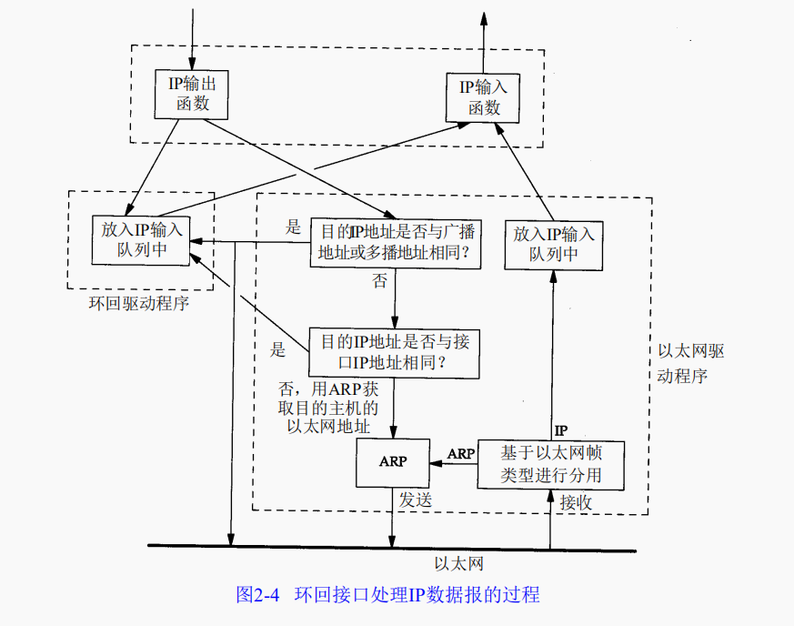
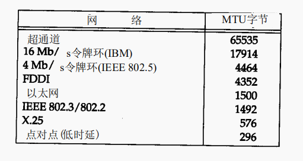

# **TCP/IP详解**

注：可查看 https://www.bookstack.cn/read/lutzchuck-tcpip-note/1.%20%E6%A6%82%E8%BF%B0.md 进行比对

## **一、概述**
### 1、分层
TCP/IP网络协议通常分不同层次进行开发，分别负责不同的通信功能
| 分层 | 作用 | 例子 |
|-----| -----| -----|
|应用层|处理应用程序细节|Telnet、FTP、SMTP、SNMP|
|传输层|为不同主机的应用程序提供端到端的通信|TCP、UDP|
|网络层|处理分组在网络中的活动，例如分组的选路|IP协议（网际协议）、ICMP协议（Internet互联网控制报文协议）、IGMP协议（Internet组管理协议）|
|链路层|处理与传输媒介（比如电缆）的物理接口细节|设备驱动程序和接口卡|

#### TCP（传输控制协议）
提供高可靠性的数据通信。把数据进行分包交给网络层

#### UDP（用户数据报协议）
把称作数据报的分组从一台主机发送到另一台主机，不保证数据报能发送到另一端。

应用层一般处于用户态中；而其他三层在内核中运行，处理所有的通信细节。

网络层IP提供的是一种不可靠的服务。也就是说，它只是尽可能快地把分组从源结点送到目的结点，但是并不提供任何可靠性保证。而另一方面，TCP在不可靠的IP层上提供了一个可靠的运输层。为了提供这种可靠的服务，TCP采用了超时重传、发送和接收端到端的确认分组等机制。

构造互联网最简单的方法是使用路由器，它可以为不同类型的物理网络提供链接：以太网、令牌环网、点对点的链接和FDDI（光钎分布式数据接口）等等。

连接网络的另一个途径是使用网桥。网桥是在链路层上对网络进行互连，而路由器则是在网络层上对网络进行互连。网桥使得多个局域网（LAN）组合在一起，这样对上层来说就好像是一个局域网。

### 2、TCP/IP的分层

TCP和UDP是两种最为著名的运输层协议，二者都使用IP作为网络层协议,TCP和UDP的每组数据都通过端系统
和每个中间路由器中的IP层在互联网中进行传输。

ICMP是IP协议的附属协议。IP层用它来与其他主机或路由器交换错误报文和其他重要信息。

### 3、互联网的地址

互联网的每一个接口都必须有一个唯一的Internet地址（IP地址），IP地址长度为32bit

  

有三类IP地址：

1. 单播地址（单个主机）
2. 广播地址（给定网络上的所有主机）
3. 多播地址（同一组内的所有主机）

### 4、域名系统

在TCP/IP领域中，域名系统（DNS）是一个分布式数据库，由它来提供IP地址和主机名之间的映射关系。

### 5、封装

当应用程序用TCP传送数据时，数据被送入协议栈中，然后逐个通过每一层直到被当做一串比特流送入网络，每一层收到的数据都要增加一些首部信息。

TCP传给IP的数据单元称作TCP报文段或简称为TCP段，IP传给网络接口层的数据单元被称作IP数据报，通过以太网传输的比特流被称作帧。

UDP数据和TCP数据基本一致，不同的是UDP传给IP的信息单元被称作UDP数据报，UDP的首部长是8字节。

 IP首部有个8bit的数值称为协议域，标志数据属于哪一层。1标识ICMP，2标识IGMP，6标识TCP，17标识UDP。 

以太网数据帧的物理特性是其长度必须在 4 6～1 5 0 0字节之间。

### 6、分用

当目的主机收到一个以太网数据帧时，数据就开始从协议栈中由底向上升，同时去掉各层协议加上的报文首部。每层协议盒都要检查报文首部中的协议标识，以确定接收数据的上层协议。这个过程称为“分用”。

### 7、客户-服务器模型

重复型或并发型。 TCP服务器是并发的，而UDP服务器是重复的 

重复型交互步骤：（ 重复型服务器主要的问题发生在I2状态。在这个时候，它不能为其他客户机提供服务。 ）

1、等待一个客户请求的到来。

2、处理客户请求。

3、发送响应给客户

4、返回第一步

并发型交互步骤：

1、等待一个客户请求的到来。

2、启用一个新的服务器处理客户请求， 在这期间可能生成一个新的进程、任务或线程，并依赖底层操作系统的支持。这个步骤如何进行取决于操作系统。生成的新服务器对客户的全部请求进行处理。处理结束后，终止这个新服务器。 

3、返回第一步。

### 8、端口号

TCP和UDP采用16bit的端口号来识别应用程序。

服务器一般都是通过知名端口号来识别的，例如FTP的默认TCP端口号为21

客户端通常对它所使用的端口号并不关心，只需保证该端口号在本机上是唯一的就可以了。

UNIX也有保留端口号，分配给拥有超级用户特权的进程。

### 9、应用编程接口

使用TCP/IP协议的应用程序通常采用两种应用编程接口（API）：socket和TLI（运输层接口：Transport Layer Interface）

## 二、链路层

链路层主要有三个目的：

（1）为IP模块发送和接收IP数据报

（2）为ARP模块发送ARP请求和接收ARP应答

（3）为RARP发送RARP请求和几首RARP应答

TCP/IP支持多种不同的链路层协议，取决于网络所使用的硬件，如以太网、令牌环网、FDDI（光纤分布式数据接口）及RS-232串行线路等。

### 1、以太网和IEEE 802封装

以太网是当今TCP/IP采用的主要的局域网技术，采用一种CSMA/CD的媒体接入方法，带冲突检测的载波侦听多路接入。速率是10M/s，地址是48bit。

| 802.3 | CSMA/CD网络  |
| :---- | :----------- |
| 802.4 | 令牌总线网络 |
| 802.5 | 令牌环网络   |

在TCP/IP世界中，以太网IP数据报的封装是在RFC894中定义的，IEEE802网络的IP数据报封装是在RFC1042中定义的。

两种帧格式都采用48bit的目的地址和源地址。

以太网的类型字段定义了后端数据的类型，而在802标准定义的格式中，类型字段则有后续的子网接入协议的首部给出。

802定义的有效长度值与以太网的有效类型值无一相同，这样，就可以对两种帧格式进行区分。

802.3规定数据部分至少38字节，以太网是46字节，当数据不够长时需要用pad进行填充。

### 2、SLIP：串行线路IP

在串行线路上对IP数据报进行封装的简单形式

SLIP协议定义的帧格式：

（1）IP数据报以一个END（0xc0）的特殊字符结束。为了防止数据报到来之前的线路噪声被当成数据报内容，大多数实现在数据报的开始处也传一个END字符。

（2）如果IP数据报中某个字符为END，那么就要连续传两个字节0 x d b和0 x d c来取代它。

（3）如果IP报文中某个字符为SLIP的ESC字符，那么就要连续传输两个字节 0xdb和0xdd来取代它。

SLIP的缺陷：

1) 每一端必须知道对方的IP地址。没有办法把本端的IP地址通知给另一端。

2) 数据帧中没有类型字段（类似于以太网中的类型字段）。如果一条串行线路用于SLIP，那么它不能同时使用其他协议。

3) SLIP没有在数据帧中加上检验和，只能通过上层协议来实现。

由于串行线路的速率较低，且通信常是交互式的，因此在SLIP线路上有许多小的TCP分组进行交换，这就带来了性能的缺陷。CSLIP是压缩的SLIP，它能把40个字节压缩到3-5个字节。

### 3、PPP：点对点协议

修改了SLIP协议中的所有缺陷。

PPP包括以下三个部分：

（1）在串行链路上封装 I P数据报的方法。 P P P既支持数据为 8位和无奇偶检验的异步模式，还支持面向比特的同步链接。

（2）建立、配置及测试数据链路的链路控制协议（ L C P：Link Control Protocol）。它允许通信双方进行协商，以确定不同的选项。

（3）针对不同网络层协议的网络控制协议（ N C P：Network Control Protocol）体系。当前R F C定义的网络层有I P、O S I网络层、D E C n e t以及A p p l e Ta l k。

每一帧都以标志字符0 x 7 e开始和结束。紧接着是一个地址字节，值始终是 0 x ff，然后是一个值为0 x 0 3的控制字节。

协议字段类似与以太网的类型字段，当值为0021时，表示信息时IP数据报，当为C021时，为链路控制数据，当为8021时，为网络控制数据。

CRC字段是一个循环冗余检验码，检测数据帧中的错误。

由于标志字符的值是0x7e，因此当该字符出现在信息字段中时， PPP需要对它进行转义。在同步链路中，该过程是通过一种称作比特填充 (bit stuffing)的硬件技术来完成的。

在异步链路中，特殊字符0x7d用作转义字符，当它出现在PPP数据帧中时，那么紧接着的字符的第6个比特要取其补码，具体实现过程如下：

1) 当遇到字符0 x 7 e时，需连续传送两个字符： 0 x 7 d和0 x 5 e，以实现标志字符的转义。

2) 当遇到转义字符0 x 7 d时，需连续传送两个字符： 0 x 7 d和0 x 5 d，以实现转义字符的转义。

3 ) 默认情况下，如果字符的值小于 0 x 2 0（比如，一个A S C I I控制字符），一般都要进行转义。

PPP比SLIP 具有下面这些优点：

(1) PPP支持在单根串行线路上运行多种协议，不只是 IP协议；

(2) 每一帧都有循环冗余检验；

(3) 通信双方可以进行IP地址的动态协商 (使用IP网络控制协议 )；

(4) 与CSLIP类似，对 TCP和IP报文首部进行压缩；

(5) 链路控制协议可以对多个数据链路选项进行设置。

### 4、环回接口

环回接口允许运行在同一台主机上的客户程序和服务器程序通过 T C P / I P进行通信。A类网络号1 2 7就是为环回接口预留的。根据惯例，大多数系统把I P地址1 2 7 . 0 . 0 . 1分配给这个接口，并命名为 l o c a l h o s t。一个传给环回接口的 I P数据报不能在任何网络上出现。

需要指出的关键点：

1. 传给127.0.0.1的任何数据君合作为IP输入。
2. 传给广播地址或多播地址的数据报复制一份传给127.0.0.1，然后送到以太网上。
3. 任何传给该主机IP地址的数据均送到127.0.0.1。

### 5、最大传输单元MTU

以太网和802.3对数据帧的长度都是有一个限制的。链路层的这个特性称为MTU，最大传输单元

### 6、路径MTU

两台通信主机路径中的最小 MTU，路径MTU 在两个方向上不一定是一致的。

