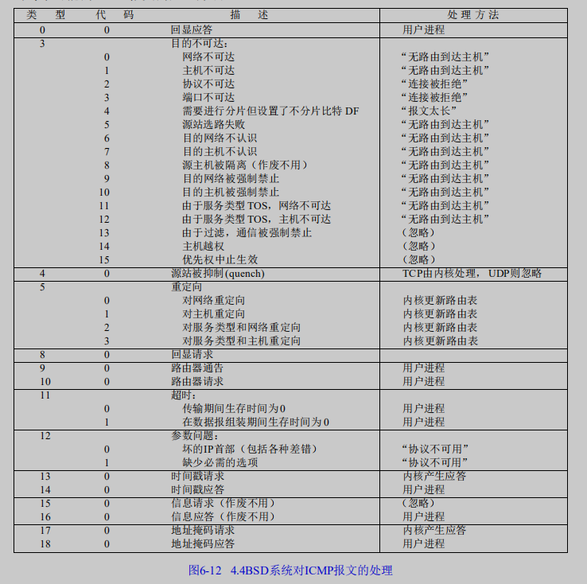
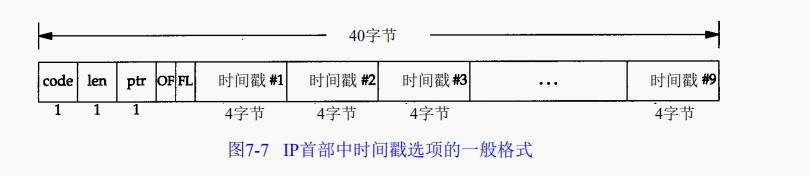
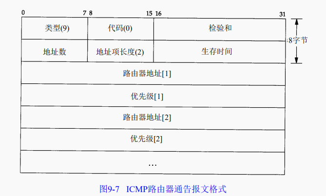
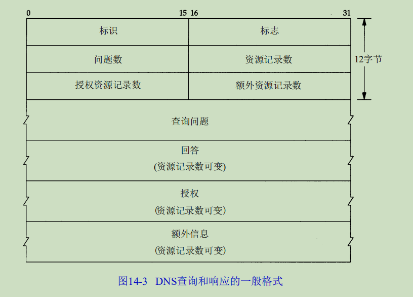
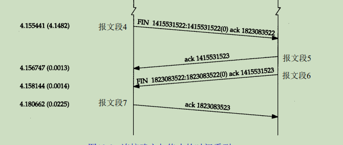
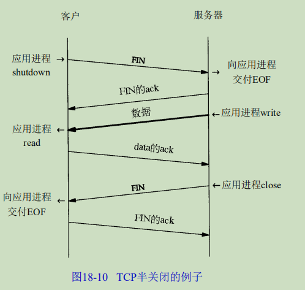
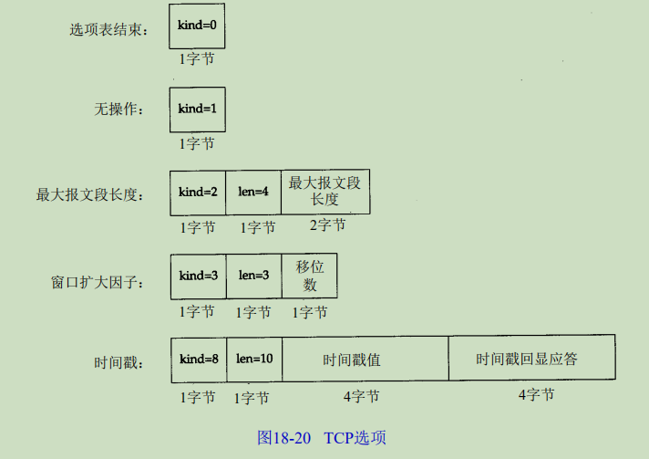

# **TCP/IP详解**

注：可查看 https://www.bookstack.cn/read/lutzchuck-tcpip-note/1.%20%E6%A6%82%E8%BF%B0.md 进行比对

[toc]


## tcpdump

注：可查看https://www.cnblogs.com/ggjucheng/archive/2012/01/14/2322659.html

通过将网络接口卡设置为混杂模式来截获经过网络接口的每一个分组。


### 1、BSD分组过滤器BPF

tcpdump用它来截获和过滤来自一个被置为混杂模式的网络接口卡的分组。BPF也可以工作在点对点的链路上，不需要什么特别的处理就可以截获所有通过接口的分组，还可以工作在环回接口上。


例如：只打印源端口和目的端口为25的tcp报文段

```
tcpdump tcp port 25
```


### 2、SunOS的网络接口分接头NIT

NIT只能截获接口收到的分组，将tcpdump和NIT结合起来就是只能看见从网络中其他主机发送过来的分组


### 3、tcpdump的输出

 系统时间 来源主机.端口 > 目标主机.端口 数据包参数 


### 4、实用命令

**默认启动**

```
tcpdump
```

普通情况下，直接启动tcpdump将监视第一个网络接口上所有流过的数据包。

 

**监视指定网络接口的数据包**

```
tcpdump -i eth1
```

如果不指定网卡，默认tcpdump只会监视第一个网络接口，一般是eth0，下面的例子都没有指定网络接口。　

 

**监视指定主机的数据包**

打印所有进入或离开sundown的数据包.

```
tcpdump host sundown
```

也可以指定ip,例如截获所有210.27.48.1 的主机收到的和发出的所有的数据包

```
tcpdump host 210.27.48.1 
```

打印helios 与 hot 或者与 ace 之间通信的数据包

```
tcpdump host helios and \( hot or ace \)
```

截获主机210.27.48.1 和主机210.27.48.2 或210.27.48.3的通信

```
tcpdump host 210.27.48.1 and \ (210.27.48.2 or 210.27.48.3 \) 
```

打印ace与任何其他主机之间通信的IP 数据包, 但不包括与helios之间的数据包.

```
tcpdump ip host ace and not helios
```

如果想要获取主机210.27.48.1除了和主机210.27.48.2之外所有主机通信的ip包，使用命令：

```
tcpdump ip host 210.27.48.1 and ! 210.27.48.2
```

截获主机hostname发送的所有数据

```
tcpdump -i eth0 src host hostname
```

监视所有送到主机hostname的数据包

```
tcpdump -i eth0 dst host hostname
```

 

**监视指定主机和端口的数据包**

如果想要获取主机210.27.48.1接收或发出的telnet包，使用如下命令

```
tcpdump tcp port 23 and host 210.27.48.1
```

对本机的udp 123 端口进行监视 123 为ntp的服务端口

```
tcpdump udp port 123 
```

 

**监视指定网络的数据包**

打印本地主机与Berkeley网络上的主机之间的所有通信数据包(nt: ucb-ether, 此处可理解为'Berkeley网络'的网络地址,此表达式最原始的含义可表达为: 打印网络地址为ucb-ether的所有数据包)

```
tcpdump net ucb-ether
```

打印所有通过网关snup的ftp数据包(注意, 表达式被单引号括起来了, 这可以防止shell对其中的括号进行错误解析)

```
tcpdump 'gateway snup and (port ftp or ftp-data)'
```

打印所有源地址或目标地址是本地主机的IP数据包

(如果本地网络通过网关连到了另一网络, 则另一网络并不能算作本地网络.(nt: 此句翻译曲折,需补充).localnet 实际使用时要真正替换成本地网络的名字)

```
tcpdump ip and not net localnet
```

 

**监视指定协议的数据包**

打印TCP会话中的的开始和结束数据包, 并且数据包的源或目的不是本地网络上的主机.(nt: localnet, 实际使用时要真正替换成本地网络的名字))

```
tcpdump 'tcp[tcpflags] & (tcp-syn|tcp-fin) != 0 and not src and dst net localnet'
```

打印所有源或目的端口是80, 网络层协议为IPv4, 并且含有数据,而不是SYN,FIN以及ACK-only等不含数据的数据包.(ipv6的版本的表达式可做练习)

```
tcpdump 'tcp port 80 and (((ip[2:2] - ((ip[0]&0xf)<<2)) - ((tcp[12]&0xf0)>>2)) != 0)'
```

(nt: 可理解为, ip[2:2]表示整个ip数据包的长度, (ip[0]&0xf)<<2)表示ip数据包包头的长度(ip[0]&0xf代表包中的IHL域, 而此域的单位为32bit, 要换算

成字节数需要乘以4,　即左移2.　(tcp[12]&0xf0)>>4 表示tcp头的长度, 此域的单位也是32bit,　换算成比特数为 ((tcp[12]&0xf0) >> 4)　<<　２,　
即 ((tcp[12]&0xf0)>>2).　((ip[2:2] - ((ip[0]&0xf)<<2)) - ((tcp[12]&0xf0)>>2)) != 0　表示: 整个ip数据包的长度减去ip头的长度,再减去
tcp头的长度不为0, 这就意味着, ip数据包中确实是有数据.对于ipv6版本只需考虑ipv6头中的'Payload Length' 与 'tcp头的长度'的差值, 并且其中表达方式'ip[]'需换成'ip6[]'.)

打印长度超过576字节, 并且网关地址是snup的IP数据包

```
tcpdump 'gateway snup and ip[2:2] > 576'
```

打印所有IP层广播或多播的数据包， 但不是物理以太网层的广播或多播数据报

```
tcpdump 'ether[0] & 1 = 0 and ip[16] >= 224'
```

打印除'echo request'或者'echo reply'类型以外的ICMP数据包( 比如,需要打印所有非ping 程序产生的数据包时可用到此表达式 .
(nt: 'echo reuqest' 与 'echo reply' 这两种类型的ICMP数据包通常由ping程序产生))

```
tcpdump 'icmp[icmptype] != icmp-echo and icmp[icmptype] != icmp-echoreply'
```

 

### 5、命令使用

tcpdump采用命令行方式，它的命令格式为：

```
tcpdump [ -AdDeflLnNOpqRStuUvxX ] [ -c count ]
           [ -C file_size ] [ -F file ]
           [ -i interface ] [ -m module ] [ -M secret ]
           [ -r file ] [ -s snaplen ] [ -T type ] [ -w file ]
           [ -W filecount ]
           [ -E spi@ipaddr algo:secret,...  ]
           [ -y datalinktype ] [ -Z user ]
           [ expression ]
```

#### **tcpdump的简单选项介绍**


```
-A  以ASCII码方式显示每一个数据包(不会显示数据包中链路层头部信息). 在抓取包含网页数据的数据包时, 可方便查看数据(nt: 即Handy for capturing web pages).

-c  count
    tcpdump将在接受到count个数据包后退出.

-C  file-size (nt: 此选项用于配合-w file 选项使用)
    该选项使得tcpdump 在把原始数据包直接保存到文件中之前, 检查此文件大小是否超过file-size. 如果超过了, 将关闭此文件,另创一个文件继续用于原始数据包的记录. 新创建的文件名与-w 选项指定的文件名一致, 但文件名后多了一个数字.该数字会从1开始随着新创建文件的增多而增加. file-size的单位是百万字节(nt: 这里指1,000,000个字节,并非1,048,576个字节, 后者是以1024字节为1k, 1024k字节为1M计算所得, 即1M=1024 ＊ 1024 ＝ 1,048,576)

-d  以容易阅读的形式,在标准输出上打印出编排过的包匹配码, 随后tcpdump停止.(nt | rt: human readable, 容易阅读的,通常是指以ascii码来打印一些信息. compiled, 编排过的. packet-matching code, 包匹配码,含义未知, 需补充)

-dd 以C语言的形式打印出包匹配码.

-ddd 以十进制数的形式打印出包匹配码(会在包匹配码之前有一个附加的'count'前缀).

-D  打印系统中所有tcpdump可以在其上进行抓包的网络接口. 每一个接口会打印出数字编号, 相应的接口名字, 以及可能的一个网络接口描述. 其中网络接口名字和数字编号可以用在tcpdump 的-i flag 选项(nt: 把名字或数字代替flag), 来指定要在其上抓包的网络接口.

    此选项在不支持接口列表命令的系统上很有用(nt: 比如, Windows 系统, 或缺乏 ifconfig -a 的UNIX系统); 接口的数字编号在windows 2000 或其后的系统中很有用, 因为这些系统上的接口名字比较复杂, 而不易使用.

    如果tcpdump编译时所依赖的libpcap库太老,-D 选项不会被支持, 因为其中缺乏 pcap_findalldevs()函数.

-e  每行的打印输出中将包括数据包的数据链路层头部信息

-E  spi@ipaddr algo:secret,...

    可通过spi@ipaddr algo:secret 来解密IPsec ESP包(nt | rt:IPsec Encapsulating Security Payload,IPsec 封装安全负载, IPsec可理解为, 一整套对ip数据包的加密协议, ESP 为整个IP 数据包或其中上层协议部分被加密后的数据,前者的工作模式称为隧道模式; 后者的工作模式称为传输模式 . 工作原理, 另需补充).

    需要注意的是, 在终端启动tcpdump 时, 可以为IPv4 ESP packets 设置密钥(secret）.

    可用于加密的算法包括des-cbc, 3des-cbc, blowfish-cbc, rc3-cbc, cast128-cbc, 或者没有(none).默认的是des-cbc(nt: des, Data Encryption Standard, 数据加密标准, 加密算法未知, 另需补充).secret 为用于ESP 的密钥, 使用ASCII 字符串方式表达. 如果以 0x 开头, 该密钥将以16进制方式读入.

    该选项中ESP 的定义遵循RFC2406, 而不是 RFC1827. 并且, 此选项只是用来调试的, 不推荐以真实密钥(secret)来使用该选项, 因为这样不安全: 在命令行中输入的secret 可以被其他人通过ps 等命令查看到.

    除了以上的语法格式(nt: 指spi@ipaddr algo:secret), 还可以在后面添加一个语法输入文件名字供tcpdump 使用(nt：即把spi@ipaddr algo:secret,... 中...换成一个语法文件名). 此文件在接受到第一个ESP　包时会打开此文件, 所以最好此时把赋予tcpdump 的一些特权取消(nt: 可理解为, 这样防范之后, 当该文件为恶意编写时,不至于造成过大损害).

-f  显示外部的IPv4 地址时(nt: foreign IPv4 addresses, 可理解为, 非本机ip地址), 采用数字方式而不是名字.(此选项是用来对付Sun公司的NIS服务器的缺陷(nt: NIS, 网络信息服务, tcpdump 显示外部地址的名字时会用到她提供的名称服务): 此NIS服务器在查询非本地地址名字时,常常会陷入无尽的查询循环).

    由于对外部(foreign)IPv4地址的测试需要用到本地网络接口(nt: tcpdump 抓包时用到的接口)及其IPv4 地址和网络掩码. 如果此地址或网络掩码不可用, 或者此接口根本就没有设置相应网络地址和网络掩码(nt: linux 下的 'any' 网络接口就不需要设置地址和掩码, 不过此'any'接口可以收到系统中所有接口的数据包), 该选项不能正常工作.

-F  file
    使用file 文件作为过滤条件表达式的输入, 此时命令行上的输入将被忽略.

-i  interface

    指定tcpdump 需要监听的接口.  如果没有指定, tcpdump 会从系统接口列表中搜寻编号最小的已配置好的接口(不包括 loopback 接口).一但找到第一个符合条件的接口, 搜寻马上结束.

    在采用2.2版本或之后版本内核的Linux 操作系统上, 'any' 这个虚拟网络接口可被用来接收所有网络接口上的数据包(nt: 这会包括目的是该网络接口的, 也包括目的不是该网络接口的). 需要注意的是如果真实网络接口不能工作在'混杂'模式(promiscuous)下,则无法在'any'这个虚拟的网络接口上抓取其数据包.

    如果 -D 标志被指定, tcpdump会打印系统中的接口编号，而该编号就可用于此处的interface 参数.

-l  对标准输出进行行缓冲(nt: 使标准输出设备遇到一个换行符就马上把这行的内容打印出来).在需要同时观察抓包打印以及保存抓包记录的时候很有用. 比如, 可通过以下命令组合来达到此目的:
    ``tcpdump  -l  |  tee dat'' 或者 ``tcpdump  -l   > dat  &  tail  -f  dat''.(nt: 前者使用tee来把tcpdump 的输出同时放到文件dat和标准输出中, 而后者通过重定向操作'>', 把tcpdump的输出放到dat 文件中, 同时通过tail把dat文件中的内容放到标准输出中)

-L  列出指定网络接口所支持的数据链路层的类型后退出.(nt: 指定接口通过-i 来指定)

-m  module
    通过module 指定的file 装载SMI MIB 模块(nt: SMI，Structure of Management Information, 管理信息结构MIB, Management Information Base, 管理信息库. 可理解为, 这两者用于SNMP(Simple Network Management Protoco)协议数据包的抓取. 具体SNMP 的工作原理未知, 另需补充).

    此选项可多次使用, 从而为tcpdump 装载不同的MIB 模块.

-M  secret  如果TCP 数据包(TCP segments)有TCP-MD5选项(在RFC 2385有相关描述), 则为其摘要的验证指定一个公共的密钥secret.

-n  不对地址(比如, 主机地址, 端口号)进行数字表示到名字表示的转换.

-N  不打印出host 的域名部分. 比如, 如果设置了此选现, tcpdump 将会打印'nic' 而不是 'nic.ddn.mil'.

-O  不启用进行包匹配时所用的优化代码. 当怀疑某些bug是由优化代码引起的, 此选项将很有用.

-p  一般情况下, 把网络接口设置为非'混杂'模式. 但必须注意 , 在特殊情况下此网络接口还是会以'混杂'模式来工作； 从而, '-p' 的设与不设, 不能当做以下选现的代名词:'ether host {local-hw-add}' 或  'ether broadcast'(nt: 前者表示只匹配以太网地址为host 的包, 后者表示匹配以太网地址为广播地址的数据包).

-q  快速(也许用'安静'更好?)打印输出. 即打印很少的协议相关信息, 从而输出行都比较简短.

-R  设定tcpdump 对 ESP/AH 数据包的解析按照 RFC1825而不是RFC1829(nt: AH, 认证头, ESP， 安全负载封装, 这两者会用在IP包的安全传输机制中). 如果此选项被设置, tcpdump 将不会打印出'禁止中继'域(nt: relay prevention field). 另外,由于ESP/AH规范中没有规定ESP/AH数据包必须拥有协议版本号域,所以tcpdump不能从收到的ESP/AH数据包中推导出协议版本号.

-r  file
    从文件file 中读取包数据. 如果file 字段为 '-' 符号, 则tcpdump 会从标准输入中读取包数据.

-S  打印TCP 数据包的顺序号时, 使用绝对的顺序号, 而不是相对的顺序号.(nt: 相对顺序号可理解为, 相对第一个TCP 包顺序号的差距,比如, 接受方收到第一个数据包的绝对顺序号为232323, 对于后来接收到的第2个,第3个数据包, tcpdump会打印其序列号为1, 2分别表示与第一个数据包的差距为1 和 2. 而如果此时-S 选项被设置, 对于后来接收到的第2个, 第3个数据包会打印出其绝对顺序号:232324, 232325).

-s  snaplen
    设置tcpdump的数据包抓取长度为snaplen, 如果不设置默认将会是68字节(而支持网络接口分接头(nt: NIT, 上文已有描述,可搜索'网络接口分接头'关键字找到那里)的SunOS系列操作系统中默认的也是最小值是96).68字节对于IP, ICMP(nt: Internet Control Message Protocol,因特网控制报文协议), TCP 以及 UDP 协议的报文已足够, 但对于名称服务(nt: 可理解为dns, nis等服务), NFS服务相关的数据包会产生包截短. 如果产生包截短这种情况, tcpdump的相应打印输出行中会出现''[|proto]''的标志（proto 实际会显示为被截短的数据包的相关协议层次). 需要注意的是, 采用长的抓取长度(nt: snaplen比较大), 会增加包的处理时间, 并且会减少tcpdump 可缓存的数据包的数量， 从而会导致数据包的丢失. 所以, 在能抓取我们想要的包的前提下, 抓取长度越小越好.把snaplen 设置为0 意味着让tcpdump自动选择合适的长度来抓取数据包.

-T  type
    强制tcpdump按type指定的协议所描述的包结构来分析收到的数据包.  目前已知的type 可取的协议为:
    aodv (Ad-hoc On-demand Distance Vector protocol, 按需距离向量路由协议, 在Ad hoc(点对点模式)网络中使用),
    cnfp (Cisco  NetFlow  protocol),  rpc(Remote Procedure Call), rtp (Real-Time Applications protocol),
    rtcp (Real-Time Applications con-trol protocol), snmp (Simple Network Management Protocol),
    tftp (Trivial File Transfer Protocol, 碎文件协议), vat (Visual Audio Tool, 可用于在internet 上进行电
    视电话会议的应用层协议), 以及wb (distributed White Board, 可用于网络会议的应用层协议).

-t     在每行输出中不打印时间戳

-tt    不对每行输出的时间进行格式处理(nt: 这种格式一眼可能看不出其含义, 如时间戳打印成1261798315)

-ttt   tcpdump 输出时, 每两行打印之间会延迟一个段时间(以毫秒为单位)

-tttt  在每行打印的时间戳之前添加日期的打印

-u     打印出未加密的NFS 句柄(nt: handle可理解为NFS 中使用的文件句柄, 这将包括文件夹和文件夹中的文件)

-U    使得当tcpdump在使用-w 选项时, 其文件写入与包的保存同步.(nt: 即, 当每个数据包被保存时, 它将及时被写入文件中,而不是等文件的输出缓冲已满时才真正写入此文件)

      -U 标志在老版本的libcap库(nt: tcpdump 所依赖的报文捕获库)上不起作用, 因为其中缺乏pcap_cump_flush()函数.

-v    当分析和打印的时候, 产生详细的输出. 比如, 包的生存时间, 标识, 总长度以及IP包的一些选项. 这也会打开一些附加的包完整性检测, 比如对IP或ICMP包头部的校验和.

-vv   产生比-v更详细的输出. 比如, NFS回应包中的附加域将会被打印, SMB数据包也会被完全解码.

-vvv  产生比-vv更详细的输出. 比如, telent 时所使用的SB, SE 选项将会被打印, 如果telnet同时使用的是图形界面,
      其相应的图形选项将会以16进制的方式打印出来(nt: telnet 的SB,SE选项含义未知, 另需补充).

-w    把包数据直接写入文件而不进行分析和打印输出. 这些包数据可在随后通过-r 选项来重新读入并进行分析和打印.

-W    filecount
      此选项与-C 选项配合使用, 这将限制可打开的文件数目, 并且当文件数据超过这里设置的限制时, 依次循环替代之前的文件, 这相当于一个拥有filecount 个文件的文件缓冲池. 同时, 该选项会使得每个文件名的开头会出现足够多并用来占位的0, 这可以方便这些文件被正确的排序.

-x    当分析和打印时, tcpdump 会打印每个包的头部数据, 同时会以16进制打印出每个包的数据(但不包括连接层的头部).总共打印的数据大小不会超过整个数据包的大小与snaplen 中的最小值. 必须要注意的是, 如果高层协议数据没有snaplen 这么长,并且数据链路层(比如, Ethernet层)有填充数据, 则这些填充数据也会被打印.(nt: so for link  layers  that pad, 未能衔接理解和翻译, 需补充 )

-xx   tcpdump 会打印每个包的头部数据, 同时会以16进制打印出每个包的数据, 其中包括数据链路层的头部.

-X    当分析和打印时, tcpdump 会打印每个包的头部数据, 同时会以16进制和ASCII码形式打印出每个包的数据(但不包括连接层的头部).这对于分析一些新协议的数据包很方便.

-XX   当分析和打印时, tcpdump 会打印每个包的头部数据, 同时会以16进制和ASCII码形式打印出每个包的数据, 其中包括数据链路层的头部.这对于分析一些新协议的数据包很方便.

-y    datalinktype
      设置tcpdump 只捕获数据链路层协议类型是datalinktype的数据包

-Z    user
      使tcpdump 放弃自己的超级权限(如果以root用户启动tcpdump, tcpdump将会有超级用户权限), 并把当前tcpdump的用户ID设置为user, 组ID设置为user首要所属组的ID(nt: tcpdump 此处可理解为tcpdump 运行之后对应的进程)

      此选项也可在编译的时候被设置为默认打开.(nt: 此时user 的取值未知, 需补充)
```

#### **tcpdump条件表达式**

 该表达式用于决定哪些数据包将被打印. 如果不给定条件表达式, 网络上所有被捕获的包都会被打印,否则, 只有满足条件表达式的数据包被打印.(nt: all packets, 可理解为, 所有被指定接口捕获的数据包).

 表达式由一个或多个'表达元'组成(nt: primitive, 表达元, 可理解为组成表达式的基本元素). 一个表达元通常由一个或多个修饰符(qualifiers)后跟一个名字或数字表示的id组成(nt: 即, 'qualifiers id').有三种不同类型的修饰符:type, dir以及 proto.

```
type 修饰符指定id 所代表的对象类型, id可以是名字也可以是数字. 可选的对象类型有: host, net, port 以及portrange(nt: host 表明id表示主机, net 表明id是网络, port 表明id是端而portrange 表明id 是一个端口范围).  如, 'host foo', 'net 128.3', 'port 20', 'portrange 6000-6008'(nt: 分别表示主机 foo,网络 128.3, 端口 20, 端口范围 6000-6008). 如果不指定type 修饰符, id默认的修饰符为host.

dir 修饰符描述id 所对应的传输方向, 即发往id 还是从id 接收（nt: 而id 到底指什么需要看其前面的type 修饰符）.可取的方向为: src, dst, src 或 dst, src并且dst.(nt:分别表示, id是传输源, id是传输目的, id是传输源或者传输目的, id是传输源并且是传输目的). 例如, 'src foo','dst net 128.3', 'src or dst port ftp-data'.(nt: 分别表示符合条件的数据包中, 源主机是foo, 目的网络是128.3, 源或目的端口为 ftp-data).如果不指定dir修饰符, id 默认的修饰符为src 或 dst.对于链路层的协议,比如SLIP(nt: Serial Line InternetProtocol, 串联线路网际网络协议), 以及linux下指定'any' 设备, 并指定'cooked'(nt | rt: cooked 含义未知, 需补充) 抓取类型, 或其他设备类型,可以用'inbound' 和 'outbount' 修饰符来指定想要的传输方向.

proto 修饰符描述id 所属的协议. 可选的协议有: ether, fddi, tr, wlan, ip, ip6, arp, rarp, decnet, tcp以及 upd.(nt | rt: ether, fddi, tr, 具体含义未知, 需补充. 可理解为物理以太网传输协议, 光纤分布数据网传输协议,以及用于路由跟踪的协议.  wlan, 无线局域网协议; ip,ip6 即通常的TCP/IP协议栈中所使用的ipv4以及ipv6网络层协议;arp, rarp 即地址解析协议,反向地址解析协议; decnet, Digital Equipment Corporation开发的, 最早用于PDP-11 机器互联的网络协议; tcp and udp, 即通常TCP/IP协议栈中的两个传输层协议).

    例如, `ether src foo', `arp net 128.3', `tcp port 21', `udp portrange 7000-7009'分别表示 '从以太网地址foo 来的数据包','发往或来自128.3网络的arp协议数据包', '发送或接收端口为21的tcp协议数据包', '发送或接收端口范围为7000-7009的udp协议数据包'.

    如果不指定proto 修饰符, 则默认为与相应type匹配的修饰符. 例如, 'src foo' 含义是 '(ip or arp or rarp) src foo' (nt: 即, 来自主机foo的ip/arp/rarp协议数据包, 默认type为host),`net bar' 含义是`(ip  or  arp  or rarp) net bar'(nt: 即, 来自或发往bar网络的ip/arp/rarp协议数据包),`port 53' 含义是 `(tcp or udp) port 53'(nt: 即, 发送或接收端口为53的tcp/udp协议数据包).(nt: 由于tcpdump 直接通过数据链路层的 BSD 数据包过滤器或 DLPI(datalink provider interface, 数据链层提供者接口)来直接获得网络数据包, 其可抓取的数据包可涵盖上层的各种协议, 包括arp, rarp, icmp(因特网控制报文协议),ip, ip6, tcp, udp, sctp(流控制传输协议).

    对于修饰符后跟id 的格式,可理解为, type id 是对包最基本的过滤条件: 即对包相关的主机, 网络, 端口的限制;dir 表示对包的传送方向的限制; proto表示对包相关的协议限制)

    'fddi'(nt: Fiber Distributed Data Interface) 实际上与'ether' 含义一样: tcpdump 会把他们当作一种''指定网络接口上的数据链路层协议''. 如同ehter网(以太网), FDDI 的头部通常也会有源, 目的, 以及包类型, 从而可以像ether网数据包一样对这些域进行过滤. 此外, FDDI 头部还有其他的域, 但不能被放到表达式中用来过滤

    同样, 'tr' 和 'wlan' 也和 'ether' 含义一致, 上一段对fddi 的描述同样适用于tr(Token Ring) 和wlan(802.11 wireless LAN)的头部. 对于802.11 协议数据包的头部, 目的域称为DA, 源域称为 SA;而其中的 BSSID, RA, TA 域(nt | rt: 具体含义需补充)不会被检测(nt: 不能被用于包过虑表达式中).
```

 除以上所描述的表达元('primitive')， 还有其他形式的表达元, 并且与上述表达元格式不同. 比如: gateway, broadcast, less, greater以及算术表达式(nt: 其中每一个都算一种新的表达元). 下面将会对这些表达元进行说明.

 表达元之间还可以通过关键字and, or 以及 not 进行连接, 从而可组成比较复杂的条件表达式. 比如,`host foo and not port ftp and not port ftp-data'(nt: 其过滤条件可理解为, 数据包的主机为foo,并且端口不是ftp(端口21) 和ftp-data(端口20, 常用端口和名字的对应可在linux 系统中的/etc/service 文件中找到)).

 为了表示方便, 同样的修饰符可以被省略, 如'tcp dst port ftp or ftp-data or domain' 与以下的表达式含义相同'tcp dst port ftp or tcp dst port ftp-data or tcp dst port domain'.(nt: 其过滤条件可理解为,包的协议为tcp, 目的端口为ftp 或 ftp-data 或 domain(端口53) ).

 借助括号以及相应操作符,可把表达元组合在一起使用(由于括号是shell的特殊字符, 所以在shell脚本或终端中使用时必须对括号进行转义, 即'(' 与')'需要分别表达成'\(' 与 '\)').

 有效的操作符有:

```
 否定操作 (`!' 或 `not') 与操作(`&&' 或 `and') 或操作(`||' 或 `or')
```

 否定操作符的优先级别最高. 与操作和或操作优先级别相同, 并且二者的结合顺序是从左到右. 要注意的是, 表达'与操作'时,

 需要显式写出'and'操作符, 而不只是把前后表达元并列放置(nt: 二者中间的'and' 操作符不可省略).

 如果一个标识符前没有关键字, 则表达式的解析过程中最近用过的关键字(往往也是从左往右距离标识符最近的关键字)将被使用.比如,
  not host vs and ace
 是以下表达的精简:
  not host vs and host ace
 而不是not (host vs or ace).(nt: 前两者表示, 所需数据包不是来自或发往host vs, 而是来自或发往ace.而后者表示数据包只要不是来自或发往vs或ac都符合要求)

 整个条件表达式可以被当作一个单独的字符串参数也可以被当作空格分割的多个参数传入tcpdump, 后者更方便些. 通常, 如果表达式中包含元字符(nt: 如正则表达式中的'*', '.'以及shell中的'('等字符)， 最好还是使用单独字符串的方式传入. 这时,整个表达式需要被单引号括起来. 多参数的传入方式中, 所有参数最终还是被空格串联在一起, 作为一个字符串被解析.


## **一、概述**
### 1、分层
TCP/IP网络协议通常分不同层次进行开发，分别负责不同的通信功能
| 分层 | 作用 | 例子 |
|-----| -----| -----|
|应用层|处理应用程序细节|Telnet、FTP、SMTP、SNMP|
|传输层|为不同主机的应用程序提供端到端的通信|TCP、UDP|
|网络层|处理分组在网络中的活动，例如分组的选路|IP协议（网际协议）、ICMP协议（Internet互联网控制报文协议）、IGMP协议（Internet组管理协议）|
|链路层|处理与传输媒介（比如电缆）的物理接口细节|设备驱动程序和接口卡|

#### TCP（传输控制协议）
提供高可靠性的数据通信。把数据进行分包交给网络层

#### UDP（用户数据报协议）
把称作数据报的分组从一台主机发送到另一台主机，不保证数据报能发送到另一端。


应用层一般处于用户态中；而其他三层在内核中运行，处理所有的通信细节。

网络层IP提供的是一种不可靠的服务。也就是说，它只是尽可能快地把分组从源结点送到目的结点，但是并不提供任何可靠性保证。而另一方面，TCP在不可靠的IP层上提供了一个可靠的运输层。为了提供这种可靠的服务，TCP采用了超时重传、发送和接收端到端的确认分组等机制。

构造互联网最简单的方法是使用路由器，它可以为不同类型的物理网络提供链接：以太网、令牌环网、点对点的链接和FDDI（光钎分布式数据接口）等等。


连接网络的另一个途径是使用网桥。网桥是在链路层上对网络进行互连，而路由器则是在网络层上对网络进行互连。网桥使得多个局域网（LAN）组合在一起，这样对上层来说就好像是一个局域网。


### 2、TCP/IP的分层

TCP和UDP是两种最为著名的运输层协议，二者都使用IP作为网络层协议,TCP和UDP的每组数据都通过端系统
和每个中间路由器中的IP层在互联网中进行传输。

ICMP是IP协议的附属协议。IP层用它来与其他主机或路由器交换错误报文和其他重要信息。


### 3、互联网的地址

互联网的每一个接口都必须有一个唯一的Internet地址（IP地址），IP地址长度为32bit

 

 


有三类IP地址：

1. 单播地址（单个主机）
2. 广播地址（给定网络上的所有主机）
3. 多播地址（同一组内的所有主机）


### 4、域名系统

在TCP/IP领域中，域名系统（DNS）是一个分布式数据库，由它来提供IP地址和主机名之间的映射关系。


### 5、封装

当应用程序用TCP传送数据时，数据被送入协议栈中，然后逐个通过每一层直到被当做一串比特流送入网络，每一层收到的数据都要增加一些首部信息。

TCP传给IP的数据单元称作TCP报文段或简称为TCP段，IP传给网络接口层的数据单元被称作IP数据报，通过以太网传输的比特流被称作帧。

UDP数据和TCP数据基本一致，不同的是UDP传给IP的信息单元被称作UDP数据报，UDP的首部长是8字节。

 IP首部有个8bit的数值称为协议域，标志数据属于哪一层。1标识ICMP，2标识IGMP，6标识TCP，17标识UDP。 

以太网数据帧的物理特性是其长度必须在 4 6～1 5 0 0字节之间。


### 6、分用

当目的主机收到一个以太网数据帧时，数据就开始从协议栈中由底向上升，同时去掉各层协议加上的报文首部。每层协议盒都要检查报文首部中的协议标识，以确定接收数据的上层协议。这个过程称为“分用”。


### 7、客户-服务器模型

重复型或并发型。 TCP服务器是并发的，而UDP服务器是重复的 

重复型交互步骤：（ 重复型服务器主要的问题发生在I2状态。在这个时候，它不能为其他客户机提供服务。 ）

1、等待一个客户请求的到来。

2、处理客户请求。

3、发送响应给客户

4、返回第一步


并发型交互步骤：

1、等待一个客户请求的到来。

2、启用一个新的服务器处理客户请求， 在这期间可能生成一个新的进程、任务或线程，并依赖底层操作系统的支持。这个步骤如何进行取决于操作系统。生成的新服务器对客户的全部请求进行处理。处理结束后，终止这个新服务器。 

3、返回第一步。


### 8、端口号

TCP和UDP采用16bit的端口号来识别应用程序。

服务器一般都是通过知名端口号来识别的，例如FTP的默认TCP端口号为21

客户端通常对它所使用的端口号并不关心，只需保证该端口号在本机上是唯一的就可以了。

UNIX也有保留端口号，分配给拥有超级用户特权的进程。


### 9、应用编程接口

使用TCP/IP协议的应用程序通常采用两种应用编程接口（API）：socket和TLI（运输层接口：Transport Layer Interface）


## 二、链路层

链路层主要有三个目的：

（1）为IP模块发送和接收IP数据报

（2）为ARP模块发送ARP请求和接收ARP应答

（3）为RARP发送RARP请求和接收RARP应答

TCP/IP支持多种不同的链路层协议，取决于网络所使用的硬件，如以太网、令牌环网、FDDI（光纤分布式数据接口）及RS-232串行线路等。


### 1、以太网和IEEE 802封装

以太网是当今TCP/IP采用的主要的局域网技术，采用一种CSMA/CD的媒体接入方法，带冲突检测的载波侦听多路接入。速率是10M/s，地址是48bit。

| 802.3 | CSMA/CD网络  |
| :---- | :----------- |
| 802.4 | 令牌总线网络 |
| 802.5 | 令牌环网络   |

在TCP/IP世界中，以太网IP数据报的封装是在RFC894中定义的，IEEE802网络的IP数据报封装是在RFC1042中定义的。

两种帧格式都采用48bit的目的地址和源地址。


以太网的类型字段定义了后端数据的类型，而在802标准定义的格式中，类型字段则有后续的子网接入协议的首部给出。

802定义的有效长度值与以太网的有效类型值无一相同，这样，就可以对两种帧格式进行区分。

802.3规定数据部分至少38字节，以太网是46字节，当数据不够长时需要用pad进行填充。


### 2、SLIP：串行线路IP

在串行线路上对IP数据报进行封装的简单形式

SLIP协议定义的帧格式：

（1）IP数据报以一个END（0xc0）的特殊字符结束。为了防止数据报到来之前的线路噪声被当成数据报内容，大多数实现在数据报的开始处也传一个END字符。

（2）如果IP数据报中某个字符为END，那么就要连续传两个字节0 x d b和0 x d c来取代它。

（3）如果IP报文中某个字符为SLIP的ESC字符，那么就要连续传输两个字节 0xdb和0xdd来取代它。


SLIP的缺陷：

1) 每一端必须知道对方的IP地址。没有办法把本端的IP地址通知给另一端。

2) 数据帧中没有类型字段（类似于以太网中的类型字段）。如果一条串行线路用于SLIP，那么它不能同时使用其他协议。

3) SLIP没有在数据帧中加上检验和，只能通过上层协议来实现。

由于串行线路的速率较低，且通信常是交互式的，因此在SLIP线路上有许多小的TCP分组进行交换，这就带来了性能的缺陷。CSLIP是压缩的SLIP，它能把40个字节压缩到3-5个字节。


### 3、PPP：点对点协议

修改了SLIP协议中的所有缺陷。

PPP包括以下三个部分：

（1）在串行链路上封装 I P数据报的方法。 P P P既支持数据为 8位和无奇偶检验的异步模式，还支持面向比特的同步链接。

（2）建立、配置及测试数据链路的链路控制协议（ L C P：Link Control Protocol）。它允许通信双方进行协商，以确定不同的选项。

（3）针对不同网络层协议的网络控制协议（ N C P：Network Control Protocol）体系。当前R F C定义的网络层有I P、O S I网络层、D E C n e t以及A p p l e Ta l k。


每一帧都以标志字符0 x 7 e开始和结束。紧接着是一个地址字节，值始终是 0 x ff，然后是一个值为0 x 0 3的控制字节。


协议字段类似与以太网的类型字段，当值为0021时，表示信息时IP数据报，当为C021时，为链路控制数据，当为8021时，为网络控制数据。

CRC字段是一个循环冗余检验码，检测数据帧中的错误。

由于标志字符的值是0x7e，因此当该字符出现在信息字段中时， PPP需要对它进行转义。在同步链路中，该过程是通过一种称作比特填充 (bit stuffing)的硬件技术来完成的。

在异步链路中，特殊字符0x7d用作转义字符，当它出现在PPP数据帧中时，那么紧接着的字符的第6个比特要取其补码，具体实现过程如下：

1) 当遇到字符0 x 7 e时，需连续传送两个字符： 0 x 7 d和0 x 5 e，以实现标志字符的转义。

2) 当遇到转义字符0 x 7 d时，需连续传送两个字符： 0 x 7 d和0 x 5 d，以实现转义字符的转义。

3 ) 默认情况下，如果字符的值小于 0 x 2 0（比如，一个A S C I I控制字符），一般都要进行转义。


PPP比SLIP 具有下面这些优点：

(1) PPP支持在单根串行线路上运行多种协议，不只是 IP协议；

(2) 每一帧都有循环冗余检验；

(3) 通信双方可以进行IP地址的动态协商 (使用IP网络控制协议 )；

(4) 与CSLIP类似，对 TCP和IP报文首部进行压缩；

(5) 链路控制协议可以对多个数据链路选项进行设置。


### 4、环回接口
大多数的产品都支持环回接口（Loopback Interface），以允许运行在同一台主机上的客户程序和服务器程序通过TCP/IP进行通信。A 类网络号127就是为环回接口预留的。根据惯例，大多数系统把 IP地址127.0.0.1 分配给这个接口，并命名为localhost。一个传给环回接口的IP数据报不能在任何网络上出现。

一旦传输层检测到目的端地址是环回地址时，应该可以省略部分传输层和所有网络层的逻辑操作。但是大多数的产品还是照样完成传输层和网络层的所有过程，只是当IP数据报离开网络层时把它返回给自己。

需要指出的关键点：

1. 传给127.0.0.1的任何数据君合作为IP输入。
2. 传给广播地址或多播地址的数据报复制一份传给127.0.0.1，然后送到以太网上。
3. 任何传给该主机IP地址的数据均送到127.0.0.1。


### 5、 最大传输单元 MTU

以太网和802.3对数据帧的长度都有一个限制，其最大值分别是1500和1492字节。链路层的这个特性称作MTU，最大传输单元。


### 6、 路径 MTU

两台通信主机路径中的最小 MTU，路径MTU 在两个方向上不一定是一致的。


## 三、IP：网际协议

IP是TCP/IP协议族中最为核心的协议，所有的TCP、UDP、ICMP及IGMP数据都以IP数据报格式传输。

IP提供的是不可靠、无连接的数据报服务。

**不可靠**：不能保证IP数据报能成功发送到目的地，IP仅提供最好的传输服务。如果发生某种错误比如某个路由器暂时用完了缓冲区，处理方法就是丢弃该数据报，然后发送ICMP消息报给信源端。任何要求的可靠性必须有上层（如TCP）来提供。

**无连接**：IP并不维护后续数据报的状态信息。每个数据报的处理都是相互独立的。


### 1、IP首部

普通的IP首部长为20个字节。


4个字节的32bit值以下面的次序传输：首先是0~7bit，其次是8~15bit，然后16~23bit，最后是24~31bit。TCP/IP首部中所有的二进制整数在网络中传输时都要求以这种次序传输，所有又称为网络字节序。

传输数据之前必须把首部转换成网络字节序。每一份数据报都包含源IP地址和目标IP地址。

**首部长度**指的是首部占32bit的数目，由于是一个4比特的字段，因此首部最长为60个字节。(2^4-1) * (32/8) = 60

**服务类型（TOS）字段**包括一个3bit的优先权子字段，4 bit的TOS子字段和1bit未用位但必须置0。4bit的TOS分别代表：最小时延、最大吞吐量、最高可靠性和最小费用。

**总字段长度**是指整个IP数据报的长度，以字节为单位。利用首部长度字段和总长度字节，就可以知道IP数据报中数据内容的起始位置和长度。该字段长度为16bit，所有IP数据报最长为65535字节。2^15

**标识字段：**唯一的标识主机发送的每一份数据报，通常每发送一份报文，值就会加1。

**TTL生存时间字段：**数据报可以经过的最多路由器数，指定了数据报生存时间。经过一个路由器，值就减1，当值为0时，数据报就被丢弃，并发送ICMP报文通知源主机。

**首部检验和字段: ** 是根据I P首部计算的检验和码。不对首部后面的数据进行计算。

**可选项字段:** 是数据报中一个可变长的可选字段，定义如下：

- 安全和处理限制
- 记录路径（让每个路由器都记下它的IP）
- 时间戳（让每个路由都记下它的IP地址和时间）
- 宽松/严格的源站选录


### 2、IP路由选择

IP可以从TCP、UDP、ICMP、IGMP接收数据报（即在本地生成的数据报）并进行发送，或者从一个网络接口接收数据报（待转发的数据报）并进行发送。

IP层在内存中有一个路由表，当收到数据报并进行发送时，都要对该表搜索一次。当数据报来自某个网络接口时，IP首先检查目的IP地址是否为本机的IP地址之一或者IP广播地址，如果是，数据报就被送到由IP首部协议字段所指定的协议模块进行处理，反之，如IP层被设置有路由转发的功能，则将数据报转发，否则将丢弃数据报。

路由表中的每一项都包含如下信息：

（1）目的IP地址

（2）下一个路由器的IP地址，或有直连网络IP地址。

（3）标志：其中一个标志指明目的IP地址是网络还是主机地址，另一个标志之名下一个路由器是否为真正的下一站路由器，还是一个直连接口。

（4）为数据报的传输指定一个网络接口。


IP路由选择是逐跳地进行的，IP并不知道到达任何目的的完整路径，所有的IP路由选择职位数据报传输提供下一站路由器的IP地址。     

IP路由选择主要完成以下功能：（如果下面的步骤都没有成功，那么该数据报就不能被传送。）

（1）搜索路由表，寻找能与目的IP地址完全匹配的表目（网络号和主机号都要匹配），找到则把报文发送给该表目指定的下一站路由器或直连的网络接口。

（2）搜索路由表，寻找能与目的网络号相匹配的表目，找到则把报文发送给该表目指定的下一站路由器或直连的网络接口。目的网络上的所有主机都可以通过这个表目来处置。

（3）搜索路由表，寻找默认的表目，找到则把报文发送给该表目指定的下一站路由器。


案例：

（1）主机bsdi发送数据报给主机sun（直连网络）


（2）bsdi发送数据报给net主机（需要进行路由转发）


**注意：**

数据报中目的IP地址始终不发生任何变化，所有的路由选择决策都是基于这个目的IP地址。

每个链路层可能具有不同过的数据帧首部，而且链路层的目的地址始终指的是下一站的链路层地址。


### 3、子网寻址

子网编址，不是把IP地址仅仅看成一个网络号和一个主机号，而是把主机号再分成一个子网号和一个主机号。全0或全1的主机号都是无效的。

比如一个B类网络140.252，在剩下的16bit中，8bit用于子网号，8bit用于主机号，这样就有254个子网，每个子网又有254台主机。


子网对外部路由器来说隐藏了内部网络组织的细节，子网对于子网内部的路由器是不透明的。可以缩小Internet路由表的规模，


### 4、子网掩码

除了IP地址以外，主机还需要知道有多少比特用于子网络号及多少bit用于主机号，这是通过子网掩码来确定的，子网掩码是一个32bit的值，其中值为1的比特留给网络号和子网号，值为0的比特留给主机号。

例如：


子网掩码一般用十六进制表示，是一个比特掩码。

给定IP地址和子网掩码以后，主机就可以确定IP数据报的目的是：

（1）本子网上的主机。 （最后的主机号不一致）

（2）本网络中的其他子网的主机。（子网号不一致）

（3）其他网络的主机（网络号不一致）


**子网掩码为什么能确定？**

通过子网掩码可以知道网络号、子网号和主机号分别占多少bit，然后根据这个bit数量进行两个IP的比较。

子网掩码工作过程是：将32位的子网掩码与IP地址进行[二进制](https://baike.baidu.com/item/二进制/361457)形式的按位逻辑“[与](https://baike.baidu.com/item/与/13025631)”运算得到的便是网络地址，将子网掩码二进制按位取反，然后IP地址进行二进制的逻辑“与”（AND）运算，得到的就是主机地址。如：192.168.10.10 AND 255.255.255.0，结果为192.168.10.0，其表达的含义为：该IP地址属于 192.168.10.0这个网络，其主机号为10，即这个网络中编号为10的主机


### 5、特殊情况的IP地址


0表示所有的比特位全为0，-1表示所有比特位全为1，netid、subnetid和hostid分别表示不全为0或1的对应字段，子网号栏为空表示该地址没有进行子网划分。


## 四、ARP：地址解析协议

当一台主机把以太网数据帧发送到位于同一局域网上的另一台主机时，是根据48bit的以太网地址来确定目的接口的。

地址解析为这两种不同的地址形式提供映射：32bit的IP地址和数据链路层使用的任何类型的地址。


ARP为IP地址到对应的硬件地址之间提供动态映射。从逻辑Internet地址到对应的物理硬件地址，在32 bit的I P地址和采用不同网络技术的硬件地址之间提供动态映射


例子：ftp 主机名


### 1、ARP高速缓存

ARP高速运行的关键是由于在每个主机上都有一个ARP高速缓存，这个高速缓存存放了最近Internet地址到硬件地址之间的映射记录，每个元素生存时间是20分钟。


### 2、ARP的分组格式

在以太网上解析IP地址时，ARP请求和应答分组的格式如下：


目的地址为全1的特殊地址是广播地址，电缆上的所有以太网接口都要接收广播的数据帧。

帧类型表示后面数据的类型

硬件类型字段表示硬件地址的类型。1即表示以太网地址

协议类型字段表示要映射的协议地址类型。0x0800即表示I P地址

硬件地址长度和协议地址长度分别指出硬件地址和协议地址的长度，以字节为单位。对于以太网上 I P地址的A R P请求或应答来说，它们的值分别为 6和4

操作字段指出四种操作类型，它们是 A R P请求（值为1）、A R P应答（值为2）、R A R P请求（值为3）和R A R P应答（值为4）


### 3、ARP代理

如果ARP请求是从一个网络的主机发送到另一个网络的主机，那么连接这两个网络的路由器就可以回应该请求。


ARP代理也称为混合ARP或ARP出租，是由于通过两个物理网络之间的路由器可以互相隐藏物理网络。


### 4、arp命令

arp -a：显示ARP高速缓存中的所有内容

可以使用-d删除某项内容

使用-s保存某项内容


## 五、RARP：逆地址解析协议

具有本地磁盘的系统从磁盘文件中获取IP地址，但是无盘机需要采用其他方法获取IP地址。

无盘系统的RARP实现过程是从接口卡上读取唯一的硬件地址，然后发送一份RARP请求，请求某个主机响应该无盘系统的IP地址。


### 1、RARP的分组格式


与ARP分组基本一致，差别是RARP的请求和应答的帧类型是0x8035，而且操作代码是3，应答操作代码是4


### 2、RARP服务器的设计

服务器一般要为多个主机（网络上所有的无盘系统）提供硬件地址到IP地址的映射，该映射包含在一个磁盘文件中。由于内核一般不读取和分析磁盘文件，因此RARP服务器的功能就由用户进程提供，而不是作为TCP/IP实现的一部分。

**每个服务器都有多个RARP服务器**

RARP请求是在硬件层上进行传播的，不经过路由器进行转发，为了让无盘系统在RARP服务器关机的情况下也能引导，通常一个网络上要提供多个RARP服务器。


## 六、ICMP：Internet控制报文协议

ICMP经常被认为是IP层的一个组成部分，传递差错报文以及其他需要注意的信息。通常被IP层或更高层（TCP/UDP）使用，在IP数据报内部进行传输。


报文格式如下：


所有报文的前四个字节都是一样的，其他字节各不相同。类型字段可以有15个不同的值，以描述特定类型的ICMP报文，检验和字段覆盖整个ICMP报文。


### 1、ICMP报文的类型


不同类型由报文中的类型字段和代码字段共同决定，ICMP报文分为查询报文和差错报文。


当发送一份ICMP差错报文时，报文始终包含IP的首部和产生ICMP差错报文的IP数据报的前8个字节，这样接收ICMP差错报文的模块就会把它和某个特定的协议（IP数据报首部的协议字段）和用户进程（根据包含在 I P数据报前8个字节中的T C P或U D P报文首部中的T C P或U D P端口号来判断）联系起来。

不会产生ICMP差错报文的情况：

（1）ICMP差错报文（但是ICMP查询报文可能会产生ICMP差错报文）

（2）目的地址是广播地址

（3）作为链路层广播的数据报

（4）不是IP分片的第一片

（5）源地址不是单个主机的数据报


### 2、ICMP地址掩码请求和应答

ICMP地址掩码请求用于在无盘系统在引导过程中获取自己的子网掩码。ICMP地址掩码请求和应答报文的格式如下：


ICMP报文中的标识符和序列号字段由发送端任意选择设定，这些值在应答中返回，这样就能匹配起来。


### 3、ICMP时间戳请求和应答

ICMP时间戳请求允许系统向另一个系统查询当前的时间，报文格式如下：


请求端填写发起时间戳，发送报文，应答系统收到请求报文后填写接收时间戳，在发送应答时填写传送时间戳。但应答系统一般都把两个时间戳写成一致的。


rtt是往返时间，所以差值是difference-rtt


### 4、ICMP端口不可达差错

UDP的规则之一，如果收到一份UDP数据报而目的端口与某个正在使用的进程不相符，那么UDP返回一个ICMP不可达报文。

ICMP报文是在主机之间交换的，而不用目的端口号，而每个20字节的UDP数据报则是从一个特定端口（2924）发送到另一个指定端口（8888）。


ICMP的一个规则是ICMP差错报文必须包括生成该差错报文的数据报IP首部，还必须至少包括跟在该IP首部后面的前8个字节。

UDP首部中包含源端口号和目的端口号，由于目的端口号（8888）导致产生ICMP不可达差错报文，接收ICMP的系统可以根据源端口号（2924）来把差错报文和某个特定的用户进程相关联。

导致差错的数据报中的IP首部要被送回的原因是因为IP首部中包含了协议字段，使得ICMP可以知道如何解释后面的8个字节。


### 5、ICMP报文的4.4BSD处理




## 七、PING程序

PING程序会发送一份ICMP请求报文给主机，并等待ICMP回显应答。

ICMP回显请求和回显应答报文格式如下：


### 1、LAN输出


当返回ICMP回显应答时，要打印出序列号和TTL，并计算往返时间（TTL位于I P首部中的生存时间字段。

PING程序通过在ICMP报文数据中存放发送请求的时间值来计算往返时间。当应答返回时，用当前时间减去存放在ICMP报文中的时间值，即是往返时间。


### 2、WAN输出


### 3、IP记录路由选项

PING程序提供了查看IP记录路由RR选项的情况，也就是从中间经过的所有路径，需要加上-R选项，提供记录路由的功能，每个处理数据报的路由器都会把它的IP放入到RR选项中，当数据报到达目的端时， I P地址清单应该复制到 I C M P回显应答中，这样返回途中所经过的路由器地址也被加入清单中。

由于IP首部最长只有60个字节，首部固定长度为20字节，RR选项用去3个字节，这样就只剩下37个字节存放IP地址，也就是说最多只能存放9个IP地址。


### 4、IP时间戳选项



时间戳选项的代码为 0x44。其他两个字段 l e n和p t r与记录路由选项相同：选项的总长度（一般为36或40）和指向下一个可用空间的指针（5，9，13等）。

接下来的两个字段是 4 bit的值：O F表示溢出字段，F L表示标志字段

时间戳选项的操作根据标志字段来进行。


## 八、Traceroute程序

一个更能深入探索TCP/IP协议的方便可用的工具。不能保证从源端发往目的端的两份连续的IP数据报具有相同的路由。

开始时发送一个T T L字段为1的U D P数据报，然后将 T T L字段每次加 1，以确定路径中的每个路由器。每个路由器在丢弃 U D P数据报时都返回一个 I C M P超时报文 2，而最终目的主机则产生一个I C M P端口不可达的报文。


## 九、IP选路

选路是IP最重要的功能之一，需要进行选路的数据报可以由本地主机产生，也可以由其他主机产生。在第二种情况下，主机必须配置成一个路由器，否则通过网络接口接收到的数据报，如果目的地址不是本机就要被丢弃。


图中的路由守护进程通常是一个用户进程。在UNIX系统中，大多数守护程序都是路由程序或者网关程序。

路由表经常被IP访问，但被路由守护进程更新的频率却很低，当接收到ICMP重定向报文时，路由表也要被更新。


### 1、选路的原理

内核是如何维护路由表的？

路由表包含的信息决定了IP层做的所有决策。

**IP搜索路由表的几个步骤**

（1）搜索匹配的主机地址

（2）搜索匹配的网络地址

（3）搜索默认表项（一般在路由表被指定为网络表项，其网络号为0）

匹配主机地址步骤始终先于匹配网络地址步骤之前。


IP进行的选路其实是一种选路机制，搜索路由表并决定想哪个网络接口发送分组，这区别与选路策略，他只是一组决定把哪些路由放入路由表的规则。IP执行选路机制，而路由守护程序则一般提供选路策略。


#### （1）简单路由表

-r：列出路由表，-n：以数字格式打印IP地址


对于一个给定的路由器，可以有五种不同过的标志（flag）：

U   该路由可以直接使用

G  该路由是到一个网关（路由器），如果没有设置该标志，说明目的地是直接相连的。

H  该路由是到一个主机，目的地址是一个完成的主机地址。如无，则说明该路由是到一个网络，而网络地址项只需匹配网络号和子网号就行。

D  该路由是由重定向报文创建的

M  该路由一倍重定向报文修改


标志G重要性在于其区分了间接路由和直接路由。其区别在于，发往直接路由的分组中不但具有指明目的端的 I P地址，还具有其链路层地址。

参考计数Refcnt列是正在使用路由的活动进程个数。

use列是通过该路由发送的分组数

interface是本地接口的名字


#### （2）初始化路由表

每当初始化一个接口时（通常是用ifconfig命令设置接口地址），就为接口自动创建一个直接路由。

对于点对点链路和环回接口来说，路由时到达主机。对于广播接口来说，如以太网，路由是到达网络。

到达主机或网络的路由如果不是直接相连的，那么就必须加入路由表。一个常用的方法是在初始化文件中运行route命令。

例如：

```
route add default sun 1
```

default：目的端，sun：网关（路由器），1：路由的度量

r o u t e命令在度量值大于0时要为该路由设置G标志，否则，当耗费值为0时就不设置G标志


#### （3）较复杂的路由表


### 2、ICMP主机与网络不可达差错

当路由器收到一份IP数据报但又不能转发时，就要发送一封ICMP“主机不可达”差错报文，


### 3、转发或不转发


### 4、ICMP重定向报错

当I P数据报应该被发送到另一个路由器时，收到数据报的路由器就要发送 I C M P重定向差错报文给I P数据报的发送端。

只有当主机可以选择路由器发送分组的情况下，才可能看到ICMP重定向报文。


重定向一般用来让具有很少选路信息的主机逐渐建立更完善的路由表。主机启动时路由表中可以只有一个默认表项，一旦默认路由发生差错，默认路由表将通知他进行重定向，并允许主机对路由表做相应的改动。

ICMP重定向允许TCP/IP主机在进行选录是不需要具备智能特性，而把所有的只能特性放在路由器端。


四种不同类型的重定向报文，有不同的代码值

| 代码 | 描述                 |
| ---- | -------------------- |
| 0    | 网络重定向           |
| 1    | 主机重定向           |
| 2    | 服务类型和网络重定向 |
| 3    | 服务类型和主机重定向 |

ICMP重定向报文的接收者必须查看三个IP地址：

（1）导致重定向的IP地址（即ICMP重定向报文的数据位于IP数据报的首部）

（2）发送重定向报文的路由器的IP地址（包含重定向信息的IP数据报中的源地址）

（3）应该采用的路由器IP地址

重定向报文只能由路由器生成，而不能由主机生成。另外，重定向报文是为主机而不是为路由器使用的。


最后要指出的是，路由器应该发送的只是对主机的重定向（代码 1或3），而不是对网络的重定向。子网的存在使得难于准确指明何时应发送对网络的重定向而不是对主机的重定向。只当路由器发送了错误的类型时，一些主机才把收到的对网络的重定向当作对主机的重定向来处理


### 5、ICMP路由器发现报文

初始化路由表方法：

（1）配置文件中指定静态路由，通常用来设置默认路由

（2）利用ICMP路由器通告和请求报文


路由器定期地广播或多播传送它们的路由器通告报文，允许每个正在监听的主机相应地更新它们的路由表。


路由器在一份报文中可以通告多个地址。地址数指的是报文中所含的地址数。地址项大小指的是每个路由器地址 32 bit字的数目，始终为 2。生存期指的是通告地址有效的时间（秒数）。 





#### （1）路由器操作

路由器启动后，会随机在所有广播或多播传送接口上发送通告报文，一般每两次通过间隔450s或600s，一份给定的通告报文默认生命周期时30分钟

使用生命周期域的另一个时机是当路由器上的某个接口被关闭时。在这种情况下，路由器可以在该接口上发送最后一份通告报文，并把生命周期值设为 0。

除了定期发送主动提供的通告报文以外，路由器还要监听来自主机的请求报文，并发送路由器通告报文以响应这些请求报文。

如果子网上有多台路由器，由系统管理员为每个路由器设置优先等级。例如，主默认路由器就要比备份路由器具有更高的优先级


#### （2）主机操作

主机在引导期间一般发送三份路由器请求报文，每三秒钟发送一次。一旦接收到一个有效的通告报文，就停止发送请求报文。

主机也监听来自相邻路由器的请求报文。这些通告报文可以改变主机的默认路由器。另外，如果没有接收到来自当前默认路由器的通告报文，那么默认路由器会超时。

只要有一般的默认路由器，该路由器就会每隔 1 0分钟发送通告报文，报文的生命周期是30分钟。这说明主机的默认表项是不会超时的，即使错过一份或两份通告报文。


#### （3）实现

路由器发现报文一般由用户进程（守护程序）创建和处理。


I P路由操作对于运行T C P／I P的系统来说是最基本的，不管是主机还是路由器。路由表项的内容很简单，包括： 5 bit标志、目的I P地址（主机、网络或默认）、下一站路由器的 I P地址（间接路由）或者本地接口的 I P地址（直接路由）及指向本地接口的指针。主机表项比网络表项具有更高的优先级，而网络表项比默认项具有更高的优先级。

系统产生的或转发的每份 I P数据报都要搜索路由表，它可以被路由守护程序或 I C M P重定向报文修改。系统在默认情况下不转发数据报，除非进行特殊的配置。用 r o u t e命令可以进入静态路由，可以利用新 I C M P路由器发现报文来初始化默认表项，并进行动态修改。主机在启动时只有一个简单的路由表，它可以被来自默认路由器的 I C M P重定向报文动态修改。


## 十、动态选路协议

静态选路在配置接口时，以默认方式生成路由表项（对于直连的接口），并通过route命令增加表项（通常从系统自引导程序文件），或是通过ICMP重定向生成表项（通常是在默认方式出错的情况下）。

如果上述三种情况不能全部满足，通常使用动态选路，用于路由器间的通信。


有两种基本的选路协议，即用于同一自治系统各路由器之间的内部网关协议（ I G P）和用于不同自治系统内路由器通信的外部网关协议（ E G P）。

最常用的I G P是路由信息协议（R I P），而O S P F是一个正在得到广泛使用的新 I G P。一种新近流行的E G P是边界网关协议（B G P）。


### 1、动态选路

路由器之间必须采用选路协议进行通信。

路由器上有一个进程称为路由守护程序，运行选路协议，并与其相邻的一些路由器进行通信。

动态路由并不改变内核在IP层的选路方式。这种方式称为选路机制。

内核搜索路由表，查找主机路由、网络路由以及默认路由的方式并不改变。仅仅是放置到路由表中的信息改变了--当路由随时间变化时，路由是由路由守护程序动态的增加或删除，而不是来自于引导程序文件的route命令。

路由守护程序将选路策略加入到系统中，选择路由并加入到内核的路由表中。如果守护程序发现前往同一信宿存在多条路由，那么将选择最佳路由并加入到内核路由表中。如果路由守护程序发现一条链路已经断开（可能是路由器崩溃或电话线路不好），它可以删除受影响的路由或增加另一条路由以绕过该问题。

Internet是以一组自治系统的方式组织的，每个自治系统通常由单个实体管理，比如一个公司。

每个自治系统可以选择该自治系统中各个路由器之间的选路协议。这种协议称之为内部网关协议IGP或域内选路协议。

最常用的IGP是选路信息协议RIP。一种新的IGP是开放最短路径优先OSPF协议。

外部网关协议EGP(Exterier GatewayProtocol）或域内选路协议的分隔选路协议用于不同自治系统之间的路由器。


### 2、RIP：选路信息协议

最广为使用的选路协议。

#### （1）报文格式

RIP报文包含在UDP数据报中


**命令字段：**

1：请求，2：应答，5：轮询，6：轮询表项，3、4舍弃不用

请求表示要求其他系统发送其全部或部分路由表

应答表示包含发送者全部或部分路由表

**版本：**

通常为1


#### （2）正常运行

RIP常用的UDP端口号是520

**初始化：** 在启动一个路由守护程序时，它先判断启动了哪些接口，并在每个接口上发送一个请求报文，要求其他路由器发送完整路由表。

命令为1，地址系列为0，度量是16。这是要求另一端完整路由表的特殊请求报文。

**接收到请求：** 如果这个请求是刚才提到的特殊请求，那么路由器就将完整的路由表发送给请求者。否则，就处理请求中的每一个表项：如果有连接到指明地址的路由，则将度量设置成我们的值，否则将度量置为16（度量为16是一种称为“无穷大”的特殊值，它意味着没有到达目的的路由）。然后发回响应。

**接收到响应：** 使响应生效，可能会更新路由表。可能会增加新表项，对已有的表项进行修改，或是将已有表项删除。

**定期选路更新：** 每过3 0秒，所有或部分路由器会将其完整路由表发送给相邻路由器。

**触发更新：** 每当一条路由的度量发生变化时，就对它进行更新。不需要发送完整路由表，而只需要发送那些发生变化的表项。

每条路由都有与之相关的定时器。如果运行 R I P的系统发现一条路由在 3分钟内未更新，就将该路由的度量设置成无穷大（ 1 6），并标注为删除。这意味着已经在 6个3 0秒更新时间里没收到通告该路由的路由器的更新了。再过 6 0秒，将从本地路由表中删除该路由，以保证该路由的失效已被传播开。


#### （3）度量

RIP所使用的度量是以跳 ( h o p )计算的。所有直接连接接口的跳数为 1。


路由器R 1通过发送广播到 N 1通告它与N 2之间的跳数是 1（发送给 N 1的广播中通告它与N 1之间的路由是无用的）。同时也通过发送广播给N 2通告它与N 1之间的跳数为1。同样，R 2通告它与N 2的度量为1，与N 3的度量为1

比如R2到N1的度量为2

跳数的最大值是 1 5，这意味着 R I P只能用在主机间最大跳数值为 15的A S内。度量为16表示到无路由到达该I P地址


### 3、OSPF：开放最短路径优选

与采用距离向量的RIP协议不同的是，OSPF是一个链路状态协议。

距离向量是指RIP发送的报文包含一个距离向量（跳数）。每个路由器都根据她所接收到邻站的这些距离向量来更新自身的路由表。

在一个链路状态协议中，路由器并不与其邻站交换距离协议。采用的是每个路由器主动测试预期邻站相连链路的状态，将这些信息发送给它的其他邻站，而邻站将这些信息在自治系统中传播出去。每个路由器接收这些链路状态信息，并建立起完整的路由表。

链路状态协议总比距离向量协议收敛更快，收敛是只在路由发生变化后，比如路由器关闭或链路出故障后，可以稳定下来。

OSPF直接使用IP，不使用UDP或TCP


### 4、BGP：边界网关协议

BGP是用于不同自治系统的路由器之间进行通信的外部网关协议。

 BGP系统之间交换网络可到达信息，包括数据到达这些网络所必须经过的自治系统AS中的所有路径，这些足以构造一副自治系统连接图，然后可根据连接图删除选路环，指定选路策略

将自治系统中的IP数据报分成本地流量和通过流量。在自治系统中，本地流量是起始或终止于该自治系统的流量，其信源IP地址或信宿IP地址所指定的主机位于该自治系统中。其他的流量则称为通过流量。

在Internet中使用BGP的一个目的就是减少通过流量。

自治系统类型：

（1）残桩自治系统，与其他自治系统只有单个链接，只有本地流量

（2）多借口自治系统，与其他自治系统有多个连接，但拒绝传送通过流量

（3）转送自治系统，与其他自治系统有多个连接，在一些策略准则之下，可传送本地流量和通过流量。


可以将I n t e r n e t的总拓扑结构看成是由一些残桩自治系统、多接口自治系统以及转送自治系统的任意互连。

B G P与R I P和O S P F的不同之处在于B G P使用T C P作为其传输层协议。两个运行 B G P的系统之间建立一条T C P连接，然后交换整个 B G P路由表。从这个时候开始，在路由表发生变化时，再发送更新信号。


### 5、CIDR：无类型域间选路

CIDR是一个防止Internet路由表膨胀的方法，也称为超网。

采用一种分配多个IP地址的方式，使其能够将路由表中的许多表项总和成更少的数目。                               


## 十一、UDP：用户数据报协议


UDP是一个简单的面向数据包的运输层协议：进程的每个输出操作都正好产生一个UDP数据报，并组装成一份待发送的IP数据报。


RFC768是UDP的正式规范

UDP不提供可靠性，把应用程序传给IP层的数据发送出去，但并不保证他们能达到目的地。


### 1、UDP首部


端口号表示发送进程和接收进程。

由于IP层已经把IP数据报分配给TCP或UDP（根据IP首部中协议字段值），因此TCP端口号由TCP来查看，而UDP端口号由UDP来查看。TCP端口号与UDP端口号是相互独立的。

UDP长度字段值得是UDP首部和UDP数据的字节长度。最小值为8字节，也就是没有数据

IP数据报长度值得是数据报全场，因此UDP数据报长度是全场减去IP首部的长度。


### 2、UDP检验和

UDP检验和覆盖UDP首部和UDP数据，而IP检验和只覆盖IP的首部，不涉及到数据。

UDP的检验和是可选的，而TCP的检验和是必需的。

UDP检验和的基本计算方法与IP首部检验和计算方法类似，但存在不同点。UDP数据报的长度可以为奇数字节，但检验和算法十八若干个16bit字相加。解决方法是在必要时在最后增加填充字节0，这只是为了检验和的计算。

UDP数据报和TCP端都包含一个12字节长的伪首部，为了计算检验和而设置的。伪首部包含IP首部的一些字段，目的是让UDP两次检查数据是否已经正确到达目的地。


如果检验和的计算结果是0，则存入的值为全1（65535），这在二进制反码计算中是等效的。

如果传送的检验和为0，说明发送端没有计算检验和。

如果发送端没有计算检验和而接收端检测到检验和有差错，那么 U D P数据报就要被悄悄地丢弃。


### 3、IP分片

把一份IP数据报分片以后，只有到达目的地才进行重新组装。重新组装由目的端的IP层来完成，目的是使分片和重新组装过程对运输层（TCP和UDP）是透明的。已经分片过的数据报有可能会再次进行分片，IP首部中包含的数据为分片和重新组装提供了足够的信息。

对于发送端发送的每份IP数据报来说，其标识字段都包含一个唯一值，在数据报分片时非复制到每个片中。标志字段用其中一个比特来表示“更多的片”。除了最后一片外，其他每个组成数据报的片都要把该比特置 1。片偏移字段指的是该片偏移原始数据报开始处的位置。

当数据报被分片后，每个片的总长度值要改为该片的长度值。

标志字段中有一个比特称作“不分片”位，如果这一比特为1，IP将不对数据报进行分片。相反把数据报丢弃并发送一个ICMP差错报文。

当IP数据报分片后，每一片都成为一个分组，有自己的IP首部，并在选择路由器时与其他分组独立。固有可能在到达目的端时失序。

一片数据的丢失也要重传整个数据报。因为对数据报分片的是中间路由器，而不是起始端系统，后者根本不知道数据报是如何分片的。


### 4、ICMP不可达差错（需要分片）

发生ICMP不可达差错的另一种情况是，当路由器收到一份需要分片的数据报，而在IP首部又设置了不分片（DF）的标志比特。


如果路由器没有提供过这种新的ICMP差错报文格式，那么下一站的MTU就设为0.


### 5、采用UDP的路径MTU发现

UDP应用可以关闭或开启该路径MTU发现，只要修改ip_path_mtu_discovery参数即可。

​                                                                            


### 6、最大UDP数据报长度

理论上，IP数据报的最大长速度是65535字节，这是IP首部16比特总长度字段所限制的。去除20字节的IP首部和8字节的UDP首部，UDP数据报中用户数据的最长长度为65507字节。但一般实现所提供的长度比这个最大值小。

两个限制因素：

（1）应用程序可能会受到其程序接口的限制。例如socket API可以设置接收和发送缓存的长度。

（2）TCP/IP的内核实现。可能存在一些实现特性（或差错），使IP数据报长度小于65535字节。


### 7、ICMP源站抑制报错

当一个系统接收数据报的速度比其处理速度快时，可能会产生此报错。

可能一词时因为即使一个系统已经没有缓存并丢弃数据报，也不要求它一定要发送源站抑制报文。


### 8、UDP服务器的设计


#### （1）客户IP地址及端口号

服务器接收的UDP数据报，IP首部包含源端和目的端IP地址，UDP首部包含源端和目的端的UDP端口号。


#### （2）UDP输入队列

大多数UDP服务器是交互服务器，单个服务器进程对单个UDP端口上的所有客户端请求进行处理。

一般每个UDP端口都与一个有限大小的输入队列相联系

来自不同客户的差不多同时到达的请求将由 U D P自动排队。接收到的 U D P数据报以其接收顺序交给应用程序

U D P输出队列是 F I F O（先进先出）的


注：netstat命令

 **netstat -a -n -f inet**

-a：显示所有网络端点得状态

-n：以点数格式打印IP地址而不用DNS把地址转换成名字

-f inet：只输出TCP和UDP端点


## 十二、广播和多播

广播和多播仅应用于UDP，对于需要将报文同时传往多个接收者的应用来说非常重要。

TCP是一个面向连接的协议，运行与两主机的内的两个进程间存在一条连接。

多个主机的共享信道网络如以太网。每个以太网帧包含源主机和目的主机的以太网地址（48bit）。

通常每个以太网帧仅发往单个目的主机，目的地址指明单个接收接口，因而称为单播(unicast)。在这种方式下，任意两个主机的通信不会干扰网内其他主机


一个主机要向网络上的所有其他主机发送帧，这就是广播。通过ARP和RARP可看到这一过程。

多播位于单播和广播之间：帧仅传送给属于多播组的多个主机。


对于以太网，当地址中最高字节的最低位设置为 1时表示该地址是一个多播地址， 用十六进制可表示为 0 1 : 0 0 : 0 0 : 0 0 : 0 0 : 0 0（以太网广播地址 ff : ff : ff : ff : ff : ff可看作是以太网多播地址的特例）。

每次UDP收到由IP传送来的数据报，根据目的端口号和源端口号进行数据报过滤，如果当前没有进程使用该目的端口号，就丢弃并产生一个ICMP不可达报文。如果UDP数据报存在校验和错误，将被丢弃。

多播的出现减少了对应用不感兴趣主机的处理负荷，使用多播，主机可加入一个或多个多播组，这样，网卡将获悉该主机属于哪个多播组，然后仅接收主机所在多播组的那些多播帧。


### 1、广播

#### （1）受限的广播

受限的广播地址是255.255.255.255。该地址用于主机配置过程中IP数据报的目的地址，此时，主机可能还不知道他所在网络的网络掩码，甚至连他的IP地址也不知道。

任何情况下，路由器都不转发目的地址为受限的广播地址的数据报，这样的数据报仅出现在本地网络中。

#### （2）指向网络的广播

主机号全1。A类网络广播地址为netid.255.255.255，其中netid为A类网络的网络号

一个路由器必须转发指向网络的广播，但他也必须有一个不进行转发的选择。

#### （3）指向子网的广播

主机号为全1并且有特定子网号的地址，作为子网直接广播地址的IP地址需要了解子网的掩码。

#### （4）指向所有子网的广播

指向所有子网的广播也需要了解目的网络的子网掩码，以便与指向网络的广播地址区分开。

指向所有子网的广播地址的子网号及主机号为全1。

例如，如果目的子网掩码为255.255.255.0，那么IP地址128.1.255.255是一个指向所有子网的广播地址，然而，如果网络没有划分子网，这就是一个指向网络的广播。


### 2、多播

IP多播提供两类服务：

（1）向多个目的地址传送数据。

（2）客户对服务器的请求。


D类I P地址被称为多播组地址。

#### （1）多播组地址


多播组地址包括为1110的最高4bit和多播组号，通常可表示为点分十进制数，范围从224.0.0.0到239.255.255.255

能接收发往一个特定多播组地址数据的主机集合称为主机组，可跨越多个网络，成员可随进随出，对主机数量没有限制，不属于此主机组的主机可向该组发送信息。


#### （2）多播组地址到以太网地址的转换

IANA拥有一个以太网地址块，即高位24bit为00：00：5e（16进制），该地址块拥有的地址范围从00:00:5e:00:00:00到00:00:5e:ff:ff:ff。IANA将其中的一般分配给多播地址，

为了指明一个多播地址，任何一个以太网地址的首字节必须是01，这意味着与IP多播相对应的以太网地址范围从 01:0 0:5e:00:00:00到01:00:5e:7f:ff:ff。

这种地址分配将使以太网多播地址中的 2 3 b i t与I P多播组号对应起来，通过将多播组号中的低位2 3 b i t映射到以太网地址中的低位 2 3 b i t实现，


多播组号中的最高 5 bit在映射过程中被忽略，因此每个以太网多播地址对应的多播组是不唯一的

3 2 个不同的多播组号被映射为一个以太网地址。只要后16位一样，映射的地址就是一样的，设备驱动程序或IP层就必须对数据报进行过滤。因为网卡可能接收到主机不想接收的多播数据帧。

局域网网卡趋向两种处理类型：一种是网卡根据对多播地址的散列值实行多播过滤，这意味仍会接收到不想接收的多播数据；另一种是网卡只接收一些固定数目的多播地址，这意味着当主机想接收超过网卡预先支持多播地址以外的多播地址时，必须将网卡设置为“多播混杂(multicast promiscuous)”模式。

单个物理网络的多播是简单的。多播进程将目的 I P地址指明为多播地址，设备驱动程序将它转换为相应的以太网地址，然后把数据发送出去。这些接收进程必须通知它们的 I P层，它们想接收的发往给定多播地址的数据报，并且设备驱动程序必须能够接收这些多播帧。这个过程就是“加入一个多播组”


当一个主机收到多播数据报时，它必须向属于那个多播组的每个进程均传送一个复制。这和单个进程收到单播U D P数据报的U D P不同。使用多播，一个主机上可能存在多个属于同一多播组的进程。


## 十三、IGMP：Internet组管理协议

用于支持主机和路由器进行多播的Internet组管理协议（IGMP），让一个物理网络上的所有系统知道主机当前所在的多播组。

多播路由器需要这些信息以便知道多播数据报应该向哪些接口转发。


IGMP报文通过IP数据报进行传输，有固定的报文长度，没有可选数据。


类型1说明是由多播路由器发出的查询报文，2说明是主机发出的报告报文。检验和的计算和ICMP协议相同。


### 1、IGMP协议


#### （1）加入一个多播组

多播的基础就是一个进程的概念，该进程在一个主机的给定接口上加入了一个多播组。在一个给定接口上的多播组中的成员是动态的，随时因进程加入和离开多播组而变化。

此进程必须以某种方式在给定的接口上加入某个多播组，进程也能离开先前加入的多播组。


#### （2）ICMP报告和查询

多播路由器使用IGMP报文来记录与该路由器相连网络中组成员的变化情况

规则如下：

（1）当第一个进程加入一个组时，主机就发送一个IGMP报告，如果一个主机的多个进程加入同一组，只发送一个IGMP报告。此报告被发送到进程加入组所在的同一接口上。

（2）进程离开一个组时，主机不发送IGMP报告，即便是组中的最后一个进程离开。主机知道在确定过的组中已不再有组成员后，在随后收到的IGMP查询中就不再发送报告报文。

（3）多播路由器定时发送IGMP查询是否还有任何主机包含有属于多播组的进程。多播路由器必须向每个接口发送一个IGMP查询。因为路由器希望主机对它加入的每个多播组均发回一个报告，因此IGMP查询报文中的组地址被设置为0.

（4）主机通过发送IGMP报告来响应一个IGMP查询，对每个至少还包含一个进程的组均要发回IGMP报告。


使用这些查询和报告报文，多播路由器对每个接口保持一个表，表中记录接口上至少还包含一个主机的多播组。

当路由器收到要转发的多播数据报时，它只将该数据报转发到还拥有属于那个组主机的接口上。


##### （1）生存时间字段

IGMP报告和查询的生存时间（TTL）均设置为1，这涉及到IP首部中的TTL字段，一个初始TTL为0的多播数据报将被限制在同一主机。

默认情况下，待传多播数据报的TTL被设置为1，这将使多播数据报仅局限在同一子网内传送，更大的TTL值能被多播路由器转发。

对发往一个多播地址的数据报从不会产生ICMP差错，当TTL值为0时，多播路由器也不产生ICMP超时差错。

通过增加TTL值得方法，一个应用程序可实现对一个特定服务器得扩展环搜索，第一个多播数据报以TTL为1发送，如果没有响应，就尝试将TTL设置为2，然后是3，等等。

##### （2）所有主机组

在13-3中，看到路由器得IGMP查询被送到目的IP地址224.0.0.1，该地址被称为所有主机组地址，涉及在一个物理网络中得所有具备多播能力得主机和路由器。

当接口初始化后，所有具备多播能力接口上得主机军自动加入这个多播组，这个组得成员无需发送IGMP报告。


## 十四、DNS域名系统

DNS域名系统是一种用于TCP/IP应用程序的分布式数据库，提供主机名字和IP地址之间的转换及有关电子邮件的选路信息。

DNS提供了允许服务器和客户程序相互通信的协议。

从应用的角度上看，对DNS的访问是通过一个地址解析器来完成的。解析器通过一个或多个名字服务器来完成主机名和IP的相互转换。

在一个应用程序请求TCP打开一个连接或使用UDP发送给一个数据报之前，必须将一个主机名转换成IP地址。


### 1、DNS基础

DNS名字空间跟UNIX文件系统相似，具有层次结构。


  每个节点的标识最长63字符，不区分大小写，任何一个节点的域名就是将该节点到最高层的域名串连起来，用“.”分割。

以“.”结尾的域名被称为绝对域名或完全合格的域名FQDN，例如：sun.tuc.noao.edu.

如果非“.”结尾，则认为该域名是不完全的。如果不完整的域名由两个或两个以上的标号组成，则认为它是完整的，或者在该域名的右边加上一个局部后缀，例如，域名sun加上局部后缀  .tuc.noao.edu.  成为完整的。


**顶级域名被分成三个部分：**

（1）arpa是用作地址到名字转换的特殊域

（2）7个3字符长的普通域

（3）所有2字符长的域被称为国家域，或地理域


一个独立管理的DNS子树被称为一个区域， 一个区域的授权机构被委派后，由它负责向该区域提供多个名字服务器。当一个新系统加入到一个区域中时，该区域的DNS管理者为该新系统申请一个域名和一个IP地址，并将它们加到名字服务器的数据库中。

一个名字服务器负责一个或多个区域。一个区域的管理者必须为该区域提供一个主名字。服务器和至少一个辅助名字服务器。主、辅名字服务器必须是独立和冗余的，以便当某个名字服务器发生故障时不会影响该区域的名字服务。主、辅名字服务器的主要区别在于主名字服务器从磁盘文件中调入该区域的所有信息，而辅名字服务器则从主服务器调入所有信息。 

D N S的一个基本特性是使用超高速缓存。即当一个名字服务器收到有关映射的信息（主机名字到 I P地址）时，它会将该信息存放在高速缓存中。


### 2、DNS的报文格式

12字节长的首部和4个长度可变的字段组成



标识字段由客户程序设置并由路由器返回结果，客户程序通过它来确定响应与查询是否匹配。


QR：0表示查询报文，1表示响应报文

opcode：0标准查询，1反向查询，2服务器状态请求

AA：授权回答，该名字服务器是授权于该域的

TC：可截断的，使用UDP时，当应答总长度超过512字节时只返回前512字节

RD：期望递归

RA：可用递归

rcode：0没有差错，3名字差错，名字差错只有从一个授权名字服务器上返回，它表示在查询中制定的域名不存在


#### （1）DNS查询报文中的问题部分


查询名是要查找的名字，它是一个或多个标识符的序列。每个标识符以首字节的计数值来说明随后标识符的字节长度，每个名字以最后字节为 0结束，长度为0的标识符是根标识符。


#### （2）DNS响应报文中的资源记录部分

DNS报文中最后的三个字段，回答字段、授权字段和附加信息字段，均采用一种称为资源记录RR（Resource Record）的相同格式。


### 3、指针查询

给定一个IP地址，返回与该地址对应的域名


### 4、高速缓存

 为了减少Internet上DNS的通信量，所有的名字服务器均使用高速缓存。在标准的Unix实现中，高速缓存是由名字服务器而不是由名字解析器维护的。 


### 5、用UDP还是TCP

 DNS名字服务器使用的熟知端口号无论对UDP还是TCP都是53。这意味着DNS均支持UDP和TCP访问。 


## 十五、TFTP：简单文件传送协议

简单文件传送协议，适合于只读存储器，仅用于无盘系统进行系统引导。为了保持简单和短小，TFTP将使用UDP。


### 1、协议


TFTP的客户端与服务端交换信息，客户端发送赶一个读请求或写请求给服务端，在一个无盘系统进行系统引导的正常情况下，第一个请求时读请求（RRQ）。

TFTP报文的头两个字节表示操作码。

对于读写请求，文件名字段是要读或写的文件，以0字节结束。

模式字段是一个ASCII码串netascii或octet，以0字节结束。

netascii表示数据是以成航的ASCII码字符组成，以两个字节--回车字符后跟换行字符作为行结束符


**读请求：**


**写请求：**


这种类型的数据传输称为停止等待协议。只用在一些简单的协议如TFTP中。

操作码为5的报文类型是差错报文，用于服务器不能处理读请求或写请求的情况。


## 十六、BOOTP：引导程序协议

BOOTP使用UDP，且通常需与TFTP协同工作。


### 1、BOOTP的分组格式


BOOTP有两个熟知端口：BOOTP服务器为67，BOOTP客户为68。这意味着BOOTP客户不会选择未用的临时端口，而只用端口68。选择两个端口而不是仅选择一个端口为BOOTP服务器用的原因是：服务器的应答可以进行广播（但通常是不用广播的）。

BOOTP服务器比ARP服务器更易于实现，因为BOOTP请求和应答是在UDP数据报中，而不是特殊的数据链路层帧。一个路由器还能作为真正 BOOTP服务器的代理，向位于不同网络的真正BOOTP服务器转发客户的BOOTP请求。RARP是链路层广播，不会被路由器转发。


## 十七、TCP：传输控制协议


### 1、TCP的服务

TCP提供一种面向连接的、可靠的字节流服务。

面向连接是指两个使用TCP的应用在彼此交换数据之前必须先建立一个TCP连接。


**可靠性：**

1. 应用数据被分割成TCP认为最适合发送的数据块。这和UDP完全不同，应用程序产生的数据报长度将保持不变。
2. 超时重传
3. 需要确认
4. 保持首部和数据的检验和
5. 数据后重新排序
6. 丢弃重复
7. 流量控制


TCP不在字节流中插入记录标识符，称为字节流服务。TCP对字节流的内容不做任何解释，对字节流的解释由应用双方负责。


### 2、TCP首部


一个IP地址和一个端口号也称为一个插口，插口对（包含客户端服务端端口号、IP的四元组）可唯一确定互联网络中的每个TCP连接的双方。

**序号**用来标识从TCP发端向TCP收端发送的数据字节流，它表示在这个报文段中的的第一个数据字节。如果将字节流看作在两个应用程序间的单向流动，则 T C P用序号对每个字节进行计数。序号是32 bit的无符号数，序号到达2 3 2－1后又从0开始。

当建立一个新的连接时， S Y N标志变1。

每个传输的字节都被计数，确认序号包含发送确认的一端所期望收到的下一个序号。确认序号应当是上次已成功收到数据字节序号加1。（例如第一次传输0~1024，那么确认序号就是1025）只有ACK标志为1时确认序号字段才有效。

TCP为应用层提供全双工服务。这意味数据能在两个方向上独立地进行传输。

检验和覆盖了整个的TCP报文段：TCP首部和TCP数据。这是一个强制性的字段，一定是由发端计算和存储，并由收端进行验证。 TCP检验和的计算和UDP检验和的计算相似，使用一个伪首部。


首部长度给出首部中 32 bit字的数目。需要这个值是因为任选字段的长度是可变的。这个字段占4 bit，因此T C P最多有6 0字节的首部。


U R G 	紧急指针（u rgent pointer）有效（见2 0 . 8节）。 

A C K 	确认序号有效。 

P S H 	接收方应该尽快将这个报文段交给应用层。 

R S T 	重建连接。 

S Y N 	同步序号用来发起一个连接。这个标志和下一个标志将在第 1 8章介绍。 

F I N 	发端完成发送任务

许多流行的应用程序如Telnet、 Rlogin、FTP和SMTP都使用TCP。


## 十八、TCP连接的建立与终止

TCP是一个面向连接的协议，无论哪一方向另一方发送数据之前，都必须现在双方之间建立一条连接。

TCP接受一个连接是将其放入队列中，而应用层接受一个连接是将其从该队列中移出。

应用层在三次握手中的第三个报文段收到之后才会知道有新的连接


建立一条连接需要三次握手，而终止一条连接需要四次握手。


格式：

源 > 目的：标志


第一行中，字段1415531521:1415531521(0)表示分组的序号是1415531521，（0）表示数据字节数为0。

开始的序号：隐含的结尾序号（数据字节数）。显示序号和隐含结尾序号的优点是便于了解数据字节数大于0时的隐含结尾序号，此字段是有在满足条件**报文段中至少包含一个数据字节**或**SYN、FIN或RST被设置为1**的时候才显示。

第二行中的ack为1415531522表示确认序号，只有在首部的ACK标志比特为1的时候才显示。

win 4096表示发端通告的窗口大小，没有数据交换，则默认为4096.

<mss 1024>表示由发端指明的最大报文段长度选项，发端将不接收超过此长度的TCP报文段。


### 1、建立连接协议

**三次握手**

（1）客户端发送一个SYN段指明客户打算连接的服务器的端口号，以及初始序号（ISN，例如1415531521），这个SYN段为报文段1

（2）服务端发回包含服务端的初始序号的SYN报文段（报文段2）作为应答。同时将确认序号设置为客户端ISN加1以对客户的SYN报文段进行确认，一个SYN将占用一个序号。

（3）客户必须将确认序号设置为服务器的ISN加1以对服务器的SYN报文段进行确认


当一端为建立连接而发送它的SYN时，为连接选择一个初始序号，ISN随时间而变化，因此每个连接都具有不同的ISN。


### 2、连接终止协议

**四次挥手**

建立一个连接需要三次握手，终止一个连接需要四次挥手，这是由TCP的半关闭造成的。既然TCP是全双工的，因此每个方向必须单独的进行关闭。

这原则就是当一方完成它的数据发送任务后就能发送一个FIN来终止这个方向的连接。当一端收到一个 F I N，它必须通知应用层另一端几经终止了那个方向的数据传送。发送FIN通常是应用层进行关闭的结果。 


首先进行关闭的一方（即发送第一个FIN）将执行主动关闭，而另一方（收到这个FIN）执行被动关闭。通常一方完成主动关闭而另一方完成被动关闭，

当服务器收到这个FIN，它发回一个ACK，确认序号为收到的序号加1（报文段5）。和SYN一样，一个FIN将占用一个序号。 同时TCP服务器还向应用程序（即丢弃服 务器）传送一个文件结束符。接着这个服 务器程序就关闭它的连接，导致它的TCP端发送一个FIN（报文段6），客户必须发回 一个确认，并将确认序号设置为收到序号 加1（报文段7）




### 3、最大报文段长度

最大报文段长度（MSS）表示TCP传往另一端的最大块数据的长度，当一个连接建立时，连接的双方都要通告各自的MSS。

MSS字段只能出现在SYN报文段中

如果目的IP地址是非本地的，MSS通常默认值是536。

**如何判断是否本地：**

（1）网络号和子网号一样，是本地

（2）网络号和子网号都不一样，非本地

（3）网络号一样，子网号不一样，本地非本地都有可能


MSS让主机限制另一端发送数据报的长度，加上主机也能控制它发送数据报的长度，这将使以较小MTU连接到一个网络上的主机避免分段。

一般MSS是MTU减去20字节的IP首部和20字节的TCP首部。


### 4、TCP的半关闭

TCP提供了连接的一端在结束它的发送后还能接收来自另一端数据的能力，这就是半关闭。




### 5、TCP的状态变化图


ESTABLISHED状态是连接双方能进行双向数据传递的状态。


#### （1）2MSL等待状态

**TIME_WAIT**状态也称为2MSL等待状态。

每个TCP实现必须选择一个报文段最大生成时间（Maximum Segment Lifetime），是任何报文段在被丢弃前在网络内的最长时间。

TCP报文段在IP数据报中传输，IP数据报则有存活限制时间TTL字段。

对一个给定的MSL来说，当TCP执行一个主动关闭，并发回最后一个ACK，该连接必须在**TIME_WAIT**状态停留时间为2倍的**MSL**，可让TCP再次发送最后的ACK以防这个ACK丢失。


#### （2）FIN_WAIT_2状态

已经发出了FIN，并且另一端也已对它进行确认。

只有当另一端的进程完成这个关闭，我们这端才会从FIN_WAIT_2状态进入TIME_WAIT状态


### 6、复位报文段

TCP首部中的RST比特是用于“复位”的。一般说来，无论何时一个报文。段发往基准的连接（ referenced connection）出现错误，TCP都会发出一个复位报文段（这里提到的“基准的连接”是指由目的IP地址和目的端口号以及源IP地址和源端口号指明的连接）。

产生复位的一种常见情况是当连接请求到达时，目的端口没有进程正在听。对于 UDP，当一个数据报到达目的端口时，该端口没在使用，它将产生一个ICMP端口不可达的信息。而TCP则使用复位。

异常终止一个连接，或者检测半打开连接都需要发送一个复位报文段。


### 7、同时打开


需要进行4次握手，比正常多一次


### 8、同时关闭


### 9、TCP选项




## 十九、TCP的交互数据流

如果按照分组数量计算，约有一半的TCP报文段包含成块数据（例如FTP），另一半则包含交互数据（例如telnet）。

如果按字节计算，则成块数据与交互数据的比例是9:1。这是因为成块数据的报文段基本都是满长度，而交互数据则小得多。


### 1、交互式输入


### 2、经受延时的确认

 对于这些小的报文段，接收方使用经受时延的确认方法来判断确认是否可被推迟发送，以便与回送数据一起发送。这样通常会减少报文段的数目，尤其是对于需要回显用户输入字符的Rlogin会话。 

TCP将以最大200ms的时延等待是否有数据一起发送


### 3、Nagle算法

 在较慢的广域网环境中，通常使用 Nagle算法来减少这些小报文段的数目。这个算法限制发送者任何时候只能有一个发送的小报文段未被确认。 

该算法要求一个TCP连接上最多只能有一个未被确认的未完成的小分组，在该分组的确认到达之前不能发送其他的小分组。相反，TCP收集这些少量的分组，并在确认到来时以一个分组的方式发出去。

确认到达的越快，数据发送的越快。


## 二十、TCP的成块数据流

TCP使用的被称为滑动窗口协议的另一种形式的流量控制方法，该协议允许发送方在停止并等待确认前可以连续发送多个分组。由于发送方不必每发一个分组就停下来等待确认，因此该协议可以加速数据的传输。


### 1、滑动窗口


发送方计算它的可用窗口，该窗口表明多少数据可以立即被发送

使用三个术语来描述窗口左右边沿的运动：

（1）窗口左边沿向右边沿靠近为窗口合拢，发生在数据被发送和确认时。

（2）当窗口右边沿向右移动时将允许发送更多的数据，称为窗口张开，发生在另一端的接收进程读取已确认的数据并释放TCP的接收缓存时。

（3）当右边沿向左移动时，称为窗口收缩


如果左边沿到达右边沿，则称其为一个零窗口，此时发送方不能够发送任何数据。


### 2、窗口大小

由接收方提供的窗口大小通常可以由接收进程控制，这将影响TCP的性能。


### 3、PUSH标志

发送方使用该标志通知接收方将所收到的数据全部提交给接收进程，这里的数据包括与PUSH一起传送的数据以及接收方TCP已经为接收进程收到的其他数据。


### 4、慢启动

该算法通过观察到新分组进入网络的速率应该与另一端返回确认的速率相同而工作。

慢启动为发送方的TCP增加了另一个窗口：拥塞窗口（cwnd），当与另一个网络的主机建立TCP连接时，拥塞窗口就被初始化为1个报文段（即另一端通告的报文段大小），每收到一个ack，拥塞窗口就增加一个报文段。发送方取拥塞窗口和通告窗口中的最小值作为发送上限。

拥塞窗口是发送方使用的流量限制，而通告窗口是接收方使用的流量限制。


### 5、紧急方式

TCP提供了“紧急方式”，它使一端可以告诉另一端有些具有某种方式的紧急数据已经放置在普通的数据流中。另一端被通知这个紧急数据已被放置在普通数据流中，由接收方决定如何处理。


可通过设置TCP首部中的两个字段来发出这种从一端到另一端的紧急数据已经被放置在数据流中的通知。URG比特被设置为1，并且一个16bit的紧急指针被置为一个正的偏移量，该偏移量必须与TCP首部中的序号字段相加，以便得出紧急数据的最后一个字节的序号。


 只要从接收方当前读取位置到紧急数据指针之间有数据存在，就认为应用程序处于“紧急方式”。 在紧急指针通过之后，应用程序便转回到正常方式。


## 二十一、TCP的超时与重传

TCP提供可靠的运输层，使用的方法之一就是确认从另一端收到的数据，但数据和确认都可能会丢失，TCP通过在发送时设置一个定时器来解决该问题，如果当定时器溢出时还没收到确认，就重传该数据。

对每个连接，TCP管理4个不同的定时器：

（1）重传定时器是用于当希望收到另一端的确认。

（2）坚持定时器使窗口大小信息保持不断流动，即使另一端关闭了其接收窗口。

（3）保活定时器可检测到一个空闲连接的另一端何时崩溃或重启。

（4）2MSL定时器测量一个连接处于TIME_WAIT状态的时间。


### 1、往返时间测量

首先TCP必须测量在发送一个带有特别序号的字节和接收到包含该字节的确认之间的RTT。

最初的TCP规范使TCP使用低通过滤器来更新一个被平滑的RTT估值器：

  


**Karn算法：**

当一个超时或重传发生时，在重传数据的确认最后到达之前，不能更新RTT估计器，因为不知道ACK对应哪次传输。


### 2、拥塞避免算法

拥塞避免算法和慢启动算法需要对每个连接维持两个变量：一个拥塞窗口cwnd和一个慢启动门限ssthresh。这样得到的算法的工作过程如下：

（1）对一个给定的连接，初始化cwnd为1个报文段，ssthresh为65535个字节

（2）TCP输出例程的输出不能超过cwnd和接收方通告窗口的大小。拥塞避免是发送方使用的流量控制，而通告窗口则是接收方进行的流量控制。前者是发送方感受到的网络拥塞的估计，后者则与接收方在该连接上的可用缓存上的大小有关。

（3）当拥塞发生时（超时或收到重复确认），ssthresh被设置为当前窗口大小的一半（cwnd和接收方通告窗口大小的最小值，但最小为2个报文段）。此外，如果是超时引起了拥塞，则cwnd被设置为1个报文段（这就是慢启动）。

（4）当新的数据被对方确认时，就增加cwnd，但增加的方法依赖于我们是否正在进行慢启动或拥塞避免。如果cwnd小于或等于ssthresh，则正在进行慢启动，否则正在进行拥塞避免。慢启动一直持续到我们回到当拥塞发生时所处位置的半时候才停止，然后转为执行拥塞避免。

 慢启动算法初始设置 cwnd为1个报文段，此后每收到一个确认就加 1。那样，这会使窗口按指数方式增长：发送 1个报文段，然后是2个，接着是4个…… 

 拥塞避免算法要求每次收到一个确认时将 cwnd增加1 /cwnd。与慢启动的指数增加比起来，这是一种加性增长(additive increase)。我们希望在一个往返时间内最多为 cwnd增加1个报文段（不管在这个RT T中收到了多少个ACK），然而慢启动将根据这个往返时间中所收到的确认的个数增加cwnd。 


### 3、快速重传与快速恢复算法

由于不知道一个重复的ACK是由一个丢失的报文段引起的，还是由于仅仅出现了几个报文段的重新排序，因此需等待少量重复的ACK到来。

假如只是一些报文段的重新排序，则在重新排序的报文段被处理并产生一个新的ACK之前，只可能产生1~2个重复的ACK。如果一连串收到3个或以上的重复ACK，就非常可能是一个报文段丢失了。

于是就重传丢失的数据报文段，而无需等待超时定时器溢出。这就是快速重传算法。接下来执行的不是慢启动算法而是拥塞避免算法，这就是快速恢复算法。

算法实现过程如下：

（1）当收到第3个重复的ACK时，将ssthresh设置为当前拥塞窗口cwnd的一半。重传丢失的报文段。设置cwnd为ssthresh加上3倍的报文段大小。

（2）每次收到另一个重复的ACK时，cwnd增加1个报文段大小并发送1个分组

（3）当下一个确认新数据的ACK到达时，设置cwnd为ssthresh（在第1步中设置的值）。这个ACK应该是在进行重传后的一个往返时间内对步骤1中重传的确认。另外，这个ACK也应该是对丢失的分组和收到的第1个重复的ACK之间的所有中间报文段的确认。这一步采用的是拥塞避免，因为当分组丢失时将当前的速率减半。


### 4、ICMP的差错

TCP能够遇到的最常见的ICMP差错就是原站抑制、主机不可达和网络不可达。

当前基于伯克利的实现对这些错误的处理是：

（1）一个接收到的源站抑制引起拥塞窗口cwnd被置为1个报文段大小来发起慢启动，但是慢启动门限ssthresh没有变化，所以窗口将打开直至它开放了所有的通路（受窗口大小和往返时间的限制）或者发生了拥塞。

（2）一个接收到的主机不可达或网络不可达实际上都被忽略，因为这两个差错都被认为是短暂现象。


### 5、重新分组

当TCP超时并重传时，它不一定要重传同样的报文段。相反，TCP允许进行重新分组而发送一个较大的报文段，这有利于提高性能（较大的报文段不能超过接收方声明的MSS）。在协议中这是允许的，因为TCP使用字节序号而不是报文段序号来进行识别它所要发送的数据和进行确认。


## 二十二、TCP的坚持定时器

如果一个确认丢失了，则双方就有可能因为等待对方而使连接终止：接收方等待接收数据（因为它已经向发送方通告了一个非0的窗口），而发送方在等待允许她继续发送数据的窗口更新。

为了防止这种死锁情况的发生，发送方使用一个坚持定时器（persist timer）来周期性的向接收方查询，以便发现窗口是否增大。这些从发送方发出的报文段称为**窗口探查**


### 1、糊涂窗口综合征

接收方可以通告一个小的窗口（而不是一直等到有大的窗口才通告），而发送方也可以发送少量的数据（而不是等待一个其他的数据以便发送一个大的报文段）。可以在任何一端采取措施避免出现糊涂窗口综合征的现象。

（1）接收方不通告小窗口，通常的算法是接收方不通告一个比当前窗口大的窗口（可以为0），除非窗口可以增加一个报文段大小（即是将要接收的MSS）或可以增加接收方缓存空间的一半，不论实际有多少。

（2）发送方只有满足以下条件之一才会避免出现糊涂窗口综合征：

​        1、可以发送一个满长度的报文段

​		2、可发送一个至少是接收方通告窗口大小一半的报文段

​		3、可发送任何数据并且不希望接收ACK或连接上不能使用Nagle算法。


## 二十三、TCP的保活定时器

如果TCP连接的双方都没有向对方发送数据，则在两个TCP模块之间不交换任何信息。

如果一个给定的连接在两个小时之内没有任何动作，则服务器就向客户端发送一个探查报文段。此时客户主机是如下4个状态之一：

（1）客户主机正常运行并服务可达。客户的TCP响应正常，而服务器也知道对方是正常运行的。服务器在两个小时后将保活定时器复位。如果在两个小时定时器到时之前有应用程序通过此连接进行交互，则定时器在交换数据后的未来两小时再复位。

（2）客户主机已经崩溃，并且关闭或正在重启。在任何一种情况下，客户的TCP都没有响应，服务器将不能收到对探查的反应，并在75s后超时，服务器共发送10个这种探查，每个间隔75s，如果服务器一个响应都没收到，则终止连接。

（3）客户主机崩溃并已重启，此时服务器将收到一个对其保活探查的响应，但这个响应是一个复位，使得服务器终止这个连接。

（4）客户主机正常运行但服务不可达，与状态2相同。TCP不能区分状态2和4的区别，它能发现的只是没有收到探查的响应。

在第一种情况下，服务器的应用程序没有感觉到保活探查的发生，TCP层负责一切，这个过程对应用程序是透明的，直到第2,3,4中情况发生，在这三种情况下，服务器应用程序将收到来自它的TCP差错报告。


