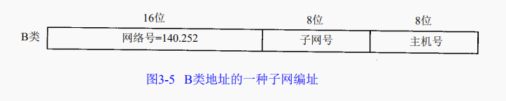
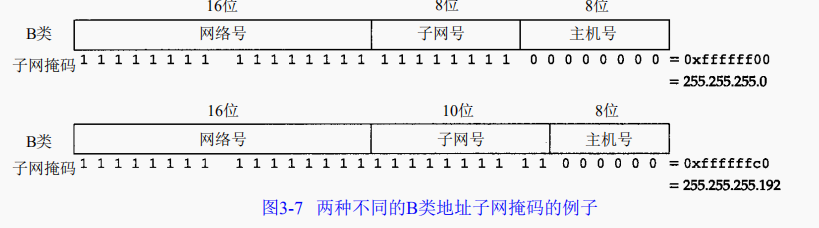
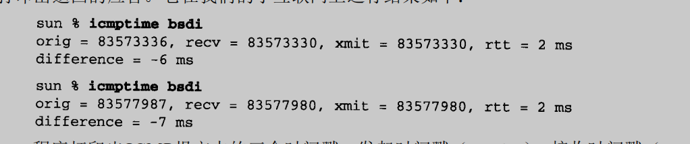

# **TCP/IP详解**

注：可查看 https://www.bookstack.cn/read/lutzchuck-tcpip-note/1.%20%E6%A6%82%E8%BF%B0.md 进行比对


## tcpdump

注：可查看https://www.cnblogs.com/ggjucheng/archive/2012/01/14/2322659.html

通过将网络接口卡设置为混杂模式来截获经过网络接口的每一个分组。


### 1、BSD分组过滤器BPF

tcpdump用它来截获和过滤来自一个被置为混杂模式的网络接口卡的分组。BPF也可以工作在点对点的链路上，不需要什么特别的处理就可以截获所有通过接口的分组，还可以工作在环回接口上。


例如：只打印源端口和目的端口为25的tcp报文段

```
tcpdump tcp port 25
```


### 2、SunOS的网络接口分接头NIT

NIT只能截获接口收到的分组，将tcpdump和NIT结合起来就是只能看见从网络中其他主机发送过来的分组


### 3、tcpdump的输出

 系统时间 来源主机.端口 > 目标主机.端口 数据包参数 


### 4、实用命令

**默认启动**

```
tcpdump
```

普通情况下，直接启动tcpdump将监视第一个网络接口上所有流过的数据包。

 

**监视指定网络接口的数据包**

```
tcpdump -i eth1
```

如果不指定网卡，默认tcpdump只会监视第一个网络接口，一般是eth0，下面的例子都没有指定网络接口。　

 

**监视指定主机的数据包**

打印所有进入或离开sundown的数据包.

```
tcpdump host sundown
```

也可以指定ip,例如截获所有210.27.48.1 的主机收到的和发出的所有的数据包

```
tcpdump host 210.27.48.1 
```

打印helios 与 hot 或者与 ace 之间通信的数据包

```
tcpdump host helios and \( hot or ace \)
```

截获主机210.27.48.1 和主机210.27.48.2 或210.27.48.3的通信

```
tcpdump host 210.27.48.1 and \ (210.27.48.2 or 210.27.48.3 \) 
```

打印ace与任何其他主机之间通信的IP 数据包, 但不包括与helios之间的数据包.

```
tcpdump ip host ace and not helios
```

如果想要获取主机210.27.48.1除了和主机210.27.48.2之外所有主机通信的ip包，使用命令：

```
tcpdump ip host 210.27.48.1 and ! 210.27.48.2
```

截获主机hostname发送的所有数据

```
tcpdump -i eth0 src host hostname
```

监视所有送到主机hostname的数据包

```
tcpdump -i eth0 dst host hostname
```

 

**监视指定主机和端口的数据包**

如果想要获取主机210.27.48.1接收或发出的telnet包，使用如下命令

```
tcpdump tcp port 23 and host 210.27.48.1
```

对本机的udp 123 端口进行监视 123 为ntp的服务端口

```
tcpdump udp port 123 
```

 

**监视指定网络的数据包**

打印本地主机与Berkeley网络上的主机之间的所有通信数据包(nt: ucb-ether, 此处可理解为'Berkeley网络'的网络地址,此表达式最原始的含义可表达为: 打印网络地址为ucb-ether的所有数据包)

```
tcpdump net ucb-ether
```

打印所有通过网关snup的ftp数据包(注意, 表达式被单引号括起来了, 这可以防止shell对其中的括号进行错误解析)

```
tcpdump 'gateway snup and (port ftp or ftp-data)'
```

打印所有源地址或目标地址是本地主机的IP数据包

(如果本地网络通过网关连到了另一网络, 则另一网络并不能算作本地网络.(nt: 此句翻译曲折,需补充).localnet 实际使用时要真正替换成本地网络的名字)

```
tcpdump ip and not net localnet
```

 

**监视指定协议的数据包**

打印TCP会话中的的开始和结束数据包, 并且数据包的源或目的不是本地网络上的主机.(nt: localnet, 实际使用时要真正替换成本地网络的名字))

```
tcpdump 'tcp[tcpflags] & (tcp-syn|tcp-fin) != 0 and not src and dst net localnet'
```

打印所有源或目的端口是80, 网络层协议为IPv4, 并且含有数据,而不是SYN,FIN以及ACK-only等不含数据的数据包.(ipv6的版本的表达式可做练习)

```
tcpdump 'tcp port 80 and (((ip[2:2] - ((ip[0]&0xf)<<2)) - ((tcp[12]&0xf0)>>2)) != 0)'
```

(nt: 可理解为, ip[2:2]表示整个ip数据包的长度, (ip[0]&0xf)<<2)表示ip数据包包头的长度(ip[0]&0xf代表包中的IHL域, 而此域的单位为32bit, 要换算

成字节数需要乘以4,　即左移2.　(tcp[12]&0xf0)>>4 表示tcp头的长度, 此域的单位也是32bit,　换算成比特数为 ((tcp[12]&0xf0) >> 4)　<<　２,　
即 ((tcp[12]&0xf0)>>2).　((ip[2:2] - ((ip[0]&0xf)<<2)) - ((tcp[12]&0xf0)>>2)) != 0　表示: 整个ip数据包的长度减去ip头的长度,再减去
tcp头的长度不为0, 这就意味着, ip数据包中确实是有数据.对于ipv6版本只需考虑ipv6头中的'Payload Length' 与 'tcp头的长度'的差值, 并且其中表达方式'ip[]'需换成'ip6[]'.)

打印长度超过576字节, 并且网关地址是snup的IP数据包

```
tcpdump 'gateway snup and ip[2:2] > 576'
```

打印所有IP层广播或多播的数据包， 但不是物理以太网层的广播或多播数据报

```
tcpdump 'ether[0] & 1 = 0 and ip[16] >= 224'
```

打印除'echo request'或者'echo reply'类型以外的ICMP数据包( 比如,需要打印所有非ping 程序产生的数据包时可用到此表达式 .
(nt: 'echo reuqest' 与 'echo reply' 这两种类型的ICMP数据包通常由ping程序产生))

```
tcpdump 'icmp[icmptype] != icmp-echo and icmp[icmptype] != icmp-echoreply'
```

 

### 5、命令使用

tcpdump采用命令行方式，它的命令格式为：

```
tcpdump [ -AdDeflLnNOpqRStuUvxX ] [ -c count ]
           [ -C file_size ] [ -F file ]
           [ -i interface ] [ -m module ] [ -M secret ]
           [ -r file ] [ -s snaplen ] [ -T type ] [ -w file ]
           [ -W filecount ]
           [ -E spi@ipaddr algo:secret,...  ]
           [ -y datalinktype ] [ -Z user ]
           [ expression ]
```

#### **tcpdump的简单选项介绍**


```
-A  以ASCII码方式显示每一个数据包(不会显示数据包中链路层头部信息). 在抓取包含网页数据的数据包时, 可方便查看数据(nt: 即Handy for capturing web pages).

-c  count
    tcpdump将在接受到count个数据包后退出.

-C  file-size (nt: 此选项用于配合-w file 选项使用)
    该选项使得tcpdump 在把原始数据包直接保存到文件中之前, 检查此文件大小是否超过file-size. 如果超过了, 将关闭此文件,另创一个文件继续用于原始数据包的记录. 新创建的文件名与-w 选项指定的文件名一致, 但文件名后多了一个数字.该数字会从1开始随着新创建文件的增多而增加. file-size的单位是百万字节(nt: 这里指1,000,000个字节,并非1,048,576个字节, 后者是以1024字节为1k, 1024k字节为1M计算所得, 即1M=1024 ＊ 1024 ＝ 1,048,576)

-d  以容易阅读的形式,在标准输出上打印出编排过的包匹配码, 随后tcpdump停止.(nt | rt: human readable, 容易阅读的,通常是指以ascii码来打印一些信息. compiled, 编排过的. packet-matching code, 包匹配码,含义未知, 需补充)

-dd 以C语言的形式打印出包匹配码.

-ddd 以十进制数的形式打印出包匹配码(会在包匹配码之前有一个附加的'count'前缀).

-D  打印系统中所有tcpdump可以在其上进行抓包的网络接口. 每一个接口会打印出数字编号, 相应的接口名字, 以及可能的一个网络接口描述. 其中网络接口名字和数字编号可以用在tcpdump 的-i flag 选项(nt: 把名字或数字代替flag), 来指定要在其上抓包的网络接口.

    此选项在不支持接口列表命令的系统上很有用(nt: 比如, Windows 系统, 或缺乏 ifconfig -a 的UNIX系统); 接口的数字编号在windows 2000 或其后的系统中很有用, 因为这些系统上的接口名字比较复杂, 而不易使用.

    如果tcpdump编译时所依赖的libpcap库太老,-D 选项不会被支持, 因为其中缺乏 pcap_findalldevs()函数.

-e  每行的打印输出中将包括数据包的数据链路层头部信息

-E  spi@ipaddr algo:secret,...

    可通过spi@ipaddr algo:secret 来解密IPsec ESP包(nt | rt:IPsec Encapsulating Security Payload,IPsec 封装安全负载, IPsec可理解为, 一整套对ip数据包的加密协议, ESP 为整个IP 数据包或其中上层协议部分被加密后的数据,前者的工作模式称为隧道模式; 后者的工作模式称为传输模式 . 工作原理, 另需补充).

    需要注意的是, 在终端启动tcpdump 时, 可以为IPv4 ESP packets 设置密钥(secret）.

    可用于加密的算法包括des-cbc, 3des-cbc, blowfish-cbc, rc3-cbc, cast128-cbc, 或者没有(none).默认的是des-cbc(nt: des, Data Encryption Standard, 数据加密标准, 加密算法未知, 另需补充).secret 为用于ESP 的密钥, 使用ASCII 字符串方式表达. 如果以 0x 开头, 该密钥将以16进制方式读入.

    该选项中ESP 的定义遵循RFC2406, 而不是 RFC1827. 并且, 此选项只是用来调试的, 不推荐以真实密钥(secret)来使用该选项, 因为这样不安全: 在命令行中输入的secret 可以被其他人通过ps 等命令查看到.

    除了以上的语法格式(nt: 指spi@ipaddr algo:secret), 还可以在后面添加一个语法输入文件名字供tcpdump 使用(nt：即把spi@ipaddr algo:secret,... 中...换成一个语法文件名). 此文件在接受到第一个ESP　包时会打开此文件, 所以最好此时把赋予tcpdump 的一些特权取消(nt: 可理解为, 这样防范之后, 当该文件为恶意编写时,不至于造成过大损害).

-f  显示外部的IPv4 地址时(nt: foreign IPv4 addresses, 可理解为, 非本机ip地址), 采用数字方式而不是名字.(此选项是用来对付Sun公司的NIS服务器的缺陷(nt: NIS, 网络信息服务, tcpdump 显示外部地址的名字时会用到她提供的名称服务): 此NIS服务器在查询非本地地址名字时,常常会陷入无尽的查询循环).

    由于对外部(foreign)IPv4地址的测试需要用到本地网络接口(nt: tcpdump 抓包时用到的接口)及其IPv4 地址和网络掩码. 如果此地址或网络掩码不可用, 或者此接口根本就没有设置相应网络地址和网络掩码(nt: linux 下的 'any' 网络接口就不需要设置地址和掩码, 不过此'any'接口可以收到系统中所有接口的数据包), 该选项不能正常工作.

-F  file
    使用file 文件作为过滤条件表达式的输入, 此时命令行上的输入将被忽略.

-i  interface

    指定tcpdump 需要监听的接口.  如果没有指定, tcpdump 会从系统接口列表中搜寻编号最小的已配置好的接口(不包括 loopback 接口).一但找到第一个符合条件的接口, 搜寻马上结束.

    在采用2.2版本或之后版本内核的Linux 操作系统上, 'any' 这个虚拟网络接口可被用来接收所有网络接口上的数据包(nt: 这会包括目的是该网络接口的, 也包括目的不是该网络接口的). 需要注意的是如果真实网络接口不能工作在'混杂'模式(promiscuous)下,则无法在'any'这个虚拟的网络接口上抓取其数据包.

    如果 -D 标志被指定, tcpdump会打印系统中的接口编号，而该编号就可用于此处的interface 参数.

-l  对标准输出进行行缓冲(nt: 使标准输出设备遇到一个换行符就马上把这行的内容打印出来).在需要同时观察抓包打印以及保存抓包记录的时候很有用. 比如, 可通过以下命令组合来达到此目的:
    ``tcpdump  -l  |  tee dat'' 或者 ``tcpdump  -l   > dat  &  tail  -f  dat''.(nt: 前者使用tee来把tcpdump 的输出同时放到文件dat和标准输出中, 而后者通过重定向操作'>', 把tcpdump的输出放到dat 文件中, 同时通过tail把dat文件中的内容放到标准输出中)

-L  列出指定网络接口所支持的数据链路层的类型后退出.(nt: 指定接口通过-i 来指定)

-m  module
    通过module 指定的file 装载SMI MIB 模块(nt: SMI，Structure of Management Information, 管理信息结构MIB, Management Information Base, 管理信息库. 可理解为, 这两者用于SNMP(Simple Network Management Protoco)协议数据包的抓取. 具体SNMP 的工作原理未知, 另需补充).

    此选项可多次使用, 从而为tcpdump 装载不同的MIB 模块.

-M  secret  如果TCP 数据包(TCP segments)有TCP-MD5选项(在RFC 2385有相关描述), 则为其摘要的验证指定一个公共的密钥secret.

-n  不对地址(比如, 主机地址, 端口号)进行数字表示到名字表示的转换.

-N  不打印出host 的域名部分. 比如, 如果设置了此选现, tcpdump 将会打印'nic' 而不是 'nic.ddn.mil'.

-O  不启用进行包匹配时所用的优化代码. 当怀疑某些bug是由优化代码引起的, 此选项将很有用.

-p  一般情况下, 把网络接口设置为非'混杂'模式. 但必须注意 , 在特殊情况下此网络接口还是会以'混杂'模式来工作； 从而, '-p' 的设与不设, 不能当做以下选现的代名词:'ether host {local-hw-add}' 或  'ether broadcast'(nt: 前者表示只匹配以太网地址为host 的包, 后者表示匹配以太网地址为广播地址的数据包).

-q  快速(也许用'安静'更好?)打印输出. 即打印很少的协议相关信息, 从而输出行都比较简短.

-R  设定tcpdump 对 ESP/AH 数据包的解析按照 RFC1825而不是RFC1829(nt: AH, 认证头, ESP， 安全负载封装, 这两者会用在IP包的安全传输机制中). 如果此选项被设置, tcpdump 将不会打印出'禁止中继'域(nt: relay prevention field). 另外,由于ESP/AH规范中没有规定ESP/AH数据包必须拥有协议版本号域,所以tcpdump不能从收到的ESP/AH数据包中推导出协议版本号.

-r  file
    从文件file 中读取包数据. 如果file 字段为 '-' 符号, 则tcpdump 会从标准输入中读取包数据.

-S  打印TCP 数据包的顺序号时, 使用绝对的顺序号, 而不是相对的顺序号.(nt: 相对顺序号可理解为, 相对第一个TCP 包顺序号的差距,比如, 接受方收到第一个数据包的绝对顺序号为232323, 对于后来接收到的第2个,第3个数据包, tcpdump会打印其序列号为1, 2分别表示与第一个数据包的差距为1 和 2. 而如果此时-S 选项被设置, 对于后来接收到的第2个, 第3个数据包会打印出其绝对顺序号:232324, 232325).

-s  snaplen
    设置tcpdump的数据包抓取长度为snaplen, 如果不设置默认将会是68字节(而支持网络接口分接头(nt: NIT, 上文已有描述,可搜索'网络接口分接头'关键字找到那里)的SunOS系列操作系统中默认的也是最小值是96).68字节对于IP, ICMP(nt: Internet Control Message Protocol,因特网控制报文协议), TCP 以及 UDP 协议的报文已足够, 但对于名称服务(nt: 可理解为dns, nis等服务), NFS服务相关的数据包会产生包截短. 如果产生包截短这种情况, tcpdump的相应打印输出行中会出现''[|proto]''的标志（proto 实际会显示为被截短的数据包的相关协议层次). 需要注意的是, 采用长的抓取长度(nt: snaplen比较大), 会增加包的处理时间, 并且会减少tcpdump 可缓存的数据包的数量， 从而会导致数据包的丢失. 所以, 在能抓取我们想要的包的前提下, 抓取长度越小越好.把snaplen 设置为0 意味着让tcpdump自动选择合适的长度来抓取数据包.

-T  type
    强制tcpdump按type指定的协议所描述的包结构来分析收到的数据包.  目前已知的type 可取的协议为:
    aodv (Ad-hoc On-demand Distance Vector protocol, 按需距离向量路由协议, 在Ad hoc(点对点模式)网络中使用),
    cnfp (Cisco  NetFlow  protocol),  rpc(Remote Procedure Call), rtp (Real-Time Applications protocol),
    rtcp (Real-Time Applications con-trol protocol), snmp (Simple Network Management Protocol),
    tftp (Trivial File Transfer Protocol, 碎文件协议), vat (Visual Audio Tool, 可用于在internet 上进行电
    视电话会议的应用层协议), 以及wb (distributed White Board, 可用于网络会议的应用层协议).

-t     在每行输出中不打印时间戳

-tt    不对每行输出的时间进行格式处理(nt: 这种格式一眼可能看不出其含义, 如时间戳打印成1261798315)

-ttt   tcpdump 输出时, 每两行打印之间会延迟一个段时间(以毫秒为单位)

-tttt  在每行打印的时间戳之前添加日期的打印

-u     打印出未加密的NFS 句柄(nt: handle可理解为NFS 中使用的文件句柄, 这将包括文件夹和文件夹中的文件)

-U    使得当tcpdump在使用-w 选项时, 其文件写入与包的保存同步.(nt: 即, 当每个数据包被保存时, 它将及时被写入文件中,而不是等文件的输出缓冲已满时才真正写入此文件)

      -U 标志在老版本的libcap库(nt: tcpdump 所依赖的报文捕获库)上不起作用, 因为其中缺乏pcap_cump_flush()函数.

-v    当分析和打印的时候, 产生详细的输出. 比如, 包的生存时间, 标识, 总长度以及IP包的一些选项. 这也会打开一些附加的包完整性检测, 比如对IP或ICMP包头部的校验和.

-vv   产生比-v更详细的输出. 比如, NFS回应包中的附加域将会被打印, SMB数据包也会被完全解码.

-vvv  产生比-vv更详细的输出. 比如, telent 时所使用的SB, SE 选项将会被打印, 如果telnet同时使用的是图形界面,
      其相应的图形选项将会以16进制的方式打印出来(nt: telnet 的SB,SE选项含义未知, 另需补充).

-w    把包数据直接写入文件而不进行分析和打印输出. 这些包数据可在随后通过-r 选项来重新读入并进行分析和打印.

-W    filecount
      此选项与-C 选项配合使用, 这将限制可打开的文件数目, 并且当文件数据超过这里设置的限制时, 依次循环替代之前的文件, 这相当于一个拥有filecount 个文件的文件缓冲池. 同时, 该选项会使得每个文件名的开头会出现足够多并用来占位的0, 这可以方便这些文件被正确的排序.

-x    当分析和打印时, tcpdump 会打印每个包的头部数据, 同时会以16进制打印出每个包的数据(但不包括连接层的头部).总共打印的数据大小不会超过整个数据包的大小与snaplen 中的最小值. 必须要注意的是, 如果高层协议数据没有snaplen 这么长,并且数据链路层(比如, Ethernet层)有填充数据, 则这些填充数据也会被打印.(nt: so for link  layers  that pad, 未能衔接理解和翻译, 需补充 )

-xx   tcpdump 会打印每个包的头部数据, 同时会以16进制打印出每个包的数据, 其中包括数据链路层的头部.

-X    当分析和打印时, tcpdump 会打印每个包的头部数据, 同时会以16进制和ASCII码形式打印出每个包的数据(但不包括连接层的头部).这对于分析一些新协议的数据包很方便.

-XX   当分析和打印时, tcpdump 会打印每个包的头部数据, 同时会以16进制和ASCII码形式打印出每个包的数据, 其中包括数据链路层的头部.这对于分析一些新协议的数据包很方便.

-y    datalinktype
      设置tcpdump 只捕获数据链路层协议类型是datalinktype的数据包

-Z    user
      使tcpdump 放弃自己的超级权限(如果以root用户启动tcpdump, tcpdump将会有超级用户权限), 并把当前tcpdump的用户ID设置为user, 组ID设置为user首要所属组的ID(nt: tcpdump 此处可理解为tcpdump 运行之后对应的进程)

      此选项也可在编译的时候被设置为默认打开.(nt: 此时user 的取值未知, 需补充)
```

#### **tcpdump条件表达式**

 该表达式用于决定哪些数据包将被打印. 如果不给定条件表达式, 网络上所有被捕获的包都会被打印,否则, 只有满足条件表达式的数据包被打印.(nt: all packets, 可理解为, 所有被指定接口捕获的数据包).

 表达式由一个或多个'表达元'组成(nt: primitive, 表达元, 可理解为组成表达式的基本元素). 一个表达元通常由一个或多个修饰符(qualifiers)后跟一个名字或数字表示的id组成(nt: 即, 'qualifiers id').有三种不同类型的修饰符:type, dir以及 proto.

```
type 修饰符指定id 所代表的对象类型, id可以是名字也可以是数字. 可选的对象类型有: host, net, port 以及portrange(nt: host 表明id表示主机, net 表明id是网络, port 表明id是端而portrange 表明id 是一个端口范围).  如, 'host foo', 'net 128.3', 'port 20', 'portrange 6000-6008'(nt: 分别表示主机 foo,网络 128.3, 端口 20, 端口范围 6000-6008). 如果不指定type 修饰符, id默认的修饰符为host.

dir 修饰符描述id 所对应的传输方向, 即发往id 还是从id 接收（nt: 而id 到底指什么需要看其前面的type 修饰符）.可取的方向为: src, dst, src 或 dst, src并且dst.(nt:分别表示, id是传输源, id是传输目的, id是传输源或者传输目的, id是传输源并且是传输目的). 例如, 'src foo','dst net 128.3', 'src or dst port ftp-data'.(nt: 分别表示符合条件的数据包中, 源主机是foo, 目的网络是128.3, 源或目的端口为 ftp-data).如果不指定dir修饰符, id 默认的修饰符为src 或 dst.对于链路层的协议,比如SLIP(nt: Serial Line InternetProtocol, 串联线路网际网络协议), 以及linux下指定'any' 设备, 并指定'cooked'(nt | rt: cooked 含义未知, 需补充) 抓取类型, 或其他设备类型,可以用'inbound' 和 'outbount' 修饰符来指定想要的传输方向.

proto 修饰符描述id 所属的协议. 可选的协议有: ether, fddi, tr, wlan, ip, ip6, arp, rarp, decnet, tcp以及 upd.(nt | rt: ether, fddi, tr, 具体含义未知, 需补充. 可理解为物理以太网传输协议, 光纤分布数据网传输协议,以及用于路由跟踪的协议.  wlan, 无线局域网协议; ip,ip6 即通常的TCP/IP协议栈中所使用的ipv4以及ipv6网络层协议;arp, rarp 即地址解析协议,反向地址解析协议; decnet, Digital Equipment Corporation开发的, 最早用于PDP-11 机器互联的网络协议; tcp and udp, 即通常TCP/IP协议栈中的两个传输层协议).

    例如, `ether src foo', `arp net 128.3', `tcp port 21', `udp portrange 7000-7009'分别表示 '从以太网地址foo 来的数据包','发往或来自128.3网络的arp协议数据包', '发送或接收端口为21的tcp协议数据包', '发送或接收端口范围为7000-7009的udp协议数据包'.

    如果不指定proto 修饰符, 则默认为与相应type匹配的修饰符. 例如, 'src foo' 含义是 '(ip or arp or rarp) src foo' (nt: 即, 来自主机foo的ip/arp/rarp协议数据包, 默认type为host),`net bar' 含义是`(ip  or  arp  or rarp) net bar'(nt: 即, 来自或发往bar网络的ip/arp/rarp协议数据包),`port 53' 含义是 `(tcp or udp) port 53'(nt: 即, 发送或接收端口为53的tcp/udp协议数据包).(nt: 由于tcpdump 直接通过数据链路层的 BSD 数据包过滤器或 DLPI(datalink provider interface, 数据链层提供者接口)来直接获得网络数据包, 其可抓取的数据包可涵盖上层的各种协议, 包括arp, rarp, icmp(因特网控制报文协议),ip, ip6, tcp, udp, sctp(流控制传输协议).

    对于修饰符后跟id 的格式,可理解为, type id 是对包最基本的过滤条件: 即对包相关的主机, 网络, 端口的限制;dir 表示对包的传送方向的限制; proto表示对包相关的协议限制)

    'fddi'(nt: Fiber Distributed Data Interface) 实际上与'ether' 含义一样: tcpdump 会把他们当作一种''指定网络接口上的数据链路层协议''. 如同ehter网(以太网), FDDI 的头部通常也会有源, 目的, 以及包类型, 从而可以像ether网数据包一样对这些域进行过滤. 此外, FDDI 头部还有其他的域, 但不能被放到表达式中用来过滤

    同样, 'tr' 和 'wlan' 也和 'ether' 含义一致, 上一段对fddi 的描述同样适用于tr(Token Ring) 和wlan(802.11 wireless LAN)的头部. 对于802.11 协议数据包的头部, 目的域称为DA, 源域称为 SA;而其中的 BSSID, RA, TA 域(nt | rt: 具体含义需补充)不会被检测(nt: 不能被用于包过虑表达式中).
```

 除以上所描述的表达元('primitive')， 还有其他形式的表达元, 并且与上述表达元格式不同. 比如: gateway, broadcast, less, greater以及算术表达式(nt: 其中每一个都算一种新的表达元). 下面将会对这些表达元进行说明.

 表达元之间还可以通过关键字and, or 以及 not 进行连接, 从而可组成比较复杂的条件表达式. 比如,`host foo and not port ftp and not port ftp-data'(nt: 其过滤条件可理解为, 数据包的主机为foo,并且端口不是ftp(端口21) 和ftp-data(端口20, 常用端口和名字的对应可在linux 系统中的/etc/service 文件中找到)).

 为了表示方便, 同样的修饰符可以被省略, 如'tcp dst port ftp or ftp-data or domain' 与以下的表达式含义相同'tcp dst port ftp or tcp dst port ftp-data or tcp dst port domain'.(nt: 其过滤条件可理解为,包的协议为tcp, 目的端口为ftp 或 ftp-data 或 domain(端口53) ).

 借助括号以及相应操作符,可把表达元组合在一起使用(由于括号是shell的特殊字符, 所以在shell脚本或终端中使用时必须对括号进行转义, 即'(' 与')'需要分别表达成'\(' 与 '\)').

 有效的操作符有:

```
 否定操作 (`!' 或 `not') 与操作(`&&' 或 `and') 或操作(`||' 或 `or')
```

 否定操作符的优先级别最高. 与操作和或操作优先级别相同, 并且二者的结合顺序是从左到右. 要注意的是, 表达'与操作'时,

 需要显式写出'and'操作符, 而不只是把前后表达元并列放置(nt: 二者中间的'and' 操作符不可省略).

 如果一个标识符前没有关键字, 则表达式的解析过程中最近用过的关键字(往往也是从左往右距离标识符最近的关键字)将被使用.比如,
  not host vs and ace
 是以下表达的精简:
  not host vs and host ace
 而不是not (host vs or ace).(nt: 前两者表示, 所需数据包不是来自或发往host vs, 而是来自或发往ace.而后者表示数据包只要不是来自或发往vs或ac都符合要求)

 整个条件表达式可以被当作一个单独的字符串参数也可以被当作空格分割的多个参数传入tcpdump, 后者更方便些. 通常, 如果表达式中包含元字符(nt: 如正则表达式中的'*', '.'以及shell中的'('等字符)， 最好还是使用单独字符串的方式传入. 这时,整个表达式需要被单引号括起来. 多参数的传入方式中, 所有参数最终还是被空格串联在一起, 作为一个字符串被解析.


## **一、概述**
### 1、分层
TCP/IP网络协议通常分不同层次进行开发，分别负责不同的通信功能
| 分层 | 作用 | 例子 |
|-----| -----| -----|
|应用层|处理应用程序细节|Telnet、FTP、SMTP、SNMP|
|传输层|为不同主机的应用程序提供端到端的通信|TCP、UDP|
|网络层|处理分组在网络中的活动，例如分组的选路|IP协议（网际协议）、ICMP协议（Internet互联网控制报文协议）、IGMP协议（Internet组管理协议）|
|链路层|处理与传输媒介（比如电缆）的物理接口细节|设备驱动程序和接口卡|

#### TCP（传输控制协议）
提供高可靠性的数据通信。把数据进行分包交给网络层

#### UDP（用户数据报协议）
把称作数据报的分组从一台主机发送到另一台主机，不保证数据报能发送到另一端。


应用层一般处于用户态中；而其他三层在内核中运行，处理所有的通信细节。

网络层IP提供的是一种不可靠的服务。也就是说，它只是尽可能快地把分组从源结点送到目的结点，但是并不提供任何可靠性保证。而另一方面，TCP在不可靠的IP层上提供了一个可靠的运输层。为了提供这种可靠的服务，TCP采用了超时重传、发送和接收端到端的确认分组等机制。

构造互联网最简单的方法是使用路由器，它可以为不同类型的物理网络提供链接：以太网、令牌环网、点对点的链接和FDDI（光钎分布式数据接口）等等。


连接网络的另一个途径是使用网桥。网桥是在链路层上对网络进行互连，而路由器则是在网络层上对网络进行互连。网桥使得多个局域网（LAN）组合在一起，这样对上层来说就好像是一个局域网。


### 2、TCP/IP的分层

TCP和UDP是两种最为著名的运输层协议，二者都使用IP作为网络层协议,TCP和UDP的每组数据都通过端系统
和每个中间路由器中的IP层在互联网中进行传输。

ICMP是IP协议的附属协议。IP层用它来与其他主机或路由器交换错误报文和其他重要信息。


### 3、互联网的地址

互联网的每一个接口都必须有一个唯一的Internet地址（IP地址），IP地址长度为32bit

 

 


有三类IP地址：

1. 单播地址（单个主机）
2. 广播地址（给定网络上的所有主机）
3. 多播地址（同一组内的所有主机）


### 4、域名系统

在TCP/IP领域中，域名系统（DNS）是一个分布式数据库，由它来提供IP地址和主机名之间的映射关系。


### 5、封装

当应用程序用TCP传送数据时，数据被送入协议栈中，然后逐个通过每一层直到被当做一串比特流送入网络，每一层收到的数据都要增加一些首部信息。

TCP传给IP的数据单元称作TCP报文段或简称为TCP段，IP传给网络接口层的数据单元被称作IP数据报，通过以太网传输的比特流被称作帧。

UDP数据和TCP数据基本一致，不同的是UDP传给IP的信息单元被称作UDP数据报，UDP的首部长是8字节。

 IP首部有个8bit的数值称为协议域，标志数据属于哪一层。1标识ICMP，2标识IGMP，6标识TCP，17标识UDP。 

以太网数据帧的物理特性是其长度必须在 4 6～1 5 0 0字节之间。


### 6、分用

当目的主机收到一个以太网数据帧时，数据就开始从协议栈中由底向上升，同时去掉各层协议加上的报文首部。每层协议盒都要检查报文首部中的协议标识，以确定接收数据的上层协议。这个过程称为“分用”。


### 7、客户-服务器模型

重复型或并发型。 TCP服务器是并发的，而UDP服务器是重复的 

重复型交互步骤：（ 重复型服务器主要的问题发生在I2状态。在这个时候，它不能为其他客户机提供服务。 ）

1、等待一个客户请求的到来。

2、处理客户请求。

3、发送响应给客户

4、返回第一步


并发型交互步骤：

1、等待一个客户请求的到来。

2、启用一个新的服务器处理客户请求， 在这期间可能生成一个新的进程、任务或线程，并依赖底层操作系统的支持。这个步骤如何进行取决于操作系统。生成的新服务器对客户的全部请求进行处理。处理结束后，终止这个新服务器。 

3、返回第一步。


### 8、端口号

TCP和UDP采用16bit的端口号来识别应用程序。

服务器一般都是通过知名端口号来识别的，例如FTP的默认TCP端口号为21

客户端通常对它所使用的端口号并不关心，只需保证该端口号在本机上是唯一的就可以了。

UNIX也有保留端口号，分配给拥有超级用户特权的进程。


### 9、应用编程接口

使用TCP/IP协议的应用程序通常采用两种应用编程接口（API）：socket和TLI（运输层接口：Transport Layer Interface）


## 二、链路层

链路层主要有三个目的：

（1）为IP模块发送和接收IP数据报

（2）为ARP模块发送ARP请求和接收ARP应答

（3）为RARP发送RARP请求和几首RARP应答

TCP/IP支持多种不同的链路层协议，取决于网络所使用的硬件，如以太网、令牌环网、FDDI（光纤分布式数据接口）及RS-232串行线路等。


### 1、以太网和IEEE 802封装

以太网是当今TCP/IP采用的主要的局域网技术，采用一种CSMA/CD的媒体接入方法，带冲突检测的载波侦听多路接入。速率是10M/s，地址是48bit。

| 802.3 | CSMA/CD网络  |
| :---- | :----------- |
| 802.4 | 令牌总线网络 |
| 802.5 | 令牌环网络   |

在TCP/IP世界中，以太网IP数据报的封装是在RFC894中定义的，IEEE802网络的IP数据报封装是在RFC1042中定义的。

两种帧格式都采用48bit的目的地址和源地址。


以太网的类型字段定义了后端数据的类型，而在802标准定义的格式中，类型字段则有后续的子网接入协议的首部给出。

802定义的有效长度值与以太网的有效类型值无一相同，这样，就可以对两种帧格式进行区分。

802.3规定数据部分至少38字节，以太网是46字节，当数据不够长时需要用pad进行填充。


### 2、SLIP：串行线路IP

在串行线路上对IP数据报进行封装的简单形式

SLIP协议定义的帧格式：

（1）IP数据报以一个END（0xc0）的特殊字符结束。为了防止数据报到来之前的线路噪声被当成数据报内容，大多数实现在数据报的开始处也传一个END字符。

（2）如果IP数据报中某个字符为END，那么就要连续传两个字节0 x d b和0 x d c来取代它。

（3）如果IP报文中某个字符为SLIP的ESC字符，那么就要连续传输两个字节 0xdb和0xdd来取代它。


SLIP的缺陷：

1) 每一端必须知道对方的IP地址。没有办法把本端的IP地址通知给另一端。

2) 数据帧中没有类型字段（类似于以太网中的类型字段）。如果一条串行线路用于SLIP，那么它不能同时使用其他协议。

3) SLIP没有在数据帧中加上检验和，只能通过上层协议来实现。

由于串行线路的速率较低，且通信常是交互式的，因此在SLIP线路上有许多小的TCP分组进行交换，这就带来了性能的缺陷。CSLIP是压缩的SLIP，它能把40个字节压缩到3-5个字节。


### 3、PPP：点对点协议

修改了SLIP协议中的所有缺陷。

PPP包括以下三个部分：

（1）在串行链路上封装 I P数据报的方法。 P P P既支持数据为 8位和无奇偶检验的异步模式，还支持面向比特的同步链接。

（2）建立、配置及测试数据链路的链路控制协议（ L C P：Link Control Protocol）。它允许通信双方进行协商，以确定不同的选项。

（3）针对不同网络层协议的网络控制协议（ N C P：Network Control Protocol）体系。当前R F C定义的网络层有I P、O S I网络层、D E C n e t以及A p p l e Ta l k。


每一帧都以标志字符0 x 7 e开始和结束。紧接着是一个地址字节，值始终是 0 x ff，然后是一个值为0 x 0 3的控制字节。


协议字段类似与以太网的类型字段，当值为0021时，表示信息时IP数据报，当为C021时，为链路控制数据，当为8021时，为网络控制数据。

CRC字段是一个循环冗余检验码，检测数据帧中的错误。

由于标志字符的值是0x7e，因此当该字符出现在信息字段中时， PPP需要对它进行转义。在同步链路中，该过程是通过一种称作比特填充 (bit stuffing)的硬件技术来完成的。

在异步链路中，特殊字符0x7d用作转义字符，当它出现在PPP数据帧中时，那么紧接着的字符的第6个比特要取其补码，具体实现过程如下：

1) 当遇到字符0 x 7 e时，需连续传送两个字符： 0 x 7 d和0 x 5 e，以实现标志字符的转义。

2) 当遇到转义字符0 x 7 d时，需连续传送两个字符： 0 x 7 d和0 x 5 d，以实现转义字符的转义。

3 ) 默认情况下，如果字符的值小于 0 x 2 0（比如，一个A S C I I控制字符），一般都要进行转义。


PPP比SLIP 具有下面这些优点：

(1) PPP支持在单根串行线路上运行多种协议，不只是 IP协议；

(2) 每一帧都有循环冗余检验；

(3) 通信双方可以进行IP地址的动态协商 (使用IP网络控制协议 )；

(4) 与CSLIP类似，对 TCP和IP报文首部进行压缩；

(5) 链路控制协议可以对多个数据链路选项进行设置。


### 4、环回接口
大多数的产品都支持环回接口（Loopback Interface），以允许运行在同一台主机上的客户程序和服务器程序通过TCP/IP进行通信。A 类网络号127就是为环回接口预留的。根据惯例，大多数系统把 IP地址127.0.0.1 分配给这个接口，并命名为localhost。一个传给环回接口的IP数据报不能在任何网络上出现。

一旦传输层检测到目的端地址是环回地址时，应该可以省略部分传输层和所有网络层的逻辑操作。但是大多数的产品还是照样完成传输层和网络层的所有过程，只是当IP数据报离开网络层时把它返回给自己。

需要指出的关键点：

1. 传给127.0.0.1的任何数据君合作为IP输入。
2. 传给广播地址或多播地址的数据报复制一份传给127.0.0.1，然后送到以太网上。
3. 任何传给该主机IP地址的数据均送到127.0.0.1。


### 5、 最大传输单元 MTU

以太网和802.3对数据帧的长度都有一个限制，其最大值分别是1500和1492字节。链路层的这个特性称作MTU，最大传输单元。


### 6、 路径 MTU

两台通信主机路径中的最小 MTU，路径MTU 在两个方向上不一定是一致的。


## 三、IP：网际协议

IP是TCP/IP协议族中最为核心的协议，所有的TCP、UDP、ICMP及IGMP数据都以IP数据报格式传输。

IP提供的是不可靠、无连接的数据报服务。

**不可靠**：不能保证IP数据报能成功发送到目的地，IP仅提供最好的传输服务。如果发生某种错误比如某个路由器暂时用完了缓冲区，处理方法就是丢弃该数据报，然后发送ICMP消息报给信源端。任何要求的可靠性必须有上层（如TCP）来提供。

**无连接**：IP并不维护后续数据报的状态信息。每个数据报的处理都是相互独立的。


### 1、IP首部

普通的IP首部长为20个字节。


4个字节的32bit值以下面的次序传输：首先是0~7bit，其次是8~15bit，然后16~23bit，最后是24~31bit。TCP/IP首部中所有的二进制整数在网络中传输时都要求以这种次序传输，所有又称为网络字节序。

传输数据之前必须把首部转换成网络字节序。每一份数据报都包含源IP地址和目标IP地址。

**首部长度**指的是首部占32bit的数目，由于是一个4比特的字段，因此首部最长为60个字节。(2^4-1) * (32/8) = 60

**服务类型（TOS）字段**包括一个3bit的优先权子字段，4 bit的TOS子字段和1bit未用位但必须置0。4bit的TOS分别代表：最小时延、最大吞吐量、最高可靠性和最小费用。

**总字段长度**是指整个IP数据报的长度，以字节为单位。利用首部长度字段和总长度字节，就可以知道IP数据报中数据内容的起始位置和长度。该字段长度为16bit，所有IP数据报最长为65535字节。2^15

**标识字段：**唯一的标识主机发送的每一份数据报，通常每发送一份报文，值就会加1。

**TTL生存时间字段：**数据报可以经过的最多路由器数，指定了数据报生存时间。经过一个路由器，值就减1，当值为0时，数据报就被丢弃，并发送ICMP报文通知源主机。

**首部检验和字段: ** 是根据I P首部计算的检验和码。不对首部后面的数据进行计算。

**可选项字段:** 是数据报中一个可变长的可选字段，定义如下：

- 安全和处理限制
- 记录路径（让每个路由器都记下它的IP）
- 时间戳（让每个路由都记下它的IP地址和时间）
- 宽松/严格的源站选录


### 2、IP路由选择

IP可以从TCP、UDP、ICMP、IGMP接收数据报（即在本地生成的数据报）并进行发送，或者从一个网络接口接收数据报（待转发的数据报）并进行发送。

IP层在内存中有一个路由表，当收到数据报并进行发送时，都要对该表搜索一次。当数据报来自某个网络接口时，IP首先检查目的IP地址是否为本机的IP地址之一或者IP广播地址，如果是，数据报就被送到由IP首部协议字段所指定的协议模块进行处理，反之，如IP层被设置有路由转发的功能，则将数据报转发，否则将丢弃数据报。

路由表中的每一项都包含如下信息：

（1）目的IP地址

（2）下一个路由器的IP地址，或有直连网络IP地址。

（3）标志：其中一个标志指明目的IP地址是网络还是主机地址，另一个标志之名下一个路由器是否为真正的下一站路由器，还是一个直连接口。

（4）为数据报的传输指定一个网络接口。


IP路由选择是逐跳地进行的，IP并不知道到达任何目的的完整路径，所有的IP路由选择职位数据报传输提供下一站路由器的IP地址。     

IP路由选择主要完成以下功能：（如果下面的步骤都没有成功，那么该数据报就不能被传送。）

（1）搜索路由表，寻找能与目的IP地址完全匹配的表目（网络号和主机号都要匹配），找到则把报文发送给该表目指定的下一站路由器或直连的网络接口。

（2）搜索路由表，寻找能与目的网络号相匹配的表目，找到则把报文发送给该表目指定的下一站路由器或直连的网络接口。目的网络上的所有主机都可以通过这个表目来处置。

（3）搜索路由表，寻找默认的表目，找到则把报文发送给该表目指定的下一站路由器。


案例：

（1）主机bsdi发送数据报给主机sun（直连网络）


（2）bsdi发送数据报给net主机（需要进行路由转发）


**注意：**

数据报中目的IP地址始终不发生任何变化，所有的路由选择决策都是基于这个目的IP地址。

每个链路层可能具有不同过的数据帧首部，而且链路层的目的地址始终指的是下一站的链路层地址。


### 3、子网寻址

子网编址，不是把IP地址仅仅看成一个网络号和一个主机号，而是把主机号再分成一个子网号和一个主机号。全0或全1的主机号都是无效的。

比如一个B类网络140.252，在剩下的16bit中，8bit用于子网号，8bit用于主机号，这样就有254个子网，每个子网又有254台主机。



子网对外部路由器来说隐藏了内部网络组织的细节，子网对于子网内部的路由器是不透明的。可以缩小Internet路由表的规模，


### 4、子网掩码

除了IP地址以外，主机还需要知道有多少比特用于子网络号及多少bit用于主机号，这是通过子网掩码来确定的，子网掩码是一个32bit的值，其中值为1的比特留给网络号和子网号，值为0的比特留给主机号。

例如：



子网掩码一般用十六进制表示，是一个比特掩码。

给定IP地址和紫菀公演吗以后，主机就可以确定IP数据报的目的是：

（1）本子网上的主机。 （最后的主机号不一致）

（2）本网络中的其他子网的主机。（子网号不一致）

（3）其他网络的主机（网络号不一致）


**子网掩码为什么能确定？**

通过子网掩码可以知道网络号、子网号和主机号分别站多少bit，然后根据这个bit数量进行两个IP的比较。


### 5、特殊情况的IP地址


0表示所有的比特位全为0，-1表示所有比特位全为1，netid、subnetid和hostid分别表示不全为0或1的对应字段，子网号栏为空表示该地址没有进行子网划分。


## 四、ARP：地址解析协议

当一台主机把以太网数据帧发送到位于同一局域网上的另一台主机时，是根据48bit的以太网地址来确定目的接口的。

地址解析为这两种不同的地址形式提供映射：32bit的IP地址和数据链路层使用的任何类型的地址。


ARP为IP地址到对应的硬件地址之间提供动态映射。从逻辑Internet地址到对应的物理硬件地址，在32 bit的I P地址和采用不同网络技术的硬件地址之间提供动态映射


例子：ftp 主机名


### 1、ARP高速缓存

ARP高速运行的关键是由于在每个主机上都有一个ARP高速缓存，这个高速缓存存放了最近Internet地址到硬件地址之间的映射记录，每个元素生存时间是20分钟。


### 2、ARP的分组格式

在以太网上解析IP地址时，ARP请求和应答分组的格式如下：


目的地址为全1的特殊地址是广播地址，电缆上的所有以太网接口都要接收广播的数据帧。

帧类型表示后面数据的类型

硬件类型字段表示硬件地址的类型。1即表示以太网地址

协议类型字段表示要映射的协议地址类型。0x0800即表示I P地址

硬件地址长度和协议地址长度分别指出硬件地址和协议地址的长度，以字节为单位。对于以太网上 I P地址的A R P请求或应答来说，它们的值分别为 6和4

操作字段指出四种操作类型，它们是 A R P请求（值为1）、A R P应答（值为2）、R A R P请求（值为3）和R A R P应答（值为4）


### 3、ARP代理

如果ARP请求是从一个网络的主机发送到另一个网络的主机，那么连接这两个网络的路由器就可以回应该请求。


ARP代理也称为混合ARP或ARP出租，是由于通过两个物理网络之间的路由器可以互相隐藏物理网络。


### 4、arp命令

arp -a：显示ARP高速缓存中的所有内容

可以使用-d删除某项内容

使用-s保存某项内容


## 五、RARP：逆地址解析协议

具有本地磁盘的系统从磁盘文件中获取IP地址，但是无盘机需要采用其他方法获取IP地址。

无盘系统的RARP实现过程是从接口卡上读取唯一的硬件地址，然后发送一份RARP请求，请求某个主机响应该无盘系统的IP地址。


### 1、RARP的分组格式


与ARP分组基本一致，差别是RARP的请求和应答的帧类型是0x8035，而且操作代码是3，应答操作代码是4


### 2、RARP服务器的设计

服务器一般要为多个主机（网络上所有的无盘系统）提供硬件地址到IP地址的映射，该映射包含在一个磁盘文件中。由于内核一般不读取和分析磁盘文件，因此RARP服务器的功能就由用户进程提供，而不是作为TCP/IP实现的一部分。

**每个服务器都有多个RARP服务器**

RARP请求是在硬件层上进行传播的，不经过路由器进行转发，为了让无盘系统在RARP服务器关机的情况下也能引导，通常一个网络上要提供多个RARP服务器。


## 六、ICMP：Internet控制报文协议

ICMP经常被认为是IP层的一个组成部分，传递差错报文以及其他需要注意的信息。通常被IP层或更高层（TCP/UDP）使用，在IP数据报内部进行传输。


报文格式如下：


所有报文的前四个字节都是一样的，其他字节各不相同。类型字段可以有15个不同的值，以描述特定类型的ICMP报文，检验和字段覆盖整个ICMP报文。


### 1、ICMP报文的类型


不同类型由报文中的类型字段和代码字段共同决定，ICMP报文分为查询报文和差错报文。


当发送一份ICMP差错报文时，报文始终包含IP的首部和产生ICMP差错报文的IP数据报的前8个字节，这样接收ICMP差错报文的模块就会把它和某个特定的协议（IP数据报首部的协议字段）和用户进程（根据包含在 I P数据报前8个字节中的T C P或U D P报文首部中的T C P或U D P端口号来判断）联系起来。

不会产生ICMP差错报文的情况：

（1）ICMP差错报文（但是ICMP查询报文可能会产生ICMP差错报文）

（2）目的地址是广播地址

（3）作为链路层广播的数据报

（4）不是IP分片的第一片

（5）源地址不是单个主机的数据报


### 2、ICMP地址掩码请求和应答

ICMP地址掩码请求用于在无盘系统在引导过程中获取自己的子网掩码。ICMP地址掩码请求和应答报文的格式如下：


ICMP报文中的标识符和序列号字段由发送端任意选择设定，这些值在应答中返回，这样就能匹配起来。


### 3、ICMP时间戳请求和应答

ICMP时间戳请求允许系统向另一个系统查询当前的时间，报文格式如下：


请求端填写发起时间戳，发送报文，应答系统收到请求报文后填写接收时间戳，在发送应答时填写传送时间戳。但应答系统一般都把两个时间戳写成一致的。




rtt是往返时间，所以差值是difference-rtt


### 4、ICMP端口不可达差错

UDP的规则之一，如果收到一份UDP数据报而目的端口与某个正在使用的进程不相符，那么UDP返回一个ICMP不可达报文。


