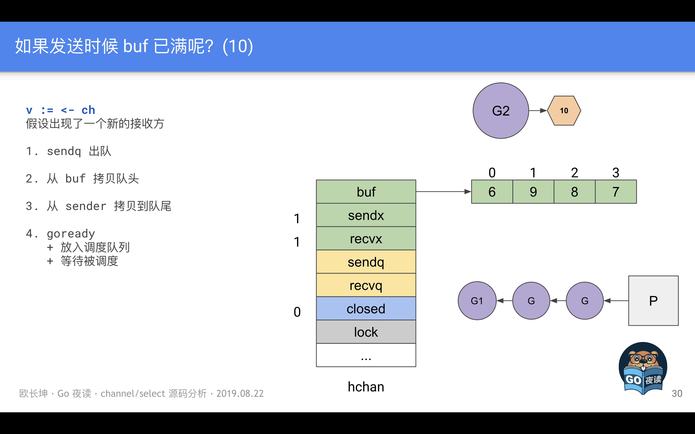

[toc]


##  数据结构
###  数组
数组初始化：
```go
[10]int
[20]interface{}
```

数组初始化后大小边不会再变化，存储元素类型相同，但是大小不同的数组在go中也是不一样的。

```go
func NewArray(elem *Type, bound int64) *Type {
	if bound < 0 {
		Fatalf("NewArray: invalid bound %v", bound)
	}
	t := New(TARRAY)
	t.Extra = &Array{Elem: elem, Bound: bound}
	t.SetNotInHeap(elem.NotInHeap())
	return t
}
```
Elem和Bound是数组的两个属性。

如果数组中元素的个数小于或者等于 4 个，那么所有的变量会直接在栈上初始化，如果数组元素大于 4 个，变量就会在静态存储区初始化然后拷贝到栈上


###  切片
切片的长度是动态的，所以声明时只需要指定切片中的元素类型：

```go
[]int
[]interface{}
```

```go
func NewSlice(elem *Type) *Type {
	if t := elem.Cache.slice; t != nil {
		if t.Elem() != elem {
			Fatalf("elem mismatch")
		}
		return t
	}

	t := New(TSLICE)
	t.Extra = Slice{Elem: elem}
	elem.Cache.slice = t
	return t
}
```

可以看到，Slice在初始化的时候只会确定类型

```go
type SliceHeader struct {
	Data uintptr // 指向数据的指针
	Len  int     // 当前切片的长度
	Cap  int     // 当前切片的容量，即是Data数组的大小
}
```

初始化方式：
- 通过下标的方式获得数组或者切片的一部分；
  - 编译器会将 arr[0:3] 或者 slice[0:3] 等语句转换成 OpSliceMake 操作
  - 不会拷贝原数组或者原切片中的数据，它只会创建一个指向原数组的切片结构体，所以修改新切片的数据也会修改原切片
- 使用字面量初始化新的切片；
  - 根据切片中的元素数量对底层数组的大小进行推断并创建一个数组；
  - 将这些字面量元素存储到初始化的数组中；
  - 创建一个同样指向 [3]int 类型的数组指针；
  - 将静态存储区的数组 vstat 赋值给 vauto 指针所在的地址；
  - 通过 [:] 操作获取一个底层使用 vauto 的切片；
- 使用关键字 make 创建切片：
  - 进行参数检查，len是否有传入，cap是否>=len
  - 
    ```go
        func makeslice(et *_type, len, cap int) unsafe.Pointer {
            mem, overflow := math.MulUintptr(et.size, uintptr(cap))
            if overflow || mem > maxAlloc || len < 0 || len > cap {
                mem, overflow := math.MulUintptr(et.size, uintptr(len))
                if overflow || mem > maxAlloc || len < 0 {
                    panicmakeslicelen()
                }
                panicmakeslicecap()
            }

            return mallocgc(mem, et, true)
        }
    ```

```go
arr[0:3] or slice[0:3]
slice := []int{1, 2, 3}
slice := make([]int, 10)
```

扩容：

```go
func growslice(et *_type, old slice, cap int) slice {
	newcap := old.cap
	doublecap := newcap + newcap
	if cap > doublecap {
		newcap = cap
	} else {
		if old.len < 1024 {
			newcap = doublecap
		} else {
			for 0 < newcap && newcap < cap {
				newcap += newcap / 4
			}
			if newcap <= 0 {
				newcap = cap
			}
		}
	}
```
- 如果期望容量大于当前容量的两倍就会使用期望容量；
- 如果当前切片的长度小于 1024(新版本变成了256) 就会将容量翻倍；
- 如果当前切片的长度大于 1024 就会每次增加 25%（新版本 newcap += (newcap + 3*256) / 4） 的容量，直到新容量大于期望容量；


当数组中元素所占的字节大小为 1、8 或者 2 的倍数时，运行时会对齐内存，对其的是2的幂数，比如5个元素，字节是40，那么就会向上对齐为48，变成cap为6


##  常用关键字
###  for和range

####  循环永动机
在遍历数组的同时修改数组的元素，能否一直循环打印遍历呢？
```go
func main() {
	arr := []int{1, 2, 3}
	for _, v := range arr {
		arr = append(arr, v)
	}
	fmt.Println(arr)
}

$ go run main.go
1 2 3 1 2 3
```

答案是不行的哈，因为在编译期将原切片或者数组赋值给一个新变量 ha，在赋值的过程中就发生了拷贝，而我们又通过 len 关键字预先获取了切片的长度，所以在循环中追加新的元素也不会改变循环执行的次数

```go
ha := a
hv1 := 0
hn := len(ha)
v1 := hv1
v2 := nil
for ; hv1 < hn; hv1++ {
    tmp := ha[hv1]
    v1, v2 = hv1, tmp
    ...
}
```

####  神奇的指针
在遍历一个数组时，如果获取 range 返回变量的地址并保存到另一个数组或者哈希时，保存的都是最后一个元素
```go
func main() {
	arr := []int{1, 2, 3}
	newArr := []*int{}
	for _, v := range arr {
		newArr = append(newArr, &v)
	}
	for _, v := range newArr {
		fmt.Println(*v)
	}
}

$ go run main.go
3 3 3
```

因为在遍历期，Go 语言会额外创建一个新的 v2 变量存储切片中的元素，循环中使用的这个变量 v2 会在每一次迭代被重新赋值而覆盖，赋值时也会触发拷贝。

不应该直接获取 range 返回的变量地址 &v2，而应该使用 &a[index] 这种形式。


####  遍历清空数组
一般使用方法，使用遍历依次将元素置为空值

```go
func main() {
	arr := []int{1, 2, 3}
	for i, _ := range arr {
		arr[i] = 0
	}
}
```

依次遍历切片和哈希看起来是非常耗费性能的，因为数组、切片和哈希占用的内存空间都是连续的，所以最快的方法是直接清空这片内存中的内容。

编译器会直接使用 runtime.memclrNoHeapPointers 清空切片中的数据


####  随机遍历
在遍历Map的时候，每次遍历的结果顺序都不一样，是因为go在遍历map的时候会引入随机数，随机选择一个bucket开始遍历。


####  经典for循环


####  范围循环
编译器会在编译期间将所有 for-range 循环变成经典循环。从编译器的视角来看，就是将 ORANGE 类型的节点转换成 OFOR 节点:


节点类型的转换过程都发生在中间代码生成阶段，所有的 for-range 循环都会被转换成不包含复杂结构、只包含基本表达式的语句

##### 数组和切片
（1）清空数组
```go
// 原代码
for i := range a {
	a[i] = zero
}

// 优化后
if len(a) != 0 {
	hp = &a[0]
	hn = len(a)*sizeof(elem(a))
	memclrNoHeapPointers(hp, hn)
	i = len(a) - 1
}
```

go会直接使用memclrNoHeapPointers去清空一片连续的内存，然后更新索引

对于所有的 range 循环，Go 语言都会在编译期将原切片或者数组赋值给一个新变量 ha，在赋值的过程中就发生了拷贝，而我们又通过 len 关键字预先获取了切片的长度，所以在循环中追加新的元素也不会改变循环执行的次数

而遇到这种同时遍历索引和元素的 range 循环时，Go 语言会额外创建一个新的 v2 变量存储切片中的元素，循环中使用的这个变量 v2 会在每一次迭代被重新赋值而覆盖，赋值时也会触发拷贝。


##### 哈希表
```go
ha := a
hit := hiter(n.Type)
th := hit.Type
mapiterinit(typename(t), ha, &hit)
for ; hit.key != nil; mapiternext(&hit) {
    key := *hit.key
    val := *hit.val
}
```

```go
func mapiterinit(t *maptype, h *hmap, it *hiter) {
	it.t = t
	it.h = h
	it.B = h.B
	it.buckets = h.buckets

	r := uintptr(fastrand()) // 生成一个随机数，随机选定一个bucket开始遍历
	it.startBucket = r & bucketMask(h.B)
	it.offset = uint8(r >> h.B & (bucketCnt - 1))
	it.bucket = it.startBucket
	mapiternext(it)
}
```

哈希表遍历的顺序，首先会随机选出一个绿色的正常桶开始遍历，随后遍历所有黄色的溢出桶，最后依次按照索引顺序遍历哈希表中其他的桶，直到所有的桶都被遍历完成。


##### 字符串
在遍历时会获取字符串中索引对应的字节并将字节转换成 rune。我们在遍历字符串时拿到的值都是 rune 类型的变量，for i, r := range s {} 的结构都会被转换成如下所示的形式：

```go
ha := s
for hv1 := 0; hv1 < len(ha); {
    hv1t := hv1
    hv2 := rune(ha[hv1])
    if hv2 < utf8.RuneSelf {
        hv1++
    } else {
        hv2, hv1 = decoderune(ha, hv1)
    }
    v1, v2 = hv1t, hv2
}
```

##### 通道
一个形如 for v := range ch {} 的语句最终会被转换成如下的格式：

```go
ha := a
hv1, hb := <-ha
for ; hb != false; hv1, hb = <-ha {
    v1 := hv1
    hv1 = nil
    ...
}
```
这个操作会调用 runtime.chanrecv2 并阻塞当前的协程，当 runtime.chanrecv2 返回时会根据布尔值 hb 判断当前的值是否存在：

- 如果不存在当前值，意味着当前的管道已经被关闭；
- 如果存在当前值，会为 v1 赋值并清除 hv1 变量中的数据，然后重新陷入阻塞等待新数据；


###  select、channel
参考： https://docs.google.com/presentation/d/18_9LcMc8u93aITZ6DqeUfRvOcHQYj2gwxhskf0XPX2U/edit#slide=id.g5ea99f63e9_0_11


####  select
现象：
- select 能在 Channel 上进行非阻塞的收发操作；
- select 在遇到多个 Channel 同时响应时，会随机执行一种情况；

（1）非阻塞的收发

在通常情况下，select 语句会阻塞当前 Goroutine 并等待多个 Channel 中的一个达到可以收发的状态。但是如果 select 控制结构中包含 default 语句，那么这个 select 语句在执行时会遇到以下两种情况：
- 当存在可以收发的 Channel 时，直接处理该 Channel 对应的 case；
- 当不存在可以收发的 Channel 时，执行 default 中的语句；


（2）随机执行

select遇到多个channel同时响应时，会随机执行一种情况。


**数据结构**

```go
type scase struct {
	c    *hchan         // chan
	elem unsafe.Pointer // data element
}
```

**实现原理：**

select 语句在编译期间会被转换成 OSELECT 节点。每个 OSELECT 节点都会持有一组 OCASE 节点，如果 OCASE 的执行条件是空，那就意味着这是一个 default 节点。


有四种情况：
- 不存在任何case
- 只存在一个case
- 存在两个case，其中一个case和default
- 存在多个case


1. 不存在任何case

```go
func walkselectcases(cases *Nodes) []*Node {
	n := cases.Len()

	if n == 0 {
		return []*Node{mkcall("block", nil, nil)}
	}
	...
}

func block() {
	gopark(nil, nil, waitReasonSelectNoCases, traceEvGoStop, 1)
}
```

空的 select 语句会直接阻塞当前 Goroutine，导致 Goroutine 进入无法被唤醒的永久休眠状态。


2. 只存在一个case

编译器会将 select 改写成 if 条件语句

```go
// 改写前
select {
case v, ok <-ch: // case ch <- v
    ...    
}

// 改写后
if ch == nil {
    block()
}
v, ok := <-ch // case ch <- v
```

当 case 中的 Channel 是空指针时，会直接挂起当前 Goroutine 并陷入永久休眠。


3. 有两个case，其中一个是default

非阻塞的收发操作，会转换成if.else 操作

**发送：**

```go
select {
case ch <- i:
    ...
default:
    ...
}

if selectnbsend(ch, i) {
    ...
} else {
    ...
}


// 向 runtime.chansend 函数传入了非阻塞，所以在不存在接收方或者缓冲区空间不足时，当前 Goroutine 都不会阻塞而是会直接返回
func selectnbsend(c *hchan, elem unsafe.Pointer) (selected bool) {
	return chansend(c, elem, false, getcallerpc())
}
```

**接受：**

```go
// 改写前
select {
case v <- ch: // case v, ok <- ch:
    ......
default:
    ......
}

// 改写后，也是非阻塞的
if selectnbrecv(&v, ch) { // if selectnbrecv2(&v, &ok, ch) {
    ...
} else {
    ...
}


func selectnbrecv(elem unsafe.Pointer, c *hchan) (selected bool) {
	selected, _ = chanrecv(c, elem, false)
	return
}

func selectnbrecv2(elem unsafe.Pointer, received *bool, c *hchan) (selected bool) {
	selected, *received = chanrecv(c, elem, false)
	return
}
```

4. 多个case

- 将所有的 case 转换成包含 Channel 以及类型等信息的 runtime.scase 结构体；
- 调用运行时函数 runtime.selectgo 从多个准备就绪的 Channel 中选择一个可执行的 runtime.scase 结构体；
- 通过 for 循环生成一组 if 语句，在语句中判断自己是不是被选中的 case；

```go
selv := [3]scase{}
order := [6]uint16
for i, cas := range cases {
    c := scase{}
    c.kind = ...
    c.elem = ...
    c.c = ...
}
chosen, revcOK := selectgo(selv, order, 3)
if chosen == 0 {
    ...
    break
}
if chosen == 1 {
    ...
    break
}
if chosen == 2 {
    ...
    break
}
```

最重要的就是用于选择待执行 case 的运行时函数 runtime.selectgo:
- 执行一些必要的初始化操作并确定 case 的处理顺序；
- 在循环中根据 case 的类型做出不同的处理；


**初始化：**

runtime.selectgo 函数首先会进行执行必要的初始化操作并决定处理 case 的两个顺序 — 轮询顺序 pollOrder 和加锁顺序 lockOrder：

轮询顺序 pollOrder 和加锁顺序 lockOrder 分别是通过以下的方式确认的：

- 轮询顺序：通过 runtime.fastrandn 函数引入随机性；
- 加锁顺序：按照 Channel 的地址排序后确定加锁顺序；

**循环：**

- 查找是否已经存在准备就绪的 Channel，即可以执行收发操作；
- 将当前 Goroutine 加入 Channel 对应的收发队列上并等待其他 Goroutine 的唤醒；
- 当前 Goroutine 被唤醒之后找到满足条件的 Channel 并进行处理；

runtime.selectgo 函数会根据不同情况通过 goto 语句跳转到函数内部的不同标签执行相应的逻辑，其中包括：

- bufrecv：可以从缓冲区读取数据；
- bufsend：可以向缓冲区写入数据；
- recv：可以从休眠的发送方获取数据；
- send：可以向休眠的接收方发送数据；
- rclose：可以从关闭的 Channel 读取 EOF；
- sclose：向关闭的 Channel 发送数据；
- retc：结束调用并返回；

循环执行的第一个阶段，查找已经准备就绪的 Channel。循环会遍历所有的 case 并找到需要被唤起的 runtime.sudog 结构，在这个阶段，我们会根据 case 的四种类型分别处理：

- 当 case 不包含 Channel 时；
  - 这种 case 会被跳过；
- 当 case 会从 Channel 中接收数据时；
  - 如果当前 Channel 的 sendq 上有等待的 Goroutine，就会跳到 recv 标签并从缓冲区读取数据后将等待 Goroutine 中的数据放入到缓冲区中相同的位置；
  - 如果当前 Channel 的缓冲区不为空，就会跳到 bufrecv 标签处从缓冲区获取数据；
  - 如果当前 Channel 已经被关闭，就会跳到 rclose 做一些清除的收尾工作；
- 当 case 会向 Channel 发送数据时；
  - 如果当前 Channel 已经被关，闭就会直接跳到 sclose 标签，触发 panic 尝试中止程序；
  - 如果当前 Channel 的 recvq 上有等待的 Goroutine，就会跳到 send 标签向 Channel 发送数据；
  - 如果当前 Channel 的缓冲区存在空闲位置，就会将待发送的数据存入缓冲区；
- 当 select 语句中包含 default 时；
  - 表示前面的所有 case 都没有被执行，这里会解锁所有 Channel 并返回，意味着当前 select 结构中的收发都是非阻塞的；


第一阶段的主要职责是查找所有 case 中是否有可以立刻被处理的 Channel。无论是在等待的 Goroutine 上还是缓冲区中，只要存在数据满足条件就会立刻处理，如果不能立刻找到活跃的 Channel 就会进入循环的下一阶段，按照需要将当前 Goroutine 加入到 Channel 的 sendq 或者 recvq 队列中：

```go
func selectgo(cas0 *scase, order0 *uint16, ncases int) (int, bool) {
	...
	gp = getg()
	nextp = &gp.waiting
	for _, casei := range lockorder {
		casi = int(casei)
		cas = &scases[casi]
		c = cas.c
		sg := acquireSudog()
		sg.g = gp
		sg.c = c

		if casi < nsends {
			c.sendq.enqueue(sg)
		} else {
			c.recvq.enqueue(sg)
		}
	}

	gopark(selparkcommit, nil, waitReasonSelect, traceEvGoBlockSelect, 1)
	...
}
```


除了将当前 Goroutine 对应的 runtime.sudog 结构体加入队列之外，这些结构体都会被串成链表附着在 Goroutine 上。在入队之后会调用 runtime.gopark 挂起当前 Goroutine 等待调度器的唤醒。


等到 select 中的一些 Channel 准备就绪之后，当前 Goroutine 就会被调度器唤醒。这时会继续执行 runtime.selectgo 函数的第三部分，从 runtime.sudog 中读取数据：

```go
func selectgo(cas0 *scase, order0 *uint16, ncases int) (int, bool) {
	...
	sg = (*sudog)(gp.param)
	gp.param = nil

	casi = -1
	cas = nil
	sglist = gp.waiting
	for _, casei := range lockorder {
		k = &scases[casei]
		if sg == sglist {
			casi = int(casei)
			cas = k
		} else {
			c = k.c
			if int(casei) < nsends {
				c.sendq.dequeueSudoG(sglist)
			} else {
				c.recvq.dequeueSudoG(sglist)
			}
		}
		sgnext = sglist.waitlink
		sglist.waitlink = nil
		releaseSudog(sglist)
		sglist = sgnext
	}

	c = cas.c
	goto retc
	...
}
```

第三次遍历全部 case 时，我们会先获取当前 Goroutine 接收到的参数 sudog 结构，我们会依次对比所有 case 对应的 sudog 结构找到被唤醒的 case，获取该 case 对应的索引并返回。

由于当前的 select 结构找到了一个 case 执行，那么剩下 case 中没有被用到的 sudog 就会被忽略并且释放掉。为了不影响 Channel 的正常使用，我们还是需要将这些废弃的 sudog 从 Channel 中出队。

当我们在循环中发现缓冲区中有元素或者缓冲区未满时就会通过 goto 关键字跳转到 bufrecv 和 bufsend 两个代码段，这两段代码的执行过程都很简单，它们只是向 Channel 中发送数据或者从缓冲区中获取新数据：

```go
bufrecv:
	recvOK = true
	qp = chanbuf(c, c.recvx)
	if cas.elem != nil {
		typedmemmove(c.elemtype, cas.elem, qp)
	}
	typedmemclr(c.elemtype, qp)
	c.recvx++
	if c.recvx == c.dataqsiz {
		c.recvx = 0
	}
	c.qcount--
	selunlock(scases, lockorder)
	goto retc

bufsend:
	typedmemmove(c.elemtype, chanbuf(c, c.sendx), cas.elem)
	c.sendx++
	if c.sendx == c.dataqsiz {
		c.sendx = 0
	}
	c.qcount++
	selunlock(scases, lockorder)
	goto retc
Go
```

这里在缓冲区进行的操作和直接调用 runtime.chansend 和 runtime.chanrecv 差不多，上述两个过程在执行结束之后都会直接跳到 retc 字段。

两个直接收发 Channel 的情况会调用运行时函数 runtime.send 和 runtime.recv，这两个函数会与处于休眠状态的 Goroutine 打交道：

```go
recv:
	recv(c, sg, cas.elem, func() { selunlock(scases, lockorder) }, 2)
	recvOK = true
	goto retc

send:
	send(c, sg, cas.elem, func() { selunlock(scases, lockorder) }, 2)
	goto retc
Go
```

不过如果向关闭的 Channel 发送数据或者从关闭的 Channel 中接收数据，情况就稍微有一点复杂了：

从一个关闭 Channel 中接收数据会直接清除 Channel 中的相关内容；
向一个关闭的 Channel 发送数据就会直接 panic 造成程序崩溃：
```go
rclose:
	selunlock(scases, lockorder)
	recvOK = false
	if cas.elem != nil {
		typedmemclr(c.elemtype, cas.elem)
	}
	goto retc

sclose:
	selunlock(scases, lockorder)
	panic(plainError("send on closed channel"))
Go
```
总体来看，select 语句中的 Channel 收发操作和直接操作 Channel 没有太多出入，只是由于 select 多出了 default 关键字所以会支持非阻塞的收发。


**总结：**

首先在编译期间，Go 语言会对 select 语句进行优化，它会根据 select 中 case 的不同选择不同的优化路径：

- 空的 select 语句会被转换成调用 runtime.block 直接挂起当前 Goroutine；
- 如果 select 语句中只包含一个 case，编译器会将其转换成 if ch == nil { block }; n; 表达式；
  - 首先判断操作的 Channel 是不是空的；
  - 然后执行 case 结构中的内容；
- 如果 select 语句中只包含两个 case 并且其中一个是 default，那么会使用 runtime.selectnbrecv 和 runtime.selectnbsend 非阻塞地执行收发操作；
- 在默认情况下会通过 runtime.selectgo 获取执行 case 的索引，并通过多个 if 语句执行对应 case 中的代码；

在编译器已经对 select 语句进行优化之后，Go 语言会在运行时执行编译期间展开的 runtime.selectgo 函数，该函数会按照以下的流程执行：

- 随机生成一个遍历的轮询顺序 pollOrder 并根据 Channel 地址生成锁定顺序 lockOrder；
- 根据 pollOrder 遍历所有的 case 查看是否有可以立刻处理的 Channel；
  - 如果存在，直接获取 case 对应的索引并返回；
  - 如果不存在，创建 runtime.sudog 结构体，将当前 Goroutine 加入到所有相关 Channel 的收发队列，并调用 runtime.gopark 挂起当前 Goroutine 等待调度器的唤醒；
- 当调度器唤醒当前 Goroutine 时，会再次按照 lockOrder 遍历所有的 case，从中查找需要被处理的 runtime.sudog 对应的索引；

select 关键字是 Go 语言特有的控制结构，它的实现原理比较复杂，需要编译器和运行时函数的通力合作。


####  Channel





###  defer
Go 语言的 defer 会在当前函数返回前执行传入的函数，它会经常被用于关闭文件描述符、关闭数据库连接以及解锁资源。

每个方法中的defers会有一条调用链，符合栈的特征，后进先出，例如：
```go
func main() {
	for i := 0; i < 5; i++ {
		defer fmt.Println(i)
	}
}

$ go run main.go
4
3
2
1
0
```

嵌套的defer是先执行最外层的，然后再依次往里执行
```go
func main() {

	defer fmt.Println("before recover")

	defer func() {
		if err := recover(); err != nil {
			fmt.Println("recover")
		}

		defer func() {
			fmt.Println("defer inner")
		}()
	}()

	defer fmt.Println("after recover")

	panic("aa")
}

after recover
recover
defer inner
before recover
```

- defer 关键字的调用时机以及多次调用 defer 时执行顺序是如何确定的；
- defer 关键字使用传值的方式传递参数时会进行预计算，导致不符合预期的结果；

**预计算参数：**

```go
func main() {
	startedAt := time.Now()
	defer fmt.Println(time.Since(startedAt))
	
	time.Sleep(time.Second)
}

$ go run main.go
0s
```
调用 defer 关键字会立刻拷贝函数中引用的外部参数，所以 time.Since(startedAt) 的结果不是在 main 函数退出之前计算的，而是在 defer 关键字调用时计算的，最终导致上述代码输出 0s。

如果想要解决上述问题，可以给defer传入匿名参数，例如：`defer func() { fmt.Println(time.Since(startedAt)) }()`


```go
type _defer struct {
	siz       int32  // 参数和结果的内存大小
	started   bool   // 
	openDefer bool   // 当前defer是否经过开放编码的优化
	sp        uintptr  // 栈指针
	pc        uintptr  // 程序计数器
	fn        *funcval // 传入参数
	_panic    *_panic  // 触发延迟调用的结构体
	link      *_defer  // 
}
```
runtime._defer 结构体是延迟调用链表上的一个元素，所有的结构体都会通过 link 字段串联成链表。


堆分配、栈分配和开放编码是处理 defer 关键字的三种方法

- 堆上分配 · 1.1 ~ 1.12
  - 编译期将 defer 关键字转换成 runtime.deferproc 并在调用 defer 关键字的函数返回之前插入 runtime.deferreturn；
  - 运行时调用 runtime.deferproc 会将一个新的 runtime._defer 结构体追加到当前 Goroutine 的链表头；
  - 运行时调用 runtime.deferreturn 会从 Goroutine 的链表中取出 runtime._defer 结构并依次执行；
- 栈上分配 · 1.13
  - 当该关键字在函数体中最多执行一次时，编译期间的 cmd/compile/internal/gc.state.call 会将结构体分配到栈上并调用 runtime.deferprocStack；
- 开放编码 · 1.14 ~ 现在
  - 编译期间判断 defer 关键字、return 语句的个数确定是否开启开放编码优化；
  - 通过 deferBits 和 cmd/compile/internal/gc.openDeferInfo 存储 defer 关键字的相关信息；
  - 如果 defer 关键字的执行可以在编译期间确定，会在函数返回前直接插入相应的代码，否则会由运行时的 runtime.deferreturn 处理；


###  panic和recover

- panic 能够改变程序的控制流，调用 panic 后会立刻停止执行当前函数的剩余代码，并在当前 Goroutine 中递归执行调用方的 defer；
- recover 可以中止 panic 造成的程序崩溃。它是一个只能在 defer 中发挥作用的函数，在其他作用域中调用不会发挥作用；

**现象：**
- panic 只会触发当前 Goroutine 的 defer；
- recover 只有在 defer 中调用才会生效；
- panic 允许在 defer 中嵌套多次调用；

（1）panic跨协程触发defer失效
```go
func main() {
	defer println("in main")
	go func() {
		defer println("in goroutine")
		panic("")
	}()

	time.Sleep(1 * time.Second)
}

$ go run main.go
in goroutine
panic:
```
defer 关键字对应的 runtime.deferproc 会将延迟调用函数与调用方所在 Goroutine 进行关联


（2）嵌套崩溃

```go
func main() {
	defer fmt.Println("in main")
	defer func() {
		defer func() {
			panic("panic again and again")
		}()
		panic("panic again")
	}()

	panic("panic once")
}

$ go run main.go
in main
panic: panic once
	panic: panic again
	panic: panic again and again
```


```go
type _panic struct {
	argp      unsafe.Pointer  // 指向 defer 调用时参数的指针；
	arg       interface{}     // 调用 panic 时传入的参数；
	link      *_panic         // 更早调用的 runtime._panic 结构；
	recovered bool            // 表示当前 runtime._panic 是否被 recover 恢复；
	aborted   bool            // 表示当前的 panic 是否被强行终止；
	pc        uintptr
	sp        unsafe.Pointer
	goexit    bool
}
```

panic 函数可以被连续多次调用，它们之间通过 link 可以组成链表。

####  程序崩溃
编译器会将关键字 panic 转换成 runtime.gopanic，该函数的执行过程包含以下几个步骤：

- 创建新的 runtime._panic 并添加到所在 Goroutine 的 _panic 链表的最前面；
- 在循环中不断从当前 Goroutine 的 _defer 中链表获取 runtime._defer 并调用 runtime.reflectcall 运行延迟调用函数；
- 调用 runtime.fatalpanic 中止整个程序；

runtime.fatalpanic 实现了无法被恢复的程序崩溃，它在中止程序之前会通过 runtime.printpanics 打印出全部的 panic 消息以及调用时传入的参数：

```go
func fatalpanic(msgs *_panic) {
	pc := getcallerpc()
	sp := getcallersp()
	gp := getg()

	if startpanic_m() && msgs != nil {
		atomic.Xadd(&runningPanicDefers, -1)
		printpanics(msgs)
	}
	if dopanic_m(gp, pc, sp) {
		crash()
	}

	exit(2)
}
Go
```


####  崩溃恢复
```go
func gorecover(argp uintptr) interface{} {
	gp := getg()
	p := gp._panic
	if p != nil && !p.recovered && argp == uintptr(p.argp) {
		p.recovered = true
		return p.arg
	}
	return nil
}
```
该函数的实现很简单，如果当前 Goroutine 没有调用 panic，那么该函数会直接返回 nil，这也是崩溃恢复在非 defer 中调用会失效的原因。在正常情况下，它会修改 runtime._panic 的 recovered 字段，runtime.gorecover 函数中并不包含恢复程序的逻辑，程序的恢复是由 runtime.gopanic 函数负责的：


崩溃和恢复的过程：

- 编译器会负责做转换关键字的工作；
  - 将 panic 和 recover 分别转换成 runtime.gopanic 和 runtime.gorecover；
  - 将 defer 转换成 runtime.deferproc 函数；
  - 在调用 defer 的函数末尾调用 runtime.deferreturn 函数；
- 在运行过程中遇到 runtime.gopanic 方法时，会从 Goroutine 的链表依次取出 runtime._defer 结构体并执行；
- 如果调用延迟执行函数时遇到了 runtime.gorecover 就会将 _panic.recovered 标记成 true 并返回 panic 的参数；
  - 在这次调用结束之后，runtime.gopanic 会从 runtime._defer 结构体中取出程序计数器 pc 和栈指针 sp 并调用 runtime.recovery 函数进行恢复程序；
  - runtime.recovery 会根据传入的 pc 和 sp 跳转回 runtime.deferproc；
  - 编译器自动生成的代码会发现 runtime.deferproc 的返回值不为 0，这时会跳回 runtime.deferreturn 并恢复到正常的执行流程；
- 如果没有遇到 runtime.gorecover 就会依次遍历所有的 runtime._defer，并在最后调用 runtime.fatalpanic 中止程序、打印 panic 的参数并返回错误码 2；


###  make、new
- make 的作用是初始化内置的数据结构，也就是我们在前面提到的切片、哈希表和 Channel2；
- new 的作用是根据传入的类型分配一片内存空间并返回指向这片内存空间的指针3；


##  并发编程
###  同步原语与锁

sync.Map 的实现原理可概括为：

通过 read 和 dirty 两个字段实现数据的读写分离，读的数据存在只读字段 read 上，将最新写入的数据则存在 dirty 字段上读取时会先查询 read，不存在再查询 dirty，写入时则只写入 dirty
读取 read 并不需要加锁，而读或写 dirty 则需要加锁
另外有 misses 字段来统计 read 被穿透的次数（被穿透指需要读 dirty 的情况），超过一定次数则将 dirty 数据更新到 read 中（触发条件：misses=len(dirt


####  Mutex
sync.Mutex 由两个字段 state 和 sema 组成。其中 state 表示当前互斥锁的状态，而 sema 是用于控制锁状态的信号量。

```go
type Mutex struct {
	state int32
	sema  uint32
}
```

互斥锁的状态比较复杂，如下图所示，最低三位分别表示 mutexLocked、mutexWoken 和 mutexStarving，剩下的位置用来表示当前有多少个 Goroutine 在等待互斥锁的释放：


在默认情况下，互斥锁的所有状态位，int32 中的不同位分别表示了不同的状态：
- mutexLocked — 表示互斥锁的锁定状态； 1
- mutexWoken — 表示从正常模式被从唤醒； 2
- mutexStarving — 当前的互斥锁进入饥饿状态； 4
- waitersCount — 当前互斥锁上等待的 Goroutine 个数； 3

**模式：**
两种模式：分别是正常模式和饥饿模式

在正常模式下，锁的等待者会按照先进先出的顺序获取锁。但是刚被唤起的 Goroutine 与新创建的 Goroutine 竞争时，大概率会获取不到锁，为了减少这种情况的出现，一旦 Goroutine 超过 1ms 没有获取到锁，它就会将当前互斥锁切换饥饿模式，防止部分 Goroutine 被『饿死』。

在饥饿模式中，互斥锁会直接交给等待队列最前面的 Goroutine。新的 Goroutine 在该状态下不能获取锁、也不会进入自旋状态，它们只会在队列的末尾等待。如果一个 Goroutine 获得了互斥锁并且它在队列的末尾或者它等待的时间少于 1ms，那么当前的互斥锁就会切换回正常模式。

与饥饿模式相比，正常模式下的互斥锁能够提供更好地性能，饥饿模式的能避免 Goroutine 由于陷入等待无法获取锁而造成的高尾延时。

**加锁、解锁：**

互斥锁的加锁过程比较复杂，它涉及自旋、信号量以及调度等概念：
- 如果互斥锁处于初始化状态，会通过置位 mutexLocked 加锁；
- 如果互斥锁处于 mutexLocked 状态并且在普通模式下工作，会进入自旋，执行 30 次 PAUSE 指令消耗 CPU 时间等待锁的释放；
- 如果当前 Goroutine 等待锁的时间超过了 1ms，互斥锁就会切换到饥饿模式；
- 互斥锁在正常情况下会通过 runtime.sync_runtime_SemacquireMutex 将尝试获取锁的 Goroutine 切换至休眠状态，等待锁的持有者唤醒；
- 如果当前 Goroutine 是互斥锁上的最后一个等待的协程或者等待的时间小于 1ms，那么它会将互斥锁切换回正常模式；

互斥锁的解锁过程与之相比就比较简单，其代码行数不多、逻辑清晰，也比较容易理解：
- 当互斥锁已经被解锁时，调用 sync.Mutex.Unlock 会直接抛出异常；
- 当互斥锁处于饥饿模式时，将锁的所有权交给队列中的下一个等待者，等待者会负责设置 mutexLocked 标志位；
- 当互斥锁处于普通模式时，如果没有 Goroutine 等待锁的释放或者已经有被唤醒的 Goroutine 获得了锁，会直接返回；在其他情况下会通过 sync.runtime_Semrelease 唤醒对应的 Goroutine；


####  RWMutex
读写互斥锁 sync.RWMutex 是细粒度的互斥锁，它不限制资源的并发读，但是读写、写写操作无法并行执行。

```go
type RWMutex struct {
	w           Mutex
	writerSem   uint32 //写等待读
	readerSem   uint32 //读等待写
	readerCount int32  //正在读的数量
	readerWait  int32  //当写操作被阻塞时等待的读操作个数；
}
```

- 调用 sync.RWMutex.Lock 尝试获取写锁时；
  - 每次 sync.RWMutex.RUnlock 都会将 readerCount 其减一，当它归零时该 Goroutine 会获得写锁；
  - 将 readerCount 减少 rwmutexMaxReaders 个数以阻塞后续的读操作；
- 调用 sync.RWMutex.Unlock 释放写锁时，会先通知所有的读操作，然后才会释放持有的互斥锁；


####  WaitGroup
可以等待一组 Goroutine 的返回

```go
type WaitGroup struct {
	noCopy noCopy // 保证 sync.WaitGroup 不会被开发者通过再赋值的方式拷贝
	state1 [3]uint32 // 存储着状态和信号量
}
```


- sync.WaitGroup 必须在 sync.WaitGroup.Wait 方法返回之后才能被重新使用；
- sync.WaitGroup.Done 只是对 sync.WaitGroup.Add 方法的简单封装，我们可以向 sync.WaitGroup.Add 方法传入任意负数（需要保证计数器非负）快速将计数器归零以唤醒等待的 Goroutine；
- 可以同时有多个 Goroutine 等待当前 sync.WaitGroup 计数器的归零，这些 Goroutine 会被同时唤醒；


####  Once
```go
type Once struct {
	done uint32
	m    Mutex
}
```


sync.Once.Do 是 sync.Once 结构体对外唯一暴露的方法，该方法会接收一个入参为空的函数：

- 如果传入的函数已经执行过，会直接返回；
- 如果传入的函数没有执行过，会调用 sync.Once.doSlow 执行传入的函数：
```go
func (o *Once) Do(f func()) {
	if atomic.LoadUint32(&o.done) == 0 {
		o.doSlow(f)
	}
}

func (o *Once) doSlow(f func()) {
	o.m.Lock()
	defer o.m.Unlock()
	if o.done == 0 {
		defer atomic.StoreUint32(&o.done, 1)
		f()
	}
}
```

1. 为当前 Goroutine 获取互斥锁；
2. 执行传入的无入参函数；
3. 运行延迟函数调用，将成员变量 done 更新成 1；

sync.Once 会通过成员变量 done 确保函数不会执行第二次。


####  Cond
可以让一组的 Goroutine 都在满足特定条件时被唤醒。每一个 sync.Cond 结构体在初始化时都需要传入一个互斥锁

```go
var status int64

func main() {
	c := sync.NewCond(&sync.Mutex{})
	for i := 0; i < 10; i++ {
		go listen(c)
	}
	time.Sleep(1 * time.Second)
	go broadcast(c)

	ch := make(chan os.Signal, 1)
	signal.Notify(ch, os.Interrupt)
	<-ch
}

func broadcast(c *sync.Cond) {
	c.L.Lock()
	atomic.StoreInt64(&status, 1)
	c.Broadcast()
	c.L.Unlock()
}

func listen(c *sync.Cond) {
	c.L.Lock()
	for atomic.LoadInt64(&status) != 1 {
		c.Wait()
	}
	fmt.Println("listen")
	c.L.Unlock()
}

$ go run main.go
listen
...
listen
```

上述代码同时运行了 11 个 Goroutine，这 11 个 Goroutine 分别做了不同事情：
- 10 个 Goroutine 通过 sync.Cond.Wait 等待特定条件的满足；
- 1 个 Goroutine 会调用 sync.Cond.Broadcast 唤醒所有陷入等待的 Goroutine；

```go
type Cond struct {
	noCopy  noCopy
	L       Locker
	notify  notifyList // 一个 Goroutine 的链表，它是实现同步机制的核心结构
	checker copyChecker // 用于禁止运行期间发生的拷贝；
}

type notifyList struct {
	wait uint32 // wait 和 notify 分别表示当前正在等待的和已经通知到的 Goroutine 的索引。
	notify uint32

	lock mutex
	head *sudog
	tail *sudog
}
```

sync.Cond.Wait 方法会将当前 Goroutine 陷入休眠状态，它的执行过程分成以下两个步骤：
- 调用 runtime.notifyListAdd 将等待计数器加一并解锁；
- 调用 runtime.notifyListWait 等待其他 Goroutine 的唤醒并加锁：

sync.Cond.Signal 和 sync.Cond.Broadcast 就是用来唤醒陷入休眠的 Goroutine 的方法，它们的实现有一些细微的差别：
- sync.Cond.Signal 方法会唤醒队列最前面的 Goroutine；
- sync.Cond.Broadcast 方法会唤醒队列中全部的 Goroutine；


sync.Cond 不是一个常用的同步机制，但是在条件长时间无法满足时，与使用 for {} 进行忙碌等待相比，sync.Cond 能够让出处理器的使用权，提高 CPU 的利用率。使用时我们也需要注意以下问题：
- sync.Cond.Wait 在调用之前一定要使用获取互斥锁，否则会触发程序崩溃；
- sync.Cond.Signal 唤醒的 Goroutine 都是队列最前面、等待最久的 Goroutine；
- sync.Cond.Broadcast 会按照一定顺序广播通知等待的全部 Goroutine；


###  调度器
由三个部分组成，分别是线程M、处理器P、Goroutine G
- G表示Goroutine，表示代执行的任务
- M表示系统线程，由操作系统进行调度和管理
- P表示处理器，可以看作是运行在线程上的本地调度器

####  G
Goroutine 是 Go 语言调度器中待执行的任务，它在运行时调度器中的地位与线程在操作系统中差不多，但是它占用了更小的内存空间，也降低了上下文切换的开销。

```go
type g struct {
	stack       stack    // 栈内存范围
	stackguard0 uintptr  // 调度器抢占式调度
    preempt       bool   // 抢占信号
	preemptStop   bool   // 抢占时将状态修改成 `_Gpreempted`
	preemptShrink bool   // 在同步安全点收缩栈
    _panic       *_panic // 最内侧的 panic 结构体
	_defer       *_defer // 最内侧的延迟函数结构体

    m              *m    // 当前占用的线程，可能为空
	sched          gobuf // 存储调度相关的数据
	atomicstatus   uint32 // Goroutine 的状态；
	goid           int64  // goroutine id
}

type gobuf struct {
	sp   uintptr    // 栈指针
	pc   uintptr    // 程序计数器
	g    guintptr   // 当前goroutine
	ret  sys.Uintreg // 系统调用的返回值
}
```

Goroutine 可能处于以下 9 种状态：


可以将这些不同的状态聚合成三种：等待中、可运行、运行中，运行期间会在这三种状态来回切换：

- 等待中：Goroutine 正在等待某些条件满足，例如：系统调用结束等，包括 _Gwaiting、_Gsyscall 和 _Gpreempted 几个状态；
- 可运行：Goroutine 已经准备就绪，可以在线程运行，如果当前程序中有非常多的 Goroutine，每个 Goroutine 就可能会等待更多的时间，即 _Grunnable；
- 运行中：Goroutine 正在某个线程上运行，即 _Grunning；


####  M
M 是操作系统线程，在默认情况下，运行时会将 GOMAXPROCS 设置成当前机器的核数，也可以在程序中使用 runtime.GOMAXPROCS 来改变最大的活跃线程数。


使用默认系统线程数量不会频繁触发操作系统的线程调度和上下文切换，所有的调度都会发生在用户态，由 Go 语言调度器触发，能够减少很多额外开销。

```go
type m struct {
	g0   *g      // 持有调度栈的goroutine
	curg *g      // 当前线程上运行的用户 Goroutine
	...

    p             puintptr  // 正在运行代码的处理器
	nextp         puintptr  // 暂存的处理器
	oldp          puintptr  // 执行系统调用之前使用线程的处理器
}
```

g0 是一个运行时中比较特殊的 Goroutine，它会深度参与运行时的调度过程，包括 Goroutine 的创建、大内存分配和 CGO 函数的执行

####  P
调度器中的处理器 P 是线程和 Goroutine 的中间层，它能提供线程需要的上下文环境，也会负责调度线程上的等待队列，通过处理器 P 的调度，每一个内核线程都能够执行多个 Goroutine，它能在 Goroutine 进行一些 I/O 操作时及时让出计算资源，提高线程的利用率。

因为调度器在启动时就会创建 GOMAXPROCS 个处理器，所以 Go 语言程序的处理器数量一定会等于 GOMAXPROCS，这些处理器会绑定到不同的内核线程上。

```go
type p struct {
	m           muintptr   // 持有该处理器的线程

	runqhead uint32    
	runqtail uint32
	runq     [256]guintptr  // 有的运行队列
	runnext guintptr
	...
}
```


####  调度器启动
```go
func schedinit() {
	_g_ := getg()
	...

	sched.maxmcount = 10000

	...
	sched.lastpoll = uint64(nanotime())
	procs := ncpu
	if n, ok := atoi32(gogetenv("GOMAXPROCS")); ok && n > 0 {
		procs = n
	}
    // 更新程序中处理器的数量
	if procresize(procs) != nil {
		throw("unknown runnable goroutine during bootstrap")
	}
}
```

调用 runtime.procresize 是调度器启动的最后一步，在这一步过后调度器会完成相应数量处理器的启动，等待用户创建运行新的 Goroutine 并为 Goroutine 调度处理器资源。


####  创建goroutine
runtime.newproc 的入参是参数大小和表示函数的指针 funcval，它会获取 Goroutine 以及调用方的程序计数器，然后调用 runtime.newproc1 函数获取新的 Goroutine 结构体、将其加入处理器的运行队列并在满足条件时调用 runtime.wakep 唤醒新的处理执行 Goroutine：


runtime.newproc1 会根据传入参数初始化一个 g 结构体，我们可以将该函数分成以下几个部分介绍它的实现：
- 获取或者创建新的 Goroutine 结构体；
- 将传入的参数移到 Goroutine 的栈上；
- 更新 Goroutine 调度相关的属性；


先从处理器的 gFree 列表中查找空闲的 Goroutine，如果不存在空闲的 Goroutine，会通过 runtime.malg 创建一个栈大小足够的新结构体。

调用 runtime.memmove 将 fn 函数的所有参数拷贝到栈上

（1）初始化结构体

1. 从 Goroutine 所在处理器的 gFree 列表或者调度器的 sched.gFree 列表中获取 runtime.g；
2. 调用 runtime.malg 生成一个新的 runtime.g 并将结构体追加到全局的 Goroutine 列表 allgs 中。


runtime.gfget 中包含两部分逻辑，它会根据处理器中 gFree 列表中 Goroutine 的数量做出不同的决策：

- 当处理器的 Goroutine 列表为空时，会将调度器持有的空闲 Goroutine 转移到当前处理器上，直到 gFree 列表中的 Goroutine 数量达到 32；
- 当处理器的 Goroutine 数量充足时，会从列表头部返回一个新的 Goroutine；


当调度器的 gFree 和处理器的 gFree 列表都不存在结构体时，运行时会调用 runtime.malg 初始化新的 runtime.g 结构，如果申请的堆栈大小大于 0，这里会通过 runtime.stackalloc 分配 2KB 的栈空间：runtime.malg 返回的 Goroutine 会存储到全局变量 allgs 中。


（2）运行队列

处理器本地的运行队列是一个使用数组构成的环形链表，它最多可以存储 256 个待执行任务。

Go 语言有两个运行队列，其中一个是处理器本地的运行队列，另一个是调度器持有的全局运行队列，只有在本地运行队列没有剩余空间时才会使用全局队列。


（3）调度信息

调度信息的 sp 中存储了 runtime.goexit 函数的程序计数器，而 pc 中存储了传入函数的程序计数器。因为 pc 寄存器的作用就是存储程序接下来运行的位置，


####  调度循环


（1）查找goroutine

runtime.schedule 函数会从下面几个地方查找待执行的 Goroutine：

- 为了保证公平，当全局运行队列中有待执行的 Goroutine 时，通过 schedtick 保证有一定几率会从全局的运行队列中查找对应的 Goroutine；
- 从处理器本地的运行队列中查找待执行的 Goroutine；
- 如果前两种方法都没有找到 Goroutine，会通过 runtime.findrunnable 进行阻塞地查找 Goroutine；
  - 从本地运行队列、全局运行队列中查找；
  - 从网络轮询器中查找是否有 Goroutine 等待运行；
  - 通过 runtime.runqsteal 尝试从其他随机的处理器中窃取待运行的 Goroutine，该函数还可能窃取处理器的计时器；


（2）execute

通过 runtime.gogo 将 Goroutine 调度到当前线程上。

从 runtime.gobuf 中取出了 runtime.goexit 的程序计数器和待执行函数的程序计数器，其中：
- runtime.goexit 的程序计数器被放到了栈 SP 上；
- 待执行函数的程序计数器被放到了寄存器 BX 上；

（3）goexit

当 Goroutine 中运行的函数返回时，程序会跳转到 runtime.goexit 所在位置执行该函数：

最终在当前线程的 g0 的栈上调用 runtime.goexit0 函数，该函数会将 Goroutine 转换会 _Gdead 状态、清理其中的字段、移除 Goroutine 和线程的关联并调用 runtime.gfput 重新加入处理器的 Goroutine 空闲列表 gFree：


在最后 runtime.goexit0 会重新调用 runtime.schedule 触发新一轮的 Goroutine 调度，Go 语言中的运行时调度循环会从 runtime.schedule 开始，最终又回到 runtime.schedule，我们可以认为调度循环永远都不会返回。


####  触发调度


- 主动挂起 — runtime.gopark -> runtime.park_m
- 系统调用 — runtime.exitsyscall -> runtime.exitsyscall0
- 协作式调度 — runtime.Gosched -> runtime.gosched_m -> runtime.goschedImpl
- 系统监控 — runtime.sysmon -> runtime.retake -> runtime.preemptone


#### 总结
- Goroutines (G):
  - Goroutines 是 Go 中的轻量级线程，允许并行执行代码块。
  - 每个 Goroutine 都有自己的栈，用于保存局部变量和函数调用信息。
  - Goroutines 由 Go 运行时系统管理，而不是由操作系统线程来管理。
  - Go 具有大量的 Goroutines，因为它们非常轻量级，创建和销毁非常快。
- OS 线程 (M):
  - OS 线程是操作系统级别的线程，由操作系统管理。
  - Go 运行时系统将 Goroutines 调度到 OS 线程上执行。
  - 每个 OS 线程都包含一个执行队列，用于执行 Goroutines。
  - OS 线程数量由 Go 运行时系统动态管理，可以根据需要创建或销毁。
- 处理器 (P):
  - 处理器是 Go 运行时系统的组成部分，它负责调度 Goroutines 到 OS 线程上执行。
  - 每个处理器都有一个本地队列（Local Queue）来保存即将执行的 Goroutines。
  - 处理器负责管理 Goroutines 的调度，包括 Goroutines 的创建、销毁、阻塞、唤醒等。
- 调度 (Scheduling):
  - GMP 模型的核心任务是 Goroutine 调度，将 Goroutines 映射到 OS 线程上执行。
  - Go 运行时系统使用一种自适应的方法来调整 Goroutines 到 OS 线程的映射，以充分利用多核处理器的性能。
  - 调度器还负责在 Goroutines 阻塞时，将处理器与其他可运行的 Goroutines 连接起来。
- 并发性:
  - GMP 模型通过并发性实现高性能。多个 Goroutines 可以同时运行，通过利用多核处理器，提高了并发任务的执行效率。
  - 调度器在不同的处理器和 OS 线程之间分配 Goroutines，确保它们能够充分利用系统资源。
- 并行性:
  - GMP 模型允许并行执行，因为它将 Goroutines 映射到多个 OS 线程上，从而允许多个 Goroutines 同时执行。
  - 这实现了真正的并行处理，而不仅仅是并发处理。


### 调度器2
参考： https://blog.fengxianhub.top/#/GoLang/golang大杀器GMP模型


**为什么会有本地队列和全局队列？**
因为都放在全局队列的话，会有资源竞争问题，m获取g的时候需要加锁。

**GMP模型**
GMP是goalng的线程模型，包含三个概念：内核线程(M)，goroutine(G)，G的上下文环境（P）

G：goroutine协程，基于协程建立的用户态线程
M：machine，它直接关联一个os内核线程，用于执行G
P：processor处理器，P里面一般会存当前goroutine运行的上下文环境（函数指针，堆栈地址及地址边界），P会对自己管理的goroutine队列做一些调度


在Go中，线程是运行goroutine的实体，调度器的功能是把可运行的goroutine分配到工作线程上

- 全局队列（Global Queue）：存放等待运行的G
- P的本地队列：同全局队列类似，存放的也是等待运行的G，存的数量有限，`不超过256个`。新建G'时，G'优先加入到P的本地队列，`如果队列满了，则会把本地队列中一半的G移动到全局队列`
- P列表：所有的P都在程序启动时创建，并保存在数组中，最多有GOMAXPROCS(可配置)个
- M：线程想运行任务就得获取P，从P的本地队列获取G，P队列为空时，M也会尝试从全局队列拿一批G放到P的本地队列，或从`其他P的本地队列一半`放到自己P的本地队列。M运行G，G执行之后，M会从P获取下一个G，不断重复下去


**P和M的数量问题**

P的数量：环境变量$GOMAXPROCS；在程序中通过runtime.GOMAXPROCS()来设置
M的数量：GO语言本身限定一万 (但是操作系统达不到)；通过runtime/debug包中的SetMaxThreads函数来设置；`有一个M阻塞，会创建一个新的M`；如果有M空闲，那么就会回收或者休眠
M与P的数量没有绝对关系，一个M阻塞，P就会去创建或者切换另一个M，所以，即使P的默认数量是1，也有可能会创建很多个M出来

**阻塞问题：**
如果一个g阻塞了，那么对应的M也会阻塞，此时p会创建或者获取到空闲的M，然后进行绑定，让新的m去运行其他g，避免饥饿

当M执行某一个G时候如果发生了syscall或者其他阻塞操作，M会阻塞，如果当前有一些G在执行，runtime会把这个线程M从P中摘除(detach)，然后再创建一个新的操作系统的线程(如果有空闲的线程可用就复用空闲线程)来服务于这个P

当M系统调用结束时候，这个G会尝试获取一个空闲的P执行，并放入到这个P的本地队列。如果获取不到P，那么这个线程M变成休眠状态， 加入到空闲线程中，然后这个G会被放入全局队列中

**调度策略：**
golang调度器的设计策略思想主要有以下几点：

- 复用线程
  - 当本地队列没有可用的g时，会先去全局队列获取一定数量（均衡获取）的g，如果全局队列中没有，从其他m的队列中获取一半的g执行
  - 当本线程因为G进行系统调用阻塞时，线程释放绑定的P，把P转移给其他空闲的线程执行，此时M1如果长时间阻塞，可能会执行睡眠或销毁
- 利用并行
  - 使用GOMAXPROCS设置P的数量
- 抢占
  - 如果一个g运行时间超过10ms，cpu资源就会让给其他的g
- 全局G队列
  - 全局G队列其实是复用线程的补充，当工作窃取时，优先从全局队列去取，取不到才从别的p本地队列取（1.17版本）
  - 在新的调度器中依然有全局G队列，但功能已经被弱化了，当M执行work stealing从其他P偷不到G时，它可以从全局G队列获取G

**整体进程：**


**M0和G0**

M0（跟进程数量绑定，一比一）：

- 启动程序后编号为0的主线程
- 在全局变量runtime.m0中，不需要在heap上分配
- 负责执行初始化操作和启动第一个G
- 启动第一个G之后，M0就和其他的M一样了

G0（每个M都会有一个G0）：

- 每次启动一个M，都会第一个创建的gourtine，就是G0
- G0仅用于负责调度G
- G0不指向任何可执行的函数
- 每个M都会有一个自己的G0
- 在调度或系统调用时会使用M切换到G0，再通过G0进行调度


M0和G0都是放在全局空间的


```go
package main

import "fmt"

func main() {
    fmt.Println("Hello world")
}

- runtime创建最初的线程m0和goroutine g0，并把2者关联。
- 调度器初始化：初始化m0、栈、垃圾回收，以及创建和初始化由GOMAXPROCS个P构成的P列表。
- 示例代码中的main函数是main.main，runtime中也有1个main函数——runtime.main，代码经过编译后，runtime.main会调用main.main，程序启动时会为runtime.main创建goroutine，称它为main goroutine吧，然后把main goroutine加入到P的本地队列。
- 启动m0，m0已经绑定了P，会从P的本地队列获取G，获取到main goroutine。
- G拥有栈，M根据G中的栈信息和调度信息设置运行环境
- M运行G
- G退出，再次回到M获取可运行的G，这样重复下去，直到main.main退出，runtime.main执行Defer和Panic处理，或调用runtime.exit退出程序。
```


