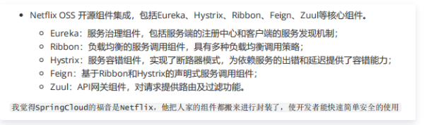
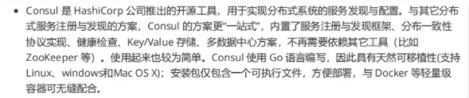
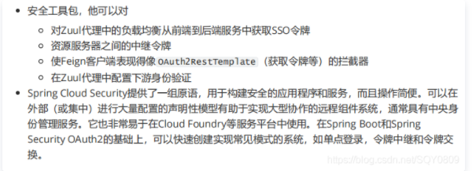
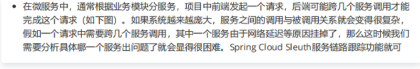
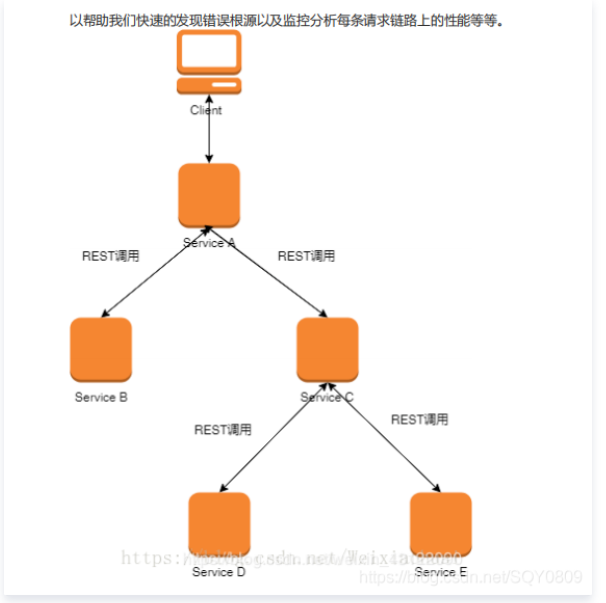
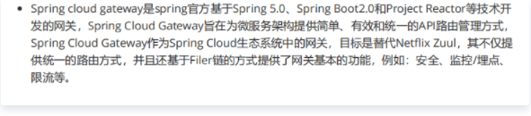

[toc]

# Spring Cloud

## 一、什么是微服务架构

### 1、什么是微服务架构

微服务架构就是将单体的应用程序分成多个应用程序，这多个应用程序就称为微服务，每个微服务运行在自己的进程中，并使用轻量级的机制通信，这些服务围绕业务能来划分，并通过自动化部署机制来独立部署，这些服务可使用不同的编程语言，不同数据库，以保证最低限度的集中式管理。

### 2、为什么要学习Spring Cloud

- 首先springcloud基于spingboot的优雅简洁，可还记得我们被无数xml支配的恐惧？可还记得 springmvc，mybatis错综复杂的配置，有了spingboot，这些东西都不需要了，spingboot好处不 再赘诉，springcloud就基于SpringBoot把市场上优秀的服务框架组合起来，通过Spring Boot风格进行再封装屏蔽掉了复杂的配置和实现原理 
- 什么叫做开箱即用？即使是当年的黄金搭档dubbo+zookeeper下载配置起来也是颇费心神的！而springcloud完成这些只需要一个jar的依赖就可以了！ 
- springcloud大多数子模块都是直击痛点，像zuul解决的跨域，fegin解决的负载均衡，hystrix的熔断机制等等等等

### 3、Spring Cloud是什么

- Spring Cloud是一系列框架的有序集合。它利用Spring Boot的开发便利性巧妙地简化了分布式系统基础设施的开发，如服务发现注册、配置中心、智能路由、消息总线、负载均衡、断路器、数据监控等，都可以用Spring Boot的开发风格做到一键启动和部署。 
- Spring Cloud并没有重复制造轮子，它只是将各家公司开发的比较成熟、经得起实际考验的服务框架组合起来，通过Spring Boot风格进行再封装屏蔽掉了复杂的配置和实现原理，最终给开发者留出了一套简单易懂、易部署和易维护的分布式系统开发工具包。

### 4、Spring Cloud优缺点

**优点：**

- 耦合度比较低，不影响其它模块的开发
- 减轻团队成本，可并行开发
- 配置简单，基本用注解就能实现
- 微服务跨平台，可用任何一种语言
- 每个微服务可有自己独立的数据库

**缺点：**

- 部署较为麻烦
- 数据的管理较麻烦
- 系统集成测试较麻烦
- 性能监控较麻烦

总的来说优点大过于缺点，目前看来Spring Cloud是一套非常完善的分布式框架，目前很多企业开始用微服务、Spring Cloud的优势是显而易见的。因此对于想研究微服务架构的同学来说，学习Spring Cloud是一个不错的选择。 

### 5、SpringBoot和SpringCloud的区别

- SpringBoot专注于快速方便的开发单个个体微服务
- SpringCloud是关注全局的微服务协调整理治理框架，将SpringBoot开发的一个个单体微服务整合并管理起来
- 为各个微服务之间提供，配置管理、服务发现、断路器、路由、微代理、事件总线、全局锁、决策竞选、分布式会话等集成服务
- SpringBoot可单独使用，但SpringCloud必须依赖SpringBoot
- SpringBoot专注于快速、方便的开发单个微服务个体，SpringCloud关注全局的服务治理框架

### 6、SpringCloud由什么组成

- Spring Cloud Eureka：服务注册与发现 
- Spring Cloud Zuul：服务网关 
- Spring Cloud Ribbon：客户端负载均衡 
- Spring Cloud Feign：声明性的Web服务客户端 
- Spring Cloud Hystrix：断路器 
- Spring Cloud Confifig：分布式统一配置管理 

### 7、使用Spring Boot会有什么问题

（1）与分布式系统相关的复杂性-这种开销包括网络问题，延迟开销，带宽问题，安全问题。 

（2）服务发现-服务发现工具管理群集中的流程和服务如何查找和互相交谈。它涉及一个服务目录，在该目录中注册服务，然后能够查找并连接到该目录中的服务。 

（3）冗余-分布式系统中的冗余问题。 

（4）负载平衡 --负载平衡改善跨多个计算资源的工作负荷，诸如计算机，计算机集群，网络链路，中央处理单元，或磁盘驱动器的分布。 

（5）性能-问题 由于各种运营开销导致的性能问题。

### 8、SpringCloud和dubbo区别

（1）服务调用方式：dubbo是RPC ，SpringCloud是Rest Api

（2）注册中心：dubbo是zk，springCloud是eureka，也可以是zk

（3）服务网关：dubbo只能通过整合第三方框架，SpringCloud有zuul路由网关，作为路由服务器，进行消费者的请求分发,springcloud支持断路器，与git完美集成配置文件支持版本控制，事物总线实现配置文件的更新与服务自动装配等等一系列的微服务架构要素。 

## 二、Eureka

### 1、是什么

Eureka是SpringCloud的服务注册中心，系统中的其它服务使用Eureka的客户端将其连接到Eureka Service中，并保持心跳，这样工作人元可通过EurekaService来监控各个微服务是否运行正常。

### 2、Eureka怎么实现高可用

通过集群部署，注册多台Eureka，然后把SpringCloud服务互相注册，客户端从Eureka获取信息时，按照Eureka的顺序来访问

### 3、什么是Eureka的自我保护模式

默认情况下，如果Eureka Service在一定事件内没有接收到某个微服务的心跳，就会进入自我保护模式，再改模式下Eureka Service会保护服务注册表中信息，不再删除注册表中的信息，当网络故障回复后，Eureka Service节点会自动退出保护模式

### 4、DiscoveryClient的作用

可从注册中心中根据服务别名获取注册的服务器信息

### 5、Eureka和ZK的区别

1、zk中的节点服务挂了就要进行选举，在选举期间注册服务瘫痪

2、eureka中各个节点是平等的，只要有一台正常，就能提供服务

3、eureka是一个工程，而zk是一个进程

4、eureka可很好的应对因网络故障导致部分节点失去联系的情况，不会像zk一样使的整个注册系统瘫痪

5、zk保证的是CP，Eureka保证的是AP

## 三、Zuul

### 1、什么是网关

网关相当于一个网络服务架构的入口，所有网络请求必须通过网关转发到具体的服务

### 2、网关作用

统一管理微服务请求，权限控制、负载均衡、路由转发、监控、安全控制黑名单和白名单

### 3、服务网关Zuul是什么

Zuul是对SpringCloud提供的成熟的路由方案，根据请求路径不同，网关会定位到指定的微服务，并代理请求到不同的微服务接口，对完隐藏了微服务的真正接口地址，三个重要概念：动态路由表，路由定位，反向代理：

- 动态路由表：Zuul支持Eureka罗友，手动配置路由，这两种都支持自动更新
- 路由定位：根据请求路径，zuul有自己的一套定位服务规则以及路由表达式匹配
- 反向代理：客户端请求到路由网关，网关受理之后，再对目标发起请求，拿到相应之后再给客户端

可以和Eureka、Ribbon、Hystrix等组件配合使用

Zuul的应用场景：对外暴露、权限校验、服务聚合、日志审计等

### 4、网关和过滤器有什么区别

- 网关是对所有服务的请求进行分析过滤，过滤器是对单个服务而言。 

### 5、常用网关框架有哪些

Zuul、Nginx、Gateway

### 6、ZuulFilter常用有哪些方法

- Run()：过滤器的具体业务逻辑 
- shouldFilter()：判断过滤器是否有效 
- fifilterOrder()：过滤器执行顺序 
- fifilterType()：过滤器拦截位置

### 7、如何实现动态Zuul网关路由转发

- 通过path配置拦截请求，通过ServiceId到配置中心获取转发的服务列表，Zuul内部使用Ribbon实现本地负载均衡和转发。 

### 8、Zuul网关如何搭建集群

- 使用Nginx的upstream设置Zuul服务集群，通过location拦截请求并转发到upstream，默认使用轮询机制对Zuul集群发送请求。 

## 四、Ribbon

### 1、是什么

Ribbon主要功能是提供客户端的软件负载均衡算法

提供一系列完善的配置项，如连接超时、重试等

### 2、与Nginx区别

Nginx是反向代理同时可以实现负载均衡，拦截客户端请求采用负载均衡策略根据upstream配置进行转发，相当于请求通过nginx服务器进行转发

Ribbon是客户端负载均衡，从注册中心读取目标服务器信息，然后客户端采用给轮询策略对服务直接访问，全程在客户端操作

3、Ribbon底层实现原理

- Ribbon使用discoveryClient从注册中心读取目标服务信息，对同一接口请求进行计数，使用%取余算法获取目标服务集群索引，返回获取到的目标服务信息。 

### @LoadBalanced注解的作用

- 开启客户端负载均衡。

## 五、Hystrix

### 1、什么是断路器

当一个服务调用另一个服务由于网络原因或自身原因出现问题，调用者就会等待被调用者的响应，当更多的服务请求到这些资源导致更多的请求等待，发生连锁效应（雪崩）

断路器有三种状态：

- 打开：一段时间内，达到一定次数无法调用，并且多次监测没恢复的迹象，断路器完全打开，那么下次请求就不会请求到该服务
- 半开：短时间内，有恢复迹象，断路器会将部分请求发给该服务，正常调用时断路器关闭
- 关闭：服务一直处于正常状态，能正常调用

### 2、什么是Hystrix

在分布式系统，一定会依赖各种服务，那么这些服务一定会出现失败的i情况，就会导致雪崩，Hystrix就是一个防雪崩利器，具有服务降级、服务熔断、服务隔离、监控等防雪崩技术

有四种放雪崩方式：

- 服务降级：接口调用失败就调用本地方法返回一个空
- 服务熔断：接口调用失败就会进入调用接口提前定义好的一个熔断方法，返回错误信息
- 服务隔离：隔离服务之间相互影响
- 服务监控：监控该服务每秒请求数、成功请求数等指标

### 3、服务雪崩效应

当某个服务宕机时，调用这个服务的其他服务也会发生宕机，大型项目的微服务之间的调用时互通的，这样就会将服务的不可用逐步扩大到各个其它服务中，从而使得整个项目的服务宕机崩溃

原因有以下几种：

- 单个服务代码存在bug
- 请求访问量激增导致崩溃
- 服务器硬件故障

### 4、微服务中，如何保护服务

使用Hystrix框架，实现服务隔离来避免服务雪崩，达到保护服务的效果

当微服务中，高并发的数据库访问量导致服务线程阻塞，使单个服务宕机，服务的不可用会蔓延到其它服务，引起整体服务宕机，使用服务降级能有效为不同的服务分配资源，一旦服务不可用则返回友好提示，不占用其它服务资源，从而避免单个服务崩溃引发整体服务的不可用

### 5、服务雪崩效应产生的原因

- 因为Tomcat默认情况下只有一个线程池来维护客户端发送的所有的请求，这时候某一接口在某一时刻被大量访问就会占据tomcat线程池中的所有线程，其他请求处于等待状态，无法连接到服务接口。 

### 6、服务降级、熔断、隔离

降级：当客户但请求服务器端时候，防止客户端一直等待，不会处理业务逻辑代码，直接返回一个友好的提示给客户端

熔断：再服务降级的基础上更直接的一种保护方式，挡在一个统计时间范围内的请求失败数量达到设定值，或当前的请求错误率达到设定的阈值时开启短路，之后的请求直接走fallback方法，再设定时间后尝试恢复

隔离：Hystrix为隔离的服务开启一个独立的线程池，这样再高并发的情况下不会影响其它服务，服务隔离有线程池和信号量两种方式，一般使用线程池方式

### 7、服务降级底层是如何实现的？

- Hystrix实现服务降级的功能是通过重写HystrixCommand中的getFallback()方法，当Hystrix的run方法或construct执行发生错误时转而执行getFallback()方法。 

## 六、Feign

### 1、是什么

Feign是一个声明web服务客户端使得编写web服务客户端更容易

将需要调用的服务方法定义成抽象方法保存再本地就可以了，不需要自己构建http请求了，直接调用接口即可，要注意的是调用方法要和本地抽象方法的签名完全一致

### 2、SpringCloud有几种调用接口方式

- Feign 
- RestTemplate

### 3、与Ribbon的区别

Ribbon需要构建HTTP请求，模拟HTTP请求然后通过RestTemplate发给其它服务

而Feign则是在Ribbon的基础上进行一次改进，采用接口形成，将需要调用的服务方法发定义成抽象方法保存在本地即可，无需构建HTTP请求。

## 七、Config

### 1、什么是SpringCloud Config

为分布式系统中的外部配置提供服务端和客户端支持，可方便的对微服务各个环境下的配置进行集中式管理，

分为Config Server和Config Client两部分，Server负责读取配置文件，并暴露Http API接口，Client通过调用Server的接口来读取配置文件

### 2、分布式配置中心有那些框架？

- Apollo、zookeeper、springcloud confifig。 

### 3、 分布式配置中心的作用？

- 动态变更项目配置信息而不必重新部署项目。 

### 4、SpringCloud Config 可以实现实时刷新吗？

- springcloud confifig实时刷新采用SpringCloud Bus消息总线。

## 八、Bus

### 1、什么是Spring Cloud Bus

用于传播集群状态变化的消息总线，使用轻量级消息代理链接分布式系统中的节点，可用来动态刷新集群中的服务配置消息

需要利用消息中间件 MQ

## 九、SpringCloud主要项目

- pring Cloud的子项目，大致可分成两类，一类是对现有成熟框架"Spring Boot化"的封装和抽象，也是数量最多的项目；第二类是开发了一部分分布式系统的基础设施的实现，如Spring CloudStream扮演的就是kafka, ActiveMQ这样的角色。

### Spring Cloud Config

### Spring Cloud Netflix(重点，这些组件用的最多)

### Spring Cloud Bus

### Spring Cloud Consul

### Spring Cloud Security

### Spring Cloud Sleuth

### Spring Cloud Stream

- 轻量级事件驱动微服务框架，可以使用简单的声明式模型来发送及接收消息，主要实现为Apache Kafka及RabbitMQ。

### Spring Cloud Task

- Spring Cloud Task的目标是为Spring Boot应用程序提供创建短运行期微服务的功能。在Spring Cloud Task中，我们可以灵活地动态运行任何任务，按需分配资源并在任务完成后检索结果。 Tasks是Spring Cloud Data Flow中的一个基础项目，允许用户将几乎任何Spring Boot应用程序作为一个短期任务执行。

### Spring Cloud Zookeeper

- SpringCloud支持三种注册方式Eureka， Consul(go语言编写)，zookeeper 
- Spring Cloud Zookeeper是基于Apache Zookeeper的服务治理组件。 

### Spring Cloud Gateway

### Spring Cloud OpenFeign

- Feign是一个声明性的Web服务客户端。它使编写Web服务客户端变得更容易。要使用Feign，我们可以将调用的服务方法定义成抽象方法保存在本地添加一点点注解就可以了，不需要自己构建Http请求了，直接调用接口就行了，不过要注意，调用方法要和本地抽象方法的签名完全一致。 ****