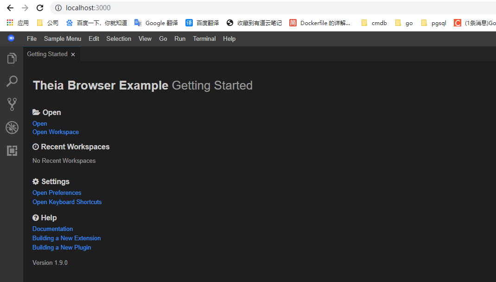

[TOC]

官方文档：

https://github.com/eclipse-theia/theia/blob/master/doc/Developing.md#building-on-windows


# windows环境编译theia

## 准备工作

### 1、默认方式安装scoop

可以参照 下面两个连接的方式安装也可以安装此文档方式安装

https://github.com/lukesampson/scoop#installation

https://theia-ide.org/docs/composing_applications

https://blog.csdn.net/luoyooi/article/details/102990113

```powershell
Invoke-Expression (New-Object System.Net.WebClient).DownloadString('https://get.scoop.sh')

# or shorter
iwr -useb get.scoop.sh | iex
```

第一种方式不行，换用第二种成功安装。

```powershell
PS C:\Users\Administrator> iwr -useb get.scoop.sh | iex
Initializing...
Downloading scoop...
Extracting...
Creating shim...
Downloading main bucket...
Extracting...
# 默认安装位置
Adding D:\Applications\Scoop\shims to your path.
'lastupdate' has been set to '2021-01-28T20:41:10.4457112+08:00'
Scoop was installed successfully!
Type 'scoop help' for instructions.
```

安装结果

安装位置：D:\Applications\Scoop

```powershell
PS C:\Users\Administrator> scoop help
Usage: scoop <command> [<args>]

Some useful commands are:

alias       Manage scoop aliases
bucket      Manage Scoop buckets
cache       Show or clear the download cache
checkup     Check for potential problems
cleanup     Cleanup apps by removing old versions
config      Get or set configuration values
create      Create a custom app manifest
depends     List dependencies for an app
export      Exports (an importable) list of installed apps
help        Show help for a command
hold        Hold an app to disable updates
home        Opens the app homepage
info        Display information about an app
install     Install apps
list        List installed apps
prefix      Returns the path to the specified app
reset       Reset an app to resolve conflicts
search      Search available apps
status      Show status and check for new app versions
unhold      Unhold an app to enable updates
uninstall   Uninstall an app
update      Update apps, or Scoop itself
virustotal  Look for app's hash on virustotal.com
which       Locate a shim/executable (similar to 'which' on Linux)


Type 'scoop help <command>' to get help for a specific command.	
```

### 2、安装aria2以加快scoop下载软件的速度

Scoop可以利用aria2使用多连接下载。只需通过Scoop安装aria2，它将用于之后的所有下载。

```
scoop install aria2
```

您可以使用scoop config命令调整以下aria2设置:

```
aria2-enabled (default: true)
aria2-retry-wait (default: 2)
aria2-split (default: 5)
aria2-max-connection-per-server (default: 5)
aria2-min-split-size (default: 5M)
```

### 3、安装nvm、yarn

```shell
-- 下面两步非必须，如果自己已经安装了node
scoop install nvm
nvm install 12.14.1
-- 这步是必须的
scoop install yarn
```

解决windows下安装hadoop yarn冲突问题

https://www.cnblogs.com/ttzz/p/12860187.html


**npm设置国内镜像源：**

安装了node后就自带了npm包管理工具，如果没有翻墙工具可能需要更改镜像源地址为国内的，更改方式如下：

```
-- 设置成npm淘宝源
npm config set registry https://registry.npm.taobao.org
npm config set disturl https://npm.taobao.org/dist
```

https://www.cnblogs.com/cxscode/p/8371797.html


**yarn设置国内镜像源：**

```shell
yarn config set registry https://registry.npm.taobao.org --global
yarn config set disturl https://npm.taobao.org/dist --global
```

### 4、安装windows-build-tools

```
npm --add-python-to-path install --global --production windows-build-tools
```

### 5、开始编译运行

>  PS: 如果是windows环境最好是在git bash命令行客户端运行此过程。

To build and run the browser example:

```shell
git clone https://github.com/eclipse-theia/theia \
&& cd theia \
-- 下载依赖，这一步一定要运行否则后续执行失败
&& yarn \
&& cd examples/browser \
-- 运行
&& yarn run start
-- 支持ssl的方式运行
-- && yarn run start --ssl --cert /path/to/cert.crt --certkey /path/to/certkey.key
```


如上图所示编译成功！



最后在浏览器运行http://localhost:3000/可以看到如上图界面，说明启动成功了！


## 相关概念了解

### yarn、npm是什么

https://www.jianshu.com/p/254794d5e741

Yarn是由Facebook、Google、Exponent 和 Tilde 联合推出了一个新的 JS 包管理工具 ，正如[官方文档](https://link.jianshu.com/?t=http%3A%2F%2Flink.zhihu.com%2F%3Ftarget%3Dhttps%3A%2F%2Fcode.facebook.com%2Fposts%2F1840075619545360)中写的，Yarn 是为了弥补 npm 的一些缺陷而出现的。

yarn相比npm更快，更友好。

### npx是什么

http://www.ruanyifeng.com/blog/2019/02/npx.html

npx是npm5附带的一条命令，npx 会自动查找当前依赖包中的可执行文件，如果找不到，就会去 PATH 里找。如果依然找不到，就会帮你安装！


## 扩展

### 单独编译扩展包（Build extension packages individually）

```
From the root:

npx run build @theia/package-name

From the package:

yarn --ignore-scripts && yarn build
```

### Rebuilding

In the root directory run:

```
yarn run build
```