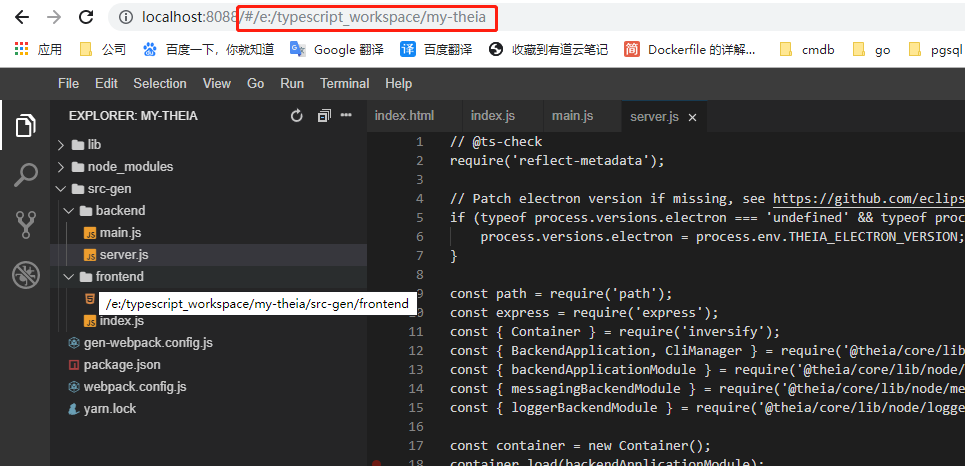

[TOC]

# 构建一个自己的应用开发ide

【官方文档】https://theia-ide.org/docs/composing_applications/

其实就是说进入这个webide就进入到你的程序源代码目录了。

## 1、准备工作

首先需要你已经有theia环境了，就是第一节的【theia开发环境搭建】已经弄好了。

## 2、创建自己的开发工作空间

创建应用目录

```
mkdir my-app
cd my-app
```

在my-app目录创建package.json

```json
{
  "private": true,
  "dependencies": {
    "@theia/callhierarchy": "next",
    "@theia/file-search": "next",
    "@theia/git": "next",
    "@theia/markers": "next",
    "@theia/messages": "next",
    "@theia/mini-browser": "next",
    "@theia/navigator": "next",
    "@theia/outline-view": "next",
    "@theia/plugin-ext-vscode": "next",
    "@theia/preferences": "next",
    "@theia/preview": "next",
    "@theia/search-in-workspace": "next",
    "@theia/terminal": "next"
  },
  "devDependencies": {
    "@theia/cli": "next"
  }
}
```

3、开始构建

```
yarn
yarn theia build
1. yarn start
2. yarn start /my-workspace --hostname 0.0.0.0 --port 8080
```

