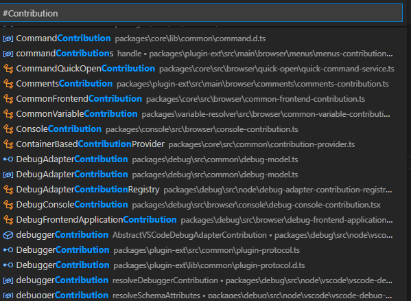
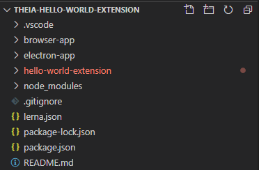

【官方文档】https://theia-ide.org/docs/authoring_extensions/


# 扩展包

Theia应用程序由所谓的扩展包（*extensions*）构成。一个扩展包提供一组特定功能的小部件、命令和处理程序等。Theia本身提供了一些扩展包，如编辑器、终端、项目视图等。每一个扩展包都属于它们各自的npm包。

Theia定义了大量的contribution接口，允许扩展包将功能添加到应用程序的各个部分。只需要按名称搜索*Contribution就可以找到这些接口。扩展包实现了这些contribution接口的具体功能。



我们可以通过实现不通类型的Contribution来实现不同的功能。


## 扩展开发

theia提供了一个扩展包开发的脚手架，以供快速的开发扩展包，按如下命令安装即可。下面以创建一个theia-hello-world-extension为例，简单输出一句'hello world'

```shell
npm install -g yo generator-theia-extension
mkdir theia-hello-world-extension
cd theia-hello-world-extension
yo theia-extension hello-world-extension
```

生成之后的脚手架内容如下：



官方文档有详细说明这个项目的配置信息。

扩展的代码就在`hello-world-extension`这个包下面，分为浏览器和electron两种方式。

扩展运行

在浏览器运行

如果没有编译，则需要运行yarn命令进行编译。

```
cd browser-app
yarn start <path to workspace>
```

然后在浏览器中输入[http://localhost:3000](http://localhost:3000/)，在打开的应用程序中选择Edit>Say Hello，你将会看到 “Hello World!”的消息弹出。