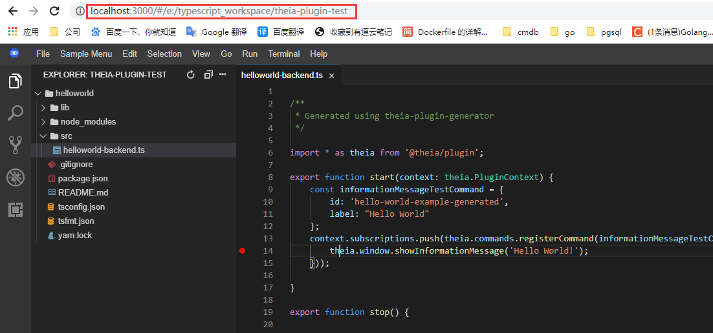
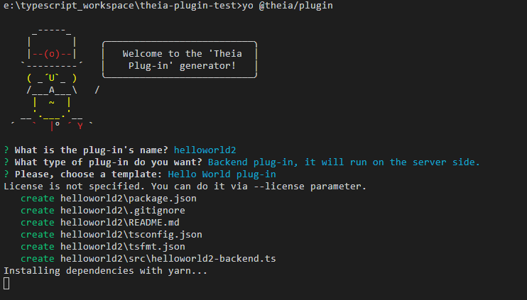
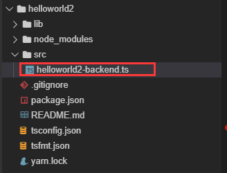
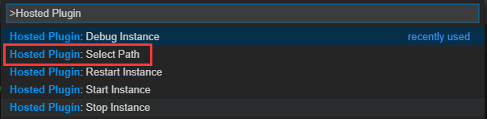
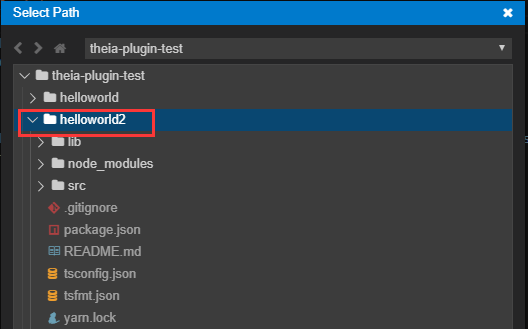
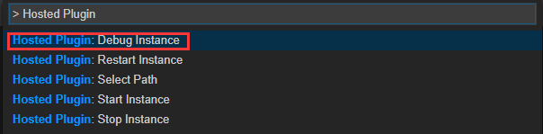
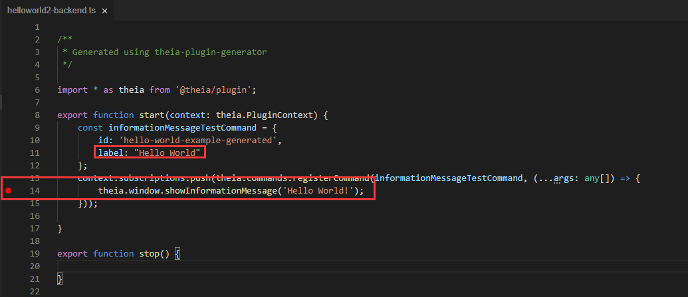
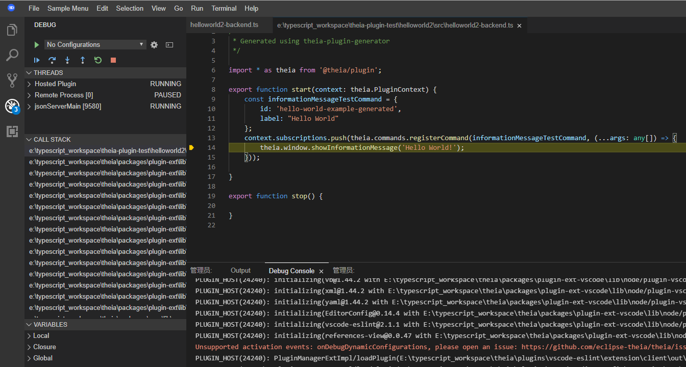
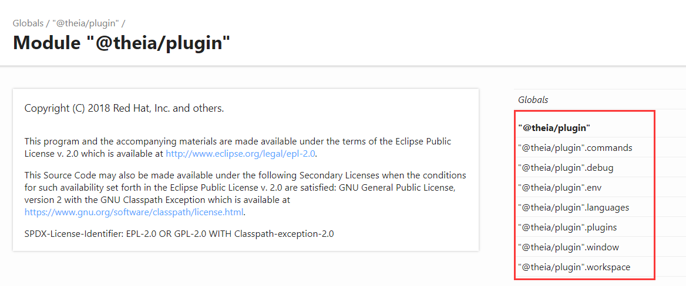

[toc]

# theia插件开发入门

youtube视频演示地址：https://www.youtube.com/watch?v=Kjwovxq38Ms

官方issue: https://github.com/eclipse-theia/theia/issues/3251

theia将其称为一个ide框架，所以我们可以进行任意定制化，其提供了两种扩展方式一种是前面说的扩展方式，通过Contribution的方式来扩展theia功能，这个是集成在theia的主进程之内运行的，有可能会影响其运行稳定性，然后它也提供了像vscode的插件机制，同时也兼容vscode的插件，插件运行的方式是运行在Plugin Host进程之中，不会影响theia主进程的稳定运行。

下面会演示一个创建一个theia插件并且调试它。（这个调试很重要）

## 准备工作

需要一个theia实例，这个在第一节已经介绍。

## 生成插件

### 1、运行theia实例

运行成功之后进入插件开发测试的工作目录`theia-plugin-test`，示例如下：

进入工作空间 http://localhost:3000/#/e:/typescript_workspace/theia-plugin-test （这里根据自己的情况来）



### 2、运行命令行工具

这一步随便在哪里运行，这里直接在theia实例中运行了

安装插件脚手架

```shell
# 安装插件脚手架工具
npm install -g yo @theia/generator-plugin
mkdir theia-hello-world-plugin
cd theia-hello-world-plugin
# 生成插件demo
yo @theia/plugin
```



在创建的时候可以输入插件的名称，是服务端插件还是前端插件，以及插件模板。

这里我们输入的名称叫`helloworld2`，因为helloworld之前已经取了。

### 3、开发插件

生成之后的插件项目的目录结构如下，我们的插件代码的编写就在src目录下面。



插件代码如下：

label的名称用于在通过commad的方式进行查找用的

```typescript
/**
 * Generated using theia-plugin-generator
 */

import * as theia from '@theia/plugin';

export function start(context: theia.PluginContext) {
    const informationMessageTestCommand = {
        id: 'hello-world-example-generated',
        label: "Hello World"
    };
    context.subscriptions.push(theia.commands.registerCommand(informationMessageTestCommand, (...args: any[]) => {
        theia.window.showInformationMessage('Hello World!');
    }));

}

export function stop() {

}
```

### 4、运行插件

在前面的步骤完成之后我们需要进行插件的测试和调试，在Theia中有一种被称之为`hosted mode`的模式，该模式允许我们在其中一个Theia实例中开发插件，并将其部署到另一个Theia实例中。这样就可以很方便地生成插件并进行测试。

1、选择要运行的插件

**在theia实例中**执行`F1`快捷键，输入`Hosted Plugin`找到`Select Path`选项。



然后选择我们刚创建的`helloworld2`



2、选择运行模式（调试或者直接启动）

选择完之后我们需要进行插件调试，这里选择调试（debug）的方式，如下图。



选择`Debug Instance`之后会启动新的页面`localhost:3030`这个即为插件的调试页面，我们照样执行快捷键`F1`，然后输入插件名字`Hello World`，即可看到运行插件的结果。

如果想要打断点调试插件，那么现在代码打好断点。



然后执行插件，即可进入到断点位置。



## 后续插件开发

如果想要开发高级的功能，需要了解一些插件的api，其文档如下：

https://github.com/eclipse-theia/theia/blob/master/packages/plugin/README.md

https://benoitf.github.io/sample-typedocs/index.html

https://benoitf.github.io/sample-typedocs/modules/__theia_plugin_.html

