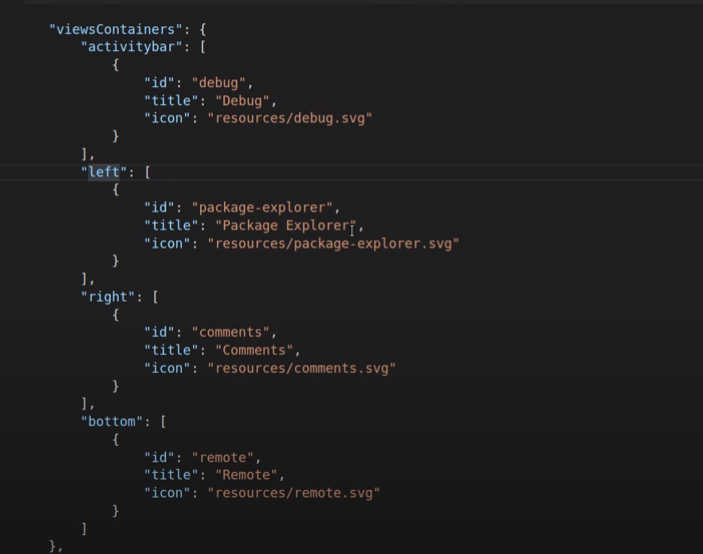
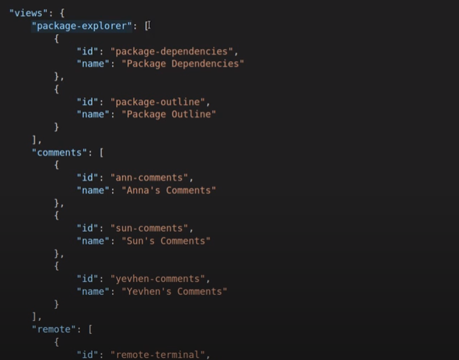

https://github.com/Pines-Cheng/blog/issues/83

## 名词解释

- [Theia](https://github.com/eclipse-theia/theia)：可拓展的 Cloud & Desktop IDE 平台。
- [Theia Extension](https://theia-ide.org/docs/authoring_extensions/)：Theia 是由一系列 Extension 组成，Extension 提供了处理 widgets, commands, handlers 等的能力，在**编译时加载**。
- [Theia Plugin](https://theia-ide.org/docs/authoring_plugins/)：概念上类似于 VSCode Extension，由 Theia 的其中一个 Extension ：[theia/packages/plugin-ext](https://github.com/eclipse-theia/theia/tree/master/packages/plugin-ext) 定义了 加载机制、运行环境及 API 等。兼容 VSCode Extension ，功能更为强大，**运行时加载**。
- [VSCode Extension](https://code.visualstudio.com/api)：VSCode 运行时加载的 extensions，基于 VSCode Extension API 实现，概念上类似于 Theia 的 Plugin，**运行时加载**。

> VSCode Extension 可以看成是 Theia Plugin 的子集。
>
> Theia Extension 与 Plugin 的界线：核心的、抽象的、编译时加载的采用 Extension；业务的、具体的、运行时加载的采用 Plugin。
>
> **Theia Plugin 类型分为前端和后端（VSCode 只有后端）**，其中后端运行在独立的插件进程；前端运行在 Web Worker 上，通过 postMessage 和 Browser 主进程通信。这里的 Web Worker 有点像微信小程序架构里面的 App Service。

