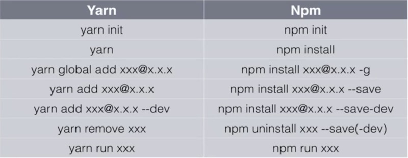

yarn与npm对比

　**yarn最常用最基础的命令和npm对比**

　　**npm init / yarn init 初始化**

　　**mkdir 文件名 / md 文件名**

　　**npm install / yarn或yarn install 安装依赖**

　    **npm install package -g / yarn global add package 全局安装某个依赖**

　　**npm install package --save-dev /  yarn add package --dev 安装某个依赖**

　　**npm uninstall package --save-dev / yarn remove package --dev 卸载某个依赖**

　　**npm run dev 或 npm start / yarn run start 或 yarn start 运行**



yarn使用方法

https://yarn.bootcss.com/docs/usage/

**初始化一个新项目**

```
yarn init
```

**添加依赖包**

```
yarn add [package]
yarn add [package]@[version]
yarn add [package]@[tag]
```

**将依赖项添加到不同依赖项类别中**

分别添加到 `devDependencies`、`peerDependencies` 和 `optionalDependencies` 类别中：

```
yarn add [package] --dev
yarn add [package] --peer
yarn add [package] --optional
```

**升级依赖包**

```
yarn upgrade [package]
yarn upgrade [package]@[version]
yarn upgrade [package]@[tag]
```

**移除依赖包**

```
yarn remove [package]
```

**安装项目的全部依赖**

```
yarn
```

或者

```
yarn install
```

