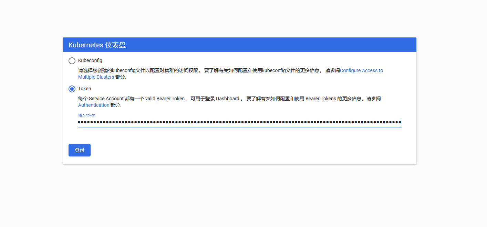

# **分布式环境的特点***


1、分布性

2、并发性：程序运行过程中，并发性操作是很常见的。比如同一个分布式系统中的多个节点，同时访问一个共享资源。数据库、分布式存储

3、无序性：进程之间的消息通信，会出现顺序不一致问题

 

# ***分布式环境下面临的问题***

1、网络通信：网络本身的不可靠性，因此会涉及到一些网络通信问题

2、网络分区(脑裂)：当网络发生异常导致分布式系统中部分节点之间的网络延时不断增大，最终导致组成分布式架构的所有节点，只有部分节点能够正常通信

3、三态：在分布式架构里面，除了成功、失败、超时

4、分布式事务：ACID(原子性、一致性、隔离性、持久性)

 

# ***中心化和去中心化***

冷备或者热备

 

分布式架构里面，很多的架构思想采用的是：当集群发生故障的时候，集群中的人群会自动“选举”出一个新的领导。

最典型的是： zookeeper / etcd

 

# ***经典的CAP/BASE理论***

CAP

一致性（Consistency）: 所有节点上的数据，时刻保持一致

可用性（Availability）：每个请求都能够收到一个响应，无论响应成功或者失败

分区容错（Partition-tolerance）：表示系统出现脑裂以后，可能导致某些server与集群中的其他机器失去联系

CP  / AP

 

CAP理论仅适用于原子读写的Nosql场景，不适用于数据库系统

BASE

基于CAP理论，CAP理论并不适用于数据库事务（因为更新一些错误的数据而导致数据出现紊乱，无论什么样的数据库高可用方案都是徒劳） ，虽然XA事务可以保证数据库在分布式系统下的ACID特性，但是会带来性能方面的影响；

 

eBay尝试了一种完全不同的套路，放宽了对事务ACID的要求。提出了BASE理论

Basically available  ： 数据库采用分片模式， 把100W的用户数据分布在5个实例上。如果破坏了其中一个实例，仍然可以保证80%的用户可用

 

soft-state：  在基于client-server模式的系统中，server端是否有状态，决定了系统是否具备良好的水平扩展、负载均衡、故障恢复等特性。

Server端承诺会维护client端状态数据，这个状态仅仅维持一小段时间, 这段时间以后，server端就会丢弃这个状态，恢复正常状态

 

Eventually consistent：数据的最终一致性

# 一、zookeeper（分布式协调服务）

## 1、开源的分布式协调服务，分布式数据一致性的解决方案

## 2、能做什么

（1）数据的发布/订阅（配置中心:disconf）、负载均衡（dubbo利用了zookeeper机制实现负载均衡） 、命名服务、master选举(kafka、hadoop、hbase)、分布式队列、分布式锁

## 3、特性

### ***（1）顺序一致性***

从同一个客户端发起的事务请求，最终会严格按照顺序被应用到zookeeper中

### ***（2）原子性***

所有的事务请求的处理结果在整个集群中的所有机器上的应用情况是一致的，也就是说，要么整个集群中的所有机器都成功应用了某一事务、

要么全都不应用

### ***（3）可靠性***

一旦服务器成功应用了某一个事务数据，并且对客户端做了响应，那么这个数据在整个集群中一定是同步并且保留下来的

### ***（4）实时性***

一旦一个事务被成功应用，客户端就能够立即从服务器端读取到事务变更后的最新数据状态；（zookeeper仅仅保证在一定时间内，近实时）

 

## 4、集群架构

### （1）leader（领导者）

为客户端提供读和写的功能，负责投票的发起和决议，集群里面只有leader才能接受写的服务。

### （2）follower（跟随者）

为客户端提供读服务，如果是写的服务则转发给leader。在选举过程中进行投票。

### （3）observer（观察者）

为客户端提供读服务，如果是写服务就转发个leader。不参与leader的选举投票。也不参与写的过半原则机制。在不影响写的前提下，提高集群读的性能，此角色于zookeeper3.3系列新增的角色。

这个角色设置是在zoo.cfg文件中新增配置：

peerType=observer

server.n=host:2181:3181:observer //n是集群中的机器序号

 

## 5、数据模型

zookeeper的数据模型和文件系统类似，每一个节点称为：znode，是zookeeper中的最小数据单元。每一个znode上都可以保存数据和挂载子节点。从而构成一个层次化的属性结构

节点特性

持久化节点  ： 节点创建后会一直存在zookeeper服务器上，直到主动删除

持久化有序节点 ：每个节点都会为它的一级子节点维护一个顺序

临时节点 ： 临时节点的生命周期和客户端的会话保持一致。当客户端会话失效，该节点自动清理，临时节点下不可创建子节点。

临时有序节点 ： 在临时节点上多勒一个顺序性特性

 

## 6、Watcher

zookeeper提供了分布式数据发布/订阅,zookeeper允许客户端向服务器注册一个watcher监听。当服务器端的节点触发指定事件的时候会触发watcher。服务端会向客户端发送一个事件通知。

watcher的通知是一次性，一旦触发一次通知后，该watcher就失效

 

## 7、ACL

zookeeper提供控制节点访问权限的功能，用于有效的保证zookeeper中数据的安全性。避免误操作而导致系统出现重大事故。

CREATE /READ/WRITE/DELETE/ADMIN

 

## 8、zookeeper的实际应用场景

### （1）订阅发布

  watcher机制

  统一配置管理（disconf）

### （2）分布式锁

  **redis**：Redisson，可以用setNX 存在则会返回0， 不存在

  **zookeeper**：每个客户端都会注册一个临时有序节点，每次最小的节点会获取锁，当前节点会去监听上一个较小节点，如果较小节点失效之后，就会去获取锁。

 

排它锁：几个客户端都去在Locks下创建一个特定的临时节点，创建成功则获取锁

 

  **数据库** ：创建一个表， 通过索引唯一的方式

create table (id , methodname …)  methodname增加唯一索引

获取锁的时候会insert 一条数据XXX，如果插入失败，则表示锁已经被占用

也可以用mysql的for update语句

 

 

### （3）负载均衡

通过负载均衡算法将请求/数据分摊多个计算机单元上

### （4）ID生成器

### （5）分布式队列

### （6）统一命名服务

### （7）master选举

固定一个path，看哪台机器能创建此临时节点则为master，其他机器监测此path的数据变化。

 

 

## 9、客户端命令操作

### （1）create [-s] [-e] path data acl

-s 表示节点是否有序

-e 表示是否为临时节点

默认情况下，是持久化节点

### （2）get path [watch]

获得指定 path的信息

 

### （3）set path data [version]

修改节点 path对应的data

乐观锁的概念

数据库里面有一个 version 字段去控制数据行的版本号

### （4）delete path [version]

删除节点

### （5）stat信息

cversion = 0    子节点的版本号

aclVersion = 0   表示acl的版本号，修改节点权限

dataVersion = 1   表示的是当前节点数据的版本号

 

czxid   节点被创建时的事务ID

mzxid  节点最后一次被更新的事务ID

pzxid   当前节点下的子节点最后一次被修改时的事务ID

 

ctime = Sat Aug 05 20:48:26 CST 2017

mtime = Sat Aug 05 20:48:50 CST 2017

 

ephemeralOwner = 0x0  创建临时节点的时候，会有一个sessionId 。 该值存储的就是这个sessionid

dataLength = 3   数据值长度

numChildren = 0  子节点数

 

 

## 10、数据一致性

### （1）zookeeper保存数据一致性用的是ZAB协议。

### （2）两阶段提交+过半写机制

 

ZooKeeper写数据的机制是客户端把写请求发送到leader节点上（如果发送的是follower节点，follower节点会把写请求转发到leader节点），leader节点会把数据通过proposal请求发送到所有节点（包括自己），所有到节点接受到数据以后都会写到自己到本地磁盘上面，写好了以后会发送一个ack请求给leader，leader只要接受到过半的节点发送ack响应回来，就会发送commit消息给各个节点，各个节点就会把消息放入到内存中（放内存是为了保证高性能），该消息就会用户可见了。那么这个时候，如果ZooKeeper要想保证数据一致性，就需要考虑如下两个情况，情况一：leader执行commit了，还没来得及给follower发送commit的时候，leader宕机了，这个时候如何保证消息一致性？情况二：客户端把消息写到leader了，但是leader还没发送proposal消息给其他节点，这个时候leader宕机了，leader宕机后恢复的时候此消息又该如何处理？

 

### （3）ZAB的崩溃恢复机制

leader执行commit了，还没来得及给follower发送commit的时候，leader宕机了，这种情况下，ZooKeeper会选举出来新的leader，新的leader启动以后要到磁盘上面去检查是否存在没有commit的消息，如果存在，就继续检查看其他follower有没有对这条消息进行了commit，如果有过半节点对这条消息进行了ack，但是没有commit，那么新的leader要完成commit的操作。

 

### （4）ZAB恢复中删除数据机制

客户端把消息写到leader了，但是leader还没发送proposal消息给其他节点，这个时候leader宕机了，这种情况下，对于用户来说，这条消息是写失败的。假设过了一段时间以后leader节点又恢复了，不过这个时候角色就变为了follower了，它在检查自己磁盘的时候会发现自己有一条消息没有进行commit，此时就会检测消息的编号，消息是有编号的，由高32位和低32位组成，高32位是用来体现是否发生过leader切换的，低32位就是展示消息的顺序的。这个时候当前的节点就会根据高32位知道目前leader已经切换过了，所以就把当前的消息删除，然后从新的leader同步数据，这样保证了数据一致性。

 

 

## 11、leader选举算法

有三种算法，leaderElection/AuthFastLeaderElection/FastLeaderElection，默认采用的是FastLeaderElection算法。

源码在QuorumPeer类中的startLeaderElection方法。

 

源码地址：https://github.com/apache/zookeeper.git

 

需要的条件： jdk 1.7以上 、ant 、idea

 

FastLeaderElection

 

serverid : 在配置server集群的时候，给定服务器的标识id（myid）

zxid  : 服务器在运行时产生的数据ID， zxid的值越大，表示数据越新

Epoch: 选举的轮数

server的状态：Looking、 Following、Observering、Leading

 

 

第一次初始化启动的时候： LOOKING

1.所有在集群中的server都会推荐自己为leader，然后把（myid、zxid、epoch）作为广播信息，广播给集群中的其他server, 然后等待其他服务器返回

2.每个服务器都会接收来自集群中的其他服务器的投票。集群中的每个服务器在接受到投票后，开始判断投票的有效性

a)判断逻辑时钟(Epoch) ，如果Epoch大于自己当前的Epoch，说明自己保存的Epoch是过期。更新Epoch，同时clear其他服务器发送过来的选举数据。判断是否需要更新当前自己的选举情况

b)如果Epoch小于目前的Epoch，说明对方的epoch过期了，也就意味着对方服务器的选举轮数是过期的。这个时候，只需要将自己的信息发送给对方

 

 


# 二、Dubbo（分布式服务治理）

## 1、是什么

 Dubbo是一个分布式服务框架，致力于提供高性能和透明化的RPC远程服务调用方案，以及SOA服务治理方案。

核心功能是：

1. 远程通讯: 提供对多种基于长连接的NIO框架抽象封装，包括多种线程模型，序列化，以及“请求-响应”模式的信息交换方式。
2. 集群容错: 提供基于接口方法的透明远程过程调用，包括多协议支持，以及软负载均衡，失败容错，地址路由，动态配置等集群支持。
3. 自动发现: 基于注册中心目录服务，使服务消费方能动态的查找服务提供方，使地址透明，使服务提供方可以平滑增加或减少机器。


## 2、Dubbo架构

### （1）基础架构


Dubbo系统分为五个部分：远程服务运行容器（Container），远程服务提供方（Provider）、注册中心（Register）、远程服务调用者（Consumer）、监控中心（Monitor）。

Dubbo服务调用过程：

1、服务提供方（Provider）所在的应用在容器中启动并运行（这个容器可以说是该应用部署的tomcat）
2、服务提供方（Provider）将自己要发布的服务注册到注册中心（Registry）
3、服务调用方（Consumer）启动后向注册中心订阅它想要调用的服务
4、注册中心（registry）存储着Provider注册的远程服务，并将其所管理的服务列表通知给服务调用方（Consumer），且

5、注册中心和提供方和调用方之间均保持长连接，可以获取Provider发布的服务的变化情况，并将最新的服务列表推送给Consumer
6、Consumer根据从注册中心获得的服务列表，根据软负载均衡算法选择一个服务提供者（Provider）进行远程服务调用，如果调用失败则选择另一台进行调用。（Consumer会缓存服务列表，即使注册中心宕机也不妨碍进行远程服务调用）
7、监控中心（Monitor）对服务的发布和订阅进行监控和统计服务消费者和提供者，在内存中累计调用次数和调用时间，定时每分钟发送一次统计数据到监控中心（Monitor）;Monitor可以选择Zookeeper、Redis或者Multiast注册中心等，后序介绍。


### （2）架构特点

Dubbo架构具有连通性、健壮性、伸缩性

1>连通性

- 注册中心负责服务地址的注册与查找，相当于目录服务，服务提供者和消费者只在启动时与注册中心交互，注册中心不转发请求，压力较小
- 监控中心负责统计各服务调用次数，调用时间等，统计先在内存汇总后每分钟一次发送到监控中心服务器，并以报表展示
- 服务提供者向注册中心注册其提供的服务，并汇报调用时间到监控中心，此时间不包含网络开销
- 服务消费者向注册中心获取服务提供者地址列表，并根据负载算法直接调用提供者，同时汇报调用时间到监控中心，此时间包含网络开销
- 注册中心，服务提供者，服务消费者三者之间均为长连接，监控中心除外
- 注册中心通过长连接感知服务提供者的存在，服务提供者宕机，注册中心将立即推送事件通知消费者
- 注册中心和监控中心全部宕机，不影响已运行的提供者和消费者，消费者在本地缓存了提供者列表
- 注册中心和监控中心都是可选的，服务消费者可以直连服务提供者

2>健壮性

- 监控中心宕掉不影响使用，只是丢失部分采样数据
- 数据库宕掉后，注册中心仍能通过缓存提供服务列表查询，但不能注册新服务
- 注册中心对等集群，任意一台宕掉后，将自动切换到另一台
- 注册中心全部宕掉后，服务提供者和服务消费者仍能通过本地缓存通讯
- 服务提供者无状态，任意一台宕掉后，不影响使用
- 服务提供者全部宕掉后，服务消费者应用将无法使用，并无限次重连等待服务提供者恢复

3>伸缩性

- 注册中心为对等集群，可动态增加机器部署实例，所有客户端将自动发现新的注册中心
- 服务提供者无状态，可动态增加机器部署实例，注册中心将推送新的服务提供者信息给消费者

## 3、使用方法

### （1）服务端

1>创建两个子模块，一个接口模块，一个实现模块

2>接口模块创建接口，实现模块实现接口模块的接口

3>实现模块需要在src下创建一个目录，为MATE-INF，放置log4j.properties（此文件配置之后就可以自动输出日志），在MATE-INF创建一个目录为spring，spring目录下放置provicer.xml配置文件（声明服务接口）。


4>provider.xml文件下声明服务接口

```java
<?xml version="1.0" encoding="UTF-8"?>
<beans xmlns="http://www.springframework.org/schema/beans"
       xmlns:xsi="http://www.w3.org/2001/XMLSchema-instance"
       xmlns:dubbo="http://code.alibabatech.com/schema/dubbo"
       xmlns:context="http://www.springframework.org/schema/context"
       xsi:schemaLocation="http://www.springframework.org/schema/beans
       http://www.springframework.org/schema/beans/spring-beans.xsd
       http://code.alibabatech.com/schema/dubbo
       http://code.alibabatech.com/schema/dubbo/dubbo.xsd http://www.springframework.org/schema/context
       http://www.springframework.org/schema/context/spring-context.xsd">

    <!--扫描接口实现-->
    <context:component-scan base-package="com.liusy.impl"/>
    <context:annotation-config></context:annotation-config>
    <!-- 提供方应用信息，用于计算依赖关系，name是唯一的-->
    <dubbo:application name="provider"/>

    <!-- 使用zookeeper注册中心暴露服务地址
        id：注册中心唯一id，可以在下面服务注册时使用某个注册中心
        register：是否向此注册中心注册服务，如果设为false，将只订阅其他服务，不把自身进行注册
        subscribe：是否向此注册中心订阅服务，如果设为false，将只将自身进行注册，不订阅其他服务
     -->
    <dubbo:registry id="zk1" file="/home/cache.txt" protocol="zookeeper"
                    address="192.168.197.100:2181,192.168.197.11:2181,192.168.197.120:2181"
                    register="true"
                    subscribe="flase"/>

    <!-- 用dubbo协议在20880端口暴露服务,绑定ip -->
    <dubbo:protocol name="dubbo" port="20880" host="192.168.197.1"/>


    <!-- 声明需要暴露的服务接口  写操作可以设置retries=0 避免重复调用SOA服务
         interface：接口
         ref：实现类
         group：当接口多实现时，可区分具体是哪个实现类
         loadbalance：负载均衡算法
         async：异步调用
        register：需注册到哪一个注册中心，如果缺省，则默认向所有注册中心注册
     -->
    <dubbo:service retries="0" id="SayHelloInterface1"
                   interface="com.liusy.inter.SayHelloInterface"
                   ref="SayHelloImpl"
                   group="1"
                   loadbalance="random"
                   async="false" register="zk1"/>

    <!-- 声明需要暴露的服务接口  写操作可以设置retries=0 避免重复调用SOA服务 -->
    <dubbo:service retries="0" id="SayHelloInterface2" interface="com.liusy.inter.SayHelloInterface" ref="SayHelloImpl2" group="2"/>
</beans>
```

5>启动服务

```java
public static void main( String[] args ) throws IOException {
//        ClassPathXmlApplicationContext context = new ClassPathXmlApplicationContext(new String[]{"simple-provider.xml"});
//        context.start();
//        System.in.read(); // 按任意键退出
        Main.main(args);
    }
```

### （2）客户端

1>引入服务端的接口的jar包

2>需要在src下创建一个目录，为MATE-INF，放置log4j.properties（此文件配置之后就可以自动输出日志），在MATE-INF创建一个目录为spring，spring目录下放置comsumer.xml配置文件（声明服务接口）。

```java
<?xml version="1.0" encoding="UTF-8"?>
<beans xmlns="http://www.springframework.org/schema/beans"
       xmlns:xsi="http://www.w3.org/2001/XMLSchema-instance"
       xmlns:dubbo="http://code.alibabatech.com/schema/dubbo"
       xsi:schemaLocation="http://www.springframework.org/schema/beans
       http://www.springframework.org/schema/beans/spring-beans.xsd
       http://code.alibabatech.com/schema/dubbo
       http://code.alibabatech.com/schema/dubbo/dubbo.xsd">

    <!-- 提供方应用信息，用于计算依赖关系 -->
    <dubbo:application name="client"/>

    <!-- 使用zookeeper注册中心暴露服务地址(zookeeper单节点时，address的值例如：zookeeper://192.168.74.4:2181) -->
    <dubbo:registry address="zookeeper://192.168.197.100:2181?backup=192.168.197.11:2181,192.168.197.120:2181"/>

    <!-- 生成远程服务代理，可以像使用本地bean一样使用demoService 检查级联依赖关系 默认为true 当有依赖服务的时候，需要根据需求进行设置 
     check:如果check为false，表示启动的时候不去检查。当服务出现循环依赖的时候，check设置成false
                               -->
    <dubbo:reference id="SayHelloInterface"  check="false" interface="com.liusy.inter.SayHelloInterface" group="1"  async="false">
        <dubbo:method name="sayHello">
        </dubbo:method>
    </dubbo:reference>


</beans>
```

 3>调用服务

``` java
public static void main( String[] args ) throws IOException {
    ClassPathXmlApplicationContext context = new ClassPathXmlApplicationContext(new String[] {"META-INF.spring/simple-consumer.xml"});
    context.start();

    SayHelloInterface simpleService = (SayHelloInterface) context.getBean("SayHelloInterface");
    String helloResult = simpleService.sayHello();
    System.out.println("sayHello result:"+helloResult);

    System.out.println("===============================");

    System.in.read();
}
```

 也可以集成spring直接注入。

## 4、负载均衡

在集群负载均衡时，Dubbo提供了多种均衡策略，缺省为random随机调用。可以自行扩展负载均衡策略

### （1）Random LoadBalance

随机，按权重设置随机概率。
在一个截面上碰撞的概率高，但调用量越大分布越均匀，而且按概率使用权重后也比较均匀，有利于动态调整提供者权重。

### （2）RoundRobin LoadBalance

轮循，按公约后的权重设置轮循比率。
存在慢的提供者累积请求的问题，比如：第二台机器很慢，但没挂，当请求调到第二台时就卡在那，久而久之，所有请求都卡在调到第二台上。

### （3）LeastActive LoadBalance

最少活跃调用数，相同活跃数的随机，活跃数指调用前后计数差。
使慢的提供者收到更少请求，因为越慢的提供者的调用前后计数差会越大。

### （4）ConsistentHash LoadBalance

一致性Hash，相同参数的请求总是发到同一提供者。
当某一台提供者挂时，原本发往该提供者的请求，基于虚拟节点，平摊到其它提供者，不会引起剧烈变动。


# 三、分布式事务解决方案

## 1、分布式事务产生背景

### （1）数据库分库分表

### （2）服务soa化

### （3）事务执行情况协调

在分布式系统中，每一个机器节点虽然都能明确的知道自己执行的事务是成功还是失败，但是却无法知道其他分布式节点的事务执行情况。因此，当一个事务要跨越多个分布式节点的时候（比如，下单流程，下单系统和库存系统可能就是分别部署在不同的分布式节点中），为了保证该事务可以满足ACID，就要引入一个协调者（Cooradinator）。其他的节点被称为参与者（Participant）。协调者负责调度参与者的行为，并最终决定这些参与者是否要把事务进行提交。

### （4）数据库事务需满足条件：ACID

Atomic（原子性）：事务操作必须是原子性的，要么成功，要么失败

Consistent（一致性）：事务完成后，必须使所有数据都保持一致状态

Isolation（隔离性）：并发事务所做的修改必须和其他事务所做的修改是隔离的，也就是只能访问事务前和事务后的状态，不能访问事务操作时的状态。

Duration（持久性）：事务完成之后，对系统的影响是永久的。

### （5）MySQL事务处理过程

1. 记录redo和undo log文件，确保日志在磁盘上的持久化

2. 更新数据记录

3. 提交事务 ，redo 写入commit记录

## 2、X/OpenDTP事务模型

X/Open Distributed Transaction Processing Reference Model 
X/Open是一个组织机构，定义出的一套分布式事务标准， 定义了规范的API接口

2PC（two -phase-commit）, 用来保证分布式事务的完整性
J2EE 遵循了X/open DTP规范，设计并实现了java里面的分布式事务编程接口规范-JTA
XA是X/Open DTP定义的中间件与数据库之间的接口规范。 XA接口函数由数据库厂商提供

X/OpenDTP 角色
AP application           
RM resouces manager   资源管理器。 数据库
TM transaction manager  事务管理器，事务协调者


## 3、2PC（two -phase-commit）

### （1）阶段一：提交事务请求（投票）

1、TM向所有的AP发送事务内容，询问是否可以执行事务的提交操作，并等待各个AP的响应

2、执行事务

​		各个AP节点执行事务操作，将undo和redo信息记录到事务日志中，尽量把提交过程中所消耗时间的操作和准备都提前完成后确保后续事务提交的成功率

3.各个AP向TM反馈事务询问的响应

​		各个AP成功执行了事务操作，那么反馈给TM yes的response；如果AP没有成功执行事务，就反馈TM no的response


### （2）阶段二：执行事务提交

1、执行提交事务


假设一个事务的提交过程总共需要30s， 其中prepare操作需要28（事务日志落地磁盘及各种io操作），而真正commit只需要2s，那么，commit阶段发生错误的概率和prepare相比， 2/28 (<10%) .只要第一个阶段成功，那么commit阶段出现失败的概率就非常小，大大增加了分布式事务的成功概率

2、中断事务提交


### （3）2pc存在的问题

1、数据不一致。在二阶段提交的阶段二中，当协调者向参与者发送commit请求之后，发生了局部网络异常或者在发送commit请求过程中协调者发生了故障，这回导致只有一部分参与者接受到了commit请求。而在这部分参与者接到commit请求之后就会执行commit操作。但是其他部分未接到commit请求的机器则无法执行事务提交。于是整个分布式系统便出现了数据部一致性的现象。

2、同步阻塞问题。执行过程中，所有参与节点都是事务阻塞型的。当参与者占有公共资源时，其他第三方节点访问公共资源不得不处于阻塞状态

3、二阶段无法解决的问题：协调者在发出commit消息之后宕机，而唯一接收到这条消息的参与者同时也宕机了。那么即使协调者通过选举协议产生了新的协调者，这条事务的状态也是不确定的，没人知道事务是否被已经提交

4、单点故障。由于协调者的重要性，一旦协调者发生故障。参与者会一直阻塞下去


## 4、3PC(three phase commit)

1、阶段一：canCommit

先询问是否可以执行commit，如果有一台机器返回no，就停止事务

2、阶段二：preCommit

各个AP节点执行事务操作，将undo和redo信息记录到事务日志中，尽量把提交过程中所消耗时间的操作和准备都提前完成后确保后续事务提交的成功率

3、阶段三：doCommit

各个AP成功执行了事务操作，那么反馈给TM yes的response；如果AP没有成功执行事务，就反馈TM no的response


改进点

1、增加了超时机制

2、第二阶段，如果协调者超时没有接受到参与者的反馈，则自动认为失败，发送abort命令

3、第三阶段，如果参与者超时没有接受到协调者的反馈，则自动认为成功开始提交事务（基于概率）


问题：

相对于2PC，3PC主要解决的单点故障问题，并减少阻塞，因为一旦参与者无法及时收到来自协调者的信息之后，他会默认执行commit。而不会一直持有事务资源并处于阻塞状态。但是这种机制也会导致数据一致性问题，因为，由于网络原因，协调者发送的abort响应没有及时被参与者接收到，那么参与者在等待超时之后执行了commit操作。这样就和其他接到abort命令并执行回滚的参与者之间存在数据不一致的情况。


## 5、分布式事务的实现

1、JOTM(java open transaction manager)

2、Atomikos


## 6、XA/JTA

XA 就是 X/Open DTP 定义的事务管理器与资源管理器的接口规范（即接口函数），XA 接口函数由数据库厂商提供。
JTA是基于X/Open DTP模型开发的java transaction APi规范 

## 7、互联网的分布式事务解决方案

### （1）业务接口整合，避免分布式事务

### （2）最终一致性方案之ebay模式

它主要采用消息队列来辅助实现事务控制流程，方案的核心是将需要分布式处理的任务通过消息队列的方式来异步执行，如果事务失败，则可以发起人工重试的纠正流程。人工重试被更多的应用于支付场景，通过对账系统对事后问题进行处理。

### （3）保证最终一致性的模式

1、查询模式

任何一个服务操作都提供一个查询接口，用来向外部输出操作执行的状态。服务操作的使用方可以通过接口得知服务操作执行的状态，然后根据不同状态做不同的处理操作
为了能够实现查询，每个服务操作都需要有唯一的流水号

2、补偿模式

有了查询模式，我们就能够得知操作所处的具体状态，如果整个操作处于不正常状态，我们需要修正操作中的出现问题的子操作。也许是要重新执行，或者取消已完成的操作。通过修复使得整个分布式系统达到最终一致。这个过程就是补偿模式
根据发起形式又分为
自动恢复：通过对发生失败操作的接口自动重试或者回滚已经完成的操作
通知运营：如果程序无法自动完成恢复，则通过运营人员手动进行补偿
通知技术：通过监控或者告警通知到技术人员，通过技术手段进行修复

### （4）X/OpenDTP模型的支付宝的DTS架构

DTS(Distributed Transaction Service)框架是由支付宝在X/OpenDTP模型的基础上改进的一个设计，定义了类似2PC的标准两阶段接口，业务系统只需要实现对应的接口就可以使用DTS的事务功能。DTS最大的特点是放宽了数据库的强一致约束，保证了数据的最终一致性。


**TCC分为三个阶段TRYING-CONFIRMING-CANCELING。每个阶段做不同的处理。**
TRYING、CONFIRMING、CANCELIING大致可以理解为SQL事务中的LOCK、COMMIT、ROLLBACK
TRYING 阶段主要是对业务系统做检测及资源预留 
CONFIRMING 阶段主要是对业务系统做确认提交，TRYING阶段执行成功并开始执行CONFIRMING阶段时，默认 CONFIRMING阶段是不会出错的。即：只要TRYING成功，CONFIRMING一定成功。 
CANCELING 阶段主要是在业务执行错误，需要回滚的状态下执行的业务取消，预留资源释放。 

**以上所有的操作需要满足幂等性，幂等性的实现方式可以是：** 
1、通过唯一键值做处理，即每次调用的时候传入唯一键值，通过唯一键值判断业务是否被操作，如果已被操作，则不再重复操作 
2、通过状态机处理，给业务数据设置状态，通过业务状态判断是否需要重复执行

**如何更通俗的理解TCC事务模型**
支付系统接收到会员的支付请求后，需要扣减会员账户余额、增加会员积分（暂时假设需要同步实现）增加商户账户余额
会员系统、商户系统、积分系统是独立的三个子系统，无法通过传统的事务方式进行处理。
TRYING阶段：我们需要做的就是会员资金账户的资金预留，即：冻结会员账户的金额（订单金额）
CONFIRMING阶段：我们需要做的就是会员积分账户增加积分余额，商户账户增加账户余额
CANCELING阶段：该阶段需要执行的就是解冻释放我们扣减的会员余额

### （5）最大努力通知型

做过支付宝交易接口的同学都知道，我们一般会在支付宝的回调页面和接口里，解密参数，然后调用系统中更新交易状态相关的服务，将订单更新为付款成功。同时，只有当我们回调页面中输出了success字样或者标识业务处理成功相应状态码时，支付宝才会停止回调请求。否则，支付宝会每间隔一段时间后，再向客户方发起回调请求，直到输出成功标识为止。


# 四、NIO


1、ByteBuffer.allocateDirect

直接调用c语言，从操作系统中直接分配内存。也就是jvm以外的内存。

2、MappedByteBuffer读取数据之后，修改对象中的数据就是直接修改文件中的数据，直接操作到硬盘。


## 二、Netty


服务端 ：


添加 @ChannelHandler.Sharable注解，可以让一个handler在多个channel中使用，不然会报错。


# 五、消息中间件


## 1、RabbitMQ

### 一、安装：

#### 1、安装Erlang

##### （1）先获取包

wget http://www.rabbitmq.com/releases/erlang/erlang-19.0.4-1.el7.centos.x86_64.rpm

##### （2）利用rpm进行安装

rpm -ivh erlang-19.0.4-1.el7.centos.x86_64.rpm

##### （3）查看是否安装成功

erl -version

#### 2、安装rabbitmq

##### （1）先获取包

wget https://github.com/rabbitmq/rabbitmq-server/releases/download/v3.7.15/rabbitmq-server-3.7.15-1.el7.noarch.rpm

##### （2）安装

rpm -ivh rabbitmq-server-3.4.1-1.noarch.rpm

##### （3）设置开机启动

chkconfig rabbitmq-server on

###### （4）设置配置文件

cd /etc/rabbitmq

cp /usr/share/doc/rabbitmq-server-3.4.1/rabbitmq.config.example /etc/rabbitmq/

mv rabbitmq.config.example rabbitmq.config

##### （5）开启用户远程访问


把前面的“%%”和最后面的“，”去掉

##### （6）开启web界面管理工具

rabbitmq-plugins enable rabbitmq_management

开启之后访问15672端口，如果有开启防火墙，需要开放此端口

/sbin/iptables -I INPUT -p tcp --dport 15672 -j ACCEPT

/etc/rc.d/init.d/iptables save


默认用户名和密码都是guest


##### （7）启停命令

service rabbitmq-server start

service rabbitmq-server stop

service rabbitmq-server restart

### 二、角色以及Virtual Host配置

#### 1、角色


可在此页面添加用户，同时配置相应的角色，RabbitMQ提供了五种角色，分别是：

#### （1）超级管理员(administrator)

可登陆管理控制台，可查看所有的信息，并且可以对用户，策略(policy)进行操作。

#### （2）监控者(monitoring)

可登陆管理控制台，同时可以查看rabbitmq节点的相关信息(进程数，内存使用情况，磁盘使用情况等)

#### （3）策略制定者(policymaker)

可登陆管理控制台, 同时可以对policy进行管理。但无法查看节点的相关信息(上图红框标识的部分)。

#### （4）普通管理者(management)

仅可登陆管理控制台，无法看到节点信息，也无法对策略进行管理。

#### （5）其他

无法登陆管理控制台，通常就是普通的生产者和消费者。

#### 2、Virtual Hosts配置

像mysql拥有数据库的概念并且可以指定用户对库和表等操作的权限。RabbitMQ也有类似的权限管理；在RabbitMQ中可以虚拟消息服务器Virtual Host，每个Virtual Hosts相当于一个相对独立的RabbitMQ服务器，每个VirtualHost之间是相互隔离的。exchange、queue、message不能互通。 相当于mysql的db。Virtual Name一般以/开头。

##### （1）创建Virtual Host


##### （2）设置Virtual Host权限

1、点击相应的Virtual Host


2、设置访问权限


1. user：用户名
2. configure ：一个正则表达式，用户对符合该正则表达式的所有资源拥有 configure 操作的权限
3. write：一个正则表达式，用户对符合该正则表达式的所有资源拥有 write 操作的权限
4. read：一个正则表达式，用户对符合该正则表达式的所有资源拥有 read 操作的权限


### 三、Work queues工作队列模式

一个队列对应一个或多个消费者，共同消费一个队列里的消息，一个消息只能一个消费者消费。

**应用场景**：对于任务过重或任务较多情况，使用工作队列模式使用多个消费者可以提高任务处理的速度。


### 四、Publish/Subscribe发布订阅模式


在发布订阅模型中，多了一个x(exchange)角色，而且过程略有变化。

P：生产者，也就是要发送消息的程序，但是不再发送到队列中，而是发给X（交换机）
C：消费者，消息的接受者，会一直等待消息到来。
Queue：消息队列，接收消息、缓存消息。
Exchange：交换机，图中的X。一方面，接收生产者发送的消息。另一方面，知道如何处理消息，例如递交给某个特别队列、递交给所有队列、或是将消息丢弃。到底如何操作，取决于Exchange的类型。Exchange有常见以下3种类型：
	Fanout：广播，将消息交给所有绑定到交换机的队列
	Direct：定向，把消息交给符合指定routing key 的队列
	Topic：通配符，把消息交给符合routing pattern（路由模式） 的队列

***\*Exchange（交换机）只负责转发消息，不具备存储消息的能力\****，因此如果没有任何队列与Exchange***\*绑定\****，或者没有符合路由规则的队列，那么消息会丢失！


交换机需要与队列进行绑定，绑定之后；一个消息可以被多个消费者都收到。
发布订阅模式与work队列模式的区别
1、work队列模式不用定义交换机，而发布/订阅模式需要定义交换机。 
2、发布/订阅模式的生产方是面向交换机发送消息，work队列模式的生产方是面向队列发送消息(底层使用默认交换机)。
3、发布/订阅模式的消费者需要设置队列和交换机的绑定，work队列模式不需要设置，实际上work队列模式会将队列绑 定到默认的交换机 。


### 五、Routing模式

路由模式特点：

1.队列与交换机的绑定，不能是任意绑定了，而是要指定一个RoutingKey（路由key）

2.消息的发送方在 向 Exchange发送消息时，也必须指定消息的 RoutingKey。

3.Exchange不再把消息交给每一个绑定的队列，而是根据消息的Routing Key进行判断，只有队列的Routingkey与消息的 Routing key完全一致，才会接收到消息


P：生产者，向Exchange发送消息，发送消息时，会指定一个routing key。

X：Exchange（交换机），接收生产者的消息，然后把消息递交给 与routing key完全匹配的队列

C1：消费者，其所在队列指定了需要routing key 为 error 的消息

C2：消费者，其所在队列指定了需要routing key 为 info、error、warning 的消息


Routing模式要求队列在绑定交换机时要指定routing key，消息会转发到符合routing key的队列。


### 六、Topic模式


Topic类型与Direct相比，都是可以根据RoutingKey把消息路由到不同的队列。只不过Topic类型Exchange可以让队列在绑定Routing key的时候使用通配符！

Routingkey 一般都是有一个或多个单词组成，多个单词之间以“ . ”分割，例如： item.insert

 

通配符规则：

\#：匹配一个或多个词

*：匹配不多不少恰好1个词

 

举例：

item.#：能够匹配item.insert.abc 或者 item.insert

item.*：只能匹配item.insert


 

图解：

红色Queue：绑定的是usa.# ，因此凡是以 usa.开头的routing key 都会被匹配到

黄色Queue：绑定的是#.news ，因此凡是以 .news结尾的 routing key 都会被匹配


### 六、模式总结

RabbitMQ工作模式：

***\*1、简单模式 HelloWorld\****

一个生产者、一个消费者，不需要设置交换机（使用默认的交换机）

***\*2、工作队列模式 Work Queue\****

一个生产者、多个消费者（竞争关系），不需要设置交换机（使用默认的交换机）

***\*3、发布订阅模式 Publish/subscribe\****

需要设置类型为fanout的交换机，并且交换机和队列进行绑定，当发送消息到交换机后，交换机会将消息发送到绑定的队列

***\*4、路由模式 Routing\****

需要设置类型为direct的交换机，交换机和队列进行绑定，并且指定routing key，当发送消息到交换机后，交换机会根据routing key将消息发送到对应的队列

***\*5、通配符模式 Topic\****

需要设置类型为topic的交换机，交换机和队列进行绑定，并且指定通配符方式的routing key，当发送消息到交换机后，交换机会根据routing key将消息发送到对应的队列


### 七、问题

#### 1、消息如何分发？

若该队列至少有一个消费者订阅，消息将以循环（round-robin）的方式发送给消费者。每条消息只会分发给一个订阅的消费者（前提是消费者能够正常处理消息并进行确认）。

#### 2、如何确保消息正确地发送至RabbitMQ？

RabbitMQ使用发送方确认模式，确保消息正确地发送到RabbitMQ。发送方确认模式：将信道设置成confirm模式（发送方确认模式），则所有在信道上发布的消息都会被指派一个唯一的ID。一旦消息被投递到目的队列后，或者消息被写入磁盘后（可持久化的消息），信道会发送一个确认给生产者（包含消息唯一ID）。如果RabbitMQ发生内部错误从而导致消息丢失，会发送一条nack（not acknowledged，未确认）消息。发送方确认模式是异步的，生产者应用程序在等待确认的同时，可以继续发送消息。当确认消息到达生产者应用程序，生产者应用程序的回调方法就会被触发来处理确认消息。

#### 3、如何确保消息接收方消费了消息？

接收方消息确认机制：消费者接收每一条消息后都必须进行确认（消息接收和消息确认是两个不同操作）。只有消费者确认了消息，RabbitMQ才能安全地把消息从队列中删除。这里并没有用到超时机制，RabbitMQ仅通过Consumer的连接中断来确认是否需要重新发送消息。也就是说，只要连接不中断，RabbitMQ给了Consumer足够长的时间来处理消息。

下面罗列几种特殊情况：

如果消费者接收到消息，在确认之前断开了连接或取消订阅，RabbitMQ会认为消息没有被分发，然后重新分发给下一个订阅的消费者。（可能存在消息重复消费的隐患，需要根据bizId去重）
如果消费者接收到消息却没有确认消息，连接也未断开，则RabbitMQ认为该消费者繁忙，将不会给该消费者分发更多的消息。

#### 4、如何避免消息重复投递或重复消费？

在消息生产时，MQ内部针对每条生产者发送的消息生成一个inner-msg-id，作为去重和幂等的依据（消息投递失败并重传），避免重复的消息进入队列；在消息消费时，要求消息体中必须要有一个bizId（对于同一业务全局唯一，如支付ID、订单ID、帖子ID等）作为去重和幂等的依据，避免同一条消息被重复消费。

这个问题针对业务场景来答分以下几点：

1.比如，你拿到这个消息做数据库的insert操作。那就容易了，给这个消息做一个唯一主键，那么就算出现重复消费的情况，就会导致主键冲突，避免数据库出现脏数据。

2.再比如，你拿到这个消息做redis的set的操作，那就容易了，不用解决，因为你无论set几次结果都是一样的，set操作本来就算幂等操作。

3.如果上面两种情况还不行，上大招。准备一个第三方介质,来做消费记录。以redis为例，给消息分配一个全局id，只要消费过该消息，将<id,message>以K-V形式写入redis。那消费者开始消费前，先去redis中查询有没消费记录即可。

#### 5、如何解决丢数据的问题?

##### 1.生产者丢数据

生产者的消息没有投递到MQ中怎么办？从生产者弄丢数据这个角度来看，RabbitMQ提供transaction和confirm模式来确保生产者不丢消息。

transaction机制就是说，发送消息前，开启事物(channel.txSelect())，然后发送消息，如果发送过程中出现什么异常，事物就会回滚(channel.txRollback())，如果发送成功则提交事物(channel.txCommit())。

然而缺点就是吞吐量下降了。因此，按照博主的经验，生产上用confirm模式的居多。一旦channel进入confirm模式，所有在该信道上面发布的消息都将会被指派一个唯一的ID(从1开始)，一旦消息被投递到所有匹配的队列之后，rabbitMQ就会发送一个Ack给生产者(包含消息的唯一ID)，这就使得生产者知道消息已经正确到达目的队列了.如果rabiitMQ没能处理该消息，则会发送一个Nack消息给你，你可以进行重试操作。

##### 2.消息队列丢数据

处理消息队列丢数据的情况，一般是开启持久化磁盘的配置。这个持久化配置可以和confirm机制配合使用，你可以在消息持久化磁盘后，再给生产者发送一个Ack信号。这样，如果消息持久化磁盘之前，rabbitMQ阵亡了，那么生产者收不到Ack信号，生产者会自动重发。

那么如何持久化呢，这里顺便说一下吧，其实也很容易，就下面两步

①、将queue的持久化标识durable设置为true,则代表是一个持久的队列

②、发送消息的时候将deliveryMode=2

这样设置以后，rabbitMQ就算挂了，重启后也能恢复数据。在消息还没有持久化到硬盘时，可能服务已经死掉，这种情况可以通过引入mirrored-queue即镜像队列，但也不能保证消息百分百不丢失（整个集群都挂掉）

##### 3.消费者丢数据

启用手动确认模式可以解决这个问题

①自动确认模式，消费者挂掉，待ack的消息回归到队列中。消费者抛出异常，消息会不断的被重发，直到处理成功。不会丢失消息，即便服务挂掉，没有处理完成的消息会重回队列，但是异常会让消息不断重试。

②手动确认模式，如果消费者来不及处理就死掉时，没有响应ack时会重复发送一条信息给其他消费者；如果监听程序处理异常了，且未对异常进行捕获，会一直重复接收消息，然后一直抛异常；如果对异常进行了捕获，但是没有在finally里ack，也会一直重复发送消息(重试机制)。

③不确认模式，acknowledge="none" 不使用确认机制，只要消息发送完成会立即在队列移除，无论客户端异常还是断开，只要发送完就移除，不会重发。


#### 6、死信队列和延迟队列的使用

##### 1、死信消息：

消息被拒绝（Basic.Reject或Basic.Nack）并且设置 requeue 参数的值为 false
消息过期了
队列达到最大的长度

##### 2、过期消息：

    在 rabbitmq 中存在2种方可设置消息的过期时间，第一种通过对队列进行设置，这种设置后，该队列中所有的消息都存在相同的过期时间，第二种通过对消息本身进行设置，那么每条消息的过期时间都不一样。如果同时使用这2种方法，那么以过期时间小的那个数值为准。当消息达到过期时间还没有被消费，那么那个消息就成为了一个 死信 消息。
    
    队列设置：在队列申明的时候使用 x-message-ttl 参数，单位为 毫秒
    
    单个消息设置：是设置消息属性的 expiration 参数的值，单位为 毫秒

延时队列：在rabbitmq中不存在延时队列，但是我们可以通过设置消息的过期时间和死信队列来模拟出延时队列。消费者监听死信交换器绑定的队列，而不要监听消息发送的队列。

Map<String, Object> arguments = new HashMap<String, Object>(); 
// 统一设置队列中的所有消息的过期时间 
arguments.put("x-message-ttl", 30000); 
// 设置超过多少毫秒没有消费者来访问队列，就删除队列的时间 
arguments.put("x-expires", 20000); 
// 设置队列的最新的N条消息，如果超过N条，前面的消息将从队列中移除掉 
arguments.put("x-max-length", 4); 
// 设置队列的内容的最大空间，超过该阈值就删除之前的消息
arguments.put("x-max-length-bytes", 1024); 
// 将删除的消息推送到指定的交换机，一般x-dead-letter-exchange和x-dead-letter-routing-key需要同时设置
arguments.put("x-dead-letter-exchange", "exchange.dead"); 
// 将删除的消息推送到指定的交换机对应的路由键 
arguments.put("x-dead-letter-routing-key", "routingkey.dead"); 
// 设置消息的优先级，优先级大的优先被消费 
arguments.put("x-max-priority", 10);


# 六、Session跨域及单点登录解决方案

三种方案：


基于cookie是目前主流：


# 七、高性能反向代理器Nginx

Nginx是俄罗斯人编写的一款高性能的HTTP和反向代理服务器，在高连接并发的情况下，它能够支持高达50000个并发连接数的响应，但是内存、CPU等系统资源消耗却很低，运行很稳定。

## 1、Nginx安装

（1）解压安装包

```shell
tar -xvzf nginx-1.18.0.tar.gz
```

（2）配置安装目录

```shell
./configure --prefix=/usr/soft/nginx
```

安装过程中可能会出现缺少pcre、openssl等依赖的问题，此时需要用到yum去安装这些依赖，安装完依赖之后再次配置安装目录

```shell
yum install -y gcc pcre pcre-devel openssl openssl-devel gd gd-devel
```

（3）编译安装

```shell
make && make install
```

（4）启动Nginx

进入安装目录的sbin目录下

执行 -c表示指定配置文件

```
./nginx -c /usr/soft/nginx/conf/nginx.conf
```

启动之后可在浏览器直接输入ip访问nginx首页


（5）停止 Nginx

可用kill命令

```
kill -QUIT  进程号
kil -TERM  进程号
```

也可用nginx的脚本

```
./nginx -s stop  停止
./nginx -s quit   退出
./nginx -s reload  重新加载nginx.conf
```


## 2、Nginx核心配置

主要包括三部分：Main（全局设置）、Event、Http（主机设置）

```shell
user nobody nobody;#主模块指令，指定Nginx Worker进程运行用户以及用户组，默认由nobody账号运行。
#Main
worker_processes  1; #需开启的进程数
#Event，设定工作模式以及连接数上限
events {
    use epoll; #Nginx支持的工作模式有select、poll、kqueue、epoll、rtsig和/dev/poll。其中select和poll都是标准的工作模式，kqueue和epoll是高效的工作模式，不同的是epoll用在Linux平台上，而kqueue用在BSD系统中。对于Linux系统，epoll工作模式是首选。跟netty的是一样的
    worker_connections  1024; #每个进程的最大连接数
}
#Http
http {
    include       mime.types;#主模块指令，实现对配置文件所包含的文件的设定，可以减少主配置文件的复杂度
    default_type  application/octet-stream;#如果没有include的类型，则采用默认类型
    server {
        listen       80; #监听端口
        server_name  localhost; #主机名
        location / { #匹配url
            root   html; #转至html目录
            index  index.html index.htm; #目录下的文件
        }
        error_page   500 502 503 504  /50x.html; #定制错误码返回页面
        location = /50x.html {
            root   html;
        }
    }
}
```

### （1）日志配置

日志配置有两个参数，分别是 log_format和access_log。

log_format：用来设置日志格式

access_log：日志记录

```shell
log_format  main  '$remote_addr - $remote_user [$time_local] "$request" '
                  '$status $body_bytes_sent "$http_referer" '
                  '"$http_user_agent" "$http_x_forwarded_for"';
access_log  logs/access.log  main;
```


格式：

logo声明  路径及文件名 日志标识

例如 ：

```
#error_log  logs/error.log;
#error_log  logs/error.log  notice;
#error_log  logs/error.log  info;
```


```shell
http {
    include       mime.types;
    default_type  application/octet-stream;
    log_format  main  '$remote_addr - $remote_user [$time_local] "$request" '
                      '$status $body_bytes_sent "$http_referer" '
                      '"$http_user_agent" "$http_x_forwarded_for"';
    access_log  logs/access.log  main;

    server {
        listen       80;
        server_name  localhost;
	    access_log  logs/host.access.log  main;
        location / {
            root   html;
            index  index.html index.htm;
        }
        error_page   500 502 503 504  /50x.html;
        location = /50x.html {
            root   html;
        }   
     }
}     
```


### （2）location语法配置

格式：

```
location [~|=|^~|~*] /uri {
	 
}
```

匹配规则 ：

=：精准匹配，优先级最高

```shell
location =/index  {
}
```

~：开头表示区分大小写的正则匹配

^~：开头表示uri以某个常规字符串开头，理解为匹配 url路径即可。nginx不对url做编码，因此请求为/static/20%/aa，可以被规则^~ /static/ /aa匹配到（注意是空格）	。以xx开头

~*：开头表示不区分大小写的正则匹配 

`!~`和`!~*`分别为区分大小写不匹配及不区分大小写不匹配 的正则

/： 一般匹配，任何请求都会匹配到。普通匹配的优先级要高于正则匹配，如果存在多个相同的前缀的一般匹配，那么最终会按照最大长度来做匹配

```shell
location /index  {
}
```


### （3）Rewrite的使用

Rewrite通过ngx_http_rewrite_module模块支持url重写、支持if判断，但不支持else
rewrite功能就是，使用nginx提供的全局变量或自己设置的变量，结合正则表达式和标志位实现url重写以及重定向
rewrite只能放在server{},location{},if{}中，并且只能对域名后边的除去传递的参数外的字符串起作用


常用指令
If 空格 (条件) {设定条件进行重写}
条件的语法：
1.“=” 来判断相等，用于字符比较
2.“~” 用正则来匹配（表示区分大小写），“~*” 不区分大小写
3.“-f -d -e” 来判断是否为文件、目录、是否存在

**return指令**

语法：return code;

停止处理并返回指定状态码给客户端。

if ($request_uri ~ *\.sh ){

 return 403

}

***\*set指令\****

set variable value; 

定义一个变量并复制，值可以是文本、变量或者文本变量混合体

***\*rewrite\*******\*指令\****

语法：rewrite regex replacement [flag]{last / break/ redirect 返回临时302/ permant  返回永久302}

last: 停止处理后续的rewrite指令集、 然后对当前重写的uri在rewrite指令集上重新查找

break; 停止处理后续的rewrite指令集 ,并不会重新查找

例如：将符合/images/([a-z]{3})/(.*)\.(png|jpg)正则的重写到/mic路径下，其中$2是（.\*），$3是.(png|jpg)，try_files尝试在硬盘中寻找这个文件，如果有，则直接返回，如果没有，就转到/image404.html路径下。

```shell
location / {
    rewrite '^/images/([a-z]{3})/(.*)\.(png|jpg)$'  /mic?file=$2.$3;
    set $image_file $2;
    set $image_type $3;
}

location /mic {
    root html;
    try_files /$arg_file /image404.html;
}

location /image404.html {
    return 404 "image not found exception";
}
```


如上配置对于： /images/ttt/test.png 会重写到/mic?file=test.png, 于是匹配到 location /mic ; 通过try_files获取存在的文件进行返回。最后由于文件不存在所以直接返回404错误


**rewrite匹配规则**

表面看rewrite和location功能有点像，都能实现跳转，主要区别在于rewrite是在同一域名内更改获取资源的路径，而location是对一类路径做控制访问或反向代理，可以proxy_pass到其他机器。很多情况下rewrite也会写在location里，它们的执行顺序是：

· 执行server块的rewrite指令

· 执行location匹配

· 执行选定的location中的rewrite指令

如果其中某步URI被重写，则重新循环执行1-3，直到找到真实存在的文件；循环超过10次，则返回500 Internal Server Error错误


### （4）浏览器本地缓存配置及动静分离

语法： expires 60s|m|h|d

操作步骤

· 在html目录下创建一个images文件，在该文件中放一张图片

· 修改index.html, 增加

· 修改nginx.conf配置。配置两个location实现动静分离，并且在静态文件中增加expires的缓存期限

```shell
location / {
                root html;
                index index.html index.hml;
}
location ~  \.(jpg)$ {
                root html/images;
                index a.jpg;
                expires 5m;
}
```

### （5）Gzip压缩策略

浏览器请求 -> 告诉服务端当前浏览器可以支持压缩类型->服务端会把内容根据浏览器所支持的压缩策略去进行压缩返回

->浏览器拿到数据以后解码；  常见的压缩方式：gzip、deflate 、sdch


Gzip on|off 是否开启gzip压缩

Gzip_buffers 4 16k #设置系统获取几个单位的缓存用于存储gzip的压缩结果数据流。4 16k代表以16k为单位，安装原始数据大小以16k为单位的4倍申请内存。

Gzip_comp_level[1-9] 压缩级别， 级别越高，压缩越小，但是会占用CPU资源

Gzip_disable #正则匹配UA 表示什么样的浏览器不进行gzip

Gzip_min_length #开始压缩的最小长度（小于多少就不做压缩）

Gzip_http_version 1.0|1.1 表示开始压缩的http协议版本

Gzip_proxied  （nginx 做前端代理时启用该选项，表示无论后端服务器的headers头返回什么信息，都无条件启用压缩）

Gzip_type text/pliain,application/xml  对那些类型的文件做压缩 （conf/mime.conf）

Gzip_vary on|off  是否传输gzip压缩标识


```shell
gzip on;
gzip_buffers 4 16k;
gzip_comp_level 7;
gzip_min_length 500;
gzip_types text/css application/javascript text/xml;
```


**注意点**

\1. 图片、mp3这样的二进制文件，没必要做压缩处理，因为这类文件压缩比很小，压缩过程会耗费CPU资源

\2. 太小的文件没必要压缩，因为压缩以后会增加一些头信息，反而导致文件变大

\3. Nginx默认只对text/html进行压缩 ，如果要对html之外的内容进行压缩传输，我们需要手动来配置


### （6）Nginx反向代理

Proxy_pass

通过反向代理把请求转发到百度

Proxy_pass 既可以是ip地址，也可以是域名，同时还可以指定端口

Proxy_pass指定的地址携带了URI，看我们前面的配置【/s】，那么这里的URI将会替换请求URI中匹配location参数部分；如上代码将会访问到http://www.baidu.com/s

interface_version

 proxy_set_header：设置请求头参数


### （7）负载均衡

**upstream**是Nginx的HTTP Upstream模块，这个模块通过一个简单的调度算法来实现客户端IP到后端服务器的负载均衡

### Upstream常用参数介绍

**语法：**server address [parameters]

其中关键字server必选。
address也必选，可以是主机名、域名、ip或unix socket，也可以指定端口号。
parameters是可选参数，可以是如下参数：

​	***\*down\****：表示当前server已停用

​	***\*backup\****：表示当前server是备用服务器，只有其它非backup后端服务器都挂掉了或者很忙才会分配到请求

​	***\*weight\****：表示当前server负载权重，权重越大被请求几率越大。默认是1

***\*max_fails\****和***\*fail_timeout\****一般会关联使用，如果某台server在fail_timeout时间内出现了max_fails次连接失败，那么Nginx会认为其已经挂掉了，从而在fail_timeout时间内不再去请求它，fail_timeout默认是10s，max_fails默认是1，即默认情况是只要发生错误就认为服务器挂掉了，如果将max_fails设置为0，则表示取消这项检查。

```shell
upstream myserver{
          server 192.168.197.100:80;
          server 192.168.197.110:80 weight=5;
     }
```


## 为什么localtion配置不起效？


## 3、Nginx的进程模型

### **（1）Master进程**

充当整个进程组与用户的交互接口，同时对进程进行监护。它不需要处理网络事件，不负责业务的执行，只会通过管理work进程来实现重启服务、平滑升级、更换日志文件、配置文件实时生效等功能。
主要是用来管理worker进程
1、接收来自外界的信号 （前面提到的 kill -HUP 信号等）

我们要控制nginx，只需要通过kill向master进程发送信号就行了。比如kill -HUP pid，则是告诉nginx，从容地重启nginx，我们一般用这个信号来重启nginx，或重新加载配置，因为是从容地重启，因此服务是不中断的。master进程在接收到HUP信号后是怎么做的呢？首先master进程在接到信号后，会先重新加载配置文件，然后再启动新的worker进程，并向所有老的worker进程发送信号，告诉他们可以光荣退休了。新的worker在启动后，就开始接收新的请求，而老的worker在收到来自master的信号后，就不再接收新的请求，并且在当前进程中的所有未处理完的请求处理完成后，再退出

2、向各个worker进程发送信号

3、监控worker进程的运行状态

4、当worker进程退出后（异常情况下），会自动重新启动新的worker进程

### **（2）Work进程**

主要是完成具体的任务逻辑。它的主要关注点是客户端和后端真实服务器之间的数据可读、可写等I/O交互事件
各个worker进程之间是对等且相互独立的，他们同等竞争来自客户端的请求，一个请求只可能在一个worker进程中处理，worker进程个数一般设置为cpu核数

```shell
worker_processes  1; #需开启的进程数
```

master进程先建好需要listen的socket后，然后再fork出多个woker进程，这样每个work进程都可以去accept这个socket。当一个client连接到来时，所有accept的work进程都会受到通知，但只有一个进程可以accept成功，其它的则会accept失败


## 4、Nginx配置https的请求

· https基于SSL/TLS这个协议；

· 非对称加密、对称加密、 hash算法

· crt的证书->返回给浏览器


### ***\*创建证书\****

· 创建服务器私钥

openssl genrsa -des3 -out server.key 1024

· 创建签名请求的证书（csr）; csr核心内容是一个公钥

openssl req -new -key server.key -out server.csr

· 去除使用私钥是的口令验证

cp server.key server.key.org

openssl rsa -in server.key.org -out server.key

· 标记证书使用私钥和csr

openssl x509 -req -days 365 -in server.csr -signkey server.key -out server.crt

x509是一种证书格式

server.crt就是我们需要的证书


## 5、Nginx+KeepAlive

**keepalived – >VRRP(虚拟路由器冗余协议)**

VRRP全称 Virtual Router Redundancy Protocol，即 虚拟路由冗余协议。可以认为它是实现路由器高可用的容错协议，即将N台提供相同功能的路由器组成一个路由器组(Router Group)，这个组里面有一个master和多个backup，但在外界看来就像一台一样，构成虚拟路由器，拥有一个虚拟IP（vip，也就是路由器所在局域网内其他机器的默认路由），占有这个IP的master实际负责ARP相应和转发IP数据包，组中的其它路由器作为备份的角色处于待命状态。master会发组播消息，当backup在超时时间内收不到vrrp包时就认为master宕掉了，这时就需要根据VRRP的优先级来选举一个backup当master，保证路由器的高可用。

**安装keepalived**

```
1.tar -zxvf keepalived-2.1.5.tar.gz
2../configure --prefix=/usr/soft/keepalived --sysconf=/etc
3.缺少依赖：yum install gcc ; yum install openssl-devel；yum -y install libnl libnl-devel  
4.编译安装 make && make install
5.cd到解压的包 /usr/soft/keepalived-2.1.5
7.cp /usr/soft/keepalived-2.1.5/keepalived/etc/init.d/keepalived      /etc/init.d
8.cp /usr/soft/keepalived-2.1.5/keepalived/etc/sysconfig/keepalived /etc/sysconfig/keepalived
9.cp /usr/soft/keepalived/sbin/keepalived /usr/sbin/keepalived
10.mkdir /etc/keepalived
11.cp /usr/soft/keepalived-2.1.5/keepalived/etc/keepalived/keepalived.conf/etc/keepalived/keepalived.conf
12.添加到系统服务
	a)chkconfig --add keepalived
	b)chkconfig keepalived on
	c)Service keepalived start
```


vim  /etc/keepalived/keepalived.conf

```shell
global_defs {
   router_id LVS_DEVEL //标识本节点的字条串,通常为hostname
   vrrp_skip_check_adv_addr
   vrrp_strict
   vrrp_garp_interval 0
   vrrp_gna_interval 0
}

vrrp_instance VI_1 {
    state MASTER  //如果是备用，则为BACKUP
    interface eno16777736 //使用ifconfig获取
    virtual_router_id 51  
    priority 100  //优先级
    advert_int 1 //MASTER与BACKUP节点间同步检查的时间间隔，单位为秒
    authentication { //验证类型和验证密码
        auth_type PASS
        auth_pass 1111
    }
    virtual_ipaddress {
        192.168.197.140  //虚拟ip
    }
}

virtual_server 192.168.197.140 80 { //监听端口
    delay_loop 6
    lb_algo rr
    lb_kind NAT
    persistence_timeout 50
    protocol TCP

    real_server 192.168.197.100 80 { //真实ip及端口
        weight 1
        TCP_CHECK {
            connect_port 80
            connect_timeout 3
            delay_before_retry 3
            nb_get_retry 3
        }
    }
}
```


之后就看可以访问虚拟ip


# 八、Docker


[Docker](http://c.biancheng.net/docker/) 是一种运行于 Linux 和 Windows 上的软件，用于创建、管理和编排容器。


## 1、Docker架构

Docker包括三个基本概念：

（1）镜像（image）：相当于一个root文件系统，类似于一个java中的类。

（2）容器（Container）：容器是镜像运行时的实体，比如镜像就是一个类，而容器就是运行时的事例。可以被创建、启动、停止、删除等。

（3）仓库（Repository）：可以看作一个代码控制中心，用来保存镜像。


| 概念                   | 说明                                                         |
| :--------------------- | :----------------------------------------------------------- |
| Docker 镜像(Images)    | Docker 镜像是用于创建 Docker 容器的模板，比如 Ubuntu 系统。  |
| Docker 容器(Container) | 容器是独立运行的一个或一组应用，是镜像运行时的实体。         |
| Docker 客户端(Client)  | Docker 客户端通过命令行或者其他工具使用 Docker SDK (https://docs.docker.com/develop/sdk/) 与 Docker 的守护进程通信。 |
| Docker 主机(Host)      | 一个物理或者虚拟的机器用于执行 Docker 守护进程和容器。       |
| Docker Registry        | Docker 仓库用来保存镜像，可以理解为代码控制中的代码仓库。Docker Hub([https://hub.docker.com](https://hub.docker.com/)) 提供了庞大的镜像集合供使用。一个 Docker Registry 中可以包含多个仓库（Repository）；每个仓库可以包含多个标签（Tag）；每个标签对应一个镜像。通常，一个仓库会包含同一个软件不同版本的镜像，而标签就常用于对应该软件的各个版本。我们可以通过 **<仓库名>:<标签>** 的格式来指定具体是这个软件哪个版本的镜像。如果不给出标签，将以 **latest** 作为默认标签。 |
| Docker Machine         | Docker Machine是一个简化Docker安装的命令行工具，通过一个简单的命令行即可在相应的平台上安装Docker，比如VirtualBox、 Digital Ocean、Microsoft Azure。 |


## 1、卸载

首先查看Docker版本
\# yum list installed | grep docker
docker-ce.x86_64 18.05.0.ce-3.el7.centos @docker-ce-edge

执行卸载
\# yum -y remove docker-ce.x86_64

删除存储目录

\# rm -rf /etc/docker
\# rm -rf /run/docker
\# rm -rf /var/lib/dockershim
\# rm -rf /var/lib/docker

如果出现如下错误

```
rm: cannot remove ‘/var/lib/docker/containers’: Device or resource busy
```

执行如下命令

```
cat /proc/mounts|grep containers
umount /var/lib/docker/containers/
```


## 2、安装

```shell
#先更新yum安装包
sudo yum update
#安装docker
yum install docker-ce
#查看docker版本
docker version
#如果出现Cannot connect to the Docker daemon at unix:///var/run/docker.sock. Is the docker daemon running?
#启动docker
service docker start
#开机启动
sudo systemctl enable docker
```


3、更换docker下载源

```shell

#配置Docker阿里云镜像加速
#由于国内网络问题，不修改后面拉取镜像的速度会太慢
vi /etc/docker/daemon.json 
#写入如下内容并保存(更新：由于下面这个源仍然速度比较慢，强烈推荐使用阿里云等的国内加速源)
{
  "registry-mirrors": ["https://kewfdyw2.mirror.aliyuncs.com"]
}
#重新启动服务
systemctl daemon-reload
systemctl restart docker 
```


## 3、使用

```
//查看镜像
docker images
//查看当前运行的容器
docker ps
//查看所有运行过的容器
docker ps -a

//获取镜像
docker pull 镜像名字
//查看日志
docker logs 镜像id
//获取镜像并启动，-d表示后台运行 9000代表访问端口，映射8080端口。
docker run -d -p 9000:8080 tomcat:7
```

####    1、容器使用

 （1）Docker允许在容器中运行应用程序，使用docker run

 例如：docker在ubuntu上执行输出命令，run表示如果本地不存在镜像，则会从镜像仓库下载。

```shell
docker run ubuntu:15.10 /bin/echo "Hello world"
```

（2）运行交互式的容器

```shell
docker run -it ubuntu:15.10 /bin/bash
```

-t：在容器内指定一个伪终端或终端

-i：允许对容器内的标准输入进行交互

（3）后台运行

```
docker run -d 镜像
```

（4）容器状态

```
created（已创建）
restarting（重启中）
running（运行中）
removing（迁移中）
paused（暂停）
exited（停止）
dead（死亡）
```

（5）容器启停

```
//本地有镜像
docker start 镜像id
docker stop 镜像id
docker restart 镜像id

//本地无镜像
docker run 镜像名称:版本号
```

（6）进入容器

如果使用了-d参数，容器就会在后台运行

```
//attach退出容器后，容器会立即停止
docker attach 镜像id
//exec退出容器后，容器不会停止
docker exec -it 镜像id
```

（7）导出和导入容器

导出

```
docker export 镜像id > 导出文件名.tar
```

导入

```
//将快照文件 ubuntu.tar 导入到镜像 test/ubuntu:v1:
cat docker/ubuntu.tar | docker import - test/ubuntu:v1
```

（8）删除容器

```
docker rm -f 镜像id
```

清理所有处于终止状态的容器

```
docker container prune
```

（9）运行web应用

```shell
# 载入镜像
docker pull training/webapp  
#运行实例,-P表示将容器内部使用的网络端口映射到使用的主机上
docker run -d -P training/webapp python app.py
#也可以使用-p来指定端口
docker run -d -p 5000:5000 training/webapp python app.py
#也可以绑定ip
 docker run -d -p ip:端口:端口 镜像名称
```

（10）查看镜像的端口映射

```
docker port 镜像id
```

（11）查看web应用程序容器的进程

```
docker top 镜像id
```

（12）检查web应用程序

```
docker inspect 镜像id
```

返回一个 JSON 文件记录着 Docker 容器的配置和状态信息。

（13）查询最后一次创建的容器

```
docker ps -l
```


（14）容器命名

```
docker run -d --name 容器名称 镜像名称
```


#### 2、镜像使用

当运行容器时，如果本地不存在镜像，则默认从镜像仓库下载。

（1）列出镜像列表

```
docker images
```

（2）获取一个新的镜像

```shell
#直接从镜像仓库下载
docker pull 镜像名称:版本
#先看本地有没有，如果没有再从镜像仓库中获取
docker run -it 镜像名称:版本
```

（3）查找镜像

```
docker search 镜像名称
```

（4）删除镜像

```
docker rmi 镜像名称:版本号
```

（5）创建镜像

1、从已经创建的容器中更新镜像，并且提交这个镜像

2、使用Dockerfile指令来创建一个镜像


（6）更新镜像

更新镜像之前，需要使用镜像来创建一个容器，在容器中使用apt-get update命令进行更新。可以使用docker commit来提交容器副本。

```
docker commit -m="描述" -a="作者" 容器id 指定要创建的目标镜像名
```

（7）构建镜像

使用docker build创建一个新的镜像。需要一个Dockerfile文件

例如：

```dockerfile
FROM    centos:6.7  #指定使用哪个镜像源
MAINTAINER      Fisher "fisher@sudops.com"

RUN     /bin/echo 'root:123456' |chpasswd
RUN     useradd runoob
RUN     /bin/echo 'runoob:123456' |chpasswd
RUN     /bin/echo -e "LANG=\"en_US.UTF-8\"" >/etc/default/local
EXPOSE  22
EXPOSE  80
CMD     /usr/sbin/sshd -D
```

```shell
docker build -t 镜像名 Dockerfile所在目录
```

（8）设置镜像标签

```
docker tag 镜像id 镜像名:版本（也就是tag）
```


#### 3、容器连接

（1）新建网络

```
 docker network create -d bridge test-net
```

**-d**：参数指定 Docker 网络类型，有 bridge、overlay。

（2）查看网络

```
docker network ls
```


（3）连接容器

```
docker run --network 网络名称 镜像名称
```


# 八、Linxu容器

## 一、隔离与共享

在一个多员公用的开发环境或者一台服务器运行多个逻辑隔离的服务器进程。谁的运行环境也不希望影响到别人的。也就是一个物理机需要虚拟出多个环境或容器，通过提供一种创建和进入容器的方式，操作系统让应用程序就像在独立的机器上运行一样，但又能共享很多底层的资源。


## 二、实现基础

Linux容器功能是基于cgroups和Namespace来实现的。

### 1、cgroups（控制组）

cgroups是将进程分组管理的内核功能，通过cgroups可以隔离进程，同时还可以隔离进程的资源占用（cpu，内存等）情况在操作系统底层限制物理资源，起到Container的作用。进程可用的cpu资源由cpuset指定。

### 2、Namespace（命名空间）

Namespace让每个进程拥有独立的PID、IPC和网络空间。Namespace是通过clone系统调用来实现的。

clone系统调用的第三个参数flags就是通过设置Namespace来划分资源的。


**Linux一共构建了6种不同的Namespace，用于不同场景下的隔离**

1. Mount - 隔离文件系统挂载点
2. UTS - 隔离主机名和域名
3. IPC - 隔离进程间通信资源
4. PID - 隔离PID空间
5. Network - 隔离网络接口
6. User - 隔离用户/用户组空间


**Docker网络隔离机制--Linux Network Space**

Docker使用的网络模型是CNM（Container Network Model），结构如下：

  

CNM模型一共需要三个组件：

**NetworkSandbox**：在docker中的实现对应为Linux Network Space

**EndPoint**：在docker中实现对应VETH（一种虚拟网卡设备）

**NetWork**：在docker中实现对应的Linux bridge。

## 什么是VETH ？什么是Linux Bridge ？什么是Linux Network Namespace

Linux Bridge 是Linux 提供的一种虚拟网络设备，它可以实现多个不同容器在一个以太网内进行通信。

Bridge 默认情况下工作在二层网络，可以在同一网络根据一定的规则过滤和转发以太网包。若给一个Linux Bridge 设备分配一个IP 地址，就会开启它的三层工作模式。

若你在一台安装了docker的Linux主机上执行`ip addr`命令，就可以看到一个名为docker0的Linux Bridge。默认情况下在这台宿主机上启动的容器都会链接到这个Bridge上。因为是在同一个网络下，且通过Bridge链接在一起，所以不同的容器之间可以进行网络通信。否则，不同的容器之间会因为链接的Bridge不同而产生网络隔离。

VETH 也是Linux 提供的一种网络设备，它在行为上类似操作系统的Pipe。因为VETH 总是成对出现，一端为输入端，一端为输出端。每一个VETH 设备都可以被赋予一个IP 地址，然后参与三层网络通信的过程。

Linux Network Namespace 是Linux 提供的在不同进程之间的一种网络环境隔离机制。这里可以简单的理解为，每一个进程在自己的NS 下，都独享了一套完整的网络环境（与宿主机对比）。特定NS 内的网络环境对外部来说是不可见的，并且在其中对一些网络设置做修改也不会影响到外部（如路由规则）。

若只考虑两个容器在宿主机上面的网络模型，它的结构如下图所示：

  

# 九、Docker正式版

 


## 一、是什么

Docker是一个开源的应用容器引擎，可以轻松的为任何应用创建一个轻量级的、可移植的、自给自足的容器。开发者在本地编译通过的容器可以批量的在生产环境上部署。

Docker类似于集装箱，各式各样的货物，经过集装箱的标准化进行托管，而集装箱与集装箱之前没有影响。Docker是一个开放平台，使开发人员和管理员可以在称为容器的松散隔离的环境中构建镜像、交互和运行分布式应用程序，以便在开发、QA和生产环境之间进行高效的应用程序生命周期管理。

  


## 二、基本概念

### 一、镜像

一个特殊的文件系统。操作系统分为内核和用户空间，对于Linux来说，内核启动后会挂载root文件系统为其提供用户控件的支持。而Docker镜像，就相当于是一个root文件系统。

Docker镜像是一个特殊的文件系统，除了提供容器运行时所需的程序、库、资源、配置等文件外，还包含一些为运行时准备的配置参数。镜像不包含任何动态数据，其内容在构建之后也不会被改变。

Docker设计时，就充分利用了UnionFS的技术，将其设计为分层存储的架构，镜像实际是由多层文件系统联合组成。镜像构建时，会一层一层构建，前一层是后一层的基础。每一层构建完就不会再改变，后一层上的任何改变只发生在当前层。比如：删除前一层文件的操作，实际不是真的删除前一层的文件，而是仅把当前层标记为该文件已删除。

在最终容器运行的时候，虽然不会看到这个文件，但是实际上该文件会一直跟随镜像。因此，在构建镜像的时候，需要额外小心，每一层尽量只包含该层需要添加的东西，任何额外的东西应该在该层构建结束前清理掉。

分层存储的特征还使得镜像的复用、定制变的更为容易。甚至可以用之前构建好的镜像作为基础层，然后进一步添加新的层，以定制自己所需的内容，构建新的镜像。


### 二、容器（镜像运行的实体）

镜像（Image）和容器（Container）的关系，就像是面向对象程序设计中的类和实例，镜像是静态的定义，容器是镜像运行时的实体。容器可以被创建、启动、暂停、停止、删除等。

容器的实质是进程，但与直接在宿主执行的进程不同，容器进程运行与属于自己独立的命名空间，容器也是分层存储。

容器存储层的生命周期跟容器一样，容器消亡时，容器存储层也会消亡，任何保存于容器存储层的信息都会丢失。、

按照Docker的要求，容器不应该向其存储层内写入任何数据，容器存储层也要保持无状态化。所有的文件写入操作，都应该使用数据卷、或者绑定宿主目录，在这些位置的读写会跳过存储层，直接对宿主发生读写，其性能和稳定性更高。容器消亡后数据卷的数据不会丢失。

 容器在整个应用程序生命周期工作流中提供以下优点：隔离性、可移植性、灵活性、可伸缩性和可控性。 最重要的优点是可在开发和运营之间提供隔离。 

  


### 三、仓库（集中存放镜像文件）

Docker Registry是一个集中存储、分发镜像的服务

一个Registry可以包含多个仓库（Repository），每个仓库可以包含多个标签（tag，也就是同一软件不同版本），每个标签对应一个镜像


## 三、Docker主要应用场景

### 一、简化配置

容器镜像一次打包，到处运行，无需针对各个平台独立配置。

### 二、流水线管理

提供一个从开发到上线均一致的环境，让代码的流水线变得简单不少。

### 三、提升开发效率

### 四、隔离应用

### 五、整合服务器

### 六、调试能力

### 七、多租户环境

### 八、快速部署


## 四、Docker持续开发工作流


## 五、Dockerfile

虽然可以通过docker commit命令来手动创建镜像，但是通过Dockerfile文件，可以帮助我们自动创建镜像，并且能够自定义创建过程。本质上，Dockerfile就是一系列命令和参数构成的脚本，这些命令应用于基础镜像并最终创建一个新的镜像，简化了从头到尾的构建流程并极大地简化了部署工作。

使用Dockerfile的优点：

- 像编程一样构建镜像，支持分层构建及缓存。
- 可以快速而精确的重新创建镜像以便于维护和升级。
- 便于持续集成。
- 可在任何地方快速构建镜像。


### 一、**Dockerfile指令：**

#### 1、FORM

用于设置在新镜像创建过程期间使用的容器镜像

格式：FROM 镜像名称

例如：FORM nginx

#### 2、RUN

指定要运行并捕获到新容器镜像中的命令，包括安装软件、创建文件等

格式：RUN ["","",""]

例如：RUN apt-get update

​			RUN mkdir -p /user/soft/redis

​			RUN apt-get update && mkdir -p /user/soft/redis

每一个指令都会创建一层，并构成新的镜像。如果指令够多的话，会变得很臃肿，增加构建时间，很容易出错，所以可以将指令合并执行，例如RUN apt-get update && mkdir -p /user/soft/redis

#### 3、COPY

将文件或目录复制到容器的文件系统中，需相对于Dockerfile的路径。

格式：COPY  文件路径

 如果源或目标包含空格，请将路径括在方括号和双引号中 

COPY ["",""]

#### 4、ADD

与COPY类似，还可以使用URL规范从远程位置复制

格式：ADD  <source>  <distination>

例如：ADD  https://www.python.org/ftp/python/3.5.1/python-3.5.1.exe /temp/python-3.5.1.exe 

#### 5、WORKDIR

 用于为其他 Dockerfile 指令（如 RUN、CMD）设置一个工作目录，并且还设置用于运行容器映像实例的工作目录。 \

格式：WORKDIR 路径

例如： WORKDIR  /usr/soft/ngxin

#### 6、CMD

 用于设置部署容器映像的实例时要运行的默认命令。 如果设置了多个，只会执行最后一个。

格式：CMD 命令

例如：CMD  c:\\Apache24\\bin\\httpd.exe -w 

docker run的时候才会做

#### 7、ENTRYPOING

​	 配置容器启动后执行的命令，并且不可被 docker run 提供的参数覆盖。每个 Dockerfile 中只能有一个ENTRYPOINT，当指定多个时，只有最后一个起效。 如果有CMD，则CMD的命令被当作参数传递给ENTERPOINT

格式：ENTERPOINT ["",""]

例如： ENTRYPOINT ["dotnet", "Magicodes.Admin.Web.Host.dll"] 

#### 8、ENV

设置环境变量，以kv键值对存在

格式：ENV  k1=v1 k2=v2

例如：ENV  JAVA_HOME=/usr/soft/java

#### 9、ARG

构建参数，作用于ENV相同，不同的是ARG的参数只在构建镜像的时候起作用，也就是docker build的时候。

格式：ARG k=v

#### 10、EXPOSE

用来指定端口，是容器内的应用可以通过端口与外界交互

格式：EXPOSE 端口

例如：EXPOSE 80

#### 11、转义字符

有些Dockerfile指令需要多行才能完成，此时需要一个换行转义符：“\”

#### 12、.dockerignore

.dockerignore文件用于忽略镜像构建是非必须的文件，可以是开发文档，日志等


#### 13、VOLUME

定义匿名数据卷。在启动的时候忘记挂载数据卷，会自动挂载到匿名卷。避免数据由于容器重启而丢失，避免容器不断变大。

格式：

```
VOLUME ["<路径1>", "<路径2>"...]
VOLUME <路径>
```

#### 14、USER

用于执行后续命令的用户和用户组

格式 ： USER 用户名[:用户组]

例如： USER root:root

#### 15、HEALTHCHECK

用于指定某个程序或者指令来监控 docker 容器服务的运行状态。

格式：

```shell
HEALTHCHECK [选项] CMD <命令>：设置检查容器健康状况的命令
HEALTHCHECK NONE：如果基础镜像有健康检查指令，使用这行可以屏蔽掉其健康检查指令

HEALTHCHECK [选项] CMD <命令> : 这边 CMD 后面跟随的命令使用，可以参考 CMD 的用法。
```

#### 16、ONBUILD

用于延迟构建命令的执行。简单的说，就是 Dockerfile 里用 ONBUILD 指定的命令，在本次构建镜像的过程中不会执行（假设镜像为 test-build）。当有新的 Dockerfile 使用了之前构建的镜像 FROM test-build ，这是执行新镜像的 Dockerfile 构建时候，会执行 test-build 的 Dockerfile 里的 ONBUILD 指定的命令。

格式：

```
ONBUILD <其它指令>
```

#### 17、创建自定义Docker镜像

创建了Dockerfile文件之后，可以使用docker build命令创建镜像。

例如：

```
docker build Dockerfile所在路径 -t 镜像名称
```

#### 18、MAINTANIER

用于让DockerFile制作者提供本人的详细信息

不限制放置位置，但推荐放在FROM后

```
MAINTANNIER "lsy<lsy@lsy.com>"
```

#### 19、LABLE

给镜像添加元数据

```
LABLE key=value key=value
```


## 六、Docker使用

docker stats:查看系统资源使用情况

docker top 容器id/名

### 一、运行Docker应用程序

命令：

run：如果本地没有镜像，则默认去镜像仓库拉取，然后启动

```shell
docker run --name 容器名字 --rm -it -p [ip:]主机端口:容器端口 镜像名称 [命令]
```

--name：指定容器名字，缺省会随机分配

-i：交互式

-t：终端

--network：指定网络，连到同一个网络的容器可以互连

--dns：配置网络dns

-h HOSTNAME 或者 --hostname=HOSTNAME： 设定容器的主机名，它会被写到容器内的 /etc/hostname 和 /etc/hosts。

--dns=IP_ADDRESS： 添加 DNS 服务器到容器的 /etc/resolv.conf 中，让容器用这个服务器来解析所有不在 /etc/hosts 中的主机名。

--dns-search=DOMAIN： 设定容器的搜索域，当设定搜索域为 .example.com 时，在搜索一个名为 host 的主机时，DNS 不仅搜索 host，还会搜索 host.example.com。

-p：指定端口映射关系，也可加上ip

--rm：容器退出后，自动删除容器

-d：后台运行

-e：设置环境变量

 --env-file=[]：从指定文件读入环境变量； 

-u：设置命令运行的用户

 -m：设置容器使用内存最大值； 

 --net="bridge": 指定容器的网络连接类型，支持 bridge/host/none/container: 四种类型；

--network container:b1：共享b1的网络

--link=[]：添加链接到另一个容器；

--expose=[]： 开放一个端口或一组端口；

-w：运行的工作目录

-P：容器内部端口随机映射到主机的高端口

-a： 指定标准输入输出内容类型，可选 STDIN/STDOUT/STDERR 三项； 

例如： 启动一个容器并且用这个容器来做命令操作，其pid1进程是一个和用户交互的程序 

```shell
docker run -a stdin -a stdout -it ubuntu /bin/bash
```

-v：绑定一个数据卷

```
docker run -it -v 宿主机目录：容器目录
```

```
#随机映射到宿主机目录
docker run -it -v 容器目录
```

```
复用其他容器的卷
docker run --name 容器名 -it -volumes-from 其他容器名
```


自定义docker0桥的网络属性信息：/etc/docker/daemon.json文件

 {

 "bip": "192.168.1.5/24",

 "fixed-cidr": "10.20.0.0/16",

 "fixed-cidr-v6": "2001:db8::/64",

 "mtu": 1500,

 "default-gateway": "10.20.1.1",

 "default-gateway-v6": "2001:db8:abcd::89",

 "dns": ["10.20.1.2","10.20.1.3"]

 } 

 

 核心选项为bip，即bridge ip之意，用于指定docker0桥自身的IP地址；其它选项可通过此地址计算得出。

### 二、镜像使用

#### 1、查看本地已有镜像列表

```shell
docker images
```

#### 2、查找镜像

```shell
docker search 镜像名称：版本
```

#### 3、删除镜像

```shell
docker rmi 镜像名称：版本
```

#### 4、创建镜像

- 1、从已经创建的容器中更新镜像，并且提交这个镜像
- 2、使用 Dockerfile 指令来创建一个新的镜像

#### 5、更新镜像

进入容器，使用apt-get update进	 行更新，完成之后使用exit退出容器

提交容器副本：

```shell
docker commit -m="描述" -a="镜像作者" 容器id 要创建的目标镜像名
```

#### 6、设置镜像标签

```shell
docker tag 镜像id 镜像名称:tag
```


### 三、容器使用

#### 1、查看容器

```shell
#运行中的
docker ps

#所有运行过的
docker ps -a

#查看最后一次创建的容器
docker ps -l
```

#### 2、获取镜像

```shell
docker pull 镜像名称：版本
```

#### 3、启停已有的容器

```shell
docker start 容器id
docker stop 容器id
docker restart 容器id
```

#### 4、进入容器

```shell
#退出后，容器会停止
docker attach 容器id

#退出后，容器不会停止，推荐使用
#例如：docker exec -it 243c32535da7 /bin/bash
docker exec -it 容器id
```

#### 5、导入和导出容器

导出：

```shell
docker export 容器id > 导出文件名.tar
```

导入：

```shell
cat 导出文件名.tar | docker import 镜像名称：版本
```

#### 6、删除容器

```shell
docker rm -f 容器id
```

清除所有处于终止状态的容器

```shell
docker container prune
```

#### 7、查看容器映射端口

```shell
docker port 容器id
```

#### 8、查看容器日志

```shell
docker logs 容器id
```

#### 9、查看容器进程id

```shell
docker top 容器id
```

#### 10、查看容器信息

```shell
docker inspect 容器id
```

#### 11、新建docker网络

```shell
docker network create -d docker网络类型 网络名称
```

 **-d**：参数指定 Docker 网络类型，有 bridge、overlay。 

#### 12、配置DNS

可在主机上的/etc/docker/daemon.json文件增加如下内容来设置全部容器的DNS：

```
{
  "dns" : [
    "114.114.114.114",
    "8.8.8.8"
  ]
}
```

设置后，启动容器的 DNS 会自动配置为 114.114.114.114 和 8.8.8.8。配置完，需要重启 docker 才能生效

查看DNS是否生效：

```shell
docker run -it ubuntu  cat etc/resolv.conf
```

#### 13、杀掉正在运行的容器

```
docker kill -s KILL 容器id
```

 **-s :**向容器发送一个信号 


## 七、部署或继续开发

部署之前，需要推送我们的镜像，使用docker push命令，可以将镜像推送到docker的官方镜像库，然后在通过docker pull命令拉取镜像进行部署。

```shell
docker push 镜像名称：镜像版本
```

推送之前，需要先登录到一个镜像仓库，如果未指定，默认是官方仓库Docker Hub，

```shell
docker login --username 用户名 --password 密码  [仓库地址]
```


## 八、Docker    Compose

简介：Compose是用于定义和运行多容器Docker应用程序的工具，通过Compose，可以使用YML文件来配置应用程序需要的所有服务，然后，使用一个命令，就可以从YML文件配置中创建并启动所有服务。

### 一、YAML

 YAML 是 "YAML Ain't a Markup Language"（YAML 不是一种标记语言）的递归缩写。 YAML 的语法和其他高级语言类似，并且可以简单表达清单、散列表，标量等数据形态。它使用空白符号缩进和大量依赖外观的特色，特别适合用来表达或编辑数据结构、各种配置文件、倾印调试内容、文件大纲（例如：许多电子邮件标题格式和YAML非常接近）。YAML 的配置文件后缀为 **.yml**，如：**runoob.yml** 。	


#### 1、基本语法

- 大小写敏感
- 使用缩进表示层级关系
- 缩进不允许使用tab，只允许空格
- 缩进的空格数不重要，只要相同层级的元素左对齐即可
- '#'表示注释


#### 2、数据类型

YAML 支持以下几种数据类型：

- 对象：键值对的集合，又称为映射（mapping）/ 哈希（hashes） / 字典（dictionary）
- 数组：一组按次序排列的值，又称为序列（sequence） / 列表（list）
- 纯量（scalars）：单个的、不可再分的值


#### 3、YAML 对象

对象键值对使用冒号结构表示 **key: value**，冒号后面要加一个空格。

也可以使用 **key:{key1: value1, key2: value2, ...}**。

还可以使用缩进表示层级关系；

```
key: 
    child-key: value
    child-key2: value2
```

较为复杂的对象格式，可以使用问号加一个空格代表一个复杂的 key，配合一个冒号加一个空格代表一个 value：

```
?  
    - complexkey1
    - complexkey2
:
    - complexvalue1
    - complexvalue2
```

意思即对象的属性是一个数组 [complexkey1,complexkey2]，对应的值也是一个数组 [complexvalue1,complexvalue2]


#### 4、YAML 数组

以 **-** 开头的行表示构成一个数组：

```
- A
- B
- C
```

YAML 支持多维数组，可以使用行内表示：

```
key: [value1, value2, ...]
```

数据结构的子成员是一个数组，则可以在该项下面缩进一个空格。

```yml
-
 - A
 - B
 - C
```


一个相对复杂的例子：

```shell
companies:
    -
        id: 1
        name: company1
        price: 200W
    -
        id: 2
        name: company2
        price: 500W
```

意思是 companies 属性是一个数组，每一个数组元素又是由 id、name、price 三个属性构成。

数组也可以使用流式(flow)的方式表示：

```shell
companies: [{id: 1,name: company1,price: 200W},{id: 2,name: company2,price: 500W}]
```


#### 5、复合结构

数组和对象可以构成复合结构，例：

```
languages:
  - Ruby
  - Perl
  - Python 
websites:
  YAML: yaml.org 
  Ruby: ruby-lang.org 
  Python: python.org 
  Perl: use.perl.org
```

转换为 json 为：

```
{ 
  languages: [ 'Ruby', 'Perl', 'Python'],
  websites: {
    YAML: 'yaml.org',
    Ruby: 'ruby-lang.org',
    Python: 'python.org',
    Perl: 'use.perl.org' 
  } 
}
```

#### 6、纯量

纯量是最基本的，不可再分的值，包括：

- 字符串
- 布尔值
- 整数
- 浮点数
- Null
- 时间
- 日期

使用一个例子来快速了解纯量的基本使用：

```
boolean: 
    - TRUE  #true,True都可以
    - FALSE  #false，False都可以
float:
    - 3.14
    - 6.8523015e+5  #可以使用科学计数法
int:
    - 123
    - 0b1010_0111_0100_1010_1110    #二进制表示
null:
    nodeName: 'node'
    parent: ~  #使用~表示null
string:
    - 哈哈
    - 'Hello world'  #可以使用双引号或者单引号包裹特殊字符
    - newline
      newline2    #字符串可以拆成多行，每一行会被转化成一个空格
date:
    - 2018-02-17    #日期必须使用ISO 8601格式，即yyyy-MM-dd
datetime: 
    -  2018-02-17T15:02:31+08:00    #时间使用ISO 8601格式，时间和日期之间使用T连接，最后使用+代表时区
```

#### 7、引用

**&** 锚点和 ***** 别名，可以用来引用:

```
defaults: &defaults
  adapter:  postgres
  host:     localhost

development:
  database: myapp_development
  <<: *defaults

test:
  database: myapp_test
  <<: *defaults
```

相当于:

```
defaults:
  adapter:  postgres
  host:     localhost

development:
  database: myapp_development
  adapter:  postgres
  host:     localhost

test:
  database: myapp_test
  adapter:  postgres
  host:     localhost
```

**&** 用来建立锚点（defaults），**<<** 表示合并到当前数据，***** 用来引用锚点。

下面是另一个例子:

```
- &showell Steve 
- Clark 
- Brian 
- Oren 
- *showell 
```

转为 JavaScript 代码如下:

```
[ 'Steve', 'Clark', 'Brian', 'Oren', 'Steve' ]
```


### 二、Compose使用的三个步骤

1、使用Dockerfile定义应用程序的环境

2、使用docker-compose.yml定义构成应用程序的服务，这样他们可以在隔离环境中一起运行。

3、执行docker-compose up命令来启动并运行整个应用程序。

docker-compose.yml案例：

```shell
# yaml 配置实例
version: '3'
services:
  web:
    build: .
    ports:
   - "5000:5000"
    volumes:
   - .:/code
    - logvolume01:/var/log
    links:
   - redis
  redis:
    image: redis
volumes:
  logvolume01: {}
```


### 三、Compose安装


## 九、私有仓库

#### 1、docker提供了register镜像

#### 2、yum install docker-registry


/etc/docker-distribution/registry/config.yml：配置文件

/var/lib/registry：本地仓库

/usr/bin/registry：主程序

/usr/lib/systemd/system/docker-distribution.service：启动程序


启动服务：

```shell
systemctl start docker-distribution.service
```

```shell
#查看监听端口程序
ss -tnl
```


推送镜像：

```shell
#先重新打标签,cnode-1:5000为仓库所在地址，ngixn为顶层仓库，如果不加tag，则推全部名为nginx的镜像。
docker tag my_nginx:latest cnode-1:5000/nginx:v1.1
#然后进行推送
docker push cnode-1:5000/nginx:v1.1
```


如果需要推送报错，因为docker默认是https协议，需要改成http协议。

此时需要在/etc/docker/daemon.json改成如下：

```shell
{
  "registry-mirrors": ["https://kewfdyw2.mirror.aliyuncs.com"],
  "insecure-registries": ["cnode-1:5000"]
}
```

改成非安全的registry，并且需要添加registry所在ip和端口.


此时就可以推送成功.

如果需要在其他机器拉取私有仓库的镜像,也需要在此文件添加"insecure-registries": [cnode-1:5000],拉取的命令为:

```
docker pull cnode-1:5000/镜像名:tag
```


#### 3、docker harbor:用于存储和分发Docker镜像的企业级Registry服务器。需要docker-compose支持.


## 十、限制系统内存资源


# 十一、Kubernetes

## 一、安装

### 1、准备

#### 1、禁用SELINUX

目的是为了让容器可以读取主机文件系统，重启生效

```shell
vim /etc/selinux/config

将 
SELINUX=enforcing
改成
SELINUX=disabled
```

注：所有机器都要改动

#### 2、关闭swap分区

kubernetes集群部署必须关闭swap分区，否则会报错，重启生效

```shell
vim /etc/fstab
```


使用free -m查看是否已关闭


注：所有机器都要改动

#### 3、添加网桥过滤

（1）添加网桥过滤及地址转发

```shell
vim /etc/sysctl.d/k8s.conf

net.bridge.bridge-ng-call-ip6tables = 1
net.bridge.bridge-ng-call-iptables = 1
net.ipv4.ip_forword = 1
```

（2）加载br_netfilter模块

```shell
modprobe br_netfilter
```

（3）查看是否已加载

```shell
lsmod | grep br_netfilter
```

（4）加载网桥过滤文件

```shell
sysctl -p /etc/sysctl.d/k8s.conf
```

注：所有机器都要改动

#### 4、开启ipvs

（1）安装ipset、ipvsadm

```shell
yum -y install ipset ipvsadm
```

（2）添加需要加载的模块

```shell
vim /etc/sysconfig/modules/ipvs.modules
#!/bin/bash
modprobe -- ip_vs
modprobe -- ip_vs_rr
modprobe -- ip_vs_wrr
modprobe -- ip_vs_sh
modprobe -- nf_conntrack_ipv4
```

（3）运行上述脚本

```shell
sh /etc/sysconfig/modules/ipvs.modules
```

（4）检查是否已加载

```shell
lsmod | grep ip_vs 
```

注：所有机器都要改动


#### 5、下载docker

因为kubernetes只是容器编排工具，容器管理是docker进行的。

需改动docker配置文件

```shell
vim /etc/docker/daemon.json

#添加下面这行配置
{
  "exec-opts":["native.cgroupdriver=systemd"]
}
```

注：所有机器都要改动

### 2、安装Kubernetes

#### 1、需安装组件

| kubeadm                | kubelet                                       | kubectl            |
| ---------------------- | --------------------------------------------- | ------------------ |
| 初始化集群、管理集群等 | 用于接收api-server指令，对pod生命周期进行管理 | 集群命令行管理工具 |

#### 2、设置阿里云yum源

```shell
vim /etc/yum.repos.d/k8s.repo

[kubernetes]
name=Kubernetes
baseurl=https://mirrors.aliyun.com/kubernetes/yum/repos/kubernetes-el7-x86_64
enabled=1
gpgcheck=1
repo_gpgcheck=1
gpgkey=https://mirrors.aliyun.com/kubernetes/yum/doc/yum-key.gpg
       https://mirrors.aliyun.com/kubernetes/yum/doc/rpm-package-key.gpg
```

查看最新版本

```shell
yum list | grep kubeadm
```

注：所有机器都要改动

#### 3、安装组件

注：此处安装V1.16.0，因为我这边发现最新版本V1.18.8中的某个镜像难以下载。

```shell
yum -y install kubeadm-1.16.0-0  kubelet-1.16.0-0 kubectl-1.16.0-0
```

如果不加版本，则默认安装最新版

注：所有机器都要改动

#### 4、配置kubelet

如果不配置，则会导致集群无法启动

```shell
vim /etc/sysconfig/kubelet

KUBELET_EXTRA_ARGS="--cgroup-driver=systemd"
```

配置开机自动启动：

```shell
systemctl enable kubelet
```

注：所有机器都要改动

#### 5、查看需下载的镜像

```shell
kubeadm config images list
```


这边使用脚本统一下载多个镜像文件：

```shell
#!/bin/bash
img_list='
gotok8s/kube-apiserver:v1.16.0
gotok8s/kube-controller-manager:v1.16.0
gotok8s/kube-scheduler:v1.16.0
gotok8s/kube-proxy:v1.16.0
gotok8s/pause:3.1
gotok8s/etcd:3.3.15-0
gotok8s/coredns:1.6.2
'

#拉取镜像 
for img in ${img_list}
do
       docker pull $img
done

#使用docker tag重新打标
for img in ${img_list}
do
       docker tag $img k8s.gcr.io${img:7}
done

#删除不需要的镜像
for img in ${img_list}
do
        docker rmi $img
done
```

注：为什么不直接使用k8s.gcr.io仓库里的，因为无法访问，此时有两个解决方法：

（1）科学上网

（2）下载其他仓库的镜像，比如gotok8s，然后重新打标。

上述镜像是Master机器需下载的，Worker机器需如下镜像：

```shell
k8s.gcr.io/kube-proxy:v1.16.0
k8s.gcr.io/pause:3.1
```

此时可以用如下命令导出、加载镜像

```shell
#导出
docker save -o kube-proxy.tar k8s.gcr.io/kube-proxy:v1.16.0 

#加载
docker load -i kube-proxy.tar
```

#### 6、集群初始化

只需在Master机器上进行

指定：kubernetes版本，pot网络，本机ip

```shell
kubeadm init --kubernetes-version=v1.16.0 --pod-network-cidr=172.16.0.0/16 --apiserver-advertise-address=192.168.197.100
```

会输出如下内容：

```shell
[init] Using Kubernetes version: v1.16.0
[preflight] Running pre-flight checks
	[WARNING SystemVerification]: this Docker version is not on the list of validated versions: 19.03.12. Latest validated version: 18.09
[preflight] Pulling images required for setting up a Kubernetes cluster
[preflight] This might take a minute or two, depending on the speed of your internet connection
[preflight] You can also perform this action in beforehand using 'kubeadm config images pull'
[kubelet-start] Writing kubelet environment file with flags to file "/var/lib/kubelet/kubeadm-flags.env"
[kubelet-start] Writing kubelet configuration to file "/var/lib/kubelet/config.yaml"
[kubelet-start] Activating the kubelet service
[certs] Using certificateDir folder "/etc/kubernetes/pki"
[certs] Generating "ca" certificate and key
[certs] Generating "apiserver" certificate and key
[certs] apiserver serving cert is signed for DNS names [cnode-1 kubernetes kubernetes.default kubernetes.default.svc kubernetes.default.svc.cluster.local] and IPs [10.96.0.1 192.168.197.100]
[certs] Generating "apiserver-kubelet-client" certificate and key
[certs] Generating "front-proxy-ca" certificate and key
[certs] Generating "front-proxy-client" certificate and key
[certs] Generating "etcd/ca" certificate and key
[certs] Generating "etcd/server" certificate and key
[certs] etcd/server serving cert is signed for DNS names [cnode-1 localhost] and IPs [192.168.197.100 127.0.0.1 ::1]
[certs] Generating "etcd/peer" certificate and key
[certs] etcd/peer serving cert is signed for DNS names [cnode-1 localhost] and IPs [192.168.197.100 127.0.0.1 ::1]
[certs] Generating "etcd/healthcheck-client" certificate and key
[certs] Generating "apiserver-etcd-client" certificate and key
[certs] Generating "sa" key and public key
[kubeconfig] Using kubeconfig folder "/etc/kubernetes"
[kubeconfig] Writing "admin.conf" kubeconfig file
[kubeconfig] Writing "kubelet.conf" kubeconfig file
[kubeconfig] Writing "controller-manager.conf" kubeconfig file
[kubeconfig] Writing "scheduler.conf" kubeconfig file
[control-plane] Using manifest folder "/etc/kubernetes/manifests"
[control-plane] Creating static Pod manifest for "kube-apiserver"
[control-plane] Creating static Pod manifest for "kube-controller-manager"
[control-plane] Creating static Pod manifest for "kube-scheduler"
[etcd] Creating static Pod manifest for local etcd in "/etc/kubernetes/manifests"
[wait-control-plane] Waiting for the kubelet to boot up the control plane as static Pods from directory "/etc/kubernetes/manifests". This can take up to 4m0s
[apiclient] All control plane components are healthy after 32.501828 seconds
[upload-config] Storing the configuration used in ConfigMap "kubeadm-config" in the "kube-system" Namespace
[kubelet] Creating a ConfigMap "kubelet-config-1.16" in namespace kube-system with the configuration for the kubelets in the cluster
[upload-certs] Skipping phase. Please see --upload-certs
[mark-control-plane] Marking the node cnode-1 as control-plane by adding the label "node-role.kubernetes.io/master=''"
[mark-control-plane] Marking the node cnode-1 as control-plane by adding the taints [node-role.kubernetes.io/master:NoSchedule]
[bootstrap-token] Using token: cmx34b.juizw6tp9ptlgg9i
[bootstrap-token] Configuring bootstrap tokens, cluster-info ConfigMap, RBAC Roles
[bootstrap-token] configured RBAC rules to allow Node Bootstrap tokens to post CSRs in order for nodes to get long term certificate credentials
[bootstrap-token] configured RBAC rules to allow the csrapprover controller automatically approve CSRs from a Node Bootstrap Token
[bootstrap-token] configured RBAC rules to allow certificate rotation for all node client certificates in the cluster
[bootstrap-token] Creating the "cluster-info" ConfigMap in the "kube-public" namespace
[addons] Applied essential addon: CoreDNS
[addons] Applied essential addon: kube-proxy

Your Kubernetes control-plane has initialized successfully!

To start using your cluster, you need to run the following as a regular user:

  mkdir -p $HOME/.kube
  sudo cp -i /etc/kubernetes/admin.conf $HOME/.kube/config
  sudo chown $(id -u):$(id -g) $HOME/.kube/config

You should now deploy a pod network to the cluster.
Run "kubectl apply -f [podnetwork].yaml" with one of the options listed at:
  https://kubernetes.io/docs/concepts/cluster-administration/addons/

Then you can join any number of worker nodes by running the following on each as root:

kubeadm join 192.168.197.100:6443 --token cmx34b.juizw6tp9ptlgg9i \
    --discovery-token-ca-cert-hash sha256:77661093886eb76ffa7595e200a4ce2a5b20f02c164f4946956dff16d941a1e7
```

初始化时候会帮忙创建各种证书，以及接下来的步骤。

（1）根目录下创建".kube"文件夹

```shell
mkdir -p $HOME/.kube
sudo cp -i /etc/kubernetes/admin.conf $HOME/.kube/config
sudo chown $(id -u):$(id -g) $HOME/.kube/config
```

（2）安装网络插件

```shell
kubectl apply -f "https://cloud.weave.works/k8s/net?k8s-version=$(kubectl version | base64 | tr -d '\n')"
```

（3）将worker机器加入集群中

在worker机器上执行

```shell
kubeadm join 192.168.197.100:6443 --token cmx34b.juizw6tp9ptlgg9i \
    --discovery-token-ca-cert-hash sha256:77661093886eb76ffa7595e200a4ce2a5b20f02c164f4946956dff16d941a1e7
```


#### 7、验证集群是否可用

```shell
#查看节点状态
kubectl get node

#查看集群健康状态
kubectl get cs
或
kubectl cluster-info
```


## 二、基本概念


### 容器编排部署工具

容器管理工具可以完成容器的基础管理，但是容器的应用并不是只能进行简单应用部署的，可以使用容器完成企业中更加复杂的应用部署，当需要对多应用的系统进行部署时，就需要更加复杂的工具来完成对容器运行应用的编排，这就是容器编排部署工具。

容器编排部署工具有：

（1）docker三剑客

docker machine、docker compose、docker swarm

（2）mesos+marathon

（3）kubernetes

主要用于管理云平台中多个主机上的容器化的应用，让部署容器化的应用简单并且高效，提供了应用部署、规划、更新、维护的一种机制，能进行应用的自动化部署及扩缩容。


### K8S功能

（1）自动装箱

基于容器对应用运行环境的资源配置要求自动部署应用容器

（2）自我修复

当容器失败时，会对容器进行重启

当所部署的Node节点宕机时，会对容器进行重新部署和重新调度

当容器未通过监控检查时，会关闭此容器，直到容器正常运行时，才会对外提供服务。

（3）水平扩展

通过简单的命令、用户UI界面或基于CPU等资源使用情况，对应用容器进行扩容或缩容

（4）服务发现

不需要使用额外的服务发现机制，k8s自身具备服务发现和负载均衡

（5）滚动更新

可根据应用的变化，对应用容器运行的应用，进行一次性或批量的更新

（6）版本回退

可根据应用部署情况，对应用容器运行的应用，进行历史版本回退

（7）密钥和配置管理

在不需要重新构建镜像的情况下，可以部署、更新密钥和应用配置，类似热部署

（8）存储编排

自动实现存储系统挂载及应用，特别对有状态应用应用实现数据持久化特别重要

存储系统可以是本地目录，网络存储、公共云存储服务等。


### 1、Master

集群控制节点，负责整个集群的管理和控制，负责命令的执行过程，运行着一下四个关键进程。
（1）Kubernetes API Service（Kube-apiservice）：提供了Http Rest 接口的关键服务进程，是K8s里所有资源的CRUD的唯一操作入口，也是集群控制的入口进程。

（2）Kubernetes Controller Manager（Kube-controller-manager）：K8s中所有资源对象的自动化控制中心，资源对象的大总管。controller用于监控容器健康状态，controller manager监控controller的健康状态。

（3）Kubernetes Scheduler（Kube-scheduler）：先做预选，筛选有哪些Node符合，然后做优选最佳的节点。负责资源调度（Pod调度）的进程。

（4）etcd server：保存所有资源对象的数据。当数据发生变化时，etcd 会快速地通知 Kubernetes 相关组件。

### 2、Node

工作负载节点，每个Node都会被Master分配工作负载（Docker容器），当某个Node宕机时，其上的工作负载会被Master自动转移到其他节点上。每个Node节点都运行着以下一组进程。

（1）kubelet：负责Pod对应的容器创建、启停等任务，同时与Master密切协作，实现集群管理的基本功能。

（2）kube-proxy：实现K8s service的通信和负载均衡机制的重要组件。

（3）Docker Enginer：Docker引擎，负责本机的容器创建和管理工作。

Node节点可在运行时动态增加到集群中，默认情况下kubelet会向Master注册自己。会定时汇报自身信息，比如Docker版本、CPU、内存、运行哪些Pod等。这样Master可以熟知Node节点的信息，实现高效均衡的资源调度策略，在指定时间内没上报，会被Master判断为失联，进行工作负载转移。

### 3、Pod


根容器Pause，作为业务无关并不易死亡的Pause容器，他的状态代表了整个容器组的状态，可以简单有效判断容器是否已死。

Pod里多个业务容器共享Pause容器的IP和Volume，简化了业务容器之间的通信问题，也解决了文件共享问题。

k8s为每个Pod分配了一个唯一的IP地址，简称Pod IP，Pod里面的容器可以共享IP，采用虚拟二层网络技术实现集群内任意两个Pod之间可以直接进行TCP/IP通信。


Pod有两种类型：普通Pod和静态Pod，静态Pod并不存放在etcd存储里，而是存放在某个具体的Node里的一个具体文件中，并且只在此Node上运行。普通Pod创建之后就会被放在etcd中存储，随后被Master调度到某个Node上并进行绑定，被Node上kubelet进程实例化成一组相关的Docker容器并启动。默认情况下，Pod某个容器停止 时，k8s会自动检测并重启此Pod，如果所在的Node宕机，则会将所有Pod重新调度到其他节点上。

每个Pod都可以对其能使用的服务器上的计算资源设置限额，当前可以设置限额的计算资源有cpu和memory两种，其中cpu的资源单位以cpu的数量，是一个绝对值而非相对值。


在k8s中，通常以千分之一的CPU配额为最小单位，用m来表示，Memory配额也是一个绝对值，单位时内存字节数。

在K8s中，一个计算资源进行配额限定需要设定以下两个参数：

Requests：最小申请量，必须满足此要求。

Limits：最大允许使用量，不能被突破，当容器试图突破时，会被kill掉然后重启。

例如：


### 4、Label

kv键值对，可附加到各种资源对象上，例如Node，Pod，Service，RC等，一个资源对象可以定义多个Label，一个Label可以被添加到多个资源上，通常在资源定义时确定，也可在在对象创建后动态添加或删除。

可通过给资源对象添加Label实现多维度的 资源分组管理功能，以便于灵活、方便的进行资源分配、调度 、配置、部署等管理工作，例如：部署不同版本的应用到不同的环境 中，或者监控、分析应用等


可通过Label Selector查询和筛选拥有某些Label的资源对象。当前有 两种Label Selector的表达式，基于等式和基于集合。

例如：name=redis

​		  env != dev

​         name in (a,b)

​		name not in (a,b)

当需要多个实现复杂选择的时候，可以用逗号分隔，表示And的关系。

Label Selector使用场景：

（1）Kube-controller通过RC上定义的Label Selector来 筛选要监控的Pod副本数量，从而实现Pod副本的数量始终符合预期设定的全自动监控流程。

（2）kube-proxy通过Service的Label Selector来选择对应的Pod，自动建立起每个Service到对象Pod的请求转发路由表，从而实现Service的智能负载均衡机制。

（3）Kube-schedule通过Label，并且在Pod定义文件中使用NodeSelector这种标签调度策略，实现Pod定向调度的特性。

### 5、Replication Controller

RC定义了一个期望的场景，声明某个Pod的数量在任意时刻都符合某个预期值，RC的定义包括如下几个部分：

（1）Pod期待的副本数

（2）用于筛选目标Pod的Label Selector

（3）当Pod的副本数量小于预期数量时，用创建新Pod的Pod模板创建足够的Pod


Master会根据RC定期巡检系统中存活的目标Pod，并确保目标Pod实例数量刚好等于RC的期望值。

可通过如下命令动态修改RC值：

```
kubelet scale rc app—name --replicas=3
```

删除RC并不会影响通过该RC已创建好的Pod，为了删除所有的Pod，可设置replicas的值为0，然后更新RC，另外，kubelet提供了stop和delete命令来一次性删除RC和RC控制的全部Pod。


特性和作用：

（1）通过定义RC实现Pod的创建过程及副本数量的自动控制。

（2）RC里包括完成的Pod定义模板

（3）RC通过Label Selector机制实现对Pod副本的自动控制。

（4）通过改变RC中的Pod副本数量，可以实现对Pod的扩容或缩容功能。

（5）通过改变RC中的镜像版本，实现Pod的滚动升级功能。


### 6、Controller（控制器）

用于在k8s集群中以loop方式监视Pod状态，如果发现Pod被删除，将会重新拉起一个Pod，以让Pod一直保持在期望状态。

常见Pod控制器

| 控制器名称  | 作用                                                         |
| ----------- | ------------------------------------------------------------ |
| Deployment  | 声明式更新控制器，用于发布无状态应用                         |
| ReplicaSet  | 副本集控制器，用于对Pod进行副本规模的扩大或者裁剪            |
| StatefulSet | 有状态副本集，用于发布有状态应用                             |
| DaemonSet   | 在K8s集群每一个Node上运行一个副本，用于发布监控和日志收集类等应用 |
| Job         | 运行一次性作业任务                                           |
| CronJob     | 运行周期性作业任务                                           |


### 6、Deployment

内部使用Replica Set实现。Replica Set是新版本的RC。

使用场景：

（1）创建一个Deplayment来生成对应的Replica Set并完成副本的创建过程

（2）检查Deplayment的状态来看部署动作是否完成

（3）更新Deplayment来创建新的Pod

（4）如果当前Deplayment不稳定，则回滚到一个早前的版本。

（5）挂起或恢复一个Deplayment。


### 7、Horizontal Pod Autoscaler（HPA）

Pod横向自动扩容，通过追踪分析RC控制的所有目标Pod的负载变化情况，来确定是否需要针对性的调整目标Pod的副本数。

HPA可以有两种方式作为Pod负载的度量指标：

（1）CPUUtilizationPercentage

算术平均值，目标Pod所有副本自身的CPU利用率的一分钟内的平均值，是当前cpu使用量除于Requests值，如果超过自定义比例，例如80%，则需要动态扩容


也可通过如下命令创建：

```
kubelet autoscale deployment app—name --cpu-percent=80 --min=1 --max=10
```

（2）应用程序自定义的度量指标，例如TPS或QPS（每秒内的请求数）

### 8、Service

不是实体服务，是一条iptables或ipvs的转发规则。


K8s中的Service定义了一个服务的访问入口地址，前端应用可以通过这个入口地址访问其背后一组由Pod副本组成的集群实例，Service与其后端的Pod副本集群之间是通过Label Selector来实现连接的。

运行在每个Node节点上的kube-proxy进程其实就是一个智能的负载均衡器，负责把对Service的请求转发到后端的Pod上，并在内部实现负载均衡和会话保持机制，每个Service都被分配了一个全局唯一的虚拟IP，成为Cluster-IP，在Service生命周期中，Cluster IP不会改变，但是Pod实例重启之后ip就会变，所以Service的Cluster IP就可以解决此问题。

可以通过如下命令查看Service的详细信息：

```shell
kubelet get svc service-name -o yaml
```


在spec.port中，targetPort表示容器所暴露的端口，port是Service提供的虚端口，如果未指定targetPort，则默认targetPort与port一致。


Service提供支持多个Endpoint，在此情况下，每个Endpoint需定义一个名字区分，例如：


（1）k8s的服务发现机制

K8S中的Service都有一个唯一的Cluster IP和唯一的名字，通过Add-On增值包的方式引入DNS系统，把服务名作为域名，程序就可以直接使用服务名来建立通信连接了。

（2）外部系统访问Service

三种IP：

1、Node IP：Node节点的IP

节点物理网卡的IP地址，真实存在的物理网络，K8s集群之外的节点访问集群，必须通过Node IP进行通信。

2、Pod IP：Pod的IP

是Docker Engine根据docker0的网桥的IP地址段进行分配的，虚拟的二层网络，

3、Cluster IP：Service的IP

仅仅作用于Service这个对象，由K8S管理和分配IP地址。无法被PING。只能结合Service Port组成一个具体的通信端口，单独的Cluster IP不具备TCP/IP通信的基础。


如果需要集群外的节点访问集群，解决方案就是使用NodePort，例如：


如果不指定NodePort，K8S会自动分配一个可用端口。

NodePort的实现方式是在K8S集群中的每个Node上为需要外部访问的Service开启一个对应的TCP监听端口，外部系统只需要任意一个Node的IP地址+具体NodePort的端口即可访问服务。


### 9、Volume

Volume是Pod中能够被多个容器访问的共享目录。

K8S中的Volume定义在Pod上，然后被一个Pod中的多个容器挂载到具体的文件目录下；与Pod的生命周期相同，与容器的生命周期无关，当容器终止或重启时，Volume中的数据也不会丢失；支持多种类型的Volume。

使用：

先在Pod上声明一个Volume，然后在容器中引用该Volume并Mount到容器中的某个目录上，例如：

增加一个名为datavol的Volume，并Mount到容器的/mydata-data目录上。


K8S中提供了丰富的Volume类型：

（1）emptyDir

在Pod分配到Node时创建的，初始内容为空，无需指定宿主机上对应的目录文件，K8S自动分配，当Pod从Node上移除时，emptyDir中的数据也会被永久删除。

用途：

1、临时空间

2、长时间任务的中间过程CheckPoint的临时保存目录

3、一个容器需要从另一个容器中获取数据的目录（多容器共享目录）


（2）hostPath

在Pod上挂载宿主机上的文件或目录，可用于以下几个方面：

1、容器生成的日志需要永久保存时

2、需要访问宿主机上的Docker引擎内部数据结构的容器应用时，可以通过定义hostPath为宿主机/var/lib/docker目录，使容器内部应用可以直接访问Docker的文件系统。

需注意：

1、在不同的Node上具有相同配置的Pod可能会因为宿主机上的目录和文件不同而导致对Volume上目录和文件的访问结果不一致。

2、如果使用了资源配额管理，则K8s无法将hostPath在宿主机上使用的资源纳入管理。


（3）gcePersistentDisk

使用谷歌公有云提供的永久磁盘（Persistent Disk，PD）存放Volume的数据，PD上的内容会永久保存，当Pod被删除时，PD只是被卸载（Unmount），不会被删除，需要先创建一个永久磁盘（PD），才能使用gcePersistentDisk

限制条件：

Node需要GCE虚拟机

这些虚拟机需要与PD存在与相同的GCE项目和zone中。


通过gcloud命令可创建一个PD

```shell
gcloud compute disks create --size=500GB --zone=us-centrall-a my-data-disk
```


（4）awsElasticBlockStore

使用亚马逊公有云提供的EBS Volume存储数据，需要先创建一个EBS Volume才能使用

限制条件：

Node节点需要AWS EC2实例

AWS EC2实例需要与EBS Volume存在于相同的region和availability-zone中

EBS只支持单个EC2实例mount一个Volume


（5）NFS

使用NFS网络文件系统提供的共享目录存储数据时，需在系统中部署一个NFS Server


（6）其他类型的Volume

1、iscsi：使用ISCSI存储设备中的目录挂载到Pod中

2、flocker：使用Flocker来管理存储卷

3、glusterfs：使用开源GlusterFS网络文件系统的目录挂载到Pod中

4、rbd：使用Linux设备共享目录（Rados Block Device）挂载到Pod中

5、gitRepo：通过挂载一个空目录，并从GIT库clone一个git repository供Pod使用

6、secret：一个secret Volume用于为Pod提供加密的信息，可将定义在k8s中的secret直接挂载文件让Pod访问，通过内存文件系统实现。不会被持久化。


### 10、Persistent Volume

Persistent Volume(PV)和与之关联的Persistent Volume Claim（PVC）是一块网络存储，挂接到虚机上的‘网盘’。

PV是K8s集群中某个网络存储中对应的的一块存储，与Volume相似，但有以下区别：

（1）PV只能是网络存储，不属于任何Node，但可以在任何Node上访问。

（2）PV并不是定义在Pod上的，而是独立于Pod之外定义的。

（3）PV目前只有几种类型： GCE Persistent Disks、NFS、RBD、iSCSCI、AWS ElasticBlockStore、GlusterFS


重点是PV的accessModes属性，目前有以下几种类型：

（1）ReadWriteOnce：读写权限，并且只能被单个Node挂载

（2）ReadOnlyMany：只读权限，允许被多个Node挂载

（3）ReadWriteMany：读写权限，允许被多个Node挂载


PV有以下几种状态：

（1）Available：空闲状态

（2）Bound：已经绑定到某个PVC上

（3）Released：对应的PVC已经删除，但资源还没有被集群回收

（4）Failed：PV自动回收失败。


### 11、Namespace

用于实现多租户的资源隔离，通过将集群内部的资源对象“分配”到不同的Namespace中，形成逻辑上分组的不同项目、小组或用户组，便于不同的分组在共享使用整个集群的资源的同时还能被分别管理。

K8S集群启动之后，会创建一个名为default的Namespace，可以通过如下命令查看

```shell
kubelet get namespaces
```

如果不指定Namespace，则用户创建的Pod、Service、RC都将会创建到default的Namespace中。


可在创建资源对象时指定属于哪个Namespace


创建之后可通过如下命令查看：

```shell
kubelet get pods --namespace=命名空间名
```

当给不同租户创建一个Namespace实现多租户的资源隔离时，能结合k8s的资源配额管理，限定不同租户能占用的资源，例如CPU使用量，内存使用量等。


### 12、Annotation

使用key/value键值对的形式进行定义，与Label类似，不同的是Label具有严格的命名规则，定义的是资源对象的元数据，并用于Label Selector，而Annotation则是任意定义的附加信息，以便于外部工具进行查找，K8s会通过此方式标记资源对象的一些特殊信息。

用Annotation来记录的信息如下：

（1）build信息，release信息，Docker镜像信息等，例如时间戳、release id号、镜像hash值、docker registry地址等

（2）日志库、监控库、分析库等资源库的信息

（3）程序调试工具信息，例如工具名称、版本号等

（4）团队的联系信息、例如电话号码、负责人信息等。


## 三、Kubernetes集群网络配置方案

K8s本身不会对跨主机容器网络进行设置，需要额外的工具来实现，比如flannel、Open vSwitch、Weave、Calico等能实现跨主机的容器间互通网络。

### 1、flannel（覆盖网络）

flannel采用覆盖网络（Overlay Network）模型来完成对网络的打通。

flannel会覆盖docker0网桥，docker0的IP地址是flannel0的子网。

### 2、Open vSwitch（虚拟交换机）


需要在每个Node上建立ovs的网桥br0，然后在网桥上创建一个GRE隧道连接对端网桥，最后把ovs的网桥br0作为一个端口连接到docker0这个Linux网桥上，此时，节点的docker0网桥就能进行互通。

### 3、直接路由


需要在每个Node的路由表中增加到对方docker0的静态路由转发规则。

例如Pod1所在的docker0网桥的IP子网是10.1.10.0，Node地址是192.168.1.128，而Pod2所在的docker0网桥的IP地址是10.1.20.0，Node地址是192.168.1.129

在Node1上使用route add命令增加一条到Node2上docker0的静态路由规则。

```shell
route add -net 10.1.20.0 netmask 255.255.255.0 gw 192.168.1.129
```


```shell
route add -net 10.1.10.0 netmask 255.255.255.0 gw 192.168.1.128
```

这样就可以实现两台机器的docker0的互通性

可以使用Quagga软件来实现路由规则的动态添加。


## 四、kubelet命令行工具用法详解

### 1、用法概述

```shell
kubectl [command] [type] [name] [flags]
```

（1）command：子命令，用于操作k8s集群资源对象的命令，例如create、delete、apply、describe、get等

（2）type：资源类型的对象，区分大小写，能以单复数、简写表示

例如：

```shell
kubectl get pods pod1
kubectl get pod pod1
kubectl get po pod1
```

（3）name：资源对象的名称，区分大小写

（4）flags：子命令的可选参数，例如使用‘-s’指定apiserver的URL地址而不用默认值。


可操作的资源对象类型如下：

| 资源对象名称             | 缩写   |
| ------------------------ | ------ |
| componentstatuses        | cs     |
| daemonsets               | ds     |
| deployments              |        |
| events                   | ev     |
| endpoints                | ep     |
| horizontalpodautosaclers | hpa    |
| ingresses                | ing    |
| jobs                     |        |
| limitranges              | limits |
| nodes                    | no     |
| namespaces               | ns     |
| pods                     | po     |
| persistentvolumes        | pv     |
| persistentvolumeclaims   | pvc    |
| resourcequotes           | quote  |
| replicationcontrollers   | rc     |
| secrets                  |        |
| serviceaccounts          |        |
| services                 | svc    |

在一个命令行中也可同时对多个资源对象进行操作，以多个type和name的组合表示，例如：

```shell
kubectl get pods pod1 pod2
```

```shell
kubectl get pods/pod1 rc/rc1
```

```shell
kubectl apply -f a.yaml -f b.yaml
```


### 2、kubectl子命令详解

kubelet子命令涵盖了对k8s集群的主要操作，包括资源对象的创建、删除、查看、修改、配置、运行等。


### 3、kubectl参数列表

每个子命令的参数可以使用kubelet [command] --help查看

### 4、kubectl输出格式

可用多种格式对结果进行显示，输出的格式通过-o参数指定：

```shell
kubectl [command] [type] [name] [flags] -o=<output-format>
```


常用输出格式示例：

（1）显示pod的更多信息

```shell
kubectl get pods podname -o wide
```

（2）以yaml格式显示pod的详细信息

```shell
kubectl get pods podname -o yaml
```

（3）以自定义列名显示Pod的信息

```shell
kubectl get pods podname -o=custom-columns=NAME:.metadata.name,RSRC:.metadata.resourceVersion
```

（4）基于文件的自定义列名输出

```shell
kubectl get pods podname -o=custom-columns-file=template.txt

vim template.txt
NAME             RSRC
.metadata.name   .metadata.resourceVersion
```

（5）可将输出结果以某个字段排序

```
kubectl get pods --sort-by=.metadata.name
```

### 5、操作示例

（1）创建资源对象

根据yaml配置文件一次性创建service和rc

```shell
kubectl create -f service.yaml -f rc.yaml
```

根据某个目录下的yaml进行创建

```shell
kubect create -f 目录名
```

（2）查看资源对象

查看所有pod列表

```shell
kubectl get pods
```

查看rc和service列表

```shell
kubectl get rc,service
```

（3）描述资源对象

显示Node的详细信息

```shell
kubectl describe nodes node-name
```

显示pod的详细信息

```shell
kubectl describe pods/pod-name
```

显示RC管理的pod信息

```shell
kubectl describe pods rc_name
```

（4）删除资源对象

基于yaml文件删除

```shell
kubectl delete -f name.yaml
```

删除拥有某个Label的pod和service

```shell
kubectl delete pods,services -l name=<label-name>
```

删除所有pods

```shell
kubectl delete pods --all
```

（5）执行容器命令

执行pod的date命令，默认使用pod的第一个容器执行

```shell
kubectl exec <pod-name> date
```

指定pod的某个容器执行命令

```shell
kubectl exec <pod-name> -c <container-name> date
```

进入容器

```shell
kubectl exec <pod-name> -c <container-name> /bin/bash
```

（6）查看容器日志

查看容器输出到stdout的日志

```shell
kubectl logs <pod-name>
```

跟踪查看容器的日志，相当于tail -f命令

```shell
kubectl logs -f <pod-name> -c <container-name>
```


## 五、深入理解Pod

### 1、Pod定义详解

```yaml
apiService: v1
kind: Pod
metadata: #元数据
  name: string #名称
  namespace: string #所属命名空间
  labels:	#自定义标签列表
    - name: string
  annotations:	#自定义注解列表
    - name: string
spec:	#Pod中容器的详细定义
  containers:	#容器列表
    - name: string	#容器名称
      image: string	#所用镜像
      imagePullPolicy: [Always|Never|IfNotPresent]	#镜像拉取策略
      command: [string]	#容器的启动命令列表
      args: [string]	#启动命令参数列表
      workingDir: string	#工作目录
      volumeMounts:	#挂载在容器内部的存储卷配置
      - name: string	#共享存储卷名称
        mountPath: string	#存储卷绝对路径
        readOnly: boolean	#是否只读
      ports:	#容器需要暴露的端口号列表
      - name: string	#端口名称
        containerPort: int	#容器监听端口
        hostPort: int	#宿主机端口
        protocol: string	#端口协议
      env:	#环境变量
      - name: string
        value: string
      resources:	#资源限制
        limits:
          cpu: string	#单位是core
          memory: string	#单位是MiB、GiB
      livenessProbe:	#对Pod各容器健康检查的设置，如几次无回应，则会自动重启
        exec:
          command: [string]
        httpGet:
          path: string
          port: number
          host: string
          scheme: string
          httpHeaders:
          - name: string
            value: string
        tcpSocket:
          port: number
        initialDelaySeconds: 0	#启动后多久进行检测
        timeoutSeconds: 0	#超时时间
        periodSeconds: 0	#间隔时间
        successThreshold: 0	#
        failureThreshold: 0
      securityContext:
        privileged: false
    restartPolicy: [Always|Never|OnFailure]	#重启策略
    nodeSelector: object	#将该Pod调度到包含这些label的Node上，以k:v格式指定
    imagePullSecrets:	#pull镜像时使用的secret名称
    - name: string
    hostNetwork: false	#是否使用主机网络模式
    volumes:	#存储卷
    - name: string
      emptyDir: {}	#表示与Pod同生命周期的一个临时目录
      hostPath:
        path: string
      secret:
        secretName: string
        items:
        - key: string
          path: string
      configMap:
        name: string
        items:
        - key: string
          path: string                  
```


### 2、Pod的基本用法

Pod可以有一个或多个容器组合而成，属于一个Pod的多个容器之间相互访问时仅需要通过localhost就可以通信。

### 3、静态Pod

有kubelet管理的仅存在于特定Node上的Pod，不能通过API Service进行管理，无法与RC、deployment或DaemonSet进行关联，并且kubelet也无法对他们进行健康检查，有kubelet创建并运行在kubelet所在的Node上运行。

创建静态Pod有两种方式：配置文件或者HTTP方式。

（1）配置文件方式

需要设置kubelet启动参数“--config”，指定kubelet需要监控的配置文件所在的目录，kubelet会定期扫描该目录，并根据目录中的yaml或json文件进行创建操作

例如配置目录为/etc/kubelet.d/，配置启动参数为“--config=/etc/kubelet.d/”，然后重启kubelet

在配置目录中存放yaml文件

```yaml
apiVersion: v1
kind: Pod
metadata:
  name: static-web
  labels:
    name: static-web
spec:
  containers:
  - name: static-web
    image: nginx
    ports:
    - name: web
      containerPort: 80
```

删除Pod的操作只能到其所在的Node上，将定义文件删除掉就可以。

### 4、Pod容器共享Volume

在同一个Pod中的多个容器能够共享Pod级别的存储卷Volume，可以定义为各种类型，多个容器各自进行挂载，将一个Volume挂在为容器内部需要的目录。

例如：

```yaml
apiVersion: v1
kind: Pod
metadata:
  name: volume-pod
spec:
  containers:
  - name: tomcat
    image: tomcat
    ports:
    - containerPort: 8080
    volumeMounts:
    - name: app-logs
      mountPath: /usr/local/tomcat/logs
  - name: busybox
    image: busybox
    command: ["sh","-c","tail -f /logs/catalina*.log"]
    volumeMounts:
    - name: app-logs
      mountPath: /logs
  volumes:
  - name: app-logs
    emptyDir: {}
```


### 5、Pod的配置管理

集群配置管理方案：ConfigMap

（1）ConfigMap：容器应用的配置管理

ConfigMap供容器使用的典型用法如下：

1、生成为容器内的环境变量

2、设置容器启动命令的启动参数（需设置为环境变量）

3、以Volume的形式挂载为容器内部的文件或目录

ConfigMap以一个或多个key：value的形式保存在k8s系统中供应用使用，既可以用于表示一个变量的值，也可以表示一个完整配置文件的内容。

可通过yaml配置文件的方式或者直接使用kubectl create configmap命令行的方式来创建ConfigMap

（2）yaml文件方式创建

```yaml
apiVersion: v1
kind: ConfigMap
metadata:
  name: cm-appvars
data:
  apploglevel: info
  appdatadir: /var/data
```

（3）kubectl命令行方式

直接通过kubectl create configmap，可使用参数--from-file或--from-literal指定内容，并且可以在一行命令中指定多个参数。

1、通过--from-file参数从文件中进行创建，可以指定key的名称，也可以在一个命令行中创建包含多个key的ConfigMap

```shell
kubectl create configmap NAME --from-file=[key=]source --from-file=[key=]source
```

2、通过--from-file参数从目录中进行创建，该目录下的每个配置文件名都被设置为key，文件的内容被设置为value

```shell
kubectl create configmap NAME --from-file=file_dir
```

3、--from-literal从文本中进行创建，直接将指定的key=value创建为configmap的内容

```shell
kubectl create configmap NAME --from-literal=key1=value1 --from-literal=key2=value2
```

（4）ConfigMap的使用：环境变量方式

例如上述定义的cm-appvars中的apploglevel和appdatadir

```yaml
apiService: v1
kind: Pod
metadata:
  name: name
spec:
  containers:
  - name: a
    image: asd
    env:
    - name: APPLOGLEVEL
      valueForm:
        configMapKeyRef:
          name: cm-appvars
          key: apploglevel
```

（5）ConfigMap的使用：volumeMount模式

```yaml
apiVersion: v1
kind: Pod
metadata:
  name: name
spec:
  containers:
  - name: name
    image: image
    volumeMounts:
    - name: server
      mountPath: /configfiles
  volumes:
  - name: server
    configMap:
      name: cm
      items:
      - key: key-serverxml    #读取名为cm的configmap中的key-serverxml
        path: server.xml    	#将值以server.xml为名进行挂载
```

如果不指定item，则默认以key为文件名进行挂载。


Downward API

```yaml
apiVersion: v1
kind: Pod
metadata:
  name: pod-name
  namespace: kube-system
spec:
  containers:
  - name: pod-name
    image: nginx
    imagePullPolicy: IfNotPresent
    env:
    - name: name
      valueFrom:
        fieldRef:
          fieldPath: metadata.name
    - name: ns
      valueFrom:
        fieldRef:
          fieldPath: metadata.namespace
    - name: ip
      valueFrom:
        fieldRef:
          fieldPath: status.podIP
```


```yaml
apiVersion: v1
kind: Pod
metadata:
  name: pod-name1
spec:
  containers:
  - name: c1
    image: nginx
    imagePullPolicy: IfNotPresent
    resources:
      requests:
        cpu: "125m"
        memory: "32Mi"
      limits:
        cpu: "125m"
        memory: "64Mi"
    env:
    - name: req_cpu
      valueFrom:
        resourceFieldRef:
              containerName: c1
          resource: requests.cpu
    - name: lim_cpu
      valueFrom:
        resourceFieldRef:
          containerName: c1
          resource: limits.cpu
```


```yaml
apiVersion: v1
kind: Pod
metadata:
  name: pod-volume
  label:
    name: pod-volume
    age: zero
    weight: 100kg
spec:
  containers:
  - name: c1
    image: nginx
    imagePullPolicy: IfNotPresent
    volumeMount:
    - name: v-l
      mountPath: /labels
      readOnly: false
  volumes:
  - name: v-l
    downwardAPI:
      items:
      - path: "labels"
        fieldRef:
          fieldPath: metadata.label
```


### 6、Pod生命周期和重启策略

Pod状态包括以下几种

| 状态值    | 描述                                                         |
| --------- | ------------------------------------------------------------ |
| Pending   | API Server已经创建该Pod，但Pod内还存在有容器的镜像没有被创建，包括正在下载 |
| Running   | Pod内所有容器均已创建，且至少有一个容器处于运行状态、正在启动状态或正在重启状态 |
| Succeeded | 所有容器均已成功执行退出，且不会再重启                       |
| Failed    | 所有容器均已退出，至少有一个容器处于退出失败的状态           |
| Unknow    | 无法获取Pod的状态，比如由于网络通信不好导致                  |


Pod的重启策略应用于Pod内的所有容器，并且仅在Pod所处的Node上有kubelet进行判断和重启操作，当某个容器异常退出或者健康检查失败时，kubelet将根据RestartPolicy设置进行相应的操作。

重启策略有如下三个

| Always    | 容器失效后，有kubelet自动重启该容器                      |
| --------- | -------------------------------------------------------- |
| Never     | 始终不会进行重启                                         |
| OnFailure | 当容器终止运行并且退出码不为0时，由kubelet自动重启该容器 |

kubelet重启失效容器的时间间隔以sync-frequency乘以2n来计算，例如1,2,4,8等，最长延时5分钟，且在重启10分钟之后重置该时间。

Pod的重启策略与控制方式息息相关，当前可用于管理Pod的控制器包括RC，Job，DaemonSet及直接通过kubelet管理的静态Pod，每种控制器对Pod的重启策略如下：

RC、DaemonSet：必须设置为Always，保证容器持续运行

Job：OnFailure或Never，执行完就退出

kubelet：在Pod失效时自动重启它，不论RestartPolicy是什么值，并且也不会进行健康检查。


### 7、Pod健康检查

可通过两类探针来检查：LivenessProbe和ReadinessProbe

**LivenessProbe**：用于判断容器是否存活（running状态），如果探测到容器不健康，则kubelet杀掉此容器，并根据重启策略做相应的处理。

**ReadinessProbe**：用于判断容器是否启动完成（ready状态），可接受请求。如果检测到失败，则Pod的状态将被修改。Endpoint Controller将从service的Endpoint中删除包含该容器所在Pod的Endpoint。


kubelet定期执行LivenessProbe来判断容器的健康状态，有三种实现方式：

（1）ExecAction：在容器内部执行一个命令，如果返回0，则表明容器健康。

```yaml
apiVersion: v1
kind: Pod
metadata:
  name: name
spec:
  containers:
  - name: name
    image: image
    args:
    - /bin/sh
    - -c
    - echo ok > /tmp/health;
    livenessProbe:
      exec:
        command:
        - cat
        - /tmp/health
      initialDelaySeconds: 15
      timeoutSeconds: 1
```

（2）TCPSocketAction

通过容器的IP地址和端口号进行TCP检查，如果能建立TCP连接，则说明容器健康

```yaml
apiVersion: v1
kind: Pod
metadata:
  name: tcpSocketAction
spec:
  containers:
  - name: tcpSocketAction
    image: iamge
    livenessProbe:
      tcpSocket:
        port: 80
      initialDelaySeconds: 15
      timeoutSeconds: 1
```

（3）HttpGetAction

通过容器的IP、端口及路径调用HTTP Get方法，响应码大于200，小于400，容器健康

```yaml
apiVersion: v1
kind: Pod
metadata:
  name: tcpSocketAction
spec:
  containers:
  - name: tcpSocketAction
    image: iamge
    livenessProbe:
      httpGet:
        path: /_status/healthz
        port: 80
      initialDelaySeconds: 15
      timeoutSeconds: 1
```


对于每种探测方式，都需要配置以下两个参数：

initialDelaySeconds：启动后多久进行健康检查，单位是秒

timeoutSeconds：健康检查发送请求后的等待响应的超时时间，单位是s，超时未响应，则会重启该pod


### 8、Pod调度

Pod只是容器的载体，通常需要通过RC、Deployment、DaemonSet、Job等对象来完成Pod的调度和自动控制功能。

#### （1）RC、Deployment全自动调度

RC的主要功能之一就是自动部署一个容器应用的多份副本，以及持续监控副本的数量，在集群内始终维持用户指定的副本数量。

##### 1）NodeSelector：定向调度

Master上的Schedule负责实现Pod的调度，但无法知道Pod会调度到哪个节点上。可以通过Node的标签（Label）和Pod的nodeSelector属性相匹配，达到将Pod调度到指定的Node上。

（1）首先通过kubectl label命令给目标Node打上标签

```shell
kubectl label nodes <node-name> <label-key>=<label-value>
```

例如：

```shell
kubectl label nodes cnode-1 zone=north
```

（2）在Pod定义上添加nodeSelector的设置，

```yaml
template:
  metadata:
    name: string
    labels:
      key: value
    spec:
      containers:
      - name: string
      nodeSelector:
        zone=north
```

需要注意的是，如果没有这个标签的节点，那么Pod会无法被调度。


##### 2）NodeAffinity 亲和性调度

由于NodeSelector通过Node的label进行精确匹配，所以NodeAffinity增加了In，NotIn，Exists、DoesNotExist、Gt、Lt等操作符来选择Node，能够使调度更加灵活，同时在NodeAffinity中将增加一些信息来设置亲和性调度策略

（1）RequiredDuringSchedulingRequiredDuringExecution：类似于NodeSelector，但在Node不满足条件时，系统将从该Node上移除之前调度上的Pod。

（2）RequiredDuringSchedulingIgnoredDuringExecution：与第一个相似，区别是在Node不满足条件时，系统不一定从该Node上移除之前调度上的Pod

（3）PreferredDuringSchedulingIngoredDuringExecution：指定在满足调度条件的Node中，哪些Node更应优先的进行调度，同时在Node上不满足条件时，系统 不一定从该Node上移除之前调度 上的Pod。

需要在Pod的metadata.annotations中设置NodeAffinity的内容，例如

```yaml
apiVersion: v1
kind: Pod
metadata:
  name: with-labels
  annotations:
    scheduler.alpha.kubernetes.io/affinity: >
      {
        "nodeAffinity": {
          "requiredDuringSchedulingIgnoredDuringExecution": {
            "nodeSelectorTerms": {
              "matchExpressions": {
                "key": "kubernetes.io/e2e-az-name",
                "operator": "In",
                "values": ["e2e-az1","e2e-az2"]
              }
            }
          }
        }
      }
spec:
  containers:
  - name: with-labels
    image: gcr.io/google_containers/pause:2.0
```

上述yaml脚本是说明只有Node的label中包含key=kubernetes.io/e2e-az-name，并且值是["e2e-az1","e2e-az2"]中的一个，才能成为Pod的调度目标，其中操作符还有NotIn，Exists，DoesNotExist，Gt，Lt。

如果同时设置了NodeSelector和NodeAffinity，那么只有满足两者的条件才会成为Pod的调度。


#### （2）DaemonSet：特定场景调度

用于管理在集群中每个Node上仅运行一份Pod的副本实例


适合以下场景：

1、在每个Node上运行GlusterFS存储或者Ceph存储的daemon进程

2、每个Node上运行一个日志采集程序 ，例如fluentd或者logstach。

3、每个Node上运行一个健康程序，采集该Node的运行性能数据，例如Prometheus node Exporter

调度策略于RC类似，也可使用NodeSelector或者NodeAffinity来进行调度。

例如：为每个Node上启动一个fluentd

```yaml
apiVersion: extensions/v1beta1
kind: DaemonSet
metadata:
  name: fluentd-cloud-logging
  namespace: kube-system
  labels:
    name: fluentd-cloud-logging
spec:
  template:
    metadata:
      name: fluentd-cloud-logging
      namespace: kube-system
      labels:
        name: fluentd-cloud-logging
    spec:
      containers:
      - name: fluentd-cloud-logging
        image: gcr.io/google_containers/fluentd-elasticsearch:1.17
        resources:
          limits:
            cpu: 100m
            memory: 200Mi
        env:
        - name: FLUENTD_ARGS
          value: -q
        volumeMounts:
        - name: varlog
          mountPath: /var/log
          readOnly: false
        - name: containers
          mountPath: /var/lib/docker/containers
          readOnly: false
      volumes:
      - name: containers
        hostPath:
          path: /var/lib/docker/containers
      - name: varlog
        hostPath:
          path: /var/log
```


#### （3）Job批处理调度

可通过Job资源对象定义并启动一个批处理任务，通常并行或串行启动多个计算进程去处理一批工作任务，处理完成后，整个批处理任务结束。

按照批处理任务实现方式的不同，可分为如下几种模式 ：


1、Job Template Expansion模式：一个Job对象对应一个待处理的Work Item，有几个Work  item就产生几个独立的Job，适合Work item少，每个Work item要处理的数据量比较大的场景

例如：定义一个Job模板，job.yaml.txt

```yaml
apiVersion: batch/v1
kind: Job
metadata:
  name: process-item-$ITEM
  labels:
    jobgroup: jobexample
spec:
  template:
    metadata:
      name: jobexample
      labels:
        jobgroup: jobexample
    spec:
      containers:
      - name: c
        image: busybox
        imagePullPolicy: IfNotPresent
        command: ["sh","-c","echo $Item && sleep 5"]
      restartPolicy: Never
```

```shell
#使用如下命令生成yaml文件
for i in a b c; do cat job.yaml.txt | sed "s/\$ITEM/${i}/" > ./job-$i.yaml; done

#查看运行情况
 kubectl get jobs -l jobgroup=jobexample
```

2、Queue with Pod Per Work Item模式：采用一个任务队列存放Work Item，一个Job作为消费者去完成这些Work item，此模式下，Job会启动N个Pod，每个Pod对应一个WorkItem

3、Queue with Variable Pod  Count模式：采用一个任务队列存放Work Item，一个Job作为消费者去完成这些Work item，Job启动的Pod数量是可变的

4、Single Job with Static  Work Assignment模式：一个Job产生多个Pod，采用程序静态方式分配任务项


考虑到批处理的并行问题，k8s将job分为以下三种类型：

1、Non-parallel Jobs

一个Job只启动一个Pod，除非Pod异常，才会 重启该Pod，一旦 Pod正常结束，Job将结束。

2、Parallel Jobs  with a  fixed  completion count

并行job会 启动多个Pod，需要设定Pod的参数.spec.completions为一个正数，当正常 结束的Pod数量达到此数时，Job结束，同时此参数用于控制并行度，即同时启动几个Job来处理Work item

3、Parallel  Jobs with a work queue

任务队列的并行job需要一个独立的队列，work item都在一个队列中存放，不能设置job的 .spec.completions参数，此时job有以下一些特性

（1）每个Pod能 独立判断和决定是否还有任务项需要储里

（2）如果某个Pod能正常结束，则Job不会在启动新的Pod

（3）如果一个Pod成功结束，则此时应该不存在其他Pod还在干活 的情况，应该都处于即将结束 、退出的状态 。

（4）如果 所有Pod都结束了，且至少有一个Pod成功结束，则整个Job才算成功 结束。


### 9、Pod的扩容和缩容

#### （1）通过kubectl scale命令可以进行扩容和缩容

```yaml
kubectl scale rc redis-slave --replicas=3
```

#### （2）Horizontal Pod AutoScale（HPA）

实现基于cpu使用率进行自动Pod扩缩容，HPA控制器基于Master的kube-controller-manager服务启动参数

```
--horizontal-pod-authscaler-sync-period
```

定义的时长（默认为30s），周期性的监测目标pod的cpu使用率，并在满足条件时对RC或Deployment中的Pod副本数量进行调整，以符合用户定义的平均Pod CPU使用率

创建HPA时可以使用kubectl autoscale命令进行快速创建或者使用yaml配置文件进行创建，在创建HPA前，需要已经存在一个RC或者Deployment对象，并且必须定义resources.requests.cpu的资源请求值，如果不设置该值，则heapster将无法采集Pod的cpu使用率

例如：设置cpu request为200m

php-apache-rc.yaml

```yaml
apiVersion: v1
kind: ReplicationController
metadata:
  name: php-apache
spec:
  replicas: 1
  template:
    metadata:
      name: php-apache
      labels:
        app: php-apache
    spec:
      containers:
      - name: php-apache
        image: grc.io/google_containers/hpa-example
        imagePullPolicy: IfNotPresent
        resources:
          requests:
            cpu: 200m
        ports:
        - containerPort: 80
```

php-apache-svc.yaml

```yaml
apiVersion: v1
kind: Service
metadata:
  name: php-apache
spec:
  selector:
    app: php-apache
  ports:
  - port: 80
```

创建一个HPA控制器：

命令行

```shell
kubectl autoscale rc php-apache --min=1 --max=10 --cpu-percent=50
```

yaml文件：hpa-php-apache.yaml

```yaml
apiVersion: autoscaling/v1
kind: HorizontalPodAutoscaler
metadata:
  name: php-apache
spec:
  scaleTargetRef:
    apiVersion: v1
    kind: ReplicationController
    name: php-apache
  minReplicas: 1
  maxReplicas: 10
  targetCPUUtilizationPercentage: 50
```


### 10、heapster的安装

显示各 Nodes、Pods 的 CPU、内存、负载等利用率曲线图。

1、获取安装包 

```
wget -P  https://github.com/kubernetes/heapster/archive/v1.5.3.zip
```

2、解压

```
unzip v1.5.3.zip
```

3、修改heapster.yaml

```
vim heapster-1.5.3/deploy/kube-config/influxdb/heapster.yaml
```

```yaml
apiVersion: v1
kind: ServiceAccount
metadata:
  name: heapster
  namespace: kube-system
---
#由于extensions/v1beta1 已经弃用，改为apps/v1
#apiVersion: extensions/v1beta1
apiVersion: apps/v1
kind: Deployment
metadata:
  name: heapster
  namespace: kube-system
spec:
  replicas: 1
  #需要添加selector，不然会报错
  selector:
    matchLabels:
      app: heapster
  template:
    metadata:
      labels:
        app: heapster
        task: monitoring
        k8s-app: heapster
    spec:
      serviceAccountName: heapster
      containers:
      - name: heapster
        image: daocloud.io/liukuan73/heapster-amd64:v1.5.2       ##国外镜像访问不了，改成daocloud的镜像
        imagePullPolicy: IfNotPresent
        command:
        - /heapster
        - --source=kubernetes:http://192.168.197.100:8080?inClusterConfig=false      ##注意是http，下文会解释改动原因
        - --sink=influxdb:http://192.168.197.100:8086      ##此处为influxdb所在服务器的地址，默认8086端口
---
apiVersion: v1
kind: Service
metadata:
  labels:
    task: monitoring
    # For use as a Cluster add-on (https://github.com/kubernetes/kubernetes/tree/master/cluster/addons)
    # If you are NOT using this as an addon, you should comment out this line.
    kubernetes.io/cluster-service: 'true'
    kubernetes.io/name: Heapster
  name: heapster
  namespace: kube-system
spec:
  ports:
  - port: 80
    targetPort: 8082
  selector:
    k8s-app: heapster
```

4、安装

```shell
kubectl apply -f heapster.yaml
```


### 11、Pod的滚动升级

滚动升级通过kubectl rolling-update命令完成，该命令创建了一个RC，然后自动控制旧的RC中的Pod副本的数量逐渐减少至0，同时新的RC中的Pod副本的数量从0逐步增加至目标值，最终实现了Pod的升级。新旧的RC需要在同一个Namespace下。


#### 1、使用yaml进行滚动更新

例如：将上述的redis-master升级至2.0版本

redis-master-controller-v2.yaml

```yaml
apiVerson: v1
kind: ReplicationController
metadata:
  name: redis-master-v2
  labels:
    name: redis-master-v2
    version: v2
spec:
  replicas: 1
  selector:
    name: redis-master-v2
    version: v2
  template:
    metadata:
      name: redis-master-v2
      labels:
        name: redis-master-v2
        version: v2
    spec:
      containers:
      - name: redis-master-v2
        image: kubeguide/redis-master:2.0
        imagePullPolicy: IfNotPresent
        ports:
        - containerPort: 6379
```

然后使用命令进行滚动更新

```shell
kubectl rolling-update  redis-master -f redis-master-controller-v2.yaml
```

需要注意的是：

1、RC的名字不能与旧的RC相同

2、在selector中至少有一个Label与旧的不同，以表示其是新的RC。（其实是必须所有label不一样）


#### 2、使用命令进行滚动更新

```shell
kubectl rolling-update redis-master --image=redis-master:2.0
```


#### 3、回滚

如果更新过程中有错，会自动进行回滚

```
kubectl rolling-update redis-master --image=redis-master:2.0 --rollback
```


## 六、深入理解Service

通过Service，可以为一组具有相同功能的容器应用提供一个统一的入口地址，并且将请求进行负载分发到后端的各个容器应用上。

### 1、Service定义详解

```yaml
apiVersion: v1
kind: Service
metadata:
  name: string
  labels:
    name: string
  annotations:
    name: string
spec:
  type: string  #当为NodePort时，需要配置nodePort映射到指定端口
  			   #当为LoadBalancer，需要在 status中设置外部负载均衡器
  selector:
    name: string
  clusterIP: string   #虚拟服务ip，缺省默认分配
  sessionAffinity: string    #是否支持session，可选值为ClientIP，表示同一个客户端
  ports:
  - name: string
    protocol: string    #端口协议，支持TCP、UDP，默认是TCP
    port: int
    targetPort: int
    nodePort: int
  status:
    loadBalancer:
      ingress:
        ip: string
        hostname: string
```


### 2、Service的基本用法

#### （1）通过yaml创建

```yaml
apiVersion: v1
kind: Service
metadata:
  name: tomcat
  labels:
    name: tomcat
spec:
  type: NodePort
  selector:
    name: tomcat
  ports:
  - port: 8080
    targetPort: 8080
    nodePort: 30003
```

#### （2）通过命令创建 

```shell
kubectl expose rc rc-name
```


#### （3）负载均衡

目前k8s提供了两种负载均衡策略：RoundRobin和SessionAffinity

RoundRobin：轮询模式

SessionAffinity：基于客户端IP地址进行会话保持模式，请求第一次到哪个Pod，则后续还会继续转发到那个Pod。

默认情况下，采用轮询模式，但也可以 通过设置spec.sessionAffinity设置为ClientIP启用SessionAffinity策略。


1、如果不想利用Service提供的负载均衡功能，K8s通过Headless Service的概念来实现此功能，即是不给Service设置ClusterIP（无入口IP地址），而仅通过Label  Selector将后端的Pod列表返回给调用的客户端。

例如：

```yaml
apiVersion: v1
kind: Service
metadata:
  name: nginx
spec:
  selector:
    name: nginx
  clusterIP: None
  ports:
  - port:  80
    targetPort: 80
```

此时会返回所有有相应标签的Pod，需要客户端实现负载均衡进行Pod的选择。

2、需要对接外部服务或者其他Namespace中的服务作为后端，此时可以通过创建一个无Label  Selector的Service来实现

```yaml
apiVersion: v1
kind: Service
metadata:
  name: nginx
spec:
  ports:
  - port:  80
    targetPort: 80
```

此时无法选择Pod，即是无法自动创建Endpoint，此时 需要手动创建一个和该service同名的Endpoint，用于指向实际的后端访问地址。

```yaml
apiVersion: v1
kind: Endpoint
metadata:
  name: nginx
subsets:
- addresses:
  - IP: 0.0.0.0
  ports:
  - port: 80
```


3、如果需要一个容器 应用提供多个 端口的服务 ，可以在Service中 设置 多个 端口 ，

```yaml
apiVersion: v1
kind: Service
metadata:
  name: my_service
spec:
  selector:
    name: my_service
  ports:
  - name: a
    port: 80
    targetPort: 80
    protocol: UDP
  - name: b
    port: 90
    targetPort: 90
    protocol: TCP
```

### 3、集群外部访问Pod和Service

#### （1）将Pod的端口号映射到宿主机  

1、通过设置容器级别的hostPort，将容器 应用 的端口好映射到宿主机上 

```yaml
apiVersion: v1
kind: pod
metadata:
  name: webapp
spec:
  containers:
  - name: webapp
    image: tomcat
    ports:
    - containerPort: 8080
      hostPort: 8081
```

2、通过设置Pod级别的hostNetwork=true，该Pod的所有容器的端口号都将被直接映射到宿主机上，需要注意的是，如果不指定hostPort，则默认与containerPort一样，如果指定 ，则hostPort必须等于containerPort

```yaml
apiVersion: v1
kind: Pod
metadata:
  name: webapp
spec:
  hostNetwork: true
  containers:
  - name: webapp
    image: tomcat
    ports:
      containerPort: 8080
```

#### （2）将Service的端口号映射到宿主机上 

1、通过设置spec.type=NodePort映射到宿主机上，同时设置spec.ports.nodePort设置宿主机上的端口号

```yaml
apiVersion: v1
kind: Service
metadata:
  name: my_service
spec:
  type: NodePort
  selector:
    name: my_service
  ports:
  - name: a
    port: 80
    targetPort: 80
    nodePort: 80
```

2、通过设置spec.type=LoadBalancer映射到云服务商 提供的LoadBalancer地址，仅用于在公有云服务提供商的云平台上 设置Service的场景。

```yaml
apiVersion: v1
kind: Service
metadata:
  name: my_service
spec:
  type: LoadBalancer
  selector:
    name: my_service
  ports:
  - name: a
    port: 80
    targetPort: 80
    nodePort: 80
  clusterIP:  1.1.1.1 
  loadBalancerIP: 2.2.2.2 #指定对外的IP
status:
  loadBalancer:
    ingress:
    - ip: 3.3.3.3
```

设置负载均衡器的 地址为3.3.3.3


### 4、DNS服务搭建

k8s提供的DNS服务是skydns，由四个组件组成

（1）etcd：DNS存储

（2）kube2sky：将master上的Service注册到etcd

（3）skyDNS：提供DNS域名解析服务

（4）healthz：提供对skydns服务的健康检查功能


#### （1）skydns配置文件说明

skydns服务有一个RC和一个Service组成，分别由配置文件skydns-rc.yaml和skydns-svc.yaml定义

skydns-rc.yaml包含了四个容器的定义：

```yaml
apiVersion: v1
kind: ReplicationController
metadata:
  name: kube-dns-v8
  namespace: kube-system
  labels:
    k8s-app: kube-dns
    version: v8
    kubernetes.io/cluster-service: "true"
spec:
  replicas: 1
  selector:
    k8s-app: kube-dns
    version: v8
  template:
    metadata:
      labels:
        k8s-app: kube-dns
        version: v8
        kubernetes.io/cluster-service: "true"
    spec:
      containers:
      - name: etcd
        image: empiregeneral/etcd-amd64:latest
        resources:
          limits:
            cpu: 100m
            memory: 50Mi
        command:
        - /usr/local/bin/etcd
        - -data-dir
        - /var/etcd/data
        - -listen-client-urls
        - http://127.0.0.1:2379,http://127.0.0.1:4001
        - -advertise-client-urls
        - http://127.0.0.1:2379,http://127.0.0.1:4001
        - -initial-cluster-token
        - skydns-etcd
        volumeMounts:
        - name: etcd-storage
          mountPath: /var/etcd/data
      - name: kube2sky
        image: syncgooglecontainers/kube2sky-amd64:1.15
        resources:
          limits:
            cpu: 100m
            memory: 50Mi
        args:
        - --domain=cluster.local
        - --kube_master_url=http://192.168.197.100:8080
      - name: skydns
        image: yaronr/skydns:latest
        resources:
          limits:
            cpu: 100m
            memory: 50Mi
        args:
        - -machines=http://localhost:4001
        - -addr=0.0.0.0:53
        - -domain=cluster.local
        ports:
        - containerPort: 53
          name: dns
          protocol: UDP
        - containerPort: 53
          name: dns-tcp
          protocol: TCP
        livenessProbe:
          httpGet:
            path: /healthz
            port: 8080
            scheme: HTTP
          initialDelaySeconds: 30
          timeoutSeconds: 5
      - name: healthz
        image: syncgooglecontainers/exechealthz:1.1
        resources:
          limits:
            cpu: 10m
            memory: 20Mi
        args:
        - -cmd=nslookup kubernetes.default.svc.cluster.local localhost >/dev/null
        - -port=8080
        ports:
        - containerPort: 8080
          protocol: TCP
      volumes:
      - name: etcd-storage
        emptyDir: {}
      dnsPolicy: Default  # Don't use cluster DNS.
```

skydns-svc.yaml

```yaml
apiVersion: v1
kind: Service
metadata:
  name: kube-dns
  namespace: kube-system
  labels:
    k8s-app: kube-dns
    kubernetes.io/cluster-service: "true"
    kubernetes.io/name: "KubeDNS"
spec:
  selector:
    k8s-app: kube-dns
  clusterIP: 169.169.0.100
  ports:
  - name: dns
    port: 53
    protocol: UDP
  - name: dns-tcp
    port: 53
    protocol: TCP
```

需要指定一个clusterIP，不能靠k8s自动分配，每个Node的kubelet都是用这个IP地址，另外，这个IP需要在kube-apiserver启动参数--service-cluster-ip-range指定的IP范围内

#### （2）修改每台Node上的kubelet参数

添加以下两个 参数：

```
--cluster_dns=169.169.0.100: 为dns服务的clusterIP地址
--cluster_domain=cluster.local: 为dns服务中设置的域名
```

```shell
vim /usr/lib/systemd/system/kubelet.service.d/10-kubeadm.conf

#添加如下一行
Environment="KUBELET_DNS_ARGS=--cluster-dns=169.169.0.100 --cluster-domain=cluster.local"
```

然后重启kubelet，使用ps -ef | grep kubelet查看是否生效


#### （3）创建RC和Service

```shell
kubectl create -f skydns-rc.yaml
kubectl create -f skydns-svc.yaml
```


#### （4）验证方法

启动一个busybox的容器

```yaml
apiVersion: v1
kind: Pod
metadata:
  name: busybox
  labels:
    name: busybox
  namespace: default
spec:
  containers:
  - image: busybox
    command:
      - sleep
      - "3600"
    imagePullPolicy: IfNotPresent
    name: busybox
  restartPolicy: Always
```

然后启动一个redis-master，登陆busybox查找redis-mster的ip

```shell
kubectl exec busybox -- nslookup redis-master
```


### 5、Ingress：HTTP7层路由机制

对于基于HTTP的服务来说，不同的URL地址经常对应不同的后端服务或者虚拟服务器，而Ingress可以将不同的URL访问请求转发到后端不同的Service，实现HTTP层的业务路由机制，在K8s集群中，Ingress的实现需要 通过Ingress的定义 和Ingress Controller的定义结合起来，才能形成完整的 HTTP负载分发功能。


#### （1）创建Ingress Controller

在定义Ingress之前，需要先部署Ingress Controller，以实现所有后端Service提供一个统一的入口。Ingress Controller需要实现基于不同Http URL向后转发的负载分发规则 。

在K8s中，Ingress Controller将以Pod的形式运行，监控apiserver的/ingress接口后端的backend services，如果service发生变化，则Ingress Controller应自动更新其转发规则。

一般使用nginx-ingress

```yaml
apiVersion: v1
kind: ReplicationController
metadata:
  name: nginx-ingress
  labels:
    app: nginx-ingress
spec:
  replicas: 1
  selector:
   labels:
     app: nginx-ingress
   template:
     metadata: 
       name: nginx-ingress
       labels:
         app: nginx-ingress
     spec:
       containers:
       - name: nginx-ingress
         image: nginx-ingress
         ports:
         - containerPort: 80
          hostPort: 80
```


#### （2）定义 Ingress

```yaml
apiVersion: apps/v1
kind: Ingress
metadata:
  name: myweb-ingress
spec:
  rules:
  - host:  myweb.com
    http:
      paths:
      - path: /web
        backend:
          serviceName: webapp
          servicePort: 80
```

上例说明将对目标URL ： http://myweb.com/web将被转发到k8s的一个Service上： webapp:80


## 七、kubernetes核心原理

### 1、k8s API Server原理分析

提供了各类资源对象的增删改查及watch等HTTP Rest接口，是集群内各个功能模块之间数据交互和通信的中心枢纽，是整个系统的数据总线和数据中心，是集群管理的api入口、资源配额控制的入口、提供了完备的集群安全机制。

#### （1）API Server概述

通过运行在Master节点上的kube-apiserver进程提供服务，默认情况下，kube-apiserver进程在本机的8080端口提供服务。

可以调用api接口进行查询：

```shell
curl localhost:8080/api
curl localhost:8080/api/v1/pods
curl localhost:8080/api/v1/services
curl localhost:8080/api/v1/replicationcontrollers
```

如果不想对外暴露某些REST接口，可以使用kubectl proxy进程使用一个内部代理

```shell
kubectl proxy --reject-paths="^/api/v1/pods" --port=8081 --v=2
```

采用白名单允许某些ip访问，在kubectl proxy加上参数

```
--accept-hosts="^localhost$,^127\\.0\\.0\\.1$"
```

#### （2）独特的Kubernetes Proxy API接口

此类接口是为了代理REST请求，即API Server把收到的REST请求转发到某个Node上的kubelet守护进程的REST端口上，由该kubelet进程负责响应。

1、关于Node的接口

REST路径为：

```shell
/api/v1/proxy/nodes/{node_name}
```

```shell
/api/v1/proxy/nodes/{node_name}/pods #此节点所有pod
/api/v1/proxy/nodes/{node_name}/spec   #节点的概要信息
/api/v1/proxy/nodes/{node_name}/stats  #此节点物理资源的统计信息
```

此信息来自Node而不是etcd

如果在kubelet启动时包含参数

```shell
--enable-debugging-handlers=true
```

那么还会增加如下接口：

```shell
/api/v1/proxy/nodes/{node_name}/run    #在节点上运行某个容器
/api/v1/proxy/nodes/{node_name}/exec  #在节点的某个容器上运行某条命令
/api/v1/proxy/nodes/{node_name}/attach #在节点上attach某个容器
/api/v1/proxy/nodes/{node_name}/portForward  #实现节点上的Pod端口 转发
/api/v1/proxy/nodes/{node_name}/logs #列出节点的各类日志信息 
/api/v1/proxy/nodes/{node_name}/metrics  #列出和节点 相关的metrics信息 
/api/v1/proxy/nodes/{node_name}/runningpods  #列出节点内运行的Pod信息
/api/v1/proxy/nodes/{node_name}/debug/pprof #列出节点内当前web服务的状态，包括cpu占用情况和内存使用情况
```

下列是关于Pod的相关接口 ，通过 这些接口 ，可以访问Pod里某个 容器提供的服务

```shell
/api/v1/namespaces/{namaspace}/pods/{pod_name}/{path:*} #访问Pod的某个 服务 接口
/api/v1/namespaces/{namaspace}/pods/{pod_name}  #访问 Pod
/api/v1/namespaces/{namaspace}/pods/{pod_name}/proxy/{path:*}    #访问Pod的某个 服务 接口
/api/v1/namespaces/{namaspace}/pods/{pod_name}/proxy #访问Pod
```

上述 接口 可以在集群外访问 某个 Pod的服务


service的Proxy接口

```shell
/api/v1/namespaces/{namaspace}/services/{service_name}
```


### 2、Controller Manager原理分析

集群内部的管理控制中心，负责集群内的Node、Pod副本、服务端点（Endpoint）、命名空间（Namespace）、服务账号（ServiceAccount）、资源定额（ResourceQuota）等的管理，当某个Node意外宕机时，Controller Manager会及时发现此故障并执行自动化修复流程，确保集群始终处于预期的工作状态。


Controller Manager内部包含Replication Controller，Node Controller，ResourceQuota Controller，Namespace Controller，ServiceAccount Controller，Token Controller，Service Controller，Endpoint Controller等多个Controller，每种Controller都负责一种具体的控制流程，而Controller Manager正是这些Controller的核心管理者。


#### （1）Replication Controller（副本控制器）

Replication Controller的核心作用是确保在任何时候集群中的一个RC所关联的Pod副本数量保持预设值，多销少建。需注意的是，只有当Pod的重启策略是（restartPolicy=Always）时，Replication Controller才会管理该Pod的操作（例如：创建、销毁、重启）。

Replication Controller的职责：

1、确保当前集群中有且仅有N个Pod实例，N是RC中定义的副本实例

2、通过调整RC的spec.replicas属性值来实现系统扩容或者缩容

3、通过改变RC中的Pod模板（主要是镜像版本）来实现系统的滚动升级。

Replication Controller典型使用场景：

1、重新调度（Rescheduling）

2、弹性伸缩（Scaling）

3、滚动更新（Rolling Updates）

#### （2）Node Controller

kubelet进程在启动时通过API Server注册自身的节点信息，并定时向API Server汇报状态信息，API Server收到信息后，将其更新到etcd中，etcd中存储的节点信息包括节点健康状况、节点资源、节点名称、节点地址信息、操作系统版本、Docker版本、kubelet版本等。节点健康状况包括就绪、未就绪、未知三种。

Node Controller通过API Server实时获取Node的相关信息，实现管理和监控集群中的各个Node节点的相关控制功能，Node Controller的核心工作流程如下：


#### （3）ResourceQuota Controller（资源配额管理）

资源配额管理确保了指定的资源对象在任何时候都不会超量占用系统物理资源，避免了由于某些业务进程的缺陷导致整个系统宕机，对整个集群的平稳运行和稳定性有非常重要的作用。

支持如下三个层次的资源配额管理：

1、容器级别：可以对CPU和Memory进行限制

2、Pod级别：可以对Pod内所有容器的可用资源进行限制

3、Namespace级别：为Namespace级别的资源限制，包括

（1）Pod数量

（2）Replication Controller数量

（3）Service数量

（4）ResourceQuota数量

（5）Secret数量

（6）可持有的PV（Persistent Volume）数量。

k8s中的配额管理是通过Admission Control（准入控制）来控制的，Admission control提供了两个方式的配额约束，分别是LimitRanger和ResourceQuota。其中LimitRanger作用于Pod和Container上，而ResourceQuota则作用于Namespace上，限定一个Namespace里的各类资源的使用总额。


#### （4）Namespace Controller

通过API Server可以创建新的Namespace并保存到etcd中，Namespace Controller定时通过API Server读取这些Namespace信息，如果Namaspace被API标识为优雅删除（通过设置删除期限，即DeletionTimestamp属性被设置），则该ns的状态被设置为“Terminating”并保存到etcd中，同时Namespace Controller删除该ns下的各类资源对象。

当ns的状态被设置为“Terminating”后，由Admission Controller的NamespaceLifecycle插件来阻止为该ns创建新的资源，同时，当Namespace Controller删除了ns下的各类资源后，对该ns执行finalize操作，删除ns的spec.finalizers域中的信息。

如果Namespace Controller观察到ns设置了删除期限，同时ns的spec.finalizers域中是空的，那么Namespace Controller将通过API Server删除该ns资源。


#### （5）Service Controller和Endpoint Controller


Endpoints表示了一个Service对应的所有Pod副本的访问地址，而Endpoints Controller就是负责生成和维护所有Endpoints对象的控制器。负责监听Service和对应Pod副本的变化，如果检测到Sevice对删除，则删除和该Service同名的Endpoints对象，如果监测到新的Service被创建或者修改，则根据该Service信息获得相关的Pod列表，然后创建或更新Service对应的Endpoints对象。如果监测到Pod事件，则更新它所对应的Service的Endpoints对象。

kube-proxy进程获取到每个Service的Endpoints，实现了Service的负载均衡功能。

Service Controller其实是属于k8s集群与外部云平台之间的一个接口控制器，Service Controller监听Service的变化，如果是一个LoadBalancer类型的Service（externalLoadBalancers=true），则Service Controller确保外部的云平台上该Service对应的LoadBalancer实例被相应的创建、删除及更新路由转发表。


### 3、Scheduler原理分析

通过调度算法调度为待调度Pod列表的每个Pod从Node列表中选择一个最合适的Node。之后，目标节点上的kubelet通过API Server监听到Kubernetes Scheduler产生的Pod绑定事件，获取对应的Pod清单，下载Image镜像，启动容器。

Scheduler当前提供的默认调度流程分为以下两步：

（1）预选调度过程，即遍历所有目标Node，筛选出符合要求的候选节点，K8s内置了多种预选策略。

（2）确定最优节点，经过第1步后，采用优选策略计算出每个候选节点的积分，积分最高者即是最优节点。

Scheduler的调度流程是通过插件方式加载的调度算法提供者（AlgorithmProvider）具体实现的，一个AlgorithmProvider其实就是包括了一组预选策略与一组优选策略的结构体。

Scheduler中可用的预选策略包含：NoDiskConflict、PodFitsResources、PodSelectorMatches、PodFitsHost、CheckNodeLabelPresence、CheckServiceAffinity和PodFitsPorts策略等。其默认的AlgorithmProvider加载的预选策略Predicates包括：PodFitsPorts（PodFitsPorts）、PodFitsResources（PodFitsResources）、NoDiskConflict（NoDiskConflict）、MathNodeSelector（PodSelectorMatches)和HostName(PodFitsHost)，即是每个节点只有通过这五个默认预选策略后，才能初步被选中，进入下一流程。

（1）NoDiskConflict

判断备选Pod的Volume为GCEPresistentDisk或AWSElasticBlockStore和备选节点中已存在的Pod是否存在冲突，如果均未发现冲突，则返回true，反馈给调度器该备选节点适合备选Pod

（2）PodFitsResources

判断备选节点的资源是否满足备选Pod的需求。

（3）PodSelectorMatches

判断备选节点是否包含备选Pod的标签选择器指定的标签。但是如果Pod没指定spec.nodeSelector，则返回true

（4）PodFitsHost

判断备选Pod的spec.nodeName域所指定的节点名称和备选节点的名称是否一致。

（5）CheckNodeLabelPresence

如果在配置文件中指定了该策略，则Scheduler会通过RegisterCustomFitPredicate方法注册该策略。用于判断策略列出的标签在备选节点中存在时，是否选择该备选节点。如果存在且presence为false，则返回false，否则为true。如果不存在且presence为true，则返回false，否则为true。

（6）CheckServiceAffinity

如果在配置文件中指定了该策略，则Scheduler会通过RegisterCustomFitPredicate方法注册该策略。用于判断备选节点是否包含策略指定的标签，或包含和备选Pod在相同Service和Namespace下的Pod所在节点的标签列表。

（7）PotFitsPorts

判断备选Pod所用的端口列表中的端口是否在备选节点中已被占用。


Scheduler的优选策略包含：LeastRequestedPriority、CalculateNodeLabelPriority和BalancedResourceAllocation。每个节点通过优先选择策略时都会算出一个得分，计算各项得分，最终选择得分值最大的节点作为优选的结果

（1）LeastRequestedPriority

用于从备选节点列表中选出资源消耗最小的节点。

（2）CalculateNodeLabelPriority

用于判断策略列出的标签在备选节点中存在时，是否选择该备选节点。

如果存在且presence为true或者不存在且presence为false，则备选节点score=10，否则score=0；

（3）BalancedResourceAllocation

用于从备选节点列表中选出各项资源使用率最均衡的节点。


### 4、kubelet运行机制解析

该进程用于处理Master下发到本节点的任务，管理Pod及Pod中的容器。每个kubelet进程都会在API Server上注册节点自身的信息，定期向Master汇报节点资源的使用情况（通过设置kubelet的启动参数“--node-status-update-frequency”设置kubelet每隔多长时间向API Server报告节点状态，默认为10s），并通过cAdvisor监控容器和节点资源。

#### （1）节点管理

节点通过设置kubelet的启动参数“--register-node=true”，向API Server注册自己，在注册时，还包含下列参数：

```shell
--api-servers: API Server的位置
--kubeconfig: kubeconfig文件，用于访问API Server的安全配置文件
--cloud-provider：IaaS的地址，仅用于公有云环境
```

如果集群中某些kubelet没有选择自注册模式，需要手动配置Node的资源信息，同时配置API Server的位置，集群管理者能够创建和修改节点信息。如果需要手动创建节点信息，则通过设置kubelet的启动参数“--register-node=false”即可。

####  （2）Pod管理

kubelet通过以下几种方式获取自身Node上运行的Pod清单：

1、文件：kubelet启动参数“--config”指定的配置文件目录下的文件（默认是/etc/kubernetes/manifests/），通过--file-check-frequency设置检查该文件目录的时间间隔，默认为20s

2、HTTP端点（URL）：通过“--manifest-url”参数设置，通过--http-check-frequency设置检查该HTTP端点数据的时间间隔，默认为20s

3、API Server：kubelet通过API Server监听etcd目录，同步Pod列表。

所以以非API Server方式创建的Pod都叫做static Pod，kubelet将Static Pod的状态汇报给API Server，API Server为该Static Pod创建一个Mirror Pod与其相匹配，Mirror Pod的状态将真实反映Static Pod的状态。当Static Pod被删除时，相对应的Mirror Pod也会被删除。

kubelet通过API Server Client 使用Watch加List的方式监听“/registry/nodes/$”和“/registry/pods”目录，将获取的信息同步到本地缓存中。 

kubelet监听etcd，所有针对Pod的操作都会被kubelet监听，包括增删改。

如果是创建和修改Pod任务，则做如下处理：

1、为该Pod创建一个数据目录

2、从API Server读取该Pod清单

3、挂载外部卷（External Volume）

4、下载Pod用到的Secret

5、检查已经运行在节点上的Pod，如果该Pod没有容器或者Pause容器没有启动，则先停止Pod里所有容器的进程，如果有需要删除的容器，则进行删除。

6、用“kubernetes/pause”镜像为每个Pod创建一个容器，用于阶段Pod中的网络，Pause容器是最先创建的，然后创建其他容器。

7、为Pod中每个容器做如下处理：

（1）为容器计算一个Hash值，然后用容器名称去查询对应的Docker容器的hash值，若找到容器且两者Hash值不同，则停止Docker中容器的进程，并停止与之关联的Pause容器的进程。

（2）如果容器被终止了，且容器没有指定的restartPolicy，则不做任何处理

（3）调用Docker Client下载容器镜像并运行。


#### （3）容器健康检查

Pod通过两类探针来检查容器的健康状态。一类是LivenessProbe，用于判断容器是否健康并反馈给kubelet，如果探测到不健康，则kubelet删除该容器，并根据重启策略做相应的处理。另一类是ReadinessProbe探针，用于判断容器是否启动完成，且准备接收请求，如果检测到容器启动失败，则Pod的状态将被修改，Endpoint Controller将从Service的Endpoint中删除包含该容器所在Pod的IP地址的Endpoint条目。

kubelet定期调用容器中的LivenessProbe来诊断容器健康状态，包含三种实现方式：

1、ExecAction：在容器内部执行一个命令，如果命令的退出状态码为0，则表明容器健康

2、TCPSocketAction：通过容器的IP地址和端口号执行TCP检查，如果端口能被访问，则表明容器健康

3、HTTPGetAction：通过容器的IP地址和端口号及路劲进行调用HTTP Get方法，如果响应码大于等于200小于400则说明容器健康。


#### （4）cAdvisor资源监控

cAdvisor是一个开源的分析容器资源使用率和性能特性的代理工具，kubelet通过其获取所在节点及容器的数据，cAdvisor自动查找所有在其所在Node上的容器，自动采集CPU、内存、文件系统和网络使用的统计信息。

kubelet将每个Pod都转换成它的成员容器，同时从cAdvisor获取单独的容器使用统计信息，然后通过该REST API暴露这些聚合后的Pod资源使用的统计信息。


### 5、kube-proxy运行机制解析

在kubernetes集群的每个Node上都会运行一个kube-proxy进程，该进程是Service的透明代理兼负载均衡器，其核心功能是将某个Service的访问请求转发到后端多个Pod实例上。

此外，Service的Cluster IP与NodePort等概念是kube-proxy服务通过iptables的NAT转换实现的，kube-proxy在运行过程中动态创建与Service相关的iptables规则，这些规则实现了将访问服务（Cluster IP或NodePort）的请求负载分发到后端Pod的功能。

起初，kube-proxy进程是一个真实的TCP/UDP代理，类似HA  Proxy，负责从Service到Pod的访问转发，此模式被称为userspace（用户空间代理）模式。


之后，kube-proxy的默认模式是iptables，此时kube-proxy不再起到Proxy的作用，核心功能是通过API Server的Watch接口实时跟踪Service与Endpoint的变更信息，并更新对应的iptables规则，请求 通过iptables的NAT机制直接路由到目标Pod。iptables模式完全工作在内核态，不再经过用户态的 kube-proxy转发 ，性能更强


目前k8s使用的是IPVS（IP Virtual Server）模式。


iptables与IPVS都是基于Netfilter实现的，但因为定位不同，二者 有着本质的区别，iptable是为了防火墙设计的，IPVS则专门 用于高性能负载均衡，并使用更高效的数据结构（Hash表）。

相比于iptables，IPVS拥有以下优势：

1、为 大型集群提供了更好的可扩展性和性能 

2、支持比iptables更复杂的负载均衡算法（最小负载 ，最少连接，加权等 ）

3、支持服务器健康检查和连接重试等功能

4、可动态修改ipset的集合，即使iptables正在使用 这个集合 。

在IPVS模式下，kube-proxy又做了重要的升级，即使用iptables的扩展ipset，而不是直接调用iptables来生成规则链。iptables规则链是一个线性的数据结构，ipset则引入了带索引的数据结构，因此当规则很多时，也可以很高效地查找和匹配。

kube-proxy针对Service和Pod创建的一些主要的iptables规则如下：

1、KUBE-CLUSTER-IP：在masquerade-all=true或clusterCIDR指定的情况下对Service Cluster  IP地址进行伪装 ，以解决数据包欺骗问题 。

2、KUBE-EXTERNAL-IP：将 数据包伪装成Servcie的 外部IP地址，

3、KUBE-LOAD-BALANCER、KUBE-LOAD-BALANCER-LOCAL：伪装Load Balancer 类型的Service流量。

4、KUBE-NODE-PORT-TCP、KUBE-NODE-PORT-LOCAL- TCP、KUBE-NODE-PORTUDP、KUBE-NODE-PORT-LOCAL-UDP： 伪装NodePort类型的Service流量


## 八、深入分析集群安全机制

集群的安全性必须考虑如下几个目标

（1）保证容器与其所在宿主机的隔离

（2）限制容器给基础设置或其他容器带来的干扰

（3）最小权限原则：合理限制所有组件的权限，确保组件只执行它被授权的行为，通过限制单个组件的能力来限制它的权限范围

（4）明确组件间边界的划分

（5）划分普通用户和管理员的角色

（6）在必要时允许将管理员权限赋给普通用户

（7）允许拥有Secret（Keys、Certs、Passwords）数据的应用在集群中运行


### 1、API Server认证管理

k8s集群提供了3中级别的客户端身份认证方式：

#### （1）HTTPS证书认证，基于CA根证书签名的双向数字证书认证方式

CA机构是第三方证书权威机构。

CA认证步骤如下：


1、服务器端向CA机构申请证书，CA机构下发根证书、服务端证书、私钥给申请者

2、客户端向CA机构申请证书，CA机构下发根证书、客户端证书、私钥给申请者

3、客户端向服务端发起请求，服务端下发服务端证书给客户端，客户端通过私钥进行解密，并利用服务端证书中的公钥认证证书信息比较证书中的信息，如果一致，则客户端认可服务端身份

4、客户端向服务端发送证书，服务端使用私钥进行解密，获得客户端证书公钥，并用公钥认证证书信息，确认客户端是否合法

5、两端协商好加密方案后，客户端产生一个随机密钥，通过协商好的方案加密该密钥，并发送该密钥给服务端，服务端收到密钥后，双方使用这个随机密钥进行信息传输。

#### （2）HTTP Token认证：通过一个Token来识别合法用户

用一个很长的特殊编码方式并且难以被模仿的字符串--Token，Token对应用户信息，存储在API Server中能访问的一个文件夹中，客户端只需在请求时的HTTP Header中放入Token，API Server就可以识别用户信息。

#### （3）HTTP Base认证：通过用户名+密码的方式认证

把（用户名+冒号+密码）用Base64编码后放到HTTP Request中的Header Authorization域中发给服务端，服务端收到后进行解密，获取用户名和密码，然后进行用户授权验证。


### 2、API Server授权管理

当API Server被调用时，需要先进行用户认证，然后通过授权策略执行用户授权。

API Server支持以下几种授权策略（通过API Server启动参数--authorization-mode设置）

（1）AlwaysDeny：拒绝所有请求

（2）AlwaysAllow：允许接收所有请求

（3）ABAC（Attributed-Based Access Control）：基于属性的访问控制，表示使用用户配置的授权规则对用户请求进行匹配和控制

（4）Webhook：通过调用外部REST服务对用户进行授权

（5）RBAC：Role-Based Access Control，基于角色的访问控制

（6）Node：一种专用模式，用于对kubelet发起的请求进行访问控制

API Server在接收到请求后，会根据请求中的数据生成一个访问策略对象，如果请求中不带某些属性，则会为这些属性根据类型设置默认值，然后将这个访问策略对象和授权策略文件中的所有访问策略对象逐条匹配，如果至少一个匹配上，则请求被鉴权通过，否则终止调用流程。


#### （1）ABAC授权模式详解

在API Server启动ABAC模式时，需要指定授权策略文件的路径和名称（authorization- policy-file=SOME_FILENAME），授权策略文件的每一行都是以Map类型的JSON对象进行设置，这被称为访问策略对象，通过设置访问策略对象的apiServer、kind、spec属性来确定具体的授权策略，其中，apiVersion当前版本为abac.authorization.kubernetes.io/v1beta1；kind被设置为Policy；spec指详细的策略设置，包括主体属性、资源属性、非资源属性这三个字段，如下所述。

1、主体属性

（1）user（用户名）：字符串类型，来源于Token文件（token-auth-file参数设置的文件）或基本认证文件中用户名字段的值

（2）group（用户组）：当为“system:authenticated”时表示匹配所有已认证的请求，当为“system:unauthenticated”时表示匹配所有未认证的请求

2、资源属性

（1）apiGroup（API组）：字符串类型，表示匹配哪些API Group，例如extensions或*（匹配所有API Group）

（2）namespace（命名空间）：允许访问某个namespace的资源，例如kube-system或*（所有namaspace）

（3）resource（资源）：API资源对象，例如pods或*（匹配所有资源对象）

3、非资源属性

（1）nonResourcePath（非资源对象类路径）：非资源对象类的URL路径，例如/version或/apis，“*”表示匹配所有非资源对象类的请求路径，也可以设置为子路径，例如/foo/*

（2）readonly：只读标识，当为true时，表明仅允许GET请求通过


##### 1、ABAC授权算法

在API Server收到请求后，首先识别出请求携带的策略对象的属性，然后根据策略文件中定义的策略对这些属性进行逐条匹配，以判断是否允许授权，如果有一条匹配成功，则通过。

（1）group为“system:authenticated”时，允许所有认证用户做某件事

（2）group为“system:unauthenticated”时，允许所有未认证用户做某件事

（3）允许一个用户做任何事，将apiServer、resource、namespace和nonResourcePath属性设置为*即可

##### 2、使用kubelet时的授权机制

kubectl使用API Server的/api和/apis端点来获取版本信息。要验证kubectl create/update命令发送给服务器的对象，kubectl需要向OpenAPI进行查询，对应的URL路径为/openapi/v2。

当使用ABAC授权模式时，下列特殊资源必须显式地通过nonResourcePath属性进行设置。

◎　API版本协商过程中的/api、/api/*、/apis、和/apis/*。

◎　使用kubectl version命令从服务器获取版本时的/version。

◎　create/update操作过程中的/swaggerapi/*。

在使用kubectl操作时，如果需要查看发送到API Server的HTTP请求，则可以将日志级别设置为8，例如：

```shell
kubectl --v=8 version
```

##### 3、常见的ABAC授权示例

需要重启API Server才能生效

（1）允许用户alice对所有资源进行操作

```json
{
    "apiVersion": "abac.authorization.kubernetes.io/v1beta1",
    "kind":"Policy",
    "spec": {
        "user": "alice",
        "namaspace":"*",
        "apiGroup":"*",
        "resource":"*"
    }
}
```

（2）kubelet可以读取所有Pod：

```json
{
    "apiVersion": "abac.authorization.kubernetes.io/v1beta1",
    "kind":"Policy",
    "spec": {
        "user": "*",
        "namaspace":"*",
        "readonly":"true",
        "resource":"Pods"
    }
}
```

（3）kubelet可以读取Event对象

```json
{
    "apiVersion": "abac.authorization.kubernetes.io/v1beta1",
    "kind":"Policy",
    "spec": {
        "user": "kubelet",
        "namaspace":"*",
        "resource":"events"
    }
}
```

（4）用户bob只能读取project中的Pod

```json
{
    "apiVersion": "abac.authorization.kubernetes.io/v1beta1",
    "kind":"Policy",
    "spec": {
        "user": "bob",
        "namaspace":"project",
        "resource":"pods",
        "readonly":"false"
    }
}
```

（5）任何用户都可以对非资源类路径进行只读请求：

```json
{
    "apiVersion": "abac.authorization.kubernetes.io/v1beta1",
    "kind":"Policy",
    "spec": {
        "group":"system:authenticated",
        "readonly":"true",
        "nonResourcePath":"*"
    }
}
{
    "apiVersion": "abac.authorization.kubernetes.io/v1beta1",
    "kind":"Policy",
    "spec": {
        "group":"system:unauthenticated",
        "readonly":"true",
        "nonResourcePath":"*"
    }
}
```


##### 4、对Service Account进行授权

Service Account会自动生成一个ABAC用户名（username），用户名按照以下规范生成：

```
system:serviceaccount:<namespace>:<serviceaccountname>
```

创建新的命名空间时，会产生一个如下名称的Service Account：

```
system:serviceaccount:<namespace>:default
```

如果希望kube-system命名空间中的Service Account“default”具有全部权限，就要在策略文件中加入如下内容：

```json
{
    "apiVersion": "abac.authorization.kubernetes.io/v1beta1",
    "kind":"Policy",
    "spec": {
        "user":"system:serviceaccount:kube-system:default",
        "namespace":"*",
        "resource":"*",
        "apiGroup":"*"
    }
}
```


#### （2）Webhook授权模式详解

Webhook定义了一个HTTP回调接口，实现Webhook的应用会在指定事件发生时，向一个URL地址发送POST通知信息，启用此模式后，k8s会调用外部REST服务对用户进行授权。

Webhook模式用参数--authorization-webhook-config-file=SOME_FILENAME来设置远端授权服务的信息。

配置文件使用的是kubeconfig文件的格式。文件里user一节的内容指的是API Server。相对于远程授权服务来说，API Server是客户端，也就是用户；cluster一节的内容指的是远程授权服务器的配置。下面的例子为设置一个使用HTTPS客户端认证的配置：

```yaml
clusters:  #指向远端服务
  - name: nameofremoteauthzservice
    cluster:
      certificate-authority: /path/to/ca.pem  #验证远端服务的CA
      server: https://authz.example.name/authorize  #远端服务的url，必须使用HTTPS
users:   #API Server的Webhook设置
  - name: nameofapiserver
    user:
      client-certificate: /path/to/cert.pem  #Webhook插件使用的证书
      client-key: /path/to/key.pem     #证书的key
current-context: webhook   #kubeconfig文件需要设置context
contexts:
- context:
    cluster: nameofremoteauthzservice
    user: nameofapiserver
  name: webhook
```

在授权开始时，API Server会生成一个api.authorization.v1beta1.SubjectAccessReview对象，用于描述操作信息，在进行JSON序列化之后POST出来。在这个对象中包含用户尝试访问资源的请求动作的描述，以及被访问资源的属性。

Webhook API对象和其他API对象一样，遵循同样的版本兼容性规则，在实现时要注意apiVersion字段的版本，以实现正确的反序列化操作。另外，API Server必须启用authorization.k8s.io/v1beta1 API扩展（--runtime-config=authorization.k8s.io/v1beta1=true）。

下面是一个希望获取Pod列表的请求报文示例：

```json
{
    "apiVersion": "authorization.k8s.io/v1beta1",
    "kind": "SubjectAccessReview",
    "spec": {
        "resourceAttributes": {
            "namespace": "kittensandponies",
            "verb":"get",
            "group":"unicorn.example.org",
            "resource":"pods"
        },
        "user":"jane",
        "group": [
            "group1",
            "group2"
        ]
    }
}
```

远端服务需要填充请求中的SubjectAccessReviewStatus字段，并返回允许或不允许访问的结果。应答报文中的spec字段是无效的，也可以省略。

一个返回“运行访问”的应答报文示例如下：

```json
{
    "apiVersion": "authorization.k8s.io/v1beta1",
    "kind": "SubjectAccessReview",
    "status": {
        "allowed":true
    }
}
```

一个返回“不允许访问”的应答报文示例如下：

```json
{
    "apiVersion": "authorization.k8s.io/v1beta1",
    "kind": "SubjectAccessReview",
    "status": {
        "allowed":false,
        "reason":"user does not have right access to the namespace"
    }
}
```

非资源的访问请求路径包括/api、/apis、/metrics、/resetMetrics、/logs、/debug、/healthz、/swagger-ui/、/swaggerapi/、/ui和/version。通常可以对/api、/api/*、/apis、/apis/*和/version对于客户端发现服务器提供的资源和版本信息给予“允许”授权，对于其他非资源的访问一般可以禁止，以限制客户端对API Server进行没有必要的查询。

查询/debug的请求报文示例如下：

```json
{
    "apiVersion": "authorization.k8s.io/v1beta1",
    "kind": "SubjectAccessReview",
    "spec": {
        "nonResourcesAttributes": {
            "path":"/dubug",
            "verb": "get"
        },
        "user": "jane",
        "group": [
            "group1",
            "group2"
        ]
    }
}
```


#### （3）RBAC授权模式详解

基于角色的访问控制。启动此模式，需在API Server的启动参数加上--authorization-mode=RBAC。

具有如下优势：

（1）对集群中的资源及非资源权限均有完整的覆盖

（2）整个RBAC完全由几个API对象完成，同其他API对象一样，可以用kubelet或API进行操作。

（3）可在运行时进行调整，无须重启API Server

##### 1、RBAC资源对象说明

4个顶级资源对象，Role、ClusterRole、RoleBinding、ClusterRoleBinding

（1）角色Role

一组权限的集合，在一个命名空间中，可以用角色来定义一个角色，如果是集群级别的，则需要ClusterRole。

角色只能对命名空间内的资源进行授权

例如：定义一个Pod读取权限的角色

```yaml
apiVersion: rabc.authorization.k8s.io/v1
kind: Role
metadata:
  namespace: default
  name: pod-result
rules:
- apiGroup: [""]   #""空字符串表示核心API群
  resources: ["pods"]   
  verbs: ["get","watch","list"]
```

rules中的参数说明：

1、apiGroups：支持的API组列表，例如："apiVersion: batch/v1"等

2、resources：支持的资源对象列表，例如pods、deplayments、jobs等

3、verbs：对资源对象的操作方法列表。


（2）集群角色：ClusterRole

具有和角色一致的命名空间资源的管理能力，还可用于以下特殊元素的授权

1、集群范围的资源，例如Node

2、非资源型的路径，例如：/healthz

3、包含全部命名空间的资源，例如Pods

例如：定义一个集群角色可让用户访问任意secrets

```yaml
apiVersion: rabc.authorization.k8s.io/v1
kind: ClusterRole
rules:
- apiGroups: [""]
  resources: ["secrets"]
  verbs: ["get","watch","list"]
```


（3）角色绑定RoleBinding和集群角色绑定ClusterRoleBinding

角色绑定和集群角色绑定用于把一个角色绑定在一个目标上，可以是User，Group，Service Account，使用RoleBinding为某个命名空间授权，使用ClusterRoleBinding为集群范围内授权。

例如：将在default命名空间中把pod-reader角色授予用户jane，

```yaml
apiVersion: rabc.authorization.k8s.io/v1
kind: RoleBinding
metadata:
  namespace: default
  name: read-pods
subjects:
- kind: User
  name: jane
  apiGroup: rabc.authorization.k8s.io
roleRef:
  kind: Role
  name: pod-reader
  apiGroup: rabc.authorization.k8s.io
```

RoleBinding也可以引用ClusterRole，对属于同一命名空间内的ClusterRole定义的资源主体进行授权，

例如：tom只能读取default中的secrets

```yaml
apiVersion: rabc.authorization.k8s.io/v1
kind: RoleBinding
metadata:
  namaspace: default
  name: read-secrets
subjects:
- kind: User
  name: tom
  apiGroup: rabc.authorization.k8s.io
roleRef:
  kind: ClusterRole
  name: secret-reader
  apiGroup: rabc.authorization.k8s.io
```


集群角色绑定的角色只能是集群角色，用于进行集群级别或对所有命名空间都生效的授权

例如：允许manager组的用户读取所有namaspace的secrets

```yaml
apiVersion: rabc.authorization.k8s.io/v1
kind: ClusterRoleBinding
metadata:
  name: read-secret-global
subjects:
- kind: Group
  name: manager
  apiGroup: rabc.authorization.k8s.io
ruleRef:
- kind: ClusterRole
  name: secret-read
  apiGroup: rabc.authorization.k8s.io
```


##### 2、对资源的引用方式

多数资源可以用其名称的字符串表示，也就是Endpoint中的URL相对路径，例如pod中的日志是GET /api/v1/namaspaces/{namespace}/pods/{podname}/log

如果需要在一个RBAC对象中体现上下级资源，就需要使用“/”分割资源和下级资源。

例如：若想授权让某个主体同时能够读取Pod和Pod log，则可以配置 resources为一个数组

```yaml
apiVersion: rabc.authorization.k8s.io/v1
kind: Role
metadata: 
  name: logs-reader
  namespace: default
rules:
- apiGroups: [""]
  resources: ["pods","pods/log"]
  verbs: ["get","list"]
```

资源还可以通过名称（ResourceName）进行引用，在指定ResourceName后，使用get、delete、update、patch请求，就会被限制在这个资源实例范围内

例如，下面的声明让一个主体只能对一个 ConFigmap进行get和update操作： 

```yaml
apiVersion: rabc.authorization.k8s.io/v1
kind: Role
metadata:
  namaspace: default
  name: configmap-update
rules:
- apiGroups: [""]
  resources: ["configmap"]
  resourceNames: ["my-configmap"]
  verbs: ["get","update"]
```


##### 3、常用的角色示例

（1）允许读取核心API组的Pod资源

```yaml
rules:
- apiGroups: [""]
  resources: ["pods"]
  verbs: ["get","list","watch"]
```

（2）允许读写extensions和apps两个API组中的deployment资源

```yaml
rules:
- apiGroups: ["extensions","apps"]
  resources: ["deployments"]
  verbs: ["get","list","watch","create","update","patch","delete"]
```

（3）允许读取Pod以及读写job信息

```yaml
rules:
- apiGroups: [""]
  resources: ["pods"]
  verbs: ["get","list","watch"]、
- apiVersion: ["batch","extensions"]
  resources: ["jobs"]
  verbs: ["get","list","watch","create","update","patch","delete"]
```

（4）允许读取一个名为my-config的ConfigMap（必须绑定到一个RoleBinding来限制到一个Namespace下的ConfigMap）：

```yaml
rules:
- apiGroups: [""]
  resources: ["configmap"]
  resourceNames: ["my-configmap"]
  verbs: ["get"]
```

（5）读取核心组的Node资源（Node属于集群级的资源，所以必须存在于ClusterRole中，并使用ClusterRoleBinding进行绑定）：

```yaml
rules:
- apiGroups: [""]
  resources: ["nodes"]
  verbs: ["get","list","watch"]
```

（6）允许对非资源端点“/healthz”及其所有子路径进行GET和POST操作（必须使用ClusterRole和ClusterRoleBinding）： 

```yaml
rules:
- nonResourceURLs: ["/healthz","/healthz/*"]
  verbs: ["get","post"]
```

##### 4、常见的角色绑定示例

（1）用户名alice

```yaml
subjects:
- kind: User
  name: alice
  apiGroup: rbac.authorization.k8s.io
```

（2）组名alice

```yaml
subjects:
- kind: Group
  name: alice
  apiGroup: rbac.authorization.k8s.io
```

（3）kube-system命名空间中默认Service Account

```yaml
subjects:
- kind: ServiceAccount
  name: default
  namespace: kube-system
```

（4）qa命名空间中的所有Service Account：

```yaml
subjects:
- kind: Group
  name: systeml:serviceaccounts:qa
  apiGroup: rbac.authorization.k8s.io
```

（5）所有Service Account

```yaml
subjects:
- kind: Group
  name: system:serviceaccounts
  apiGroup: rbac.authorization.k8s.io
```

（6）所有认证用户

```yaml
subjects:
- kind: Group
  name: system:authenticated
  apiGroup: rbac.authorization.k8s.io
```

（7）所有未认证用户

```yaml
subjects:
- kind: Group
  name: system:unauthenticated
  apiGroup: rbac.authorization.k8s.io
```

（8）全部用户

```yaml
subjects:
- kind: Group
  name: system:authenticated
  apiGroup: rbac.authorization.k8s.io
- kind: Group
  name: system:unauthenticated
  apiGroup: rbac.authorization.k8s.io
```

##### 5、默认的角色和角色绑定

API Server会创建一套默认的ClusterRole和ClusterRoleBinding对 象，其中很多是以“system:”为前缀的，以表明这些资源属于基础架构，对这些对象的改动可能造成集群故障。所有默认的ClusterRole和RoleBinding都会用标签kubernetes.io/boostrapping=rbac-default进行标记。


##### 6、对Service Account的授权管理

Service account是为了方便Pod里面的进程调用Kubernetes API或其他外部服务而设计的。

默认的RBAC策略为控制平台组件、节点和控制器授予有限范围的权限，但是除kube-system外的Service Account是没有任何权限的。

（1）为一个应用专属的Service Account赋权

此应用需要在Pod的spec中指定一个serviceAccountName，用于API、Application Manifest、kubectl create serviceaccount等创建Service Account的命令。

例如为my-namespace中的my-sa Service Account授予只读权限

```shell
kubectl create rolebinding my-sa-view --clusterrole=view --serviceaccount=my-namespace:my-sa --namespace=my-namespace
```

（2）为一个命名空间中名为default的Service Account授权

如果一个应用没有指定serviceAccountName，则会使用名为default的Service Account。注意，赋予Service Account “default”的权限会让所有没有指定serviceAccountName的Pod都具有这些权限

例如，在my-namespace命名空间中为Service Account“default”授予只读权限：

```shell
kubectl create rolebinding default-view --clusterrole=view --serviceaccount=my-namespace:default --namespace=my-namespace
```

另外，许多系统级Add-Ons都需要在kube-system命名空间中运行，要让这些Add-Ons能够使用超级用户权限，则可以把cluster-admin权限赋予kube-system命名空间中名为default的Service Account，这一操 作意味着kube-system命名空间包含了通向API超级用户的捷径。

```shell
kubectl create clusterrolebinding add-ons-add-admin --clusterrole=cluster-admin --serviceaccount=kube-system:default
```

（3）为命名空间中所有Service Account都授予一个角色

如果希望在一个命名空间中，任何Service Account应用都具有一个角色，则可以为这一命名空间的Service Account群组进行授权

```shell
kubectl create rolebinding serviceaccounts-view --clusterrole=view --group=system:serviceaccounts:my-namespace --namespace=my-namespace
```

（4）为集群范围内所有Service Account都授予一个低权限角色

如果不想为每个命名空间管理授权，则可以把一个集群级别的角色赋给所有Service Account。 

```shell
kubectl create clusterrolebinding serviceaccounts-view --clusterrole=view --group=system:serviceaccounts
```

（5）为所有Service Account授予超级用户权限

```shell
kubectl create clusterrolebinding serviceaccounts-view --clusterrole=cluster-admin --group=system:serviceaccounts
```


##### 7、使用kubectl命令行工具创建资源对象

（1）在命名空间acme中为用户bob授权admin ClusterRole： 

```shell
kubectl create rolebinding bob-admin-binding --clusterrole=admin --user=bob --namespace=acme
```

（2）在命名空间acme中为名为myapp的Service Account授予view ClusterRole： 

```shell
kubctl create rolebinding myapp-role-binding --clusterrole=view --serviceaccount=acme:myapp --namespace=acme
```

（3）在全集群范围内为用户root授予cluster-admin ClusterRole：

```shell
kubectl create clusterrolebinding cluster-binding --clusterrole=cluster-admin --user=root
```

（4）在全集群范围内为名为myapp的Service Account授予view ClusterRole： 

```shell
kubectl create clusterrolebinding service-account-binding --clusterrole=view --serviceaccount=acme:myapp
```


### 3、Admission Control

请求通过认证和鉴权两道关卡后，还需要通过Admission Control（准入控制）所控制的一个准入控制链的层层验证，才能获取成功的响应。

Admission Control配备了一个准入控制器的插件列表，发送给API Server的任何请求都需要通过列表中每个准入控制器的检查，如果不通过，则API Server拒绝调用此请求。此外，准入控制器插件能够修改请求参数以完成一些自动化任务。

当前可配置的准入控制器插件如下：

（1）AlwaysAdmit：已弃用，允许所有请求。

（2）AlwaysPullImages：在启动容器之前总是尝试重新下载镜像。 这对于多租户共享一个集群的场景非常有用，系统在启动容器之前可以保证总是使用租户的密钥去下载镜像。

（3）AlwaysDeny：已弃用，禁止所有请求，用于测试。

（4）DefaultStorageClass：会关注PersistentVolumeClaim资源对象的 创建，如果其中没有包含任何针对特定Storage class的请求，则为其指派指定的Storage class。在这种情况下，用户无须在PVC中设置任何特定的Storage class就能完成PVC的创建了。如果没有设置默认的Storage class，该控制器就不会进行任何操作；如果设置了超过一个的默认 Storage class，该控制器就会拒绝所有PVC对象的创建申请，并返回错误信息。管理员必须检查Storage Class对象的值，确保只有一个默认值。该控制器仅关注PVC的创建过程，对更新过程无效。

（5）DefaultTolerationSeconds：针对没有设置容忍 node.kubernetes.io/not-ready:NoExecute或者 node.alpha.kubernetes.io/unreachable:NoExecute的Pod，设置5min的默认容忍时间。 

（6）DenyExecOnPrivileged：已弃用，拦截所有想在Privileged Container上执行命令的请求。如果你的集群支持Privileged Container，又希望限制用户在这些Privileged Container上执行命令，那么强烈推荐使用它。其功能已被合并到DenyEscalatingExec中。

（7）DenyEscalatingExec：拦截所有exec和attach到具有特权的Pod上 的请求。如果你的集群支持运行有escalated privilege权限的容器，又希望限制用户在这些容器内执行命令。

（8）EventReateLimit：Alpha版本，用于应对事件密集情况下对API Server造成的洪水攻击。 

（9）ExtendedResourceToleration：如果运维人员要创建带有特定资 源（例如GPU、FPGA等）的独立节点，则可能会对节点进行Taint处理来进行特别配置。该控制器能够自动为申请这些特别资源的Pod加入Toleration定义，无须人工干预。

（10）ImagePolicyWebhook：这个插件将允许后端的一个Webhook程 序来完成admission controller的功能。ImagePolicyWebhook需要使用一个配置文件（通过kube-apiserver的启动参数--admission-control-config-file设置）定义后端Webhook的参数。

（11）Initializers：Alpha。用于为动态准入控制提供支持，通过修改待创建资源的元数据来完成对该资源的修改。

（12）LimitPodHardAntiAffinityTopology：该插件启用了Pod的反亲和性调度策略设置，在设置亲和性策略参数 requiredDuringSchedulingRequiredDuringExecution时要求将topologyKey的值设置为“kubernetes.io/hostname”，否则Pod会被拒绝创建。

（13）LimitRanger：这个插件会监控进入的请求，确保请求的内容符合在Namespace中定义的LimitRange对象里的资源限制。

（14）MutatingAdmissionWebhook：Beta。这一插件会变更符合要求的请求的内容，Webhook以串行的方式顺序执行

（15）NamespaceAutoProvision：这一插件会检测所有进入的具备命名空间的资源请求，如果其中引用的命名空间不存在，就会自动创建命名空间

（16）NamespaceExists：这一插件会检测所有进入的具备命名空间的资源请求，如果其中引用的命名空间不存在，就会拒绝这一创建过程。 

（17）NamespaceLifecycle：如果尝试在一个不存在的Namespace中创建资源对象，则该创建请求将被拒绝。

（18）NodeRestriction：该插件会限制kubelet对Node和Pod的修改行为。为了实现这一限制，kubelet必须使用system:nodes组中用户名为system:node:<nodeName>的Token来运行。符合条件的kubelet只能修改自己的Node对象，也只能修改分配到各自Node上的Pod对象。

（19）OnwerReferencesPermissionEnforcement：在该插件启用后，一个用户要想修改对象的metadata.ownerReferences，就必须具备delete权限。该插件还会保护对象的 metadata.ownerReferences[x].blockOwnerDeletion字段，用户只有在对finalizers子资源拥有update权限的时候才能进行修改

（20）PersistentVolumeLabel：弃用。这一插件自动根据云供应商（例如GCE或AWS）的定义，为PersistentVolume对象加入region或zone标签，以此来保障PersistentVolume和Pod同处一区。

（21）PodNodeSelector：该插件会读取命名空间的annotation字段及 全局配置，来对一个命名空间中对象的节点选择器设置默认值或限制其取值

（22）PersistentVolumeClaimResize：该插件实现了对PersistentVolumeClaim发起的resize请求的额外校验。 

（23）PodPreset：该插件会使用PodSelector选择Pod，为符合条件的 Pod进行注入。 

（24）PodSecurityPolicy：在创建或修改Pod时决定是否根据Pod的security context和可用的PodSecurityPolicy对Pod的安全策略进行控制。

（25）PodTolerationRestriction：该插件首先会在Pod和其命名空间的Toleration中进行冲突检测，如果其中存在冲突，则拒绝该Pod的创建。它会把命名空间和Pod的Toleration进行合并，然后将合并的结果与命名空间中的白名单进行比较，如果合并的结果不在白名单内，则拒绝创 建。如果不存在命名空间级的默认 Toleration和白名单，则会采用集群级别的默认Toleration和白名单。

（26）Priority：这一插件使用priorityClassName字段来确定优先级，如果没有找到对应的Priority Class，该Pod就会被拒绝。 

（27）ResourceQuota：用于资源配额管理目的，作用于Namespace。 该插件拦截所有请求，以确保在Namespace上的资源配额使用不会超标。

（28）SecurityContextDeny：这个插件将在Pod中定义的 SecurityContext选项全部失效。SecurityContext在Container中定义了操作系统级别的安全设定（uid、gid、capabilities、SELinux等）。在未设置PodSecurityPolicy的集群中建议启用该插件，以禁用容器设置的非安全访问权限

（29）ServiceAccount：这个插件将ServiceAccount实现了自动化

（30）StorageObjectInUseProtection：这一插件会在新创建的PVC或 PV中加入kubernetes.io/pvc-protection或kubernetes.io/pv-protection的finalizer。如果想要删除PVC或者PV，则直到所有finalizer的工作都完成，删除动作才会执行。

（31）ValidatingAdmissionWebhook：该插件会针对符合其选择要求的请求调用校验Webhook。目标Webhook会以并行方式运行；如果其中任何一个Webhook拒绝了该请求，该请求就会失败

在API Server上设置参数即可定制我们需要的准入控制链，如果启用多种准入控制选项，则建议设置：在Kubernetes 1.9及之前的版本中使用的参数是--admission-control，并且其中的内容是顺序相关的；在Kubernetes 1.10及之后的版本中，该参数为--enable-admission-plugins，并且与顺序无关


### 4、Service Account

Service Account也是一种账号，是给运行在Pod里的进程提供了必要的身份证明。

正常情况下，为了确保k8s集群的安全，API Server都会对客户端进行安全认证。在Pod中访问API Server服务时，是以Service方式访问名为Kubernetes这个服务的，是以类似HTTP Token的新认证方式：Service Account Auth，Pod在调用API Server时，在Http Header中传递了一个Token字符串，类似于之前提到的Http Token认证方式，有以下几处不同：

（1）这个Token的内容来自Pod里指定路径下的一个文件（/run/secrets/kubernetes.io/serviceaccount/token），这种Token是动态生成的，确切的说，是由Kubernetes Controller进程用API Server的私钥（\--service-account-private-zkey-file指定的私钥）签名指定生成的一个JWT Secret

（2）通过HTTPS方式与API Server建立连接后，会用Pod里指定路径下的一个CA证书（/run/secrets/kubernetes.io/serviceaccount/ca.crt）验证API Server发来的证书，验证是否为CA证书签名的合法证书。

（3）API Server收到Token后，采用自己的私钥（service-accountkey-file指定，如果没有指定，则默认采用tls-private-key-file指定的参数，即自己的私钥）对Token进行合法性验证。

上面的认证过程中所涉及的Pod中的以下三个文件。 

◎ /run/secrets/kubernetes.io/serviceaccount/token。 

◎ /run/secrets/kubernetes.io/serviceaccount/ca.crt。 

◎ /run/secrets/kubernetes.io/serviceaccount/namespace（客户端采用这里指定的namespace作为参数调用Kubernetes API）

这三个文件由于参与到Pod进程和API Server认证的过程中，起到了类似Secret（私密凭据）的作用，所以被称为Kubernetes Secret对象，Secret从属于Service Account资源对象，一个Service Account对象里面可以包括多个不同的Secret对象，分别用于不同目的的认证活动。

查看Service Account详细信息

```shell
kubectl describe serviceaccounts
```

查看Secret

```
kubectl get secrets
```

在每个Namespace下都有一个名为default的默认Service Account对象，在这个ServiceAccount里面有一个名为Tokens的可以当做Volume被挂载到Pod里的Secret，当Pod启动时，这个Secret会自动被挂载到Pod的指定目录下，用来协助完成Pod中的进程访问API Server时的身份鉴权。


其中

（1）名为Tokens的Secret用于访问API Server的Secret，也被称为Service Account Secret。

（2）名为imagePullSecrets的Secret用于下载容器镜像时的认证过程，通常镜像库运行在Insecure模式下，所以这个为空

（3）用户自定义的其他Secret，用于用户的进程。


如果一个Pod在定义时没有指定spec.serviceAccountName属性，则会默认赋值为default，可进行如下指定：

```yaml
apiVersion: v1
kind: Pod
metadata:
  name: pod
spec:
  containers:
  - name: podtest
    image: nginx
  serviceAccountName: myServiceAccount
```


k8s创建两套独立的账号系统，原因如下：

（1）User账号给用户用，Service Account是给Pod里的进程使用的，面向的对象不同

（2）User账号是全局性的，Service Account则属于某个具体的Namespace

（3）User账号是与后端的用户数据库同步的，创建一个新用户通常要走一套复杂的业务流程才能实现，Service Account的创建则需要极轻量级的实现方式，集群管理员可以很容易地为某些特定任务创建一个Service Account

（4）对于一个复杂的系统来说，多个组件通常拥有各种账号的配置信息，Service Account是Namespace隔离的，可以针对组件进行一对一的定义，同时具备很好的“便携性”


Controller Manager创建了ServiceAccount Controller和Token Controller这两个安全相关的控制器。其中ServiceAccount Controller一直监听Service Account和Namespace的事件，如果在一个Namespace中没有default Service Account，那么Service Account会给Namespace创建一个默认（default）的Service Account。

如果Controller manager进程在启动时指定API Service私钥（service-accountprivate-key-file参数），那么Controller manager会创建Token Controller，Token Controller也监听Service Account事件。


当我们在API Server的鉴权过程中启用了Service Account类型的准入控制器，即在kube-apiserver启动参数中包括下面的内容时： 

```
--admission_control=ServiceAccount
```

则针对Pod新增或修改的请求，Service Account准入控制器会验证Pod里的Service Account是否合法：

（1）如果spec.serviceAccount域没有被设置，则Kubernetes默认为其指定名称为default的Service Account。

（2）如果指定了spec.serviceAccountName并且不是default，如果此Service Account不存在，则该Pod操作失败。

（3）如果在Pod中没有指定ImagePullSecrets，那么这个spec.serviceAccount域指定的Service Account的ImagePullSecrets会自动加入到该Pod中。

（4）给Pod添加一个特殊的Volume，在该Volume中包含ServiceAccount Secret中的Token，并将Volume挂载到Pod中所有容器的指定目录下（/var/run/secrets/kubernetes.io/serviceaccount）。 


### 5、Secret私密凭据

Secret的主要作用是保管私密数据，比如密码、OAuth Tokens、SSH Keys等信息。

例如：创建一个Secret

```yaml
apiVersion: v1
kind: Secret
metadata:
  name: secret
type: Opaque
data:
  password: base64
  username: base64
```

在data域中的各子域的值必须是BASE64编码值。

Secret被创建之后，可以通过下列三种方式使用它：

（1）为Pod指定Service Account来自动使用该Secret

```yaml
apiVersion: v1
kind: Pod
metadata:
  name: pod
spec:
  containers:
  - name: pod
    image: image
  serviceAccountName: serviceaccount
```

（2）通过挂载该Secret到Pod来使用它

```yaml
apiVersion: v1
kind: Pod
metadata:
  name: pod
spec:
  containers:
  - name: pod
    image: image
    volumeMounts:
    - name: foo
      mountPath: "/data"
      readOnly: true
  volumes:
  - name: foo
    secret:
      secretName: secretname
```


（3）在Docker镜像下载时使用，通过设置spec.imagePullSecrets来引用

1、docker登陆私有仓库

```
docker login localhost:5000
```

输入用户名和密码，如果是第一次登陆，则会创建用户，相关信息会被写入~/.dockercfg文件中

2、用BASE64编码~/.dockercfg的内容

```
cat ~/.dockercfg | base64
```

3、将第二步的输出结果作为secret的data.dockercfg域的内容，由此创建一个Secret

```yaml
apiVersion: v1
kind: Secret
metadata:
  name: base64secret
data:
  .dockercfg: base64
type: kubernetes.io/dockercfg
  
```

4、在创建Pod时引用该Secret

```yaml
apiVersion: v1
kind: Pod
metadata:
  name: pod
spec:
  containers:
  - name: pod
    image: image
  imagePullSecrets:
  - name: base64secret
```


在使用Mount方式挂载Secret时，Container中Secret的data域的各个域的key值作为目录的文件，Value值被BASE64编码后存在相应的文件中

该Container中可通过相应的查询命令查看所生成的文件和文件中的内容，如下所示：


可以通过Secret保管敏感信息，并以Mount方式将Secret挂载到Container中，然后通过访问目录中文件的方式获取信息。

当Pod被API Server创建时，API Server不会检验该Pod引用的Secret是否存在，一旦这个Pod被调度，则kubelet将试着去获取Secret的值，如果Secret不存在或暂时无法连接到API Server，则kubelet将按时间间隔定期重试获取该Secret，并发送一个Event来解释Pod没有启动的原因，一旦Secret被Pod获取，则kubelet将创建并挂载包含Secret的Volume。只有所有Volume都挂载成功，Pod中的Container才会被启动，在kubelet启动Pod中的Container后，Container中和Secret相关的Volume将不会被改变，即使Secret本身被修改。为了使用更新后的Secret，必须删除旧Pod，并重新创建一个新Pod


### 6、Pod的安全策略

Pod容器特权模式：容器内的进程获得的特权几乎与容器外的进程相同。使用特权模式，可以更容易地将网络和卷插件编写为独立的pod，不需要编译到kubelet中。

#### 1、PodSecurityPolicy工作机制

如果需要启动PodSecurityPolicy，需要在kube-apiserver的启动参数中设置	

```shell
--enable-admission-plugins=PodSecurityPolicy
```

在开启PodSecurityPolicy准入控制器后，k8s默认不允许创建任何Pod，需要创建PodSecurityPolicy和RBAC授权策略，Pod才能创建成功。

注：修改文件/etc/kubernetes/manifests/kube-apiserver.yaml，由于是static pod，所以修改就会生效。

系统默认为：

```shell
--enable-admission-plugins=NodeRestriction
```

开启之后创建Pod会出现如下错误：


创建一个PodSecurityPolicy，配置内容如下：

```yaml
apiVersion: policy/v1beta1	
kind: PodSecurityPolicy
metadata:
  name: psp-non-privileged
spec:
  privileged: false  #不允许特权模式的Pod
  seLinux:
    rule: RunAsAny
  supplementalGroups:
    rule: RunAsAny
  runAsUser:
    rule: RunAsAny
  fsGroup:
    rule: RunAsAny
  volumes:
  - '*'
```

查看：

```shell
kubectl get psp
或者
kubectl get podSecurityPolicy
```


之后再次创建Pod就能创建成功


上面的PodSecurytiPolicy是设置了不允许创建特权模式的Pod，例如，在下面的YAML配置文件pod-privileged.yaml中为Pod设置了特权模式： 

```yaml
apiVersion: v1
kind: Pod
metadata:
  name: nginx
spec:
  containers:
  - name: nginx
    image: nginx:latest
    imagePullPolicy: IfNotPresent
    ports:
    - containerPort: 80
    securityContext:
      privileged: true
```


#### 2、PodSecurityPolicy配置详解

在PodSecurityPolicy对象中可以设置下列字段来控制Pod运行时的各种安全策略

##### （1）特权模式相关配置

privilegege：是否允许Pod以特权模式运行

##### （2）宿主机资源相关配置

1、hostPID：是否允许Pod共享宿主机的进程空间

2、hostIPC：是否允许Pod共享宿主机的IPC命名空间

3、hostNetwork：是否允许Pod共享宿主机网络的命名空间

4、hostPorts：是否允许Pod使用宿主机的端口号，可以通过hostPortRange字段设置允许使用的端口号范围，以[min, max]设置最小端口号和最大端口号

5、Volumes：允许Pod使用的存储卷Volume类型，设置为“*”表示允许使用任意Volume类型，建议至少允许Pod使用下列Volume类型。configMap，emptyDir、downwardAPI、persistentVolumeClaim、secret、projected

6、AllowedHostPaths：允许Pod使用宿主机的hostPath路径名称，可通过pathPrefix字段设置路径的前缀，并可以设置是否只读属性，例如：只允许Pod访问宿主机上以“/foo”为前缀的路径，包 括“/foo”“/foo/”“/foo/bar”等，

```yaml
apiVersion: policy/v1beta1
kind: PodSecurityPolicy
metadata:
  name: all-hostpath-volumes
spec:
  volumes:
  - hostPath
  allowedHostPaths:
  - pathPrefix: "/foo"
    readOnly: true   
```

7、FSGroup：设置允许访问某些Volume的Group ID范围，可以将rule字段设置为ManyRunAs、MayRunAs、RunAsAny

MustRunAs：需要设置Group ID的范围，例如1～65535，要求Pod的securityContext.fsGroup设置的值必须属于该Group ID的范围。 

MayRunAs：需要设置Group ID的范围，例如1～65535，不强制要求Pod设置securityContext.fsGroup。 

RunAsAny：不限制Group ID的范围，任何Group都可以访问Volume。 

8、ReadOnlyRootFilesystem：要求容器运行的根文件系统（root filesystem）必须是只读的

9、allowedFlexVolumes：对于类型为flexVolume的存储卷，设置允许使用的驱动类型，例如：

```yaml
apiVersion: policy/v1beta1
kind: PodSecurityPolicy
metadata:
  name: allowedflexvolumes
spec:
  volumes:
  - flexVolume
  allowedFlexVolumes:
  - driver: example/lvm
  - driver: example/cifs
```


##### （3）用户和组相关配置

1、RunAsUser：设置运行容器的用户ID范围，rule可以被设置为MustRunAs、MustRunAsNonRoot或RunAsAny

MustRunAs：需要设置User ID的范围，要求Pod的securityContext.runAsUser设置的值必须属于该User ID的范围。 

MustRunAsNonRoot：必须以非root用户运行容器，要求Pod的 securityContext.runAsUser设置一个非0的用户ID，或者镜像中在USER字段设置了用户ID，建议同时设置allowPrivilegeEscalation=false以避免不 必要的提升权限操作。 

RunAsAny：不限制User ID的范围，任何User都可以运行。

2、RunAsGroup：设置运行容器的Group ID范围，可以被设置为MustRunAs、MustRunAsNonRoot、RunAsAny

MustRunAs：需要设置Group ID的范围，要求Pod的securityContext.runAsGroup设置的值必须属于该Group ID的范围。 

MustRunAsNonRoot：必须以非root组运行容器，要求Pod的securityContext.runAsUser设置一个非0的用户ID，或者镜像中在USER字段设置了用户ID，建议同时设置allowPrivilegeEscalation=false以避免不必要的提升权限操作。 

RunAsAny：不限制Group ID的范围，任何Group的用户都可以运行。

3、SupplementalGroups：设置容器可以额外添加的Group ID范围，可以将规则（rule字段）设置为MustRunAs、MayRunAs或RunAsAny

MustRunAs：需要设置Group ID的范围，要求Pod的securityContext.supplementalGroups设置的值必须属于该Group ID范围。 

MayRunAs：需要设置Group ID的范围，不强制要求Pod设置 securityContext.supplementalGroups。 

RunAsAny：不限制Group ID的范围，任何supplementalGroups的用户都可以运行。 

##### （4）提升权限相关配置

1、AllowPrivilegeEscalation：用于设置容器内的子进程是否可以提升权限，通常在设置非Root用户（MustRunAsNonRoot）时进行设置。

2、DefaultAllowPrivilegeEscalation：设置AllowPrivilegeEscalation的默认值，设置为disallow时，管理员还可以显式设置 AllowPrivilegeEscalation来指定是否允许提升权限。 

##### （5）Linux能力相关配置

1、AllowedCapabilities：设置容器使用的linux能力列表，设置为“*”表示允许使用Linux的所有能力（如NET_ADMIN、SYS_TIME等）。

2、RequiredDropCapabilities：设置不允许容器使用的linux能力列表

3、DefaultAddCapabilities：设置默认为容器添加的Linux能力列表，例如SYS_TIME等

##### （6）SELinux相关配置

seLinux：设置SELinux参数，可以将规则字段（rule）的值设置为MustRunAs或RunAsAny。 

MustRunAs：要求设置seLinuxOptions，系统将对Pod的securityContext.seLinuxOptions设置的值进行校验。 

RunAsAny：不限制seLinuxOptions的设置

##### （7）其它Linux相关配置

1、AllowedProcMountType：设置允许的PropMountTypes类型列表，可以设置allowedProcMountTypes或DefaultProcMount。 

2、AppArmor：设置对容器可执行程序的访问控制权限，

3、Seccomp：设置允许容器使用的系统调用（System Calls）的profile

4、Sysctl：设置允许调整的内核参数，


##### （8）列举两种常用的PodSecurityPolicy安全策略配置

1、基本没有限制的安全策略，允许创建任意安全设置的Pod。

```yaml
apiVersion: policy/v1beta1
kind: PodSecurityPolicy
metadata:
  name: privileged
  annotations:
    seccomp.security.alpha.kubernetes.io/allowedProfileNames: "*"
spec:
  privileged: true  #不允许创建特权模式的Pod
  allowPrivilegeEscalation: true  #设置子进程是否可以提升权限，配置MustRunAsNonRoot
  allowedCapabilities:
  - '*'
  volumes:
  - '*'
  hostNetwork: true
  hostPorts:
  - min: 0
    max: 65535
  hostIPC: true
  hostPID: true
  runAsUser:
    rule: 'RunAsAny'
  seLinux:
    rule: 'RunAsAny'
  supplementalGroups:
    rule: 'RunAsAny'
  fsGroup:
    rule: 'RunAsAny'
```

2、要求Pod运行用户为非特权用户；禁止提升权限；不允许使用宿主机网络、端口号、IPC等资源；限制可以使用的Volume类型，等等

```yaml
apiVersion: policy/v1beta1
kind: PodSecurityPolicy
metadata:
  name: retricted
  annotations:
    seccomp.security.alpha.kubernetes.io/allowedProfileNames: 'docker/default'
    seccomp.security.alpha.kubernetes.io/defaultProfileNames: 'docker/default'
    apparmor.security.beta.kubernetes.io/allowedProfileNames: 'runtime/default' 
    apparmor.security.beta.kubernetes.io/defaultProfileNames: 'runtime/default' 
spec:
  privileged: false
  allowPrivilegeEscalation: false
  requiredDropCapabilities:
  - ALL
  volumes:
  - 'configMap'
  - 'emptyDir'
  - 'projected'
  - 'secret'
  - 'downwardAPI'
  - 'persistentVolumeClaim'
  hostNetwork: false
  hostIPC: false
  hostPID: false
  runAsUser:
    rule: 'MustRunAsNonRoot'
  seLinux:
    rule: 'RunAsAny'
  supplementalGroups:
    rule: 'MustRunAsRoot'
    ranges:
    - min: 1
      max: 65535
  fsGroup:
    rule: 'MustRunAsRoot'
    ranges：
    - min: 1
      max: 65535
  readOnlyRootFilesystem: false
```


Kubernetes建议使用RBAC授权机制来设置针对Pod安全策略的授权，通常应该对Pod的ServiceAccount进行授权。 

例如，可以创建如下ClusterRole（也可以创建Role）并将其设置为允许使用PodSecurityPolicy：

```yaml
apiVersion: rbac.authorization.k8s.io/v1
kind: ClusterRole
metadata:
  name: role-name
rules:
- apiGroups: ['policy']
  resources: ['podsecuritypolicies']
  verbs: ['use']
  resourceNames:
  - #允许使用的PodSecurityPolicy列表
```

然后创建一个ClusterRoleBinding与用户和ServiceAccount进行绑定

```yaml
apiVersion: rbac.authorization.k8s.io/v1
kind: ClusterRoleBinding
metadata:
  name: bind-name
ruleRef:
  kind: ClusterRole
  name: role-name
  apiGroup: rabc.authorization.k8s.io
subjects:
- kind: ServiceAccount
  name: serviceaccount
  namespace:
- kind: User
  name: username
  apiGroup: rbac.authorization.k8s.io
```

也可以创建RoleBinding对与该RoleBinding相同的Namespace中的Pod进行授权，通常可以与某个系统级别的Group关联配置，例如：

```yaml
apiVersion: rbac.authorization.k8s.io/v1
kind: RoleBinding
metadata:
  name: bind-name
  namespace: namespace #该RoleBinding所属的namespace
roleRef:
  kind: Role
  name: 
  apiGroup: rabc.authorization.k8s.io
subjects:
#授权该Namespace中的全部ServiceAccount
- kind: Group
  apiGroup: rabc.authorization.k8s.io
  name: system:serviceaccounts
#授权该Namespace的全部用户
- kind: User
  apiGroup: rabc.authorization.k8s.io
  name: system:authenticated
```


#### 3、Pod的安全设置详解

Pod和容器的安全策略可以在Pod或Container的securityContext字段中设置，如果在Pod和Container级别都设置了相同的安全类型字段，容器将使用Container级别的设置。

在Pod级别可以设置的安全措施如下：

◎ runAsUser：容器内运行程序的用户ID。 

◎ runAsGroup：容器内运行程序的用户组ID。 

◎ runAsNonRoot：是否必须以非root用户运行程序。◎ fsGroup：SELinux相关设置。 

◎ seLinuxOptions：SELinux相关设置。 

◎ supplementalGroups：允许容器使用的其他用户组ID。 

◎ sysctls：设置允许调整的内核参数。 

在Container级别可以设置的安全策略类型如下：

◎ runAsUser：容器内运行程序的用户ID。 

◎ runAsGroup：容器内运行程序的用户组ID。 

◎ runAsNonRoot：是否必须以非root用户运行程序。 

◎ privileged：是否以特权模式运行。 

◎ allowPrivilegeEscalation：是否允许提升权限。 

◎ readOnlyRootFilesystem：根文件系统是否为只读属性。 

◎ capabilities：Linux能力列表。 

◎ seLinuxOptions：SELinux相关设置。 


例如：Pod级别的安全设置，作用于该Pod内的全部容器

```yaml
apiVersion: v1
kind: Pod
metadata:
  name: security-context-demo
spec:
  securityContext:
    runAsUser: 1000
    runAsGroup: 3000
    fsGroup: 2000
  volumes:
  - name: sec-ctx-vol
    emptyDir: {}
  containers:
  - name: sec-ctx-demo
    image: nginx
    volumeMounts:
    - name: sec-ctx-demo
      mountPath: /data/demo
    securityContext:
      allowPrivilegeEscalation: false
```

◎ runAsUser=1000：所有容器都将以User ID 1000运行程序，所有新生成文件的User ID也被设置为1000。 

◎ runAsGroup=3000：所有容器都将以Group ID 3000运行程序，所有新生成文件的Group ID也被设置为3000。 

◎ fsGroup=2000：挂载的卷“/data/demo”及其中创建的文件都将属于Group ID 2000。 


Container级别的安全设置，作用于特定的容器。

```yaml
apiVersion: v1
kind: Pod
metadata:
  name: scd-2
spec:
  securityContext:
    runAsUser: 1000
  containers:
  - name: scd-2
    image: nginx:latest
    imagePullPolicy: IfNotPresent
    securityContext:
      runAsUser: 2000
      allowPrivilegeEscalation: false
```


为Container设置可用的Linux能力，为容器设置允许使用的Linux能力包括NET_ADMIN和SYS_TIME。 

```yaml
apiVersion: v1
kind: Pod
metadata:
  name: scd-3
spec:
  containers:
  - name: scd-3
    image: nginx
    securityContext:
      capabilities:
        add: ["NET_ADMIN","SYS_TIME"]
```


## 九、网络原理

◎ Kubernetes的网络模型是什么？ 

◎ Docker背后的网络基础是什么？ 

◎ Docker自身的网络模型和局限是什么？ 

◎ Kubernetes的网络组件之间是怎么通信的？ 

◎ 外部如何访问Kubernetes集群？ 

◎ 有哪些开源组件支持Kubernetes的网络模型？


### 1、Kubernetes网络原理

Kubernetes网络模型设计的一个基础原则是：每个Pod都拥有一个独立的IP地址，并假定所有Pod都在一个可直接连通的、扁平的网络空间中。

在k8s中，IP是以Pod为单位分配的，一个Pod内部的所有容器共享一个网络堆栈（相当于一个网络命名空间，IP地址、网络设备、配置等都是共享）。按照此网络原则抽象出来的为每个Pod都设置一个IP地址的模型也被称作IP-per-Pod模型。

将IP地址和端口在Pod内部和外部都保持一致，也就不需要使用NET来进行地址转换了。

IP-per-Pod模式和Docker原生通过动态端口映射实现的多点访问模式的区别：

后者的动态端口映射会引入端口管理的复杂性，而且访问者看到的IP地址和端口与服务提供者实际绑定的不同（因为NET的缘故，它们都被映射成新的地址或端口了），引起应用配置的复杂性。同时，标准的DNS等名字解析服务也不再适用，包括服务注册和发现机制，因为在端口映射的情况下，服务自身很难知道对外暴露的真实IP和端口，，外部应用也无法通过服务所在容器的私有IP地址和端口来访问服务。

IP-per-Pod模型是一个简单的兼容性较好的模型。从该模型的网络的端口分配、域名解析、服务发现、负载均衡、应用配置和迁移等角度来看，Pod都能够被看作一台独立的虚拟机或物理机。 

Kubernetes对集群网络有如下要求：

（1）所有容器都可以在不用NET的方式下同别的容器通信

（2）所有节点都可以在不用NET的方式下同所有容器通信，反之亦然

（3）容器对内对外的地址都是一样的


### 2、Docker网络基础

Docker网络依赖于Linux，涉及到网络命名空间（Network Namespace）、Veth设备对、网桥、iptables和路由。

#### （1）网络命名空间

为了支持网络协议栈的多个实例，Linux在网络栈中引入了网络命名空间，这些独立的协议栈被隔离到不同的命名空间中，处于不同命名空间的网络栈是完全隔离的，彼此之间无法通信。通过对网络资源的隔离，就能在一个宿主机上虚拟多个不同的网络环境。

在Linxu的网络命名空间中可以有自己独立的路由表和独立的iptables设置来提供包转发、NET及IP包过滤等功能。

为了隔离出独立的协议栈，需要纳入命名空间的元素有进程、套接字、网络设备等。进程创建的套接字必须属于某个命名空间，套接字的操作也必须在命名空间中进行。同样，网络设备也必须属于某个命名空间。应为网络设备属于公共资源，所以可以通过修改属性实现在命名空间中移动。当然，是否允许移动于设备的特征有关。

##### 1、网络命名空间的实现

Linux为了支持独立的协议栈，相关的全局变量必须被修改为协议栈私有，让这些全局变量成为一个Net Namespace变量的成员，然后为协议栈的函数调用加入一个Namespace参数。这就是Linux实现网络命名空间的核心。

在建立了新的网络命名空间，并将某个进程关联到这个网络命名空间后，就出现了下图所示的内核数据结构，所有网站栈变量都被放入了网络命名空间的数据结构中，这个网络命名空间是进程私有的。


在新生成的私有命名空间中只有回环设备（名为“lo”且是停止状态），其他设备默认不存在，如果需要，则需手动一一简历，Docker容器中的各类网络栈设备都是Docker Daemon在启动时自动创建和配置的。

所有的网络设备（物理的或虚拟接口、桥等在内核中都叫做Net Device）都只能属于一个命名空间。物理设备通常只能关联到root命名空间中，虚拟的网络设备（虚拟的以太网接口或虚拟网口对）则可以被创建并关联到一个给定的命名空间中，并可以在这些命名空间中移动。

网路命名空间代表的是一个独立的协议栈，它们之间的隔离并无法通信的，如果需要互相通信，需要应用Veth设备对，其就是打通互相看不到的协议栈之间的壁垒。

##### 2、网络命名空间的操作

可以使用Linux iproute2系列配置工具中的IP命令来操作网络命名空间。注意，这个命令需要由root用户运行。

创建一个命名空间

```
ip netns add <name>
```

在命名空间中执行命令：

```
ip netns exec <name> <commnad>
```

也可以先通过bash命令进入内部的shell界面，然后执行各种命令:

```
ip netns exec <name> bash
```

退出到外面的命名空间时，请输入“exit”。 

##### 3、网络命名空间的实用技巧

可以在不同的网络命名空间之间转移设备，因为一个设备只属于一个命名空间，所以转移后这个命名空间就看不到此设备了。具体哪些设备能被转移到不同 的命名空间呢？在设备里面有一个重要的属性：NETIF_F_ETNS_LOCAL，如果这个属性为on，就不能被转移到其他命名空间中。

将无法转移的设备移动到别的命名空间时，会得到无效参数的错误提示。 

```
ip link set br0 netns ns1
RTNETLINK answers: Invalid argument
```

如何知道这些设备是否可以转移呢？可以使用ethtool工具查看： 

```
ethtool -k br0
```

netns-local的值是on，说明不可以转移，否则可以转移。


#### （2）Veth设备对

利用Veth设备对可以将两个网络命名空间连接起来，进行同行。成对出现，其中一端是另一端的peer。


##### 1、Veth设备对的操作命令

创建Veth设备对

```shell
ip link add veth0 type veth peer name veth1
```

使用ip link show查看所有网络接口：

```
ip link show
```

将其中一端甩给另一个命名空间netns1：

```
ip link set veth1 netns netns1
```

在命名空间netns1中查看：

```
ip netns exec netns1 ip link show
```

给网卡分配地址：

```
ip netns exec netns1 ip addr add 10.1.1.1/24 dev veth1
ip addr add 10.1.1.2/24 dev veth0 
```

再进行启动：

```
ip netns eec netns1 ip link set dev veth1 up
ip link set dev veth0 up
```

至此，两个命名空间即可以通过ip进行通信


##### 2、Veth设备对如何查看对端

Veth设备对的对端放入另一个命名空间中，本命名空间就看不到它了，可以使用ethtool工具知道对端在哪个命名空间中呢

首先，在命名空间netns1中查询Veth设备对端接口在设备列表中的序列号：

```
ip netns exec netns1 ethtool -S veth1
```

获取设备号后，再到命名空间netns2中查找对应序列号代表什么设备：

```
ip netns exec netns2 ip link | grep 序列号
```


#### （3）网桥

Linux可以支持多个不同的网格，它们之间能够互相通信，网桥能将这些网络连接起来并实现各网络中主机的相互通信。网桥是一个二层的虚拟网路设备，把若干个网络接口连接起来，使得网络接口之间的报文能够互相转发，网桥能够解析收发的报文，读取目标MAC地址的信息，和自身记录的MAC表结合，来决策报文的转发目标网络接口。为实现这些功能，网桥会学习源MAC地址，在转发报文时，网桥只需要向特定的网口进行转发，来避免不必要的网络交互，如果遇到一个从未学习的地址，就将报文广播给所有的网桥接口。

网桥还要对学习到的MAC地址表加上超时时间（默认为5min）。如果网桥收到了对应端口MAC地址回发的包，则重置超时时间，否则过了超时时间后，就认为设备已经不在那个端口上了，它就会重新广播发送。

Linux内核支持网口的桥接，与单纯的交换机不同，交换机只是一个二层设备，对于接收到的报文，要么转发，要么丢弃。运行着Linux内核的机器本身就是一台主机，有可能是网络报文的目的地，收到的报文除了转发和丢弃，还可能被送到网络协议栈的上层（网络层），被自身消化，所以既可以把网桥看作一个二层设备，也可以把他看作一个三层设备。

##### 1、Linux网桥的实现

Linux内核是通过一个虚拟的网桥设备（Net Service）来实现桥接的，这种虚拟设备可以绑定到若干个以太网接口设备，从而将他们桥接起来。


这种Net Device网桥和普通的设备不同，最明显的一个特性是它还可以有一个IP地址。

网桥设备br0绑定了eth0和eth1，对于网络协议栈的上层来说，只看得到br0就行。因为桥接是在数据链路层实现的，上层不需要关心桥接的细节，所以协议栈上层需要发送的报文被送到br0，网桥设备的处理代码判断报文该被转发到eth0还是eth1，或者两者皆转发；反过来，从eth0或从eth1接收到的报文被提交给网桥的处理代码，在这里会判断报文应该被转发、丢弃还是被提交到协议栈上层。

而有时eth0、eth1也可能会作为报文的源地址或目的地址，直接参与报文的发送与接收，从而绕过网桥。 

##### （2）网桥的常用操作命令

新建一个网桥设备：

```
brctl addbr br-name
```

为网桥添加网口，Linux中，一个网口就是一个物理网卡，将物理网卡和网桥连接起来

```
brctl addif br-name ethx
```

网口由于在链路层工作，就不再需要IP地址，这样IP地址就自然失效：

```
ifconfig ethx 0.0.0.0
```

给网桥配一个IP地址：

```
ifconfig br-name x.x.x.x
```

这样网桥就有了一个IP地址，而连接到上面的网卡就是一个纯链路层设备了


#### （4）iptables和Netfilter

在Linux网络协议栈中有一组回调函数挂载点，通过这些挂载点挂载的钩子函数可以在Linux网络栈处理数据包的过程中对数据包进行一些操作，例如过滤、修改、丢弃等。整个挂载点技术叫做Netfilter和iptables。

Netfilter负责在内核中执行各种挂接的规则，运行在内核模式中，而iptables是在用户模式下运行的进程，负责协助和维护内核中Netfilter的各种规则表。二者相互配合来实现来实现整个Linux网络协议栈中灵活的数据包处理机制。


##### 1、规则表Table

挂接点能挂接的规则也分不同的类型（也就是规则表Table），可以在不同类型的Table中加入规则，目前主要支持的Table类型有：RAW、MANGLE、NAT和FILTER。

上述四个规则链中优先级最高的是RAW，最低的FILTER

实际应用中，不同挂接点需要的规则类型通常不同，例如：在Input上明显不需要FILTER过滤机制，因为根据目标地址已经选择好本机的上层协议栈了，所以无需再挂接FILTER过滤规则。


当Linux协议栈的数据处理运行到挂接点时，它会依次调用挂接点上所有的挂钩函数，直到数据包的处理结果是明确地接受或者拒绝。

##### （2）处理规则

每个规则的特性都分为以下几部分：

◎ 表类型（准备干什么事情）。 

◎ 什么挂接点（什么时候起作用）。 

◎ 匹配的参数是什么（针对什么样的数据包）。 

◎ 匹配后有什么动作（匹配后具体的操作是什么）。 

1、匹配的参数

用于对数据包及TCP数据连接的状态进行匹配，当有多个条件存在时，它们一起发挥作用，来达到只针对某部分数据进行修改的目的。常见的匹配参数如下：

◎ 流入、流出的网络接口。 

◎ 来源、目的地址。 

◎ 协议类型。 

◎ 来源、目的端口。 

2、匹配后的动作

一旦有数据匹配，就会执行相应的动作。动作类型既可以是标准的预定义的几个动作，也可以是自定义的模块注册的动作，或者是一个新的规则链，以便更好地组织一组动作。 

##### 3、iptables命令

iptables命令用于协助用户维护各种规则。查看系统中已有规则的方法如下。 

◎ iptables-save：按照命令的方式打印iptables的内容。 

◎ iptables-vnL：以另一种格式显示Netfilter表的内容。


#### （5）路由

Linux系统包含一个完整的路由功能。当IP层在处理数据发送或者转发时，会使用路由表来决定发往哪里。在通常情况下，如果主机与目的主机直接相连，那么主机可以直接发送IP报文到目的主机。例如，通过点对点的链接或网络共享，如果主机与目的主机没有直接相连，那么主机会将IP报文发送给默认的路由器，然后由路由器来决定往哪里发送IP报文。

路由功能由IP层维护的一张路由表来实现。当主机收到数据报文时，用此表来决策接下来的操作，当从网络侧接收到数据报文时，IP层首先会检查报文的IP地址是否与主机自身的地址相同。如果 数据报文中的IP地址是主机自身的地址，那么报文将被发送到传输层相应的协议中。如果报文中的IP地址不是主机自身的地址，并且主机配置 了路由功能，那么报文将被转发，否则，报文将被丢弃。 

路由表中的数据一般是以条目形式存在的。一个典型的路由表条目通常包含以下主要的条目项

（1）目的IP地址：此字段表示目标的IP地址。这个IP地址可以是某 主机的地址，也可以是一个网络地址。如果这个条目包含的是一个主机地址，那么它的主机ID将被标记为非零；如果这个条目包含的是一个网络地址，那么它的主机ID将被标记为零。 

（2）下一个路由器的IP地址：这里采用“下一个”的说法，是因为 下一个路由器并不总是最终的目的路由器，它很可能是一个中间路由器。条目给出的下一个路由器的地址用来转发在相应接口接收到的IP数据报文。

（3）标志：这个字段提供了另一组重要信息，例如，目的IP地址是一个主机地址还是一个网络地址。此外，从标志中可以得知下一个路由器是一个真实路由器还是一个直接相连的接口。 

（4）网络接口规范：为一些数据报文的网络接口规范，该规范将与报文一起被转发。 

在通过路由表转发时，如果任何条目的第1个字段完全匹配目的IP地址（主机）或部分匹配条目的IP地址（网络），它将指示下一个路由器的IP地址。这是一个重要的信息，因为这些信息直接告诉主机（具备路由功能的）数据包应该被转发到哪个路由器。而条目中的所有其他字段将提供更多的辅助信息来为路由转发做决定。 

如果没有找到一个完全匹配的IP，就接着搜索相匹配的网络ID。如果找到，那么该数据报文会被转发到指定的路由器上。可以看出，网络上的所有主机都通过这个路由表中的单个（这个）条目进行管理。

如果上述两个条件都不匹配，那么该数据报文将被转发到一个默认的路由器上

如果上述步骤都失败，默认路由器也不存在，那么该数据报文最终 无法被转发。任何无法投递的数据报文都将产生一个ICMP主机不可达或ICMP网络不可达的错误，并将此错误返回给生成此数据报文的应用程序

##### 1、路由表的创建

Linux的路由表至少包括两个表（当启用策略路由时，还会有其他表）：一个是LOCAL，另一个是MAIN。在LOCAL表中会包含所有的本地设备地址。LOCAL路由表是在配置网络设备地址时自动创建的。LOCAL表用于供Linux协议栈识别本地地址，以及进行本地各个不同网络接口之间的数据转发。 

可以通过下面的命令查看LOCAL表的内容： 

```
ip route show table local type local
```

MAIN表用于各类网络IP地址的转发。它的建立既可以使用静态配置生成，也可以使用动态路由发现协议生成。动态路由发现协议一般使用组播功能来通过发送路由发现数据，动态地交换和获取网络的路由信息，并更新到路由表中

##### 2、路由表的查看

查看当前路由表

```
ip route list
```

另一个查看工具

```
netstat -rn
```

在它显示的信息中，如果标志是U，则说明是可达路由；如果标志是G，则说明这个网络接口连接的是网关，否则说明这个接口直连主机


### 3、Docker网络实现

标准的Docker支持以下4类网络模式：

host模式：通过--net=host指定

container模式：使用--net=container:Name_or_ID指定

none模式：使用--net=none指定

bridge模式：使用--net=bridge指定，为默认设置。

在kubernetes管理模式下通常只会使用bridge模式。

在bridge模式下，Docker Daemon第一次启动时会创建一个虚拟的网桥，默认名称是docker0，然后按照RPC1918的模型在私有网络空间中给这个网桥分配一个子网。针对Docker创建的每一个容器，都会创建一个虚拟的以太网设备（Veth设备对），其中一端关联到网桥上，另一端使用LInux的网络命名空间技术，映射到容器的eth0设备，然后从网桥的地址段内给eth0接口分配一个IP地址。


其中ip1是网桥的IP地址，Docker Deamon会在几个备选地址段里给它选一个地址，通常是172开头的地址，此地址与主机的IP地址不重叠，ip2是Docker在启动容器时，在这个地址段选一个闲置的IP地址分配给容器。相应的MAC地址也根据这个IP地址，在02:42:ac:11:00:00和02:42:ac:11:ff:ff的范围内生成，这样做可以确保不会有ARP冲突

启动后，Docker还将Veth对的名称映射到eth0网络接口，ip3就是主机的网卡端口。

为了让容器可以跨节点互相通信，就必须在主机的地址上分配端口，然后通过这个端口路由或代理到容器上。此做法意味着在容器之间需要谨慎地协调好端口的分配，或者使用动态端口的分配技术。在不同应用之间协调好端口分配是非常困难的情况，特别是集群水平扩展时，而动态端口分配也会带来高度复杂性。而且API Server要在分配完后，将动态端口插入配置的合适位置，服务也必须能互相找到对方等。这些都是Docker的网络模型在跨主机访问时面临的问题


#### （1）查看Docker启动后的系统情况


### 4、kubernetes的网络实现

#### （1）容器到容器的通信

同一个Pod内的容器共享同一个网络命名空间，共享同一个Linux协议栈，之间可通过localhost直接访问。


容器1和容器2共享同一个网络命名空间，可直接使用Linux的本地IPC进行通信（例如消息队列或者通道）

#### （2）Pod之间的通信

每个Pod都有一个真实的全局IP地址，同一个Node内的不同Pod之间可以直接通过采用对方Pod的IP地址通信，而且不需要采用其他发现机制，例如DNS、Consul、或者etcd

通信分成两类：

##### 1、同一个Node内Pod之间的通信


Pod1和Pod2都是通过Veth连接到同一个Docker0网桥上，它们的IP地址IP1和IP2都是从docker0的网段上动态获取的，和网桥本身的IP3是同一个网段的。

在Pod1、Pod2的Linux协议栈上，默认路由都是docker0的地址，也就是说所有非本地地址的网络数据，都会被默认发送到docker0网桥上，由docker0网桥直接中转。

由于都关联到同一个docker0网桥上，地址段相同，所以它们之间能直接进行通信。

##### 2、不同Node上Pod之间的通信

Pod的地址与docker0是在同一个网段的，docker0网段跟宿主机的网卡是完全两个不同的IP网段，不同Node之间的Pod通信只能通过宿主机的物理网卡进行。因此需要实现不同的Node上Pod容器之间的通信，必须通过主机的这个IP地址进行寻址和通信。

支持不同Node上Pod之间的通信，需要满足两个条件：

（1）在整个Kubernetes集群中对Pod的IP分配进行规划，不能冲突

（2）将Pod的IP和所在的Node的IP关联起来，通过这个关联让Pod可以互相访问。


### 5、Pod和Service网络实战


### 6、CNI网络模型

跨主机容器间的网络互通已经成为基本要求，更高的要求包括容器固定IP地址、一个容器多个IP地址、多个子网隔离、ACL控制策略、与SDN集成等。目前主流的容器网络模型主要有Docker公司提出的Container Network Model（CNM）模型和CoreOS公司提出的Container Network Interface（CNI）模型。

#### （1）CNM模型

CNM模型主要通过Network Sandbox、Endpoint和Network这3个组件进行实现。


**Network Sandbox：**容器内部的网络栈，包括网络接口、路由表、DNS等配置的管理。可用Linux网络命名空间、FreeBSD Jail等机制实现。一个Sandbox可包含多个Endpoint。

**Endpoint：**用于将容器内的Sandbox与外部网络相连的网络接口。可以使用Veth对、Open vSwitch的内部Port等技术进行实现，一个Endpoint仅能加入一个Network。

**Network：**可以直接互连的Endpoint的集合，可以通过Linux网桥、VLAN等技术进行实现。一个Network可以包含多个Endpoint


#### （2）CNI网络模型


CNI定义的容器运行环境与网络插件之间的简单接口规范，通过一个JSON Scheme定义的CNI插件提供的输入和输出参数。一个容器可以通过绑定多个网络插件加入多个网络中。

##### 1、CNI规范概述

CNI提供了一种应用容器的插件化网络解决方案，定义对容器网络进行操作和配置的规范，通过插件的形式对CNI接口进行实现。CNI是由rkt Networking Proposal发展来的，试图提供一种普适的容器网络解决方案。CNI仅关注在创建容器时分配网络资源，和在销毁容器时删除网络资源。

在CNI模型中只涉及两个概念： 容器和网络

容器：拥有Linux独立网络命名空间的环境。

网络：表示可以互连的一组实体，这些实体拥有各自独立、唯一的IP地址，可以是容器、物理机或其他网络设备。

对容器网络的设置和操作都可以通过插件进行具体实现，CNI插件包括两种类型：CNI Plugin和IPAM（Ip Addr Manager）Plugin。CNI Plugin负责配置网络资源，IPAM Plugin负责对容器的IP地址进行分配和管理。

##### 2、CNI Plugin

包括3个基本接口的定义：添加（ADD）、删除（DELETE）、检查（CHECK）、版本查询（VERSION），这些接口的具体实现要求插件提供一个可执行的程序，在容器网络添加或删除的时候进行调用。

###### （1）添加

将容器添加到某个网络。在Container Runtime创建容器时，先创建好容器内的网络命名空间（Network Namespace），然后调用CNI插件为该netns进行网络配置。最后启动容器内的进程。

添加接口的参数如下。 

◎ Version：CNI版本号。 

◎ Container ID：容器ID。 

◎ Network namespace path：容器的网络命名空间路径，例如/proc/[pid]/ns/net。 

◎ Network configuration：网络配置JSON文档，用于描述容器待加入的网络。 

◎ Extra arguments：其他参数，提供基于容器的CNI插件简单配置机制。

◎ Name of the interface inside the container：容器内的网卡名。返回的信息如下。 

◎ Interfaces list：网卡列表，根据Plugin的实现，可能包括Sandbox Interface名称、主机Interface名称、每个Interface的地址等信 息。

◎ IPs assigned to the interface：IPv4或者IPv6地址、网关地址、路由信息等。 

◎ DNS information：DNS相关的信息

###### （2）删除

容器销毁时将容器从某个网络中删除

删除接口的参数如下。 

◎ Version：CNI版本号。 

◎ Container ID：容器ID。 

◎ Network namespace path：容器的网络命名空间路径，例如/proc/[pid]/ns/net。 

◎ Network configuration：网络配置JSON文档，用于描述容器待加入的网络。 

◎ Extra arguments：其他参数，提供基于容器的CNI插件简单配置机制。

◎ Name of the interface inside the container：容器内的网卡名

###### （3）检查

检查容器网络是否正确设置

检查接口的参数如下。 

◎ Container ID：容器ID。 

◎ Network namespace path：容器的网络命名空间路径，例如/proc/[pid]/ns/net。 

◎ Network configuration：网络配置JSON文档，用于描述容器待加入的网络。 

◎ Extra arguments：其他参数，提供基于容器的CNI插件简单配置机制。

◎ Name of the interface inside the container：容器内的网卡名。 

###### （4）版本查询

查询网络插件支持的CNI规范版本号


CNI插件应能够支持通过环境变量和标准输入传入参数。可执行文件通过网络配置参数中的type字段标识的文件名在环境变脸CNI_PATH设置的路径下进行查找。一旦找到，容器运行时将调用该可执行程序，并传入以下环境变量和网络配置参数，供该插件完成容器网络配置和参数的设置。

环境变量参数如下。 

◎ CNI_COMMAND：接口方法，包括ADD、DEL和VERSION。 

◎ CNI_CONTAINERID：容器ID。 

◎ CNI_NETNS：容器的网络命名空间路径，例如/proc/[pid]/ns/net。 

◎ CNI_IFNAME：待设置的网络接口名称。 

◎ CNI_ARGS：其他参数，为key=value格式，多个参数之间用分号分隔，例如"FOO=BAR; ABC=123"。 

◎ CNI_PATH：可执行文件的查找路径，可以设置多个。 

网络配置参数则由一个JSON报文组成，以标准输入（stdin）的方 式传递给可执行程序

网络配置参数如下。 

◎ cniVersion（string）：CNI版本号。 

◎ name（string）：网络名称，应在一个管理域内唯一。 

◎ type（string）：CNI插件的可执行文件的名称。◎ args（dictionary）：其他参数。 

◎ ipMasq（boolean）：是否设置IP Masquerade（需插件支持），适用于主机可作为网关的环境中。 

◎ ipam：IP地址管理的相关配置。 

\- type（string）：IPAM可执行的文件名。 

◎ dns：DNS服务的相关配置。 

\- nameservers（list of strings）：名字服务器列表，可以使用IPv4或 IPv6地址

\- domain（string）：本地域名，用于短主机名查询。 

\- search（list of strings）：按优先级排序的域名查询列表。 

\- options（list of strings）：传递给resolver的选项列表。 

下面的例子定义了一个名为dbnet的网络配置参数，IPAM使用host-local进行设置：

```json
{
    "cniVersion": "0.4.0",
	"name": "dbnet",
    "type": "bridge",
    "bridge": "cni0",
    "ipam": {
        "type": "host-local",
        "subnet": "10.1.0.0/16",
        "gateway": "10.1.0.1"
    },
    "dns": {
        "nameservers": ["10.1.0.1"]
    }
}
```


##### 3、IPAM Plugin插件

是在CNI规范中设置的插件专门用于管理容器的IP地址（包括网关、路由等）。通常由CNI Plugin在运行时候自动调用IPAM Plugin完成容器IP地址的分配。

IPAM Plugin负责为容器分配IP地址、网关、路由和DNS、典型的实现包括host-local和dhcp，与CNI Plugin类似，IPAM插件也可通过可执行程序完成IP地址分配的具体操作。IPAM可执行程序也处理传递给CNI插件的环境变量和通过标准输入（stdin）传入的网络配置参数。 

如果成功完成了容器IP地址的分配，则IPAM插件应该通过标准输出（stdout）返回JSON报文：其中包括ips、routes和dns三段内容。 

◎ ips段：分配给容器的IP地址（也可能包括网关）。 

◎ routes段：路由规则记录。 

◎ dns段：DNS相关的信息


##### 4、多网络插件

当一个容器需要连接多个网络，CNI规范支持为一个容器运行多个CNI Plugin来实现这个目标。多个网络插件将按照网络配置列表中的顺序执行，并将前一个网络配置的执行结果传递给后面的网络配置。多网络配置用JSON报文进行配置，包括如下信息。 

◎ cniVersion（string）：CNI版本号。 

◎ name（string）：网络名称，应在一个管理域内唯一，将用于下面的所有Plugin。 

◎ plugins（list）：网络配置列表


#### （3）在k8s中使用网络插件

Kubernetes目前支持两种网络插件的实现。 

◎ CNI插件：根据CNI规范实现其接口，以与插件提供者进行对接。

◎ kubenet插件：使用bridge和host-local CNI插件实现一个基本的cbr0。

为了在Kubernetes集群中使用网络插件，需要在kubelet服务的启动 

参数上设置下面两个参数。 

◎ --network-plugin-dir：kubelet启动时扫描网络插件的目录。 

◎ --network-plugin：网络插件名称，对于CNI插件，设置为cni即 可，无须关注--network-plugin-dir的路径。对于kubenet插件，设置为kubenet，目前仅实现了一个简单的cbr0 Linux网桥。 

在设置--network-plugin="cni"时，kubelet还需设置下面两个参数。

◎ --cni-conf-dir：CNI插件的配置文件目录，默认为/etc/cni/net.d。该目录下配置文件的内容需要符合CNI规范。 

◎ --cni-bin-dir：CNI插件的可执行文件目录，默认为/opt/cni/bin。 

目前已有多个开源项目支持以CNI网络插件的形式部署到Kubernetes集群中，进行Pod的网络设置和网络策略的设置，包括Calico、Canal、Cilium、Contiv、Flannel、Romana、Weave Net等。


### 7、Kubernetes网络策略

为了实现细粒度的容器间网络访问隔离策略，出现了Network Policy机制，主要功能是对Pod间的网络通信进行限制和准入控制，设置方式为将Pod的Label作为查询条件，设置允许访问或禁止访问的客户端Pod列表，目前查询条件可作用于Pod和Namespace级别。

资源对象NetworkPolicy，供用户设置Pod间网络访问的策略。策略控制器Network Controller由第三方网络组件提供。


Policy Controller需要实现一个API Listener，监听用户设置的NetworkPolicy定义，并将网络访问规则通过各Node的Agent进行实际设置（Agent则需要通过CNI网络插件实现）。

​	

#### （1）网络策略配置说明

网络策略的设置主要用于对目标Pod的网络访问进行限制，在默认情况下对所有Pod都是允许访问的，在设置了指向Pod的NetworkPolicy网络策略之后，到Pod的访问才会被限制。

```yaml
apiVersion: networking.k8s.io/v1
kind: NetworkPolicy
metadata:
  name: test-newtork-policy
spec:
  podSelector:  #网络策略的Pod范围
    matchLabels:
      role: db
  policyTypes: #网络策略的类型
  - Ingress  #目标Pod的入站网络限制
  - Egress  #目标Pod的出站网络限制
  ingress: #允许访问目标Pod的入站白名单规则，满足from的才能访问ports定义的目标Pod端口号
  - from: #符合条件的进行放行，规则包括基于客户端Pod的Label、Namespace的label或者IP范围
    - ipBlock:
      cidr: 172.17.0.0/16 #允许从IP地址范围172.17.0.0/16的Pod访问目标Pod
      except:  #不包括IP地址范围172.17.1.0/24
      - 172.17.1.0/24
  - namespaceSelector:
      matchLabels:
        project: myproject
  - podSelector:
      matchLabels:
        role: frontent
    ports:  #允许访问的目标Pod监听的端口号
    - protocol: TCP
      port: 6379
  egress: #目标Pod允许访问的出站规则白名单，目标Pod仅允许访问满足to条件的IP范围和ports定义的端口号
  - to: #允许访问的服务端信息，可以基于服务端Pod的lable，namespace的label或者IP范围
    - ipBlock:
        cidr: 10.0.0.0/24
    ports: # 允许访问的服务端的端口号。
    - protocol: TCP
      port: 5978
```


#### （2）在Namespace级别设置默认的网络策略

在Namespace级别还可以设置一些默认的全局网络策略，以方便管理员对整个Namespace进行统一的网络策略设置。

默认禁止任何客户端访问该Namespace中的所有Pod

```yaml
apiVersion: networking.k8s.io/v1
kind: NetworkPolicy
metadata:
  name: deny-all
spec:
  podSelector: {}
  policyTypes:
  - Ingress
```


默认允许任何客户端访问该Namespace的所有Pod

```yaml
apiVersion: networking.k8s.io/v1
kind: NetworkPolicy
metadata:
  name: allow-all
spec:
  podSelector: {}
  ingress:
  - {}
  policyTypes:
  - Ingress
```


默认禁止该Namespace的所有Pod访问外部服务：

```yaml
apiVersion: networking.k8s.io/v1
kind: NetworkPolicy
metadata:
  name: deny-all
spec:
  podSelector: {}
  policyTypes:
  - Engress
```

默认允许该Namespace的所有Pod访问外部服务：

```yaml
apiVersion: networking.k8s.io/v1
kind: NetworkPolicy
metadata:
  name: allow-all
spec:
  podSelector: {}
  engress:
  - {}
  policyTypes:
  - Engress
```

默认禁止任何客户端访问该Namespace中的所有Pod，同时禁止访问外部服务： 

```yaml
apiVersion: networking.k8s.io/v1
kind: NetworkPolicy
metadata:
  name: deny-all
spec:
  podSelector: {}
  policyTypes:
  - Ingress
  - Engress
```


## 十、共享存储原理

### 1、共享存储机制概述

Kubernetes对有状态的容器应用或者对数据需要持久化的应用，不仅需要将容器内的目录挂载到宿主机的目录或者emptyDir临时存储卷，而且需要更加可靠的存储来保存应用共产生的重要数据，以便容器应用在重建之后仍可以使用之前的数据。为了屏蔽底层存储实现的细节，引入PersistentVolume（PV）和PersistentVolumeClaim（PVC）两个资源对象来实现对存储的管理子系统。

PV是对底层网络共享存储的抽象，将共享存储定义为一种“资源”，比如Node也是容器应用可以消费的资源。PV由管理员创建和配置，与共享存储的具体实现直接相关。

PVC则是用户对存储资源的一个“申请”，就像Pod消费Node资源一样，PVC能够消费PV资源。PVC可以申请特定的存储空间和访问模式。

StorageClass，用于标记存储资源的特性和性能，管理员可以将存储资源定义为某种类别，正如存储设备对于自身的配置描述（Profile）。根据StorageClass的描述可以直观的得知各种存储资源的特性，就可以根据应用对存储资源的需求去申请存储资源了。存储卷可以按需创建。

容器存储接口Container Storage Interface（CSI）机制，目标是在kubernetes与外部存储系统之前建立一套标准的存储管理接口，通过该接口为容器提供存储服务。


### 2、PV详解

PV作为存储资源，主要包括存储能力、访问模式、存储类型、回收策略、后端存储类型等关键信息的设置。

```yaml
apiVersion: v1
kind: PersistentVolume
metadata:
  name: pv1
spec:
  capacity:  #容量
    storage: 5Gi
  accessModes:  #访问模式
  - ReadWriteOnce
  persistentVolumeReclaimPolicy: Recycle  #回收策略
  storageClassName: slow  
  nfs:
    path: /
    server: 172.17.0.2
```

kubernetes支持的PV类型如下：

◎ AWSElasticBlockStore：AWS公有云提供的ElasticBlockStore。 

◎ AzureFile：Azure公有云提供的File。 

◎ AzureDisk：Azure公有云提供的Disk。 

◎ CephFS：一种开源共享存储系统。

◎ FC（Fibre Channel）：光纤存储设备。 

◎ FlexVolume：一种插件式的存储机制。 

◎ Flocker：一种开源共享存储系统。 

◎ GCEPersistentDisk：GCE公有云提供的PersistentDisk。 

◎ Glusterfs：一种开源共享存储系统。 

◎ HostPath：宿主机目录，仅用于单机测试。 

◎ iSCSI：iSCSI存储设备。 

◎ Local：本地存储设备，目前可以通过指定块（Block）设备提供Local PV，或通过社区开发的sig-storage-local-static-provisioner插件（ https://github.com/kubernetes-sigs/sig-storage-local-static-provisioner ）来管理Local PV的生命周期。 

◎ NFS：网络文件系统。 

◎ Portworx Volumes：Portworx提供的存储服务。 

◎ Quobyte Volumes：Quobyte提供的存储服务。 

◎ RBD（Ceph Block Device）：Ceph块存储。 

◎ ScaleIO Volumes：DellEMC的存储设备。 

◎ StorageOS：StorageOS提供的存储服务。 

◎ VsphereVolume：VMWare提供的存储系统。 

#### （1）PV的关键配置参数

##### 1、存储能力（Capacity）

描述存储设备具备的能力，支持对存储空间的设置（storage=xx）

##### 2、存储卷模式（Volume Mode）

volumeMode=xx，可选项包括Filesystem（文件系统）和Block（块设备），默认值是FileSystem。

目前有以下PV类型支持块设备类型： 

◎ AWSElasticBlockStore 

◎ AzureDisk 

◎ FC 

◎ GCEPersistentDisk 

◎ iSCSI 

◎ Local volume 

◎ RBD（Ceph Block Device） 

◎ VsphereVolume（alpha） 

```yaml
apiVersion: v1
kind: PersistentVolume
metadata:
  name: pv
spec:
  capacity:
    storage: 5Gi
  accessModes:
  - ReadWriteOnce
  persistentVolumeReclaimPolicy: Retain
  volumeMode: Block
  fc:
    targetWWNs: ["asdfa123412"]
    lun: 0
    readOnly: false
```


##### 3、访问模式（Access Modes）

用于描述应用对存储资源的访问权限。

◎ ReadWriteOnce（RWO）：读写权限，并且只能被单个Node挂载。

◎ ReadOnlyMany（ROX）：只读权限，允许被多个Node挂载。 

◎ ReadWriteMany（RWX）：读写权限，允许被多个Node挂载。


##### 4、存储类别（Class）

设定存储的类别，通过storageClassName参数指定给一个StorageClass资源对象的名称，具有特定类别的PV只能与请求了该类别的PVC进行绑定。未绑定类别的PV则只能与不请求任何类别的PVC进行绑定。


##### 5、回收策略（Reclaim Policy）

通过persistentVolumeReclaimPolicy字段设置，

◎ Retain 保留：保留数据，需要手工处理。 

◎ Recycle 回收空间：简单清除文件的操作（例如执行rm -rf /thevolume/* 命令）。

◎ Delete 删除：与PV相连的后端存储完成Volume的删除操作

EBS、GCE PD、Azure Disk、OpenStack Cinder等设备的内部Volume清理）。


##### 6、挂载参数（Mount Options）

在将PV挂载到一个Node上时，根据后端存储的特点，可能需要设置额外的挂载参数，可根据PV定义中的mountOptions字段进行设置。

```yaml
apiVersion: v1
kind: PersistentVolume
metadata:
  name: pv
spec:
  capacity:
    storage: 5Gi
  accessModes:
  - ReadWriteOnce
  mountOptions:
  - hard
  - nolock
  - nfsvers=3
  gcePersistentDisk:
    fsType: ext4
    pdName: gce-disk-1
```

目前，以下PV类型支持设置挂载参数： 

◎ AWSElasticBlockStore 

◎ AzureDisk 

◎ AzureFile 

◎ CephFS 

◎ Cinder (OpenStack block storage) 

◎ GCEPersistentDisk 

◎ Glusterfs 

◎ NFS 

◎ Quobyte Volumes 

◎ RBD (Ceph Block Device) 

◎ StorageOS

◎ VsphereVolume 

◎ iSCSI 


##### 7、节点亲和性（Node Affinity）

限制只能通过某些Node来访问Volume，可在nodeAffinity字段中设置。使用这些Volume的Pod将被调度到满足条件的Node上。

此参数仅用于Local存储卷上。

```yaml
apiVersion: v1
kind: PersistentVolume
metadata:
  name: pv
spec:
  capacity:
    storage: 5Gi
  accessModes:
  - ReadWriteOnce
  persistentVolumeReclaimPolicy: Delete
  storageClassName: local-storage
  local:
    path: /mnt/disks/ssd1
  nodeAffinity:
    required:
      nodeSelectorTerms:
      - matchExpressions:
        - key: kubernetes.io/hostname
          operator: In
          values:
          - my-node
```


#### （2）PV生命周期的各个阶段

◎ Available：可用状态，还未与某个PVC绑定。 

◎ Bound：已与某个PVC绑定。 

◎ Released：绑定的PVC已经删除，资源已释放，但没有被集群回收。

◎ Failed：自动资源回收失败。


### 3、PVC详解

PVC作为用户对存储资源的需求申请,主要包括存储空间请求、访问模式、PV选择条件和存储类别等信息的设置。

```yaml
apiVersion: v1
kind: PersistentVolumeClaim
metadata:
  name: pvc
spec:
  accessModes:  #访问模式
  - ReadWriteOnce
  resources: #申请资源，8Gi存储空间
    requests:
      storage: 8Gi
  storageClassName: slow #存储类别
  selector:
    matchLabels:
      release: "stable"
    matchExpressions:
    - {key: environment, operator: In, values: [dev]}
```

PVC关键配置参数如下：

（1）资源请求（Resources）：描述对存储资源的请求，目前仅支持request.storage的设置，即是存储空间的大小

（2）访问模式（AccessModes）：用于描述对存储资源的访问权限，与PV设置相同

（3）存储卷模式（Volume Modes）：用于描述希望使用的PV存储卷模式，包括文件系统和块设备。

（4）PV选择条件（Selector）：通过对Label Selector的设置，可使PVC对于系统中已存在的各种PV进行筛选。系统将根据标签选出合适的PV与该PVC进行绑定。选择条件可以使用matchLabels和matchExpressions进行设置，如果两个字段都设置了，则Selector的逻辑将是两组条件同时满足才能完成匹配

（5）存储类别（Class）：PVC 在定义时可以设定需要的后端存储的类别（通过storageClassName字段指定），以减少对后端存储特性的详细信息的依赖。只有设置了该Class的PV才能被系统选出，并与该PVC进行绑定

PVC也可以不设置Class需求。如果storageClassName字段的值被设置为空（storageClassName=""），则表示该PVC不要求特定的Class，系统将只选择未设定Class的PV与之匹配和绑定。PVC也可以完全不设置storageClassName字段，此时将根据系统是否启用了名为DefaultStorageClass的admission controller进行相应的操作

（6）未启用DefaultStorageClass：等效于PVC设置storageClassName的值为空（storageClassName=""），即只能选择未设定Class的PV与之匹配和绑定。 

（7）启用DefaultStorageClass：要求集群管理员已定义默认的StorageClass。如果在系统中不存在默认StorageClass，则等效于不启用DefaultStorageClass的情况。如果存在默认的StorageClass，则系统将自动为PVC创建一个PV（使用默认StorageClass的后端存储），并将它们进行绑定。集群管理员设置默认StorageClass的方法为，在StorageClass的定义中加上一个annotation“storageclass.kubernetes.io/is-default-class= true”。如果管理员将多个StorageClass都定义为default，则由于不唯一，系统将无法为PVC创建相应的PV。 


PVC和PV都受限于Namespace，PVC在选择PV时受到Namespace的限制，只有相同Namespace中的PV才可能与PVC绑定。Pod在引用PVC时同样受Namespace的限制，只有相同Namespace中的PVC才能挂载到Pod内。 

当Selector和Class都进行了设置时，系统将选择两个条件同时满足的PV与之匹配。 

另外，如果资源供应使用的是动态模式，即管理员没有预先定义PV，仅通过StorageClass交给系统自动完成PV的动态创建，那么PVC再设定Selector时，系统将无法为其供应任何存储资源。 

在启用动态供应模式的情况下，一旦用户删除了PVC，与之绑定的PV也将根据其默认的回收策略“Delete”被删除。如果需要保留PV（用户数据），则在动态绑定成功后，用户需要将系统自动生成PV的回收策略从“Delete”改成“Retain”。


### 4、PV和PVC的生命周期


将PV看作可用的存储资源，PVC则是对存储资源的需求。

#### （1）资源供应

k8s支持两种资源的供应模式：静态模式（Static）和动态模式（Dynamic）。资源供应的结果就是创建好的PV。

静态模式：集群管理员手工创建许多PV，在定义PV时需要将后端存储的特性进行设置。

动态模式：集群管理员无需手工创建PV，而是通过StorageClass的设置对后端存储进行描述，标记为某种类型。此时要求PVC对存储的类型进行声明，系统将自动完成PV的创建及与PVC的绑定。PVC可以声明Class为""，说明该PVC禁止使用动态模式。

#### （2）资源绑定

在定义好PVC之后，系统将根据PVC对存储资源的要求（存储空间和访问模式）在已存在的PV中选择一个满足PVC要求的PV，一旦找到，就将该PV与定义的PVC进行绑定，应用就可以使用这个PVC了。如果系统中没有这个PV，则PVC则会一直处理Pending状态，直到系统中有符合条件的PV。PV一旦绑定到PVC上，就会被PVC独占，不能再与其他PVC进行绑定。当PVC申请的存储空间比PV的少时，整个PV的空间就都能够为PVC所用，可能会造成资源的浪费。如果资源供应使用的是动态模式，则系统在为PVC找到合适的StorageClass后，将自动创建一个PV并完成与PVC的绑定。 

#### （3）资源使用

Pod使用Volume定义，将PVC挂载到容器内的某个路径进行使用。Volume的类型为Persistent VolumeClaim，在容器挂载了一个PVC后，就能被持续独占使用。多个Pod可以挂载到同一个PVC上。

#### （4）资源释放

当存储资源使用完毕后，可以删除PVC，与该PVC绑定的PV会被标记为“已释放”，但还不能立刻与其他PVC进行绑定。通过之前PVC写入的数据可能还被保留在存储设备上，只有在清除之后该PV才能被再次使用。

#### （5）资源回收

对于PV，管理员可以设定回收策略，用于设置与之绑定的PVC释放资源之后如何处理遗留数据的问题。只有PV的存储空间完成回收，才能供新的PVC绑定和使用。

通过两张图分别对在静态资源供应模式和动态资源供应模式下，PV、PVC、StorageClass及Pod使用PVC的原理进行说明。

在静态资源供应模式下，通过PV和PVC完成绑定，并供Pod使用的存储管理机制


在动态资源供应模式下，通过StorageClass和PVC完成资源动态绑定（系统自动生成PV），并供Pod使用的存储管理机制


### 5、StorageClass详解

StorageClass作为对存储资源的抽象定义，对用户设置的PVC申请屏蔽后端存储的细节，一方面减少了用户对存储资源细节的关注，另一方面减少了管理员手工管理PV的工作，由系统自动完成PV的创建和绑定，实现了动态的资源供应。

StorageClass的定义主要包括名称、后端存储的提供者（privisioner）和后端存储的相关参数配置。StorageClass一旦被创建，就无法修改，如需修改，只能删除重建。

下例定义了一个名为standard的StorageClass，提供者为aws-ebs，其参数设置了一个type，值为gp2： 

```yaml
apiVersion: storage.k8s.io/v1
kind: StorageClass
metadata:
  name: standard
privisioner: kubernetes.io/aws-ebs
parameters:
  type: gp2
```

#### （1）StorageClass的关键配置参数

1、提供者（Privisioner）

描述存储资源的提供者，也可以看作后端存储驱动。

2、参数（Parameters）

后端存储资源提供者的参数设置，不同的Provisioner包括不同的参数设置。某些参数可以不显示设定，Provisioner将使用其默认值。

几种常见的Provisioner对StorageClass的定义进行详细说明。

（1）AWS EBS存储卷

```yaml
apiVersion: storage.k8s.io/v1
kind: StorageClass
metadata:
  name: slow
privisioner: kubernetes.io/aws-ebs
parameters:
  type: io1 #可选项为io1，gp2，sc1，st1，默认值为gp2。
  zone: us-east-1d #AWS zone的名称
  iopsPerGB: "10" #仅用于io1类型的Volume，意为每秒每GiB的I/O操 作数量。
  encrypted: true #是否加密。 
  kmsKeyId: asdf #加密时的Amazon Resource Name。 
```

（2）GCE PD存储卷

```yaml
apiVersion: storage.k8s.io/v1
kind: StorageClass
metadata:
  name: slow
privisioner: kubernetes.io/gce-pd
parameters:
  type: pd-standard #可选项为pd-standard、pd-ssd，默认值为pd-standard
  zone: us-centrall-a #GCE zone名称
```

（3）GlusterFS存储卷

```yaml
apiVersion: storage.k8s.io/v1
kind: StorageClass
metadata:
  name: slow
privisioner: kubernetes.io/glusterfs
parameters:
  resturl: "http://localhost:8081" #Gluster REST服务（Heketi）的URL地址，用于自动完 成GlusterFSvolume的设置
  clusterid: "sadfasdfasd"  #GlusterFS的Cluster ID
  restauthenabled: "true" #是否对Gluster REST服务启用安全机制。
  restuser: "admin" #访问Gluster REST 服务的用户名。
  secretNamespace: "default" #保存访问Gluster REST服务密码的Secret资源对象名
  secretName: "heketi-secret"
  gidMin: "4000" #StorageClass的GID范围，用于动态资源供应 时为PV设置的GID。
  gidMax: "5000"
  volumetype: "replicate:3" #设置GlusterFS的内部Volume类型，例如 replicate:3（Replicate类型，3份副本）；disperse:4:2（Disperse类型，数 据4份，冗余两份；“none”（Distribute类型）。
```


#### （2）设置默认的StorageClass

首先需要启用名为DefaultStorageClass的admission controller，即在kube-apiserver的命令行参数--admission-control中增加

```
--admission-control=...,DefaultStorageClass
```

然后，在StorageClass的定义中设置一个annotation： 

```yaml
apiVersion: storage.k8s.io/v1
kind: StorageClass
metadata:
  name: slow
  annotations:
    storageclass.beta.kubernetes.io/is-default-class="true"
privisioner: kubernetes.io/gce-pd
parameters:
  type: pd-ssd
```

通过kubectl create命令创建成功后，查看StorageClass列表，可以看到名为gold的StorageClass被标记为default：

```yaml
kubectl get sc
```


### 6、CSI存储机制详解

Container Storage Interface（CSI）机制，用于再kubenetes和外部存储系统之间建立一套标准的存储管理接口，通过该接口为容器提供存储服务。

#### （1）CSI存储插件的关键组件和部署架构


主要包括两个组件：CSI Controller和CSI Node

##### 1、CSI Controller

提供存储服务视角对存储资源和存储进行管理和操作，在k8s中建议部署为单实例Pod，可以使用StatefulSet和Deployment控制器进行部署，设置副本数为1，保证为一种存储插件只运行一个控制器实例。

在此Pod内部署两个容器：

（1）与Master（kubernetes Controller Manager）通信的辅助sidecar容器，

在sidecar容器内又可以包含extenal-attacher和extenal-privisioner两个容器，功能如下：

◎ external-attacher：监控VolumeAttachment资源对象的变更，触发针对CSI端点的ControllerPublish和ControllerUnpublish操作。 

◎ external-provisioner：监控PersistentVolumeClaim资源对象的变更，触发针对CSI端点的CreateVolume和DeleteVolume操作

（2）CSI Driver存储驱动容器，第三方提供，需实现上述接口

这两个容器使用本地Socket（Unix Domain Socket，UDS），并使用gPRC协议进行通信，sidecar容器通过socket调用CSI Driver容器的CSI接口，CSI Driver容器负责具体的存储卷操作。 

##### 2、CSI Node

对主机（Node）上的Volume进行管理和操作，建议使用DaemonSet，每个Node上都运行一个Pod。

在此Pod上部署如下两个容器：

（1）与kubelet通信的辅助sidecar容器node-driver-register，主要功能是将存储驱动注册到kubelet中。

（2）CSI Driver存储驱动容器，由第三方存储提供商提供，主要功能是接收kubelet的调用，需要实现一系列与Node相关的CSI接口，例如NodePublishVolume接口（用于将Volume挂载到容器内的目标路径）、NodeUnpublishVolume接口（用于从容器中卸载Volume），等等。

node-driver-register容器与kubelet通过Node主机的一个hostPath目录下的unix Socket进行通信，CSI Driver容器与kubelet通过Node主机的另一个hostPath目录下的unix Socket进行通信，同时需要将kubelet的工作目录（/var/lib/kubelet）挂载到CSI Driver容器，用于为Pod进行Volume的管理操作（包括mount，unmount等）。


## 十一、kubernetes集群管理

### 1、Node的管理

#### （1）Node的隔离与恢复

在硬件升级、维护等情况下，需要将某些Node隔离，脱离k8s集群的调度范围。

例： 将节点名称为cnode-1的节点进行隔离

yaml文件方式：unchedulable.yaml

```yaml
apiVersion: v1
kind: Node
metadata:
  name: cnode-1
spec:
  unschedulable: true
```

然后通过如下命令创建：

```
kubectl replace -f unchedulable.yaml
```

命令行方式：

```shell
kubectl patch node cnode-1 -p '{"spec": {"unschedulable": true} }'
```


当对Node进行隔离之后，其上运行的Pod并不会停止，需手动停止Pod

恢复集群调度只需将unscheduable设置为false即可，然后之后kubectl replace或kubectl patch。


使用kubectl的子命令cordon和uncordon也可以实现Node的隔离和恢复调度。

```shell
kubectl cordon node-name
kubectl uncordon node-name
```


#### （2）Node的扩容

在k8s集群中，水平扩容是很简单的，在新的Node节点上安装Docker、kubelet和kube-proxy服务，然后配置kubelet和kube-proxy的启动参数，将Master URL指定为当前Kubernetes集群Master的地址，最后启动这些服务。通过kubelet默认的自动注册机制，新的Node将会自动加入现有的Kubernetes集群中，之后就可以接受k8s集群的调度。


### 2、更新资源对象的Label

新增：

```shell
kubectl label pod pod-name key=value
```

查看：

```shell
kubectl get pod pod-name -Lrole
```

修改：

```shell
kubelet label pod pod-name key=value --overwrite
```

删除

```shell
kubelet label pod pod-name key-
```


### 3、Namespace：集群环境共享与隔离

不同的工作组可以在同一个k8s集群中工作，k8s通过命名空间和Context的设置对不同的工作组进行区分，让它们可以在同一个k8s集群中工作


#### （1）定义Context

需要为每个工作组分别设置一个Context，即运行环境，这个运行环境属于某个命名空间

通过kubectl context set-context命令定义Context，并将Context置于某个命名空间中

```shell
kubectl context set-cluster kubernetes-cluster --server=https://localhost:8080
```

```shell
kubectl context set-context context-name --namespace=ns-name --cluster=kubernetes-cluster
```

使用kubectl config view命令查看已定义的Context

```shell
kubectl config view
```

通过kubectl config命令在${HOME}/.kube目录下生成了一个名为config的文件，文件的内容为以kubectl config view命令查看到的内容。所以也可以通过手工编辑该文件的方式来设置Context。

#### （2）设置工作组在特定Context环境工作

使用如下命令设置当前运行环境

```shell
kubectl context use-context context-name
```

之后所有操作都会在context-name环境绑定的命名空间中完成。


### 4、kubernetes资源管理

如果在定义Pod没设置CPU Request和Memory Request，k8s会认为该Pod所需的资源很少，将其调度到任意可用的Node上，当集群资源不足时，Pod的负载突然加大，会使Node资源严重不足，为避免服务挂掉，k8s会选择清理某些Pod来释放资源。

为保障Pod资源可用性，k8s中保障机制如下：

◎ 通过资源限额来确保不同的Pod只能占用指定的资源。 

◎ 允许集群的资源被超额分配，以提高集群的资源利用率。 

◎ 为Pod划分等级，确保不同等级的Pod有不同的服务质量 （QoS），资源不足时，低等级的Pod会被清理，以确保高等级的Pod稳定运行

CPU与Memory是被Pod使用的，因此在配置Pod时可以通过参数CPU Request及Memory Request为其中的每个容器指定所需使用的CPU与Memory量，Kubernetes会根据Request的值去查找有足够资源的Node来调度此Pod，如果没有，则调度失败。 

一个程序所使用的CPU与Memory是一个动态的量，确切地说，是一个范围，跟它的负载密切相关：负载增加时，CPU和 

Memory的使用量也会增加。因此最准确的说法是，某个进程的CPU使用量为0.1个CPU～1个CPU，内存占用则为500MB～1GB。对应到Kubernetes的Pod容器上，就是下面这4个参数： 

◎ spec.container[].resources.requests.cpu； 

◎ spec.container[].resources.limits.cpu； 

◎ spec.container[].resources.requests.memory； 

◎ spec.container[].resources.limits.memory。 

limits对应资源量的上限，即最多允许使用这个上限的资源量。由于CPU资源是可压缩的，进程无论如何也不可能突破上限，因此设置起来比较容易。对于Memory这种不可压缩资源来说，它的Limit设置就是一个问题了，如果设置得小了，当进程在业务繁忙期试图请求超过Limit限制的Memory时，此进程就会被Kubernetes杀掉。

没有设置Limit的Pod，或者只设置了CPU Limit或者Memory Limit两者之一的Pod，表面看都是很有弹性的，但实际上，相对于4个参数都被设置的Pod，是处于一种相对不稳定的状态的，它们与4个参数都没设置的Pod相比，只是稳定一点而已。理解了这一点，就很容易理解Resource QoS问题了。 

Kubernetes提供了另外两个相关对象：LimitRange及ResourceQuota，前者解决request与limit参数的默认值和合法取值范围等问题，后者则解决约束租 户的资源配额问题


#### （1）计算资源管理

##### 1、详解Requests和Limits参数


（1）CPU

CPU的Requests和Limits是通过CPU数（cpus）来度量的，CPU的资源是绝对值。0.1CPU在单核和多核机器都一样

（2）Memory

内存的Limits和Requests计量单位是字节数，使用整数或定点整数加上国际单位制来表示内存值。

##### 2、基于Requests和Limits的Pod调度机制

当一个Pod创建后，k8s的调度器Scheduler会为该Pod选择一个节点来执行。对于CPU和Memory资源来说，每个节点都有一个能运行Pod的最大容量值。调度时，首先要确保调度后该节点所有的Pod的内存和CPU的Requests总和，不超过该节点能提供给Pod使用的内存和CPU的最大容量值。

##### 3、Requests和Limits的背后机制

kubelet在启动Pod的某个容器时，会将容器的Requests和Limits值转化为相应的容器启动参数传递给容器执行器，比如Docker。

（1）resources.requests.cpu

转化成core数量，然后乘于1000，就是--cpu-shares参数，传递给docker run命令。--cpu-shares是一个相对值，比如有两个，分别是1、2，那么会给容器分别分配1024和2048

（2）resources.limits.cpu

转化成millicore参数，乘于100000，再除于1000，就是--cpu-quota参数。docker run命令中另外一个参数--cpu-period默认被设置为100000，表示Docker重新计量和分配CPU的使用时间间隔为100000μs（100ms）。

注意：如果kubelet的启动参数--cpu-cfs-quota被设置为true，那么kubelet会强制要求所有Pod都必须配置CPU Limits（如果Pod没有配置，则集群提供了默认配置也可以）。

（3）resources.requests.memory

这个参数值只提供给Kubernetes调度器作为调度和管理的依据，不会作为任何参数传递给Docker。

（4）resources.limits.memory

这个参数值会转化为单位为Bytes的整数，数值会作为--memory参数传递给docker run命令。 


##### 4、计算资源使用情况监控

Pod的资源用量会作为Pod的状态信息一同上报给Master。如果在集群中配置了Heapster来监控集群的性能数据，那么还可以从Heapster中查看Pod的资源用量信息。 


##### 5、计算资源相关常见问题解析

（1）Pod状态为Pending，错误为FailedScheduling，是因为找不到合适的节点。

可使用下列命令查看错误信息

```
kubectl describe pods pod-name | grep -A 3 Events
```

（2）容器被强行终止，Terminated。是因为容器超过了配置的Limits值。

使用如下命令查看已终止容器之前的状态信息

```
kubectl get pods pod-name -o go-template
```


##### 6、对大内存页（Huge Page）资源的支持

在现代操作系统中，内存是以Page（页，有时也可以称之为Block）为单位进行管理的，而不以字节为单位，包括内存的分配和回收都基于Page。典型的Page大小为4KB，因此用户进程申请1MB内存就需要操作系统分配256个Page，而1GB内存对应26万多个Page！为了实现快速内存寻址，CPU内部以硬件方式实现了一个高性能的内存地址映射的缓存表——TLB（Translation Lookaside Buffer），用来保存逻辑内存地址与物理内存的对应关系。若目标地址的内存页物理地 址不在TLB的缓存中或者TLB中的缓存记录失效，CPU就需要切换到低速的、以软件方式实现的内存地址映射表进行内存寻址，这将大大降低CPU的运算速度。针对缓存条目有限的TLB缓存表，提高TLB效率的佳办法就是将内存页增大，这样一来，一个进程所需的内存页数量会相应减少很多。如果把内存页从默认的4KB改为2MB，那么1GB内存就只对应512个内存页了，TLB的缓存命中率会大大增加。这是不是意味着我们可以任意指定内存页的大小，比如1314MB的内存页？答案是否定的，因为这是由CPU来决定的，比如常见的Intel X86处理器可以支持的大内存页通常是2MB，个别型号的高端处理器则支持1GB的大内存页。

可以设置Huge Page的大小，比如1GB、2GB甚至2.5GB，然后设置有多少物理内存用于分配Huge Page，这样就设置了一些预先分配好的Huge Page。可以将hugetlbfs文件系统挂载在/mnt/huge目录下，通过执行下面的指令完成设置。

```
mkdir /mnt/huge
mount -t hugetlbfs nodev /mnt/huge
```

在设置完成后，用户进程就可以使用mmap映射Huge Page目标文件来使用大内存页了，Intel DPDK便采用了这种做法，测试表明应用使用大内存页比使用4KB的内存页性能提高了10%～15%。

Huge Page也支持ResourceQuota来实现配额限制，类似CPU或者Memory，但不同于CPU或者内存，Huge Page资源属于不可超限使用的资源，拥有Huge Page能力的Node会将自身支持的Huge Page的能力信息自动上报给Kubernetes Master。为此，Kubernetes引入了一个新的资源类型hugepages-<size>，来表示大内存页这种特殊的资源，比如hugepages-2Mi表示2MiB规格的大内存页资源。一个能提供2MiB规格HugePage的Node，会上报自己拥有Hugepages-2Mi的大内存页资源属性，供需要这种规格的大内存页资源的Pod使用，而需要Huge Page资源的Pod只要给出相关的Huge Page的声明，就可以被正确调度到匹配的目标Node上了。相关例子如下：

```yaml
apiVersion: v1
kind: Pod
metadata:
  name: hugepage-pod
spec:
  volumes:
  - name: hugepage
    emptyDir:
      medium: HugePages
  containers:
  - name: hugepage-pod
    image: image-name
    volumeMounts:
    - name: hugepage
      mountPath: /hugepages
    resources:
      limits:
        hugepages-2Mi: 100Mi
        memory: 100Mi
      requests:
        memory: 100Mi
```

Huge Page申请的request与limit必须相同，即申请固定大小的Huge Page，不能是可变的； 


#### （2）资源配置范围管理（LimitRange）

对于Kubernetes集群管理员而言，配置每一个Pod的 Requests和Limits是烦琐的，而且很受限制。更多时候，我们需要对集群内Requests和Limits的配置做一个全局限制。

Kubernetes提供了LimitRange机制在Namespace层面对Pod和容器的Requests和Limits配置进一步做出限制。在下面的示例中，将说明如何 将LimitsRange应用到一个Kubernetes的命名空间中，然后说明LimitRange的几种限制方式，比如最大及最小范围、Requests和Limits的 默认值、Limits与Requests的最大比例上限等

创建LimitRange

```yaml
apiVersion: v1
kind: LimitRange
metadata:
  name: limit
spec:
  limits:
  - type: Pod
    max:
      cpu: 4
      memory: 2Gi
    min:
      cpu: 200m
      memory: 6Mi
    maxLimitRangeRadio:
      cpu: 3
      memory: 2
  - type: Container
    max: 
      cpu: 1
      memory: 1Gi
    min: 
      cpu: 100m
      memory: 3Mi
    maxLimitRangeRadio:
      cpu: 5
      memory: 4
    default:
      cpu: 300m
      memory: 200Mi
    defaultRequest:
      cpu: 200m
      memory: 100Mi
```

创建给LimitRange

```
kubectl create -f limitrange-file.yaml --namespace=ns-name
```

查看

```
kubectl get limits --namespace=ns-name
```

1、对Pod和Container的参数解释如下。 

◎ Container的Min（上面的100m和3Mi）是Pod中所有容器的Requests值下限；Container的Max（上面的2和1Gi）是Pod中所有容器的Limits值上限；Container的Default Request（上面的200m和100Mi）是Pod中所有未指定Requests值的容器的默认Requests值；Container的Default Limit（上面的300m和200Mi）是Pod中所有未指定Limits值的容器的默认Limits值。对于同一资源类型，这4个参数必须满足以下关系： Min ≤ Default Request ≤ Default Limit ≤ Max。 

◎ Pod的Min（上面的200m和6Mi）是Pod中所有容器的Requests值的总和下限；Pod的Max（上面的4和2Gi）是Pod中所有容器的Limits 值的总和上限。当容器未指定Requests值或者Limits值时，将使用Container的Default Request值或者Default Limit值。 

◎ Container的Max Limit/Requests Ratio（上面的5和4）限制了Pod中所有容器的Limits值与Requests值的比例上限；而Pod的MaxLimit/Requests Ratio（上面的3和2）限制了Pod中所有容器的Limits值总和与Requests值总和的比例上限。

2、如果设置了Container的Max，那么对于该类资源而言，整个 集群中的所有容器都必须设置Limits，否则无法成功创建。Pod内的容器 未配置Limits时，将使用DefaultLimit的值（本例中的300m CPU和 200MiB内存），如果也未配置Default，则无法成功创建。 

3、如果设置了Container的Min，那么对于该类资源而言，整个集群中的所有容器都必须设置Requests。如果创建Pod的容器时未配置该类 资源的Requests，那么在创建过程中会报验证错误。Pod里容器的 Requests在未配置时，可以使用默认值defaultRequest（本例中的200m CPU和100MiB内存）；如果未配置而又没有使用默认值 defaultRequest，那么会默认等于该容器的Limits；如果此时Limits也未 定义，就会报错。 

4、对于任意一个Pod而言，该Pod中所有容器的Requests总和必 须大于或等于6MiB，而且所有容器的Limits总和必须小于或等于1GiB； 同样，所有容器的CPU Requests总和必须大于或等于200m，而且所有容 器的CPU Limits总和必须小于或等于2。 

5、Pod里任何容器的Limits与Requests的比例都不能超过Container的Max Limit/Requests Ratio；Pod里所有容器的Limits总和与Requests的总和的比例不能超过Pod的Max Limit/Requests Ratio。


#### （3）资源服务质量管理

kubernetes中Pod的Requests和Limits资源配置有如下特点：

（1）如果Pod配置的Requests和Limits的值完全相同，那么该Pod可获取的资源是完全可靠的。

（2）如果Requests值小于Limits值，那么有两种情况：

完全可靠的资源，资源量的大小等于Requests值

不可靠的资源，资源量最大等于Limits和Requests的差值，这份不可靠的资源能申请多少，取决于当时主机上容器可用的资源余量。

通过这种机制，Kubernetes可以实现节点资源的超售（Over Subscription），比如在CPU完全充足的情况下，某机器共有32GiB内存可提供给容器使用，容器配置为Requests值1GiB，Limits值为2GiB，那么在该机器上最多可以同时运行32个容器，每个容器最多可以使用2GiB内存，如果这些容器的内存使用峰值能错开，那么所有容器都可以正常运行。

超售机制能有效提高资源的利用率，同时不会影响容器申请的完全可靠资源的可靠性

##### 1、Requests和Limits对不同计算资源类型的限制机制。

容器的资源配置需要满足如下条件：

Requests<=容器可用资源

Requests<=Limits

Kubernetes根据Pod配置的Requests值来调度Pod，Pod在成功调度之后会得到Requests值定义的资源来运行；而如果Pod所在机器上的资源有空余，则Pod可以申请更多的资源，最多不能超过Limits的值。

（1）可压缩资源

k8s目前支持的可压缩资源是CPU。

Pod可以得到Pod的Requests配置的CPU使用量，而能否使用超过Requests值的部分取决于系统的负载和调度。

空闲CPU资源按照容器Requests值的比例分配。

如果Pod使用了超过在Limits中配置的CPU使用量，那么cgroups会对Pod中容器的CPU进行限流，如果没设置Limits，那么该Pod会进行尝试抢占所有的空余CPU资源。

（2）不可压缩资源

k8s目前支持的不可压缩资源是内存。

Pod可以得到在Requests中配置的内存。如果Pod使用的内存量小于它的Requests的配置，那么这个Pod可以正常运行（除非出现操作系统级别的内存不足等严重问题）；如果Pod使用的内存量超过了它的Requests的配置，那么这个Pod有可能被Kubernetes杀掉

如果Pod使用的内存量超过了它的Limits设置，那么操作系统内核会杀掉Pod所有容器的所有进程中使用内存最多的一个，直到内存不超过Limits为止

##### 2、对调度策略的影响

（1）kubelet会计算Pod中所有容器的Requests的总和来决定对Pod的调度

（2）不管是CPU还是Memory，Scheduler和kubelet都会确保节点上所有Pod的Requests的总和不会超过在该节点上可分配给容器使用的资源容量上限。

##### 3、服务质量等级（QoS Classes）

在一个超用（Over Committed，容器Limits总和大于系统容量上 限）系统中，由于容器负载的波动可能导致操作系统的资源不足，最终可能导致部分容器被杀掉。在这种情况下，会希望优先杀掉那些不太重要的容器，那么如何衡量重要程度呢？Kubernetes将容器划分成3个QoS等级：Guaranteed（完全可靠的）、Burstable（弹性波动、较 可靠的）和BestEffort（尽力而为、不太可靠的），这三种优先级依次递减


（1）Guaranteed：完全可靠的

Pod中所有容器都定义了Requests和Limits，并且所有容器的Limits值都和Requests值全部相等而且都不为0，在这种情况下，可以只定义Limits，Requests默认等于Limits。

（2）BestEffort：尽力而为、不太可靠的

Pod中所有容器都未定义Requests和Limits。

（3）Burstable：弹性波动，较可靠的

除去其余两种类别，就是Burstable类型。

（4）Kubernetes QoS的工作特点

Pod的CPU Requests无法满足时，容器获得的CPU资源会被压缩限流

由于内存时不可压缩的资源，所以在内存资源紧缺的情况下，会按照以下逻辑处理

1、最先杀掉BestEffort的Pod

2、Burstable优先级时第二

3、Guaranteed的优先级最低

（5）OOM计分系统

1、OOM计分的计算方法为：

进行所用内存占系统百分比（取不含百分号的数） * 10 = OOM的基础分

OOM基础分 + OOM分数调整值（OOM_SCORE_ADJ） = OOM分值

在系统发生OOM时，OOM Killer会优先杀掉OOM计分更高的进程

2、进程的OOM计分的基本分数值范围是0～1000，

A进程的OOM_SCORE_ADJ - B进程的OOM_SCORE_ADJ > 1000 ? A结果>B结果 ：B结果<A结果

会优先杀掉结果大的进程。 

3、不论调整OOM_SCORE_ADJ值为多少，任何进程的最终分值范围也是0～1000。


#### （4）资源配额管理：Resource Quotas

确保资源公平使用，不会超出限制的范围。通过ResourceQuota对象，可以定义资源配额，可为每个命名空间提供一个总体的资源限制使用额：可以限制命名空间中某种类型的对象的总数目上线，还可以设置命名空间中Pod可以使用的计算资源的总上限。

资源配额使用方式：

◎ 不同的团队工作在不同的命名空间下，目前这是非约束性的， 在未来的版本中可能会通过ACL（Access Control List，访问控制列表） 来实现强制性约束。 

◎ 集群管理员为集群中的每个命名空间都创建一个或者多个资源 配额项。

◎ 当在命名空间中使用资源（创建Pod或者Service等）时，Kubernetes的配额系统会统计、监控和检查资源用量，以确保使用的资 源用量没有超过资源配额的配置。 

◎ 如果在创建或者更新应用时资源使用超过了某项资源配额的限 制，那么创建或者更新的请求会报错（HTTP 403 Forbidden），并给出 详细的出错原因说明。 

◎ 如果命名空间中的计算资源（CPU和内存）的资源配额启用， 那么必须为相应的资源类型设置Requests或Limits；否则配额系统可能会直接拒绝Pod的创建。这里可以使用LimitRange机制来为没有配 置资源的Pod提供默认资源配置

##### 1、在Master上开启资源配额选项

资源配额可以通过在kube-apiserver的--admission-control参数值中添加ResourceQuota参数进行开启。如果在某个命名空间的定义中存在ResourceQuota，那么对于该命名空间而言，资源配额就是开启的。一个命名空间可以有多个ResourceQuota配置项。

**1**）计算资源配额（**Compute Resource Quota**）

资源配额可以限制一个命名空间中所有Pod的计算资源的总和。


**2**）存储资源配额（**Volume Count Quota**）

可以在给定的命名空间中限制所使用的存储资源（StorageResources）的总量


**3**）对象数量配额（**Object Count Quota**）

指定类型的对象数量可以被限制。


##### 2、配额的作用域（Quota Scopes）

每项资源配额都可以单独配置一组作用域，配置了作用域的资源配额只会对符合其作用域的资源使用情况进行计量和限制，作用域范围内超过了资源配额的请求都会报验证错误。


其中，BestEffort作用域可以限定资源配额来追踪pods资源的使用，Terminating、NotTerminating和NotBestEffort这三种作用域可以限定资源配额来追踪以下资源的使用。

◎ cpu 

◎ limits.cpu 

◎ limits.memory 

◎ memory 

◎ pods 

◎ requests.cpu 

◎ requests.memory 

##### **3.**在资源配额（**ResourceQuota**）中设置**Requests**和**Limits**

如果在资源配额中指定了requests.cpu或requests.memory，那么它会强制要求每个容器都配置自己的CPU Requests或CPU Limits（可使用LimitRange提供的默认值）。

如果在资源配额中指定了limits.cpu或limits.memory，那么它也会强制要求每个容器都配置自己的内存Requests或内存Limits（可使用LimitRange提供的默认值）。 

##### 4、资源配额的定义

```yaml
apiVesion: v1
kind: ResourceQuota
metadata:
  name: rq
spec:
  hard:
    pods: "4"
    requests.cpu: "1"
    requests.memory: 1Gi
    limits.cpu: "2"
    limits.memory: 2Gi
```

创建时指定命名空间

```shell
kubectl create -f file-name.yaml --namespce=ns-name
```

创建另一个名为object-counts.yaml的文件，用于设置对象数量的配额：

```yaml
apiVesion: v1
kind: ResourceQuota
metadata:
  name: obejct-counts
spec:
  hard:
    configmaps: "10"
    persistentvolumeclaims: "4"
    replicationcontrollers: "20"
    secrets: "10"
    services: "10"
    services.loadbalances: "2"
```

查看个ResourceQuota的详细信息

```
kubectl describe quota rq-name --namespce=ns-name
```


**资源配额与集群资源总量的关系**

资源配额与集群资源总量是完全独立的。资源配额是通过绝对的单位来配置的，这也就意味着如果在集群中新添加了节点，那么资源配额不会自动更新，而该资源配额所对应的命名空间中的对象也不能自动增加资源上限。 


### 5、Kubernetes集群的高可用部署方案

k8s通过对Pod的运行状况进行监控，并且根据主机或容器失效的状态将新的Pod调度到其他Node上，实现了应用层的高可用，但还有其他组件需要进行高可用部署，比如etcd，master节点等的高可用性。

#### （1）手工方式的高可用部署方案

##### 1、etcd的高可用部署

etcd是整个k8s集群的中心数据库，为保证集群高可用，首先确保数据库不是单一故障点。一方面，etcd需要以集群方式进行部署，实现数据冗余、备份和高可用；另一方面，etcd存储的数据本身也应考虑使用可靠的存储设备。

etcd集群的部署可以使用静态配置，也可以通过etcd提供的REST API在运行时动态添加、修改或删除集群中的成员。

（1）首先，规划一个至少三个节点，每个节点都安装etcd


（2）然后修改每个节点etcd的配置文件/etc/etcd/etcd.conf

以etcd1为创建集群的实例，需要将其ETCD_INITIAL_CLUSTER_STATE设置为new，完整配置如下：


然后启动etcd1的etcd

```shell
system restart etcd
```

启动完成后，就创建了一个名为etcd-cluster的etcd集群。

etcd2和etcd3为加入etcd-cluster集群的实例，需要将其ETCD_INITIAL_CLUSTER_STATE设置为exist。etcd2的完整配置如下 


然后依次重启节点上的etcd


查询etcd集群的运行状态

```shell
etcdctl cluster-health
```

任意节点查询集群的成员列表

```
etcdctl member list
```

创建成功后，在kube-apiserver的启动参数添加访问etcd集群

```
--etcd-server=http://ip1:2379,http://ip2:2379,http://ip3:2379
```


##### 2、Master的高可用部署

在Kubernetes系统中，Master服务扮演着总控中心的角色，主要的三个服务kube-apiserver、kube-controller-mansger和kube-scheduler通过不断与工作节点上的kubelet和kube-proxy进行通信来维护整个集群的健康工作状态。

以Master的kube-apiserver、kube-controller-mansger和kube-scheduler三个服务作为一个部署单元，类似于etcd集群的典型部署配置。使用至少三台服务器安装Master服务，并且需要保证任何时候总有一套Master能够正常工作。


Kubernetes建议Master的3个组件都以容器的形式启动，启动它们的基础工具是kubelet，所以它们都将以Static Pod的形式启动并由kubelet监控和自动重启。

（1）kube-apiserver的高可用部署

首先为kube-apiserver预先创建所有需要的CA证书和基本鉴权文件等内容，然后在每台服务器上都创建其日志文件：

```
touch /var/log/kube-apiserver.log
```

假设kubelet的启动参数指定--config=/etc/kubernetes/manifests，即Static Pod定义文件所在的目录，接下来就可以创建kube-apiserver.yaml配置文件用于启动kube-apiserver了：

kube-apiserver.yaml

```yaml
apiVersion: v1
kind: Pod
metadata:
  name: kube-apiserver
spec:
  hostNetwork: true
  containers:
  - name: kube-apiserver
    image: kube-apiserver
    command:
    - /bin/sh
    - -c
    - /usr/local/bin/kube-apiserver --etcd-servers=http://127.0.0.1:2379 --admission-control=NamespaceLifecycle,LimitRanger,SecurityContextDeny,ServiceAccount,ResourceQuota --service-cluster-ip-range=169.169.0.0/16 --v=2 --allow-privileged=False 1>>/var/log/kube-apiserver.log 2>&1
    ports:
    - containerPort: 443
      hostPort: 443
      name: https
    - containerPort: 7080
      hostPort: 7080
      name: http
    - containerPort: 8080
      hostPort: 8080
      name: local
    volumeMounts:
    - mountPath: /srv/kubernetes
      name: srckube
      readOnly: true
    - mountPath: /var/log/kube-apiserver.log
      name: logfile
    - mountPath: /etc/ss1
      name: etcss1
      readOnly: true
    - mountPath: /usr/share/ss1
      name: usrsharess1
      readOnly: true
    - mountPath: /var/ss1
      name: varss1
      readOnly: true
    - mountPath: /usr/ss1
      name: usrss1
      readOnly: true
    - mountPath: /usr/lib/ss1
      name: usrlibss1
      readOnly: true
    - mountPath: /usr/lib/openss1
      name: usrlibopenss1
      readOnly: true
    - mountPath: /etc/openss1
      name: etcopenss1
      readOnly: true
    - mountPath: /etc/pki/tls
      name: etcpkitls
      readOnly: true
  volumes:
  - hostPath:
      path: /srv/kubernetes
    name: srvkube
  - hostPath:
      path: /var/log/kube-apiserver.log
    name: logfile
  - hostPath:
      path: /etc/ss1
    name: etcss1
  - hostPath:
      path: /usr/share/ss1
    name: usrsharess1
  - hostPath:
      path: /var/ss1
    name: varss1
  - hostPath:
      path: /usr/ss1
    name: usrss1
  - hostPath:
      path: /usr/lib/ss1
    name: usrlibss1
  - hostPath:
      path: /usr/lib/openss1
    name: usrlibopenss1
  - hostPath:
      path: /etc/openss1
    name: etcopenss1
  - hostPath:
      path: /etc/pki/tls
    name: etcpkitls
```


（2）为kubelet配置负载均衡器

Kubernetes社区推荐的方案HAProxy和Keepalived，其中HAProxy负责负载均衡，而Keepalived负责对HAProxy进行监控和故障切换

在完成API Server的负载均衡配置之后，对其访问还需要注意以下内容。

◎ 如果Master开启了安全认证机制，那么需要确保在CA证书中包含负载均衡服务节点的IP。 

◎ 对于外部的访问，比如通过kubectl访问API Server，需要配置为访问API Server对应的负载均衡器的IP地址。


（3）kube-controller-manager和kube-scheduler的高可用配置 

Master中另外两个核心组件kube-controller-manager和kube-scheduler会修改集群的状态信息，因此对于kube-controller-manager和kube-scheduler而言，高可用不仅意味着需要启动多个实例，还需要这些个实例能实现选举并选举出leader，以保证同一时间只有一个实例可以对集群状态信息进行读写，避免出现同步问题和一致性问题。Kubernetes对于这种选举机制的实现是采用租赁锁（lease-lock）来实现的，可以通过在kube-controller-manager和kube-scheduler的每个实例的启动参数中设置--leader-elect=true，来保证同一时间只会运行一个可修改集群信息的实例

首先，在每个Master上都创建相应的日志文件：

```shell
touch /var/log/kube-scheduler.log
touch /var/log/kube-controller-manager.log
```

然后，创建kube-controller-manager和kube-scheduler的YAML配置文件。

kube-controller-manager的YAML配置文件如下：

```yaml
apiVersion: v1
king: Pod
metadata:
  name: kube-controller-manager
spec:
  hostNetwork: true
  containers:
  - name: kube-controller-manager
    image: kube-controller-manager
    command:
    - /bin/sh
    - -c
    - /usr/local/bin/kube-controller-manager --master=127.0.0.1:8080 --v=2 --leader-elect=true 1>>/var/log/kube-controller-manager.log 2>&1
    livernessProbe:
      httpGet:
        path: /healthz
        port: 10252
      initialDelaySeconds:  15
      timeoutSeconds:  1
    volumeMount:
    - mountPath: /srv/kubernetes
      name: srckube
      readOnly: true
    - mountPath: /var/log/kube-controller-manager.log
      name: logfile
    - mountPath: /etc/ss1
      name: etcss1
      readOnly: true
    - mountPath: /usr/share/ss1
      name: usrsharess1
      readOnly: true
    - mountPath: /var/ss1
      name: varss1
      readOnly: true
    - mountPath: /usr/ss1
      name: usrss1
      readOnly: true
    - mountPath: /usr/lib/ss1
      name: usrlibss1
      readOnly: true
    - mountPath: /usr/lib/openss1
      name: usrlibopenss1
      readOnly: true
    - mountPath: /etc/openss1
      name: etcopenss1
      readOnly: true
    - mountPath: /etc/pki/tls
      name: etcpkitls
      readOnly: true
  volumes:
  - hostPath:
      path: /srv/kubernetes
    name: srvkube
  - hostPath:
      path: /var/log/kube-controller-manager.log
    name: logfile
  - hostPath:
      path: /etc/ss1
    name: etcss1
  - hostPath:
      path: /usr/share/ss1
    name: usrsharess1
  - hostPath:
      path: /var/ss1
    name: varss1
  - hostPath:
      path: /usr/ss1
    name: usrss1
  - hostPath:
      path: /usr/lib/ss1
    name: usrlibss1
  - hostPath:
      path: /usr/lib/openss1
    name: usrlibopenss1
  - hostPath:
      path: /etc/openss1
    name: etcopenss1
  - hostPath:
      path: /etc/pki/tls
    name: etcpkitls
```

--leader-elect=true：使用leader选举机制。 


kube-scheduler的YAML配置文件如下：

```yaml
apiVersion: v1
kind: Pod
metadata:
  name: kube-scheduler
spec:
  hostNetwork: true
  containers:
  - name: kube-scheduler
    image: kube-scheduler
    command:
    - /bin/sh
    - -c
    - /usr/local/bin/kube-scheduler --master=127.0.0.1:8080 --v=2 --leader-elect=true 1>>/var/log/kube-scheduler.log 2>&1
    livernessProbe:
      httpGet:
        path: /healthz
        port: 10251
      initialDelaySeconds: 15
      timeoutSeconds: 1
    volumeMounts:
    - mountPath: /var/log/kube-scheduler.log
      name: logfile
    - mountPath: /var/run/secrets/kubernetes.io/serviceaccount
      name: default-token-s8ejd
      readOnly: true
  volumes:
  - name: logfile
    hostPath:
      path: /var/log/kube-scheduler.log
```

将这两个YAML文件复制到kubelet监控的/etc/kubernetes/manifests目录下，kubelet会自动创建在YAML文件中定义的kube-controller-manager和kube-scheduler的Pod。 

至此，我们完成了Kubernetes Master组件的高可用配置。 


#### （2）使用kubeadm的高可用部署方案

kubeadm提供了两种不同的高可用方案

1、堆叠方案：etcd服务和控制平面被部署在同样的节点中，对基础设施的要求很低，对故障的应对能力也比较低。


2、外置etcd方案：etcd可控制平面被分离，需要更多的硬件，也有更好的保障能力


##### （1）准备工作

两种部署方案都有同样的准备工作要做。除了需要符合kubeadm部署的基本要求，因为在下面的部署过程中需要使用SCP进行传输，所以还需要操作机具备SSH到所有节点的连接能力。为了保证高可用性，Maste服务器至少需要有三台；外置etcd的方案则需要有三台以上的etcd服务器。

##### （2）为API Server提供负载均衡服务

所有节点都需要通过负载均衡器和API Server进行通信，

一个基于HAProxy的简易方案。 

1、使用yum安装HAProxy

```
yum install haproxy
```

2、对HAProxy进行配置，使之为三台API Server提供负载均衡服务，编辑/etc/haproxy.cfg，

```sh
listem  stats  0.0.0.0:12345
        mode   http
        log    global
        maxconn 10
        stats enable
        stats hide-version
        stats refresh 30s
        stats show-node
        stats auth admin:p@ssw0rd
        stats uri /stats
frontend kube-api-https
     bind 0.0.0.0:12567
     mode tcp
     default_backend kube-api-server
backend  kube-api-server
     balance  roundrobin
     mode tcp
     server kubenode1 ip:6443 check
     server kubenode2 ip:6443 check
     server kubenode3 ip:6443 check
```

定义了一个代理端口，用TCP转发的方式在12567端口对工作节点提供API Server服务，并且在12345端口上开放了HAProxy的状态服务，用于观察服务状态。

启动服务并将服务设置为自启动

```
systemctl enable haproxy
systemctl start haproxy
```

然后用浏览器访问 http://ip:12345/stats，查看HAProxy的状态页面。

##### （3）启动第一组控制平面

创建kubeadm-config.yaml，用于为kubeadm的安装提供配置

```yaml
apiVersion: kubeadm.k8s.io/v1beta1
kind: ClusterConfiguration
kubernetesVersion: stable
controlPlaneEndpoint: "ip:12567"
```

然后启动kubeadm的初始化过程

```
kubeadm init --config=kubeadm-config.yaml --experimental-upload-certs
```

experimental-upload-certs：这个参数专门用于高可用部署，可将需要在不同的控制平面之间传递的证书文件上传到集群中，以Secret形式保存起来，并且使用Token加密。这个Secret会在两个小时后过期，如果过期需要使用如下命令重新生成

```shell
kubeadm init phase upload-certs --experimental-upload-certs
```

在输出内容中包含加入新的控制平面的命令、和工作节点一致的参数--toke和--discovery-token-ca-cert-hash，以及--experimental-control-plane及--certificate-key两个参数，用于获取和使用前面生成的Secret。 

打开新生成的kubeconfig文件，会发现其中的server字段使用了我们的负载均衡地址： 

```shell
cat ~/.kube/config | grep server
```


##### （4）启动网络

这里以Weave Net为例，启用容器网络

```
kubectl apply -f "https://cloud.weave.works/k8s/net?k8s-version=${kubectl version| base64| tr -d '\n'}"
```

网络启动成功后，可运行如下命令检查当前运行的Pod

```shell
kubectl get po,no -A
```


##### （5）加入新的控制平面

根据安装第1组控制平面时的提示，登录第2个控制平面所在的服务器，用下列命令部署新的控制平面：


可以看到提示加入新的控制平面，此时回到10.211.55.30，再次使用kubectl获取节点列表： 

```shell
kubectl get nodes
```

其他节点也是如此启动。


##### （6）外置etcd方案的差异

前面几节介绍了堆叠方案的kubeadm高可用部署步骤。外置etcd的方案与堆叠方案差异不大，进行如下设置即可。 

（1）需要为kubeadm设置一组高可用的etcd集群。 

（2）将访问etcd所需的证书复制到控制平面所在的服务器上。 

（3）在创建kubeadm-config.yaml时需要加入etcd的访问信息，例如

```yaml
apiVersion: kubeadm.k8s.io/v1beta1
kind: ClusterConfiguration
kubernetesVersion: stable
controlPlaneEndpoint: "LOAD_BALANCER_DNS:LOAD_BALANCER_PORT"
etcd:
  external:
    endpoints:
    - http://etcd1_ip:2379
    - http://etcd2_ip:2379
    - http://etcd3_ip:2379
    caFile: /etc/kubernetes/pki/etcd/ca.crt
    certFile: /etc/kubernetes/pki/apiserver-etcd-client.crt
    keyFile: /etc/kubernetes/pki/apiserver-etcd-client.key
```

将etcd所需的证书文件以配置文件的方式指派给控制平面即可。


### 6、Kubernetes集群监控

在Kubernetes新的监控体系中，Metrics Server用于提供核心指标（Core Metrics），包括Node、Pod的CPU和内存使用指标。对其他自定义指标（Custom Metrics）的监控则由Prometheus等组件来完成。

#### （1）通过Metrics Server监控Pod和Node的CPU和内存资源使用数据。

Metrics Server在部署完成后，将通过Kubernetes核心API Server的“/apis/metrics.k8s.io/v1beta1”路径提供Pod和Node的监控数据。Metrics Server源代码和部署配置可以在GitHub代码库（https://github.com/kubernetes-incubator/metrics-server）找到。

首先，部署Metrics Server实例，

从https://github.com/kubernetes-sigs/metrics-server/releases/download/v0.3.7/components.yaml获取到最新的yaml文件，

```yaml
---
apiVersion: rbac.authorization.k8s.io/v1
kind: ClusterRole
metadata:
  name: system:aggregated-metrics-reader
  labels:
    rbac.authorization.k8s.io/aggregate-to-view: "true"
    rbac.authorization.k8s.io/aggregate-to-edit: "true"
    rbac.authorization.k8s.io/aggregate-to-admin: "true"
rules:
- apiGroups: ["metrics.k8s.io"]
  resources: ["pods", "nodes"]
  verbs: ["get", "list", "watch"]
---
apiVersion: rbac.authorization.k8s.io/v1
kind: ClusterRoleBinding
metadata:
  name: metrics-server:system:auth-delegator
roleRef:
  apiGroup: rbac.authorization.k8s.io
  kind: ClusterRole
  name: system:auth-delegator
subjects:
- kind: ServiceAccount
  name: metrics-server
  namespace: kube-system
---
apiVersion: rbac.authorization.k8s.io/v1
kind: RoleBinding
metadata:
  name: metrics-server-auth-reader
  namespace: kube-system
roleRef:
  apiGroup: rbac.authorization.k8s.io
  kind: Role
  name: extension-apiserver-authentication-reader
subjects:
- kind: ServiceAccount
  name: metrics-server
  namespace: kube-system
---
apiVersion: apiregistration.k8s.io/v1beta1
kind: APIService
metadata:
  name: v1beta1.metrics.k8s.io
spec:
  service:
    name: metrics-server
    namespace: kube-system
  group: metrics.k8s.io
  version: v1beta1
  insecureSkipTLSVerify: true
  groupPriorityMinimum: 100
  versionPriority: 100
---
apiVersion: v1
kind: ServiceAccount
metadata:
  name: metrics-server
  namespace: kube-system
---
apiVersion: apps/v1
kind: Deployment
metadata:
  name: metrics-server
  namespace: kube-system
  labels:
    k8s-app: metrics-server
spec:
  selector:
    matchLabels:
      k8s-app: metrics-server
  template:
    metadata:
      name: metrics-server
      labels:
        k8s-app: metrics-server
    spec:
      serviceAccountName: metrics-server
      volumes:
      # mount in tmp so we can safely use from-scratch images and/or read-only containers
      - name: tmp-dir
        emptyDir: {}
      containers:
      - name: metrics-server
        image: yakdhane/metrics-server:v0.3.7
        imagePullPolicy: IfNotPresent
        args:
          - --cert-dir=/tmp
          - --secure-port=4443
        command:
        - /metrics-server
        - --metric-resolution=30s
        - --kubelet-insecure-tls
        - --kubelet-preferred-address-types=InternalIP
        ports:
        - name: main-port
          containerPort: 4443
          protocol: TCP
        securityContext:
          readOnlyRootFilesystem: true
          runAsNonRoot: true
          runAsUser: 1000
        volumeMounts:
        - name: tmp-dir
          mountPath: /tmp
      nodeSelector:
        kubernetes.io/os: linux
---
apiVersion: v1
kind: Service
metadata:
  name: metrics-server
  namespace: kube-system
  labels:
    kubernetes.io/name: "Metrics-server"
    kubernetes.io/cluster-service: "true"
spec:
  selector:
    k8s-app: metrics-server
  ports:
  - port: 443
    protocol: TCP
    targetPort: main-port
---
apiVersion: rbac.authorization.k8s.io/v1
kind: ClusterRole
metadata:
  name: system:metrics-server
rules:
- apiGroups:
  - ""
  resources:
  - pods
  - nodes
  - nodes/stats
  - namespaces
  - configmaps
  verbs:
  - get
  - list
  - watch
---
apiVersion: rbac.authorization.k8s.io/v1
kind: ClusterRoleBinding
metadata:
  name: system:metrics-server
roleRef:
  apiGroup: rbac.authorization.k8s.io
  kind: ClusterRole
  name: system:metrics-server
subjects:
- kind: ServiceAccount
  name: metrics-server
  namespace: kube-system
```


如果不添加上述内容，启动会报错


- `--kubelet-preferred-address-types` 改为支持ip通信，InternalIP(default [Hostname,InternalDNS,InternalIP,ExternalDNS,ExternalIP])
- `--kubelet-insecure-tls` 忽略证书错误


在部署完成后确保metrics-server的Pod启动成功： 

```
kubectl -n kube-system get pod -l k8s-app=metrics-server
```

使用kubectl top nodes和kubectl top pods命令监控CPU和内存资源的使用情况：

Metrics Server提供的数据也可以供HPA控制器使用，以实现基于CPU使用率或内存使用值的Pod自动扩缩容功能。


#### （2）**Prometheus+Grafana**集群性能监控平台搭建 

Prometheus的主要特点如下。 

◎ 使用指标名称及键值对标识的多维度数据模型。 

◎ 采用灵活的查询语言PromQL。 

◎ 不依赖分布式存储，为自治的单节点服务。 

◎ 使用HTTP完成对监控数据的拉取。 

◎ 支持通过网关推送时序数据。 

◎ 支持多种图形和Dashboard的展示，例如Grafana。


 Prometheus生态系统由各种组件组成，用于功能的扩充。 

◎ Prometheus Server：负责监控数据采集和时序数据存储，并提供数据查询功能。◎ 客户端SDK：对接Prometheus的开发工具包。 

◎ Push Gateway：推送数据的网关组件。 

◎ 第三方Exporter：各种外部指标收集系统，其数据可以被Prometheus采集。 

◎ AlertManager：告警管理器。 

◎ 其他辅助支持工具。 


在部署Prometheus时可以直接基于官方提供的镜像进行，也可以通过Operator模式进行。


Prometheus的核心组件Prometheus Server的主要功能包括：从Kubernetes Master获取需要监控的资源或服务信息；从各种Exporter抓取（Pull）指标数据，然后将指标数据保存在时序数据库（TSDB）中；向其他系统提供HTTP API进行查询；提供基于PromQL语言的数据查询；可以将告警数据推送（Push）给AlertManager，等等。 


首先，创建一个ConfigMap用于保存Prometheus的主配置文件prometheus.yml，其中可以配置需要监控的Kubernetes集群的资源对象或服务（如Service、Pod、Node等）：

```yaml
apiVersion: v1
kind: ConfigMap
metadata:
  name: prometheus-config
  namespace: kube-system
  labels:
    kubernetes.io/cluster-server: "true"
    addonmanager.kubernetes.io/mode: EnsureExists
data:
  promethues.yaml:
    global:
      scrape_interval: 30s
    scrape_configs:
    - job_name: prometheus
      static_configs:
      - targets:
        -localhost: 9090
    - job_name: kubernetes-apiservers
      kubernetes_sd_configs:
      - role: endpoints
      relabel_configs:
      - action: keep
        regex: default;kubernets;https
        source_labels:
        - __meta_kubernetes_namespace
        - __meta_kubernetes_service_name
        - __meta_kubernetes_endpoint_port_name
      scheme: https
      tls_config:
        ca_file: /var/run/secrets/kubernetes.io/serviceaccount/ca.crt
        insecure_skip_verify: true
      bearer_token_file: /var/run/secrets/kubernets.io/serviceaccount/token
    - job_name: kubernetes-nodes-kubelet
```

接下来部署Prometheus Deployment和Service：


在部署完成后，确保Prometheus运行成功

```
kubectl -n kube-system get pods -l k8s-app=prometheus
```

Prometheus提供了一个简单的Web页面用于查看已采集的监控数据，上面的Service定义了NodePort为9090，我们可以通过访问Node的9090端口访问这个页面，

在Prometheus提供的Web页面上，可以输入PromQL查询语句对指标数据进行查询，也可以选择一个指标进行查看，例如选择container_network_receive_bytes_total指标查看容器的网络接收字节数，

接下来可以针对各种系统和服务部署各种Exporter进行指标数据的采集。目前Prometheus支持多种开源软件的Exporter，包括数据库、硬件系统、消息系统、存储系统、HTTP服务器、日志服务，等等，可以 从Prometheus的官网https://prometheus.io/docs/instrumenting/exporters/获取各种Exporter的信息。 

下面以官方维护的node_exporter为例进行部署。node_exporter主要用于采集主机相关的性能指标数据，其官网为https://github.com/prometheus/node_exporter。node_exporter的YAML配置 

文件如下：


在部署完成后，在每个Node上都运行了一个node-exporter Pod： 

```
kubectl -n kube-system get pods -l k8s-app=node-exporter
```

从Prometheus的Web页面就可以查看node-exporter采集的Node指标数据了，

最后，部署Grafana用于展示专业的监控页面，其YAML配置文件如下


部署完成后，通过Kubernetes Master的URL访问Grafana页面，例如http://192.168.18.3:8080/api/v1/namespaces/kube- system/services/grafana/proxy。 在Grafana的设置页面添加类型为Prometheus的数据源，输入Prometheus服务的URL（如http://prometheus:9090）进行保存，


### 7、集群统一日志管理

在容器中输出到控制台的日志，都会以*-json.log的命名方式保存在/var/lib/docker/containers/目录下，这就为日志采集和后续处理奠定了基础。

Kubernetes推荐采用Fluentd+Elasticsearch+Kibana完成对系统和容器日志的采集、查询和展现工作。 

部署统一的日志管理系统，需要以下两个前提条件。 

◎ API Server正确配置了CA证书。 

◎ DNS服务启动、运行。 


#### （1）系统部署架构


在各个Node上都运行一个Fluentd容器，采集本节点/var/log和/var/lib/docker/containers两个目录下得日志，将其汇总到Elasticsearch集群，最终通过Kibana完成和用户得交互工作。

Fluentd必须在每个Node上运行。为了满足这一需求，我们通过以下几种方式部署Fluentd。 

◎ 直接在Node主机上部署Fluentd。 

◎ 利用kubelet的--config参数，为每个Node都加载Fluentd Pod。 

◎ 利用DaemonSet让Fluentd Pod在每个Node上运行。 


#### （2）创建Elasticsearch RC 和Service

Elasticsearch的RC和Service定义如下：

```yaml
---
apiVersion: v1
kind: ReplicationController
metadata:
  name: es-logging-v1
  namespace: kube-system
  labels:
    k8s-app: es-logging
    version: v1
    kubernetes.io/cluster-service: "true"
spec:
  replicas: 2
  selector:
    k8s-app: es-logging
    version: v1
  template:
    metadata:
      labels:
        k8s-app: es-logging
        version: v1
        kubernetes.io/cluster-service: "true" 
    spec:
      containers:
      - name: es-logging
        image: elasticsearch:1.8
        imagePullPOlicy: IfNotPresent
        resources:
          limits:
            cpu: 100m
          requests:
            cpu: 100m
        ports:
        - name: db
          containerPort: 9200
          protocol: TCP
        - name: transport
          containerPort: 9300
          protocol: TCP  
        volumeMounts:
        - name: es-persistent-storage
          mountPath: /data
      volumes:
      - name: es-persistent-storage
        emptyDir: {}
---
apiVersion: v1
kind: Service
metadata:
  name: es-logging
  namespace: kube-system
  labels:
    k8s-app: es-logging
    kubernetes.io/cluster-service: "true"
    kubernetes.io/name: "Elasticsearch"
spec:
  selector:
    k8s-app: es-logging
  ports:
  - port: 9200
    protocol: TCP
    targetPort: db
```

执行kubectl create -f elastic-search.yml命令完成创建。 在命令成功执行后，首先验证Pod的运行情况。通过kubectl get pods--namespaces=kube-system获取运行中的Pod：


接下来通过Elasticsearch页面验证其功能。 

首先，执行# kubectl cluster-info命令获取Elasticsearch服务的地址：

然后，使用# kubectl proxy命令对API Server进行代理，在成功执行后输出如下内容

这样就可以在浏览器上访问URL地址http://ip:8001/api/v1/proxy/namespaces/kube-system/services/elasticsearch-logging，来验证Elasticsearch的运行情况 


#### （3）在每个Node上启动Fluentd

Fluentd的DaemonSet定义如下

```yaml
apiVerison: extensions/v1beta1
kind: DaemonSet
metadata:
  name: fluentd-cloud-logging
  namespace: kube-system
  labels:
    k8s-app: fluentd-cloud-logging
spec:
  template:
    metadata:
      name: fluentd-cloud-logging
      labels:
        k8s-app: fluentd-cloud-logging
    spec:
      containers:
      - name: fluend-cloud-logging
        image: fluend-elasticsearch:1.17
        resources:
          limits:
            cpu: 100m
            memory: 200Mi
        env:
        - name: FLUENTD_ARGS
          value: -q
        volumeMounts:
        - name: varlog
          mountPath: /var/log
          readOnly: true
        - name: containers
          mountPath: /var/lib/docker/containers
          readOnly: false
      volumes:
      - name: containers
        hostPath:
          path: /var/lib/docker/containers
      - name: varlog
        hostPath:
          path: /var/log
```


创建之后结果显示Fluentd DaemonSet正常运行，还启动了3个Pod，与集群中的Node数量一致。 

接下来使用# kubectl logs fluentd-cloud-logging-7tw9z命令查看Pod的日志

#### （4）运行Kibana

至此已经运行了Elasticsearch和Fluentd，数据的采集和汇聚已经完成，接下来使用Kibana展示和操作数据。 

Kibana的RC和Service定义如下：

```yaml
---
apiVersion: v1
kind: ReplicationController
metadata:
  name: kibana-logging-v1
  namespace: kube-system
  labels:
    k8s-app: kibana-logging
    version: v1
    kubernetes.io/cluster-service: "true"
spec:
  replicas: 1
  selector:
    k8s-app: kibana-logging
    version: v1
  template:
    metadata:
      name: kibana-logging-v1
      labels:
        k8s-app: kibana-logging
        version: v1
        kubernetes.io/cluster-service: "true"
    spec:
      containers:
      - name: kibana-logging
        image: kibana:1.3
        resources:
          limits:
            cpu: 100m
          requests:
            cpu: 100m
        env:
        - name: "ELASTICSEARCH_URL"
          value: "http://elasticsearch-logging:9200"
        ports:
        - name: ui
          containerPort: 5601
          protocol: TCP
---
apiVersion: v1
kind: Service
metadata:
  name: kibana-logging-v1
  namespace: kube-system
  labels:
  	k8s-app: kibana-logging
 	kubernetes.io/cluster-service: "true"
 	kubernetes.io/name: "Kibana"
spec:
  selector:
    k8s-app: kibana-logging
  ports:
  - port: 5601
    targetPort: ui
    protocol: TCP
```

通过kubectl create -f kibana-rc-svc.yml命令创建Kibana的RC和Service：

通过kubectl cluster-info命令获取Kibana服 务的URL地址： 

通过kubectl proxy命令启动代理，在出现“Starting to serve on 127.0.0.1:8001”字样之后，用浏览器访问URL地址http://ip:8001/api/v1/proxy/namespaces/kube-system/services/kibana-logging即可访问Kibana页面。 


### 8、使用**Web UI**（**Dashboard**）管理集群 

Kubernetes的Web UI网页管理工具kubernetes-dashboard可提供部署应用、资源对象管理、容器日志查询、系统监控等常用的集群管理功能。为了在页面上显示系统资源的使用情况，要求部署Metrics Server。

可通过https://rawgit.com/kubernetes/dashboard/master/src/deploy/kubernetes-dashboard.yaml页面下载部署kubernetes- dashboard的YAML配置文件。

其中包含Deployment和Service的定义：

```yaml
# Copyright 2017 The Kubernetes Authors.
#
# Licensed under the Apache License, Version 2.0 (the "License");
# you may not use this file except in compliance with the License.
# You may obtain a copy of the License at
#
#     http://www.apache.org/licenses/LICENSE-2.0
#
# Unless required by applicable law or agreed to in writing, software
# distributed under the License is distributed on an "AS IS" BASIS,
# WITHOUT WARRANTIES OR CONDITIONS OF ANY KIND, either express or implied.
# See the License for the specific language governing permissions and
# limitations under the License.

apiVersion: v1
kind: Namespace
metadata:
  name: kubernetes-dashboard

---

apiVersion: v1
kind: ServiceAccount
metadata:
  labels:
    k8s-app: kubernetes-dashboard
  name: kubernetes-dashboard
  namespace: kubernetes-dashboard

---

kind: Service
apiVersion: v1
metadata:
  labels:
    k8s-app: kubernetes-dashboard
  name: kubernetes-dashboard
  namespace: kubernetes-dashboard
spec:
  type: NodePort
  ports:
    - port: 443
      targetPort: 8443
      nodePort: 9090
  selector:
    k8s-app: kubernetes-dashboard

---

apiVersion: v1
kind: Secret
metadata:
  labels:
    k8s-app: kubernetes-dashboard
  name: kubernetes-dashboard-certs
  namespace: kubernetes-dashboard
type: Opaque

---

apiVersion: v1
kind: Secret
metadata:
  labels:
    k8s-app: kubernetes-dashboard
  name: kubernetes-dashboard-csrf
  namespace: kubernetes-dashboard
type: Opaque
data:
  csrf: ""

---

apiVersion: v1
kind: Secret
metadata:
  labels:
    k8s-app: kubernetes-dashboard
  name: kubernetes-dashboard-key-holder
  namespace: kubernetes-dashboard
type: Opaque

---

kind: ConfigMap
apiVersion: v1
metadata:
  labels:
    k8s-app: kubernetes-dashboard
  name: kubernetes-dashboard-settings
  namespace: kubernetes-dashboard

---

kind: Role
apiVersion: rbac.authorization.k8s.io/v1
metadata:
  labels:
    k8s-app: kubernetes-dashboard
  name: kubernetes-dashboard
  namespace: kubernetes-dashboard
rules:
  # Allow Dashboard to get, update and delete Dashboard exclusive secrets.
  - apiGroups: [""]
    resources: ["secrets"]
    resourceNames: ["kubernetes-dashboard-key-holder", "kubernetes-dashboard-certs", "kubernetes-dashboard-csrf"]
    verbs: ["get", "update", "delete"]
    # Allow Dashboard to get and update 'kubernetes-dashboard-settings' config map.
  - apiGroups: [""]
    resources: ["configmaps"]
    resourceNames: ["kubernetes-dashboard-settings"]
    verbs: ["get", "update"]
    # Allow Dashboard to get metrics.
  - apiGroups: [""]
    resources: ["services"]
    resourceNames: ["heapster", "dashboard-metrics-scraper"]
    verbs: ["proxy"]
  - apiGroups: [""]
    resources: ["services/proxy"]
    resourceNames: ["heapster", "http:heapster:", "https:heapster:", "dashboard-metrics-scraper", "http:dashboard-metrics-scraper"]
    verbs: ["get"]

---

kind: ClusterRole
apiVersion: rbac.authorization.k8s.io/v1
metadata:
  labels:
    k8s-app: kubernetes-dashboard
  name: kubernetes-dashboard
rules:
  # Allow Metrics Scraper to get metrics from the Metrics server
  - apiGroups: ["metrics.k8s.io"]
    resources: ["pods", "nodes"]
    verbs: ["get", "list", "watch"]

---

apiVersion: rbac.authorization.k8s.io/v1
kind: RoleBinding
metadata:
  labels:
    k8s-app: kubernetes-dashboard
  name: kubernetes-dashboard
  namespace: kubernetes-dashboard
roleRef:
  apiGroup: rbac.authorization.k8s.io
  kind: Role
  name: kubernetes-dashboard
subjects:
  - kind: ServiceAccount
    name: kubernetes-dashboard
    namespace: kubernetes-dashboard

---

apiVersion: rbac.authorization.k8s.io/v1
kind: ClusterRoleBinding
metadata:
  name: kubernetes-dashboard
roleRef:
  apiGroup: rbac.authorization.k8s.io
  kind: ClusterRole
  name: kubernetes-dashboard
subjects:
  - kind: ServiceAccount
    name: kubernetes-dashboard
    namespace: kubernetes-dashboard

---

kind: Deployment
apiVersion: apps/v1
metadata:
  labels:
    k8s-app: kubernetes-dashboard
  name: kubernetes-dashboard
  namespace: kubernetes-dashboard
spec:
  replicas: 1
  revisionHistoryLimit: 10
  selector:
    matchLabels:
      k8s-app: kubernetes-dashboard
  template:
    metadata:
      labels:
        k8s-app: kubernetes-dashboard
    spec:
      containers:
        - name: kubernetes-dashboard
          image: kubernetesui/dashboard:v2.0.0-rc3
          imagePullPolicy: Always
          ports:
            - containerPort: 8443
              protocol: TCP
          args:
            - --auto-generate-certificates
            - --namespace=kubernetes-dashboard
            # Uncomment the following line to manually specify Kubernetes API server Host
            # If not specified, Dashboard will attempt to auto discover the API server and connect
            # to it. Uncomment only if the default does not work.
            # - --apiserver-host=http://my-address:port
          volumeMounts:
            - name: kubernetes-dashboard-certs
              mountPath: /certs
              # Create on-disk volume to store exec logs
            - mountPath: /tmp
              name: tmp-volume
          livenessProbe:
            httpGet:
              scheme: HTTPS
              path: /
              port: 8443
            initialDelaySeconds: 30
            timeoutSeconds: 30
          securityContext:
            allowPrivilegeEscalation: false
            readOnlyRootFilesystem: true
            runAsUser: 1001
            runAsGroup: 2001
      volumes:
        - name: kubernetes-dashboard-certs
          secret:
            secretName: kubernetes-dashboard-certs
        - name: tmp-volume
          emptyDir: {}
      serviceAccountName: kubernetes-dashboard
      nodeSelector:
        "beta.kubernetes.io/os": linux
      # Comment the following tolerations if Dashboard must not be deployed on master
      tolerations:
        - key: node-role.kubernetes.io/master
          effect: NoSchedule

---

kind: Service
apiVersion: v1
metadata:
  labels:
    k8s-app: dashboard-metrics-scraper
  name: dashboard-metrics-scraper
  namespace: kubernetes-dashboard
spec:
  ports:
    - port: 8000
      targetPort: 8000
  selector:
    k8s-app: dashboard-metrics-scraper

---

kind: Deployment
apiVersion: apps/v1
metadata:
  labels:
    k8s-app: dashboard-metrics-scraper
  name: dashboard-metrics-scraper
  namespace: kubernetes-dashboard
spec:
  replicas: 1
  revisionHistoryLimit: 10
  selector:
    matchLabels:
      k8s-app: dashboard-metrics-scraper
  template:
    metadata:
      labels:
        k8s-app: dashboard-metrics-scraper
      annotations:
        seccomp.security.alpha.kubernetes.io/pod: 'runtime/default'
    spec:
      containers:
        - name: dashboard-metrics-scraper
          image: kubernetesui/metrics-scraper:v1.0.3
          ports:
            - containerPort: 8000
              protocol: TCP
          livenessProbe:
            httpGet:
              scheme: HTTP
              path: /
              port: 8000
            initialDelaySeconds: 30
            timeoutSeconds: 30
          volumeMounts:
          - mountPath: /tmp
            name: tmp-volume
          securityContext:
            allowPrivilegeEscalation: false
            readOnlyRootFilesystem: true
            runAsUser: 1001
            runAsGroup: 2001
      serviceAccountName: kubernetes-dashboard
      nodeSelector:
        "beta.kubernetes.io/os": linux
      # Comment the following tolerations if Dashboard must not be deployed on master
      tolerations:
        - key: node-role.kubernetes.io/master
          effect: NoSchedule
      volumes:
        - name: tmp-volume
          emptyDir: {}
```

这里，Service设置了NodePort映射到物理机的端口号，用于客户端浏览器访问。


创建ServiceAccount，ClusterRoleBinding，绑定cluster-admin的ClusterRole，允许访问所有资源。 

```yaml
---
apiVersion: v1
kind: ServiceAccount
metadata:
  labels:
    k8s-app: kubernetes-dashboard
  name: kubernetes-dashboard-admin
  namespace: kube-system

---
apiVersion: rbac.authorization.k8s.io/v1beta1
kind: ClusterRoleBinding
metadata:
  name: kubernetes-dashboard-admin
  labels:
    k8s-app: kubernetes-dashboard
roleRef:
  apiGroup: rbac.authorization.k8s.io
  kind: ClusterRole
  name: cluster-admin
subjects:
- kind: ServiceAccount
  name: kubernetes-dashboard-admin
  namespace: kube-system
```

打开浏览器，输入某Node的IP和9090端口号，例如https://cnode-1:9090/#/login，就能访问Dashboard的页面了

选择Token方式登陆，



获取token

```shell
kubectl -n kube-system describe secret $(kubectl -n kube-system get secret | grep kubernetes-dashboard-admin-token | awk '{print $1}')
```


