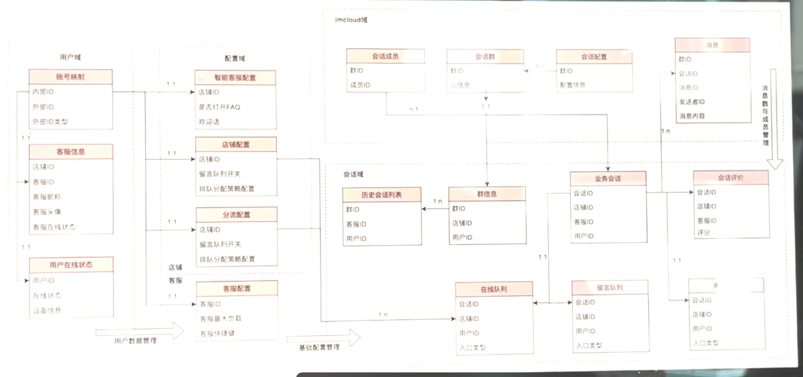
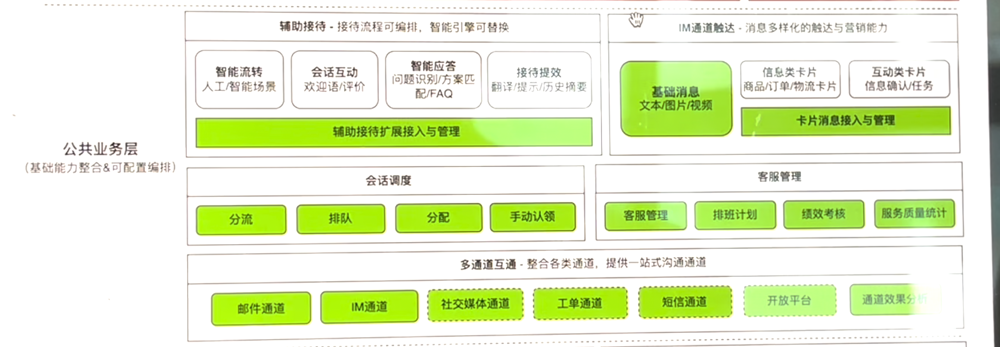
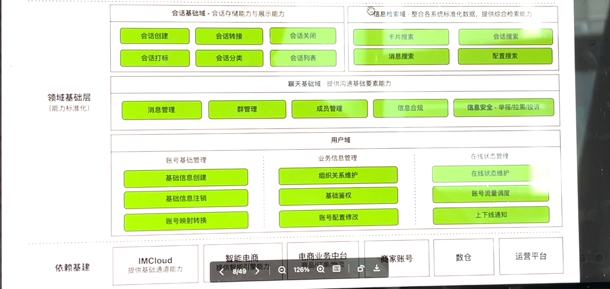
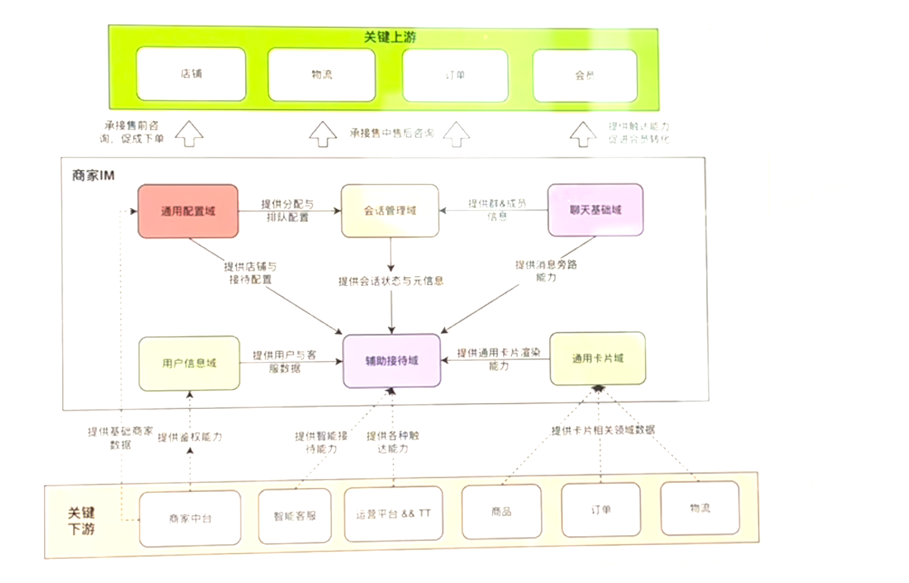
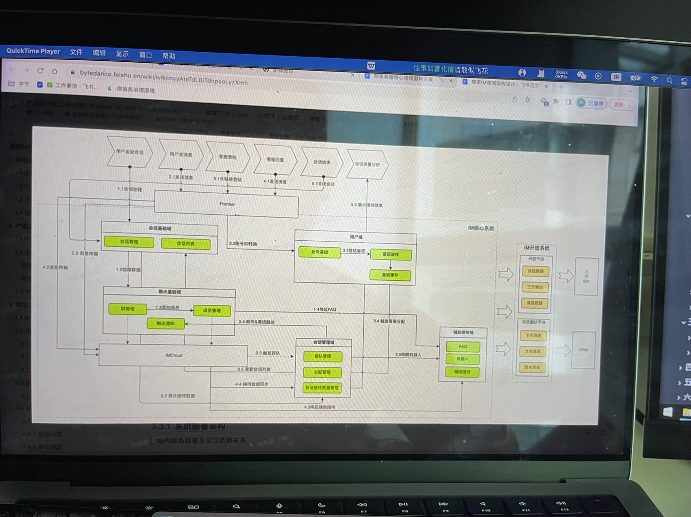
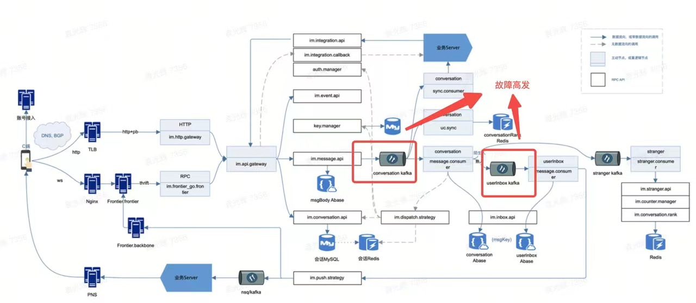

[toc]
# 商家IM（字节）

##  业务定位
为国际化电商提供通用客服能力与通道能力服务于商家客服，达人，会员，营销，物流等团队

- 为海外电商提供消息平台能力，支持基于IM通道用卡片，文本，图片，视频的方式触达用户，目前已为CRM团队
提供能力复用
- 为海外电商团队提供基础沟通工具复用，支持基于以群为单位的沟通场景实现能力复用，目前己为商达沟通场景
提供能力复用，最近正在支持达人客服场景以及商家与服务商的沟通
- 为海外电商团队提供通道能力复用，支持邮件等关键通道能力复用

##  业务场景
###  商家被动接待

- 售前阶段消费者通过商品详情页（商详页）店铺页主动联系与商家进行咨询，对商品以及商家活动优惠等进行咨询
- 售中与售后阶段消费者通过物流页面，订单页对商家发起咨询，该场最主要涉及到退货退款，物流咨询等问题
- 消费者发起咨询后，初期会有智能客服进行接待，同时会触发排队与分配逻辑将消费者按一定均衡调度策路分配到客服头上
- 系统会搜集客服的按待过程的细节并且计算出其24小时回复率与满惹率透出到治理与客服主管侧，让平台考核商家，商家考核客服，压力层层传递，促使客服提高响应速度与质量

###  商家主动触达
商家只允许通过订单、客服后台页面对三天内用户主动发起咨询的用户进行触达

##  领域模型

###  架构分层

#### 领域基础层：能力标准化，逻辑趋于稳定

基于领域实体提供稳定的基础能力，并提供租户无关的原子接口

##### 聊天基础域
负责底层通讯能力的实现，其中包含
- IM通道能力
- 邮件通道能力
- 开放平台通道能力
- 商线通道能力
- 触达能力

`职责：`

- 负责消息群整个周期与数据的维护
- 负责聊天消息的收发能力实现与消息类型的整体把控与统筹
- 会话成员管理，包含但不限于权限
- im通道与邮件通道的管理与维护

##### 会话基础域
- 负责会话生命周期一切行为的管理与维护包括但不限于：
会话创建，分配，消亡
- 负责会话信息管理能力

`职责：`

- 会话列表的维护与更新通知
- 发送对应领域事件
- 基础会话状态的维护，创建、状态流转、过期消亡、评价、留言

##### 用户域
负责一切用户相关的数据生命周期维护包括但不限于账号映射，流量调度，上线通知等能力

`职责：`

- 完成用户数据的生命周期管理包括但不限于创建/注销用户数据，维护用戸信息
- 完成用户请求基础鉴权与角色管理
- 负责用户登陆状态的维护与流量的调度

##### 信息检索域
负责IM系统一切消息，会话，配置等数据搜索能力建设

`职责：`

- 消息检索
- 会话检索
- 配置检索
- 订单检索

#### 公共业务层：可复用，支持业务差异化
- 提供主要业务场景服务，包括如支持不同租户问的接待流程编排与分配流程编排
- 聚合领域基础能力，构建业务上可复用的策略能力，通过配置、编排等形式快速为业务提供复用

##### IM触达域
负责消息离线触达、邮件触达、长链触达等能力集合

提供通用的触达能力

##### 会话调度域

- 负责会话相关数据的统计与透出包括如：接待数据统计，客服考核．店铺考核
- 负责排队与客服分配调度能力实现

`职责：`

- 会话排队
- 会话分配
- 在线队列、离线队列、留言队列的数据流转

##### 辅助接待域
- 负责由消息触发作为源头的处理场景（会话相关除外）
- 负责接待与触达强相关场景包括但不限于智能机器人、自动接待
- 作为数据开放网关，将整个IM系统的消息，会话等数据与能力开放到第三方系统

`职责：`

- 消费IMCloud的在线消息记录、商线消息推送
- 对买家消息进行自动回复 （FAQ、全自动机器人、辅助回复、非工作时间自动回复）
- 消息触达
  - Ann Puch 、邮件、 IMCloud 、 Frontier
- 作为数据网关开放IM系统的会话能力，消息能力与业务能力

## IMCloud
两个关键点：保证消息不丢失、有序

### 入口
imcloud提供了长链接和短链接，短链接主要用来初始化sdk和配置相关的，长链接主要用来收发信息

长链接如果失败，可以用短链接去进行兜底行为

长短链接都提供了相应的网关，然后统一由api.gateway去承接，相当于防腐层，统一适配，隐藏入口细节。

### MQ
两个mq，一个是会话链MQ，保证消息入链，就是一个会话有哪些消息，维护消息的顺序，

通过abase（底层是leveldb）去存储消息，利用abase的特性，通过前缀匹配去存储消息。

#### 单链
同时消息有个index，index是递增的，同一个会话的消息会发送到同一个partition，一个partiton只能给一个消费者消息，这样就可以保证消息的有序。

同时保证旧消息消费失败的话不会消息新的消息（引来一个问题：如果消息一直消费失败）

单链里只会存储消息的元数据信息，消息体是存储在abase，这样可以节省空间

消息存储之后，需要将消息通知到群里面的成员

为什么需要单链：

#### 混链
读扩散、写扩散。

对于目前的群模式，成员小，都是通过写扩散（比如微信也是使用这种模式），现有并没有支持超大群

每个用户会有一个链，这个也是使用abase去存储用户唯独的数据

找到会话的所有成员，然后将信息依次存在成员的混链中，并将其发送到userInbox的混链mq中，此时会按照用户将信息发送到同一个partiton中，相同用户的信息发送到同一个partiton中，然后也是顺序消费。

承载混链的qps是，消费一个消息耗时是20ms，那个一个partion的qps是50，如果有100个partiton，那么就是5000qps

为什么需要混链：

**消息不丢失：**
消费者在消费消息的时候，消费者本地会存储最后的index，新消息也会带有preIndex，消费者本地会判断preIndex跟本地最新的index是否一致，如果不一致，那么就是认为这个消息是丢失的，就会去混链（也就是abase）拉取数据

#### 会话列表
会话列表也是通过混链去做的

**最近会话列表：**
通过redis的zset，当会话有新消息的，会有单独的一个consumer，更新活跃会话列表，消费消息，判断是哪个用户的会话列表，然后进行更新

**初始化：**
拉取活跃会话列表，通过会话列表去啦取数据

PC两种方案：
- 一种是拉单链
- 一种是拉混链，通过混链消息还原会话列表

app：
- 拉混链补消息，构建本地数据库

#### CRM
**问题：热点问题**
由于是给一个店铺的粉丝发消息，粉丝可能会有上百万，单链由于是会话维度，所以是没有问题的，混链由于是用户的消息都发送到同一个partition，那么店铺也会收到消息，那么店铺就都会收到消息，发送给店铺的消息都会发送到同一个partition，会堵住。

**解决方案：**
- 短期方案
  - 检测到有热点用户的时候，按照会话处理
- 长期方案
  - 热点问题都是因为混链mq都是用户都到同一个partition，那么这里如果有阻塞的话或者快速发送消息的或者单机故障也会在这里堵住了
  - 优化方式
    - 一个consumer可以消费多个partition，并行消费，那么就会有乱序问题，这里是使用到rmq5.0（pop消费模式）的特性，**不顺序消费，乱序消费**
    - 保证有序：
      - 由于之前是发送到单链后才确定index，本地生成，一个partition只给一个consumer消费，但是乱序消费消费就需要给一个全局的递增index的id，以会话纬度单调递增。
      - 由于乱序消费，所以需要分布式生成 index，保证单调递增，使用redis的lua，同一个会话的index，取本地时间戳，看redis有没有缓存上一个消息的index，如果没有就使用当前时间戳，如果有，就比较一下，如果本地时间戳比上一个时间戳大，就用当前时间戳，否则给上一个时间戳加一个随机数，去保证它单调递增
      - 写混链由同一用户到同一个partition改成了乱序发送，这样后续的消息不丢失就是通过生成index和写用户的混链去保证，这两个步骤需要一个原子操作，因为生成index之后，如果写入用户混链失败的话，在用户层面就会有丢消息的情况。这个是通过lua去保障的，将这个操作变成redis，但是生成index是用redis，写混链是写abase，redis是通过这样去保障的，写混链是正常写，但是redis里面会保存一个混链（最近的一段），确保数据同步问题，如果发生丢消息的情况，去abase无法拉取到数据，就会去redis里的缓存中同步数据(补偿)。
      - 通过这个并行化，将热点、吞吐这些问题都解决了

可参考：
- https://learn.lianglianglee.com/%E6%96%87%E7%AB%A0/%E5%A6%82%E4%BD%95%E8%AE%BE%E8%AE%A1%E4%B8%80%E4%B8%AA%E4%BA%BF%E7%BA%A7%E6%B6%88%E6%81%AF%E9%87%8F%E7%9A%84%20IM%20%E7%B3%BB%E7%BB%9F.md
- https://cloud.tencent.com/developer/article/1849308
- https://juejin.cn/post/7156570668161564679