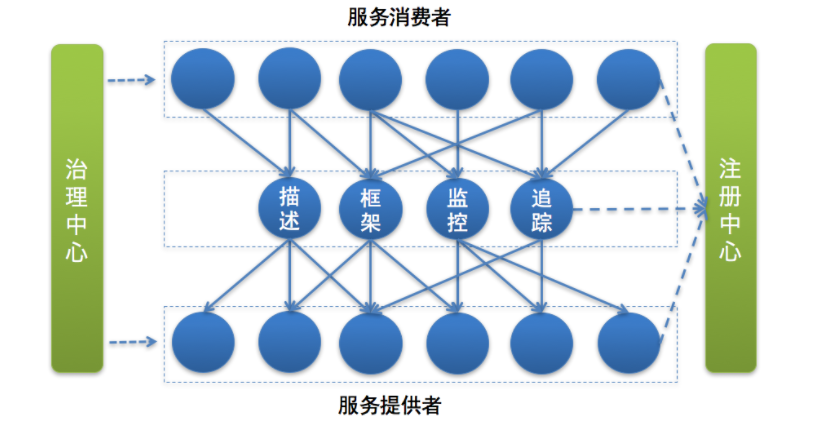
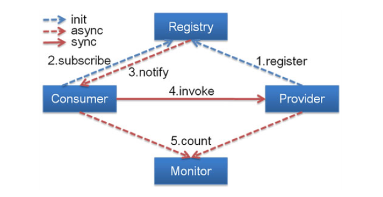
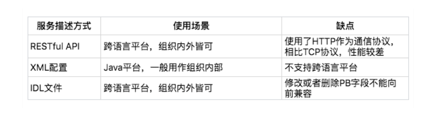
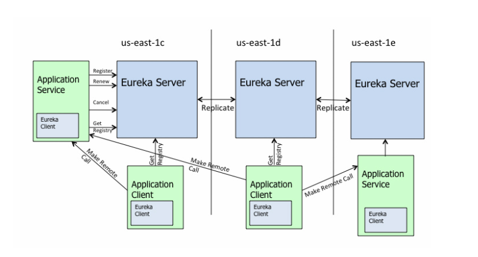
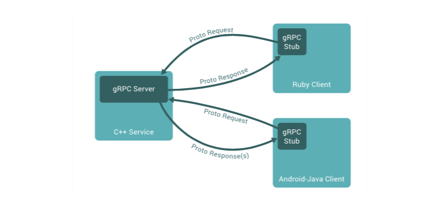
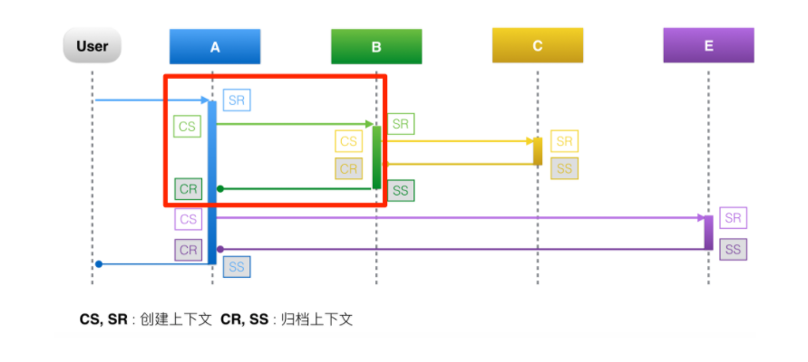
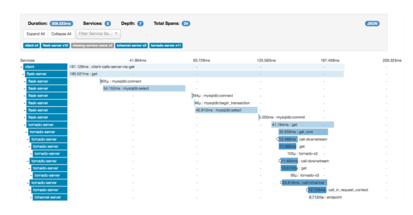

[toc]


# 架构知识


## 一、什么是SOA服务化

服务化就是把传统的单机应用中通过 JAR 包依赖产生的本地方法调用，改造成通过 RPC 接口产生的远程方法调用


## 二、微服务


### 1、特点

- **服务拆分粒度更细**。微服务可以说是更细维度的服务化，小到一个子模块，只要该模块依赖的资源与其他模块都没有关系，那么就可以拆分为一个微服务。
- **服务独立部署**。每个微服务都严格遵循独立打包部署的准则，互不影响。比如一台物理机上可以部署多个 Docker 实例，每个 Docker 实例可以部署一个微服务的代码。
- **服务独立维护**。每个微服务都可以交由一个小团队甚至个人来开发、测试、发布和运维，并对整个生命周期负责。
- **服务治理能力要求高**。因为拆分为微服务之后，服务的数量变多，因此需要有统一的服务治理平台，来对各个服务进行管理。


### 2、服务化拆分类型


**纵向拆分**，是从业务维度进行拆分。标准是按照业务的关联程度来决定，关联比较密切的业务适合拆分为一个微服务，而功能相对比较独立的业务适合单独拆分为一个微服务。


**横向拆分**，是从公共且独立功能维度拆分。标准是按照是否有公共的被多个其他服务调用，且依赖的资源独立不与其他业务耦合。


### 3、服务化拆分面临问题

- **服务如何定义**。对于单体应用来说，不同功能模块之前相互交互时，通常是以类库的方式来提供各个模块的功能。对于微服务来说，每个服务都运行在各自的进程之中，应该以何种形式向外界传达自己的信息呢？答案就是接口，无论采用哪种通讯协议，是 HTTP 还是 RPC，服务之间的调用都通过接口描述来约定，约定内容包括接口名、接口参数以及接口返回值。
- **服务如何发布和订阅**。单体应用由于部署在同一个 WAR 包里，接口之间的调用属于进程内的调用。而拆分为微服务独立部署后，服务提供者该如何对外暴露自己的地址，服务调用者该如何查询所需要调用的服务的地址呢？这个时候你就需要一个类似登记处的地方，能够记录每个服务提供者的地址以供服务调用者查询，在微服务架构里，这个地方就是注册中心。
- **服务如何监控**。通常对于一个服务，我们最关心的是 QPS（调用量）、AvgTime（平均耗时）以及 P999（99.9% 的请求性能在多少毫秒以内）这些指标。这时候你就需要一种通用的监控方案，能够覆盖业务埋点、数据收集、数据处理，最后到数据展示的全链路功能。
- **服务如何治理**。可以想象，拆分为微服务架构后，服务的数量变多了，依赖关系也变复杂了。比如一个服务的性能有问题时，依赖的服务都势必会受到影响。可以设定一个调用性能阈值，如果一段时间内一直超过这个值，那么依赖服务的调用可以直接返回，这就是熔断，也是服务治理最常用的手段之一。
- **故障如何定位**。在单体应用拆分为微服务之后，一次用户调用可能依赖多个服务，每个服务又部署在不同的节点上，如果用户调用出现问题，你需要有一种解决方案能够将一次用户请求进行标记，并在多个依赖的服务系统中继续传递，以便串联所有路径，从而进行故障定位。


### 4、组件




首先服务提供者（就是提供服务的一方）按照一定格式的服务描述，向注册中心注册服务，声明自己能够提供哪些服务以及服务的地址是什么，完成服务发布。

接下来服务消费者（就是调用服务的一方）请求注册中心，查询所需要调用服务的地址，然后以约定的通信协议向服务提供者发起请求，得到请求结果后再按照约定的协议解析结果。

而且在服务的调用过程中，服务的请求耗时、调用量以及成功率等指标都会被记录下来用作监控，调用经过的链路信息会被记录下来，用于故障定位和问题追踪。在这期间，如果调用失败，可以通过重试等服务治理手段来保证成功率。


- 服务描述
- 注册中心
- 服务框架
- 服务监控
- 服务追踪
- 服务治理


（1）服务描述

服务的服务名叫什么？调用这个服务需要提供哪些信息？调用这个服务返回的结果是什么格式的？该如何解析？这些就是服务描述要解决的问题。

常用的服务描述方式包括 RESTful API、XML 配置以及 IDL 文件三种。


（2）注册中心

服务提供者将自己提供的服务以及地址登记到注册中心，服务消费者则从注册中心查询所需要调用的服务的地址，然后发起请求。

一般来讲，注册中心的工作流程是：

- 服务提供者在启动时，根据服务发布文件中配置的发布信息向注册中心注册自己的服务。
- 服务消费者在启动时，根据消费者配置文件中配置的服务信息向注册中心订阅自己所需要的服务。
- 注册中心返回服务提供者地址列表给服务消费者。
- 当服务提供者发生变化，比如有节点新增或者销毁，注册中心将变更通知给服务消费者。




（3）服务框架

- **服务通信采用什么协议？**就是说服务提供者和服务消费者之间以什么样的协议进行网络通信，是采用四层 TCP、UDP 协议，还是采用七层 HTTP 协议，还是采用其他协议？
- **数据传输采用什么方式？**就是说服务提供者和服务消费者之间的数据传输采用哪种方式，是同步还是异步，是在单连接上传输，还是多路复用。
- **数据压缩采用什么格式？**通常数据传输都会对数据进行压缩，来减少网络传输的数据量，从而减少带宽消耗和网络传输时间，比如常见的 JSON 序列化、Java 对象序列化以及 Protobuf 序列化等。


（4）服务监控

- **指标收集。**就是要把每一次服务调用的请求耗时以及成功与否收集起来，并上传到集中的数据处理中心。
- **数据处理。**有了每次调用的请求耗时以及成功与否等信息，就可以计算每秒服务请求量、平均耗时以及成功率等指标。
- **数据展示。**数据收集起来，经过处理之后，还需要以友好的方式对外展示，才能发挥价值。通常都是将数据展示在 Dashboard 面板上，并且每隔 10s 等间隔自动刷新，用作业务监控和报警等。


（5）服务追踪

工作原理大致如下：

- 服务消费者发起调用前，会在本地按照一定的规则生成一个 requestid，发起调用时，将 requestid 当作请求参数的一部分，传递给服务提供者。
- 服务提供者接收到请求后，记录下这次请求的 requestid，然后处理请求。如果服务提供者继续请求其他服务，会在本地再生成一个自己的 requestid，然后把这两个 requestid 都当作请求参数继续往下传递。


通用的组件有Zipkin、SkyWorking等，都是根据google的Dapper论文落地的


（6）服务治理

服务治理就是通过一系列的手段来保证在各种意外情况下，服务调用仍然能够正常进行。

在生产环境中，你应该经常会遇到下面几种状况。

- **单机故障。**通常遇到单机故障，都是靠运维发现并重启服务或者从线上摘除故障节点。然而集群的规模越大，越是容易遇到单机故障，在机器规模超过一百台以上时，靠传统的人肉运维显然难以应对。而服务治理可以通过一定的策略，自动摘除故障节点，不需要人为干预，就能保证单机故障不会影响业务。
- **单 IDC 故障。**你应该经常听说某某 App，因为施工挖断光缆导致大批量用户无法使用的严重故障。而服务治理可以通过自动切换故障 IDC 的流量到其他正常 IDC，可以避免因为单 IDC 故障引起的大批量业务受影响。
- **依赖服务不可用。**比如你的服务依赖依赖了另一个服务，当另一个服务出现问题时，会拖慢甚至拖垮你的服务。而服务治理可以通过熔断，在依赖服务异常的情况下，一段时期内停止发起调用而直接返回。这样一方面保证了服务消费者能够不被拖垮，另一方面也给服务提供者减少压力，使其能够尽快恢复。


### 5、如何发布和引用服务

**服务提供者如何发布一个服务，服务消费者如何引用这个服务**

最常见的服务发布和引用的方式有三种：

- RESTful API
- XML 配置
- IDL 文件


#### （1）XML配置

例如Dubbo

这种方式的服务发布和引用主要分三个步骤：

- 服务提供者定义接口，并实现接口。
- 服务提供者进程启动时，通过加载 server.xml 配置文件将接口暴露出去。
- 服务消费者进程启动时，通过加载 client.xml 配置文件来引入要调用的接口。

通过在服务提供者和服务消费者之间维持一份对等的 XML 配置文件，来保证服务消费者按照服务提供者的约定来进行服务调用。

在这种方式下，如果服务提供者变更了接口定义，不仅需要更新服务提供者加载的接口描述文件 server.xml，还需要同时更新服务消费者加载的接口描述文件 client.xml。

一般是私有 RPC 框架会选择 XML 配置这种方式来描述接口，因为私有 RPC 协议的性能要比 HTTP 协议高，所以在对性能要求比较高的场景下，采用 XML 配置的方式比较合适。但这种方式对业务代码侵入性比较高，XML 配置有变更的时候，服务消费者和服务提供者都要更新，所以适合公司内部联系比较紧密的业务之间采用。如果要应用到跨部门之间的业务调用，一旦有 XML 配置变更，需要花费大量精力去协调不同部门做升级工作。


#### （2）IDL文件

例如Protobuf、Thrift

IDL 就是接口描述语言（interface description language）的缩写，通过一种中立的方式来描述接口，使得在不同的平台上运行的对象和不同语言编写的程序可以相互通信交流。比如你用 Java 语言实现提供的一个服务，也能被 PHP 语言调用。

主要是**用作跨语言平台的服务之间的调用**，有两种最常用的 IDL：一个是 Facebook 开源的**Thrift 协议**，另一个是 Google 开源的**gRPC 协议**。无论是 Thrift 协议还是 gRPC 协议，它们的工作原理都是类似的。

有一点特别需要注意的是，在描述接口定义时，IDL 文件需要对接口返回值进行详细定义。如果接口返回值的字段比较多，并且经常变化时，采用 IDL 文件方式的接口定义就不太合适了。一方面可能会造成 IDL 文件过大难以维护，另一方面只要 IDL 文件中定义的接口返回值有变更，都需要同步所有的服务消费者都更新，管理成本就太高了。





#### 注意点：

在业务具体实践过程中可能会遇到引用服务的服务消费者众多，对业务的敏感度参差不齐的问题，所以在服务发布的时候，最好预定义好接口的各种配置。在服务规模不大，业务比较简单的时候，这样做比较合适。但是对于复杂业务，虽然服务发布时预定义好接口的各种配置，但在引用的服务消费者众多且同时访问的时候，可能会引起网络风暴。这种情况下，比较保险的方式是，把接口的各种配置放在服务引用配置文件里。

在进行服务配置升级过程时，要考虑好步骤，在所有服务消费者完成升级之前，服务提供者还不能把服务的详细信息去掉，否则可能会导致没有升级的服务消费者引用异常。


### 6、如何注册和发现服务

在微服务架构下，主要有三种角色：服务提供者（RPC Server）、服务消费者（RPC Client）和服务注册中心（Registry），三者的交互关系请看下面这张图，我来简单解释一下。

- RPC Server 提供服务，在启动时，根据服务发布文件 server.xml 中的配置的信息，向 Registry 注册自身服务，并向 Registry 定期发送心跳汇报存活状态。
- RPC Client 调用服务，在启动时，根据服务引用文件 client.xml 中配置的信息，向 Registry 订阅服务，把 Registry 返回的服务节点列表缓存在本地内存中，并与 RPC Sever 建立连接。
- 当 RPC Server 节点发生变更时，Registry 会同步变更，RPC Client 感知后会刷新本地内存中缓存的服务节点列表。
- RPC Client 从本地缓存的服务节点列表中，基于负载均衡算法选择一台 RPC Sever 发起调用。


注册中心一般采用分布式集群部署，来保证高可用性，并且为了实现异地多活，有的注册中心还采用多 IDC 部署，这就对数据一致性产生了很高的要求，这些都是注册中心在实现时必须要解决的问题。


**注册中心实现方式**

注册中心的实现主要涉及几个问题：注册中心需要提供哪些接口，该如何部署；如何存储服务信息；如何监控服务提供者节点的存活；如果服务提供者节点有变化如何通知服务消费者，以及如何控制注册中心的访问权限。

**1. 注册中心 API**

根据注册中心原理的描述，注册中心必须提供以下最基本的 API，例如：

- 服务注册接口：服务提供者通过调用服务注册接口来完成服务注册。
- 服务反注册接口：服务提供者通过调用服务反注册接口来完成服务注销。
- 心跳汇报接口：服务提供者通过调用心跳汇报接口完成节点存活状态上报。
- 服务订阅接口：服务消费者通过调用服务订阅接口完成服务订阅，获取可用的服务提供者节点列表。
- 服务变更查询接口：服务消费者通过调用服务变更查询接口，获取最新的可用服务节点列表。

除此之外，为了便于管理，注册中心还必须提供一些后台管理的 API，例如：

- 服务查询接口：查询注册中心当前注册了哪些服务信息。
- 服务修改接口：修改注册中心中某一服务的信息。


**2. 集群部署**

注册中心作为服务提供者和服务消费者之间沟通的桥梁，它的重要性不言而喻。所以注册中心一般都是采用集群部署来保证高可用性，并通过分布式一致性协议来确保集群中不同节点之间的数据保持一致。


**3. 目录存储**

例如zookeeper


**4. 服务健康状态检测**

注册中心除了要支持最基本的服务注册和服务订阅功能以外，还必须具备对服务提供者节点的健康状态检测功能，这样才能保证注册中心里保存的服务节点都是可用的。


**5. 服务状态变更通知**

一旦注册中心探测到有服务提供者节点新加入或者被剔除，就必须立刻通知所有订阅该服务的服务消费者，刷新本地缓存的服务节点信息，确保服务调用不会请求不可用的服务提供者节点。

**6. 白名单机制**

在实际应用中，注册中心可以提供一个白名单机制，只有添加到注册中心白名单内的 RPC Server，才能够调用注册中心的注册接口，这样的话可以避免测试环境中的节点意外跑到线上环境中去。


#### 注意：

1、多注册中心

对于服务消费者来说，要能够同时从多个注册中心订阅服务；对于服务提供者来说，要能够同时向多个注册中心注册服务。


2、并行订阅服务


3、批量反注册服务


4、服务变更信息增量更新

服务消费者端启动时，除了会查询订阅服务的可用节点列表做初始化连接，还会订阅服务的变更，每隔一段时间从注册中心获取最新的服务节点信息标记 sign，并与本地保存的 sign 值作比对，如果不一样，就会调用注册中心获取最新的服务节点信息。

为了减少服务消费者从注册中心中拉取的服务可用节点信息的数据量，这个时候可以通过增量更新的方式，注册中心只返回变化的那部分节点信息，尤其在只有少数节点信息变更时，此举可以大大减少服务消费者从注册中心拉取的数据量，从而最大程度避免产生网络风暴。


#### 选型：

当下主流的服务注册与发现的解决方案，主要有两种：

- 应用内注册与发现：注册中心提供服务端和客户端的 SDK，业务应用通过引入注册中心提供的 SDK，通过 SDK 与注册中心交互，来实现服务的注册和发现。
- 应用外注册与发现：业务应用本身不需要通过 SDK 与注册中心打交道，而是通过其他方式与注册中心交互，间接完成服务注册与发现。

应用内的解决方案一般适用于服务提供者和服务消费者同属于一个技术体系；应用外的解决方案一般适合服务提供者和服务消费者采用了不同技术体系的业务场景

对于容器化后的云应用来说，一般不适合采用应用内 SDK 的解决方案，因为这样会侵入业务，而应用外的解决方案正好能够解决这个问题。


应用内：

比如Eureka



它主要由三个重要的组件组成：

- Eureka Server：注册中心的服务端，实现了服务信息注册、存储以及查询等功能。
- 服务端的 Eureka Client：集成在服务端的注册中心 SDK，服务提供者通过调用 SDK，实现服务注册、反注册等功能。
- 客户端的 Eureka Client：集成在客户端的注册中心 SDK，服务消费者通过调用 SDK，实现服务订阅、服务更新等功能。


应用外：

最典型的案例是开源注册中心 Consul


 Consul 实现应用外服务注册和发现主要依靠三个重要的组件：

- Consul：注册中心的服务端，实现服务注册信息的存储，并提供注册和发现服务。
- [Registrator](https://github.com/gliderlabs/registrator)：一个开源的第三方服务管理器项目，它通过监听服务部署的 Docker 实例是否存活，来负责服务提供者的注册和销毁。
- [Consul Template](https://github.com/hashicorp/consul-template)：定时从注册中心服务端获取最新的服务提供者节点列表并刷新 LB 配置（比如 Nginx 的 upstream），这样服务消费者就通过访问 Nginx 就可以获取最新的服务提供者信息。


注册中心需要关注两个方面：一个是高可用性、一个是数据一致性


注册中心一般采用分布式集群部署，也面临着 CAP 的问题，根据 CAP 不能同时满足，所以不同的注册中心解决方案选择的方向也就不同，大致可分为两种。

- CP 型注册中心，牺牲可用性来保证数据强一致性，最典型的例子就是 ZooKeeper，etcd，Consul 了。ZooKeeper 集群内只有一个 Leader，而且在 Leader 无法使用的时候通过 Paxos 算法选举出一个新的 Leader。这个 Leader 的目的就是保证写信息的时候只向这个 Leader 写入，Leader 会同步信息到 Followers，这个过程就可以保证数据的强一致性。但如果多个 ZooKeeper 之间网络出现问题，造成出现多个 Leader，发生脑裂的话，注册中心就不可用了。而 etcd 和 Consul 集群内都是通过 raft 协议来保证强一致性，如果出现脑裂的话， 注册中心也不可用。
- AP 型注册中心，牺牲一致性来保证可用性，最典型的例子就是 Eureka 了。对比下 Zookeeper，Eureka 不用选举一个 Leader，每个 Eureka 服务器单独保存服务注册地址，因此有可能出现数据信息不一致的情况。但是当网络出现问题的时候，每台服务器都可以完成独立的服务。


### 7、如何实现RPC远程服务调用

需要解决四个问题：

- 客户端和服务端如何建立网络连接？

  - http或者socket

- 服务端如何处理请求？

  - bio、nio、aio

- 数据传输采用什么协议？

  - http、dubbo等

    通常协议契约包括两个部分：消息头和消息体。其中消息头存放的是协议的公共字段以及用户扩展字段，消息体存放的是传输数据的具体内容。

- 数据该如何序列化和反序列化？

  - 常用的序列化方式分为两类：文本类如 XML/JSON 等，二进制类如 PB/Thrift 等，而具体采用哪种序列化方式，主要取决于三个方面的因素。
    - 支持数据结构类型的丰富度。数据结构种类支持的越多越好，这样的话对于使用者来说在编程时更加友好，有些序列化框架如 Hessian 2.0 还支持复杂的数据结构比如 Map、List 等。
    - 跨语言支持。序列化方式是否支持跨语言也是一个很重要的因素，否则使用的场景就比较局限，比如 Java 序列化只支持 Java 语言，就不能用于跨语言的服务调用了。
    - 性能。主要看两点，一个是序列化后的压缩比，一个是序列化的速度。以常用的 PB 序列化和 JSON 序列化协议为例来对比分析，PB 序列化的压缩比和速度都要比 JSON 序列化高很多，所以对性能和存储空间要求比较高的系统选用 PB 序列化更合适；而 JSON 序列化虽然性能要差一些，但可读性更好，更适合对外部提供服务。


#### RPC选型：

主要分为两类：一类是跟某种特定语言平台绑定的，另一类是与语言无关即跨语言平台的。

跟语言平台绑定的开源 RPC 框架主要有下面几种。

- Dubbo：国内最早开源的 RPC 框架，由阿里巴巴公司开发并于 2011 年末对外开源，仅支持 Java 语言。
- Motan：微博内部使用的 RPC 框架，于 2016 年对外开源，仅支持 Java 语言。
- Tars：腾讯内部使用的 RPC 框架，于 2017 年对外开源，仅支持 C++ 语言。
- Spring Cloud：国外 Pivotal 公司 2014 年对外开源的 RPC 框架，仅支持 Java 语言，最近几年生态发展得比较好，是比较火的 RPC 框架。

而跨语言平台的开源 RPC 框架主要有以下几种。

- gRPC：Google 于 2015 年对外开源的跨语言 RPC 框架，支持常用的 C++、Java、Python、Go、Ruby、PHP、Android Java、Objective-C 等多种语言。
- Thrift：最初是由 Facebook 开发的内部系统跨语言的 RPC 框架，2007 年贡献给了 Apache 基金，成为 Apache 开源项目之一，支持常用的 C++、Java、PHP、Python、Ruby、Erlang 等多种语言。


gRPC：

通过 IDL（Interface Definition Language）文件定义服务接口的参数和返回值类型，然后通过代码生成程序生成服务端和客户端的具体实现代码，这样在 gRPC 里，客户端应用可以像调用本地对象一样调用另一台服务器上对应的方法。




它的主要特性包括三个方面。

- 通信协议采用了 HTTP/2，因为 HTTP/2 提供了连接复用、双向流、服务器推送、请求优先级、首部压缩等机制，所以在通信过程中可以节省带宽、降低 TCP 连接次数、节省 CPU，尤其对于移动端应用来说，可以帮助延长电池寿命。
- IDL 使用了[ProtoBuf](https://developers.google.com/protocol-buffers/docs/overview)，ProtoBuf 是由 Google 开发的一种数据序列化协议，它的压缩和传输效率极高，语法也简单，所以被广泛应用在数据存储和通信协议上。
- 多语言支持，能够基于多种语言自动生成对应语言的客户端和服务端的代码。


Thrift：

Thrift 是一种轻量级的跨语言 RPC 通信方案，支持多达 25 种编程语言。为了支持多种语言，跟 gRPC 一样，Thrift 也有一套自己的接口定义语言 IDL，可以通过代码生成器，生成各种编程语言的 Client 端和 Server 端的 SDK 代码，这样就保证了不同语言之间可以相互通信。它的架构图可以用下图来描述。


从这张图上可以看出 Thrift RPC 框架的特性。

- 支持多种序列化格式：如 Binary、Compact、JSON、Multiplexed 等。
- 支持多种通信方式：如 Socket、Framed、File、Memory、zlib 等。
- 服务端支持多种处理方式：如 Simple 、Thread Pool、Non-Blocking 等。


### 8、如何监控微服务调用

三个问题：

1. 监控的对象是什么？
2. 具体监控哪些指标？
3. 从哪些维度进行监控？


#### （1）监控对象

监控对象可以分为四个层次，由上到下可归纳为：

- 用户端监控。通常是指业务直接对用户提供的功能的监控。以微博首页 Feed 为例，它向用户提供了聚合关注的所有人的微博并按照时间顺序浏览的功能，对首页 Feed 功能的监控就属于用户端的监控。
- 接口监控。通常是指业务提供的功能所依赖的具体 RPC 接口的监控。继续以微博首页 Feed 为例，这个功能依赖于用户关注了哪些人的关系服务，每个人发过哪些微博的微博列表服务，以及每条微博具体内容是什么的内容服务，对这几个服务的调用情况的监控就属于接口监控。
- 资源监控。通常是指某个接口依赖的资源的监控。比如用户关注了哪些人的关系服务使用的是 Redis 来存储关注列表，对 Redis 的监控就属于资源监控。
- 基础监控。通常是指对服务器本身的健康状况的监控。主要包括 CPU 利用率、内存使用量、I/O 读写量、网卡带宽等。对服务器的基本监控也是必不可少的，因为服务器本身的健康状况也是影响服务本身的一个重要因素，比如服务器本身连接的网络交换机上联带宽被打满，会影响所有部署在这台服务器上的业务。


#### （2）监控指标

通常有以下几个业务指标需要重点监控：

- 请求量。请求量监控分为两个维度，一个是实时请求量，一个是统计请求量。实时请求量用 QPS（Queries Per Second）即每秒查询次数来衡量，它反映了服务调用的实时变化情况。统计请求量一般用 PV（Page View）即一段时间内用户的访问量来衡量，比如一天的 PV 代表了服务一天的请求量，通常用来统计报表。
- 响应时间。大多数情况下，可以用一段时间内所有调用的平均耗时来反映请求的响应时间。但它只代表了请求的平均快慢情况，有时候我们更关心慢请求的数量。为此需要把响应时间划分为多个区间，比如 0～10ms、10ms～50ms、50ms～100ms、100ms～500ms、500ms 以上这五个区间，其中 500ms 以上这个区间内的请求数就代表了慢请求量，正常情况下，这个区间内的请求数应该接近于 0；在出现问题时，这个区间内的请求数会大幅增加，可能平均耗时并不能反映出这一变化。除此之外，还可以从 P90、P95、P99、P999 角度来监控请求的响应时间，比如 P99 = 500ms，意思是 99% 的请求响应时间在 500ms 以内，它代表了请求的服务质量，即 SLA。
- 错误率。错误率的监控通常用一段时间内调用失败的次数占调用总次数的比率来衡量，比如对于接口的错误率一般用接口返回错误码为 503 的比率来表示。


#### （3）监控维度

具体来讲可以包括下面几个维度：

- 全局维度。从整体角度监控对象的的请求量、平均耗时以及错误率，全局维度的监控一般是为了让你对监控对象的调用情况有个整体了解。
- 分机房维度。一般为了业务的高可用性，服务通常部署在不止一个机房，因为不同机房地域的不同，同一个监控对象的各种指标可能会相差很大，所以需要深入到机房内部去了解。
- 单机维度。即便是在同一个机房内部，可能由于采购年份和批次的不同，位于不同机器上的同一个监控对象的各种指标也会有很大差异。一般来说，新采购的机器通常由于成本更低，配置也更高，在同等请求量的情况下，可能表现出较大的性能差异，因此也需要从单机维度去监控同一个对象。
- 时间维度。同一个监控对象，在每天的同一时刻各种指标通常也不会一样，这种差异要么是由业务变更导致，要么是运营活动导致。为了了解监控对象各种指标的变化，通常需要与一天前、一周前、一个月前，甚至三个月前做比较。
- 核心维度。根据我的经验，业务上一般会依据重要性程度对监控对象进行分级，最简单的是分成核心业务和非核心业务。核心业务和非核心业务在部署上必须隔离，分开监控，这样才能对核心业务做重点保障。


#### **监控系统：**

**监控系统主要包括四个环节：数据采集、数据传输、数据处理和数据展示**

**1. 数据采集**

通常有两种数据收集方式：

- 服务主动上报，这种处理方式通过在业务代码或者服务框架里加入数据收集代码逻辑，在每一次服务调用完成后，主动上报服务的调用信息。
- 代理收集，这种处理方式通过服务调用后把调用的详细信息记录到本地日志文件中，然后再通过代理去解析本地日志文件，然后再上报服务的调用信息。

无论哪种数据采集方式，首先要考虑的问题就是采样率，也就是采集数据的频率。采样率决定了监控的实时性与精确度，一般来说，采样率越高，监控的实时性就越高，精确度也越高。但采样对系统本身的性能也会有一定的影响，尤其是采集后的数据需要写到本地磁盘的时候，过高的采样率会导致系统写入磁盘的 I/O 过高，进而会影响到正常的服务调用。所以设置合理的采用率是数据采集的关键，最好是可以动态控制采样率，在系统比较空闲的时候加大采样率，追求监控的实时性与精确度；在系统负载比较高的时候减小采样率，追求监控的可用性与系统的稳定性。

**2. 数据传输**

数据传输最常用的方式有两种：

- UDP 传输，这种处理方式是数据处理单元提供服务器的请求地址，数据采集后通过 UDP 协议与服务器建立连接，然后把数据发送过去。
- Kafka 传输，这种处理方式是数据采集后发送到指定的 Topic，然后数据处理单元再订阅对应的 Topic，就可以从 Kafka 消息队列中读取到对应的数据。

无论采用哪种传输方式，数据格式都十分重要，尤其是对带宽敏感以及解析性能要求比较高的场景，一般数据传输时采用的数据格式有两种：

- 二进制协议，最常用的就是 PB 对象，它的优点是高压缩比和高性能，可以减少传输带宽并且序列化和反序列化效率特别高。
- 文本协议，最常用的就是 JSON 字符串，它的优点是可读性好，但相比于 PB 对象，传输占用带宽高，并且解析性能也要差一些。

**3. 数据处理**

数据处理是对收集来的原始数据进行聚合并存储。数据聚合通常有两个维度：

- 接口维度聚合，这个维度是把实时收到的数据按照接口名维度实时聚合在一起，这样就可以得到每个接口的实时请求量、平均耗时等信息。
- 机器维度聚合，这个维度是把实时收到的数据按照调用的节点维度聚合在一起，这样就可以从单机维度去查看每个接口的实时请求量、平均耗时等信息。

聚合后的数据需要持久化到数据库中存储，所选用的数据库一般分为两种：

- 索引数据库，比如 Elasticsearch，以倒排索引的数据结构存储，需要查询的时候，根据索引来查询。
- 时序数据库，比如 OpenTSDB，以时序序列数据的方式存储，查询的时候按照时序如 1min、5min 等维度来查询。

**4. 数据展示**

数据展示是把处理后的数据以 Dashboard 的方式展示给用户。数据展示有多种方式，比如曲线图、饼状图、格子图展示等。


目前，比较流行的开源监控系统实现方案主要有两种：以[ELK](https://www.elastic.co/cn/)为代表的集中式日志解决方案，以及[Graphite](http://graphite.readthedocs.io/en/latest/index.html)、[TICK](https://www.influxdata.com/time-series-platform/)和[Prometheus](https://prometheus.io/)等为代表的时序数据库解决方案。


ELK：

ELK 是 Elasticsearch、Logstash、Kibana 三个开源软件产品首字母的缩写，它们三个通常配合使用，所以被称为 ELK Stack，它的架构可以用下面的图片来描述。


这三个软件的功能也各不相同。

- Logstash 负责数据收集和传输，它支持动态地从各种数据源收集数据，并对数据进行过滤、分析、格式化等，然后存储到指定的位置。
- Elasticsearch 负责数据处理，它是一个开源分布式搜索和分析引擎，具有可伸缩、高可靠和易管理等特点，基于 Apache Lucene 构建，能对大容量的数据进行接近实时的存储、搜索和分析操作，通常被用作基础搜索引擎。
- Kibana 负责数据展示，也是一个开源和免费的工具，通常和 Elasticsearch 搭配使用，对其中的数据进行搜索、分析并且以图表的方式展示。

这种架构因为需要在各个服务器上部署 Logstash 来从不同的数据源收集数据，所以比较消耗 CPU 和内存资源，容易造成服务器性能下降，因此后来又在 Elasticsearch、Logstash、Kibana 之外引入了 Beats 作为数据收集器。相比于 Logstash，Beats 所占系统的 CPU 和内存几乎可以忽略不计，可以安装在每台服务器上做轻量型代理，从成百上千或成千上万台机器向 Logstash 或者直接向 Elasticsearch 发送数据。

其中，Beats 支持多种数据源，主要包括：

- Packetbeat，用来收集网络流量数据。
- Topbeat，用来收集系统、进程的 CPU 和内存使用情况等数据。
- Filebeat，用来收集文件数据。
- Winlogbeat，用来收集 Windows 事件日志收据。

Beats 将收集到的数据发送到 Logstash，经过 Logstash 解析、过滤后，再将数据发送到 Elasticsearch，最后由 Kibana 展示，架构就变成下面这张图里描述的了。


Graphite：

Graphite 的组成主要包括三部分：Carbon、Whisper、Graphite-Web，它的架构可以用下图来描述。

- Carbon：主要作用是接收被监控节点的连接，收集各个指标的数据，将这些数据写入 carbon-cache 并最终持久化到 Whisper 存储文件中去。
- Whisper：一个简单的时序数据库，主要作用是存储时间序列数据，可以按照不同的时间粒度来存储数据，比如 1 分钟 1 个点、5 分钟 1 个点、15 分钟 1 个点三个精度来存储监控数据。
- Graphite-Web：一个 Web App，其主要功能绘制报表与展示，即数据展示。为了保证 Graphite-Web 能及时绘制出图形，Carbon 在将数据写入 Whisper 存储的同时，会在 carbon-cache 中同时写入一份数据，Graphite-Web 会先查询 carbon-cache，如果没有再查询 Whisper 存储。


 Carbon 负责数据处理，Whisper 负责数据存储，Graphite-Web 负责数据展示，可见 Graphite 自身并不包含数据采集组件，但可以接入[StatsD](https://github.com/etsy/statsd)等开源数据采集组件来采集数据，再传送给 Carbon。


TICK：

TICK 是 Telegraf、InfluxDB、Chronograf、Kapacitor 四个软件首字母的缩写，是由 InfluxData 开发的一套开源监控工具栈，因此也叫作 TICK Stack，


Telegraf 负责数据收集，InfluxDB 负责数据存储，Chronograf 负责数据展示，Kapacitor 负责数据告警。

Prometheus：


Prometheus 主要包含下面几个组件：

- Prometheus Server：用于拉取 metrics 信息并将数据存储在时间序列数据库。
- Jobs/exporters：用于暴露已有的第三方服务的 metrics 给 Prometheus Server，比如 StatsD、Graphite 等，负责数据收集。
- Pushgateway：主要用于短期 jobs，由于这类 jobs 存在时间短，可能在 Prometheus Server 来拉取 metrics 信息之前就消失了，所以这类的 jobs 可以直接向 Prometheus Server 推送它们的 metrics 信息。
- Alertmanager：用于数据报警。
- Prometheus web UI：负责数据展示。

它的工作流程大致是：

- Prometheus Server 定期从配置好的 jobs 或者 exporters 中拉取 metrics 信息，或者接收来自 Pushgateway 发过来的 metrics 信息。
- Prometheus Server 把收集到的 metrics 信息存储到时间序列数据库中，并运行已经定义好的 alert.rules，向 Alertmanager 推送警报。
- Alertmanager 根据配置文件，对接收的警报进行处理，发出告警。
- 通过 Prometheus web UI 进行可视化展示。


- ELK 的技术栈比较成熟，应用范围也比较广，除了可用作监控系统外，还可以用作日志查询和分析。
- Graphite 是基于时间序列数据库存储的监控系统，并且提供了功能强大的各种聚合函数比如 sum、average、top5 等可用于监控分析，而且对外提供了 API 也可以接入其他图形化监控系统如 Grafana。
- TICK 的核心在于其时间序列数据库 InfluxDB 的存储功能强大，且支持类似 SQL 语言的复杂数据处理操作。
- Prometheus 的独特之处在于它采用了拉数据的方式，对业务影响较小，同时也采用了时间序列数据库存储，而且支持独有的 PromQL 查询语言，功能强大而且简洁。


### 9、如何追踪微服务调用

一次请求往往需要涉及多个服务，每个服务可能是由不同的团队开发，使用了不同的编程语言，还有可能部署在不同的机器上，分布在不同的数据中心。


**服务追踪的作用：**

**第一，优化系统瓶颈。**

通过记录调用经过的每一条链路上的耗时，我们能快速定位整个系统的瓶颈点在哪里。

**第二，优化链路调用。**

通过服务追踪可以分析调用所经过的路径，然后评估是否合理。比如一个服务调用下游依赖了多个服务，通过调用链分析，可以评估是否每个依赖都是必要的，是否可以通过业务优化来减少服务依赖。

**第三，生成网络拓扑。**

通过服务追踪系统中记录的链路信息，可以生成一张系统的网络调用拓扑图，它可以反映系统都依赖了哪些服务，以及服务之间的调用关系是什么样的，可以一目了然。除此之外，在网络拓扑图上还可以把服务调用的详细信息也标出来，也能起到服务监控的作用。

**第四，透明传输数据。**

除了服务追踪，业务上经常有一种需求，期望能把一些用户数据，从调用的开始一直往下传递，以便系统中的各个服务都能获取到这个信息。比如业务想做一些 A/B 测试，这时候就想通过服务追踪系统，把 A/B 测试的开关逻辑一直往下传递，经过的每一层服务都能获取到这个开关值，就能够统一进行 A/B 测试。


#### 服务追踪系统原理

各种服务追踪系统都是基于 Dapper 衍生出来的，比较有名的有 Twitter 的[Zipkin](http://zipkin.io)、阿里的[鹰眼](http://www.slideshare.net/terryice/eagleeye-with-taobaojavaone)、美团的[MTrace](http://tech.meituan.com/mt_mtrace.html)等。


- traceId，用于标识某一次具体的请求 ID。当用户的请求进入系统后，会在 RPC 调用网络的第一层生成一个全局唯一的 traceId，并且会随着每一层的 RPC 调用，不断往后传递，这样的话通过 traceId 就可以把一次用户请求在系统中调用的路径串联起来。
- spanId，用于标识一次 RPC 调用在分布式请求中的位置。当用户的请求进入系统后，处在 RPC 调用网络的第一层 A 时 spanId 初始值是 0，进入下一层 RPC 调用 B 的时候 spanId 是 0.1，继续进入下一层 RPC 调用 C 时 spanId 是 0.1.1，而与 B 处在同一层的 RPC 调用 E 的 spanId 是 0.2，这样的话通过 spanId 就可以定位某一次 RPC 请求在系统调用中所处的位置，以及它的上下游依赖分别是谁。
- annotation，用于业务自定义埋点数据，可以是业务感兴趣的想上传到后端的数据，比如一次请求的用户 UID。


#### 服务追踪系统实现


一个服务追踪系统可以分为三层。

- 数据采集层，负责数据埋点并上报。
- 数据处理层，负责数据的存储与计算。
- 数据展示层，负责数据的图形化展示。


**1. 数据采集层**

数据采集层的作用就是在系统的各个不同模块中进行埋点，采集数据并上报给数据处理层进行处理。




以红色方框里圈出的 A 调用 B 的过程为例，一次 RPC 请求可以分为四个阶段。

- CS（Client Send）阶段 : 客户端发起请求，并生成调用的上下文。
- SR（Server Recieve）阶段 : 服务端接收请求，并生成上下文。
- SS（Server Send）阶段 : 服务端返回请求，这个阶段会将服务端上下文数据上报，下面这张图可以说明上报的数据有：traceId=123456，spanId=0.1，appKey=B，method=B.method，start=103，duration=38。
- CR（Client Recieve）阶段 : 客户端接收返回结果，这个阶段会将客户端上下文数据上报，上报的数据有：traceid=123456，spanId=0.1，appKey=A，method=B.method，start=103，duration=38。


**2. 数据处理层**

数据处理层的作用就是把数据采集层上报的数据按需计算，然后落地存储供查询使用。

据我所知，数据处理的需求一般分为两类，一类是实时计算需求，一类是离线计算需求。

实时计算需求对计算效率要求比较高，一般要求对收集的链路数据能够在秒级别完成聚合计算，以供实时查询。而离线计算需求对计算效率要求就没那么高了，一般能在小时级别完成链路数据的聚合计算即可，一般用作数据汇总统计。针对这两类不同的数据处理需求，采用的计算方法和存储也不相同。

- 实时数据处理

针对实时数据处理，一般采用 Storm 或者 Spark Streaming 来对链路数据进行实时聚合加工，存储一般使用 OLTP 数据仓库，比如 HBase，使用 traceId 作为 RowKey，能天然地把一整条调用链聚合在一起，提高查询效率。

- 离线数据处理

针对离线数据处理，一般通过运行 MapReduce 或者 Spark 批处理程序来对链路数据进行离线计算，存储一般使用 Hive。


**3. 数据展示层**

数据展示层的作用就是将处理后的链路信息以图形化的方式展示给用户。

根据我的经验，实际项目中主要用到两种图形展示，一种是调用链路图，一种是调用拓扑图。

- 调用链路图

下面以一张 Zipkin 的调用链路图为例，通过这张图可以看出下面几个信息。

**服务整体情况**：服务总耗时、服务调用的网络深度、每一层经过的系统，以及多少次调用。下图展示的一次调用，总共耗时 209.323ms，经过了 5 个不同的系统模块，调用深度为 7 层，共发生了 24 次系统调用。

**每一层的情况**：每一层发生了几次调用，以及每一层调用的耗时。



- 调用拓扑图

下面是一张 Pinpoint 的调用拓扑图，通过这张图可以看出系统内都包含哪些应用，它们之间是什么关系，以及依赖调用的 QPS、平均耗时情况。


调用拓扑图是一种全局视野图，在实际项目中，主要用作全局监控，用于发现系统中异常的点，从而快速做出决策。


#### 选型：

业界比较有名的服务追踪系统实现有阿里的鹰眼、Twitter 开源的 OpenZipkin，还有 Naver 开源的 Pinpoint，它们都是受 Google 发布的 Dapper 论文启发而实现的。

如果你的业务采用的是 Java 语言，那么采用 Pinpoint 是个不错的选择，因为它不需要业务改动一行代码就可以实现 trace 信息的收集。除此之外，Pinpoint 不仅能看到服务与服务之间的链路调用，还能看到服务内部与资源层的链路调用，功能更为强大，如果你有这方面的需求，Pinpoint 正好能满足。

如果你的业务不是 Java 语言实现，或者采用了多种语言，那毫无疑问应该选择 OpenZipkin，并且，由于其开源社区很活跃，基本上各种语言平台都能找到对应的解决方案。不过想要使用 OpenZipkin，还需要做一些额外的代码开发工作，以引入 OpenZipkin 提供的 Library 到你的系统中。


OpenZipkin 是 Twitter 开源的服务追踪系统，


OpenZipkin 主要由四个核心部分组成。

- Collector：负责收集探针 Reporter 埋点采集的数据，经过验证处理并建立索引。
- Storage：存储服务调用的链路数据，默认使用的是 Cassandra，是因为 Twitter 内部大量使用了 Cassandra，你也可以替换成 Elasticsearch 或者 MySQL。
- API：将格式化和建立索引的链路数据以 API 的方式对外提供服务，比如被 UI 调用。
- UI：以图形化的方式展示服务调用的链路数据。


具体流程是，通过在业务的 HTTP Client 前后引入服务追踪代码，这样在 HTTP 方法“/foo”调用前，生成 trace 信息：TraceId：aa、SpanId：6b、annotation：GET /foo，以及当前时刻的 timestamp：1483945573944000，然后调用结果返回后，记录下耗时 duration，之后再把这些 trace 信息和 duration 异步上传给 Zipkin Collector。

Pinpoint 是 Naver 开源的一款深度支持 Java 语言的服务追踪系统，下面这张图是它的架构设计。


Pinpoint 主要也由四个部分组成。

- Pinpoint Agent：通过 Java 字节码注入的方式，来收集 JVM 中的调用数据，通过 UDP 协议传递给 Collector，数据采用 Thrift 协议进行编码。
- Pinpoint Collector：收集 Agent 传过来的数据，然后写到 HBase Storgage。
- HBase Storage：采用 HBase 集群存储服务调用的链路信息。
- Pinpoint Web UI：通过 Web UI 展示服务调用的详细链路信息。


### 10、微服务治理手段

单体应用改造为微服务架构后，服务调用由本地调用变成远程调用，服务消费者 A 需要通过注册中心去查询服务提供者 B 的地址，然后发起调用，这个看似简单的过程就可能会遇到下面几种情况，比如：

- 注册中心宕机；
- 服务提供者 B 有节点宕机；
- 服务消费者 A 和注册中心之间的网络不通；
- 服务提供者 B 和注册中心之间的网络不通；
- 服务消费者 A 和服务提供者 B 之间的网络不通；
- 服务提供者 B 有些节点性能变慢；
- 服务提供者 B 短时间内出现问题。

可见，一次服务调用，服务提供者、注册中心、网络这三者都可能会有问题，此时服务消费者应该如何处理才能确保调用成功呢？这就是服务治理要解决的问题。


#### （1）节点管理

无论是服务提供者自身出现问题还是网络发生问题，都有两种节点管理手段。

**1. 注册中心主动摘除机制**

这种机制要求服务提供者定时的主动向注册中心汇报心跳，注册中心根据服务提供者节点最近一次汇报心跳的时间与上一次汇报心跳时间做比较，如果超出一定时间，就认为服务提供者出现问题，继而把节点从服务列表中摘除，并把最近的可用服务节点列表推送给服务消费者。

**2. 服务消费者摘除机制**

将存活探测机制用在服务消费者这一端更合理，如果服务消费者调用服务提供者节点失败，就将这个节点从内存中保存的可用服务提供者节点列表中移除。


#### （2）负载均衡

**1. 随机算法**

**2. 轮询算法**

**3. 最少活跃调用算法**

**4. 一致性 Hash 算法**

它们的各自应用场景如下：

- **随机算法**：实现比较简单，在请求量远超可用服务节点数量的情况下，各个服务节点被访问的概率基本相同，主要应用在各个服务节点的性能差异不大的情况下。
- **轮询算法**：跟随机算法类似，各个服务节点被访问的概率也基本相同，也主要应用在各个服务节点性能差异不大的情况下。
- **加权轮询算法**：在轮询算法基础上的改进，可以通过给每个节点设置不同的权重来控制访问的概率，因此主要被用在服务节点性能差异比较大的情况。比如经常会出现一种情况，因为采购时间的不同，新的服务节点的性能往往要高于旧的节点，这个时候可以给新的节点设置更高的权重，让它承担更多的请求，充分发挥新节点的性能优势。
- **最少活跃连接算法**：与加权轮询算法预先定义好每个节点的访问权重不同，采用最少活跃连接算法，客户端同服务端节点的连接数是在时刻变化的，理论上连接数越少代表此时服务端节点越空闲，选择最空闲的节点发起请求，能获取更快的响应速度。尤其在服务端节点性能差异较大，而又不好做到预先定义权重时，采用最少活跃连接算法是比较好的选择。
- **一致性 hash 算法**：因为它能够保证同一个客户端的请求始终访问同一个服务节点，所以适合服务端节点处理不同客户端请求差异较大的场景。比如服务端缓存里保存着客户端的请求结果，如果同一客户端一直访问一个服务节点，那么就可以一直从缓存中获取数据。
- **自适应最优选择算法**：在客户端本地维护一份同每一个服务节点的性能统计快照，并且每隔一段时间去更新这个快照。在发起请求时，根据“二八原则”，把服务节点分成两部分，找出 20% 的那部分响应最慢的节点，然后降低权重。这样的话，客户端就能够实时的根据自身访问每个节点性能的快慢，动态调整访问最慢的那些节点的权重，来减少访问量，从而可以优化长尾请求。


#### （3）服务路由

对于服务消费者而言，在内存中的可用服务节点列表中选择哪个节点不仅由负载均衡算法决定，还由路由规则确定。

所谓的路由规则，就是通过一定的规则如条件表达式或者正则表达式来限定服务节点的选择范围。

为什么要制定路由规则呢？主要有两个原因。

**1. 业务存在灰度发布的需求**

**2. 多机房就近访问的需求**

那么路由规则该如何配置呢？根据我的实际项目经验，一般有两种配置方式。

**1. 静态配置**

就是在服务消费者本地存放服务调用的路由规则，在服务调用期间，路由规则不会发生改变，要想改变就需要修改服务消费者本地配置，上线后才能生效。

**2. 动态配置**

这种方式下，路由规则是存在注册中心的，服务消费者定期去请求注册中心来保持同步，要想改变服务消费者的路由配置，可以通过修改注册中心的配置，服务消费者在下一个同步周期之后，就会请求注册中心来更新配置，从而实现动态更新。


服务路由主要有以下几种应用场景：

- 分组调用。一般来讲，为了保证服务的高可用性，实现异地多活的需求，一个服务往往不止部署在一个数据中心，而且出于节省成本等考虑，有些业务可能不仅在私有机房部署，还会采用公有云部署，甚至采用多家公有云部署。服务节点也会按照不同的数据中心分成不同的分组，这时对于服务消费者来说，选择哪一个分组调用，就必须有相应的路由规则。
- 灰度发布。在服务上线发布的过程中，一般需要先在一小部分规模的服务节点上先发布服务，然后验证功能是否正常。如果正常的话就继续扩大发布范围；如果不正常的话，就需要排查问题，解决问题后继续发布。这个过程就叫作灰度发布，也叫金丝雀部署。
- 流量切换。在业务线上运行过程中，经常会遇到一些不可抗力因素导致业务故障，比如某个机房的光缆被挖断，或者发生着火等事故导致整个机房的服务都不可用。这个时候就需要按照某个指令，能够把原来调用这个机房服务的流量切换到其他正常的机房。
- 读写分离。对于大多数互联网业务来说都是读多写少，所以在进行服务部署的时候，可以把读写分开部署，所有写接口可以部署在一起，而读接口部署在另外的节点上。


服务路由主要有两种规则：一种是条件路由，一种是脚本路由。

条件路由是基于条件表达式的路由规则，以下面的条件路由为例，我来给你详细讲解下它的用法。

```
condition://0.0.0.0/dubbo.test.interfaces.TestService?category=routers&dynamic=true&priority=2&enabled=true&rule=" + URL.encode(" host = 10.20.153.10=> host = 10.20.153.11")
```

这里面“condition://”代表了这是一段用条件表达式编写的路由规则，具体的规则是

```
host = 10.20.153.10 => host = 10.20.153.11
```


还有排除某个服务节点、白名单和黑名单功能、机房隔离、读写分离等

脚本路由是基于脚本语言的路由规则，常用的脚本语言比如 JavaScript、Groovy、JRuby 等。以下面的脚本路由规则为例，我来给你详细讲解它的用法。

```
"script://0.0.0.0/com.foo.BarService?category=routers&dynamic=false&rule=" + URL.encode("（function route(invokers) { ... } (invokers)）")
复制代码
```

这里面“script://”就代表了这是一段脚本语言编写的路由规则，具体规则定义在脚本语言的 route 方法实现里，比如下面这段用 JavaScript 编写的 route() 方法表达的意思是，只有 IP 为 10.20.153.10 的服务消费者可以发起服务调用。

```
function route(invokers){
  var result = new java.util.ArrayList(invokers.size());
  for(i =0; i < invokers.size(); i ++){
    if("10.20.153.10".equals(invokers.get(i).getUrl().getHost())){ 
       result.add(invokers.get(i));
    } 
  }
  return result; 
 } (invokers)）;
```


服务路由的获取方式主要有三种：

- 本地配置

顾名思义就是路由规则存储在服务消费者本地上。服务消费者发起调用时，从本地固定位置读取路由规则，然后按照路由规则选取一个服务节点发起调用。

- 配置中心管理

这种方式下，所有的服务消费者都从配置中心获取路由规则，由配置中心来统一管理。

- 动态下发

这种方式下，一般是运维人员或者开发人员，通过服务治理平台修改路由规则，服务治理平台调用配置中心接口，把修改后的路由规则持久化到配置中心。因为服务消费者订阅了路由规则的变更，于是就会从配置中心获取最新的路由规则，按照最新的路由规则来执行。


一般来讲，服务路由最好是存储在配置中心中，由配置中心来统一管理。这样的话，所有的服务消费者就不需要在本地管理服务路由，因为大部分的服务消费者并不关心服务路由的问题，或者说也不需要去了解其中的细节。通过配置中心，统一给各个服务消费者下发统一的服务路由，节省了沟通和管理成本。

但也不排除某些服务消费者有特定的需求，需要定制自己的路由规则，这个时候就适合通过本地配置来定制。

而动态下发可以理解为一种高级功能，它能够动态地修改路由规则，在某些业务场景下十分有用。比如某个数据中心存在问题，需要把调用这个数据中心的服务消费者都切换到其他数据中心，这时就可以通过动态下发的方式，向配置中心下发一条路由规则，将所有调用这个数据中心的请求都迁移到别的地方。

当然，这三种方式也可以一起使用，这个时候服务消费者的判断优先级是本地配置 > 动态下发 > 配置中心管理。


#### （4）服务容错

服务调用并不总是一定成功的，可能因为服务提供者节点自身宕机、进程异常退出或者服务消费者与提供者之间的网络出现故障等原因。对于服务调用失败的情况，需要有手段自动恢复，来保证调用成功。

常用的手段主要有以下几种。

- FailOver：失败自动切换。就是服务消费者发现调用失败或者超时后，自动从可用的服务节点列表总选择下一个节点重新发起调用，也可以设置重试的次数。这种策略要求服务调用的操作必须是幂等的，也就是说无论调用多少次，只要是同一个调用，返回的结果都是相同的，一般适合服务调用是读请求的场景。
- FailBack：失败通知。就是服务消费者调用失败或者超时后，不再重试，而是根据失败的详细信息，来决定后续的执行策略。比如对于非幂等的调用场景，如果调用失败后，不能简单地重试，而是应该查询服务端的状态，看调用到底是否实际生效，如果已经生效了就不能再重试了；如果没有生效可以再发起一次调用。
- FailCache：失败缓存。就是服务消费者调用失败或者超时后，不立即发起重试，而是隔一段时间后再次尝试发起调用。比如后端服务可能一段时间内都有问题，如果立即发起重试，可能会加剧问题，反而不利于后端服务的恢复。如果隔一段时间待后端节点恢复后，再次发起调用效果会更好。
- FailFast：快速失败。就是服务消费者调用一次失败后，不再重试。实际在业务执行时，一般非核心业务的调用，会采用快速失败策略，调用失败后一般就记录下失败日志就返回了。

从我对服务容错不同策略的描述中，你可以看出它们的使用场景是不同的，一般情况下对于幂等的调用，可以选择 FailOver 或者 FailCache，非幂等的调用可以选择 FailBack 或者 FailFast。


微服务系统可能出现故障的种类，主要有三种故障。

- 集群故障。根据我的经验，微服务系统一般都是集群部署的，根据业务量大小而定，集群规模从几台到甚至上万台都有可能。一旦某些代码出现 bug，可能整个集群都会发生故障，不能提供对外提供服务。
- 单 IDC 故障。现在大多数互联网公司为了保证业务的高可用性，往往业务部署在不止一个 IDC。然而现实中时常会发生某个 IDC 的光缆因为道路施工被挖断，导致整个 IDC 脱网。
- 单机故障。顾名思义就是集群中的个别机器出现故障，这种情况往往对全局没有太大影响，但会导致调用到故障机器上的请求都失败，影响整个系统的成功率。


应付集群故障的思路，主要有两种：**限流**和**降级**。

**1. 限流**

顾名思义，限流就是限制流量，通常情况下，系统能够承载的流量根据集群规模的大小是固定的，可以称之为系统的最大容量。当真实流量超过了系统的最大容量后，就会导致系统响应变慢，服务调用出现大量超时，反映给用户的感觉就是卡顿、无响应。所以，应该根据系统的最大容量，给系统设置一个阈值，超过这个阈值的请求会被自动抛弃，这样的话可以最大限度地保证系统提供的服务正常。

除此之外，通常一个微服务系统会同时提供多个服务，每个服务在同一时刻的请求量也是不同的，很可能出现的一种情况就是，系统中某个服务的请求量突增，占用了系统中大部分资源，导致其他服务没有资源可用。因此，还要针对系统中每个服务的请求量也设置一个阈值，超过这个阈值的请求也要被自动抛弃，这样的话不至于因为一个服务影响了其他所有服务。

在实际项目中，可以用两个指标来衡量服务的请求量，一个是 QPS 即每秒请求量，一个是工作线程数。不过 QPS 因为不同服务的响应快慢不同，所以系统能够承载的 QPS 相差很大，因此一般选择工作线程数来作为限流的指标，给系统设置一个总的最大工作线程数以及单个服务的最大工作线程数，这样的话无论是系统的总请求量过大导致整体工作线程数量达到最大工作线程数，还是某个服务的请求量超过单个服务的最大工作线程数，都会被限流，以起到保护整个系统的作用。

**2. 降级**

什么是降级呢？在我看来，降级就是通过停止系统中的某些功能，来保证系统整体的可用性。降级可以说是一种被动防御的措施，为什么这么说呢？因为它一般是系统已经出现故障后所采取的一种止损措施。

那么降级一般是如何实现的呢？根据我的实践来看， 一种可行的方案是通过开关来实现。

具体来讲，就是在系统运行的内存中开辟一块区域，专门用于存储开关的状态，也就是开启还是关闭。并且需要监听某个端口，通过这个端口可以向系统下发命令，来改变内存中开关的状态。当开关开启时，业务的某一段逻辑就不再执行，而正常情况下，开关是关闭的状态。

开关一般用在两种地方，一种是新增的业务逻辑，因为新增的业务逻辑相对来说不成熟，往往具备一定的风险，所以需要加开关来控制新业务逻辑是否执行；另一种是依赖的服务或资源，因为依赖的服务或者资源不总是可靠的，所以最好是有开关能够控制是否对依赖服务或资源发起调用，来保证即使依赖出现问题，也能通过降级来避免影响。

在实际业务应用的时候，降级要按照对业务的影响程度进行分级，一般分为三级：一级降级是对业务影响最小的降级，在故障的情况下，首先执行一级降级，所以一级降级也可以设置成自动降级，不需要人为干预；二级降级是对业务有一定影响的降级，在故障的情况下，如果一级降级起不到多大作用的时候，可以人为采取措施，执行二级降级；三级降级是对业务有较大影响的降级，这种降级要么是对商业收入有重大影响，要么是对用户体验有重大影响，所以操作起来要非常谨慎，不在最后时刻一般不予采用。


单IDC故障：

具体来说，有的采用同城双活，也就是在一个城市的两个 IDC 内部署；有的采用异地多活，一般是在两个城市的两个 IDC 内部署；当然也有支付宝这种金融级别的应用采用了“三地五中心”部署，这种部署成本显然高比两个 IDC 要高得多，但可用性的保障要更高。

采用多 IDC 部署的最大好处就是当有一个 IDC 发生故障时，可以把原来访问故障 IDC 的流量切换到正常的 IDC，来保证业务的正常访问。

流量切换的方式一般有两种，一种是基于 DNS 解析的流量切换，一种是基于 RPC 分组的流量切换。

**1. 基于 DNS 解析的流量切换**

基于 DNS 解析流量的切换，一般是通过把请求访问域名解析的 VIP 从一个 IDC 切换到另外一个 IDC。比如访问“[www.weibo.com](http://www.weibo.com)”，正常情况下北方用户会解析到联通机房的 VIP，南方用户会解析到电信机房的 VIP，如果联通机房发生故障的话，会把北方用户访问也解析到电信机房的 VIP，只不过此时网络延迟可能会变长。

**2. 基于 RPC 分组的流量切换**

对于一个服务来说，如果是部署在多个 IDC 的话，一般每个 IDC 就是一个分组。假如一个 IDC 出现故障，那么原先路由到这个分组的流量，就可以通过向配置中心下发命令，把原先路由到这个分组的流量全部切换到别的分组，这样的话就可以切换故障 IDC 的流量了。


处理单机故障一个有效的办法就是自动重启。具体来讲，你可以设置一个阈值，比如以某个接口的平均耗时为准，当监控单机上某个接口的平均耗时超过一定阈值时，就认为这台机器有问题，这个时候就需要把有问题的机器从线上集群中摘除掉，然后在重启服务后，重新加入到集群中。


#### （5）服务调用失败处理

1、超时

一次用户调用可能会被拆分成多个系统之间的服务调用，任何一次服务调用如果发生问题都可能会导致最后用户调用失败。而且在微服务架构下，一个系统的问题会影响所有调用这个系统所提供服务的服务消费者，如果不加以控制，严重的话会引起整个系统雪崩。

所以在实际项目中，针对服务调用都要设置一个超时时间，以避免依赖的服务迟迟没有返回调用结果，把服务消费者拖死。这其中，超时时间的设定也是有讲究的，不是越短越好，因为太短可能会导致有些服务调用还没有来得及执行完就被丢弃了；当然时间也不能太长，太长有可能导致服务消费者被拖垮。根据我的经验，找到比较合适的超时时间需要根据正常情况下，服务提供者的服务水平来决定。具体来说，就是按照服务提供者线上真实的服务水平，取 P999 或者 P9999 的值，也就是以 99.9% 或者 99.99% 的调用都在多少毫秒内返回为准。


2、重试

大部分情况下，调用失败都是因为偶发的网络问题或者个别服务提供者节点有问题导致的，如果能换个节点再次访问说不定就能成功。而且从概率论的角度来讲，假如一次服务调用失败的概率为 1%，那么连续两次服务调用失败的概率就是 0.01%，失败率降低到原来的 1%。

所以，在实际服务调用时，经常还要设置一个服务调用超时后的重试次数。假如某个服务调用的超时时间设置为 100ms，重试次数设置为 1，那么当服务调用超过 100ms 后，服务消费者就会立即发起第二次服务调用，而不会再等待第一次调用返回的结果了。


3、双发

假如一次调用不成功的概率为 1%，那么连续两次调用都不成功的概率就是 0.01%，根据这个推论，一个简单的提高服务调用成功率的办法就是每次服务消费者要发起服务调用的时候，都同时发起两次服务调用，一方面可以提高调用的成功率，另一方面两次服务调用哪个先返回就采用哪次的返回结果，平均响应时间也要比一次调用更快，这就是双发。

一次调用会给后端服务两倍的压力，所要消耗的资源也是加倍的，所以一般情况下，这种“鲁莽”的双发是不可取的。我这里讲一个更为聪明的双发，即“备份请求”（Backup Requests），它的大致思想是服务消费者发起一次服务调用后，在给定的时间内如果没有返回请求结果，那么服务消费者就立刻发起另一次服务调用。这里需要注意的是，这个设定的时间通常要比超时时间短得多，比如超时时间取的是 P999，那么备份请求时间取的可能是 P99 或者 P90，这是因为如果在 P99 或者 P90 的时间内调用还没有返回结果，那么大概率可以认为这次请求属于慢请求了，再次发起调用理论上返回要更快一些。

在实际线上服务运行时，P999 由于长尾请求时间较长的缘故，可能要远远大于 P99 和 P90。在我经历的一个项目中，一个服务的 P999 是 1s，而 P99 只有 200ms、P90 只有 50ms，这样的话，如果备份请求时间取的是 P90，那么第二次请求等待的时间只有 50ms。不过这里需要注意的是，备份请求要设置一个最大重试比例，以避免在服务端出现问题的时，大部分请求响应时间都会超过 P90 的值，导致请求量几乎翻倍，给服务提供者造成更大的压力。我的经验是这个最大重试比例可以设置成 15%，一方面能尽量体现备份请求的优势，另一方面不会给服务提供者额外增加太大的压力。


4、熔断

假如服务提供者出现故障，短时间内无法恢复时，无论是超时重试还是双发不但不能提高服务调用的成功率，反而会因为重试给服务提供者带来更大的压力，从而加剧故障。

针对这种情况，就需要服务消费者能够探测到服务提供者发生故障，并短时间内停止请求，给服务提供者故障恢复的时间，待服务提供者恢复后，再继续请求。这就好比一条电路，电流负载过高的话，保险丝就会熔断，以防止火灾的发生，所以这种手段就被叫作“熔断”。

熔断就是把客户端的每一次服务调用用断路器封装起来，通过断路器来监控每一次服务调用。如果某一段时间内，服务调用失败的次数达到一定阈值，那么断路器就会被触发，后续的服务调用就直接返回，也就不会再向服务提供者发起请求了。

再来看下面这张图，熔断之后，一旦服务提供者恢复之后，服务调用如何恢复呢？这就牵扯到熔断中断路器的几种状态。

- Closed 状态：正常情况下，断路器是处于关闭状态的，偶发的调用失败也不影响。
- Open 状态：当服务调用失败次数达到一定阈值时，断路器就会处于开启状态，后续的服务调用就直接返回，不会向服务提供者发起请求。
- Half Open 状态：当断路器开启后，每隔一段时间，会进入半打开状态，这时候会向服务提供者发起探测调用，以确定服务提供者是否恢复正常。如果调用成功了，断路器就关闭；如果没有成功，断路器就继续保持开启状态，并等待下一个周期重新进入半打开状态。


最经典也是使用最广泛的莫过于 Netflix 开源的 Hystrix 了，下面我来给你介绍下 Hystrix 是如何实现断路器的。

Hystrix 的断路器也包含三种状态：关闭、打开、半打开。Hystrix 会把每一次服务调用都用 HystrixCommand 封装起来，它会实时记录每一次服务调用的状态，包括成功、失败、超时还是被线程拒绝。当一段时间内服务调用的失败率高于设定的阈值后，Hystrix 的断路器就会进入进入打开状态，新的服务调用就会直接返回，不会向服务提供者发起调用。再等待设定的时间间隔后，Hystrix 的断路器又会进入半打开状态，新的服务调用又可以重新发给服务提供者了；如果一段时间内服务调用的失败率依然高于设定的阈值的话，断路器会重新进入打开状态，否则的话，断路器会被重置为关闭状态。

其中决定断路器是否打开的失败率阈值可以通过下面这个参数来设定：

```
HystrixCommandProperties.circuitBreakerErrorThresholdPercentage()
复制代码
```

而决定断路器何时进入半打开的状态的时间间隔可以通过下面这个参数来设定：

```
HystrixCommandProperties.circuitBreakerSleepWindowInMilliseconds()
复制代码
```

断路器实现的关键就在于如何计算一段时间内服务调用的失败率，那么 Hystrix 是如何做的呢？

答案就是下图所示的滑动窗口算法，下面我来解释一下具体原理。


Hystrix 通过滑动窗口来对数据进行统计，默认情况下，滑动窗口包含 10 个桶，每个桶时间宽度为 1 秒，每个桶内记录了这 1 秒内所有服务调用中成功的、失败的、超时的以及被线程拒绝的次数。当新的 1 秒到来时，滑动窗口就会往前滑动，丢弃掉最旧的 1 个桶，把最新 1 个桶包含进来。

任意时刻，Hystrix 都会取滑动窗口内所有服务调用的失败率作为断路器开关状态的判断依据，这 10 个桶内记录的所有失败的、超时的、被线程拒绝的调用次数之和除以总的调用次数就是滑动窗口内所有服务的调用的失败率。


（6）服务配置管理

1、本地配置

无论是把配置定义在代码里，还是把配置从代码中抽离出来，都相当于把配置存在了应用程序的本地。这样做的话，如果需要修改配置，就需要重新走一遍代码或者配置的发布流程，在实际的线上业务当中，这是一个很重的操作，往往相当于一次上线发布过程，甚至更繁琐，需要更谨慎。

2、配置中心

配置中心的思路就是把服务的各种配置，如代码里配置的各种参数、服务降级的开关甚至依赖的资源等都在一个地方统一进行管理。服务启动时，可以自动从配置中心中拉取所需的配置，并且如果有配置变更的情况，同样可以自动从配置中心拉取最新的配置信息，服务无须重新发布。

具体来讲，配置中心一般包含下面几个功能：

- 配置注册功能
- 配置反注册功能
- 配置查看功能
- 配置变更订阅功能


配置变更订阅功能：

配置中心对外提供接口 config/service?action=getSign 来完成配置变更订阅接口，客户端本地会保存一个配置对象的分组 Group 的 sign 值，同时每隔一段时间去配置中心拉取该 Group 的 sign 值，与本地保存的 sign 值做对比。一旦配置中心中的 sign 值与本地的 sign 值不同，客户端就会从配置中心拉取最新的配置信息。比如调用下面的接口请求就会返回配置项 global.property 中 Key 为 reload.locations 的配置值。

几个配置中心的典型应用场景，希望能给你一些启发。

- 资源服务化。对于大部分互联网业务来说，在应用规模不大的时候，所依赖的资源如 Memcached 缓存或者 MCQ 消息队列的数量也不多，因此对应的资源的 IP 可以直接写在配置里。但是当业务规模发展到一定程度后，所依赖的这些资源的数量也开始急剧膨胀。以微博的业务为例，核心缓存 Memcached 就有上千台机器，经常会遇到个别机器因为硬件故障而不可用，这个时候如果采用的是本地配置的话，就需要去更改本地配置，把不可用的 IP 改成可用的 IP，然后发布新的配置，这样的过程十分不便。但如果采用资源服务化的话，把对应的缓存统统归结为一类配置，然后如果有个别机器不可用的话，只需要在配置中心把对应的 IP 换成可用的 IP 即可，应用程序会自动同步到本机，也无须发布。
- 业务动态降级。微服务架构下，拆分的服务越多，出现故障的概率就越大，因此需要有对应的服务治理手段，比如要具备动态降级能力，在依赖的服务出现故障的情况下，可以快速降级对这个服务的调用，从而保证不受影响。为此，服务消费者可以通过订阅依赖服务是否降级的配置，当依赖服务出现故障的时候，通过向配置中心下达指令，修改服务的配置为降级状态，这样服务消费者就可以订阅到配置的变更，从而降级对该服务的调用。
- 分组流量切换。前面我提到过，为了保证异地多活以及本地机房调用，一般服务提供者的部署会按照 IDC 维度进行部署，每个 IDC 划分为一个分组，这样的话，如果一个 IDC 出现故障，可以把故障 IDC 机房的调用切换到其他正常 IDC。为此，服务消费者可以通过订阅依赖服务的分组配置，当依赖服务的分组配置发生变更时，服务消费者就对应的把调用切换到新的分组，从而实现分组流量切换。


##### 选型：

- [Spring Cloud Config](https://github.com/spring-cloud/spring-cloud-config)。Spring Cloud 中使用的配置中心组件，只支持 Java 语言，配置存储在 git 中，变更配置也需要通过 git 操作，如果配置中心有配置变更，需要手动刷新。
- [Disconf](https://github.com/knightliao/disconf)。百度开源的分布式配置管理平台，只支持 Java 语言，基于 Zookeeper 来实现配置变更实时推送给订阅的客户端，并且可以通过统一的管理界面来修改配置中心的配置。
- [Apollo](https://github.com/ctripcorp/apollo)。携程开源的分布式配置中心，支持 Java 和.Net 语言，客户端和配置中心通过 HTTP 长连接实现实时推送，并且有统一的管理界面来实现配置管理。


#### （6）微服务治理平台

微服务治理平台就是**与服务打交道的统一入口**

比如开发人员可以通过这个平台对服务进行降级操作，运维人员可以通过这个平台对服务进行上下线操作，而不需要关心这个操作背后的具体实现。


**1. 服务管理**

通过微服务治理平台，可以调用注册中心提供的各种管理接口来实现服务的管理。根据我的经验，服务管理一般包括以下几种操作：

- 服务上下线。当上线一个新服务的时候，可以通过调用注册中心的服务添加接口，新添加一个服务，同样要下线一个已有服务的时候，也可以通过调用注册中心的服务注销接口，删除一个服务。
- 节点添加 / 删除。当需要给服务新添加节点时候，可以通过调用注册中心的节点注册接口，来给服务新增加一个节点。而当有故障节点出现或者想临时下线一些节点时，可以通过调用注册中心的节点反注册接口，来删除节点。
- 服务查询。这个操作会调用注册中心的服务查询接口，可以查询当前注册中心里共注册了多少个服务，每个服务的详细信息。
- 服务节点查询。这个操作会调用注册中心的节点查询接口，来查询某个服务下一共有多少个节点。

**2. 服务治理**

通过微服务治理平台，可以调用配置中心提供的接口，动态地修改各种配置来实现服务的治理。根据我的经验，常用的服务治理手段包括以下几种：

- 限流。一般是在系统出现故障的时候，比如像微博因为热点突发事件的发生，可能会在短时间内流量翻几倍，超出系统的最大容量。这个时候就需要调用配置中心的接口，去修改非核心服务的限流阈值，从而减少非核心服务的调用，给核心服务留出充足的冗余度。
- 降级。跟限流一样，降级也是系统出现故障时的应对方案。要么是因为突发流量的到来，导致系统的容量不足，这时可以通过降级一些非核心业务，来增加系统的冗余度；要么是因为某些依赖服务的问题，导致系统被拖慢，这时可以降级对依赖服务的调用，避免被拖死。
- 切流量。通常为了服务的异地容灾考虑，服务部署在不止一个 IDC 内。当某个 IDC 因为电缆被挖断、机房断电等不可抗力时，需要把故障 IDC 的流量切换到其他正常 IDC，这时候可以调用配置中心的接口，向所有订阅了故障 IDC 服务的消费者下发指令，将流量统统切换到其他正常 IDC，从而避免服务消费者受影响。

**3. 服务监控**

微服务治理平台一般包括两个层面的监控。一个是整体监控，比如服务依赖拓扑图，将整个系统内服务间的调用关系和依赖关系进行可视化的展示；一个是具体服务监控，比如服务的 QPS、AvgTime、P999 等监控指标。其中整体监控可以使用服务追踪系统提供的服务依赖拓扑图，而具体服务监控则可以通过 Grafana 等监控系统 UI 来展示。

**4. 问题定位**

微服务治理平台实现问题定位，可以从两个方面来进行。一个是宏观层面，即通过服务监控来发觉异常，比如某个服务的平均耗时异常导致调用失败；一个是微观层面，即通过服务追踪来具体定位一次用户请求失败具体是因为服务调用全链路的哪一层导致的。

**5. 日志查询**

微服务治理平台可以通过接入类似 ELK 的日志系统，能够实时地查询某个用户的请求的详细信息或者某一类用户请求的数据统计。

**6. 服务运维**

微服务治理平台可以调用容器管理平台，来实现常见的运维操作。根据我的经验，服务运维主要包括下面几种操作：

- 发布部署。当服务有功能变更，需要重新发布部署的时候，可以调用容器管理平台分批按比例进行重新部署，然后发布到线上。
- 扩缩容。在流量增加或者减少的时候，需要相应地增加或者缩减服务在线上部署的实例，这时候可以调用容器管理平台来扩容或者缩容。


一个微服务治理平台的组成主要包括三部分：Web Portal 层、API 层以及数据存储 DB 层


**第一层：Web Portal**。也就是微服务治理平台的前端展示层，一般包含以下几个功能界面：

- 服务管理界面，可以进行节点的操作，比如查询节点、删除节点。
- 服务治理界面，可以进行服务治理操作，比如切流量、降级等，还可以查看操作记录。
- 服务监控界面，可以查看服务的详细信息，比如 QPS、AvgTime、耗时分布区间以及 P999 等。
- 服务运维界面，可以执行服务的扩缩容操作，还可以查看扩缩容的操作历史。


**第二层，API**。也就是微服务治理平台的后端服务层，这一层对应的需要提供 Web Portal 接口以调用，对应的一般包含下面几个接口功能：

- 添加服务接口。这个接口会调用注册中心提供的服务添加接口来新发布一个服务。
- 删除服务接口。这个接口会调用注册中心提供的服务注销接口来下线一个服务。
- 服务降级 / 限流 / 切流量接口。这几个接口会调用配置中心提供的配置修改接口，来修改对应服务的配置，然后订阅这个服务的消费者就会从配置中心拉取最新的配置，从而实现降级、限流以及流量切换。
- 服务扩缩容接口。这个接口会调用容器平台提供的扩缩容接口，来实现服务的实例添加和删除。
- 服务部署接口。这个接口会调用容器平台提供的上线部署接口，来实现服务的线上部署。

**第三层，DB**。也就是微服务治理平台的数据存储层，因为微服务治理平台不仅需要调用其他组件提供的接口，还需要存储一些基本信息，主要分为以下几种：

- 用户权限。因为微服务治理平台的功能十分强大，所以要对用户的权限进行管理。一般可以分为可浏览、可更改以及管理员三个权限。而且还需要对可更改的权限进行细分，按照不同服务的负责人进行权限划分，一个人只能对它负责的服务的进行更改操作，而不能修改其他人负责的服务。
- 操作记录。用来记录下用户在平台上所进行的变更操作，比如降级记录、扩缩容记录、切流量记录等。
- 元数据。主要是用来把服务在各个系统中对应的记录映射到微服务治理平台中，统一进行管理。比如某个服务在监控系统里可能有个特殊标识，在注册中心里又使用了另外一个标识，为了统一就需要在微服务治理平台统一进行转换，然后进行数据串联。

