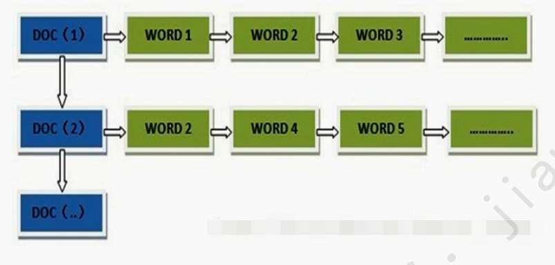
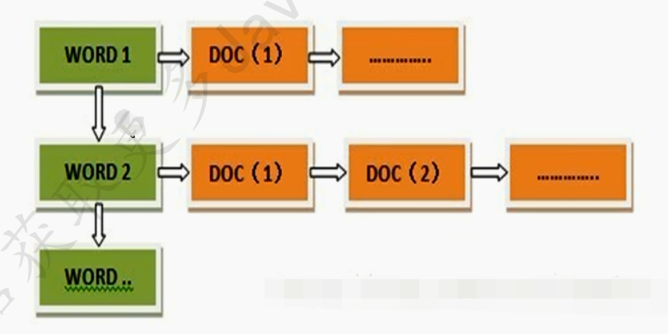
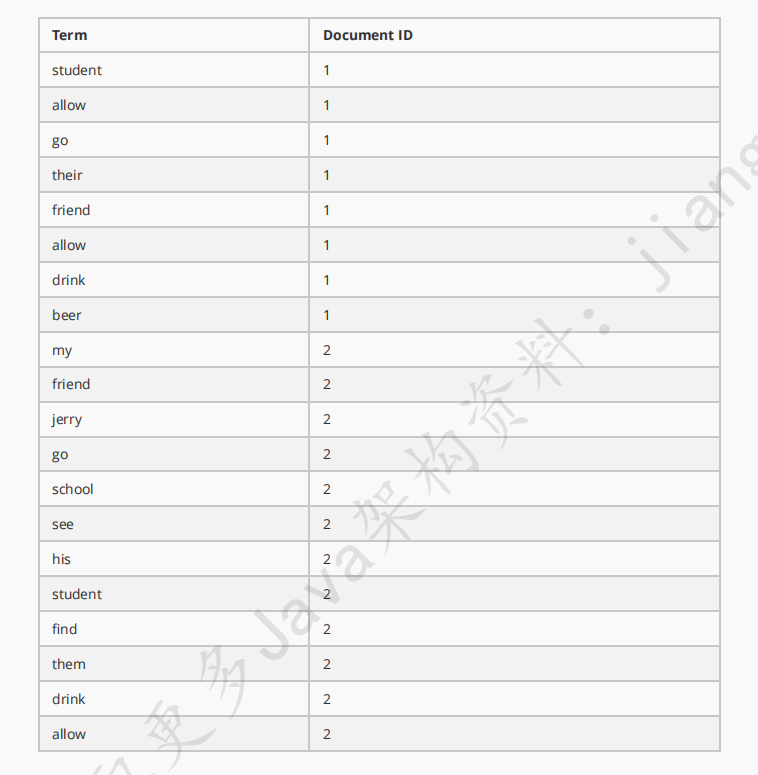
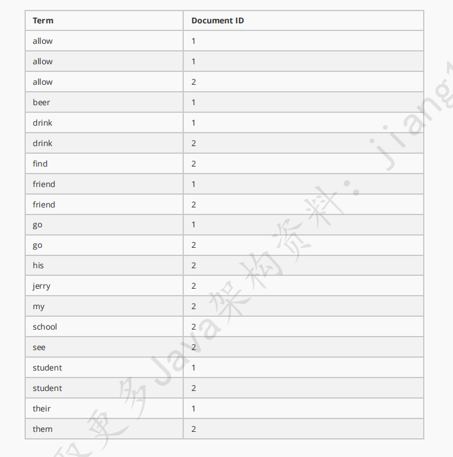
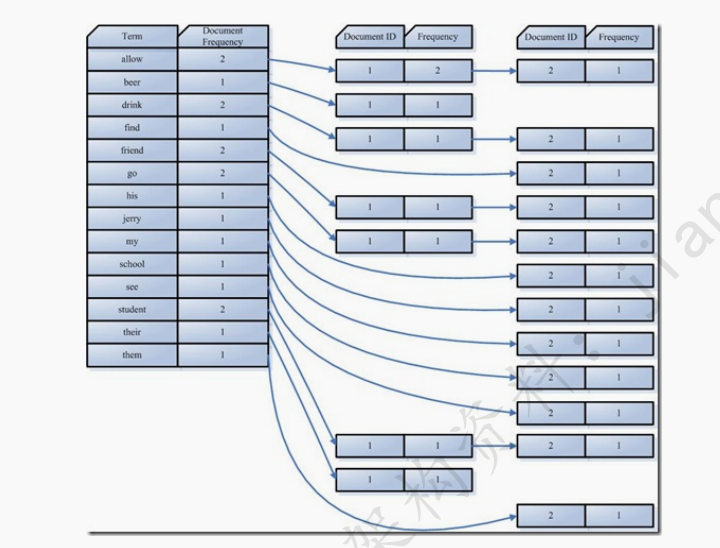
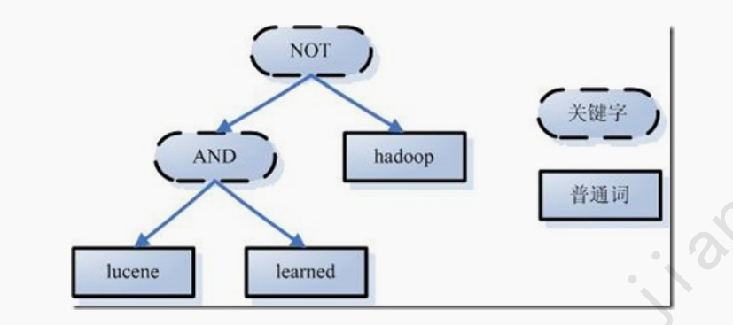
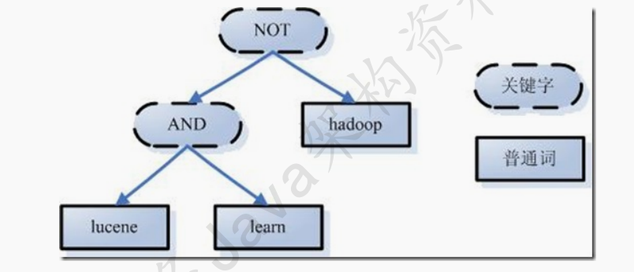
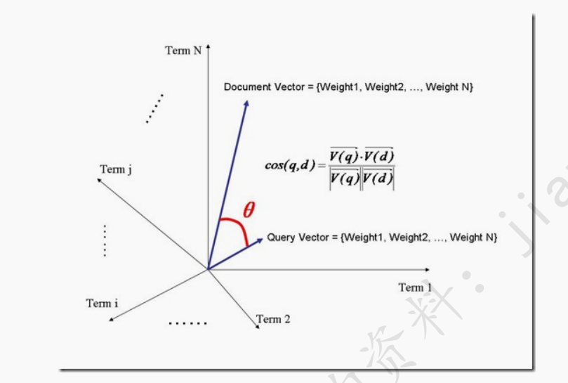
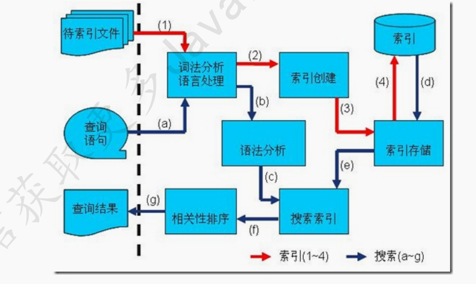

[toc]

# 搜索引擎

## 1、概述

全文搜索就是对文本数据的一种搜索方式，可以分为顺序搜索法和索引搜索法，全文检索使用的是索引搜索法。

## 2、特点

- 做了相关度排序
- 对文本中的关键字做了高亮显示
- 摘要截取
- 只关注文本，不考虑语义
- 搜索效果更加精确

## 3、使用场景

- 替换数据库的模糊搜索，提高查询速度，降低数据库压力，增强了查询效率
- 数据库模糊查询缺点：查询速度慢，左模糊和全模糊会使索引失效，没有相关度排序，没有对文本中关键字做高亮显示，搜索效果不好。
- 全文检索是搜索引擎的基础
- 只对“指定领域”的网站进行索引和搜索，即是垂直搜索
- 可在word、pdf等数据格式中检索内容
- 其它场合，比如输入法等。

## 4、倒排索引

### （1）正向索引

结构如下：

“文档1”的ID > 单词1：出现次数，出现位置列表；单词2：出现次数，出现位置列表；…………。 

“文档2”的ID > 此文档出现的关键词列表。

当用户在主页上搜索关键词“华为手机”时，假设只存在正向索引（forward index），那么就需要扫描索引库中的
所有文档，找出所有包含关键词“华为手机”的文档，再根据打分模型进行打分，排出名次后呈现给用户。因为互联
网上收录在搜索引擎中的文档的数目是个天文数字，这样的索引结构根本无法满足实时返回排名结果的要求。

所以，搜索引擎会将正向索引重新构建为倒排索引，即把文件ID对应到关键词的映射转换为关键词到文件ID的映
射，每个关键词都对应着一系列的文件，这些文件中都出现这个关键词。

### （2）倒排索引

**倒排索引**的结构如下：

“关键词1”：“文档1”的ID，“文档2”的ID，…………。 

“关键词2”：带有此关键词的文档ID列表

## 5、创建索引

全文检索的索引创建过程一般有如下几步：

### （1）需要索引的原文档

例如：

文件一：Students should be allowed to Go out with their friends, but not allowed to drink beer.

文件二：My friend Jerry went to school to see his students but found them drunk which is not allowed.

### （2）将原文档传给分词组件（Tokenizer）

分词组件会做如下几件事：

- 将文档分成一个一个单独的单词
- 去除标点符号
- 去除停词

所谓停词(Stop word)就是一种语言中最普通的一些单词，由于没有特别的意义，因而大多数情况下不能成为搜索

的关键词，因而创建索引时，这种词会被去掉而减少索引的大小。

英语中挺词(Stop word)如：“the”,“a”，“this”等。

对于每一种语言的分词组件(Tokenizer)，都有一个停词(stop word)集合。

**经过分词（Tokenizer）后得到的结果称为词元（Token）**

例如上述两个文档得到的词元如下：

“Students”，“allowed”，“go”，“their”，“friends”，“allowed”，“drink”，“beer”，“My”，“friend”，“Jerry”，“went”，“school”，“see”，“his”，“students”，“found”，“them”，“drunk”，“allowed”。

### （3）将得到的词元（Token）传给语言处理组件（Linguistic Processor）

语言处理组件（Linguistic Processor）主要是对得到的次元做一些同语言相关的处理。

对于英语，语言处理组件(Linguistic Processor) 一般做以下几点：
1. 变为小写(Lowercase) 。
2. 将单词缩减为词根形式，如“cars ”到“car ”等。这种操作称为：stemming 。
3. 将单词转变为词根形式，如“drove ”到“drive ”等。这种操作称为：lemmatization 。

**语言处理组件（Linguistic Processor）的结果称为词（Term）**

例如上述得到的词为：

“student”，“allow”，“go”，“their”，“friend”，“allow”，“drink”，“beer”，“my”，“friend”，“jerry”，“go”，“school”，“see”，“his”，“student”，“fifind”，“them”，“drink”，“allow”。

### （4）将词（Term）传给索引组件（Indexer）

索引组件（Indexer）主要做如下几件事：

1、将词创建一个字典

2、对字典按照字母顺序进行排序

3、合并相同的词（Term）成为文档倒排（Posting List）链表

在此表中，有几个定义：

1. Document Frequency 即文档频次，表示总共有多少文件包含此词(Term)。
2. Frequency 即词频率，表示此文件中包含了几个此词(Term)。

所以对词(Term) “allow”来讲，总共有两篇文档包含此词(Term)，从而词(Term)后面的文档链表总共有两项，第一项表示包含“allow”的第一篇文档，即1号文档，此文档中，“allow”出现了2次，第二项表示包含“allow”的第二个文档，是2号文档，此文档中，“allow”出现了1次。

到此为止，索引已经创建好了，我们可以通过它很快的找到我们想要的文档。

而且在此过程中，我们惊喜地发现，搜索“drive”，“driving”，“drove”，“driven”也能够被搜到。因为在我们的索引中，“driving”，“drove”，“driven”都会经过语言处理而变成“drive”，在搜索时，如果您输入“driving”，输入的查询语句同样经过我们这里的一到三步，从而变为查询“drive”，从而可以搜索到想要的文档。

## 6、搜索索引

**如何对索引进行搜索？**

搜索主要分为以下几步：

### （1）用户输入查询语句

查询语句同我们普通的语言一样，也是有一定语法的。

不同的查询语句有不同的语法，如SQL语句就有一定的语法。

查询语句的语法根据全文检索系统的实现而不同。最基本的有比如：AND, OR, NOT等。

举个例子，用户输入语句：lucene AND learned NOT Hadoop。

### （2）对查询语句进行词法分析、语法分析及语言处理

由于查询语句有语法，因而也要进行语法分析，语法分析及语言处理

**1.** **词法分析主要用来识别单词和关键字。**

如上述例子中，经过词法分析，得到单词有lucene，learned，hadoop, 关键字有AND, NOT。

如果在词法分析中发现不合法的关键字，则会出现错误。如lucene AMD learned，其中由于AND拼错，导致AMD

作为一个普通的单词参与查询

**2.** **语法分析主要是根据查询语句的语法规则来形成一棵语法树。**

如果发现查询语句不满足语法规则，则会报错。如lucene NOT AND learned，则会出错。

如上述例子，lucene AND learned NOT hadoop形成的语法树如下：

**3.** **语言处理同索引过程中的语言处理几乎相同。**

如learned变成learn等。

经过第二步，我们得到一棵经过语言处理的语法树。

**搜索索引，得到符合语法树的文档**

此步骤有分几小步：

1. 首先，在反向索引表中，分别找出包含lucene，learn，hadoop的文档链表。

2. 其次，对包含lucene，learn的链表进行合并操作，得到既包含lucene又包含learn的文档链表。

3. 然后，将此链表与hadoop的文档链表进行差操作，去除包含hadoop的文档，从而得到既包含lucene又包含

learn而且不包含hadoop的文档链表。

4. 此文档链表就是我们要找的文档

**根据得到的文档和查询语句的相关性，对结果进行排序**

如何计算文档和查询语句的相关性呢？

首先，一个文档有很多词(Term)组成 ，如search, lucene, full-text, this, a, what等。

其次对于文档之间的关系，不同的Term重要性不同 ，比如对于本篇文档，search, Lucene, full-text就相对重要一
些，this, a , what可能相对不重要一些。所以如果两篇文档都包含search, Lucene，fulltext，这两篇文档的相关性
好一些，然而就算一篇文档包含this, a, what，另一篇文档不包含this, a, what，也不能影响两篇文档的相关性。
因而判断文档之间的关系，首先找出哪些词(Term)对文档之间的关系最重要，如search, Lucene, fulltext。然后判
断这些词(Term)之间的关系。

找出词(Term) 对文档的重要性的过程称为计算词的权重(Term weight) 的过程。

计算词的权重(term weight)有两个参数，第一个是词(Term)，第二个是文档(Document)。
词的权重(Term weight)表示此词(Term)在此文档中的重要程度，越重要的词(Term)有越大的权重(Term weight)，
因而在计算文档之间的相关性中将发挥更大的作用。

**判断词(Term)之间的关系从而得到文档相关性的过程应用一种叫做向量空间模型的算法(Vector Space Model) 。**

（1）计算权重（Term Weight）的过程

影响一个词(Term)在一篇文档中的重要性主要有两个因素：

- Term Frequency (tf)：即此Term在此文档中出现了多少次。tf 越大说明越重要。

- Document Frequency (df)：即有多少文档包含次Term。df 越大说明越不重要。

（2）判断Term之间的关系从而得到文档相关性的过程，也即向量空间模型的算法(VSM)。

我们把文档看作一系列词(Term)，每一个词(Term)都有一个权重(Term weight)，不同的词(Term)根据自己在文档中

的权重来影响文档相关性的打分计算。

于是我们把所有此文档中词(term)的权重(term weight) 看作一个向量。

Document = {term1, term2, …… ,term N}

Document Vector = {weight1, weight2, …… ,weight N}

同样我们把查询语句看作一个简单的文档，也用向量来表示。

Query = {term1, term 2, …… , term N}

Query Vector = {weight1, weight2, …… , weight N}

我们把所有搜索出的文档向量及查询向量放到一个N维空间中，每个词(term)是一维。

我们认为两个向量之间的夹角越小，相关性越大。

所以我们计算夹角的余弦值作为相关性的打分，夹角越小，余弦值越大，打分越高，相关性越大。

1. 索引过程：
1) 有一系列被索引文件
2) 被索引文件经过语法分析和语言处理形成一系列词(Term) 。
3) 经过索引创建形成词典和反向索引表。
4) 通过索引存储将索引写入硬盘。
2. 搜索过程：
a) 用户输入查询语句。
b) 对查询语句经过语法分析和语言分析得到一系列词(Term) 。
c) 通过语法分析得到一个查询树。
d) 通过索引存储将索引读入到内存。
e) 利用查询树搜索索引，从而得到每个词(Term) 的文档链表，对文档链表进行交，差，并得到结果文档。
f) 将搜索到的结果文档对查询的相关性进行排序。
g) 返回查询结果给用户。

## 7、分词器

WhitespaceAnalyzer

仅仅是去掉了空格，没有其他任何操作，不支持中文。

SimpleAnalyzer

讲除了字母以外的符号全部去除，并且讲所有字符变为小写，需要注意的是这个分词器同样把数据也去除了，同样

不支持中文。

StopAnalyzer

这个和SimpleAnalyzer类似，不过比他增加了一个的是，在其基础上还去除了所谓的stop words，比如the, a, this

这些。这个也是不支持中文的。

StandardAnalyzer 

英文方面的处理和StopAnalyzer一样的，对中文支持，使用的是单字切割。

CJKAnalyzer

这个支持中日韩，前三个字母也就是这三个国家的缩写。这个对于中文基本上不怎么用吧，对中文的支持很烂，它

是用每两个字作为分割，分割方式个人感觉比较奇葩，我会在下面比较举例。

SmartChineseAnalyzer

中文的分词。比较标准的中文分词，对一些搜索处理的并不是很好