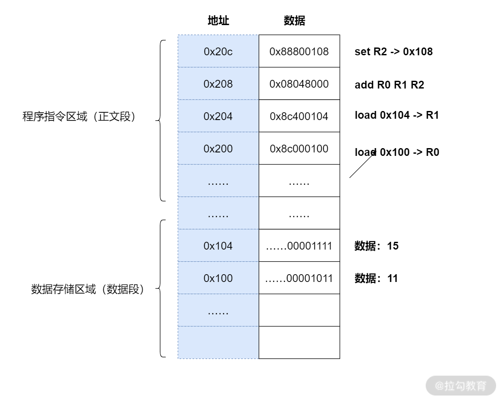
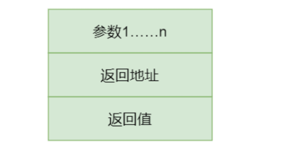
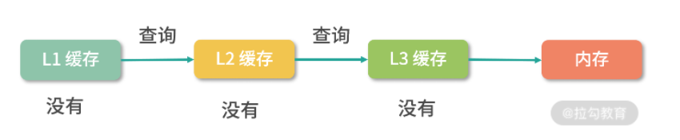
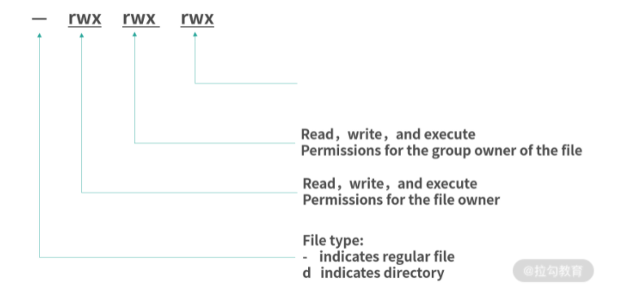

[toc]


记录自：拉钩教育-重学操作系统

# 操作系统


## 一、计算机组成原理

### 1、计算机组成

计算机结构分成五个部分：

- 输入设备
- 输出设备
- 内存
- 中央处理器
- 总线

这就是冯诺依曼模型


#### （1）内存

 程序和数据都被存储在一个被称为内存的线性排列存储区域。

存储的数据单位是一个二进制位，最小的存储单位叫做字节，8byte，每个字节对应一个内存地址，内存地址由0开始编号，比如第一个地址是0，第二个地址是1.然后自增排列。

内存是随机存取器，读取或者写入任何一个地址数据的速度是一样的


#### （2）CPU

CPU负责控制和计算。为了方便计算较大的数值，CPU每次可计算多个字节的数据。

- 每次可计算4个byte，称为32位CPU
- 每次可计算8个byte，称为64位CPU

32和64，指的是CPU的位宽。

32位CPU能计算的最大整数事2^32-1，也就是4,294,967,295


##### 1、控制单元和逻辑单元

CPU中有一个控制单元专门负责控制CPU工作；

逻辑运算单元专门负责计算。


##### 2、寄存器

CPU在进行计算的时候，需要有地方存储中间结果，由于CPU离内存远，所以需要一种离自己近的存储来存储将要被计算的数字。

这种存储就是寄存器，寄存器就在CPU里，控制单元和逻辑运算单元非常近，因此运算速度显著提升。


**通用寄存器：**

寄存器中有一部分是提供给用户编程使用的，比如用来存加和指令的两个参数


**特殊寄存器：**

还有一部分寄存器有特殊的用途，叫作特殊寄存器。比如程序指针，就是一个特殊寄存器。它存储了 CPU 要执行的下一条指令所在的内存地址。注意，程序指针不是存储了下一条要执行的指令，此时指令还在内存中，程序指针只是存储了下一条指令的地址。


**指令寄存器：**

存储下一条要执行的指令，会从内存读入到这个指令寄存器里，指令被执行完成之前，指令都存储在这里。


#### （3）总线

CPU和内存以及其它设备之间，也需要通信，因此用这种特殊的设备进行控制，就是总线。

总线分成3种：

- 地址总线，专门用来指定CPU将要操作的内存地址
- 数据总线，用来读写内存中的数据
- 控制总线，用来发送和接受关键信号，比如中断信号、设备复位等信号，都是通过控制总线传输，同样，CPU需要堆这些信号进行响应，也需要控制总线。

当CPU需要读写内存的时候，先要通过地址总线来指定内存地址，再通过数据总线来传输数据。


#### （4）输入、输出设备

输入设备向计算机输入数据，计算机经过计算，将结果通过输出设备向外界传达。

如果输入、输出设备需要和CPU进行交互，就需要用到控制总线


#### （5）问题

##### 1、线路位宽问题

**数据如何通过线路传递？**

通过操作电压，低电压是0，高电压是1


如果只有一条线路，每次只能传递一个信号，0或者1，假若要传递数字10，也就是1100，那么就需要传递4次。

这种称为串行，如果需要每次多传一些数据，就需要增加线路，也就是并行。

如果只有 1 条地址总线，那每次只能表示 0-1 两种情况，所以只能操作 2 个内存地址；如果有 10 条地址总线，一次就可以表示 210 种情况，也就是可以操作 1024 个内存地址；如果你希望操作 4G 的内存，那么就需要 32 条线，因为 232 是 4G。


##### 2、64位和32位的计算

**CPU的位宽会对计算造成什么影响？**

如果要在32位的CPU上计算两个64位数字和的操作，就需要将64 位数字拆成 2 个 32 位数字来计算，这样就需要一个算法，比如用像小时候做加法竖式一样，先加和两个低位的 32 位数字，算出进位，然后加和两个高位的 32 位数字，最后再加上进位。

而 64 位的 CPU 就可以一次读入 64 位的数字，同时 64 位的 CPU 内部的逻辑计算单元，也支持 64 位的数字进行计算。但是你千万不要仅仅因为位宽的区别，就认为 64 位 CPU 性能比 32 位高很多。

还有一点要注意，32 位宽的 CPU 没办法控制超过 32 位的地址总线、数据总线工作。比如说你有一条 40 位的地址总线（其实就是 40 条线），32 位的 CPU 没有办法一次给 40 个信号，因为它最多只有 32 位的寄存器。因此 32 位宽的 CPU 最多操作 232 个内存地址，也就是 4G 内存地址。


#### （6）程序的执行过程

当CPU执行程序的时候：

1. CPU读取PC指针指向的指令，将它导入指令寄存器。

- CPU的控制单元操作地址总线指定需要访问的内存地址（把PC指针种的值拷贝到地址总线中）

- CPU通知内存设备准备数据（内存设备准备好了，通过数据总线将数据传送给CPU）

- CPU收到内存传来的数据后，将这个数据存入指令寄存器

  上述3步完成后，CPU成功读取了PC指针指向的指令，存入了指令寄存器

2. CPU分析指令寄存器中的指令，确定指令的类型和参数
3. 如果是计算类型的指令，就较给逻辑运算单元计算；如果是存储类型的指令，就由控制单元执行
4. PC指针自增，并准备获取下一条指令。

比如在 32 位的机器上，指令是 32 位 4 个字节，需要 4 个内存地址存储，因此 PC 指针会自增 4。


程序指针也是一个寄存器，64位的CPU会提供64位的寄存器，就可使用更多内存地址。64位的寄存器可寻址的范围非常大，但也会收到地址总线条数的限制。比如和64位CPU配套工作的地址总线只有40条，那么可寻址的范围就是2^40=1T


从PC指针读取指令、到执行、再到下一跳指令，构成了一个循环，这个不断循环的过程叫做**CPU的指令周期**


#### （7）CPU的指令周期

例如a=11+15是怎么执行的。

1. 编译器通过分析，发现11和15是数据，因此编译好的程序启动时，会在内存中开辟出一个区域存这样的常数，这个专门用来存储常数的区域，就是数据段：

11被存储到地址0x100，15被存储到了0x104




2. 编译器将a=11+15转换成4条指令，程序启动后，这些指令被导入了一个专门用来存储指令的区域，也就是正文段。上图中，这些指令被存储到了0x200-0x20c 的区域中：

   0x200 位置的 load 指令将地址 0x100 中的数据 11 导入寄存器 R0；

   0x204 位置的 load 指令将地址 0x104 中的数据 15 导入寄存器 R1；

   0x208 位置的 add 指令将寄存器 R0 和 R1 中的值相加，存入寄存器 R2；

   0x20c 位置的 store 指令将寄存器 R2 中的值存回数据区域中的 0x1108 位置。


3. 执行时候，PC指针先指向0x200位置，然后依次执行这4条指令


##### 1、指令

load 指令将内存中的数据导入寄存器，我们写成了 16 进制：0x8c000100，拆分成二进制就是：


最左边的 6 位，叫作操作码，英文是 OpCode，100011 代表 load 指令；

中间的 4 位 0000是寄存器的编号，这里代表寄存器 R0；

后面的 22 位代表要读取的地址，也就是 0x100。


add 指令，16 进制表示是 0x08048000，换算成二进制就是：


最左边的 6 位是指令编码，代表指令 add；

紧接着的 4 位 0000 代表寄存器 R0；

然后再接着的 4 位 0001 代表寄存器 R1；

再接着的 4 位 0010 代表寄存器 R2；

最后剩下的 14 位没有被使用。


构造指令的过程，叫做指令的编码，通常由编译器完成；解析指令的过程，叫做指令的解码，由CPU完成，

CPU内部有一个循环：**CPU 的指令周期**

1. 首先 CPU 通过 PC 指针读取对应内存地址的指令，我们将这个步骤叫作 Fetch，就是获取的意思。

2. CPU 对指令进行解码，我们将这个部分叫作 Decode。

3. CPU 执行指令，我们将这个部分叫作 Execution。

4. CPU 将结果存回寄存器或者将寄存器存入内存，我们将这个步骤叫作 Store。


##### （2）指令类型

不同类型的指令、参数个数、每个参数的位宽，都不一样，而参数可以是以下三种类型：

- 寄存器
- 内存地址
- 数值


从功能角度划分，指令分成5类：

- I/O 类型的指令，比如处理和内存间数据交换的指令 store/load 等；再比如将一个内存地址的数据转移到另一个内存地址的 mov 指令。

- 计算类型的指令，最多只能处理两个寄存器，比如加减乘除、位运算、比较大小等。

- 跳转类型的指令，用处就是修改 PC 指针。比如编程中大家经常会遇到需要条件判断+跳转的逻辑，比如 if-else，swtich-case、函数调用等。

- 信号类型的指令，比如发送中断的指令 trap。

- 闲置 CPU 的指令 nop，一般 CPU 都有这样一条指令，执行后 CPU 会空转一个周期。


指令还有一个分法，寻址模式，比如同样是求和指令，可能会有2个版本：

- 将两个寄存器的值相加的 add 指令。

- 将一个寄存器和一个整数相加的 addi 指令。


另外，同样是加载内存中的数据到寄存器的 load 指令也有不同的寻址模式：

- 比如直接加载一个内存地址中的数据到寄存器的指令la，叫作直接寻址。

- 直接将一个数值导入寄存器的指令li，叫作寄存器寻址。

- 将一个寄存器中的数值作为地址，然后再去加载这个地址中数据的指令lw，叫作间接寻址。


64 位和 32 位比较有哪些优势？

1. 如果说的是 64 位宽 CPU，那么有 2 个优势。

优势 1：64 位 CPU 可以执行更大数字的运算，这个优势在普通应用上不明显，但是对于数值计算较多的应用就非常明显。

优势 2：64 位 CPU 可以寻址更大的内存空间

2. 如果 32 位/64 位说的是程序，那么说的是指令是 64 位还是 32 位的。32 位指令在 64 位机器上执行，困难不大，可以兼容。 如果是 64 位指令，在 32 位机器上执行就困难了。因为 32 位指令在 64 位机器执行的时候，需要的是一套兼容机制；但是 64 位指令在 32 位机器上执行，32 位的寄存器都存不下指令的参数。

3. 操作系统也是一种程序，如果是 64 位操作系统，也就是操作系统中程序的指令都是 64 位指令，因此不能安装在 32 位机器上。


### 2、程序是如何执行的？

#### （1）for循环如何被执行

下面这段for循环是怎么转换成指令来执行的？

```java
var i = 1, s = 0;
for(; i <= 100; i++) {
  s+=i;
}
```

系统提供了一种jump类型的指令，可在程序间跳跃，比如：

```java
loop:
	jump loop // 跳回loop标签
```


将 `for` 循环用底层的指令实现：

```c
# var i = 1, s = 0
# 对应 Java 代码，我们首先将 1 和 0 存储到两个地址
# 这两个地址我们用 $i 和 $s 表示
store #1 -> $i // 将数字 1 存入i的地址
store #0 -> $s // 将数字 0 存入 s 的地址

# 接下来循环要开始了，我们在这里预留一个 loop 标签
# loop 是一个自定义标签，它代表指令的相对位置
# 后续我们可以用 jump 指令跳转回这个位置实现循环
loop: # 循环标签

# for ... i <= 100
# 接下来我们开始实现循环控制
# 我们先首先 i <= 100的比较
# 我们先将变量 i 的地址，也就是 $i 导入寄存器 R0
load $i -> R0

# 然后我们用 cmp 比较指令 R0 和数字 100
cmp R0 #100 // 比较 R0 和数字 100

# 注意指令不会有返回值，它会进行计算，然后改变机器的状态（也就是寄存器）
# 比较后，有几个特殊的寄存器会保存比较结果
# 然后我们用 ja（jump above）, 如果比较结果 R0 比 100 大
# 那么我们就跳转到 end 标签，实现循环的跳出
ja end 
nop
# 如果 R0<=100，那么ja end 没有生效，这时我们处理 s+=i
# 首先我们把变量 s 所在地址的数据导入寄存器 R1
load $s -> R1
# 然后我们把寄存器R0和R1加和，把结果存储寄存器 R2
add R0 R1 R2 
# 这时，我们把寄存器 R2 的值存入变量 s 所在的地址
store R2 -> $s
# 刚才我们完成了一次循环
# 我们还需要维护变量 i 的自增
# 现在 i 的值在 R0 中，我们首先将整数 1 叠加到 R0 上
add R0 #1 R0
# 再把 R0 的值存入i所在的内存地址
store R0 -> $i

# 这时我们的循环体已经全部执行完成，我们需要调转回上面 loop 标签所在的位置
# 继续循环
jump loop
nop
end:
```


- jump指令直接操作PC指针，但是很多cpu会抢先执行下一条指令，因此通常在jump后要跟随一条nop指令，让cpu空转一个周期，避免jump下面的指令被执行。


#### （2）条件控制程序

条件控制程序有两种典型代表，一种是 `if-else` ，另一种是 `switch-case` 。

 `if-else` 翻译成指令，是比较简单的，你需要用跳转指令和比较指令处理它的跳转逻辑。

举个具体的例子，比如一个根据数字返回星期的程序。如果用`if-else`，那么你需要这样做：

```
if(week == 1) {
  return "周一";
} else if(week == 2) {
  return "周二";
}
……
```

如果用 `switch-case` 的逻辑，你可能会这样计算：

```
跳转位置=当前PC + 4*(week * 2 - 1)
```

`switch-case` 实现更多是依赖数学关系，直接算出 case 所在指令的位置，而不是一行行执行和比较。


#### （3）函数

```java
int add(int a, int b){
  return a + b;
}
```

比如上面函数进行了`a+b`的运算，我们可以这样构造指令：

```
# 首先我们定义一个叫作add的标签
add:
# 然后我们将a和b所在地址中的数据都导入寄存器
load $a -> R0
load $b -> R1
# 然后我们将寄存器求和，并将结果回写到返回地址
add R0 R1 R2
store R2 -> $r
```

当我们需要调用这个函数的时候，我们就构造下面这样的指令：

```
jump add
```


但依然有两个问题没解决：

- 参数如何传递给函数？
- 返回值如何传递给调用者？

此时就需要`栈`

因为在栈中的每个数据大小都一样，所以在函数执行的过程中，可通过参数的个数和参数的序号去计算参数在栈中的位置。


例如：要计算11和15的和，首先在内存中开辟一块单独的空间，也就是栈


需要一个栈指针（Stack Pointer，SP）指向栈顶（下一个可写入的位置），每次将数据写入栈时，九八数据写道栈指针指向的位置，然后将SP值增加

通常会用一个特殊的寄存器来存储栈指针，这个寄存器就叫作 Stack Pointer，在大多数芯片中都有这个特殊的寄存器。一开始，SP 指向 0x100 位置，而 0x100 位置还没有数据。

- 压栈参数11

  ```
  store #11 -> $SP // 将11存入SP指向的地址0x100
  
  add SP, 4, SP  // 栈指针增加4（32位机器），如果是64位，则是8
  ```

  用美元符号代表将 11 存入的是 SP 寄存器指向的内存地址，这是一次间接寻址。


- 压栈参数15

  

此时SP指向0x108


- 将返回值压栈

  返回值还没有计算呢，怎么就压栈了？其实这相当于一个占位，后面我们会改写这个地址。

  

- 调用函数

  完成上面的参数压栈后，就开始调用函数，

```
jump add
```

这个时候，要加和在栈中的数据 11 和 15，我们可以利用 SP 指针寻找数据。11 距离当前 SP 指针差 3 个位置，15 距离 SP 指针差 2 个位置。这种寻址方式是一种复合的寻址方式，是间接 + 偏移量寻址。

```
load $(SP - 12) -> R0  // 11

load $(SP - 8) -> R1  // 15
```

然后进行加和，将结果存入 R2。

```
load R0 R1 R2
```

最后我们可以再次利用数学关系将结果写入返回值所在的位置。

```
store R2 -> $(SP-4)
```

上面我们用到了一种间接寻址的方式来进行加和运算，也就是利用 SP 中的地址做加减法操作内存。


此时结果26已经被写入了返回值的位置：


问题：

1. 函数计算完成，这时应该跳转回去。可是我们没有记录函数调用前 PC 指针的位置，因此这里需要改进，我们需要存储函数调用前的 PC 指针方便调用后恢复。
2. 栈不可以被无限使用，11和 15 作为参数，计算出了结果 26，那么它们就可以清空了。如果用调整栈指针的方式去清空，我们就会先清空 26。此时就会出现顺序问题，因此我们需要调整压栈的顺序。


首先，我们将函数参数和返回值换位，这样在清空数据的时候，就会先清空参数，再清空返回值。



然后我们在调用函数前，还需要将返回地址压栈。这样在函数计算完成前，就能跳转回对应的返回地址。翻译成指令，就是下面这样：

```
## 压栈返回值
add SP, 4  -> SP 
# 计算返回地址
# 我们需要跳转到清理堆栈那行，也就是16行
MOV PC+4*(参数个数*2+1) -> SP
# 压栈参数的程序
……
# 执行函数，计算返回值
call function
# 清理堆栈
add SP, -(参数个数+1)*4， SP
```


#### （4）递归函数如何被执行

```
int sum(int n){
  if(n == 1) {return 1;}
  return n + sum(n-1);
}
```

递归的时候，我们每次执行函数都形成一个如下所示的栈结构：

比如执行 sum(100)，我们就会形成一个复杂的栈，第一次调用 n = 100，第二次递归调用 n = 99：

它们堆在了一起，就形成了一个很大的栈，简化一下就是这样的一个模型，如下所示：


到这里，递归消耗了更多空间，但是也保证了中间计算的独立性。当递归执行到 100 次的时候，就会执行下面的语句：

```
 if(n == 1) {return 1;}
```

于是触发第 99 次递归执行：

```
return 2 + sum(1) // sum(1) = 1
```

上面程序等价于`return 3`，接着再触发第 98 次递归的执行，然后是第 97 次，最终触发到第一次函数调用返回结果。

由此可见，栈这种结构同样适合递归的计算。事实上，计算机编程语言就是用这种结构来实现递归函数。


### 3、存储器分级策略

一种可行的方案，就是根据数据的使用频率使用不同的存储器：高频使用的数据，读写越快越好，因此用最贵的材料，放到离 CPU 最近的位置；使用频率越低的数据，我们放到离 CPU 越远的位置，用越便宜的材料。


具体来说，通常我们把存储器分成这么几个级别：

1. 寄存器；
2. L1-Cache；
3. L2-Cache；
4. L3-Cahce；
5. 内存；
6. 硬盘/SSD。


#### （1）寄存器

寄存器紧挨着 CPU 的控制单元和逻辑计算单元，它所使用的材料速度也是最快的。就像我们前面讲到的，存储器的速度越快、能耗越高、产热越大，而且花费也是最贵的，因此数量不能很多。

寄存器的数量通常在几十到几百之间，每个寄存器可以用来存储一定字节（byte）的数据。比如：

- 32 位 CPU 中大多数寄存器可以存储 4 个字节；
- 64 位 CPU 中大多数寄存器可以存储 8 个字节。

寄存机的访问速度非常快，一般要求在半个 CPU 时钟周期内完成读写。比如一条要在 4 个周期内完成的指令，除了读写寄存器，还需要解码指令、控制指令执行和计算。如果寄存器的速度太慢，那 4 个周期就可能无法完成这条指令了。


#### （2）L1-Cache

L1- 缓存在 CPU 中，相比寄存器，虽然它的位置距离 CPU 核心更远，但造价更低。通常 L1-Cache 大小在几十 Kb 到几百 Kb 不等，读写速度在 2~4 个 CPU 时钟周期。

#### （3）L2-Cache

L2- 缓存也在 CPU 中，位置比 L1- 缓存距离 CPU 核心更远。它的大小比 L1-Cache 更大，具体大小要看 CPU 型号，有 2M 的，也有更小或者更大的，速度在 10~20 个 CPU 周期。

#### （4）L3-Cache

L3- 缓存同样在 CPU 中，位置比 L2- 缓存距离 CPU 核心更远。大小通常比 L2-Cache 更大，读写速度在 20~60 个 CPU 周期。L3 缓存大小也是看型号的，比如 i9 CPU 有 512KB L1 Cache；有 2MB L2 Cache； 有16MB L3 Cache。


#### （5）内存

内存的主要材料是半导体硅，是插在主板上工作的。因为它的位置距离 CPU 有一段距离，所以需要用总线和 CPU 连接。因为内存有了独立的空间，所以体积更大，造价也比上面提到的存储器低得多。现在有的个人电脑上的内存是 16G，但有些服务器的内存可以到几个 T。内存速度大概在 200~300 个 CPU 周期之间。


#### （6）SSD和硬盘

SSD 也叫固态硬盘，结构和内存类似，但是它的优点在于断电后数据还在。内存、寄存器、缓存断电后数据就消失了。内存的读写速度比 SSD 大概快 10~1000 倍。以前还有一种物理读写的磁盘，我们也叫作硬盘，它的速度比内存慢 100W 倍左右。因为它的速度太慢，现在已经逐渐被 SSD 替代。



当 CPU 需要内存中某个数据的时候，如果寄存器中有这个数据，我们可以直接使用；如果寄存器中没有这个数据，我们就要先查询 L1 缓存；L1 中没有，再查询 L2 缓存；L2 中没有再查询 L3 缓存；L3 中没有，再去内存中拿。


#### （7）指令预读

CPU 顺序执行内存中的指令，CPU 执行指令的速度是非常快的，一般是 2~6 个 CPU 时钟周期；

内存的读写速度其实是非常慢的，大概有 200~300 个时钟周期。

CPU 其实是不能从内存中一条条读取指令再执行的，如果是这样做，那每执行一条指令就需要 200~300 个时钟周期了。

一个解决办法就是 CPU 把内存中的指令预读几十条或者上百条到读写速度较快的 L1- 缓存中，因为 L1- 缓存的读写速度只有 2~4 个时钟周期，是可以跟上 CPU 的执行速度的。

这里又产生了另一个问题：如果数据和指令都存储在 L1- 缓存中，如果数据缓存覆盖了指令缓存，就会产生非常严重的后果。因此，L1- 缓存通常会分成两个区域，一个是指令区，一个是数据区。


#### （8）缓存命中率

L1/L2/L3 加起来，缓存的命中率有多少？

所谓命中就是指在缓存中找到需要的数据。和命中相反的是穿透，也叫 miss，就是一次读取操作没有从缓存中找到对应的数据。

据统计，L1 缓存的命中率在 80% 左右，L1/L2/L3 加起来的命中率在 95% 左右。因此，CPU 缓存的设计还是相当合理的。只有 5% 的内存读取会穿透到内存，95% 都能读取到缓存。 这也是为什么程序语言逐渐取消了让程序员操作寄存器的语法，因为缓存保证了很高的命中率，多余的优化意义不大，而且很容易出错。


#### （9）缓存置换问题

最后的一个问题，比如现在 L1- 缓存条目已经存满了，接下来 CPU 又读了内存，需要把一个新的条目存到 L1- 缓存中，既然有一个新的条目要进来，那就有一个旧的条目要出去。所以，这个时候我们就需要用一个算法去计算哪个条目应该被置换出去。这个问题叫作缓存置换问题。


#### （10）**SSD、内存和 L1 Cache 相比速度差多少倍**？

因为内存比 SSD 快 10~1000 倍，L1 Cache 比内存快 100 倍左右。因此 L1 Cache 比 SSD 快了 1000~100000 倍。所以你有没有发现 SSD 的潜力很大，好的 SSD 已经接近内存了，只不过造价还略高。


## 二、Linux指令

### 1、进程、重定向、管道指令


#### （1）进程

应用的可执行文件是放在文件系统里，把可执行文件启动，就会在操作系统里（具体来说是内存中）形成一个应用的副本，这个副本就是进程。

**什么是进程？**

进程是应用的执行副本；而不要回答进程是操作系统分配资源的最小单位。前者是定义，后者是作用

**ps：**

如果你要看当前的进程，可以用ps指令。p 代表 processes，也就是进程；s 代表 snapshot，也就是快照。

ps -ef   ： -e是为了和-A区分，-f可带上更多描述字段


**top：**

实时更新数据的top指令


#### （2）管道

管道（Pipeline）的作用是在命令和命令之间，传递数据。比如说一个命令的结果，就可以作为另一个命令的输入。

**输入输出流：**

每个进程拥有自己的标准输入流、标准输出流、标准错误流。

这几个标准流说起来很复杂，但其实都是文件。

- 标准输入流（用 0 表示）可以作为进程执行的上下文（进程执行可以从输入流中获取数据）。

- 标准输出流（用 1 表示）中写入的结果会被打印到屏幕上。

- 如果进程在执行过程中发生异常，那么异常信息会被记录到标准错误流（用 2 表示）中。


**重定向：**

执行一个指令，比如ls -l，结果会写入标准输出流，进而被打印。这时可以用重定向符将结果重定向到一个文件，比如说ls -l > out，这样out文件就会有ls -l的结果；而屏幕上也不会再打印ls -l的结果。

具体来说>符号叫作覆盖重定向；>>叫作追加重定向。

\>每次都会把目标文件覆盖，>>会在目标文件中追加。

比如你每次启动一个程序日志都写入/var/log/somelogfile中，可以这样操作，如下所示：

start.sh >> /var/log/somelogfile

经过这样的操作后，每次执行程序日志就不会被覆盖了。

另外还有一种情况，比如我们输入:

ls1 > out

结果并不会存入out文件，因为ls1指令是不存在的。

结果会输出到标准错误流中，仍然在屏幕上。这里我们可以把标准错误流也重定向到标准输出流，然后再重定向到文件。

ls1 &> out

这个写法等价于：

ls1 > out 2>&1

相当于把ls1的标准输出流重定向到out，因为ls1 > out出错了，所以标准错误流被定向到了标准输出流。&代表一种引用关系，具体代表的是ls1 >out的标准输出流。


**管道作用和分类：**

管道和重定向很像，但是管道是一个连接一个进行计算，重定向是将一个文件的内容定向到另一个文件，这二者经常会结合使用。

Linux 中的管道也是文件，有两种类型的管道：

匿名管道（Unnamed Pipeline），这种管道也在文件系统中，但是它只是一个存储节点，不属于任何一个目录。说白了，就是没有路径。

命名管道（Named Pipeline），这种管道就是一个文件，有自己的路径。


**FIFO:**

管道具有 FIFO（First In First Out），FIFO 和排队场景一样，先排到的先获得。所以先流入管道文件的数据，也会先流出去传递给管道下游的进程。


**排序：**

希望按照文件名排序倒序，可以使用匿名管道，将ls的结果传递给sort指令去排序。


**去重：**

去重可以使用uniq指令，uniq指令能够找到文件中相邻的重复行，然后去重。但是我们上面的文件重复行是交替的，所以不可以直接用uniq，因此可以先sort这个文件，然后利用管道将sort的结果重定向到uniq指令。指令如下：

```
sort a.txt | uniq
```


**筛选：**

想找到项目文件下所有文件名中含有Spring的文件。就可以利用grep指令，操作如下：
find ./ | grep Spring

find ./递归列出当前目录下所有目录中的文件。grep从find的输出流中找出含有Spring关键字的行。

如果我们希望包含Spring但不包含MyBatis就可以这样操作：
find ./ | grep Spring | grep -v MyBatis

grep -v是匹配不包含 MyBatis 的结果。


**数行数：**

想知道一个文件里有多少行数据，可以用`wc-l`


**中间结果：**

管道一个接着一个，是一个计算逻辑。有时候我们想要把中间的结果保存下来，这就需要用到tee指令。tee指令从标准输入流中读取数据到标准输出流。


tee还有一个能力，就是自己利用这个过程把输入流中读取到的数据存到文件中。比如下面这条指令：
find ./ -i "*.java" | tee JavaList | grep Spring

这句指令的意思是从当前目录中找到所有含有 Spring 关键字的 Java 文件。tee 本身不影响指令的执行，但是 tee 会把 find 指令的结果保存到 JavaList 文件中。

tee这个执行就像英文字母中的 T 一样，连通管道两端，下面又开了口。这个开口，在函数式编程里面叫作副作用。


**xargs：**

 `xargs`命令的作用，是将标准输入转为命令行参数。 


`xargs`的作用在于，大多数命令（比如`rm`、`mkdir`、`ls`）与管道一起使用时，都需要`xargs`将标准输入转为命令行参数。

> ```bash
> $ echo "one two three" | xargs mkdir
> ```

上面的代码等同于`mkdir one two three`。如果不加`xargs`就会报错，提示`mkdir`缺少操作参数。


默认情况下，`xargs`将换行符和空格作为分隔符，把标准输入分解成一个个命令行参数。

> ```bash
> $ echo "one two three" | xargs mkdir
> ```

上面代码中，`mkdir`会新建三个子目录，因为`xargs`将`one two three`分解成三个命令行参数，执行`mkdir one two three`。

`-d`参数可以更改分隔符。

> ```bash
> $ echo -e "a\tb\tc" | xargs -d "\t" echo
> a b c
> ```

上面的命令指定制表符`\t`作为分隔符，所以`a\tb\tc`就转换成了三个命令行参数。`echo`命令的`-e`参数表示解释转义字符。


`-p`参数打印出要执行的命令，询问用户是否要执行。

> ```bash
> $ echo 'one two three' | xargs -p touch
> touch one two three ?...
> ```

上面的命令执行以后，会打印出最终要执行的命令，让用户确认。用户输入`y`以后（大小写皆可），才会真正执行。

`-t`参数则是打印出最终要执行的命令，然后直接执行，不需要用户确认。

> ```bash
> $ echo 'one two three' | xargs -t rm
> rm one two three
> ```

由于`xargs`默认将空格作为分隔符，所以不太适合处理文件名，因为文件名可能包含空格。

`find`命令有一个特别的参数`-print0`，指定输出的文件列表以`null`分隔。然后，`xargs`命令的`-0`参数表示用`null`当作分隔符。

> ```bash
> $ find /path -type f -print0 | xargs -0 rm
> ```

上面命令删除`/path`路径下的所有文件。由于分隔符是`null`，所以处理包含空格的文件名，也不会报错。

还有一个原因，使得`xargs`特别适合`find`命令。有些命令（比如`rm`）一旦参数过多会报错"参数列表过长"，而无法执行，改用`xargs`就没有这个问题，因为它对每个参数执行一次命令。

> ```bash
> $ find . -name "*.txt" | xargs grep "abc"
> ```

上面命令找出所有 TXT 文件以后，对每个文件搜索一次是否包含字符串`abc`。


`find`命令有一个特别的参数`-print0`，指定输出的文件列表以`null`分隔。然后，`xargs`命令的`-0`参数表示用`null`当作分隔符。

> ```bash
> $ find /path -type f -print0 | xargs -0 rm
> ```

上面命令删除`/path`路径下的所有文件。由于分隔符是`null`，所以处理包含空格的文件名，也不会报错。

还有一个原因，使得`xargs`特别适合`find`命令。有些命令（比如`rm`）一旦参数过多会报错"参数列表过长"，而无法执行，改用`xargs`就没有这个问题，因为它对每个参数执行一次命令。

> ```bash
> $ find . -name "*.txt" | xargs grep "abc"
> ```

上面命令找出所有 TXT 文件以后，对每个文件搜索一次是否包含字符串`abc`。


使用`-L`参数，指定每行作为一个命令行参数，就不会报错。

> ```bash
> $ xargs -L 1 find -name
> "*.txt"
> ./foo.txt
> ./hello.txt
> "*.md"
> ./README.md
> ```

上面命令指定了每一行（`-L 1`）作为命令行参数，分别运行一次命令（`find -name`）。

下面是另一个例子。

> ```bash
> $ echo -e "a\nb\nc" | xargs -L 1 echo
> a
> b
> c
> ```

上面代码指定每行运行一次`echo`命令，所以`echo`命令执行了三次，输出了三行。


`-n`参数指定每次将多少项，作为命令行参数。

> ```bash
> $ xargs -n 1 find -name
> ```

上面命令指定将每一项（`-n 1`）标准输入作为命令行参数，分别执行一次命令（`find -name`）。

下面是另一个例子。

> ```bash
> $ echo {0..9} | xargs -n 2 echo
> 0 1
> 2 3
> 4 5
> 6 7
> 8 9
> ```

上面命令指定，每两个参数运行一次`echo`命令。所以，10个阿拉伯数字运行了五次`echo`命令，输出了五行。


`-I`指定每一项命令行参数的替代字符串。

> ```bash
> $ cat foo.txt
> one
> two
> three
> 
> $ cat foo.txt | xargs -I file sh -c 'echo file; mkdir file'
> one 
> two
> three
> 
> $ ls 
> one two three
> ```

上面代码中，`foo.txt`是一个三行的文本文件。我们希望对每一项命令行参数，执行两个命令（`echo`和`mkdir`），使用`-I file`表示`file`是命令行参数的替代字符串。执行命令时，具体的参数会替代掉`echo file; mkdir file`里面的两个`file`。


`xargs`指令从标准数据流中构造并执行一行行的指令。xargs从输入流获取字符串，然后利用空白、换行符等切割字符串，在这些字符串的基础上构造指令，最后一行行执行这些指令。


比如：将文件名加个前缀

```shell
ls | xargs -I GG mv GG prefix_GG
```

- 用ls找到所有的文件；

- -I参数是查找替换符，这里我们用GG替代ls找到的结果；-I GG后面的字符串 GG 会被替换为`x.a``x.b或x.z；


#### （3）管道文件

命名管道是要挂到文件夹中的，因此需要创建。用mkfifo指令可以创建一个命名管道

```
mkfifo pipe1
```

命名管道和匿名管道能力类似，可以连接一个输出流到另一个输入流，也是 First In First Out。

当执行cat pipe1的时候，你可以观察到，当前的终端处于等待状态。因为我们cat pipe1的时候pipe1中没有内容。

如果这个时候我们再找一个终端去写一点东西到pipe中，比如说:

```
echo "XXX" > pipe1
```

这个时候，cat pipe1就会返回，并打印出xxx


### 2、用户和权限管理

Linux 还对文件进行了权限抽象（注意目录也是一种文件）。Linux 中一个文件可以设置下面 3 种权限：

- 读权限（r）：控制读取文件。

- 写权限（w）：控制写入文件。

- 执行权限（x）：控制将文件执行，比如脚本、应用程序等。

然后每个文件又可以从 3 个维度去配置上述的 3 种权限：

- 用户维度。每个文件可以所属 1 个用户，用户维度配置的 rwx 在用户维度生效；

- 组维度。每个文件可以所属 1 个分组，组维度配置的 rwx 在组维度生效；

- 全部用户维度。设置对所有用户的权限。




1. 文件被创建后，初始的权限如何设置？

文件的所属用户会被设置成创建文件的用户

文件的组又是如何分配的呢？

Linux中是为每个用户创建一个同名分组

比如说zhang这个账户创建时，会创建一个叫作zhang的分组。zhang登录之后，工作分组就会默认使用它的同名分组zhang。如果zhang想要切换工作分组，可以使用newgrp指令切换到另一个工作分组。因此，被创建文件所属的分组是当时用户所在的工作分组，如果没有特别设置，那么就属于用户所在的同名分组。

文件被创建后的权限通常是：

```
rw-rw-r--
```

也就是用户、组维度不可以执行，所有用户可读。


1. 需要全部用户都可以执行的指令，比如ls，它们的权限如何分配？


- 第一个-代表这是一个普通文件，后面的 rwx 代表用户维度可读写和执行；

- 第二个r-x代表组维度不可读写；

- 第三个r-x代表所有用户可以读和执行；

- 后两个root，第一个代表所属用户，第二个代表所属分组。


1. 可不可以多个用户都登录root，然后只用root账户？

尽可能少的root。如果一个用户需要root能力，那么应当进行权限包围——马上提升权限（比如 sudo），处理后马上释放权限。


#### （1）用户分组指令

**查看：**

查看当前用户的分组可以使用`groups`指令。

想查看当前用户，可以使用`id`指令

想查看所有的用户，可以直接看`/etc/passwd`。


**创建用户：**

创建用户用useradd指令。

```bash
sudo useradd foo
```


**创建分组：**

创建分组用groupadd指令。下面指令创建一个叫作hello的分组。

```
sudo groupadd hello
```


**为用户增加次级分组：**

组分成主要分组（Primary Group）和次级分组（Secondary Group）。主要分组只有 1 个，次级分组可以有多个。如果想为用户添加一个次级分组，可以用usermod指令。下面指令将用户foo添加到sudo分组，从而foo拥有了sudo的权限。

```
sudo usermod -a -G sudo foo
```

-a代表append，-G代表一个次级分组的清单， 最后一个foo是账户名。


**修改用户主要分组:**

修改主要分组还是使用usermod指令。只不过参数是小写的-g

```bash
sudo usermod -g somegroup foo
```


#### （2）文件权限管理指令

**修改文件权限：**

用chmod修改文件权限，chmod（ change file mode bits）

```bash
# 设置foo可以执行

chmod +x ./foo

# 不允许foo执行

chmod -x ./foo

# 也可以同时设置多个权限

chmod +rwx ./foo

```


 因为`rwx`在 Linux 中用相邻的 3 个位来表示。比如说`111`代表`rwx`，`101`代表`r-x`。而`rwx`总共有三组，分别是用户权限、组权限和全部用户权限。也就是可以用`111111111` 9 个 1 代表`rwxrwxrwx`。又因为`111`10 进制是 7，因此当需要一次性设置用户权限、组权限和所有用户权限的时候，我们经常用数字表示。 

```bash
# 设置rwxrwxrwx (111111111 -> 777)

chmod 777 ./foo

# 设置rw-rw-rw-(110110110 -> 666)

chmod 666 ./foo

```


**修改文件所属用户:**

 修改文件所属用户，这个时候会使用`chown`指令 

```bash
chown bar ./foo
```

同时修改文件所属的用户和分组，比如我们想修改`foo`的分组位`g`，用户为`u`，可以使用：

```
chown g.u ./foo
```


#### （3）Linux权限划分的原则

1. 每个用户掌握的权限应该足够小，每个组掌握的权限也足够小。实际生产过程中，最好管理员权限可以拆分，互相牵制防止问题。
2. 每个应用应当尽可能小的使用权限。最理想的是每个应用单独占用一个容器（比如 Docker），这样就不存在互相影响的问题。即便应用被攻破，也无法攻破 Docker 的保护层。
3. 尽可能少的`root`。如果一个用户需要`root`能力，那么应当进行权限包围——马上提升权限（比如 sudo），处理后马上释放权限。
4. 系统层面实现权限分级保护，将系统的权限分成一个个 Ring，外层 Ring 调用内层 Ring 时需要内层 Ring 进行权限校验。


