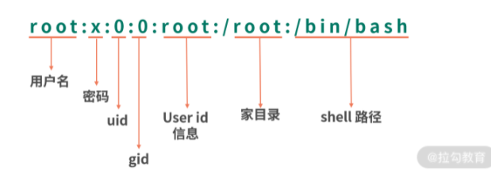
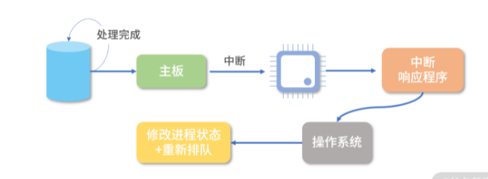

[toc]


记录自：拉钩教育-重学操作系统

# 操作系统


## 一、计算机组成原理

### 1、计算机组成

计算机结构分成五个部分：

- 输入设备
- 输出设备
- 内存
- 中央处理器
- 总线

这就是冯诺依曼模型


#### （1）内存

 程序和数据都被存储在一个被称为内存的线性排列存储区域。

存储的数据单位是一个二进制位，最小的存储单位叫做字节，8byte，每个字节对应一个内存地址，内存地址由0开始编号，比如第一个地址是0，第二个地址是1.然后自增排列。

内存是随机存取器，读取或者写入任何一个地址数据的速度是一样的


#### （2）CPU

CPU负责控制和计算。为了方便计算较大的数值，CPU每次可计算多个字节的数据。

- 每次可计算4个byte，称为32位CPU
- 每次可计算8个byte，称为64位CPU

32和64，指的是CPU的位宽。

32位CPU能计算的最大整数事2^32-1，也就是4,294,967,295


##### 1、控制单元和逻辑单元

CPU中有一个控制单元专门负责控制CPU工作；

逻辑运算单元专门负责计算。


##### 2、寄存器

CPU在进行计算的时候，需要有地方存储中间结果，由于CPU离内存远，所以需要一种离自己近的存储来存储将要被计算的数字。

这种存储就是寄存器，寄存器就在CPU里，控制单元和逻辑运算单元非常近，因此运算速度显著提升。


**通用寄存器：**

寄存器中有一部分是提供给用户编程使用的，比如用来存加和指令的两个参数


**特殊寄存器：**

还有一部分寄存器有特殊的用途，叫作特殊寄存器。比如程序指针，就是一个特殊寄存器。它存储了 CPU 要执行的下一条指令所在的内存地址。注意，程序指针不是存储了下一条要执行的指令，此时指令还在内存中，程序指针只是存储了下一条指令的地址。


**指令寄存器：**

存储下一条要执行的指令，会从内存读入到这个指令寄存器里，指令被执行完成之前，指令都存储在这里。


#### （3）总线

CPU和内存以及其它设备之间，也需要通信，因此用这种特殊的设备进行控制，就是总线。

总线分成3种：

- 地址总线，专门用来指定CPU将要操作的内存地址
- 数据总线，用来读写内存中的数据
- 控制总线，用来发送和接受关键信号，比如中断信号、设备复位等信号，都是通过控制总线传输，同样，CPU需要堆这些信号进行响应，也需要控制总线。

当CPU需要读写内存的时候，先要通过地址总线来指定内存地址，再通过数据总线来传输数据。


#### （4）输入、输出设备

输入设备向计算机输入数据，计算机经过计算，将结果通过输出设备向外界传达。

如果输入、输出设备需要和CPU进行交互，就需要用到控制总线


#### （5）问题

##### 1、线路位宽问题

**数据如何通过线路传递？**

通过操作电压，低电压是0，高电压是1


如果只有一条线路，每次只能传递一个信号，0或者1，假若要传递数字10，也就是1100，那么就需要传递4次。

这种称为串行，如果需要每次多传一些数据，就需要增加线路，也就是并行。

如果只有 1 条地址总线，那每次只能表示 0-1 两种情况，所以只能操作 2 个内存地址；如果有 10 条地址总线，一次就可以表示 210 种情况，也就是可以操作 1024 个内存地址；如果你希望操作 4G 的内存，那么就需要 32 条线，因为 232 是 4G。


##### 2、64位和32位的计算

**CPU的位宽会对计算造成什么影响？**

如果要在32位的CPU上计算两个64位数字和的操作，就需要将64 位数字拆成 2 个 32 位数字来计算，这样就需要一个算法，比如用像小时候做加法竖式一样，先加和两个低位的 32 位数字，算出进位，然后加和两个高位的 32 位数字，最后再加上进位。

而 64 位的 CPU 就可以一次读入 64 位的数字，同时 64 位的 CPU 内部的逻辑计算单元，也支持 64 位的数字进行计算。但是你千万不要仅仅因为位宽的区别，就认为 64 位 CPU 性能比 32 位高很多。

还有一点要注意，32 位宽的 CPU 没办法控制超过 32 位的地址总线、数据总线工作。比如说你有一条 40 位的地址总线（其实就是 40 条线），32 位的 CPU 没有办法一次给 40 个信号，因为它最多只有 32 位的寄存器。因此 32 位宽的 CPU 最多操作 232 个内存地址，也就是 4G 内存地址。


#### （6）程序的执行过程

当CPU执行程序的时候：

1. CPU读取PC指针指向的指令，将它导入指令寄存器。

- CPU的控制单元操作地址总线指定需要访问的内存地址（把PC指针种的值拷贝到地址总线中）

- CPU通知内存设备准备数据（内存设备准备好了，通过数据总线将数据传送给CPU）

- CPU收到内存传来的数据后，将这个数据存入指令寄存器

  上述3步完成后，CPU成功读取了PC指针指向的指令，存入了指令寄存器

2. CPU分析指令寄存器中的指令，确定指令的类型和参数
3. 如果是计算类型的指令，就较给逻辑运算单元计算；如果是存储类型的指令，就由控制单元执行
4. PC指针自增，并准备获取下一条指令。

比如在 32 位的机器上，指令是 32 位 4 个字节，需要 4 个内存地址存储，因此 PC 指针会自增 4。


程序指针也是一个寄存器，64位的CPU会提供64位的寄存器，就可使用更多内存地址。64位的寄存器可寻址的范围非常大，但也会收到地址总线条数的限制。比如和64位CPU配套工作的地址总线只有40条，那么可寻址的范围就是2^40=1T


从PC指针读取指令、到执行、再到下一跳指令，构成了一个循环，这个不断循环的过程叫做**CPU的指令周期**


#### （7）CPU的指令周期

例如a=11+15是怎么执行的。

1. 编译器通过分析，发现11和15是数据，因此编译好的程序启动时，会在内存中开辟出一个区域存这样的常数，这个专门用来存储常数的区域，就是数据段：

11被存储到地址0x100，15被存储到了0x104


2. 编译器将a=11+15转换成4条指令，程序启动后，这些指令被导入了一个专门用来存储指令的区域，也就是正文段。上图中，这些指令被存储到了0x200-0x20c 的区域中：

   0x200 位置的 load 指令将地址 0x100 中的数据 11 导入寄存器 R0；

   0x204 位置的 load 指令将地址 0x104 中的数据 15 导入寄存器 R1；

   0x208 位置的 add 指令将寄存器 R0 和 R1 中的值相加，存入寄存器 R2；

   0x20c 位置的 store 指令将寄存器 R2 中的值存回数据区域中的 0x1108 位置。


3. 执行时候，PC指针先指向0x200位置，然后依次执行这4条指令


##### 1、指令

load 指令将内存中的数据导入寄存器，我们写成了 16 进制：0x8c000100，拆分成二进制就是：


最左边的 6 位，叫作操作码，英文是 OpCode，100011 代表 load 指令；

中间的 4 位 0000是寄存器的编号，这里代表寄存器 R0；

后面的 22 位代表要读取的地址，也就是 0x100。


add 指令，16 进制表示是 0x08048000，换算成二进制就是：


最左边的 6 位是指令编码，代表指令 add；

紧接着的 4 位 0000 代表寄存器 R0；

然后再接着的 4 位 0001 代表寄存器 R1；

再接着的 4 位 0010 代表寄存器 R2；

最后剩下的 14 位没有被使用。


构造指令的过程，叫做指令的编码，通常由编译器完成；解析指令的过程，叫做指令的解码，由CPU完成，

CPU内部有一个循环：**CPU 的指令周期**

1. 首先 CPU 通过 PC 指针读取对应内存地址的指令，我们将这个步骤叫作 Fetch，就是获取的意思。

2. CPU 对指令进行解码，我们将这个部分叫作 Decode。

3. CPU 执行指令，我们将这个部分叫作 Execution。

4. CPU 将结果存回寄存器或者将寄存器存入内存，我们将这个步骤叫作 Store。


##### （2）指令类型

不同类型的指令、参数个数、每个参数的位宽，都不一样，而参数可以是以下三种类型：

- 寄存器
- 内存地址
- 数值


从功能角度划分，指令分成5类：

- I/O 类型的指令，比如处理和内存间数据交换的指令 store/load 等；再比如将一个内存地址的数据转移到另一个内存地址的 mov 指令。

- 计算类型的指令，最多只能处理两个寄存器，比如加减乘除、位运算、比较大小等。

- 跳转类型的指令，用处就是修改 PC 指针。比如编程中大家经常会遇到需要条件判断+跳转的逻辑，比如 if-else，swtich-case、函数调用等。

- 信号类型的指令，比如发送中断的指令 trap。

- 闲置 CPU 的指令 nop，一般 CPU 都有这样一条指令，执行后 CPU 会空转一个周期。


指令还有一个分法，寻址模式，比如同样是求和指令，可能会有2个版本：

- 将两个寄存器的值相加的 add 指令。

- 将一个寄存器和一个整数相加的 addi 指令。


另外，同样是加载内存中的数据到寄存器的 load 指令也有不同的寻址模式：

- 比如直接加载一个内存地址中的数据到寄存器的指令la，叫作直接寻址。

- 直接将一个数值导入寄存器的指令li，叫作寄存器寻址。

- 将一个寄存器中的数值作为地址，然后再去加载这个地址中数据的指令lw，叫作间接寻址。


64 位和 32 位比较有哪些优势？

1. 如果说的是 64 位宽 CPU，那么有 2 个优势。

优势 1：64 位 CPU 可以执行更大数字的运算，这个优势在普通应用上不明显，但是对于数值计算较多的应用就非常明显。

优势 2：64 位 CPU 可以寻址更大的内存空间

2. 如果 32 位/64 位说的是程序，那么说的是指令是 64 位还是 32 位的。32 位指令在 64 位机器上执行，困难不大，可以兼容。 如果是 64 位指令，在 32 位机器上执行就困难了。因为 32 位指令在 64 位机器执行的时候，需要的是一套兼容机制；但是 64 位指令在 32 位机器上执行，32 位的寄存器都存不下指令的参数。

3. 操作系统也是一种程序，如果是 64 位操作系统，也就是操作系统中程序的指令都是 64 位指令，因此不能安装在 32 位机器上。


### 2、程序是如何执行的？

#### （1）for循环如何被执行

下面这段for循环是怎么转换成指令来执行的？

```java
var i = 1, s = 0;
for(; i <= 100; i++) {
  s+=i;
}
```

系统提供了一种jump类型的指令，可在程序间跳跃，比如：

```java
loop:
	jump loop // 跳回loop标签
```


将 `for` 循环用底层的指令实现：

```c
# var i = 1, s = 0
# 对应 Java 代码，我们首先将 1 和 0 存储到两个地址
# 这两个地址我们用 $i 和 $s 表示
store #1 -> $i // 将数字 1 存入i的地址
store #0 -> $s // 将数字 0 存入 s 的地址

# 接下来循环要开始了，我们在这里预留一个 loop 标签
# loop 是一个自定义标签，它代表指令的相对位置
# 后续我们可以用 jump 指令跳转回这个位置实现循环
loop: # 循环标签

# for ... i <= 100
# 接下来我们开始实现循环控制
# 我们先首先 i <= 100的比较
# 我们先将变量 i 的地址，也就是 $i 导入寄存器 R0
load $i -> R0

# 然后我们用 cmp 比较指令 R0 和数字 100
cmp R0 #100 // 比较 R0 和数字 100

# 注意指令不会有返回值，它会进行计算，然后改变机器的状态（也就是寄存器）
# 比较后，有几个特殊的寄存器会保存比较结果
# 然后我们用 ja（jump above）, 如果比较结果 R0 比 100 大
# 那么我们就跳转到 end 标签，实现循环的跳出
ja end 
nop
# 如果 R0<=100，那么ja end 没有生效，这时我们处理 s+=i
# 首先我们把变量 s 所在地址的数据导入寄存器 R1
load $s -> R1
# 然后我们把寄存器R0和R1加和，把结果存储寄存器 R2
add R0 R1 R2 
# 这时，我们把寄存器 R2 的值存入变量 s 所在的地址
store R2 -> $s
# 刚才我们完成了一次循环
# 我们还需要维护变量 i 的自增
# 现在 i 的值在 R0 中，我们首先将整数 1 叠加到 R0 上
add R0 #1 R0
# 再把 R0 的值存入i所在的内存地址
store R0 -> $i

# 这时我们的循环体已经全部执行完成，我们需要调转回上面 loop 标签所在的位置
# 继续循环
jump loop
nop
end:
```


- jump指令直接操作PC指针，但是很多cpu会抢先执行下一条指令，因此通常在jump后要跟随一条nop指令，让cpu空转一个周期，避免jump下面的指令被执行。


#### （2）条件控制程序

条件控制程序有两种典型代表，一种是 `if-else` ，另一种是 `switch-case` 。

 `if-else` 翻译成指令，是比较简单的，你需要用跳转指令和比较指令处理它的跳转逻辑。

举个具体的例子，比如一个根据数字返回星期的程序。如果用`if-else`，那么你需要这样做：

```
if(week == 1) {
  return "周一";
} else if(week == 2) {
  return "周二";
}
……
```

如果用 `switch-case` 的逻辑，你可能会这样计算：

```
跳转位置=当前PC + 4*(week * 2 - 1)
```

`switch-case` 实现更多是依赖数学关系，直接算出 case 所在指令的位置，而不是一行行执行和比较。


#### （3）函数

```java
int add(int a, int b){
  return a + b;
}
```

比如上面函数进行了`a+b`的运算，我们可以这样构造指令：

```
# 首先我们定义一个叫作add的标签
add:
# 然后我们将a和b所在地址中的数据都导入寄存器
load $a -> R0
load $b -> R1
# 然后我们将寄存器求和，并将结果回写到返回地址
add R0 R1 R2
store R2 -> $r
```

当我们需要调用这个函数的时候，我们就构造下面这样的指令：

```
jump add
```


但依然有两个问题没解决：

- 参数如何传递给函数？
- 返回值如何传递给调用者？

此时就需要`栈`

因为在栈中的每个数据大小都一样，所以在函数执行的过程中，可通过参数的个数和参数的序号去计算参数在栈中的位置。


例如：要计算11和15的和，首先在内存中开辟一块单独的空间，也就是栈


需要一个栈指针（Stack Pointer，SP）指向栈顶（下一个可写入的位置），每次将数据写入栈时，九八数据写道栈指针指向的位置，然后将SP值增加

通常会用一个特殊的寄存器来存储栈指针，这个寄存器就叫作 Stack Pointer，在大多数芯片中都有这个特殊的寄存器。一开始，SP 指向 0x100 位置，而 0x100 位置还没有数据。

- 压栈参数11

  ```
  store #11 -> $SP // 将11存入SP指向的地址0x100
  
  add SP, 4, SP  // 栈指针增加4（32位机器），如果是64位，则是8
  ```

  用美元符号代表将 11 存入的是 SP 寄存器指向的内存地址，这是一次间接寻址。


- 压栈参数15

  

此时SP指向0x108


- 将返回值压栈

  返回值还没有计算呢，怎么就压栈了？其实这相当于一个占位，后面我们会改写这个地址。

  

- 调用函数

  完成上面的参数压栈后，就开始调用函数，

```
jump add
```

这个时候，要加和在栈中的数据 11 和 15，我们可以利用 SP 指针寻找数据。11 距离当前 SP 指针差 3 个位置，15 距离 SP 指针差 2 个位置。这种寻址方式是一种复合的寻址方式，是间接 + 偏移量寻址。

```
load $(SP - 12) -> R0  // 11

load $(SP - 8) -> R1  // 15
```

然后进行加和，将结果存入 R2。

```
load R0 R1 R2
```

最后我们可以再次利用数学关系将结果写入返回值所在的位置。

```
store R2 -> $(SP-4)
```

上面我们用到了一种间接寻址的方式来进行加和运算，也就是利用 SP 中的地址做加减法操作内存。


此时结果26已经被写入了返回值的位置：


问题：

1. 函数计算完成，这时应该跳转回去。可是我们没有记录函数调用前 PC 指针的位置，因此这里需要改进，我们需要存储函数调用前的 PC 指针方便调用后恢复。
2. 栈不可以被无限使用，11和 15 作为参数，计算出了结果 26，那么它们就可以清空了。如果用调整栈指针的方式去清空，我们就会先清空 26。此时就会出现顺序问题，因此我们需要调整压栈的顺序。


首先，我们将函数参数和返回值换位，这样在清空数据的时候，就会先清空参数，再清空返回值。


然后我们在调用函数前，还需要将返回地址压栈。这样在函数计算完成前，就能跳转回对应的返回地址。翻译成指令，就是下面这样：

```
## 压栈返回值
add SP, 4  -> SP 
# 计算返回地址
# 我们需要跳转到清理堆栈那行，也就是16行
MOV PC+4*(参数个数*2+1) -> SP
# 压栈参数的程序
……
# 执行函数，计算返回值
call function
# 清理堆栈
add SP, -(参数个数+1)*4， SP
```


#### （4）递归函数如何被执行

```
int sum(int n){
  if(n == 1) {return 1;}
  return n + sum(n-1);
}
```

递归的时候，我们每次执行函数都形成一个如下所示的栈结构：

比如执行 sum(100)，我们就会形成一个复杂的栈，第一次调用 n = 100，第二次递归调用 n = 99：

它们堆在了一起，就形成了一个很大的栈，简化一下就是这样的一个模型，如下所示：


到这里，递归消耗了更多空间，但是也保证了中间计算的独立性。当递归执行到 100 次的时候，就会执行下面的语句：

```
 if(n == 1) {return 1;}
```

于是触发第 99 次递归执行：

```
return 2 + sum(1) // sum(1) = 1
```

上面程序等价于`return 3`，接着再触发第 98 次递归的执行，然后是第 97 次，最终触发到第一次函数调用返回结果。

由此可见，栈这种结构同样适合递归的计算。事实上，计算机编程语言就是用这种结构来实现递归函数。


### 3、存储器分级策略

一种可行的方案，就是根据数据的使用频率使用不同的存储器：高频使用的数据，读写越快越好，因此用最贵的材料，放到离 CPU 最近的位置；使用频率越低的数据，我们放到离 CPU 越远的位置，用越便宜的材料。


具体来说，通常我们把存储器分成这么几个级别：

1. 寄存器；
2. L1-Cache；
3. L2-Cache；
4. L3-Cahce；
5. 内存；
6. 硬盘/SSD。


#### （1）寄存器

寄存器紧挨着 CPU 的控制单元和逻辑计算单元，它所使用的材料速度也是最快的。就像我们前面讲到的，存储器的速度越快、能耗越高、产热越大，而且花费也是最贵的，因此数量不能很多。

寄存器的数量通常在几十到几百之间，每个寄存器可以用来存储一定字节（byte）的数据。比如：

- 32 位 CPU 中大多数寄存器可以存储 4 个字节；
- 64 位 CPU 中大多数寄存器可以存储 8 个字节。

寄存机的访问速度非常快，一般要求在半个 CPU 时钟周期内完成读写。比如一条要在 4 个周期内完成的指令，除了读写寄存器，还需要解码指令、控制指令执行和计算。如果寄存器的速度太慢，那 4 个周期就可能无法完成这条指令了。


#### （2）L1-Cache

L1- 缓存在 CPU 中，相比寄存器，虽然它的位置距离 CPU 核心更远，但造价更低。通常 L1-Cache 大小在几十 Kb 到几百 Kb 不等，读写速度在 2~4 个 CPU 时钟周期。

#### （3）L2-Cache

L2- 缓存也在 CPU 中，位置比 L1- 缓存距离 CPU 核心更远。它的大小比 L1-Cache 更大，具体大小要看 CPU 型号，有 2M 的，也有更小或者更大的，速度在 10~20 个 CPU 周期。

#### （4）L3-Cache

L3- 缓存同样在 CPU 中，位置比 L2- 缓存距离 CPU 核心更远。大小通常比 L2-Cache 更大，读写速度在 20~60 个 CPU 周期。L3 缓存大小也是看型号的，比如 i9 CPU 有 512KB L1 Cache；有 2MB L2 Cache； 有16MB L3 Cache。


#### （5）内存

内存的主要材料是半导体硅，是插在主板上工作的。因为它的位置距离 CPU 有一段距离，所以需要用总线和 CPU 连接。因为内存有了独立的空间，所以体积更大，造价也比上面提到的存储器低得多。现在有的个人电脑上的内存是 16G，但有些服务器的内存可以到几个 T。内存速度大概在 200~300 个 CPU 周期之间。


#### （6）SSD和硬盘

SSD 也叫固态硬盘，结构和内存类似，但是它的优点在于断电后数据还在。内存、寄存器、缓存断电后数据就消失了。内存的读写速度比 SSD 大概快 10~1000 倍。以前还有一种物理读写的磁盘，我们也叫作硬盘，它的速度比内存慢 100W 倍左右。因为它的速度太慢，现在已经逐渐被 SSD 替代。


当 CPU 需要内存中某个数据的时候，如果寄存器中有这个数据，我们可以直接使用；如果寄存器中没有这个数据，我们就要先查询 L1 缓存；L1 中没有，再查询 L2 缓存；L2 中没有再查询 L3 缓存；L3 中没有，再去内存中拿。


#### （7）指令预读

CPU 顺序执行内存中的指令，CPU 执行指令的速度是非常快的，一般是 2~6 个 CPU 时钟周期；

内存的读写速度其实是非常慢的，大概有 200~300 个时钟周期。

CPU 其实是不能从内存中一条条读取指令再执行的，如果是这样做，那每执行一条指令就需要 200~300 个时钟周期了。

一个解决办法就是 CPU 把内存中的指令预读几十条或者上百条到读写速度较快的 L1- 缓存中，因为 L1- 缓存的读写速度只有 2~4 个时钟周期，是可以跟上 CPU 的执行速度的。

这里又产生了另一个问题：如果数据和指令都存储在 L1- 缓存中，如果数据缓存覆盖了指令缓存，就会产生非常严重的后果。因此，L1- 缓存通常会分成两个区域，一个是指令区，一个是数据区。


#### （8）缓存命中率

L1/L2/L3 加起来，缓存的命中率有多少？

所谓命中就是指在缓存中找到需要的数据。和命中相反的是穿透，也叫 miss，就是一次读取操作没有从缓存中找到对应的数据。

据统计，L1 缓存的命中率在 80% 左右，L1/L2/L3 加起来的命中率在 95% 左右。因此，CPU 缓存的设计还是相当合理的。只有 5% 的内存读取会穿透到内存，95% 都能读取到缓存。 这也是为什么程序语言逐渐取消了让程序员操作寄存器的语法，因为缓存保证了很高的命中率，多余的优化意义不大，而且很容易出错。


#### （9）缓存置换问题

最后的一个问题，比如现在 L1- 缓存条目已经存满了，接下来 CPU 又读了内存，需要把一个新的条目存到 L1- 缓存中，既然有一个新的条目要进来，那就有一个旧的条目要出去。所以，这个时候我们就需要用一个算法去计算哪个条目应该被置换出去。这个问题叫作缓存置换问题。


#### （10）**SSD、内存和 L1 Cache 相比速度差多少倍**？

因为内存比 SSD 快 10~1000 倍，L1 Cache 比内存快 100 倍左右。因此 L1 Cache 比 SSD 快了 1000~100000 倍。所以你有没有发现 SSD 的潜力很大，好的 SSD 已经接近内存了，只不过造价还略高。


## 二、Linux指令

### 1、进程、重定向、管道指令


#### （1）进程

应用的可执行文件是放在文件系统里，把可执行文件启动，就会在操作系统里（具体来说是内存中）形成一个应用的副本，这个副本就是进程。

**什么是进程？**

进程是应用的执行副本；而不要回答进程是操作系统分配资源的最小单位。前者是定义，后者是作用

**ps：**

如果你要看当前的进程，可以用ps指令。p 代表 processes，也就是进程；s 代表 snapshot，也就是快照。

ps -ef   ： -e是为了和-A区分，-f可带上更多描述字段


**top：**

实时更新数据的top指令


#### （2）管道

管道（Pipeline）的作用是在命令和命令之间，传递数据。比如说一个命令的结果，就可以作为另一个命令的输入。

**输入输出流：**

每个进程拥有自己的标准输入流、标准输出流、标准错误流。

这几个标准流说起来很复杂，但其实都是文件。

- 标准输入流（用 0 表示）可以作为进程执行的上下文（进程执行可以从输入流中获取数据）。

- 标准输出流（用 1 表示）中写入的结果会被打印到屏幕上。

- 如果进程在执行过程中发生异常，那么异常信息会被记录到标准错误流（用 2 表示）中。


**重定向：**

执行一个指令，比如ls -l，结果会写入标准输出流，进而被打印。这时可以用重定向符将结果重定向到一个文件，比如说ls -l > out，这样out文件就会有ls -l的结果；而屏幕上也不会再打印ls -l的结果。

具体来说>符号叫作覆盖重定向；>>叫作追加重定向。

\>每次都会把目标文件覆盖，>>会在目标文件中追加。

比如你每次启动一个程序日志都写入/var/log/somelogfile中，可以这样操作，如下所示：

start.sh >> /var/log/somelogfile

经过这样的操作后，每次执行程序日志就不会被覆盖了。

另外还有一种情况，比如我们输入:

ls1 > out

结果并不会存入out文件，因为ls1指令是不存在的。

结果会输出到标准错误流中，仍然在屏幕上。这里我们可以把标准错误流也重定向到标准输出流，然后再重定向到文件。

ls1 &> out

这个写法等价于：

ls1 > out 2>&1

相当于把ls1的标准输出流重定向到out，因为ls1 > out出错了，所以标准错误流被定向到了标准输出流。&代表一种引用关系，具体代表的是ls1 >out的标准输出流。


**管道作用和分类：**

管道和重定向很像，但是管道是一个连接一个进行计算，重定向是将一个文件的内容定向到另一个文件，这二者经常会结合使用。

Linux 中的管道也是文件，有两种类型的管道：

匿名管道（Unnamed Pipeline），这种管道也在文件系统中，但是它只是一个存储节点，不属于任何一个目录。说白了，就是没有路径。

命名管道（Named Pipeline），这种管道就是一个文件，有自己的路径。


**FIFO:**

管道具有 FIFO（First In First Out），FIFO 和排队场景一样，先排到的先获得。所以先流入管道文件的数据，也会先流出去传递给管道下游的进程。


**排序：**

希望按照文件名排序倒序，可以使用匿名管道，将ls的结果传递给sort指令去排序。


**去重：**

去重可以使用uniq指令，uniq指令能够找到文件中相邻的重复行，然后去重。但是我们上面的文件重复行是交替的，所以不可以直接用uniq，因此可以先sort这个文件，然后利用管道将sort的结果重定向到uniq指令。指令如下：

```
sort a.txt | uniq
```


**筛选：**

想找到项目文件下所有文件名中含有Spring的文件。就可以利用grep指令，操作如下：
find ./ | grep Spring

find ./递归列出当前目录下所有目录中的文件。grep从find的输出流中找出含有Spring关键字的行。

如果我们希望包含Spring但不包含MyBatis就可以这样操作：
find ./ | grep Spring | grep -v MyBatis

grep -v是匹配不包含 MyBatis 的结果。


**数行数：**

想知道一个文件里有多少行数据，可以用`wc-l`


**中间结果：**

管道一个接着一个，是一个计算逻辑。有时候我们想要把中间的结果保存下来，这就需要用到tee指令。tee指令从标准输入流中读取数据到标准输出流。


tee还有一个能力，就是自己利用这个过程把输入流中读取到的数据存到文件中。比如下面这条指令：
find ./ -i "*.java" | tee JavaList | grep Spring

这句指令的意思是从当前目录中找到所有含有 Spring 关键字的 Java 文件。tee 本身不影响指令的执行，但是 tee 会把 find 指令的结果保存到 JavaList 文件中。

tee这个执行就像英文字母中的 T 一样，连通管道两端，下面又开了口。这个开口，在函数式编程里面叫作副作用。


**xargs：**

 `xargs`命令的作用，是将标准输入转为命令行参数。 


`xargs`的作用在于，大多数命令（比如`rm`、`mkdir`、`ls`）与管道一起使用时，都需要`xargs`将标准输入转为命令行参数。

> ```bash
> $ echo "one two three" | xargs mkdir
> ```

上面的代码等同于`mkdir one two three`。如果不加`xargs`就会报错，提示`mkdir`缺少操作参数。


默认情况下，`xargs`将换行符和空格作为分隔符，把标准输入分解成一个个命令行参数。

> ```bash
> $ echo "one two three" | xargs mkdir
> ```

上面代码中，`mkdir`会新建三个子目录，因为`xargs`将`one two three`分解成三个命令行参数，执行`mkdir one two three`。

`-d`参数可以更改分隔符。

> ```bash
> $ echo -e "a\tb\tc" | xargs -d "\t" echo
> a b c
> ```

上面的命令指定制表符`\t`作为分隔符，所以`a\tb\tc`就转换成了三个命令行参数。`echo`命令的`-e`参数表示解释转义字符。


`-p`参数打印出要执行的命令，询问用户是否要执行。

> ```bash
> $ echo 'one two three' | xargs -p touch
> touch one two three ?...
> ```

上面的命令执行以后，会打印出最终要执行的命令，让用户确认。用户输入`y`以后（大小写皆可），才会真正执行。

`-t`参数则是打印出最终要执行的命令，然后直接执行，不需要用户确认。

> ```bash
> $ echo 'one two three' | xargs -t rm
> rm one two three
> ```

由于`xargs`默认将空格作为分隔符，所以不太适合处理文件名，因为文件名可能包含空格。

`find`命令有一个特别的参数`-print0`，指定输出的文件列表以`null`分隔。然后，`xargs`命令的`-0`参数表示用`null`当作分隔符。

> ```bash
> $ find /path -type f -print0 | xargs -0 rm
> ```

上面命令删除`/path`路径下的所有文件。由于分隔符是`null`，所以处理包含空格的文件名，也不会报错。

还有一个原因，使得`xargs`特别适合`find`命令。有些命令（比如`rm`）一旦参数过多会报错"参数列表过长"，而无法执行，改用`xargs`就没有这个问题，因为它对每个参数执行一次命令。

> ```bash
> $ find . -name "*.txt" | xargs grep "abc"
> ```

上面命令找出所有 TXT 文件以后，对每个文件搜索一次是否包含字符串`abc`。


`find`命令有一个特别的参数`-print0`，指定输出的文件列表以`null`分隔。然后，`xargs`命令的`-0`参数表示用`null`当作分隔符。

> ```bash
> $ find /path -type f -print0 | xargs -0 rm
> ```

上面命令删除`/path`路径下的所有文件。由于分隔符是`null`，所以处理包含空格的文件名，也不会报错。

还有一个原因，使得`xargs`特别适合`find`命令。有些命令（比如`rm`）一旦参数过多会报错"参数列表过长"，而无法执行，改用`xargs`就没有这个问题，因为它对每个参数执行一次命令。

> ```bash
> $ find . -name "*.txt" | xargs grep "abc"
> ```

上面命令找出所有 TXT 文件以后，对每个文件搜索一次是否包含字符串`abc`。


使用`-L`参数，指定每行作为一个命令行参数，就不会报错。

> ```bash
> $ xargs -L 1 find -name
> "*.txt"
> ./foo.txt
> ./hello.txt
> "*.md"
> ./README.md
> ```

上面命令指定了每一行（`-L 1`）作为命令行参数，分别运行一次命令（`find -name`）。

下面是另一个例子。

> ```bash
> $ echo -e "a\nb\nc" | xargs -L 1 echo
> a
> b
> c
> ```

上面代码指定每行运行一次`echo`命令，所以`echo`命令执行了三次，输出了三行。


`-n`参数指定每次将多少项，作为命令行参数。

> ```bash
> $ xargs -n 1 find -name
> ```

上面命令指定将每一项（`-n 1`）标准输入作为命令行参数，分别执行一次命令（`find -name`）。

下面是另一个例子。

> ```bash
> $ echo {0..9} | xargs -n 2 echo
> 0 1
> 2 3
> 4 5
> 6 7
> 8 9
> ```

上面命令指定，每两个参数运行一次`echo`命令。所以，10个阿拉伯数字运行了五次`echo`命令，输出了五行。


`-I`指定每一项命令行参数的替代字符串。

> ```bash
> $ cat foo.txt
> one
> two
> three
> 
> $ cat foo.txt | xargs -I file sh -c 'echo file; mkdir file'
> one 
> two
> three
> 
> $ ls 
> one two three
> ```

上面代码中，`foo.txt`是一个三行的文本文件。我们希望对每一项命令行参数，执行两个命令（`echo`和`mkdir`），使用`-I file`表示`file`是命令行参数的替代字符串。执行命令时，具体的参数会替代掉`echo file; mkdir file`里面的两个`file`。


`xargs`指令从标准数据流中构造并执行一行行的指令。xargs从输入流获取字符串，然后利用空白、换行符等切割字符串，在这些字符串的基础上构造指令，最后一行行执行这些指令。


比如：将文件名加个前缀

```shell
ls | xargs -I GG mv GG prefix_GG
```

- 用ls找到所有的文件；

- -I参数是查找替换符，这里我们用GG替代ls找到的结果；-I GG后面的字符串 GG 会被替换为`x.a``x.b或x.z；


#### （3）管道文件

命名管道是要挂到文件夹中的，因此需要创建。用mkfifo指令可以创建一个命名管道

```
mkfifo pipe1
```

命名管道和匿名管道能力类似，可以连接一个输出流到另一个输入流，也是 First In First Out。

当执行cat pipe1的时候，你可以观察到，当前的终端处于等待状态。因为我们cat pipe1的时候pipe1中没有内容。

如果这个时候我们再找一个终端去写一点东西到pipe中，比如说:

```
echo "XXX" > pipe1
```

这个时候，cat pipe1就会返回，并打印出xxx


### 2、用户和权限管理

Linux 还对文件进行了权限抽象（注意目录也是一种文件）。Linux 中一个文件可以设置下面 3 种权限：

- 读权限（r）：控制读取文件。

- 写权限（w）：控制写入文件。

- 执行权限（x）：控制将文件执行，比如脚本、应用程序等。

然后每个文件又可以从 3 个维度去配置上述的 3 种权限：

- 用户维度。每个文件可以所属 1 个用户，用户维度配置的 rwx 在用户维度生效；

- 组维度。每个文件可以所属 1 个分组，组维度配置的 rwx 在组维度生效；

- 全部用户维度。设置对所有用户的权限。


1. 文件被创建后，初始的权限如何设置？

文件的所属用户会被设置成创建文件的用户

文件的组又是如何分配的呢？

Linux中是为每个用户创建一个同名分组

比如说zhang这个账户创建时，会创建一个叫作zhang的分组。zhang登录之后，工作分组就会默认使用它的同名分组zhang。如果zhang想要切换工作分组，可以使用newgrp指令切换到另一个工作分组。因此，被创建文件所属的分组是当时用户所在的工作分组，如果没有特别设置，那么就属于用户所在的同名分组。

文件被创建后的权限通常是：

```
rw-rw-r--
```

也就是用户、组维度不可以执行，所有用户可读。


1. 需要全部用户都可以执行的指令，比如ls，它们的权限如何分配？


- 第一个-代表这是一个普通文件，后面的 rwx 代表用户维度可读写和执行；

- 第二个r-x代表组维度不可读写；

- 第三个r-x代表所有用户可以读和执行；

- 后两个root，第一个代表所属用户，第二个代表所属分组。


1. 可不可以多个用户都登录root，然后只用root账户？

尽可能少的root。如果一个用户需要root能力，那么应当进行权限包围——马上提升权限（比如 sudo），处理后马上释放权限。


#### （1）用户分组指令

**查看：**

查看当前用户的分组可以使用`groups`指令。

想查看当前用户，可以使用`id`指令

想查看所有的用户，可以直接看`/etc/passwd`。




**创建用户：**

创建用户用useradd指令。

```bash
sudo useradd foo
```


**创建分组：**

创建分组用groupadd指令。下面指令创建一个叫作hello的分组。

```
sudo groupadd hello
```


**为用户增加次级分组：**

组分成主要分组（Primary Group）和次级分组（Secondary Group）。主要分组只有 1 个，次级分组可以有多个。如果想为用户添加一个次级分组，可以用usermod指令。下面指令将用户foo添加到sudo分组，从而foo拥有了sudo的权限。

```
sudo usermod -a -G sudo foo
```

-a代表append，-G代表一个次级分组的清单， 最后一个foo是账户名。


**修改用户主要分组:**

修改主要分组还是使用usermod指令。只不过参数是小写的-g

```bash
sudo usermod -g somegroup foo
```


#### （2）文件权限管理指令

**修改文件权限：**

用chmod修改文件权限，chmod（ change file mode bits）

```bash
# 设置foo可以执行

chmod +x ./foo

# 不允许foo执行

chmod -x ./foo

# 也可以同时设置多个权限

chmod +rwx ./foo

```


 因为`rwx`在 Linux 中用相邻的 3 个位来表示。比如说`111`代表`rwx`，`101`代表`r-x`。而`rwx`总共有三组，分别是用户权限、组权限和全部用户权限。也就是可以用`111111111` 9 个 1 代表`rwxrwxrwx`。又因为`111`10 进制是 7，因此当需要一次性设置用户权限、组权限和所有用户权限的时候，我们经常用数字表示。 

```bash
# 设置rwxrwxrwx (111111111 -> 777)

chmod 777 ./foo

# 设置rw-rw-rw-(110110110 -> 666)

chmod 666 ./foo

```


**修改文件所属用户:**

 修改文件所属用户，这个时候会使用`chown`指令 

```bash
chown bar ./foo
```

同时修改文件所属的用户和分组，比如我们想修改`foo`的分组位`g`，用户为`u`，可以使用：

```
chown g.u ./foo
```


#### （3）Linux权限划分的原则

1. 每个用户掌握的权限应该足够小，每个组掌握的权限也足够小。实际生产过程中，最好管理员权限可以拆分，互相牵制防止问题。
2. 每个应用应当尽可能小的使用权限。最理想的是每个应用单独占用一个容器（比如 Docker），这样就不存在互相影响的问题。即便应用被攻破，也无法攻破 Docker 的保护层。
3. 尽可能少的`root`。如果一个用户需要`root`能力，那么应当进行权限包围——马上提升权限（比如 sudo），处理后马上释放权限。
4. 系统层面实现权限分级保护，将系统的权限分成一个个 Ring，外层 Ring 调用内层 Ring 时需要内层 Ring 进行权限校验。


**编译安装和包安装管理有什么优势和劣势？**

包管理安装很方便，但是有两点劣势。

第一点是需要提前将包编译好，因此有一个发布的过程，如果某个包没有发布版本，或者在某个平台上找不到对应的发布版本，就需要编译安装。

第二点就是如果一个软件的定制程度很高，可能会在编译阶段传入参数，比如利用`configure`传入配置参数，这种时候就需要编译安装。


### 3、命令

#### （1）awk

```bash
#!/usr/bin/bash

awk '{print substr($4, 2, 11) " " $1}' access.log |\
	sort | uniq |\
	awk '{uv[$1]++;next}END{for (ip in uv) print ip, uv[ip]}'
```

具体分析如下。

- 文件首部我们使用`#!`，表示我们将使用后面的`/usr/bin/bash`执行这个文件。
- 第一次`awk`我们将第 4 列的日期和第 1 列的`ip`地址拼接在一起。
- 下面的`sort`是把整个文件进行一次字典序排序，相当于先根据日期排序，再根据 IP 排序。
- 接下来我们用`uniq`去重，日期 +IP 相同的行就只保留一个。
- 最后的`awk`我们再根据第 1 列的时间和第 2 列的 IP 进行统计。

 `awk`本身是逐行进行处理的。因此我们的`next`关键字是提醒`awk`跳转到下一行输入。 对每一行输入，`awk`会根据第 1 列的字符串（也就是日期）进行累加。之后的`END`关键字代表一个触发器，就是 END 后面用 {} 括起来的语句会在所有输入都处理完之后执行——当所有输入都执行完，结果被累加到`uv`中后，通过`foreach`遍历`uv`中所有的`key`，去打印`ip`和`ip`对应的数量。 


**基本用法**

`awk`的基本用法就是下面的形式。

> ```bash
> # 格式
> $ awk 动作 文件名
> 
> # 示例
> $ awk '{print $0}' demo.txt
> ```

上面示例中，`demo.txt`是`awk`所要处理的文本文件。前面单引号内部有一个大括号，里面就是每一行的处理动作`print $0`。其中，`print`是打印命令，`$0`代表当前行，因此上面命令的执行结果，就是把每一行原样打印出来。

下面，我们先用标准输入（stdin）演示上面这个例子。

> ```bash
> $ echo 'this is a test' | awk '{print $0}'
> this is a test
> ```

上面代码中，`print $0`就是把标准输入`this is a test`，重新打印了一遍。

`awk`会根据空格和制表符，将每一行分成若干字段，依次用`$1`、`$2`、`$3`代表第一个字段、第二个字段、第三个字段等等。

> ```bash
> $ echo 'this is a test' | awk '{print $3}'
> a
> ```

上面代码中，`$3`代表`this is a test`的第三个字段`a`。

下面，为了便于举例，我们把`/etc/passwd`文件保存成`demo.txt`。

> ```bash
> root:x:0:0:root:/root:/usr/bin/zsh
> daemon:x:1:1:daemon:/usr/sbin:/usr/sbin/nologin
> bin:x:2:2:bin:/bin:/usr/sbin/nologin
> sys:x:3:3:sys:/dev:/usr/sbin/nologin
> sync:x:4:65534:sync:/bin:/bin/sync
> ```

这个文件的字段分隔符是冒号（`:`），所以要用`-F`参数指定分隔符为冒号。然后，才能提取到它的第一个字段。

> ```bash
> $ awk -F ':' '{ print $1 }' demo.txt
> root
> daemon
> bin
> sys
> sync
> ```


**变量**

除了`$ + 数字`表示某个字段，`awk`还提供其他一些变量。

变量`NF`表示当前行有多少个字段，因此`$NF`就代表最后一个字段。

> ```bash
> $ echo 'this is a test' | awk '{print $NF}'
> test
> ```

`$(NF-1)`代表倒数第二个字段。

> ```bash
> $ awk -F ':' '{print $1, $(NF-1)}' demo.txt
> root /root
> daemon /usr/sbin
> bin /bin
> sys /dev
> sync /bin
> ```

上面代码中，`print`命令里面的逗号，表示输出的时候，两个部分之间使用空格分隔。

变量`NR`表示当前处理的是第几行。

> ```bash
> $ awk -F ':' '{print NR ") " $1}' demo.txt
> 1) root
> 2) daemon
> 3) bin
> 4) sys
> 5) sync
> ```

上面代码中，`print`命令里面，如果原样输出字符，要放在双引号里面。

`awk`的其他内置变量如下。

> - `FILENAME`：当前文件名
> - `FS`：字段分隔符，默认是空格和制表符。
> - `RS`：行分隔符，用于分割每一行，默认是换行符。
> - `OFS`：输出字段的分隔符，用于打印时分隔字段，默认为空格。
> - `ORS`：输出记录的分隔符，用于打印时分隔记录，默认为换行符。
> - `OFMT`：数字输出的格式，默认为`％.6g`。


**函数**

`awk`还提供了一些内置函数，方便对原始数据的处理。

函数`toupper()`用于将字符转为大写。

> ```bash
> $ awk -F ':' '{ print toupper($1) }' demo.txt
> ROOT
> DAEMON
> BIN
> SYS
> SYNC
> ```

上面代码中，第一个字段输出时都变成了大写。

其他常用函数如下。

> - `tolower()`：字符转为小写。
> - `length()`：返回字符串长度。
> - `substr()`：返回子字符串。
> - `sin()`：正弦。
> - `cos()`：余弦。
> - `sqrt()`：平方根。
> - `rand()`：随机数。

`awk`内置函数的完整列表，可以查看[手册](https://www.gnu.org/software/gawk/manual/html_node/Built_002din.html#Built_002din)。


**条件**

`awk`允许指定输出条件，只输出符合条件的行。

输出条件要写在动作的前面。

> ```bash
> $ awk '条件 动作' 文件名
> ```

请看下面的例子。

> ```bash
> $ awk -F ':' '/usr/ {print $1}' demo.txt
> root
> daemon
> bin
> sys
> ```

上面代码中，`print`命令前面是一个正则表达式，只输出包含`usr`的行。

下面的例子只输出奇数行，以及输出第三行以后的行。

> ```bash
> # 输出奇数行
> $ awk -F ':' 'NR % 2 == 1 {print $1}' demo.txt
> root
> bin
> sync
> 
> # 输出第三行以后的行
> $ awk -F ':' 'NR >3 {print $1}' demo.txt
> sys
> sync
> ```

下面的例子输出第一个字段等于指定值的行。

> ```bash
> $ awk -F ':' '$1 == "root" {print $1}' demo.txt
> root
> 
> $ awk -F ':' '$1 == "root" || $1 == "bin" {print $1}' demo.txt
> root
> bin
> ```


**if 语句**

`awk`提供了`if`结构，用于编写复杂的条件。

> ```bash
> $ awk -F ':' '{if ($1 > "m") print $1}' demo.txt
> root
> sys
> sync
> ```

上面代码输出第一个字段的第一个字符大于`m`的行。

`if`结构还可以指定`else`部分。

> ```bash
> $ awk -F ':' '{if ($1 > "m") print $1; else print "---"}' demo.txt
> root
> ---
> ---
> sys
> sync
> ```


## 三、基础

### 1、内核

 计算机是由各种外部硬件设备组成的，比如内存、cpu、硬盘等，如果每个应用都要和这些硬件设备对接通信协议，那这样太累了，所以这个中间人就由内核来负责，**让内核作为应用连接硬件设备的桥梁**，应用程序只需关心与内核交互，不用关心硬件的细节。 


#### （1）内核能力

- 管理进程、线程，决定哪个进程、线程使用CPU，也就是进程调度的能力
- 管理内存，决定内存的分配和回收，也就是内存管理的能力
- 管理硬件设备，为进程与硬件设备之间提供通信能力
- 提供系统调用，如果应用程序要运行更高权限运行的服务，就需要系统调用，是用户程序与操作系统之间的接口


#### （2）内核如何工作

内核具有很高的权限，可以控制 cpu、内存、硬盘等硬件，而应用程序具有的权限很小，因此大多数操作系统，把内存分成了两个区域：

- 内核空间，这个内存空间只有内核程序可以访问；
- 用户空间，这个内存空间专门给应用程序使用；

用户空间的代码只能访问一个局部的内存空间，而内核空间的代码可以访问所有内存空间。因此，当程序使用用户空间时，我们常说该程序在**用户态**执行，而当程序使内核空间时，程序则在**内核态**执行。

应用程序如果需要进入内核空间，就需要通过系统调用，下面来看看系统调用的过程：


 内核程序执行在内核态，用户程序执行在用户态。当应用程序使用系统调用时，会产生一个中断。发生中断后， CPU 会中断当前在执行的用户程序，转而跳转到中断处理程序，也就是开始执行内核程序。内核处理完后，主动触发中断，把 CPU 执行权限交回给用户程序，回到用户态继续工作。 


#### （3）Linux设计

Linux 内核设计的理念主要有这几个点：

- *MutiTask*，多任务
- *SMP*，对称多处理
- *ELF*，可执行文件链接格式
- *Monolithic Kernel*，宏内核


**宏内核：**

宏内核意味着Linux的内核是一个完整的可执行程序，且拥有最高权限。

 宏内核的特征是系统内核的所有模块，比如进程调度、内存管理、文件系统、设备驱动等，都运行在内核态。 

 不过，Linux 也实现了动态加载内核模块的功能，例如大部分设备驱动是以可加载模块的形式存在的，与内核其他模块解藕，让驱动开发和驱动加载更为方便、灵活。 

  


 与宏内核相反的是**微内核**，微内核架构的内核只保留最基本的能力，比如进程调度、虚拟机内存、中断等，把一些应用放到了用户空间，比如驱动程序、文件系统等。这样服务与服务之间是隔离的，单个服务出现故障或者完全攻击，也不会导致整个操作系统挂掉，提高了操作系统的稳定性和可靠性。 

 微内核内核功能少，可移植性高，相比宏内核有一点不好的地方在于，由于驱动程序不在内核中，而且驱动程序一般会频繁调用底层能力的，于是驱动和硬件设备交互就需要频繁切换到内核态，这样会带来性能损耗。华为的鸿蒙操作系统的内核架构就是微内核。 

 还有一种内核叫**混合类型内核**，它的架构有点像微内核，内核里面会有一个最小版本的内核，然后其他模块会在这个基础上搭建，然后实现的时候会跟宏内核类似，也就是把整个内核做成一个完整的程序，大部分服务都在内核中，这就像是宏内核的方式包裹着一个微内核。 


#### （4）内核类型

对于内核的架构一般有三种类型：

- 宏内核，包含多个模块，整个内核像一个完整的程序
- 微内核，有一个最小版本的内核，一些模块和服务则由用户态管理
- 混合内核，是宏内核和微内核的结合体，内核中抽象出了微内核的概念，也就是内核中会有一个小型的内核，其他模块就在这个基础上搭建，整个内核是个完整的程序

Linux 的内核设计是采用了宏内核，Window 的内核设计则是采用了混合内核。

这两个操作系统的可执行文件格式也不一样， Linux 可执行文件格式叫作 ELF，Windows 可执行文件格式叫作 PE。


### 2、用户态和内核态

内核运行在超级权限模式下，拥有最高权限；应用程序运行在最小权限下，

操作系统，将内存分成了两个区域：

- 内核空间，只有内核程序可访问
- 用户空间，给应用程序使用


#### （1）用户态和内核态

用户空间中的代码被限制了只能使用一个局部的内存空间，这些程序在**用户态**执行，内核空间中的代码可访问所有内存，这些程序在**内核态**执行


**系统调用过程：**

如果用户态程序需要执行系统调用，就需要切换到内核态执行。


内核程序执行在内核态，用户程序执行在用户态。

用户态的程序发起系统调用，因为系统调用中有特权指令，用户态程序权限不足，因此会中断执行，也就是Trap。


#### （2）线程模型

应用程序启动后会在内存中创建一个执行副本，这就是**进程**

进程可以分成用户态进程和内核态进程两类。用户态进程通常是应用程序的副本，内核态进程就是内核本身的进程，如果用户态进程需要申请资源，比如内存，可通过系统调用向内核申请。

 一个进程可以拥有多个线程。进程创建的时候，一般会有一个主线程随着进程创建而创建。 

 进程可以通过 API 创建用户态的线程，也可以通过系统调用创建内核态的线程 


**用户态线程**

用户态线程也称作用户级线程，内核并不感知，只在用户空间中创建。

优势：

- **管理开销小**：创建、销毁不需要系统调用
- **切换成本低**：主线程调度，无需系统调度

缺点：

- **与内核协作成本高**：比如进行IO时，无法利用内核的优势，需要频繁在用户态和内核态进行切换
- **线程间协作成本高**： 设想两个线程需要通信，通信需要 I/O，I/O 需要系统调用，因此用户态线程需要支付额外的系统调用成本。 
- **无法利用多核优势**：比如操作系统调度的仍然是这个线程所属的进程，所以无论每次一个进程有多少用户态的线程，都只能并发执行一个线程，因此一个进程的多个线程无法利用多核的优势。
- **操作系统无法针对线程调度进行优化**：当一个进程的一个用户态线程阻塞（Block）了，操作系统无法及时发现和处理阻塞问题，它不会更换执行其他线程，从而造成资源浪费。


**内核态线程**

内核态线程也称作是内核级线程，这种线程执行在内核态，可通过系统调用创建一个内核级线程。


优势：

- **多核CPU**：可在多个CPU核心上执行内核线程
- **操作系统级优化**： 内核中的线程操作 I/O 不需要进行系统调用；一个内核线程阻塞了，可以立即让另一个执行。 


缺点：

- **创建成本高**：创建的时候需要系统调用，也就是切换到内核态。
- **扩展性差**：由一个内核程序管理，不可能数量太多。
- **切换成本较高**：切换的时候，也同样存在需要内核操作，需要切换内核态。


**用户态线程和内核态线程之间的映射关系**

 `如果有一个用户态的进程，它下面有多个线程。如果这个进程想要执行下面的某一个线程，应该如何做呢？ `

常见的方式是将需要执行的程序，让一个内核线程去执行，内核线程是真正的线程，会分配到CPU的执行资源。


 **用户态线程创建成本低，问题明显，不可以利用多核。内核态线程，创建成本高，可以利用多核，切换速度慢** 

 通常我们会在内核中预先创建一些线程，并反复利用这些线程。这样，用户态线程和内核态线程之间就构成了下面 4 种可能的关系： 

- 1、多对一
  - 用户态进程中的多线程复用一个内核态线程 
- 2、一对一
  -  为每个用户态的线程分配一个单独的内核态线程，在这种情况下，每个用户态都需要通过系统调用创建一个绑定的内核线程，并附加在上面执行。 这种模型允许所有线程并发执行，能够充分利用多核优势， 
- 3、多对多
  -  为 n 个用户态线程分配 m 个内核态线程。m 通常可以小于 n。一种可行的策略是将 m 设置为核数。这种多对多的关系，减少了内核线程，同时也保证了多核心并发。 
- 4、两层设计
  -  混合了多对多和一对一的特点。多数用户态线程和内核线程是 n 对 m 的关系，少量用户线程可以指定成 1 对 1 的关系。 


#### （3）用户态、内核态线程区别

用户态线程工作在用户空间，内核态线程工作在内核空间

用户态线程调度完全由进程负责，通常就是由进程的主线程负责，使用的是操作系统分配给主线程的时间片段。内核线程由内核维护，由操作系统调用。

用户态线程无法跨核心，一个进程的多个用户态线程不能并发，阻塞一个用户态线程会导致进程的主线程阻塞，直接交出执行权限，这些就是用户态线程的劣势。

内核态线程可以独立执行，操作系统直接分配时间片段。因此内核态线程更完整，也称作轻量级进程。

 内核态线程创建成本高，切换成本高，创建太多还会给调度算法增加压力，因此不会太多。 


## 四、进程和线程


### 1、进程和线程

进程，是正在执行的应用程序，是软件的执行副本。线程是轻量级的进程。

进程是操作系统分配资源的基础单位，线程是程序执行的基本单位。


#### （1）资源分配

操作系统最重要的三种资源：

- 计算资源（CPU）
- 内存资源
- 文件资源

进程被分配了三种资源

线程只分配了计算资源


#### （2）轻量级进程

线程只被分配了计算资源，被称为轻量级进程。

被分配的方式就是由操作系统调度线程。操作系统创建一个进程后，进程的入口程序被分配到了一个主线程执行，这样看起来是操作系统在调度进程，其实是调度线程。

这种被操作系统直接调度的线程，也称为`内核级线程`。


#### （3）分时和调度

 每个进程在执行时都会获得操作系统分配的一个时间片段，如果超出这个时间，就会轮到下一个进程（线程）执行。 


#### （4）进程、线程的状态

一个进程（线程）运行的过程，会经历以下 3 个状态：

- 进程（线程）创建后，就开始排队，此时它会处在“就绪”（Ready）状态；
- 当轮到该进程（线程）执行时，会变成“运行”（Running）状态；
- 当一个进程（线程）将操作系统分配的时间片段用完后，会回到“就绪”（Ready）状态。


有时进程（线程）会等待其他事件响应，比如等待磁盘读取数据，此时进程会进入`阻塞`状态


等待其他事件完成后，通过中断通知CPU，然后CPU再执行一小段中断控制程序，将控制权转给操作系统，操作系统再将原来阻塞的进程（线程）置为`就绪`状态重新排队

 而且，一旦一个进程（线程）进入阻塞状态，这个进程（线程）此时就没有事情做了，但又不能让它重新排队（因为需要等待中断），所以进程（线程）中需要增加一个“阻塞”（Block）状态。 




注意，因为一个处于“就绪”（Ready）的进程（线程）还在排队，所以进程（线程）内的程序无法执行，也就是不会触发读取磁盘数据的操作，这时，“就绪”（Ready）状态无法变成阻塞的状态，因此下图中没有从就绪到阻塞的箭头。

而处于“阻塞”（Block）状态的进程（线程）如果收到磁盘读取完的数据，它又需要重新排队，所以它也不能直接回到“运行”（Running）状态，因此下图中没有从阻塞态到运行态的箭头。

  


#### （5）进程、线程的设计

##### 1、进程、线程的表示

 在内存中设计两张表，一张是进程表、一张是线程表。 

 进程表记录进程在内存中的存放位置、PID 是多少、当前是什么状态、内存分配了多大、属于哪个用户等，这就有了进程表。如果没有这张表，进程就会丢失，操作系统不知道自己有哪些进程。这张表可以考虑直接放到内核中。 


进程表需要以下几类信息：

- **描述信息**：这部分是描述进程的唯一识别号，也就是 PID，包括进程的名称、所属的用户等。

- **资源信息**：这部分用于记录进程拥有的资源，比如进程和虚拟内存如何映射、拥有哪些文件、在使用哪些 I/O 设备等，当然 I/O 设备也是文件。

- **内存布局**：操作系统也约定了进程如何使用内存。如下图所示，描述了一个进程大致内存分成几个区域，以及每个区域用来做什么。 每个区域我们叫作一个段。

    


 操作系统还需要一张表来管理线程，这就是线程表。线程也需要 ID， 可以叫作 ThreadID。然后线程需要记录自己的执行状态（阻塞、运行、就绪）、优先级、程序计数器以及所有寄存器的值等等。

线程需要记录程序计数器和寄存器的值，是因为多个线程需要共用一个 CPU，线程经常会来回切换，因此需要在内存中保存寄存器和 PC 指针的值。 

 用户级线程和内核级线程存在映射关系，因此可以考虑在内核中维护一张内核级线程的表，包括上面说的字段。 


 如果考虑到这种映射关系，比如 n-m 的多对多映射，可以将线程信息还是存在进程中，每次执行的时候才使用内核级线程。相当于内核中有个线程池，等待用户空间去使用。每次用户级线程把程序计数器等传递过去，执行结束后，内核线程不销毁，等待下一个任务。这里其实有很多灵活的实现，**总体来说，创建进程开销大、成本高；创建线程开销小，成本低**。 


##### 2、隔离方案

 操作系统中运行了大量进程，为了不让它们互相干扰，可以考虑为它们分配彼此完全隔离的内存区域，即便进程内部程序读取了相同地址，而实际的物理地址也不会相同 


##### 3、进程、线程切换

 每次切换需要先保存当前寄存器的值的内存，注意 PC 指针也是一种寄存器。当恢复执行的时候，就需要从内存中读出所有的寄存器，恢复之前的状态，然后执行。 


可以概括为以下 5 个步骤：

1. 当操作系统发现一个进程（线程）需要被切换的时候，直接控制 PC 指针跳转是非常危险的事情，所以操作系统需要发送一个“中断”信号给 CPU，停下正在执行的进程（线程）。
2. 当 CPU 收到中断信号后，正在执行的进程（线程）会立即停止。注意，因为进程（线程）马上被停止，它还来不及保存自己的状态，所以后续操作系统必须完成这件事情。
3. 操作系统接管中断后，趁寄存器数据还没有被破坏，必须马上执行一小段非常底层的程序（通常是汇编编写），帮助寄存器保存之前进程（线程）的状态。
4. 操作系统保存好进程状态后，执行调度程序，决定下一个要被执行的进程（线程）。
5. 最后，操作系统执行下一个进程（线程）。


 一个进程（线程）被选择执行后，它会继续完成之前被中断时的任务，这需要操作系统来执行一小段底层的程序帮助进程（线程）恢复状态。 


##### 3、多核处理

 通常说的并发，英文是 concurrent，指的在一段时间内几个任务看上去在同时执行（不要求多核）；而并行，英文是 parallel，任务必须绝对的同时执行（要求多核）。 


##### 4、创建进程（线程）的API

如果希望执行完一段代价昂贵的初始化过程后，将当前程序的状态复制好几份，变成一个个单独执行的进程，那么操作系统提供了 fork 指令。


 每次 fork 会多创造一个克隆的进程，这个克隆的进程，所有状态都和原来的进程一样，但是会有自己的地址空间。如果要创造 2 个克隆进程，就要 fork 两次。 


**如果想启动一个新的程序？**

操作系统提供了启动新程序的API


#### （6）进程的开销比线程大在哪里？

Linux中创建一个进程会自动创建一个主线程，创建进程需要划分一块完整的内存空间，有大量的初始化操作，比如要把内存分段（堆栈、内存区等）。

创建线程则只需确定PC指针和寄存器的值，并且给线程分配一个栈用于执行程序。

同一个进程的多个线程间可以复用堆栈，因此，创建进程比创建线程慢，而且进程的内存开销更大。


### 2、锁、信号量和分布式锁

- 锁是如何实现的？
  - 用cas或tas
- 如何控制同一时间只有2个线程运行？
  - 使用信号量
- 如何实现分布式锁？


#### （1）原子操作

原子操作就是操作不可分，在多线程环境，一个原子操作的执行过程无法被中断。

比如`i++`就不是一个原子操作，由三个原子操作组合而成的：

- 读取`i`的值
- 计算`i+1`
- 写入新的值

这类操作，在多线程+多核环境下会造成竞争条件。


#### （2）竞争条件

多个线程对一个资源的读写存在竞争

举个例子，比如两个线程并发执行i++。那么可以有下面这个操作顺序，假设执行前i=0：


虽然上面的程序执行了两次i++，但最终i的值为 1。

`i++`这段程序访问了共享资源，也就是变量`i`，这种访问共享资源的程序片段称为`临界区`。在临界区内，程序片段访问共享资源，造成竞争条件。


**解决竞争条件：**

- 不要让程序同时进入临界区，也就是互斥
- 乐观锁


**避免临界区：**

唯一条件就是每个线程都有自己的资源，不去争夺公共资源，类似于ThreadLocal


#### （3）CAS指令

利用CAS（Compare And Swap）指令，让`i++`成为原子操作。

```java
cas(&oldValue, expectedValue, targetValue)
```

当前值，内存值，目标值，如果当前值 = 内存值，那么就更新为目标值。


#### （4）tas指令

Test-And-Set（tas）指令，tas 指令的目标是设置一个内存地址的值为 1，它的工作原理和 cas 相似。首先比较内存地址的数据和 1 的值，如果内存地址是 0，那么把这个地址置 1。如果是 1，那么失败。

```
tas(&lock) {
  return cas(&lock, 0, 1)
}
```


#### （5）锁

锁（lock），目标是实现抢占（preempt），只让给定数量的线程进入临界区，锁可以用`tas`或者`cas`实现

##### 1、自旋锁

```java
while( !cas(&lock, 0, 1) ) {
    // 什么也不做
  }
```

这段代码不断在 CPU 中执行指令，直到锁被其他线程释放。这种情况线程不会主动释放资源，我们称为**自旋锁**。

自旋锁的优点就是不会主动发生 Context Switch，也就是线程切换，因为线程切换比较消耗时间。**自旋锁**缺点也非常明显，比较消耗 CPU 资源。如果自旋锁一直拿不到锁，会一直执行。


##### 2、wait操作

wait操作主动触发Context Switch，解决了 CPU 消耗的问题。但是触发 Context Switch 也是比较消耗成本的事情，那么有没有更好的方法呢？

```java
while( !cas(&lock, 0, 1) ) {
    // sleep(1000ms);
    wait();
  }
```

通过`wait`和`notify`


##### 3、Synchronized

synchronized 关键字的内部实现，用到了封装好的底层代码——Monitor 对象。每个 Java 对象都关联了一个 Monitor 对象。Monitor 封装了对锁的操作，比如 enter、leave 的调用，这样简化了 Java 程序员的心智负担，你只需要调用 synchronized 关键字。


##### 4、信号量

如何同时允许 N 个线程进入临界区呢？

```java
up(&lock){
  while(!cas(&lock, lock, lock+1)) { }
}
down(&lock){
  while(!cas(&lock, lock, lock - 1) || lock == 0){}
}
```

`up`将`lock`增 1，`down`将`lock`减 1。当 lock 为 0 时，如果还在`down`那么会自旋。考虑用多个线程同时执行下面这段程序：

```
int lock = 2;
down(&lock);
// 临界区
up(&lock);
```

如果只有一个线程在临界区，那么`lock`等于 1，第 2 个线程还可以进入。 如果两个线程在临界区，第 3 个线程尝试`down`的时候，会陷入自旋锁。当然我们也可以用其他方式来替代自旋锁，比如让线程休眠。

当`lock`初始值为 1 的时候，这个模型就是实现**互斥（mutex）**。如果 lock 大于 1，那么就是同时允许多个线程进入临界区。这种方法，我们称为**信号量（semaphore）**。


##### 5、死锁问题

如果两个线程互相等待对方获得的锁，就会发生死锁。你可以把死锁理解成一个环状的依赖关系


#### （6）分布式环境的锁

有很多工具都可以提供分布式的原子操作，比如 Redis 的 setnx 指令，Zookeeper 的节点操作等等。


#### （7）悲观锁与乐观锁

同步的一种方式，就是让**临界区**互斥。 这种方式，每次只有一个线程可以进入临界区。比如多个人修改一篇文章，这意味着必须等一个人编辑完，另一个人才能编辑。但是从实际问题出发，如果多个人编辑的不是文章的同一部分，是可以同时编辑的。因此，让临界区互斥的方法（对临界区上锁），具有强烈的排他性，对修改持保守态度，我们称为**悲观锁（Pressimistic Lock）**。

通常意义上，我们说上锁，就是悲观锁，比如说 MySQL 的表锁、行锁、Java 的锁，本质是互斥（mutex）。

和**悲观锁（PressimisticLock）持相反意见的，是乐观锁（Optimistic Lock）**。你每天都用的，基于乐观锁的应用就是版本控制工具 Git。Git 允许大家一起编辑，将结果先存在本地，然后都可以向远程仓库提交，如果没有版本冲突，就可以提交上去。这就是一种典型的乐观锁的场景，或者称为基于版本控制的场景。


**Git：**

git提交代码的方式非常类似CAS指令。

就是每次更新的发起方，需要明确地知道想从多少版本更新到多少版本。以 Git 为例，可以写出`cas`的伪代码：

```
cas(&version, 100, 108); // 成功
cas(&version, 100, 106); // 失败，因为version是108
```


**除了上锁还有哪些并发控制方法？**

处理并发还可以考虑 Lock-Free 数据结构。比如 Lock-Free 队列，是基于 cas 指令实现的，允许多个线程使用这个队列。再比如 ThreadLocal，让每个线程访问不同的资源，旨在用空间换时间，也是避免锁的一种方案。


### 3、线程的调度

所谓**调度**，是一个制定计划的过程，放在线程调度背景下，就是操作系统如何决定未来执行哪些线程


#### （1）先到先服务

这种需要用到**队列**这种数据结构，具有**先入先出（First In First Out，FIFO）性质**。


#### （2）短作业优先

会同时考虑到来顺序和作业预估时间的长短


**平均等待时间= 总等待时间/任务数**

例如 3，3，10，那么平均等待时间就是(0 + 3 + 6) / 3 = 3 分钟。 如果按照 10,3,3 的顺序来处理，就是( 0+10+13 )/ 3 = 7.66 分钟。


#### （3）优先级队列

如果有紧急任务需要插队，那么就需要这种优先级队列。

优先级队列的一种实现方式就是需要用到**堆（Heap）**这种数据结构。堆（Heap）可以帮助你在 O(1) 的时间复杂度内查找到最大优先级的元素。

比如老板的任务，就给一个更高的优先级。 而对于普通任务，可以在**等待时间（W）** 和**预估执行时间（P）** 中，找一个数学关系来描述。比如：优先级 = W/P。W 越大，或者 P 越小，就越排在前面。


#### （4）抢占

优势出现先执行大任务导致后面的小任务没有执行的情况，此时就需要用到**抢占**

抢占就是把执行能力分时，分成时间片段，让每个任务都执行一个时间片段，如果在时间片段内，任务完成，那么就调度下一个任务，如果任务没有执行完成，则中断任务，让任务重新排队，调度下一个任务。

拥有了抢占的能力，再结合之前我们提到的优先级队列能力，这就构成了一个基本的线程调度模型。线程相对于操作系统是排队到来的，操作系统为每个到来的线程分配一个优先级，然后把它们放入一个优先级队列中，优先级最高的线程下一个执行。


每个线程执行一个时间片段，然后每次执行完一个线程就执行一段调度程序。


图中用红色代表调度程序，其他颜色代表被调度线程的时间片段。调度程序可以考虑实现为一个单线程模型，这样不需要考虑竞争条件。


#### （5）多级队列模型

1. 如果一个线程优先级非常高，其实没必要再抢占，因为无论如何调度，下一个时间片段还是给它。
2. 如果希望实现最短作业优先的抢占，就必须知道每个线程的执行时间，而这个时间是不可预估的，那么这种情况又应该如何处理？


多级队列，就是多个队列执行调度


上图中设计了两个优先级不同的队列，从下到上优先级上升，上层队列调度紧急任务，下层队列调度普通任务，只要上层队列有任务，下层队列就都会让出执行权限。

- 低优先级队列可以考虑抢占 + 优先级队列的方式实现，这样每次执行一个时间片段就可以判断一下高优先级的队列中是否有任务。
- 高优先级队列可以考虑用非抢占（每个任务执行完才执行下一个）+ 优先级队列实现，这样紧急任务优先级有个区分。如果遇到十万火急的情况，就可以优先处理这个任务。

上面这个模型虽然解决了任务间的优先级问题，但是还是没有解决短任务先行的问题。可以考虑再增加一些队列，让级别更多。比如下图这个模型：


紧急任务仍然走高优队列，非抢占执行。普通任务先放到优先级仅次于高优任务的队列中，并且只分配很小的时间片；如果没有执行完成，说明任务不是很短，就将任务下调一层。下面一层，最低优先级的队列中时间片很大，长任务就有更大的时间片可以用。通过这种方式，短任务会在更高优先级的队列中执行完成，长任务优先级会下调，也就类似实现了最短作业优先的问题。

实际操作中，可以有 n 层，一层层把大任务筛选出来。 最长的任务，放到最闲的时间去执行。要知道，大部分时间 CPU 不是满负荷的。


#### （6）线程调度有哪些？

非抢占的先到先服务的模型是最朴素的，公平性和吞吐量可以保证。但是因为希望减少用户的平均等待时间，操作系统往往需要实现抢占。操作系统实现抢占，仍然希望有优先级，希望有最短任务优先。

但是这里有个困难，操作系统无法预判每个任务的预估执行时间，就需要使用分级队列。最高优先级的任务可以考虑非抢占的优先级队列。 其他任务放到分级队列模型中执行，从最高优先级时间片段最小向最低优先级时间片段最大逐渐沉淀。这样就同时保证了小任务先行和高优任务最先执行。


### 4、哲学家就餐问题

**什么情况下会触发饥饿和死锁？**

线程需要资源没有拿到，无法进行下一步，就是饥饿。死锁（Deadlock）和活锁（Livelock）都是饥饿的一种形式。

非抢占的系统中，互斥的资源获取，形成循环依赖就会产生死锁，死锁发生后，如果利用抢占解决，导致资源频繁被转让，有一定概率触发活锁。

死锁、活锁，都可以通过设计并发控制算法解决，比如哲学家就餐问题。


**问题描述：**有 5 个哲学家，围着一个圆桌就餐。圆桌上有 5 份意大利面和 5 份叉子。哲学家比较笨，他们必须拿到左手和右手的 2 个叉子才能吃面。哲学不饿的时候就在思考，饿了就去吃面，吃面的必须前提是拿到 2 个叉子，吃完面哲学家就去思考。


**问题抽象：**

哲学家和叉子都用数组表示，哲学家是一个类

```java
static class Philosopher implements Runnable {
    private static Integer[] forks;
    private static Philosopher[] philosophers;
    static {
       for(int i = 0; i < 5; i++) {
            philosophers[i] = new Philosopher(i);
            forks[i] = -1;
        }
    }
}
```

`forks[i]` 的值等于 -1，表示叉子放在桌子上，否则表示编号为`i`的叉子被编号为 x 的哲学家拿起


**死锁和活锁：**

每个哲学家用一个`while`循环表示：

```java
while(true){
  think();
  _take(LEFT(id)); 
  _take(id);
  eat();
  _put(LEFT(id));
  _put(id); 
}
void _take(id){
  while(forks[id] != -1) {  Thread.yield();  }
  Thread.sleep(10); // 模拟I/O用时
}

```

`_take`可以考虑阻塞，直到哲学家得到叉子。上面程序我们还没有进行并发控制，会发生竞争条件。 顺着这个思路，就可以想到加入并发控制，代码如下：

```java
while(true){
  think();

  synchronized(fork[LEFT(id)]) {
    _take(LEFT(id)); 
    synchronized(fork[id]) {
      _take(id);
    }
  }
  eat();
  synchronized(fork[LEFT(id)]) {
    _put(LEFT(id));
    synchronized(fork[id]) {
      _put(id); 
    }
  }
}

```

上面的并发控制，会发生死锁问题，大家可以思考这样一个时序，如果 5 个哲学家都同时通过`synchronized(fork[LEFT(id)])`，有可能会出现下面的情况：

- 第 0 个哲学家获得叉子 4，接下来请求叉子 0；
- 第 1 个哲学家获得叉子 0，接下来请求叉子 1；
- 第 2 个哲学家获得叉子 1，接下来请求叉子 2；
- 第 3 个哲学家获得叉子 2，接下来请求叉子 3；
- 第 4 个哲学家获得叉子 3，接下来请求叉子 4。

以上这种情况称为**死锁（Deadlock），**这是一种**饥饿（Starvation）**的形式。从概念上说，死锁是线程间互相等待资源，但是没有一个线程可以进行下一步操作。饥饿就是因为某种原因导致线程得不到需要的资源，无法继续工作。死锁是饥饿的一种形式，因为循环等待无法得到资源。哲学家就餐问题，会形成一种环状的死锁（循环依赖）， 因此非常具有代表性。

死锁有 4 个基本条件。

1. **资源存在互斥逻辑：每次只有一个线程可以抢占到资源**。这里是哲学家抢占叉子。
2. **持有等待**：这里哲学家会一直等待拿到叉子。
3. **禁止抢占：如果拿不到资源一直会处于等待状态，而不会释放已经拥有的资源**。
4. **循环等待**：这里哲学家们会循环等待彼此的叉子。

刚才提到死锁也是一种饥饿（Starvation）的形式，饥饿比较简单，就是线程长期拿不到需要的资源，无法进行下一步操作。

要解决死锁的问题，可以考虑哲学家拿起 1 个叉子后，如果迟迟没有等到下一个叉子，就放弃这次操作。比如 Java 的 Lock Interface 中，提供的`tryLock`方法，就可以实现定时获取：

```
var lock = new ReentrantLock();
lock.tryLock(5, TimeUnit.SECONDS);

```

Java 提供的这个能力是拿不到锁，就报异常，并可以依据这个能力开发释放已获得资源的能力。

但是这样，我们会碰到一个叫作活锁（LiveLock）的问题。LiveLock 也是一种饥饿。可能在某个时刻，所有哲学及都拿起了左手的叉子，然后发现右手的叉子拿不到，就放下了左手的叉子——如此周而复始，这就是一种活锁。所有线程都在工作，但是没有线程能够进一步——解决问题。


**解决方案：**

可以直接使用串行化进行，也就是不存在并发的情况

另一种方法是规定拿起过程必须同时拿起，放下过程也同时放下，代码如下：

```java
while(true){
    think();
    synchronized(someLock) {
      _takeForks(); 
    }
    eat();
    synchronized(someLock) {
      _puts();
    }
}
void _takeForks(){
  if( forks[LEFT(id)] == -1 && forks[id] == -1 ) {
    forks[LEFT(id)] = id;
    forks[id] = id;
  }
}
void _puts(){
    if(forks[LEFT(id)] == id)
      forks[LEFT(id)] = -1;
    if(forks[id] == id)
      forks[id] = -1;
}

```


**最终方案：**

假设当一个哲学家发现自己拿不到两个叉子的时候，他去和另一个哲学家沟通把自己的叉子给对方。这样就相当于，有一个转让方法。相比于磁盘 I/O，转让内存中的数据成本就低的多了。 我们假设有这样一个转让的方法，代码如下：

```java
 void _transfer(int fork, int philosopher) {
      forks[fork] = philosopher;
      dirty[fork] = false;
 }

```

这个方法相当于把叉子转让给另一个哲学家，这里你先不用管上面代码中的 dirty，后文中会讲到。而获取叉子的过程，我们可以进行调整，代码如下：

```java
void take(int i) throws InterruptedException {
      synchronized (forks[i]) {
          if(forks[i] == -1) {
              _take(id); 
          } else {
              Philosopher other = philosophers[forks[i]];
              if(other.state != PHIS.EATING && dirty[i]) {
                  other._transfer(i, forks[i]);
              }
          }
      }
  }
void _take(int i) throws InterruptedException {
    Thread.sleep(10);
    forks[i] = id;
}

```

最后是对 LiveLock 的思考，为了避免叉子在两个哲学家之间来回转让，我们为每个叉子增加了一个`dirty`属性。一开始叉子的`dirty`是`true`，每次转让后，哲学家会把自己的叉子擦干净给另一个哲学家。转让的前置条件是叉子是`dirty`的，所以叉子在两个哲学家之间只会转让一次。

```java
package test;

import java.util.Arrays;
import java.util.concurrent.ExecutorService;
import java.util.concurrent.Executors;
import java.util.concurrent.ThreadPoolExecutor;
import java.util.concurrent.TimeUnit;
import java.util.concurrent.atomic.AtomicInteger;
import java.util.concurrent.locks.ReentrantLock;
import java.util.concurrent.locks.StampedLock;

public class DiningPhilosophers {

    enum PHIS {
        THINKING,
        HUNGRY,
        EATING
    }
    static class Philosopher implements Runnable {

        private static Philosopher[] philosophers;
        private static Integer[] forks;
        private static boolean[] dirty;
        private PHIS state = PHIS.THINKING;
        static {
            philosophers = new Philosopher[5];
            forks = new Integer[5];
            dirty = new boolean[5];
            for(int i = 0; i < 5; i++) {
                philosophers[i] = new Philosopher(i);
                forks[i] = -1;
                dirty[i] = true;
            }
        }

        private static int LEFT(int i) {
            return i == 0 ? 4 : i-1;
        }

        public Philosopher(int id) {
            this.id = id;
        }

        private int id;

        void think() throws InterruptedException {
            System.out.println(String.format("Philosopher %d thinking...", id));
            Thread.sleep((long) Math.floor(Math.random()*1000));
            this.state = PHIS.HUNGRY;
        }
             System.out.println(Arrays.toString(forks));
                    //System.out.println(Arrays.toString(dirty));
                    if(forks[LEFT(id)] == id && forks[id] == id) {
                        this.state = PHIS.EATING;
                    } else {
                        return;
                    }
            }
            System.out.println(String.format("Philosopher %d eating...", id));
            Thread.sleep((long) Math.floor(Math.random()*1000));

            synchronized (forks) {
                dirty[LEFT(id)] = true;
                dirty[id] = true;
            }

            var lock = new ReentrantLock();
            lock.tryLock(5, TimeUnit.SECONDS);

            state = PHIS.THINKING;
        }

        void _take(int i) throws InterruptedException {
            Thread.sleep(10);
            forks[i] = id;
        }

        void _transfer(int fork, int philosopher) {
            forks[fork] = philosopher;
            dirty[fork] = false;
        }

        void _putdown(int i) throws InterruptedException {
            Thread.sleep(10);
            forks[i] = -1;
        }

        void take(int i) throws InterruptedException {

            synchronized (forks[i]) {
                if(forks[i] == -1) {
                    _take(id);
                } else {
                    Philosopher other = philosophers[forks[i]];
                    if(other.state != PHIS.EATING && dirty[i]) {
                        other._transfer(i, forks[i]);
                    }
                }
            }
        }
        void takeForks() throws InterruptedException {
            take(LEFT(id));
            take(id);
        }

        @Override
        public void run() {
            try {
                while(true) {
                    think();
                    while (state == PHIS.HUNGRY) {
                        takeForks();
                        System.out.println("here--" + Math.random());
                        eat();
                    }
                }
            } catch (InterruptedException e) {
                e.printStackTrace();
            }
        }
    }

    public static void main(String[] args) {

        for(int i = 0; i < 5; i++) {
            new Thread(new Philosopher(i)).start();
        }

    }
}

```


### 5、进程间通信

#### （1）管道

管道提供了一种能力，就是组织计算。

进程不用知道有管道存在，因此管道的设计是非侵入的。

```
进程1 | 进程2

```


相比于匿名管道，`命名管道`提供了更多的编程手段

```
进程1 > namedpipe
进程2 > namedpipe

```

将两个进程的结构都重定向到namedpipe，相当于把内容合并了再找机会处理。


#### （2）本地内存共享

同一个进程的多个线程本身是共享进程内存的。 这种情况不需要特别考虑共享内存。如果是跨进程的线程（或者理解为跨进程的程序），可以考虑使用共享内存。内存共享是现代操作系统提供的能力， Unix 系操作系统，包括 Linux 中有 POSIX 内存共享库——shmem。

Linux 内存共享库的实现原理是以虚拟文件系统的形式，从内存中划分出一块区域，供两个进程共同使用。看上去是文件，实际操作是内存。


#### （3）本地消息/队列

一种是用消息队列——现代操作系统都会提供类似的能力。Unix 系可以使用 POSIX 标准的 mqueue。另一种方式，就是直接用网络请求，比如 TCP/IP 协议，也包括建立在这之上的更多的通信协议


#### （4）远程调用

远程调用（Remote Procedure Call，RPC）是一种通过本地程序调用来封装远程服务请求的方法。

程序员调用 RPC 的时候，程序看上去是在调用一个本地的方法，或者执行一个本地的任务，但是后面会有一个服务程序（通常称为 stub），将这种本地调用转换成远程网络请求。 同理，服务端接到请求后，也会有一个服务端程序（stub），将请求转换为一个真实的服务端方法调用。


客户端服务端的通信

你可以观察上面这张图，表示客户端和服务端通信的过程，一共是 10 个步骤，分别是：

1. 客户端调用函数（方法）；
2. stub 将函数调用封装为请求；
3. 客户端 socket 发送请求，服务端 socket 接收请求；
4. 服务端 stub 处理请求，将请求还原为函数调用；
5. 执行服务端方法；
6. 返回结果传给 stub；
7. stub 将返回结果封装为返回数据；
8. 服务端 socket 发送返回数据，客户端 socket 接收返回数据；
9. 客户端 socket 将数据传递给客户端 stub；
10. 客户端 stub 把返回数据转义成函数返回值。

RPC 调用的方式比较适合微服务环境的开发，当然 RPC 通常需要专业团队的框架以支持高并发、低延迟的场景。不过，硬要说 RPC 有额外转化数据的开销（主要是序列化），也没错，但这不是 RPC 的主要缺点。**RPC 真正的缺陷是增加了系统间的耦合**。**当系统主动调用另一个系统的方法时**，**就意味着在增加两个系统的耦合**。**长期增加 RPC 调用**，**会让系统的边界逐渐腐**化。这才是使用 RPC 时真正需要注意的东西。


#### （5）消息队列

既然 RPC 会增加耦合，那么怎么办呢——可以考虑事件。事件不会增加耦合，如果一个系统订阅了另一个系统的事件，那么将来无论谁提供同类型的事件，自己都可以正常工作。系统依赖的不是另一个系统，而是某种事件。如果哪天另一个系统不存在了，只要事件由其他系统提供，系统仍然可以正常运转。

实现事件可以用消息队列。

另一个用到消息队列的场景是纯粹大量数据的传输。 比如日志的传输，中间可能还会有收集、清洗、筛选、监控的节点，这就构成了一个庞大的分布式计算网络。

总的来说，消息队列是一种耦合度更低，更加灵活的模型。但是对系统设计者的要求也会更高，对系统本身的架构也会有一定的要求。具体场景的消息队列有 Kafka，主打处理 feed；RabbitMQ、ActiveMQ、 RocketMQ 等主打分布式应用间通信（应用解耦）。


#### （6）总结：进程间通信都有哪些方法？

- **单机模型**
  - 有管道、内存共享、消息队列，三个模型中，内存共享程序最难写，但是性能最高，管道程序最好写，有标准接口，消息队列程序也较好写，比如用发布/订阅模式实现具体的程序
- **分布式模型**
  - 远程调用RPC、消息队列和网络请求。直接发送网络请求程序难写，不如直接用实现好的RPC调用框架。RPC会增加系统的耦合，可考虑消息队列，比如发布订阅事件的模式，可减少系统间的耦合。


### 6、服务应该开多少进程、多少线程

#### （1）计算密集型和I/O密集型

**计算密集型：**

- 计算密集型任务的特点是要进行大量的计算，消耗CPU资源，
- 计算密集型任务虽然也可以用多任务完成，但是任务越多，花在任务切换的时间就越多，CPU执行任务的效率就越低，所以，要最高效地利用CPU，计算密集型任务同时进行的数量应当等于CPU的核心数。

**I/O密集型：**

- 涉及到网络、磁盘IO的任务都是IO密集型任务，这类任务的特点是CPU消耗很少，任务的大部分时间都在等待IO操作完成（因为IO的速度远远低于CPU和内存的速度）。
- 对于IO密集型任务，任务越多，CPU效率越高，但也有一个限度。


#### （2）CPU工作情况指标

CPU 有 2 种状态，忙碌和空闲。此外，CPU 的时间还有一种被偷走的情况。


执行 top 指令看到目前机器状态的快照，接下来我们仔细研究一下这些指标的含义：


如上图所示，你可以细看下 **%CPU(s)** 开头那一行（第 3 行）：

1. us（user），即用户空间 CPU 使用占比。
2. sy（system），即内核空间 CPU 使用占比。
3. ni（nice），nice 是 Unix 系操作系统控制进程优先级用的。-19 是最高优先级， 20 是最低优先级。这里代表了调整过优先级的进程的 CPU 使用占比。
4. id（idle），闲置的 CPU 占比。
5. wa（I/O Wait），I/O Wait 闲置的 CPU 占比。
6. hi（hardware interrupts），响应硬件中断 CPU 使用占比。
7. si（software interrrupts），响应软件中断 CPU 使用占比。
8. st（stolen），如果当前机器是虚拟机，这个指标代表了宿主偷走的 CPU 时间占比。对于一个宿主多个虚拟机的情况，宿主可以偷走任何一台虚拟机的 CPU 时间。


#### （3）**服务应该开多少个进程、多少个线程？**

计算密集型一般接近核数，如果负载很高，建议留一个内核专门给操作系统

IO密集型一般都会开大于核数的线程和进程

无论哪种模型，都需要实地压测，以压测结果分析为准；另一方面，还需要做好监控，观察服务在不同并发场景的情况，避免资源耗尽。


#### （4）**如果磁盘坏了，通常会是怎样的情况**？

磁盘如果彻底坏了，服务器可能执行程序报错，无法写入，甚至死机。这些情况非常容易发现。而比较不容易观察的是坏道，坏道是磁盘上某个小区域数据无法读写了。有可能是硬损坏，就是物理损坏了，相当于永久损坏。也有可能是软损坏，比如数据写乱了。导致磁盘坏道的原因很多，比如电压不稳、灰尘、磁盘质量等问题。

磁盘损坏之前，往往还伴随性能整体的下降；坏道也会导致读写错误。所以在出现问题前，通常是可以在监控系统中观察到服务器性能指标变化的。比如 CPU 使用量上升，I/O Wait 增多，相同并发量下响应速度变慢等。

如果在工作中你怀疑磁盘坏了，可以用下面这个命令检查坏道：

```
sudo badblocks -v /dev/sda5

```

我的机器上是 /dev/sda5，你可以用`df`命令查看自己的文件系统。


