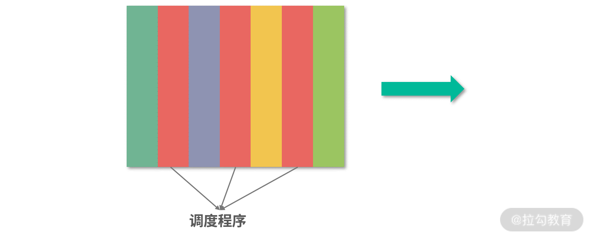

### 2、锁、信号量和分布式锁

- 锁是如何实现的？
  - 用cas或tas
- 如何控制同一时间只有2个线程运行？
  - 使用信号量
- 如何实现分布式锁？


#### （1）原子操作

原子操作就是操作不可分，在多线程环境，一个原子操作的执行过程无法被中断。

比如`i++`就不是一个原子操作，由三个原子操作组合而成的：

- 读取`i`的值
- 计算`i+1`
- 写入新的值

这类操作，在多线程+多核环境下会造成竞争条件。


#### （2）竞争条件

多个线程对一个资源的读写存在竞争

举个例子，比如两个线程并发执行i++。那么可以有下面这个操作顺序，假设执行前i=0：


虽然上面的程序执行了两次i++，但最终i的值为 1。

`i++`这段程序访问了共享资源，也就是变量`i`，这种访问共享资源的程序片段称为`临界区`。在临界区内，程序片段访问共享资源，造成竞争条件。


**解决竞争条件：**

- 不要让程序同时进入临界区，也就是互斥
- 乐观锁


**避免临界区：**

唯一条件就是每个线程都有自己的资源，不去争夺公共资源，类似于ThreadLocal


#### （3）CAS指令

利用CAS（Compare And Swap）指令，让`i++`成为原子操作。

```java
cas(&oldValue, expectedValue, targetValue)
```

当前值，内存值，目标值，如果当前值 = 内存值，那么就更新为目标值。


#### （4）tas指令

Test-And-Set（tas）指令，tas 指令的目标是设置一个内存地址的值为 1，它的工作原理和 cas 相似。首先比较内存地址的数据和 1 的值，如果内存地址是 0，那么把这个地址置 1。如果是 1，那么失败。

```
tas(&lock) {
  return cas(&lock, 0, 1)
}
```


#### （5）锁

锁（lock），目标是实现抢占（preempt），只让给定数量的线程进入临界区，锁可以用`tas`或者`cas`实现

##### 1、自旋锁

```java
while( !cas(&lock, 0, 1) ) {
    // 什么也不做
  }
```

这段代码不断在 CPU 中执行指令，直到锁被其他线程释放。这种情况线程不会主动释放资源，我们称为**自旋锁**。

自旋锁的优点就是不会主动发生 Context Switch，也就是线程切换，因为线程切换比较消耗时间。**自旋锁**缺点也非常明显，比较消耗 CPU 资源。如果自旋锁一直拿不到锁，会一直执行。


##### 2、wait操作

wait操作主动触发Context Switch，解决了 CPU 消耗的问题。但是触发 Context Switch 也是比较消耗成本的事情，那么有没有更好的方法呢？

```java
while( !cas(&lock, 0, 1) ) {
    // sleep(1000ms);
    wait();
  }
```

通过`wait`和`notify`


##### 3、Synchronized

synchronized 关键字的内部实现，用到了封装好的底层代码——Monitor 对象。每个 Java 对象都关联了一个 Monitor 对象。Monitor 封装了对锁的操作，比如 enter、leave 的调用，这样简化了 Java 程序员的心智负担，你只需要调用 synchronized 关键字。


##### 4、信号量

如何同时允许 N 个线程进入临界区呢？

```java
up(&lock){
  while(!cas(&lock, lock, lock+1)) { }
}
down(&lock){
  while(!cas(&lock, lock, lock - 1) || lock == 0){}
}
```

`up`将`lock`增 1，`down`将`lock`减 1。当 lock 为 0 时，如果还在`down`那么会自旋。考虑用多个线程同时执行下面这段程序：

```
int lock = 2;
down(&lock);
// 临界区
up(&lock);
```

如果只有一个线程在临界区，那么`lock`等于 1，第 2 个线程还可以进入。 如果两个线程在临界区，第 3 个线程尝试`down`的时候，会陷入自旋锁。当然我们也可以用其他方式来替代自旋锁，比如让线程休眠。

当`lock`初始值为 1 的时候，这个模型就是实现**互斥（mutex）**。如果 lock 大于 1，那么就是同时允许多个线程进入临界区。这种方法，我们称为**信号量（semaphore）**。


##### 5、死锁问题

如果两个线程互相等待对方获得的锁，就会发生死锁。你可以把死锁理解成一个环状的依赖关系


#### （6）分布式环境的锁

有很多工具都可以提供分布式的原子操作，比如 Redis 的 setnx 指令，Zookeeper 的节点操作等等。


#### （7）悲观锁与乐观锁

同步的一种方式，就是让**临界区**互斥。 这种方式，每次只有一个线程可以进入临界区。比如多个人修改一篇文章，这意味着必须等一个人编辑完，另一个人才能编辑。但是从实际问题出发，如果多个人编辑的不是文章的同一部分，是可以同时编辑的。因此，让临界区互斥的方法（对临界区上锁），具有强烈的排他性，对修改持保守态度，我们称为**悲观锁（Pressimistic Lock）**。

通常意义上，我们说上锁，就是悲观锁，比如说 MySQL 的表锁、行锁、Java 的锁，本质是互斥（mutex）。

和**悲观锁（PressimisticLock）持相反意见的，是乐观锁（Optimistic Lock）**。你每天都用的，基于乐观锁的应用就是版本控制工具 Git。Git 允许大家一起编辑，将结果先存在本地，然后都可以向远程仓库提交，如果没有版本冲突，就可以提交上去。这就是一种典型的乐观锁的场景，或者称为基于版本控制的场景。


**Git：**

git提交代码的方式非常类似CAS指令。

就是每次更新的发起方，需要明确地知道想从多少版本更新到多少版本。以 Git 为例，可以写出`cas`的伪代码：

```
cas(&version, 100, 108); // 成功
cas(&version, 100, 106); // 失败，因为version是108
```


**除了上锁还有哪些并发控制方法？**

处理并发还可以考虑 Lock-Free 数据结构。比如 Lock-Free 队列，是基于 cas 指令实现的，允许多个线程使用这个队列。再比如 ThreadLocal，让每个线程访问不同的资源，旨在用空间换时间，也是避免锁的一种方案。


### 3、线程的调度

所谓**调度**，是一个制定计划的过程，放在线程调度背景下，就是操作系统如何决定未来执行哪些线程


#### （1）先到先服务

这种需要用到**队列**这种数据结构，具有**先入先出（First In First Out，FIFO）性质**。


#### （2）短作业优先

会同时考虑到来顺序和作业预估时间的长短


**平均等待时间= 总等待时间/任务数**

例如 3，3，10，那么平均等待时间就是(0 + 3 + 6) / 3 = 3 分钟。 如果按照 10,3,3 的顺序来处理，就是( 0+10+13 )/ 3 = 7.66 分钟。


#### （3）优先级队列

如果有紧急任务需要插队，那么就需要这种优先级队列。

优先级队列的一种实现方式就是需要用到**堆（Heap）**这种数据结构。堆（Heap）可以帮助你在 O(1) 的时间复杂度内查找到最大优先级的元素。

比如老板的任务，就给一个更高的优先级。 而对于普通任务，可以在**等待时间（W）** 和**预估执行时间（P）** 中，找一个数学关系来描述。比如：优先级 = W/P。W 越大，或者 P 越小，就越排在前面。


#### （4）抢占

优势出现先执行大任务导致后面的小任务没有执行的情况，此时就需要用到**抢占**

抢占就是把执行能力分时，分成时间片段，让每个任务都执行一个时间片段，如果在时间片段内，任务完成，那么就调度下一个任务，如果任务没有执行完成，则中断任务，让任务重新排队，调度下一个任务。

拥有了抢占的能力，再结合之前我们提到的优先级队列能力，这就构成了一个基本的线程调度模型。线程相对于操作系统是排队到来的，操作系统为每个到来的线程分配一个优先级，然后把它们放入一个优先级队列中，优先级最高的线程下一个执行。


每个线程执行一个时间片段，然后每次执行完一个线程就执行一段调度程序。




图中用红色代表调度程序，其他颜色代表被调度线程的时间片段。调度程序可以考虑实现为一个单线程模型，这样不需要考虑竞争条件。


#### （5）多级队列模型

1. 如果一个线程优先级非常高，其实没必要再抢占，因为无论如何调度，下一个时间片段还是给它。
2. 如果希望实现最短作业优先的抢占，就必须知道每个线程的执行时间，而这个时间是不可预估的，那么这种情况又应该如何处理？


多级队列，就是多个队列执行调度


上图中设计了两个优先级不同的队列，从下到上优先级上升，上层队列调度紧急任务，下层队列调度普通任务，只要上层队列有任务，下层队列就都会让出执行权限。

- 低优先级队列可以考虑抢占 + 优先级队列的方式实现，这样每次执行一个时间片段就可以判断一下高优先级的队列中是否有任务。
- 高优先级队列可以考虑用非抢占（每个任务执行完才执行下一个）+ 优先级队列实现，这样紧急任务优先级有个区分。如果遇到十万火急的情况，就可以优先处理这个任务。

上面这个模型虽然解决了任务间的优先级问题，但是还是没有解决短任务先行的问题。可以考虑再增加一些队列，让级别更多。比如下图这个模型：


紧急任务仍然走高优队列，非抢占执行。普通任务先放到优先级仅次于高优任务的队列中，并且只分配很小的时间片；如果没有执行完成，说明任务不是很短，就将任务下调一层。下面一层，最低优先级的队列中时间片很大，长任务就有更大的时间片可以用。通过这种方式，短任务会在更高优先级的队列中执行完成，长任务优先级会下调，也就类似实现了最短作业优先的问题。

实际操作中，可以有 n 层，一层层把大任务筛选出来。 最长的任务，放到最闲的时间去执行。要知道，大部分时间 CPU 不是满负荷的。


#### （6）线程调度有哪些？

非抢占的先到先服务的模型是最朴素的，公平性和吞吐量可以保证。但是因为希望减少用户的平均等待时间，操作系统往往需要实现抢占。操作系统实现抢占，仍然希望有优先级，希望有最短任务优先。

但是这里有个困难，操作系统无法预判每个任务的预估执行时间，就需要使用分级队列。最高优先级的任务可以考虑非抢占的优先级队列。 其他任务放到分级队列模型中执行，从最高优先级时间片段最小向最低优先级时间片段最大逐渐沉淀。这样就同时保证了小任务先行和高优任务最先执行。


### 4、哲学家就餐问题

**什么情况下会触发饥饿和死锁？**

线程需要资源没有拿到，无法进行下一步，就是饥饿。死锁（Deadlock）和活锁（Livelock）都是饥饿的一种形式。

非抢占的系统中，互斥的资源获取，形成循环依赖就会产生死锁，死锁发生后，如果利用抢占解决，导致资源频繁被转让，有一定概率触发活锁。

死锁、活锁，都可以通过设计并发控制算法解决，比如哲学家就餐问题。


**问题描述：**有 5 个哲学家，围着一个圆桌就餐。圆桌上有 5 份意大利面和 5 份叉子。哲学家比较笨，他们必须拿到左手和右手的 2 个叉子才能吃面。哲学不饿的时候就在思考，饿了就去吃面，吃面的必须前提是拿到 2 个叉子，吃完面哲学家就去思考。


**问题抽象：**

哲学家和叉子都用数组表示，哲学家是一个类

```java
static class Philosopher implements Runnable {
    private static Integer[] forks;
    private static Philosopher[] philosophers;
    static {
       for(int i = 0; i < 5; i++) {
            philosophers[i] = new Philosopher(i);
            forks[i] = -1;
        }
    }
}
```

`forks[i]` 的值等于 -1，表示叉子放在桌子上，否则表示编号为`i`的叉子被编号为 x 的哲学家拿起


**死锁和活锁：**

每个哲学家用一个`while`循环表示：

```java
while(true){
  think();
  _take(LEFT(id)); 
  _take(id);
  eat();
  _put(LEFT(id));
  _put(id); 
}
void _take(id){
  while(forks[id] != -1) {  Thread.yield();  }
  Thread.sleep(10); // 模拟I/O用时
}
```

`_take`可以考虑阻塞，直到哲学家得到叉子。上面程序我们还没有进行并发控制，会发生竞争条件。 顺着这个思路，就可以想到加入并发控制，代码如下：

```java
while(true){
  think();

  synchronized(fork[LEFT(id)]) {
    _take(LEFT(id)); 
    synchronized(fork[id]) {
      _take(id);
    }
  }
  eat();
  synchronized(fork[LEFT(id)]) {
    _put(LEFT(id));
    synchronized(fork[id]) {
      _put(id); 
    }
  }
}
```

上面的并发控制，会发生死锁问题，大家可以思考这样一个时序，如果 5 个哲学家都同时通过`synchronized(fork[LEFT(id)])`，有可能会出现下面的情况：

- 第 0 个哲学家获得叉子 4，接下来请求叉子 0；
- 第 1 个哲学家获得叉子 0，接下来请求叉子 1；
- 第 2 个哲学家获得叉子 1，接下来请求叉子 2；
- 第 3 个哲学家获得叉子 2，接下来请求叉子 3；
- 第 4 个哲学家获得叉子 3，接下来请求叉子 4。

以上这种情况称为**死锁（Deadlock），**这是一种**饥饿（Starvation）**的形式。从概念上说，死锁是线程间互相等待资源，但是没有一个线程可以进行下一步操作。饥饿就是因为某种原因导致线程得不到需要的资源，无法继续工作。死锁是饥饿的一种形式，因为循环等待无法得到资源。哲学家就餐问题，会形成一种环状的死锁（循环依赖）， 因此非常具有代表性。

死锁有 4 个基本条件。

1. **资源存在互斥逻辑：每次只有一个线程可以抢占到资源**。这里是哲学家抢占叉子。
2. **持有等待**：这里哲学家会一直等待拿到叉子。
3. **禁止抢占：如果拿不到资源一直会处于等待状态，而不会释放已经拥有的资源**。
4. **循环等待**：这里哲学家们会循环等待彼此的叉子。

刚才提到死锁也是一种饥饿（Starvation）的形式，饥饿比较简单，就是线程长期拿不到需要的资源，无法进行下一步操作。

要解决死锁的问题，可以考虑哲学家拿起 1 个叉子后，如果迟迟没有等到下一个叉子，就放弃这次操作。比如 Java 的 Lock Interface 中，提供的`tryLock`方法，就可以实现定时获取：

```
var lock = new ReentrantLock();
lock.tryLock(5, TimeUnit.SECONDS);
```

Java 提供的这个能力是拿不到锁，就报异常，并可以依据这个能力开发释放已获得资源的能力。

但是这样，我们会碰到一个叫作活锁（LiveLock）的问题。LiveLock 也是一种饥饿。可能在某个时刻，所有哲学及都拿起了左手的叉子，然后发现右手的叉子拿不到，就放下了左手的叉子——如此周而复始，这就是一种活锁。所有线程都在工作，但是没有线程能够进一步——解决问题。


**解决方案：**

可以直接使用串行化进行，也就是不存在并发的情况

另一种方法是规定拿起过程必须同时拿起，放下过程也同时放下，代码如下：

```java
while(true){
    think();
    synchronized(someLock) {
      _takeForks(); 
    }
    eat();
    synchronized(someLock) {
      _puts();
    }
}
void _takeForks(){
  if( forks[LEFT(id)] == -1 && forks[id] == -1 ) {
    forks[LEFT(id)] = id;
    forks[id] = id;
  }
}
void _puts(){
    if(forks[LEFT(id)] == id)
      forks[LEFT(id)] = -1;
    if(forks[id] == id)
      forks[id] = -1;
}
```


**最终方案：**

假设当一个哲学家发现自己拿不到两个叉子的时候，他去和另一个哲学家沟通把自己的叉子给对方。这样就相当于，有一个转让方法。相比于磁盘 I/O，转让内存中的数据成本就低的多了。 我们假设有这样一个转让的方法，代码如下：

```java
 void _transfer(int fork, int philosopher) {
      forks[fork] = philosopher;
      dirty[fork] = false;
 }
```

这个方法相当于把叉子转让给另一个哲学家，这里你先不用管上面代码中的 dirty，后文中会讲到。而获取叉子的过程，我们可以进行调整，代码如下：

```java
void take(int i) throws InterruptedException {
      synchronized (forks[i]) {
          if(forks[i] == -1) {
              _take(id); 
          } else {
              Philosopher other = philosophers[forks[i]];
              if(other.state != PHIS.EATING && dirty[i]) {
                  other._transfer(i, forks[i]);
              }
          }
      }
  }
void _take(int i) throws InterruptedException {
    Thread.sleep(10);
    forks[i] = id;
}
```

最后是对 LiveLock 的思考，为了避免叉子在两个哲学家之间来回转让，我们为每个叉子增加了一个`dirty`属性。一开始叉子的`dirty`是`true`，每次转让后，哲学家会把自己的叉子擦干净给另一个哲学家。转让的前置条件是叉子是`dirty`的，所以叉子在两个哲学家之间只会转让一次。

```java
package test;

import java.util.Arrays;
import java.util.concurrent.ExecutorService;
import java.util.concurrent.Executors;
import java.util.concurrent.ThreadPoolExecutor;
import java.util.concurrent.TimeUnit;
import java.util.concurrent.atomic.AtomicInteger;
import java.util.concurrent.locks.ReentrantLock;
import java.util.concurrent.locks.StampedLock;

public class DiningPhilosophers {

    enum PHIS {
        THINKING,
        HUNGRY,
        EATING
    }
    static class Philosopher implements Runnable {

        private static Philosopher[] philosophers;
        private static Integer[] forks;
        private static boolean[] dirty;
        private PHIS state = PHIS.THINKING;
        static {
            philosophers = new Philosopher[5];
            forks = new Integer[5];
            dirty = new boolean[5];
            for(int i = 0; i < 5; i++) {
                philosophers[i] = new Philosopher(i);
                forks[i] = -1;
                dirty[i] = true;
            }
        }

        private static int LEFT(int i) {
            return i == 0 ? 4 : i-1;
        }

        public Philosopher(int id) {
            this.id = id;
        }

        private int id;

        void think() throws InterruptedException {
            System.out.println(String.format("Philosopher %d thinking...", id));
            Thread.sleep((long) Math.floor(Math.random()*1000));
            this.state = PHIS.HUNGRY;
        }
             System.out.println(Arrays.toString(forks));
                    //System.out.println(Arrays.toString(dirty));
                    if(forks[LEFT(id)] == id && forks[id] == id) {
                        this.state = PHIS.EATING;
                    } else {
                        return;
                    }
            }
            System.out.println(String.format("Philosopher %d eating...", id));
            Thread.sleep((long) Math.floor(Math.random()*1000));

            synchronized (forks) {
                dirty[LEFT(id)] = true;
                dirty[id] = true;
            }

            var lock = new ReentrantLock();
            lock.tryLock(5, TimeUnit.SECONDS);

            state = PHIS.THINKING;
        }

        void _take(int i) throws InterruptedException {
            Thread.sleep(10);
            forks[i] = id;
        }

        void _transfer(int fork, int philosopher) {
            forks[fork] = philosopher;
            dirty[fork] = false;
        }

        void _putdown(int i) throws InterruptedException {
            Thread.sleep(10);
            forks[i] = -1;
        }

        void take(int i) throws InterruptedException {

            synchronized (forks[i]) {
                if(forks[i] == -1) {
                    _take(id);
                } else {
                    Philosopher other = philosophers[forks[i]];
                    if(other.state != PHIS.EATING && dirty[i]) {
                        other._transfer(i, forks[i]);
                    }
                }
            }
        }
        void takeForks() throws InterruptedException {
            take(LEFT(id));
            take(id);
        }

        @Override
        public void run() {
            try {
                while(true) {
                    think();
                    while (state == PHIS.HUNGRY) {
                        takeForks();
                        System.out.println("here--" + Math.random());
                        eat();
                    }
                }
            } catch (InterruptedException e) {
                e.printStackTrace();
            }
        }
    }

    public static void main(String[] args) {

        for(int i = 0; i < 5; i++) {
            new Thread(new Philosopher(i)).start();
        }

    }
}
```


### 5、进程间通信

#### （1）管道

管道提供了一种能力，就是组织计算。

进程不用知道有管道存在，因此管道的设计是非侵入的。

```
进程1 | 进程2
```


相比于匿名管道，`命名管道`提供了更多的编程手段

```
进程1 > namedpipe
进程2 > namedpipe
```

将两个进程的结构都重定向到namedpipe，相当于把内容合并了再找机会处理。


#### （2）本地内存共享

同一个进程的多个线程本身是共享进程内存的。 这种情况不需要特别考虑共享内存。如果是跨进程的线程（或者理解为跨进程的程序），可以考虑使用共享内存。内存共享是现代操作系统提供的能力， Unix 系操作系统，包括 Linux 中有 POSIX 内存共享库——shmem。

Linux 内存共享库的实现原理是以虚拟文件系统的形式，从内存中划分出一块区域，供两个进程共同使用。看上去是文件，实际操作是内存。


#### （3）本地消息/队列

一种是用消息队列——现代操作系统都会提供类似的能力。Unix 系可以使用 POSIX 标准的 mqueue。另一种方式，就是直接用网络请求，比如 TCP/IP 协议，也包括建立在这之上的更多的通信协议


#### （4）远程调用

远程调用（Remote Procedure Call，RPC）是一种通过本地程序调用来封装远程服务请求的方法。

程序员调用 RPC 的时候，程序看上去是在调用一个本地的方法，或者执行一个本地的任务，但是后面会有一个服务程序（通常称为 stub），将这种本地调用转换成远程网络请求。 同理，服务端接到请求后，也会有一个服务端程序（stub），将请求转换为一个真实的服务端方法调用。


客户端服务端的通信

你可以观察上面这张图，表示客户端和服务端通信的过程，一共是 10 个步骤，分别是：

1. 客户端调用函数（方法）；
2. stub 将函数调用封装为请求；
3. 客户端 socket 发送请求，服务端 socket 接收请求；
4. 服务端 stub 处理请求，将请求还原为函数调用；
5. 执行服务端方法；
6. 返回结果传给 stub；
7. stub 将返回结果封装为返回数据；
8. 服务端 socket 发送返回数据，客户端 socket 接收返回数据；
9. 客户端 socket 将数据传递给客户端 stub；
10. 客户端 stub 把返回数据转义成函数返回值。

RPC 调用的方式比较适合微服务环境的开发，当然 RPC 通常需要专业团队的框架以支持高并发、低延迟的场景。不过，硬要说 RPC 有额外转化数据的开销（主要是序列化），也没错，但这不是 RPC 的主要缺点。**RPC 真正的缺陷是增加了系统间的耦合**。**当系统主动调用另一个系统的方法时**，**就意味着在增加两个系统的耦合**。**长期增加 RPC 调用**，**会让系统的边界逐渐腐**化。这才是使用 RPC 时真正需要注意的东西。


#### （5）消息队列

既然 RPC 会增加耦合，那么怎么办呢——可以考虑事件。事件不会增加耦合，如果一个系统订阅了另一个系统的事件，那么将来无论谁提供同类型的事件，自己都可以正常工作。系统依赖的不是另一个系统，而是某种事件。如果哪天另一个系统不存在了，只要事件由其他系统提供，系统仍然可以正常运转。

实现事件可以用消息队列。

另一个用到消息队列的场景是纯粹大量数据的传输。 比如日志的传输，中间可能还会有收集、清洗、筛选、监控的节点，这就构成了一个庞大的分布式计算网络。

总的来说，消息队列是一种耦合度更低，更加灵活的模型。但是对系统设计者的要求也会更高，对系统本身的架构也会有一定的要求。具体场景的消息队列有 Kafka，主打处理 feed；RabbitMQ、ActiveMQ、 RocketMQ 等主打分布式应用间通信（应用解耦）。


#### （6）总结：进程间通信都有哪些方法？

- **单机模型**
  - 有管道、内存共享、消息队列，三个模型中，内存共享程序最难写，但是性能最高，管道程序最好写，有标准接口，消息队列程序也较好写，比如用发布/订阅模式实现具体的程序
- **分布式模型**
  - 远程调用RPC、消息队列和网络请求。直接发送网络请求程序难写，不如直接用实现好的RPC调用框架。RPC会增加系统的耦合，可考虑消息队列，比如发布订阅事件的模式，可减少系统间的耦合。


### 6、服务应该开多少进程、多少线程

#### （1）计算密集型和I/O密集型

**计算密集型：**

- 计算密集型任务的特点是要进行大量的计算，消耗CPU资源，
- 计算密集型任务虽然也可以用多任务完成，但是任务越多，花在任务切换的时间就越多，CPU执行任务的效率就越低，所以，要最高效地利用CPU，计算密集型任务同时进行的数量应当等于CPU的核心数。

**I/O密集型：**

- 涉及到网络、磁盘IO的任务都是IO密集型任务，这类任务的特点是CPU消耗很少，任务的大部分时间都在等待IO操作完成（因为IO的速度远远低于CPU和内存的速度）。
- 对于IO密集型任务，任务越多，CPU效率越高，但也有一个限度。


#### （2）CPU工作情况指标

CPU 有 2 种状态，忙碌和空闲。此外，CPU 的时间还有一种被偷走的情况。


执行 top 指令看到目前机器状态的快照，接下来我们仔细研究一下这些指标的含义：


如上图所示，你可以细看下 **%CPU(s)** 开头那一行（第 3 行）：

1. us（user），即用户空间 CPU 使用占比。
2. sy（system），即内核空间 CPU 使用占比。
3. ni（nice），nice 是 Unix 系操作系统控制进程优先级用的。-19 是最高优先级， 20 是最低优先级。这里代表了调整过优先级的进程的 CPU 使用占比。
4. id（idle），闲置的 CPU 占比。
5. wa（I/O Wait），I/O Wait 闲置的 CPU 占比。
6. hi（hardware interrupts），响应硬件中断 CPU 使用占比。
7. si（software interrrupts），响应软件中断 CPU 使用占比。
8. st（stolen），如果当前机器是虚拟机，这个指标代表了宿主偷走的 CPU 时间占比。对于一个宿主多个虚拟机的情况，宿主可以偷走任何一台虚拟机的 CPU 时间。


#### （3）**服务应该开多少个进程、多少个线程？**

计算密集型一般接近核数，如果负载很高，建议留一个内核专门给操作系统

IO密集型一般都会开大于核数的线程和进程

无论哪种模型，都需要实地压测，以压测结果分析为准；另一方面，还需要做好监控，观察服务在不同并发场景的情况，避免资源耗尽。


#### （4）**如果磁盘坏了，通常会是怎样的情况**？

磁盘如果彻底坏了，服务器可能执行程序报错，无法写入，甚至死机。这些情况非常容易发现。而比较不容易观察的是坏道，坏道是磁盘上某个小区域数据无法读写了。有可能是硬损坏，就是物理损坏了，相当于永久损坏。也有可能是软损坏，比如数据写乱了。导致磁盘坏道的原因很多，比如电压不稳、灰尘、磁盘质量等问题。

磁盘损坏之前，往往还伴随性能整体的下降；坏道也会导致读写错误。所以在出现问题前，通常是可以在监控系统中观察到服务器性能指标变化的。比如 CPU 使用量上升，I/O Wait 增多，相同并发量下响应速度变慢等。

如果在工作中你怀疑磁盘坏了，可以用下面这个命令检查坏道：

```
sudo badblocks -v /dev/sda5
```

我的机器上是 /dev/sda5，你可以用`df`命令查看自己的文件系统。