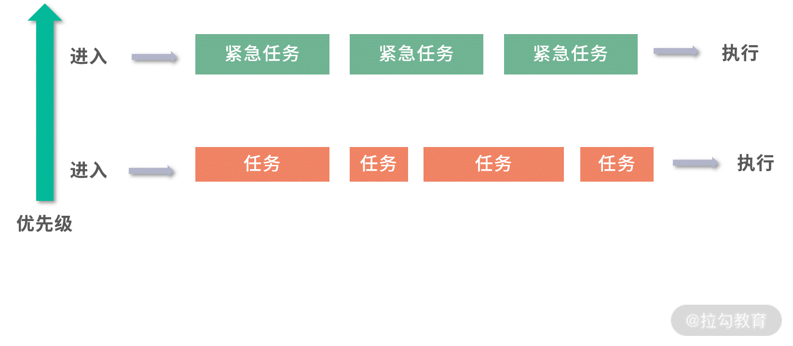

### 2、锁、信号量和分布式锁

- 锁是如何实现的？
  - 用cas或tas
- 如何控制同一时间只有2个线程运行？
  - 使用信号量
- 如何实现分布式锁？


#### （1）原子操作

原子操作就是操作不可分，在多线程环境，一个原子操作的执行过程无法被中断。

比如`i++`就不是一个原子操作，由三个原子操作组合而成的：

- 读取`i`的值
- 计算`i+1`
- 写入新的值

这类操作，在多线程+多核环境下会造成竞争条件。


#### （2）竞争条件

多个线程对一个资源的读写存在竞争

举个例子，比如两个线程并发执行i++。那么可以有下面这个操作顺序，假设执行前i=0：


虽然上面的程序执行了两次i++，但最终i的值为 1。

`i++`这段程序访问了共享资源，也就是变量`i`，这种访问共享资源的程序片段称为`临界区`。在临界区内，程序片段访问共享资源，造成竞争条件。


**解决竞争条件：**

- 不要让程序同时进入临界区，也就是互斥
- 乐观锁


**避免临界区：**

唯一条件就是每个线程都有自己的资源，不去争夺公共资源，类似于ThreadLocal


#### （3）CAS指令

利用CAS（Compare And Swap）指令，让`i++`成为原子操作。

```java
cas(&oldValue, expectedValue, targetValue)
```

当前值，内存值，目标值，如果当前值 = 内存值，那么就更新为目标值。


#### （4）tas指令

Test-And-Set（tas）指令，tas 指令的目标是设置一个内存地址的值为 1，它的工作原理和 cas 相似。首先比较内存地址的数据和 1 的值，如果内存地址是 0，那么把这个地址置 1。如果是 1，那么失败。

```
tas(&lock) {
  return cas(&lock, 0, 1)
}
```


#### （5）锁

锁（lock），目标是实现抢占（preempt），只让给定数量的线程进入临界区，锁可以用`tas`或者`cas`实现

##### 1、自旋锁

```java
while( !cas(&lock, 0, 1) ) {
    // 什么也不做
  }
```

这段代码不断在 CPU 中执行指令，直到锁被其他线程释放。这种情况线程不会主动释放资源，我们称为**自旋锁**。

自旋锁的优点就是不会主动发生 Context Switch，也就是线程切换，因为线程切换比较消耗时间。**自旋锁**缺点也非常明显，比较消耗 CPU 资源。如果自旋锁一直拿不到锁，会一直执行。


##### 2、wait操作

wait操作主动触发Context Switch，解决了 CPU 消耗的问题。但是触发 Context Switch 也是比较消耗成本的事情，那么有没有更好的方法呢？

```java
while( !cas(&lock, 0, 1) ) {
    // sleep(1000ms);
    wait();
  }
```

通过`wait`和`notify`


##### 3、Synchronized

synchronized 关键字的内部实现，用到了封装好的底层代码——Monitor 对象。每个 Java 对象都关联了一个 Monitor 对象。Monitor 封装了对锁的操作，比如 enter、leave 的调用，这样简化了 Java 程序员的心智负担，你只需要调用 synchronized 关键字。


##### 4、信号量

如何同时允许 N 个线程进入临界区呢？

```java
up(&lock){
  while(!cas(&lock, lock, lock+1)) { }
}
down(&lock){
  while(!cas(&lock, lock, lock - 1) || lock == 0){}
}
```

`up`将`lock`增 1，`down`将`lock`减 1。当 lock 为 0 时，如果还在`down`那么会自旋。考虑用多个线程同时执行下面这段程序：

```
int lock = 2;
down(&lock);
// 临界区
up(&lock);
```

如果只有一个线程在临界区，那么`lock`等于 1，第 2 个线程还可以进入。 如果两个线程在临界区，第 3 个线程尝试`down`的时候，会陷入自旋锁。当然我们也可以用其他方式来替代自旋锁，比如让线程休眠。

当`lock`初始值为 1 的时候，这个模型就是实现**互斥（mutex）**。如果 lock 大于 1，那么就是同时允许多个线程进入临界区。这种方法，我们称为**信号量（semaphore）**。


##### 5、死锁问题

如果两个线程互相等待对方获得的锁，就会发生死锁。你可以把死锁理解成一个环状的依赖关系


#### （6）分布式环境的锁

有很多工具都可以提供分布式的原子操作，比如 Redis 的 setnx 指令，Zookeeper 的节点操作等等。


#### （7）悲观锁与乐观锁

同步的一种方式，就是让**临界区**互斥。 这种方式，每次只有一个线程可以进入临界区。比如多个人修改一篇文章，这意味着必须等一个人编辑完，另一个人才能编辑。但是从实际问题出发，如果多个人编辑的不是文章的同一部分，是可以同时编辑的。因此，让临界区互斥的方法（对临界区上锁），具有强烈的排他性，对修改持保守态度，我们称为**悲观锁（Pressimistic Lock）**。

通常意义上，我们说上锁，就是悲观锁，比如说 MySQL 的表锁、行锁、Java 的锁，本质是互斥（mutex）。

和**悲观锁（PressimisticLock）持相反意见的，是乐观锁（Optimistic Lock）**。你每天都用的，基于乐观锁的应用就是版本控制工具 Git。Git 允许大家一起编辑，将结果先存在本地，然后都可以向远程仓库提交，如果没有版本冲突，就可以提交上去。这就是一种典型的乐观锁的场景，或者称为基于版本控制的场景。


**Git：**

git提交代码的方式非常类似CAS指令。

就是每次更新的发起方，需要明确地知道想从多少版本更新到多少版本。以 Git 为例，可以写出`cas`的伪代码：

```
cas(&version, 100, 108); // 成功
cas(&version, 100, 106); // 失败，因为version是108
```


**除了上锁还有哪些并发控制方法？**

处理并发还可以考虑 Lock-Free 数据结构。比如 Lock-Free 队列，是基于 cas 指令实现的，允许多个线程使用这个队列。再比如 ThreadLocal，让每个线程访问不同的资源，旨在用空间换时间，也是避免锁的一种方案。


### 3、线程的调度

所谓**调度**，是一个制定计划的过程，放在线程调度背景下，就是操作系统如何决定未来执行哪些线程


#### （1）先到先服务

这种需要用到**队列**这种数据结构，具有**先入先出（First In First Out，FIFO）性质**。


#### （2）短作业优先

会同时考虑到来顺序和作业预估时间的长短


**平均等待时间= 总等待时间/任务数**

例如 3，3，10，那么平均等待时间就是(0 + 3 + 6) / 3 = 3 分钟。 如果按照 10,3,3 的顺序来处理，就是( 0+10+13 )/ 3 = 7.66 分钟。


#### （3）优先级队列

如果有紧急任务需要插队，那么就需要这种优先级队列。

优先级队列的一种实现方式就是需要用到**堆（Heap）**这种数据结构。堆（Heap）可以帮助你在 O(1) 的时间复杂度内查找到最大优先级的元素。

比如老板的任务，就给一个更高的优先级。 而对于普通任务，可以在**等待时间（W）** 和**预估执行时间（P）** 中，找一个数学关系来描述。比如：优先级 = W/P。W 越大，或者 P 越小，就越排在前面。


#### （4）抢占

优势出现先执行大任务导致后面的小任务没有执行的情况，此时就需要用到**抢占**

抢占就是把执行能力分时，分成时间片段，让每个任务都执行一个时间片段，如果在时间片段内，任务完成，那么就调度下一个任务，如果任务没有执行完成，则中断任务，让任务重新排队，调度下一个任务。

拥有了抢占的能力，再结合之前我们提到的优先级队列能力，这就构成了一个基本的线程调度模型。线程相对于操作系统是排队到来的，操作系统为每个到来的线程分配一个优先级，然后把它们放入一个优先级队列中，优先级最高的线程下一个执行。


每个线程执行一个时间片段，然后每次执行完一个线程就执行一段调度程序。


图中用红色代表调度程序，其他颜色代表被调度线程的时间片段。调度程序可以考虑实现为一个单线程模型，这样不需要考虑竞争条件。


#### （5）多级队列模型

1. 如果一个线程优先级非常高，其实没必要再抢占，因为无论如何调度，下一个时间片段还是给它。
2. 如果希望实现最短作业优先的抢占，就必须知道每个线程的执行时间，而这个时间是不可预估的，那么这种情况又应该如何处理？


多级队列，就是多个队列执行调度



上图中设计了两个优先级不同的队列，从下到上优先级上升，上层队列调度紧急任务，下层队列调度普通任务，只要上层队列有任务，下层队列就都会让出执行权限。

- 低优先级队列可以考虑抢占 + 优先级队列的方式实现，这样每次执行一个时间片段就可以判断一下高优先级的队列中是否有任务。
- 高优先级队列可以考虑用非抢占（每个任务执行完才执行下一个）+ 优先级队列实现，这样紧急任务优先级有个区分。如果遇到十万火急的情况，就可以优先处理这个任务。

上面这个模型虽然解决了任务间的优先级问题，但是还是没有解决短任务先行的问题。可以考虑再增加一些队列，让级别更多。比如下图这个模型：


紧急任务仍然走高优队列，非抢占执行。普通任务先放到优先级仅次于高优任务的队列中，并且只分配很小的时间片；如果没有执行完成，说明任务不是很短，就将任务下调一层。下面一层，最低优先级的队列中时间片很大，长任务就有更大的时间片可以用。通过这种方式，短任务会在更高优先级的队列中执行完成，长任务优先级会下调，也就类似实现了最短作业优先的问题。

实际操作中，可以有 n 层，一层层把大任务筛选出来。 最长的任务，放到最闲的时间去执行。要知道，大部分时间 CPU 不是满负荷的。


#### （6）线程调度有哪些？

非抢占的先到先服务的模型是最朴素的，公平性和吞吐量可以保证。但是因为希望减少用户的平均等待时间，操作系统往往需要实现抢占。操作系统实现抢占，仍然希望有优先级，希望有最短任务优先。

但是这里有个困难，操作系统无法预判每个任务的预估执行时间，就需要使用分级队列。最高优先级的任务可以考虑非抢占的优先级队列。 其他任务放到分级队列模型中执行，从最高优先级时间片段最小向最低优先级时间片段最大逐渐沉淀。这样就同时保证了小任务先行和高优任务最先执行。