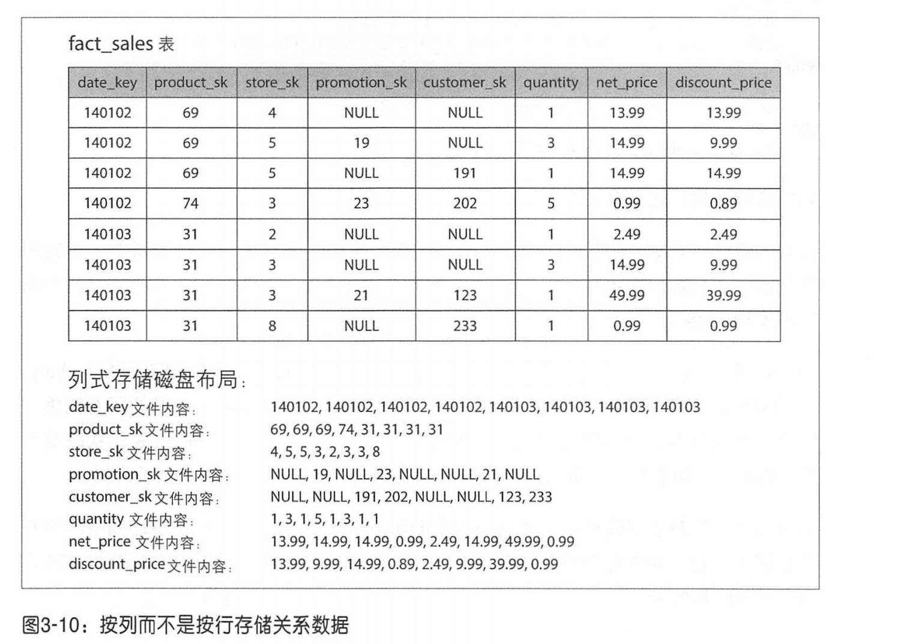
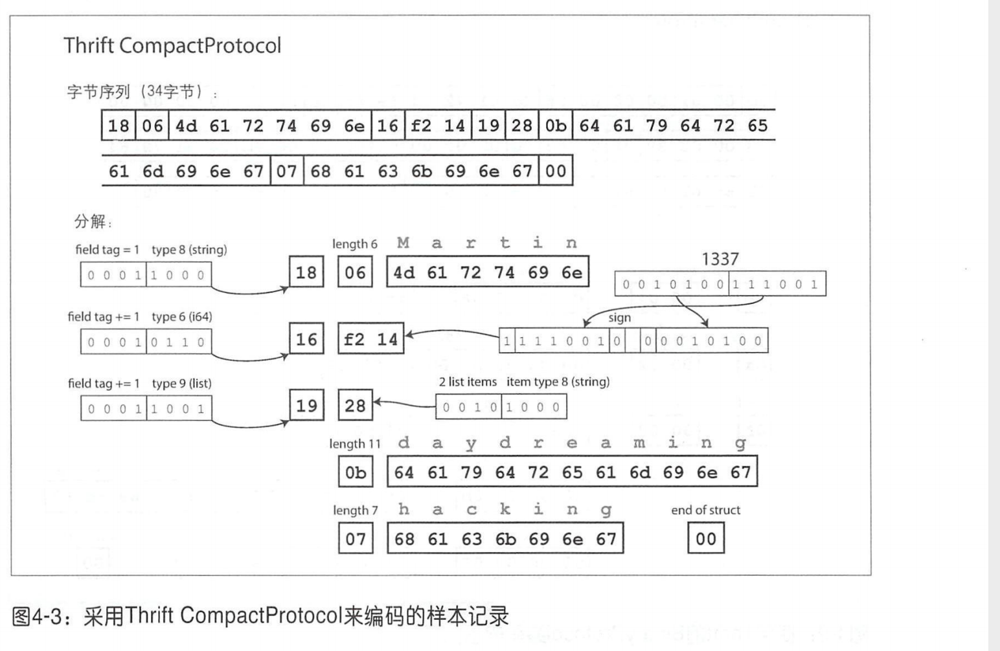
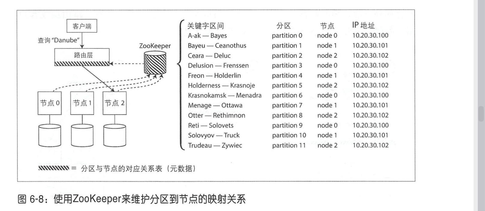

# 数据系统基础
## 1、可靠、可扩展与可维护的应用系统
**可靠性 (Reliability)**
当出现意外情况如硬件、软件故障、人为失误等，系统应可以继续正常运转：虽然性能可能有所降低，但确保功能正确。具体请参阅本章后面的“可靠性”。故障包括硬件（通常是随机的，不相关的）、软件（缺陷通常是系统的，更加难以处理）以及人为（总是很难避免时
不时会出错）方面。容错技术可以很好隐藏某种类型故障，避免最终影响用户。
**可扩展性 (Scalability)**
随着规模 增长 ，例如数据 、流量或复杂性，系统应以合理的方式来匹配这种增长， 可以将时间百分位数作为衡量性能的有效方式。对于可扩展的系统，增加处理能力的同时，还可以在高负载情况下持续保持系统的高可靠性。
**可维护性 (Maintainabi lity)**
随着时间的推移，许多新的人员参与到系统开发和运维， 以维护现有功能或适配新场景等，系统都应高效运转。

一个应用必须完成预期的多种需求，主要包括功能性需求（即应该做什么，比如存储、检索、搜索和处理数据）和一些非功能性需求（即常规特性，例如安全性、可靠性、可扩展性、可维护性、合规性和兼容性）。

## 2、数据模型与查询语言
历史上，数据最初被表示为 棵大树（层次模型），但是这不利于表示多对多关系，所以发明了关系模型来解决这个问题。最近，开发人员发现 些应用程序也不太适合关系模型。新的非关系“NoSQL”数据存储在两个主要方向上存在分歧
1. 文档数据库的目标用例是数据来自于自包含文挡，且 个文档与其他文档之间的关联很少。
2. 图数据库则针对相反的场景，目标用例是所有数据都可能会互相关联。

文档数据库和图数据库有个共同点，那就是它们通常不会对存储的数据强加某个模式，这可以使应用程序更容易适应不断变化的需求。但是，应用程序很可能仍然假定数据具有 定的结构，只不过是模式是显式（写时强制）还是隐式（读时处理）的问题。

## 数据存储与检索
### 数据库核心：数据结构
追加文件的日志方案，可以将日志分成一定大小的段，当文件达到一定大小时就关闭它，并将后续写入到新的段文件中。
可以在这些段上实行压缩，丢弃重复的键，只保留每个键最近的更新。
由于压缩往往使得段更小（假设键在段内被覆盖多次），也可以在执行压缩的同时将多个段合并在一起。
压缩过程可以让后台进程中进行，其中还可以用旧的文件接收读写请求，等压缩完成后，请求再切换到新的合并段上，旧的文件可以安全删除。

上述方案需要考虑的问题：
- 文件格式
csv不是日志的最佳格式 更快更简单的方法是使用 格式，首先以字节为单位来记录字符串的长度，之后跟上原始字符串（不需要转义）。
- 删除记录
如果要删除键和它关联的值，则必须在数据文件中追加一个特殊的删除记录（有时候称为墓碑）。当合并日志段时， 一旦发现墓碑标记，则会丢弃这个己删除键的所有值
- 崩愤恢复
如果数据库重新启动，则内存中的hashmap将丢失 。原则上，可以通过从头到尾读取整个段文件，然后记录每个键的最新值的偏移量，来恢复每个段的hashmap，但是，如果分段文件很大，可能扫描需要很长时间，这将使服务器重启变得缓慢。 Bitcask 通过将每个段的hash map 的快照存储在磁盘上，可以更快地加载到内存中，以此加快恢复速度。
- 部分写入的记录
数据库随时可能崩愤，包括将记录追加到日志的过程中Bitcask文件包括校验这样可以发现损坏部分井丢弃。
- 并发控制
由于写入以严格的先后顺序追加到日志中，通常的实现选择是只有一个写线程。数据文件段是追加的， 并且是不可变的，所以他们可以被多个线程同时读取。

追加式比原地更新的优势在于：
- 追加和分段合并是顺序写，比随机写的性能要高
- 如果段文件是追加的或不可变的，贝Jj 并发和崩愤恢复要简单得多。例如，不必担心在重写值在发生崩愤的情况，留下一个包含部分旧值和部分新值混杂在一起的文件。
- 合并旧段可以避免随着时间的推移数据文件出现碎片化的问题

哈希表索引的局限性：
- 必须全部放入内存
- 区间查询效率不高

#### SSTables和LSM-Tree（Log-Structured Merge Tree）
##### SSTables
要求KV对的顺序按键排序，称为排序字符串表，要求每个键在每个合并的段文件中只能存在一次（压缩过程可以保证）。

相较于哈希索引：
- 合并段更加高效（由于每个段都已经排好顺序）。如果一个键在多个段中存在，保留最新段的值即可。
- 在文件中查找特定的键时，不再需要遍历整个文件，只需找到前后键的位置，就可跳转到相应的偏移量进行查找。此时索引可以是稀疏索引。

**构建和维护SSTables**
存储引擎的基本工作流程如下
- 当写入时，将其添加到内存中的平衡树数据结构中（｛列如红黑树）。这个内存中的树有时被称为内存表。
- 当内存表大于某个闹值（通常为几兆字节）时，将其作为 SSTable文件写入磁盘。由于树已经维护了按键排序的key value 对， 磁盘可以比较高效。新的SSTable 文件成为数据库的最新部分。当SSTable 写磁盘的同时，写入可以继续添加到一个新的内存表实例
- 为了处理读请求，首先尝试在内存表中查找键，然后是最新的磁盘段文件，接下来是次新的磁盘段文件，以此类推，直到找到目标（或为空）。
- 后台进程周期性地执行段合并与压缩过程，以合并多个段文件，并丢弃那些已被覆盖或删除的值

但它还存在一个问题 如果数据库崩愤，最近的写入（在内存表中但尚未写入磁盘）将丢失。为了避免该问题，可以在磁盘上保留单独的日志，每个写入都会立即追加到该日志，目的是在崩愤后利用日志恢复内存表。每当将内存表写SSTable时，相应的日志可以被丢弃。

##### LSM-Tree
基于合井和压缩排序文件原理的存储引擎通常都被称为LSM存储引擎。

**性能优化：**
当找数据库中某个不存在的键时， LSM-Tree算法可能很慢：在确定键不存在之前，必须先检查内存表，然后将段一直 回溯访问到最旧的段文件（可能必须从磁盘多次读取）。为了优化这种访问，存储引擎通常使用额外的布隆过滤器。

#### B-Trees
B-tree将数据库分解成固定大小的块或页，传统上大小为4KB （有时更大），页是内部读写的最小单元。

为了使数据库能从崩愤中恢复，常见 tree 实现需要支持磁盘上的额外的数据结预写日志（ write-ahead log,WAL ），也称为重做日志。这是一个仅支持追加修改的文件，每个B-tree 的修改必须先更新WAL然后再修改树本身的页。当数据库在崩愤后需要恢复 ，该日志用于将B-tree恢复到最近的状态。

**与LSM-Tree相比较：**
LSM-Tree写更快，毕竟是追加顺序写。B-Tree读取更快。
读取通常在LSM-tree上较慢，因为它们必须在不同的压缩阶段检查多个不同的数据结构和SSTable
LSM-tree 可以支持更好地压缩，因此通常磁盘上的文件比B-tree小很多
B-Tree会将页进行分裂，所以会有内存碎片

#### 其他索引
二级索引、聚集索引（索引值是整行数据）、非聚集索引（仅存储索引中的数据的引用）、多列索引（级联索引）、全文索引、模糊索引。

### 事务处理与分析处理

#### 星型与雪花型分析模式

名称“星型模式”来源于当表关系可视化时 ，事实表位于中间，被一系列维度表包围；这些表的连接就像星星的光芒。该模板的一个变体称为雪花模式，其中维度进一步细分为子空间。例如，品牌和产品类别可能有单独的表格，在 dim_product表中 每一行都可以再次引用品牌和类别作为外键，而不是将其作为字符串直接存储在 dim_product 表中。雪花模式比星型模式更规范化，但是星型模式通常是首边，主要是因为对于分析人员，星型模式使用起来更简单

#### 列式存储
思想：不要将一行中的所有值存储在一起，而是将每列中的所有值存储在一起。如果每个列存储在一个单独的文件中，查询只需要读取和解析在该查询中使用的那些列，这可以节省大量的工作

面向列的存储布局依赖一组列文件，每个文件以相同顺序保存着数据行

##### 列压缩
通常，列中的不同值的数量小于行数（一个例如，零售商可能拥有数十亿个销售交易，但只有100000不同的产品）。现在可以使用一不同值的列，并将其转换为单独的位图，一个位图对应每个不同的值，一个位对应一行。如果行具有该值，该位为1，否则为0.

这些位图索引非常适合在数据仓库中常见的查询，由于顺序相同，按位进行与操作即可。

**列存储排序**
可以使用LSM-Tree的写操作进行排序，先在内存中写入例如红黑树中，写满或者写到阈值之后就写入到磁盘中。

### 小结：
存储引擎分为两大类：针对事务处理（ OLTP ）优化的架构，以及针对分析型（ OLAP ）的优化架构。它们的访问模式存在很大差异
- OLTP系统通常面向用户，这意味着它们可能收到大量的请求。 为了处理负载，用程序通常在每个查询中只涉及少量的记录。应用程序基于某种键来请求记，而存储引擎使用索引来查找所请求键的数据。磁盘寻道时间往往是瓶颈
- 由于不是直接面对最终用户 ，数据仓库和类似的分析型系统相对并不太广为知，它们主要由业务分析师使用 处理的 请求数目远低于OLTP系统， 但每询通常要求非常苛刻，需要在短时间 内扫描数百万记录。 磁盘带宽（不是寻道时间）通常是瓶颈，而面向列的存储对于这种工作负载成为日益流行的解决 方案。

OLTP方面，由两个主要流派存储引擎
- 日志结构流派，它只允许追加式更新文件和删除过时的文件，但不会修改的文件。
- 原地更新流派，将磁盘视为可以覆盖的 组固定大小的页。 B-tree是这 哲学的最典型代表，它已用于所有主要的关系数据库，以及大量的非关系数据库。

日志结构的存储引擎是个相对较新的方案。其关键思想是系统地将磁盘上随机访写入转为顺序写入，由于硬盘驱动器和SSD 的性能特性，可以实现更高的写入吞吐量。

### 4、数据编码与演化
#### json、xml、二进制变体

（前一位表示类型，比如0xa0表示字符串）

**Thrift 与 Protocol Buffers**

Thrift CompactProtocol 编码 语义上 同于 BinarYProtocol ，它将相同的信息打包成只有34字节，通过将字段类型和标签号打包到单字节中，并使用可变长度整数来实现。对数字1337 ，不使用全部8字节，而是使用两个字节进行编码，每字节最高位用来表示是否还有更多的字节。

为了向前兼容，新增加的字段不能设置为required

**Avro**
Avro也使用模式来指定编码的数据结构。它有两种模式语言，一种（ Avro IDL ）用于人工编辑，另一种（基于 JSON ）更易机器读取。

Avro IDL 的示例模式如下所示：

该模式的等价JSON表示如下：

- 写模式与读模式
有了 Avro ，当应用程序想要对某些数据进行编码（例如将其写入文件或数据库，以及通过网络发送） ，它使用所知道的模式的任何版本来编码数据，例如，可以编译到应用程序中的模式。这被称为写模式。
当应用程序想要解码某些数据（例如从文件或数据库读取数据，或者从网络接收数据等）肘，它期望数据符合某个模式，即读模式。这是应用程序代码所依赖的模式，代码可能是在应用程序的构建过程中基于模式而动态生成。

Avro 的关键思想是， 模式和读模式不必是完全 样，它们只需保持兼容。当数据被解码（读取）时， Avro库通过对比查看写模式和读模式并将数据从写模式转换为读模式来解决其差异。

- 模式演化规则
使用 Avro 向前兼容意味着可以将新版本的模式作为 writer ，并将旧版本的模式作为reade 。相反，向后兼容意味着可以用新版本的模式作为reader ，并用旧版本的模式作writer

为了保持兼容性，只能添加或删除具有默认值的字段

如果要添加一个没有默认值的字段，新的reader将无法读取旧的writer 数据， 因此将破坏向后兼容性。如果要删除没有默认值的字段，旧reader 无陆读取新writer的数据，因此将破坏向前兼容性。

#### 数据流模式

- 数据库，其中写入数据库的进程对数据进行编码，而读取数据库的进程对数据进行解码。
- RPC REST API ，其中客户端对请求进行编码，服务器对请求进行解码井对响应进行编码，客户端最终对响应进行解码。
- 异步消息传递（使用消息代理或Actor ），节点之间通过 相发送消息进行通信，消息由发送者编码并由接收者解码

## 分布式数据系统
### 5、数据复制
复制主要指通过互联网络在多台机器上保存相同数据的副本。通过数据复制方案，通常希望达到以下目的：
- 使数据在地理位置上更加接近用户，降低网络延迟
- 当部门组件出现不可用时，系统可以继续工作，提高可用性
- 扩展至多台服务器，同时提供数据服务，提高吞吐量

#### 主节点与从节点
**如何确保所有副本之间的数据是一致的？**
常见的解决方案是基于主节点的复制：
1. 指定某一个副本为主副本 （或称为主节点） 。当客户写数据库时，必须将写请求首先发送给主副本，主副本首先将新数据写入本地存储。
2. 其他副本则全部称为从副本（或称为从节点）注 。主副本把新数据写入本地存储后，然后将数据更改作为复制的日志或更改流发送给所有从副本。每个从副本获得更改日志之后将其应用到本地，且严格保持与主副本相同的写入顺序。
3. 客户端从数据库中读数据 ，可以在主副本或者从副本上执行查询。再次强调，只有主副本才可以接受写请求，从客户端的角度来看，从副本都是只读的。

**同步复制与异步复制**
复制流程中非常重要的一个选项

同步复制
优点：
- 主从一致
- 主节点挂掉，可直接读取从节点

缺点：
- 从节点无法完成确认的情况下，写入就会失败，阻塞后续的写操作。

半同步模式：某个从节点是同步的，其余的从节点是异步，如果同步从节点有问题，可将异步从节点升级为同步从节点，这样可以保证至少两个节点拥有最新的副本数据

全异步模式：如果主节点发生失败且不可恢复，则所有尚未复制到从节点的写请求都会丢失。这意味着即使向客户端确认了的写操作， 却无法保证数据的持久化。但全异步配置的优点则是，不管从节点上数据多么滞后，主节点总是可以继续响应写请求，系统的吞吐性能更好

全异步模式适用于从节点数量巨大并且节点地理位置分布广泛。

**配置新的从节点**
如何确保新的从节点和主节点保持数据一致呢？

或许应该考虑锁定数据库（使其不 写）来使磁盘上的文件保持一致，但这会违反可用的设计目标。
逻辑上的主要操作步骤如下：
1. 在某个时间点对主节点的数据副本产生一个一致性快照，这样避免长时间锁定整个数据库。目前大多数数据库都支持此功能，快照也是系统备份所必需的。而在某些情况下，可能需要第三方工具， MySQL innobackupex
2. 将此快照拷贝到新的从节点
3. 从节点连接到主节点并请求快照点之后所发 的数据更改日志。因为在第一步建快照时，快照与系统复制日志的某个确定位置相关联，这个位置信息在不同的系统有不同的称呼
4. 获得日志之后，从节点来应用这些快照点之后所有数据变更，这个过程称之为追赶。

**处理节点失效**
从节点失效：
    追赶式恢复，重启后连接到主节点，将最新数据进行同步

主节点失效：
    节点切换，选择某个从节点将其提升为主节点；客户端也需要更新，这样之后的写请求会发送给新的主节点，然后其他从节点要接受来自新的节点上的变更数据，这过程称之为切换。

自动切换步骤：
- 确认主节点失效，可使用心跳机制
- 选举新的主节点，新主节点跟旧主节点的差异要越小越好
- 重新配置系统，使主节点生效

问题：
- 异步复制情况下，失效之前，新主节点并未接收旧主节点的全部数据，选举之后，旧主节点很快恢复并加入到集群中，此时执行写操作时，新主节点会收到很多冲突请求，这是因为原主节点未意识到角色变化
    - 常见的解决方案是，原主节点上未完成复制的写请求就此丢弃，但这可能会违背数据更新持久化的承诺。
- 如果在数据库之外有其他系统依赖于数据库的内容并在一起协同使用，丢弃数据的方案就特别危险。
- 如果发生脑裂，数据可能会丢失或损坏，应急方案是可强制关闭一个节点。
- 如何设置合适的超时时间检测主节点失效，时间太长会导致恢复的时间也长；时间太短，在高并发情况下，系统性能下降，响应较慢，可能会发生重复切换，

**复制日志的实现**
1、基于语句的复制
问题：对非确定性函数的使用或者自增列的使用，会导致在各个副本都产生不一样的值。
解决：可在主节点中替换成固定值进行复制。

2、基于预写日志（WAL）传输
存储引擎的磁盘数据结构，通常每个写操作都是以追加写的方式写入到日志中：
- 对于日志结构存储引擎（参阅第 章的“SSTab es LSM-trees ”），日志是主要的存储方式。日志段在后台压缩井支持垃圾回收。
- 对于采用覆盖写磁盘的Btree结构，每次修改会预先写入日志，如系统发生崩愤，通过索引更新的方式迅速恢复到此前一致状态。

**基于行的逻辑日志复制**
复制和存储引擎采用不同的日志格式，这样复制与存储逻辑剥离。这种复制日志称为逻辑日志，以区分物理存储引擎的数据表示。
关系数据库的逻辑日志通常是指一系列记录来描述数据表行级别的写请求：
- 对于行插入，日志包含所有相关列的新值。
- 对于行删除，日志里有足够的信息来唯 标识已删除的行，通常是靠主键，但如果表上没有定义主键，就需要记录所有列的旧值。
- 对于行更新，日志包含足够的信息来唯 标识更新的行，以及所有列的新值（或至少包含所有已更新列的新值）。

**基于数据库的触发器的复制**

#### 复制滞后问题
**读自己的写**
这对于读密集和偶尔写入的负载是个非常合适的方案

异步复制存在一个问题，写入不久即查看数据，如果读写不在同一个节点上，并且读节点数据未同步，会发生数据丢失的问题

基于主从复制的系统该如何实现写后读一致性呢？
- 如果用户访问可能会被修改的内容，从主节点读取，否则在从节点读取。
- 如果大部分内容都支持修改，就需要判断是否从主节点读取
- 客户端还可以记住最近更新时的时间戳 ，井附带在读请求中，据此信息，系统可以确保对该用户提供读服务时都应该至少包含了该时间戳的更新如果果不够新，要么交给另一个副本来处理，要么等待直到副本接收到了最近的更新。
- 如果副本分布在多数据中心，那么必须先把请求路由到主节点所在的数据中心

**单调读**

实现单调读的一种方式是，确保每个用户总是从固定的同一副本执行读取。

**前缀一致读**
保证数据之间的因果关系，例如，总是以正确的顺序先读取问题，然后看到回答。

#### 多主节点复制
单主节点的问题在于主节点或者因为网络等原因无法连接时，会影响写入。
可配置多个主节点，每个主节点都支持写入，除了将数据复制到从节点之外，还必须将写入请求转发到其他主节点。此时，每个主节点还同时扮演其他主节点的从节点。

**适用场景：**
1、多数据中心
可以在每个数据中心都配置主节点

在多数据中心的环境下，部署单主节点的主从复制方案和多主节点的主从复制方案之间的差异：
- 性能：多主节点往往是为了在地理位置上更接近用户，有更好的访问，多主节点的写入可以异步复制到其他数据中心
- 容忍数据中心失效
- 容忍网络问题

问题：不同的数据中心可能会修改同一份数据，会有冲突问题

2、离线客户端操作
应用在断开网络后还需要继续工作

此时，每个设备都有一个充当主节点的本地数据库，然后所有设备之间通过异步的方式进行同步数据，同步滞后时间取决于何时联网

3、协作编辑
如果要确保不会发生编辑冲突，则应用程序必须先将文档锁定，然后才能对其进行编辑。如果另一个用户想要编辑同一文档，首先必须等到第一个用户提交修改并释放锁。这种协作方式相当于是在主从复制模式下的主节点执行事务操作。

同时，可编辑的粒度要尽可能小，可提高编辑效率。

**处理写冲突**

1、同步与异步冲突检测
异步冲突检测会有延迟
同步冲突检测适合于单主节点的主从复制。

2、避免冲突
如果应用层可以保证对特定记录的写请求，总是通过同一个主节点，这样就不会发生写冲突。

但是，在需要更改主节点的情况下，这种冲突处理方式不再生效，必须有措施来处理同时写入冲突的可能性

3、收敛于一致状态
对干主从复制模型，数据更新符合顺序性原则，即如果同－个字段有多个更新，则最后一个写操作将决定该字段的最终值。
对于多主节点复制模型，由于不存在这样的写入顺序，所以最终值也会变得不确定。

如果每个副本都只是按照它所看到写入的顺序执行，那么数据库最终将处于不一致状态。

所有的复制模型至少应该确保数据在所有副本中最终状态一定是一致的。因此，数据库必须以一种收敛趋同的方式来解决冲突，这就意味着当所有更改最终被复制、同步之后，所有副本的最终值是相同的。

实现收敛的冲突解决有以下可能的方式：
- 分配唯一的id，挑选ID最大者写入，其他的丢弃，比如使用时间戳、UUID等，可能会导致数据丢失
- 为每个副本分配一个ID，井制定规则，例如序号高的副本写入始终优先于序号低的副本。这种方法也可能会导致数据丢失。
- 通过某个方式将值合并在一起
- 利用预定义好的格式来记录和保留冲突相关的所有信息，然后依靠应用层的逻辑，事后解决冲突（可能会提示用户）

4、自定义冲突解决逻辑
解决冲突最合适的方式可能还是依靠应用层，所以大多数多主节点复制模型都有工具让用户编写应用代码来解决冲突。可以在写入时或在读取时执行这些代码逻辑：
- 写入时执行：
    数据库在复制日志时检测到冲突，就调用冲突处理逻辑
- 读取时执行：
    写入时保存多个值，在读取数据时候，将多个数据返回给用户，提供用户选择哪个版本

**拓扑结构：**

最常见的拓扑结构是：“全部-至-全部”，每个主节点将其写入同步到其他所有主节点。

在环形和星形拓扑中，写请求需要通过多个节点才能到达所有的副本，即中间节点需要转发从其她节点收到的数据变更。为防止无限循环，每个节点需要赋予一个唯标识符，在复 日志中的每个写请求都标记了已通过的节点标识符。如果某个节点收到了包含自身标识符的数据更改，表明该请求已经被处理过，因此会忽略 变更请求，避免重复转发。

环形/星形的问题是，如果某一个节点发生故障，在修复之前，会影响其他节点之间复制日志的转发，可以采用重新配置拓扑结构的方法来暂时排除掉故障节点（手动）。
而对于链接更密集的拓扑（全部-至-全部），消息可以沿着不同路径传播，避免了单点故障

#### 无主节点复制
允许任何副本直接接受来自客户端的写请求。

**节点失效时写入数据库**
如果有副本在写入前挂了，写入后重启，那么从这个副本读取的请求可能会有旧数据，这个时候可以像所有副本发读取请求，将所有返回数据进行对比，可以使用版本号确认哪个是最新的。

- 读修复与反熵

Dynamo 风格的数据存储系统经常使用以下两种机制：
1、读修复：
    客户端并行读取多个副本时，可以检测到过期的返回值，然后客户端用新值去覆盖过期副本上的值
2、反熵
    有后台进程不断查找副本之间数据的差异，将任何缺少的数据从一个副本复制到另一个副本。与基于主节点复制的复制日志不同，此反熵过程并不保证以特定的顺序复制写入，并且会引入明显的同步滞后。

- 读写quorum
如果有n个副本，写入需要w个节点确认，读取必须要查询r个节点，则只要 w+r > n, 读取的节点一定包含最新值，例如n = 3, w = r = 2, 满足上述的r\w数称为法定票读数\法定票写数

Dynamo风格的数据库中，参数通常是可配置的。 一个常见的选择是设置n为某奇数（通常为5）, w=r = (n + 1) / 2 （向上舍入）

仲裁条件w+r>n定义了系统可容忍的失效节点数，如下所示：
- 当w<n ，如果一个节点不可用，仍然可以处理写入。
- 当r<n ，如果一个节点不可用，仍然可以处理读取。
- 假定 = 3 , w = 2, 可以容忍一个不可用的节点。
- 假定 = 5, w = 3, 可以容忍两个不可用的节点。
- 通常，读取和写入操作总是井行发送到所有的n个副本。参数w和参数r只是决定要等待的节点数。即有多少个节点需要返回结果 ，我们才能判断出结果的正确性

**Quorum一致性的局限性**
也可以将w、r设置成不一定大于n/2的数字，这样的话优点在于支持更低的延迟和更高的可用性，缺点在于可能读取到的是旧值，因为w和r不一定会有重合

即使 w+r>n 的情况下，也可能存在返回旧值的边界条件 。这主要取决于具现，可能的情况包括:
- 如果采用了slopp quorum，w和r节点可能完全不相同，无法保证重叠的节点
- 写操作并发，唯一的安全方案是将值进行合并，如果用时间戳挑选最新写入的，可能会因为时钟偏差的问题
- 读写同时发生，写操作仅在一些副本中完成，那么读也有可能返回旧值
- 如果写入在一些副本上失败，那么总数小于w，成功的不会进行回滚，后续读依然可以返回新的值。
- 如果具有新值的节点由于某些原因失败了，但恢复数据来自于旧值，那么总数就会小于w，打破了仲裁条件

**检测并发写**

例如上图中的数据在并发情况下永远无法达成一致。

- 最后写入者获胜（丢弃并发写入）
一种实现最终 方在是是，每个副本总是保存最新值，允许覆盖并丢弃旧值。

但确认哪个最新的，也是一个难题，是否可以使用中心化节点写入比较值，例如时间戳等

- Happens-before关系和并发
确定前后关系：

服务器判断操作是否并发的依据主要依靠对比版本号，而并不需要解释新旧值本省，算法的工作流程如下：
- 服务器为每个主键维护一个版本号，每当主键新值写入时递增版本号，并将新版本号与写入的值一起保存
- 当客户端读取主键时，服务器将返回所有当前值以及最新的版本号，且要求写之前，客户必须先发送读请求
- 客户端写主键，写请求必须包含之前读到的版本号、读到的值和新值合并后的集合。写请求的响应可以像读操作一样，会返回所有当前值
- 当服务器收到带有特定版本号的写入时，覆盖该版本号或更低版本的所有值，单必须保存更高版本号的所有值。

### 6、数据分区
采用数据分区的目的是提高可扩展性。不同的分区可放在一个无共享集群的不同节点上，这样一个大数据集可以分散在更多的磁盘上，查询负载也随之分配到更多的处理器上。

对单个分区进行查询时，每个节点对自己所在分区可以独 执行查询操作，因此添加更多的节点可以提高查询吞吐量。

#### 数据分区与数据复制
分区与复制一般是结合使用的，即每个分区在多个节点都存在副本，

#### 键-值数据的分区
如果分区不均匀，则 出现某些分区节点比其他分区承担更多的数据量或查询负载，称之为倾斜。倾斜会导致分区效率严重下降，在极端情况下，所有的负载可能会集中在一个分区节点

随机分配的方法可以平衡每个节点的数据，但是查找的时候根本不知道在哪个节点上。

**基于关键字区间分区**
一种分区方式是为每个分区分配一段连续的关键字或者关键宇区间范围（以最小值和最大值来指示）

关键字的区间段不一定非要均匀分布，这是因为数据本来就不均匀。

每个分区内可以按照关键字排序保存，这样可以轻松支持排序。

基于关键字的区间分区的缺点是某些访问模式会导致热点，比如基于时间的查询，都查询最近的数据，会让某个节点负载激增。

可以使用时间戳以外的其他内容作为关键字的第一项，先由第一项进行排序，然后在根据时间戳排序。

**基于关键字哈希值分区**
一个好的哈希函数可以处理数据倾斜并使其均匀分布，一旦找到合适的关键字哈希希函数，就可以为每个分区分配一个哈希范围

这种方法可以很好地将关键字均匀分配在多个分区中。分区边界可以是均匀间隔，也可以是伪随机选择。

哈希索引不支持区间检索。

可以使用关键字进行哈希，然后使用其他字段在段文件内进行排序。

**负载倾斜与热点**
基于哈希的分区方能可以减轻热点，但无住做到完全避免。有个极端情况是，所有的读／写操作都是针对同一个关键字，则最终所有请求都将被路由到同一个分区。

#### 分区与二级索引

**基于文档分区的二级索引**
分区索引独立，各自维护自己的二级索引
二级索引存储在与关键字相同的分区，这意味着写入时我们只需要更新一个分区，但缺点是读取二级索引时需要在
所有分区上执行scatter/gather

**基于词条的二级索引分区**
可以对所有的数据构建全局索引，而不是每个分区维护自己的本地索引。而且，为避免成为瓶颈，不能将全局索引存储在一个节点上，否则就破坏了设计分区均衡的目标。所以，全局索引也必须进行分区，且可以与数据关键字采用不同的分区策略。

#### 分区再平衡
在节点增/减期间，会进行分区之间的数据平衡

**动态再平衡的策略**
取模的方法在节点增减时候，数据需要全量迁移。

**固定数量的分区**
有个相当简单的解决方案，首先，建远超实际节点数据分区数，然后为每个节点分配多个分区。

如果集群中添加了个新节点，该新节点可以从每个现有节点上匀走几个分区，直到分区再次达到全局平衡

选中的整个分区会在节点之间迁移，但分区的总数量 维持不变， 不会改变关键字到分区的映射关系。这里唯 要调整的是分区与节点 对应关系。考虑到节点间通过网络传输数据总是需要些 这样调整 以逐步完成，在此期间， 旧的分区 然可接收读写请求。

**动态分区**
随着数据量变大变小进行裂变和合并，可以调整阈值。

**按节点比例分区**
采用动态分区策略，拆分和合并操作使每个分区的大小维持在设定的最小值和最大值之间，因此分区的数 与数据集的大小成正比关系。另一方面，对于固定数 的分区方式，其每个分区的大小 与数据集的大小成正 。两种情况，分区的数 都与节点数无关。

第三种方式，使分区数与集群节点数成正比关系，。此时， 节点数不变时，每个分区的大小与数据集大小保持正比的增长关系 当节点数增 时，分区 会调整变得更小。

当一个个新节点 入集群时，它随机选择固定数量的现有分区进行分裂，然后 走这些分区的 半数据量，将另 半数据留在原节点。随机选择可能会带来不太公平的分区分裂，但是当平均分区数 较大时（Ca ssa ndra默认情况下，每个节点有256个分区），新节点最终会从现有节点中拿走相当数量的负载。

**自动与手动再平衡操作**

#### 请求路由
这个问题有以下几种不同的处理策略（分别如图 6-7 所示的 种情况）：
1. 允许客户端链接任意的节点（例如，采用循环式的负载均衡器）。如果某节点恰好拥有所请求的分区，贝 直接处理该请求 ：否则，将请求转发到下 合适的节点，接收答复，并将答复返回给客户端。
2. 将所有客户端的请求都发送到 个路由层，由后者负责将请求转发到对应的分区节点上。路由层本身不处理任何请求，它仅充一个分区感知的负载均衡器。
3. 客户端感知分区和节点分配关系。此时，客户端可以直接连接到目 标节点，而不需要任何中介。

许多分布式数据系统依靠独立的协调服务（例如ZooKeeper ）跟踪集群范围内的元数据

### 7、事务

#### 深入理解事务

**ACID的含义**

分别代表原子性（ Atomicity ），一致性（ Consistency ），隔离性（ Isolation ）与持久性（ Durability ）

原子性，隔离性和持久性是数据库自身的属性，而ACID 中的一致性更多是应用层的属性。

而不符合ACID标准的系统被惯于BASE，即基本可用性（ Basically Available ），软状态（ Soft state ）和最终一致性（ Eventual consistency) 

- 原子性：要么成功，要么失败，在出错时中止事务，并将部分完成的写入全部丢弃。
- 一致性：指对数据有特定的期待状态，任何数据更改必须满足这些状态约束。本质上要求应用层来维护状态一致。
- 隔离性：并发执行的多个事务相互隔离，不能相互交叉
- 持久性：一旦事务提交成功，即使存在硬件故障或数据库崩溃，事务所写入的任何数据也不会消失。

**单对象与多对象事务操作**

**处理错误与中止**

ACID数据库基于这样的一个理念：如果存在违反原子性、隔离性或持久性的风险，则完全放弃整个事务， 而不是部分放弃。

但是，在无主节点复制数据存储会在尽力而为的基础上多做尝试，即是数据库并不会撤销已写入的数据。

#### 弱隔离级别

##### 读-提交

读－提交是最基本的的事务隔离级别，它只提供以下两个保证

1、读数据库肘，只能看到巳成功提交的数据（防止“脏读”）。

2、写数据库肘，只会覆盖已成功提交的数据（防止“脏写”）。

**防止脏读**

假定某个事务已经完成部分数据写入，但事务尚未提交（或中止），此时另一个事务是否可以看到尚未提交的数据呢？如果是的话，那就是脏读。

两种情况需要防止脏读：

- 如果事务需要更新多个对象，脏读意味着另一个事务可能会看到部分更新，而非全部。
- 如果事务发生中止，所有的写入操作都需要回滚。

**防止脏写**

读-提交 隔离级别可以防止脏写，通常的方式是推迟第二个事务的写请求，直到前面的事务已经完成。

但这并不能完全避免错误写入，比如需要将age = 10的记录进行+1，两个事务获取到的都是10，然后顺序写入，最后的结果仍然是错误的。

**实现 读-提交 **

采用行锁来防止脏写，当事务想修改某个对象（例如行或文档）时，它必须首先获得该对象的锁；然后 直持有锁直到事务提交（或中止）

但是，使用相同的方式虽然能解决脏读的问题，但是会造成阻塞，比如运行长时间的写入会导致许多只读的事务等待太长时间。

所以，数据库都会维护其 旧值和当前持锁事务将要设 的新值两个版本。在事务提交之前，所有其他读操作都读取旧值；仅当写事务提交之后，才会切换到读取新值。

##### 快照级别隔离与可重复读

这种现象被称为不可重复读或读倾斜。

快照隔离级别的思想是每个事务都从数据库的一致性快照中读取， 开始所看到是最近提交的数据， 即使数据随后可能被某个事务更改，但保证每个事务都只看到该特定时间点的旧数据。

**实现快照隔离级别**

使用写锁来防止脏写，同时由于读取是从快照中读取，所以读请求不会影响写请求，且两者之间没有竞争。

为了实现这个，数据库保留了对象多个不同的提交版本，这种技术也称为**多版本并发控制（MVCC）**

在读－提交级别下，对每一个不同的查询单独创建一个快照；而快照级别隔离则是使用一个快照来运行整个事务。

当事务开始时， 首先赋予一个唯一的、单调递增的事务ID (txi ）。每当事务向数据库写入新内容时，所写的数据都会被标记写入者的事务ID

如果事务要删除某行， 主行实际上并未从数据库中删除，而只是将deleted_by字段设置为请求删除的事务ID （仅仅标记为删除） 。事后，当确定没有其他事务引用该标记删除的行时，数据库的垃圾回收进程才去真正删除井释放存储空间。

**索引与快照级别隔离**

多版本数据库该如何支持索引呢？

一种方案是索引直接指向对象的所有版本，然后想办怯过滤对当前事务不可见的那些版本。当后台的垃圾回收进程决定删除某个旧对象版本时，对应的索引条目也需要删除。

主体结构是B-tree ，但采用了 种追加／写时复制的技术，当需要更新时，不会修改现有的页面，而总是创建 个新的修改副本，拷贝必要的内容，然后让父结点，或者递归向上直到树的root 结点都指向新创建的结点。那些不受更新影响的页面都不需要复制，保持不变并被父结点所指向。

这种采用追加式的 B-tree ，每个写入事务（或 批事务）都会创建 个新的B-tree root ，代表该时刻数据库的 致性快照。这时就没有必要根据事务ID 再去过滤掉某些对象，每笔写入都 修改现有的 B-tree，因为之后的查询可以直接作用于特定快照B-tree

**可重复读**

**防止更新丢失**

写事务并发，可能存在更新丢失的问题

比如需要将age = 10的记录进行+1，两个事务获取到的都是10，然后顺序写入，最后的结果仍然是错误的。

可通过显式加锁的方式去防止更新丢失。

同时也可通过 “比较-设置”的方式去防止，CAS

**冲突复制与解决**

对于多主节点或者无主节点的多副本数据库，由于支持多个井发写 ，且通常以异步方式来同步更新，所会出现多个最新的数据副本。

可以采用应用层解决，比如抛给用户，让用户选择某个版本，又比如可以通过LWW（最后更新获胜）

**写倾斜与幻读**

**写倾斜：**

事务首先查询数据，根据返回的结果而作出某些决定，然后修改数据库。当事务提交时，支持决定的前提条件已不再成立。只有可串行化的隔离才能防止这种异常。

在快照隔离级别下，如果有两个事务，执行的条件相同，但是结果是不对的。比如同一时间至少有一名医生在值班，此时两个人都想要进行调班，由于快照，检测的条件都符合，但是设置成功后，会发现没有医生值班的情况。

如果两个事务读取相同的一组对象，然后更新其中一部分：不同的事务可能更新不同的对象，则可能发生写倾斜不同的事务如果更新的是同一个对象，则可能发生脏写或更新丢失

一个次优的选择是对事务依赖的行来显式的加锁。

**幻读**

在一个事务中的写入改变了另一个事务查询结果的现象，称为幻读。快照级别隔离可以避免只读查询时的幻读，

事务读取了某些符合查询条件的对象，同时另 客户端执行写入，改变了先前的查询结果。快照隔离可以防止简单的幻读，但写倾斜情况则需要特殊处理，例如采用区间范围锁。

#### 串行化

可串行化隔离通常被认为是最强的隔离级别。它保证即使事务可能会井行执行，但最终的结果与每次一个即串行执行结果相同。这意味着，如果事务在单独运行时表现正确，那么它们在并发运行时结果仍然正确，换句话说，数据库可以防止所有可能的竞争条件。

**严格串行执行事务**

如果每个事务的执行速度非常快，且单个CPU核可以满足事务的吞吐量要求，严格串行执行是 个非常简单有效的方案。

当满足以下约束条件时，串行执行事务可以实现串行化隔离：

- 事务必须简短而高效，否则 慢的事务会影响到所有 事务的执行性能。

- 仅限于活动数据集完全可以加载到内存的场景。有些很少访问的数据可能会被移到磁盘，但万一单线程事务需要访问它，就会严重拖累性能 

- 写入吞吐 必须足够低，才能在单个CPU核上处理；否则就需要采用分区，最好没有跨分区事务。

- 跨分区事务虽然也可以支持，但是占比必须很小。

**两阶段加锁(two-phase locking, 2PL）**

一直是实现可串行化的标准方式，但还是有很多系统出于性能原因而放弃使用它。

如果两个事务 同时尝试写入同一个对 ，以加锁的方式来确保第二个写入，待前面事务完成（包括中止或提交）。两阶段加锁方怯类似，但锁的强制性更高。

多个事务可以同时读取同 对象，但只要出现任何写操作（包括修改或删除），则必须加锁以独占访问：

mysql可以用读写锁

**可串行化的快照隔离 （SSI)**

一种最新算法， 可以避免前面方法的大部分缺点 。它秉持乐观预期的原则，允许多个事务并发执行而不互相阻塞；仅当事务尝试提交时，才检查可能的冲突，如果发现违背了串行化，则某些事务会被中止。

*悲观与乐观的并发控制*

两阶段加锁是一种典型的悲观井发控制机制。它基于这样的设计原则 如果某些操作可能出错（例如与其他并发事务发生了锁冲突），那么直接放弃，采用等待方式直到绝对安全。这和多线程编程中互斥锁是一致的。

可串行化的快照隔离则是一种乐观并发控制。

如果可能发生潜在冲突，事务会继续执行而不是中止，寄希望一切相安无事：而当事务提交时（只有可串行化的事务被允许提交），数据库会检查是否确实发生了冲突（即违反了隔离性原则），如果是的话，中止事务并接下来重试。

*检测是否读取了过期的MVCC对象*

为防止这种异常，数据库需要跟踪那些由于MVCC可见性规则而被忽略的写操作。当事务提交 ，数 库会检查是否存在一些当 初被忽略的写操作现在已经完成了提交，如果是则必须中止当前事务。

*检测写是否影晌了之前的读*

与两阶段加锁相比，可串行化快照隔离的一大优点是事务不需要等待其 事务所持有的锁。这一点和快照隔离一样 ，读写通常不会互相阻塞。这样的设计使得查询延迟更加稳定、可预测。特别是，在 致性快照上执行只读查询不需要任何锁，这对于读密集的负载非常有吸引力。