[toc]


# 数据结构与算法


 

## 一、复杂度分析


### 1、为什么需要复杂度分析

用运行程序得知复杂度是**事后统计法**，有几种缺陷：

- 测试结果严重依赖测试环境
- 测试结果受数据规模影响大

所以，需要一个不用具体的测试数据就能粗略估计算法执行效率的方法。


### 2、大O复杂度表示法

假如一行代码的执行时间是UNIT_TIME，那么所有代码的执行时间T(n)与每行代码的执行次数成正比。
$$
T(n) = O(f(n))
$$

- T(n)是代码执行时间
- n是数据规模大小
- f(n)是每行代码执行的次数总和
- O表示T(n)与f(n)表达式成正比

例如：时间复杂度为 
$$
T(n) = O(2n^2 + 2n)
$$

```java
for(i = 1;i<n;i++) {
    i++;
	for (j = 1;j<n;j++) {
        i+j;
    }
}
```


大O时间复杂度表示法并不代表代码真正的执行时间，而是表示代码执行时间随数据规模增长的变化趋势，也叫**渐进时间复杂度**

而公式中的低阶、常量、系数三部分并不影响增长趋势，所以都可以忽略，只需记录一个最大量级，如果用大O表示法表示上述例子的时间复杂度，可以记为：
$$
T(n) = O(n^2)
$$


### 3、时间复杂度分析

（1）只关注循环执行次数最多的一段代码

（2）加法法则：总复杂度等于量级最大的那段代码的复杂度
$$
T1(n)=O(f1(n)),T2(n)=O(f2(n)),
那么T(n)=T1(n)+T2(n)=MAX(O(f1(n)),O(f2(n)))=O(MAX(f1(n),f2(n))
$$
（3）乘法法则：嵌套代码的复杂度等于嵌套内外代码复杂度的乘积
$$
T1(n)=O(f1(n)),T2(n)=O(f2(n)),
那么T(n)=T1(n)*T2(n)=O(f1(n))*O(f2(n))=O(f1(n)*f2(n))
$$
例如：

```java
int a(int[] array) {
    for (int i=0;i<array.length;i++) {
        b(i)
    }
}

int b (int num) {
    for (int i=0;i<num;i++) {
        i++;
    }
}
```


1）单段代码看高频：比如循环。
2）多段代码取最大：比如一段代码中有单循环和多重循环，那么取多重循环的复杂度。
3）嵌套代码求乘积：比如递归、多重循环等
4）多个规模求加法：比如方法有两个参数控制两个循环的次数，那么这时就取二者复杂度相加。 


### 4、常见时间复杂度分析

  

可分为**多项式量级** 和 **非多项式量级** ，后一项只有两个：O(2^n) 和 O(n!)

把时间复杂度为非多项式量级的算法问题叫做NP（ Non-Deterministic Polynomial，非确定多项式） 问题。


**多项式量级复杂度**

#### 1、O(1)

只要算法中不存在循环、递归语句，即使有多行代码，也是O(1)


#### 2、O(logn)、O(nlogn)

例如：下例代码的时间复杂度为O(logn)

```java
 i=1;
 while (i <= n)  {
   i = i * 2;
 }
```

$$
2^x = n , x = logn
$$

即使是
$$
3^x=n, x=log_3n,也是logn,因为log_3n=logn*log_32,系数省略
$$


而O(nlogn)是循环执行O(logn)的代码


#### 3、O(m+n)、O(m*n)

代码复杂度由两个数据的规模决定

无法评估m、n谁的量级大，所以是相加或相乘。


### 5、空间复杂度分析

时间复杂度的全称是渐进时间复杂度，表示算法的执行时间与数据规模之间的增长关系。

空间复杂度是渐进空间复杂度，表示算法的存储空间与数据规模之间的增长关系。

就是看分配了多少空间，比如创建了一个容量为n的数组，那么空间复杂度就是O(n)


#### 6、最好、最坏时间复杂度

```java
for (; i < n; ++i) { 
    if (array[i] == x) { 
        pos = i; 
        break; 
    } 
}
```

例如上一段代码，最好情况是O(1)，最坏情况是O(n)

最好时间复杂度就是在最理想的情况下，执行这段代码的时间复杂度。

最坏时间复杂度就是在最糟糕的情况下，执行这段代码的时间复杂度。


### 7、平均时间复杂度

```java
for (; i < n; ++i) { 
    if (array[i] == x) { 
        pos = i; 
        break; 
    } 
}
```

上述代码有n+1种情况，在数组0~n-1位置中和不在数组中，把每种情况需要遍历的次数加起来再平均，就是平均复杂度
$$
\frac{1+2+3+...+n}{n+1} = \frac{n(n+3)}{2(n+1)}
$$
就是O(n)


假设是否在数组中概率都为1/2，查找在数组中概率是1/n，那么就是1/2n，即是
$$
1*\frac{1}{2n}+2*\frac{1}{2n}+...+n*\frac{1}{2n}+n*\frac{1}{2} = \frac{3n+1}{4}
$$
 这个值就是概率论中的加权平均值，也叫作期望值，所以平均时间复杂度的全称应该叫加权平均时间复杂度或者期望时间复杂度。 


### 8、均摊时间复杂度

```java
int[] array = new int[n];
int count = 0; 
void insert(int val) { 
    if (count == array.length) {
        int sum = 0; 
        for (int i = 0; i < array.length; ++i) {
            sum = sum + array[i]; 
        } 
        array[0] = sum; 
        count = 1; 
    } 
    array[count] = val; 
    ++count; 
}
```

例如上述代码，只有数组满了时，才会循环遍历一次，否则都是直接添加

也即是最好是O(1)，最坏是O(n)，

平均为
$$
1*\frac{1}{n+1}+1*\frac{1}{n+1}+...+n*\frac{1}{n+1} = O(1)
$$
 一般都是一个 O(n) 插入之后，紧跟着 n-1 个 O(1) 的插入操作，循环往复。 

**摊还分析法**，通过摊还分析得到的时间复杂度叫均摊时间复杂度。 

大致思路是： 把耗时多的那次操作均摊到接下来的 n-1 次耗时少的操作上，均摊下来，这一组连续的操作的均摊时间复杂度就是 O(1) 


## 二、基础

### 1、数组

数组是一种线性表数据结构，用一组连续的内存空间，存储一组具有相同类型的数据。

**线性表**

数据排成像一条线一样的结构，每个线性表上的数据最多只有前后两个方向。

  


**非线性表**

数据之间不是简单的前后关系。例如：树、堆、图等。

  


#### （1）数组如何实现随机访问

数组会有一个首地址，也就是下标为0的地址，其他地址按照元素类型进行推算。

  

```
a[i]_address = base_address + i * data_type_size
```

- base_address：首地址
- data_type_size：每个元素占多少空间，例如int类型就是4个字节


#### （2）低效的插入和删除

数组由于元素内存是连续的，所以插入和删除都需要移动后面的元素。

最好情况是O(1)，最坏是O(n)。


#### （3）数组下标为何从0开始

数组会有一个首地址，那么下标为0的地址就是首地址，不需要计算，相当于减少了一次CPU计算操作。


#### （4）数组与链表区别

- 数组支持随机访问，根据下标随机访问的时间复杂度是O(1)
- 数组空间是连续的，链表是分散的


### 2、链表

链表存储的元素内存空间不是连续的。

链表有三种常见的结构：单链表、双向链表、循环链表

#### （1）单链表

  

单链表有两个节点比较特殊，头结点和尾节点。

头结点用来记录链表的基地址。

尾节点指针指向一个空地址NULL，表示是链表的最后一个节点。

 数组和链表都支持数据的查找、插入和删除操作！ 

- 数组：
  - 元素无序，查找最好是O(1)，最坏是O(n)
  - 元素有序，查找是O(logn)
  - 插入、删除最好是O(1)，最坏是O(n)
- 链表：
  - 查找都是O(n)
  - 删除和插入的过程是O(1)，但是删除、插入之前查找的过程是O(n)


单链表随机访问需要从头开始遍历，平均时间复杂度是O(n)


#### （2）循环链表

循环链表是在单链表基础上构造的，只不过尾节点的指针指向的是头结点。

  


#### （3）双向链表

单链表的节点只有指向下一个节点的指针，而双向链表有指向下一个节点和前一个节点的指针。

  

双向链表找到前驱节点的时间复杂度是O(1)，也因为此，使双向链表在某些情况下插入、删除比单链表更简单、高效。

- 删除：
  - 单链表找到对应的节点后，需要遍历找到前驱节点
  - 双向链表有前驱指针

对于有序双向链表查找来说，可以记录上次查找的位置p，然后下一次查找直接从p节点开始。而单链表需要从头遍历。


 对于执行较慢的程序，可以通过消耗更多的内存（空间换时间）来进行优化；而消耗过多内存的程序，可以通过消耗更多的时间（时间换空间）来降低内存的消耗。 


#### （4）基于链表实现LRU缓存淘汰算法

维护一个单链表，越靠近尾部的节点是越早之前访问的，当新的一个数据被访问时，从链表头开始顺序遍历链表。

1、如果数据已存在链表中，先将其删除，然后插入到链表头部

2、如果数据不存在链表中

- 链表已满：
  - 将尾节点删除，然后新数据插入到链表头部
- 链表未满：
  - 直接将新数据插入到链表头部


优化：引入散列表（hash table）记录每个数据的位置，将缓存访问的时间复杂度降至O(1)


**单链表反转**

```java
/**三个指针**/
public static Node revertList(Node root) {
        if (root == null || root.next == null) {
            return root;
        }
        Node pre = null;
        Node mid = root;
        Node suf = root.next;

        while (1==1) {
            mid.next = pre;

            if (suf == null) {
                break;
            }

            pre = mid;
            mid = suf;
            suf = suf.next;

        }

        root = mid;
        return root;
    }

/**递归解法**/
public static Node revertList2(Node root) {
    if (root == null || root.next == null) {
        return root;
    }
    Node head = revertList2(root.next);

    root.next.next = root;
    root.next = null;
    return head;
}
```


**两个有序链表合成一个**

```java
private static Node merge2List(Node first, Node second) {
        Node head = new Node();
        Node cur = head;

        while (first != null && second != null) {
            if (first.data <= second.data) {
                cur.next = first;
                first = first.next;
            } else {
                cur.next = second;
                second = second.next;
            }
            cur = cur.next;
        }
        if (first != null) {
            cur.next = first;
        }
        if (second != null) {
            cur.next = second;
        }
        return head;

    }

/**递归解法**/
public static Node mergeList_3(Node first, Node second) {
        if (first == null) {
            return second;
        }
        if (second == null) {
            return first;
        }
        if (first.data <= second.data) {
            first.next = mergeList_3(first.next,second);
            return first;
        } else {
            second.next = mergeList_3(first, second.next);
            return second;
        }
    }
```


**链表实现LRU**

```java
public Node findNode(int data) {
        if (isEmpty()) {
            head = new Node(data);
            tail = new Node(data);
        } else {
            Node node = head;
            Node preNode = null;
            while (node != null) {
                if (node.data == data) {
                    //先删除节点
                    preNode.next = node.next;
                    //然后新增节点
                    node.next = head;
                    head = node;
                    return node;
                } else {
                    preNode = node;
                    node = node.next;
                }
            }
            if (isFull()) {
                Node node1 = head;
                Node pre = null;
                while (node1.next != null) {
                    pre = node1;
                    node1 = node1.next;
                }
                pre.next = null;

            }
            Node second = head;
            head = new Node(data);
            head.next = second;
            count++;
        }
        return null;
    }
```


**链表中环监测**

 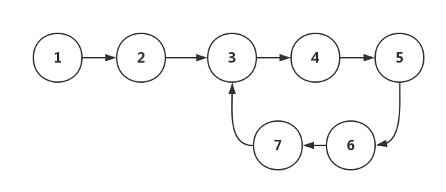 

解法1：

快慢指针，

P1是慢指针，一次遍历一个节点。
P2是快指针，一次遍历两个节点。

如果链表中没有环，P2和P1会先后遍历完所有的节点。

如果链表中有环，P2和P1则会先后进入环中，一直循环，并一定会在在某一次遍历中相遇。

因此，只要发现P2和P1相遇了，就可以判定链表中存在环。

```java
/**
     * 判断是否有环 快慢指针法
     * 
     * @param node
     * @return
     */
    public static boolean hasLoopV1(SingleNode headNode) {
        
        if(headNode == null) {
            return false;
        }
        
        SingleNode p = headNode;
        SingleNode q = headNode.next;

        // 快指针未能遍历完所有节点
        while (q != null && q.next != null) {
            p = p.next; // 遍历一个节点
            q = q.next.next; // 遍历两个个节点

            // 已到链表末尾
            if (q == null) {
                return false;
            } else if (p == q) {
                // 快慢指针相遇，存在环
                return true;
            }
        }

        return false;
    }
```


解法二：

足迹检测法， 顺序遍历链表中所有的节点，并将所有遍历过的节点信息保存下来。如果某个节点的信息出现了两次，则存在环。 

```java
// 保存足迹信息
    private static HashMap<SingleNode, Integer> nodeMap = new HashMap<>();

    /**
     * 判断是否有环 足迹法
     * 
     * @param node
     * @return
     */
    public static boolean hasLoopV2(SingleNode node, int index) {
        if (node == null || node.next == null) {
            return false;
        }

        if (nodeMap.containsKey(node)) {
            return true;
        } else {
            nodeMap.put(node, index);
            return hasLoopV2(node.next, ++index);
        }
    }
```


**删除链表倒数第n个节点**

利用快慢指针，快指针先走n个节点，然后慢指针在走，当快指针到尾节点的时候，满指针就到了倒数第n+1个节点。


```java
public static Node deleteLastN(Node root, int n) {
        Node fast = root;
        Node slow = root;
        while (n > 0) {
            fast = fast.next;
            n--;
        }   
        while (fast.next != null) {
            fast = fast.next;
            slow = slow.next;
        }
        slow.next = slow.next.next;
        return root;
    }
```


**查找链表中的中间节点**

```java
public static Node findMidNode(Node root) {
        Node fast = root;
        Node slow = root;

//        while (fast != null) {
//            if (fast.next != null) {
//                fast = fast.next.next;
//            } else {
//              break;
//            }
//            slow = slow.next;
//        }
        while (fast != null && fast.next != null) {
            fast = fast.next.next;
            slow = slow.next;
        }
        return slow;
    }
```


### 3、栈

先进后出，后进先出。

栈可以用数组实现，也可以用链表实现，用数组叫顺序栈，用链表叫链式栈。

入栈出栈时间复杂度都是O(1)

空间复杂度也是O(1)，空间复杂度是除了原本的数据存储空间外，算法运行需要的额外的空间。


**栈在表达式求值中的应用**

通过两个栈来实现，一个是保存操作数，一个是保存运算符的栈，从左到右遍历表达式，遇到数字直接压入数字栈，遇到运算符，先跟运算符栈顶元素比较，如果优先级高于栈顶元素，就压入运算符栈，反之则取出数字栈栈顶两个元素进行运算，将运算结果压入数字栈。

  


**栈在括号中的应用**

检查表达式中的括号是否匹配

例如，检测 {[] ()[{}]}或[{()}([])] 是否为合法格式

用一个栈来保存未匹配的左括号，从左到右遍历字符串，当遇到左括号时，压入栈，当遇到右括号时候，从栈顶取出元素，看是否匹配，比如“（”匹配的是“）”，如果不匹配，则不合格，如果遍历完后，栈中没有元素，就说明是合法的。


**如何实现浏览器前进后退**

使用两个栈，x和y，把首次浏览的页面压入x，当点击后退时，从x中弹出，进入y，点击前进时，从y中弹出，进入x。当x没有数据，说明不可后退，当y没有数据，说明不可前进。

比如依次点击a、b、c，此时后退到b，那么b、c就在y栈了，那么在b的时候点击了d页面，c就无法通过前进、后退按钮进行查看了，所以需要清空栈y

  


**为什么函数调用要用“栈”来保存临时变量呢？用其他数据结构不行吗？**

其实，我们不一定非要用栈来保存临时变量，只不过如果这个函数调用符合后进先出的特性，用栈这种数据结构来实现，是最顺理成章的选择。

从调用函数进入被调用函数，对于数据来说，变化的是什么呢？是作用域。所以根本上，只要能保证每进入一个新的函数，都是一个新的作用域就可以。而要实现这个，用栈就非常方便。在进入被调用函数的时候，分配一段栈空间给这个函数的变量，在函数结束的时候，将栈顶复位，正好回到调用函数的作用域内。 


### 4、队列

先进先出

队列可以用数组和链表实现，用数组叫做顺序队列，用链表叫做链式队列。

对于栈来说，只需要一个栈顶指针

对于队列来说，需要一个指向队列头的指针，一个指向队列尾的指针。

  


基于数组实现，出队列时候每次head都要往后移，当队列满了之后，无法添加数据，此时需要在入队的时候判断是否已满，如果已满，就进行数据搬迁，此时出队列的时间复杂度就为O(1)。

  


#### （1）循环队列

  

添加数据的时候，如果tail指针已经指在队尾，那么会将元素添加至队尾的位置，而tail指针指向0的位置

  

tail指针指向的位置是不存放元素的，所以会浪费一个数组的存储空间。

队列空的判断条件：tail == head

队列满的判断条件：（tail+1）% n = head

```java

public class CircularQueue {
  // 数组：items，数组大小：n
  private String[] items;
  private int n = 0;
  // head表示队头下标，tail表示队尾下标
  private int head = 0;
  private int tail = 0;

  // 申请一个大小为capacity的数组
  public CircularQueue(int capacity) {
    items = new String[capacity];
    n = capacity;
  }

  // 入队
  public boolean enqueue(String item) {
    // 队列满了
    if ((tail + 1) % n == head) return false;
    items[tail] = item;
    tail = (tail + 1) % n;
    return true;
  }

  // 出队
  public String dequeue() {
    // 如果head == tail 表示队列为空
    if (head == tail) return null;
    String ret = items[head];
    head = (head + 1) % n;
    return ret;
  }
}
```


#### （2）阻塞队列

队列为空，取数据时阻塞，队列已满，存数据时阻塞。

这就是生产者-消费者模式。

可配置多个消费者，提高并发量处理数据。	

  


#### （3）并发队列

在出入队列的时候加锁，在锁粒度大的时候并发度会很低。

此时可以使用CAS模式，可实现高效的并发队列。

 CAS实现无锁队列，则在入队前，获取tail位置，入队时比较tail是否发生变化，如果否，则允许入队，反之，本次入队失败。出队则是获取head位置，进行cas。 


### 5、递归

递归需要满足的三个条件：

- 一个问题的解可分解成几个子问题的解
  - 例如 f(n) = f(n-1) +1
- 此问题与分解之后的子问题，除了数据规模不同，求解思路是一样的。
- 存在递归终止条件。


**如何编写递归代码？**

推导递归公式，找到终止条件。


写递归代码的关键就是找到如何将大问题分解为小问题的规律，并且基于此写出递推公式，然后再推敲终止条件，最后将递推公式和终止条件翻译成代码。

遇到递归，就把它抽象成一个递推公式，不用考虑一层层的调用关系，不要试图用人脑去分解递归的每个步骤。


**递归代码要警惕堆栈溢出**

可设置递归的最大深度，超过即报错。


**递归代码要警惕重复计算**

可以用散列表保存已求解过的f(k)


### 6、排序


**如何分析一个排序算法？**

（1）排序算法的执行效率

- 最好情况、最坏情况、平均时间复杂度
- 时间复杂度的系数、常量、低阶
- 比较次数和交换次数

（2）排序算法的内存消耗

原地排序：特指空间复杂度是O(1)的排序算法

（3）排序算法的稳定性

**稳定性：**待排序的序列中存在值相等的元素，经过排序之后，相等元素之间原有的先后顺序不变。

如果具有稳定性，称为稳定的排序算法，如果前后顺序发生改变，那么对应的排序算法就是不稳定的排序算法。


#### （1）冒泡排序

冒泡排序只会操作相邻的两个数据。每次冒泡操作都会对相邻的两个元素进行比较，看是否满足大小关系要求。如果不满足就让它俩互换。一次冒泡会让至少一个元素移动到它应该在的位置，重复 n 次，就完成了 n 个数据的排序工作。

例如：对一组数据进行排序 4，5，6，3，2，1


优化：当某次冒泡操作已经没数据交换时，说明已经达到完全有序，就不用继续执行后续的冒泡操作了。

```java

// 冒泡排序，a表示数组，n表示数组大小
public void bubbleSort(int[] a, int n) {
  if (n <= 1) return;
 
 for (int i = 0; i < n; ++i) {
    // 提前退出冒泡循环的标志位
    boolean flag = false;
    for (int j = 0; j < n - i - 1; ++j) {
      if (a[j] > a[j+1]) { // 交换
        int tmp = a[j];
        a[j] = a[j+1];
        a[j+1] = tmp;
        flag = true;  // 表示有数据交换      
      }
    }
    if (!flag) break;  // 没有数据交换，提前退出
  }
}
```

冒泡排序：

- 原地排序
- 稳定

时间复杂度：

最好情况，都是有序的，那么是O（n），最坏情况，逆序排列，那么是O(n^2)

对于平均时间复杂度来说，需通过“有序度”和“逆序度”来进行分析

**有序度**是数组中具有有序关系的元素对的个数

```
有序元素对：a[i] <= a[j], 如果i < j。
```


同理，对于一个倒序排列的数组，比如 6，5，4，3，2，1，有序度是 0；对于一个完全有序的数组，比如 1，2，3，4，5，6，有序度就是 n*(n-1)/2，也就是 15。我们把这种完全有序的数组的有序度叫作满有序度。

逆序度 = 满有序度 - 有序度。

排序的过程就是增加有序度，减少逆序度的过程，最后达到满有序度。

冒泡排序包含两个操作原子，比较和交换。每交换一次，有序度就加 1。不管算法怎么改进，交换次数总是确定的，即为逆序度，也就是n*(n-1)/2–初始有序度。此例中就是 15–3=12，要进行 12 次交换操作。

对于包含 n 个数据的数组进行冒泡排序，平均交换次数是多少呢？最坏情况下，初始状态的有序度是 0，所以要进行 n*(n-1)/2 次交换。最好情况下，初始状态的有序度是 n*(n-1)/2，就不需要进行交换。我们可以取个中间值 n*(n-1)/4，来表示初始有序度既不是很高也不是很低的平均情况。

平均情况下，需要 n*(n-1)/4 次交换操作，比较操作肯定要比交换操作多，而复杂度的上限是 O(n2)，所以平均情况下的时间复杂度就是 O(n2)。


#### （2）插入排序


将数组中的数据分为两个区间，已排序区间和未排序区间。初始已排序区间只有一个元素，就是数组的第一个元素。插入算法的核心思想是取未排序区间中的元素，在已排序区间中找到合适的插入位置将其插入，并保证已排序区间数据一直有序。重复这个过程，直到未排序区间中元素为空，算法结束。


插入排序也包含两种操作，一种是元素的比较，一种是元素的移动。当我们需要将一个数据 a 插入到已排序区间时，需要拿 a 与已排序区间的元素依次比较大小，找到合适的插入位置。找到插入点之后，我们还需要将插入点之后的元素顺序往后移动一位，这样才能腾出位置给元素 a 插入。

```java

// 插入排序，a表示数组，n表示数组大小
public void insertionSort(int[] a, int n) {
  if (n <= 1) return;

  for (int i = 1; i < n; ++i) {
    int value = a[i];
    int j = i - 1;
    // 查找插入的位置
    for (; j >= 0; --j) {
      if (a[j] > value) {
        a[j+1] = a[j];  // 数据移动
      } else {
        break;
      }
    }
    a[j+1] = value; // 插入数据
  }
}
```

插入排序也是原地排序、稳定的排序算法。

时间复杂度：

最好情况是都有序，那么是O(n)，如果都是逆序的情况下，那么是O(n^2)

平均也是O(n^2)


#### （3）选择排序

选择排序每次会从未排序区间中找到最小的元素，将其放到已排序区间的末尾。


选择排序是原地、不稳定的排序算法。

**为什么不稳定？**

选择排序每次都要找剩余未排序元素中的最小值，并和前面的元素交换位置，这样破坏了稳定性。

比如 5，8，5，2，9 这样一组数据，使用选择排序算法来排序的话，第一次找到最小元素 2，与第一个 5 交换位置，那第一个 5 和中间的 5 顺序就变了，所以就不稳定了。正是因此，相对于冒泡排序和插入排序，选择排序就稍微逊色了。


时间复杂度都为O(n^2)


**为什么插入排序要比冒泡排序更受欢迎呢？**

从代码实现上来看，冒泡排序的数据交换要比插入排序的数据移动要复杂，冒泡排序需要 3 个赋值操作，而插入排序只需要 1 个。


#### （4）归并排序

思想：排序一个数组，先把数组从中间分成前后两部分，然后对前后两部分分别进行排序，再将排好序的两部分合并在一起。

  

利用的是**分治思想**

```
递推公式：
merge_sort(p…r) = merge(merge_sort(p…q), merge_sort(q+1…r))

终止条件：
p >= r 不用再继续分解
```


```java
private static void gb_merge(int[] array, int start, int end) {
        if (start >= end) {
            return;
        }
        
        int mid = (start+end) / 2;
        gb_merge(array,start,mid);
        gb_merge(array,mid+1,end);

        merge(array,start,mid,end);
    }

    private static void merge(int[] array, int start, int mid, int end) {
        int arr[] = new int[end-start+1];
        int i = start;
        int j = mid + 1;
        int h = 0;
        while (i<=mid && j<=end) {
            if (array[i]<=array[j]) {
                arr[h++] = array[i++];
            } else {
                arr[h++] = array[j++];
            }
        }
        if (i<=mid) {
            for (;i<=mid;i++) {
                arr[h++] = array[i];
            }
        }
        if (j<=end) {
            for (;j<=end;j++) {
                arr[h++] = array[j];
            }
        }
        int o=0;
        for (int z=start;z<=end;z++) {
            array[z] = arr[o++];
        }
    }
```


归并排序也是**稳定的**排序算法。但不是原地排序算法，最后一步merge需要借助其他空间进行排序。


**时间复杂度分析：**

 递归的适用场景是，一个问题 a 可以分解为多个子问题 b、c，那求解问题 a 就可以分解为求解问题 b、c。问题 b、c 解决之后，我们再把 b、c 的结果合并成 a 的结果。

如果我们定义求解问题 a 的时间是 T(a)，求解问题 b、c 的时间分别是 T(b) 和 T( c)，那我们就可以得到这样的递推关系式： 

```
T(a) = T(b) + T(c) + K
```

 其中 K 等于将两个子问题 b、c 的结果合并成问题 a 的结果所消耗的时间。 


**不仅递归求解的问题可以写成递推公式，递归代码的时间复杂度也可以写成递推公式。 **

那么归并排序就是：

```
T(1) = C  , n=1时，只需常量级的时间
T(n) = 2*T(n/2) + n, n>1
```

```
T(n) = 2*T(n/2) + n
     = 2*(2*T(n/4) + n/2) + n = 4*T(n/4) + 2*n
     = 4*(2*T(n/8) + n/4) + 2*n = 8*T(n/8) + 3*n
     = 8*(2*T(n/16) + n/8) + 3*n = 16*T(n/16) + 4*n
     ......
     = 2^k * T(n/2^k) + k * n
     ......
```

当T(n/2^k)=T(1)的时候，也即是分解到n=1时候，那么n/2^k=1，也就是k=logn，代入上述公式，得到T(n)=Cn+nlogn，

用大O表示法，即是O(nlogn)


**空间复杂度分析：**

O(nlogn)


#### （5）快速排序

 快排的思想是这样的：如果要排序数组中下标从 p 到 r 之间的一组数据，我们选择 p 到 r 之间的任意一个数据作为 pivot（分区点）。我们遍历 p 到 r 之间的数据，将小于 pivot 的放到左边，将大于 pivot 的放到右边，将 pivot 放到中间。经过这一步骤之后，数组 p 到 r 之间的数据就被分成了三个部分，前面 p 到 q-1 之间都是小于 pivot 的，中间是 pivot，后面的 q+1 到 r 之间是大于 pivot 的。 

  

 根据分治、递归的处理思想，我们可以用递归排序下标从 p 到 q-1 之间的数据和下标从 q+1 到 r 之间的数据，直到区间缩小为 1，就说明所有的数据都有序了。 

```
递推公式：
quick_sort(p…r) = quick_sort(p…q-1) + quick_sort(q+1… r)

终止条件：
p >= r
```


```java
private static void quickSort(int[] array, int start, int end) {
        if (start>=end) {
            return;
        }

        int pivot = partition(array,start,end);
        quickSort(array,start,pivot-1);
        quickSort(array,pivot+1,end);

    }

    private static int partition(int[] array, int start, int end) {

        int i = start,j = start;
        int last = array[end];
        for (;j<end;j++) {
            if (array[j]<last) {
                int tem = array[i];
                array[i] = array[j];
                array[j] = tem;
                i++;
            }
        }
        int tem = array[i];
        array[i] = array[end];
        array[end] = tem;

        return i;
    }
```

快排中最主要的是如何找到分界点，也就是partition函数。

此处通过游标 i 将A[p...r-1]分成两部分，A[p...i-1]的元素都是小于pivot的，称为已处理区间，每次从A[i...r-1]未处理区间中取出元素A[j]，与pivot进行对比，如果小于pivot，就将其加入已处理区间的尾部，也就是A[i]的位置。

  


快排不是一个稳定的排序算法，因为相同的元素在寻找分界点时位置会变化，

例如：6、8、7、6、3、5、9、4 这个序列在经过第一次分区之后两个6的相对位置会变


**时间复杂度分析：**

 快排也是用递归来实现的。对于递归代码的时间复杂度，我前面总结的公式，这里也还是适用的。如果每次分区操作，都能正好把数组分成大小接近相等的两个小区间，那快排的时间复杂度递推求解公式跟归并是相同的。所以，快排的时间复杂度也是 O(nlogn)。 

```
T(1) = C；   n=1时，只需要常量级的执行时间，所以表示为C。
T(n) = 2*T(n/2) + n； n>1
```

 如果数组中的数据原来已经是有序的了，比如 1，3，5，6，8。如果我们每次选择最后一个元素作为 pivot，那每次分区得到的两个区间都是不均等的。我们需要进行大约 n 次分区操作，才能完成快排的整个过程。每次分区我们平均要扫描大约 n/2 个元素，这种情况下，快排的时间复杂度就从 O(nlogn) 退化成了 O(n2)。 


**O(n)时间复杂度之内查找一个无序数组中第k大的元素**

 我们选择数组区间 A[0...n-1]的最后一个元素 A[n-1]作为 pivot，对数组 A[0...n-1]原地分区，这样数组就分成了三部分，A[0...p-1]、A[p]、A[p+1...n-1]。

如果 p+1=K，那 A[p]就是要求解的元素；如果 K>p+1, 说明第 K 大元素出现在 A[p+1...n-1]区间，我们再按照上面的思路递归地在 A[p+1...n-1]这个区间内查找。同理， 如果 K < p+1，那我们就在 A[0...p-1]区间查找。 

```java
private static int findTheKValue(int[] array, int start, int end, int k) {
    int p = findK(array,start,end);
    if (p+1 == k) {
        return array[p];
    }else if (p+1<k) {
        return findTheKValue(array, p+1,end,k);
    } else if (p+1>k) {
        return findTheKValue(array,start,p-1,k);
    }
    return array[k];
}

private static int findK(int[] array, int start, int end) {
    int cursor = array[end];
    int i = start;
    for (int j = start;j<end;j++) {
        if (array[j]<cursor) {
            int tem = array[i];
            array[i] = array[j];
            array[j] = tem;
            i++;
        }
    }
    int tem = array[i];
    array[i] = array[end];
    array[end] = tem;

    return i;
}
```


思考： 现在你有 10 个接口访问日志文件，每个日志文件大小约 300MB，每个文件里的日志都是按照时间戳从小到大排序的。你希望将这 10 个较小的日志文件，合并为 1 个日志文件，合并之后的日志仍然按照时间戳从小到大排列。如果处理上述排序任务的机器内存只有 1GB，你有什么好的解决思路，能“快速”地将这 10 个日志文件合并吗？ 

1.申请10个40M的数组和一个400M的数组。
2.每个文件都读40M，取各数组中最大时间戳中的最小值。
3.然后利用二分查找，在其他数组中快速定位到小于/等于该时间戳的位置，并做标记。
4.再把各数组中标记位置之前的数据全部放在申请的400M内存中，
5.在原来的40M数组中清除已参加排序的数据。[可优化成不挪动数据，只是用两个索引标记有效数据的起始和截止位置]
6.对400M内存中的有效数据[没装满]做快排。
将排好序的直接写文件。
7.再把每个数组尽量填充满。从第2步开始继续，知道各个文件都读区完毕。
这么做的好处有：
1.每个文件的内容只读区一次，且是批量读区。比每次只取一条快得多。
2.充分利用了读区到内存中的数据。曹源 同学在文件中查找那个中间数是会比较困难的。
3.每个拷贝到400M大数组中参加快排的数据都被写到了文件中，这样每个数只参加了一次快排。 


#### （6）线性排序

桶排序、计数排序、基数排序，时间复杂度都为O(n)，时间复杂度为线性，所以称为**线性排序**


##### 1、桶排序

把要排序的数据分到几个有序的桶里，每个桶里的数据再单独进行排序，桶内排序完后，再把每个桶内的数据依次取出来，全部数据就是有序的。	

  

**时间复杂度分析：**

有n个数据，分到m个桶内，平均每个桶有k=n/m个数据，桶内使用快速排序的时间复杂度为O(klogk)，那么m个桶就为O(m*klogk)，即为O(nlog(n/m))，当m趋于n时，n/m趋于1，那么时间复杂度即为O(n)。


桶排序适合进行外部排序，即是内存小于需要排序的数据大小时。

例如：有10w个数据进行排序，但内存太小。

此时先遍历一遍，找到最大最小值，比如1,100，那么就分成100个桶，再遍历数据，将数据分到桶内。如果有某个桶的数据量依然大于内存，那么可以继续划分。直到所有文件都能读入内存。


##### 2、计数排序

计数排序是桶排序的一种特殊情况，但是每个桶只存相同的数据。省略了桶内排序的时间。

比如一个数组A的元素是  2，5，3，0，2，3，0，3。 

最小是0，最大是5，那么就分成6个桶

此时用一个容量为6的数组B，下标表示分数，对应的元素内容表示每个分数对应有多少个

此时B为：2 0 2 3 0 1

此时可以用一个数组c表示B的每个元素依次相加

  

即是表示小于等于0的有2个，小于等于1的有2个，小于等于2的有4个

  从图中可以看出，分数为 3 分的考生有 3 个，小于 3 分的考生有 4 个，所以，成绩为 3 分的考生在排序之后的有序数组 R[8]中，会保存下标 4，5，6 的位置 

 


  从后到前依次扫描数组 A。比如，当扫描到 3 时，我们可以从数组 C 中取出下标为 3 的值 7，也就是说，到目前为止，包括自己在内，分数小于等于 3 的考生有 7 个，也就是说 3 是数组 R 中的第 7 个元素（也就是数组 R 中下标为 6 的位置）。当 3 放入到数组 R 中后，小于等于 3 的元素就只剩下了 6 个了，所以相应的 C[3]要减 1，变成 6。 

 


```java

// 计数排序，a是数组，n是数组大小。假设数组中存储的都是非负整数。
public void countingSort(int[] a, int n) {
  if (n <= 1) return;

  // 查找数组中数据的范围
  int max = a[0];
  for (int i = 1; i < n; ++i) {
    if (max < a[i]) {
      max = a[i];
    }
  }

  int[] c = new int[max + 1]; // 申请一个计数数组c，下标大小[0,max]
  for (int i = 0; i <= max; ++i) {
    c[i] = 0;
  }

  // 计算每个元素的个数，放入c中
  for (int i = 0; i < n; ++i) {
    c[a[i]]++;
  }

  // 依次累加
  for (int i = 1; i <= max; ++i) {
    c[i] = c[i-1] + c[i];
  }

  // 临时数组r，存储排序之后的结果
  int[] r = new int[n];
  // 计算排序的关键步骤，有点难理解
  for (int i = n - 1; i >= 0; --i) {
    int index = c[a[i]]-1;
    r[index] = a[i];
    c[a[i]]--;
  }

  // 将结果拷贝给a数组
  for (int i = 0; i < n; ++i) {
    a[i] = r[i];
  }
}
```

 计数排序只能用在数据范围不大的场景中，如果数据范围 k 比要排序的数据 n 大很多，就不适合用计数排序了。而且，计数排序只能给非负整数排序，如果要排序的数据是其他类型的，要将其在不改变相对大小的情况下，转化为非负整数。 


##### 3、基数排序

先从最后一个字符进行排序，然后进行倒数第二位排序，依次往前，如果字符长度不一样，可以用最小字符在前缀进行填充。

例如对手机号进行排序。

  


 注意，这里按照每位来排序的排序算法要是稳定的，否则这个实现思路就是不正确的。因为如果是非稳定排序算法，那最后一次排序只会考虑最高位的大小顺序，完全不管其他位的大小关系，那么低位的排序就完全没有意义了。

根据每一位来排序，我们可以用刚讲过的桶排序或者计数排序，它们的时间复杂度可以做到 O(n)。如果要排序的数据有 k 位，那我们就需要 k 次桶排序或者计数排序，总的时间复杂度是 O(k*n)。当 k 不大的时候，比如手机号码排序的例子，k 最大就是 11，所以基数排序的时间复杂度就近似于 O(n)。 


**根据年龄给100万的用户进行排序？**

利用桶排序，每个桶里面的元素都是一样的。


#### （7）如何实现一个通用、高性能的排序算法

  


 导致快排时间复杂度降为O(n)的原因是分区点选择不合理，最理想的分区点是：被分区点分开的两个分区中，数据的数量差不多。如何优化分区点的选择？有2种常用方法，如下：
1.三数取中法
①从区间的首、中、尾分别取一个数，然后比较大小，取中间值作为分区点。
②如果要排序的数组比较大，那“三数取中”可能就不够用了，可能要“5数取中”或者“10数取中”。
2.随机法：每次从要排序的区间中，随机选择一个元素作为分区点。
3.警惕快排的递归发生堆栈溢出，有2中解决方法，如下：
①限制递归深度，一旦递归超过了设置的阈值就停止递归。
②在堆上模拟实现一个函数调用栈，手动模拟递归压栈、出栈过程，这样就没有系统栈大小的限制。
三、通用排序函数实现技巧
1.数据量不大时，可以采取用时间换空间的思路
2.数据量大时，优化快排分区点的选择
3.防止堆栈溢出，可以选择在堆上手动模拟调用栈解决
4.在排序区间中，当元素个数小于某个常数是，可以考虑使用O(n^2)级别的插入排序
5.用哨兵简化代码，每次排序都减少一次判断，尽可能把性能优化到极致 


### 7、二分查找

二分查找针对的是一个有序的数据集合，查找思想有点类似分治思想。每次都通过跟区间的中间元素对比，将带查找的区间缩小位之前的一半，知道找到要查找的元素，或者区间被缩小位0。

时间复杂度是O(logn)

假设数据大小是 n，每次查找后数据都会缩小为原来的一半，也就是会除以 2。最坏情况下，直到查找区间被缩小为空，才停止。


可以看出来，这是一个等比数列。其中 n/2k=1 时，k 的值就是总共缩小的次数。而每一次缩小操作只涉及两个数据的大小比较，所以，经过了 k 次区间缩小操作，时间复杂度就是 O(k)。通过 n/2k=1，我们可以求得 k=log2n，所以时间复杂度就是 O(logn)。


**对数时间复杂度O(logn)**

因为 logn 是一个非常“恐怖”的数量级，即便 n 非常非常大，对应的 logn 也很小。比如 n 等于 2 的 32 次方，这个数很大了吧？大约是 42 亿。也就是说，如果我们在 42 亿个数据中用二分查找一个数据，最多需要比较 32 次。

用大 O 标记法表示时间复杂度的时候，会省略掉常数、系数和低阶。对于常量级时间复杂度的算法来说，O(1) 有可能表示的是一个非常大的常量值，比如 O(1000)、O(10000)。所以，常量级时间复杂度的算法有时候可能还没有 O(logn) 的算法执行效率高。


**二分查找的递归和非递归实现**


（1）非递归

```java

public int bsearch(int[] a, int n, int value) {
  int low = 0;
  int high = n - 1;

  while (low <= high) {
    int mid = (low + high) / 2;
    if (a[mid] == value) {
      return mid;
    } else if (a[mid] < value) {
      low = mid + 1;
    } else {
      high = mid - 1;
    }
  }

  return -1;
}
```


**注意：**

- 循环退出条件 
  - 注意是 low<=high，而不是 low
- mid 的取值
  - 实际上，mid=(low+high)/2 这种写法是有问题的。因为如果 low 和 high 比较大的话，两者之和就有可能会溢出。改进的方法是将 mid 的计算方式写成 low+(high-low)/2。更进一步，如果要将性能优化到极致的话，我们可以将这里的除以 2 操作转化成位运算 low+((high-low)>>1)。因为相比除法运算来说，计算机处理位运算要快得多。
- low 和 high 的更新
  - low=mid+1，high=mid-1。注意这里的 +1 和 -1，如果直接写成 low=mid 或者 high=mid，就可能会发生死循环。比如，当 high=3，low=3 时，如果 a[3]不等于 value，就会导致一直循环不退出。


（2）递归

```java

// 二分查找的递归实现
public int bsearch(int[] a, int n, int val) {
  return bsearchInternally(a, 0, n - 1, val);
}

private int bsearchInternally(int[] a, int low, int high, int value) {
  if (low > high) return -1;

  int mid =  low + ((high - low) >> 1);
  if (a[mid] == value) {
    return mid;
  } else if (a[mid] < value) {
    return bsearchInternally(a, mid+1, high, value);
  } else {
    return bsearchInternally(a, low, mid-1, value);
  }
}
```


**二分查找的局限性：**

（1）依赖顺序表结构，数组

（2）针对有序数据

（3）数据量太小太大都不适合，太大可能会有内存溢出的风险，内存大小小于数据大小


**问题：**

（1）如何编程实现“求一个数的平方根”？

方法：二分查找法 思路：假设是求6的平方根x （1）x=6/2=3， （2）x²=9>6，x继续除以2，1.5²<6，1.5+1.5/2继续 


#### （1）查找第一个值等于给定值的元素

```java

public int bsearch(int[] a, int n, int value) {
  int low = 0;
  int high = n - 1;
  while (low <= high) {
    int mid = low + ((high - low) >> 1);
    if (a[mid] >= value) {
      high = mid - 1;
    } else {
      low = mid + 1;
    }
  }

  if (low < n && a[low]==value) return low;
  else return -1;
}
```


```java

public int bsearch(int[] a, int n, int value) {
  int low = 0;
  int high = n - 1;
  while (low <= high) {
    int mid =  low + ((high - low) >> 1);
    if (a[mid] > value) {
      high = mid - 1;
    } else if (a[mid] < value) {
      low = mid + 1;
    } else {
      if ((mid == 0) || (a[mid - 1] != value)) return mid;
      else high = mid - 1;
    }
  }
  return -1;
}
```

a[mid] 与value 的大小关系有三种：大于、小于、等于

对于 a[mid]>value 的情况，更新 high= mid-1；对于 a[mid]<value的情况，更新low = mid+1

对于a[mid] = value时，需要确认是否时第一个值等于给定值的情况。

如果 mid 等于 0，那这个元素已经是数组的第一个元素，那它肯定是我们要找的；如果 mid 不等于 0，但 a[mid]的前一个元素 a[mid-1]不等于 value，那也说明 a[mid]就是我们要找的第一个值等于给定值的元素。

如果经过检查之后发现 a[mid]前面的一个元素 a[mid-1]也等于 value，那说明此时的 a[mid]肯定不是我们要查找的第一个值等于给定值的元素。那我们就更新 high=mid-1，因为要找的元素肯定出现在[low, mid-1]之间。


#### （2）查找最后一个值等于给定值的元素

```java

public int bsearch(int[] a, int n, int value) {
  int low = 0;
  int high = n - 1;
  while (low <= high) {
    int mid =  low + ((high - low) >> 1);
    if (a[mid] > value) {
      high = mid - 1;
    } else if (a[mid] < value) {
      low = mid + 1;
    } else {
      if ((mid == n - 1) || (a[mid + 1] != value)) return mid;
      else low = mid + 1;
    }
  }
  return -1;
}
```


#### （3）查找第一个大于等于给定值的元素

```java

public int bsearch(int[] a, int n, int value) {
  int low = 0;
  int high = n - 1;
  while (low <= high) {
    int mid =  low + ((high - low) >> 1);
    if (a[mid] >= value) {
      if ((mid == 0) || (a[mid - 1] < value)) return mid;
      else high = mid - 1;
    } else {
      low = mid + 1;
    }
  }
  return -1;
}
```

#### （4）查找最后一个小于等于给定值的元素

```java

public int bsearch7(int[] a, int n, int value) {
  int low = 0;
  int high = n - 1;
  while (low <= high) {
    int mid =  low + ((high - low) >> 1);
    if (a[mid] > value) {
      high = mid - 1;
    } else {
      if ((mid == n - 1) || (a[mid + 1] > value)) return mid;
      else low = mid + 1;
    }
  }
  return -1;
}
```


### 8、跳表

可以支持快速地插入、删除、查找操作。

Redis中的有序集合就是用跳表来实现的。


原来没有索引的时候，查找 62 需要遍历 62 个结点，现在只需要遍历 11 个结点，速度是不是提高了很多？

所以，当链表的长度 n 比较大时，比如 1000、10000 的时候，在构建索引之后，查找效率的提升就会非常明显。

**这种链表加多级索引的结构，就是跳表**


#### （1）时间复杂度

在单链表中查找某个数据的时间复杂度是O(n)。

如果每两个节点会抽一个作为上一级索引的结点，那第一级索引的结点个数大约就是n/2，第二级就是n/4，也就是说，第k级索引的结点个数就是第k-1级索引的节点个数的一半，那第k级索引节点的个数就是n/(2^k)

假设索引有 h 级，最高级的索引有 2 个结点。通过上面的公式，我们可以得到 n/(2h)=2，从而求得 h=log2n-1。如果包含原始链表这一层，整个跳表的高度就是 log2n。我们在跳表中查询某个数据的时候，如果每一层都要遍历 m 个结点，那在跳表中查询一个数据的时间复杂度就是 O(m*logn)。

去除常系数，那么时间复杂度就是O(logn)，因为m是看在一级中两个节点之间隔了有多少数据，比如每两个节点就抽一个称为上一级的索引节点，那么m就是3


#### （2）是否浪费内存

假设原始链表大小为 n，那第一级索引大约有 n/2 个结点，第二级索引大约有 n/4 个结点，以此类推，每上升一级就减少一半，直到剩下 2 个结点。如果我们把每层索引的结点数写出来，就是一个等比数列。

这几级索引的结点总和就是 n/2+n/4+n/8…+8+4+2=n-2。

跳表的空间复杂度是 O(n)


#### （3）高效的动态插入和删除

跳表这个动态数据结构，不仅支持查找操作，还支持动态的插入、删除操作，而且插入、删除操作的时间复杂度也是 O(logn)。

在单链表中，一旦定位好要插入的位置，插入结点的时间复杂度是很低的，就是 O(1)。但是，这里为了保证原始链表中数据的有序性，我们需要先找到要插入的位置，这个查找操作就会比较耗时。


对于纯粹的单链表，需要遍历每个结点，来找到插入的位置。但是，对于跳表来说，我们讲过查找某个结点的时间复杂度是 O(logn)，所以这里查找某个数据应该插入的位置，方法也是类似的，时间复杂度也是 O(logn)。


**删除操作：**

如果这个结点在索引中也有出现，我们除了要删除原始链表中的结点，还要删除索引中的。因为单链表中的删除操作需要拿到要删除结点的前驱结点，然后通过指针操作完成删除。所以在查找要删除的结点的时候，一定要获取前驱结点。当然，如果我们用的是双向链表，就不需要考虑这个问题了。


#### （4）跳表索引动态更新

作为一种动态数据结构，我们需要某种手段来维护索引与原始链表大小之间的平衡，也就是说，如果链表中结点多了，索引结点就相应地增加一些，避免复杂度退化，以及查找、插入、删除操作性能下降。

比如红黑树、AVL树这样的平衡二叉树，是通过左右旋的方式保持左右子树的大小平衡。

而跳表是通过随机函数来维护平衡性

当我们往跳表中插入数据的时候，我们可以选择同时将这个数据插入到部分索引层中。如何选择加入哪些索引层呢？我们通过一个随机函数，来决定将这个结点插入到哪几级索引中，比如随机函数生成了值 K，那我们就将这个结点添加到第一级到第 K 级这 K 级索引中。


#### （5）Redis中的有序集合为什么是跳表而不是红黑树

Redis 中的有序集合支持的核心操作主要有下面这几个：

- 插入一个数据；
- 删除一个数据；
- 查找一个数据；
- 按照区间查找数据（比如查找值在[100, 356]之间的数据）；
- 迭代输出有序序列。


其中，插入、删除、查找以及迭代输出有序序列这几个操作，红黑树也可以完成，时间复杂度跟跳表是一样的。

但是，按照区间来查找数据这个操作，红黑树的效率没有跳表高。

对于按照区间查找数据这个操作，跳表可以做到 O(logn) 的时间复杂度定位区间的起点，然后在原始链表中顺序往后遍历就可以了。这样做非常高效。


### 9、散列表

散列表用的是数组支持按照下标随机访问数据的特性，所以散列表其实就是数组的一种扩展，由数组演化而来

散列表用的就是数组支持按照下标随机访问的时候，时间复杂度是 O(1) 的特性。我们通过散列函数把元素的键值映射为下标，然后将数据存储在数组中对应下标的位置。当我们按照键值查询元素时，我们用同样的散列函数，将键值转化数组下标，从对应的数组下标的位置取数据。


#### （1）散列函数

散列函数，一般为hash（key），其中key表示元素的键值，hash(key)的值表示经过散列函数计算得到的散列值。


#### （2）散列冲突

常用的散列冲突解决方法有两类，开放寻址法（open addressing）和链表法（chaining）。


##### 1、开放寻址法

开放寻址法的核心思想是，如果出现了散列冲突，我们就重新探测一个空闲位置，将其插入。


###### （1）线性探测

如果某个数据经过散列函数散列之后，存储位置已经被占用了，我们就从当前位置开始，依次往后查找，看是否有空闲位置，直到找到为止。


在散列表中查找元素的过程有点儿类似插入过程。我们通过散列函数求出要查找元素的键值对应的散列值，然后比较数组中下标为散列值的元素和要查找的元素。如果相等，则说明就是我们要找的元素；否则就顺序往后依次查找。如果遍历到数组中的空闲位置，还没有找到，就说明要查找的元素并没有在散列表中。


**在删除时，不能只是把删除的元素设置为空**

在查找的时候，一旦我们通过线性探测方法，找到一个空闲位置，我们就可以认定散列表中不存在这个数据。但是，如果这个空闲位置是我们后来删除的，就会导致原来的查找算法失效。本来存在的数据，会被认定为不存在。这个问题如何解决呢？

我们可以将删除的元素，特殊标记为 deleted。当线性探测查找的时候，遇到标记为 deleted 的空间，并不是停下来，而是继续往下探测。


当散列表中插入的数据越来越多时，散列冲突发生的可能性就会越来越大，空闲位置会越来越少，线性探测的时间就会越来越久。极端情况下，我们可能需要探测整个散列表，所以最坏情况下的时间复杂度为 O(n)。同理，在删除和查找时，也有可能会线性探测整张散列表，才能找到要查找或者删除的数据。


除了线性探测方法之外，还有另外两种比较经典的探测方法，**二次探测（Quadratic probing）**和**双重散列（Double hashing）。**

二次探测探测的步长就变成了原来的“二次方”，也就是说，它探测的下标序列就是 hash(key)+0，hash(key)+1^2，hash(key)+2^2……

所谓双重散列，意思就是不仅要使用一个散列函数。我们使用一组散列函数 hash1(key)，hash2(key)，hash3(key)……我们先用第一个散列函数，如果计算得到的存储位置已经被占用，再用第二个散列函数，依次类推，直到找到空闲的存储位置。

不管采用哪种探测方法，当散列表中空闲位置不多的时候，散列冲突的概率就会大大提高。为了尽可能保证散列表的操作效率，一般情况下，我们会尽可能保证散列表中有一定比例的空闲槽位。我们用装载因子（load factor）来表示空位的多少。装载因子的计算公式是：

```
散列表的装载因子=填入表中的元素个数/散列表的长度
```

装载因子越大，说明空闲位置越少，冲突越多，散列表的性能会下降。


##### 2、链表法

在散列表中，每个“桶（bucket）”或者“槽（slot）”会对应一条链表，所有散列值相同的元素我们都放到相同槽位对应的链表中。


当插入的时候，我们只需要通过散列函数计算出对应的散列槽位，将其插入到对应链表中即可，所以插入的时间复杂度是 O(1)。当查找、删除一个元素时，我们同样通过散列函数计算出对应的槽，然后遍历链表查找或者删除。那查找或删除操作的时间复杂度是多少呢？

实际上，这两个操作的时间复杂度跟链表的长度 k 成正比，也就是 O(k)。对于散列比较均匀的散列函数来说，理论上讲，k=n/m，其中 n 表示散列中数据的个数，m 表示散列表中“槽”的个数。


**思考：**

1. 假设我们有 10 万条 URL 访问日志，如何按照访问次数给 URL 排序？

遍历 10 万条数据，以 URL 为 key，访问次数为 value，存入散列表，同时记录下访问次数的最大值 K，时间复杂度 O(N)。

如果 K 不是很大，可以使用桶排序，时间复杂度 O(N)。如果 K 非常大（比如大于 10 万），就使用快速排序，复杂度 O(NlogN)。

2. 有两个字符串数组，每个数组大约有 10 万条字符串，如何快速找出两个数组中相同的字符串？

以第一个字符串数组构建散列表，key 为字符串，value 为出现次数。再遍历第二个字符串数组，以字符串为 key 在散列表中查找，如果 value 大于零，说明存在相同字符串。时间复杂度 O(N)。


#### （3）如何设计散列函数

首先，散列函数的设计不能太复杂。过于复杂的散列函数，势必会消耗很多计算时间，也就间接地影响到散列表的性能。其次，散列函数生成的值要尽可能随机并且均匀分布，这样才能避免或者最小化散列冲突，而且即便出现冲突，散列到每个槽里的数据也会比较平均，不会出现某个槽内数据特别多的情况。


#### （4）装载因子过大怎么办

实际上，对于动态散列表，随着数据的删除，散列表中的数据会越来越少，空闲空间会越来越多。如果我们对空间消耗非常敏感，我们可以在装载因子小于某个值之后，启动动态缩容。当然，如果我们更加在意执行效率，能够容忍多消耗一点内存空间，那就可以不用费劲来缩容了。

装载因子阈值的设置要权衡时间、空间复杂度。如果内存空间不紧张，对执行效率要求很高，可以降低负载因子的阈值；相反，如果内存空间紧张，对执行效率要求又不高，可以增加负载因子的值，甚至可以大于 1。


#### （5）渐进式Rehash

在进行渐进式 rehash 的过程中， 字典会同时使用 ht[0] 和 ht[1] 两个哈希表， 所以在渐进式 rehash 进行期间， 字典的删除（delete）、查找（find）、更新（update）等操作会在两个哈希表上进行： 比如说， 要在字典里面查找一个键的话， 程序会先在 ht[0] 里面进行查找， 如果没找到的话， 就会继续到 ht[1] 里面进行查找， 诸如此类。 另外， 在渐进式 rehash 执行期间， 新添加到字典的键值对一律会被保存到 ht[1] 里面， 而 ht[0] 则不再进行任何添加操作： 这一措施保证了 ht[0] 包含的键值对数量会只减不增， 并随着 rehash 操作的执行而最终变成空表


通过这样均摊的方法，将一次性扩容的代价，均摊到多次插入操作中，就避免了一次性扩容耗时过多的情况。这种实现方式，任何情况下，插入一个数据的时间复杂度都是 O(1)。


#### （6）如何选择冲突解决方法

##### 1、开放寻址法

当数据量比较小、装载因子小的时候，适合采用开放寻址法。这也是 Java 中的ThreadLocalMap使用开放寻址法解决散列冲突的原因。


##### 2、链表法

基于链表的散列冲突处理方法比较适合存储大对象、大数据量的散列表，而且，比起开放寻址法，它更加灵活，支持更多的优化策略，比如用红黑树代替链表。


#### （7）工业级散列表

- 支持快速地查询、插入、删除操作；
- 内存占用合理，不能浪费过多的内存空间；
- 性能稳定，极端情况下，散列表的性能也不会退化到无法接受的情况。


**如何去实现？**

- 设计一个合适的散列函数；
- 定义装载因子阈值，并且设计动态扩容策略；
- 选择合适的散列冲突解决方法。


#### （8）LRU缓存淘汰算法

需要维护一个按照访问时间从大到小有序排列的链表结构。因为缓存大小有限，当缓存空间不够，需要淘汰一个数据的时候，我们就直接将链表头部的结点删除。

当要缓存某个数据的时候，先在链表中查找这个数据。如果没有找到，则直接将数据放到链表的尾部；如果找到了，我们就把它移动到链表的尾部。因为查找数据需要遍历链表，所以单纯用链表实现的 LRU 缓存淘汰算法的时间复杂很高，是 O(n)。

一个缓存（cache）系统主要包含下面这几个操作：

- 往缓存中添加一个数据；
- 从缓存中删除一个数据；
- 在缓存中查找一个数据。

这三个操作都要涉及“查找”操作，如果单纯地采用链表的话，时间复杂度只能是 O(n)。如果我们将散列表和链表两种数据结构组合使用，可以将这三个操作的时间复杂度都降低到 O(1)。具体的结构就是下面这个样子：


使用双向链表存储数据，链表中的每个结点处理存储数据（data）、前驱指针（prev）、后继指针（next）之外，还新增了一个特殊的字段 hnext。这个 hnext 有什么作用呢？

因为我们的散列表是通过链表法解决散列冲突的，所以每个结点会在两条链中。一个链是刚刚我们提到的双向链表，另一个链是散列表中的拉链。前驱和后继指针是为了将结点串在双向链表中，hnext 指针是为了将结点串在散列表的拉链中。

**查找：**

需要找到数据所在的结点，然后将结点删除。借助散列表，我们可以在 O(1) 时间复杂度里找到要删除的结点。因为我们的链表是双向链表，双向链表可以通过前驱指针 O(1) 时间复杂度获取前驱结点，所以在双向链表中，删除结点只需要 O(1) 的时间复杂度。

**添加：**

添加数据到缓存稍微有点麻烦，我们需要先看这个数据是否已经在缓存中。如果已经在其中，需要将其移动到双向链表的尾部；如果不在其中，还要看缓存有没有满。如果满了，则将双向链表头部的结点删除，然后再将数据放到链表的尾部；如果没有满，就直接将数据放到链表的尾部。

**删除：**

需要找到数据所在的结点，然后将结点删除。借助散列表，我们可以在 O(1) 时间复杂度里找到要删除的结点。因为我们的链表是双向链表，双向链表可以通过前驱指针 O(1) 时间复杂度获取前驱结点，所以在双向链表中，删除结点只需要 O(1) 的时间复杂度。

这整个过程涉及的查找操作都可以通过散列表来完成。其他的操作，比如删除头结点、链表尾部插入数据等，都可以在 O(1) 的时间复杂度内完成。所以，这三个操作的时间复杂度都是 O(1)。至此，我们就通过散列表和双向链表的组合使用，实现了一个高效的、支持 LRU 缓存淘汰算法的缓存系统原型。


##### （1）Redis有序集合

在有序集合中，每个成员对象有两个重要的属性，key（键值）和 score（分值）。我们不仅会通过 score 来查找数据，还会通过 key 来查找数据。

举个例子，比如用户积分排行榜有这样一个功能：我们可以通过用户的 ID 来查找积分信息，也可以通过积分区间来查找用户 ID 或者姓名信息。这里包含 ID、姓名和积分的用户信息，就是成员对象，用户 ID 就是 key，积分就是 score。

细化一下 Redis 有序集合的操作，那就是下面这样：

- 添加一个成员对象；
- 按照键值来删除一个成员对象；
- 按照键值来查找一个成员对象；
- 按照分值区间查找数据，比如查找积分在[100, 356]之间的成员对象；
- 按照分值从小到大排序成员变量；

如果我们仅仅按照分值将成员对象组织成跳表的结构，那按照键值来删除、查询成员对象就会很慢，解决方法与 LRU 缓存淘汰算法的解决方法类似。我们可以再按照键值构建一个散列表，这样按照 key 来删除、查找一个成员对象的时间复杂度就变成了 O(1)。同时，借助跳表结构，其他操作也非常高效。


##### （2）LinkedHashMap

LinkedHashMap 也是通过散列表和链表组合在一起实现的。实际上，它不仅支持按照插入顺序遍历数据，还支持按照访问顺序来遍历数据。

```JAVA

// 10是初始大小，0.75是装载因子，true是表示按照访问时间排序
HashMap<Integer, Integer> m = new LinkedHashMap<>(10, 0.75f, true);
m.put(3, 11);
m.put(1, 12);
m.put(5, 23);
m.put(2, 22);

m.put(3, 26);
m.get(5);

for (Map.Entry e : m.entrySet()) {
  System.out.println(e.getKey());
}
```

这段代码打印的结果是 1，2，3，5。

每次调用 put() 函数，往 LinkedHashMap 中添加数据的时候，都会将数据添加到链表的尾部，所以，在前四个操作完成之后，链表中的数据是下面这样：


在第 8 行代码中，再次将键值为 3 的数据放入到 LinkedHashMap 的时候，会先查找这个键值是否已经有了，然后，再将已经存在的 (3,11) 删除，并且将新的 (3,26) 放到链表的尾部。所以，这个时候链表中的数据就是下面这样：


当第 9 行代码访问到 key 为 5 的数据的时候，我们将被访问到的数据移动到链表的尾部。所以，第 9 行代码之后，链表中的数据是下面这样：


所以，最后打印出来的数据是 1，2，3，5。从上面的分析，你有没有发现，按照访问时间排序的 LinkedHashMap 本身就是一个支持 LRU 缓存淘汰策略的缓存系统

LinkedHashMap 是通过双向链表和散列表这两种数据结构组合实现的。LinkedHashMap 中的“Linked”实际上是指的是双向链表，并非指用链表法解决散列冲突。


**思考：**

1、今天讲的几个散列表和链表结合使用的例子里，我们用的都是双向链表。如果把双向链表改成单链表，还能否正常工作呢？为什么呢？

在删除一个元素时，虽然能 O(1) 的找到目标结点，但是要删除该结点需要拿到前一个结点的指针，遍历到前一个结点复杂度会变为 O(N），所以用双链表实现比较合适。

2、假设猎聘网有 10 万名猎头，每个猎头都可以通过做任务（比如发布职位）来积累积分，然后通过积分来下载简历。假设你是猎聘网的一名工程师，如何在内存中存储这 10 万个猎头 ID 和积分信息，让它能够支持这样几个操作：根据猎头的 ID 快速查找、删除、更新这个猎头的积分信息；查找积分在某个区间的猎头 ID 列表；查找按照积分从小到大排名在第 x 位到第 y 位之间的猎头 ID 列表。

以积分排序构建一个跳表，再以猎头 ID 构建一个散列表。

1）ID 在散列表中所以可以 O(1) 查找到这个猎头；
2）积分以跳表存储，跳表支持区间查询；
3）这点根据目前学习的知识暂时无法实现，老师文中也提到了。


### 10、哈希算法

将任意长度的二进制值串映射为固定长度的二进制值串，这个映射的规则就是哈希算法，而通过原始数据映射之后得到的二进制值串就是哈希值。

一个哈希算法需要满足以下几个条件：

- 从哈希值不能反向推导出原始数据（所以哈希算法也叫单向哈希算法）；
- 对输入数据非常敏感，哪怕原始数据只修改了一个 Bit，最后得到的哈希值也大不相同；
- 散列冲突的概率要很小，对于不同的原始数据，哈希值相同的概率非常小；
- 哈希算法的执行效率要尽量高效，针对较长的文本，也能快速地计算出哈希值。


**应用：**

- 安全加密
- 唯一标识
- 数据校验
- 散列函数
- 负载均衡
  - 对客户端 IP 地址或者会话 ID 计算哈希值，将取得的哈希值与服务器列表的大小进行取模运算，最终得到的值就是应该被路由到的服务器编号
- 数据分片
- 分布式存储
  - 通过哈希算法对数据取哈希值，然后对机器个数取模，这个最终值就是应该存储的缓存机器编号。


#### （1）一致性Hash

参考文章：https://www.zsythink.net/archives/1182

##### 1、概念

一致性哈希算法也是使用取模的方法，一致性哈希算法是对2^32取模

首先，我们把二的三十二次方想象成一个圆，就像钟表一样，钟表的圆可以理解成由60个点组成的圆，而此处我们把这个圆想象成由2^32个点组成的圆，示意图如下：


圆环的正上方的点代表0，0点右侧的第一个点代表1，以此类推，2、3、4、5、6……直到2^32-1,也就是说0点左侧的第一个点代表2^32-1

我们把这个由2的32次方个点组成的圆环称为hash环。

假设我们有3台缓存服务器，服务器A、服务器B、服务器C，那么，在生产环境中，这三台服务器肯定有自己的IP地址，我们使用它们各自的IP地址进行哈希计算，使用哈希后的结果对2^32取模，可以使用如下公式示意。

**hash（服务器A的IP地址） %  2^32**

通过上述公式算出的结果一定是一个0到2^32-1之间的一个整数，我们就用算出的这个整数，代表服务器A，既然这个整数肯定处于0到2^32-1之间，那么，上图中的hash环上必定有一个点与这个整数对应，而我们刚才已经说明，使用这个整数代表服务器A，那么，服务器A就可以映射到这个环上，用下图示意


假设，我们需要使用缓存服务器缓存图片，而且我们仍然使用图片的名称作为找到图片的key，那么我们使用如下公式可以将图片映射到上图中的hash环上。

**hash（图片名称） %  2^32**

映射后的示意图如下，下图中的橘黄色圆形表示图片


好了，现在服务器与图片都被映射到了hash环上，那么上图中的这个图片到底应该被缓存到哪一台服务器上呢？上图中的图片将会被缓存到服务器A上，为什么呢？因为从图片的位置开始，沿顺时针方向遇到的第一个服务器就是A服务器，所以，上图中的图片将会被缓存到服务器A上，如下图所示。


没错，一致性哈希算法就是通过这种方法，判断一个对象应该被缓存到哪台服务器上的，将缓存服务器与被缓存对象都映射到hash环上以后，从被缓存对象的位置出发，沿顺时针方向遇到的第一个服务器，就是当前对象将要缓存于的服务器，由于被缓存对象与服务器hash后的值是固定的，所以，在服务器不变的情况下，一张图片必定会被缓存到固定的服务器上，那么，当下次想要访问这张图片时，只要再次使用相同的算法进行计算，即可算出这个图片被缓存在哪个服务器上，直接去对应的服务器查找对应的图片即可。

刚才的示例只使用了一张图片进行演示，假设有四张图片需要缓存，示意图如下


1号、2号图片将会被缓存到服务器A上，3号图片将会被缓存到服务器B上，4号图片将会被缓存到服务器C上。


##### 2、优点

假设，服务器B出现了故障，我们现在需要将服务器B移除，那么，我们将上图中的服务器B从hash环上移除即可，移除服务器B以后示意图如下。

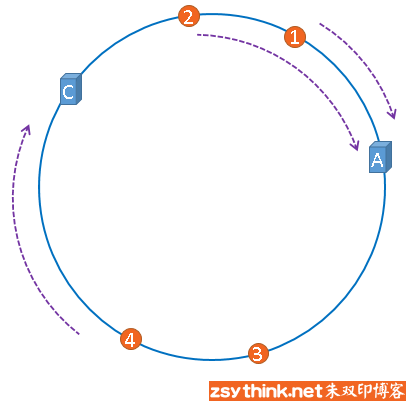

在服务器B未移除时，图片3应该被缓存到服务器B中，可是当服务器B移除以后，按照之前描述的一致性哈希算法的规则，图片3应该被缓存到服务器C中，因为从图片3的位置出发，沿顺时针方向遇到的第一个缓存服务器节点就是服务器C，也就是说，如果服务器B出现故障被移除时，图片3的缓存位置会发生改变


 

但是，图片4仍然会被缓存到服务器C中，图片1与图片2仍然会被缓存到服务器A中，这与服务器B移除之前并没有任何区别，这就是一致性哈希算法的优点，如果使用之前的hash算法，服务器数量发生改变时，所有服务器的所有缓存在同一时间失效了，而使用一致性哈希算法时，服务器的数量如果发生改变，并不是所有缓存都会失效，而是只有部分缓存会失效，前端的缓存仍然能分担整个系统的压力，而不至于所有压力都在同一时间集中到后端服务器上。


这就是一致性哈希算法所体现出的优点。


##### 3、hash环的偏斜

在实际的映射中，服务器可能会被映射成如下模样。


聪明如你一定想到了，如果服务器被映射成上图中的模样，那么被缓存的对象很有可能大部分集中缓存在某一台服务器上，如下图所示。


上图中，1号、2号、3号、4号、6号图片均被缓存在了服务器A上，只有5号图片被缓存在了服务器B上，服务器C上甚至没有缓存任何图片，如果出现上图中的情况，A、B、C三台服务器并没有被合理的平均的充分利用，缓存分布的极度不均匀，而且，如果此时服务器A出现故障，那么失效缓存的数量也将达到最大值，在极端情况下，仍然有可能引起系统的崩溃，上图中的情况则被称之为hash环的偏斜，那么，我们应该怎样防止hash环的偏斜呢？一致性hash算法中使用”虚拟节点”解决了这个问题，我们继续聊。

##### 4、虚拟节点

由于我们只有3台服务器，当我们把服务器映射到hash环上的时候，很有可能出现hash环偏斜的情况，当hash环偏斜以后，缓存往往会极度不均衡的分布在各服务器上，聪明如你一定已经想到了，如果想要均衡的将缓存分布到3台服务器上，最好能让这3台服务器尽量多的、均匀的出现在hash环上，但是，真实的服务器资源只有3台，我们怎样凭空的让它们多起来呢，没错，就是凭空的让服务器节点多起来，既然没有多余的真正的物理服务器节点，我们就只能将现有的物理节点通过虚拟的方法复制出来，这些由实际节点虚拟复制而来的节点被称为”虚拟节点”。加入虚拟节点以后的hash环如下。


“虚拟节点”是”实际节点”（实际的物理服务器）在hash环上的复制品,一个实际节点可以对应多个虚拟节点。

从上图可以看出，A、B、C三台服务器分别虚拟出了一个虚拟节点，当然，如果你需要，也可以虚拟出更多的虚拟节点。引入虚拟节点的概念后，缓存的分布就均衡多了，上图中，1号、3号图片被缓存在服务器A中，5号、4号图片被缓存在服务器B中，6号、2号图片被缓存在服务器C中，如果你还不放心，可以虚拟出更多的虚拟节点，以便减小hash环偏斜所带来的影响，虚拟节点越多，hash环上的节点就越多，缓存被均匀分布的概率就越大。

 


### 11、二叉树


其中，编号 2 的二叉树中，叶子节点全都在最底层，除了叶子节点之外，每个节点都有左右两个子节点，这种二叉树就叫做**满二叉树**。

编号 3 的二叉树中，叶子节点都在最底下两层，最后一层的叶子节点都靠左排列，并且除了最后一层，其他层的节点个数都要达到最大，这种二叉树叫做**完全二叉树**。


#### （1）如何存储一棵二叉树


##### 1、链式存储法

每个节点有三个字段，其中一个存储数据，另外两个是指向左右子节点的指针


##### 2、顺序存储法

把根节点存储在下标 i = 1 的位置，那左子节点存储在下标 2 * i = 2 的位置，右子节点存储在 2 * i + 1 = 3 的位置。以此类推，B 节点的左子节点存储在 2 * i = 2 * 2 = 4 的位置，右子节点存储在 2 * i + 1 = 2 * 2 + 1 = 5 的位置。


如果节点 X 存储在数组中下标为 i 的位置，下标为 2 * i 的位置存储的就是左子节点，下标为 2 * i + 1 的位置存储的就是右子节点。反过来，下标为 i/2 的位置存储就是它的父节点。通过这种方式，我们只要知道根节点存储的位置（一般情况下，为了方便计算子节点，根节点会存储在下标为 1 的位置），这样就可以通过下标计算，把整棵树都串起来。

如果是非完全二叉树，其实会浪费比较多的数组存储空间


#### （2）二叉树的遍历

经典的方法有三种，前序遍历、中序遍历和后序遍历。

其中，前、中、后序，表示的是节点与它的左右子树节点遍历打印的先后顺序。

1. 前序遍历是指，对于树中的任意节点来说，先打印这个节点，然后再打印它的左子树，最后打印它的右子树。
2. 中序遍历是指，对于树中的任意节点来说，先打印它的左子树，然后再打印它本身，最后打印它的右子树。
3. 后序遍历是指，对于树中的任意节点来说，先打印它的左子树，然后再打印它的右子树，最后打印这个节点本身。


实际上，二叉树的前、中、后序遍历就是一个递归的过程。比如，前序遍历，其实就是先打印根节点，然后再递归地打印左子树，最后递归地打印右子树。

```java

void preOrder(Node* root) {
  if (root == null) return;
  print root // 此处为伪代码，表示打印root节点
  preOrder(root->left);
  preOrder(root->right);
}

void inOrder(Node* root) {
  if (root == null) return;
  inOrder(root->left);
  print root // 此处为伪代码，表示打印root节点
  inOrder(root->right);
}

void postOrder(Node* root) {
  if (root == null) return;
  postOrder(root->left);
  postOrder(root->right);
  print root // 此处为伪代码，表示打印root节点
}
```


#### （3）二叉查找树

在树中的任意一个节点，其左子树中的每个节点的值，都要小于这个节点的值，而右子树节点的值都大于这个节点的值。


##### 1、查找操作

先取根节点，如果它等于我们要查找的数据，那就返回。如果要查找的数据比根节点的值小，那就在左子树中递归查找；如果要查找的数据比根节点的值大，那就在右子树中递归查找。


```java
public Node find(int data) {
    Node p = tree;
    while (p != null) {
      if (data < p.data) p = p.left;
      else if (data > p.data) p = p.right;
      else return p;
    }
    return null;
  }
```


##### 2、插入

新插入的数据一般都是在叶子节点上，所以我们只需要从根节点开始，依次比较要插入的数据和节点的大小关系。

如果要插入的数据比节点的数据大，并且节点的右子树为空，就将新数据直接插到右子节点的位置；如果不为空，就再递归遍历右子树，查找插入位置。同理，如果要插入的数据比节点数值小，并且节点的左子树为空，就将新数据插入到左子节点的位置；如果不为空，就再递归遍历左子树，查找插入位置。


```java

public void insert(int data) {
  if (tree == null) {
    tree = new Node(data);
    return;
  }

  Node p = tree;
  while (p != null) {
    if (data > p.data) {
      if (p.right == null) {
        p.right = new Node(data);
        return;
      }
      p = p.right;
    } else { // data < p.data
      if (p.left == null) {
        p.left = new Node(data);
        return;
      }
      p = p.left;
    }
  }
}
```


##### 3、删除

针对要删除节点的子节点个数的不同，我们需要分三种情况来处理。

第一种情况是，如果要删除的节点没有子节点，我们只需要直接将父节点中，指向要删除节点的指针置为 null。比如图中的删除节点 55。

第二种情况是，如果要删除的节点只有一个子节点（只有左子节点或者右子节点），我们只需要更新父节点中，指向要删除节点的指针，让它指向要删除节点的子节点就可以了。比如图中的删除节点 13。

第三种情况是，如果要删除的节点有两个子节点，这就比较复杂了。我们需要找到这个节点的右子树中的最小节点，把它替换到要删除的节点上。然后再删除掉这个最小节点，因为最小节点肯定没有左子节点（如果有左子结点，那就不是最小节点了），所以，我们可以应用上面两条规则来删除这个最小节点。比如图中的删除节点 18。


```java

public void delete(int data) {
  Node p = tree; // p指向要删除的节点，初始化指向根节点
  Node pp = null; // pp记录的是p的父节点
  while (p != null && p.data != data) {
    pp = p;
    if (data > p.data) p = p.right;
    else p = p.left;
  }
  if (p == null) return; // 没有找到

  // 要删除的节点有两个子节点
  if (p.left != null && p.right != null) { // 查找右子树中最小节点
    Node minP = p.right;
    Node minPP = p; // minPP表示minP的父节点
    while (minP.left != null) {
      minPP = minP;
      minP = minP.left;
    }
    p.data = minP.data; // 将minP的数据替换到p中
    p = minP; // 下面就变成了删除minP了
    pp = minPP;
  }

  // 删除节点是叶子节点或者仅有一个子节点
  Node child; // p的子节点
  if (p.left != null) child = p.left;
  else if (p.right != null) child = p.right;
  else child = null;

  if (pp == null) tree = child; // 删除的是根节点
  else if (pp.left == p) pp.left = child;
  else pp.right = child;
}
```

实际上，关于二叉查找树的删除操作，还有个非常简单、取巧的方法，就是单纯将要删除的节点标记为“已删除”，但是并不真正从树中将这个节点去掉。这样原本删除的节点还需要存储在内存中，比较浪费内存空间，但是删除操作就变得简单了很多。而且，这种处理方法也并没有增加插入、查找操作代码实现的难度。


##### 4、其它操作

除了插入、删除、查找操作之外，二叉查找树中还可以支持快速地查找最大节点和最小节点、前驱节点和后继节点。

二叉查找树除了支持上面几个操作之外，还有一个重要的特性，就是中序遍历二叉查找树，可以输出有序的数据序列，时间复杂度是 O(n)，非常高效。因此，二叉查找树也叫作二叉排序树。


**支持重复数据：**

第一种方法比较容易。二叉查找树中每一个节点不仅会存储一个数据，因此我们通过链表和支持动态扩容的数组等数据结构，把值相同的数据都存储在同一个节点上。

第二种方法每个节点仍然只存储一个数据。在查找插入位置的过程中，如果碰到一个节点的值，与要插入数据的值相同，我们就将这个要插入的数据放到这个节点的右子树，也就是说，把这个新插入的数据当作大于这个节点的值来处理。


当要查找数据的时候，遇到值相同的节点，我们并不停止查找操作，而是继续在右子树中查找，直到遇到叶子节点，才停止。这样就可以把键值等于要查找值的所有节点都找出来。


对于删除操作，我们也需要先查找到每个要删除的节点，然后再按前面讲的删除操作的方法，依次删除。


##### 5、时间复杂度分析

不管操作是插入、删除还是查找，时间复杂度其实都跟树的高度成正比，也就是 O(height)。

如何求一棵包含 n 个节点的完全二叉树的高度？

树的高度就等于最大层数减一，为了方便计算，我们转换成层来表示。从图中可以看出，包含 n 个节点的完全二叉树中，第一层包含 1 个节点，第二层包含 2 个节点，第三层包含 4 个节点，依次类推，下面一层节点个数是上一层的 2 倍，第 K 层包含的节点个数就是 2^(K-1)。

不过，对于完全二叉树来说，最后一层的节点个数有点儿不遵守上面的规律了。它包含的节点个数在 1 个到 2^(L-1) 个之间（我们假设最大层数是 L）。如果我们把每一层的节点个数加起来就是总的节点个数 n。也就是说，如果节点的个数是 n，那么 n 满足这样一个关系：

完全二叉树的高度小于等于 log2n。


### 12、红黑树

#### （1）平衡二叉查找树

二叉树中任意一个节点的左右子树的高度相差不能大于 1。

完全二叉树、满二叉树都是平衡二叉树，但是非完全二叉树也有可能是平衡二叉树。


红黑树并没有严格遵循平衡二叉树的定义，其从根节点到各个叶子节点的最长路径，有可能会比最短路径大一倍。


平衡二叉查找树是为了解决普通二叉查找树在频繁的插入、删除等动态更新的情况下，出现时间复杂度退化的问题。

所以，平衡二叉查找树中“平衡”的意思是让整棵树左右看起来比较对称、比较平衡，不要出现左子树很高、右子树很矮的情况。这样就能让整棵树的高度相对来说低一些，相应的插入、删除、查找等操作的效率高一些。


#### （2）红黑树

红黑树中的节点，一类被标记为黑色，一类被标记为红色。除此之外，一棵红黑树还需要满足这样几个要求：

- 根节点是黑色的；
- 每个叶子节点都是黑色的空节点（NIL），也就是说，叶子节点不存储数据；
- 任何相邻的节点都不能同时为红色，也就是说，红色节点是被黑色节点隔开的；
- 每个节点，从该节点到达其可达叶子节点的所有路径，都包含相同数目的黑色节点；


#### （3）为什么红黑树是“近似平衡”

平衡二叉查找树的初衷，是为了解决二叉查找树因为动态更新导致的性能退化问题。所以，平衡可等价位性能不退化，“近似平衡”就等价位性能不会退化的太严重。

一棵极其平衡的二叉树的高度大约是log2n，如果要证明红黑树是近似平衡，只需分析，红黑树的高度是否比较稳定的趋近log2n就好了

**红黑树高度推导：**

1、将红色节点从树中去掉，拿单纯包含黑色节点的红黑树的高度是多少？

红色节点删除之后，有些节点就没有父节点了，它们会直接拿这些节点的祖父节点（父节点的父节点）作为父节点。所以，之前的二叉树就变成了四叉树。


红黑树的定义里有这么一条：从任意节点到可达的叶子节点的每个路径包含相同数目的黑色节点。

从四叉树中取出某些节点，放到叶节点位置，四叉树就变成了完全二叉树。所以，仅包含黑色节点的四叉树的高度，比包含相同节点个数的完全二叉树的高度还要小。

完全二叉树的高度近似 log2n，这里的四叉“黑树”的高度要低于完全二叉树，所以去掉红色节点的“黑树”的高度也不会超过 log2n。

2、知道只包含黑色节点的“黑树”的高度，那我们现在把红色节点加回去，高度会变成多少呢？

在红黑树中，红色节点不能相邻，也就是说，有一个红色节点就要至少有一个黑色节点，将它跟其他红色节点隔开。红黑树中包含最多黑色节点的路径不会超过 log2n，所以加入红色节点之后，最长路径不会超过 2log2n，也就是说，红黑树的高度近似 2log2n。

所以，红黑树的高度只比高度平衡的 AVL 树的高度（log2n）仅仅大了一倍，在性能上，下降得并不多。这样推导出来的结果不够精确，实际上红黑树的性能更好。


#### （4）为什么是红黑树

AVL树是一种高度平衡的二叉树，查找效率非常高，但是AVL树为了维持这种高度的平衡，每次插入、删除都要做调整，比较复杂、耗时。所以，对于有频繁的插入、删除操作的数据集合，使用AVL树的代价有点高。

红黑树只是做到了近似平衡，并不是严格的平衡，所以在维护平衡的成本上，要比AVL树要低。

所以，红黑树的插入、删除、查找各种操作性能都比较稳定。对于工程应用来说，要面对各种异常情况，为了支撑这种工业级的应用，我们更倾向于这种性能稳定的平衡二叉查找树。


红黑树是一种平衡二叉查找树。它是为了解决普通二叉查找树在数据更新的过程中，复杂度退化的问题而产生的。红黑树的高度近似 log2n，所以它是近似平衡，插入、删除、查找操作的时间复杂度都是 O(logn)。

因为红黑树是一种性能非常稳定的二叉查找树，所以，在工程中，但凡是用到动态插入、删除、查找数据的场景，都可以用到它。


#### （5）红黑树的实现

一棵合格的红黑树需要满足这样几个要求：

- 根节点是黑色的；
- 每个叶子节点都是黑色的空节点（NIL），也就是说，叶子节点不存储数据；
- 任何相邻的节点都不能同时为红色，也就是说，红色节点是被黑色节点隔开的；
- 每个节点，从该节点到达其可达叶子节点的所有路径，都包含相同数目的黑色节点。

在插入、删除节点的过程中，第三、第四可能会被破坏，所以需要通过**左旋**、**右旋**进行恢复。


##### 1、插入操作的平衡调整

红黑树规定，插入的节点必须是红色的。而且，二叉查找树中新插入的节点都是放在叶子节点上。

- 如果插入节点的父节点是黑色的，那我们什么都不用做，它仍然满足红黑树的定义。

- 如果插入的节点是根节点，那我们直接改变它的颜色，把它变成黑色就可以了。

除此之外，其他情况都会违背红黑树的定义，于是我们就需要进行调整，调整的过程包含两种基础的操作：左右旋转和改变颜色。

红黑树的平衡调整过程是一个迭代的过程。我们把正在处理的节点叫做关注节点。关注节点会随着不停地迭代处理，而不断发生变化。最开始的关注节点就是新插入的节点。

新节点插入之后，如果红黑树的平衡被打破，那一般会有下面三种情况。我们只需要根据每种情况的特点，不停地调整，就可以让红黑树继续符合定义，也就是继续保持平衡。

把父节点的兄弟节点叫做叔叔节点，父节点的父节点叫做祖父节点。

**CASE 1：如果关注节点是 a，它的叔叔节点 d 是红色，**

- 将关注节点 a 的父节点 b、叔叔节点 d 的颜色都设置成黑色；
- 将关注节点 a 的祖父节点 c 的颜色设置成红色；
- 关注节点变成 a 的祖父节点 c；
- 跳到 CASE 2 或者 CASE 3。


**CASE 2：如果关注节点是 a，它的叔叔节点 d 是黑色，关注节点 a 是其父节点 b 的右子节点，**

- 关注节点变成节点 a 的父节点 b；
- 围绕新的关注节点b 左旋；
- 跳到 CASE 3。


**CASE 3：如果关注节点是 a，它的叔叔节点 d 是黑色，关注节点 a 是其父节点 b 的左子节点，**

- 围绕关注节点 a 的祖父节点 c 右旋；
- 将关注节点 a 的父节点 b、兄弟节点 c 的颜色互换。
- 调整结束。


##### 2、删除操作的平衡调整

删除操作的平衡调整分为两步，第一步是针对删除节点初步调整。初步调整只是保证整棵红黑树在一个节点删除之后，仍然满足最后一条定义的要求，也就是说，每个节点，从该节点到达其可达叶子节点的所有路径，都包含相同数目的黑色节点；第二步是针对关注节点进行二次调整，让它满足红黑树的第三条定义，即不存在相邻的两个红色节点。

（1）针对删除节点初步调整

**CASE 1：如果要删除的节点是 a，它只有一个子节点 b**

- 删除节点 a，并且把节点 b 替换到节点 a 的位置，这一部分操作跟普通的二叉查找树的删除操作一样；
- 节点 a 只能是黑色，节点 b 也只能是红色，其他情况均不符合红黑树的定义。这种情况下，我们把节点 b 改为黑色；
- 调整结束，不需要进行二次调整。


**CASE 2：如果要删除的节点 a 有两个非空子节点，并且它的后继节点就是节点 a 的右子节点 c。**

- 如果节点 a 的后继节点就是右子节点 c，那右子节点 c 肯定没有左子树。我们把节点 a 删除，并且将节点 c 替换到节点 a 的位置。这一部分操作跟普通的二叉查找树的删除操作无异；
- 然后把节点 c 的颜色设置为跟节点 a 相同的颜色；
- 如果节点 c 是黑色，为了不违反红黑树的最后一条定义，我们给节点 c 的右子节点 d 多加一个黑色，这个时候节点 d 就成了“红 - 黑”或者“黑 - 黑”；
- 这个时候，关注节点变成了节点 d，第二步的调整操作就会针对关注节点来做。


**CASE 3：如果要删除的是节点 a，它有两个非空子节点，并且节点 a 的后继节点不是右子节点**

- 找到后继节点 d，并将它删除，删除后继节点 d 的过程参照 CASE 1；
- 将节点 a 替换成后继节点 d；
- 把节点 d 的颜色设置为跟节点 a 相同的颜色；
- 如果节点 d 是黑色，为了不违反红黑树的最后一条定义，我们给节点 d 的右子节点 c 多加一个黑色，这个时候节点 c 就成了“红 - 黑”或者“黑 - 黑”；
- 这个时候，关注节点变成了节点 c，第二步的调整操作就会针对关注节点来做。


2、针对关注节点进行二次调整

经过初步调整之后，关注节点变成了“红 - 黑”或者“黑 - 黑”节点。针对这个关注节点，我们再分四种情况来进行二次调整。二次调整是为了让红黑树中不存在相邻的红色节点。

**CASE 1：如果关注节点是 a，它的兄弟节点 c 是红色的，**

- 围绕关注节点 a 的父节点 b 左旋；
- 关注节点 a 的父节点 b 和祖父节点 c 交换颜色；
- 关注节点不变；
- 继续从四种情况中选择适合的规则来调整


**CASE 2：如果关注节点是 a，它的兄弟节点 c 是黑色的，并且节点 c 的左右子节点 d、e 都是黑色的**

- 将关注节点 a 的兄弟节点 c 的颜色变成红色；
- 从关注节点 a 中去掉一个黑色，这个时候节点 a 就是单纯的红色或者黑色；
- 给关注节点 a 的父节点 b 添加一个黑色，这个时候节点 b 就变成了“红 - 黑”或者“黑 - 黑”；
- 关注节点从 a 变成其父节点 b；
- 继续从四种情况中选择符合的规则来调整。


**CASE 3：如果关注节点是 a，它的兄弟节点 c 是黑色，c 的左子节点 d 是红色，c 的右子节点 e 是黑色**

- 围绕关注节点 a 的兄弟节点 c 右旋；
- 节点 c 和节点 d 交换颜色；
- 关注节点不变；
- 跳转到 CASE 4，继续调整。


**CASE 4：如果关注节点 a 的兄弟节点 c 是黑色的，并且 c 的右子节点是红色的，**

- 围绕关注节点 a 的父节点 b 左旋；
- 将关注节点 a 的兄弟节点 c 的颜色，跟关注节点 a 的父节点 b 设置成相同的颜色；
- 将关注节点 a 的父节点 b 的颜色设置为黑色；
- 从关注节点 a 中去掉一个黑色，节点 a 就变成了单纯的红色或者黑色；
- 将关注节点 a 的叔叔节点 e 设置为黑色；
- 调整结束。


### 13、递归树

如何借助树来求解递归算法的时间复杂度？


### 14、堆

堆是什么？

- 堆是一个完全二叉树
- 堆中每一个节点的值都必须大于等于（或小于等于）其子树中每个节点的值


**大顶堆：**

每个节点的值都大于等于子树中每个节点值的堆

**小顶堆：**

每个节点的值都小于等于子树中每个节点值的堆


#### （1）如何实现一个堆

完全二叉树比较适合用数组来存储。用数组来存储完全二叉树是非常节省存储空间的。


数组中下标为i的左子节点，就是小标为i*2的节点，右子节点就是下标为i\*2+1的节点，父节点就是下标为i/2的节点。


##### 1、往堆中插入一个元素

插入后，需要让其重新满足堆的特性，就叫做**堆化**

堆化有两种，从下往上和从上往下

**从下往上：**


堆化非常简单，就是顺着节点所在的路径，向上或者向下，对比，然后交换。


```java

public class Heap {
  private int[] a; // 数组，从下标1开始存储数据
  private int n;  // 堆可以存储的最大数据个数
  private int count; // 堆中已经存储的数据个数

  public Heap(int capacity) {
    a = new int[capacity + 1];
    n = capacity;
    count = 0;
  }

  public void insert(int data) {
    if (count >= n) return; // 堆满了
    ++count;
    a[count] = data;
    int i = count;
    while (i/2 > 0 && a[i] > a[i/2]) { // 自下往上堆化
      swap(a, i, i/2); // swap()函数作用：交换下标为i和i/2的两个元素
      i = i/2;
    }
  }
 }
```


##### 2、删除堆顶元素

堆顶元素删除之后，将最后一个节点放到堆顶，然后利用同样的父子节点对比方法，对于不满足父子节点大小关系的，互换两个节点，并且重复进行这个过程，直到富子结点之间满足大小关系为止，这就是**从上往下的堆化方法**


```java

public void removeMax() {
  if (count == 0) return -1; // 堆中没有数据
  a[1] = a[count];
  --count;
  heapify(a, count, 1);
}

private void heapify(int[] a, int n, int i) { // 自上往下堆化
  while (true) {
    int maxPos = i;
    if (i*2 <= n && a[i] < a[i*2]) maxPos = i*2;
    if (i*2+1 <= n && a[maxPos] < a[i*2+1]) maxPos = i*2+1;
    if (maxPos == i) break;
    swap(a, i, maxPos);
    i = maxPos;
  }
}
```

堆是一个完全二叉树，高度是log2n，所以插入一个元素和删除堆顶元素的时间复杂度都是O(logn)


#### （2）、如何基于堆实现排序

堆排序的时间复杂度是O(nlogn)，还是一个原地排序算法。

堆排序的过程大致分解成两个大的步骤，建堆和排序

##### 1、建堆

将数组原地建成一个堆。

有两种方法：

1、在堆中插入一个元素的思路。尽管数组中包含 n 个数据，但是我们可以假设，起初堆中只包含一个数据，就是下标为 1 的数据。然后，我们调用前面讲的插入操作，将下标从 2 到 n 的数据依次插入到堆中。这样我们就将包含 n 个数据的数组，组织成了堆。

2、从后往前处理数组，并且每个数据都是从上往下堆化


```java

private static void buildHeap(int[] a, int n) {
  for (int i = n/2; i >= 1; --i) {
    heapify(a, n, i);
  }
}

private static void heapify(int[] a, int n, int i) {
  while (true) {
    int maxPos = i;
    if (i*2 <= n && a[i] < a[i*2]) maxPos = i*2;
    if (i*2+1 <= n && a[maxPos] < a[i*2+1]) maxPos = i*2+1;
    if (maxPos == i) break;
    swap(a, i, maxPos);
    i = maxPos;
  }
}
```

对下标从 2/n 开始到 1 的数据进行堆化，下标是 2/n+1 到 n 的节点是叶子节点，我们不需要堆化。实际上，对于完全二叉树来说，下标从 2/n+1 到 n 的节点都是叶子节点。

**时间复杂度：**

因为叶子节点不需要堆化，所以需要堆化的节点从倒数第二层开始。每个节点堆化的过程中，需要比较和交换的节点个数，跟这个节点的高度 k 成正比。


将每个非叶子节点的高度求和，就是下面这个公式：


利用错位相减法：

得到


因为h=log2n，带入得到S=O(n)，所以建堆的时间复杂度是O(n)


##### 2、排序

建堆结束之后，数组中的数据已经是按照大顶堆的特性来组织的。数组中的第一个元素就是堆顶，也就是最大的元素。我们把它跟最后一个元素交换，那最大元素就放到了下标为 n 的位置。

这个过程有点类似上面讲的“删除堆顶元素”的操作，当堆顶元素移除之后，我们把下标为 n 的元素放到堆顶，然后再通过堆化的方法，将剩下的 n−1 个元素重新构建成堆。堆化完成之后，我们再取堆顶的元素，放到下标是 n−1 的位置，一直重复这个过程，直到最后堆中只剩下标为 1 的一个元素，排序工作就完成了。

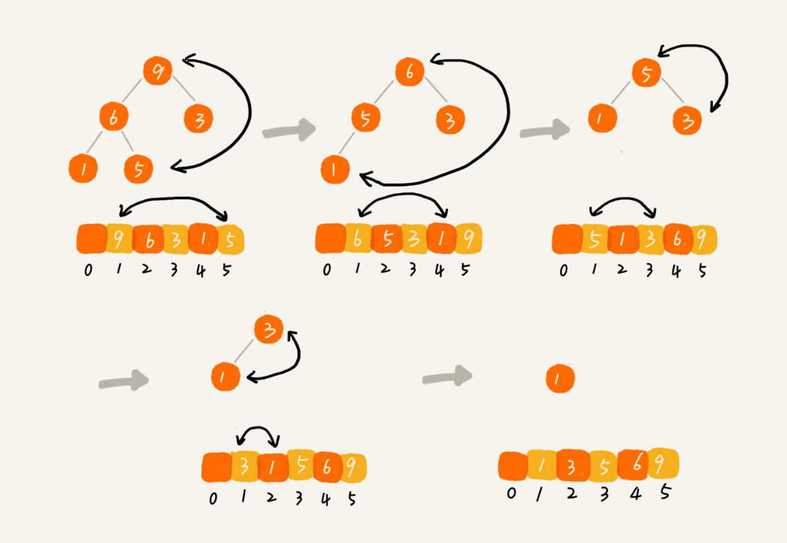

```java

// n表示数据的个数，数组a中的数据从下标1到n的位置。
public static void sort(int[] a, int n) {
  buildHeap(a, n);
  int k = n;
  while (k > 1) {
    swap(a, 1, k);
    --k;
    heapify(a, k, 1);
  }
}
```

整个堆排序的过程，都只需要极个别临时存储空间，所以堆排序是原地排序算法。堆排序包括建堆和排序两个操作，建堆过程的时间复杂度是 O(n)，排序过程的时间复杂度是 O(nlogn)，所以，堆排序整体的时间复杂度是 O(nlogn)。


#### （3）为什么快速排序要比堆排序性能好

- 堆排序数据访问的方式没有快速排序友好。
- 对于同样的元素，在排序过程中，堆排序算法的数据交换次数要多于快速排序。


#### （4）堆的应用

优先级队列、求TopK和求中位数

##### 1、优先级队列

一个堆就可以看作一个优先级队列，往队列插入一个元素，就相当于往堆中插入一个元素；从队列中取出优先级最高的元素，就相当于取出堆顶元素。

（1）合并有序小文件

假设我们有 100 个小文件，每个文件的大小是 100MB，每个文件中存储的都是有序的字符串。

此时可以用优先级队列进行排序。

整体思路有点像归并排序中的合并函数。我们从这 100 个文件中，各取第一个字符串，放入数组中，然后比较大小，把最小的那个字符串放入合并后的大文件中，并从数组中删除。

此时用到的是小顶堆。

（2）高性能定时器

我们按照任务设定的执行时间，将这些任务存储在优先级队列中，队列首部（也就是小顶堆的堆顶）存储的是最先执行的任务。

这样，定时器就不需要每隔 1 秒就扫描一遍任务列表了。它拿队首任务的执行时间点，与当前时间点相减，得到一个时间间隔 T。这个时间间隔 T 就是，从当前时间开始，需要等待多久，才会有第一个任务需要被执行。这样，定时器就可以设定在 T 秒之后，再来执行任务。从当前时间点到（T-1）秒这段时间里，定时器都不需要做任何事情。

当 T 秒时间过去之后，定时器取优先级队列中队首的任务执行。然后再计算新的队首任务的执行时间点与当前时间点的差值，把这个值作为定时器执行下一个任务需要等待的时间。


##### 2、利用堆求TopK

求 Top K 的问题抽象成两类。一类是针对静态数据集合，也就是说数据集合事先确定，不会再变。另一类是针对动态数据集合，也就是说数据集合事先并不确定，有数据动态地加入到集合中。

针对静态数据，如何在一个包含 n 个数据的数组中，查找前 K 大数据呢？我们可以维护一个大小为 K 的小顶堆，顺序遍历数组，从数组中取出数据与堆顶元素比较。如果比堆顶元素大，我们就把堆顶元素删除，并且将这个元素插入到堆中；如果比堆顶元素小，则不做处理，继续遍历数组。这样等数组中的数据都遍历完之后，堆中的数据就是前 K 大数据了。

遍历数组需要 O(n) 的时间复杂度，一次堆化操作需要 O(logK) 的时间复杂度，所以最坏情况下，n 个元素都入堆一次，时间复杂度就是 O(nlogK)。

针对动态数据求得 Top K 就是实时 Top K

如果每次询问前 K 大数据，我们都基于当前的数据重新计算的话，那时间复杂度就是 O(nlogK)，n 表示当前的数据的大小。实际上，我们可以一直都维护一个 K 大小的小顶堆，当有数据被添加到集合中时，我们就拿它与堆顶的元素对比。如果比堆顶元素大，我们就把堆顶元素删除，并且将这个元素插入到堆中；如果比堆顶元素小，则不做处理。这样，无论任何时候需要查询当前的前 K 大数据，我们都可以立刻返回给他。


##### 3、利用堆求中位数

借助堆这种数据结构，不用排序，就可以非常高效地实现求中位数操作。

需要维护两个堆，一个大顶堆，一个小顶堆。大顶堆中存储前半部分数据，小顶堆中存储后半部分数据，且小顶堆中的数据都大于大顶堆中的数据。

也就是说，如果有 n 个数据，n 是偶数，我们从小到大排序，那前 2n 个数据存储在大顶堆中，后 2n 个数据存储在小顶堆中。这样，大顶堆中的堆顶元素就是我们要找的中位数。如果 n 是奇数，情况是类似的，大顶堆就存储 2n+1 个数据，小顶堆中就存储 2n 个数据。


如果新加入的数据小于等于大顶堆的堆顶元素，我们就将这个新数据插入到大顶堆；否则，我们就将这个新数据插入到小顶堆。

这个时候就有可能出现，两个堆中的数据个数不符合前面约定的情况：如果 n 是偶数，两个堆中的数据个数都是 2n；如果 n 是奇数，大顶堆有 2n+1 个数据，小顶堆有 2n 个数据。这个时候，我们可以从一个堆中不停地将堆顶元素移动到另一个堆，通过这样的调整，来让两个堆中的数据满足上面的约定。


#### （4）如何快速获取Top10关键词

首先要统计每个搜索关键词出现的频率。我们可以通过散列表、平衡二叉查找树或者其他一些支持快速查找、插入的数据结构，来记录关键词及其出现的次数。

选用散列表。我们就顺序扫描这 10 亿个搜索关键词。当扫描到某个关键词时，我们去散列表中查询。如果存在，我们就将对应的次数加一；如果不存在，我们就将它插入到散列表，并记录次数为 1。以此类推，等遍历完这 10 亿个搜索关键词之后，散列表中就存储了不重复的搜索关键词以及出现的次数。

然后，我们再根据前面讲的用堆求 Top K 的方法，建立一个大小为 10 的小顶堆，遍历散列表，依次取出每个搜索关键词及对应出现的次数，然后与堆顶的搜索关键词对比。如果出现次数比堆顶搜索关键词的次数多，那就删除堆顶的关键词，将这个出现次数更多的关键词加入到堆中。


### 15、深度和广度优先搜索

如何找出社交网络中的三度好友关系？

#### （1）什么是搜索算法

深度优先搜索算法和广度优先搜索算法都是基于“图”这种数据结构的。

图可以用邻接表和邻接矩阵来存储。

以下代码使用邻接表来实现图：

```java

public class Graph { // 无向图
  private int v; // 顶点的个数
  private LinkedList<Integer> adj[]; // 邻接表

  public Graph(int v) {
    this.v = v;
    adj = new LinkedList[v];
    for (int i=0; i<v; ++i) {
      adj[i] = new LinkedList<>();
    }
  }

  public void addEdge(int s, int t) { // 无向图一条边存两次
    adj[s].add(t);
    adj[t].add(s);
  }
}
```


#### （2）广度优先搜索（BFS）

一种“地毯式”层层推荐的搜索策略，即是先查找离起始顶点最近的，然后是次近的，依次往外搜索。


这里面，bfs() 函数就是基于之前定义的，图的广度优先搜索的代码实现。其中 s 表示起始顶点，t 表示终止顶点。我们搜索一条从 s 到 t 的路径。实际上，这样求得的路径就是从 s 到 t 的最短路径。

```java

public void bfs(int s, int t) {
  if (s == t) return;
  boolean[] visited = new boolean[v];
  visited[s]=true;
  Queue<Integer> queue = new LinkedList<>();
  queue.add(s);
  int[] prev = new int[v];
  for (int i = 0; i < v; ++i) {
    prev[i] = -1;
  }
  while (queue.size() != 0) {
    int w = queue.poll();
   for (int i = 0; i < adj[w].size(); ++i) {
      int q = adj[w].get(i);
      if (!visited[q]) {
        prev[q] = w;
        if (q == t) {
          print(prev, s, t);
          return;
        }
        visited[q] = true;
        queue.add(q);
      }
    }
  }
}

private void print(int[] prev, int s, int t) { // 递归打印s->t的路径
  if (prev[t] != -1 && t != s) {
    print(prev, s, prev[t]);
  }
  System.out.print(t + " ");
}
```

visited 是用来记录已经被访问的顶点，用来避免顶点被重复访问。如果顶点 q 被访问，那相应的 visited[q]会被设置为 true。

queue 是一个队列，用来存储已经被访问、但相连的顶点还没有被访问的顶点。因为广度优先搜索是逐层访问的，也就是说，我们只有把第 k 层的顶点都访问完成之后，才能访问第 k+1 层的顶点。当我们访问到第 k 层的顶点的时候，我们需要把第 k 层的顶点记录下来，稍后才能通过第 k 层的顶点来找第 k+1 层的顶点。所以，我们用这个队列来实现记录的功能。

prev 用来记录搜索路径。当我们从顶点 s 开始，广度优先搜索到顶点 t 后，prev 数组中存储的就是搜索的路径。不过，这个路径是反向存储的。prev[w]存储的是，顶点 w 是从哪个前驱顶点遍历过来的。比如，我们通过顶点 2 的邻接表访问到顶点 3，那 prev[3]就等于 2。为了正向打印出路径，我们需要递归地来打印，你可以看下 print() 函数的实现方式。


最坏情况下，终止顶点 t 离起始顶点 s 很远，需要遍历完整个图才能找到。这个时候，每个顶点都要进出一遍队列，每个边也都会被访问一次，所以，广度优先搜索的时间复杂度是 O(V+E)，其中，V 表示顶点的个数，E 表示边的个数。当然，对于一个连通图来说，也就是说一个图中的所有顶点都是连通的，E 肯定要大于等于 V-1，所以，广度优先搜索的时间复杂度也可以简写为 O(E)。

广度优先搜索的空间消耗主要在几个辅助变量 visited 数组、queue 队列、prev 数组上。这三个存储空间的大小都不会超过顶点的个数，所以空间复杂度是 O(V)。


#### （3）深度优先搜索（DFS）

最直观的例子就是“走迷宫”

假设你站在迷宫的某个岔路口，然后想找到出口。你随意选择一个岔路口来走，走着走着发现走不通的时候，你就回退到上一个岔路口，重新选择一条路继续走，直到最终找到出口。这种走法就是一种深度优先搜索策略。

搜索的起始顶点是 s，终止顶点是 t，我们希望在图中寻找一条从顶点 s 到顶点 t 的路径。如果映射到迷宫那个例子，s 就是你起始所在的位置，t 就是出口。


深度优先搜索用的是一种比较著名的算法思想，回溯思想

深度优先搜索代码实现也用到了 prev、visited 变量以及 print() 函数，它们跟广度优先搜索代码实现里的作用是一样的。不过，深度优先搜索代码实现里，有个比较特殊的变量 found，它的作用是，当我们已经找到终止顶点 t 之后，我们就不再递归地继续查找了。

```java

boolean found = false; // 全局变量或者类成员变量

public void dfs(int s, int t) {
  found = false;
  boolean[] visited = new boolean[v];
  int[] prev = new int[v];
  for (int i = 0; i < v; ++i) {
    prev[i] = -1;
  }
  recurDfs(s, t, visited, prev);
  print(prev, s, t);
}

private void recurDfs(int w, int t, boolean[] visited, int[] prev) {
  if (found == true) return;
  visited[w] = true;
  if (w == t) {
    found = true;
    return;
  }
  for (int i = 0; i < adj[w].size(); ++i) {
    int q = adj[w].get(i);
    if (!visited[q]) {
      prev[q] = w;
      recurDfs(q, t, visited, prev);
    }
  }
}
```

从我前面画的图可以看出，每条边最多会被访问两次，一次是遍历，一次是回退。所以，图上的深度优先搜索算法的时间复杂度是 O(E)，E 表示边的个数。

深度优先搜索算法的消耗内存主要是 visited、prev 数组和递归调用栈。visited、prev 数组的大小跟顶点的个数 V 成正比，递归调用栈的最大深度不会超过顶点的个数，所以总的空间复杂度就是 O(V)。


#### （4）如何找到三度好友

社交网络可以用图来表示。这个问题就非常适合用图的广度优先搜索算法来解决，因为广度优先搜索是层层往外推进的。首先，遍历与起始顶点最近的一层顶点，也就是用户的一度好友，然后再遍历与用户距离的边数为 2 的顶点，也就是二度好友关系，以及与用户距离的边数为 3 的顶点，也就是三度好友关系。


### 16、字符串匹配

**主串和模式串**

比如：在A中查找B，那么A就是主串、B就是模式串

#### （1）BF算法

BF 算法中的 BF 是 Brute Force 的缩写，中文叫作暴力匹配算法，也叫朴素匹配算法。

在主串中，检查起始位置分别是 0、1、2....n-m 且长度为 m 的 n-m+1 个子串，看有没有跟模式串匹配的。

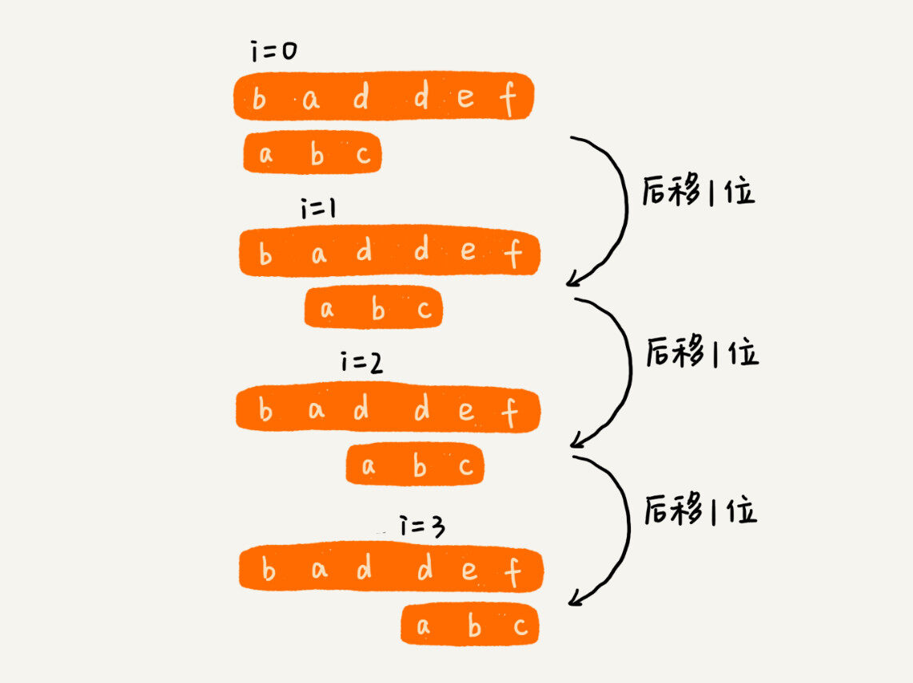

BF 算法的时间复杂度很高，是 O(n*m)


#### （2）RK算法

通过哈希算法对主串中的 n-m+1 个子串分别求哈希值，然后逐个与模式串的哈希值比较大小。如果某个子串的哈希值与模式串相等，那就说明对应的子串和模式串匹配了


此时算法的整体效率并没有提高，需要设计相应的哈希算法。

假设要匹配的字符串的字符集中只包含 K 个字符，我们可以用一个 K 进制数来表示一个子串，这个 K 进制数转化成十进制数，作为子串的哈希值。

比如要处理的字符串只包含 a～z 这 26 个小写字母，那我们就用二十六进制来表示一个字符串。我们把 a～z 这 26 个字符映射到 0～25 这 26 个数字，a 就表示 0，b 就表示 1，以此类推，z 表示 25。

在十进制的表示法中，一个数字的值是通过下面的方式计算出来的。对应到二十六进制，一个包含 a 到 z 这 26 个字符的字符串，计算哈希的时候，我们只需要把进位从 10 改成 26 就可以。


这种哈希算法有一个特点，在主串中，相邻两个子串的哈希值的计算公式有一定关系。我这有个例子，你先找一下规律，再来看我后面的讲解。


从这里例子中，我们很容易就能得出这样的规律：相邻两个子串 s[i-1]和 s[i]（i 表示子串在主串中的起始位置，子串的长度都为 m），对应的哈希值计算公式有交集，也就是说，我们可以使用 s[i-1]的哈希值很快的计算出 s[i]的哈希值。如果用公式表示的话，就是下面这个样子：


RK 算法是借助哈希算法对 BF 算法进行改造，即对每个子串分别求哈希值，然后拿子串的哈希值与模式串的哈希值比较，减少了比较的时间。所以，理想情况下，RK 算法的时间复杂度是 O(n)，跟 BF 算法相比，效率提高了很多。不过这样的效率取决于哈希算法的设计方法，如果存在冲突的情况下，时间复杂度可能会退化。极端情况下，哈希算法大量冲突，时间复杂度就退化为 O(n*m)。


#### （3）BM算法

把模式串和主串的匹配过程，看作模式串在主串中不停地往后滑动。

在模式串与主串匹配的过程中，当模式串和主串某个字符不匹配的时候，能够跳过一些肯定不会匹配的情况，将模式串往后多滑动几位。

BM算法包含两部分，分别是**坏字符规则**和**好后缀规则**。

##### 1、坏字符规则

BM 算法的匹配顺序比较特别，它是按照模式串下标从大到小的顺序，倒着匹配的。


从模式串的末尾往前倒着匹配，当发现某个字符没法匹配的时候，把这个没有匹配的字符叫做**坏字符**


拿坏字符 c 在模式串中查找，发现模式串中并不存在这个字符，也就是说，字符 c 与模式串中的任何字符都不可能匹配。

此时，可将模式串直接往后滑动三位，将模式串滑动到c后面的位置，再从模式串的末尾字符开始比较


此时，模式串的最后一个字符d，无法跟主串中的a匹配，此时，由于坏字符a在模式串中是存在的，模式串中下标是0的位置也是字符a。这种情况下，可将模式串往后滑动两位，让两个a上下对齐，然后再从模式串的末尾字符开始，重新匹配。


模式串后移多少位有没有规律呢？

当发生不匹配的时候，把坏字符对应的模式串中的字符下标记为si。如果坏字符在模式串中存在，将此坏字符在模式串中的最后一个位置下标记为xi。如果不存在，xi就为-1。模式串往后移动的位数就等于si-xi。


##### 2、好后缀规则

如下图，后两位字符是匹配的，倒数第3个字符不匹配。

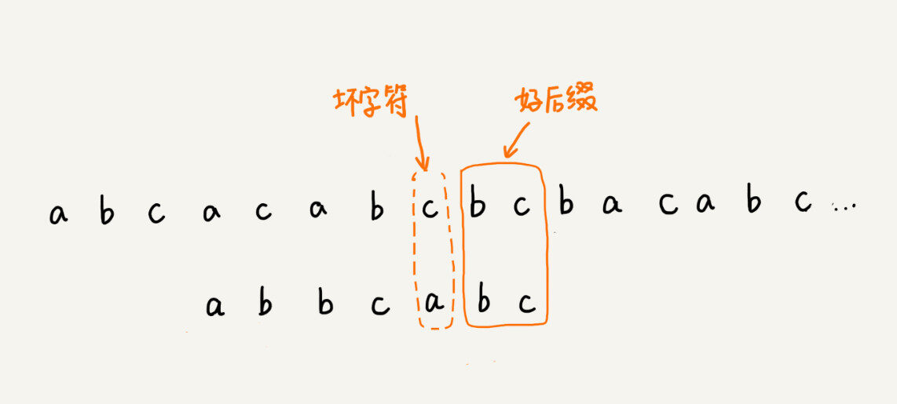

此时已经匹配好的bc叫做好后缀，记为{u}。如果找到了另一个跟{u}相匹配的字串{u*}，那就将模式串滑动到字串{u*}与主串中{u}对齐的位置。

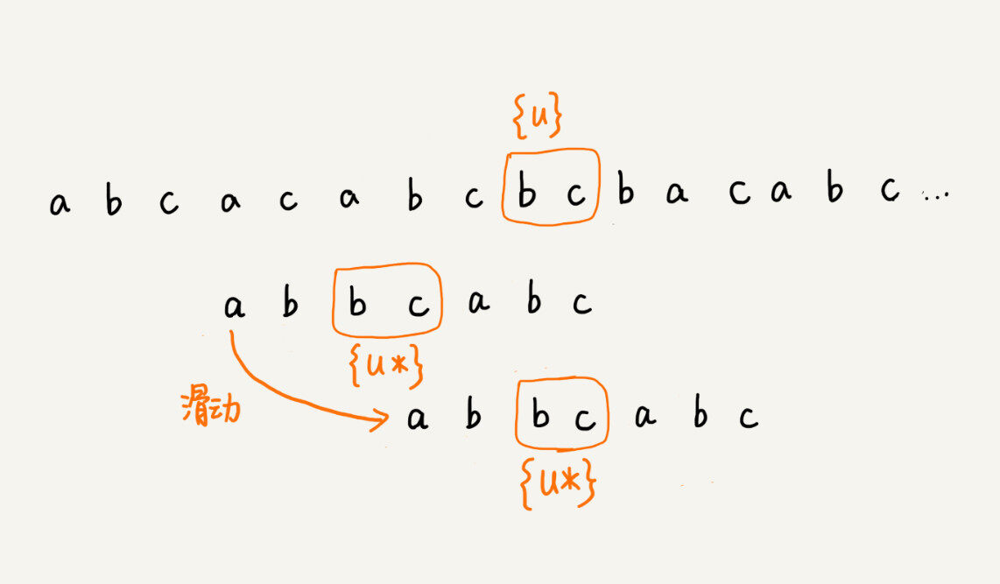

如果在模式串中找不到另一个等于{u}的子串，我们就直接将模式串，滑动到主串中{u}的后面


不过，当模式串中不存在等于{u}的子串时，我们直接将模式串滑动到主串{u}的后面。这样做是否有点太过头呢？我们来看下面这个例子。这里面 bc 是好后缀，尽管在模式串中没有另外一个相匹配的子串{u*}，但是如果我们将模式串移动到好后缀的后面，如图所示，那就会错过模式串和主串可以匹配的情况。


如果好后缀在模式串中不存在可匹配的子串，那在我们一步一步往后滑动模式串的过程中，只要主串中的{u}与模式串有重合，那肯定就无法完全匹配。但是当模式串滑动到前缀与主串中{u}的后缀有部分重合的时候，并且重合的部分相等的时候，就有可能会存在完全匹配的情况。


所以，针对这种情况，我们不仅要看好后缀在模式串中，是否有另一个匹配的子串，我们还要考察好后缀的后缀子串，是否存在跟模式串的前缀子串匹配的。

所谓某个字符串 s 的后缀子串，就是最后一个字符跟 s 对齐的子串，比如 abc 的后缀子串就包括 c, bc。所谓前缀子串，就是起始字符跟 s 对齐的子串，比如 abc 的前缀子串有 a，ab。我们从好后缀的后缀子串中，找一个最长的并且能跟模式串的前缀子串匹配的，假设是{v}，然后将模式串滑动到如图所示的位置。


可以分别计算好后缀和坏字符往后滑动的位数，然后取两个数中最大的，作为模式串往后滑动的位数。这种处理方法还可以避免我们前面提到的，根据坏字符规则，计算得到的往后滑动的位数，有可能是负数的情况。


```java

// a,b表示主串和模式串；n，m表示主串和模式串的长度。
public int bm(char[] a, int n, char[] b, int m) {
  int[] bc = new int[SIZE]; // 记录模式串中每个字符最后出现的位置
  generateBC(b, m, bc); // 构建坏字符哈希表
  int[] suffix = new int[m];
  boolean[] prefix = new boolean[m];
  generateGS(b, m, suffix, prefix);
  int i = 0; // j表示主串与模式串匹配的第一个字符
  while (i <= n - m) {
    int j;
    for (j = m - 1; j >= 0; --j) { // 模式串从后往前匹配
      if (a[i+j] != b[j]) break; // 坏字符对应模式串中的下标是j
    }
    if (j < 0) {
      return i; // 匹配成功，返回主串与模式串第一个匹配的字符的位置
    }
    int x = j - bc[(int)a[i+j]];
    int y = 0;
    if (j < m-1) { // 如果有好后缀的话
      y = moveByGS(j, m, suffix, prefix);
    }
    i = i + Math.max(x, y);
  }
  return -1;
}

// j表示坏字符对应的模式串中的字符下标; m表示模式串长度
private int moveByGS(int j, int m, int[] suffix, boolean[] prefix) {
  int k = m - 1 - j; // 好后缀长度
  if (suffix[k] != -1) return j - suffix[k] +1;
  for (int r = j+2; r <= m-1; ++r) {
    if (prefix[m-r] == true) {
      return r;
    }
  }
  return m;
}


private static final int SIZE = 256; // 全局变量或成员变量
private void generateBC(char[] b, int m, int[] bc) {
  for (int i = 0; i < SIZE; ++i) {
    bc[i] = -1; // 初始化bc
  }
  for (int i = 0; i < m; ++i) {
    int ascii = (int)b[i]; // 计算b[i]的ASCII值
    bc[ascii] = i;
  }
}

// b表示模式串，m表示长度，suffix，prefix数组事先申请好了
private void generateGS(char[] b, int m, int[] suffix, boolean[] prefix) {
  for (int i = 0; i < m; ++i) { // 初始化
    suffix[i] = -1;
    prefix[i] = false;
  }
  for (int i = 0; i < m - 1; ++i) { // b[0, i]
    int j = i;
    int k = 0; // 公共后缀子串长度
    while (j >= 0 && b[j] == b[m-1-k]) { // 与b[0, m-1]求公共后缀子串
      --j;
      ++k;
      suffix[k] = j+1; //j+1表示公共后缀子串在b[0, i]中的起始下标
    }
    if (j == -1) prefix[k] = true; //如果公共后缀子串也是模式串的前缀子串
  }
}
```


BM 算法核心思想是，利用模式串本身的特点，在模式串中某个字符与主串不能匹配的时候，将模式串往后多滑动几位，以此来减少不必要的字符比较，提高匹配的效率。BM 算法构建的规则有两类，坏字符规则和好后缀规则。好后缀规则可以独立于坏字符规则使用。因为坏字符规则的实现比较耗内存，为了节省内存，我们可以只用好后缀规则来实现 BM 算法。


#### （4）KMP算法

注：参考https://www.zhihu.com/question/21923021

在模式串与主串匹配的过程中，当遇到不可匹配的字符的时候，我们希望找到一些规律，可以将模式串往后多滑动几位，跳过那些肯定不会匹配的情况。

在模式串和主串匹配的过程中，把不能匹配的那个字符仍然叫作坏字符，把已经匹配的那段字符串叫作好前缀。


当遇到坏字符的时候，我们就要把模式串往后滑动，在滑动的过程中，只要模式串和好前缀有上下重合，前面几个字符的比较，就相当于拿好前缀的后缀子串，跟模式串的前缀子串在比较。


只需要拿好前缀本身，在它的后缀子串中，查找最长的那个可以跟好前缀的前缀子串匹配的。假设最长的可匹配的那部分前缀子串是{v}，长度是 k。我们把模式串一次性往后滑动 j-k 位，相当于，每次遇到坏字符的时候，我们就把 j 更新为 k，i 不变，然后继续比较。


把好前缀的所有后缀子串中，最长的可匹配前缀子串的那个后缀子串，叫作最长可匹配后缀子串；对应的前缀子串，叫作最长可匹配前缀子串。


这个问题其实不涉及主串，只需要通过模式串本身就能求解。

类似 BM 算法中的 bc、suffix、prefix 数组，KMP 算法也可以提前构建一个数组，用来存储模式串中每个前缀（这些前缀都有可能是好前缀）的最长可匹配前缀子串的结尾字符下标。我们把这个数组定义为 next 数组，很多书中还给这个数组起了一个名字，叫失效函数（failure function）。

数组的下标是每个前缀结尾字符下标，数组的值是这个前缀的最长可以匹配前缀子串的结尾字符下标。这句话有点拗口，我举了一个例子，你一看应该就懂了。


```java

// a, b分别是主串和模式串；n, m分别是主串和模式串的长度。
public static int kmp(char[] a, int n, char[] b, int m) {
  int[] next = getNexts(b, m);
  int j = 0;
  for (int i = 0; i < n; ++i) {
    while (j > 0 && a[i] != b[j]) { // 一直找到a[i]和b[j]
      j = next[j - 1] + 1;
    }
    if (a[i] == b[j]) {
      ++j;
    }
    if (j == m) { // 找到匹配模式串的了
      return i - m + 1;
    }
  }
  return -1;
}
```


**失效函数计算方法：**

可以用非常笨的方法，比如要计算下面这个模式串 b 的 next[4]，我们就把 b[0, 4]的所有后缀子串，从长到短找出来，依次看看，是否能跟模式串的前缀子串匹配。很显然，这个方法也可以计算得到 next 数组，但是效率非常低。


照下标从小到大，依次计算 next 数组的值。当我们要计算 next[i]的时候，前面的 next[0]，next[1]，……，next[i-1]应该已经计算出来了。利用已经计算出来的 next 值，我们是否可以快速推导出 next[i]的值呢？

如果 next[i-1]=k-1，也就是说，子串 b[0, k-1]是 b[0, i-1]的最长可匹配前缀子串。如果子串 b[0, k-1]的下一个字符 b[k]，与 b[0, i-1]的下一个字符 b[i]匹配，那子串 b[0, k]就是 b[0, i]的最长可匹配前缀子串。所以，next[i]等于 k。但是，如果 b[0, k-1]的下一字符 b[k]跟 b[0, i-1]的下一个字符 b[i]不相等呢？这个时候就不能简单地通过 next[i-1]得到 next[i]了。这个时候该怎么办呢？


假设 b[0, i]的最长可匹配后缀子串是 b[r, i]。如果我们把最后一个字符去掉，那 b[r, i-1]肯定是 b[0, i-1]的可匹配后缀子串，但不一定是最长可匹配后缀子串。所以，既然 b[0, i-1]最长可匹配后缀子串对应的模式串的前缀子串的下一个字符并不等于 b[i]，那么我们就可以考察 b[0, i-1]的次长可匹配后缀子串 b[x, i-1]对应的可匹配前缀子串 b[0, i-1-x]的下一个字符 b[i-x]是否等于 b[i]。如果等于，那 b[x, i]就是 b[0, i]的最长可匹配后缀子串。


次长可匹配后缀子串肯定被包含在最长可匹配后缀子串中，而最长可匹配后缀子串又对应最长可匹配前缀子串 b[0, y]。于是，查找 b[0, i-1]的次长可匹配后缀子串，这个问题就变成，查找 b[0, y]的最长匹配后缀子串的问题了。

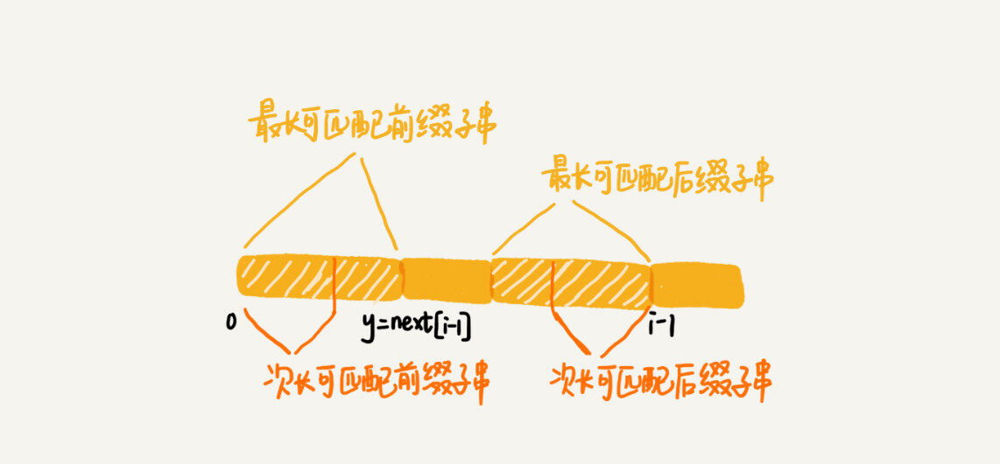

按照这个思路，我们可以考察完所有的 b[0, i-1]的可匹配后缀子串 b[y, i-1]，直到找到一个可匹配的后缀子串，它对应的前缀子串的下一个字符等于 b[i]，那这个 b[y, i]就是 b[0, i]的最长可匹配后缀子串。

```java

// b表示模式串，m表示模式串的长度
private static int[] getNexts(char[] b, int m) {
  int[] next = new int[m];
  next[0] = -1;
  int k = -1;
  for (int i = 1; i < m; ++i) {
    while (k != -1 && b[k + 1] != b[i]) {
      k = next[k];
    }
    if (b[k + 1] == b[i]) {
      ++k;
    }
    next[i] = k;
  }
  return next;
}
```


**复杂度分析：**

空间复杂度很容易分析，KMP 算法只需要一个额外的 next 数组，数组的大小跟模式串相同。所以空间复杂度是 O(m)，m 表示模式串的长度。


时间复杂度：

KMP 算法包含两部分，第一部分是构建 next 数组，第二部分才是借助 next 数组匹配。

i 从 1 开始一直增加到 m，而 k 并不是每次 for 循环都会增加，所以，k 累积增加的值肯定小于 m。而 while 循环里 k=next[k]，实际上是在减小 k 的值，k 累积都没有增加超过 m，所以 while 循环里面 k=next[k]总的执行次数也不可能超过 m。因此，next 数组计算的时间复杂度是 O(m)。

从 0 循环增长到 n-1，j 的增长量不可能超过 i，所以肯定小于 n。而 while 循环中的那条语句 j=next[j-1]+1，不会让 j 增长的，那有没有可能让 j 不变呢？也没有可能。因为 next[j-1]的值肯定小于 j-1，所以 while 循环中的这条语句实际上也是在让 j 的值减少。而 j 总共增长的量都不会超过 n，那减少的量也不可能超过 n，所以 while 循环中的这条语句总的执行次数也不会超过 n，所以这部分的时间复杂度是 O(n)。

所以，综合两部分的时间复杂度，KMP 算法的时间复杂度就是 O(m+n)。


### 17、Trie树

可实现搜索引擎的搜索关键词提示功能

Trie树是一种专门处理字符串匹配的数据结构，用来解决在一组字符串集合中快速查找某个字符串的问题。

Trie 树的本质，就是利用字符串之间的公共前缀，将重复的前缀合并在一起。

Trie树比较费内存，是一种空间换时间的解决问题思路。


其中，根节点不包含任何信息。每个节点表示一个字符串中的字符，从根节点到红色节点的一条路径表示一个字符串（注意：红色节点并不都是叶子节点）。

**Trie树构造过程：**


当我们在 Trie 树中查找一个字符串的时候，比如查找字符串“her”，那我们将要查找的字符串分割成单个的字符 h，e，r，然后从 Trie 树的根节点开始匹配。如图所示，绿色的路径就是在 Trie 树中匹配的路径。


#### （1）如何实现一棵Trie树

Trie树主要有两个操作，一个是将字符串集合构造成Trie树，也就是一个将字符串插入到Trie树的过程。

另一个是在Trie树中查询一个字符串。

**如何存储一棵Trie树？**

借助散列表的思想，我们通过一个下标与字符一一映射的数组，来存储子节点的指针。


假设我们的字符串中只有从 a 到 z 这 26 个小写字母，我们在数组中下标为 0 的位置，存储指向子节点 a 的指针，下标为 1 的位置存储指向子节点 b 的指针，以此类推，下标为 25 的位置，存储的是指向的子节点 z 的指针。如果某个字符的子节点不存在，我们就在对应的下标的位置存储 null。

```java
class TrieNode {
  char data;
  TrieNode children[26];
}
```


```java

public class Trie {
  private TrieNode root = new TrieNode('/'); // 存储无意义字符

  // 往Trie树中插入一个字符串
  public void insert(char[] text) {
    TrieNode p = root;
    for (int i = 0; i < text.length; ++i) {
      int index = text[i] - 'a';
      if (p.children[index] == null) {
        TrieNode newNode = new TrieNode(text[i]);
        p.children[index] = newNode;
      }
      p = p.children[index];
    }
    p.isEndingChar = true;
  }

  // 在Trie树中查找一个字符串
  public boolean find(char[] pattern) {
    TrieNode p = root;
    for (int i = 0; i < pattern.length; ++i) {
      int index = pattern[i] - 'a';
      if (p.children[index] == null) {
        return false; // 不存在pattern
      }
      p = p.children[index];
    }
    if (p.isEndingChar == false) return false; // 不能完全匹配，只是前缀
    else return true; // 找到pattern
  }

  public class TrieNode {
    public char data;
    public TrieNode[] children = new TrieNode[26];
    public boolean isEndingChar = false;
    public TrieNode(char data) {
      this.data = data;
    }
  }
}
```

**在 Trie 树中，查找某个字符串的时间复杂度是多少？**

每次查询时，如果要查询的字符串长度是 k，那我们只需要比对大约 k 个节点，就能完成查询操作。跟原本那组字符串的长度和个数没有任何关系。所以说，构建好 Trie 树后，在其中查找字符串的时间复杂度是 O(k)，k 表示要查找的字符串的长度。


#### （2）如何利用Trie树，实现搜索关键词提示

我们假设关键词库由用户的热门搜索关键词组成。我们将这个词库构建成一个 Trie 树。当用户输入其中某个单词的时候，把这个词作为一个前缀子串在 Trie 树中匹配。为了讲解方便，我们假设词库里只有 hello、her、hi、how、so、see 这 6 个关键词。当用户输入了字母 h 的时候，我们就把以 h 为前缀的 hello、her、hi、how 展示在搜索提示框内。当用户继续键入字母 e 的时候，我们就把以 he 为前缀的 hello、her 展示在搜索提示框内。这就是搜索关键词提示的最基本的算法原理。


### 18、AC自动机

**如何用多模式串匹配实现敏感词过滤功能？**


#### （1）基于单模式串和Trie树实现的敏感词过滤

**单模式串匹配算法：** BF、RK、BM、KMP算法

**多模式串匹配算法：** Trie树


### 19、贪心算法

**可实现Huffman压缩编码**

在对问题求解时，总是做出在当前看来是最好的选择。也就是说，不从整体最优上加以考虑，算法得到的是在某种意义上的局部最优解。


**例如**：

假设我们有一个可以容纳 100kg 物品的背包，可以装各种物品。我们有以下 5 种豆子，每种豆子的总量和总价值都各不相同。为了让背包中所装物品的总价值最大，我们如何选择在背包中装哪些豆子？每种豆子又该装多少呢？

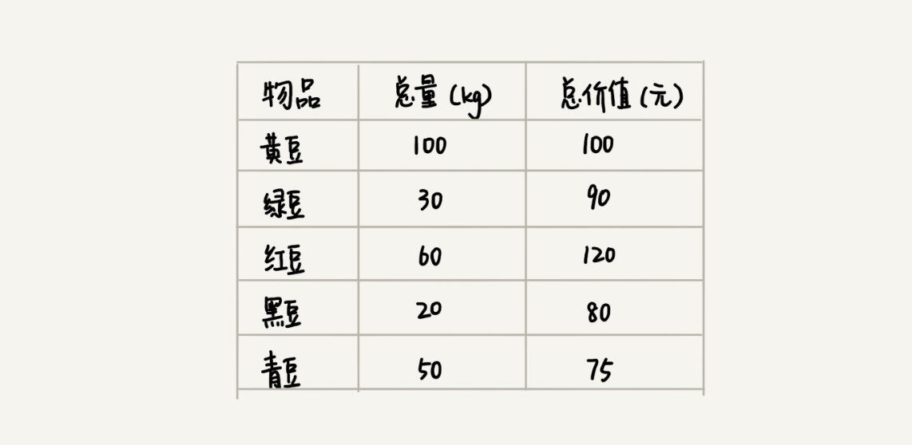

按照单价由高到低依次来装就好了。单价从高到低排列，依次是：黑豆、绿豆、红豆、青豆、黄豆，所以，可以往背包里装 20kg 黑豆、30kg 绿豆、50kg 红豆。


**贪心算法解决问题的步骤：**

（1）针对一组数据，定义了限制值和期望值，希望从中选出几个数据，在满足限制值的情况下，期望值最大

类比到刚刚的例子，限制值就是重量不能超过 100kg，期望值就是物品的总价值。这组数据就是 5 种豆子。我们从中选出一部分，满足重量不超过 100kg，并且总价值最大。

类似这种问题，首先就是贪心算法

（2）我们尝试看下这个问题是否可以用贪心算法解决：每次选择当前情况下，在对限制值同等贡献量的情况下，对期望值贡献最大的数据。

类比到刚刚的例子，我们每次都从剩下的豆子里面，选择单价最高的，也就是重量相同的情况下，对价值贡献最大的豆子。

（3）我们举几个例子看下贪心算法产生的结果是否是最优的。


**实际上，用贪心算法解决问题的思路，并不总能给出最优解，它只是局部最优**


#### （1）案例

##### 1、钱币找零

假设我们有 1 元、2 元、5 元、10 元、20 元、50 元、100 元这些面额的纸币，它们的张数分别是 c1、c2、c5、c10、c20、c50、c100。我们现在要用这些钱来支付 K 元，最少要用多少张纸币呢？

肯定是先用面值最大的来支付，如果不够，就继续用更小一点面值的，以此类推，最后剩下的用 1 元来补齐。

在贡献相同期望值（纸币数目）的情况下，我们希望多贡献点金额，这样就可以让纸币数更少，这就是一种贪心算法的解决思路。


##### 2、区间覆盖

假设我们有 n 个区间，区间的起始端点和结束端点分别是[l1, r1]，[l2, r2]，[l3, r3]，……，[ln, rn]。我们从这 n 个区间中选出一部分区间，这部分区间满足两两不相交（端点相交的情况不算相交），最多能选出多少个区间呢？


假设这 n 个区间中最左端点是 lmin，最右端点是 rmax。这个问题就相当于，我们选择几个不相交的区间，从左到右将[lmin, rmax]覆盖上。我们按照起始端点从小到大的顺序对这 n 个区间排序。

每次选择的时候，左端点跟前面的已经覆盖的区间不重合的，右端点又尽量小的，这样可以让剩下的未覆盖区间尽可能的大，就可以放置更多的区间。这实际上就是一种贪心的选择方法。


#### （2）如何用贪心算法实现霍夫曼编码？

假设我有一个包含 1000 个字符的文件，每个字符占 1 个 byte（1byte=8bits），存储这 1000 个字符就一共需要 8000bits，那有没有更加节省空间的存储方式呢？

假设我们通过统计分析发现，这 1000 个字符中只包含 6 种不同字符，假设它们分别是 a、b、c、d、e、f。而 3 个二进制位（bit）就可以表示 8 个不同的字符，所以，为了尽量减少存储空间，每个字符我们用 3 个二进制位来表示。那存储这 1000 个字符只需要 3000bits 就可以了

```java
a(000)、b(001)、c(010)、d(011)、e(100)、f(101)
```


**霍夫曼编码：**

霍夫曼编码不仅会考察文本中有多少个不同字符，还会考察每个字符出现的频率，根据频率的不同，选择不同长度的编码。霍夫曼编码试图用这种不等长的编码方法，来进一步增加压缩的效率。

**如何给不同频率的字符选择不同长度的编码呢？**

根据贪心的思想，我们可以把出现频率比较多的字符，用稍微短一些的编码；出现频率比较少的字符，用稍微长一些的编码。


对于等长的编码来说，我们解压缩起来很简单。比如刚才那个例子中，我们用 3 个 bit 表示一个字符。在解压缩的时候，我们每次从文本中读取 3 位二进制码，然后翻译成对应的字符

霍夫曼编码是不等长的，每次应该读取 1 位还是 2 位、3 位等等来解压缩呢？这个问题就导致霍夫曼编码解压缩起来比较复杂。为了避免解压缩过程中的歧义，霍夫曼编码要求各个字符的编码之间，不会出现某个编码是另一个编码前缀的情况。

只要让每个字符都是叶子节点，就不会出现一个编码是另一个编码的前缀。


假设这 6 个字符出现的频率从高到低依次是 a、b、c、d、e、f。我们把它们编码下面这个样子，任何一个字符的编码都不是另一个的前缀，在解压缩的时候，我们每次会读取尽可能长的可解压的二进制串，所以在解压缩的时候也不会歧义。经过这种编码压缩之后，这 1000 个字符只需要 2100bits 就可以了。


### 20、分治算法

分治算法的核心思想就是：分而治之，也就是将原问题划分成n个规模较小，并且结构与原问题相似的子问题，递归地解决这些子问题，然后再合并结果，就得到原问题地解。

分治算法比较适合用递归来实现。每一层递归都会涉及以下三个操作：

- 分解：将原问题分解成一系列子问题；
- 解决：递归地求解各个子问题，若子问题足够小，则直接求解；
- 合并：将子问题的结果合并成原问题。

分治算法能解决的问题，一般需要满足下面这几个条件：

- 原问题与分解成的小问题具有相同的模式；
- 原问题分解成的子问题可以独立求解，子问题之间没有相关性
- 具有分解终止条件，也就是说，当问题足够小时，可以直接求解；
- 可以将子问题合并成原问题，而这个合并操作的复杂度不能太高，否则就起不到减小算法总体复杂度的效果了。


**例如：**

假设有 n 个数据，我们期望数据从小到大排列，那完全有序的数据的有序度就是 n(n-1)/2，逆序度等于 0；相反，倒序排列的数据的有序度就是 0，逆序度是 n(n-1)/2。除了这两种极端情况外，我们通过计算有序对或者逆序对的个数，来表示数据的有序度或逆序度。


用分治算法来试试。我们套用分治的思想来求数组 A 的逆序对个数。我们可以将数组分成前后两半 A1 和 A2，分别计算 A1 和 A2 的逆序对个数 K1 和 K2，然后再计算 A1 与 A2 之间的逆序对个数 K3。那数组 A 的逆序对个数就等于 K1+K2+K3。

归并排序中有一个非常关键的操作，就是将两个有序的小数组，合并成一个有序的数组。实际上，在这个合并的过程中，我们就可以计算这两个小数组的逆序对个数了。每次合并操作，我们都计算逆序对个数，把这些计算出来的逆序对个数求和，就是这个数组的逆序对个数了。


```java

private int num = 0; // 全局变量或者成员变量

public int count(int[] a, int n) {
  num = 0;
  mergeSortCounting(a, 0, n-1);
  return num;
}

private void mergeSortCounting(int[] a, int p, int r) {
  if (p >= r) return;
  int q = (p+r)/2;
  mergeSortCounting(a, p, q);
  mergeSortCounting(a, q+1, r);
  merge(a, p, q, r);
}

private void merge(int[] a, int p, int q, int r) {
        int i = p, j = q + 1, k = 0;
        int[] tmp = new int[r - p + 1];
        while (i <= q && j <= r) {
            if (a[i] <= a[j]) {
                tmp[k++] = a[i++];
            } else {
                num += (q - i + 1);
                tmp[k++] = a[j++];
            }
        }
        while (i <= q) {
            tmp[k++] = a[i++];
        }
        while (j <= r) {
            tmp[k++] = a[j++];
        }
        for (i = 0; i < r - p + 1; ++i) {
            a[p + i] = tmp[i];
        }
    }
```


分治算法最经典的当属是MapReduce。


### 21、回溯算法

参考：https://juejin.cn/post/6887049646988853262

回溯算法实际上是一个类似枚举的搜索尝试过程，主要是在搜索尝试过程中寻找问题的解，当发现已不满足求解条件时，就回溯返回，尝试别的路径。

回溯法是一种选优搜索法，按选优条件向前搜索，以达到目标。但当搜索到某一步时，发现原先选择并不优或达不到目标，就退回一步重新选择，这种走不通就退回再走的技术为回溯法，而满足回溯条件的某个状态的点称为“回溯点”

用回溯算法解决问题的一般步骤：

- 针对所给问题，定义问题的解空间，它至少包含问题的一个（最优）解。
-  确定易于搜索的解空间结构,使得能用[回溯法](https://baike.baidu.com/item/回溯法)方便地搜索整个解空间 。
-  以深度优先的方式搜索解空间，并且在搜索过程中用剪枝函数避免无效搜索。

回溯是经过修改的深度优先查找方法，过程包括：对一个状态空间树进行深度优先查找，检查每个节点是否满足条件。如果不满足就回溯到该节点的父节点。算法框架(伪代码)如下：

```java
result = []
backtrack(路径, 选择列表):
    if 满足结束条件:
        result.add(路径)
        return
    
    for 选择 in 选择列表:
        做选择
        backtrack(路径, 选择列表)
        撤销选择
```

 核心就是for循环里面的递归, 在递归调用之前做选择, 递归调用之后撤销选择。


例如：给定一个 **没有重复** 数字的序列，返回其所有可能的全排列。

```java
输入: [1,2,3]
输出:
[
  [1,2,3],
  [1,3,2],
  [2,1,3],
  [2,3,1],
  [3,1,2],
  [3,2,1]
]
```

题解：

```java
List<List<Integer>> result = new ArrayList<>();

public void solution(List<Integer> tmpList,int[] nums) {
	if (tmpList.size() == nums.length) {
		result.add(new ArrayList(tmpList));
	} else {
		for (int i=0;i<nums.length;i++) {
			if (tmpList.indexOf(nums[i])>-1) continue;
			tmpList.add(nums[i]);
			solution(tmpList,nums);
			tmpList.remove(tmpList.size()-1);
		}
	}
}
```


如果是有重复的，就需要用另一个数组记录下标：

例如：给定一个可包含重复数字的序列，返回所有不重复的全排列。

```java
输入: [1,1,2]
输出:
[
  [1,1,2],
  [1,2,1],
  [2,1,1]
]
```

```python
var permuteUnique = function(nums) {
    let len = nums.length, res = [], idx = [];
    nums.sort((a, b) => a - b);
    function backTrace(path, idx) {
        if(path.length === len) return res.push(path.slice());
        for (let i = 0; i < len; i++) {
            if((nums[i] === nums[i - 1] && idx.includes(i - 1)) || idx.includes(i)) continue;
            path.push(nums[i]);
            idx.push(i);
            backTrace(path, idx);
            path.pop();
            idx.pop();
        }
    }
    backTrace([], idx);
    return res;
};
```


也有是需要用start下标来做循环遍历的。

给定一组**不含重复元素**的整数数组nums，返回该数组所有可能的子集（幂集）。**说明：**解集不能包含重复的子集。

```java
输入: nums = [1,2,3]
输出:
[
  [3],
  [1],
  [2],
  [1,2,3],
  [1,3],
  [2,3],
  [1,2],
  []
]
```

```java
var subsets = function(nums) {
    let path = [], res = [];
    let backTrace = (start, nums, path, res) => {
        if(path.length > nums.length) return;
        res.push(path.slice());
        for (let i = start; i < nums.length; i++) {
            path.push(nums[i]);
            backTrace(i + 1, nums, path, res);
            path.pop()
        }
    }
    backTrace(0, nums, path, res);
    return res;
};
```


八皇后：有一个 8x8 的棋盘，希望往里放 8 个棋子（皇后），每个棋子所在的行、列、对角线都不能有另一个棋子。


把这个问题划分成 8 个阶段，依次将 8 个棋子放到第一行、第二行、第三行……第八行。在放置的过程中，我们不停地检查当前放法，是否满足要求。如果满足，则跳到下一行继续放置棋子；如果不满足，那就再换一种放法，继续尝试。

```java

int[] result = new int[8];//全局或成员变量,下标表示行,值表示queen存储在哪一列
public void cal8queens(int row) { // 调用方式：cal8queens(0);
  if (row == 8) { // 8个棋子都放置好了，打印结果
    printQueens(result);
    return; // 8行棋子都放好了，已经没法再往下递归了，所以就return
  }
  for (int column = 0; column < 8; ++column) { // 每一行都有8中放法
    if (isOk(row, column)) { // 有些放法不满足要求
      result[row] = column; // 第row行的棋子放到了column列
      cal8queens(row+1); // 考察下一行
    }
  }
}

private boolean isOk(int row, int column) {//判断row行column列放置是否合适
  int leftup = column - 1, rightup = column + 1;
  for (int i = row-1; i >= 0; --i) { // 逐行往上考察每一行
    if (result[i] == column) return false; // 第i行的column列有棋子吗？
    if (leftup >= 0) { // 考察左上对角线：第i行leftup列有棋子吗？
      if (result[i] == leftup) return false;
    }
    if (rightup < 8) { // 考察右上对角线：第i行rightup列有棋子吗？
      if (result[i] == rightup) return false;
    }
    --leftup; ++rightup;
  }
  return true;
}

private void printQueens(int[] result) { // 打印出一个二维矩阵
  for (int row = 0; row < 8; ++row) {
    for (int column = 0; column < 8; ++column) {
      if (result[row] == column) System.out.print("Q ");
      else System.out.print("* ");
    }
    System.out.println();
  }
  System.out.println();
}
```


0-1背包：

背包总的承载重量是 Wkg。现在我们有 n 个物品，每个物品的重量不等，并且不可分割。我们现在期望选择几件物品，装载到背包中。在不超过背包所能装载重量的前提下，如何让背包中物品的总重量最大？

就可以用回溯的方法。我们可以把物品依次排列，整个问题就分解为了 n 个阶段，每个阶段对应一个物品怎么选择。先对第一个物品进行处理，选择装进去或者不装进去，然后再递归地处理剩下的物品。

```java

public int maxW = Integer.MIN_VALUE; //存储背包中物品总重量的最大值
// cw表示当前已经装进去的物品的重量和；i表示考察到哪个物品了；
// w背包重量；items表示每个物品的重量；n表示物品个数
// 假设背包可承受重量100，物品个数10，物品重量存储在数组a中，那可以这样调用函数：
// f(0, 0, a, 10, 100)
public void f(int i, int cw, int[] items, int n, int w) {
  if (cw == w || i == n) { // cw==w表示装满了;i==n表示已经考察完所有的物品
    if (cw > maxW) maxW = cw;
    return;
  }
  f(i+1, cw, items, n, w); //不添加当前物品，判断下一个物品
  if (cw + items[i] <= w) {// 已经超过可以背包承受的重量的时候，就不要再装了
    f(i+1,cw + items[i], items, n, w); //添加当前物品，并继续判断下一个物品
  }
}
```


正则表达式：

正则表达式中，最重要的就是通配符，通配符结合在一起，可以表达非常丰富的语义。为了方便讲解，我假设正则表达式中只包含“\*”和“?”这两种通配符，并且对这两个通配符的语义稍微做些改变，其中，“*”匹配任意多个（大于等于 0 个）任意字符，“?”匹配零个或者一个任意字符。

依次考察正则表达式中的每个字符，当是非通配符时，我们就直接跟文本的字符进行匹配，如果相同，则继续往下处理；如果不同，则回溯。

如果遇到特殊字符的时候，我们就有多种处理方式了，也就是所谓的岔路口，比如“*”有多种匹配方案，可以匹配任意个文本串中的字符，我们就先随意的选择一种匹配方案，然后继续考察剩下的字符。如果中途发现无法继续匹配下去了，我们就回到这个岔路口，重新选择一种匹配方案，然后再继续匹配剩下的字符。

```java

public class Pattern {
  private boolean matched = false;
  private char[] pattern; // 正则表达式
  private int plen; // 正则表达式长度

  public Pattern(char[] pattern, int plen) {
    this.pattern = pattern;
    this.plen = plen;
  }

  public boolean match(char[] text, int tlen) { // 文本串及长度
    matched = false;
    rmatch(0, 0, text, tlen);
    return matched;
  }

  private void rmatch(int ti, int pj, char[] text, int tlen) {
    if (matched) return; // 如果已经匹配了，就不要继续递归了
    if (pj == plen) { // 正则表达式到结尾了
      if (ti == tlen) matched = true; // 文本串也到结尾了
      return;
    }
    if (pattern[pj] == '*') { // *匹配任意个字符
      for (int k = 0; k <= tlen-ti; ++k) {
        rmatch(ti+k, pj+1, text, tlen);
      }
    } else if (pattern[pj] == '?') { // ?匹配0个或者1个字符
      rmatch(ti, pj+1, text, tlen);
      rmatch(ti+1, pj+1, text, tlen);
    } else if (ti < tlen && pattern[pj] == text[ti]) { // 纯字符匹配才行
      rmatch(ti+1, pj+1, text, tlen);
    }
  }
}
```


### 22、动态规划

动态规划比较适合用来求解最优问题，比如求最大值、最小值等。可非常显著地降低时间复杂度，提高代码地执行效率。

#### （1）问题示例

##### 1、0-1背包问题

对于一组不同重量、不可分割的物品，我们需要选择一些装入背包，在满足背包最大重量限制的前提下，背包中物品总重量的最大值是多少呢？

回溯算法：

```java
// 回溯算法实现。注意：我把输入的变量都定义成了成员变量。
private int maxW = Integer.MIN_VALUE; // 结果放到maxW中
private int[] weight = {2，2，4，6，3};  // 物品重量
private int n = 5; // 物品个数
private int w = 9; // 背包承受的最大重量
public void f(int i, int cw) { // 调用f(0, 0)
  if (cw == w || i == n) { // cw==w表示装满了，i==n表示物品都考察完了
    if (cw > maxW) maxW = cw;
    return;
  }
  f(i+1, cw); // 选择不装第i个物品
  if (cw + weight[i] <= w) {
    f(i+1,cw + weight[i]); // 选择装第i个物品
  }
}
```

用图片表示就是：


递归树中的每个节点表示一种状态，用（i，cw）来表示，其中i表示要决策第i个物品是否装入背包，cw表示当前背包中物品的总重量，比如（2，2）表示要角色第2个物品是否要装入背包，决策前，背包中物品的总重量是2.

从递归树中可发现，有些子问题的求解是重复的。此时可借助“备忘录”的解决方式，记录已经计算好的f(i,cw)，当再次计算到重复的f(i,cw)的时候，可直接从备忘录中取出来用，就不用再递归计算了，可避免冗余计算。

```java

private int maxW = Integer.MIN_VALUE; // 结果放到maxW中
private int[] weight = {2，2，4，6，3};  // 物品重量
private int n = 5; // 物品个数
private int w = 9; // 背包承受的最大重量
private boolean[][] mem = new boolean[5][10]; // 备忘录，默认值false
public void f(int i, int cw) { // 调用f(0, 0)
  if (cw == w || i == n) { // cw==w表示装满了，i==n表示物品都考察完了
    if (cw > maxW) maxW = cw;
    return;
  }
  if (mem[i][cw]) return; // 重复状态
  mem[i][cw] = true; // 记录(i, cw)这个状态
  f(i+1, cw); // 选择不装第i个物品
  if (cw + weight[i] <= w) {
    f(i+1,cw + weight[i]); // 选择装第i个物品
  }
}
```


动态规划：

把整个求解过程分为n个阶段，每个阶段会决策一个物品是否放到背包中，每个物品决策完之后，背包中的物品的重量会有多种情况，也就是说，回达到多种不同的状态，对应到递归树中，就是有很多不同的节点。

**把每一层的重复的状态（节点）合并，只记录不同的状态，然后基于上一层的状态集合，来推导下一层的状态集合，可通过合并每一层重复的抓过你太，保证每一层不同状态的个数不会超过w个（w表示背包的承载重量），就成功的皮面了每层状态个数的指数级增长。**

用一个二维数组 states\[n][w+1]，来记录每层可以达到的不同状态。

第0个物品重量是2，决策完后，会对应背包两种状态，背包中物品的总重量是0或者2，用states\[0][0]=true和states\[0][2]=true来表示这两种状态

第 1 个物品的重量也是 2，基于之前的背包状态，在这个物品决策完之后，不同的状态有 3 个，背包中物品总重量分别是 0(0+0)，2(0+2 or 2+0)，4(2+2)。我们用 states\[1][0]=true，states\[1][2]=true，states\[1][4]=true 来表示这三种状态。

以此类推，直到考察完所有的物品后，整个 states 状态数组就都计算好了。我把整个计算的过程画了出来，你可以看看。图中 0 表示 false，1 表示 true。我们只需要在最后一层，找一个值为 true 的最接近 w（这里是 9）的值，就是背包中物品总重量的最大值。

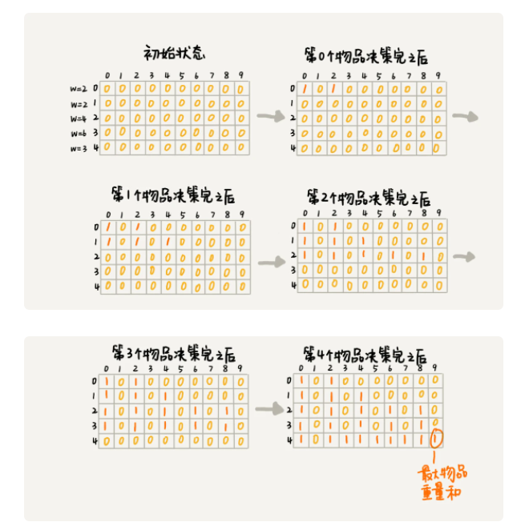

```java

weight:物品重量，n:物品个数，w:背包可承载重量
public int knapsack(int[] weight, int n, int w) {
  boolean[][] states = new boolean[n][w+1]; // 默认值false
  states[0][0] = true;  // 第一行的数据要特殊处理，可以利用哨兵优化
  if (weight[0] <= w) {
    states[0][weight[0]] = true;
  }
  for (int i = 1; i < n; ++i) { // 动态规划状态转移
    for (int j = 0; j <= w; ++j) {// 不把第i个物品放入背包，继承上一层的状态，没有放入背包，但是上层的状态要拷贝到当前层
      if (states[i-1][j] == true) states[i][j] = true;
    }
    for (int j = 0; j <= w-weight[i]; ++j) {//把第i个物品放入背包
      if (states[i-1][j]==true) states[i][j+weight[i]] = true;
    }
  }
  for (int i = w; i >= 0; --i) { // 输出结果
    if (states[n-1][i] == true) return i;
  }
  return 0;
}
```


**动态规划思路：把问题分级为多个阶段，每个阶段对应一个决策，记录每一个阶段可达的状态集合（去掉重复的），然后通过当前阶段的状态集合，来推导下一个阶段的状态集合，动态的往前推进。**

用回溯算法解决这个问题的时间复杂度 O(2^n)，动态规划是O(n*w)，n是物品个数，w是背包可承载的总重量。


刚才的代码需要额外申请一个n*w+1的二维数组，对空间消耗大，此时只需要一个大小为w+1的一维数组就可以，因为只需要最后的一层状态，所以依次将当前层的状态覆盖上一层的状态。

```java

public static int knapsack2(int[] items, int n, int w) {
  boolean[] states = new boolean[w+1]; // 默认值false
  states[0] = true;  // 第一行的数据要特殊处理，可以利用哨兵优化
  if (items[0] <= w) {
    states[items[0]] = true;
  }
  for (int i = 1; i < n; ++i) { // 动态规划
    for (int j = w-items[i]; j >= 0; --j) {//把第i个物品放入背包 按照 j 从小到大处理的话，会出现 for 循环重复计算的问题
      if (states[j]==true) states[j+items[i]] = true;
    }
  }
  for (int i = w; i >= 0; --i) { // 输出结果
    if (states[i] == true) return i;
  }
  return 0;
}

```


##### 2、0-1背包问题升级版

现在引入物品价值这一变量。对于一组不同重量、不同价值、不可分割的物品，我们选择将某些物品装入背包，在满足背包最大重量限制的前提下，背包中可装入物品的总价值最大是多少呢？

回溯算法：

```java

private int maxV = Integer.MIN_VALUE; // 结果放到maxV中
private int[] items = {2，2，4，6，3};  // 物品的重量
private int[] value = {3，4，8，9，6}; // 物品的价值
private int n = 5; // 物品个数
private int w = 9; // 背包承受的最大重量
public void f(int i, int cw, int cv) { // 调用f(0, 0, 0)
  if (cw == w || i == n) { // cw==w表示装满了，i==n表示物品都考察完了
    if (cv > maxV) maxV = cv;
    return;
  }
  f(i+1, cw, cv); // 选择不装第i个物品
  if (cw + weight[i] <= w) {
    f(i+1,cw+weight[i], cv+value[i]); // 选择装第i个物品
  }
}
```

递归树如下：


在递归树中，有几个节点的 i 和 cw 是完全相同的，比如 f(2,2,4) 和 f(2,2,3)。在背包中物品总重量一样的情况下，f(2,2,4) 这种状态对应的物品总价值更大，我们可以舍弃 f(2,2,3) 这种状态，只需要沿着 f(2,2,4) 这条决策路线继续往下决策就可以。

也就是说，对于 (i, cw) 相同的不同状态，那我们只需要保留 cv 值最大的那个，继续递归处理，其他状态不予考虑。


**动态规划：**

把整个求解过程分为 n 个阶段，每个阶段会决策一个物品是否放到背包中。每个阶段决策完之后，背包中的物品的总重量以及总价值，会有多种情况，也就是会达到多种不同的状态。

用一个二维数组 states[n][w+1]，来记录每层可以达到的不同状态。不过这里数组存储的值不再是 boolean 类型的了，而是当前状态对应的最大总价值。我们把每一层中 (i, cw) 重复的状态（节点）合并，只记录 cv 值最大的那个状态，然后基于这些状态来推导下一层的状态。

```java

public static int knapsack3(int[] weight, int[] value, int n, int w) {
  int[][] states = new int[n][w+1];
  for (int i = 0; i < n; ++i) { // 初始化states
    for (int j = 0; j < w+1; ++j) {
      states[i][j] = -1;
    }
  }
  states[0][0] = 0;
  if (weight[0] <= w) {
    states[0][weight[0]] = value[0];
  }
  for (int i = 1; i < n; ++i) { //动态规划，状态转移
    for (int j = 0; j <= w; ++j) { // 不选择第i个物品
      if (states[i-1][j] >= 0) states[i][j] = states[i-1][j];
    }
    for (int j = 0; j <= w-weight[i]; ++j) { // 选择第i个物品
      if (states[i-1][j] >= 0) {
        int v = states[i-1][j] + value[i];
        //v是当前位置未放入i时的价值在放入i物品后的总价值；states[i][j+weight[i]]是放入i物品后的重量所处位置的价值；而该重量状态可能之前别的已经达到并放置了一个价值，因此需要看看当前状态新算出的v是否能更大，从而更替掉该位置的价值。
        if (v > states[i][j+weight[i]]) {
          states[i][j+weight[i]] = v;
        }
      }
    }
  }
  // 找出最大值
  int maxvalue = -1;
  for (int j = 0; j <= w; ++j) {
    if (states[n-1][j] > maxvalue) maxvalue = states[n-1][j];
  }
  return maxvalue;
}
```


##### 3、满减问题

购物车中有 n 个（n>100）想买的商品，希望从里面选几个，在凑够满减条件的前提下，让选出来的商品价格总和最大程度地接近满减条件（200 元），这样就可以极大限度地“薅羊毛”。

整个问题跟0-1背包问题很像，只不过重量变成了价格，用一个二维数组 states\[n][x]，来记录每次决策之后所有可达的状态。

0-1 背包问题中，我们找的是小于等于 w 的最大值，x 就是背包的最大承载重量 w+1。对于这个问题来说，我们要找的是大于等于 200（满减条件）的值中最小的，所以就不能设置为 200 加 1 了。就这个实际的问题而言，如果要购买的物品的总价格超过 200 太多，比如 1000，那这个羊毛“薅”得就没有太大意义了。所以，我们可以限定 x 值为 1001。

不仅要求大于等于 200 的总价格中的最小的，我们还要找出这个最小总价格对应都要购买哪些商品。实际上，我们可以利用 states 数组，倒推出这个被选择的商品序列。我先把代码写出来，待会再照着代码给你解释。

```java

// items商品价格，n商品个数, w表示满减条件，比如200
public static void double11advance(int[] items, int n, int w) {
  boolean[][] states = new boolean[n][3*w+1];//超过3倍就没有薅羊毛的价值了
  states[0][0] = true;  // 第一行的数据要特殊处理
  if (items[0] <= 3*w) {
    states[0][items[0]] = true;
  }
  for (int i = 1; i < n; ++i) { // 动态规划
    for (int j = 0; j <= 3*w; ++j) {// 不购买第i个商品
      if (states[i-1][j] == true) states[i][j] = states[i-1][j];
    }
    for (int j = 0; j <= 3*w-items[i]; ++j) {//购买第i个商品
      if (states[i-1][j]==true) states[i][j+items[i]] = true;
    }
  }

  int j;
  for (j = w; j < 3*w+1; ++j) { 
    if (states[n-1][j] == true) break; // 输出结果大于等于w的最小值
  }
  if (j == 3*w+1) return; // 没有可行解
  for (int i = n-1; i >= 1; --i) { // i表示二维数组中的行，j表示列
    if(j-items[i] >= 0 && states[i-1][j-items[i]] == true) {
      System.out.print(items[i] + " "); // 购买这个商品
      j = j - items[i];
    } // else 没有购买这个商品，j不变。
  }
  if (j != 0) System.out.print(items[0]);
}
```


#### （2）动态规划理论

动态规划可以解决什么问题？

思考过程是怎么样的？

贪心、分治、回溯、动态规划的区别和联系？


##### 1、一个模型三个特征

**一个模型：**多阶段决策最优解模型

一般用动态规划解决最优问题。而解决问题的过程，需要经理多个决策阶段。每个决策阶段对应着一组状态，然后寻找一组决策序列，经过这组决策序列，能够产生最终期望求解的最优值。


**三个特征：** 最优子结构、无后效性、重复子问题

（1）最优子结构

问题的最优解包含子问题的最优解。

也即是可以通过子问题的最优解，推导出问题的最优解。

（2）无后效性

无后效性有两层含义，第一层含义是，在推导后面阶段的状态的时候，我们只关心前面阶段的状态值，不关心这个状态是怎么一步一步推导出来的。第二层含义是，某阶段状态一旦确定，就不受之后阶段的决策影响。无后效性是一个非常“宽松”的要求。只要满足前面提到的动态规划问题模型，其实基本上都会满足无后效性。

（3）重复子问题

不同的决策序列，到达某个相同的阶段时，可能会产生重复的状态。


**案例：**

有一个 n 乘以 n 的矩阵 w\[n][n]。矩阵存储的都是正整数。棋子起始位置在左上角，终止位置在右下角。

只能往下或往右移，那从左上角移动到右下角的最短路径长度是多少呢？


是否符合“一个模型”？

从 (0, 0) 走到 (n-1, n-1)，总共要走 2*(n-1) 步，也就对应着 2*(n-1) 个阶段。每个阶段都有向右走或者向下走两种决策，并且每个阶段都会对应一个状态集合。

把状态定义为 min_dist(i, j)，其中 i 表示行，j 表示列。min_dist 表达式的值表示从 (0, 0) 到达 (i, j) 的最短路径长度。所以，这个问题是一个多阶段决策最优解问题，符合动态规划的模型。


是否符合“三个特征”？

如果我们走到 (i, j) 这个位置，我们只能通过 (i-1, j)，(i, j-1) 这两个位置移动过来，也就是说，我们想要计算 (i, j) 位置对应的状态，只需要关心 (i-1, j)，(i, j-1) 两个位置对应的状态，并不关心棋子是通过什么样的路线到达这两个位置的。而且，我们仅仅允许往下和往右移动，不允许后退，所以，前面阶段的状态确定之后，不会被后面阶段的决策所改变，所以，这个问题符合“无后效性”这一特征。

把从起始位置 (0, 0) 到 (i, j) 的最小路径，记作 min_dist(i, j)。因为我们只能往右或往下移动，所以，我们只有可能从 (i, j-1) 或者 (i-1, j) 两个位置到达 (i, j)。也就是说，到达 (i, j) 的最短路径要么经过 (i, j-1)，要么经过 (i-1, j)，而且到达 (i, j) 的最短路径肯定包含到达这两个位置的最短路径之一。换句话说就是，min_dist(i, j) 可以通过 min_dist(i, j-1) 和 min_dist(i-1, j) 两个状态推导出来。这就说明，这个问题符合“最优子结构”。

```java
min_dist(i, j) = w[i][j] + min(min_dist(i, j-1), min_dist(i-1, j))
```


##### 2、解法思路

一般能用动态规划解决的问题，都可以使用回溯算法的暴力搜索解决。

解决动态规划问题，一般有两种思路，分别时：状态转移表法和状态转移方程法

**（1）状态转移表法**

先用回溯算法，然后定于状态，每个状态表示一个节点，然后对应画出递归树，从递归树中，可看出是否存在重复子问题，以及重复子问题是如何产生的。

找到重复子问题之后，接下来，有两种处理思路，第一种是直接用回溯加“备忘录”的方法，来避免重复子问题。从执行效率上来讲，这跟动态规划的解决思路没有差别。第二种是使用动态规划的解决方法，状态转移表法。

先画出一个状态表。状态表一般都是二维的，所以你可以把它想象成二维数组。其中，每个状态包含三个变量，行、列、数组值。我们根据决策的先后过程，从前往后，根据递推关系，分阶段填充状态表中的每个状态。最后，我们将这个递推填表的过程，翻译成代码，就是动态规划代码了。


矩阵最短路径的问题？

回溯算法：

```java

private int minDist = Integer.MAX_VALUE; // 全局变量或者成员变量
// 调用方式：minDistBacktracing(0, 0, 0, w, n);
public void minDistBT(int i, int j, int dist, int[][] w, int n) {
  // 到达了n-1, n-1这个位置了，这里看着有点奇怪哈，你自己举个例子看下
  if (i == n && j == n) {
    if (dist < minDist) minDist = dist;
    return;
  }
  if (i < n) { // 往下走，更新i=i+1, j=j
    minDistBT(i + 1, j, dist+w[i][j], w, n);
  }
  if (j < n) { // 往右走，更新i=i, j=j+1
    minDistBT(i, j+1, dist+w[i][j], w, n);
  }
}
```

递归树如下：


尽管 (i, j, dist) 不存在重复的，但是 (i, j) 重复的有很多。对于 (i, j) 重复的节点，我们只需要选择 dist 最小的节点，继续递归求解，其他节点就可以舍弃了。

画出一个二维状态表，表中的行、列表示棋子所在的位置，表中的数值表示从起点到这个位置的最短路径。我们按照决策过程，通过不断状态递推演进，将状态表填好。为了方便代码实现，我们按行来进行依次填充。


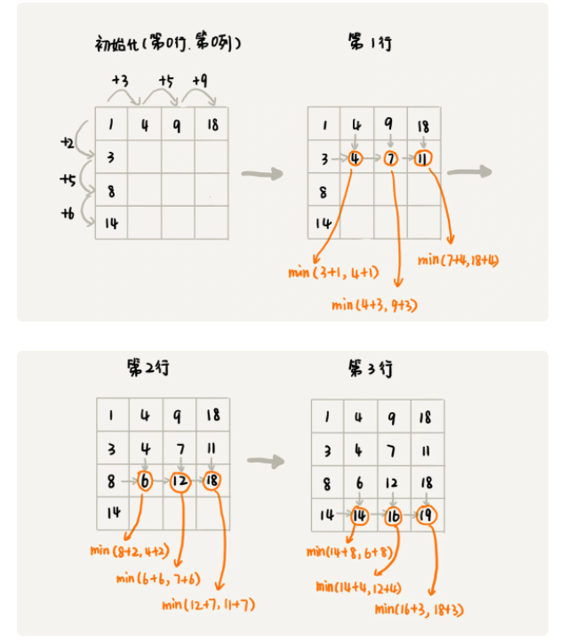

```java

public int minDistDP(int[][] matrix, int n) {
  int[][] states = new int[n][n];
  int sum = 0;
  for (int j = 0; j < n; ++j) { // 初始化states的第一行数据
    sum += matrix[0][j];
    states[0][j] = sum;
  }
  sum = 0;
  for (int i = 0; i < n; ++i) { // 初始化states的第一列数据
    sum += matrix[i][0];
    states[i][0] = sum;
  }
  for (int i = 1; i < n; ++i) {
    for (int j = 1; j < n; ++j) {
      states[i][j] = 
            matrix[i][j] + Math.min(states[i][j-1], states[i-1][j]);
    }
  }
  return states[n-1][n-1];
}
```


**（2）状态转移方程法**

状态转移方程法有点类似递归的解题思路。需要分析，某个问题如何通过子问题来递归求解，也就是所谓的最优子结构。根据最优子结构，写出递归公式，也就是所谓的状态转移方程。有了状态转移方程，代码实现就非常简单了。一般情况下，有两种代码实现方法，一种是递归加“备忘录”，另一种是迭代递推。

```java
min_dist(i, j) = w[i][j] + min(min_dist(i, j-1), min_dist(i-1, j))
```

**状态转移方程是解决动态规划的关键**

```java

private int[][] matrix = 
         {{1，3，5，9}, {2，1，3，4}，{5，2，6，7}，{6，8，4，3}};
private int n = 4;
private int[][] mem = new int[4][4];
public int minDist(int i, int j) { // 调用minDist(n-1, n-1);
  if (i == 0 && j == 0) return matrix[0][0];
  if (mem[i][j] > 0) return mem[i][j];
  int minLeft = Integer.MAX_VALUE;
  if (j-1 >= 0) {
    minLeft = minDist(i, j-1);
  }
  int minUp = Integer.MAX_VALUE;
  if (i-1 >= 0) {
    minUp = minDist(i-1, j);
  }
  
  int currMinDist = matrix[i][j] + Math.min(minLeft, minUp);
  mem[i][j] = currMinDist;
  return currMinDist;
}
```


##### 3、四种算法分析

贪心、回溯、动态规划可以归为一类，而分治单独可以作为一类，因为它跟其他三个都不大一样。为什么这么说呢？前三个算法解决问题的模型，都可以抽象成我们今天讲的那个多阶段决策最优解模型，而分治算法解决的问题尽管大部分也是最优解问题，但是，大部分都不能抽象成多阶段决策模型。

回溯算法是个“万金油”。基本上能用的动态规划、贪心解决的问题，我们都可以用回溯算法解决。回溯算法相当于穷举搜索。穷举所有的情况，然后对比得到最优解。不过，回溯算法的时间复杂度非常高，是指数级别的，只能用来解决小规模数据的问题。对于大规模数据的问题，用回溯算法解决的执行效率就很低了。

尽管动态规划比回溯算法高效，但是，并不是所有问题，都可以用动态规划来解决。能用动态规划解决的问题，需要满足三个特征，最优子结构、无后效性和重复子问题。在重复子问题这一点上，动态规划和分治算法的区分非常明显。分治算法要求分割成的子问题，不能有重复子问题，而动态规划正好相反，动态规划之所以高效，就是因为回溯算法实现中存在大量的重复子问题。

贪心算法实际上是动态规划算法的一种特殊情况。它解决问题起来更加高效，代码实现也更加简洁。不过，它可以解决的问题也更加有限。它能解决的问题需要满足三个条件，最优子结构、无后效性和贪心选择性（这里我们不怎么强调重复子问题）。

其中，最优子结构、无后效性跟动态规划中的无异。“贪心选择性”的意思是，通过局部最优的选择，能产生全局的最优选择。每一个阶段，我们都选择当前看起来最优的决策，所有阶段的决策完成之后，最终由这些局部最优解构成全局最优解。


**4、小结**

状态转移表法解题思路大致可以概括为，回溯算法实现 - 定义状态 - 画递归树 - 找重复子问题 - 画状态转移表 - 根据递推关系填表 - 将填表过程翻译成代码。

状态转移方程法的大致思路可以概括为，找最优子结构 - 写状态转移方程 - 将状态转移方程翻译成代码。


#### （3）实战

利用Trie树，可以实现搜索引擎的关键词提示功能，那么当关键词输入错误后，搜索引擎是怎么进行纠正提示的？


##### 1、如何量化两个字符串的相似度？

**编辑距离：** 将一个字符串转化成另一个字符串，需要的最少编辑操作次数（比如增加一个字符、删除一个字符、替换一个字符）

距离越大，说明越不相似，距离越小，越相似。


**莱文斯坦距离：** 表示两个字符串差异的大小， 允许增加、删除、替换字符这三个编辑操作

**最长公共字符字串：** 表示两个字符串相似程度的大小。只允许增加、删除字符这两个编辑操作。

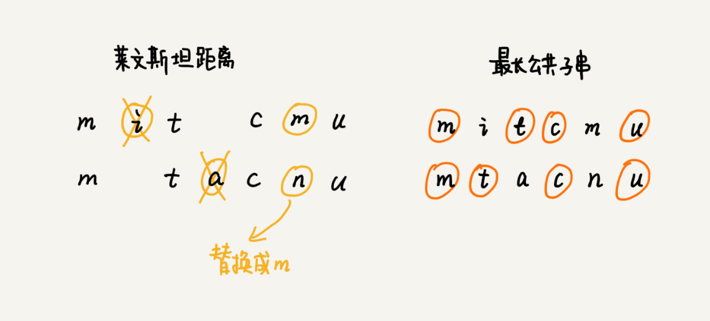


##### 2、计算莱文斯坦距离

整个求解过程，涉及到多个决策阶段，需要一次考察一个字符串中的每个字符，跟另一个字符串中的字符是否匹配，匹配不匹配该如何处理，所以整个问题符合**多阶段决策最优解模型**

**回溯算法：**

回溯是一个递归处理的过程。如果 a[i]与 b[j]匹配，我们递归考察 a[i+1]和 b[j+1]。如果 a[i]与 b[j]不匹配，那我们有多种处理方式可选：

- 可以删除 a[i]，然后递归考察 a[i+1]和 b[j]；
- 可以删除 b[j]，然后递归考察 a[i]和 b[j+1]；
- 可以在 a[i]前面添加一个跟 b[j]相同的字符，然后递归考察 a[i]和 b[j+1];
- 可以在 b[j]前面添加一个跟 a[i]相同的字符，然后递归考察 a[i+1]和 b[j]；
- 可以将 a[i]替换成 b[j]，或者将 b[j]替换成 a[i]，然后递归考察 a[i+1]和 b[j+1]。

```java

private char[] a = "mitcmu".toCharArray();
private char[] b = "mtacnu".toCharArray();
private int n = 6;
private int m = 6;
private int minDist = Integer.MAX_VALUE; // 存储结果
// 调用方式 lwstBT(0, 0, 0);
public lwstBT(int i, int j, int edist) {
  if (i == n || j == m) {
    if (i < n) edist += (n-i);
    if (j < m) edist += (m - j);
    if (edist < minDist) minDist = edist;
    return;
  }
  if (a[i] == b[j]) { // 两个字符匹配
    lwstBT(i+1, j+1, edist);
  } else { // 两个字符不匹配
    lwstBT(i + 1, j, edist + 1); // 删除a[i]或者b[j]前添加一个字符
    lwstBT(i, j + 1, edist + 1); // 删除b[j]或者a[i]前添加一个字符
    lwstBT(i + 1, j + 1, edist + 1); // 将a[i]和b[j]替换为相同字符
  }
}
```

根据回溯，画出递归树，看是否存在重复子问题，如果存在，就可考虑能否用动态规划来解决，如果不存在，那么回溯就是最好的解决方法。


递归树中，每个节点代表一个状态，状态包含三个变量 (i, j, edist)，其中，edist 表示处理到 a[i]和 b[j]时，已经执行的编辑操作的次数。

在递归树中，(i, j) 两个变量重复的节点很多，比如 (3, 2) 和 (2, 3)。对于 (i, j) 相同的节点，我们只需要保留 edist 最小的，继续递归处理就可以了，剩下的节点都可以舍弃。所以，状态就从 (i, j, edist) 变成了 (i, j, min_edist)，其中 min_edist 表示处理到 a[i]和 b[j]，已经执行的最少编辑次数。


可看出状态转移方程如下：

```java

如果：a[i]!=b[j]，那么：min_edist(i, j)就等于：
min(min_edist(i-1,j)+1, min_edist(i,j-1)+1, min_edist(i-1,j-1)+1)

如果：a[i]==b[j]，那么：min_edist(i, j)就等于：
min(min_edist(i-1,j)+1, min_edist(i,j-1)+1，min_edist(i-1,j-1))

其中，min表示求三数中的最小值。     
```


```java

public int lwstDP(char[] a, int n, char[] b, int m) {
  int[][] minDist = new int[n][m];
  for (int j = 0; j < m; ++j) { // 初始化第0行:a[0..0]与b[0..j]的编辑距离
    if (a[0] == b[j]) minDist[0][j] = j;
    else if (j != 0) minDist[0][j] = minDist[0][j-1]+1;
    else minDist[0][j] = 1;
  }
  for (int i = 0; i < n; ++i) { // 初始化第0列:a[0..i]与b[0..0]的编辑距离
    if (a[i] == b[0]) minDist[i][0] = i;
    else if (i != 0) minDist[i][0] = minDist[i-1][0]+1;
    else minDist[i][0] = 1;
  }
  for (int i = 1; i < n; ++i) { // 按行填表
    for (int j = 1; j < m; ++j) {
      if (a[i] == b[j]) minDist[i][j] = min(
          minDist[i-1][j]+1, minDist[i][j-1]+1, minDist[i-1][j-1]);
      else minDist[i][j] = min(
          minDist[i-1][j]+1, minDist[i][j-1]+1, minDist[i-1][j-1]+1);
    }
  }
  return minDist[n-1][m-1];
}

private int min(int x, int y, int z) {
  int minv = Integer.MAX_VALUE;
  if (x < minv) minv = x;
  if (y < minv) minv = y;
  if (z < minv) minv = z;
  return minv;
}
```


##### 3、计算最长公共子串长度

每个状态还是包括三个变量 (i, j, max_lcs)，max_lcs 表示 a[0...i]和 b[0...j]的最长公共子串长度。那 (i, j) 这个状态都是由哪些状态转移过来的呢？

先来看回溯的处理思路。我们从 a[0]和 b[0]开始，依次考察两个字符串中的字符是否匹配。

1. 如果 a[i]与 b[j]互相匹配，我们将最大公共子串长度加一，并且继续考察 a[i+1]和 b[j+1]。
2. 如果 a[i]与 b[j]不匹配，最长公共子串长度不变，这个时候，有两个不同的决策路线：
   - 删除 a[i]，或者在 b[j]前面加上一个字符 a[i]，然后继续考察 a[i+1]和 b[j]；
   - 删除 b[j]，或者在 a[i]前面加上一个字符 b[j]，然后继续考察 a[i]和 b[j+1]。

反过来也就是说，如果我们要求 a[0...i]和 b[0...j]的最长公共长度 max_lcs(i, j)，我们只有可能通过下面三个状态转移过来：

- (i-1, j-1, max_lcs)，其中 max_lcs 表示 a[0...i-1]和 b[0...j-1]的最长公共子串长度；
- (i-1, j, max_lcs)，其中 max_lcs 表示 a[0...i-1]和 b[0...j]的最长公共子串长度；
- (i, j-1, max_lcs)，其中 max_lcs 表示 a[0...i]和 b[0...j-1]的最长公共子串长度。

状态转移方程如下：

```java

如果：a[i]==b[j]，那么：max_lcs(i, j)就等于：
max(max_lcs(i-1,j-1)+1, max_lcs(i-1, j), max_lcs(i, j-1))；

如果：a[i]!=b[j]，那么：max_lcs(i, j)就等于：
max(max_lcs(i-1,j-1), max_lcs(i-1, j), max_lcs(i, j-1))；

其中max表示求三数中的最大值。
```

```java

public int lcs(char[] a, int n, char[] b, int m) {
  int[][] maxlcs = new int[n][m];
  for (int j = 0; j < m; ++j) {//初始化第0行：a[0..0]与b[0..j]的maxlcs
    if (a[0] == b[j]) maxlcs[0][j] = 1;
    else if (j != 0) maxlcs[0][j] = maxlcs[0][j-1];
    else maxlcs[0][j] = 0;
  }
  for (int i = 0; i < n; ++i) {//初始化第0列：a[0..i]与b[0..0]的maxlcs
    if (a[i] == b[0]) maxlcs[i][0] = 1;
    else if (i != 0) maxlcs[i][0] = maxlcs[i-1][0];
    else maxlcs[i][0] = 0;
  }
  for (int i = 1; i < n; ++i) { // 填表
    for (int j = 1; j < m; ++j) {
      if (a[i] == b[j]) maxlcs[i][j] = max(
          maxlcs[i-1][j], maxlcs[i][j-1], maxlcs[i-1][j-1]+1);
      else maxlcs[i][j] = max(
          maxlcs[i-1][j], maxlcs[i][j-1], maxlcs[i-1][j-1]);
    }
  }
  return maxlcs[n-1][m-1];
}

private int max(int x, int y, int z) {
  int maxv = Integer.MIN_VALUE;
  if (x > maxv) maxv = x;
  if (y > maxv) maxv = y;
  if (z > maxv) maxv = z;
  return maxv;
}
```


##### 4、最长递归子序列

有一个数字序列包含 n 个不同的数字，如何求出这个序列中的最长递增子序列长度？比如 2, 9, 3, 6, 5, 1, 7 这样一组数字序列，它的最长递增子序列就是 2, 3, 5, 7，所以最长递增子序列的长度是 4。


**回溯解法：**

```java
public static void solutionWithHS(int index, int[] nums, ArrayList<Integer> tmpList) {
        if (index <= nums.length) {
            int size = tmpList.size();
            result = result<size ? size: result;
        }
        for (int i = index;i<nums.length;i++) {
            if (tmpList.size()>0 && nums[i] <= tmpList.get(tmpList.size()-1)) {continue;}
            tmpList.add(nums[i]);
            solutionWithHS(i+1,nums,tmpList);
            tmpList.remove(tmpList.size()-1);
        }
    }
```


**动态规划解法：**

状态转移方程是：

num[i] > num[i-1]     max[i] = max[i-1] +1;

否则： max[i] = max[i-1]

```java
 public static int solutionWithDB(int nums[]) {
        if (nums.length<2) {
            return nums.length;
        }
        int state[] = new int[nums.length];
        state[0] = 1;

        for (int i = 1;i<state.length;i++) {
            int max = 0;
            for (int j=0;j<i;j++) {
                if (nums[i] > nums[j] ) {
                    if (state[j] > max) {
                        max = state[j];
                    }
                }
            }
            state[i] = max + 1;
        }

        int result = 0;
        for (int i = 0; i < state.length; i++) {
            if (state[i] > result) result = state[i];
        }
        return result;
    }
```


## 三、高级

### 1、拓扑排序

可用来确定代码源文件的编译依赖关系


#### （1）什么是拓扑排序

拓扑排序是一个有向无环图的所有顶点的线性序列，且该序列必须满足下面两个条件：

- 每个顶点出现且只出现一次
- 若存在一条从顶点A到顶点B的路径，那么再序列中顶点A出现在顶点B的前面。


如何根据上图写出它的拓扑排序？

1. 从 DAG 图中选择一个 没有前驱（即入度为0）的顶点并输出。
2. 从图中删除该顶点和所有以它为起点的有向边。
3. 重复 1 和 2 直到当前的 DAG 图为空或当前图中不存在无前驱的顶点为止。后一种情况说明有向图中必然存在环。

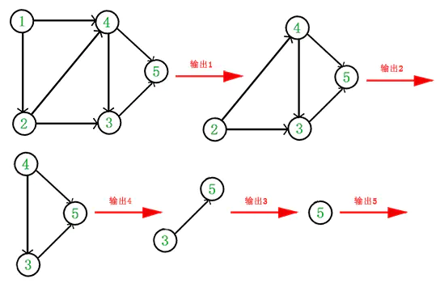

于是，得到拓扑排序后的结果是 { 1, 2, 4, 3, 5 }。

**拓扑排序本身就是基于有向无环图的一个算法。**

```java
//构造图
public class Graph {
  private int v; // 顶点的个数
  private LinkedList<Integer> adj[]; // 邻接表

  public Graph(int v) {
    this.v = v;
    adj = new LinkedList[v];
    for (int i=0; i<v; ++i) {
      adj[i] = new LinkedList<>();
    }
  }

  public void addEdge(int s, int t) { // s先于t，边s->t
    adj[s].add(t);
  }
}
```

拓扑排序有两种实现方法，分别是Kahn算法和DFS深度优先搜索算法；

#### （2）Kahn算法

Kahn算法实际上用的是贪心算法的思想。

定义数据结构的时候，如果 s 需要先于 t 执行，那就添加一条 s 指向 t 的边。所以，如果某个顶点入度为 0， 也就表示，没有任何顶点必须先于这个顶点执行，那么这个顶点就可以执行了。

先从图中，找出一个入度为 0 的顶点，将其输出到拓扑排序的结果序列中（对应代码中就是把它打印出来），并且把这个顶点从图中删除（也就是把这个顶点可达的顶点的入度都减 1）。我们循环执行上面的过程，直到所有的顶点都被输出。最后输出的序列，就是满足局部依赖关系的拓扑排序。

```java

public void topoSortByKahn() {
  int[] inDegree = new int[v]; // 统计每个顶点的入度
  for (int i = 0; i < v; ++i) {
    for (int j = 0; j < adj[i].size(); ++j) {
      int w = adj[i].get(j); // i->w
      inDegree[w]++;
    }
  }
  LinkedList<Integer> queue = new LinkedList<>();
  for (int i = 0; i < v; ++i) {
    if (inDegree[i] == 0) queue.add(i);
  }
  while (!queue.isEmpty()) {
    int i = queue.remove();
    System.out.print("->" + i);
    for (int j = 0; j < adj[i].size(); ++j) {
      int k = adj[i].get(j);
      inDegree[k]--;
      if (inDegree[k] == 0) queue.add(k);
    }
  }
}
```


#### （3）DFS算法

1、通过邻接表构造逆邻接表。

2、递归处理每个顶点。对于顶点a来说，先输出它可达的所有顶点，既是，先把它依赖的所有顶点输出流，然后在输出自己。

```java

public void topoSortByDFS() {
  // 先构建逆邻接表，边s->t表示，s依赖于t，t先于s
  LinkedList<Integer> inverseAdj[] = new LinkedList[v];
  for (int i = 0; i < v; ++i) { // 申请空间
    inverseAdj[i] = new LinkedList<>();
  }
  for (int i = 0; i < v; ++i) { // 通过邻接表生成逆邻接表
    for (int j = 0; j < adj[i].size(); ++j) {
      int w = adj[i].get(j); // i->w
      inverseAdj[w].add(i); // w->i
    }
  }
  boolean[] visited = new boolean[v];
  for (int i = 0; i < v; ++i) { // 深度优先遍历图
    if (visited[i] == false) {
      visited[i] = true;
      dfs(i, inverseAdj, visited);
    }
  }
}

private void dfs(int vertex, LinkedList<Integer> inverseAdj[], boolean[] visited) {
  for (int i = 0; i < inverseAdj[vertex].size(); ++i) {
    int w = inverseAdj[vertex].get(i);
    if (visited[w] == true) continue;
    visited[w] = true;
    dfs(w, inverseAdj, visited);
  } // 先把vertex这个顶点可达的所有顶点都打印出来之后，再打印它自己
  System.out.print("->" + vertex);
}
```


#### （4）总结

凡是需要通过局部顺序来推导全局顺序的，一般都能用拓扑排序来解决。

拓扑排序还能检测途中环的存在，对于Kahn来说，如果最后输出的顶点个数，少于图中顶点个数，图中还有入度不是0的顶点，就说明，图中存在环。


### 2、dijkstra算法

 迪杰斯特拉(Dijkstra)算法是典型最短路径算法，用于计算一个节点到其他节点的最短路径。
它的主要特点是以起始点为中心向外层层扩展(广度优先搜索思想)，直到扩展到终点为止。 

**基本思想：**

1. 通过Dijkstra计算图G中的最短路径时，需要指定起点s(即从顶点s开始计算)。
2. 此外，引进两个集合S和U。S的作用是记录已求出最短路径的顶点(以及相应的最短路径长度)，而U则是记录还未求出最短路径的顶点(以及该顶点到起点s的距离)。
3. 初始时，S中只有起点s；U中是除s之外的顶点，并且U中顶点的路径是”起点s到该顶点的路径”。然后，从U中找出路径最短的顶点，并将其加入到S中；接着，更新U中的顶点和顶点对应的路径。 然后，再从U中找出路径最短的顶点，并将其加入到S中；接着，更新U中的顶点和顶点对应的路径。 … 重复该操作，直到遍历完所有顶点。


**操作步骤：**

1. 初始时，S只包含起点s；U包含除s外的其他顶点，且U中顶点的距离为”起点s到该顶点的距离”[例如，U中顶点v的距离为(s,v)的长度，然后s和v不相邻，则v的距离为∞]。
2. 从U中选出”距离最短的顶点k”，并将顶点k加入到S中；同时，从U中移除顶点k。
3. 更新U中各个顶点到起点s的距离。之所以更新U中顶点的距离，是由于上一步中确定了k是求出最短路径的顶点，从而可以利用k来更新其它顶点的距离；例如，(s,v)的距离可能大于(s,k)+(k,v)的距离。
4. 重复步骤(2)和(3)，直到遍历完所有顶点。


单纯的看上面的理论可能比较难以理解，下面通过实例来对该算法进行说明。**以D为开头**，求D到各个点的最短距离。

 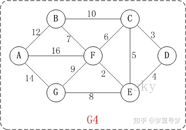 

第1步：初始化距离，其实指与D直接连接的点的距离。dis[c]代表D到C点的最短距离，因而初始dis[C]=3，dis[E]=4，dis[D]=0，其余为无穷大。设置**集合S**用来表示已经找到的最短路径。此时，S={D}。现在得到D到各点距离**{D(0)，C(3)，E（4），F（\*），G（\*），B（\*），A(\*)}**，其中*代表未知数也可以说是无穷大，括号里面的数值代表D点到该点的最短距离。

第2步：不考虑集合S中的值，因为dis[C]=3，是当中距离最短的，所以此时更新S，**S={D,C}**。接着我们看与C连接的点，分别有B，E，F，**已经在集合S中的不看**，dis[C-B]=10，因而dis[B]=dis[C]+10=13，dis[F]=dis[C]+dis[C-F]=9，dis[E]=dis[C]+dis[C-E]=3+5=8>4**(初始化时的dis[E]=4)**不更新。此时**{D(0)，C(3)，E（4），F（9），G（\*），B（13），A(\*)}。**

第3步：在第2步中，E点的值4最小，更新**S={D，C，E}**，此时看与E点直接连接的点，分别有F，G。dis[F]=dis[E]+dis[E-F]=4+2=6（**比原来的值小，得到更新**），dis[G]=dis[E]+dis[E-G]=4+8=12（**更新**）。此时**{D(0)，C(3)，E（4），F（6），G（12），B（13），A(\*)}**。

第4步：在第3步中，F点的值6最小，更新**S={D，C，E，F}**，此时看与F点直接连接的点，分别有B，A，G。dis[B]=dis[F]+dis[F-B]=6+7=13，dis[A]=dis[F]+dis[F-A]=6+16=22，dis[G]=dis[F]+dis[F-G]=6+9=15>12（**不更新**）。此时**{D(0)，C(3)，E（4），F（6），G（12），B（13），A(22)}.**

第5步：在第4步中，G点的值12最小，更新**S={D，C，E，F，G}**，此时看与G点直接连接的点，只有A。dis[A]=dis[G]+dis[G-A]=12+14=26>22(**不更新**)。**{D(0)，C(3)，E（4），F（6），G（12），B（13），A(22)}.**

第6步：在第5步中，B点的值13最小，更新**S={D，C，E，F，G，B}**，此时看与B点直接连接的点，只有A。dis[A]=dis[B]+dis[B-A]=13+12=25>22(**不更新**)。**{D(0)，C(3)，E（4），F（6），G（12），B（13），A(22)}.**

第6步：最后只剩下A值，直接进入集合**S={D，C，E，F，G，B，A}**，此时所有的点都已经遍历结束，得到最终结果**{D(0)，C(3)，E（4），F（6），G（12），B（13），A(22)}.**


### 3、布隆过滤器

可实现网页爬虫中的URL去重功能

#### （1）位图

布隆过滤器基于位图，是对位图的一种改进。

比如：有一千万个整数，范围在1到1亿之间，如何快速查找某个整数是否在这一千万个整数中？

以使用一种比较“特殊”的散列表，那就是位图。我们申请一个大小为 1 亿、数据类型为布尔类型（true 或者 false）的数组。我们将这 1 千万个整数作为数组下标，将对应的数组值设置成 true。比如，整数 5 对应下标为 5 的数组值设置为 true，也就是 array[5]=true。

```java

public class BitMap { // Java中char类型占16bit，也即是2个字节
  private char[] bytes;
  private int nbits;
  
  public BitMap(int nbits) {
    this.nbits = nbits;
    this.bytes = new char[nbits/16+1];
  }

  public void set(int k) {
    if (k > nbits) return;
    int byteIndex = k / 16;
    int bitIndex = k % 16;
    bytes[byteIndex] |= (1 << bitIndex);
  }

  public boolean get(int k) {
    if (k > nbits) return false;
    int byteIndex = k / 16;
    int bitIndex = k % 16;
    return (bytes[byteIndex] & (1 << bitIndex)) != 0;
  }
}
```


如果数量还是一千万，但是数字范围在1到10亿，那么位图大小就是10亿个二进制位，消耗的内存空间会增加。

此时就需要**布隆过滤器**

布隆过滤器的做法是仍然使用一个1亿个二进制大小的位图，然后通过哈希函数，对数字进行处理，让它落在1到1亿范围内。

比如我们把哈希函数设计成 f(x)=x%n。其中，x 表示数字，n 表示位图的大小（1 亿），也就是，对数字跟位图的大小进行取模求余


此时，依然会有hash冲突的情况，比如一亿零一和 1 两个数字，经过你刚刚那个取模求余的哈希函数处理之后，最后的结果都是 1。

为了降低这种冲突概率，需要设计一个复杂度高一点的哈希函数，

使用 K 个哈希函数，对同一个数字进行求哈希值，那会得到 K 个不同的哈希值，我们分别记作 X1，X2，X3，…，XK。我们把这 K 个数字作为位图中的下标，将对应的 BitMap[X1]，BitMap[X2]，BitMap[X3]，…，BitMap[XK]都设置成 true，也就是说，我们用 K 个二进制位，来表示一个数字的存在。

当我们要查询某个数字是否存在的时候，我们用同样的 K 个哈希函数，对这个数字求哈希值，分别得到 Y1，Y2，Y3，…，YK。我们看这 K 个哈希值，对应位图中的数值是否都为 true，如果都是 true，则说明，这个数字存在，如果有其中任意一个不为 true，那就说明这个数字不存在。

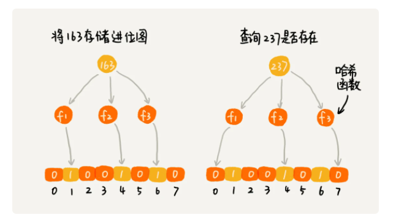

布隆过滤器的误判有一个特点，那就是，它只会对存在的情况有误判。如果某个数字经过布隆过滤器判断不存在，那说明这个数字真的不存在，不会发生误判；如果某个数字经过布隆过滤器判断存在，这个时候才会有可能误判，有可能并不存在。不过，只要我们调整哈希函数的个数、位图大小跟要存储数字的个数之间的比例，那就可以将这种误判的概率降到非常低。


应用：比如 Java 中的 BitSet 类就是一个位图，Redis 也提供了 BitMap 位图类，Google 的 Guava 工具包提供了 BloomFilter 布隆过滤器的实现。

