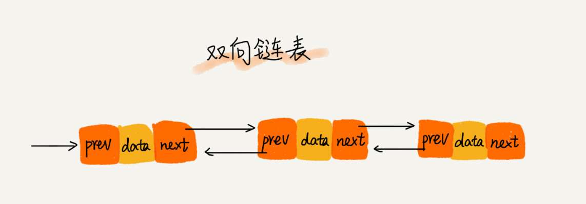

# 数据结构与算法


 

## 一、复杂度分析


### 1、为什么需要复杂度分析

用运行程序得知复杂度是**事后统计法**，有几种缺陷：

- 测试结果严重依赖测试环境
- 测试结果受数据规模影响大

所以，需要一个不用具体的测试数据就能粗略估计算法执行效率的方法。


### 2、大O复杂度表示法

假如一行代码的执行时间是UNIT_TIME，那么所有代码的执行时间T(n)与每行代码的执行次数成正比。
$$
T(n) = O(f(n))
$$

- T(n)是代码执行时间
- n是数据规模大小
- f(n)是每行代码执行的次数总和
- O表示T(n)与f(n)表达式成正比

例如：时间复杂度为 
$$
T(n) = O(2n^2 + 2n)
$$

```java
for(i = 1;i<n;i++) {
    i++;
	for (j = 1;j<n;j++) {
        i+j;
    }
}
```


大O时间复杂度表示法并不代表代码真正的执行时间，而是表示代码执行时间随数据规模增长的变化趋势，也叫**渐进时间复杂度**

而公式中的低阶、常量、系数三部分并不影响增长趋势，所以都可以忽略，只需记录一个最大量级，如果用大O表示法表示上述例子的时间复杂度，可以记为：
$$
T(n) = O(n^2)
$$


### 3、时间复杂度分析

（1）只关注循环执行次数最多的一段代码

（2）加法法则：总复杂度等于量级最大的那段代码的复杂度
$$
T1(n)=O(f1(n)),T2(n)=O(f2(n)),
那么T(n)=T1(n)+T2(n)=MAX(O(f1(n)),O(f2(n)))=O(MAX(f1(n),f2(n))
$$
（3）乘法法则：嵌套代码的复杂度等于嵌套内外代码复杂度的乘积
$$
T1(n)=O(f1(n)),T2(n)=O(f2(n)),
那么T(n)=T1(n)*T2(n)=O(f1(n))*O(f2(n))=O(f1(n)*f2(n))
$$
例如：

```java
int a(int[] array) {
    for (int i=0;i<array.length;i++) {
        b(i)
    }
}

int b (int num) {
    for (int i=0;i<num;i++) {
        i++;
    }
}
```


1）单段代码看高频：比如循环。
2）多段代码取最大：比如一段代码中有单循环和多重循环，那么取多重循环的复杂度。
3）嵌套代码求乘积：比如递归、多重循环等
4）多个规模求加法：比如方法有两个参数控制两个循环的次数，那么这时就取二者复杂度相加。 


### 4、常见时间复杂度分析

  

可分为**多项式量级** 和 **非多项式量级** ，后一项只有两个：O(2^n) 和 O(n!)

把时间复杂度为非多项式量级的算法问题叫做NP（ Non-Deterministic Polynomial，非确定多项式） 问题。


**多项式量级复杂度**

#### 1、O(1)

只要算法中不存在循环、递归语句，即使有多行代码，也是O(1)


#### 2、O(logn)、O(nlogn)

例如：下例代码的时间复杂度为O(logn)

```java
 i=1;
 while (i <= n)  {
   i = i * 2;
 }
```

$$
2^x = n , x = logn
$$

即使是
$$
3^x=n, x=log_3n,也是logn,因为log_3n=logn*log_32,系数省略
$$


而O(nlogn)是循环执行O(logn)的代码


#### 3、O(m+n)、O(m*n)

代码复杂度由两个数据的规模决定

无法评估m、n谁的量级大，所以是相加或相乘。


### 5、空间复杂度分析

时间复杂度的全称是渐进时间复杂度，表示算法的执行时间与数据规模之间的增长关系。

空间复杂度是渐进空间复杂度，表示算法的存储空间与数据规模之间的增长关系。

就是看分配了多少空间，比如创建了一个容量为n的数组，那么空间复杂度就是O(n)


#### 6、最好、最坏时间复杂度

```java
for (; i < n; ++i) { 
    if (array[i] == x) { 
        pos = i; 
        break; 
    } 
}
```

例如上一段代码，最好情况是O(1)，最坏情况是O(n)

最好时间复杂度就是在最理想的情况下，执行这段代码的时间复杂度。

最坏时间复杂度就是在最糟糕的情况下，执行这段代码的时间复杂度。


### 7、平均时间复杂度

```java
for (; i < n; ++i) { 
    if (array[i] == x) { 
        pos = i; 
        break; 
    } 
}
```

上述代码有n+1种情况，在数组0~n-1位置中和不在数组中，把每种情况需要遍历的次数加起来再平均，就是平均复杂度
$$
\frac{1+2+3+...+n}{n+1} = \frac{n(n+3)}{2(n+1)}
$$
就是O(n)


假设是否在数组中概率都为1/2，查找在数组中概率是1/n，那么就是1/2n，即是
$$
1*\frac{1}{2n}+2*\frac{1}{2n}+...+n*\frac{1}{2n}+n*\frac{1}{2} = \frac{3n+1}{4}
$$
 这个值就是概率论中的加权平均值，也叫作期望值，所以平均时间复杂度的全称应该叫加权平均时间复杂度或者期望时间复杂度。 


### 8、均摊时间复杂度

```java
int[] array = new int[n];
int count = 0; 
void insert(int val) { 
    if (count == array.length) {
        int sum = 0; 
        for (int i = 0; i < array.length; ++i) {
            sum = sum + array[i]; 
        } 
        array[0] = sum; 
        count = 1; 
    } 
    array[count] = val; 
    ++count; 
}
```

例如上述代码，只有数组满了时，才会循环遍历一次，否则都是直接添加

也即是最好是O(1)，最坏是O(n)，

平均为
$$
1*\frac{1}{n+1}+1*\frac{1}{n+1}+...+n*\frac{1}{n+1} = O(1)
$$
 一般都是一个 O(n) 插入之后，紧跟着 n-1 个 O(1) 的插入操作，循环往复。 

**摊还分析法**，通过摊还分析得到的时间复杂度叫均摊时间复杂度。 

大致思路是： 把耗时多的那次操作均摊到接下来的 n-1 次耗时少的操作上，均摊下来，这一组连续的操作的均摊时间复杂度就是 O(1) 


## 二、基础

### 1、数组

数组是一种线性表数据结构，用一组连续的内存空间，存储一组具有相同类型的数据。

**线性表**

数据排成像一条线一样的结构，每个线性表上的数据最多只有前后两个方向。

  


**非线性表**

数据之间不是简单的前后关系。例如：树、堆、图等。

  


#### （1）数组如何实现随机访问

数组会有一个首地址，也就是下标为0的地址，其他地址按照元素类型进行推算。

  

```
a[i]_address = base_address + i * data_type_size
```

- base_address：首地址
- data_type_size：每个元素占多少空间，例如int类型就是4个字节


#### （2）低效的插入和删除

数组由于元素内存是连续的，所以插入和删除都需要移动后面的元素。

最好情况是O(1)，最坏是O(n)。


#### （3）数组下标为何从0开始

数组会有一个首地址，那么下标为0的地址就是首地址，不需要计算，相当于减少了一次CPU计算操作。


#### （4）数组与链表区别

- 数组支持随机访问，根据下标随机访问的时间复杂度是O(1)
- 数组空间是连续的，链表是分散的


### 2、链表

链表存储的元素内存空间不是连续的。

链表有三种常见的结构：单链表、双向链表、循环链表

#### （1）单链表

  

单链表有两个节点比较特殊，头结点和尾节点。

头结点用来记录链表的基地址。

尾节点指针指向一个空地址NULL，表示是链表的最后一个节点。

 数组和链表都支持数据的查找、插入和删除操作！ 

- 数组：
  - 元素无序，查找最好是O(1)，最坏是O(n)
  - 元素有序，查找是O(logn)
  - 插入、删除最好是O(1)，最坏是O(n)
- 链表：
  - 查找都是O(n)
  - 删除和插入的过程是O(1)，但是删除、插入之前查找的过程是O(n)


单链表随机访问需要从头开始遍历，平均时间复杂度是O(n)


#### （2）循环链表

循环链表是在单链表基础上构造的，只不过尾节点的指针指向的是头结点。

  


#### （3）双向链表

单链表的节点只有指向下一个节点的指针，而双向链表有指向下一个节点和前一个节点的指针。

  

双向链表找到前驱节点的时间复杂度是O(1)，也因为此，使双向链表在某些情况下插入、删除比单链表更简单、高效。

- 删除：
  - 单链表找到对应的节点后，需要遍历找到前驱节点
  - 双向链表有前驱指针

对于有序双向链表查找来说，可以记录上次查找的位置p，然后下一次查找直接从p节点开始。而单链表需要从头遍历。


 对于执行较慢的程序，可以通过消耗更多的内存（空间换时间）来进行优化；而消耗过多内存的程序，可以通过消耗更多的时间（时间换空间）来降低内存的消耗。 


#### （4）基于链表实现LRU缓存淘汰算法

维护一个单链表，越靠近尾部的节点是越早之前访问的，当新的一个数据被访问时，从链表头开始顺序遍历链表。

1、如果数据已存在链表中，先将其删除，然后插入到链表头部

2、如果数据不存在链表中

- 链表已满：
  - 将尾节点删除，然后新数据插入到链表头部
- 链表未满：
  - 直接将新数据插入到链表头部


优化：引入散列表（hash table）记录每个数据的位置，将缓存访问的时间复杂度降至O(1)


