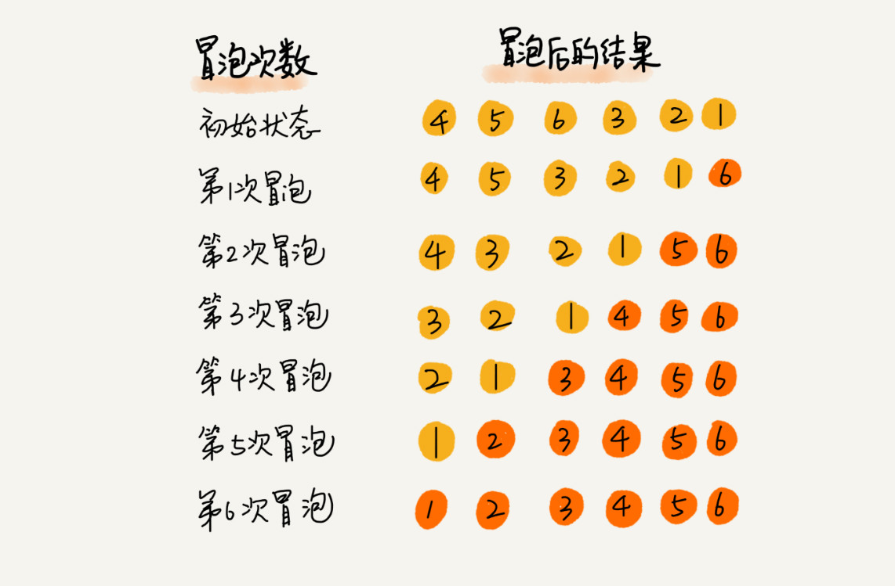
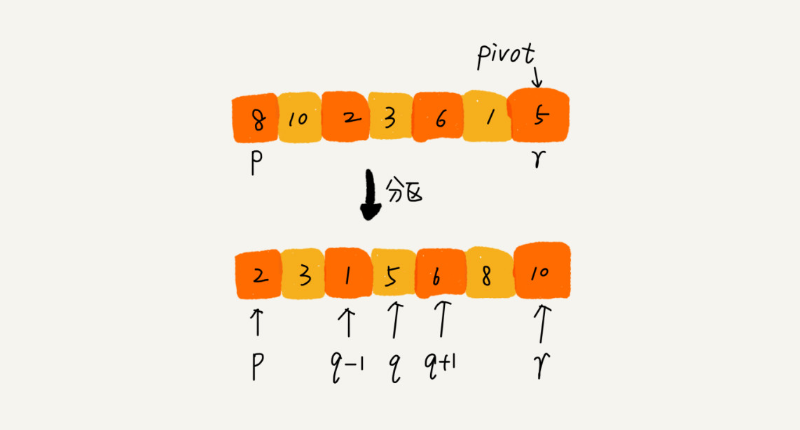
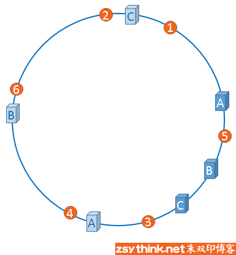

[toc]


# 数据结构与算法


 

## 一、复杂度分析


### 1、为什么需要复杂度分析

用运行程序得知复杂度是**事后统计法**，有几种缺陷：

- 测试结果严重依赖测试环境
- 测试结果受数据规模影响大

所以，需要一个不用具体的测试数据就能粗略估计算法执行效率的方法。


### 2、大O复杂度表示法

假如一行代码的执行时间是UNIT_TIME，那么所有代码的执行时间T(n)与每行代码的执行次数成正比。
$$
T(n) = O(f(n))
$$

- T(n)是代码执行时间
- n是数据规模大小
- f(n)是每行代码执行的次数总和
- O表示T(n)与f(n)表达式成正比

例如：时间复杂度为 
$$
T(n) = O(2n^2 + 2n)
$$

```java
for(i = 1;i<n;i++) {
    i++;
	for (j = 1;j<n;j++) {
        i+j;
    }
}
```


大O时间复杂度表示法并不代表代码真正的执行时间，而是表示代码执行时间随数据规模增长的变化趋势，也叫**渐进时间复杂度**

而公式中的低阶、常量、系数三部分并不影响增长趋势，所以都可以忽略，只需记录一个最大量级，如果用大O表示法表示上述例子的时间复杂度，可以记为：
$$
T(n) = O(n^2)
$$


### 3、时间复杂度分析

（1）只关注循环执行次数最多的一段代码

（2）加法法则：总复杂度等于量级最大的那段代码的复杂度
$$
T1(n)=O(f1(n)),T2(n)=O(f2(n)),
那么T(n)=T1(n)+T2(n)=MAX(O(f1(n)),O(f2(n)))=O(MAX(f1(n),f2(n))
$$
（3）乘法法则：嵌套代码的复杂度等于嵌套内外代码复杂度的乘积
$$
T1(n)=O(f1(n)),T2(n)=O(f2(n)),
那么T(n)=T1(n)*T2(n)=O(f1(n))*O(f2(n))=O(f1(n)*f2(n))
$$
例如：

```java
int a(int[] array) {
    for (int i=0;i<array.length;i++) {
        b(i)
    }
}

int b (int num) {
    for (int i=0;i<num;i++) {
        i++;
    }
}
```


1）单段代码看高频：比如循环。
2）多段代码取最大：比如一段代码中有单循环和多重循环，那么取多重循环的复杂度。
3）嵌套代码求乘积：比如递归、多重循环等
4）多个规模求加法：比如方法有两个参数控制两个循环的次数，那么这时就取二者复杂度相加。 


### 4、常见时间复杂度分析

  

可分为**多项式量级** 和 **非多项式量级** ，后一项只有两个：O(2^n) 和 O(n!)

把时间复杂度为非多项式量级的算法问题叫做NP（ Non-Deterministic Polynomial，非确定多项式） 问题。


**多项式量级复杂度**

#### 1、O(1)

只要算法中不存在循环、递归语句，即使有多行代码，也是O(1)


#### 2、O(logn)、O(nlogn)

例如：下例代码的时间复杂度为O(logn)

```java
 i=1;
 while (i <= n)  {
   i = i * 2;
 }
```

$$
2^x = n , x = logn
$$

即使是
$$
3^x=n, x=log_3n,也是logn,因为log_3n=logn*log_32,系数省略
$$


而O(nlogn)是循环执行O(logn)的代码


#### 3、O(m+n)、O(m*n)

代码复杂度由两个数据的规模决定

无法评估m、n谁的量级大，所以是相加或相乘。


### 5、空间复杂度分析

时间复杂度的全称是渐进时间复杂度，表示算法的执行时间与数据规模之间的增长关系。

空间复杂度是渐进空间复杂度，表示算法的存储空间与数据规模之间的增长关系。

就是看分配了多少空间，比如创建了一个容量为n的数组，那么空间复杂度就是O(n)


#### 6、最好、最坏时间复杂度

```java
for (; i < n; ++i) { 
    if (array[i] == x) { 
        pos = i; 
        break; 
    } 
}
```

例如上一段代码，最好情况是O(1)，最坏情况是O(n)

最好时间复杂度就是在最理想的情况下，执行这段代码的时间复杂度。

最坏时间复杂度就是在最糟糕的情况下，执行这段代码的时间复杂度。


### 7、平均时间复杂度

```java
for (; i < n; ++i) { 
    if (array[i] == x) { 
        pos = i; 
        break; 
    } 
}
```

上述代码有n+1种情况，在数组0~n-1位置中和不在数组中，把每种情况需要遍历的次数加起来再平均，就是平均复杂度
$$
\frac{1+2+3+...+n}{n+1} = \frac{n(n+3)}{2(n+1)}
$$
就是O(n)


假设是否在数组中概率都为1/2，查找在数组中概率是1/n，那么就是1/2n，即是
$$
1*\frac{1}{2n}+2*\frac{1}{2n}+...+n*\frac{1}{2n}+n*\frac{1}{2} = \frac{3n+1}{4}
$$
 这个值就是概率论中的加权平均值，也叫作期望值，所以平均时间复杂度的全称应该叫加权平均时间复杂度或者期望时间复杂度。 


### 8、均摊时间复杂度

```java
int[] array = new int[n];
int count = 0; 
void insert(int val) { 
    if (count == array.length) {
        int sum = 0; 
        for (int i = 0; i < array.length; ++i) {
            sum = sum + array[i]; 
        } 
        array[0] = sum; 
        count = 1; 
    } 
    array[count] = val; 
    ++count; 
}
```

例如上述代码，只有数组满了时，才会循环遍历一次，否则都是直接添加

也即是最好是O(1)，最坏是O(n)，

平均为
$$
1*\frac{1}{n+1}+1*\frac{1}{n+1}+...+n*\frac{1}{n+1} = O(1)
$$
 一般都是一个 O(n) 插入之后，紧跟着 n-1 个 O(1) 的插入操作，循环往复。 

**摊还分析法**，通过摊还分析得到的时间复杂度叫均摊时间复杂度。 

大致思路是： 把耗时多的那次操作均摊到接下来的 n-1 次耗时少的操作上，均摊下来，这一组连续的操作的均摊时间复杂度就是 O(1) 


## 二、基础

### 1、数组

数组是一种线性表数据结构，用一组连续的内存空间，存储一组具有相同类型的数据。

**线性表**

数据排成像一条线一样的结构，每个线性表上的数据最多只有前后两个方向。

  


**非线性表**

数据之间不是简单的前后关系。例如：树、堆、图等。

  


#### （1）数组如何实现随机访问

数组会有一个首地址，也就是下标为0的地址，其他地址按照元素类型进行推算。

  

```
a[i]_address = base_address + i * data_type_size
```

- base_address：首地址
- data_type_size：每个元素占多少空间，例如int类型就是4个字节


#### （2）低效的插入和删除

数组由于元素内存是连续的，所以插入和删除都需要移动后面的元素。

最好情况是O(1)，最坏是O(n)。


#### （3）数组下标为何从0开始

数组会有一个首地址，那么下标为0的地址就是首地址，不需要计算，相当于减少了一次CPU计算操作。


#### （4）数组与链表区别

- 数组支持随机访问，根据下标随机访问的时间复杂度是O(1)
- 数组空间是连续的，链表是分散的


### 2、链表

链表存储的元素内存空间不是连续的。

链表有三种常见的结构：单链表、双向链表、循环链表

#### （1）单链表

  

单链表有两个节点比较特殊，头结点和尾节点。

头结点用来记录链表的基地址。

尾节点指针指向一个空地址NULL，表示是链表的最后一个节点。

 数组和链表都支持数据的查找、插入和删除操作！ 

- 数组：
  - 元素无序，查找最好是O(1)，最坏是O(n)
  - 元素有序，查找是O(logn)
  - 插入、删除最好是O(1)，最坏是O(n)
- 链表：
  - 查找都是O(n)
  - 删除和插入的过程是O(1)，但是删除、插入之前查找的过程是O(n)


单链表随机访问需要从头开始遍历，平均时间复杂度是O(n)


#### （2）循环链表

循环链表是在单链表基础上构造的，只不过尾节点的指针指向的是头结点。

  


#### （3）双向链表

单链表的节点只有指向下一个节点的指针，而双向链表有指向下一个节点和前一个节点的指针。

  

双向链表找到前驱节点的时间复杂度是O(1)，也因为此，使双向链表在某些情况下插入、删除比单链表更简单、高效。

- 删除：
  - 单链表找到对应的节点后，需要遍历找到前驱节点
  - 双向链表有前驱指针

对于有序双向链表查找来说，可以记录上次查找的位置p，然后下一次查找直接从p节点开始。而单链表需要从头遍历。


 对于执行较慢的程序，可以通过消耗更多的内存（空间换时间）来进行优化；而消耗过多内存的程序，可以通过消耗更多的时间（时间换空间）来降低内存的消耗。 


#### （4）基于链表实现LRU缓存淘汰算法

维护一个单链表，越靠近尾部的节点是越早之前访问的，当新的一个数据被访问时，从链表头开始顺序遍历链表。

1、如果数据已存在链表中，先将其删除，然后插入到链表头部

2、如果数据不存在链表中

- 链表已满：
  - 将尾节点删除，然后新数据插入到链表头部
- 链表未满：
  - 直接将新数据插入到链表头部


优化：引入散列表（hash table）记录每个数据的位置，将缓存访问的时间复杂度降至O(1)


**单链表反转**

```java
/**三个指针**/
public static Node revertList(Node root) {
        if (root == null || root.next == null) {
            return root;
        }
        Node pre = null;
        Node mid = root;
        Node suf = root.next;

        while (1==1) {
            mid.next = pre;

            if (suf == null) {
                break;
            }

            pre = mid;
            mid = suf;
            suf = suf.next;

        }

        root = mid;
        return root;
    }

/**递归解法**/
public static Node revertList2(Node root) {
    if (root == null || root.next == null) {
        return root;
    }
    Node head = revertList2(root.next);

    root.next.next = root;
    root.next = null;
    return head;
}
```


**两个有序链表合成一个**

```java
private static Node merge2List(Node first, Node second) {
        Node head = new Node();
        Node cur = head;

        while (first != null && second != null) {
            if (first.data <= second.data) {
                cur.next = first;
                first = first.next;
            } else {
                cur.next = second;
                second = second.next;
            }
            cur = cur.next;
        }
        if (first != null) {
            cur.next = first;
        }
        if (second != null) {
            cur.next = second;
        }
        return head;

    }

/**递归解法**/
public static Node mergeList_3(Node first, Node second) {
        if (first == null) {
            return second;
        }
        if (second == null) {
            return first;
        }
        if (first.data <= second.data) {
            first.next = mergeList_3(first.next,second);
            return first;
        } else {
            second.next = mergeList_3(first, second.next);
            return second;
        }
    }
```


**链表实现LRU**

```java
public Node findNode(int data) {
        if (isEmpty()) {
            head = new Node(data);
            tail = new Node(data);
        } else {
            Node node = head;
            Node preNode = null;
            while (node != null) {
                if (node.data == data) {
                    //先删除节点
                    preNode.next = node.next;
                    //然后新增节点
                    node.next = head;
                    head = node;
                    return node;
                } else {
                    preNode = node;
                    node = node.next;
                }
            }
            if (isFull()) {
                Node node1 = head;
                Node pre = null;
                while (node1.next != null) {
                    pre = node1;
                    node1 = node1.next;
                }
                pre.next = null;

            }
            Node second = head;
            head = new Node(data);
            head.next = second;
            count++;
        }
        return null;
    }
```


**链表中环监测**

  

解法1：

快慢指针，

P1是慢指针，一次遍历一个节点。
P2是快指针，一次遍历两个节点。

如果链表中没有环，P2和P1会先后遍历完所有的节点。

如果链表中有环，P2和P1则会先后进入环中，一直循环，并一定会在在某一次遍历中相遇。

因此，只要发现P2和P1相遇了，就可以判定链表中存在环。

```java
/**
     * 判断是否有环 快慢指针法
     * 
     * @param node
     * @return
     */
    public static boolean hasLoopV1(SingleNode headNode) {
        
        if(headNode == null) {
            return false;
        }
        
        SingleNode p = headNode;
        SingleNode q = headNode.next;

        // 快指针未能遍历完所有节点
        while (q != null && q.next != null) {
            p = p.next; // 遍历一个节点
            q = q.next.next; // 遍历两个个节点

            // 已到链表末尾
            if (q == null) {
                return false;
            } else if (p == q) {
                // 快慢指针相遇，存在环
                return true;
            }
        }

        return false;
    }
```


解法二：

足迹检测法， 顺序遍历链表中所有的节点，并将所有遍历过的节点信息保存下来。如果某个节点的信息出现了两次，则存在环。 

```java
// 保存足迹信息
    private static HashMap<SingleNode, Integer> nodeMap = new HashMap<>();

    /**
     * 判断是否有环 足迹法
     * 
     * @param node
     * @return
     */
    public static boolean hasLoopV2(SingleNode node, int index) {
        if (node == null || node.next == null) {
            return false;
        }

        if (nodeMap.containsKey(node)) {
            return true;
        } else {
            nodeMap.put(node, index);
            return hasLoopV2(node.next, ++index);
        }
    }
```


**删除链表倒数第n个节点**

利用快慢指针，快指针先走n个节点，然后慢指针在走，当快指针到尾节点的时候，满指针就到了倒数第n+1个节点。


```java
public static Node deleteLastN(Node root, int n) {
        Node fast = root;
        Node slow = root;
        while (n > 0) {
            fast = fast.next;
            n--;
        }   
        while (fast.next != null) {
            fast = fast.next;
            slow = slow.next;
        }
        slow.next = slow.next.next;
        return root;
    }
```


**查找链表中的中间节点**

```java
public static Node findMidNode(Node root) {
        Node fast = root;
        Node slow = root;

//        while (fast != null) {
//            if (fast.next != null) {
//                fast = fast.next.next;
//            } else {
//              break;
//            }
//            slow = slow.next;
//        }
        while (fast != null && fast.next != null) {
            fast = fast.next.next;
            slow = slow.next;
        }
        return slow;
    }
```


### 3、栈

先进后出，后进先出。

栈可以用数组实现，也可以用链表实现，用数组叫顺序栈，用链表叫链式栈。

入栈出栈时间复杂度都是O(1)

空间复杂度也是O(1)，空间复杂度是除了原本的数据存储空间外，算法运行需要的额外的空间。


**栈在表达式求值中的应用**

通过两个栈来实现，一个是保存操作数，一个是保存运算符的栈，从左到右遍历表达式，遇到数字直接压入数字栈，遇到运算符，先跟运算符栈顶元素比较，如果优先级高于栈顶元素，就压入运算符栈，反之则取出数字栈栈顶两个元素进行运算，将运算结果压入数字栈。

  


**栈在括号中的应用**

检查表达式中的括号是否匹配

例如，检测 {[] ()[{}]}或[{()}([])] 是否为合法格式

用一个栈来保存未匹配的左括号，从左到右遍历字符串，当遇到左括号时，压入栈，当遇到右括号时候，从栈顶取出元素，看是否匹配，比如“（”匹配的是“）”，如果不匹配，则不合格，如果遍历完后，栈中没有元素，就说明是合法的。


**如何实现浏览器前进后退**

使用两个栈，x和y，把首次浏览的页面压入x，当点击后退时，从x中弹出，进入y，点击前进时，从y中弹出，进入x。当x没有数据，说明不可后退，当y没有数据，说明不可前进。

比如依次点击a、b、c，此时后退到b，那么b、c就在y栈了，那么在b的时候点击了d页面，c就无法通过前进、后退按钮进行查看了，所以需要清空栈y

  


**为什么函数调用要用“栈”来保存临时变量呢？用其他数据结构不行吗？**

其实，我们不一定非要用栈来保存临时变量，只不过如果这个函数调用符合后进先出的特性，用栈这种数据结构来实现，是最顺理成章的选择。

从调用函数进入被调用函数，对于数据来说，变化的是什么呢？是作用域。所以根本上，只要能保证每进入一个新的函数，都是一个新的作用域就可以。而要实现这个，用栈就非常方便。在进入被调用函数的时候，分配一段栈空间给这个函数的变量，在函数结束的时候，将栈顶复位，正好回到调用函数的作用域内。 


### 4、队列

先进先出

队列可以用数组和链表实现，用数组叫做顺序队列，用链表叫做链式队列。

对于栈来说，只需要一个栈顶指针

对于队列来说，需要一个指向队列头的指针，一个指向队列尾的指针。

  


基于数组实现，出队列时候每次head都要往后移，当队列满了之后，无法添加数据，此时需要在入队的时候判断是否已满，如果已满，就进行数据搬迁，此时出队列的时间复杂度就为O(1)。

  


#### （1）循环队列

  

添加数据的时候，如果tail指针已经指在队尾，那么会将元素添加至队尾的位置，而tail指针指向0的位置

  

tail指针指向的位置是不存放元素的，所以会浪费一个数组的存储空间。

队列空的判断条件：tail == head

队列满的判断条件：（tail+1）% n = head

```java

public class CircularQueue {
  // 数组：items，数组大小：n
  private String[] items;
  private int n = 0;
  // head表示队头下标，tail表示队尾下标
  private int head = 0;
  private int tail = 0;

  // 申请一个大小为capacity的数组
  public CircularQueue(int capacity) {
    items = new String[capacity];
    n = capacity;
  }

  // 入队
  public boolean enqueue(String item) {
    // 队列满了
    if ((tail + 1) % n == head) return false;
    items[tail] = item;
    tail = (tail + 1) % n;
    return true;
  }

  // 出队
  public String dequeue() {
    // 如果head == tail 表示队列为空
    if (head == tail) return null;
    String ret = items[head];
    head = (head + 1) % n;
    return ret;
  }
}
```


#### （2）阻塞队列

队列为空，取数据时阻塞，队列已满，存数据时阻塞。

这就是生产者-消费者模式。

可配置多个消费者，提高并发量处理数据。	

  


#### （3）并发队列

在出入队列的时候加锁，在锁粒度大的时候并发度会很低。

此时可以使用CAS模式，可实现高效的并发队列。

 CAS实现无锁队列，则在入队前，获取tail位置，入队时比较tail是否发生变化，如果否，则允许入队，反之，本次入队失败。出队则是获取head位置，进行cas。 


### 5、递归

递归需要满足的三个条件：

- 一个问题的解可分解成几个子问题的解
  - 例如 f(n) = f(n-1) +1
- 此问题与分解之后的子问题，除了数据规模不同，求解思路是一样的。
- 存在递归终止条件。


**如何编写递归代码？**

推导递归公式，找到终止条件。


写递归代码的关键就是找到如何将大问题分解为小问题的规律，并且基于此写出递推公式，然后再推敲终止条件，最后将递推公式和终止条件翻译成代码。

遇到递归，就把它抽象成一个递推公式，不用考虑一层层的调用关系，不要试图用人脑去分解递归的每个步骤。


**递归代码要警惕堆栈溢出**

可设置递归的最大深度，超过即报错。


**递归代码要警惕重复计算**

可以用散列表保存已求解过的f(k)


### 6、排序


**如何分析一个排序算法？**

（1）排序算法的执行效率

- 最好情况、最坏情况、平均时间复杂度
- 时间复杂度的系数、常量、低阶
- 比较次数和交换次数

（2）排序算法的内存消耗

原地排序：特指空间复杂度是O(1)的排序算法

（3）排序算法的稳定性

**稳定性：**待排序的序列中存在值相等的元素，经过排序之后，相等元素之间原有的先后顺序不变。

如果具有稳定性，称为稳定的排序算法，如果前后顺序发生改变，那么对应的排序算法就是不稳定的排序算法。


#### （1）冒泡排序

冒泡排序只会操作相邻的两个数据。每次冒泡操作都会对相邻的两个元素进行比较，看是否满足大小关系要求。如果不满足就让它俩互换。一次冒泡会让至少一个元素移动到它应该在的位置，重复 n 次，就完成了 n 个数据的排序工作。

例如：对一组数据进行排序 4，5，6，3，2，1



优化：当某次冒泡操作已经没数据交换时，说明已经达到完全有序，就不用继续执行后续的冒泡操作了。

```java

// 冒泡排序，a表示数组，n表示数组大小
public void bubbleSort(int[] a, int n) {
  if (n <= 1) return;
 
 for (int i = 0; i < n; ++i) {
    // 提前退出冒泡循环的标志位
    boolean flag = false;
    for (int j = 0; j < n - i - 1; ++j) {
      if (a[j] > a[j+1]) { // 交换
        int tmp = a[j];
        a[j] = a[j+1];
        a[j+1] = tmp;
        flag = true;  // 表示有数据交换      
      }
    }
    if (!flag) break;  // 没有数据交换，提前退出
  }
}
```

冒泡排序：

- 原地排序
- 稳定

时间复杂度：

最好情况，都是有序的，那么是O（n），最坏情况，逆序排列，那么是O(n^2)

对于平均时间复杂度来说，需通过“有序度”和“逆序度”来进行分析

**有序度**是数组中具有有序关系的元素对的个数

```
有序元素对：a[i] <= a[j], 如果i < j。
```


同理，对于一个倒序排列的数组，比如 6，5，4，3，2，1，有序度是 0；对于一个完全有序的数组，比如 1，2，3，4，5，6，有序度就是 n*(n-1)/2，也就是 15。我们把这种完全有序的数组的有序度叫作满有序度。

逆序度 = 满有序度 - 有序度。

排序的过程就是增加有序度，减少逆序度的过程，最后达到满有序度。

冒泡排序包含两个操作原子，比较和交换。每交换一次，有序度就加 1。不管算法怎么改进，交换次数总是确定的，即为逆序度，也就是n*(n-1)/2–初始有序度。此例中就是 15–3=12，要进行 12 次交换操作。

对于包含 n 个数据的数组进行冒泡排序，平均交换次数是多少呢？最坏情况下，初始状态的有序度是 0，所以要进行 n*(n-1)/2 次交换。最好情况下，初始状态的有序度是 n*(n-1)/2，就不需要进行交换。我们可以取个中间值 n*(n-1)/4，来表示初始有序度既不是很高也不是很低的平均情况。

平均情况下，需要 n*(n-1)/4 次交换操作，比较操作肯定要比交换操作多，而复杂度的上限是 O(n2)，所以平均情况下的时间复杂度就是 O(n2)。


#### （2）插入排序


将数组中的数据分为两个区间，已排序区间和未排序区间。初始已排序区间只有一个元素，就是数组的第一个元素。插入算法的核心思想是取未排序区间中的元素，在已排序区间中找到合适的插入位置将其插入，并保证已排序区间数据一直有序。重复这个过程，直到未排序区间中元素为空，算法结束。


插入排序也包含两种操作，一种是元素的比较，一种是元素的移动。当我们需要将一个数据 a 插入到已排序区间时，需要拿 a 与已排序区间的元素依次比较大小，找到合适的插入位置。找到插入点之后，我们还需要将插入点之后的元素顺序往后移动一位，这样才能腾出位置给元素 a 插入。

```java

// 插入排序，a表示数组，n表示数组大小
public void insertionSort(int[] a, int n) {
  if (n <= 1) return;

  for (int i = 1; i < n; ++i) {
    int value = a[i];
    int j = i - 1;
    // 查找插入的位置
    for (; j >= 0; --j) {
      if (a[j] > value) {
        a[j+1] = a[j];  // 数据移动
      } else {
        break;
      }
    }
    a[j+1] = value; // 插入数据
  }
}
```

插入排序也是原地排序、稳定的排序算法。

时间复杂度：

最好情况是都有序，那么是O(n)，如果都是逆序的情况下，那么是O(n^2)

平均也是O(n^2)


#### （3）选择排序

选择排序每次会从未排序区间中找到最小的元素，将其放到已排序区间的末尾。


选择排序是原地、不稳定的排序算法。

**为什么不稳定？**

选择排序每次都要找剩余未排序元素中的最小值，并和前面的元素交换位置，这样破坏了稳定性。

比如 5，8，5，2，9 这样一组数据，使用选择排序算法来排序的话，第一次找到最小元素 2，与第一个 5 交换位置，那第一个 5 和中间的 5 顺序就变了，所以就不稳定了。正是因此，相对于冒泡排序和插入排序，选择排序就稍微逊色了。


时间复杂度都为O(n^2)


**为什么插入排序要比冒泡排序更受欢迎呢？**

从代码实现上来看，冒泡排序的数据交换要比插入排序的数据移动要复杂，冒泡排序需要 3 个赋值操作，而插入排序只需要 1 个。


#### （4）归并排序

思想：排序一个数组，先把数组从中间分成前后两部分，然后对前后两部分分别进行排序，再将排好序的两部分合并在一起。

  

利用的是**分治思想**

```
递推公式：
merge_sort(p…r) = merge(merge_sort(p…q), merge_sort(q+1…r))

终止条件：
p >= r 不用再继续分解
```


```java
private static void gb_merge(int[] array, int start, int end) {
        if (start >= end) {
            return;
        }
        
        int mid = (start+end) / 2;
        gb_merge(array,start,mid);
        gb_merge(array,mid+1,end);

        merge(array,start,mid,end);
    }

    private static void merge(int[] array, int start, int mid, int end) {
        int arr[] = new int[end-start+1];
        int i = start;
        int j = mid + 1;
        int h = 0;
        while (i<=mid && j<=end) {
            if (array[i]<=array[j]) {
                arr[h++] = array[i++];
            } else {
                arr[h++] = array[j++];
            }
        }
        if (i<=mid) {
            for (;i<=mid;i++) {
                arr[h++] = array[i];
            }
        }
        if (j<=end) {
            for (;j<=end;j++) {
                arr[h++] = array[j];
            }
        }
        int o=0;
        for (int z=start;z<=end;z++) {
            array[z] = arr[o++];
        }
    }
```


归并排序也是**稳定的**排序算法。但不是原地排序算法，最后一步merge需要借助其他空间进行排序。


**时间复杂度分析：**

 递归的适用场景是，一个问题 a 可以分解为多个子问题 b、c，那求解问题 a 就可以分解为求解问题 b、c。问题 b、c 解决之后，我们再把 b、c 的结果合并成 a 的结果。

如果我们定义求解问题 a 的时间是 T(a)，求解问题 b、c 的时间分别是 T(b) 和 T( c)，那我们就可以得到这样的递推关系式： 

```
T(a) = T(b) + T(c) + K
```

 其中 K 等于将两个子问题 b、c 的结果合并成问题 a 的结果所消耗的时间。 


**不仅递归求解的问题可以写成递推公式，递归代码的时间复杂度也可以写成递推公式。 **

那么归并排序就是：

```
T(1) = C  , n=1时，只需常量级的时间
T(n) = 2*T(n/2) + n, n>1
```

```
T(n) = 2*T(n/2) + n
     = 2*(2*T(n/4) + n/2) + n = 4*T(n/4) + 2*n
     = 4*(2*T(n/8) + n/4) + 2*n = 8*T(n/8) + 3*n
     = 8*(2*T(n/16) + n/8) + 3*n = 16*T(n/16) + 4*n
     ......
     = 2^k * T(n/2^k) + k * n
     ......
```

当T(n/2^k)=T(1)的时候，也即是分解到n=1时候，那么n/2^k=1，也就是k=logn，代入上述公式，得到T(n)=Cn+nlogn，

用大O表示法，即是O(nlogn)


**空间复杂度分析：**

O(nlogn)


#### （5）快速排序

 快排的思想是这样的：如果要排序数组中下标从 p 到 r 之间的一组数据，我们选择 p 到 r 之间的任意一个数据作为 pivot（分区点）。我们遍历 p 到 r 之间的数据，将小于 pivot 的放到左边，将大于 pivot 的放到右边，将 pivot 放到中间。经过这一步骤之后，数组 p 到 r 之间的数据就被分成了三个部分，前面 p 到 q-1 之间都是小于 pivot 的，中间是 pivot，后面的 q+1 到 r 之间是大于 pivot 的。 

  

 根据分治、递归的处理思想，我们可以用递归排序下标从 p 到 q-1 之间的数据和下标从 q+1 到 r 之间的数据，直到区间缩小为 1，就说明所有的数据都有序了。 

```
递推公式：
quick_sort(p…r) = quick_sort(p…q-1) + quick_sort(q+1… r)

终止条件：
p >= r
```


```java
private static void quickSort(int[] array, int start, int end) {
        if (start>=end) {
            return;
        }

        int pivot = partition(array,start,end);
        quickSort(array,start,pivot-1);
        quickSort(array,pivot+1,end);

    }

    private static int partition(int[] array, int start, int end) {

        int i = start,j = start;
        int last = array[end];
        for (;j<end;j++) {
            if (array[j]<last) {
                int tem = array[i];
                array[i] = array[j];
                array[j] = tem;
                i++;
            }
        }
        int tem = array[i];
        array[i] = array[end];
        array[end] = tem;

        return i;
    }
```

快排中最主要的是如何找到分界点，也就是partition函数。

此处通过游标 i 将A[p...r-1]分成两部分，A[p...i-1]的元素都是小于pivot的，称为已处理区间，每次从A[i...r-1]未处理区间中取出元素A[j]，与pivot进行对比，如果小于pivot，就将其加入已处理区间的尾部，也就是A[i]的位置。

  


快排不是一个稳定的排序算法，因为相同的元素在寻找分界点时位置会变化，

例如：6、8、7、6、3、5、9、4 这个序列在经过第一次分区之后两个6的相对位置会变


**时间复杂度分析：**

 快排也是用递归来实现的。对于递归代码的时间复杂度，我前面总结的公式，这里也还是适用的。如果每次分区操作，都能正好把数组分成大小接近相等的两个小区间，那快排的时间复杂度递推求解公式跟归并是相同的。所以，快排的时间复杂度也是 O(nlogn)。 

```
T(1) = C；   n=1时，只需要常量级的执行时间，所以表示为C。
T(n) = 2*T(n/2) + n； n>1
```

 如果数组中的数据原来已经是有序的了，比如 1，3，5，6，8。如果我们每次选择最后一个元素作为 pivot，那每次分区得到的两个区间都是不均等的。我们需要进行大约 n 次分区操作，才能完成快排的整个过程。每次分区我们平均要扫描大约 n/2 个元素，这种情况下，快排的时间复杂度就从 O(nlogn) 退化成了 O(n2)。 


**O(n)时间复杂度之内查找一个无序数组中第k大的元素**

 我们选择数组区间 A[0...n-1]的最后一个元素 A[n-1]作为 pivot，对数组 A[0...n-1]原地分区，这样数组就分成了三部分，A[0...p-1]、A[p]、A[p+1...n-1]。

如果 p+1=K，那 A[p]就是要求解的元素；如果 K>p+1, 说明第 K 大元素出现在 A[p+1...n-1]区间，我们再按照上面的思路递归地在 A[p+1...n-1]这个区间内查找。同理， 如果 K < p+1，那我们就在 A[0...p-1]区间查找。 

```java
private static int findTheKValue(int[] array, int start, int end, int k) {
    int p = findK(array,start,end);
    if (p+1 == k) {
        return array[p];
    }else if (p+1<k) {
        return findTheKValue(array, p+1,end,k);
    } else if (p+1>k) {
        return findTheKValue(array,start,p-1,k);
    }
    return array[k];
}

private static int findK(int[] array, int start, int end) {
    int cursor = array[end];
    int i = start;
    for (int j = start;j<end;j++) {
        if (array[j]<cursor) {
            int tem = array[i];
            array[i] = array[j];
            array[j] = tem;
            i++;
        }
    }
    int tem = array[i];
    array[i] = array[end];
    array[end] = tem;

    return i;
}
```


思考： 现在你有 10 个接口访问日志文件，每个日志文件大小约 300MB，每个文件里的日志都是按照时间戳从小到大排序的。你希望将这 10 个较小的日志文件，合并为 1 个日志文件，合并之后的日志仍然按照时间戳从小到大排列。如果处理上述排序任务的机器内存只有 1GB，你有什么好的解决思路，能“快速”地将这 10 个日志文件合并吗？ 

1.申请10个40M的数组和一个400M的数组。
2.每个文件都读40M，取各数组中最大时间戳中的最小值。
3.然后利用二分查找，在其他数组中快速定位到小于/等于该时间戳的位置，并做标记。
4.再把各数组中标记位置之前的数据全部放在申请的400M内存中，
5.在原来的40M数组中清除已参加排序的数据。[可优化成不挪动数据，只是用两个索引标记有效数据的起始和截止位置]
6.对400M内存中的有效数据[没装满]做快排。
将排好序的直接写文件。
7.再把每个数组尽量填充满。从第2步开始继续，知道各个文件都读区完毕。
这么做的好处有：
1.每个文件的内容只读区一次，且是批量读区。比每次只取一条快得多。
2.充分利用了读区到内存中的数据。曹源 同学在文件中查找那个中间数是会比较困难的。
3.每个拷贝到400M大数组中参加快排的数据都被写到了文件中，这样每个数只参加了一次快排。 


#### （6）线性排序

桶排序、计数排序、基数排序，时间复杂度都为O(n)，时间复杂度为线性，所以称为**线性排序**


##### 1、桶排序

把要排序的数据分到几个有序的桶里，每个桶里的数据再单独进行排序，桶内排序完后，再把每个桶内的数据依次取出来，全部数据就是有序的。	

  

**时间复杂度分析：**

有n个数据，分到m个桶内，平均每个桶有k=n/m个数据，桶内使用快速排序的时间复杂度为O(klogk)，那么m个桶就为O(m*klogk)，即为O(nlog(n/m))，当m趋于n时，n/m趋于1，那么时间复杂度即为O(n)。


桶排序适合进行外部排序，即是内存小于需要排序的数据大小时。

例如：有10w个数据进行排序，但内存太小。

此时先遍历一遍，找到最大最小值，比如1,100，那么就分成100个桶，再遍历数据，将数据分到桶内。如果有某个桶的数据量依然大于内存，那么可以继续划分。直到所有文件都能读入内存。


##### 2、计数排序

计数排序是桶排序的一种特殊情况，但是每个桶只存相同的数据。省略了桶内排序的时间。

比如一个数组A的元素是  2，5，3，0，2，3，0，3。 

最小是0，最大是5，那么就分成6个桶

此时用一个容量为6的数组B，下标表示分数，对应的元素内容表示每个分数对应有多少个

此时B为：2 0 2 3 0 1

此时可以用一个数组c表示B的每个元素依次相加

  

即是表示小于等于0的有2个，小于等于1的有2个，小于等于2的有4个

  从图中可以看出，分数为 3 分的考生有 3 个，小于 3 分的考生有 4 个，所以，成绩为 3 分的考生在排序之后的有序数组 R[8]中，会保存下标 4，5，6 的位置 

 


  从后到前依次扫描数组 A。比如，当扫描到 3 时，我们可以从数组 C 中取出下标为 3 的值 7，也就是说，到目前为止，包括自己在内，分数小于等于 3 的考生有 7 个，也就是说 3 是数组 R 中的第 7 个元素（也就是数组 R 中下标为 6 的位置）。当 3 放入到数组 R 中后，小于等于 3 的元素就只剩下了 6 个了，所以相应的 C[3]要减 1，变成 6。 

 


```java

// 计数排序，a是数组，n是数组大小。假设数组中存储的都是非负整数。
public void countingSort(int[] a, int n) {
  if (n <= 1) return;

  // 查找数组中数据的范围
  int max = a[0];
  for (int i = 1; i < n; ++i) {
    if (max < a[i]) {
      max = a[i];
    }
  }

  int[] c = new int[max + 1]; // 申请一个计数数组c，下标大小[0,max]
  for (int i = 0; i <= max; ++i) {
    c[i] = 0;
  }

  // 计算每个元素的个数，放入c中
  for (int i = 0; i < n; ++i) {
    c[a[i]]++;
  }

  // 依次累加
  for (int i = 1; i <= max; ++i) {
    c[i] = c[i-1] + c[i];
  }

  // 临时数组r，存储排序之后的结果
  int[] r = new int[n];
  // 计算排序的关键步骤，有点难理解
  for (int i = n - 1; i >= 0; --i) {
    int index = c[a[i]]-1;
    r[index] = a[i];
    c[a[i]]--;
  }

  // 将结果拷贝给a数组
  for (int i = 0; i < n; ++i) {
    a[i] = r[i];
  }
}
```

 计数排序只能用在数据范围不大的场景中，如果数据范围 k 比要排序的数据 n 大很多，就不适合用计数排序了。而且，计数排序只能给非负整数排序，如果要排序的数据是其他类型的，要将其在不改变相对大小的情况下，转化为非负整数。 


##### 3、基数排序

先从最后一个字符进行排序，然后进行倒数第二位排序，依次往前，如果字符长度不一样，可以用最小字符在前缀进行填充。

例如对手机号进行排序。

  


 注意，这里按照每位来排序的排序算法要是稳定的，否则这个实现思路就是不正确的。因为如果是非稳定排序算法，那最后一次排序只会考虑最高位的大小顺序，完全不管其他位的大小关系，那么低位的排序就完全没有意义了。

根据每一位来排序，我们可以用刚讲过的桶排序或者计数排序，它们的时间复杂度可以做到 O(n)。如果要排序的数据有 k 位，那我们就需要 k 次桶排序或者计数排序，总的时间复杂度是 O(k*n)。当 k 不大的时候，比如手机号码排序的例子，k 最大就是 11，所以基数排序的时间复杂度就近似于 O(n)。 


**根据年龄给100万的用户进行排序？**

利用桶排序，每个桶里面的元素都是一样的。


#### （7）如何实现一个通用、高性能的排序算法

  


 导致快排时间复杂度降为O(n)的原因是分区点选择不合理，最理想的分区点是：被分区点分开的两个分区中，数据的数量差不多。如何优化分区点的选择？有2种常用方法，如下：
1.三数取中法
①从区间的首、中、尾分别取一个数，然后比较大小，取中间值作为分区点。
②如果要排序的数组比较大，那“三数取中”可能就不够用了，可能要“5数取中”或者“10数取中”。
2.随机法：每次从要排序的区间中，随机选择一个元素作为分区点。
3.警惕快排的递归发生堆栈溢出，有2中解决方法，如下：
①限制递归深度，一旦递归超过了设置的阈值就停止递归。
②在堆上模拟实现一个函数调用栈，手动模拟递归压栈、出栈过程，这样就没有系统栈大小的限制。
三、通用排序函数实现技巧
1.数据量不大时，可以采取用时间换空间的思路
2.数据量大时，优化快排分区点的选择
3.防止堆栈溢出，可以选择在堆上手动模拟调用栈解决
4.在排序区间中，当元素个数小于某个常数是，可以考虑使用O(n^2)级别的插入排序
5.用哨兵简化代码，每次排序都减少一次判断，尽可能把性能优化到极致 


### 7、二分查找

二分查找针对的是一个有序的数据集合，查找思想有点类似分治思想。每次都通过跟区间的中间元素对比，将带查找的区间缩小位之前的一半，知道找到要查找的元素，或者区间被缩小位0。

时间复杂度是O(logn)

假设数据大小是 n，每次查找后数据都会缩小为原来的一半，也就是会除以 2。最坏情况下，直到查找区间被缩小为空，才停止。


可以看出来，这是一个等比数列。其中 n/2k=1 时，k 的值就是总共缩小的次数。而每一次缩小操作只涉及两个数据的大小比较，所以，经过了 k 次区间缩小操作，时间复杂度就是 O(k)。通过 n/2k=1，我们可以求得 k=log2n，所以时间复杂度就是 O(logn)。


**对数时间复杂度O(logn)**

因为 logn 是一个非常“恐怖”的数量级，即便 n 非常非常大，对应的 logn 也很小。比如 n 等于 2 的 32 次方，这个数很大了吧？大约是 42 亿。也就是说，如果我们在 42 亿个数据中用二分查找一个数据，最多需要比较 32 次。

用大 O 标记法表示时间复杂度的时候，会省略掉常数、系数和低阶。对于常量级时间复杂度的算法来说，O(1) 有可能表示的是一个非常大的常量值，比如 O(1000)、O(10000)。所以，常量级时间复杂度的算法有时候可能还没有 O(logn) 的算法执行效率高。


**二分查找的递归和非递归实现**


（1）非递归

```java

public int bsearch(int[] a, int n, int value) {
  int low = 0;
  int high = n - 1;

  while (low <= high) {
    int mid = (low + high) / 2;
    if (a[mid] == value) {
      return mid;
    } else if (a[mid] < value) {
      low = mid + 1;
    } else {
      high = mid - 1;
    }
  }

  return -1;
}
```


**注意：**

- 循环退出条件 
  - 注意是 low<=high，而不是 low
- mid 的取值
  - 实际上，mid=(low+high)/2 这种写法是有问题的。因为如果 low 和 high 比较大的话，两者之和就有可能会溢出。改进的方法是将 mid 的计算方式写成 low+(high-low)/2。更进一步，如果要将性能优化到极致的话，我们可以将这里的除以 2 操作转化成位运算 low+((high-low)>>1)。因为相比除法运算来说，计算机处理位运算要快得多。
- low 和 high 的更新
  - low=mid+1，high=mid-1。注意这里的 +1 和 -1，如果直接写成 low=mid 或者 high=mid，就可能会发生死循环。比如，当 high=3，low=3 时，如果 a[3]不等于 value，就会导致一直循环不退出。


（2）递归

```java

// 二分查找的递归实现
public int bsearch(int[] a, int n, int val) {
  return bsearchInternally(a, 0, n - 1, val);
}

private int bsearchInternally(int[] a, int low, int high, int value) {
  if (low > high) return -1;

  int mid =  low + ((high - low) >> 1);
  if (a[mid] == value) {
    return mid;
  } else if (a[mid] < value) {
    return bsearchInternally(a, mid+1, high, value);
  } else {
    return bsearchInternally(a, low, mid-1, value);
  }
}
```


**二分查找的局限性：**

（1）依赖顺序表结构，数组

（2）针对有序数据

（3）数据量太小太大都不适合，太大可能会有内存溢出的风险，内存大小小于数据大小


**问题：**

（1）如何编程实现“求一个数的平方根”？

方法：二分查找法 思路：假设是求6的平方根x （1）x=6/2=3， （2）x²=9>6，x继续除以2，1.5²<6，1.5+1.5/2继续 


#### （1）查找第一个值等于给定值的元素

```java

public int bsearch(int[] a, int n, int value) {
  int low = 0;
  int high = n - 1;
  while (low <= high) {
    int mid = low + ((high - low) >> 1);
    if (a[mid] >= value) {
      high = mid - 1;
    } else {
      low = mid + 1;
    }
  }

  if (low < n && a[low]==value) return low;
  else return -1;
}
```


```java

public int bsearch(int[] a, int n, int value) {
  int low = 0;
  int high = n - 1;
  while (low <= high) {
    int mid =  low + ((high - low) >> 1);
    if (a[mid] > value) {
      high = mid - 1;
    } else if (a[mid] < value) {
      low = mid + 1;
    } else {
      if ((mid == 0) || (a[mid - 1] != value)) return mid;
      else high = mid - 1;
    }
  }
  return -1;
}
```

a[mid] 与value 的大小关系有三种：大于、小于、等于

对于 a[mid]>value 的情况，更新 high= mid-1；对于 a[mid]<value的情况，更新low = mid+1

对于a[mid] = value时，需要确认是否时第一个值等于给定值的情况。

如果 mid 等于 0，那这个元素已经是数组的第一个元素，那它肯定是我们要找的；如果 mid 不等于 0，但 a[mid]的前一个元素 a[mid-1]不等于 value，那也说明 a[mid]就是我们要找的第一个值等于给定值的元素。

如果经过检查之后发现 a[mid]前面的一个元素 a[mid-1]也等于 value，那说明此时的 a[mid]肯定不是我们要查找的第一个值等于给定值的元素。那我们就更新 high=mid-1，因为要找的元素肯定出现在[low, mid-1]之间。


#### （2）查找最后一个值等于给定值的元素

```java

public int bsearch(int[] a, int n, int value) {
  int low = 0;
  int high = n - 1;
  while (low <= high) {
    int mid =  low + ((high - low) >> 1);
    if (a[mid] > value) {
      high = mid - 1;
    } else if (a[mid] < value) {
      low = mid + 1;
    } else {
      if ((mid == n - 1) || (a[mid + 1] != value)) return mid;
      else low = mid + 1;
    }
  }
  return -1;
}
```


#### （3）查找第一个大于等于给定值的元素

```java

public int bsearch(int[] a, int n, int value) {
  int low = 0;
  int high = n - 1;
  while (low <= high) {
    int mid =  low + ((high - low) >> 1);
    if (a[mid] >= value) {
      if ((mid == 0) || (a[mid - 1] < value)) return mid;
      else high = mid - 1;
    } else {
      low = mid + 1;
    }
  }
  return -1;
}
```

#### （4）查找最后一个小于等于给定值的元素

```java

public int bsearch7(int[] a, int n, int value) {
  int low = 0;
  int high = n - 1;
  while (low <= high) {
    int mid =  low + ((high - low) >> 1);
    if (a[mid] > value) {
      high = mid - 1;
    } else {
      if ((mid == n - 1) || (a[mid + 1] > value)) return mid;
      else low = mid + 1;
    }
  }
  return -1;
}
```


### 8、跳表

可以支持快速地插入、删除、查找操作。

Redis中的有序集合就是用跳表来实现的。


原来没有索引的时候，查找 62 需要遍历 62 个结点，现在只需要遍历 11 个结点，速度是不是提高了很多？

所以，当链表的长度 n 比较大时，比如 1000、10000 的时候，在构建索引之后，查找效率的提升就会非常明显。

**这种链表加多级索引的结构，就是跳表**


#### （1）时间复杂度

在单链表中查找某个数据的时间复杂度是O(n)。

如果每两个节点会抽一个作为上一级索引的结点，那第一级索引的结点个数大约就是n/2，第二级就是n/4，也就是说，第k级索引的结点个数就是第k-1级索引的节点个数的一半，那第k级索引节点的个数就是n/(2^k)

假设索引有 h 级，最高级的索引有 2 个结点。通过上面的公式，我们可以得到 n/(2h)=2，从而求得 h=log2n-1。如果包含原始链表这一层，整个跳表的高度就是 log2n。我们在跳表中查询某个数据的时候，如果每一层都要遍历 m 个结点，那在跳表中查询一个数据的时间复杂度就是 O(m*logn)。

去除常系数，那么时间复杂度就是O(logn)，因为m是看在一级中两个节点之间隔了有多少数据，比如每两个节点就抽一个称为上一级的索引节点，那么m就是3


#### （2）是否浪费内存

假设原始链表大小为 n，那第一级索引大约有 n/2 个结点，第二级索引大约有 n/4 个结点，以此类推，每上升一级就减少一半，直到剩下 2 个结点。如果我们把每层索引的结点数写出来，就是一个等比数列。

这几级索引的结点总和就是 n/2+n/4+n/8…+8+4+2=n-2。

跳表的空间复杂度是 O(n)


#### （3）高效的动态插入和删除

跳表这个动态数据结构，不仅支持查找操作，还支持动态的插入、删除操作，而且插入、删除操作的时间复杂度也是 O(logn)。

在单链表中，一旦定位好要插入的位置，插入结点的时间复杂度是很低的，就是 O(1)。但是，这里为了保证原始链表中数据的有序性，我们需要先找到要插入的位置，这个查找操作就会比较耗时。


对于纯粹的单链表，需要遍历每个结点，来找到插入的位置。但是，对于跳表来说，我们讲过查找某个结点的时间复杂度是 O(logn)，所以这里查找某个数据应该插入的位置，方法也是类似的，时间复杂度也是 O(logn)。


**删除操作：**

如果这个结点在索引中也有出现，我们除了要删除原始链表中的结点，还要删除索引中的。因为单链表中的删除操作需要拿到要删除结点的前驱结点，然后通过指针操作完成删除。所以在查找要删除的结点的时候，一定要获取前驱结点。当然，如果我们用的是双向链表，就不需要考虑这个问题了。


#### （4）跳表索引动态更新

作为一种动态数据结构，我们需要某种手段来维护索引与原始链表大小之间的平衡，也就是说，如果链表中结点多了，索引结点就相应地增加一些，避免复杂度退化，以及查找、插入、删除操作性能下降。

比如红黑树、AVL树这样的平衡二叉树，是通过左右旋的方式保持左右子树的大小平衡。

而跳表是通过随机函数来维护平衡性

当我们往跳表中插入数据的时候，我们可以选择同时将这个数据插入到部分索引层中。如何选择加入哪些索引层呢？我们通过一个随机函数，来决定将这个结点插入到哪几级索引中，比如随机函数生成了值 K，那我们就将这个结点添加到第一级到第 K 级这 K 级索引中。


#### （5）Redis中的有序集合为什么是跳表而不是红黑树

Redis 中的有序集合支持的核心操作主要有下面这几个：

- 插入一个数据；
- 删除一个数据；
- 查找一个数据；
- 按照区间查找数据（比如查找值在[100, 356]之间的数据）；
- 迭代输出有序序列。


其中，插入、删除、查找以及迭代输出有序序列这几个操作，红黑树也可以完成，时间复杂度跟跳表是一样的。

但是，按照区间来查找数据这个操作，红黑树的效率没有跳表高。

对于按照区间查找数据这个操作，跳表可以做到 O(logn) 的时间复杂度定位区间的起点，然后在原始链表中顺序往后遍历就可以了。这样做非常高效。


### 9、散列表

散列表用的是数组支持按照下标随机访问数据的特性，所以散列表其实就是数组的一种扩展，由数组演化而来

散列表用的就是数组支持按照下标随机访问的时候，时间复杂度是 O(1) 的特性。我们通过散列函数把元素的键值映射为下标，然后将数据存储在数组中对应下标的位置。当我们按照键值查询元素时，我们用同样的散列函数，将键值转化数组下标，从对应的数组下标的位置取数据。


#### （1）散列函数

散列函数，一般为hash（key），其中key表示元素的键值，hash(key)的值表示经过散列函数计算得到的散列值。


#### （2）散列冲突

常用的散列冲突解决方法有两类，开放寻址法（open addressing）和链表法（chaining）。


##### 1、开放寻址法

开放寻址法的核心思想是，如果出现了散列冲突，我们就重新探测一个空闲位置，将其插入。


###### （1）线性探测

如果某个数据经过散列函数散列之后，存储位置已经被占用了，我们就从当前位置开始，依次往后查找，看是否有空闲位置，直到找到为止。


在散列表中查找元素的过程有点儿类似插入过程。我们通过散列函数求出要查找元素的键值对应的散列值，然后比较数组中下标为散列值的元素和要查找的元素。如果相等，则说明就是我们要找的元素；否则就顺序往后依次查找。如果遍历到数组中的空闲位置，还没有找到，就说明要查找的元素并没有在散列表中。


**在删除时，不能只是把删除的元素设置为空**

在查找的时候，一旦我们通过线性探测方法，找到一个空闲位置，我们就可以认定散列表中不存在这个数据。但是，如果这个空闲位置是我们后来删除的，就会导致原来的查找算法失效。本来存在的数据，会被认定为不存在。这个问题如何解决呢？

我们可以将删除的元素，特殊标记为 deleted。当线性探测查找的时候，遇到标记为 deleted 的空间，并不是停下来，而是继续往下探测。


当散列表中插入的数据越来越多时，散列冲突发生的可能性就会越来越大，空闲位置会越来越少，线性探测的时间就会越来越久。极端情况下，我们可能需要探测整个散列表，所以最坏情况下的时间复杂度为 O(n)。同理，在删除和查找时，也有可能会线性探测整张散列表，才能找到要查找或者删除的数据。


除了线性探测方法之外，还有另外两种比较经典的探测方法，**二次探测（Quadratic probing）**和**双重散列（Double hashing）。**

二次探测探测的步长就变成了原来的“二次方”，也就是说，它探测的下标序列就是 hash(key)+0，hash(key)+1^2，hash(key)+2^2……

所谓双重散列，意思就是不仅要使用一个散列函数。我们使用一组散列函数 hash1(key)，hash2(key)，hash3(key)……我们先用第一个散列函数，如果计算得到的存储位置已经被占用，再用第二个散列函数，依次类推，直到找到空闲的存储位置。

不管采用哪种探测方法，当散列表中空闲位置不多的时候，散列冲突的概率就会大大提高。为了尽可能保证散列表的操作效率，一般情况下，我们会尽可能保证散列表中有一定比例的空闲槽位。我们用装载因子（load factor）来表示空位的多少。装载因子的计算公式是：

```
散列表的装载因子=填入表中的元素个数/散列表的长度
```

装载因子越大，说明空闲位置越少，冲突越多，散列表的性能会下降。


##### 2、链表法

在散列表中，每个“桶（bucket）”或者“槽（slot）”会对应一条链表，所有散列值相同的元素我们都放到相同槽位对应的链表中。


当插入的时候，我们只需要通过散列函数计算出对应的散列槽位，将其插入到对应链表中即可，所以插入的时间复杂度是 O(1)。当查找、删除一个元素时，我们同样通过散列函数计算出对应的槽，然后遍历链表查找或者删除。那查找或删除操作的时间复杂度是多少呢？

实际上，这两个操作的时间复杂度跟链表的长度 k 成正比，也就是 O(k)。对于散列比较均匀的散列函数来说，理论上讲，k=n/m，其中 n 表示散列中数据的个数，m 表示散列表中“槽”的个数。


**思考：**

1. 假设我们有 10 万条 URL 访问日志，如何按照访问次数给 URL 排序？

遍历 10 万条数据，以 URL 为 key，访问次数为 value，存入散列表，同时记录下访问次数的最大值 K，时间复杂度 O(N)。

如果 K 不是很大，可以使用桶排序，时间复杂度 O(N)。如果 K 非常大（比如大于 10 万），就使用快速排序，复杂度 O(NlogN)。

2. 有两个字符串数组，每个数组大约有 10 万条字符串，如何快速找出两个数组中相同的字符串？

以第一个字符串数组构建散列表，key 为字符串，value 为出现次数。再遍历第二个字符串数组，以字符串为 key 在散列表中查找，如果 value 大于零，说明存在相同字符串。时间复杂度 O(N)。


#### （3）如何设计散列函数

首先，散列函数的设计不能太复杂。过于复杂的散列函数，势必会消耗很多计算时间，也就间接地影响到散列表的性能。其次，散列函数生成的值要尽可能随机并且均匀分布，这样才能避免或者最小化散列冲突，而且即便出现冲突，散列到每个槽里的数据也会比较平均，不会出现某个槽内数据特别多的情况。


#### （4）装载因子过大怎么办

实际上，对于动态散列表，随着数据的删除，散列表中的数据会越来越少，空闲空间会越来越多。如果我们对空间消耗非常敏感，我们可以在装载因子小于某个值之后，启动动态缩容。当然，如果我们更加在意执行效率，能够容忍多消耗一点内存空间，那就可以不用费劲来缩容了。

装载因子阈值的设置要权衡时间、空间复杂度。如果内存空间不紧张，对执行效率要求很高，可以降低负载因子的阈值；相反，如果内存空间紧张，对执行效率要求又不高，可以增加负载因子的值，甚至可以大于 1。


#### （5）渐进式Rehash

在进行渐进式 rehash 的过程中， 字典会同时使用 ht[0] 和 ht[1] 两个哈希表， 所以在渐进式 rehash 进行期间， 字典的删除（delete）、查找（find）、更新（update）等操作会在两个哈希表上进行： 比如说， 要在字典里面查找一个键的话， 程序会先在 ht[0] 里面进行查找， 如果没找到的话， 就会继续到 ht[1] 里面进行查找， 诸如此类。 另外， 在渐进式 rehash 执行期间， 新添加到字典的键值对一律会被保存到 ht[1] 里面， 而 ht[0] 则不再进行任何添加操作： 这一措施保证了 ht[0] 包含的键值对数量会只减不增， 并随着 rehash 操作的执行而最终变成空表


通过这样均摊的方法，将一次性扩容的代价，均摊到多次插入操作中，就避免了一次性扩容耗时过多的情况。这种实现方式，任何情况下，插入一个数据的时间复杂度都是 O(1)。


#### （6）如何选择冲突解决方法

##### 1、开放寻址法

当数据量比较小、装载因子小的时候，适合采用开放寻址法。这也是 Java 中的ThreadLocalMap使用开放寻址法解决散列冲突的原因。


##### 2、链表法

基于链表的散列冲突处理方法比较适合存储大对象、大数据量的散列表，而且，比起开放寻址法，它更加灵活，支持更多的优化策略，比如用红黑树代替链表。


#### （7）工业级散列表

- 支持快速地查询、插入、删除操作；
- 内存占用合理，不能浪费过多的内存空间；
- 性能稳定，极端情况下，散列表的性能也不会退化到无法接受的情况。


**如何去实现？**

- 设计一个合适的散列函数；
- 定义装载因子阈值，并且设计动态扩容策略；
- 选择合适的散列冲突解决方法。


#### （8）LRU缓存淘汰算法

需要维护一个按照访问时间从大到小有序排列的链表结构。因为缓存大小有限，当缓存空间不够，需要淘汰一个数据的时候，我们就直接将链表头部的结点删除。

当要缓存某个数据的时候，先在链表中查找这个数据。如果没有找到，则直接将数据放到链表的尾部；如果找到了，我们就把它移动到链表的尾部。因为查找数据需要遍历链表，所以单纯用链表实现的 LRU 缓存淘汰算法的时间复杂很高，是 O(n)。

一个缓存（cache）系统主要包含下面这几个操作：

- 往缓存中添加一个数据；
- 从缓存中删除一个数据；
- 在缓存中查找一个数据。

这三个操作都要涉及“查找”操作，如果单纯地采用链表的话，时间复杂度只能是 O(n)。如果我们将散列表和链表两种数据结构组合使用，可以将这三个操作的时间复杂度都降低到 O(1)。具体的结构就是下面这个样子：


使用双向链表存储数据，链表中的每个结点处理存储数据（data）、前驱指针（prev）、后继指针（next）之外，还新增了一个特殊的字段 hnext。这个 hnext 有什么作用呢？

因为我们的散列表是通过链表法解决散列冲突的，所以每个结点会在两条链中。一个链是刚刚我们提到的双向链表，另一个链是散列表中的拉链。前驱和后继指针是为了将结点串在双向链表中，hnext 指针是为了将结点串在散列表的拉链中。

**查找：**

需要找到数据所在的结点，然后将结点删除。借助散列表，我们可以在 O(1) 时间复杂度里找到要删除的结点。因为我们的链表是双向链表，双向链表可以通过前驱指针 O(1) 时间复杂度获取前驱结点，所以在双向链表中，删除结点只需要 O(1) 的时间复杂度。

**添加：**

添加数据到缓存稍微有点麻烦，我们需要先看这个数据是否已经在缓存中。如果已经在其中，需要将其移动到双向链表的尾部；如果不在其中，还要看缓存有没有满。如果满了，则将双向链表头部的结点删除，然后再将数据放到链表的尾部；如果没有满，就直接将数据放到链表的尾部。

**删除：**

需要找到数据所在的结点，然后将结点删除。借助散列表，我们可以在 O(1) 时间复杂度里找到要删除的结点。因为我们的链表是双向链表，双向链表可以通过前驱指针 O(1) 时间复杂度获取前驱结点，所以在双向链表中，删除结点只需要 O(1) 的时间复杂度。

这整个过程涉及的查找操作都可以通过散列表来完成。其他的操作，比如删除头结点、链表尾部插入数据等，都可以在 O(1) 的时间复杂度内完成。所以，这三个操作的时间复杂度都是 O(1)。至此，我们就通过散列表和双向链表的组合使用，实现了一个高效的、支持 LRU 缓存淘汰算法的缓存系统原型。


##### （1）Redis有序集合

在有序集合中，每个成员对象有两个重要的属性，key（键值）和 score（分值）。我们不仅会通过 score 来查找数据，还会通过 key 来查找数据。

举个例子，比如用户积分排行榜有这样一个功能：我们可以通过用户的 ID 来查找积分信息，也可以通过积分区间来查找用户 ID 或者姓名信息。这里包含 ID、姓名和积分的用户信息，就是成员对象，用户 ID 就是 key，积分就是 score。

细化一下 Redis 有序集合的操作，那就是下面这样：

- 添加一个成员对象；
- 按照键值来删除一个成员对象；
- 按照键值来查找一个成员对象；
- 按照分值区间查找数据，比如查找积分在[100, 356]之间的成员对象；
- 按照分值从小到大排序成员变量；

如果我们仅仅按照分值将成员对象组织成跳表的结构，那按照键值来删除、查询成员对象就会很慢，解决方法与 LRU 缓存淘汰算法的解决方法类似。我们可以再按照键值构建一个散列表，这样按照 key 来删除、查找一个成员对象的时间复杂度就变成了 O(1)。同时，借助跳表结构，其他操作也非常高效。


##### （2）LinkedHashMap

LinkedHashMap 也是通过散列表和链表组合在一起实现的。实际上，它不仅支持按照插入顺序遍历数据，还支持按照访问顺序来遍历数据。

```JAVA

// 10是初始大小，0.75是装载因子，true是表示按照访问时间排序
HashMap<Integer, Integer> m = new LinkedHashMap<>(10, 0.75f, true);
m.put(3, 11);
m.put(1, 12);
m.put(5, 23);
m.put(2, 22);

m.put(3, 26);
m.get(5);

for (Map.Entry e : m.entrySet()) {
  System.out.println(e.getKey());
}
```

这段代码打印的结果是 1，2，3，5。

每次调用 put() 函数，往 LinkedHashMap 中添加数据的时候，都会将数据添加到链表的尾部，所以，在前四个操作完成之后，链表中的数据是下面这样：


在第 8 行代码中，再次将键值为 3 的数据放入到 LinkedHashMap 的时候，会先查找这个键值是否已经有了，然后，再将已经存在的 (3,11) 删除，并且将新的 (3,26) 放到链表的尾部。所以，这个时候链表中的数据就是下面这样：


当第 9 行代码访问到 key 为 5 的数据的时候，我们将被访问到的数据移动到链表的尾部。所以，第 9 行代码之后，链表中的数据是下面这样：


所以，最后打印出来的数据是 1，2，3，5。从上面的分析，你有没有发现，按照访问时间排序的 LinkedHashMap 本身就是一个支持 LRU 缓存淘汰策略的缓存系统

LinkedHashMap 是通过双向链表和散列表这两种数据结构组合实现的。LinkedHashMap 中的“Linked”实际上是指的是双向链表，并非指用链表法解决散列冲突。


**思考：**

1、今天讲的几个散列表和链表结合使用的例子里，我们用的都是双向链表。如果把双向链表改成单链表，还能否正常工作呢？为什么呢？

在删除一个元素时，虽然能 O(1) 的找到目标结点，但是要删除该结点需要拿到前一个结点的指针，遍历到前一个结点复杂度会变为 O(N），所以用双链表实现比较合适。

2、假设猎聘网有 10 万名猎头，每个猎头都可以通过做任务（比如发布职位）来积累积分，然后通过积分来下载简历。假设你是猎聘网的一名工程师，如何在内存中存储这 10 万个猎头 ID 和积分信息，让它能够支持这样几个操作：根据猎头的 ID 快速查找、删除、更新这个猎头的积分信息；查找积分在某个区间的猎头 ID 列表；查找按照积分从小到大排名在第 x 位到第 y 位之间的猎头 ID 列表。

以积分排序构建一个跳表，再以猎头 ID 构建一个散列表。

1）ID 在散列表中所以可以 O(1) 查找到这个猎头；
2）积分以跳表存储，跳表支持区间查询；
3）这点根据目前学习的知识暂时无法实现，老师文中也提到了。


### 10、哈希算法

将任意长度的二进制值串映射为固定长度的二进制值串，这个映射的规则就是哈希算法，而通过原始数据映射之后得到的二进制值串就是哈希值。

一个哈希算法需要满足以下几个条件：

- 从哈希值不能反向推导出原始数据（所以哈希算法也叫单向哈希算法）；
- 对输入数据非常敏感，哪怕原始数据只修改了一个 Bit，最后得到的哈希值也大不相同；
- 散列冲突的概率要很小，对于不同的原始数据，哈希值相同的概率非常小；
- 哈希算法的执行效率要尽量高效，针对较长的文本，也能快速地计算出哈希值。


**应用：**

- 安全加密
- 唯一标识
- 数据校验
- 散列函数
- 负载均衡
  - 对客户端 IP 地址或者会话 ID 计算哈希值，将取得的哈希值与服务器列表的大小进行取模运算，最终得到的值就是应该被路由到的服务器编号
- 数据分片
- 分布式存储
  - 通过哈希算法对数据取哈希值，然后对机器个数取模，这个最终值就是应该存储的缓存机器编号。


#### （1）一致性Hash

参考文章：https://www.zsythink.net/archives/1182

##### 1、概念

一致性哈希算法也是使用取模的方法，一致性哈希算法是对2^32取模

首先，我们把二的三十二次方想象成一个圆，就像钟表一样，钟表的圆可以理解成由60个点组成的圆，而此处我们把这个圆想象成由2^32个点组成的圆，示意图如下：


圆环的正上方的点代表0，0点右侧的第一个点代表1，以此类推，2、3、4、5、6……直到2^32-1,也就是说0点左侧的第一个点代表2^32-1

我们把这个由2的32次方个点组成的圆环称为hash环。

假设我们有3台缓存服务器，服务器A、服务器B、服务器C，那么，在生产环境中，这三台服务器肯定有自己的IP地址，我们使用它们各自的IP地址进行哈希计算，使用哈希后的结果对2^32取模，可以使用如下公式示意。

**hash（服务器A的IP地址） %  2^32**

通过上述公式算出的结果一定是一个0到2^32-1之间的一个整数，我们就用算出的这个整数，代表服务器A，既然这个整数肯定处于0到2^32-1之间，那么，上图中的hash环上必定有一个点与这个整数对应，而我们刚才已经说明，使用这个整数代表服务器A，那么，服务器A就可以映射到这个环上，用下图示意


假设，我们需要使用缓存服务器缓存图片，而且我们仍然使用图片的名称作为找到图片的key，那么我们使用如下公式可以将图片映射到上图中的hash环上。

**hash（图片名称） %  2^32**

映射后的示意图如下，下图中的橘黄色圆形表示图片


好了，现在服务器与图片都被映射到了hash环上，那么上图中的这个图片到底应该被缓存到哪一台服务器上呢？上图中的图片将会被缓存到服务器A上，为什么呢？因为从图片的位置开始，沿顺时针方向遇到的第一个服务器就是A服务器，所以，上图中的图片将会被缓存到服务器A上，如下图所示。


没错，一致性哈希算法就是通过这种方法，判断一个对象应该被缓存到哪台服务器上的，将缓存服务器与被缓存对象都映射到hash环上以后，从被缓存对象的位置出发，沿顺时针方向遇到的第一个服务器，就是当前对象将要缓存于的服务器，由于被缓存对象与服务器hash后的值是固定的，所以，在服务器不变的情况下，一张图片必定会被缓存到固定的服务器上，那么，当下次想要访问这张图片时，只要再次使用相同的算法进行计算，即可算出这个图片被缓存在哪个服务器上，直接去对应的服务器查找对应的图片即可。

刚才的示例只使用了一张图片进行演示，假设有四张图片需要缓存，示意图如下


1号、2号图片将会被缓存到服务器A上，3号图片将会被缓存到服务器B上，4号图片将会被缓存到服务器C上。


##### 2、优点

假设，服务器B出现了故障，我们现在需要将服务器B移除，那么，我们将上图中的服务器B从hash环上移除即可，移除服务器B以后示意图如下。


在服务器B未移除时，图片3应该被缓存到服务器B中，可是当服务器B移除以后，按照之前描述的一致性哈希算法的规则，图片3应该被缓存到服务器C中，因为从图片3的位置出发，沿顺时针方向遇到的第一个缓存服务器节点就是服务器C，也就是说，如果服务器B出现故障被移除时，图片3的缓存位置会发生改变


 

但是，图片4仍然会被缓存到服务器C中，图片1与图片2仍然会被缓存到服务器A中，这与服务器B移除之前并没有任何区别，这就是一致性哈希算法的优点，如果使用之前的hash算法，服务器数量发生改变时，所有服务器的所有缓存在同一时间失效了，而使用一致性哈希算法时，服务器的数量如果发生改变，并不是所有缓存都会失效，而是只有部分缓存会失效，前端的缓存仍然能分担整个系统的压力，而不至于所有压力都在同一时间集中到后端服务器上。


这就是一致性哈希算法所体现出的优点。


##### 3、hash环的偏斜

在实际的映射中，服务器可能会被映射成如下模样。


聪明如你一定想到了，如果服务器被映射成上图中的模样，那么被缓存的对象很有可能大部分集中缓存在某一台服务器上，如下图所示。


上图中，1号、2号、3号、4号、6号图片均被缓存在了服务器A上，只有5号图片被缓存在了服务器B上，服务器C上甚至没有缓存任何图片，如果出现上图中的情况，A、B、C三台服务器并没有被合理的平均的充分利用，缓存分布的极度不均匀，而且，如果此时服务器A出现故障，那么失效缓存的数量也将达到最大值，在极端情况下，仍然有可能引起系统的崩溃，上图中的情况则被称之为hash环的偏斜，那么，我们应该怎样防止hash环的偏斜呢？一致性hash算法中使用”虚拟节点”解决了这个问题，我们继续聊。

##### 4、虚拟节点

由于我们只有3台服务器，当我们把服务器映射到hash环上的时候，很有可能出现hash环偏斜的情况，当hash环偏斜以后，缓存往往会极度不均衡的分布在各服务器上，聪明如你一定已经想到了，如果想要均衡的将缓存分布到3台服务器上，最好能让这3台服务器尽量多的、均匀的出现在hash环上，但是，真实的服务器资源只有3台，我们怎样凭空的让它们多起来呢，没错，就是凭空的让服务器节点多起来，既然没有多余的真正的物理服务器节点，我们就只能将现有的物理节点通过虚拟的方法复制出来，这些由实际节点虚拟复制而来的节点被称为”虚拟节点”。加入虚拟节点以后的hash环如下。



“虚拟节点”是”实际节点”（实际的物理服务器）在hash环上的复制品,一个实际节点可以对应多个虚拟节点。

从上图可以看出，A、B、C三台服务器分别虚拟出了一个虚拟节点，当然，如果你需要，也可以虚拟出更多的虚拟节点。引入虚拟节点的概念后，缓存的分布就均衡多了，上图中，1号、3号图片被缓存在服务器A中，5号、4号图片被缓存在服务器B中，6号、2号图片被缓存在服务器C中，如果你还不放心，可以虚拟出更多的虚拟节点，以便减小hash环偏斜所带来的影响，虚拟节点越多，hash环上的节点就越多，缓存被均匀分布的概率就越大。

 


