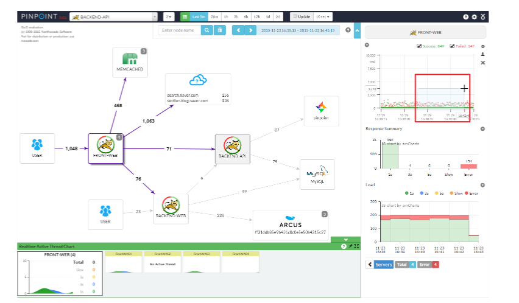

[toc]

# 架构知识

## 一、什么是SOA服务化

服务化就是把传统的单机应用中通过 JAR 包依赖产生的本地方法调用，改造成通过 RPC 接口产生的远程方法调用

## 二、微服务

### 1、特点

- **服务拆分粒度更细**。微服务可以说是更细维度的服务化，小到一个子模块，只要该模块依赖的资源与其他模块都没有关系，那么就可以拆分为一个微服务。
- **服务独立部署**。每个微服务都严格遵循独立打包部署的准则，互不影响。比如一台物理机上可以部署多个 Docker 实例，每个 Docker 实例可以部署一个微服务的代码。
- **服务独立维护**。每个微服务都可以交由一个小团队甚至个人来开发、测试、发布和运维，并对整个生命周期负责。
- **服务治理能力要求高**。因为拆分为微服务之后，服务的数量变多，因此需要有统一的服务治理平台，来对各个服务进行管理。

### 2、服务化拆分类型

**纵向拆分**，是从业务维度进行拆分。标准是按照业务的关联程度来决定，关联比较密切的业务适合拆分为一个微服务，而功能相对比较独立的业务适合单独拆分为一个微服务。

**横向拆分**，是从公共且独立功能维度拆分。标准是按照是否有公共的被多个其他服务调用，且依赖的资源独立不与其他业务耦合。

### 3、服务化拆分面临问题

- **服务如何定义**。对于单体应用来说，不同功能模块之前相互交互时，通常是以类库的方式来提供各个模块的功能。对于微服务来说，每个服务都运行在各自的进程之中，应该以何种形式向外界传达自己的信息呢？答案就是接口，无论采用哪种通讯协议，是 HTTP 还是 RPC，服务之间的调用都通过接口描述来约定，约定内容包括接口名、接口参数以及接口返回值。
- **服务如何发布和订阅**。单体应用由于部署在同一个 WAR 包里，接口之间的调用属于进程内的调用。而拆分为微服务独立部署后，服务提供者该如何对外暴露自己的地址，服务调用者该如何查询所需要调用的服务的地址呢？这个时候你就需要一个类似登记处的地方，能够记录每个服务提供者的地址以供服务调用者查询，在微服务架构里，这个地方就是注册中心。
- **服务如何监控**。通常对于一个服务，我们最关心的是 QPS（调用量）、AvgTime（平均耗时）以及 P999（99.9% 的请求性能在多少毫秒以内）这些指标。这时候你就需要一种通用的监控方案，能够覆盖业务埋点、数据收集、数据处理，最后到数据展示的全链路功能。
- **服务如何治理**。可以想象，拆分为微服务架构后，服务的数量变多了，依赖关系也变复杂了。比如一个服务的性能有问题时，依赖的服务都势必会受到影响。可以设定一个调用性能阈值，如果一段时间内一直超过这个值，那么依赖服务的调用可以直接返回，这就是熔断，也是服务治理最常用的手段之一。
- **故障如何定位**。在单体应用拆分为微服务之后，一次用户调用可能依赖多个服务，每个服务又部署在不同的节点上，如果用户调用出现问题，你需要有一种解决方案能够将一次用户请求进行标记，并在多个依赖的服务系统中继续传递，以便串联所有路径，从而进行故障定位。

### 4、组件

首先服务提供者（就是提供服务的一方）按照一定格式的服务描述，向注册中心注册服务，声明自己能够提供哪些服务以及服务的地址是什么，完成服务发布。

接下来服务消费者（就是调用服务的一方）请求注册中心，查询所需要调用服务的地址，然后以约定的通信协议向服务提供者发起请求，得到请求结果后再按照约定的协议解析结果。

而且在服务的调用过程中，服务的请求耗时、调用量以及成功率等指标都会被记录下来用作监控，调用经过的链路信息会被记录下来，用于故障定位和问题追踪。在这期间，如果调用失败，可以通过重试等服务治理手段来保证成功率。

- 服务描述
- 注册中心
- 服务框架
- 服务监控
- 服务追踪
- 服务治理

（1）服务描述

服务的服务名叫什么？调用这个服务需要提供哪些信息？调用这个服务返回的结果是什么格式的？该如何解析？这些就是服务描述要解决的问题。

常用的服务描述方式包括 RESTful API、XML 配置以及 IDL 文件三种。

（2）注册中心

服务提供者将自己提供的服务以及地址登记到注册中心，服务消费者则从注册中心查询所需要调用的服务的地址，然后发起请求。

一般来讲，注册中心的工作流程是：

- 服务提供者在启动时，根据服务发布文件中配置的发布信息向注册中心注册自己的服务。
- 服务消费者在启动时，根据消费者配置文件中配置的服务信息向注册中心订阅自己所需要的服务。
- 注册中心返回服务提供者地址列表给服务消费者。
- 当服务提供者发生变化，比如有节点新增或者销毁，注册中心将变更通知给服务消费者。

（3）服务框架

- **服务通信采用什么协议？**就是说服务提供者和服务消费者之间以什么样的协议进行网络通信，是采用四层 TCP、UDP 协议，还是采用七层 HTTP 协议，还是采用其他协议？
- **数据传输采用什么方式？**就是说服务提供者和服务消费者之间的数据传输采用哪种方式，是同步还是异步，是在单连接上传输，还是多路复用。
- **数据压缩采用什么格式？**通常数据传输都会对数据进行压缩，来减少网络传输的数据量，从而减少带宽消耗和网络传输时间，比如常见的 JSON 序列化、Java 对象序列化以及 Protobuf 序列化等。

（4）服务监控

- **指标收集。**就是要把每一次服务调用的请求耗时以及成功与否收集起来，并上传到集中的数据处理中心。
- **数据处理。**有了每次调用的请求耗时以及成功与否等信息，就可以计算每秒服务请求量、平均耗时以及成功率等指标。
- **数据展示。**数据收集起来，经过处理之后，还需要以友好的方式对外展示，才能发挥价值。通常都是将数据展示在 Dashboard 面板上，并且每隔 10s 等间隔自动刷新，用作业务监控和报警等。

（5）服务追踪

工作原理大致如下：

- 服务消费者发起调用前，会在本地按照一定的规则生成一个 requestid，发起调用时，将 requestid 当作请求参数的一部分，传递给服务提供者。
- 服务提供者接收到请求后，记录下这次请求的 requestid，然后处理请求。如果服务提供者继续请求其他服务，会在本地再生成一个自己的 requestid，然后把这两个 requestid 都当作请求参数继续往下传递。

通用的组件有Zipkin、SkyWorking等，都是根据google的Dapper论文落地的

（6）服务治理

服务治理就是通过一系列的手段来保证在各种意外情况下，服务调用仍然能够正常进行。

在生产环境中，你应该经常会遇到下面几种状况。

- **单机故障。**通常遇到单机故障，都是靠运维发现并重启服务或者从线上摘除故障节点。然而集群的规模越大，越是容易遇到单机故障，在机器规模超过一百台以上时，靠传统的人肉运维显然难以应对。而服务治理可以通过一定的策略，自动摘除故障节点，不需要人为干预，就能保证单机故障不会影响业务。
- **单 IDC 故障。**你应该经常听说某某 App，因为施工挖断光缆导致大批量用户无法使用的严重故障。而服务治理可以通过自动切换故障 IDC 的流量到其他正常 IDC，可以避免因为单 IDC 故障引起的大批量业务受影响。
- **依赖服务不可用。**比如你的服务依赖依赖了另一个服务，当另一个服务出现问题时，会拖慢甚至拖垮你的服务。而服务治理可以通过熔断，在依赖服务异常的情况下，一段时期内停止发起调用而直接返回。这样一方面保证了服务消费者能够不被拖垮，另一方面也给服务提供者减少压力，使其能够尽快恢复。

### 5、如何发布和引用服务

**服务提供者如何发布一个服务，服务消费者如何引用这个服务**

最常见的服务发布和引用的方式有三种：

- RESTful API
- XML 配置
- IDL 文件

#### （1）XML配置

例如Dubbo

这种方式的服务发布和引用主要分三个步骤：

- 服务提供者定义接口，并实现接口。
- 服务提供者进程启动时，通过加载 server.xml 配置文件将接口暴露出去。
- 服务消费者进程启动时，通过加载 client.xml 配置文件来引入要调用的接口。

通过在服务提供者和服务消费者之间维持一份对等的 XML 配置文件，来保证服务消费者按照服务提供者的约定来进行服务调用。

在这种方式下，如果服务提供者变更了接口定义，不仅需要更新服务提供者加载的接口描述文件 server.xml，还需要同时更新服务消费者加载的接口描述文件 client.xml。

一般是私有 RPC 框架会选择 XML 配置这种方式来描述接口，因为私有 RPC 协议的性能要比 HTTP 协议高，所以在对性能要求比较高的场景下，采用 XML 配置的方式比较合适。但这种方式对业务代码侵入性比较高，XML 配置有变更的时候，服务消费者和服务提供者都要更新，所以适合公司内部联系比较紧密的业务之间采用。如果要应用到跨部门之间的业务调用，一旦有 XML 配置变更，需要花费大量精力去协调不同部门做升级工作。

#### （2）IDL文件

例如Protobuf、Thrift

IDL 就是接口描述语言（interface description language）的缩写，通过一种中立的方式来描述接口，使得在不同的平台上运行的对象和不同语言编写的程序可以相互通信交流。比如你用 Java 语言实现提供的一个服务，也能被 PHP 语言调用。

主要是**用作跨语言平台的服务之间的调用**，有两种最常用的 IDL：一个是 Facebook 开源的**Thrift 协议**，另一个是 Google 开源的**gRPC 协议**。无论是 Thrift 协议还是 gRPC 协议，它们的工作原理都是类似的。

有一点特别需要注意的是，在描述接口定义时，IDL 文件需要对接口返回值进行详细定义。如果接口返回值的字段比较多，并且经常变化时，采用 IDL 文件方式的接口定义就不太合适了。一方面可能会造成 IDL 文件过大难以维护，另一方面只要 IDL 文件中定义的接口返回值有变更，都需要同步所有的服务消费者都更新，管理成本就太高了。

### 6、如何注册和发现服务

在微服务架构下，主要有三种角色：服务提供者（RPC Server）、服务消费者（RPC Client）和服务注册中心（Registry），三者的交互关系请看下面这张图，我来简单解释一下。

- RPC Server 提供服务，在启动时，根据服务发布文件 server.xml 中的配置的信息，向 Registry 注册自身服务，并向 Registry 定期发送心跳汇报存活状态。
- RPC Client 调用服务，在启动时，根据服务引用文件 client.xml 中配置的信息，向 Registry 订阅服务，把 Registry 返回的服务节点列表缓存在本地内存中，并与 RPC Sever 建立连接。
- 当 RPC Server 节点发生变更时，Registry 会同步变更，RPC Client 感知后会刷新本地内存中缓存的服务节点列表。
- RPC Client 从本地缓存的服务节点列表中，基于负载均衡算法选择一台 RPC Sever 发起调用。

注册中心一般采用分布式集群部署，来保证高可用性，并且为了实现异地多活，有的注册中心还采用多 IDC 部署，这就对数据一致性产生了很高的要求，这些都是注册中心在实现时必须要解决的问题。

**注册中心实现方式**

注册中心的实现主要涉及几个问题：注册中心需要提供哪些接口，该如何部署；如何存储服务信息；如何监控服务提供者节点的存活；如果服务提供者节点有变化如何通知服务消费者，以及如何控制注册中心的访问权限。

**1. 注册中心 API**

根据注册中心原理的描述，注册中心必须提供以下最基本的 API，例如：

- 服务注册接口：服务提供者通过调用服务注册接口来完成服务注册。
- 服务反注册接口：服务提供者通过调用服务反注册接口来完成服务注销。
- 心跳汇报接口：服务提供者通过调用心跳汇报接口完成节点存活状态上报。
- 服务订阅接口：服务消费者通过调用服务订阅接口完成服务订阅，获取可用的服务提供者节点列表。
- 服务变更查询接口：服务消费者通过调用服务变更查询接口，获取最新的可用服务节点列表。

除此之外，为了便于管理，注册中心还必须提供一些后台管理的 API，例如：

- 服务查询接口：查询注册中心当前注册了哪些服务信息。
- 服务修改接口：修改注册中心中某一服务的信息。

**2. 集群部署**

注册中心作为服务提供者和服务消费者之间沟通的桥梁，它的重要性不言而喻。所以注册中心一般都是采用集群部署来保证高可用性，并通过分布式一致性协议来确保集群中不同节点之间的数据保持一致。

**3. 目录存储**

例如zookeeper

**4. 服务健康状态检测**

注册中心除了要支持最基本的服务注册和服务订阅功能以外，还必须具备对服务提供者节点的健康状态检测功能，这样才能保证注册中心里保存的服务节点都是可用的。

**5. 服务状态变更通知**

一旦注册中心探测到有服务提供者节点新加入或者被剔除，就必须立刻通知所有订阅该服务的服务消费者，刷新本地缓存的服务节点信息，确保服务调用不会请求不可用的服务提供者节点。

**6. 白名单机制**

在实际应用中，注册中心可以提供一个白名单机制，只有添加到注册中心白名单内的 RPC Server，才能够调用注册中心的注册接口，这样的话可以避免测试环境中的节点意外跑到线上环境中去。

### 7、如何实现RPC远程服务调用

需要解决四个问题：

- 客户端和服务端如何建立网络连接？

  - http或者socket

- 服务端如何处理请求？

  - bio、nio、aio

- 数据传输采用什么协议？

  - http、dubbo等

    通常协议契约包括两个部分：消息头和消息体。其中消息头存放的是协议的公共字段以及用户扩展字段，消息体存放的是传输数据的具体内容。

- 数据该如何序列化和反序列化？

  - 常用的序列化方式分为两类：文本类如 XML/JSON 等，二进制类如 PB/Thrift 等，而具体采用哪种序列化方式，主要取决于三个方面的因素。
    - 支持数据结构类型的丰富度。数据结构种类支持的越多越好，这样的话对于使用者来说在编程时更加友好，有些序列化框架如 Hessian 2.0 还支持复杂的数据结构比如 Map、List 等。
    - 跨语言支持。序列化方式是否支持跨语言也是一个很重要的因素，否则使用的场景就比较局限，比如 Java 序列化只支持 Java 语言，就不能用于跨语言的服务调用了。
    - 性能。主要看两点，一个是序列化后的压缩比，一个是序列化的速度。以常用的 PB 序列化和 JSON 序列化协议为例来对比分析，PB 序列化的压缩比和速度都要比 JSON 序列化高很多，所以对性能和存储空间要求比较高的系统选用 PB 序列化更合适；而 JSON 序列化虽然性能要差一些，但可读性更好，更适合对外部提供服务。

### 8、如何监控微服务调用

三个问题：

1. 监控的对象是什么？
2. 具体监控哪些指标？
3. 从哪些维度进行监控？

#### （1）监控对象

监控对象可以分为四个层次，由上到下可归纳为：

- 用户端监控。通常是指业务直接对用户提供的功能的监控。以微博首页 Feed 为例，它向用户提供了聚合关注的所有人的微博并按照时间顺序浏览的功能，对首页 Feed 功能的监控就属于用户端的监控。
- 接口监控。通常是指业务提供的功能所依赖的具体 RPC 接口的监控。继续以微博首页 Feed 为例，这个功能依赖于用户关注了哪些人的关系服务，每个人发过哪些微博的微博列表服务，以及每条微博具体内容是什么的内容服务，对这几个服务的调用情况的监控就属于接口监控。
- 资源监控。通常是指某个接口依赖的资源的监控。比如用户关注了哪些人的关系服务使用的是 Redis 来存储关注列表，对 Redis 的监控就属于资源监控。
- 基础监控。通常是指对服务器本身的健康状况的监控。主要包括 CPU 利用率、内存使用量、I/O 读写量、网卡带宽等。对服务器的基本监控也是必不可少的，因为服务器本身的健康状况也是影响服务本身的一个重要因素，比如服务器本身连接的网络交换机上联带宽被打满，会影响所有部署在这台服务器上的业务。

#### （2）监控指标

通常有以下几个业务指标需要重点监控：

- 请求量。请求量监控分为两个维度，一个是实时请求量，一个是统计请求量。实时请求量用 QPS（Queries Per Second）即每秒查询次数来衡量，它反映了服务调用的实时变化情况。统计请求量一般用 PV（Page View）即一段时间内用户的访问量来衡量，比如一天的 PV 代表了服务一天的请求量，通常用来统计报表。
- 响应时间。大多数情况下，可以用一段时间内所有调用的平均耗时来反映请求的响应时间。但它只代表了请求的平均快慢情况，有时候我们更关心慢请求的数量。为此需要把响应时间划分为多个区间，比如 0～10ms、10ms～50ms、50ms～100ms、100ms～500ms、500ms 以上这五个区间，其中 500ms 以上这个区间内的请求数就代表了慢请求量，正常情况下，这个区间内的请求数应该接近于 0；在出现问题时，这个区间内的请求数会大幅增加，可能平均耗时并不能反映出这一变化。除此之外，还可以从 P90、P95、P99、P999 角度来监控请求的响应时间，比如 P99 = 500ms，意思是 99% 的请求响应时间在 500ms 以内，它代表了请求的服务质量，即 SLA。
- 错误率。错误率的监控通常用一段时间内调用失败的次数占调用总次数的比率来衡量，比如对于接口的错误率一般用接口返回错误码为 503 的比率来表示。

#### （3）监控维度

具体来讲可以包括下面几个维度：

- 全局维度。从整体角度监控对象的的请求量、平均耗时以及错误率，全局维度的监控一般是为了让你对监控对象的调用情况有个整体了解。
- 分机房维度。一般为了业务的高可用性，服务通常部署在不止一个机房，因为不同机房地域的不同，同一个监控对象的各种指标可能会相差很大，所以需要深入到机房内部去了解。
- 单机维度。即便是在同一个机房内部，可能由于采购年份和批次的不同，位于不同机器上的同一个监控对象的各种指标也会有很大差异。一般来说，新采购的机器通常由于成本更低，配置也更高，在同等请求量的情况下，可能表现出较大的性能差异，因此也需要从单机维度去监控同一个对象。
- 时间维度。同一个监控对象，在每天的同一时刻各种指标通常也不会一样，这种差异要么是由业务变更导致，要么是运营活动导致。为了了解监控对象各种指标的变化，通常需要与一天前、一周前、一个月前，甚至三个月前做比较。
- 核心维度。根据我的经验，业务上一般会依据重要性程度对监控对象进行分级，最简单的是分成核心业务和非核心业务。核心业务和非核心业务在部署上必须隔离，分开监控，这样才能对核心业务做重点保障。

#### **监控系统：**

**监控系统主要包括四个环节：数据采集、数据传输、数据处理和数据展示**

**1. 数据采集**

通常有两种数据收集方式：

- 服务主动上报，这种处理方式通过在业务代码或者服务框架里加入数据收集代码逻辑，在每一次服务调用完成后，主动上报服务的调用信息。
- 代理收集，这种处理方式通过服务调用后把调用的详细信息记录到本地日志文件中，然后再通过代理去解析本地日志文件，然后再上报服务的调用信息。

无论哪种数据采集方式，首先要考虑的问题就是采样率，也就是采集数据的频率。采样率决定了监控的实时性与精确度，一般来说，采样率越高，监控的实时性就越高，精确度也越高。但采样对系统本身的性能也会有一定的影响，尤其是采集后的数据需要写到本地磁盘的时候，过高的采样率会导致系统写入磁盘的 I/O 过高，进而会影响到正常的服务调用。所以设置合理的采用率是数据采集的关键，最好是可以动态控制采样率，在系统比较空闲的时候加大采样率，追求监控的实时性与精确度；在系统负载比较高的时候减小采样率，追求监控的可用性与系统的稳定性。

**2. 数据传输**

数据传输最常用的方式有两种：

- UDP 传输，这种处理方式是数据处理单元提供服务器的请求地址，数据采集后通过 UDP 协议与服务器建立连接，然后把数据发送过去。
- Kafka 传输，这种处理方式是数据采集后发送到指定的 Topic，然后数据处理单元再订阅对应的 Topic，就可以从 Kafka 消息队列中读取到对应的数据。

无论采用哪种传输方式，数据格式都十分重要，尤其是对带宽敏感以及解析性能要求比较高的场景，一般数据传输时采用的数据格式有两种：

- 二进制协议，最常用的就是 PB 对象，它的优点是高压缩比和高性能，可以减少传输带宽并且序列化和反序列化效率特别高。
- 文本协议，最常用的就是 JSON 字符串，它的优点是可读性好，但相比于 PB 对象，传输占用带宽高，并且解析性能也要差一些。

**3. 数据处理**

数据处理是对收集来的原始数据进行聚合并存储。数据聚合通常有两个维度：

- 接口维度聚合，这个维度是把实时收到的数据按照接口名维度实时聚合在一起，这样就可以得到每个接口的实时请求量、平均耗时等信息。
- 机器维度聚合，这个维度是把实时收到的数据按照调用的节点维度聚合在一起，这样就可以从单机维度去查看每个接口的实时请求量、平均耗时等信息。

聚合后的数据需要持久化到数据库中存储，所选用的数据库一般分为两种：

- 索引数据库，比如 Elasticsearch，以倒排索引的数据结构存储，需要查询的时候，根据索引来查询。
- 时序数据库，比如 OpenTSDB，以时序序列数据的方式存储，查询的时候按照时序如 1min、5min 等维度来查询。

**4. 数据展示**

数据展示是把处理后的数据以 Dashboard 的方式展示给用户。数据展示有多种方式，比如曲线图、饼状图、格子图展示等。

### 9、如何追踪微服务调用

一次请求往往需要涉及多个服务，每个服务可能是由不同的团队开发，使用了不同的编程语言，还有可能部署在不同的机器上，分布在不同的数据中心。

**服务追踪的作用：**

**第一，优化系统瓶颈。**

通过记录调用经过的每一条链路上的耗时，我们能快速定位整个系统的瓶颈点在哪里。

**第二，优化链路调用。**

通过服务追踪可以分析调用所经过的路径，然后评估是否合理。比如一个服务调用下游依赖了多个服务，通过调用链分析，可以评估是否每个依赖都是必要的，是否可以通过业务优化来减少服务依赖。

**第三，生成网络拓扑。**

通过服务追踪系统中记录的链路信息，可以生成一张系统的网络调用拓扑图，它可以反映系统都依赖了哪些服务，以及服务之间的调用关系是什么样的，可以一目了然。除此之外，在网络拓扑图上还可以把服务调用的详细信息也标出来，也能起到服务监控的作用。

**第四，透明传输数据。**

除了服务追踪，业务上经常有一种需求，期望能把一些用户数据，从调用的开始一直往下传递，以便系统中的各个服务都能获取到这个信息。比如业务想做一些 A/B 测试，这时候就想通过服务追踪系统，把 A/B 测试的开关逻辑一直往下传递，经过的每一层服务都能获取到这个开关值，就能够统一进行 A/B 测试。

#### 服务追踪系统原理

各种服务追踪系统都是基于 Dapper 衍生出来的，比较有名的有 Twitter 的[Zipkin](http://zipkin.io)、阿里的[鹰眼](http://www.slideshare.net/terryice/eagleeye-with-taobaojavaone)、美团的[MTrace](http://tech.meituan.com/mt_mtrace.html)等。

- traceId，用于标识某一次具体的请求 ID。当用户的请求进入系统后，会在 RPC 调用网络的第一层生成一个全局唯一的 traceId，并且会随着每一层的 RPC 调用，不断往后传递，这样的话通过 traceId 就可以把一次用户请求在系统中调用的路径串联起来。
- spanId，用于标识一次 RPC 调用在分布式请求中的位置。当用户的请求进入系统后，处在 RPC 调用网络的第一层 A 时 spanId 初始值是 0，进入下一层 RPC 调用 B 的时候 spanId 是 0.1，继续进入下一层 RPC 调用 C 时 spanId 是 0.1.1，而与 B 处在同一层的 RPC 调用 E 的 spanId 是 0.2，这样的话通过 spanId 就可以定位某一次 RPC 请求在系统调用中所处的位置，以及它的上下游依赖分别是谁。
- annotation，用于业务自定义埋点数据，可以是业务感兴趣的想上传到后端的数据，比如一次请求的用户 UID。

#### 服务追踪系统实现

一个服务追踪系统可以分为三层。

- 数据采集层，负责数据埋点并上报。
- 数据处理层，负责数据的存储与计算。
- 数据展示层，负责数据的图形化展示。

**1. 数据采集层**

数据采集层的作用就是在系统的各个不同模块中进行埋点，采集数据并上报给数据处理层进行处理。

以红色方框里圈出的 A 调用 B 的过程为例，一次 RPC 请求可以分为四个阶段。

- CS（Client Send）阶段 : 客户端发起请求，并生成调用的上下文。
- SR（Server Recieve）阶段 : 服务端接收请求，并生成上下文。
- SS（Server Send）阶段 : 服务端返回请求，这个阶段会将服务端上下文数据上报，下面这张图可以说明上报的数据有：traceId=123456，spanId=0.1，appKey=B，method=B.method，start=103，duration=38。
- CR（Client Recieve）阶段 : 客户端接收返回结果，这个阶段会将客户端上下文数据上报，上报的数据有：traceid=123456，spanId=0.1，appKey=A，method=B.method，start=103，duration=38。

**2. 数据处理层**

数据处理层的作用就是把数据采集层上报的数据按需计算，然后落地存储供查询使用。

据我所知，数据处理的需求一般分为两类，一类是实时计算需求，一类是离线计算需求。

实时计算需求对计算效率要求比较高，一般要求对收集的链路数据能够在秒级别完成聚合计算，以供实时查询。而离线计算需求对计算效率要求就没那么高了，一般能在小时级别完成链路数据的聚合计算即可，一般用作数据汇总统计。针对这两类不同的数据处理需求，采用的计算方法和存储也不相同。

- 实时数据处理

针对实时数据处理，一般采用 Storm 或者 Spark Streaming 来对链路数据进行实时聚合加工，存储一般使用 OLTP 数据仓库，比如 HBase，使用 traceId 作为 RowKey，能天然地把一整条调用链聚合在一起，提高查询效率。

- 离线数据处理

针对离线数据处理，一般通过运行 MapReduce 或者 Spark 批处理程序来对链路数据进行离线计算，存储一般使用 Hive。

**3. 数据展示层**

数据展示层的作用就是将处理后的链路信息以图形化的方式展示给用户。

根据我的经验，实际项目中主要用到两种图形展示，一种是调用链路图，一种是调用拓扑图。

- 调用链路图

下面以一张 Zipkin 的调用链路图为例，通过这张图可以看出下面几个信息。

**服务整体情况**：服务总耗时、服务调用的网络深度、每一层经过的系统，以及多少次调用。下图展示的一次调用，总共耗时 209.323ms，经过了 5 个不同的系统模块，调用深度为 7 层，共发生了 24 次系统调用。

**每一层的情况**：每一层发生了几次调用，以及每一层调用的耗时。

- 调用拓扑图

下面是一张 Pinpoint 的调用拓扑图，通过这张图可以看出系统内都包含哪些应用，它们之间是什么关系，以及依赖调用的 QPS、平均耗时情况。

调用拓扑图是一种全局视野图，在实际项目中，主要用作全局监控，用于发现系统中异常的点，从而快速做出决策。

### 10、微服务治理手段

单体应用改造为微服务架构后，服务调用由本地调用变成远程调用，服务消费者 A 需要通过注册中心去查询服务提供者 B 的地址，然后发起调用，这个看似简单的过程就可能会遇到下面几种情况，比如：

- 注册中心宕机；
- 服务提供者 B 有节点宕机；
- 服务消费者 A 和注册中心之间的网络不通；
- 服务提供者 B 和注册中心之间的网络不通；
- 服务消费者 A 和服务提供者 B 之间的网络不通；
- 服务提供者 B 有些节点性能变慢；
- 服务提供者 B 短时间内出现问题。

可见，一次服务调用，服务提供者、注册中心、网络这三者都可能会有问题，此时服务消费者应该如何处理才能确保调用成功呢？这就是服务治理要解决的问题。

#### （1）节点管理

无论是服务提供者自身出现问题还是网络发生问题，都有两种节点管理手段。

**1. 注册中心主动摘除机制**

这种机制要求服务提供者定时的主动向注册中心汇报心跳，注册中心根据服务提供者节点最近一次汇报心跳的时间与上一次汇报心跳时间做比较，如果超出一定时间，就认为服务提供者出现问题，继而把节点从服务列表中摘除，并把最近的可用服务节点列表推送给服务消费者。

**2. 服务消费者摘除机制**

将存活探测机制用在服务消费者这一端更合理，如果服务消费者调用服务提供者节点失败，就将这个节点从内存中保存的可用服务提供者节点列表中移除。

#### （2）负载均衡

**1. 随机算法**

**2. 轮询算法**

**3. 最少活跃调用算法**

**4. 一致性 Hash 算法**

#### （3）服务路由

对于服务消费者而言，在内存中的可用服务节点列表中选择哪个节点不仅由负载均衡算法决定，还由路由规则确定。

所谓的路由规则，就是通过一定的规则如条件表达式或者正则表达式来限定服务节点的选择范围。

为什么要制定路由规则呢？主要有两个原因。

**1. 业务存在灰度发布的需求**

**2. 多机房就近访问的需求**

那么路由规则该如何配置呢？根据我的实际项目经验，一般有两种配置方式。

**1. 静态配置**

就是在服务消费者本地存放服务调用的路由规则，在服务调用期间，路由规则不会发生改变，要想改变就需要修改服务消费者本地配置，上线后才能生效。

**2. 动态配置**

这种方式下，路由规则是存在注册中心的，服务消费者定期去请求注册中心来保持同步，要想改变服务消费者的路由配置，可以通过修改注册中心的配置，服务消费者在下一个同步周期之后，就会请求注册中心来更新配置，从而实现动态更新。

#### （3）服务容错

服务调用并不总是一定成功的，可能因为服务提供者节点自身宕机、进程异常退出或者服务消费者与提供者之间的网络出现故障等原因。对于服务调用失败的情况，需要有手段自动恢复，来保证调用成功。

常用的手段主要有以下几种。

- FailOver：失败自动切换。就是服务消费者发现调用失败或者超时后，自动从可用的服务节点列表总选择下一个节点重新发起调用，也可以设置重试的次数。这种策略要求服务调用的操作必须是幂等的，也就是说无论调用多少次，只要是同一个调用，返回的结果都是相同的，一般适合服务调用是读请求的场景。
- FailBack：失败通知。就是服务消费者调用失败或者超时后，不再重试，而是根据失败的详细信息，来决定后续的执行策略。比如对于非幂等的调用场景，如果调用失败后，不能简单地重试，而是应该查询服务端的状态，看调用到底是否实际生效，如果已经生效了就不能再重试了；如果没有生效可以再发起一次调用。
- FailCache：失败缓存。就是服务消费者调用失败或者超时后，不立即发起重试，而是隔一段时间后再次尝试发起调用。比如后端服务可能一段时间内都有问题，如果立即发起重试，可能会加剧问题，反而不利于后端服务的恢复。如果隔一段时间待后端节点恢复后，再次发起调用效果会更好。
- FailFast：快速失败。就是服务消费者调用一次失败后，不再重试。实际在业务执行时，一般非核心业务的调用，会采用快速失败策略，调用失败后一般就记录下失败日志就返回了。

从我对服务容错不同策略的描述中，你可以看出它们的使用场景是不同的，一般情况下对于幂等的调用，可以选择 FailOver 或者 FailCache，非幂等的调用可以选择 FailBack 或者 FailFast。

