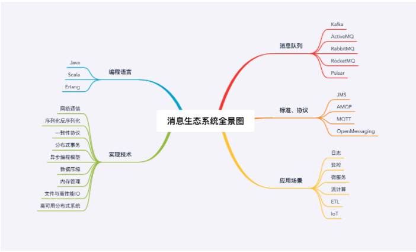

[TOC]

# 消息队列

> RocketMQ 官方文档： https://rocketmq.apache.org/docs/quick-start/

> RocketMQ 中国开发者中心：http://rocketmq.cloud/zh-cn/ 

> Kafka 官方文档： http://kafka.apache.org/documentation/

> RabbitMQ 官方文档： https://www.rabbitmq.com/documentation.html

## 一、使用场景

### 1、异步处理

比如秒杀系统，核心问题是，如何利用有限的服务器资源，尽可能多地处理短时间内的海量请求。处理一个秒杀请求包含了很多步骤，例如：

- 风险控制；
- 库存锁定；
- 生成订单；
- 短信通知；
- 更新统计数据。

而风险控制和库存锁定能直接决定秒杀是否成功，所以后面的步骤可以通过消息队列进行异步处理

### 2、流量控制

如何避免过多的请求把服务压垮？

健壮的程序应该能尽可能处理请求的同时，能拒绝处理不了的请求

可以使用消息队列来隔离网关和后端服务，以达到流量控制和保护后端的目的

加入消息队列后，整个秒杀流程变为：

1. 网关在收到请求后，将请求放入请求消息队列；
2. 后端服务从请求消息队列中获取 APP 请求，完成后续秒杀处理过程，然后返回结果。

对于超时的请求直接丢弃，这样也可对下游服务进行水平扩容提高处理速度，实现削峰填谷

代价：

- 增加了系统调用链环节，导致总体的响应时延变长。
- 上下游系统都要将同步调用改为异步消息，增加了系统的复杂度。
- 请求可能会丢失

**更简单的流量控制方法：可以用消息队列实现一个令牌桶**

令牌桶控制流量的原理是：单位时间内只发放固定数量的令牌到令牌桶中，规定服务在处理请求之前必须先从令牌桶中拿出一个令牌，如果令牌桶中没有令牌，则拒绝请求。这样就保证单位时间内，能处理的请求不超过发放令牌的数量，起到了流量控制的作用。

实现的方式也很简单，不需要破坏原有的调用链，只要网关在处理 APP 请求时增加一个获取令牌的逻辑。

令牌桶可以简单地用一个有固定容量的消息队列加一个“令牌发生器”来实现：令牌发生器按照预估的处理能力，匀速生产令牌并放入令牌队列（如果队列满了则丢弃令牌），网关在收到请求时去令牌队列消费一个令牌，获取到令牌则继续调用后端秒杀服务，如果获取不到令牌则直接返回秒杀失败。

服务降级、限流、熔断：https://cloud.tencent.com/developer/article/1815254

### 3、服务解耦

### 4、作为发布 / 订阅系统

实现一个微服务级系统间的观察者模式；

### 5、连接流计算任务和数据；

### 6、用于将消息广播给大量接收者。

### 7、缺点

- 引入消息队列带来的延迟问题；
- 增加了系统的复杂度；
- 可能产生数据不一致的问题。

## 二、如何选择消息中间件

选择中间件的考量维度：可靠性，性能，功能，可运维行，可拓展性，是否开源及社区活跃度

### 1、RabbitMQ

优点：轻量，迅捷，容易部署和使用，拥有灵活的路由配置
缺点：性能和吞吐量较差，不易进行二次开发

### 2、RocketMQ

**如果你的应用场景很在意响应时延，那应该选择使用 RocketMQ**

优点：性能好，稳定可靠，响应快

缺点：兼容性较差，但随意影响力的扩大，该问题会有改善

### 3、Kafka

优点：拥有强大的性能及吞吐量，兼容性很好

缺点：由于“攒一波再处理”导致延迟比较高

**Kafka 不太适合在线业务场景。**

### 4、Pulsar

采用存储和计算分离的设计，是消息队里产品中黑马，值得持续关注

## 三、队列消息模型

队列和主题最大的区别就是一份消息能不能被多次消费

### 1、RabbitMQ的消息模型

RabbitMQ依然使用队列模型，其解决多个消费者的问题就是通过Exchange路由配置，将一个消息通过路由配置发送给多个队列中，变相实现发布订阅模型

### 2、RocketMQ

生产者端：生产-确认

消费者端：消费-确认

问题：在某一条消息被成功消费之前，下一条消息是不能被消费的，否则就会出现消息空洞，违背了有序性这个原则。

为了解决此问题，RocketMQ引入了队列

**每个主题包含多个队列，通过多个队列来实现多实例并行生产和消费。**需要注意的是，RocketMQ 只在队列上保证消息的有序性，主题层面是无法保证消息的严格顺序的。

RocketMQ 中，订阅者的概念是通过消费组（Consumer Group）来体现的。每个消费组都消费主题中一份完整的消息，不同消费组之间消费进度彼此不受影响，也就是说，一条消息被 Consumer Group1 消费过，也会再给 Consumer Group2 消费。

消费组中包含多个消费者，同一个组内的消费者是竞争消费的关系，每个消费者负责消费组内的一部分消息。如果一条消息被消费者 Consumer1 消费了，那同组的其他消费者就不会再收到这条消息。

在 Topic 的消费过程中，由于消息需要被不同的组进行多次消费，所以消费完的消息并不会立即被删除，这就需要 RocketMQ 为每个消费组在每个队列上维护一个消费位置（Consumer Offset），这个位置之前的消息都被消费过，之后的消息都没有被消费过，每成功消费一条消息，消费位置就加一。这个消费位置是非常重要的概念，我们在使用消息队列的时候，丢消息的原因大多是由于消费位置处理不当导致的。

### 3、Kafka

kafka的消息模型跟RocketMQ基本一致，不同的地方在于Kafka没有队列的概念，换成了分区Partition

其offset存储也不是由消费者存储，而是由服务端的一个Topic专门存储

## 四、消息队列分布式事务

**消息队列中的“事务”，主要解决的是消息生产者和消息消费者的数据一致性问题。**

比如从购物车提交订单，订单生成后需要删除购物车里面的商品，这就需要保持订单数据和购物车数据的一致性

事务消息需要消息队列提供相应的功能才能实现，Kafka 和 RocketMQ 都提供了事务相关功能。

为什么不直接根据订单生成状态去决定发不发消息给队列，因为有可能存在订单生成后出现宕机的情况

这个实现过程中，有一个问题是没有解决的。如果在第四步提交事务消息时失败了怎么办？

对于这个问题，Kafka 和 RocketMQ 给出了 2 种不同的解决方案。

**Kafka 的解决方案比较简单粗暴，直接抛出异常，让用户自行处理。我们可以在业务代码中反复重试提交，直到提交成功，或者删除之前创建的订单进行补偿。**

**在 RocketMQ 中的事务实现中，增加了事务反查的机制来解决事务消息提交失败的问题。如果 Producer 也就是订单系统，在提交或者回滚事务消息时发生网络异常，RocketMQ 的 Broker 没有收到提交或者回滚的请求，Broker 会定期去 Producer 上反查这个事务对应的本地事务的状态，然后根据反查结果决定提交或者回滚这个事务。**

**这个反查本地事务的实现，并不依赖消息的发送方，也就是订单服务的某个实例节点上的任何数据。这种情况下，即使是发送事务消息的那个订单服务节点宕机了，RocketMQ 依然可以通过其他订单服务的节点来执行反查，确保事务的完整性。**

## 五、消息不丢失、幂等消费、消息积压

### 1、确保消息不丢失

这个过程可以分为分三个阶段，每个阶段都需要正确的编写代码并且设置正确的配置项，才能配合消息队列的可靠性机制，确保消息不会丢失。

- 在生产阶段，异步发送消息并需要捕获消息发送的错误，并重发消息。
- 在存储阶段，你可以通过配置刷盘和复制相关的参数，让消息写入到多个副本的磁盘上，来确保消息不会因为某个 Broker 宕机或者磁盘损坏而丢失。
- 在消费阶段，关掉自动确认，需要在处理完全部消费业务逻辑之后，再发送消费确认。

### 2、幂等消费

在 MQTT 协议中，给出了三种传递消息时能够提供的服务质量标准，这三种服务质量从低到高依次是：

- **At most once**: 至多一次。消息在传递时，最多会被送达一次。换一个说法就是，没什么消息可靠性保证，允许丢消息。一般都是一些对消息可靠性要求不太高的监控场景使用，比如每分钟上报一次机房温度数据，可以接受数据少量丢失。
- **At least once**: 至少一次。消息在传递时，至少会被送达一次。也就是说，不允许丢消息，但是允许有少量重复消息出现。
- **Exactly once**：恰好一次。消息在传递时，只会被送达一次，不允许丢失也不允许重复，这个是最高的等级。

一个幂等操作的特点是，**其任意多次执行所产生的影响均与一次执行的影响相同。**

从对系统的影响结果来说：**At least once + 幂等消费 = Exactly once。**

（1）数据库唯一索引校验

（2）乐观锁

（3）记录并检查，消息唯一id，比如md5

### 3、消息积压

优化消息收发性能，预防消息积压的方法有两种，增加批量或者是增加并发，在发送端这两种方法都可以使用，在消费端需要注意的是，增加并发需要同步扩容分区数量，否则是起不到效果的。

对于系统发生消息积压的情况，需要先解决积压，再分析原因，毕竟保证系统的可用性是首先要解决的问题。快速解决积压的方法就是通过水平扩容增加 Consumer 的实例数量。如果增加消费者和分区仍然无法解决，就要考虑是否需要通过限流，关闭部分生产者

一、如何预防消息积压？

1、发送端提高并发及批量大小；

2、消费端增加实例且同步宽容分区；

二、如何处理消息积压？

1、消费端扩容

2、服务降级

3、异常监控