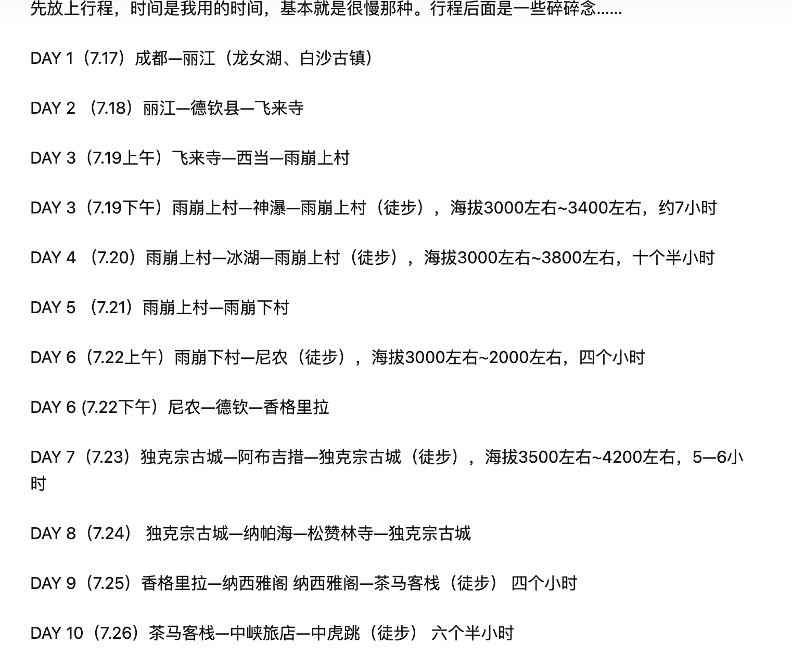

### 行程：
第一天：广州-->丽江

第二天：丽江-->飞来寺

第三天：飞来寺-->西当村-->雨崩-->徒步神瀑线

第四天：徒步冰湖线

第五天：徒步尼农线出去

第六天：返回丽江

注意：如果五点半能赶到西当，可以直接坐越野车到下雨崩，就无须在飞来寺住。

### 如何抵达雨崩
丽江-香格里拉-飞来寺（可看日照金山）

然后第二天坐8:40的大巴到西当村20元

西当坐越野车：
- 上雨崩： 200/人
- 下雨崩： 260/人

### 交通
丽江到飞来寺：公众号【丽江交运】买票

一人出行：关注【丽江交运】+【迪庆交运】

广州到丽江：
  - 广州南-昆明南：9:54 - 18:04
  - 昆明站-丽江：21:28 - 7:00
  
丽江到飞来寺：
  - 丽江客运站-飞来寺：9:00
  
飞来寺到西当：

西当到雨崩：西当坐越野车：（现场买票）
  - 上雨崩： 200/人
  - 下雨崩： 260/人

注意：如果五点半能赶到西当，可以直接坐越野车到下雨崩，就无须在飞来寺住。

### 住宿
飞来寺：

雨崩：
    - 上雨崩：行者山舍、酥油茶
    - 下雨崩：梅朵
    
    17-18 : 酥油茶
    18-19 : 
    19-20 : 梅朵

路线行程可参考：

可参考：https://zhuanlan.zhihu.com/p/548620571