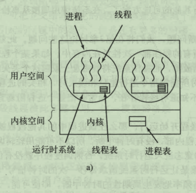
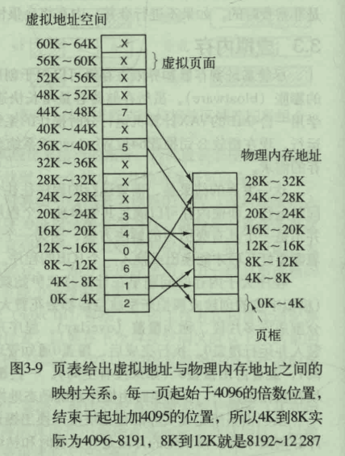
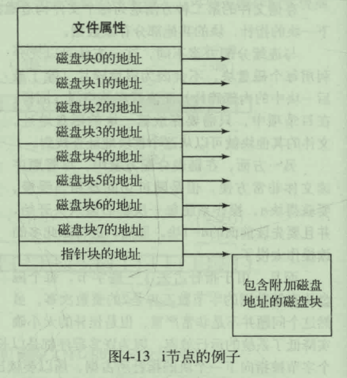

[toc]


# 现代操作系统

注：博客 https://blog.nowcoder.net/sigma711

## 一、综述

### 1、什么是操作系统

操作系统是一种运行在内核态的软件。

由于硬件的接口极为复杂，所以操作系统的一个主要任务是隐藏硬件，呈现给程序一个良好、清晰、一致的抽象。

现代计算机包含处理器、存储器、时钟、磁盘、网络接口等许多设备，操作系统需要在互相竞争的程序之间有序地控制堆处理器、存储器以及其它IO接口设备的分配。

在多进程和多用户的环境中，操作系统需要记录哪些程序在使用什么资源，对资源请求进行分配，评估使用代价，并为不同的程序和用户之间调解相互冲突的资源请求。

资源管理用两种不同方式实现**多路复用（共享）**资源：在时间上复用和在空间上复用。

- **时间上复用：** 不同程序或用户轮流使用，时间片分割
- **空间上复用：** 都获取一部分资源，取代排队。


### 2、计算机硬件


CPU、内存以及IO设备都由一条系统总线连接起来并通过总线与其它设备通信。


#### （1）处理器

CPU从内存中取出指令并执行。

**CPU指令周期：**

- 从内存中取出指令
- 解码，确定类型和操作数
- 执行
- 将结果暂存寄存器


每个CPU都有一套专门指令集，所以，x86处理器不能执行ARM程序，ARM处理器也不能执行x86程序。


**寄存器：**

用来访问内存以得到指令或数据的时间要比执行指令花费的时间长的多，所以，CPU内部会有用来保存关键变量和临时数据的寄存器。

通常在指令集中提供了一些指令，用来将数据从内存读入寄存器，从寄存器读入内存，其它指令可以把来自寄存器、内存的操作数进行计算，将产生的结果存在寄存器或内存中。


**程序计数器：**

也是寄存器，保存了将要取出的下一条指令的内存地址。在指令取出之后，程序计数器就被更新以便指向后继的指令。


**堆栈指针：**

也是寄存器，指向内存中当前栈的顶端。该栈包含了每个执行过程的栈帧。一个过程的栈帧中保存了有关的输入参数、局部变量以及哪些没有保存在寄存器这种的临时变量。


**程序状态字（Program Status Word，PSW）：**

这个寄存器包含了条件码位、CPU优先级、模式（用户态或内核态），以及各种其它控制位。用户程序通常读入整个PSW，但是，只对其中的少量字段写入。在系统调用和IO中，PSW的作用很重要。


操作系统必须知晓所有寄存器，在时间多路复用CPU中，操作系统经常会终止某个进程并启动另一个进程，此时操作系统需要保存所有的寄存器值，以便在后面再次运行该进程时，重新装入这些寄存器，恢复之前状态。


现代CPU具有同时取出多条指令的机制。例如一个CPU可以有单独的取指单元、解码单元和执行单元，当执行指令n时，可解码n+1指令，读取n+2指令，这种成为**流水线**


超标量CPU中有多个执行单元，例如一个CPU用于整数计算、一个CPU用于浮点计算、一个CPU用于布尔运算，两个或更多的指令被同时取出、解码并装入暂存缓冲区中，直至它们执行完成。只要有一个执行单元空间，就检查保持缓冲区中是否还有可处理的指令，有则把指令冲缓冲区中移出并执行。


CPU会有两种模式：**内核态**和**用户态**

在PSW中有一个二进制位控制这两种模式，当在内核态运行时，CPU可执行指令集中的每一条指令，并使用硬件的每种功能。操作系统就运行在内核态中

用户程序在用户态下运行，仅允许执行整个指令集的一个子集或访问所有功能的一个子集。

如果用户程序想要从操作系统中获取服务，用户程序必须使用**系统调用**以陷入内核并调用操作系统。

**TRAP**指令把用户态切换成内核态，并启用操作系统，完成后，在系统调用后面的指令把控制权返回给用户程序。


**多线程和多核芯片：**

多线程允许CPU保持两个不同的线程状态，然后在纳秒级的时间尺度内来回切换。

如果某个进程需要从内存中读出一个字（需要花费多个时钟周期），多线程CPU则可切换至另一个线程。多线程不提供真正的并行处理。在某个时刻只有一个进程在运行，单=但线程的切换时间则减少到纳秒数量级。

多核CPU


**GPU：** 由成千上万个微核组成的处理器，擅长处理大量并行的简单运算。


#### （2）存储器

存储器系统采用分层次的结构。


**寄存器：**

用于CPU相同材料制成，跟CPU一样快。存储容量在32位CPU中是32*32位，在64位CPU中是64\*64位。


**高速缓存行：**

多数由硬件控制，主存被分割成高速缓存行，典型大小为64字节，地址0~63对应高速缓存行0，64~127对应高速缓存行1 。

最常用的高速缓存行放置在CPU内部或非常接近CPU的高速缓存中。

当程序需要读一个存储字时，高速缓存组件检查是否在高速缓存中，如果是，则称为高速缓存命中。缓存满足了请求，就不需要将访问请求送往贮存。

高速缓存命中一般需要两个时钟周期，未命中就必须访问内存，需要大量时间。


现代CPU中设计了两个缓存。

**L1缓存：**

在CPU中，通常用来将已解码的指令调入CPU的执行引擎


**L2缓存：**

存放频繁使用的数据字。


L1、L2缓存之间的差别在于时序，对L1缓存的访问，不存在延时，对L2缓存的访问，则会延时1或2个时钟周期。


**主存：**

存储器系统主力，称为随机访问存储器。


#### （3）磁盘

磁盘随机访问数据时间比内存大约慢了三个数量级。也就是慢了1000倍左右。


**虚拟内存机制：**

使期望运行大于物理内存的程序成为可能，其方法是将程序放在磁盘上，将主存作为一种缓存，用来保存最频繁使用的部分程序。

需要快速地映射内存地址，以便将程序生成的地址转换为有关字节在RAM中的物理地址。

这种映射由CPU中的**存储器管理单元**（Memory Management Unit，MMU）来完成。


#### （4）I/O设备

I/O设备一般包括两个部分：设备控制器核设备本身。

控制器是插在电路板上的一块芯片或一组芯片，这块电路板物理地控制设备，从操作系统接受命令。

实现输入、输出的方式由三种：

**1、忙等待**

用户程序发出一个系统调用，内核将其解析成一个对应设备驱动程序的过程调用，然后设备驱动程序启动IO并在一个连续不断的循环中检查该设备，看是否完成了，当IO结束后，设备驱动程序把数据送到指定的地方并返回。然后操作系统将控制权返回给调用者。


**2、中断**

设备驱动程序启动设备并让该设备在操作完成时发出一个中断。设备驱动程序在这个时刻返回，操作系统在需要时阻塞调用者并安排其它工作进行。当设备驱动程序检测到该设备的操作完毕后，发出一个中断通知操作完成。


在操作系统中，中断是非常重要的。

一旦CPU决定取中断，通常程序计数器和PSW就被压入当前堆栈，并切换回用户态。设备编号可成为部分内存的一个引用，用于寻找该设备中断处理程序的地址，这部分内存称为**中断向量**


**3、DMA**

直接存储器访问。

在进行IO设备和内存的数据传输的时候，数据搬运的工作全部交给DMA控制，而CPU不在参与任何与数据搬运相关的事情，此时就能释放CPU资源去处理其他事务。


#### （5）总线

CPU和内存以及其它设备之间，也需要通信，因此用这种特殊的设备进行控制，就是总线。

总线分成3种：

- 地址总线，专门用来指定CPU将要操作的内存地址
- 数据总线，用来读写内存中的数据
- 控制总线，用来发送和接受关键信号，比如中断信号、设备复位等信号，都是通过控制总线传输，同样，CPU需要堆这些信号进行响应，也需要控制总线。

当CPU需要读写内存的时候，先要通过地址总线来指定内存地址，再通过数据总线来传输数据。


#### （6）启动计算机

计算机中有一块双亲板，双亲版上有一个称为**基本输入输出系统（Basic Input Output System，BIOS）**的程序

BIOS内有底层IO软件，包括读键盘、写屏幕、进行磁盘IO以及其它过程。

计算机启动时，BIOS开始运行，首先检查所安装的RAM数量，键盘和其它基本设备是否已安装并正常响应。然后，开始扫描PCIe和PCI总线并找出连在上面的所有设备，即插即用设备也被记录下来。如果现有的设备和系统上一次启动时的设备不同，则新的设备将被配置。

然后，BIOS尝试存储在CMOS存储器中的设备清单决定启动设备，用户可进行BIOS进行启动设备的设置。

然后，操作系统询问BIOS，获取配置信息。


### 3、操作系统概念

#### （1）进程

进程本质上是正在执行的一个程序，相当于程序在内存中的一个副本。

与每个进程相关的是**地址空间**，这是从某个最小值的存储位置到某个最大值的存储位置的列表。

在这个地址空间中，进程可以进行读写。该地址空间还存放有可执行程序、程序的数据以及程序的堆栈。与每个进程相关的还有资源集，通常包括寄存器（含有程序计数器和堆栈指针），打开文件的清单、突出的报警、有关进程清单，以及运行该程序所需要的所有其他信息。

进程基本上是容纳运行一个程序所需要的所有信息的容器。

在操作系统中，存在有一张表，称为**进程表**，进程表是数组或链路的结果，当前存在的每个进程都有记录在进程表中。

当一个进程挂起后，相应的地址空间和进程表项都会保存下来，为后续恢复进程的状态。


#### （2）文件

Linux一切皆文件。

读写文件之前，首先要打开文件，检查其访问权限，若权限许可，系统将返回一个整数，称为**文件描述符（fd）**，若禁止访问，系统返回一个错误码。


**管道：**

管道是一种虚文件，可连接两个进程。


#### （3）输入输出


#### （4）保护

用户权限管理，包括用户、用户组

rwx：分别是读、写、执行的权限


比如：

rwxr-x--x：表示所有者可以读写执行，用户组只能读执行，没有写，其他用户可执行。


### 4、系统调用

如果一个进程正在用户态运行一个用户程序，并且需要一个系统服务，比如从一个文件读数据，那么它就必须执行一个陷阱或系统调用指令，将控制转移到操作系统，操作系统通过参数查找所需要的的调用进程，然后执行系统调用，并把控制返回给在系统个调用后面跟随着的指令。

进行系统调用就像进行一个特殊的过程调用，只有系统调用可以进入内核，过程调用不能。


比如`read`系统调用，有三个参数，分别是文件描述符、缓冲区指针、读取字节数。

count = read(fd,buffer,nbytes)

系统调用在count中返回实际读出的字节数。此值通常和nbytes相同，但也可能更小。

如果系统调用不能执行，count会被置为-1，然后在全局变量errno中放入错误号。


- 步骤1~步骤3：调用程序首先把参数压进堆栈。
- 步骤4：对库过程的实际调用
- 步骤5：把系统调用的编号放到操作系统期望的地方，比如寄存器
- 步骤6：执行TRAP指令，将用户态切换到内核态，并在内核中的一个固定地址开始执行。
- 步骤7：跟随在TRAP指令后的内核代码开始检查系统调用编号，然后分派到正确的系统调用处理器，这通常是铜鼓哦一张由系统调用编号所引起的、指向系统调用处理器的指针表来完成。
- 步骤8：系统调用处理器运行
- 步骤9：系统调用处理器完成后，控制可能会跟随TRAP指令后面的指令中返回给用户空间库过程。
- 步骤10：以通常的过程调用返回的方式，返回到用户程序。
- 步骤11：增加堆栈指针，继续往下执行。


#### （1）用于进程管理的系统调用

**fork：**

fork创建一个原有进程的精确副本，包括所有的文件描述符、寄存器等内容。

fork之后，父子进程就分开了，此时所有变量具有一样的值，但其中一个进程的变量的变化不会影响到另一个。

fork调用返回一个值，在子进程中该值为0，并在父进程中等于子进程的**进程标识符（PID）**，根据返回的PID，可确定是父进程还是子进程。


**waitpid：**

waitpid可等待一个特定的子进程，或通过将第一个参数设为 -1 的方式，等待任何一个老的子进程。

waitpid完成后，将把第二个参数statloc所指向的地址设置为子进程的退出状态。


**execve：**

三个参数，分别是：将要执行的文件名、指向变量数组的指针、指向环境数组的指针。


进程将其存储空间划分为三段：

- 正文段：如程序代码
- 数据段： 如变量
- 堆栈段


#### 2、用于文件管理的系统调用

**open：**

打开文件，通过绝对路径名或指向工作目录的相对路径名指定要打开文件的名称。

代码`O_RDONLY`，`O_WRONLY`，`O_RDWR` 的含义分别是只读、只写、读写。

创新一个新文件，使用`O_CREAT`参数。然后可使用返回的文件描述符进行读写操作。

可用 close 关闭文件，这个调用使得该文件描述符在后续的open中被再次使用。


**write：**

跟read具有相同的参数。


**lseek：**

可改变指针的值，read和write可使用它进行随意位置读写

参数：文件描述符、文件位置、该文件位置是相对于文件起始位置，当前位置还是文件结尾。


**stat:**

查看文件类型、大小、最后修改时间以及其他信息。


#### 3、用于目录管理的系统调用

**link：**

允许同一个文件以两个或多个名称出现，多数情形下是在不同的目录中有相同的文件。

```
link("/usr/a/a.txt","/usr/b/b.txt")
```


每个文件都有唯一的编号，即 i-编号，用以标识文件。

该 i-编号 是对 i-节点表格 的一个引用，一一对应，说明改文件的拥有者、磁盘块的位置等。


**mount：**

将两个文件系统合并成为一个。挂载目录。

比如将 根目录 挂载在磁盘 /dev/sata2 上。


## 二、进程与线程

### 1、进程

在单CPU多道程序设计系统中，CPU由一个进程快速切换至另一个进程，使每个进程各运行几十或几百毫秒，这就是伪并行。


#### （1）进程模型

一个进程就是一个正在执行程序的实例，包括程序计数器、寄存器和变量的当前值。


只有一个物理程序计数器，每个程序运行时，逻辑程序计数器被装入实际的程序计数器中，当某个程序执行暂停时，物理程序计数器被保存在内存中该进程的逻辑程序计数器中。


#### （2）进程的创建

4种主要事件会创建进程：

- 系统初始化
- 正在运行的程序执行了创建进程的系统调用
- 用户请求创建一个新进程
- 一个批处理作业的初始化


在UNIX系统中，只有一个系统调用可用来创建新进程：`fork`

`fork`会创建一个与调用进程相同的副本，两个进程拥有相同的内存映射、同样的环境等。

通常，子进程接着执行`execve`或一个类似的系统调用，用来修改其内存映像并运行一个新的程序。

进程创建后，父子进程拥有不同的地址空间，其中一个修改了内容不会对另一个造成影响。


#### （3）进程终止

4种情况会终止进程：

- 正常退出
- 出错退出
- 严重错误
- 被其它进程杀死，比如执行系统调用`kill`


执行系统调用`exit`可退出进程


#### （4）进程的层次结构


系统中1号进程是系统进程（init 初始化进程），2号是内核进程

其它进程都是由1号或2号进行衍生。

进程和它所有子进程会组成一个进程组，当用户从键盘发出一个信号时，该信号被送给当前与键盘相关的进程组中的所有成员，每个进程可以分别捕获该信号、忽略该信号或采取默认的动作，即被该信号杀掉。


#### （5）进程的状态

1. 运行态（该时刻进程实际占用CPU）
2. 就绪态（可运行，但因为其它进程正在运行而暂停）
3. 阻塞态（例如等待用户输入等）


三种状态有四种的转换关系

转换1：操作系统发现进程不能继续运行下去，比如执行系统调用`pause` 或者 等待用户输入

转换2：系统认为一个运行进程占用CPU时间过长，决定让其它进程使用CPU

转换3：系统已经让所有其它进程享有了它们该有的公平待遇而重新轮到第一个进程再次占用CPU

转换2、3是由进程调度程序引起的，调度程序的主要工作就是决定应当运行哪个进程、何时运行及应该运行多长时间。

转换4：进程等待的外部事件发生时。如果此时没有其它进程在运行，则立即触发转换3，该进程开始运行。否则该进程将处于就绪态，等待CPU空闲并且轮到它运行。


当发生一个磁盘中断时，系统会停止运行当前进程，转而运行磁盘进程，该进程在此之前因等待中断而处于阻塞态。


#### （6）进程实现

操作系统维护了一张表格，即**进程表**

每个进程占用一个进程表项，包含了进程状态的重要信息，包括程序计数器、堆栈指针、内存分配状况、所打开文件的状态、账号和调度信息，以及其它在进程由运行态转换到就绪态或阻塞态时必须保存的信息，从而保证该进程随后再次启动后能恢复到之前的状态。


与每一I/O类关联的是一个叫做**中断向量**的位置。包含了中断服务程序的入口地址，假设当一个磁盘中断发生时，用户进程3正在运行，则中断硬件将程序计数器、程序状态字、一个或多个寄存器压入堆栈，计算机随机跳转到中断向量所指示的地址。


### 2、线程

线程是CPU调度的基本单位。


#### （1）线程的使用

- 同一进程的各个线程共享地址空间和数据
- 线程比进程更轻量级


#### （2）经典的线程模型

进程模型基于两种独立的概念：资源分组处理与执行

进程有存放程序正文和数据以及其他资源的地址空间，资源包括打开的文件、子进程、即将发生的定时器、信号处理程序、账号信息等

进程拥有一个执行的线程

线程中有一个程序计数器，记录执行那一条指令。

线程拥有寄存器，保存线程当前的工作变量

线程拥有一个堆栈，用来记录执行历史， 其中每一帧保存了一个已调用的但是还没有从中返回的过程。线程必须在某个进程中执行。 


线程必须在进程中执行，进程用于把资源集中在一起，线程则是在CPU上被调度执行的实体。


进程中的不同线程不像不同进程之间存在很大的独立性，所有的线程都有完全一样的地址空间，这意味着它们共享同样的全局变量。

由于各个线程都可以访问进程地址空间中的每一个内存地址，所以一个线程可以读、写或甚至清除另一个线程的堆栈。 


线程状态：

- 就绪
- 运行
- 阻塞
- 终止

每个线程都有其自己的堆栈


多线程情况下，进程会从当前的单个线程开始，这个线程可通过调用一个库函数（如 thread_create）创建新的线程。

线程完成工作后，可调用一个库过程（如thread_exit）退出

通过调用过程（thread_join），一个线程可等待一个特定线程退出

thread_yield允许线程自动放弃CPU让另一个线程运行。


#### （3）POSIX线程


#### （4）在用户空间中实现线程

将整个线程包放在用户空间中，内核对线程包一无所知。

线程在一个运行时系统的上层运行，该运行时系统是一个管理线程的过程的集合，包含pthread_create、pthread_join、pthread_yield、pthread_exit等



在用户空间管理线程时，每个进程需要有其专用的**线程表**，用来跟踪该进程中的线程。此表类似于内核的进程表，不过仅仅记录各个线程的属性，比如每个线程的程序计数器、堆栈指针、寄存器和状态等。

该线程表由运行时系统管理，当一个线程转换到就绪状态或阻塞状态时，在该线程表中存放重新启动该线程所需的信息，与内核在进程表中存放进程的信息完全一致。


当某个线程阻塞之后，调用一个运行时系统搞得过程，检查该线程是否必须进入阻塞状态，如果是，在线程表中保存该线程的寄存器，然后查看表中就绪线程，把新线程的保存至重新装入机器的寄存器中，只要堆栈指针和程序计数器被切换，新的线程就又自动投入运行。


#### （5）在内核中实现线程


在内核中有用来记录系统中所有线程的线程表。

线程的创建和销毁都通过系统调用完成，系统调用操作线程表的更新。

内核线程表保存了每个线程的寄存器、状态和其他信息

所有能够阻塞线程的调用都以系统调用形式实现。代价相比用户级线程大。


#### （6）混合实现

 使用内核级线程，然后将用户级线程与某些或者全部内核线程多路复用起来：编程人员可以决定有多少个内核级线程和多少个用户级线程彼此多路复用，有较大灵活度。 


#### （7）调度程序激活机制

**调度程序激活：** 机制工作目标是模拟内核线程的功能，但是为线程包提供通常在用户空间才能实现的更好的性能和更大的灵活性。

当使用调度程序激活机制时，内核给每个进程安排一定数量的虚拟的处理机，并且让运行时系统将线程分配到处理机上。

该机制工作的基本思路是：当内核了解到一个线程被阻塞后，内核通知该线程的运行时系统，并在堆栈中以参数形式传递有问题的线程的编号和所发生事件的一个描述。

内核通过在一个已知的起始地址启动运行时系统，从而发出了通知，称为**上行调用**。

一旦如此激活，运行时系统就重新调度其线程。过程：把当前线程标记为阻塞并从就绪表中取出一个线程，设置其寄存器，然后在启动之。然后，当内核知道原来的线程又可运行时（阻塞等待已完成），内核就有一次上行调用运行时系统，通知他这一事件。此时运行时系统按照自己的判断，或者立即重启被阻塞的线程，或者把它放入就绪表中等待运行。


#### （8）弹出式线程

 当有新的请求到达时，马上创建一个线程去处理这个请求。 


#### （9）使单线程代码多线程化

 单线程代码所运行的系统，在内核里认为上层运行的程序是单线程进程，此时改为多线程进程，是用户级多线程。

全面禁止全局变量或为每一个线程赋予其私有的全局变量（解决全局变量问题）；

为每个过程提供一个包装器，为该包装器设置一个二进制位从而标识某个库处于处于使用中，在先前的调用还没有完成之前，任何试图使用该库的其他线程都会被阻塞（解决库过程不可重入问题）；

非线程专用问题较复杂；

堆栈管理麻烦。 


### 3、进程间通信

#### （1）竞争条件

协作的进程可能共享一些彼此都能读写的公共存储区

两个或多个进程读写某些共享数据，而最后的结果取决于进程运行的精确时序，称为竞争条件。


#### （2）临界区

避免竞争，需要**互斥**，即以某种手段确保当一个进程在使用一个共享变量或文件时，其它进程不能做同样的操作，对共享内存进行访问的程序片段称为**临界区域**或**临界区**

避免竞争的条件：

- 任何两个进程不能同时处于其临界区
- 不应对CPU的速度和数量做任何假设
- 临界区外运行的进程不得阻塞其他进程
- 不得使进程无限期等待进去临界区


#### （3）忙等待的互斥

忙等待，即反复检查一个条件是否为真。

1、屏蔽中断

​	使每个进程在刚刚进入临界区后立即屏蔽所有中断，并在就要离开之前再打开中断

2、锁变量

​	设置一个共享锁变量，当一个进程想进入临界区时，先测试这把锁

3、严格轮换法

​	连续测试一个变量直到某个值出现位置，称为忙等待，用于忙等待的锁，称为**自旋锁**

​	两个协作的并发进程轮流进入临界区

4、Peterson解法

​	不需要严格轮换的软件互斥算法

5、TSL指令


#### （4）睡眠与唤醒

**生产者-消费者**问题，也称为**有界缓冲区**问题：两个进程共享一个公共的固定大小的缓冲区，其中的一个是生产者，将信息放入缓冲区，另一个是消费者，从缓冲区中取出信息，生产者向缓冲区内存放信息至满然后唤醒消费者并自我休眠，消费者从缓冲区中取出信息至空然后唤醒生产者并自我休眠。


#### （5）信号量

使用一个整型变量来累积唤醒次数，供以后使用

引入一个新的变量类型，称为**信号量**，一个信号量的取值可以为0，也可以为正值。

信号量的另一种用途是用于实现同步，保证某种事件的顺序发生或不发生。


#### （6）互斥量

互斥量是一个可处于两态之一的变量：解锁和加锁，仅仅适用于管理共享资源或一小段代码，允许或阻塞进程对临界区的访问。

pthread提供了称作**条件变量**的同步机制，允许线程由于一些未达到的条件而阻塞，不会存在内存中，与互斥量经常一起使用。


#### （7）管程

一个管程是一个由过程、变量及数据结构等组成的一个集合，它们组成一个特殊的模块或软件包，任一时刻管程中只能有一个活跃进程，这一特性使得管程能有效的完成互斥。


#### （8）消息传递

消息传递是一种进程间通信方式，使用send与receive两条原语，`send`向一个给定的目标发送一条消息，`receive`从一个给定的源接收一条消息，如果没有消息可用，则接受者可能被阻塞，直到一条消息到达，或者，带着一个错误码立即返回。


#### （9）屏障

屏障是一种同步机制，进程会在屏障处阻塞直到并发的所有进程都在此屏障处阻塞。

java里面的实现即是 CycleBarrier


#### （10）常见通信方式

- **管道pipe：** 管道是一种半双工的通信方式，数据只能单向流动，而且只能在具有亲缘关系的进程间使用，亲缘关系通常指的是父子进程关系
- **命名管道：** 命名管道也是半双工的，允许无亲缘关系的进程间进行通信
- **消息队列：**
- **共享存储：** 共享内存就是映射一端能被其他进程所访问的内存，这段内存由一个进程创建，多个进程可访问。共享内存是最快的IPC方式，针对其他进程通信方式运行效率低而专门设计。
- **信号量（semaphore）：** 信号量是一个计数器，可用来控制多个进程对共享资源的访问，常作为一种锁机制，放置某进程正在访问共享资源时，其他进程也访问该资源。主要作为进程间以及同一进程内不同线程之间的同步手段。
- **套接字Socket：** 与其他通信机制不同的是，可用于不同及其间的进程通信
- **信号（sinal）：**信号是一个比较复杂的通信方式，用于通知接收进程某个事件已经发生。


##### 1、信号

信号是Linux系统中用于进程之间通信或操作的一种机制，信号可以在任何时候发送给某一进程，而无须知道该进程的状态。如果该进程并未处于执行状态，则该信号就由内核保存起来，直到该进程恢复执行并传递给他为止。如果一个信号被进程设置为阻塞，则该信号的传递被延迟，直到其阻塞被取消时才被传递给进程。

  Linux提供了几十种信号，分别代表着不同的意义。信号之间依靠他们的值来区分，但是通常在程序中使用信号的名字来表示一个信号。在Linux系统中，这些信号和以他们的名称命名的常量被定义在/usr/includebitssignum.h文件中。通常程序中直接包含<signal.h>就好。 


信号是在软件层次上对中断机制的一种模拟，是一种异步通信方式，信号可以在用户空间进程和内核之间直接交互。内核也可以利用信号来通知用户空间的进程来通知用户空间发生了哪些系统事件。信号事件有两个来源：

1）硬件来源，例如按下了cltr+C，通常产生中断信号sigint

2）软件来源，例如使用系统调用或者命令发出信号。最常用的发送信号的系统函数是kill,raise,setitimer,sigation,sigqueue函数。软件来源还包括一些非法运算等操作。


一旦有信号产生，用户进程对信号产生的相应有三种方式：

1）执行默认操作，linux对每种信号都规定了默认操作。

2）捕捉信号，定义信号处理函数，当信号发生时，执行相应的处理函数。

3）忽略信号，当不希望接收到的信号对进程的执行产生影响，而让进程继续执行时，可以忽略该信号，即不对信号进程作任何处理。

　　有两个信号是应用进程无法捕捉和忽略的，即SIGKILL和SEGSTOP，这是为了使系统管理员能在任何时候中断或结束某一特定的进程。


###### （1）信号发送

信号发送的关键使得系统知道向哪个进程发送信号以及发送什么信号。下面是信号操作中常用的函数：


###### （2）信号处理

当某个信号被发送到一个正在运行的进程时，该进程即对特定的信号注册相应的信号处理函数，已完成所需处理，

设置信号处理方式的是single函数，在程序正常结束前，在应用single函数恢复系统对信号的默认处理方式。


###### （3）信号阻塞

 有时候既不希望进程在接收到信号时立刻中断进程的执行，也不希望此信号完全被忽略掉，而是希望延迟一段时间再去调用信号处理函数，这个时候就需要信号阻塞来完成。 


##### （2）管道

管道允许在进程之间按先进先出的方式传送数据，是进程间通信的一种常见方式。

管道是Linux 支持的最初Unix IPC形式之一，具有以下特点：

1) 管道是**半双工的**，数据只能向一个方向流动；**需要双方通信时，需要建立起两个管道**；

2) 匿名管道只能用于父子进程或者兄弟进程之间（具有亲缘关系的进程）；

3) 单独构成一种独立的文件系统：管道对于管道两端的进程而言，就是一个文件，但它不是普通的文件，它不属于某种文件系统，而是自立门户，单独构成一种文件系统，并且只存在与内存中。


管道分为pipe（无名管道）和fifo（命名管道）两种，除了建立、打开、删除的方式不同外，这两种管道几乎是一样的。他们都是通过内核缓冲区实现数据传输。

- pipe用于相关进程之间的通信，例如父进程和子进程，它通过pipe()系统调用来创建并打开，当最后一个使用它的进程关闭对他的引用时，pipe将自动撤销。
- FIFO即命名管道，**在磁盘上有对应的节点，但没有数据块**——换言之，只是拥有一个名字和相应的访问权限，通过mknode()系统调用或者mkfifo()函数来建立的。一旦建立，任何进程都可以通过文件名将其打开和进行读写，而不局限于父子进程，当然前提是进程对FIFO有适当的访问权。当不再被进程使用时，FIFO在内存中释放，但磁盘节点仍然存在。

 管道的实质是一个内核缓冲区，进程以先进先出的方式从缓冲区存取数据：管道一端的进程顺序地将进程数据写入缓冲区，另一端的进程则顺序地读取数据，该缓冲区可以看做一个循环队列，读和写的位置都是自动增加的，一个数据只能被读一次，读出以后再缓冲区都不复存在了。当缓冲区读空或者写满时，有一定的规则控制相应的读进程或写进程是否进入等待队列，当空的缓冲区有新数据写入或慢的缓冲区有数据读出时，就唤醒等待队列中的进程继续读写。 

  


##### （3）消息队列

消息队列，就是一个消息的链表，是一系列保存在内核中消息的列表。用户进程可以向消息队列添加消息，也可以向消息队列读取消息。

消息队列与管道通信相比，其优势是对每个消息指定特定的消息类型，接收的时候不需要按照队列次序，而是可以根据自定义条件接收特定类型的消息。

可以把消息看做一个记录，具有特定的格式以及特定的优先级。对消息队列有写权限的进程可以向消息队列中按照一定的规则添加新消息，对消息队列有读权限的进程可以从消息队列中读取消息。

消息队列的常用函数如下表：


进程间通过消息队列通信，主要是：创建或打开消息队列，添加消息，读取消息和控制消息队列。


##### （4）共享内存

共享内存允许两个或多个进程共享一个给定的存储区，这一段存储区可被两个或两个以上的进程映射到自身的地址空间中，一个进程写入共享内存的信息，可被其他使用这个共享内存的进程，通过一个简单的内存读取，从而实现进程间的通信。

 采用共享内存进行通信的一个主要好处是效率高，因为进程可以直接读写内存，而不需要任何数据的拷贝，对于像管道和消息队里等通信方式，**则需要再内核和用户空间进行四次的数据拷贝，而共享内存则只拷贝两次：一次从输入文件到共享内存区，另一次从共享内存到输出文件。** 


  


 共享内存有两种实现方式：1、内存映射 2、共享内存机制 


### 4、调度

操作系统中选择下一个要运行进程的部分称为**调度程序**，该程序使用的算法是**调度算法**

#### （1）调度介绍

**计算密集型：**

​	进程具有较长时间的CPU集中使用和较小频度的IO等待


**IO密集型：**

​	进程具有较短时间的CPU集中使用和频繁的IO等待，越来越多的进程是这种类型。


**何时进行调度决策：**

1. 在创建一个新进程后，需要决定的是运行父进程还是运行子进程
2. 进程退出时必须做出调度决策
3. 进程阻塞在IO和信号量上或由于其他原因阻塞时，必须选择另一个进程运行
4. 在一个IO中断发生时，必须做出调度决策。


**调度程序的环境：**

1. 批处理系统
2. 交互式系统
3. 实时系统


**调度算法的目标：**

1. 所有系统
   1. 公平：给每个进程公平的CPU份额
   2. 策略强制进行：看到所宣布的策略执行
   3. 平衡：保持系统的所有部分都忙碌
2. 批处理系统
   1. 吞吐量：每小时最大作业数
   2. 周转时间：从提交到终止间的最小时间
   3. CPU利用率：保持CPU始终忙碌
3. 交互式系统：
   1. 响应事件：快速响应请求
   2. 均衡性：满足用户的期望
4. 实时系统
   1. 满足截止时间：避免丢失数据
   2. 可预测性：在多媒体系统中避免品质降低


#### （2）批处理系统中的调度

调度算法：

- **先来先服务：**
  - 非抢占式，先到先运行，后到一次入队等待，等前一个运行结束后才能运行
- **最短作业优先：**
  - 运行时间从短到长的依次运行
- **最短剩余时间优先：**
  - 剩余需要运行时间从短到长的依次运行


#### （3）交互式系统中的调度

调度算法：

- **轮转调度：**
  - 每个进程被分配一个时间段，称为**时间片**，即允许该进程在该时间段中运行，如果在时间片结束时该进程还在运行，将剥夺CPU资源并分配给另一个进程，如果该进程在时间片结束前阻塞或结束，则CPU立即进行切换
  - 最古老、最简单、最公平且使用最广的调度算法
  - **进程切换：** 有时称为**上下文切换**
- **优先级调度：**
  - 使相同优先级进程进程轮转，只有较高优先级进程全部运行完毕，才会转入下一优先级进程的轮转
- **多级队列：**
  - 使优先级由高到低的进程进行轮转，高优先级分配的时间片较长，当一个时间片结束，立即转入下一个优先级进行一个时间片的运行
- **最短进程优先：**
  - 当前需要运行时间最短的进程优先
- **保证调度：**
  - 向用户做出明确的性能保证，并实现它，如果n个进程同时运行，公平的情况下每个进程应该获得处理机时间的1/n
- **彩票调度：**
  - 为进程发放针对系统各种资源的彩票，当调度程序需做出决策时，随机选择一张彩票，持有该彩票的进程将获取系统资源
- **公平分享调度：**
  - 针对用户而非进程，使得每个用户获得相同的处理机时间


#### （4）实时系统中的调度

##### 1、策略和机制

将**调度机制**和**调度策略**分离，也就是将调度算法以某种形式参数法，而参数可由用户进程填写


##### 2、线程调度

当若干进程都有多个线程时，就存在两个层次的并行：进程和线程。

在这样的系统中调度处理有本质差别，取决于所支持的是用户级线程或两者都支持

用户级线程和内核级线程之间的差别在于性能。


## 三、内存管理

操作系统中管理分层存储器体系的部分称为**存储管理器**，它的任务是有效地管理内存，即记录那些内存是正在使用的，哪些内存是空闲的，在进程需要时为其分配内存，在进程使用完后释放内存。


### 1、无存储器抽象

早期计算机的存储器没有抽象，程序引用的内存地址都是物理地址，这样的话程序中只可以运行一个进程，运行两个进程的话容易造成一个进程访问另一个进程的地址空间，然后两个进程同时崩溃。

还可以把一个进程暂停运行后把信息保存在磁盘中，然后把另一个进程的信息从磁盘中读取到内存中，当这个进程暂停运行后，再把另一个进程的信息从磁盘中读取到内存中，此种方式会发生大量的内存交换，效率低下。


### 2、一种存储器抽象：地址空间

把物理地址暴露给进程会有几个严重问题：

- 用户程序寻址内存的每个字节，可以很容易地破坏操作系统
- 难以同时运行多个程序。


#### （1）地址空间的概念

**地址空间：** 是一个进程可用于寻址内存的一套地址集合。

每个进程都有一个自身的地址空间，并且这个地址空间独立于其他进程的地址空间。


**基址寄存器与界限寄存器：**

动态重定位，把每个进程的地址空间映射到物理内存的不同部分。

当使用基址寄存器和界限寄存器时，程序装载到内存中连续的空间位置且装载期间无须重定位。

每次一个进程访问内存，取一条指令，读或写一个数据字，CPU硬件会在把地址发送到内存总线前，自动吧基址值加到进程发出的地址值上。同时会检查程序提供的地址是否等于或大于界限寄存器里的值。如果访问地址超过界限，会产生错误并中止访问。


#### （2）交换技术

将所有进程都放入内存中会导致内存超载，解决方法有两种：

1. **交换技术**，把一个进程完整调入内存，使该进程运行一端时间，然后把它存回磁盘，空间进程主要存储在磁盘磺酸钠个，当它们不运行时就不占用内存。
2. **虚拟内存**。


刚开始内存中只有A，然后创建B、C或者从磁盘将它们换入内存。图d显示A被交换到磁盘，D被调入，B被调出，最后A再次被调入。由于A的位置发生了变化，所以在换入的时候通过软件或者在程序运行期间通过硬件对其地址进行重定位。


交换在内存中产生了多个空闲区，通过把所有的进程尽可能向下移动，有可能将这些小的空闲区合成一大块，这就是**内存紧缩**


考虑到进程空间会增长，在给进程分配内存空间之初，就可为此进程预留适当大小的增长空间，这样就不用通过移动相邻地址进程的的内存空间来增长自己的内存空间了。 


#### （3）空闲内存管理

在动态分配内存时，操作系统必须对其进行管理。

有两种方法跟踪内存使用情况：位图和空闲区链表


#### 1、使用位图的存储管理

内存可能被划分成小到几个字或大到几千字节的分配单位。每个分配单位对应于位图中的一位，0表示空闲，1表示占用。


分配单元越小，位图越大。

 内存分配时搜索位图、查找位图中指定长度连读串都较费时，是位图的缺点。 


#### 2、使用链表的存储管理

 维护一个记录已分配内存段和空闲内存段的链表。其中链表中的一个结点或者包含一个进程，或者是两个进程间的一个空的空闲区。链表中的每一个结点都包含以下域：空闲区（H）或进程（P）的指示标志、起始地址、长度和指向下一结点的指针。若被释放的地址空间的相邻地址空间是空闲区，则需要合并这两个空闲区。 


内存分配算法有（若进程和空闲区使用不同的链表，并对链表每个节点进行从小到大排序，第2种和第3种效果一样，都很快）：
(1) **首次适配（first fit）**算法
搜索链表，直到找到一个足够大的空闲区，除非空闲区大小和要分配的空间大小正好一样，否则将该空闲区分为两部分，一部分供进程使用，另一部分形成新的空闲区。
(2) **下次适配（next fit）**算法
在下次寻找空闲区时从上次搜索链表结束的地方开始搜索，工作方式与首次适配法的一样。
(3) **最佳适配（best fit）**算法
搜索链表，找出能够容纳进程的最小的空闲区。试图找出最接近实际需要的空闲区，以最好地区配请求和可用空闲区，而不是先拆分一个以后可能会用到的大的空闲区。
(4) **最差适配（worst fit）**算法
总是分配最大的可用空闲区，使新的空闲区比较大从而可以继续使用。
(5) **快速适配（quick fit）**算法
为常用大小的空闲区维护单独的链表。

**内部碎片（internal fragmentation）**是由于采用固定大小的内存分区，当一个进程不能完全使用分给它的固定内存区域时就产生了内部碎片，通常内部碎片难以完全避免。**外部碎片（external fragmentation）**是由于某些未分配的连续内存区域太小，以至于不能满足任意进程的内存分配请求，从而不能被进程利用的内存区域。


### 3、虚拟内存

基本思想：每个程序拥有自己的地址空间，这个空间被分割成多个快，每一块称作**一页**或**页面（page）**。

每一页有连续的地址范围，这些也被映射到物理内存，但并不是所有的页都必须在内存中才能运行程序。

当程序引用到一部分在物理内存中的地址空间时，由硬件立刻执行必要的映射。

当程序引用到一部分不在物理内存中的地址空间时，由操作系统负责将缺失的部分装入物理内存并重新执行失败的指令。

**虚拟内存**是对基址寄存器和界限寄存器的一种综合。


#### （1）分页

大部分虚拟内存系统中都是用一种称为**分页**的技术。

`MOV REG,1000`

此条指令把地址为1000的内存单元的内容复制到REG中，地址可通过索引、基址寄存器、段寄存器或其他方式产生。

由程序产生的这些地址称为**虚拟地址**，它们构成了一个**虚拟地址空间**。

在没有虚拟内存的机器上，系统直接将虚拟地址送到内存总线上，读写操作使用同样地址的物理内存；在使用虚拟内存的情况下，虚拟地址不是被直接送到内存总线上，而是被送到**内存管理单元（MMU）**，MMU把虚拟地址映射为物理内存地址。


虚拟地址空间按照固定大小划分成被称作**页面（page）**的若干单元，在物理内存中对应的单元称作**页框（page frame）**。

例如：一台产生16位地址的计算机，地址范围从0~64k-1，这些地址是虚拟地址，然后，此机器上只有32kb的物理内存，因此，虽然可编写64kb的程序，但他们却不能被完全调入内存运行，在磁盘上必须有一个最多64kb的程序核心印象的完整副本，保证程序片段在需要时能被调入内存。



上图中，当执行下面这条指令时：`MOV REG,0`

将虚拟地址0送到MMU，MMU看到虚拟地址落在页面0（0~4095），根据映射结果，这一页面对应的是页框2（8192~12287），因此MMU将地址转换成8192，并把地址8192送到总线上，内存对MMU一无所知，只看到一个读或写8192的请求并执行它，MMU从而有效地吧所有从0~4095的虚拟地址映射到了8192~12287的物理地址。


在实际硬件中，会利用一个**在/不在**位记录页面在内存中的实际存在情况。

当MMU发现页面没有被映射时，使CPU陷入到操作系统，这个陷阱称为**缺页中断** 或 **缺页错误** ， 操作系统找到一个很少使用的页框且把它的内容写入磁盘（如果它不在磁盘上），随后把需要访问的页面读到刚才回收的页框中，修改映射关系，然后重新启动引起陷阱的指令。 


可用页号作为**页表**的索引，以得出对应于该虚拟页面的页框号。如果`在/不在`位是0，则引起一个操作系统陷阱。反之，则将在页表中查到的页框号复制到输出寄存器的高3位中，再加上输入虚拟地址中的低12位偏移量，构成15位物理地址。输出寄存器的内容随机被作为物理地址送到内存总线。


#### （2）页表

作为一种最简单的实现，虚拟地址到物理地址的映射可以概括如下：虚拟地址被分成虚拟页号（高位部分）和偏移量（地位部分）两部分。例如16位地址和4k页面大小，高4位指定16个虚拟页面的页号，低12位确定了页面中的偏移量。

虚拟页号可用作页表的索引，以找到该虚拟页面对应的页表项，由页表项可找到页框号，然后把页框号拼接到偏移量的高位端，以替换掉虚拟页号，形成送往内存的物理地址。

页表的目的是把虚拟页面映射为页框。


**在/不在：** 此位是1时表示该表项是有效的，可以使用，如果是0，则表示该表项对应的虚拟页面现在不在内存中，访问该页面会引起一个缺页中断。

**保护：**此位指出一个页允许什么类型的访问。读、写或者执行的权限

**修改位：** 记录页面的使用状况，写入一页时由硬件自动设置修改位。如果修改为有变动，就必须把它写回磁盘，否则丢弃即可，因为它在磁盘上的副本依然有效。

**访问位：** 帮助操作系统在发生缺页中断时选择要被淘汰的页面。不再使用比正在使用的页面更适合淘汰。


#### （3）加速分页的过程

在分页系统中，需要考虑两个问题：

- 虚拟地址到物理地址的映射必须非常快
- 如果虚拟地址空间很大，页表也会很大


##### 1、转换检测缓冲区

给计算机设置一个小型的硬件设备，将虚拟地址直接映射到物理地址，而不必在访问页表，这种设备称为**转换检测缓冲区（TLB）**，也成为**相联存储器**或**快表**

通常在MMU中，包含少量的表项，实际中很少超过256个。每个表项记录了一个页面的相关信息，包括虚拟页号、页面修改位、保护位（读/写/执行权限）和该页对应的物理页框。


**TLB如何工作：**
	将一个虚拟地址放入MMU中进行转换时，硬件首先通过将该虚拟页号与TLB中所有表项进行匹配，判断是否在其中，如果存在并且访问操作符合保护位，则将页框号直接从TLB中取出而不必再访问页表。

如果虚拟页面号确实是在TLB中，但指令试图在一个只读页面上进行写操作，则会产生一个保护错误，就像对页表进行非法访问一样。

​	如果不在TLB中，就进行正常的页表查询，接着从TLB中淘汰一个表项，用新找到的页表项代替他。


##### 2、软件TLB管理

无论是用硬件还是用软件来处理TLB失效，常见方法都是找到页表并执行索引操作以定位将要访问的页面。用软件做这样搜索的问题是，页表可能不在TLB中，导致处理过程中的额外的TLB失效。

可通过在内存中的固定位置维护一个大的TLB表项的软件高速缓存来减少TLB失效。

TLB失效比缺页中断更加频繁

当一个页面访问在内存中而不再TLB中时，将产生**软失效**。此时需要更新TLB

当页面访问即不再TLB中也不在页表中时，将产生**硬失效**，此时需要一次磁盘存取以装入该页面。

在页表结构中查找相应的映射被称为**页表遍历**


#### （4）针对大内存的页表

引入TLB可用来加快虚拟地址到物理地址的转换。

处理巨大虚拟地址空间的方法：

##### 1、多级页表

通过上一级页表为下一级页表提供索引，最后一级页表的内容才是其物理地址。这样降低了线性查找的次数。避免把全部页表一直保存在内存中。


如上图，32位虚拟地址被划分为10位的PT1域、10位的PT2域和12位的Offset域。偏移量是12位，所以页面大小是 2\*2\*2^10 = 4kb，共有2^20个页面。


##### 2、倒排页表

64位机中，多级页表所占内存过大，需要其他解决方案。

内存中的每个页框对应一个表项，而不是每个虚拟页面对应一个表项。

虚拟地址的页号部分使用一个简单的散列函数映射到散列表中，散列表包含一个指向倒排表的指针，而倒排表中含有页表项。通过这个结构，散列表和倒排表中各有一项对应于一个实存页。因此，不论由多少个进程、支持多少虚拟页，页表的大小都是固定的。


### 4、页面置换算法

当发生缺页中断时，操作系统必须在内存中选择一个页面将其换出内存，以便为即将调入的页面腾出空间。

如果要换出的页面在内存驻留期间被修改过，就需要把它写回磁盘以更新该页面在磁盘上的副本。

如果该页面没有被修改过，那么他在磁盘上的副本已经是最新的，不需要回写，直接用调入的页面覆盖被淘汰的页面就可以了。

当发生缺页中断时，虽然可随机的选择一个页面来置换，但是如果每次都选择不常使用的页面会提升系统的性能。如果一个被频繁使用的页面被置换出内存，很可能他在很短时间内又要被调入内存，这回带来不必要的开销。


#### （1）最优页面置换算法

在缺页中断发生时，有些页面在内存中，其中有一个页面将很快被访问，其它页面则可能要到10、100或1000条指令后才会被访问，每个页面都可以用在该页面首次被访问前所要执行的指令数作为标记。

最优页面置换算法规定应该置换标记最大的页面。


#### （2）最近未使用页面置换算法（NRU）

系统每个页面都有两个状态位

当页面被访问（读或写）时设置R位，页面被写入（修改）时设置M位

可以用R位和M位来构造一个简单的而页面置换算法，当启动一个进程时，它的所有页面的两个位都由操作系统设置为0，R位被定期的（比如每次时钟中断时）清零，以区别最近没有被访问的页面和被访问的页面。

根据两位分四类（优先级由高到低）：

- 未被访问且未被修改
- 未被访问且已被修改
- 已被访问且未被修改
- 已被访问且已被修改

从优先级最高的类中挑一个页面进行置换。

NRU算法随机地从类编号最小的非空类中挑选一个页面淘汰。


#### （3）先进先出页面置换算法

由操作系统维护一个所有当前在内存中的页面的链表，最新进入的页面放在表尾，最早进入的页面放在表头。

当发生缺页中断时，淘汰表头的页面并把新调入的也买你加到表尾。

但可能会把最常用的页面置换出去。


#### （4）第二次机会页面置换算法

FIFO算法可能会把最常用的页面置换出去。为了避免这一问题，做一个简单的修改：

检查最老页面的R位，如果R位是0，那么这个页面既老又没有被使用，可以立刻置换掉，

如果是1，就将R位清0，并把该页面放到链表的尾部，修改它的装入时间使它就像刚装入一样，然后继续搜索。

这就是**第二次机会页面置换算法**


#### （5）时钟页面置换算法


将所有页面都保存在一个类似钟面的环形链表中，一个表针指向最老的页面。

当发生缺页中断时，如果R位是0，则淘汰，并将新页面插入这个位置，并把指针往前移一位。如果R位是1就清零并把表针往前移一位，重复这个过程，直到找到了一个R位为0的页面为止。


#### （6）最近最少使用页面置换算法

达页面数上限时将最久未使用的页面置换出去，每次都检查页面是否已经存在，若存在则将其移至头部，若不存在则丢弃尾部页面（若有更改则需更新磁盘中相应内容）且将新页面加至头部。
这种算法理论上可实现，且最接近OPT算法，但是代价高。


#### （7）用软件模拟LRU

**NRU（最不常用）**：将每个也买你与一个软件计数器相关联，计数器的初值为0，每次时钟中断时，由操作系统扫描内存中所有的页面，将每个页面的R位加到它的计数器上，这个计数器大体上跟踪了各个页面被访问的频繁程度。发生缺页中断时，则置换计数器值最小的页面。


使用哈希表存储所有页面号，可快速查出此页面是否存在；用双向链表作为内存中所有页面串联的数据结构，方便头部和尾部的增删，也方便中部项的移动。

可引入脏位，（在R位被加进之前先将计数器右移一位，然后将R位加到计数器最左端的位），修改后的算法称为**老化（Aging）**页面置换算法。


还有**最少/不常用（Least/Not Frequently Used，LFU/NFU）**页面置换算法，即置换过去使用频率最低的页面出去。


#### （8）工作集页面置换算法

一个进程当前正在使用的页面的集合称为它的**工作集**

引入工作集的概念，将多个在内存中的同进程的页面放入一个滑动窗口中，一旦一个页面不属于当前进程了就换出，缺页则换入窗口中。


#### （10）工作集时钟页面置换算法

将页面用环形数据结构存储起来，搜索方式与Clock算法类似，当工作集缺页中断时，进行Clock算法。


### 5、分页系统中的设计问题

#### （1）局部分配策略和全局分配策略

**局部**页面置换算法就是将每个进程的页面置换过程分开，每个进程单独进行

**全局**页面置换算法就是将所有进程页面置换过程合并为同一个过程，将所有页面集中管理。

通常来说全局页面置换更好，尤其是在工作集的大小随进程运行时间发生变化时这种现象更加明显。

若使用局部算法，即使有大量空间页框存在，工作集的增长也会导致颠簸。如果工作集缩小了，局部算法又会浪费内存。

使用一个进程分配页框的算法，定期确定进程运行的数目，并为其分配内存。平均分配并不合适，因为进程大小不同，较好的做法是对每个进程都规定一个最小的页框数，不论多小的内存都可以运行。

管理内存动态分配的一种方法是使用**缺页中断率（PFF）**算法，指出了合适增加或者减少分配给一个进程的页面，但却完全没有说明在发生缺页中断时应该替换掉哪个页面，PFF尽力让每个进程的缺页中断率控制在可接受的范围内。


#### （2）负载控制

短时间内频繁发生缺页中断称为**页面抖动（页面颠簸）**

 进程物理页面太少，不能包含工作集，造成大量缺页，频繁置换，进程运行速度变慢；随着驻留内存的进程数目增加，分配给每个进程的物理页面数不断减小，缺页率不断上升。

操作系统需在并发水平和缺页率之间达到一个平衡，选择一个适当的进程数目和进程需要的物理页面数。

在进程过多的情况下，必须要从内存中暂时去掉一些进程。将其交换到磁盘，并释放他们所占有的所有页面。 


#### （3）页面大小

 选择大页面：

1)会产生许多内部碎片，

2)会使过多没用的程序留在内存中；

选择小页面：

1)页表会很大，

2）内存和硬盘间传输页面次数会很多。

常见的页面大小是4KB。 


#### （4）分离的指令空间和数据空间

为指令和数据设置分离的地址空间


#### （5）共享页面

使不同用户不同进程共同使用某一个页面


#### （6）共享库

共享库是更加通用的技术，如果程序调用了**未定义外部函数**，链接器会在库中寻找这些未定义外部函数，如果找到了则将他们加载到可执行二进制文件中。


使用共享库的好处：

（1）降低可执行文件大小

（2）共享库中的函数被更新不需重新编译源程序。


#### （7）内存映射文件

 **内存映射文件（memory-mapped file）**机制：进程可以通过发起一个系统调用，将一个文件映射到其虚拟地址空间的一部分。

如果两个进程同时访问了一个问题文件，可以通过共享内存来通信，这个机制为进程间通信提供了一个高带宽通道。 


#### （8）清除策略

称为**分页守护进程**的后台进程：在大多数时候睡眠，但定期唤醒检查内存状态。

如果空闲页框过少，分页守护进程通过预定的页面置换算法选择页面换出内存，分页守护进程保证至少所有空闲页框是干净的，所有空闲页框在被分配时不需要着急写回磁盘。

可使用一个双指针时钟，前指针由分页守护进程控制，当它指向一个脏页面时，就把页面写回磁盘，前指针向前移动，当它指向一个干净页面时，仅仅指针向前移动，后指正用于页面置换。


#### （9）虚拟内存接口

允许程序猿对内存映射进控制的一个原因就是为了运行两个或者多个进程共享一部分内存，

共享页面可用来实现高性能的消息传递系统（一般地，传递消息时候，数据被从一个地址空间复制到另一个地址空间，开销很大，如果进程可控制他们的页面映射，就可以这样来发送一条消息：发送进程清除那些包含消息的页的映射，而接受进程把他们映射进来，这里只需要复制页面的名字，而不需要复制所有数据。）


### 6、有关实现的问题


#### （1）与分页有关的工作

操作系统需要在以下四段时间里做与分页相关的工作：

- 进程创建时
- 进程执行时
- 缺页中断时
- 进程终止时


**进程创建时：**

操作系统确定程序和数据初始大小，并创建页表，在内存中为页表分配空间并对其进行初始化。

在磁盘交换区中分配空间以便在一个进程换出时在磁盘上有放置此进程的空间。

用程序正文和数据对交换区进行初始化以便当新进程发生缺页中断时可调用需要的页面，把有关页表和磁盘交换区的信息储存在进程中。


**进程执行时：**

给新进程重置MMU，刷新TLB，清除之前进程的遗留信息，新进程的页表成为当前页表（通过复制该页表或者把一个指向他的指正放进某个硬件寄存器来完成）。

可把进程的部分或全部页面装入内存中以减少缺页中断的发生。


**缺页中断时：**

通过读硬件寄存器来确定是哪个虚拟地址造成了缺页中断，找到合适的页框来存放新页面并置换老的页面，把所需要的页面读入页框，备份程序计数器使程序计数器指向引起缺页中断的指令并重新执行该指令


**进程终止时：**

操作系统必须释放进程的页表、页面和页面在硬盘上所占用的空间。如果某些页面是与其他进程共享的，当最后一个使用它们的进程终止时，才可释放内存和硬盘上的页面。


#### （2）缺页中断处理

1. 硬件陷入内核，在堆栈中保存程序计数器。大多数机器将当前指令的各种状态信息保存在特殊的CPU寄存器中。
2. 启动一个汇编代码例程保存通用寄存器和其他易失的信息，以免被操作系统破坏，此例程将操作系统作为一个函数来调用
3. 当发现一个缺页中断时，尝试发现需要哪个虚拟页面。通常一个硬件寄存器包含了这一信息，如果没有的话，操作系统必须检索程序计数器，取出这条指令，用该软件分析这条指令，查看在缺页中断时正在做什么。
4. 获取到发生缺页中断的虚拟地址后，检查此地址是否有效，并检查存取与保护是否一致，如果不一致，向进程发出一个信号或杀掉该进程，如果地址有效且没有保护错误发生，系统则检查是否有空闲页框。如果没有空闲页框，执行页面置换算法寻找一个页面来淘汰。
5. 如果选择的页框“脏”了，安排该页写回磁盘，并发生一个上下文切换，挂起产生缺页中断的进程，让其他进程运行直至磁盘传输结束。该页框始终被标记为忙，以免因为其他原因而被其他进程占用。
6. 一旦页框“干净”后，操作系统查找所需页面在磁盘上的地址，通过磁盘操作将其装入。该页面正在被装入时，产生缺页中断的进程仍然被挂起，并且如果有其他可运行的用户进程，则选择另一个用户进程运行。
7. 当磁盘中断发生时，标明该页已经被装入，页表已经更新可反映他的位置，页框也被标记为正常状态。
8. 恢复发生缺页中断指令以前的状态，程序计数器重新指向这条指令
9. 调度引发缺页中断的进程，操作系统返回调用它的汇编语言例程。
10. 该例程恢复寄存器和其他状态信息，返回到用户空间继续执行。


#### （3）指令备份

通过使用一个隐藏的内部寄存器，在每条指令执行之前，把程序计数器的内容复制到该寄存器，有些计算机还有第二个寄存器，用来提供哪些寄存器已经自动增加或减少已增减的数量信息。


#### （4）锁定内存中的页面

有虚拟内存，并不意味着I/O就没用了，I/O用于读取文件或读取设备信息。
有时候I/O缓冲区和缺页调用有冲突，I/O缓冲区很小的几率被选出调出缓冲区，通常这样的情况的解决办法是锁住正在做I/O操作的内存中的页面以保证它不会被移出内存（锁住一个页面通常称为在内存中**钉住（pinning）**）。


#### （5） 后备存储

页面从内存换出的时候应该放到哪：在磁盘上设置一个特殊的交换分区，甚至从文件系统划分一块独立的磁盘（以平衡I/O负载），这个分区里没有普通的文件系统，消除了将文件偏移转换成块地址的开销，换成始终使用相应分区的其实块号。

可以对静态交换区分页或动态备份页面，但都不能保证总是实现固定的交换分区。


#### （6） 策略和机制的分离

通过使大多数存储管理器作为用户级线程运行，就可把该原则应用到存储管理中。


优势是有更多模块化代码和更好的适应性，劣势是多次交叉“用户-内核”边界会引起额外开销


例如下图，存储管理系统被分为三个部分：

- 一个底层MMU处理程序u
- 一个作为内核一部分的缺页中断处理程序
- 一个运行在用户空间的外部页面调度程序。


## 四、文件系统

文件是进程创建的信息逻辑单元。每个文件都是独立的，文件是对磁盘的建模，而非对RAM的建模。

文件是受操作系统管理的。有关文件的构造、命名、访问、使用、保护、实现和管理方法都是操作系统设计的主要内容。从总体上看，操作系统中处理文件的部门称为**文件系统**。


### 1、文件

#### （1）文件命名

文件是一种抽象机制，它提供了一种在磁盘上保留信息而且方便以后读取的方法。
文件名用圆点隔开分为两部分，圆点后面的部分称为**文件扩展名（file extension）**，文件扩展名通常表示文件的一些信息。

#### （2）文件结构

三种常见的文件结构：1)字节序列，2)记录序列，3)树。

#### （3） 文件类型

**普通文件（regular file）**中包含有用户信息，**目录（directory）**是管理文件系统结构的系统文件，**字符特殊文件（character special file）**和输入/输出有关用于串行I/O设备如终端、打印机、网络等，**块特殊文件（block special file）**用于磁盘类设备。
普通文件一般分为ASCII文件和二进制文件。
ASCII文件由多行正文组成，每行用回车符、换行符结束，各行的长度不一定相同，最大优势是可以显示和打印，可以用任何文本编辑器进行编辑。
二进制文件有一定的内部结构，打印出来是无法理解的。

#### （4） 文件存取

**顺序存取（sequential access）**：进程可在系统中从头顺序读取文件的全部字节或记录，但不能跳过某一些内容，也不能不按顺序读取。
**随机存取文件（random access file）**：可以不按顺序读取字节或记录或者按照关键字而不是位置来存取记录，这种能够以任何次序读取其中字节或记录的文件。

#### （5）文件属性

文件都有文件名和数据，另外，操作系统还会保存其他与文件相关的信息，这些附加信息称为文件**属性（attribute）**或**元数据（metadata）**。


#### （6）文件操作

使用文件的目的是存储信息并方便以后的检索。
一些常用的与文件有关的系统调用：

1. **create**：创建不包含任何数据的文件，并设置文件的一些属性；
2. **delete**：删除文件以释放磁盘空间；
3. **open**：打开文件（把文件属性和磁盘地址表装入内存）；
4. **close**：关闭文件（释放内存中文件属性和磁盘地址表空间）；
5. **read**：在文件中读取数据（必须明确需要读取多少数据，并且提供存放这些数据的缓冲区）；
6. **write**：向文件写数据；
7. **append**：为write的限制形式（只能在文件末尾添加数据）；
8. **seek**：定位文件中下次read或write的初始位置；
9. **get attributes**：查找文件属性；
10. **set attributes**：设置文件属性；
11. **rename**：重命名文件。


### 2、目录

文件系统通常提供**目录**或**文件夹**用于记录文件。

#### （1）一级目录系统

一级目录系统最简单形式是在一个目录中包含所有的文件，称为根目录。

#### （2） 层次目录系统

通过层次结构目录（目录树）系统，可以用很多目录把文件以自然地方式分组。一个目录中可含有任意数量的文件与子目录。

#### （3）路径名

每个文件都赋予一个**绝对路径名（absolute path name）**，它由从根目录到文件的路径组成。
文件也可以使用一个**相对路径名（relative path name）**，常和**工作目录（working directory，也称作当前目录（current directory））**一起使用，用户可以指定一个目录作为当前目录，由从工作目录到文件的路径组成。

#### （4）目录操作

1. **create**：创建目录；
2. **delete**：删除目录；
3. **opendir**：打开目录（读其中全部文件的文件名）；
4. **closedir**：关闭目录（释放内部表空间）；
5. **readdir**：打开目录的下一个目录项；
6. **rename**：重命名目录；
7. **link**：制定一个存在的文件和一个路径名，并建立从该文件到路径所指名字的连接；
8. **unlink**：若解除连接的文件出现在多个目录中则只删除指定路径名的连接，若解除连接的文件只出现在一个目录中则直接删除文件。


### 3、文件系统实现

#### （1）文件系统布局

文件系统存放在磁盘上。多数磁盘划分为一个或多个分区，每个分区中有一个独立的文件系统。磁盘的0号扇区称为**主引导记录（Master Boot Record，MBR）**，用来引导计算机。

在MBR的结尾是分区表，该表给出了每个分区的起始和结束地址。

表中的一个分区被标记为活动分区。在计算机被引导时，BIOS读入并执行MBR。

MBR做的第一件事就是确定活动分区，读入他的第一个块，称为**引导块**，并执行它。


**超级块：** 包含文件系统的所有关键参数，在计算机启动时或者在该文件系统首次使用时，超级块会被读入内存。

超级块中的典型信息包括：确定文件系统类型用的魔数、文件系统中块的数量以及其他重要的管理信息。


#### （2）文件的实现

##### 1、连续分配

把每个文件作为一连串连续数据块存储在磁盘上。

如果块大小为1kb，50kb的文件要分配50个连续的块。


优势：

- 实现简单，记录每个文件用到的磁盘块简化为只需记住两个数字即可：第一块的磁盘地址和文件的块数。
- 读操作性能较好，单个操作中就可以从磁盘上读出整个文件。


不足：

- 磁盘会变得零碎


##### 2、链表分配

为每个文件构造磁盘块链表。每个块的第一个字作为指向下一块的指针，块的其他部分存放数据。


优势：充分利用磁盘空间，不会产生磁盘碎片

不足：随机访问缓慢，指针占用1字节，存储数据不再是2的幂


##### 3、采用内存中的表进行链表分配

取出每个磁盘块的指针字，把他们放在内存中的一个表。内存中的这个表格称为**文件分配表（File Allocation Table，FAT）**


 这一方法随机存取容易得多，但是对于大磁盘而言不太合适，因为这样FAT会很大。 


##### 4、i节点

 最后一个记录各个文件分别包含哪些磁盘块的方法是给每个文件赋予一个称为**i节点（index-node）**的数据结构，其中列出了文件属性和文件块的磁盘地址。通常为了打开文件而保留的i节点的数组所占据的空间比FAT所占据的空间要少。 




#### （3）目录的实现

目录系统的主要功能是把ASCII文件名映射成定位文件数据所需的信息。

每个文件系统维护诸如文件所有者以及创建时间等文件属性，它们必须存储在某个地方。一种方法是把文件属性直接存放在目录项中。


对于采用i节点的系统个，把文件属性存放在i节点中而不是目录项中。此时，目录项会更短：只有文件名和i节点号。


支持长文件名的一种方法是给予其一个长度限制，但是这样会浪费大量目录空间，替代方案是每个目录项大小不一，但是这样会产生很多磁盘碎片；另一种方式是每个文件名都由一个指针指向堆中的文件名来实现。


a的缺点是，当移走文件后，就会进入一个长度可变的空隙，而下一个进来的文件不一定正好合适。

处理可变长度文件名字的另一种方法是，使目录项自身都有固定长度，而将文件名放置在目录后面的堆中。


 

查找文件名可以用线性查找，但是这样太慢；也可以用散列表加速查找，但是这样管理比较复杂；还可以将查找结果存入高速缓存来加速查找。 


