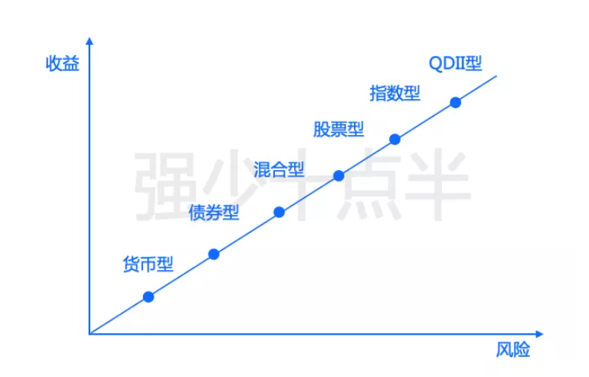
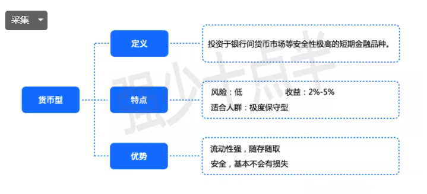
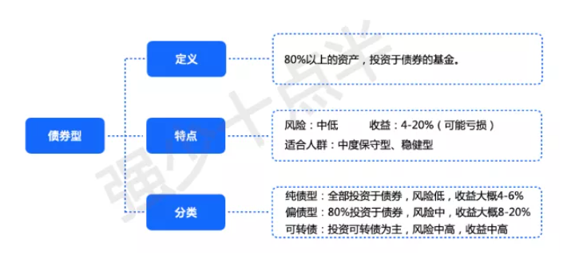
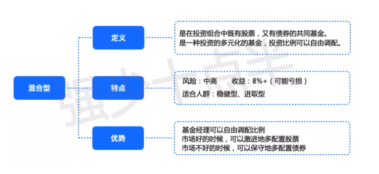
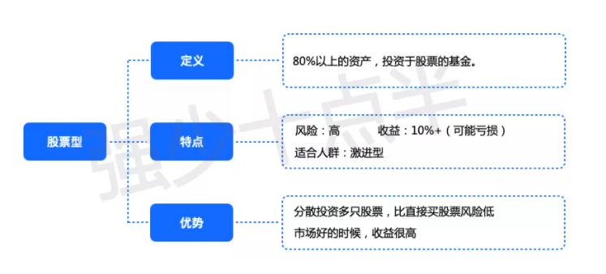
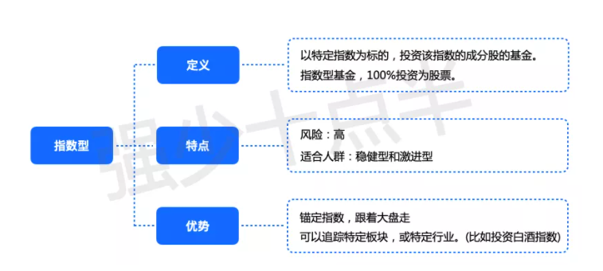
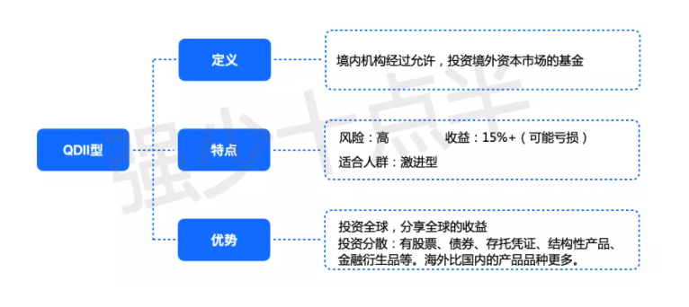
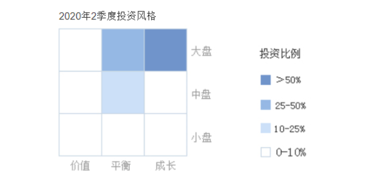

# 基金理财知识

## 一、基金类型

货币型、债券型、混合型、股票型、指数型、ETF型、QDII型。

### 1、货币型

余额宝、微信零钱通以及大部分银行卖的理财型产品，背后实际都是货币型基金。

### 2、债券型（稳中求进）

债券型基金是拿80%以上的资产投资在债券的基金。

比较稳健的资产，安全性很高，但收益有限。

债券型基金是投资了一揽子债券，所以安全系数比单一投资债券更高，适合稳健型投资者。

债券基金分为纯债型、偏债型和可转债。

**纯债型**

只投资债券，不投资其他资产。是债券型里风险最低的。年化收益一般在4-8%之间。

招商产业债券A(217022)，鹏华产业债债券(206018)，是不错的纯债。

 

**偏债型**

80%以上的资产投资于债券，剩下的资产可投资于股票。

因为持有了20%左右的股票，所以风险和收益都会增加。

不要小看偏债型基金，由于有股票加持，在行情好的时候，年化收益也能做到20%+。

比如博时信用债券(050011)去年收益就有19.97%。

 

**可转债**

主要资产投资于可转债，是债券型基金里风险最高的一类。

债券型基金，风险可供，收益稳定，适合作为压仓底的资金，也适合作为避险基金。

债券型基金就是这样，大牛市涨的最多的不是它，它稳固仓位。熊市的时候，各种基金都大跌的时候，他就会很抗跌，帮你保住收益。

### 3、混合型（适合中场，看持股比例）

混合型的资产可以自由配置，可以大部分买股票，也可以大部分买债券。

### 4、股票型

股票型是一种特殊的混合型基金，他必须拿80%以上的资产去配置股票。

### 5、指数型（百分百投资股票，前锋）

上证50指数，沪深300指数，创业板指数。

指数型就是以这些指数的成份股为投资对象的基金。

指数型基金全部投资股票。

指数型基金分主动型和被动型。

被动型，是指基金完全追踪指数，指数上涨下跌多少，他就同步。

主动型，是指在被动追踪的同时，加入基金经理的主观意愿，再去投资一些相关的股票，来优化投资结果，去追求比标准指数收益更高。

ETF，属于特殊的指数基金。它的原理比较复杂，简单的理解就是可以在场内（证券交易市场）和场外（基金交易市场）都可以购买的。而一般基金只能在场外购买。

### 6、QDII型

QDII基金是指在一国境内设立，经该国有关部门批准从事境外证券市场的股票、债券等有价证券业务的证券投资基金。

简单理解，和混合型基金类似，只是全部投资外国的资产。

## 二、如何选择一只基金

### 1、资产配置

看投资比例，如果是百分之八九十都是股票，说明进攻性强，但防守弱

### 2、持仓类型

如果投的是科技类等涨的快、跌的狠的，风险很高

如果投的是消费行业，地产行业这种偏传统的行业就属于涨的稍慢，跌的相对也少，风险较低

### 3、投资风格

**第一、根据公司市值的大小，可以把股票分成大盘股/小盘股。**

小盘股：< 200亿

中盘股：>200  < 500

大盘股： >500

**第二、根据成长性，可以把股票分为价值股和成长股，**

价值股一般属于传统行业，市值较高，赢收稳定，比如说可口可乐，五粮液；

成长股一般是新兴行业，比如人工智能，互联网，同时具备较大的发展潜力。

可以根据晨星九宫格看投资风格

### 4、业绩表现

对于基金的业绩评判，首先在设立之初会有一个比较基准，也就是存在一个和基金业绩比较的对象

比如主要投资大盘股的基金会跟沪深300指数做对比，主要投资债券的基金会跟中债综合指数做对比。

**如果长期业绩能超过比较基准，起码能说这个选手的水平是在平均水准之上的。**

### 5、最大回撤

基金一段时期的最大跌幅叫做最大回撤，这个数字越低说明该选手的防守能力越强。

## 三、什么基金适合定投

通过**长期定期（定额或不定额）**的投资来摊平你的持仓成本，随后在牛市中卖出获利。

### 1、波动率大的基金

波动率小的基金不能分摊成本

**股票为主的基金**

**股票型，偏股混合型基金适用于定投**

#### **1）**不要选择被动型指数基金！

#### 2）**不要选择债券型基金**，要选择波动率大的基金。

 

#### 3）选择**主动管理型基金来搭配指数增强型基金**

### 2、被动型、主动型基金

**被动：**

投资特定的指数基金，跟着市场走。

**追求市场平均回报率**，**不追求通过选股择时获得超额回报**。

**主动：**

基金经理完全根据自己的判断择时选股，投资主动型基金就等于投资基金经理。

## 四、投资策略打法

**选择基金+建立组合+买入时机+合理调仓+止盈止损**

### 1、查询过往业绩

市场上有著名的“4433”理论，百度一下就可以查到。

第一个4，代表近一年收益率排名前1/4的基金；

第二个4，代表近两年、三年、五年以来，收益率排名前1/4的基金；

第三个3，指近6个月收益率排名前1/3的基金；

第四个3，指近三个月以来收益率排名前1/3的基金。

“5个30”理论。

1、 在同类基金里，选出最近6个月业绩前30名的基金；

2、 在同类基金里，选出最近1年业绩前30名的基金。

3、 在同类基金里，选出最近3年业绩前30名的基金。

4、 在同类基金里，选出最近5年业绩前30名的基金。

5、 在同类基金里，选出成立以来业绩前30名的基金。

### 2、选择基金公司

前十名基金公司：

1）天弘、

2）易方达、

3）博时、

4）南方、

5）华夏、

6）汇添富、

7）广发、

8）工银瑞信、

9）嘉实、

10）鹏华。

### 3、选择基金经理

现任基金经理至少要管理这支基金三年以上

这样的基金比较稳定

**好的基金既要在牛市里收益高，更要在熊市里亏损少。**

**管理规模在30~100亿之间**

**回撤率的意思是从高点买入，在到达最低点时，下跌了多少。**

## 五、如何建立组合

应该合理的搭配防守型基金、中场型基金和进攻型的基金。

防守型负责熊市里，少亏损。

进攻型负责牛市里，多赚钱。

而中场型就是承上启下，有时能防守，有时能进攻。

### 1、防守型

主要选债权型基金，偏债和纯债都是可以的。

债券型基金，收益相对股票型较低，但是他的风险也较低。

在熊市里，依然可以表现良好，少亏钱，甚至赚钱。

它就是组合里，非常重要的后防线。

能在熊市里为你保住收益。

### 2、中场型

主要是一些价值型投资的混合&股票基金。

这些基金主要投资一些大盘股、价值股。比如：茅台、中国平安、格力电器这样的公司。

另外大盘的指数基金，也适合做中场。（不是所有的指数基金都适合做中场。）

像沪深300，上证50指数就非常适合做中场，因为他们选的都是大盘股。而像创业板指数、科创50指数、中证500指数，就适合做进攻

中场基金收益性稳定，安全边际高，一般都不会大涨大跌。

他的收益和风险，都是介于防守和进攻之间的。

有非常好的起承转合效果。

### 3、进攻型

高风险高收益的基金。

他负责在行情好的时候，获取超额的收益。

比如科技、5G、医疗、新能源这些产业的基金，都适合做进攻型基金。

在牛市里，他是涨的最凶的。

但要注意，熊市里，他也是跌的最惨的。 

### 4、建立组合

**1）确定中场比重**

中场是整个组合的核心部分，中场好的组合才是攻守兼备的组合。

在大部分的组合里，中场的比重是最大的。

**2）确定进攻比重**

根据个人的风险偏好，来确定放多少比例在进攻。

主要看你能承受多少风险。

进攻型配置的越多，收益越大，风险越大。

**3）确定防守比重**

剩下的就是用来防守。

比如：4：3：3，这个组合就比较稳健，40%的资金买防守，30%资金买中场，30%资金买前锋。

2：4：4，这个组合就比较激进，20%资金买防守，40%资金买中场，40%买进攻。

