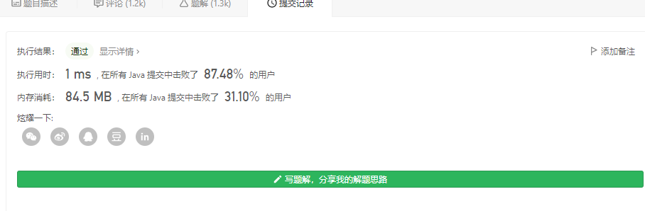

[toc]


# Leetcode题解记录

从 2021年7月4号开始。


## 一、数组

### （1）[两数之和](https://leetcode-cn.com/problems/two-sum/)

给定一个整数数组 nums 和一个整数目标值 target，请你在该数组中找出 和为目标值 target  的那 两个 整数，并返回它们的数组下标。

你可以假设每种输入只会对应一个答案。但是，数组中同一个元素在答案里不能重复出现。

你可以按任意顺序返回答案。

输入：nums = [2,7,11,15], target = 9
输出：[0,1]
解释：因为 nums[0] + nums[1] == 9 ，返回 [0, 1] 。


```java
public int[] twoSum(int[] nums, int target) {
        int[] result = null;

        Map<Integer, Integer> value2Index = new HashMap<>();

        for (int i = 0; i < nums.length; i++) {
            if (value2Index.get(target-nums[i]) != null) {
                result = new int[]{i,value2Index.get(target-nums[i])};
                break;
            }
            value2Index.put(nums[i],i);
        }
        return result;
    }
```


### （2）[三数之和 ](https://leetcode-cn.com/problems/3sum/)

给你一个包含 n 个整数的数组 nums，判断 nums 中是否存在三个元素 a，b，c ，使得 a + b + c = 0 ？请你找出所有和为 0 且不重复的三元组。

注意：答案中不可以包含重复的三元组。

示例 1：

输入：nums = [-1,0,1,2,-1,-4]
输出：[[-1,-1,2],[-1,0,1]]
示例 2：

输入：nums = []
输出：[]
示例 3：

输入：nums = [0]
输出：[]


```java
public List<List<Integer>> threeSum(int[] nums) {
        Arrays.sort(nums);

        List<List<Integer>> result = new ArrayList<>();

        int len = nums.length;

        if (len < 3) {
            return result;
        }

        for (int i = 0; i < len; i++) {
            if (nums[i]>0) {
                continue;
            }
            if(i > 0 && nums[i] == nums[i-1]) continue;
            int start = i+1;
            int end = len - 1;
            while (start<end) {
                int tem = nums[start] + nums[end];
                if (tem > -nums[i]) {
                    end--;
                } else if (tem < -nums[i]) {
                    start++;
                } else {
                    while (start<len-1 && nums[start]==nums[start+1]) start++;
                    while (end> start && nums[end]==nums[end-1]) end--;
                    ArrayList<Integer> subResult = new ArrayList<>();
                    subResult.add(nums[i]);
                    subResult.add(nums[start++]);
                    subResult.add(nums[end--]);
                        result.add(subResult);
                }
            }
        }

        return result;
    }
```


### （3）[多数元素](https://leetcode-cn.com/problems/majority-element/)

给定一个大小为 n 的数组，找到其中的多数元素。多数元素是指在数组中出现次数 大于 ⌊ n/2 ⌋ 的元素。

你可以假设数组是非空的，并且给定的数组总是存在多数元素。

**示例 1：**

```
输入：[3,2,3]
输出：3
```


1、哈希法

```java
public int majorityElement(int[] nums) {

        int len = nums.length;
        int moreLen = len / 2 ;
        int result = nums[0];

        Map<Integer, Integer> tmpMap = new HashMap<>();

        for (int i = 0; i < len; i++) {
            if (tmpMap.get(nums[i]) != null) {
                tmpMap.put(nums[i], tmpMap.get(nums[i])+ 1 );
            } else {
                tmpMap.put(nums[i],1);
            }
            if (tmpMap.get(nums[i])>moreLen) {
                result = nums[i];
                break;
            }

        }

        return result;
    }
```


2、排序法

如果将数组 nums 中的所有元素按照单调递增或单调递减的顺序排序，那么下标为n/2 的元素（下标从 0 开始）一定是众数。

```java
public int majorityElement(int[] nums) {
        Arrays.sort(nums);
        return nums[nums.length / 2];
    }
```


3、摩尔投票法

候选人(cand_num)初始化为nums[0]，票数count初始化为1。
当遇到与cand_num相同的数，则票数count = count + 1，否则票数count = count - 1。
当票数count为0时，更换候选人，并将票数count重置为1。
遍历完数组后，cand_num即为最终答案。

为何这行得通呢？
投票法是遇到相同的则票数 + 1，遇到不同的则票数 - 1。
且“多数元素”的个数> ⌊ n/2 ⌋，其余元素的个数总和<= ⌊ n/2 ⌋。
因此“多数元素”的个数 - 其余元素的个数总和 的结果 肯定 >= 1。
这就相当于每个“多数元素”和其他元素 两两相互抵消，抵消到最后肯定还剩余至少1个“多数元素”。

无论数组是1 2 1 2 1，亦或是1 2 2 1 1，总能得到正确的候选人。

```java
class Solution {
    public int majorityElement(int[] nums) {
        int cand_num = nums[0], count = 1;
        for (int i = 1; i < nums.length; ++i) {
            if (cand_num == nums[i])
                ++count;
            else if (--count == 0) {
                cand_num = nums[i];
                count = 1;
            }
        }
        return cand_num;
    }
}
```


### （4）[求缺失的第一个正数](https://leetcode-cn.com/problems/first-missing-positive/)

给你一个未排序的整数数组 nums ，请你找出其中没有出现的最小的正整数。

请你实现时间复杂度为 O(n) 并且只使用常数级别额外空间的解决方案。


示例 1：

输入：nums = [1,2,0]
输出：3
示例 2：

输入：nums = [3,4,-1,1]
输出：2
示例 3：

输入：nums = [7,8,9,11,12]
输出：1

**提示：**

- `1 <= nums.length <= 5 * 10^5`
- `-231 <= nums[i] <= 231 - 1`


（1）布隆过滤器

既然数组长度最长是5*10^5，那么直接定义一个char数组，长度就是5\*10^5

```java
public static int firstMissingPositive(int[] nums) {
        int maxVAlue = nums[0];
        char[] blChar = new char[500000];
        for (int i = 0; i < nums.length; i++) {
            maxVAlue = Math.max(nums[i],maxVAlue);
            if (nums[i]<=0 || nums[i]>=500000) {
                continue;
            }
            blChar[nums[i]-1] = 1;
        }
        if (maxVAlue<=0) {
            return 1;
        }
        for (int i = 0; i < blChar.length; i++) {
            if (blChar[i] != 1) {
                return i+1;
            }
        }
        return maxVAlue+1;
    }
```


（2）原地哈希

将数组视为哈希表

- 由于题目要求我们「只能使用常数级别的空间」，而要找的数一定在 [1, N + 1] 左闭右闭（这里 N 是数组的长度）这个区间里。因此，我们可以就把原始的数组当做哈希表来使用。事实上，哈希表其实本身也是一个数组；
  我们要找的数就在 [1, N + 1] 里，最后 N + 1 这个元素我们不用找。因为在前面的 N 个元素都找不到的情况下，我们才返回 N + 1；
- 那么，我们可以采取这样的思路：就把 11 这个数放到下标为 00 的位置， 22 这个数放到下标为 11 的位置，按照这种思路整理一遍数组。然后我们再遍历一次数组，第 11 个遇到的它的值不等于下标的那个数，就是我们要找的缺失的第一个正数。
- 这个思想就相当于我们自己编写哈希函数，这个哈希函数的规则特别简单，那就是数值为 i 的数映射到下标为 i - 1 的位置。


```java
public class Solution {

    public int firstMissingPositive(int[] nums) {
        int len = nums.length;

        for (int i = 0; i < len; i++) {
            while (nums[i] > 0 && nums[i] <= len && nums[nums[i] - 1] != nums[i]) {
                // 满足在指定范围内、并且没有放在正确的位置上，才交换
                // 例如：数值 3 应该放在索引 2 的位置上
                swap(nums, nums[i] - 1, i);
            }
        }

        // [1, -1, 3, 4]
        for (int i = 0; i < len; i++) {
            if (nums[i] != i + 1) {
                return i + 1;
            }
        }
        // 都正确则返回数组长度 + 1
        return len + 1;
    }

    private void swap(int[] nums, int index1, int index2) {
        int temp = nums[index1];
        nums[index1] = nums[index2];
        nums[index2] = temp;
    }
}
```




### （5）[把数组中的 0 移到末尾](https://leetcode-cn.com/problems/move-zeroes/)

给定一个数组 `nums`，编写一个函数将所有 `0` 移动到数组的末尾，同时保持非零元素的相对顺序。

**示例:**

```
输入: [0,1,0,3,12]
输出: [1,3,12,0,0]
```

```java
public void moveZeroes(int[] nums) {
        int len = nums.length;

        for (int i = 0; i < len; i++) {
            int curNum = nums[i];
            if (curNum != 0) {
                continue;
            }
            for (int j = i+1; j < len; j++) {
                if (nums[j] != 0) {
                    int tem = nums[j];
                    nums[j] = curNum;
                    nums[i] = tem;
                    break;
                }
            }
        }   
    }
```


```java
public void moveZeroes(int[] nums) {

        if(nums==null) {
			return;
		}
		//第一次遍历的时候，j指针记录非0的个数，只要是非0的统统都赋给nums[j]
		int j = 0;
		for(int i=0;i<nums.length;++i) {
			if(nums[i]!=0) {
				nums[j++] = nums[i];
			}
		}
		//非0元素统计完了，剩下的都是0了
		//所以第二次遍历把末尾的元素都赋为0即可
		for(int i=j;i<nums.length;++i) {
			nums[i] = 0;
		}

    }
```


**一次遍历：**

这里参考了快速排序的思想，快速排序首先要确定一个待分割的元素做中间点x，然后把所有小于等于x的元素放到x的左边，大于x的元素放到其右边。
这里我们可以用0当做这个中间点，把不等于0(注意题目没说不能有负数)的放到中间点的左边，等于0的放到其右边。
这的中间点就是0本身，所以实现起来比快速排序简单很多，我们使用两个指针i和j，只要nums[i]!=0，我们就交换nums[i]和nums[j]

```java
public void moveZeroes(int[] nums) {
		if(nums==null) {
			return;
		}
		//两个指针i和j
		int j = 0;
		for(int i=0;i<nums.length;i++) {
			//当前元素!=0，就把其交换到左边，等于0的交换到右边
			if(nums[i]!=0) {
				int tmp = nums[i];
				nums[i] = nums[j];
				nums[j++] = tmp;
			}
		}
	}
```


### （6）[改变矩阵维度](https://leetcode-cn.com/problems/reshape-the-matrix/)

在MATLAB中，有一个非常有用的函数 reshape，它可以将一个矩阵重塑为另一个大小不同的新矩阵，但保留其原始数据。

给出一个由二维数组表示的矩阵，以及两个正整数r和c，分别表示想要的重构的矩阵的行数和列数。

重构后的矩阵需要将原始矩阵的所有元素以相同的行遍历顺序填充。

如果具有给定参数的reshape操作是可行且合理的，则输出新的重塑矩阵；否则，输出原始矩阵。

示例 1:

```
输入: 
nums = 
[[1,2],
 [3,4]]
r = 1, c = 4
输出: 
[[1,2,3,4]]
解释:
行遍历nums的结果是 [1,2,3,4]。新的矩阵是 1 * 4 矩阵, 用之前的元素值一行一行填充新矩阵。
```

示例 2:

```
输入: 
nums = 
[[1,2],
 [3,4]]
r = 2, c = 4
输出: 
[[1,2],
 [3,4]]
解释:
没有办法将 2 * 2 矩阵转化为 2 * 4 矩阵。 所以输出原矩阵。
```


**注意：**

​	给定矩阵的宽和高范围在 [1, 100]。
​	给定的 r 和 c 都是正数。


```java
class Solution {
    public int[][] matrixReshape(int[][] mat, int r, int c) {
        int row = mat.length;
        int len = mat[0].length;
        
        if (row*len != r*c) {
            return mat;
        }
        
        int [][]result = new int[r][c];
        int index = 0;

        for (int i = 0; i < row; i++) {
            for (int j = 0; j < len; j++) {
                int newR = index / c;
                int newL = index % c;
                result[newR][newL] = mat[i][j];
                index++;
            }
        }
        
        return result;
    }
}
```


### （7）[找出数组中最长的连续 1](https://leetcode-cn.com/problems/max-consecutive-ones/)

给定一个二进制数组， 计算其中最大连续 1 的个数。

示例：

```
输入：[1,1,0,1,1,1]
输出：3
解释：开头的两位和最后的三位都是连续 1 ，所以最大连续 1 的个数是 3.
```


提示：

输入的数组只包含 0 和 1 。
输入数组的长度是正整数，且不超过 10,000。

```java
public static int findMaxConsecutiveOnes(int[] nums) {
        int result = 0;
        int tmp = 0;
        for (int i = 0; i < nums.length; i++) {
            if (nums[i] == 1) {
                tmp++;
            } else {
                tmp = 0;
            }
            result = Math.max(tmp,result);
        }
        return result;
    }
```


**双指针解法：**

```java
public int findMaxConsecutiveOnes(int[] nums) {
        int n = nums.length, res = 0;
        for (int i = 0; i < n; i++) {
            int j = i;
            while (j < n && nums[j] == 1) j++;
            res = Math.max(res, j - i);
            i = j;
        }
        return res;
    }
```


### （8）[有序矩阵查找](https://leetcode-cn.com/problems/search-a-2d-matrix/)

编写一个高效的算法来判断 m x n 矩阵中，是否存在一个目标值。该矩阵具有如下特性：

每行中的整数从左到右按升序排列。
每行的第一个整数大于前一行的最后一个整数。


示例 1：

```
输入：matrix = [[1,3,5,7],[10,11,16,20],[23,30,34,60]], target = 3
输出：true
```

```java
public static boolean searchMatrix(int[][] matrix, int target) {
        int row = matrix.length;
        int len = matrix[0].length;

        int min = matrix[0][0];
        int max = matrix[row-1][len-1];

        if (target< min || target>max) {
            return false;
        }
        if (target == min || target == max) {
            return true;
        }

        int[] temRow = new int[row];
        for (int i = 0; i < row; i++) {
            temRow[i] = matrix[i][0];
        }


        int start = 0,end = row-1;

        int targetRow = 0;

        while (start<end) {
            int mid = start + (end-start)/2;
            if (target<temRow[mid]) {
                end = mid-1;
                targetRow = mid -1;
            } else if (target>temRow[mid]) {
                if (mid<row-1 && target<temRow[mid+1]) {
                    targetRow = mid;
                    break;
                } else {
                    start = mid+1;
                    targetRow = mid < row-1 ? mid+1:mid;
                }
            } else {
                return true;
            }
        }
        if (start == end) {
            targetRow = start;
        }

        int[] temLen = new int[len];
        for (int i = 0; i < len; i++) {
            temLen[i] = matrix[targetRow][i];
        }

        start = 0;
        end = len -1;
        while (start<=end) {
            int mid = start + (end-start)/2;
            if (target<temLen[mid]) {
                end = mid-1;
            } else if (target> temLen[mid]) {
                start = mid+1;
            } else {
                return true;
            }
        }

        if (start == end && temLen[start] == target) {
            return true;
        }

        return false;
    }
```


```java
public static boolean searchMatrix(int[][] matrix, int target) {
        int m = matrix.length;
        int n = matrix[0].length;

        int l = 0;
        int r = m - 1;
        while (l < r) {
            int mid = l + r + 1 >> 1;
            if (matrix[mid][0] <= target) {
                l = mid;
            } else {
                r = mid - 1;
            }
        }

        int row = r;
        if (matrix[row][0] == target)
            return true;
        if (matrix[row][0] > target)
            return false;

        l = 0;
        r = n - 1;
        while (l < r) {
            int mid = l + r + 1 >> 1;
            if (matrix[row][mid] <= target) {
                l = mid;
            } else {
                r = mid - 1;
            }
        }
        int col = r;

        return matrix[row][col] == target;
    }
```


**一次二分查找：**

若将矩阵每一行拼接在上一行的末尾，则会得到一个升序数组，我们可以在该数组上二分找到目标元素。

代码实现时，可以二分升序数组的下标，将其映射到原矩阵的行和列上。

```java
class Solution {
    public boolean searchMatrix(int[][] matrix, int target) {
        int m = matrix.length, n = matrix[0].length;
        int low = 0, high = m * n - 1;
        while (low <= high) {
            int mid = (high - low) / 2 + low;
            int x = matrix[mid / n][mid % n];
            if (x < target) {
                low = mid + 1;
            } else if (x > target) {
                high = mid - 1;
            } else {
                return true;
            }
        }
        return false;
    }
}
```


### （9）[有序矩阵的 Kth Element](https://leetcode-cn.com/problems/kth-smallest-element-in-a-sorted-matrix/)

给你一个 n x n 矩阵 matrix ，其中每行和每列元素均按升序排序，找到矩阵中第 k 小的元素。
请注意，它是 排序后 的第 k 小元素，而不是第 k 个 不同 的元素。

示例 1：

```
输入：matrix = [[1,5,9],[10,11,13],[12,13,15]], k = 8
输出：13
解释：矩阵中的元素为 [1,5,9,10,11,12,13,13,15]，第 8 小元素是 13
```


示例 2：

```
输入：matrix = [[-5]], k = 1
输出：-5
```


提示：

```
n == matrix.length
n == matrix[i].length
1 <= n <= 300
-109 <= matrix[i][j] <= 109
题目数据 保证 matrix 中的所有行和列都按 非递减顺序 排列
1 <= k <= n2
```


**二分法：**

思路非常简单：

- 找出二维矩阵中最小的数 leftleft，最大的数 right，那么第 k 小的数必定在 left~ right 之间
  mid=(left+right) / 2；
- 在二维矩阵中寻找小于等于 mid 的元素个数 count，若这个 count 小于 k，表明第 k 小的数在右半部分且不包含 mid，即 left=mid+1, right=right，又保证了第 k 小的数在 left~ right 之间
- 若这个 count大于 k，表明第 k 小的数在左半部分且可能包含 mid，即 left=left, right=mid，又保证了第 k 小的数在 left~right 之间
- 因为每次循环中都保证了第 k 小的数在 left~ right之间，当 left==right时，第 k 小的数即被找出，等于 right

```java
 public int kthSmallest(int[][] matrix, int k) {
        int row = matrix.length;
        int col = matrix[0].length;
        int left = matrix[0][0];
        int right = matrix[row - 1][col - 1];
        while (left < right) {
            // 每次循环都保证第K小的数在start~end之间，当start==end，第k小的数就是start
            int mid = (left + right) / 2;
            // 找二维矩阵中<=mid的元素总个数
            int count = findNotBiggerThanMid(matrix, mid, row, col);
            if (count < k) {
                // 第k小的数在右半部分，且不包含mid
                left = mid + 1;
            } else {
                // 第k小的数在左半部分，可能包含mid
                right = mid;
            }
        }
        return right;
    }

    private int findNotBiggerThanMid(int[][] matrix, int mid, int row, int col) {
        // 以列为单位找，找到每一列最后一个<=mid的数即知道每一列有多少个数<=mid
        int i = row - 1;
        int j = 0;
        int count = 0;
        while (i >= 0 && j < col) {
            if (matrix[i][j] <= mid) {
                // 第j列有i+1个元素<=mid
                count += i + 1;
                j++;
            } else {
                // 第j列目前的数大于mid，需要继续在当前列往上找
                i--;
            }
        }
        return count;
    }
```


**最小堆法：**

使用优先级队列

```java
public int kthSmallest(int[][] matrix, int k) {

        PriorityQueue<Integer> queue = new PriorityQueue<>(k);

        int n = matrix.length;

        for (int i = 0; i < n; i++) {
            for (int j = 0; j < n; j++) {
                queue.offer(matrix[i][j]);
            }
        }
        int i = 0;
        int result = queue.peek();
        while (!queue.isEmpty()) {
            i++;
            Integer poll = queue.poll();
            if (i == k) {
                result = poll;
            }
        }

        return result;
    }
```


### （10）[一个数组元素在 [1, n] 之间，其中一个数被替换为另一个数，找出重复的数和丢失的数](https://leetcode-cn.com/problems/set-mismatch/description/?utm_source=LCUS&utm_medium=ip_redirect&utm_campaign=transfer2china)

### （11）[找出数组中重复的数，数组值在 [1, n] 之间](https://leetcode-cn.com/problems/find-the-duplicate-number/)

给定一个包含 n + 1 个整数的数组 nums ，其数字都在 1 到 n 之间（包括 1 和 n），可知至少存在一个重复的整数。

假设 nums 只有 一个重复的整数 ，找出 这个重复的数 。

你设计的解决方案必须不修改数组 nums 且只用常量级 O(1) 的额外空间。

 

示例 1：

```
输入：nums = [1,3,4,2,2]
输出：2
```

提示：

```
1 <= n <= 10^5
nums.length == n + 1
1 <= nums[i] <= n
nums 中 只有一个整数 出现 两次或多次 ，其余整数均只出现 一次
```

**暴力解法：**

```java
public int findDuplicate(int[] nums) {
        Set<Integer> temSet = new HashSet<>();

        for (int i = 0; i < nums.length; i++) {
            if (!temSet.add(nums[i])) {
                return nums[i];
            }
        }
        return nums[0];
    }
```


```java
public int findDuplicate(int[] nums) {
        char[] temChar = new char[nums.length+1];
        for (int i=0;i<nums.length;i++) {
            if (temChar[nums[i]] == 1) {
                return nums[i];
            } else {
                temChar[nums[i]] = 1;
            }
        }
        throw new RuntimeException();
    }
```


**快慢指针：**

快慢指针：fast 和 slow。nums[slow] 表示取慢指针对应的元素。 注意 nums 数组中的数字都是在 1 到 n 之间的(在数组中进行游走不会越界)，因为有重复数字的出现，所以这个游走必然是成环的，环的入口就是重复的元素，即按照寻找链表环入口的思路来做。

fast 指针一次走两步，slow 指针一次走一步，若 nums 数组中有重复的数，即有环存在，则 fast 和 slow 指针一定会相遇。

当 fast 和 slow 指针相遇时，令 fast 指针重新指向 nums 数组的开头，即 fast = 0，然后 fast 指针和 slow 指针均变为为一次只走一步，当 nums[slow] 和 nums[fast] 相等时，则找到了重复的整数，返回 nums[slow] 即可。

链表中：慢指针 slow = slow.next；快指针 fast = fast.next.next

数组中：慢指针 slow = nums[slow]；快指针 fast = nums[nums[fast]]，因为 nums 中的元素值都在 11 到 nn 之间（包括 11 和 nn），所以这样不会造成数组越界问题。

```java
class Solution {

    public int findDuplicate(int[] nums) {
        
        int fast = 0, slow = 0;
        while (true) {

            slow = nums[slow];
            fast = nums[nums[fast]];
            if (slow == fast) {

                fast = 0;
                while (nums[slow] != nums[fast]) {

                    slow = nums[slow];
                    fast = nums[fast];
                }
                return nums[slow];
            }
        }
    }
}
```


**二分查找解法：**


二分查找的思路是先猜一个数（有效范围 [left..right] 里位于中间的数 mid），然后统计原始数组中 小于等于 mid 的元素的个数 cnt：

如果 cnt 严格大于 mid。根据抽屉原理，重复元素就在区间 [left..mid] 里；
否则，重复元素就在区间 [mid + 1..right] 里。

```java
public int findDuplicate(int[] nums) {
     int l = 1, h = nums.length - 1;
     while (l <= h) {
         int mid = l + (h - l) / 2;
         int cnt = 0;
         for (int i = 0; i < nums.length; i++) {
             if (nums[i] <= mid) cnt++;
         }
         if (cnt > mid) h = mid - 1;
         else l = mid + 1;
     }
     return l;
}
```


### （12）[数组相邻差值的个数](github/Leetcode 题解 数组与矩阵.md#8-数组相邻差值的个数)

### （13）[数组的度](github/Leetcode 题解 数组与矩阵.md#9-数组的度)

### （14）[对角元素相等的矩阵](github/Leetcode 题解 数组与矩阵.md#10-对角元素相等的矩阵)

### （15）[嵌套数组](github/Leetcode 题解 数组与矩阵.md#11-嵌套数组)

### （16）[分隔数组](github/Leetcode 题解 数组与矩阵.md#12-分隔数组)


## 二、链表


### （1）[环形链表](https://leetcode-cn.com/problems/linked-list-cycle/)

给定一个链表，判断链表中是否有环。

如果链表中有某个节点，可以通过连续跟踪 next 指针再次到达，则链表中存在环。 为了表示给定链表中的环，我们使用整数 pos 来表示链表尾连接到链表中的位置（索引从 0 开始）。 如果 pos 是 -1，则在该链表中没有环。注意：pos 不作为参数进行传递，仅仅是为了标识链表的实际情况。

如果链表中存在环，则返回 true 。 否则，返回 false 。

进阶：

你能用 O(1)（即，常量）内存解决此问题吗？

示例 1：

```
输入：head = [3,2,0,-4], pos = 1
输出：true
解释：链表中有一个环，其尾部连接到第二个节点。
```


**暴力破解：** 

```java
 public boolean hasCycle(ListNode head) {
        Set<ListNode> temSet = new HashSet<>();
        
        while (head != null) {
            if (!temSet.add(head)) {
                return true;
            }
            head = head.next;
        }
        
        return false;
    }
```


**双指针：**

```java
public boolean hasCycle(ListNode head) {
        if (head == null || head.next == null) {
            return false;
        }
        ListNode slow = head;
        ListNode fast = head.next;
        while (slow != fast) {
            if (fast == null || fast.next == null) {
                return false;
            }
            slow = slow.next;
            fast = fast.next.next;
        }
        return true;
    }
```


### （2）[合并 k 个排序链表](https://leetcode-cn.com/problems/merge-k-sorted-lists/)

给你一个链表数组，每个链表都已经按升序排列。

请你将所有链表合并到一个升序链表中，返回合并后的链表。

 

示例 1：

```
输入：lists = [[1,4,5],[1,3,4],[2,6]]
输出：[1,1,2,3,4,4,5,6]
解释：链表数组如下：
[
  1->4->5,
  1->3->4,
  2->6
]
将它们合并到一个有序链表中得到。
1->1->2->3->4->4->5->6
```


示例 2：

```
输入：lists = []
输出：[]
```


示例 3：

```
输入：lists = [[]]
输出：[]
```

 

提示：

```
k == lists.length
0 <= k <= 10^4
0 <= lists[i].length <= 500
-10^4 <= lists[i][j] <= 10^4
lists[i] 按 升序 排列
lists[i].length 的总和不超过 10^4
```


**优先级队列：**

```java
public ListNode mergeKLists(ListNode[] lists) {
        if (lists == null || lists.length == 0) return null;
        PriorityQueue<ListNode> queue = new PriorityQueue<>(lists.length, new Comparator<ListNode>() {
            @Override
            public int compare(ListNode o1, ListNode o2) {
                if (o1.val < o2.val) return -1;
                else if (o1.val == o2.val) return 0;
                else return 1;
            }
        });
        ListNode dummy = new ListNode(0);
        ListNode p = dummy;
        for (ListNode node : lists) {
            if (node != null) queue.add(node);
        }
        while (!queue.isEmpty()) {
            p.next = queue.poll();
            p = p.next;
            if (p.next != null) queue.add(p.next);
        }
        return dummy.next;


    }
```


**分治法：**

```java
 public ListNode mergeKLists(ListNode[] lists) {
        if (lists == null || lists.length == 0) return null;
        return merge(lists, 0, lists.length - 1);
    }

    private ListNode merge(ListNode[] lists, int left, int right) {
        if (left == right) return lists[left];
        int mid = left + (right - left) / 2;
        ListNode l1 = merge(lists, left, mid);
        ListNode l2 = merge(lists, mid + 1, right);
        return mergeTwoLists(l1, l2);
    }

    private ListNode mergeTwoLists(ListNode l1, ListNode l2) {
        if (l1 == null) return l2;
        if (l2 == null) return l1;
        if (l1.val < l2.val) {
            l1.next = mergeTwoLists(l1.next, l2);
            return l1;
        } else {
            l2.next = mergeTwoLists(l1,l2.next);
            return l2;
        }
    }
```


### （3）[单链表反转](https://leetcode-cn.com/problems/reverse-linked-list/)

给你单链表的头节点 `head` ，请你反转链表，并返回反转后的链表。

**示例 1：**

```
输入：head = [1,2,3,4,5]
输出：[5,4,3,2,1]
```

**示例 2：**

```
输入：head = [1,2]
输出：[2,1]
```


**提示：**

- 链表中节点的数目范围是 `[0, 5000]`
- `-5000 <= Node.val <= 5000`


**递归求解：**

一直递归，直至最后一个节点。

然后上一个节点的下下节点置为自身

下个节点置为空。

- 使用递归函数，一直递归到链表的最后一个结点，该结点就是反转后的头结点，记作 retret .
- 此后，每次函数在返回的过程中，让当前结点的下一个结点的 nextnext 指针指向当前节点。
- 同时让当前结点的 nextnext 指针指向 NULLNULL ，从而实现从链表尾部开始的局部反转
- 当递归函数全部出栈后，链表反转完成。


```java
public ListNode reverseList(ListNode head) {
        if (head == null || head.next == null) {
            return head;
        }
        
        ListNode result = reverseList(head.next);
        head.next.next = head;
        head.next = null;
        return result;
    }
```


**非递归求解：**

```java
 public ListNode reverseList(ListNode head) {
        if (head == null || head.next == null) {
            return head;
        }

        ListNode pre = null;
        ListNode mid = head;
        ListNode back = head.next;

        while (back != null) {
            ListNode next = back.next;
            mid.next = pre;
            back.next = mid;
            if (next == null) {
                break;
            }

            pre = mid;
            mid = back;
            back = next;
        }

        return back;
    }
```


- 定义两个指针： prepre 和 curcur ；prepre 在前 curcur 在后。
- 每次让 prepre 的 nextnext 指向 curcur ，实现一次局部反转
- 局部反转完成之后，prepre 和 curcur 同时往前移动一个位置
- 循环上述过程，直至 prepre 到达链表尾部

```java
public ListNode reverseList(ListNode head) {
        ListNode prev = null;
        ListNode curr = head;
        while (curr != null) {
            ListNode nextTemp = curr.next;
            curr.next = prev;
            prev = curr;
            curr = nextTemp;
        }
        return prev;
    }
```


### （4）[求链表的中间结点](https://leetcode-cn.com/problems/middle-of-the-linked-list/)

给定一个头结点为 head 的非空单链表，返回链表的中间结点。

如果有两个中间结点，则返回第二个中间结点。

 

示例 1：

```
输入：[1,2,3,4,5]
输出：此列表中的结点 3 (序列化形式：[3,4,5])
返回的结点值为 3 。 (测评系统对该结点序列化表述是 [3,4,5])。
注意，我们返回了一个 ListNode 类型的对象 ans，这样：
ans.val = 3, ans.next.val = 4, ans.next.next.val = 5, 以及 ans.next.next.next = NULL.
```


示例 2：

```
输入：[1,2,3,4,5,6]
输出：此列表中的结点 4 (序列化形式：[4,5,6])
由于该列表有两个中间结点，值分别为 3 和 4，我们返回第二个结点。
```


**双指针：**

使用两个指针变量，刚开始都位于链表的第 1 个结点，一个永远一次只走 1 步，一个永远一次只走 2 步，一个在前，一个在后，同时走。这样当快指针走完的时候，慢指针就来到了链表的中间位置。

```java
public ListNode middleNode(ListNode head) {
        if (head == null || head.next == null) {
            return head;
        }
        
        ListNode slow = head;
        ListNode fast = head.next;
        
        while (fast != null && fast.next != null) {
            slow = slow.next;
            fast = fast.next.next;
        }
        if (fast != null && fast.next == null) { //处理偶数节点的情况，如果是节点数量是单数，那么最后fast==null
            slow = slow.next;
        }
        
        return slow;
    }
```


```java
public ListNode middleNode(ListNode head) {
        if (head == null || head.next == null) {
            return head;
        }
        
        ListNode slow = head;
        ListNode fast = head;
        
        while (fast != null && fast.next != null) {
            slow = slow.next;
            fast = fast.next.next;
        }
        
        return slow;
    }
```


### （5）[找出两个链表的交点](https://leetcode-cn.com/problems/intersection-of-two-linked-lists/)

给你两个单链表的头节点 headA 和 headB ，请你找出并返回两个单链表相交的起始节点。如果两个链表没有交点，返回 null 。

示例 1：

```
输入：intersectVal = 8, listA = [4,1,8,4,5], listB = [5,0,1,8,4,5], skipA = 2, skipB = 3
输出：Intersected at '8'
解释：相交节点的值为 8 （注意，如果两个链表相交则不能为 0）。
从各自的表头开始算起，链表 A 为 [4,1,8,4,5]，链表 B 为 [5,0,1,8,4,5]。
在 A 中，相交节点前有 2 个节点；在 B 中，相交节点前有 3 个节点
```


**hash法：**

```java
public ListNode getIntersectionNode(ListNode headA, ListNode headB) {
        Set<ListNode> temMap = new HashSet<>();

        while (headA != null) {
            temMap.add(headA);
            headA = headA.next;
        }
        while (headB != null) {
            if (!temMap.add(headB)) {
                return headB;
            }
            headB = headB.next;
        }
        return null;
    }
```


设 A 的长度为 a + c，B 的长度为 b + c，其中 c 为尾部公共部分长度，可知 a + c + b = b + c + a。

当访问 A 链表的指针访问到链表尾部时，令它从链表 B 的头部开始访问链表 B；同样地，当访问 B 链表的指针访问到链表尾部时，令它从链表 A 的头部开始访问链表 A。这样就能控制访问 A 和 B 两个链表的指针能同时访问到交点。

如果不存在交点，那么 a + b = b + a，以下实现代码中 l1 和 l2 会同时为 null，从而退出循环。


如果只是判断是否存在交点，那么就是另一个问题，即 [编程之美 3.6]() 的问题。有两种解法：

- 把第一个链表的结尾连接到第二个链表的开头，看第二个链表是否存在环；
- 或者直接比较两个链表的最后一个节点是否相同。

```java
public ListNode getIntersectionNode(ListNode headA, ListNode headB) {
    ListNode l1 = headA, l2 = headB;
    while (l1 != l2) {
        l1 = (l1 == null) ? headB : l1.next;
        l2 = (l2 == null) ? headA : l2.next;
    }
    return l1;
}
```


### （7）[归并两个有序的链表](https://leetcode-cn.com/problems/merge-two-sorted-lists/)

将两个升序链表合并为一个新的 升序 链表并返回。新链表是通过拼接给定的两个链表的所有节点组成的。 

 

示例 1：

```
输入：l1 = [1,2,4], l2 = [1,3,4]
输出：[1,1,2,3,4,4]
```


示例 2：

```
输入：l1 = [], l2 = []
输出：[]
```


示例 3：

```
输入：l1 = [], l2 = [0]
输出：[0]
```


**归并排序：**

```java
 public ListNode mergeTwoLists(ListNode l1, ListNode l2) {
        ListNode result = new ListNode();
        ListNode temRes = result;

        while (l1 != null && l2!=null) {
            if (l1.val<=l2.val) {
                temRes.next = l1;
                l1 = l1.next;
            } else {
                temRes.next = l2;
                l2 = l2.next;
            }
            temRes = temRes.next;
        }

        while (l1 != null) {
            temRes.next = l1;
            l1 = l1.next;
            temRes = temRes.next;
        }

        while (l2 != null) {
            temRes.next = l2;
            l2 = l2.next;
            temRes = temRes.next;
        }
        
        return result.next;
    }
```


**递归：**

思路

我们可以如下递归地定义两个链表里的 merge 操作（忽略边界情况，比如空链表等）：


 也就是说，两个链表头部值较小的一个节点与剩下元素的 `merge` 操作结果合并。

```java
public ListNode mergeTwoLists(ListNode l1, ListNode l2) {
        if (l1 == null) {
            return l2;
        } else if (l2 == null) {
            return l1;
        } else if (l1.val < l2.val) {
            l1.next = mergeTwoLists(l1.next, l2);
            return l1;
        } else {
            l2.next = mergeTwoLists(l1, l2.next);
            return l2;
        }
    }
```


### （8）[从有序链表中删除重复节点](https://leetcode-cn.com/problems/remove-duplicates-from-sorted-list/)

存在一个按升序排列的链表，给你这个链表的头节点 head ，请你删除所有重复的元素，使每个元素 只出现一次 。

返回同样按升序排列的结果链表。

示例 1：

```
输入：head = [1,1,2]
输出：[1,2]
```


如果当前元素跟下一个元素相等，那么删除下一个元素，直接更新指针，当前元素的下一个元素为当前元素的下下个元素。

```java
public ListNode deleteDuplicates(ListNode head) {
        if (head == null || head.next == null) {
            return head;
        }

        ListNode result = head;

        while (head != null && head.next != null) {
            if (head.val == head.next.val) {
                head.next = head.next.next;
            } else {
                head = head.next;
            }
        }

        return result;
    }
```


### （9）[删除链表的倒数第 n 个节点](https://leetcode-cn.com/problems/remove-nth-node-from-end-of-list/)

给你一个链表，删除链表的倒数第 n 个结点，并且返回链表的头结点。

进阶：你能尝试使用一趟扫描实现吗？

示例 1：

```
输入：head = [1,2,3,4,5], n = 2
输出：[1,2,3,5]
```


示例 2：

```
输入：head = [1], n = 1
输出：[]
```


示例 3：

```
输入：head = [1,2], n = 1
输出：[1]
```


**快慢指针：**

先加一个前置指针，不加的话如果n刚好等于链表的长度，会求解失败，

然后用快慢指针，

快指针先走n步，然后快慢指针一步一步走，等快指针到尾部时候，慢指针的下一个节点就是倒数第n个节点。

然后删除倒数第n个节点

```java
slow.next = slow.next.next;
```


```java
public ListNode removeNthFromEnd(ListNode head, int n) {
        if (head == null) {
            return head;
        }
		
        ListNode result = new ListNode();
        result.next = head;

        ListNode slow = result,fast = result;

        while (fast.next != null && n>0) {
            fast = fast.next;
            n--;
        }

        while (fast != null && fast.next != null) {
            slow = slow.next;
            fast = fast.next;
        }

        slow.next = slow.next.next;

        return result.next;
    }
```


**栈：**

```java
public ListNode removeNthFromEnd(ListNode head, int n) {
        ListNode dummy = new ListNode(0, head);
        Deque<ListNode> stack = new LinkedList<ListNode>();
        ListNode cur = dummy;
        while (cur != null) {
            stack.push(cur);
            cur = cur.next;
        }
        for (int i = 0; i < n; ++i) {
            stack.pop();
        }
        ListNode prev = stack.peek();
        prev.next = prev.next.next;
        ListNode ans = dummy.next;
        return ans;
    }
```


### （10）[ 交换链表中的相邻结点](https://leetcode-cn.com/problems/swap-nodes-in-pairs/)

给定一个链表，两两交换其中相邻的节点，并返回交换后的链表。

你不能只是单纯的改变节点内部的值，而是需要实际的进行节点交换。

 

示例 1：

```
输入：head = [1,2,3,4]
输出：[2,1,4,3]
```


示例 2：

```
输入：head = []
输出：[]
```


示例 3：

```
输入：head = [1]
输出：[1]
```


**前置指针：**

借用一个前置指针。用来指明前驱节点，否则后面置换的时候无法更新前驱节点的下一个节点。

```java
public ListNode swapPairs(ListNode head) {
        if (head == null || head.next == null) {
            return head;
        }
        ListNode pre = new ListNode();
        pre.next = head;
        ListNode result = pre;
        ListNode first = head;

        while (first != null && first.next != null) {
            ListNode temNode  = first.next.next;
            first.next.next = first;
            if (pre != null) {
                pre.next = first.next;
            }
            first.next = temNode;

            pre = first;
            first = first.next;

        }
        return result.next;
    }
```


**递归解法：**

递归写法要观察本级递归的解决过程，形成抽象模型，因为递归本质就是不断重复相同的事情。而不是去思考完整的调用栈，一级又一级，无从下手。如图所示，我们应该关注一级调用小单元的情况，也就是单个f(x)。

其中我们应该关心的主要有三点：

1. 返回值
2. 调用单元做了什么
3. 终止条件

- 返回值：交换完成的子链表
- 调用单元：设需要交换的两个点为 head 和 next，head 连接后面交换完成的子链表，next 连接 head，完成交换
- 终止条件：head 为空指针或者 next 为空指针，也就是当前无节点或者只有一个节点，无法进行交换

```java
class Solution {
    public ListNode swapPairs(ListNode head) {
        if(head == null || head.next == null){
            return head;
        }
        ListNode next = head.next;
        head.next = swapPairs(next.next);
        next.next = head;
        return next;
    }
}
```


### （11）[ 链表求和](https://leetcode-cn.com/problems/sum-lists-lcci/)

给定两个用链表表示的整数，每个节点包含一个数位。

这些数位是反向存放的，也就是个位排在链表首部。

编写函数对这两个整数求和，并用链表形式返回结果。

 

示例：

```
输入：(7 -> 1 -> 6) + (5 -> 9 -> 2)，即617 + 295
输出：2 -> 1 -> 9，即912
```


**归并法：**

类似于归并算法，并设置一个标识位，标识上一个位置的数值是否大于0，如果大于0，就在当前值上加1。

```java
public ListNode addTwoNumbers(ListNode l1, ListNode l2) {
        ListNode result = new ListNode(0);
        ListNode tem = result;

        boolean overTen = false;
        while (l1 != null && l2 != null) {
            int curVal = l1.val + l2.val + (overTen ? 1:0);
            overTen = curVal>=10;
            tem.next  = new ListNode(curVal % 10);
            if (result == null) {
                result = tem;
            }
            tem = tem.next;
            l1 = l1.next;
            l2 = l2.next;
        }

        while (l1 != null) {
            int curVal = l1.val + (overTen ? 1:0);
            overTen = curVal>=10;
            tem.next  = new ListNode(curVal % 10);
            tem = tem.next;
            l1 = l1.next;
        }
        while (l2 != null) {
            int curVal = l2.val + (overTen ? 1:0);
            overTen = curVal>=10;
            tem.next  = new ListNode(curVal % 10);
            tem = tem.next;
            l2 = l2.next;
        }
        if (overTen) {
            tem.next = new ListNode(1);
        }

        return result.next;

    }
```


**递归求解：**

```java
public ListNode addTwoNumbers(ListNode l1, ListNode l2) {
       return recursion(l1,l2,false);

    }

     private ListNode recursion(ListNode l1, ListNode l2, boolean overTen) {
        if (l1 == null && l2 == null && !overTen) {
            return null;
        }
        int curVal = ((l1 == null)? 0: l1.val) + ((l2 == null)? 0: l2.val) + (overTen?1:0);
        ListNode result = new ListNode(curVal % 10);
        result.next = recursion(l1==null?null:l1.next,l2==null?null:l2.next,curVal >= 10);
        return result;
    }
```


进阶：思考一下，假设这些数位是正向存放的，又该如何解决呢?

示例：

```
输入：(6 -> 1 -> 7) + (2 -> 9 -> 5)，即617 + 295
输出：9 -> 1 -> 2，即912
```

**使用栈：**

```java
public ListNode addTwoNumbers2(ListNode l1, ListNode l2) {

        Stack<Integer> first = new Stack<>();
        Stack<Integer> second = new Stack<>();
        Stack<Integer> resultStack = new Stack<>();

        while (l1 != null) {
            first.push(l1.val);
            l1 = l1.next;
        }
        while (l2 != null) {
            second.push(l2.val);
            l2 = l2.next;
        }

        boolean overTen = false;
        while (!first.isEmpty() && !second.isEmpty()) {
            int curVal = first.pop() + second.pop() + (overTen ? 1:0);
            overTen = curVal>=10;
            resultStack.push(curVal%10);
        }

        while (!first.isEmpty()) {
            int curVal = first.pop() + (overTen ? 1:0);
            overTen = curVal>=10;
            resultStack.push(curVal%10);
        }
        while (!second.isEmpty()) {
            int curVal = second.pop() + (overTen ? 1:0);
            overTen = curVal>=10;
            resultStack.push(curVal%10);
        }
        if (overTen) {
            resultStack.push(1);
        }

        ListNode result = new ListNode(0);
        ListNode tem = result;

        while (!resultStack.isEmpty()) {
            tem.next = new ListNode(resultStack.pop());
            tem = tem.next;
        }
        return result.next;
    }
```


### （12）[ 回文链表](https://leetcode-cn.com/problems/palindrome-linked-list/)

请判断一个链表是否为回文链表。

**示例 1:**

```
输入: 1->2
输出: false
```

**示例 2:**

```
输入: 1->2->2->1
输出: true
```

**进阶：**
你能否用 O(n) 时间复杂度和 O(1) 空间复杂度解决此题？


**双指针：**

- 遍历一遍，然后反转前半部分链表，直到快指针到链表尾部
- 如果节点数量是奇数，那么需要让慢指针往下走一步
- 然后对比前半部分反转的链表和慢指针链表

```java
public boolean isPalindrome(ListNode head) {
       if (head == null || head.next == null) {
            return true;
        }


        ListNode pre = null,resert = null;
        ListNode slow = head,fast = head;

        while (fast != null && fast.next != null) {
            pre = slow;
            slow = slow.next;
            fast = fast.next.next;

            pre.next = resert;
            resert = pre;
        }

        if (fast != null) {
            slow = slow.next;
        }

        while (resert != null && slow != null) {
            if (resert.val != slow.val) {
                return false;
            }
            resert = resert.next;
            slow = slow.next;
        }

        return true;
    }
```


### （13）[ 分隔链表](github/Leetcode 题解 链表.md#9-分隔链表)

### （14）[ 链表元素按奇偶聚集](github/Leetcode 题解 链表.md#10-链表元素按奇偶聚集)


## 三、栈

### （1）[有效的括号](https://leetcode-cn.com/problems/valid-parentheses/)

给定一个只包括 '('，')'，'{'，'}'，'['，']' 的字符串 s ，判断字符串是否有效。

有效字符串需满足：

左括号必须用相同类型的右括号闭合。
左括号必须以正确的顺序闭合。


示例 1：

```
输入：s = "()"
输出：true
```

```java
public static boolean isValid(String s) {
        if (s.length() % 2 ==1) {
            return false;
        }

        Map<Character,Character> r2l = new HashMap<>();
        r2l.put(')','(');
        r2l.put('}','{');
        r2l.put(']','[');

        Stack<Character> left = new Stack<>();

        for (int i = 0; i < s.length(); i++) {
            char c = s.charAt(i);
            if (r2l.get(c) != null) {
                if (left.isEmpty() || r2l.get(c) != left.pop()) {
                    return false;
                }
            } else {
                left.push(c);
            }
        }

        return left.isEmpty();
    }
```


### （2）[最长有效的括号](https://leetcode-cn.com/problems/longest-valid-parentheses/)

给你一个只包含 '(' 和 ')' 的字符串，找出最长有效（格式正确且连续）括号子串的长度。

示例 1：

```
输入：s = "(()"
输出：2
解释：最长有效括号子串是 "()"
```


**栈：**

利用栈将可形成完整的“（）”的下标加入list，

然后对list进行排序

最长有效的括号即是list中最长连续递增的数值个数。

```java
public static int longestValidParentheses(String s) {
        if (s == null || s.length()<=1) {
            return 0;
        }
        char left = '(';
        Stack<Integer> stack = new Stack<>();
        List<Integer> res = new ArrayList<>();
        int result = 0;

        for (int i = 0; i < s.length(); i++) {
            char c = s.charAt(i);
            if (left == c) {
                stack.push(i);
            } else {
                if(!stack.isEmpty()) {
                    res.add(stack.pop());
                    res.add(i);
                }
            }
        }
        Collections.sort(res);
        int tem = 1;
        for (int i = 1; i < res.size(); i++) {
            if (res.get(i) == res.get(i-1)+1) {
                tem+=1;
                result = Math.max(result,tem);
            } else {
                tem=1;
            }
        }

        return result;
    }
```


**动态规划：**

 有**最长**这个字眼，可以考虑尝试使用 **动态规划** 进行分析。这是一个 **最值型** 动态规划的题目。 

动态规划题目分析的 4 个步骤：

- 确定状态
  - 研究最优策略的最后一步
  - 化为子问题
- 转移方程
  - 根据子问题定义得到
- 初始条件和边界情况
- 计算顺序


我们用 dp[i] 表示以 i 结尾的最长有效括号；

当 s[i] 为 (,dp[i] 必然等于 0，因为不可能组成有效的括号；

那么 s[i] 为 )

2.1 当 s[i-1] 为 (，那么 dp[i] = dp[i-2] + 2；

2.2 当 s[i-1] 为 ) 并且 s[i-dp[i-1] - 1] 为 (，那么 dp[i] = dp[i-1] + 2 + dp[i-dp[i-1]-2]；

时间复杂度：O(n)

```java
class Solution {
    public int longestValidParentheses(String s) {
        if (s == null || s.length() == 0) return 0;
        int[] dp = new int[s.length()];
        int res = 0;
        for (int i = 0; i < s.length(); i++) {
            if (i > 0 && s.charAt(i) == ')') {
                if (s.charAt(i - 1) == '(') {
                    dp[i] = (i - 2 >= 0 ? dp[i - 2] + 2 : 2);
                } else if (s.charAt(i - 1) == ')' && i - dp[i - 1] - 1 >= 0 && s.charAt(i - dp[i - 1] - 1) == '(') {
                    dp[i] = dp[i - 1] + 2 + (i - dp[i - 1] - 2 >= 0 ? dp[i - dp[i - 1] - 2] : 0);
                }
            }
            res = Math.max(res, dp[i]);
        }
        return res;
    }
}
```


### （3）[逆波兰表达式求值](https://leetcode-cn.com/problems/evaluate-reverse-polish-notation/)

根据 逆波兰表示法，求表达式的值。

有效的算符包括 +、-、*、/ 。每个运算对象可以是整数，也可以是另一个逆波兰表达式。

 

说明：

整数除法只保留整数部分。
给定逆波兰表达式总是有效的。换句话说，表达式总会得出有效数值且不存在除数为 0 的情况。


示例 1：

```
输入：tokens = ["2","1","+","3","*"]
输出：9
解释：该算式转化为常见的中缀算术表达式为：((2 + 1) * 3) = 9
```

提示：

```
1 <= tokens.length <= 104
tokens[i] 要么是一个算符（"+"、"-"、"*" 或 "/"），要么是一个在范围 [-200, 200] 内的整数
```


逆波兰表达式：

```
逆波兰表达式是一种后缀表达式，所谓后缀就是指算符写在后面。

平常使用的算式则是一种中缀表达式，如 ( 1 + 2 ) * ( 3 + 4 ) 。
该算式的逆波兰表达式写法为 ( ( 1 2 + ) ( 3 4 + ) * ) 。
逆波兰表达式主要有以下两个优点：

去掉括号后表达式无歧义，上式即便写成 1 2 + 3 4 + * 也可以依据次序计算出正确结果。
适合用栈操作运算：遇到数字则入栈；遇到算符则取出栈顶两个数字进行计算，并将结果压入栈中。
```


**栈：**

```java
public int evalRPN(String[] tokens) {
        Stack<Integer> nums = new Stack<>();

        for (String token : tokens) {
            if ("+-*/".indexOf(token)>-1) {
                int first = nums.pop();
                int sec = nums.pop();
                switch (token) {
                    case "+":
                        nums.push(first + sec);
                        break;
                    case "-":
                        nums.push(sec-first);
                        break;
                    case "*":
                        nums.push(sec*first);
                        break;
                    case "/":
                        nums.push(sec/first);
                        break;
                    default:
                        break;
                }
            } else {
                nums.push(Integer.valueOf(token));
            }
        }

        return nums.pop();
    }
```


### （4）[用栈实现队列](github/Leetcode 题解 栈和队列.md#1-用栈实现队列)

### （5）[用队列实现栈](github/Leetcode 题解 栈和队列.md#2-用队列实现栈)

### （6）[最小值栈](https://leetcode-cn.com/problems/min-stack-lcci/)

请设计一个栈，除了常规栈支持的pop与push函数以外，还支持min函数，该函数返回栈元素中的最小值。执行push、pop和min操作的时间复杂度必须为O(1)。


示例：

```java
MinStack minStack = new MinStack();
minStack.push(-2);
minStack.push(0);
minStack.push(-3);
minStack.getMin();   --> 返回 -3.
minStack.pop();
minStack.top();      --> 返回 0.
minStack.getMin();   --> 返回 -2.
```


**使用优先级队列进行辅助：**

```java
class MinStack {

    Stack<Integer> temStack = null;
    PriorityQueue<Integer> queue = null;

    /** initialize your data structure here. */
    public MinStack() {
        temStack = new Stack<>();
        queue = new PriorityQueue<>();
    }
    
    public void push(int x) {
        temStack.push(x);
        queue.add(x);
    }
    
    public void pop() {
        queue.remove(temStack.pop());
    }
    
    public int top() {
        return temStack.peek();
    }
    
    public int getMin() {
        return queue.peek();
    }
}
```


**利用辅助栈：**

在辅助栈中，存放着每一位主栈元素对应的最小值。

```java
class MinStack {
    Deque<Integer> xStack;
    Deque<Integer> minStack;

    public MinStack() {
        xStack = new LinkedList<Integer>();
        minStack = new LinkedList<Integer>();
        minStack.push(Integer.MAX_VALUE);
    }
    
    public void push(int x) {
        xStack.push(x);
        minStack.push(Math.min(minStack.peek(), x));
    }
    
    public void pop() {
        xStack.pop();
        minStack.pop();
    }
    
    public int top() {
        return xStack.peek();
    }
    
    public int getMin() {
        return minStack.peek();
    }
}
```


### （7）[数组中元素与下一个比它大的元素之间的距离](ghttps://leetcode-cn.com/problems/daily-temperatures/)

请根据每日 气温 列表 temperatures ，请计算在每一天需要等几天才会有更高的温度。如果气温在这之后都不会升高，请在该位置用 0 来代替。

示例 1:

```
输入: temperatures = [73,74,75,71,69,72,76,73]
输出: [1,1,4,2,1,1,0,0]
```


示例 2:

```
输入: temperatures = [30,40,50,60]
输出: [1,1,1,0]
```


**暴力破解：**

使用双层for循环

```java
public int[] dailyTemperatures(int[] temperatures) {
        int len = temperatures.length;

        int result[] = new int[len];
        result[len-1] = 0;

        for (int i = 0; i < len-1; i++) {
            for (int j=i+1;j<len;j++) {
                if (temperatures[j]>temperatures[i]) {
                    result[i] = j - i;
                    break;
                }
            }
        }

        return result;
    }
```


**栈：**

遍历整个数组，如果栈不空，且当前数字大于栈顶元素，那么如果直接入栈的话就不是 递减栈 ，所以需要取出栈顶元素，由于当前数字大于栈顶元素的数字，而且一定是第一个大于栈顶元素的数，直接求出下标差就是二者的距离。

继续看新的栈顶元素，直到当前数字小于等于栈顶元素停止，然后将数字入栈，这样就可以一直保持递减栈，且每个数字和第一个大于它的数的距离也可以算出来。

```java
public int[] dailyTemperatures(int[] temperatures) {
        int len = temperatures.length;

        int result[] = new int[len];
        Stack<Integer> temStack = new Stack<>();

        for (int i = 0; i < len; i++) {
            while (!temStack.isEmpty() && temperatures[i]>temperatures[temStack.peek()]) {
                result[temStack.peek()] = i - temStack.pop();
            }
            temStack.push(i);
        }

        return result;
    }
```


### （8）[循环数组中比当前元素大的下一个元素](https://leetcode-cn.com/problems/next-greater-element-ii/)

给定一个循环数组（最后一个元素的下一个元素是数组的第一个元素），输出每个元素的下一个更大元素。数字 x 的下一个更大的元素是按数组遍历顺序，这个数字之后的第一个比它更大的数，这意味着你应该循环地搜索它的下一个更大的数。如果不存在，则输出 -1。

示例 1:

```
输入: [1,2,1]
输出: [2,-1,2]
解释: 第一个 1 的下一个更大的数是 2；
数字 2 找不到下一个更大的数； 
第二个 1 的下一个最大的数需要循环搜索，结果也是 2。
```


**栈+set：**

判断当前数据是否比栈顶数据大，如果是，那就是第一个比栈顶元素大的元素，用while循环判断。

当前元素下标如果已经在栈中存在，那么说明没有比当前元素大的元素（利用一个char数组）。

```java
public int[] nextGreaterElements(int[] nums) {
        Stack<Integer> stack = new Stack<>();
    

        int len = nums.length;
        int result[] = new int[len];
        char []c = new char[len];
        int forNum = 0;

        while (forNum<2) {
            forNum++;
            for (int i = 0; i < len; i++) {
                while (!stack.isEmpty() && nums[i]>nums[stack.peek()]) {
                    if (result[stack.peek()] == 0) {
                        c[stack.peek()] = 0;
                        result[stack.pop()] = nums[i];
                    } else {
                        c[stack.pop()] = 0;
                    }
                }
                if (!stack.isEmpty() && c[i] == 1) {
                    result[i] = -1;
                    c[i] = 0;
                }
                stack.push(i);
                c[i] = 1;
            }

        }

        return result;
    }
```


**单调栈 + 循环数组：**

单调栈中保存的是下标，从栈底到栈顶的下标在数组 \textit{nums}nums 中对应的值是单调不升的。

每次我们移动到数组中的一个新的位置 ii，我们就将当前单调栈中所有对应值小于 \textit{nums}[i]nums[i] 的下标弹出单调栈，这些值的下一个更大元素即为 \textit{nums}[i]nums[i]（证明很简单：如果有更靠前的更大元素，那么这些位置将被提前弹出栈）。随后我们将位置 ii 入栈。

但是注意到只遍历一次序列是不够的，例如序列 [2,3,1][2,3,1]，最后单调栈中将剩余 [3,1][3,1]，其中元素 [1][1] 的下一个更大元素还是不知道的。

一个朴素的思想是，我们可以把这个循环数组「拉直」，即复制该序列的前 n-1n−1 个元素拼接在原序列的后面。这样我们就可以将这个新序列当作普通序列，用上文的方法来处理。

而在本题中，我们不需要显性地将该循环数组「拉直」，而只需要在处理时对下标取模即可。

```java
 public int[] nextGreaterElements(int[] nums) {
        int n = nums.length;
        int[] ret = new int[n];
        Arrays.fill(ret, -1);
        Deque<Integer> stack = new LinkedList<Integer>();
        for (int i = 0; i < n * 2 - 1; i++) {
            while (!stack.isEmpty() && nums[stack.peek()] < nums[i % n]) {
                ret[stack.pop()] = nums[i % n];
            }
            stack.push(i % n);
        }
        return ret;
    }
```


## 四、队列


### （1）[设计一个双端队列](https://leetcode-cn.com/problems/design-circular-deque/)

设计实现双端队列。
你的实现需要支持以下操作：

```
MyCircularDeque(k)：构造函数,双端队列的大小为k。
insertFront()：将一个元素添加到双端队列头部。 如果操作成功返回 true。
insertLast()：将一个元素添加到双端队列尾部。如果操作成功返回 true。
deleteFront()：从双端队列头部删除一个元素。 如果操作成功返回 true。
deleteLast()：从双端队列尾部删除一个元素。如果操作成功返回 true。
getFront()：从双端队列头部获得一个元素。如果双端队列为空，返回 -1。
getRear()：获得双端队列的最后一个元素。 如果双端队列为空，返回 -1。
isEmpty()：检查双端队列是否为空。
isFull()：检查双端队列是否满了。
```


示例：

```
MyCircularDeque circularDeque = new MycircularDeque(3); // 设置容量大小为3
circularDeque.insertLast(1);			        // 返回 true
circularDeque.insertLast(2);			        // 返回 true
circularDeque.insertFront(3);			        // 返回 true
circularDeque.insertFront(4);			        // 已经满了，返回 false
circularDeque.getRear();  				// 返回 2
circularDeque.isFull();				        // 返回 true
circularDeque.deleteLast();			        // 返回 true
circularDeque.insertFront(4);			        // 返回 true
circularDeque.getFront();				// 返回 4
```

 

提示：

```
所有值的范围为 [1, 1000]
操作次数的范围为 [1, 1000]
请不要使用内置的双端队列库。
```


**数组：**

利用数组做底层存储结构

`head`表示头指针

`tail`表示尾指针

容量定为k+1，因为tail指针位置不存放数据

判断队列是否已满： (tail+1) % n == head

判断队列是否为空：tail == head


```java
class MyCircularDeque {

   int items[] = null;
    int head = 0;
    int tail = 0;
    int capacity = 0;

    /** Initialize your data structure here. Set the size of the deque to be k. */
    public MyCircularDeque(int k) {
        items = new int[k+1];
        capacity = k+1;
    }
    
    /** Adds an item at the front of Deque. Return true if the operation is successful. */
    public boolean insertFront(int value) {
        if (isFull()) {
            return false;
        }
        if (head == 0) {
            items[capacity-1] = value;
            head = capacity -1;
        } else {
            items[--head] = value;
        }
        return true;
    }
    
    /** Adds an item at the rear of Deque. Return true if the operation is successful. */
    public boolean insertLast(int value) {
        if (isFull()) {
            return false;
        }
        if (tail == capacity -1) {
            items[tail] = value;
            tail = 0;
        } else {
            items[tail++] = value;
        }
        return true;
    }
    
    /** Deletes an item from the front of Deque. Return true if the operation is successful. */
    public boolean deleteFront() {
        if (isEmpty()) {
            return false;
        }
        if (head == capacity-1) {
            head = 0;
        } else {
            head++;
        }
        return true;
    }
    
    /** Deletes an item from the rear of Deque. Return true if the operation is successful. */
    public boolean deleteLast() {
        if (isEmpty()) {
            return false;
        }
        if (tail == 0) {
            tail = capacity - 1;
        } else {
            tail--;
        }
        return true;
    }
    
    /** Get the front item from the deque. */
    public int getFront() {
        if (isEmpty()) {
            return -1;
        }
        return items[head];
    }
    
    /** Get the last item from the deque. */
    public int getRear() {
        if (isEmpty()) {
            return -1;
        }
        if (tail == 0) {
            return items[capacity -1];
        } else {
            return items[tail - 1];
        }
    }
    
    /** Checks whether the circular deque is empty or not. */
    public boolean isEmpty() {
        return head == tail;
    }
    
    /** Checks whether the circular deque is full or not. */
    public boolean isFull() {
        return (tail+1)%capacity == head;
    }
}
```


### （2）[滑动窗口最大值](https://leetcode-cn.com/problems/sliding-window-maximum/)

给你一个整数数组 nums，有一个大小为 k 的滑动窗口从数组的最左侧移动到数组的最右侧。你只可以看到在滑动窗口内的 k 个数字。滑动窗口每次只向右移动一位。

返回滑动窗口中的最大值。

 

示例 1：

```
输入：nums = [1,3,-1,-3,5,3,6,7], k = 3
输出：[3,3,5,5,6,7]
解释：
滑动窗口的位置                最大值

---------------               -----

[1  3  -1] -3  5  3  6  7       3
 1 [3  -1  -3] 5  3  6  7       3
 1  3 [-1  -3  5] 3  6  7       5
 1  3  -1 [-3  5  3] 6  7       5
 1  3  -1  -3 [5  3  6] 7       6
 1  3  -1  -3  5 [3  6  7]      7
```

示例 2：

```
输入：nums = [1], k = 1
输出：[1]
```


示例 3：

```
输入：nums = [1,-1], k = 1
输出：[1,-1]
```


示例 4：

```
输入：nums = [9,11], k = 2
输出：[11]
```


示例 5：

```
输入：nums = [4,-2], k = 2
输出：[4]
```


提示：

```
1 <= nums.length <= 105
-104 <= nums[i] <= 104
1 <= k <= nums.length
```


**双端队列：**

只要遍历该数组，同时在双端队列的头去维护当前窗口的最大值（在遍历过程中，发现当前元素比队列中的元素大，就将原来队列中的元素删除），在整个遍历的过程中我们再记录下每一个窗口的最大值到结果数组中。


```java
public int[] maxSlidingWindow(int[] nums, int k) {
        int result[] = new int[nums.length - k + 1];

        Deque<Integer> deque = new ArrayDeque<>();

        for (int i = 0; i < nums.length; i++) {
            while (i>0 && !deque.isEmpty() && nums[i] > deque.getLast()) {
                deque.removeLast();
            }
            deque.addLast(nums[i]);

            if (i>= k && nums[i-k]==deque.getFirst()) {
                deque.removeFirst();
            }
            if (i+1>=k) {
                result[i-k+1] = deque.getFirst();
            }
        }

        return result;
    }
```


**单调队列：**

上述方法存储的是数值，这次存储的是下标

用较简单的方法保证了队列长度不会超过k个

```java
public int[] maxSlidingWindow(int[] nums, int k) {
        Deque<Integer> deque = new ArrayDeque<Integer>();
        int[] ans = new int[nums.length - k + 1];
        for (int i = 0; i < nums.length; ++i) {
            while (!deque.isEmpty() && nums[i] >= nums[deque.peekLast()]) {
                deque.pollLast();
            }
            deque.offerLast(i);
            while (deque.peekFirst() <= i - k) {
                deque.pollFirst();
            }
            if (i+1>=k) {
                ans[i - k + 1] = nums[deque.peekFirst()];
            }
        }
        return ans;
    }
```


## 五、哈希表

### （1）[判断数组是否含有重复元素](https://leetcode-cn.com/problems/contains-duplicate/submissions/)

给定一个整数数组，判断是否存在重复元素。

如果存在一值在数组中出现至少两次，函数返回 true 。如果数组中每个元素都不相同，则返回 false 。

 

示例 1:

```
输入: [1,2,3,1]
输出: true
```


示例 2:

```
输入: [1,2,3,4]
输出: false
```


**使用set：**

```java
public boolean containsDuplicate(int[] nums) {
        Set<Integer> set = new HashSet<>();

        for (int i=0;i<nums.length;i++) {
            if (!set.add(nums[i])) {
                return true;
            }
        }
        return false;
    }
```


### （2）[最长和谐序列](https://leetcode-cn.com/problems/longest-harmonious-subsequence/)

和谐数组是指一个数组里元素的最大值和最小值之间的差别 正好是 1 。

现在，给你一个整数数组 nums ，请你在所有可能的子序列中找到最长的和谐子序列的长度。

数组的子序列是一个由数组派生出来的序列，它可以通过删除一些元素或不删除元素、且不改变其余元素的顺序而得到。

示例 1：

```
输入：nums = [1,3,2,2,5,2,3,7]
输出：5
解释：最长的和谐子序列是 [3,2,2,2,3]
```


两次遍历：

第一次遍历：确定每个元素对应的个数

第二次遍历：确定是否有比当前元素大于1的

```java
public int findLHS(int[] nums) {
        Map<Integer,Integer> num2count = new HashMap<>();

        for (int num : nums) {
            if (num2count.get(num) != null) {
                num2count.put(num,num2count.get(num)+1);
            } else {
                num2count.put(num,1);
            }
        }
        
        int max = 0;

        for (Integer curNum : num2count.keySet()) {
            if (num2count.get(curNum+1) != null) {
                max = Math.max(max, num2count.get(curNum) + num2count.get(curNum+1));
            }
        }
        
        return max;     
    }
```


### （3）[最长连续序列](https://leetcode-cn.com/problems/longest-consecutive-sequence/)

给定一个未排序的整数数组 nums ，找出数字连续的最长序列（不要求序列元素在原数组中连续）的长度。

请你设计并实现时间复杂度为 O(n) 的算法解决此问题。

 

示例 1：

```
输入：nums = [100,4,200,1,3,2]
输出：4
解释：最长数字连续序列是 [1, 2, 3, 4]。它的长度为 4。
```


示例 2：

```
输入：nums = [0,3,7,2,5,8,4,6,0,1]
输出：9
```


提示：

```
0 <= nums.length <= 10^5
-10^9 <= nums[i] <= 10^9
```


**用两个set：**

第一个set记录数组中的数字

第二个set记录已经查找过的数字，避免重复查找

```java
public int longestConsecutive(int[] nums) {
         Set<Integer> temSet = new HashSet<>();
        Set<Integer> temSet2 = new HashSet<>();

        int result = 0;

        for (int num : nums) {
            temSet.add(num);
        }

        Iterator<Integer> iterator = temSet.iterator();

        while (iterator.hasNext()) {
            Integer curNum = iterator.next();
            if (temSet2.add(curNum)) {
                int temResult = 1;
                while (temSet.contains(curNum+1)) {
                    temSet2.add(++curNum);
                    temResult++;
                }
                result = Math.max(result,temResult);
            }

        }

        return result;
    }
```


考虑以其为起点，不断尝试匹配 x+1, x+2,⋯ 是否存在，假设最长匹配到了 x+y，那么以 x 为起点的最长连续序列即为 x, x+1, x+2,⋯,x+y，其长度为 y+1，我们不断枚举并更新答案即可。

```java
public int longestConsecutive(int[] nums) {
        Set<Integer> num_set = new HashSet<Integer>();
        for (int num : nums) {
            num_set.add(num);
        }

        int longestStreak = 0;

        for (int num : num_set) {
            if (!num_set.contains(num - 1)) {
                int currentNum = num;
                int currentStreak = 1;

                while (num_set.contains(currentNum + 1)) {
                    currentNum += 1;
                    currentStreak += 1;
                }

                longestStreak = Math.max(longestStreak, currentStreak);
            }
        }

        return longestStreak;
    }
```


## 六、递归

### （1）[爬楼梯](https://leetcode-cn.com/problems/climbing-stairs/)

假设你正在爬楼梯。需要 n 阶你才能到达楼顶。

每次你可以爬 1 或 2 个台阶。你有多少种不同的方法可以爬到楼顶呢？

注意：给定 n 是一个正整数。

示例 1：

```
输入： 2
输出： 2
解释： 有两种方法可以爬到楼顶。

1.  1 阶 + 1 阶
2.  2 阶
```

示例 2：

```
输入： 3
输出： 3
解释： 有三种方法可以爬到楼顶。

1.  1 阶 + 1 阶 + 1 阶
2.  1 阶 + 2 阶
3.  2 阶 + 1 阶
```


**递归解法：**

```java
public static int climbStairs(int n) {
        
        if (n == 1 || n == 2) {
            return n;
        }
        
        return climbStairs(n-1) + climbStairs(n-2);
    }
```


**动态规划：**

从上述递归解法中得知

1、当`n=1`或`n=2`时，可以直接返回

2、当`n=3`时，那么就直接可以由以下公式推导出来

```
f(n) = f(n-1) + f(n-2) , n>=3
f(1) = 1
f(2) = 2
```


```java
public int climbStairs(int n) {
        if (n == 1 || n == 2) {
            return n;
        }
        int []result = new int[n+1];
        result[1] = 1;
        result[2] = 2;

        int tem  = 3;
        while (tem<=n) {
            result[tem] = result[tem-1] + result[tem-2];
            tem++;
        }

        return result[n];
    }
```


```java
public int climbStairs(int n) {
        int p = 0, q = 0, r = 1;
        for (int i = 1; i <= n; ++i) {
            p = q; 
            q = r; 
            r = p + q;
        }
        return r;
    }
```


## 七、排序

### （1）[归并排序](https://leetcode-cn.com/problems/sort-an-array/)

给你一个整数数组 nums，请你将该数组升序排列。

示例 1：

```
输入：nums = [5,2,3,1]
输出：[1,2,3,5]
```

```java
public  int[] sortArray(int[] nums) {
        return mergeSort(nums,0,nums.length-1);
    }


    public  int[] mergeSort(int[] nums, int start , int end) {
        if (start>=end) {
            return new int[]{nums[start]};
        } else {
            int mid = (start + end) / 2;
            return merge(mergeSort(nums,start,mid),mergeSort(nums,mid+1,end));
        }
    }

    public  int[] merge(int[] nums1,int[] nums2) {
        int i=0,j=0;


        int index = 0;
        int result[] = new int[nums1.length + nums2.length];

        while (i<nums1.length && j<nums2.length) {
            if (nums1[i] <= nums2[j]) {
                result[index++] = nums1[i++];
            } else {
                result[index++] = nums2[j++];
            }
        }

        while (i<nums1.length) {
            result[index++] = nums1[i++];
        }

        while (j<nums2.length) {
            result[index++] = nums2[j++];
        }

        return result;
    }
```


**排序链表：**

https://leetcode-cn.com/problems/sort-list/


### （2）快速排序


```java
public  void quickSort(int[] nums,int start,int end) {
        if (start>=end) {
            return;
        }
        int splitIndex = quickSortSplit(nums, start, end);
        quickSort(nums,start,splitIndex-1);
        quickSort(nums,splitIndex+1,end);
    }

    public int quickSortSplit (int[] nums , int start, int end) {
        int i=start,j=start;
        int splitNum = nums[end];

        while (j<end) {
            if (nums[j] < splitNum) {
                int tem = nums[i];
                nums[i] = nums[j];
                nums[j] = tem;
                i++;
            }
            j++;
        }

        nums[end] = nums[i];
        nums[i] = splitNum;

        return i;
    }
```


```java
class Solution {
    public int[] sortArray(int[] nums) {
        randomizedQuicksort(nums, 0, nums.length - 1);
        return nums;
    }

    public void randomizedQuicksort(int[] nums, int l, int r) {
        if (l < r) {
            int pos = randomizedPartition(nums, l, r);
            randomizedQuicksort(nums, l, pos - 1);
            randomizedQuicksort(nums, pos + 1, r);
        }
    }

    public int randomizedPartition(int[] nums, int l, int r) {
        int i = new Random().nextInt(r - l + 1) + l; // 随机选一个作为我们的主元
        swap(nums, r, i);
        return partition(nums, l, r);
    }

    public int partition(int[] nums, int l, int r) {
        int pivot = nums[r];
        int i = l - 1;
        for (int j = l; j <= r - 1; ++j) {
            if (nums[j] <= pivot) {
                i = i + 1;
                swap(nums, i, j);
            }
        }
        swap(nums, i + 1, r);
        return i + 1;
    }

    private void swap(int[] nums, int i, int j) {
        int temp = nums[i];
        nums[i] = nums[j];
        nums[j] = temp;
    }
}

```


### （3）[插入排序](https://leetcode-cn.com/problems/sort-an-array/)


```java
public int[] sortArray(int[] nums) {
        int n = nums.length;
        if (n <= 1) return nums;

        for (int i = 1; i < n; ++i) {
            int value = nums[i];
            int j = i - 1;
            // 查找插入的位置
            for (; j >= 0; --j) {
                if (nums[j] > value) {
                    nums[j+1] = nums[j];  // 数据移动
                } else {
                    break;
                }
            }
            nums[j+1] = value; // 插入数据
        }
        return nums;
    }
```


### （4）冒泡排序

当某次冒泡操作已经没数据交换时，说明已经达到完全有序，就不用继续执行后续的冒泡操作了。

```java
public int[] sortArray(int[] nums) {
        int n = nums.length;

        for (int i = 0; i < n; i++) {
            boolean flag = false;
            for (int j = i+1; j < nums.length; j++) {
                if (nums[j]<nums[i]) {
                    int tem = nums[i];
                    nums[i] = nums[j];
                    nums[j] = tem;
                    flag = true;
                }
            }
            if (!flag) {
                break;
            }

        }

        return nums;
    }
}
```


### （5）选择排序

每次选择剩余元素最小的一个进行排序

```java
public static int[] sortArray(int[] nums) {
        if (nums.length <= 1) {
            return nums;
        }


        for (int i = 0; i < nums.length; i++) {
            int mix = nums[i];
            int index = i;

            for (int j = i+1; j < nums.length; j++) {
                if (mix>nums[j]) {
                    mix = nums[j];
                    index = j;
                }
            }
            int tem = nums[i];
            nums[i] = nums[index];
            nums[index] = tem;
        }
        return nums;
    }
```


### （6）O(n)时间复杂度内找到一组数据的第K大元素

### （7）堆排序


```java
//构建大顶堆
private static int[] buildHeap(int[] a) {
        int n = a.length;
        for (int i = n/2; i >= 1; --i) {
            heapify(a, n, i);
        }

        return a;
    }

    private static void heapify(int[] a, int n, int i) {
        while (true) {
            int maxPos = i;
            if (i*2 < n && a[i] < a[i*2]) maxPos = i*2;
            if (i*2+1 < n && a[maxPos] < a[i*2+1]) maxPos = i*2+1;
            if (maxPos == i) break;
            swap(a, i, maxPos);
            i = maxPos;
        }
    }

    private static void swap(int[] a, int i, int maxPos) {
        int tem = a[i];
        a[i] = a[maxPos];
        a[maxPos] = tem;
    }


// n表示数据的个数，数组a中的数据从下标1到n的位置。
public static void sort(int[] a) {
  buildHeap(a);
  int k = a.length;
  while (k > 1) {
    swap(a, 1, k);
    --k;
    heapify(a, k, 1);
  }
}
```


	-  [Kth Element](github/Leetcode 题解 排序.md#1-kth-element)

### （8）桶排序

-  [出现频率最多的 k 个元素](github/Leetcode 题解 排序.md#1-出现频率最多的-k-个元素)
- [按照字符出现次数对字符串排序](github/Leetcode 题解 排序.md#2-按照字符出现次数对字符串排序)

### （9） [ 按颜色进行排序](github/Leetcode 题解 排序.md#1-按颜色进行排序)


## 八、二分查找


### （1）实现一个有序数组的二分查找算法

### （2）模糊二分查找算法（比如大于等于给定值的第一个元素）

### （3）[x的平方根](https://leetcode-cn.com/problems/sqrtx/)

实现 int sqrt(int x) 函数。

计算并返回 x 的平方根，其中 x 是非负整数。

由于返回类型是整数，结果只保留整数的部分，小数部分将被舍去。

示例 1:

```
输入: 4
输出: 2
```


示例 2:

```
输入: 8
输出: 2
说明: 8 的平方根是 2.82842..., 
     由于返回类型是整数，小数部分将被舍去。
```


**二分解法：**

```java
public int mySqrt(int x) {
        if (x <= 1) {
            return x;
        }

        int left = 1;
        int right = x / 2;
        // 在区间 [left..right] 查找目标元素
        while (left < right) {
            int mid = left + (right - left + 1) / 2;
            // 注意：这里为了避免乘法溢出，改用除法
            if (mid > x / mid) {
                // 下一轮搜索区间是 [left..mid - 1]
                right = mid - 1;
            } else {
                // 下一轮搜索区间是 [mid..right]
                left = mid;
            }
        }
        return left;
    }
```


**牛顿迭代法：**

首先随便猜一个近似值 xx，然后不断令 xx 等于 xx 和 a/xa/x 的平均数，迭代个六七次后 xx 的值就已经相当精确了。

例如，我想求根号 2等于多少。假如我猜测的结果为 4，虽然错的离谱，但你可以看到使用牛顿迭代法后这个值很快就趋近于根号 2了：

> ( 4 + 2/ 4 ) / 2 = 2.25
>
> ( 2.25 + 2/ 2.25 ) / 2 = 1.56944..
>
> ( 1.56944..+ 2/1.56944..) / 2 = 1.42189..
>
> ( 1.42189..+ 2/1.42189..) / 2 = 1.41423..
>
> ….


```java
 public int mySqrt(int a) {
        long x = a;
        while (x * x > a) x = (x + a / x) / 2;
        return (int)x;
    }
```


### （4）[大于给定元素的最小元素](https://leetcode-cn.com/problems/find-smallest-letter-greater-than-target/)

给你一个排序后的字符列表 letters ，列表中只包含小写英文字母。另给出一个目标字母 target，请你寻找在这一有序列表里比目标字母大的最小字母。

在比较时，字母是依序循环出现的。举个例子：

如果目标字母 target = 'z' 并且字符列表为 letters = ['a', 'b']，则答案返回 'a'


示例：

```
输入:
letters = ["c", "f", "j"]
target = "a"
输出: "c"
```


**二分解法：**

取 left = 0, right = lettersSize-1，相当于在区间 [left, right]中查找；

如果 letters[mid] > target，则在区间 [left, mid-1] 中查找；

否则在区间 [mid + 1, right] 中查找；

当 letters[mid] == target 时，也在区间 [mid + 1, right]中查找，因为题目要求查找比目标字母大的最小字母，所有得在查找到 letters[mid] == target 时，还需要在 mid 的右侧查找


```java
public char nextGreatestLetter(char[] letters, char target) {
        int len = letters.length;

        int start = 0,end = len-1;

        while (start<=end) {
            int mid = start+(end-start)/2;
            if (letters[mid]<=target) {
                start = mid+1;
            } else {
                end = mid-1;
            }
        }
    	//由于是循环的，所以需要特殊处理最后一个
        if (end>=len-1) {
            return letters[0];
        }
        return letters[end+1];
    }
```


### （5）[有序数组的 Single Element](https://leetcode-cn.com/problems/single-element-in-a-sorted-array/)

给定一个只包含整数的有序数组，每个元素都会出现两次，唯有一个数只会出现一次，找出这个数。

 

示例 1:

```
输入: nums = [1,1,2,3,3,4,4,8,8]
输出: 2
```


示例 2:

```
输入: nums =  [3,3,7,7,10,11,11]
输出: 10
```


提示:

```
1 <= nums.length <= 105
0 <= nums[i] <= 105
```


**二分解法：**

- 首先将 lo 和 hi 指向数组首尾两个元素。然后进行二分搜索将数组搜索空间减半，直到找到单一元素或者仅剩一个元素为止。当搜索空间只剩一个元素，则该元素就是单个元素。

- 在每个循环迭代中，我们确定 mid，变量 halvesAreEven = (hi - mid) % 2 == 0。 通过查看中间元素同一元素为哪一个（左侧子数组中的最后一个元素或右侧子数组中的第一个元素），我们可以通过变量 halvesAreEven 确定现在哪一侧元素个数为奇数，并更新 lo 和 hi。

- 最难的部分是根据 mid 和 halvesAreEven 的值正确更新 lo 和 hi。我们通过下图来帮助我们理解。

  

  

例子 1：中间元素的同一元素在右边，且被 mid 分成两半的数组为偶数。

我们将右子数组的第一个元素移除后，则右子数组元素个数变成奇数，我们应将 lo 设置为 mid + 2。


例子 2：中间元素的同一元素在右边，且被 mid 分成两半的数组为奇数。

我们将右子数组的第一个元素移除后，则右子数组的元素个数变为偶数，我们应将 hi 设置为 mid - 1。


例子 3：中间元素的同一元素在左边，且被 mid 分成两半的数组为偶数。

我们将左子数组的最后一个元素移除后，则左子数组的元素个数变为奇数，我们应将 hi 设置为 mid - 2。


例子 4：中间元素的同一元素在左边，且被 mid 分成两半的数组为奇数。

我们将左子数组的最后一个元素移除后，则左子数组的元素个数变为偶数，我们应将 lo 设置为 mid + 1。


```java
public static int singleNonDuplicate(int[] nums) {
        int len = nums.length;
        if (len == 1) {
            return nums[0];
        }
        int start = 0, end = len-1;

        while (start<end) {
            int mid = (start+end) >> 1;
            boolean isSingle = (end - mid) % 2 == 1;
            if (!isSingle) {
                if (nums[mid] == nums[mid-1]) {
                    end = mid-2;
                } else if (nums[mid] == nums[mid+1]){
                    start = mid+2;
                } else {
                    return nums[mid];
                }
            } else {
                if (nums[mid] == nums[mid-1]) {
                    start = mid+1;
                } else if (nums[mid] == nums[mid+1]){
                    end = mid-1;
                } else {
                    return nums[mid];
                }
            }
        }

        return nums[start];
    }
```


**仅对偶数索引进行搜索：**

- 奇数长度的数组首尾元素索引都为偶数，因此我们可以将 lo 和 hi 设置为数组首尾。
- 我们需要确保 mid 是偶数，如果为奇数，则将其减 1。
- 然后，我们检查 mid 的元素是否与其后面的索引相同。
- 如果相同，则我们知道 mid 不是单个元素。且单个元素在 mid 之后。则我们将 lo 设置为 mid + 2。
- 如果不是，则我们知道单个元素位于 mid，或者在 mid 之前。我们将 hi 设置为 mid。
- 一旦 lo == hi，则当前搜索空间为 1 个元素，那么该元素为单个元素，我们将返回它。

```java
public int singleNonDuplicate(int[] nums) {
        int lo = 0;
        int hi = nums.length - 1;
        while (lo < hi) {
            int mid = lo + (hi - lo) / 2;
            if (mid % 2 == 1) mid--;
            if (nums[mid] == nums[mid + 1]) {
                lo = mid + 2;
            } else {
                hi = mid;
            }
        }
        return nums[lo];
    }
```


### （6）[第一个错误的版本](https://leetcode-cn.com/problems/first-bad-version/)

你是产品经理，目前正在带领一个团队开发新的产品。不幸的是，你的产品的最新版本没有通过质量检测。由于每个版本都是基于之前的版本开发的，所以错误的版本之后的所有版本都是错的。

假设你有 n 个版本 [1, 2, ..., n]，你想找出导致之后所有版本出错的第一个错误的版本。

你可以通过调用 bool isBadVersion(version) 接口来判断版本号 version 是否在单元测试中出错。实现一个函数来查找第一个错误的版本。你应该尽量减少对调用 API 的次数。


示例 1：

```
输入：n = 5, bad = 4
输出：4
解释：
调用 isBadVersion(3) -> false 
调用 isBadVersion(5) -> true 
调用 isBadVersion(4) -> true
所以，4 是第一个错误的版本。
```


示例 2：

```
输入：n = 1, bad = 1
输出：1
```


提示：

1 <= bad <= n <= 231 - 1


**二分解法：**

将左右边界分别初始化为 1 和 n，其中 n 是给定的版本数量。设定左右边界之后，每次我们都依据左右边界找到其中间的版本，检查其是否为正确版本。如果该版本为正确版本，那么第一个错误的版本必然位于该版本的右侧，我们缩紧左边界；否则第一个错误的版本必然位于该版本及该版本的左侧，我们缩紧右边界。

```java
public class Solution extends VersionControl {
    public int firstBadVersion(int n) {
        int start = 1,end = n;
        while(start<end) {
            int mid = start + (end-start)/2;
            if (isBadVersion(mid)) {
                end = mid;
            } else {
                start = mid+1;
            }
        }
        return start;
    }
}
```


### （7）[旋转数组的最小数字](https://leetcode-cn.com/problems/find-minimum-in-rotated-sorted-array/)

已知一个长度为 n 的数组，预先按照升序排列，经由 1 到 n 次 旋转 后，得到输入数组。例如，原数组 nums = [0,1,2,4,5,6,7] 在变化后可能得到：
若旋转 4 次，则可以得到 [4,5,6,7,0,1,2]
若旋转 7 次，则可以得到 [0,1,2,4,5,6,7]
注意，数组 [a[0], a[1], a[2], ..., a[n-1]] 旋转一次 的结果为数组 [a[n-1], a[0], a[1], a[2], ..., a[n-2]] 。

给你一个元素值 互不相同 的数组 nums ，它原来是一个升序排列的数组，并按上述情形进行了多次旋转。请你找出并返回数组中的 最小元素 。

 

示例 1：

```
输入：nums = [3,4,5,1,2]
输出：1
解释：原数组为 [1,2,3,4,5] ，旋转 3 次得到输入数组。
```


示例 2：

```
输入：nums = [4,5,6,7,0,1,2]
输出：0
解释：原数组为 [0,1,2,4,5,6,7] ，旋转 4 次得到输入数组。
```


示例 3：

```
输入：nums = [11,13,15,17]
输出：11
解释：原数组为 [11,13,15,17] ，旋转 4 次得到输入数组。
```


提示：

```
n == nums.length
1 <= n <= 5000
-5000 <= nums[i] <= 5000
nums 中的所有整数 互不相同
nums 原来是一个升序排序的数组，并进行了 1 至 n 次旋转
```


**二分法：**

初始值 start = 0，end = n-1

判断中间下标的值是否小于当前最后一个元素

如果小于，那么后半部分就是升序的，那么最小值就在 [start,mid]中间，更新end = mid

反之，最小值在[mid+1,end]之间，更新start = mid+1

```java
public int findMin(int[] nums) {
        int n = nums.length;
        int start = 0,end = n-1;
        while (start<end) {
            int mid = start + (end-start) / 2;
            if (nums[mid]<=nums[end]) {
                end = mid;
            } else {
                start = mid+1;
            }
        }

        return nums[start];
    }
```


### （8）[查找区间](https://leetcode-cn.com/problems/find-first-and-last-position-of-element-in-sorted-array/)

给定一个按照升序排列的整数数组 nums，和一个目标值 target。找出给定目标值在数组中的开始位置和结束位置。

如果数组中不存在目标值 target，返回 [-1, -1]。

进阶：

你可以设计并实现时间复杂度为 O(log n) 的算法解决此问题吗？


示例 1：

```
输入：nums = [5,7,7,8,8,10], target = 8
输出：[3,4]
```


示例 2：

```
输入：nums = [5,7,7,8,8,10], target = 6
输出：[-1,-1]
```


示例 3：

```
输入：nums = [], target = 0
输出：[-1,-1]
```


**二分解法：**

1、先找到第一个等于target的值

2、再找到最后一个等于target的值

```java
public static int[] searchRange(int[] nums, int target) {

        int n = nums.length;
        int result[] = new int[]{-1,-1};
        if (n == 0) {
            return result;
        }

        int start = 0,end = n-1;

        while (start<end) {
            int mid = start + (end-start)/2;
            if (nums[mid]>=target) {
                end = mid;
            } else {
                start = mid+1;
            }
        }
        if (nums[start] == target) {
            result[0] = start;
        }
        start = 0;
        end = n-1;

        while (start<end) {
            if (start+1 == end) {
                break;
            }
            int mid = start + (end-start)/2;
            if (nums[mid]<=target) {
                start = mid;
            } else {
                end = mid-1;
            }
        }
        if (nums[start] == target) {
            result[1] = start;
        }
        if (nums[end] == target) {
            result[1] = end;
        }

        return result;
    }
```


可以用二分查找找出第一个位置和最后一个位置，但是寻找的方法有所不同，需要实现两个二分查找。我们将寻找  target 最后一个位置，转换成寻找 target+1 第一个位置，再往前移动一个位置。这样我们只需要实现一个二分查找代码即可。


```java
public int[] searchRange(int[] nums, int target) {
    int first = findFirst(nums, target);
    int last = findFirst(nums, target + 1) - 1;
    if (first == nums.length || nums[first] != target) {
        return new int[]{-1, -1};
    } else {
        return new int[]{first, Math.max(first, last)};
    }
}

private int findFirst(int[] nums, int target) {
    int l = 0, h = nums.length; // 注意 h 的初始值
    while (l < h) {
        int m = l + (h - l) / 2;
        if (nums[m] >= target) {
            h = m;
        } else {
            l = m + 1;
        }
    }
    return l;
}
```


## 九、散列表

### （1）实现一个基于链表法解决冲突问题的散列表

### （2）LRU 缓存淘汰算法


## 十、字符串

### （1）实现一个字符集，只包含 a～z 这 26 个英文字母的 Trie 树

### （2）实现朴素的字符串匹配算法

### （3）[反转字符串](https://leetcode-cn.com/problems/reverse-string/)

写一个函数，其作用是将输入的字符串反转过来。输入字符串以字符数组 char[] 的形式给出。

不要给另外的数组分配额外的空间，你必须原地修改输入数组、使用 O(1) 的额外空间解决这一问题。

你可以假设数组中的所有字符都是 ASCII 码表中的可打印字符。

 示例 1：

```
输入：["h","e","l","l","o"]
输出：["o","l","l","e","h"]
```


示例 2：

```
输入：["H","a","n","n","a","h"]
输出：["h","a","n","n","a","H"]
```


遍历前半部分元素，将下标为 `i` 和 `n-i-1` 的元素进行互换

```java
public void reverseString(char[] s) {
        int len = s.length;

        for (int i=0;i<(len/2);i++) {
            char tem = s[i];
            s[i] = s[len-i-1];
            s[len-i-1] = tem;
        }
         
    }
```


### （4）[翻转字符串里的单词](https://leetcode-cn.com/problems/reverse-words-in-a-string/)

给你一个字符串 s ，逐个翻转字符串中的所有 单词 。

单词 是由非空格字符组成的字符串。s 中使用至少一个空格将字符串中的 单词 分隔开。

请你返回一个翻转 s 中单词顺序并用单个空格相连的字符串。

说明：

输入字符串 s 可以在前面、后面或者单词间包含多余的空格。
翻转后单词间应当仅用一个空格分隔。
翻转后的字符串中不应包含额外的空格。


示例 1：

```
输入：s = "the sky is blue"
输出："blue is sky the"
```


提示：

```
1 <= s.length <= 104
s 包含英文大小写字母、数字和空格 ' '
s 中 至少存在一个 单词
```


进阶：

请尝试使用 O(1) 额外空间复杂度的原地解法。


**使用栈和队列：**

用队列存储每个字符，遇到空格则将队列清空，输出到栈中。

```java
public String reverseWords(String s) {
        Stack<String> stack = new Stack();
        Queue<Character> temQ = new LinkedBlockingQueue<>();

        s = s.trim() + " ";
        for (int i = 0; i < s.length() ; i++) {
            if (s.charAt(i) == ' ') {
                if (temQ.isEmpty()) {
                    continue;
                }
                StringBuilder sb = new StringBuilder();
                while (!temQ.isEmpty()) {
                    sb.append(temQ.poll());
                }
                stack.push(sb.toString());
            } else {
                temQ.offer(s.charAt(i));
            }
        }


        StringBuilder result = new StringBuilder();
        while (!stack.isEmpty()) {
            result.append(stack.pop() + " ");
        }
        return result.toString().trim();
    }
```


**原地：**

```java
class Solution {
   /**
     * 不使用Java内置方法实现
     * <p>
     * 1.去除首尾以及中间多余空格
     * 2.反转整个字符串
     * 3.反转各个单词
     */
    public String reverseWords(String s) {
        // System.out.println("ReverseWords.reverseWords2() called with: s = [" + s + "]");
        // 1.去除首尾以及中间多余空格
        StringBuilder sb = removeSpace(s);
        // 2.反转整个字符串
        reverseString(sb, 0, sb.length() - 1);
        // 3.反转各个单词
        reverseEachWord(sb);
        return sb.toString();
    }

    private StringBuilder removeSpace(String s) {
        // System.out.println("ReverseWords.removeSpace() called with: s = [" + s + "]");
        int start = 0;
        int end = s.length() - 1;
        while (s.charAt(start) == ' ') start++;
        while (s.charAt(end) == ' ') end--;
        StringBuilder sb = new StringBuilder();
        while (start <= end) {
            char c = s.charAt(start);
            if (c != ' ' || sb.charAt(sb.length() - 1) != ' ') {
                sb.append(c);
            }
            start++;
        }
        // System.out.println("ReverseWords.removeSpace returned: sb = [" + sb + "]");
        return sb;
    }

    /**
     * 反转字符串指定区间[start, end]的字符
     */
    public void reverseString(StringBuilder sb, int start, int end) {
        // System.out.println("ReverseWords.reverseString() called with: sb = [" + sb + "], start = [" + start + "], end = [" + end + "]");
        while (start < end) {
            char temp = sb.charAt(start);
            sb.setCharAt(start, sb.charAt(end));
            sb.setCharAt(end, temp);
            start++;
            end--;
        }
        // System.out.println("ReverseWords.reverseString returned: sb = [" + sb + "]");
    }

    private void reverseEachWord(StringBuilder sb) {
        int start = 0;
        int end = 1;
        int n = sb.length();
        while (start < n) {
            while (end < n && sb.charAt(end) != ' ') {
                end++;
            }
            reverseString(sb, start, end - 1);
            start = end + 1;
            end = start + 1;
        }
    }
}

```


### （5）[字符串转换整数 (atoi)](https://leetcode-cn.com/problems/string-to-integer-atoi/)

请你来实现一个 myAtoi(string s) 函数，使其能将字符串转换成一个 32 位有符号整数（类似 C/C++ 中的 atoi 函数）。

函数 myAtoi(string s) 的算法如下：

读入字符串并丢弃无用的前导空格
检查下一个字符（假设还未到字符末尾）为正还是负号，读取该字符（如果有）。 确定最终结果是负数还是正数。 如果两者都不存在，则假定结果为正。
读入下一个字符，直到到达下一个非数字字符或到达输入的结尾。字符串的其余部分将被忽略。
将前面步骤读入的这些数字转换为整数（即，"123" -> 123， "0032" -> 32）。如果没有读入数字，则整数为 0 。必要时更改符号（从步骤 2 开始）。
如果整数数超过 32 位有符号整数范围 [−231,  231 − 1] ，需要截断这个整数，使其保持在这个范围内。具体来说，小于 −231 的整数应该被固定为 −231 ，大于 231 − 1 的整数应该被固定为 231 − 1 。
返回整数作为最终结果。
注意：

本题中的空白字符只包括空格字符 ' ' 。
除前导空格或数字后的其余字符串外，请勿忽略 任何其他字符。


示例 1：

```
输入：s = "42"
输出：42
解释：加粗的字符串为已经读入的字符，插入符号是当前读取的字符。
第 1 步："42"（当前没有读入字符，因为没有前导空格）
         ^
第 2 步："42"（当前没有读入字符，因为这里不存在 '-' 或者 '+'）
         ^
第 3 步："42"（读入 "42"）
           ^
解析得到整数 42 。
由于 "42" 在范围 [-231, 231 - 1] 内，最终结果为 42 。
```


示例 2：

```
输入：s = "   -42"
输出：-42
解释：
第 1 步："   -42"（读入前导空格，但忽视掉）
            ^
第 2 步："   -42"（读入 '-' 字符，所以结果应该是负数）
             ^
第 3 步："   -42"（读入 "42"）
               ^
解析得到整数 -42 。
由于 "-42" 在范围 [-231, 231 - 1] 内，最终结果为 -42 。
```


示例 3：

```
输入：s = "4193 with words"
输出：4193
解释：
第 1 步："4193 with words"（当前没有读入字符，因为没有前导空格）
         ^
第 2 步："4193 with words"（当前没有读入字符，因为这里不存在 '-' 或者 '+'）
         ^
第 3 步："4193 with words"（读入 "4193"；由于下一个字符不是一个数字，所以读入停止）
             ^
解析得到整数 4193 。
由于 "4193" 在范围 [-231, 231 - 1] 内，最终结果为 4193 。
```


示例 4：

```
输入：s = "words and 987"
输出：0
解释：
第 1 步："words and 987"（当前没有读入字符，因为没有前导空格）
         ^
第 2 步："words and 987"（当前没有读入字符，因为这里不存在 '-' 或者 '+'）
         ^
第 3 步："words and 987"（由于当前字符 'w' 不是一个数字，所以读入停止）
         ^
解析得到整数 0 ，因为没有读入任何数字。
由于 0 在范围 [-231, 231 - 1] 内，最终结果为 0 。
```


示例 5：

```
输入：s = "-91283472332"
输出：-2147483648
解释：
第 1 步："-91283472332"（当前没有读入字符，因为没有前导空格）
         ^
第 2 步："-91283472332"（读入 '-' 字符，所以结果应该是负数）
          ^
第 3 步："-91283472332"（读入 "91283472332"）
                     ^
解析得到整数 -91283472332 。
由于 -91283472332 小于范围 [-2^31, 2^31 - 1] 的下界，最终结果被截断为 -2^31 = -2147483648 。
```


提示：

```
0 <= s.length <= 200
s 由英文字母（大写和小写）、数字（0-9）、' '、'+'、'-' 和 '.' 组成
```


**暴力解法：**

```java
public static int myAtoi(String s) {
        s = s.trim();
        if (s.isEmpty()) {
            return 0;
        }
        int start = 0;
        while (s.charAt(start) == ' ') {
            start++;
        }
        StringBuilder numStr = new StringBuilder();
        boolean isMinus = false;
        if (s.charAt(start) == '-') {
            start++;
            isMinus = true;
        } else if (s.charAt(start) == '+') {
            start++;
        } else if (s.charAt(start) > '9') {
            return 0;
        }


        for (int i = start; i < s.length(); i++) {
            char c = s.charAt(i);
            if (c < '0' || c > '9') {
                break;
            } else {
                numStr.append(c);
            }
        }

        if (numStr.toString().isEmpty()) {
            return 0;
        }

        int result = 0;
        try {
           result =  Integer.valueOf(isMinus ? "-" + numStr.toString(): numStr.toString());
        } catch (NumberFormatException e) {
            result = isMinus ? Integer.MIN_VALUE : Integer.MAX_VALUE;
        }


        return result;
    }
```


```java
public int myAtoi(String str) {
        str = str.trim();
        if (str.length() == 0) return 0;
    	//判断第一个字符是否是数字或者是 正负号
        if (!Character.isDigit(str.charAt(0))
            && str.charAt(0) != '-' && str.charAt(0) != '+')
            return 0;
        long ans = 0L;
        boolean neg = str.charAt(0) == '-';
        int i = !Character.isDigit(str.charAt(0)) ? 1 : 0;
        while (i < str.length() && Character.isDigit(str.charAt(i))) {
            ans = ans * 10 + (str.charAt(i++) - '0');
            if (!neg && ans > Integer.MAX_VALUE) {
                ans = Integer.MAX_VALUE;
                break;
            }
            if (neg && ans > 1L + Integer.MAX_VALUE) {
                ans = 1L + Integer.MAX_VALUE;
                break;
            }
        }
        return neg ? (int) -ans : (int) ans;
    }
```


### （6）[字符串循环移位包含]()

```php
s1 = AABCD, s2 = CDAA
Return : true
```

给定两个字符串 s1 和 s2，要求判定 s2 是否能够被 s1 做循环移位得到的字符串包含。

```java
public static boolean solution(String s1,String s2) {
        s1 = new StringBuilder().append(s1).append(s1).toString();
        return s1.contains(s2);
    }
```


### （9）[两个字符串包含的字符是否完全相同](https://leetcode-cn.com/problems/valid-anagram/)

给定两个字符串 s 和 t ，编写一个函数来判断 t 是否是 s 的字母异位词。

注意：若 s 和 t 中每个字符出现的次数都相同，则称 s 和 t 互为字母异位词。

 

示例 1:

```
输入: s = "anagram", t = "nagaram"
输出: true
```


示例 2:

```
输入: s = "rat", t = "car"
输出: false
```


提示:

```
1 <= s.length, t.length <= 5 * 104
s 和 t 仅包含小写字母
```


```java
public boolean isAnagram(String s, String t) {
         if (s.length() != t.length()) {
            return false;
        }
        int[] temChar = new int[26];

        for (int i = 0; i < s.length(); i++) {
            temChar[s.charAt(i) - 'a']++;
        }

        for (int i = 0; i < t.length(); i++) {
                temChar[t.charAt(i)-'a']--;
                if (temChar[t.charAt(i)-'a']<0) {
                    return false;
                }
        }
        return true;
    }
```


### （10）[最长回文串](https://leetcode-cn.com/problems/longest-palindrome/description/?utm_source=LCUS&utm_medium=ip_redirect&utm_campaign=transfer2china)

给定一个包含大写字母和小写字母的字符串，找到通过这些字母构造成的最长的回文串。

在构造过程中，请注意区分大小写。比如 "Aa" 不能当做一个回文字符串。

注意:
假设字符串的长度不会超过 1010。

示例 1:

```
输入: "abccccdd"

输出: 7

解释:可以构造的最长的回文串是"dccaccd", 它的长度是 7。
```


可以将每个字符使用偶数次，使得它们根据回文中心对称。在这之后，如果有剩余的字符，可以再取出一个，作为回文中心。


**哈希：**

```java
public int longestPalindrome(String s) {
        Map<Character,Integer> mapTem = new HashMap<>();

        for (int i = 0; i < s.length(); i++) {
            mapTem.put(s.charAt(i),mapTem.getOrDefault(s.charAt(i),0)+1);
        }

        int result = 0;
        boolean hasSingle = false;
        Iterator<Map.Entry<Character, Integer>> iterator = mapTem.entrySet().iterator();
        while (iterator.hasNext()) {
            int currValue = iterator.next().getValue();
            result +=  currValue / 2 * 2;
            if (currValue % 2 == 1) {
                hasSingle = true;
            }
            
        }
        return hasSingle ? result+1: result;
    }
```


**数组：**


```java
public int longestPalindrome(String s) {
        int[] temArr = new int['z'-'A'+1];

        for (int i = 0; i < s.length(); i++) {
            temArr[s.charAt(i)-'A']++;
        }

        int result = 0;
        boolean hasSingle = false;
        for (int i = 0; i < temArr.length; i++) {
            result += temArr[i] / 2 * 2;
            if (temArr[i] % 2 == 1) {
                hasSingle = true;
            }
        }

        return hasSingle ? result+1: result;
    }
```


### （11）[字符串同构](https://leetcode-cn.com/problems/isomorphic-strings/)

给定两个字符串 s 和 t，判断它们是否是同构的。

如果 s 中的字符可以按某种映射关系替换得到 t ，那么这两个字符串是同构的。

每个出现的字符都应当映射到另一个字符，同时不改变字符的顺序。不同字符不能映射到同一个字符上，相同字符只能映射到同一个字符上，字符可以映射到自己本身。

 

示例 1:

```
输入：s = "egg", t = "add"
输出：true
```


示例 2：

```
输入：s = "foo", t = "bar"
输出：false
```


示例 3：

```
输入：s = "paper", t = "title"
输出：true
```


提示：

```
可以假设 s 和 t 长度相同。
```


**哈希双映射：**

```java
public boolean isIsomorphic(String s, String t) {
        Map<Character, Character> s2t = new HashMap<Character, Character>();
        Map<Character, Character> t2s = new HashMap<Character, Character>();
        int len = s.length();
        for (int i = 0; i < len; ++i) {
            char x = s.charAt(i), y = t.charAt(i);
            if ((s2t.containsKey(x) && s2t.get(x) != y) || (t2s.containsKey(y) && t2s.get(y) != x)) {
                return false;
            }
            s2t.put(x, y);
            t2s.put(y, x);
        }
        return true;
    }
```


### （12）[回文子字符串个数](https://leetcode-cn.com/problems/palindromic-substrings/)

给定一个字符串，你的任务是计算这个字符串中有多少个回文子串。

具有不同开始位置或结束位置的子串，即使是由相同的字符组成，也会被视作不同的子串。

 

示例 1：

```
输入："abc"
输出：3
解释：三个回文子串: "a", "b", "c"
```


示例 2：

```
输入："aaa"
输出：6
解释：6个回文子串: "a", "a", "a", "aa", "aa", "aaa"
```


**中心扩展：**

挨个遍历，只不过，中心可能是1个字符也可能是2个字符而已，

不可能出现3个字符作为中心的情况，因为3个字符作为中心的话，他就是回文了，等于1个字符作为中心的情况

```java
public int countSubstrings(String s) {
        int num = 0;
        int n = s.length(); 
        for(int i=0;i<n;i++)//遍历回文中心点
        {
            for(int j=0;j<=1;j++)//j=0,中心是一个点，j=1,中心是两个点
            {
                int l = i;
                int r = i+j;
                while(l>=0 && r<n && s.charAt(l--)==s.charAt(r++))num++;
            }
        }
        return num;
    }
```


### （13）[判断一个整数是否是回文数](https://leetcode-cn.com/problems/palindrome-number/)

给你一个整数 x ，如果 x 是一个回文整数，返回 true ；否则，返回 false 。

回文数是指正序（从左向右）和倒序（从右向左）读都是一样的整数。例如，121 是回文，而 123 不是。

 

示例 1：

```
输入：x = 121
输出：true
```


示例 2：

```
输入：x = -121
输出：false
解释：从左向右读, 为 -121 。 从右向左读, 为 121- 。因此它不是一个回文数。
```


```java
public boolean isPalindrome(int x) {
        if (x<0) {
            return false;
        }
        if (x < 10) {
            return true;
        }
        int tem = x;
        int[] temArr = new int[10];
        int i=0;
        while (x!=0) {
            temArr[i++] = x % 10;
            x = x/10;
        }

        int temSum = 0;
        for (int j = 0;j < i ; j++) {
            temSum = temSum * 10 + temArr[j];
        }

        return temSum == tem;
    }
```


```java
public boolean isPalindrome(int x) {
        // 特殊情况：
        // 如上所述，当 x < 0 时，x 不是回文数。
        // 同样地，如果数字的最后一位是 0，为了使该数字为回文，
        // 则其第一位数字也应该是 0
        // 只有 0 满足这一属性
        if (x < 0 || (x % 10 == 0 && x != 0)) {
            return false;
        }

        int revertedNumber = 0;
        while (x > revertedNumber) {
            revertedNumber = revertedNumber * 10 + x % 10;
            x /= 10;
        }

        // 当数字长度为奇数时，我们可以通过 revertedNumber/10 去除处于中位的数字。
        // 例如，当输入为 12321 时，在 while 循环的末尾我们可以得到 x = 12，revertedNumber = 123，
        // 由于处于中位的数字不影响回文（它总是与自己相等），所以我们可以简单地将其去除。
        return x == revertedNumber || x == revertedNumber / 10;
    }
```


### （14）[计数二进制子串](https://leetcode-cn.com/problems/count-binary-substrings/)

给定一个字符串 s，计算具有相同数量 0 和 1 的非空（连续）子字符串的数量，并且这些子字符串中的所有 0 和所有 1 都是连续的。

重复出现的子串要计算它们出现的次数。

 

示例 1 :

```
输入: "00110011"
输出: 6
解释: 有6个子串具有相同数量的连续1和0：“0011”，“01”，“1100”，“10”，“0011” 和 “01”。

请注意，一些重复出现的子串要计算它们出现的次数。

另外，“00110011”不是有效的子串，因为所有的0（和1）没有组合在一起。
```

示例 2 :

```
输入: "10101"
输出: 4
解释: 有4个子串：“10”，“01”，“10”，“01”，它们具有相同数量的连续1和0。
```


提示：

```
s.length 在1到50,000之间。
s 只包含“0”或“1”字符。
```


可以将字符串 s 按照 0 和 1 的连续段分组，存在 counts 数组中，例如 s = 00111011，可以得到这样的 counts 数组：counts={2,3,1,2}。

这里 counts 数组中两个相邻的数一定代表的是两种不同的字符。假设 counts 数组中两个相邻的数字为 u 或者 v，它们对应着 u 个 0 和 v 个 1，或者 u 个 1 和 v 个 0。它们能组成的满足条件的子串数目为 min{u,v}，即一对相邻的数字对答案的贡献。

我们只要遍历所有相邻的数对，求它们的贡献总和，即可得到答案。


```java
public int countBinarySubstrings(String s) {
        List<Integer> counts = new ArrayList<Integer>();
        int ptr = 0, n = s.length();
        while (ptr < n) {
            char c = s.charAt(ptr);
            int count = 0;
            while (ptr < n && s.charAt(ptr) == c) {
                ++ptr;
                ++count;
            }
            counts.add(count);
        }
        int ans = 0;
        for (int i = 1; i < counts.size(); ++i) {
            ans += Math.min(counts.get(i), counts.get(i - 1));
        }
        return ans;
    }
```


**优化：**

对于某一个位置 i，其实我们只关心 i−1 位置的 counts 值是多少，所以可以用一个 last 变量来维护当前位置的前一个位置，这样可以省去一个 counts 数组的空间。

```java
public int countBinarySubstrings(String s) {
        int ptr = 0, n = s.length(), last = 0, ans = 0;
        while (ptr < n) {
            char c = s.charAt(ptr);
            int count = 0;
            while (ptr < n && s.charAt(ptr) == c) {
                ++ptr;
                ++count;
            }
            ans += Math.min(count, last);
            last = count;
        }
        return ans;
    }
```


## 十一、位运算

### （1）[统计两个数的二进制表示有多少位不同](https://leetcode-cn.com/problems/hamming-distance/)

两个整数之间的 汉明距离 指的是这两个数字对应二进制位不同的位置的数目。

给你两个整数 x 和 y，计算并返回它们之间的汉明距离。

 

示例 1：

```
输入：x = 1, y = 4
输出：2
解释：
1   (0 0 0 1)
4   (0 1 0 0)
       ↑   ↑
上面的箭头指出了对应二进制位不同的位置。
```


示例 2：

```
输入：x = 3, y = 1
输出：1
```


提示：

```
0 <= x, y <= 2^31 - 1
```


```java
public static int hammingDistance(int x, int y) {

        String xStr = Integer.toBinaryString(x);
        String yStr = Integer.toBinaryString(y);

        int i = xStr.length()-1;
        int j = yStr.length()-1;

        int count = 0;
        while (j>=0 && i>=0) {
            if (xStr.charAt(i) != yStr.charAt(j)) {
                count++;
            }
            j--;
            i--;
        }
        while (j>=0) {
            if (yStr.charAt(j) == '1') {
                count++;
            }
            j--;
        }

        while (i>=0) {
            if (xStr.charAt(i) == '1') {
                count++;
            }
            i--;
        }

        return count;
    }
```


```java
public static int hammingDistance(int x, int y) {
        int count = 0;
        for (int i = 31; i >=0; i--) {
            int temX = x>>i;
            int temY = y>>i;
            if ((temX == 0 && temY != 0) || (temY == 0 && temX != 0)) {
                count++;
            }
            if (temX != 0) {
                x -= (1 << i);
            }
            if (temY != 0) {
                y -= (1 << i);
            }
        }
        return count;
    }
```


**异或：**


计算 x 和 y之间的汉明距离，可以先计算 x⊕*y*，然后统计结果中等于 1 的位数。

现在，原始问题转换为位计数问题

```java
class Solution {
    public int hammingDistance(int x, int y) {
        return Integer.bitCount(x ^ y);
    }
}
```


### （2）[数组中唯一一个不重复的元素](https://leetcode-cn.com/problems/single-number/)

给定一个非空整数数组，除了某个元素只出现一次以外，其余每个元素均出现两次。找出那个只出现了一次的元素。

说明：

你的算法应该具有线性时间复杂度。 你可以不使用额外空间来实现吗？

示例 1:

```
输入: [2,2,1]
输出: 1
```


示例 2:

```
输入: [4,1,2,1,2]
输出: 4
```


**异或：**

遍历整个数组，依次进行异或操作，

如果有相同的数字，会相互抵消

如果有不同的数字，最后会剩下这个数字


异或运算有以下三个性质。

- 任何数和 0 做异或运算，结果仍然是原来的数，即 a^0 = a
- 任何数和其自身做异或运算，结果是 0，即 a^a = 0
- 异或运算满足交换律和结合律，即a^b^a = b^a^a = b^(a^a) = b^0 = b


```java
public int singleNumber(int[] nums) {
        int tem = 0;
        for (int i = 0; i < nums.length; i++) {
            tem^=nums[i];
        }
        return tem;
    }
```


### （3）[找出数组中缺失的那个数](https://leetcode-cn.com/problems/missing-number/)

给定一个包含 [0, n] 中 n 个数的数组 nums ，找出 [0, n] 这个范围内没有出现在数组中的那个数。


进阶：

你能否实现线性时间复杂度、仅使用额外常数空间的算法解决此问题?


示例 1：

```
输入：nums = [3,0,1]
输出：2
解释：n = 3，因为有 3 个数字，所以所有的数字都在范围 [0,3] 内。2 是丢失的数字，因为它没有出现在 nums 中。
```


示例 2：

```
输入：nums = [0,1]
输出：2
解释：n = 2，因为有 2 个数字，所以所有的数字都在范围 [0,2] 内。2 是丢失的数字，因为它没有出现在 nums 中。
```


示例 3：

```
输入：nums = [9,6,4,2,3,5,7,0,1]
输出：8
解释：n = 9，因为有 9 个数字，所以所有的数字都在范围 [0,9] 内。8 是丢失的数字，因为它没有出现在 nums 中。
```


示例 4：

```
输入：nums = [0]
输出：1
解释：n = 1，因为有 1 个数字，所以所有的数字都在范围 [0,1] 内。1 是丢失的数字，因为它没有出现在 nums 中。
```


提示：

```
n == nums.length
1 <= n <= 104
0 <= nums[i] <= n
nums 中的所有数字都 独一无二
```


**暴力解法：**

先算出1~n的总和

然后再计算数组中每个元素相加的和

相减，即可得到缺失的数字

```java
public int missingNumber(int[] nums) {
        int n = nums.length;
        int sum = 0;
        for (int i=1;i<=n;i++) {
            sum+=i;
        }
        for (int i=0;i<n;i++) {
            sum -= nums[i];
        }
        return sum;
    }
```


**异或：**

由于异或运算（XOR）满足结合律，并且对一个数进行两次完全相同的异或运算会得到原来的数，因此我们可以通过异或运算找到缺失的数字。

我们知道数组中有 n 个数，并且缺失的数在 [0..n][0..n] 中。因此我们可以先得到 [0..n][0..n] 的异或值，再将结果对数组中的每一个数进行一次异或运算。未缺失的数在 [0..n][0..n] 和数组中各出现一次，因此异或后得到 0。而缺失的数字只在 [0..n][0..n] 中出现了一次，在数组中没有出现，因此最终的异或结果即为这个缺失的数字。

在编写代码时，由于 [0..n][0..n] 恰好是这个数组的下标加上 n，因此可以用一次循环完成所有的异或运算，例如下面这个例子：

可以将结果的初始值设为 n，再对数组中的每一个数以及它的下标进行一个异或运算，即：


```java
public int missingNumber(int[] nums) {
        int missing = nums.length;
        for (int i = 0; i < nums.length; i++) {
            missing ^= i ^ nums[i];
        }
        return missing;
    }
```


### （4）[只出现一次的数字](https://leetcode-cn.com/problems/single-number-iii/)

给定一个整数数组 nums，其中恰好有两个元素只出现一次，其余所有元素均出现两次。 找出只出现一次的那两个元素。你可以按 任意顺序 返回答案。

 

进阶：你的算法应该具有线性时间复杂度。你能否仅使用常数空间复杂度来实现？

 

示例 1：

```
输入：nums = [1,2,1,3,2,5]
输出：[3,5]
解释：[5, 3] 也是有效的答案。
```


示例 2：

```
输入：nums = [-1,0]
输出：[-1,0]
```


示例 3：

```
输入：nums = [0,1]
输出：[1,0]
```


提示：

```
2 <= nums.length <= 3 * 10^4
-2^31 <= nums[i] <= 2^31 - 1
除两个只出现一次的整数外，nums 中的其他数字都出现两次
```


**哈希解法：**

```java
 public int[] singleNumber(int[] nums) {
        Set<Integer> temSet = new HashSet<>();

        for (int num : nums) {
            if (!temSet.add(num)) {
                temSet.remove(num);
            }
        }
        int result [] = new int[temSet.size()];
        int i=0;
        Iterator<Integer> iter = temSet.iterator();
        
        while (iter.hasNext()) {
            result[i++] = iter.next();
        }
        return result;
    }
```


**位算法：**

两个不相等的元素在位级表示上必定会有一位存在不同。

将数组的所有元素异或得到的结果为不存在重复的两个元素异或的结果。

diff &= -diff 得到出 diff 最右侧不为 0 的位，也就是不存在重复的两个元素在位级表示上最右侧不同的那一位，利用这一位就可以将两个元素区分开来。

```java
public int[] singleNumber(int[] nums) {
        int diff = 0;
        for (int num : nums) diff ^= num;
        diff &= -diff;  // 得到最右一位
        int[] ret = new int[2];
        for (int num : nums) {
            if ((num & diff) == 0) ret[0] ^= num;
            else ret[1] ^= num;
        }
        return ret;
    }
```


### （5）[翻转一个数的比特位](https://leetcode-cn.com/problems/reverse-bits/)

颠倒给定的 32 位无符号整数的二进制位。

 

提示：

```
请注意，在某些语言（如 Java）中，没有无符号整数类型。在这种情况下，输入和输出都将被指定为有符号整数类型，并且不应影响您的实现，因为无论整数是有符号的还是无符号的，其内部的二进制表示形式都是相同的。
在 Java 中，编译器使用二进制补码记法来表示有符号整数。因此，在上面的 示例 2 中，输入表示有符号整数 -3，输出表示有符号整数 -1073741825。
```


进阶:
如果多次调用这个函数，你将如何优化你的算法？

 

示例 1：

```
输入: 00000010100101000001111010011100
输出: 00111001011110000010100101000000
解释: 输入的二进制串 00000010100101000001111010011100 表示无符号整数 43261596，
     因此返回 964176192，其二进制表示形式为 00111001011110000010100101000000。
```


示例 2：

```
输入：11111111111111111111111111111101
输出：10111111111111111111111111111111
解释：输入的二进制串 11111111111111111111111111111101 表示无符号整数 4294967293，
     因此返回 3221225471 其二进制表示形式为 10111111111111111111111111111111 。
```


示例 1：

```
输入：n = 00000010100101000001111010011100
输出：964176192 (00111001011110000010100101000000)
解释：输入的二进制串 00000010100101000001111010011100 表示无符号整数 43261596，
     因此返回 964176192，其二进制表示形式为 00111001011110000010100101000000。
```


示例 2：

```
输入：n = 11111111111111111111111111111101
输出：3221225471 (10111111111111111111111111111111)
解释：输入的二进制串 11111111111111111111111111111101 表示无符号整数 4294967293，
     因此返回 3221225471 其二进制表示形式为 10111111111111111111111111111111 。
```


提示：

```
输入是一个长度为 32 的二进制字符串
```


```java
public int reverseBits(int n) {
       return Integer.reverse(n);
    }
```


**位运算：**


将 n 视作一个长为 32 的二进制串，从低位往高位枚举 n 的每一位，将其倒序添加到翻转结果rev 中。

代码实现中，每枚举一位就将 n 右移一位，这样当前 n 的最低位就是我们要枚举的比特位。当 n 为 0 时即可结束循环。

需要注意的是，在某些语言（如 Java）中，没有无符号整数类型，因此对 n 的右移操作应使用逻辑右移。


```java
public int reverseBits(int n) {
        int rev = 0;
        for (int i = 0; i < 32 && n != 0; ++i) {
            rev |= (n & 1) << (31 - i);
            n >>>= 1;
        }
        return rev;
    }
```


### （6）[不用额外变量交换两个整数](github/Leetcode 题解 位运算.md#6-不用额外变量交换两个整数)

```java
public void exchange2Nums(int num1,int num2) {
        num1 = num2 ^ num1;
        num2 = num1 ^ num2;
        num1 = num2 ^ num1;
    }
```


### （7）[判断一个数是不是 2 的 n 次方](https://leetcode-cn.com/problems/power-of-two/)

给你一个整数 n，请你判断该整数是否是 2 的幂次方。如果是，返回 true ；否则，返回 false 。

如果存在一个整数 x 使得 n == 2^x ，则认为 n 是 2 的幂次方。

 

示例 1：

```
输入：n = 1
输出：true
解释：2^0 = 1
```


示例 2：

```
输入：n = 16
输出：true
解释：2^4 = 16
```


```java
public boolean isPowerOfTwo(int n) {
        if (n<=0) {
            return false;
        }
        for (int i = 0; i < 32; i++) {
            if (n == 1<<i) {
                return true;
            }
        }
        return false;
    }
```


**二进制表示：**

一个数 n 是 2 的幂，当且仅当 n是正整数，并且 n的二进制表示中仅包含 1 个 1。

可以考虑使用位运算，将 n 的二进制表示中最低位的那个 1 提取出来，再判断剩余的数值是否为 0 即可。下面介绍两种常见的与「二进制表示中最低位」相关的位运算技巧。

第一个技巧是

```
n & (n - 1)
```

其中 & 表示按位与运算。该位运算技巧可以直接将 n 二进制表示的最低位 1 移除


因此，如果 n 是正整数并且 n & (n - 1) = 0，那么 n 就是 2 的幂

第二个技巧是

```
n & (-n)
```

其中 −n 是 n 的相反数，是一个负数。该位运算技巧可以直接获取 n 二进制表示的最低位的 1。

由于负数是按照补码规则在计算机中存储的，−n 的二进制表示为 n 的二进制表示的每一位取反再加上 1，


因此，如果 n是正整数并且n & (-n) = n，那么 n就是 2 的幂。


```java
public boolean isPowerOfTwo(int n) {
         return n > 0 && (n & (n - 1)) == 0;
    }
```


### （8）[判断一个数是不是 4 的 n 次方](https://leetcode-cn.com/problems/power-of-four/)

给定一个整数，写一个函数来判断它是否是 4 的幂次方。如果是，返回 true ；否则，返回 false 。

整数 n 是 4 的幂次方需满足：存在整数 x 使得 n == 4^x

示例 1：

```
输入：n = 16
输出：true
```


提示：

```
-2^31 <= n <= 2^31 - 1
```


```java
public boolean isPowerOfFour(int n) {
        for (int i = 0; i < 16; i++) {
            if (n == 1<<(2*i)) {
                return true;
            }
        }
        return false;
    }
```


**二进制表示：**

1、先判断是否是2的幂

2、然后依次右移，直到为0，统计右移次数是否为单数。

```java
public boolean isPowerOfFour(int n) {
        if (n<=0 || (n & (n-1)) != 0) {
            return false;
        }
        int count = 0;
        while(n>0) {
            n = n>>1;
            count++;
        }
        return count % 2 == 1;
    }
```


#### 二进制表示中 1 的位置

如果是4的幂，那么二进制串只能由一个1，并且1在偶数位置上

所以给出一个二进制串为mask，在偶数位为0的数字

```
10101010101010101010101010101010
```

那么4的幂 x & mask = 0

将mask表示为16进制为：

```
0xaaaaaaaa
```


```java
public boolean isPowerOfFour(int n) {
        return n > 0 && (n & (n - 1)) == 0 && (n & 0xaaaaaaaa) == 0;
    }
```


### （9）[判断一个数的位级表示是否不会出现连续的 0 和 1](github/Leetcode 题解 位运算.md#9-判断一个数的位级表示是否不会出现连续的-0-和-1)

### （10）[求一个数的补码](https://leetcode-cn.com/problems/number-complement/)

给你一个 **正** 整数 `num` ，输出它的补数。补数是对该数的二进制表示取反。


示例 1：

```
输入：num = 5
输出：2
解释：5 的二进制表示为 101（没有前导零位），其补数为 010。所以你需要输出 2 。
```


示例 2：

```
输入：num = 1
输出：0
解释：1 的二进制表示为 1（没有前导零位），其补数为 0。所以你需要输出 0 。
```


提示：

```
给定的整数 num 保证在 32 位带符号整数的范围内。
num >= 1
你可以假定二进制数不包含前导零位。
```


```JAVA
public int findComplement(int num) {
        char tem[] = new char[32];

        for (int i = 31; i >= 0; i--) {
            if (num>>i != 0) {
                tem[i] = '1';
                num -= 1<<i;
            } else {
                tem[i] = '0';
            }
        }


        int index = 31;
        for (int i = 31; i >= 0; i--) {
            if (tem[i] == '1') {
                index = i;
                break;
            }
        }

        int result = 0;
        for (int i = 0; i <= index ; i++) {
            result += (tem[i] == '1')? 0 : 1<<i;
        }
        return result;
    }
```


对于 00000101，要求补码可以将它与 00000111 进行异或操作。那么问题就转换为求掩码 00000111。

```java
public int findComplement(int num) {
        if (num == 0) return 1;
        int mask = 1 << 30;
        while ((num & mask) == 0) mask >>= 1;
        mask = (mask << 1) - 1;
        return num ^ mask;
    }
```


### （11）[实现整数的加法](https://leetcode-cn.com/problems/sum-of-two-integers/)

不使用运算符 + 和 - ，计算两整数 a 、b 之和。

示例 1:

```
输入: a = 1, b = 2
输出: 3
```


示例 2:

```
输入: a = -2, b = 3
输出: 1
```


**位运算中的加法**
我们先来观察下位运算中的两数加法，其实来来回回就只有下面这四种：

```
0 + 0 = 0
0 + 1 = 1
1 + 0 = 1
1 + 1 = 0（进位 1）
```


仔细一看，这可不就是相同位为 0，不同位为 1 的异或运算结果嘛~

**异或和与运算操作**
我们知道，在位运算操作中，异或的一个重要特性是无进位加法。我们来看一个例子：

```
a = 5 = 0101
b = 4 = 0100

a ^ b 如下：

0 1 0 1

0 1 0 0
-------

0 0 0 1
```

a ^ b 得到了一个无进位加法结果，如果要得到 a + b 的最终值，我们还要找到进位的数，把这二者相加。在位运算中，我们可以使用与操作获得进位：

```
a = 5 = 0101
b = 4 = 0100

a & b 如下：

0 1 0 1

0 1 0 0
-------

0 1 0 0
```


由计算结果可见，0100 并不是我们想要的进位，1 + 1 所获得的进位应该要放置在它的更高位，即左侧位上，因此我们还要把 0100 左移一位，才是我们所要的进位结果。

那么问题就容易了，总结一下：

- a + b 的问题拆分为 (a 和 b 的无进位结果) + (a 和 b 的进位结果)
- 无进位加法使用异或运算计算得出
- 进位结果使用与运算和移位运算计算得出
- 循环此过程，直到进位为 0


```java
public int getSum(int a, int b) {
        while(a != 0){
            int newA = (a & b) << 1;
            int newB = a ^ b;
            a = newA;
            b = newB;
        }
        return a | b;
    }
```


### （12）[字符串数组最大乘积](github/Leetcode 题解 位运算.md#12-字符串数组最大乘积)

### （13）[统计从 0 ~ n 每个数的二进制表示中 1 的个数](github/Leetcode 题解 位运算.md#13-统计从-0-~-n-每个数的二进制表示中-1-的个数)


## 十二、双指针

### （1）[有序数组的 Two Sum](https://leetcode-cn.com/problems/two-sum-ii-input-array-is-sorted/)

给定一个已按照 升序排列  的整数数组 numbers ，请你从数组中找出两个数满足相加之和等于目标数 target 。

函数应该以长度为 2 的整数数组的形式返回这两个数的下标值。numbers 的下标 从 1 开始计数 ，所以答案数组应当满足 1 <= answer[0] < answer[1] <= numbers.length 。

你可以假设每个输入只对应唯一的答案，而且你不可以重复使用相同的元素。


示例 1：

```
输入：numbers = [2,7,11,15], target = 9
输出：[1,2]
解释：2 与 7 之和等于目标数 9 。因此 index1 = 1, index2 = 2 。
```


示例 2：

```
输入：numbers = [2,3,4], target = 6
输出：[1,3]
```


示例 3：

```
输入：numbers = [-1,0], target = -1
输出：[1,2]
```


提示：

```
2 <= numbers.length <= 3 * 10^4
-1000 <= numbers[i] <= 1000
numbers 按 递增顺序 排列
-1000 <= target <= 1000
仅存在一个有效答案
```


**双指针：**

使用双指针，一个指针指向值较小的元素，一个指针指向值较大的元素。指向较小元素的指针从头向尾遍历，指向较大元素的指针从尾向头遍历。

- 如果两个指针指向元素的和 sum == target，那么得到要求的结果；
- 如果 sum \> target，移动较大的元素，使 sum 变小一些；
- 如果 sum \< target，移动较小的元素，使 sum 变大一些。

```java
public int[] twoSum(int[] numbers, int target) {
         int i  = 0 , j = numbers.length-1;

        while (i<j) {
            int sum  = numbers[i] + numbers[j];
            if (sum == target) {
                return new int[]{i+1,j+1};
            } else if (sum > target){
                j--;
            } else {
                i++;
            }
        }
        return null;
    }
```


### （2）[两数平方和](https://leetcode-cn.com/problems/sum-of-square-numbers/)

给定一个非负整数 c ，你要判断是否存在两个整数 a 和 b，使得 a^2 + b^2 = c 。

 

示例 1：

```
输入：c = 5
输出：true
解释：1 * 1 + 2 * 2 = 5
```


示例 2：

```
输入：c = 3
输出：false
```


示例 3：

```
输入：c = 4
输出：true
```


示例 4：

```
输入：c = 2
输出：true
```


示例 5：

```
输入：c = 1
输出：true
```


提示：

```
0 <= c <= 2^31 - 1
```


1、先算出c的平方根 d 的大致数字

2、然后在0~d 进行双指针查找

```java
public boolean judgeSquareSum(int c) {
        if (c == 0 || c == 1) {
            return true;
        }

        int i = 0, j = c/2;

        while (i<j) {
            int mid = i + (j-i+1)/2;
            if (mid > c/mid) {
                j = mid-1;
            } else {
                i = mid;
            }
        }
        j = i;
        i = 0;


        while (i<=j) {
            long currVal = i*i + j*j;
            if (currVal == c) {
                return true;
            } else if (currVal < c){
                i++;
            } else {
                j--;
            }
        }
        return false;
    }
```


也可直接调用java的平方根函数

```java
public boolean judgeSquareSum(int c) {
        long left = 0;
        long right = (long) Math.sqrt(c);
        while (left <= right) {
            long sum = left * left + right * right;
            if (sum == c) {
                return true;
            } else if (sum > c) {
                right--;
            } else {
                left++;
            }
        }
        return false;
    }
```


### （3）[反转字符串中的元音字符](https://leetcode-cn.com/problems/reverse-vowels-of-a-string/)

编写一个函数，以字符串作为输入，反转该字符串中的元音字母。

 

示例 1：

```
输入："hello"
输出："holle"
```


示例 2：

```
输入："leetcode"
输出："leotcede"
```


提示：

```
元音字母不包含字母 "y" 。
```


```java
Set<Character> temSet = new HashSet<>();
        temSet.add('a');
        temSet.add('e');
        temSet.add('i');
        temSet.add('o');
        temSet.add('u');
        temSet.add('A');
        temSet.add('E');
        temSet.add('I');
        temSet.add('O');
        temSet.add('U');

        char[] temChar = s.toCharArray();

        int i = 0 ,j = temChar.length-1;

        while (i<=j) {
            char jc = temChar[j];
            char ic = temChar[i];
            if (temSet.contains(jc) && temSet.contains(ic)) {
                char tem = jc;
                temChar[j] = ic;
                temChar[i] = tem;
                i++;
                j--;
            } else {
                if (temSet.contains(ic)) {
                    j--;
                } else if (temSet.contains(jc)){
                    i++;
                } else {
                    i++;
                    j--;
                }
            }
        }

        return new String(temChar);
```


### （4）[回文字符串](https://leetcode-cn.com/problems/valid-palindrome-ii/)

给定一个非空字符串 s，最多删除一个字符。判断是否能成为回文字符串。

 

示例 1:

```
输入: s = "aba"
输出: true
```


示例 2:

```
输入: s = "abca"
输出: true
解释: 你可以删除c字符。
```


示例 3:

```
输入: s = "abc"
输出: false
```


提示:

```
1 <= s.length <= 10^5
s 由小写英文字母组成
```


**贪心算法：**

定义左右指针，初始时分别指向字符串的第一个字符和最后一个字符，每次判断左右指针指向的字符是否相同，如果不相同，则不是回文串；如果相同，则将左右指针都往中间移动一位，直到左右指针相遇，则字符串是回文串。

如果不相同，验证 s[low+1,high] 或者是 s[low,high-1] 是否为回文字符串 

```java
public boolean validPalindrome(String s) {
        int low = 0, high = s.length() - 1;
        while (low < high) {
            char c1 = s.charAt(low), c2 = s.charAt(high);
            if (c1 == c2) {
                ++low;
                --high;
            } else {
                return validPalindrome(s, low, high - 1) || validPalindrome(s, low + 1, high);
            }
        }
        return true;
    }

    public boolean validPalindrome(String s, int low, int high) {
        for (int i = low, j = high; i < j; ++i, --j) {
            char c1 = s.charAt(i), c2 = s.charAt(j);
            if (c1 != c2) {
                return false;
            }
        }
        return true;
    }
```


### （5）[归并两个有序数组](https://leetcode-cn.com/problems/merge-sorted-array/)

给你两个有序整数数组 nums1 和 nums2，请你将 nums2 合并到 nums1 中，使 nums1 成为一个有序数组。

初始化 nums1 和 nums2 的元素数量分别为 m 和 n 。你可以假设 nums1 的空间大小等于 m + n，这样它就有足够的空间保存来自 nums2 的元素。

 

示例 1：

```
输入：nums1 = [1,2,3,0,0,0], m = 3, nums2 = [2,5,6], n = 3
输出：[1,2,2,3,5,6]
```


提示：

```
nums1.length == m + n
nums2.length == n
0 <= m, n <= 200
1 <= m + n <= 200
-10^9 <= nums1[i], nums2[i] <= 10^9
```


```java
public void merge(int[] nums1, int m, int[] nums2, int n) {
        int i = 0 , j=0;

        int []result = new int[m+n];
        int h = 0;
        while (i<m && j<n) {
            if (nums1[i] <= nums2[j]) {
                result[h++] = nums1[i++];
            } else {
                result[h++] = nums2[j++];
            }
        }

        while (i<m) {
            result[h++] = nums1[i++];
        }

        while (j<n) {
            result[h++] = nums2[j++];
        }
        for (int k = 0; k < m+n; k++) {
            nums1[k] = result[k];
        }
    }
```


nums1的后半部分是空的，可以直接覆盖而不会影响结果。因此可以指针设置为从后向前遍历，每次取两者之中的较大者放进 nums1 的最后面。

```java
public void merge(int[] nums1, int m, int[] nums2, int n) {
        int p1 = m - 1, p2 = n - 1;
        int tail = m + n - 1;
        int cur;
        while (p1 >= 0 || p2 >= 0) {
            if (p1 == -1) {
                cur = nums2[p2--];
            } else if (p2 == -1) {
                cur = nums1[p1--];
            } else if (nums1[p1] > nums2[p2]) {
                cur = nums1[p1--];
            } else {
                cur = nums2[p2--];
            }
            nums1[tail--] = cur;
        }
    }
```


### （6）[判断链表是否存在环](https://leetcode-cn.com/problems/linked-list-cycle/)

给定一个链表，判断链表中是否有环。

如果链表中有某个节点，可以通过连续跟踪 next 指针再次到达，则链表中存在环。 为了表示给定链表中的环，我们使用整数 pos 来表示链表尾连接到链表中的位置（索引从 0 开始）。 如果 pos 是 -1，则在该链表中没有环。注意：pos 不作为参数进行传递，仅仅是为了标识链表的实际情况。

如果链表中存在环，则返回 true 。 否则，返回 false 。

 

进阶：

你能用 O(1)（即，常量）内存解决此问题吗？

示例 1：

```
输入：head = [3,2,0,-4], pos = 1
输出：true
解释：链表中有一个环，其尾部连接到第二个节点。
```


示例 2：

```
输入：head = [1,2], pos = 0
输出：true
解释：链表中有一个环，其尾部连接到第一个节点。
```


示例 3：

```
输入：head = [1], pos = -1
输出：false
解释：链表中没有环。
```


提示：

链表中节点的数目范围是 [0, 10^4]
-10^5 <= Node.val <= 10^5
pos 为 -1 或者链表中的一个 有效索引 。

```java
public boolean hasCycle(ListNode head) {
        if (head == null || head.next == null) {
            return false;
        }
        ListNode slow = head;
        ListNode fast = head.next;
        while (slow != fast) {
            if (fast == null || fast.next == null) {
                return false;
            }
            slow = slow.next;
            fast = fast.next.next;
        }
        return true;
    }
```


### （7）[最长子序列](https://leetcode-cn.com/problems/longest-word-in-dictionary-through-deleting/)

给你一个字符串 s 和一个字符串数组 dictionary 作为字典，找出并返回字典中最长的字符串，该字符串可以通过删除 s 中的某些字符得到。

如果答案不止一个，返回长度最长且字典序最小的字符串。如果答案不存在，则返回空字符串。

 

示例 1：

```
输入：s = "abpcplea", dictionary = ["ale","apple","monkey","plea"]
输出："apple"
```


示例 2：

```
输入：s = "abpcplea", dictionary = ["a","b","c"]
输出："a"
```


提示：

```
1 <= s.length <= 1000
1 <= dictionary.length <= 1000
1 <= dictionary[i].length <= 1000
s 和 dictionary[i] 仅由小写英文字母组
```


通过删除字符串 s 中的一个字符能得到字符串 t，可以认为 t 是 s 的子序列，我们可以使用双指针来判断一个字符串是否为另一个字符串的子序列。

```java
public String findLongestWord(String s, List<String> dictionary) {
        int maxLen = 0;
        String result = "";

        for (String sub : dictionary) {
            int i = 0 ,j = 0;
            while (i<s.length() && j<sub.length()) {
                if (s.charAt(i) == sub.charAt(j)) {
                    j++;
                } 
                i++;
            }
            if (j == sub.length()) {
                if (j>maxLen || (j == maxLen && result.compareTo(sub)>0)) {
                    result = sub;
                    maxLen = j;
                }
            }
        }
        return result;
    }
```


## 十三、树

### （1）实现一个二叉查找树，并且支持插入、删除、查找操作


```java
public class Bintree {

    static Node root = new Node(10);

    public static void main(String[] args) {
        Node l_1 = new Node(8);
        Node r_1 = new Node(13);
        Node l_1_l = new Node(5);
        Node l_1_r = new Node(9);
        Node r_1_l = new Node(12);
        Node r_1_r = new Node(15);

        root.setLeft(l_1);
        root.setRight(r_1);
        l_1.setLeft(l_1_l);
        l_1.setRight(l_1_r);
        r_1.setLeft(r_1_l);
        r_1.setRight(r_1_r);


        insertNode(35);

        deleteNode(10);

        Node result = searchNode(10);
        System.out.println(result);
    }

    private static void deleteNode(int target) {
        Node p = root; // p指向要删除的节点，初始化指向根节点
        Node pp = null; // pp记录的是p的父节点
        while (p != null && p.value != target) {
            pp = p;
            if (target > p.value) {
                p = p.right;
            } else {
                p = p.left;
            }
        }
        if (p == null) {
            return; // 没有找到
        }

        // 要删除的节点有两个子节点
        if (p.left != null && p.right != null) { // 查找右子树中最小节点
            Node minP = p.right;
            Node minPP = p; // minPP表示minP的父节点
            while (minP.left != null) {
                minPP = minP;
                minP = minP.left;
            }
            p.value = minP.value; // 将minP的数据替换到p中
            p = minP; // 下面就变成了删除minP了
            pp = minPP;
        }

        // 删除节点是叶子节点或者仅有一个子节点
        Node child; // p的子节点
        if (p.left != null) {
            child = p.left;
        } else if (p.right != null) {
            child = p.right;
        } else {
            child = null;
        }

        // 删除的是根节点
        if (pp == null) {
            root = child;
        } else if (pp.left == p) {
            pp.left = child;
        } else {
            pp.right = child;
        }
    }

    private static void insertNode(int newVal) {

        if (root == null) {
            root = new Node(newVal);
        }
        Node tem = root;
        while (tem != null) {
            if (tem.getValue()>newVal) {
                if (tem.getLeft() == null) {
                    tem.setLeft(new Node(newVal));
                    break;
                }
                tem = tem.getLeft();
            } else {
                if (tem.getRight() == null) {
                    tem.setRight(new Node(newVal));
                    break;
                }
                tem = tem.getRight();
            }
        }
    }


    private static Node searchNode(int target) {
        Node p = root;
        while (p != null) {
            if (target < p.getValue()) {
                p = p.getLeft();
            } else if (target > p.getValue()) {
                p = p.getRight();
            } else {
                return p;
            }
        }
        return null;
    }


}
```


### （2）实现查找二叉查找树中某个节点的后继、前驱节点

### （3）实现二叉树前、中、后序以及按层遍历

经典的方法有三种，前序遍历、中序遍历和后序遍历。

其中，前、中、后序，表示的是节点与它的左右子树节点遍历打印的先后顺序。

1. 前序遍历是指，对于树中的任意节点来说，先打印这个节点，然后再打印它的左子树，最后打印它的右子树。
2. 中序遍历是指，对于树中的任意节点来说，先打印它的左子树，然后再打印它本身，最后打印它的右子树。
3. 后序遍历是指，对于树中的任意节点来说，先打印它的左子树，然后再打印它的右子树，最后打印这个节点本身。


**前序遍历：**

```java
private static void frontTraver(Node root) {
    System.out.println(root.getValue());
    if (root.getLeft() != null) {
        frontTraver(root.getLeft());
    }
    if (root.getRight() != null) {
        frontTraver(root.getRight());
    }
}
```


**中序遍历：**

```java
private static void middleTraver(Node root) {

        if (root.getLeft() != null) {
            middleTraver(root.getLeft());
        }
        System.out.println(root.getValue());
        if (root.getRight() != null) {
            middleTraver(root.getRight());
        }
    }
```


**后序遍历：**

```java
private static void backendTraver(Node root) {
        if (root.getLeft() != null) {
            backendTraver(root.getLeft());
        }
        if (root.getRight() != null) {
            backendTraver(root.getRight());
        }
        System.out.println(root.getValue());
    }
```


**按层遍历：**

```java
private static void levelTraver(Node root) {
        Queue<Node> queue = new LinkedBlockingQueue<>();

        queue.add(root);

        while (!queue.isEmpty()) {
            Node poll = queue.poll();
            System.out.println(poll.getValue());
            if (poll.getLeft() != null) {
                queue.add(poll.getLeft());
            }
            if (poll.getRight() != null) {
                queue.add(poll.getRight());
            }
        }

    }
```


### （4）[翻转二叉树](https://leetcode-cn.com/problems/invert-binary-tree/)

翻转一棵二叉树。

示例：

输入：

          4
        /   \
      2       7
     / \     / \
    1   3   6   9

输出：

          4
        /   \
      7      2
     / \    / \
    9   6  3   1


**使用队列：**

```java
public TreeNode invertTree(TreeNode root) {
        if (root == null) {
            return root;
        }
        Queue<TreeNode> queue = new LinkedBlockingQueue<>();
        
        queue.add(root);
        
        while (!queue.isEmpty()) {
            TreeNode poll = queue.poll();
            TreeNode tem = poll.left;
            poll.left = poll.right;
            poll.right = tem;
            
            if (poll.left != null) {
                queue.add(poll.left);
            } 
            
            if (poll.right != null) {
                queue.add(poll.right);
            }
        }
        return root;
    }
```


**递归：**

从根节点开始，递归地对树进行遍历，并从叶子节点先开始翻转。如果当前遍历到的节点 root 的左右两棵子树都已经翻转，那么我们只需要交换两棵子树的位置，即可完成以 root 为根节点的整棵子树的翻转。

```java
public TreeNode invertTree(TreeNode root) {
        if (root == null) {
            return null;
        }
        TreeNode left = invertTree(root.left);
        TreeNode right = invertTree(root.right);
        root.left = right;
        root.right = left;
        return root;
    }
```


### （5）[二叉树的最大深度](https://leetcode-cn.com/problems/maximum-depth-of-binary-tree/)

给定一个二叉树，找出其最大深度。

二叉树的深度为根节点到最远叶子节点的最长路径上的节点数。

说明: 叶子节点是指没有子节点的节点。

示例：
给定二叉树 [3,9,20,null,null,15,7]，

        3
       / \
      9  20
        /  \
       15   7

返回它的最大深度 3 。


**深度优先搜索：**

```java
public int maxDepth(TreeNode root) {
        if (root == null) {
            return 0;
        } else {
            int leftHeight = maxDepth(root.left);
            int rightHeight = maxDepth(root.right);
            return Math.max(leftHeight, rightHeight) + 1;
        }
    }
```


**广度优先搜索：**

```java
public int maxDepth2(TreeNode root) {
        if (root == null) {
            return 0;
        }
        Queue<TreeNode> queue = new LinkedBlockingQueue<>();

        queue.add(root);
        int ans = 0;
        while (!queue.isEmpty()) {
            int size = queue.size();
            while (size > 0) {
                TreeNode node = queue.poll();
                if (node.left != null) {
                    queue.offer(node.left);
                }
                if (node.right != null) {
                    queue.offer(node.right);
                }
                size--;
            }
            ans++;
        }
        return ans;

    }
```


### （6）[验证二叉查找树](https://leetcode-cn.com/problems/validate-binary-search-tree/)

给定一个二叉树，判断其是否是一个有效的二叉搜索树。

假设一个二叉搜索树具有如下特征：

- 节点的左子树只包含小于当前节点的数。

- 节点的右子树只包含大于当前节点的数。

- 所有左子树和右子树自身必须也是二叉搜索树。

  

  示例 1:

```
输入:
    2
   / \
  1   3
输出: true
```


示例 2:

```
输入:
    5
   / \
  1   4
     / \
    3   6
输出: false
解释: 输入为: [5,1,4,null,null,3,6]。
     根节点的值为 5 ，但是其右子节点值为 4 。
```


**中序遍历：**

二叉查找树经过中序遍历之后就是有序的。

```java
public static boolean isValidBST(TreeNode root) {
        List<Integer> list = new ArrayList<>();
        middleTrave(root,list);

        for (int i = 1; i < list.size(); i++) {
            if (list.get(i) <= list.get(i-1)) {
                return false;
            }
        }
        return true;
    }


    private static void middleTrave(TreeNode root, List<Integer> list) {

        if (root.left != null) {
            middleTrave(root.left,list);
        }
        list.add(root.val);
        if (root.right != null) {
            middleTrave(root.right,list);
        }
    }
```


**递归：**

设计一个递归函数 helper(root, lower, upper) 来递归判断，函数表示考虑以 root 为根的子树，判断子树中所有节点的值是否都在 (l,r) 的范围内（注意是开区间）。如果 root 节点的值 val 不在 (l,r) 的范围内说明不满足条件直接返回，否则我们要继续递归调用检查它的左右子树是否满足，如果都满足才说明这是一棵二叉搜索树。

```java
public boolean isValidBST(TreeNode root) {
        return isValidBST(root, Long.MIN_VALUE, Long.MAX_VALUE);
    }

    public boolean isValidBST(TreeNode node, long lower, long upper) {
        if (node == null) {
            return true;
        }
        if (node.val <= lower || node.val >= upper) {
            return false;
        }
        return isValidBST(node.left, lower, node.val) && isValidBST(node.right, node.val, upper);
    }
```


### （7）[路径总和](https://leetcode-cn.com/problems/path-sum/)

给你二叉树的根节点 root 和一个表示目标和的整数 targetSum ，判断该树中是否存在 根节点到叶子节点 的路径，这条路径上所有节点值相加等于目标和 targetSum 。

叶子节点 是指没有子节点的节点。

 

示例 1：

```
输入：root = [5,4,8,11,null,13,4,7,2,null,null,null,1], targetSum = 22
输出：true
```


示例 2：

```
输入：root = [1,2,3], targetSum = 5
输出：false
```


提示：

```
树中节点的数目在范围 [0, 5000] 内
-1000 <= Node.val <= 1000
-1000 <= targetSum <= 1000
```


**递归：**

```java
public boolean hasPathSum(TreeNode root, int sum) {
        if (root == null) {
            return false;
        }
        if (root.left == null && root.right == null) {
            return sum == root.val;
        }
        return hasPathSum(root.left, sum - root.val) || hasPathSum(root.right, sum - root.val);
    }
```


**广度优先搜索：**

```java
public boolean hasPathSum(TreeNode root, int sum) {
        if (root == null) {
            return false;
        }
        Queue<TreeNode> queNode = new LinkedList<TreeNode>();
        Queue<Integer> queVal = new LinkedList<Integer>();
        queNode.offer(root);
        queVal.offer(root.val);
        while (!queNode.isEmpty()) {
            TreeNode now = queNode.poll();
            int temp = queVal.poll();
            if (now.left == null && now.right == null) {
                if (temp == sum) {
                    return true;
                }
                continue;
            }
            if (now.left != null) {
                queNode.offer(now.left);
                queVal.offer(now.left.val + temp);
            }
            if (now.right != null) {
                queNode.offer(now.right);
                queVal.offer(now.right.val + temp);
            }
        }
        return false;
    }

```


### （8）递归

  [1. 树的高度](github/Leetcode 题解 树.md#1-树的高度)

给定一个二叉树，找出其最大深度。

二叉树的深度为根节点到最远叶子节点的最长路径上的节点数。

说明: 叶子节点是指没有子节点的节点。

示例：

     给定二叉树 [3,9,20,null,null,15,7]，
        3
       / \
      9  20
        /  \
       15   7
    返回它的最大深度 3 。   


**广度遍历：**

```java
public int maxDepth(TreeNode root) {
        if (root == null) {
            return 0;
        }
        Queue<TreeNode> queue = new LinkedBlockingQueue<>();

        queue.add(root);
        int ans = 0;
        while (!queue.isEmpty()) {
            int size = queue.size();
            while (size > 0) {
                TreeNode node = queue.poll();
                if (node.left != null) {
                    queue.offer(node.left);
                }
                if (node.right != null) {
                    queue.offer(node.right);
                }
                size--;
            }
            ans++;
        }
        return ans;
}
```


  [2. 平衡树](https://leetcode-cn.com/problems/balanced-binary-tree/)

给定一个二叉树，判断它是否是高度平衡的二叉树。

本题中，一棵高度平衡二叉树定义为：

一个二叉树每个节点 的左右两个子树的高度差的绝对值不超过 1 。

 

示例 1：

```
输入：root = [3,9,20,null,null,15,7]
输出：true
```


示例 2：

```
输入：root = [1,2,2,3,3,null,null,4,4]
输出：false
```


示例 3：

```
输入：root = []
输出：true
```


提示：

```
树中的节点数在范围 [0, 5000] 内
-10^4 <= Node.val <= 10^4
```


```java
private boolean result = true;

    public boolean isBalanced(TreeNode root) {
        maxDepth(root);
        return result;
    }

    public int maxDepth(TreeNode root) {
        if (root == null) return 0;
        int l = maxDepth(root.left);
        int r = maxDepth(root.right);
        if (Math.abs(l - r) > 1) result = false;
        return 1 + Math.max(l, r);
    }
```


  [3. 两节点的最长路径](https://leetcode-cn.com/problems/diameter-of-binary-tree/)

给定一棵二叉树，你需要计算它的直径长度。一棵二叉树的直径长度是任意两个结点路径长度中的最大值。这条路径可能穿过也可能不穿过根结点。

 

示例 :
给定二叉树

          1
         / \
        2   3
       / \     
      4   5    
返回 3, 它的长度是路径 [4,2,1,3] 或者 [5,2,1,3]。

 

注意：两结点之间的路径长度是以它们之间边的数目表示。


**深度优先：**

首先我们知道一条路径的长度为该路径经过的节点数减一，所以求直径（即求路径长度的最大值）等效于求路径经过节点数的最大值减一。

而任意一条路径均可以被看作由某个节点为起点，从其左儿子和右儿子向下遍历的路径拼接得到。


```java
private int max = 0;

public int diameterOfBinaryTree(TreeNode root) {
    depth(root);
    return max;
}

private int depth(TreeNode root) {
    if (root == null) return 0;
    int leftDepth = depth(root.left);
    int rightDepth = depth(root.right);
    max = Math.max(max, leftDepth + rightDepth); //将每个节点最大直径(左子树深度+右子树深度)当前最大值比较并取大者
    return Math.max(leftDepth, rightDepth) + 1; //返回节点深度
}
```


  [5. 归并两棵树](https://leetcode-cn.com/problems/merge-two-binary-trees/)

给定两个二叉树，想象当你将它们中的一个覆盖到另一个上时，两个二叉树的一些节点便会重叠。

你需要将他们合并为一个新的二叉树。合并的规则是如果两个节点重叠，那么将他们的值相加作为节点合并后的新值，否则不为 NULL 的节点将直接作为新二叉树的节点。

示例 1:

```
输入: 
	Tree 1                     Tree 2                  
          1                         2                             
         / \                       / \                            
        3   2                     1   3                        
       /                           \   \                      
      5                             4   7                  
输出: 
合并后的树:
	     3
	    / \
	   4   5
	  / \   \ 
	 5   4   7
```


注意: 合并必须从两个树的根节点开始。


**递归：**

先算当前节点，然后递归计算左右节点。

```java
public TreeNode mergeTrees(TreeNode root1, TreeNode root2) {
        if (root1 == null && root2 == null) {
            return null;
        }

        if (root1 != null && root2 !=null) {
            root1.val = root1.val+root2.val;
            root1.left = mergeTrees(root1.left,root2.left);
            root1.right = mergeTrees(root1.right,root2.right);
        } else {
            root1 = root1 == null ? root2:root1;
        }

        return root1;
    }
```


  [6. 判断路径和是否等于一个数](https://leetcode-cn.com/problems/path-sum-iii/)

给定一个二叉树的根节点 root ，和一个整数 targetSum ，求该二叉树里节点值之和等于 targetSum 的 路径 的数目。

路径 不需要从根节点开始，也不需要在叶子节点结束，但是路径方向必须是向下的（只能从父节点到子节点）。

 

示例 1：

```
输入：root = [10,5,-3,3,2,null,11,3,-2,null,1], targetSum = 8
输出：3
解释：和等于 8 的路径有 3 条，如图所示。
```


示例 2：

```
输入：root = [5,4,8,11,null,13,4,7,2,null,null,5,1], targetSum = 22
输出：3
```


提示:

```
二叉树的节点个数的范围是 [0,1000]
-10^9 <= Node.val <= 10^9 
-1000 <= targetSum <= 1000 
```


```java
public int pathSum(TreeNode root, int sum) {
        if (root == null) return 0;
        int ret = pathSumStartWithRoot(root, sum) + pathSum(root.left, sum) + pathSum(root.right, sum);
        return ret;
    }

    private int pathSumStartWithRoot(TreeNode root, int sum) {
        if (root == null) return 0;
        int ret = 0;
        if (root.val == sum) ret++;
        ret += pathSumStartWithRoot(root.left, sum - root.val) + pathSumStartWithRoot(root.right, sum - root.val);
        return ret;
    }   
```


**前缀和：**


```java
// 当前路径上的和
currSum += node.val;
// currSum-target相当于找路径的起点，起点的sum+target=currSum，当前点到起点的距离就是target
res += prefixSumCount.getOrDefault(currSum - target, 0);
// 更新路径上当前节点前缀和的个数
prefixSumCount.put(currSum, prefixSumCount.getOrDefault(currSum, 0) + 1);
```


```java
 public int pathSum(TreeNode root, int sum) {
        // key是前缀和, value是大小为key的前缀和出现的次数
        Map<Integer, Integer> prefixSumCount = new HashMap<>();
        // 前缀和为0的一条路径
        prefixSumCount.put(0, 1);
        // 前缀和的递归回溯思路
        return recursionPathSum(root, prefixSumCount, sum, 0);
    }

    /**
     * 前缀和的递归回溯思路
     * 从当前节点反推到根节点(反推比较好理解，正向其实也只有一条)，有且仅有一条路径，因为这是一棵树
     * 如果此前有和为currSum-target,而当前的和又为currSum,两者的差就肯定为target了
     * 所以前缀和对于当前路径来说是唯一的，当前记录的前缀和，在回溯结束，回到本层时去除，保证其不影响其他分支的结果
     * @param node 树节点
     * @param prefixSumCount 前缀和Map
     * @param target 目标值
     * @param currSum 当前路径和
     * @return 满足题意的解
     */
    private int recursionPathSum(TreeNode node, Map<Integer, Integer> prefixSumCount, int target, int currSum) {
        // 1.递归终止条件
        if (node == null) {
            return 0;
        }
        // 2.本层要做的事情
        int res = 0;
        // 当前路径上的和
        currSum += node.val;

        //---核心代码
        // 看看root到当前节点这条路上是否存在节点前缀和加target为currSum的路径
        // 当前节点->root节点反推，有且仅有一条路径，如果此前有和为currSum-target,而当前的和又为currSum,两者的差就肯定为target了
        // currSum-target相当于找路径的起点，起点的sum+target=currSum，当前点到起点的距离就是target
        res += prefixSumCount.getOrDefault(currSum - target, 0);
        // 更新路径上当前节点前缀和的个数
        prefixSumCount.put(currSum, prefixSumCount.getOrDefault(currSum, 0) + 1);
        //---核心代码

        // 3.进入下一层
        res += recursionPathSum(node.left, prefixSumCount, target, currSum);
        res += recursionPathSum(node.right, prefixSumCount, target, currSum);

        // 4.回到本层，恢复状态，去除当前节点的前缀和数量
        prefixSumCount.put(currSum, prefixSumCount.get(currSum) - 1);
        return res;
    }

```


  [7. 统计路径和等于一个数的路径数量](github/Leetcode 题解 树.md#7-统计路径和等于一个数的路径数量)
  [8. 子树](github/Leetcode 题解 树.md#8-子树)
  [9. 树的对称](github/Leetcode 题解 树.md#9-树的对称)
  [10. 最小路径](github/Leetcode 题解 树.md#10-最小路径)
  [11. 统计左叶子节点的和](github/Leetcode 题解 树.md#11-统计左叶子节点的和)
  [12. 相同节点值的最大路径长度](github/Leetcode 题解 树.md#12-相同节点值的最大路径长度)
  [13. 间隔遍历](github/Leetcode 题解 树.md#13-间隔遍历)
  [14. 找出二叉树中第二小的节点](github/Leetcode 题解 树.md#14-找出二叉树中第二小的节点)

### （9）层次遍历

  [1. 一棵树每层节点的平均数](github/Leetcode 题解 树.md#1-一棵树每层节点的平均数)
  [2. 得到左下角的节点](github/Leetcode 题解 树.md#2-得到左下角的节点)

### （10）前中后序遍历

  [1. 非递归实现二叉树的前序遍历](https://leetcode-cn.com/problems/binary-tree-preorder-traversal/)

给你二叉树的根节点 `root` ，返回它节点值的 **前序** 遍历。

 

**示例 1：**

```
输入：root = [1,null,2,3]
输出：[1,2,3]
```

**提示：**

- 树中节点数目在范围 `[0, 100]` 内
- `-100 <= Node.val <= 100`


**利用栈：**

```java
public List<Integer> preorderTraversal(TreeNode root) {
        List<Integer> result = new ArrayList<>();

        if (root == null) {
            return result;
        }

        Stack<TreeNode> stack = new Stack<>();

        stack.push(root);

        while (!stack.isEmpty()) {
            TreeNode poll = stack.pop();
            result.add(poll.val);

            if (poll.right != null) {
                stack.add(poll.right);
            }
            if (poll.left != null) {
                stack.add(poll.left);
            }
        }

        return result;
    }
```


  [2. 非递归实现二叉树的后序遍历](https://leetcode-cn.com/problems/binary-tree-postorder-traversal/)

给定一个二叉树，返回它的 后序 遍历。

示例:

```
输入: [1,null,2,3]  

输出: [3,2,1]
```


前序遍历为 root -\> left -\> right，后序遍历为 left -\> right -\> root。可以修改前序遍历成为 root -\> right -\> left，那么这个顺序就和后序遍历正好相反。

```java
public List<Integer> postorderTraversal(TreeNode root) {
        List<Integer> ret = new ArrayList<>();
        Stack<TreeNode> stack = new Stack<>();
        stack.push(root);
        while (!stack.isEmpty()) {
            TreeNode node = stack.pop();
            if (node == null) continue;
            ret.add(node.val);
            stack.push(node.left);
            stack.push(node.right);
        }
        Collections.reverse(ret);
        return ret;
    }
```


  [3. 非递归实现二叉树的中序遍历](https://leetcode-cn.com/problems/binary-tree-inorder-traversal/)

给定一个二叉树的根节点 `root` ，返回它的 **中序** 遍历。

 

**示例 1：**

```
输入：root = [1,null,2,3]
输出：[1,3,2]
```


```java
public List<Integer> inorderTraversal(TreeNode root) {
        List<Integer> ret = new ArrayList<>();
        if (root == null) return ret;
        Stack<TreeNode> stack = new Stack<>();
        TreeNode cur = root;
        while (cur != null || !stack.isEmpty()) {
            while (cur != null) {
                stack.push(cur);
                cur = cur.left;
            }
            TreeNode node = stack.pop();
            ret.add(node.val);
            cur = node.right;
        }
        return ret;
    }
```


### （11）BST

  [1. 修剪二叉查找树](https://leetcode-cn.com/problems/trim-a-binary-search-tree/)

给你二叉搜索树的根节点 root ，同时给定最小边界low 和最大边界 high。通过修剪二叉搜索树，使得所有节点的值在[low, high]中。修剪树不应该改变保留在树中的元素的相对结构（即，如果没有被移除，原有的父代子代关系都应当保留）。 可以证明，存在唯一的答案。

所以结果应当返回修剪好的二叉搜索树的新的根节点。注意，根节点可能会根据给定的边界发生改变。

 

示例 1：

```
输入：root = [1,0,2], low = 1, high = 2
输出：[1,null,2]
```


示例 2：

```
输入：root = [3,0,4,null,2,null,null,1], low = 1, high = 3
输出：[3,2,null,1]
```


示例 3：

```
输入：root = [1], low = 1, high = 2
输出：[1]
```


示例 4：

```
输入：root = [1,null,2], low = 1, high = 3
输出：[1,null,2]
```


示例 5：

```
输入：root = [1,null,2], low = 2, high = 4
输出：[2]
```


提示：

```
树中节点数在范围 [1, 10^4] 内
0 <= Node.val <= 10^4
树中每个节点的值都是唯一的
题目数据保证输入是一棵有效的二叉搜索树
0 <= low <= high <= 10^4
```


**递归：**

由于是二叉搜索树，

当 node.val > high，那么修剪后的二叉树必定出现在节点的左边。

类似地，当 node.val < low，那么修剪后的二叉树出现在节点的右边。否则，将会修剪树的两边。


```java
public TreeNode trimBST(TreeNode root, int low, int high) {
       if (root == null) {
            return null;
        }

        if (root.val<low) {
            root.left = null;
            root = trimBST(root.right,low,high);
        } else if (root.val>high) {
            root.right = null;
            root = trimBST(root.left,low,high);
        } else {
            root.left = trimBST(root.left,low,high);
            root.right = trimBST(root.right,low,high);
        }

        return root;
    }
```


  [2. 寻找二叉查找树的第 k 个元素](https://leetcode-cn.com/problems/kth-smallest-element-in-a-bst/)

给定一个二叉搜索树的根节点 root ，和一个整数 k ，请你设计一个算法查找其中第 k 个最小元素（从 1 开始计数）。

 

示例 1：

```
输入：root = [3,1,4,null,2], k = 1
输出：1
```


示例 2：

```
输入：root = [5,3,6,2,4,null,null,1], k = 3
输出：3
```


提示：

```
树中的节点数为 n 。
1 <= k <= n <= 10^4
0 <= Node.val <= 10^4
```


**中序遍历：**

```java
public ArrayList<Integer> inorder(TreeNode root, ArrayList<Integer> arr) {
    if (root == null) return arr;
    inorder(root.left, arr);
    arr.add(root.val);
    inorder(root.right, arr);
    return arr;
  }

  public int kthSmallest(TreeNode root, int k) {
    ArrayList<Integer> nums = inorder(root, new ArrayList<Integer>());
    return nums.get(k - 1);
  }
```


**迭代：**

利用栈进行迭代

```java
public int kthSmallest(TreeNode root, int k) {
    LinkedList<TreeNode> stack = new LinkedList<TreeNode>();

    while (true) {
      while (root != null) {
        stack.add(root);
        root = root.left;
      }
      root = stack.removeLast();
      if (--k == 0) return root.val;
      root = root.right;
    }
  }
```


  [3.把二叉搜索树转换为累加树](https://leetcode-cn.com/problems/convert-bst-to-greater-tree/)

给出二叉 搜索 树的根节点，该树的节点值各不相同，请你将其转换为累加树（Greater Sum Tree），使每个节点 node 的新值等于原树中大于或等于 node.val 的值之和。

示例 1：


```
输入：[4,1,6,0,2,5,7,null,null,null,3,null,null,null,8]
输出：[30,36,21,36,35,26,15,null,null,null,33,null,null,null,8]
```

示例 2：

```
输入：root = [0,null,1]
输出：[1,null,1]
```


示例 3：

```
输入：root = [1,0,2]
输出：[3,3,2]
```


示例 4：

```
输入：root = [3,2,4,1]
输出：[7,9,4,10]
```


提示：

```
树中的节点数介于 0 和 10^4 之间。
每个节点的值介于 -10^4 和 10^4 之间。
树中的所有值 互不相同 。
给定的树为二叉搜索树。
```


**深度遍历：**


```java
public TreeNode convertBST(TreeNode root) {
        Stack<TreeNode> stack = new Stack<>();

        stack.add(new TreeNode(0));
        TreeNode tem = root;

        int lastResult = 0;

        while (!stack.isEmpty()) {
            while (root != null) {
                stack.push(root);
                root = root.right;
            }

            TreeNode pop = stack.pop();
            pop.val+=lastResult;
            lastResult = pop.val;

            if (pop.left != null) {
                root = pop.left;
            }

        }
        return tem;
    }
```


**递归：**

```java
private int sum = 0;

public TreeNode convertBST(TreeNode root) {
    traver(root);
    return root;
}

private void traver(TreeNode node) {
    if (node == null) return;
    traver(node.right);
    sum += node.val;
    node.val = sum;
    traver(node.left);
}
```


  [4. 二叉查找树的最近公共祖先](https://leetcode-cn.com/problems/lowest-common-ancestor-of-a-binary-search-tree/)

给定一个二叉搜索树, 找到该树中两个指定节点的最近公共祖先。

百度百科中最近公共祖先的定义为：“对于有根树 T 的两个结点 p、q，最近公共祖先表示为一个结点 x，满足 x 是 p、q 的祖先且 x 的深度尽可能大（一个节点也可以是它自己的祖先）。”

例如，给定如下二叉搜索树:  root = [6,2,8,0,4,7,9,null,null,3,5]


示例 1:

```
输入: root = [6,2,8,0,4,7,9,null,null,3,5], p = 2, q = 8
输出: 6 
解释: 节点 2 和节点 8 的最近公共祖先是 6。
```


示例 2:

```
输入: root = [6,2,8,0,4,7,9,null,null,3,5], p = 2, q = 4
输出: 2
解释: 节点 2 和节点 4 的最近公共祖先是 2, 因为根据定义最近公共祖先节点可以为节点本身。
```


说明:

```
所有节点的值都是唯一的。
p、q 为不同节点且均存在于给定的二叉搜索树中。
```


```java
public TreeNode lowestCommonAncestor(TreeNode root, TreeNode p, TreeNode q) {
        if (root.val > p.val && root.val > q.val) return lowestCommonAncestor(root.left, p, q);
        if (root.val < p.val && root.val < q.val) return lowestCommonAncestor(root.right, p, q);
        return root;
    }
```


  [5. 二叉树的最近公共祖先](https://leetcode-cn.com/problems/lowest-common-ancestor-of-a-binary-tree/)

给定一个二叉树, 找到该树中两个指定节点的最近公共祖先。

百度百科中最近公共祖先的定义为：“对于有根树 T 的两个节点 p、q，最近公共祖先表示为一个节点 x，满足 x 是 p、q 的祖先且 x 的深度尽可能大（一个节点也可以是它自己的祖先）。”

 

示例 1：

```
输入：root = [3,5,1,6,2,0,8,null,null,7,4], p = 5, q = 1
输出：3
解释：节点 5 和节点 1 的最近公共祖先是节点 3 。
```


示例 2：

```
输入：root = [3,5,1,6,2,0,8,null,null,7,4], p = 5, q = 4
输出：5
解释：节点 5 和节点 4 的最近公共祖先是节点 5 。因为根据定义最近公共祖先节点可以为节点本身。
```


示例 3：

```
输入：root = [1,2], p = 1, q = 2
输出：1
```


提示：

```
树中节点数目在范围 [2, 10^5] 内。
-10^9 <= Node.val <= 10^9
所有 Node.val 互不相同 。
p != q
p 和 q 均存在于给定的二叉树中。
```


```java
 public TreeNode lowestCommonAncestor(TreeNode root, TreeNode p, TreeNode q) {
    if (root == null || root == p || root == q) return root;
    TreeNode left = lowestCommonAncestor(root.left, p, q);
    TreeNode right = lowestCommonAncestor(root.right, p, q);
    return left == null ? right : right == null ? left : root;
}
```


  [6. 从有序数组中构造二叉查找树](https://leetcode-cn.com/problems/convert-sorted-array-to-binary-search-tree/)

给你一个整数数组 nums ，其中元素已经按 升序 排列，请你将其转换为一棵 高度平衡 二叉搜索树。

高度平衡 二叉树是一棵满足「每个节点的左右两个子树的高度差的绝对值不超过 1 」的二叉树。

 

示例 1：

```
输入：nums = [-10,-3,0,5,9]
输出：[0,-3,9,-10,null,5]
解释：[0,-10,5,null,-3,null,9] 也将被视为正确答案：
```

示例 2：

```
输入：nums = [1,3]
输出：[3,1]
解释：[1,3] 和 [3,1] 都是高度平衡二叉搜索树。
```


选择中间位置左边的数字作为根节点，则根节点的下标为 mid = (start + end) / 2;，此处的除法为整数除法。

依次循环递归左右节点。

```java
public TreeNode sortedArrayToBST(int[] nums) {
        return transToBST(nums,0,nums.length-1);
    }

    private TreeNode transToBST(int[] nums, int start, int end) {
        if (start>end) {
            return null;
        }
        int mid = (start + end) / 2;
        TreeNode node = new TreeNode(nums[mid]);
        node.right = transToBST(nums,mid+1,end);
        node.left = transToBST(nums,start,mid-1);
        return node;
    }
```


  [7. 根据有序链表构造平衡的二叉查找树](github/Leetcode 题解 树.md#7-根据有序链表构造平衡的二叉查找树)
  [8. 在二叉查找树中寻找两个节点，使它们的和为一个给定值](github/Leetcode 题解 树.md#8-在二叉查找树中寻找两个节点，使它们的和为一个给定值)
  [9. 在二叉查找树中查找两个节点之差的最小绝对值](github/Leetcode 题解 树.md#9-在二叉查找树中查找两个节点之差的最小绝对值)
  [10. 寻找二叉查找树中出现次数最多的值](github/Leetcode 题解 树.md#10-寻找二叉查找树中出现次数最多的值)

### （12）Trie

  [1. 实现一个 Trie](github/Leetcode 题解 树.md#1-实现一个-trie)
  [2. 实现一个 Trie，用来求前缀和](github/Leetcode 题解 树.md#2-实现一个-trie，用来求前缀和)


## 十四、堆

### （1）实现一个小顶堆、大顶堆、优先级队列


**小顶堆：**

```java
public class MinHeap {


    int heapArray[];

    int capacity = 0;
    int currSize = 0;


    public MinHeap(int initSize) {
        this.heapArray = new int[initSize];
        this.capacity = initSize;
        this.currSize = 0;
    }


    public void insert(int val) {
        if (currSize>=capacity) {
            return;
        }

        int index = ++currSize;
        heapArray[index] = val;


        //开始堆化

        while (index>0 && heapArray[index/2] < val) {
            heapArray[index] = heapArray[index/2];
            heapArray[index/2] = val;
            index = index/2;
        }
    }


    public void deleteMin () {

        heapArray[1] = heapArray[currSize--];

        int swapIndex = 0;
        //然后堆化
        int currentVal = heapArray[1];
        while (true) {
            int index = 1;
            if (index*2<capacity && heapArray[index*2]<currentVal)  {
                swapIndex = index*2;
            }
            if (index*2+1<capacity && heapArray[index*2+1]<heapArray[swapIndex]) {
                swapIndex = index*2+1;
            }
            if (swapIndex == index) {
                break;
            }
            heapArray[index] = heapArray[swapIndex];
            heapArray[swapIndex] = currentVal;
            index = swapIndex;
        }

    }
```


**大顶堆：**

```java

public class Heap {
  private int[] a; // 数组，从下标1开始存储数据
  private int n;  // 堆可以存储的最大数据个数
  private int count; // 堆中已经存储的数据个数

  public Heap(int capacity) {
    a = new int[capacity + 1];
    n = capacity;
    count = 0;
  }

  public void insert(int data) {
    if (count >= n) return; // 堆满了
    ++count;
    a[count] = data;
    int i = count;
    while (i/2 > 0 && a[i] > a[i/2]) { // 自下往上堆化
      swap(a, i, i/2); // swap()函数作用：交换下标为i和i/2的两个元素
      i = i/2;
    }
  }
    
    
    
public void removeMax() {
  if (count == 0) return -1; // 堆中没有数据
  a[1] = a[count];
  --count;
  heapify(a, count, 1);
}

private void heapify(int[] a, int n, int i) { // 自上往下堆化
  while (true) {
    int maxPos = i;
    if (i*2 <= n && a[i] < a[i*2]) maxPos = i*2;
    if (i*2+1 <= n && a[maxPos] < a[i*2+1]) maxPos = i*2+1;
    if (maxPos == i) break;
    swap(a, i, maxPos);
    i = maxPos;
  }
}
 }
```


### （2）实现堆排序

```java
public class HeapSort {

    //排序，由于是大顶堆，所以每次将第一个跟最后一个进行替换
    public void sort(int[] nums,int n) {
        buildHeap(nums,n);
        int k = n;
        while (k>1) {
            int tem = nums[k];
            nums[k] = nums[1];
            nums[1] = tem;
            k--;
            transToHeap(nums,1,k);
        }
    }


    //构建堆
    public void buildHeap(int[] nums,int n) {
        for (int i = n/2; i > 0; i--) {
            transToHeap(nums,i,n);
        }
    }

    //从上到下堆化，构建大顶堆
    private void transToHeap(int[] nums, int i, int n) {
        while (true) {
            int maxIndex = i;
            if ((i*2) < n && nums[i*2] < nums[i]) {
                maxIndex = i * 2;
            }
            if (i*2+1<n && nums[i*2+1] < nums[maxIndex]) {
                maxIndex = i * 2 + 1;
            }

            if (i==maxIndex) {
                break;
            }

            int tem = nums[i];
            nums[i] = nums[maxIndex];
            nums[maxIndex] = tem;
            i = maxIndex;
        }
    }
}
```


### （3）利用优先级队列合并 K 个有序数组

### （4）求一组动态数据集合的最大 Top K


## 十五、图

### （1）实现有向图、无向图、有权图、无权图的邻接矩阵和邻接表表示方法

### （2）实现图的深度优先搜索、广度优先搜索

### （3）实现 Dijkstra 算法、A* 算法

### （4）实现拓扑排序的 Kahn 算法、DFS 算法

### （5）[岛屿的个数](https://leetcode-cn.com/problems/number-of-islands/description/)

### （6）[有效的数独](https://leetcode-cn.com/problems/valid-sudoku/)

### （7）二分图

  [1. 判断是否为二分图](github/Leetcode 题解 图.md#1-判断是否为二分图)

### （8）拓扑排序

  [1. 课程安排的合法性](github/Leetcode 题解 图.md#1-课程安排的合法性)
  [2. 课程安排的顺序](github/Leetcode 题解 图.md#2-课程安排的顺序)

### （9）并查集

  [1. 冗余连接](github/Leetcode 题解 图.md#1-冗余连接)


## 十六、贪心

### （1）[分配饼干](https://leetcode-cn.com/problems/assign-cookies/)

假设你是一位很棒的家长，想要给你的孩子们一些小饼干。但是，每个孩子最多只能给一块饼干。

对每个孩子 i，都有一个胃口值 g[i]，这是能让孩子们满足胃口的饼干的最小尺寸；并且每块饼干 j，都有一个尺寸 s[j] 。如果 s[j] >= g[i]，我们可以将这个饼干 j 分配给孩子 i ，这个孩子会得到满足。你的目标是尽可能满足越多数量的孩子，并输出这个最大数值。


示例 1:

```
输入: g = [1,2,3], s = [1,1]
输出: 1
解释: 
你有三个孩子和两块小饼干，3个孩子的胃口值分别是：1,2,3。
虽然你有两块小饼干，由于他们的尺寸都是1，你只能让胃口值是1的孩子满足。
所以你应该输出1。
```


示例 2:

```
输入: g = [1,2], s = [1,2,3]
输出: 2
解释: 
你有两个孩子和三块小饼干，2个孩子的胃口值分别是1,2。
你拥有的饼干数量和尺寸都足以让所有孩子满足。
所以你应该输出2.
```


提示：

```
1 <= g.length <= 3 * 10^4
0 <= s.length <= 3 * 10^4
1 <= g[i], s[j] <= 2^31 - 1
```


在以上的解法中，我们只在每次分配时饼干时选择一种看起来是当前最优的分配方法，但无法保证这种局部最优的分配方法最后能得到全局最优解。我们假设能得到全局最优解，并使用反证法进行证明，即假设存在一种比我们使用的贪心策略更优的最优策略。如果不存在这种最优策略，表示贪心策略就是最优策略，得到的解也就是全局最优解。

证明：假设在某次选择中，贪心策略选择给当前满足度最小的孩子分配第 m 个饼干，第 m 个饼干为可以满足该孩子的最小饼干。假设存在一种最优策略，可以给该孩子分配第 n 个饼干，并且 m \< n。我们可以发现，经过这一轮分配，贪心策略分配后剩下的饼干一定有一个比最优策略来得大。因此在后续的分配中，贪心策略一定能满足更多的孩子。也就是说不存在比贪心策略更优的策略，即贪心策略就是最优策略。

```java
public int findContentChildren(int[] grid, int[] size) {
        if (grid == null || size == null) return 0;
        Arrays.sort(grid);
        Arrays.sort(size);
        int gi = 0, si = 0;
        while (gi < grid.length && si < size.length) {
            if (grid[gi] <= size[si]) {
                gi++;
            }
            si++;
        }
        return gi;
    }
```


### （2）[不重叠的区间个数](https://leetcode-cn.com/problems/non-overlapping-intervals/)

给定一个区间的集合，找到需要移除区间的最小数量，使剩余区间互不重叠。

注意:

可以认为区间的终点总是大于它的起点。
区间 [1,2] 和 [2,3] 的边界相互“接触”，但没有相互重叠。
示例 1:

```
输入: [ [1,2], [2,3], [3,4], [1,3] ]

输出: 1
解释: 移除 [1,3] 后，剩下的区间没有重叠。
```


示例 2:

```
输入: [ [1,2], [1,2], [1,2] ]

输出: 2

解释: 你需要移除两个 [1,2] 来使剩下的区间没有重叠。
```


示例 3:

```
输入: [ [1,2], [2,3] ]

输出: 0

解释: 你不需要移除任何区间，因为它们已经是无重叠的了。
```


先计算最多能组成的不重叠区间个数，然后用区间总个数减去不重叠区间的个数。

在每次选择中，区间的结尾最为重要，选择的区间结尾越小，留给后面的区间的空间越大，那么后面能够选择的区间个数也就越大。

按区间的结尾进行排序，每次选择结尾最小，并且和前一个区间不重叠的区间。

```java
public int eraseOverlapIntervals(int[][] intervals) {
        if (intervals.length == 0) {
            return 0;
        }

        Arrays.sort(intervals, Comparator.comparingInt(o->o[1]));

        int count = 1;

        int end = intervals[0][1];

        for (int i = 1; i < intervals.length; i++) {

            if (intervals[i][0] < end) {
                continue;
            }

            end = intervals[i][1];
            count++;
        }

        return intervals.length - count;
    }
```


### （3）[用最少数量的箭引爆气球](https://leetcode-cn.com/problems/minimum-number-of-arrows-to-burst-balloons/)

在二维空间中有许多球形的气球。对于每个气球，提供的输入是水平方向上，气球直径的开始和结束坐标。由于它是水平的，所以纵坐标并不重要，因此只要知道开始和结束的横坐标就足够了。开始坐标总是小于结束坐标。

一支弓箭可以沿着 x 轴从不同点完全垂直地射出。在坐标 x 处射出一支箭，若有一个气球的直径的开始和结束坐标为 xstart，xend， 且满足  xstart ≤ x ≤ xend，则该气球会被引爆。可以射出的弓箭的数量没有限制。 弓箭一旦被射出之后，可以无限地前进。我们想找到使得所有气球全部被引爆，所需的弓箭的最小数量。

给你一个数组 points ，其中 points [i] = [xstart,xend] ，返回引爆所有气球所必须射出的最小弓箭数。


示例 1：

```
输入：points = [[10,16],[2,8],[1,6],[7,12]]
输出：2
解释：对于该样例，x = 6 可以射爆 [2,8],[1,6] 两个气球，以及 x = 11 射爆另外两个气球
```


示例 2：

```
输入：points = [[1,2],[3,4],[5,6],[7,8]]
输出：4
```


示例 3：

```
输入：points = [[1,2],[2,3],[3,4],[4,5]]
输出：2
```


提示：

```
1 <= points.length <= 10^4
points[i].length == 2
-2^31 <= xstart < xend <= 2^31 - 1
```


**排序+贪心：**

考虑所有气球中右边界位置最靠左的那一个，那么一定有一支箭的射出位置就是它的右边界（否则就没有箭可以将其引爆了）。当我们确定了一支箭之后，我们就可以将这支箭引爆的所有气球移除，并从剩下未被引爆的气球中，再选择右边界位置最靠左的那一个，确定下一支箭，直到所有的气球都被引爆。


```java
public int findMinArrowShots(int[][] points) {
        Arrays.sort(points, Comparator.comparingInt(o -> o[1]));

        int startIndex = 0;

        int count = 1;

        for (int i = 1; i < points.length; i++) {
            if (points[i][0]>points[startIndex][1]) { //每次跟当前气球的最右边界进行比较，如果有重叠，那么就可以引爆
                count++;
                startIndex = i;
            }
        }
        
        return count;
    }
```


### （4）[根据身高重建队列](https://leetcode-cn.com/problems/queue-reconstruction-by-height/)

假设有打乱顺序的一群人站成一个队列，数组 people 表示队列中一些人的属性（不一定按顺序）。每个 people[i] = [hi, ki] 表示第 i 个人的身高为 hi ，前面 正好 有 ki 个身高大于或等于 hi 的人。

请你重新构造并返回输入数组 people 所表示的队列。返回的队列应该格式化为数组 queue ，其中 queue[j] = [hj, kj] 是队列中第 j 个人的属性（queue[0] 是排在队列前面的人）。

 

示例 1：

```
输入：people = [[7,0],[4,4],[7,1],[5,0],[6,1],[5,2]]
输出：[[5,0],[7,0],[5,2],[6,1],[4,4],[7,1]]
解释：
编号为 0 的人身高为 5 ，没有身高更高或者相同的人排在他前面。
编号为 1 的人身高为 7 ，没有身高更高或者相同的人排在他前面。
编号为 2 的人身高为 5 ，有 2 个身高更高或者相同的人排在他前面，即编号为 0 和 1 的人。
编号为 3 的人身高为 6 ，有 1 个身高更高或者相同的人排在他前面，即编号为 1 的人。
编号为 4 的人身高为 4 ，有 4 个身高更高或者相同的人排在他前面，即编号为 0、1、2、3 的人。
编号为 5 的人身高为 7 ，有 1 个身高更高或者相同的人排在他前面，即编号为 1 的人。
因此 [[5,0],[7,0],[5,2],[6,1],[4,4],[7,1]] 是重新构造后的队列。
```


示例 2：

```
输入：people = [[6,0],[5,0],[4,0],[3,2],[2,2],[1,4]]
输出：[[4,0],[5,0],[2,2],[3,2],[1,4],[6,0]]
```


提示：

```
1 <= people.length <= 2000
0 <= hi <= 10^6
0 <= ki < people.length
题目数据确保队列可以被重建
```


为了使插入操作不影响后续的操作，身高较高的学生应该先做插入操作，否则身高较小的学生原先正确插入的第 k 个位置可能会变成第 k+1 个位置。

身高 h 降序、个数 k 值升序，然后将某个学生插入队列的第 k 个位置中。

当我们放入第 i 个人时：

第 0,⋯,i−1 个人已经在队列中被安排了位置，他们只要站在第 i 个人的前面，就会对第 i 个人产生影响，因为他们都比第 ii个人高；

而第 i+1,⋯,n−1 个人还没有被放入队列中，并且他们无论站在哪里，对第 i 个人都没有任何影响，因为他们都比第 i 个人矮。


```java
public int[][] reconstructQueue(int[][] people) {

        if (people == null || people.length == 0 || people[0].length == 0) {
            return new int[0][0];
        }
        Arrays.sort(people, (a, b) -> (a[0] == b[0] ? a[1] - b[1] : b[0] - a[0]));
        List<int[]> queue = new ArrayList<>();
        for (int[] p : people) {
            queue.add(p[1], p);
        }
        return queue.toArray(new int[queue.size()][]);
    }
```


### （5）[买卖股票最大的收益](https://leetcode-cn.com/problems/best-time-to-buy-and-sell-stock/)

给定一个数组 prices ，它的第 i 个元素 prices[i] 表示一支给定股票第 i 天的价格。

你只能选择 某一天 买入这只股票，并选择在 未来的某一个不同的日子 卖出该股票。设计一个算法来计算你所能获取的最大利润。

返回你可以从这笔交易中获取的最大利润。如果你不能获取任何利润，返回 0 。

 

示例 1：

```
输入：[7,1,5,3,6,4]
输出：5
解释：在第 2 天（股票价格 = 1）的时候买入，在第 5 天（股票价格 = 6）的时候卖出，最大利润 = 6-1 = 5 。
     注意利润不能是 7-1 = 6, 因为卖出价格需要大于买入价格；同时，你不能在买入前卖出股票。
```


示例 2：

```
输入：prices = [7,6,4,3,1]
输出：0
解释：在这种情况下, 没有交易完成, 所以最大利润为 0。
```


提示：

```
1 <= prices.length <= 10^5
0 <= prices[i] <= 10^4
```


只需记录前面一个最小的数字

```java
public int maxProfit(int[] prices) {
        int n = prices.length;
        if (n == 0) return 0;
        int soFarMin = prices[0];
        int max = 0;
        for (int i = 1; i < n; i++) {
            if (soFarMin > prices[i]) soFarMin = prices[i];
            else max = Math.max(max, prices[i] - soFarMin);
        }
        return max;
    }
```


### （6）[买卖股票的最大收益 II](https://leetcode-cn.com/problems/best-time-to-buy-and-sell-stock-ii/)

给定一个数组 prices ，其中 prices[i] 是一支给定股票第 i 天的价格。

设计一个算法来计算你所能获取的最大利润。你可以尽可能地完成更多的交易（多次买卖一支股票）。

注意：你不能同时参与多笔交易（你必须在再次购买前出售掉之前的股票）。

 

示例 1:

```
输入: prices = [7,1,5,3,6,4]
输出: 7
解释: 在第 2 天（股票价格 = 1）的时候买入，在第 3 天（股票价格 = 5）的时候卖出, 这笔交易所能获得利润 = 5-1 = 4 。
     随后，在第 4 天（股票价格 = 3）的时候买入，在第 5 天（股票价格 = 6）的时候卖出, 这笔交易所能获得利润 = 6-3 = 3 。
```


示例 2:

```
输入: prices = [1,2,3,4,5]
输出: 4
解释: 在第 1 天（股票价格 = 1）的时候买入，在第 5 天 （股票价格 = 5）的时候卖出, 这笔交易所能获得利润 = 5-1 = 4 。
     注意你不能在第 1 天和第 2 天接连购买股票，之后再将它们卖出。因为这样属于同时参与了多笔交易，你必须在再次购买前出售掉之前的股票。
```


示例 3:

```
输入: prices = [7,6,4,3,1]
输出: 0
解释: 在这种情况下, 没有交易完成, 所以最大利润为 0。
```


提示：

```
1 <= prices.length <= 3 * 10^4
0 <= prices[i] <= 10
```


简化成从每天交易一次（有涨就交易）


对于 [a, b, c, d]，如果有 a \<= b \<= c \<= d ，那么最大收益为 d - a。而 d - a = (d - c) + (c - b) + (b - a) ，因此当访问到一个 prices[i] 且 prices[i] - prices[i-1] \> 0，那么就把 prices[i] - prices[i-1] 添加到收益中。

```java
 public int maxProfit(int[] prices) {
        int result  = 0;
        
        if (prices.length <= 1) {
            return result;
        }

        for (int i = 1; i < prices.length; i++) {
            if (prices[i]>prices[i-1]) {
                result += prices[i] - prices[i-1];
            }
        }
        
        return result;
    }
```


### （7）[种植花朵](https://leetcode-cn.com/problems/can-place-flowers/)

假设有一个很长的花坛，一部分地块种植了花，另一部分却没有。可是，花不能种植在相邻的地块上，它们会争夺水源，两者都会死去。

给你一个整数数组  flowerbed 表示花坛，由若干 0 和 1 组成，其中 0 表示没种植花，1 表示种植了花。另有一个数 n ，能否在不打破种植规则的情况下种入 n 朵花？能则返回 true ，不能则返回 false。

 

示例 1：

```
输入：flowerbed = [1,0,0,0,1], n = 1
输出：true
```


示例 2：

```
输入：flowerbed = [1,0,0,0,1], n = 2
输出：false
```


提示：

```
1 <= flowerbed.length <= 2 * 10^4
flowerbed[i] 为 0 或 1
flowerbed 中不存在相邻的两朵花
0 <= n <= flowerbed.length
```


**暴力解法：**

```java
public boolean canPlaceFlowers(int[] flowerbed, int n) {
        int len = flowerbed.length;
        if (n == 0) {
            return true;
        }
        if (len == 1) {
            if (flowerbed[0] == 0) {
                return n == 1;
            } else {
                return n == 0;
            }
        }
        

        for (int i = 0; i < len && n>0; i++) {
            if (flowerbed[i] == 1 
                    || (flowerbed[i] == 0 && ((i>0 && flowerbed[i-1] == 1) || (i<len-1 && flowerbed[i+1] == 1)) )) {
                continue;
            } else {
                flowerbed[i] = 1;
                n--;
            }
        }

        return n == 0;
    }
```


```java
 public boolean canPlaceFlowers(int[] flowerbed, int n) {
        int len = flowerbed.length;
        int cnt = 0;
        for (int i = 0; i < len && cnt < n; i++) {
            if (flowerbed[i] == 1) {
                continue;
            }
            int pre = i == 0 ? 0 : flowerbed[i - 1];
            int next = i == len - 1 ? 0 : flowerbed[i + 1];
            if (pre == 0 && next == 0) {
                cnt++;
                flowerbed[i] = 1;
            }
        }
        return cnt >= n;
    }
```


### （8）[判断是否为子序列](https://leetcode-cn.com/problems/is-subsequence/)

给定字符串 s 和 t ，判断 s 是否为 t 的子序列。

字符串的一个子序列是原始字符串删除一些（也可以不删除）字符而不改变剩余字符相对位置形成的新字符串。（例如，"ace"是"abcde"的一个子序列，而"aec"不是）。

进阶：

如果有大量输入的 S，称作 S1, S2, ... , Sk 其中 k >= 10亿，你需要依次检查它们是否为 T 的子序列。在这种情况下，你会怎样改变代码？

 

示例 1：

```
输入：s = "abc", t = "ahbgdc"
输出：true
```


示例 2：

```
输入：s = "axc", t = "ahbgdc"
输出：false
```


提示：

```
0 <= s.length <= 100
0 <= t.length <= 10^4
两个字符串都只由小写字符组成。
```


双指针，类似字符串一一对比

```java
public boolean isSubsequence(String s, String t) {
        int sLen = s.length();
        int tLen = t.length();

        int i=0,j=0;

        while (i<tLen && j<sLen) {
            if (t.charAt(i) == s.charAt(j)) {
                j++;
            }
            i++;
        }
        
        return j == sLen;
    }
```


```java
public boolean isSubsequence(String s, String t) {
        int index = -1;
        for (char c : s.toCharArray()) {
            index = t.indexOf(c, index + 1);
            if (index == -1) {
                return false;
            }
        }
        return true;
    }
```


**动态规划：**


```java
public boolean isSubsequence(String s, String t) {
        int n = s.length(), m = t.length();

        int[][] f = new int[m + 1][26];
        for (int i = 0; i < 26; i++) {
            f[m][i] = m;
        }

        for (int i = m - 1; i >= 0; i--) {
            for (int j = 0; j < 26; j++) {
                if (t.charAt(i) == j + 'a')
                    f[i][j] = i;
                else
                    f[i][j] = f[i + 1][j];
            }
        }
        int add = 0;
        for (int i = 0; i < n; i++) {
            if (f[add][s.charAt(i) - 'a'] == m) {
                return false;
            }
            add = f[add][s.charAt(i) - 'a'] + 1;
        }
        return true;
    }
```


### （9）[修改一个数成为非递减数组](https://leetcode-cn.com/problems/non-decreasing-array/)

给你一个长度为 n 的整数数组，请你判断在 最多 改变 1 个元素的情况下，该数组能否变成一个非递减数列。

我们是这样定义一个非递减数列的： 对于数组中任意的 i (0 <= i <= n-2)，总满足 nums[i] <= nums[i + 1]。

 

示例 1:

```
输入: nums = [4,2,3]
输出: true
解释: 你可以通过把第一个4变成1来使得它成为一个非递减数列。
```


示例 2:

```
输入: nums = [4,2,1]
输出: false
解释: 你不能在只改变一个元素的情况下将其变为非递减数列。
```


提示：

```
1 <= n <= 10 ^ 4
10 ^ 5 <= nums[i] <= 10 ^ 5
```


在出现 nums[i] \< nums[i - 1] 时，需要考虑的是应该修改数组的哪个数，使得本次修改能使 i 之前的数组成为非递减数组，并且   **不影响后续的操作**  。优先考虑令 nums[i - 1] = nums[i]，因为如果修改 nums[i] = nums[i - 1] 的话，那么 nums[i] 这个数会变大，就有可能比 nums[i + 1] 大，从而影响了后续操作。还有一个比较特别的情况就是 nums[i] \< nums[i - 2]，修改 nums[i - 1] = nums[i] 不能使数组成为非递减数组，只能修改 nums[i] = nums[i - 1]。

```java
public boolean checkPossibility(int[] nums) {
        int cnt = 0;
        for (int i = 1; i < nums.length && cnt < 2; i++) {
            if (nums[i] >= nums[i - 1]) {
                continue;
            }
            cnt++;
            if (i - 2 >= 0 && nums[i - 2] > nums[i]) {
                nums[i] = nums[i - 1];
            } else {
                nums[i - 1] = nums[i];
            }
        }
        return cnt <= 1;
    }
```


### （10）[子数组最大的和](https://leetcode-cn.com/problems/maximum-subarray/)

给定一个整数数组 nums ，找到一个具有最大和的连续子数组（子数组最少包含一个元素），返回其最大和。

 

示例 1：

```
输入：nums = [-2,1,-3,4,-1,2,1,-5,4]
输出：6
解释：连续子数组 [4,-1,2,1] 的和最大，为 6 。
```


示例 2：

```
输入：nums = [1]
输出：1
```


示例 3：

```
输入：nums = [0]
输出：0
```


示例 4：

```
输入：nums = [-1]
输出：-1
```


示例 5：

```
输入：nums = [-100000]
输出：-100000
```


提示：

```
1 <= nums.length <= 3 * 10^4
-10^5 <= nums[i] <= 10^5
```


**暴力解法：**

```java
public int maxSubArray(int[] nums) {
        int len = nums.length;
        if (len == 1) {
            return nums[0];
        }
        
        int i=0,j=0;
        
        int result = Integer.MIN_VALUE;
        
        while (i<len) {
            int curResult = 0;
            while (j<len) {
                curResult+=nums[j++];
                result = Math.max(result,curResult);
            }
            i++;
            j = i;
        }
        
        return result;
    }
```


**贪心算法：**


如果当前和位负数，那么直接跳到当前节点开始，

反之，则相加。

```java
public int maxSubArray(int[] nums) {
    if (nums == null || nums.length == 0) {
        return 0;
    }
    int preSum = nums[0];
    int maxSum = preSum;
    for (int i = 1; i < nums.length; i++) {
        preSum = preSum > 0 ? preSum + nums[i] : nums[i];
        maxSum = Math.max(maxSum, preSum);
    }
    return maxSum;
}
```


### （11）[分隔字符串使同种字符出现在一起](github/Leetcode 题解 贪心思想.md#11-分隔字符串使同种字符出现在一起)


## 十七、分治

### （1）利用分治算法求一组数据的逆序对个数

### （2）[给表达式加括号](github/Leetcode 题解 分治.md#1-给表达式加括号)

### （3）[不同的二叉搜索树](github/Leetcode 题解 分治.md#2-不同的二叉搜索树)


## 十八、回溯

### （1）利用回溯算法求解八皇后问题

### （2）利用回溯算法求解 0-1 背包问题

### （3）[正则表达式匹配](https://leetcode-cn.com/problems/regular-expression-matching/)


## 十九、动态规划

### （1）斐波那契数列

  [1. 爬楼梯](https://leetcode-cn.com/problems/climbing-stairs/submissions/)


假设你正在爬楼梯。需要 n 阶你才能到达楼顶。

每次你可以爬 1 或 2 个台阶。你有多少种不同的方法可以爬到楼顶呢？

注意：给定 n 是一个正整数。

示例 1：

```
输入： 2
输出： 2
解释： 有两种方法可以爬到楼顶。

1.  1 阶 + 1 阶
2.  2 阶
```

示例 2：

```
输入： 3
输出： 3
解释： 有三种方法可以爬到楼顶。

1.  1 阶 + 1 阶 + 1 阶
2.  1 阶 + 2 阶
3.  2 阶 + 1 阶
```


找出状态转移方程

*f*(*x*)=*f*(*x*−1)+*f*(*x*−2)


```java
public int climbStairs(int n) {
        int p = 0, q = 0, r = 1;
        for (int i = 1; i <= n; ++i) {
            p = q; 
            q = r; 
            r = p + q;
        }
        return r;
    }
```


  2.[打家劫舍](https://leetcode-cn.com/problems/house-robber/)

你是一个专业的小偷，计划偷窃沿街的房屋。每间房内都藏有一定的现金，影响你偷窃的唯一制约因素就是相邻的房屋装有相互连通的防盗系统，如果两间相邻的房屋在同一晚上被小偷闯入，系统会自动报警。

给定一个代表每个房屋存放金额的非负整数数组，计算你 不触动警报装置的情况下 ，一夜之内能够偷窃到的最高金额。

 

示例 1：

```
输入：[1,2,3,1]
输出：4
解释：偷窃 1 号房屋 (金额 = 1) ，然后偷窃 3 号房屋 (金额 = 3)。
     偷窃到的最高金额 = 1 + 3 = 4 。
```


示例 2：

```
输入：[2,7,9,3,1]
输出：12
解释：偷窃 1 号房屋 (金额 = 2), 偷窃 3 号房屋 (金额 = 9)，接着偷窃 5 号房屋 (金额 = 1)。
     偷窃到的最高金额 = 2 + 9 + 1 = 12 。
```


提示：

```
1 <= nums.length <= 100
0 <= nums[i] <= 400
```


**动态规划：**

首先考虑最简单的情况。如果只有一间房屋，则偷窃该房屋，可以偷窃到最高总金额。如果只有两间房屋，则由于两间房屋相邻，不能同时偷窃，只能偷窃其中的一间房屋，因此选择其中金额较高的房屋进行偷窃，可以偷窃到最高总金额。

如果房屋数量大于两间，应该如何计算能够偷窃到的最高总金额呢？对于第 k (k>2) 间房屋，有两个选项：

偷窃第 k 间房屋，那么就不能偷窃第k−1 间房屋，偷窃总金额为前k−2 间房屋的最高总金额与第 k 间房屋的金额之和。

不偷窃第 k 间房屋，偷窃总金额为前 k−1 间房屋的最高总金额。

在两个选项中选择偷窃总金额较大的选项，该选项对应的偷窃总金额即为前 k 间房屋能偷窃到的最高总金额。

用 dp[i] 表示前 ii 间房屋能偷窃到的最高总金额，那么就有如下的状态转移方程：

*dp*[*i*]=max(*dp*[*i*−2]+*nums*[*i*],*dp*[*i*−1])

边界条件为：
dp[0]=nums[0]
dp[1]=max(nums[0],nums[1])

只有一间房屋，则偷窃该房屋
只有两间房屋，选择其中金额较高的房屋进行偷窃


```java
public int rob(int[] nums) {
        if (nums == null || nums.length == 0) {
            return 0;
        }
        int length = nums.length;
        if (length == 1) {
            return nums[0];
        }
        int[] dp = new int[length];
        dp[0] = nums[0];
        dp[1] = Math.max(nums[0], nums[1]);
        for (int i = 2; i < length; i++) {
            dp[i] = Math.max(dp[i - 2] + nums[i], dp[i - 1]);
        }
        return dp[length - 1];
    }
```


 

#### 3.[打家劫舍 II](https://leetcode-cn.com/problems/house-robber-ii/)

你是一个专业的小偷，计划偷窃沿街的房屋，每间房内都藏有一定的现金。这个地方所有的房屋都 围成一圈 ，这意味着第一个房屋和最后一个房屋是紧挨着的。同时，相邻的房屋装有相互连通的防盗系统，如果两间相邻的房屋在同一晚上被小偷闯入，系统会自动报警 。

给定一个代表每个房屋存放金额的非负整数数组，计算你 在不触动警报装置的情况下 ，今晚能够偷窃到的最高金额。

 

示例 1：

```
输入：nums = [2,3,2]
输出：3
解释：你不能先偷窃 1 号房屋（金额 = 2），然后偷窃 3 号房屋（金额 = 2）, 因为他们是相邻的。
```


示例 2：

```
输入：nums = [1,2,3,1]
输出：4
解释：你可以先偷窃 1 号房屋（金额 = 1），然后偷窃 3 号房屋（金额 = 3）。
     偷窃到的最高金额 = 1 + 3 = 4 。
```


示例 3：

```
输入：nums = [0]
输出：0
```


提示：

```
1 <= nums.length <= 100
0 <= nums[i] <= 1000
```


跟上一题的思路区别在于如何在第一间和最后一间房屋之间只偷一间

两间只能选其一

如果不偷窃最后一间房屋，则偷窃房屋的下标范围是 [0, n-2]；如果不偷窃第一间房屋，则偷窃房屋的下标范围是 [1, n-1]。

```java
public int rob(int[] nums) {
    if (nums == null || nums.length == 0) {
        return 0;
    }
    int n = nums.length;
    if (n == 1) {
        return nums[0];
    }
    return Math.max(rob(nums, 0, n - 2), rob(nums, 1, n - 1));
}

private int rob(int[] nums, int first, int last) {
    int pre2 = 0, pre1 = 0;
    for (int i = first; i <= last; i++) {
        int cur = Math.max(pre1, pre2 + nums[i]);
        pre2 = pre1;
        pre1 = cur;
    }
    return pre1;
}
```


  [4. 信件错排](github/Leetcode 题解 动态规划.md#4-信件错排)
  [5. 母牛生产](github/Leetcode 题解 动态规划.md#5-母牛生产)


### （2）矩阵路径

  [1. 矩阵的最小路径和](https://leetcode-cn.com/problems/minimum-path-sum/)

给定一个包含非负整数的 m x n 网格 grid ，请找出一条从左上角到右下角的路径，使得路径上的数字总和为最小。

说明：每次只能向下或者向右移动一步。

 

示例 1：


```
输入：grid = [[1,3,1],[1,5,1],[4,2,1]]
输出：7
解释：因为路径 1→3→1→1→1 的总和最小。
```


示例 2：

```
输入：grid = [[1,2,3],[4,5,6]]
输出：12
```


提示：

```
m == grid.length
n == grid[i].length
1 <= m, n <= 200
0 <= grid[i][j] <= 100
```


由于只能往右和往下，所有当前位置的最小路径为 min(上方路径，左方路径) + 当前位置

状态转移方程：

```
当i=0时：
dp[0][j] = grid[0][j] + dp[0][j-1];
当j=0时：
dp[i][0] = grid[i][0] + dp[i-1][0];
当i>0,j>0时：
dp[i][j] = grid[i][j] + Math.min(dp[i-1][j],dp[i][j-1]);
```


```java
public int minPathSum(int[][] grid) {
        int m = grid.length;
        int n = grid[0].length;

        int [][]dp = new int[m][n];

        dp[0][0] = grid[0][0];
        for (int i = 1; i < n; i++) {
            dp[0][i] = grid[0][i] + dp[0][i-1];
        }

        for (int i = 1; i < m; i++) {
            dp[i][0] = grid[i][0] + dp[i-1][0];
        }

        for (int i = 1; i < m; i++) {
            for (int j = 1; j < n; j++) {
                dp[i][j] = grid[i][j] + Math.min(dp[i-1][j],dp[i][j-1]);
            }
        }
        
        return dp[m-1][n-1];
    }
```


  [2. 矩阵的总路径数](https://leetcode-cn.com/problems/unique-paths/)

一个机器人位于一个 m x n 网格的左上角 （起始点在下图中标记为 “Start” ）。

机器人每次只能向下或者向右移动一步。机器人试图达到网格的右下角（在下图中标记为 “Finish” ）。

问总共有多少条不同的路径？

 

 

示例 1：


```
输入：m = 3, n = 7
输出：28
```


示例 2：

```
输入：m = 3, n = 2
输出：3
解释：
从左上角开始，总共有 3 条路径可以到达右下角。

1. 向右 -> 向下 -> 向下
2. 向下 -> 向下 -> 向右
3. 向下 -> 向右 -> 向下
   示例 3：

输入：m = 7, n = 3
输出：28
```


示例 4：

```
输入：m = 3, n = 3
输出：6
```


提示：

```
1 <= m, n <= 100
题目数据保证答案小于等于 2 * 109
```


由于只能往右和往下，所有当前位置的路径总数为 sum(上方路径，左方路径) 

状态转移方程：

```
dp[0][0] = 1;
当i=0时：
dp[0][j] = 1
当j=0时：
dp[i][0] = 1
当i>0,j>0时：
dp[i][j] = dp[i-1][j] + dp[i][j-1];
```


```java
public int uniquePaths(int m, int n) {
        int[][] dp = new int[m][n];

        dp[0][0] = 1;
        for (int i = 1; i < n; i++) {
            dp[0][i] = 1;
        }

        for (int i = 1; i < m; i++) {
            dp[i][0] = 1;
        }

        for (int i = 1; i < m; i++) {
            for (int j = 1; j < n; j++) {
                dp[i][j] = dp[i-1][j] + dp[i][j-1];
            }
        }

        return dp[m-1][n-1];
    }
```


### （3）数组区间

  [1. 数组区间和](https://leetcode-cn.com/problems/range-sum-query-immutable/)

给定一个整数数组  nums，求出数组从索引 i 到 j（i ≤ j）范围内元素的总和，包含 i、j 两点。

实现 NumArray 类：

NumArray(int[] nums) 使用数组 nums 初始化对象
int sumRange(int i, int j) 返回数组 nums 从索引 i 到 j（i ≤ j）范围内元素的总和，包含 i、j 两点（也就是 sum(nums[i], nums[i + 1], ... , nums[j])）


示例：

```
输入：
["NumArray", "sumRange", "sumRange", "sumRange"]
[[[-2, 0, 3, -5, 2, -1]], [0, 2], [2, 5], [0, 5]]
输出：
[null, 1, -1, -3]

解释：
NumArray numArray = new NumArray([-2, 0, 3, -5, 2, -1]);
numArray.sumRange(0, 2); // return 1 ((-2) + 0 + 3)
numArray.sumRange(2, 5); // return -1 (3 + (-5) + 2 + (-1)) 
numArray.sumRange(0, 5); // return -3 ((-2) + 0 + 3 + (-5) + 2 + (-1))
```


提示：

```
0 <= nums.length <= 10^4
-10^5 <= nums[i] <= 10^5
0 <= i <= j < nums.length
最多调用 10^4 次 sumRange 方法
```


求区间 i \~ j 的和，可以转换为 sum[j + 1] - sum[i]，其中 sum[i] 为 0 \~ i - 1 的和。

```java
class NumArray {

    private int[] sums;

    public NumArray(int[] nums) {
        sums = new int[nums.length + 1];
        for (int i = 1; i <= nums.length; i++) {
            sums[i] = sums[i - 1] + nums[i - 1];
        }
    }

    public int sumRange(int i, int j) {
        return sums[j + 1] - sums[i];
    }
}
```


  [2. 数组中等差递增子区间的个数](https://leetcode-cn.com/problems/arithmetic-slices/)

如果一个数列 至少有三个元素 ，并且任意两个相邻元素之差相同，则称该数列为等差数列。

例如，[1,3,5,7,9]、[7,7,7,7] 和 [3,-1,-5,-9] 都是等差数列。
给你一个整数数组 nums ，返回数组 nums 中所有为等差数组的 子数组 个数。

子数组 是数组中的一个连续序列。

 

示例 1：

```
输入：nums = [1,2,3,4]
输出：3
解释：nums 中有三个子等差数组：[1, 2, 3]、[2, 3, 4] 和 [1,2,3,4] 自身。
```


示例 2：

```
输入：nums = [1]
输出：0
```


提示：

```
1 <= nums.length <= 5000
-1000 <= nums[i] <= 1000
```


用一个数组记录前面有N+2个数字是等差数组

如果当前数字和前面两个是等差数组，那么当前能拆分成等差数组的个数是 dp[i] = dp[i-1] +N+2 -1;

如果不是，那么dp[i] = dp[i-1]

```java
public int numberOfArithmeticSlices(int[] nums) {
        int len = nums.length;

        if (len<3) {
            return 0;
        }

        int dp[] = new int[len];
        int tNum[] = new int[len];

        for (int i = 2; i < len; i++) {
            if (nums[i]-nums[i-1] == nums[i-1] - nums[i-2]) {
                dp[i] = dp[i-1] + tNum[i-1] + 1;
                tNum[i] = tNum[i-1] + 1;
            } else {
                dp[i] = dp[i-1];
            }
        }

        return dp[len-1];
    }
```


```html
A = [0, 1, 2, 3, 4]

return: 6, for 3 arithmetic slices in A:

[0, 1, 2],
[1, 2, 3],
[0, 1, 2, 3],
[0, 1, 2, 3, 4],
[ 1, 2, 3, 4],
[2, 3, 4]
```

dp[i] 表示以 A[i] 为结尾的等差递增子区间的个数。

当 A[i] - A[i-1] == A[i-1] - A[i-2]，那么 [A[i-2], A[i-1], A[i]] 构成一个等差递增子区间。而且在以 A[i-1] 为结尾的递增子区间的后面再加上一个 A[i]，一样可以构成新的递增子区间。

```html
dp[2] = 1
    [0, 1, 2]
dp[3] = dp[2] + 1 = 2
    [0, 1, 2, 3], // [0, 1, 2] 之后加一个 3
    [1, 2, 3]     // 新的递增子区间
dp[4] = dp[3] + 1 = 3
    [0, 1, 2, 3, 4], // [0, 1, 2, 3] 之后加一个 4
    [1, 2, 3, 4],    // [1, 2, 3] 之后加一个 4
    [2, 3, 4]        // 新的递增子区间
```

综上，在 A[i] - A[i-1] == A[i-1] - A[i-2] 时，dp[i] = dp[i-1] + 1。

因为递增子区间不一定以最后一个元素为结尾，可以是任意一个元素结尾，因此需要返回 dp 数组累加的结果。

```java
public int numberOfArithmeticSlices(int[] A) {
    if (A == null || A.length == 0) {
        return 0;
    }
    int n = A.length;
    int[] dp = new int[n];
    for (int i = 2; i < n; i++) {
        if (A[i] - A[i - 1] == A[i - 1] - A[i - 2]) {
            dp[i] = dp[i - 1] + 1;
        }
    }
    int total = 0;
    for (int cnt : dp) {
        total += cnt;
    }
    return total;
}
```


### （4）分割整数

  [1. 分割整数的最大乘积](github/Leetcode 题解 动态规划.md#1-分割整数的最大乘积)
  [2. 按平方数来分割整数](github/Leetcode 题解 动态规划.md#2-按平方数来分割整数)
  [3. 分割整数构成字母字符串](github/Leetcode 题解 动态规划.md#3-分割整数构成字母字符串)

### （5）最长递增子序列

  [1. 最长递增子序列](github/Leetcode 题解 动态规划.md#1-最长递增子序列)
  [2. 一组整数对能够构成的最长链](github/Leetcode 题解 动态规划.md#2-一组整数对能够构成的最长链)
  [3. 最长摆动子序列](github/Leetcode 题解 动态规划.md#3-最长摆动子序列)

### （6）最长公共子序列

  [1. 最长公共子序列](github/Leetcode 题解 动态规划.md#1-最长公共子序列)

### （7）0-1 背包

  [1. 划分数组为和相等的两部分](github/Leetcode 题解 动态规划.md#1-划分数组为和相等的两部分)
  [2. 改变一组数的正负号使得它们的和为一给定数](github/Leetcode 题解 动态规划.md#2-改变一组数的正负号使得它们的和为一给定数)
  [3. 01 字符构成最多的字符串](github/Leetcode 题解 动态规划.md#3-01-字符构成最多的字符串)
  [4. 找零钱的最少硬币数](github/Leetcode 题解 动态规划.md#4-找零钱的最少硬币数)
  [5. 找零钱的硬币数组合](github/Leetcode 题解 动态规划.md#5-找零钱的硬币数组合)
  [6. 字符串按单词列表分割](github/Leetcode 题解 动态规划.md#6-字符串按单词列表分割)
  [7. 组合总和](github/Leetcode 题解 动态规划.md#7-组合总和)

### （8）股票交易

  [1. 需要冷却期的股票交易](github/Leetcode 题解 动态规划.md#1-需要冷却期的股票交易)
  [2. 需要交易费用的股票交易](github/Leetcode 题解 动态规划.md#2-需要交易费用的股票交易)
  [3. 只能进行两次的股票交易](github/Leetcode 题解 动态规划.md#3-只能进行两次的股票交易)
  [4. 只能进行 k 次的股票交易](github/Leetcode 题解 动态规划.md#4-只能进行-k-次的股票交易)

### （9）字符串编辑

  [1. 删除两个字符串的字符使它们相等](github/Leetcode 题解 动态规划.md#1-删除两个字符串的字符使它们相等)
  [2. 编辑距离](github/Leetcode 题解 动态规划.md#2-编辑距离)
  [3. 复制粘贴字符](github/Leetcode 题解 动态规划.md#3-复制粘贴字符)


## 二十、搜索

### （1）BFS

  [1. 计算在网格中从原点到特定点的最短路径长度](github/Leetcode 题解 搜索.md#1-计算在网格中从原点到特定点的最短路径长度)
  [2. 组成整数的最小平方数数量](github/Leetcode 题解 搜索.md#2-组成整数的最小平方数数量)
  [3. 最短单词路径](github/Leetcode 题解 搜索.md#3-最短单词路径)

### （2）DFS

  [1. 查找最大的连通面积](github/Leetcode 题解 搜索.md#1-查找最大的连通面积)
  [2. 矩阵中的连通分量数目](github/Leetcode 题解 搜索.md#2-矩阵中的连通分量数目)
  [3. 好友关系的连通分量数目](github/Leetcode 题解 搜索.md#3-好友关系的连通分量数目)
  [4. 填充封闭区域](github/Leetcode 题解 搜索.md#4-填充封闭区域)
  [5. 能到达的太平洋和大西洋的区域](github/Leetcode 题解 搜索.md#5-能到达的太平洋和大西洋的区域)

### （3）Backtracking

  [1. 数字键盘组合](github/Leetcode 题解 搜索.md#1-数字键盘组合)
  [2. IP 地址划分](github/Leetcode 题解 搜索.md#2-ip-地址划分)
  [3. 在矩阵中寻找字符串](github/Leetcode 题解 搜索.md#3-在矩阵中寻找字符串)
  [4. 输出二叉树中所有从根到叶子的路径](github/Leetcode 题解 搜索.md#4-输出二叉树中所有从根到叶子的路径)
  [5. 排列](github/Leetcode 题解 搜索.md#5-排列)
  [6. 含有相同元素求排列](github/Leetcode 题解 搜索.md#6-含有相同元素求排列)
  [7. 组合](github/Leetcode 题解 搜索.md#7-组合)
  [8. 组合求和](github/Leetcode 题解 搜索.md#8-组合求和)
  [9. 含有相同元素的组合求和](github/Leetcode 题解 搜索.md#9-含有相同元素的组合求和)
  [10. 1-9 数字的组合求和](github/Leetcode 题解 搜索.md#10-1-9-数字的组合求和)
  [11. 子集](github/Leetcode 题解 搜索.md#11-子集)
  [12. 含有相同元素求子集](github/Leetcode 题解 搜索.md#12-含有相同元素求子集)
  [13. 分割字符串使得每个部分都是回文数](github/Leetcode 题解 搜索.md#13-分割字符串使得每个部分都是回文数)
  [14. 数独](github/Leetcode 题解 搜索.md#14-数独)
  [15. N 皇后](github/Leetcode 题解 搜索.md#15-n-皇后)


## 二一、数学

### （1）[素数分解](github/Leetcode 题解 数学.md#素数分解)

### （2）[整除](github/Leetcode 题解 数学.md#整除)

### （3）最大公约数最小公倍数

  [1. 生成素数序列](github/Leetcode 题解 数学.md#1-生成素数序列)
  [2. 最大公约数](github/Leetcode 题解 数学.md#2-最大公约数)
  [3. 使用位操作和减法求解最大公约数](github/Leetcode 题解 数学.md#3-使用位操作和减法求解最大公约数)

### （4）进制转换

  [1. 7 进制](github/Leetcode 题解 数学.md#1-7-进制)
  [2. 16 进制](github/Leetcode 题解 数学.md#2-16-进制)
  [3. 26 进制](github/Leetcode 题解 数学.md#3-26-进制)

### （5）阶乘

  [1. 统计阶乘尾部有多少个 0](github/Leetcode 题解 数学.md#1-统计阶乘尾部有多少个-0)

### （6）字符串加法减法

  [1. 二进制加法](github/Leetcode 题解 数学.md#1-二进制加法)
  [2. 字符串加法](github/Leetcode 题解 数学.md#2-字符串加法)

### （7）相遇问题

  [1. 改变数组元素使所有的数组元素都相等](github/Leetcode 题解 数学.md#1-改变数组元素使所有的数组元素都相等)

### （8）多数投票问题

  [1. 数组中出现次数多于 n / 2 的元素](github/Leetcode 题解 数学.md#1-数组中出现次数多于-n--2-的元素)

### （9）其它

  [1. 平方数](github/Leetcode 题解 数学.md#1-平方数)
  [2. 3 的 n 次方](github/Leetcode 题解 数学.md#2-3-的-n-次方)
  [3. 乘积数组](github/Leetcode 题解 数学.md#3-乘积数组)
  [4. 找出数组中的乘积最大的三个数](github/Leetcode 题解 数学.md#4-找出数组中的乘积最大的三个数)

