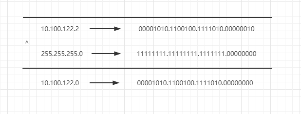

# 网络协议


## 一、通信协议综述


### 1、网络分层的真实含义

#### （1）网络为何要分层？

因为复杂的程序都要分层，这是程序设计的要求，比如一个系统有数据库层、缓存层、Dao层、Service层，Controller层


#### （2）程序是如何工作的？


**收到网络数据报的处理流程：**

当一个网络包从一个网口经过的时候，首先看看要不要进行处理。有些网口配置了混杂模式，凡是经过的，全部都需要进行处理。

拿到网络数据包之后，先从buffer中摘掉二层的头（也即是MAC）。

如果MAC地址和当前MAC相符，说明是发给本机的，于是摘掉三层的头（IP），看看到底是发给本机的还是希望从本机转发出去的。

如果IP地址不是本机，就应该转发出去。如果IP地址是本机的，就是发给自己的。

根据IP头里面的标示，拿掉三层的头，进行下一层的处理，判断到底是TCP还是UDP。

假设是TCP，此时Buffer里面没有三层的头，需要查看四层的头，判断是发起还是应答，又或是一个正常的数据报，然后分别处理不同的逻辑。如果是发起或应答，就可能要发送一个回复包；如果是一个正常的数据包，就需要较给上层应用处理。

交给哪个应用？在四层的头里有端口号，不同的应用监听不同的端口号。如果发现浏览器应用在监听此端口，那就发给浏览器。


类似于离职流程。


**发送网络数据包的流程：**

发起一个Http请求，Buffer里面的Http请求的内容，会在TCP层添加TCP头，记录源端口号和目的端口号

流转到IP层，添加了一个IP头，记录下源IP地址和目的IP地址。

然后就是链路层，添加MAC头，记录源MAC地址和目的MAC地址。


类似于一个资源批复流程


**只要在网络上跑的包，都是完整的，可以有下层没上层，绝对不能有上层没下层**

__所以，对TCP协议来说，三次握手、重试这些操作，只要想发出去包，就要有IP层和MAC层，不然是发不出去的。__


一个HTTP协议的包经过一个二层设备，二层设备收进去的是整个网络包，这里面HTTP、TCP、IP、MAC都有。

**二层设备：**

只把MAC头摘下来，看是丢弃、转发，还是自留

**三层设备：**

把MAC头摘下来后再把IP头摘下来，看到底是丢弃、转发，还是自留。


### 2、ifconfig

```shell
root@test:~# ip addr
1: lo: <LOOPBACK,UP,LOWER_UP> mtu 65536 qdisc noqueue state UNKNOWN group default 
    link/loopback 00:00:00:00:00:00 brd 00:00:00:00:00:00
    inet 127.0.0.1/8 scope host lo
       valid_lft forever preferred_lft forever
    inet6 ::1/128 scope host 
       valid_lft forever preferred_lft forever
2: eth0: <BROADCAST,MULTICAST,UP,LOWER_UP> mtu 1500 qdisc pfifo_fast state UP group default qlen 1000
    link/ether fa:16:3e:c7:79:75 brd ff:ff:ff:ff:ff:ff
    inet 10.100.122.2/24 brd 10.100.122.255 scope global eth0
       valid_lft forever preferred_lft forever
    inet6 fe80::f816:3eff:fec7:7975/64 scope link 
       valid_lft forever preferred_lft forever
```

IP地址是一个网卡在网络世界的通讯地址，相当于门牌号码


#### 无类型域间选路（CIDR）

将32位的IP地址一分为二，前面是网络号，后面是主机号。

例如一个IP地址 10.100.122.2/24，后面有一个斜杠，斜杠后面有个数字24，这种地址表示形式，就是CIDR。

后面24的意思就是在32位的IP地址中，前24位是网络号，后8位是主机号。


伴随着CIDR存在的，一个是**广播地址**，10.100.122.255，如果发送这个地址，所有10.100.122网络里的机器都可以收到，另一个是子网掩码，255.255.255.0。

**将子网掩码和IP地址按位进行AND计算，就是网络号**

例如，IP是10.100.122.2，子网掩码是255.255.255.0，那么网络号就是10.100.122.0。




**公有IP地址和私有IP地址**


私有IP地址允许组织内部的人员自行管理、分配，并且可以重复，比如学校A的某个私有IP地址和学校B的某个私有IP地址是可以一样的

比如家用的Wi-Fi地址一般是192.168.0.x，/24基本够用。

此时192.168.0即为网络号，后面是主机号，而一般192.168.0.1是私有网络的出口地址。192.168.0.255是广播地址。


例如对16.158.165.91/22求网络的第一个地址，子网掩码和广播地址。


这五类地址中，还有一类 D 类是组播地址。使用这一类地址，属于某个组的机器都能收到。这有点类似在公司里面大家都加入了一个邮件组。

在 IP 地址的后面有个 scope，对于 eth0 这张网卡来讲，是 global，说明这张网卡是可以对外的，可以接收来自各个地方的包。对于 lo 来讲，是 host，说明这张网卡仅仅可以供本机相互通信。

lo 全称是 loopback，又称环回接口，往往会被分配到 127.0.0.1 这个地址。这个地址用于本机通信，经过内核处理后直接返回，不会在任何网络中出现。


**MAC地址**

在 IP 地址的上一行是 link/ether fa:16:3e:c7:79:75 brd ff:ff:ff:ff:ff:ff，这个被称为 MAC 地址，是一个网卡的物理地址，用十六进制，6 个 byte 表示。

一个网络包要从一个地方传到另一个地方，除了要有确定的地址，还需要又定位功能，而有门牌号码属性的IP地址，才有远程定位功能。

MAC地址更像是一个身份证，而IP地址就是门牌号。

比如可以根据IP查找到主机在哪一栋楼，用MAC可以在用IP找到的楼中查找到对应的主机。

MAC地址有一定的定位功能，不过范围非常有限，只能局限在一个子网里面。


**网络设备的状态标识**

<BROADCAST,MULTICAST,UP,LOWER_UP>是干什么的？这个叫做 net_device flags，网络设备的状态标识。

UP 表示网卡处于启动的状态；

BROADCAST 表示这个网卡有广播地址，可以发送广播包；

MULTICAST 表示网卡可以发送多播包；

LOWER_UP 表示 L1 是启动的，也即网线插着呢。


~~qdisc pfifo_fast 是什么意思呢？~~

qdisc 全称是 queueing discipline，中文叫排队规则。内核如果需要通过某个网络接口发送数据包，它都需要按照为这个接口配置的 qdisc（排队规则）把数据包加入队列。

最简单的 qdisc 是 pfifo，它不对进入的数据包做任何的处理，数据包采用先入先出的方式通过队列。pfifo_fast 稍微复杂一些，它的队列包括三个波段（band）。在每个波段里面，使用先进先出规则。

三个波段（band）的优先级也不相同。band 0 的优先级最高，band 2 的最低。如果 band 0 里面有数据包，系统就不会处理 band 1 里面的数据包，band 1 和 band 2 之间也是一样。

数据包是按照服务类型（Type of Service，TOS）被分配到三个波段（band）里面的。TOS 是 IP 头里面的一个字段，代表了当前的包是高优先级的，还是低优先级的。


### 3、DHCP与PXE：IP是如何来的，又是怎么没的

**如何配置IP地址：**

使用net-tools：

```
$ sudo ifconfig eth1 10.0.0.1/24
$ sudo ifconfig eth1 up
```

使用iproute2：

```
$ sudo ip addr add 10.0.0.1/24 dev eth1
$ sudo ip link set up eth1
```

Linux上跨网段的调用个流程是，不会直接将包发送到网络上，而是企图将包发送到网关。

比如将机器IP配置位16.157.23.4，需发送数据包到192.168.1.5，是发不出去的。

因为除了源IP和目标IP，还需要MAC，那么目标192.168.1.5的MAC如何获取？

首先Linux会判断目标IP是否是同一网段的，如果是，才会发送ARP请求获取目标主机的MAC地址。

如果不是，就会将包发送到网关。


如果没配置网关的话，那么包根本就发不出去。

如果想要将网关配置成192.168.1.5，是不会配成功的，因为网关要和当前的网络至少一个网卡是同一网段的。


#### **动态主机配置协议DHCP**

当需要对网络随连随用，不需要手动配置静态IP时，就需要这个DHCP。

只需配置一段共享的IP地址，每台新接入的机器都通过DHCP协议，向这个共享的IP地址里申请，然后自动配置好就可以了。用完即还，就相当于是一个IP池，能重复使用。


如果是数据中心里面的服务器，IP一旦配置好，基本不会变化，相当于买断了，而DHCP的方式就是租赁，都是配置好的，即租即用，用完退租即可。


**DHCP的工作方式**

（1）当一台机器新加入一个网络时，只知道自身MAC地址，就会发一个广播数据包，这一步称为**DHCP Discover**

新机器使用IP地址0.0.0.0发送一个广播包，目的IP是255.255.255.255，广播包封装了UDP，UDP封装了BOOTP。

其实DHCP是BOOTP的增强版，抓包可能看到的名称还是BOOTP协议。


（2）如果配置了DHCP Server（相当于IP管理员），收到广播包会立刻知道来了一个新机器

只有 MAC 唯一，IP 管理员才能知道这是一个新人，需要租给它一个 IP 地址，这个过程我们称为**DHCP Offer**。同时，DHCP Server 为此客户保留为它提供的 IP 地址，从而不会为其他 DHCP 客户分配此 IP 地址。


DHCP Server仍然使用广播地址作为目的地址，因为此时新机器还没有IP。服务器还发送了子网掩码、网关和IP地址租用期等信息。

（3）如果新机器收到多个DHCP Offer，一般会选择最先收到的哪个，并向网络发送一个**DHCP Request**广播数据包，包含客户端的MAC地址、接受的IP地址、对应的DHCP Server地址等，并告诉所有DHCP Server它将接受哪台服务器提供的IP地址，请求撤销他们提供的IP地址。


此时，由于还没有得到 DHCP Server 的最后确认，客户端仍然使用 0.0.0.0 为源 IP 地址、255.255.255.255 为目标地址进行广播。在 BOOTP 里面，接受某个 DHCP Server 的分配的 IP。


当 DHCP Server 接收到客户机的 DHCP request 之后，会广播返回给客户机一个 DHCP ACK 消息包，表明已经接受客户机的选择，并将这一 IP 地址的合法租用信息和其他的配置信息都放入该广播包，发给客户机，欢迎它加入网络大家庭。


**IP地址的收回和续租：**

客户机会在租期过去 50% 的时候，直接向为其提供 IP 地址的 DHCP Server 发送 DHCP request 消息包。客户机接收到该服务器回应的 DHCP ACK 消息包，会根据包中所提供的新的租期以及其他已经更新的 TCP/IP 参数，更新自己的配置。这样，IP 租用更新就完成了。


#### 预启动执行环境（PXE）


