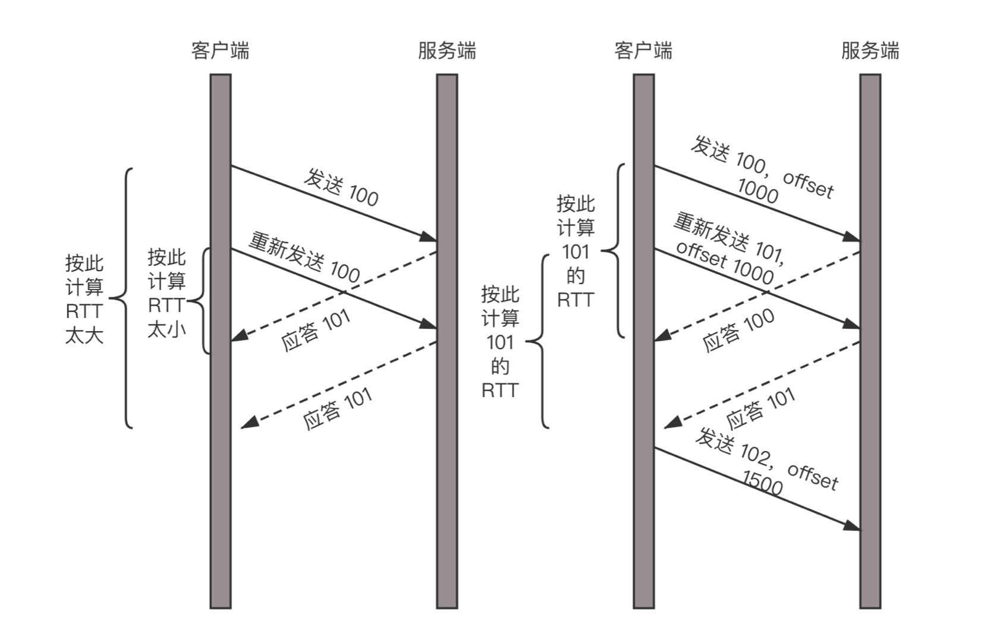
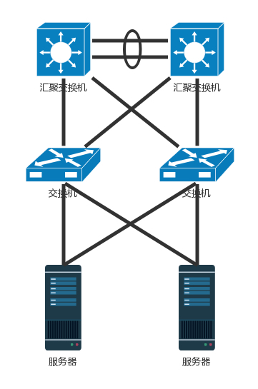

# 网络协议

[toc]


## 一、通信协议综述


### 1、网络分层的真实含义

#### （1）网络为何要分层？

因为复杂的程序都要分层，这是程序设计的要求，比如一个系统有数据库层、缓存层、Dao层、Service层，Controller层


#### （2）程序是如何工作的？


**收到网络数据报的处理流程：**

当一个网络包从一个网口经过的时候，首先看看要不要进行处理。有些网口配置了混杂模式，凡是经过的，全部都需要进行处理。

拿到网络数据包之后，先从buffer中摘掉二层的头（也即是MAC）。

如果MAC地址和当前MAC相符，说明是发给本机的，于是摘掉三层的头（IP），看看到底是发给本机的还是希望从本机转发出去的。

如果IP地址不是本机，就应该转发出去。如果IP地址是本机的，就是发给自己的。

根据IP头里面的标示，拿掉三层的头，进行下一层的处理，判断到底是TCP还是UDP。

假设是TCP，此时Buffer里面没有三层的头，需要查看四层的头，判断是发起还是应答，又或是一个正常的数据报，然后分别处理不同的逻辑。如果是发起或应答，就可能要发送一个回复包；如果是一个正常的数据包，就需要较给上层应用处理。

交给哪个应用？在四层的头里有端口号，不同的应用监听不同的端口号。如果发现浏览器应用在监听此端口，那就发给浏览器。


类似于离职流程。


**发送网络数据包的流程：**

发起一个Http请求，Buffer里面的Http请求的内容，会在TCP层添加TCP头，记录源端口号和目的端口号

流转到IP层，添加了一个IP头，记录下源IP地址和目的IP地址。

然后就是链路层，添加MAC头，记录源MAC地址和目的MAC地址。


类似于一个资源批复流程


**只要在网络上跑的包，都是完整的，可以有下层没上层，绝对不能有上层没下层**

__所以，对TCP协议来说，三次握手、重试这些操作，只要想发出去包，就要有IP层和MAC层，不然是发不出去的。__


一个HTTP协议的包经过一个二层设备，二层设备收进去的是整个网络包，这里面HTTP、TCP、IP、MAC都有。

**二层设备：**

只把MAC头摘下来，看是丢弃、转发，还是自留

**三层设备：**

把MAC头摘下来后再把IP头摘下来，看到底是丢弃、转发，还是自留。


### 2、ifconfig

```shell
root@test:~# ip addr
1: lo: <LOOPBACK,UP,LOWER_UP> mtu 65536 qdisc noqueue state UNKNOWN group default 
    link/loopback 00:00:00:00:00:00 brd 00:00:00:00:00:00
    inet 127.0.0.1/8 scope host lo
       valid_lft forever preferred_lft forever
    inet6 ::1/128 scope host 
       valid_lft forever preferred_lft forever
2: eth0: <BROADCAST,MULTICAST,UP,LOWER_UP> mtu 1500 qdisc pfifo_fast state UP group default qlen 1000
    link/ether fa:16:3e:c7:79:75 brd ff:ff:ff:ff:ff:ff
    inet 10.100.122.2/24 brd 10.100.122.255 scope global eth0
       valid_lft forever preferred_lft forever
    inet6 fe80::f816:3eff:fec7:7975/64 scope link 
       valid_lft forever preferred_lft forever
```

IP地址是一个网卡在网络世界的通讯地址，相当于门牌号码


#### 无类型域间选路（CIDR）

将32位的IP地址一分为二，前面是网络号，后面是主机号。

例如一个IP地址 10.100.122.2/24，后面有一个斜杠，斜杠后面有个数字24，这种地址表示形式，就是CIDR。

后面24的意思就是在32位的IP地址中，前24位是网络号，后8位是主机号。


伴随着CIDR存在的，一个是**广播地址**，10.100.122.255，如果发送这个地址，所有10.100.122网络里的机器都可以收到，另一个是子网掩码，255.255.255.0。

**将子网掩码和IP地址按位进行AND计算，就是网络号**

例如，IP是10.100.122.2，子网掩码是255.255.255.0，那么网络号就是10.100.122.0。


**公有IP地址和私有IP地址**


私有IP地址允许组织内部的人员自行管理、分配，并且可以重复，比如学校A的某个私有IP地址和学校B的某个私有IP地址是可以一样的

比如家用的Wi-Fi地址一般是192.168.0.x，/24基本够用。

此时192.168.0即为网络号，后面是主机号，而一般192.168.0.1是私有网络的出口地址。192.168.0.255是广播地址。


例如对16.158.165.91/22求网络的第一个地址，子网掩码和广播地址。


这五类地址中，还有一类 D 类是组播地址。使用这一类地址，属于某个组的机器都能收到。这有点类似在公司里面大家都加入了一个邮件组。

在 IP 地址的后面有个 scope，对于 eth0 这张网卡来讲，是 global，说明这张网卡是可以对外的，可以接收来自各个地方的包。对于 lo 来讲，是 host，说明这张网卡仅仅可以供本机相互通信。

lo 全称是 loopback，又称环回接口，往往会被分配到 127.0.0.1 这个地址。这个地址用于本机通信，经过内核处理后直接返回，不会在任何网络中出现。


**MAC地址**

在 IP 地址的上一行是 link/ether fa:16:3e:c7:79:75 brd ff:ff:ff:ff:ff:ff，这个被称为 MAC 地址，是一个网卡的物理地址，用十六进制，6 个 byte 表示。

一个网络包要从一个地方传到另一个地方，除了要有确定的地址，还需要又定位功能，而有门牌号码属性的IP地址，才有远程定位功能。

MAC地址更像是一个身份证，而IP地址就是门牌号。

比如可以根据IP查找到主机在哪一栋楼，用MAC可以在用IP找到的楼中查找到对应的主机。

MAC地址有一定的定位功能，不过范围非常有限，只能局限在一个子网里面。


**网络设备的状态标识**

<BROADCAST,MULTICAST,UP,LOWER_UP>是干什么的？这个叫做 net_device flags，网络设备的状态标识。

UP 表示网卡处于启动的状态；

BROADCAST 表示这个网卡有广播地址，可以发送广播包；

MULTICAST 表示网卡可以发送多播包；

LOWER_UP 表示 L1 是启动的，也即网线插着呢。


~~qdisc pfifo_fast 是什么意思呢？~~

qdisc 全称是 queueing discipline，中文叫排队规则。内核如果需要通过某个网络接口发送数据包，它都需要按照为这个接口配置的 qdisc（排队规则）把数据包加入队列。

最简单的 qdisc 是 pfifo，它不对进入的数据包做任何的处理，数据包采用先入先出的方式通过队列。pfifo_fast 稍微复杂一些，它的队列包括三个波段（band）。在每个波段里面，使用先进先出规则。

三个波段（band）的优先级也不相同。band 0 的优先级最高，band 2 的最低。如果 band 0 里面有数据包，系统就不会处理 band 1 里面的数据包，band 1 和 band 2 之间也是一样。

数据包是按照服务类型（Type of Service，TOS）被分配到三个波段（band）里面的。TOS 是 IP 头里面的一个字段，代表了当前的包是高优先级的，还是低优先级的。


### 3、DHCP与PXE：IP是如何来的，又是怎么没的

**如何配置IP地址：**

使用net-tools：

```
$ sudo ifconfig eth1 10.0.0.1/24
$ sudo ifconfig eth1 up
```

使用iproute2：

```
$ sudo ip addr add 10.0.0.1/24 dev eth1
$ sudo ip link set up eth1
```

Linux上跨网段的调用个流程是，不会直接将包发送到网络上，而是企图将包发送到网关。

比如将机器IP配置位16.157.23.4，需发送数据包到192.168.1.5，是发不出去的。

因为除了源IP和目标IP，还需要MAC，那么目标192.168.1.5的MAC如何获取？

首先Linux会判断目标IP是否是同一网段的，如果是，才会发送ARP请求获取目标主机的MAC地址。

如果不是，就会将包发送到网关。


如果没配置网关的话，那么包根本就发不出去。

如果想要将网关配置成192.168.1.5，是不会配成功的，因为网关要和当前的网络至少一个网卡是同一网段的。


#### **动态主机配置协议DHCP**

当需要对网络随连随用，不需要手动配置静态IP时，就需要这个DHCP。

只需配置一段共享的IP地址，每台新接入的机器都通过DHCP协议，向这个共享的IP地址里申请，然后自动配置好就可以了。用完即还，就相当于是一个IP池，能重复使用。


如果是数据中心里面的服务器，IP一旦配置好，基本不会变化，相当于买断了，而DHCP的方式就是租赁，都是配置好的，即租即用，用完退租即可。


**DHCP的工作方式**

（1）当一台机器新加入一个网络时，只知道自身MAC地址，就会发一个广播数据包，这一步称为**DHCP Discover**

新机器使用IP地址0.0.0.0发送一个广播包，目的IP是255.255.255.255，广播包封装了UDP，UDP封装了BOOTP。

其实DHCP是BOOTP的增强版，抓包可能看到的名称还是BOOTP协议。


（2）如果配置了DHCP Server（相当于IP管理员），收到广播包会立刻知道来了一个新机器

只有 MAC 唯一，IP 管理员才能知道这是一个新人，需要租给它一个 IP 地址，这个过程我们称为**DHCP Offer**。同时，DHCP Server 为此客户保留为它提供的 IP 地址，从而不会为其他 DHCP 客户分配此 IP 地址。


DHCP Server仍然使用广播地址作为目的地址，因为此时新机器还没有IP。服务器还发送了子网掩码、网关和IP地址租用期等信息。

（3）如果新机器收到多个DHCP Offer，一般会选择最先收到的哪个，并向网络发送一个**DHCP Request**广播数据包，包含客户端的MAC地址、接受的IP地址、对应的DHCP Server地址等，并告诉所有DHCP Server它将接受哪台服务器提供的IP地址，请求撤销他们提供的IP地址。


此时，由于还没有得到 DHCP Server 的最后确认，客户端仍然使用 0.0.0.0 为源 IP 地址、255.255.255.255 为目标地址进行广播。在 BOOTP 里面，接受某个 DHCP Server 的分配的 IP。


当 DHCP Server 接收到客户机的 DHCP request 之后，会广播返回给客户机一个 DHCP ACK 消息包，表明已经接受客户机的选择，并将这一 IP 地址的合法租用信息和其他的配置信息都放入该广播包，发给客户机，欢迎它加入网络大家庭。


**IP地址的收回和续租：**

客户机会在租期过去 50% 的时候，直接向为其提供 IP 地址的 DHCP Server 发送 DHCP request 消息包。客户机接收到该服务器回应的 DHCP ACK 消息包，会根据包中所提供的新的租期以及其他已经更新的 TCP/IP 参数，更新自己的配置。这样，IP 租用更新就完成了。


#### 预启动执行环境（PXE）


## 二、链路层和网络层


### 1、从物理层到MAC层


**数据链路层**

1. 这个包是发给谁的？谁应该接收？
2. 大家都在发，会不会产生混乱？有没有谁先发、谁后发的规则？
3. 如果发送的时候出现了错误，怎么办？

MAC的全程是Medium Access Control，即媒体访问控制。控制在往媒体上发数据的时候，谁先发，谁后发的问题。防止发生混乱。解决第二个问题，此问题中的规则，学名叫多路访问。

有三种方式解决此问题：

（1）分多车道，每辆车一车道，各走各的，这在计算机网络里叫做信道划分。

（2）限号出行协议，在计网中叫做轮流协议。

（3）先出门，发现很堵，返回，错峰出行，叫随机接入协议。以太网用的就是这种方式。


【发给谁，谁接收？】

此时用到一个物理地址，叫做链路层地址。但是因为第二层主要解决媒体接入控制的问题，所以常被称为MAC地址


第二层的网络包格式。


类型：大部分类型是IP数据包，然后IP里面包含TCP、UDP以及HTTP等。


对于以太网，第二层最后面是CRC，也就是循环冗余检测，通过XOR异或的算法，来计算整个包是否在发送的过程中出现了错误，主要解决第三个问题。


**ARP协议**

已知IP地址，求MAC地址的协议。


发送一个广播数据包，询问某个IP是哪台机器的。


机器本地会有ARP高速缓存，避免每次都是用ARP请求。


**局域网**

需要有一个能把MAC头拿下来，检查一下目标MAC地址，然后根据策略转发的设备，此设备是个二层设备，称为**交换机**


交换机如何知道每个口的电脑的MAC地址？

一个数据包从A发送到B，当交换机收到这个包时，交换机也不知道B在哪，所以只能转发到除源端口的其它所有的口，此时，交换机就会记住MAC_A是A主机的。之后有包的目的地址是MAC_A的，就直接发送到这个口。


在经过多次的数据交换后，交换机就知道了每个口对应的MAC地址，之后就可以进行准确转发了。

每个机器的IP地址会变，所在的口也会变，因而交换机上的学习的结果，称为转发表，是由一个过期时间的。


**重点：**

（1）MAC层是用来解决多路访问的堵车问题的。

（2）ARP通过广播的方式寻找目标MAC地址的，然后会将结果缓存下来。

（3）交换机是有MAC地址学习能力的，学完之后能做到准确转发。


### 2、交换机与VLAN

**拓扑结果是怎么形成的？**

当一个交换机不够用的时候，需要多台交换机，交换机之间连接起来，就形成了一个拓扑结构。


例如两台交换机连着三个局域网，每台局域网上都有多台机器

如果机器1知道机器4的IP但不知道MAC地址，此时机器1发起广播，机器2收到，但IP信息不符，所以不管。交换机A收到广播后，广播到所有其它网口，所以机器3跟机器2一样。

此时交换机B也会收到，也是广播到所有网口，这时机器4发生了应答，于是一个ARP请求就成功完成了。

上述过程中，交换机A和B都知道机器1是左边的网口。当机器2访问机器1时，在不知道机器1的MAC地址时，也会发送ARP请求，此时交换机A知道根据MAC地址知道机器1是在左边的，也就不会进行广播。


**如何解决常见的环路问题？**


当机器1访问机器2的时候，一开始不知道机器2的MAC地址，所以发起一个ARP请求的广播，广播到达机器2，机器2返回MAC地址。

但是问题来了，这两个交换机还是都能够收到广播包的。交换机 A 一开始是不知道机器 2 在哪个局域网的，所以它会把广播消息放到局域网二，在局域网二广播的时候，交换机 B 右边这个网口也是能够收到广播消息的。交换机 B 会将这个广播信息发送到局域网一。局域网一的这个广播消息，又会到达交换机 A 左边的这个接口。交换机 A 这个时候还是不知道机器 2 在哪个局域网，于是将广播包又转发到局域网二。左转左转左转，好像是个圈哦。

当机器1的广播到达A、B时，A和B都存了机器1在左边的情况，如果交换机A转发到局域网2，此时交换机B收到局域网2的转发，交换机B又认为机器1是在右边，此时便造成了混乱。

这就是环路问题。


### 3、ICMP与PING

PING是基于ICMP协议工作的。

ICMP全称是Intenet control message protocol，就是互联网控制报文协议。

类似于侦察兵

  


ICMP报文是封装在IP报文里面的，因为传输指令的时候，肯定是要带上源地址和目的地址，携带信息有限，作为侦察兵要轻装上阵。

ICMP报文有多种类型，不同类型有不同的代码。

最常用的类型是主动请求是8，主动请求的应答是0。


**查询报文类型：**

主动探查敌情，对应的是ICMP的查询报文类型

PING就是查询报文，是一种主动请求，并且获得主动应答的ICMP协议。PING发出的包是符合ICMP协议格式的，不过PING在后面追加了专属的格式。

对PING的主动请求，进行网络抓包，称为**ICMP ECHO REQUEST**，同理主动请求的应答称为**ICMP ECHO REPLY**。

比起原生的ICMP报文，多了两个字段

**标识符**，标识用处，比如派出一小队做敌情侦查，派出另一小队做水源查找

**序号**，派出去的侦察兵进行编号，派10回10，战况良好，派10回1，战况惨烈。

在选项数据中，PING还会存放发起请求的时间，用来计算往返时间。


**差错报文类型：**

由于某种原因导致报文出错，就称为差错报文。

例如：

终点不可达 为 3

源抑制 为 4

超时 为 11

重定向 为 5


**终点不可达：** 小兵：报告，传送粮草到张将军处，结果没送到

原因如下： 网络不可达代码为 0，主机不可达代码为 1，协议不可达代码为 2，端口不可达代码为 3，需要进行分片但设置了不分片位代码为 4。 

网络不可达：没找到地方

主机不可达：找到地方没找到人

协议不可达：到地儿找到人，暗号对不上

需分片单设置了不分片：粮车到半路了，道路狭窄无法通过，无法送达


**源站抑制：** 让源站放慢发送速度。物资太多，消耗不了。


**超时：** 超过设定的时间还未送达


**重定向：** 地址发错了，


 差错报文的结构相对复杂一些。除了前面还是 IP，ICMP 的前 8 字节不变，后面则跟上出错的那个 IP 包的 IP 头和 IP 正文的前 8 个字节。 


**PING：查询报文类型的使用**


1、ping命令执行的时候，源主机首先回构建一个ICMP请求数据包，ICMP数据包内包含多个字段，最重要的有两个。

第一个是类型字段，对于请求数据包来说是 8 ，另一个是顺序号，主要用于区分连续piong的时候发出的多个数据包。

每发出一个请求数据包，顺序号会自动加1，为了能够计算往返时间RTT，会在报文的数据部分插入发送时间。

2、然后，由ICMP协议将此数据包连同源IP地址和目的IP地址一起交至IP层，加上其它信息，构建一个IP数据包。

3、然后，加入MAC头。获取MAC地址后，由数据链路层构建一个数据帧，目的地址是IP层传过来的MAC地址。源地址则是本机的MAC地址还要附加上一些控制信息，依据以太网的介质访问规则，将它们传送出去。

4、主机 B 收到这个数据帧后，先检查它的目的 MAC 地址，并和本机的 MAC 地址对比，如符合，则接收，否则就丢弃。接收后检查该数据帧，将 IP 数据包从帧中提取出来，交给本机的 IP 层。同样，IP 层检查后，将有用的信息提取后交给 ICMP 协议。

5、主机B会构建一个ICMP应答包，应答数据包的类型字段为0，顺序号为接收到的请求数据包中的顺序号，然后在发送给主机B。

6、在规定的时间内，源主机如果没有接到ICMP的应答包，则说明目标主机不可达；如果接收到了ICMP应答包，则说明目标主机可达。此时，源主机会检查，用当前时间减去数据包最初从源主机上发出的时间，就是ICMP数据包的时间延迟。

7、如果跨网段，会涉及到网关的转发、路由器的转发等。但是对于 ICMP 的头来讲，是没什么影响的。会影响的是根据目标 IP 地址，选择路由的下一跳，还有每经过一个路由器到达一个新的局域网，需要换 MAC 头里面的 MAC 地址。


PING是使用了ICMP里面的ECHO REQUEST和ECHO REPLY类型的。


**Traceroute：差错报文类型的使用**

Traceroute的第一个作用就是能设置特殊的TTL，来追踪去往目的地时沿途经过的路由器。

Traceroute的参数指向某个目的IP地址，会发送一个UDP的数据包，将TTL设置成1，一旦遇到一个路由器或一个关卡，请求就结束，返回给源主机。

如果中间的路由器不止一个，遇到第一个就结束，于是，返回一个ICMP包，也就是网络差错包，类型是时间超时。

接下来，将 TTL 设置为 2。第一关过了，第二关就“牺牲”了，那我就知道第二关有多远。如此反复，直到到达目的主机。这样，Traceroute 就拿到了所有的路由器 IP。当然，有的路由器压根不会回这个 ICMP。这也是 Traceroute 一个公网的地址，看不到中间路由的原因。

1、如何知道UDP有没有到达目的主机？

Traceroute会发送一份UDP数据包给目的主机，但它会选择一个不可能的值作为UDP端口号（大于3000）。当数据包到达时，目的主机的UDP模块产生一份“端口不可达”错误ICMP报文。如果数据包没有到达，则可能时超时。


**Traceroute还有一个作用是故意设置不分片，从而确定路径的MTU。**

要做的工作首先是发送分组，并设置“不分片”标志。发送的第一个分组的长度正好与出口 MTU 相等。如果中间遇到窄的关口会被卡住，会发送 ICMP 网络差错包，类型为“需要进行分片但设置了不分片位”。其实，这是人家故意的好吧，每次收到 ICMP“不能分片”差错时就减小分组的长度，直到到达目标主机。


### 4、网关和路由

一旦配置了IP地址和网关，往往就能指定目标地址进行访问了，由于在跨网关访问的时候，牵扯到MAC地址和IP'地址的变化。


在任何一台机器上，当要访问另一个IP地址时候，会先判断目标IP地址和当前IP地址是否在同一个网段。


**如何判断是否处于同一网段？**

需要CIDR和子网掩码


如果是同一网段，不需要用到网关，直接将源地址和目标地址放入IP头中，然后通过ARP获得MAC地址，将源MAC和目的MAC放入MAC头中，发送出去即可。

如果不是同一网段，需要发往默认网关Gateway。网关的地址一定是和源IP地址处于同一网段，往往不是第一个就是第二个，例如192.168.1.0/24这个网段，Gateway一般会是192.168.1.1/24或者192.168.1.2/24


**如何发往默认网关？**

由于是在同一网段，所以只需要在交换机上进行通信即可，也即是使用ARP获取MAC地址，然后封装源IP、目的IP、源MAC、目的MAC发送出去。

网关往往是一个路由器，是一个三层转发的设备。

三层设备就是把MAC和IP头取下来，根据里面的内容，看看数据包具体是往哪里发的。 


路由器是一台设备，有五个网口或网卡，相当于有五只手，分别连着五个局域网，每只手的IP地址都和局域网的IP地址是相同的网段，每只手都是它握住的哪个局域网的网关。

任何一个想发往其它局域网的包，都会到达其中一只手，拿进来后拿下MAC和IP头，然后根据路由算法，选择另一只手，加上IP头和MAC头，发出去。


那么该如何选择哪一只手呢？


**静态路由是什么？**

静态路由，其实就是在路由器上，配置一条一条的规则。按照规则进行出口匹配，也就是选择哪一只手

每当要选择哪个出口时，就一条一条规则匹配，找到符合的规则，就按规则中设置的出口发出去，找下一跳IPX。


**IP头和MAC头是否需要改变？**

MAC地址是一个局域网内才有效的地址，所以，MAC地址只要过了网关，就一定会改变，因为已经换了局域网。

两者主要区别在于IP地址是否改变？不改变IP地址的网关称为**转发网关**；改变IP地址的网关，称为**NAT网关**。


**转发网关：**


在此过程中，每到一个新的局域网，MAC地址都是变化的，但是IP地址都不变，在IP头里卖弄，不会保存任何网关的IP地址。

IP地址在三个局域网内都是可见的，所以网段不会冲突，IP头不改变。

所谓的下一跳就是某个IP要将这个IP地址转换为MAC放入MAC头。


**NAT网关：**

IP地址在局域网内不可见，会发生IP冲突，比如局域网A的192.168.1.101发往局域网B的192.168.1.101，IP是一样的。

类似于是快递地址，首先是广东省，比如外省发往深圳，首先要经过广东省的集散中心。

比如服务器B有一个全国通用IP，定为192.168.56.2，在网关B上，192.168.56.2对应的是192.168.1.101，凡是要访问192.168.56.2的，都转成192.168.1.101


### 5、路由协议：动态路由

**如何配置路由：**

路由器就是一台网络设备，有多张网卡，当一个入口的网络包送到路由器时，会根据一个本地的转发信息库，决定如何正确的转发流量。这个转发信息库通常就被称为路由表。

一张路由表中会有多条路由规则，每一条规则至少包含这三项信息：

- 目的网络：这个包想去哪儿？
- 出口设备：将包从哪个口发出
- 下一跳网关：下一个路由器的地址

通过route命令和ip route命令都可以进行查询或配置。

via：经由

例如：添加路由规则，要去10.176.48.0/20 这个目标网络，要从 eth0 端口出去，经过 10.173.32.1。

```shell
ip route add 10.176.48.0/20 via 10.173.32.1 dev eth0
```

按照上述三项配置信息进行配置的路由策略，有一个核心思想就是：根据目的IP地址来配置路由。


**如何配置路由策略：**

除了根据IP地址进行配置，还可以根据多个参数来配置路由，这就称为策略路由。

可配置多个路由表，可根据源IP地址、入口设备、TOS等选择路由表，然后在路由表中查询路由，可使得来自不同来源的包走不同的路由。

例如，设置从192.168.1.0/24这个网段来的，使用table 10中的路由表。

```shell
ip rule add from 192.168.1.0/24 table 10
```

在一条路由规则中，也可以走多条路径

比如：下一跳有两个地方，分别是100.100.100.1和200.200.200.1，权重比是1:2

```shell
ip route add default scope global nexthop via 100.100.100.1 weight 1 nexthop via 200.200.200.1 weight 2
```

例如：

从两个运营商都拉了网线，一条带宽大，一条带宽小，此时需要可接两个外网的路由器。

家用网络的网段就是192.168.1.x/24，有俩租户，分别把线联到路由器上，IP地址为192.168.1.101/24和192.168.1.102/24，网关都是192.168.1.1/24，网关在路由器上。

此时出去的数据包需要经过NAT网关转成公网IP地址，路由器就是一个NAT网关。

两个运营商都要为这个网关配置一个公网IP地址，像下图：


运营商里面也有一个IP地址，在运营商网络里面的网关，不同的运营商方法不一样，有的是/32的，也即是一对一连接。

如上图：运营商1给路由器分配的地址是183.134.189.34/32，运营商1网络的网关是183.134.188.1/32，有的是/30的，也即是分了一个特别小的网段。运营商2给路由器分配的地址是60.190.27.190/30，运营商2网络里面的网关是 60.190.27.189/30。

根据此网络拓扑图，可将路由配置如下：

60.190.27.190/30，运营商网络里面的网关是 60.190.27.189/30。

```shell
$ ip route list table main 
60.190.27.189/30 dev eth3  proto kernel  scope link  src 60.190.27.190
183.134.188.1 dev eth2  proto kernel  scope link  src 183.134.189.34
192.168.1.0/24 dev eth1  proto kernel  scope link  src 192.168.1.1
127.0.0.0/8 dev lo  scope link
default via 183.134.188.1 dev eth2
```

此时规则如下：

- 去运营商2，走eth3
- 去运营商1，走eth2
- 访问内网，走eth1
- 如果所有规则都匹配不上，默认走运营商1，走快网

那如果有一个大爷只想简单上上网看看新闻，不想付一样的钱，可以添加一个table

```shell
$ echo 200 chao >> /eth/iproute2/rt_tables
```

添加一条规则：从192.168.1.101来的包都查看chao这个新的路由表

```shell
# ip rule add from 192.168.1.101 table chao
# ip rule ls
0:  from all lookup local 
32765:  from 192.168.1.101 lookup chao
32766:  from all lookup main 
32767:  from all lookup default
```

此时在chao路由表中添加规则：默认为慢的网络

```shell
# ip route add default via 60.190.27.189 dev eth3 table chao
# ip route flush cache
```

上述都是静态的路由，在网络环境较为简单时，可用，但在网络环境复杂并多变的时候，如果总是用静态路由，一旦网络结构发生变化，手工修改路由会非常复杂，所以需要动态路由。

**动态路由算法**

使用动态路由路由器，可根据路由协议算法生成动态路由表，随网络运行状况的变化而变化。

无论是一个国家内部，还是国家之间，我们都可以将复杂的路径，抽象为一种叫作图的数据结构。至于唐僧西行取经，肯定想走的路越少越好，道路越短越好，因而这就转化成为如何在途中找到最短路径的问题。

求最短路径常用的有两种方法，一种是 Bellman-Ford 算法，一种是 Dijkstra 算法。


**1、距离矢量路由算法**

距离矢量路由（distance vector routing）。它是基于 Bellman-Ford 算法的。

此种算法，每个路由器都保存一个路由表，包含多行，每行对应网络中的一个路由器，每一行包含两部分信息，一个是目标路由器，另一个是到目标路由器的距离。

每个路由器都知道全局信息

- 信息如何更新？

  每个路由器都知道自身和邻居之间的距离，每过几秒，每个路由器都将自身所知的到达所有路由器的距离告知邻居，每个路由器也能从邻居那里得到相似的信息。

每个路由器根据新收集的信息，计算和其他路由器的距离，比如自己的一个邻居距离目标路由器的距离是 M，而自己距离邻居是 x，则自己距离目标路由器是 x+M。

此算法较为简单，有几个缺点：

- 第一个就是好消息传得快，坏消息传得慢

  如果有个路由器加入了这个网络，它的邻居就能很快发现它，然后将消息广播出去。要不了多久，整个网络就都知道了。但是一旦一个路由器挂了，挂的消息是没有广播的。当每个路由器发现原来的道路到不了这个路由器的时候，感觉不到它已经挂了，而是试图通过其他的路径访问，直到试过了所有的路径，才发现这个路由器是真的挂了。


- 第二个就是每次发送时，要发送整个全局路由表

  网络一大，延迟就大，最早的路由协议 RIP 就是这个算法。它适用于小型网络（小于 15 跳）。当网络规模都小的时候，没有问题。现在一个数据中心内部路由器数目就很多，因而不适用了。


**2、链路状态路由算法**

链路状态路由（link state routing），基于 Dijkstra 算法。

此种算法中，当一个路由器启动时，首先是发现邻居，向邻居say hello，邻居都回复，然后计算与邻居的距离，发送一个echo，要求马上返回，除以2就是距离。然后将自身和邻居之间的链路状态包广播出去，发送到整个网络的每个路由器，这样每个路由器都能收到它和邻居之间关系的信息，因此，每个路由器都能在本地构建一个完整的图，然后针对此图使用Dijkstra算法，找到两点之间的最短路径。

链路状态路由协议只广播更新或改变的网络拓扑，使得更新信息更小，节省了带宽和CPU利用率，而且一旦一个路由器挂了，他的邻居都会广播这个消息。


**动态路由协议**

- 1、基于链路状态路由算法的OSPF

  OSPF（Open Shortest Path First，开放式最短路径优先）就是这样一个基于链路状态路由协议，广泛应用在数据中心中的协议。由于主要用在数据中心内部，用于路由决策，因而称为内部网关协议（Interior Gateway Protocol，简称 IGP）。

内部网关协议的重点就是找到最短的路径。在一个组织内部，路径最短往往最优。当然有时候 OSPF 可以发现多个最短的路径，可以在这多个路径中进行负载均衡，这常常被称为等价路由。


有了等价路由，到一个地方去可以有相同的两个路线，可以分摊流量，还可以当一条路不通的时候，走另外一条路。这个在后面我们讲数据中心的网络的时候，一般应用的接入层会有负载均衡 LVS。它可以和 OSPF 一起，实现高吞吐量的接入层设计。

- 2、基于距离矢量路由算法的BGP

  但是外网的路由协议，也即国家之间的，又有所不同。我们称为外网路由协议（Border Gateway Protocol，简称 BGP）。

在一个国家内部，有路当然选近的走。但是国家之间，不光远近的问题，还有政策的问题。

对于网络包同样，每个数据中心都设置自己的 Policy。例如，哪些外部的 IP 可以让内部知晓，哪些内部的 IP 可以让外部知晓，哪些可以通过，哪些不能通过。这就好比，虽然从我家里到目的地最近，但是不能谁都能从我家走啊！

在网络世界，这一个个国家成为自治系统 AS（Autonomous System）。

自治系统分几种类型。

1. Stub AS：对外只有一个连接。这类 AS 不会传输其他 AS 的包。例如，个人或者小公司的网络。
2. Multihomed AS：可能有多个连接连到其他的 AS，但是大多拒绝帮其他的 AS 传输包。例如一些大公司的网络。
3. Transit AS：有多个连接连到其他的 AS，并且可以帮助其他的 AS 传输包。例如主干网。

每个自治系统都有边界路由器，通过它和外面的世界建立联系。


BGP 又分为两类，eBGP 和 iBGP。自治系统间，边界路由器之间使用 eBGP 广播路由。内部网络也需要访问其他的自治系统。边界路由器如何将 BGP 学习到的路由导入到内部网络呢？就是通过运行 iBGP，使得内部的路由器能够找到到达外网目的地的最好的边界路由器。

BGP 协议使用的算法是路径矢量路由协议（path-vector protocol）。它是距离矢量路由协议的升级版。


路由分静态路由和动态路由，静态路由可以配置复杂的策略路由，控制转发策略；

动态路由主流算法有两种，距离矢量算法和链路状态算法。基于两种算法产生两种协议，BGP 协议和 OSPF 协议。


## 三、传输层

### 1、UDP协议

**TCP和UDP有哪些区别？**

TCP是面向连接的，UDP是面向无连接的。

- 什么是面向连接？

  面向连接的协议会先建立连接，例如，TCP会进行三次握手，UDP不会。

所谓的建立连接，是为了在客户端和服务端维护连接，而建立一定的数据结构来维护双方交互的状态，用这样的数据结构来保证所谓的面向连接的特性。

- TCP提供可靠交互，通过TCP连接传输的数据，无差错、不丢失、不重复、按序到达。

​        而UDP继承了IP包的特性，不保证不丢失，不保证按顺序到达。

- TCP是面向字节流的，而UDP继承了IP的特性，基于数据包的，一个一个发，一个一个收。

- TCP有拥塞控制，根据接收方的吞吐量控制发送速度，但UDP没有。
- TCP是有状态的服务，UDP是无状态服务。


如果MAC层定义了本地局域网的传输行为，IP层定义了整个网络端到端的传输行为，这两层基本定义了这样的现象：网络传输是以包为单位的，二层叫帧，网络层叫包，传输层叫段。包单独传输，自行选路，在不同的设备封装解封装，不保证到达。


**UDP包头**

机器接收到数据包后，取下MAC和IP头，IP头里面有个8位的协议，存放数据是TCP还是UDP。

处理完传输层的事情，内核的事情基本就完了，里面的数据应该较给应用层处理。

无论是TCP还是UDP，都要监听一个端口。利用这个端口区分应用程序。


**UDP特点**

- 沟通简单
- 随意传输，谁都可以传输数据到相应端口上
- 不会根据网络情况进行改变


**三大使用场景**

- 需要资源少，在网络情况较好的内网，或者对于丢包不敏感的应用。

- 不需要建立连接，而是可以广播的应用

  DHCP就是一种广播的形式，基于UDP协议。

  多播，D类地址，也即组播地址。使用此地址可将包组播给一批机器。

- 需要处理速度快，时延低，可以容忍少数丢包，但是要求即便网络拥塞，也不改变发送速度。


### 2、TCP协议


- 序号是为了解决乱序的问题，

- 确认序号，发出去的包应该有确认，如果没有收到应该重新发送，直至到达。解决不丢包的问题

- 状态位，SYN是发起一个连接，ACK是回复，FIN是结束一个连接，RST是重新连接等。

  TCP是面向连接的，因而要维护双方连接的状态，这些带状态位的包的发送，回引起双方的状态变更

- 窗口大小，TCP有拥塞控制，流量控制，通信双方各声明一个窗口，标识当前的处理能力，发送速度要适中。


对TCP协议，应重点关注以下几点：

	1. 顺序问题，稳重不乱
 	2. 丢包问题，承诺靠谱
 	3. 连接维护，有始有终
 	4. 流量控制，把握分寸
 	5. 拥塞控制，知进退


**TCP的三次握手**


TCP的可靠性是靠seq（序号）和确认序号ack来达成的。


**TCP为什么不是两次握手或者四次握手？**

两次握手中服务端收不到客户端的反馈，不知道客户端是否正常

三次握手已经能让双方都能确认对方已连接，所以无需四次握手。


- 一般建立连接后，就会立马进行数据通信，所以即使A发送的应答包丢了，A也会马上发送数据，让B知晓可以建立连接。
- 即使连接后也不通信，可以开启keepalive机制，定时发送探活包，保证连接不断开。


**TCP的四次挥手**


A在TIME_WAIT状态还需停留一段时间，因为直接跑路的话，如果B没收到A最后一个ACK的回馈，那么B就是重复发FIN结束连接的包，相当于B就一直占着端口不会暂停。A会等到B的重新发FIN请求，再发一个ACK并且足够时间到达B。

等待的时间设为2MSL，MSL是Maximum Segment Lifetime，报文最大生存时间，他是任何报文在网络上存在的最长时间，超过这个时间报文将被丢弃。因为 TCP 报文基于是 IP 协议的，而 IP 头中有一个 TTL 域，是 IP 数据报可以经过的最大路由数，每经过一个处理他的路由器此值就减 1，当此值为 0 则数据报将被丢弃，同时发送 ICMP 报文通知源主机。协议规定 MSL 为 2 分钟，实际应用中常用的是 30 秒，1 分钟和 2 分钟等。

还有一种异常情况就是：

B超过了2MSL的时间还没收到ACK，此时B重发FIN，此时A收到这个包之后，A直接发送RST，B就知道A早就跑路了。


**TCP状态机**


**如何实现一个靠谱的协议？**

为了保证顺序性，每一个包都有一个ID，在建立连接的时候，会商定起始的ID是什么，然后按照ID一个个发送，为了保证不丢包，对于发送的包都要进行应答，但这个应答也不是一个一个来，而是会应答某个之前的ID，表示都收到了，这种模式称为**累计确认**或者**累计应答**


为了记录所有发送的包和接收的包，TCP也需要发送端和接收端分别都有缓存来保存这些记录，发送端的缓存里是按照包的ID一个个排列，按照处理情况分成四个部分。

1. 发送并已确认
2. 发送但未确认
3. 没发送但等发送
4. 没发送但暂不发送

区分3和4是因为要做**流量控制**。

在TCP里面，接收端会给发送端报一个窗口的大小，叫滑动窗口（Advertised window），此窗口的大小应该等于第二部分加上第三部分，超过这个窗口的，接收端做不过来，就不能发送了。

发送端需保持以下数据结构：


- LastByteAcked：第一和第二部分的分界线
- LastByteSent：第二和第三部分的分界线
- LastByteAcked + AdvertisedWindow：第三和第四部分的分界线     ???????


对接收端来说，缓存里记录内容如下：

1. 接收并已确认
2. 没接收但马上能接收的，也即能接收的最大的量
3. 没接收也没法接收的，超过最大量的


- MaxRcvBuffer：最大缓存的量；
- LastByteRead 之后是已经接收了，但是还没被应用层读取的；
- NextByteExpected 是第一部分和第二部分的分界线。


第二部分窗口大小：

NextByteExpected 和 LastByteRead 的差其实是还没被应用层读取的部分占用掉的 MaxRcvBuffer 的量，我们定义为 A

此时AdvertisedWindow 其实是 MaxRcvBuffer 减去 A。

也就是：AdvertisedWindow=MaxRcvBuffer-((NextByteExpected-1)-LastByteRead)。


那第二部分和第三部分的分界线在哪里呢？

NextByteExpected 加 AdvertisedWindow 就是第二部分和第三部分的分界线，其实也就是 LastByteRead 加上 MaxRcvBuffer。


其中第二部分里卖弄，由于收到的包可能不是顺序的，会出现空挡，只有和第一部分连续的可以马上进行回复，中间空着的部分需要等待，哪怕后面的已经来了。


**顺序问题与丢包问题**


发送端、接收端情况如上图

状态如下：

- 1、2、3 没有问题，双方达成了一致。
- 4、5 接收方说 ACK 了，但是发送方还没收到，有可能丢了，有可能在路上。
- 6、7、8、9 肯定都发了，但是 8、9 已经到了，但是 6、7 没到，出现了乱序，缓存着但是没办法 ACK。


确认和重发机制：

**（1）超时重传**

对每一个发送了但是没有ACK的包，都设定一个定时器，超过定时，就重新尝试，

超时时间不宜过短，必须大于往返时间RTT，否则会有不必要的重传

估计往返时间，需要TCP通过采样RTT的时间，然后进行加权平均，算出一个值，而且这个值是不断变化的，因为网络状况在不断的变化，除了采用RTT，还要采用RTT的波动范围，计算出一个估计的超时时间。由于重传时间是不断变化的，称为自适应重传算法。

TCP的策略是超时间隔加倍，每当遇到依次超时重传的时候，都会将下一次超时时间间隔设为先前值的两倍，两次超时，说明网络环境差，不宜频繁反复发送。


超时触发重传存在的问题是，超时周期可能相对较长。那是不是可以有更快的方式呢？

有一个可以快速重传的机制，当接收方收到一个序号大于下一个所期望的报文段时，就会检测到数据流中的一个间隔，于是它就会发送冗余的 ACK，仍然 ACK 的是期望接收的报文段。而当客户端收到三个冗余的 ACK 后，就会在定时器过期之前，重传丢失的报文段。

例如，接收方发现 6 收到了，8 也收到了，但是 7 还没来，那肯定是丢了，于是发送 6 的 ACK，要求下一个是 7。接下来，收到后续的包，仍然发送 6 的 ACK，要求下一个是 7。当客户端收到 3 个重复 ACK，就会发现 7 的确丢了，不等超时，马上重发。


**（2）Selective Acknowledgment （SACK）**

这种方式需要在TCP头里加一个SACK的东西，可将缓存的地图发送给发送方。

例如可以发送 ACK6、SACK8、SACK9，有了地图，发送方一下子就能看出来是 7 丢了。


**流量控制问题**

在对包的确认中，同时会携带一个窗口的大小

发送端发送的每一个数据包，服务端都要给一个确认包（ACK），确认它收到了。

服务端给发送端发送的确认包（ACK包）中，同时会携带一个窗口的大小，

此窗口大小就代表目前服务器端的处理能力（接收端最大缓存量 - 接收端已确认但未被应用层读取的部分）

此窗口大小也是时刻变化的，可能接收方在发送数据包4的ACK时候，窗口大小为9，此时应用层程序已经读取确认了缓存4个数据的，接收方再发送数据包5的ACK的时候，窗口的大小就变为14


例如：窗口不变，始终为9

ACK4来的时候，右移一个，此时第13个包也可以发送了


此时，发送端发送较快，将第三部分的10、11、12、14全部发送，之后停止发送，未发送可发送部分为0


当ACK5到达的时候，会滑动一格，此时14可以发送


如果接收方处理速度比不上发送方发送速度，导致缓存中没有空间，可通过确认信息修改窗口大小，甚至可设置为0，则发送方将暂时停止发送

假设接收方应用一直不读取缓存中数据，当ACK6到达发送方后，此时携带的窗口大小变成了8


此时发送方仅仅是将左面的边右移了，窗口大小从9改为了8


接收端应用一直不读取数据，那么就会一直发送ACK，知道窗口大小为0.


当ACK14到达的时候，窗口为0，停止发送


如果这样的话，发送方会定时发送窗口探测数据包，看是否有机会调整窗口的大小。当接收方比较慢的时候，要防止低能窗口综合征，别空出一个字节来就赶快告诉发送方，然后马上又填满了，可以当窗口太小的时候，不更新窗口，直到达到一定大小，或者缓冲区一半为空，才更新窗口。


这就是**流量控制**


**拥塞控制**

拥塞控制也是通过窗口的大小控制的，流量控制的滑动窗口rwnd是怕发送方把接收方缓存塞满，而拥塞窗口cwnd，是怕把网络塞满

- rwnd：receiver window，接收方滑动窗口，用于防止接收方缓存占满
- cwnd：congestion window，拥塞窗口，用于控制将带宽占满

有一个公式 LastByteSent - LastByteAcked <= min {cwnd, rwnd} ，是拥塞窗口和滑动窗口共同控制发送的速度。


- 发送方怎么判断网络是不是慢？

  对于TCP协议来说，他不知道整个网络路径都会经历什么，TCP发送包常被比喻为往一个水管里面灌水，而TCP的拥塞控制就是在不堵塞、不丢包的情况下，尽量发挥带宽。

网络有带宽，端到端有时延，通道的容量= 带宽 * 往返延迟

如果设置发送窗口，使得发送但未确认的包为通道的容量，就能撑满整个管道。


假设往返时间为8s，去4s，回4s，每秒发送一个包，每个包1024byte。8s后8个包全发出去了，其中前4个包已经到达接收端，但是ACK还没返回，不算发送成功给，5-8个包还在路上没被接收，此时整个管道正好撑满，在发送端，已发送未确认的有8个包，正好等于带宽，也即是每秒发送一个包，乘于往返时间8s。


如果在此基础上调大窗口，单位时间可发送更多的包，那么单位时间内，会有更多的包到达中间设备，但设备在单位时间的处理速度跟不上，多出来的包就会被丢弃。

此时，可以在中间设备上添加缓存，此时包不会丢失，但是会增加时延，如果时延到达一定成都，会进行超时重传。

所以TCP的**拥塞控制**主要避免两种现象：包丢失和超时重传。

出现这两个现象就说明发送速度过快，需要慢一点。

如果发送速度从慢开始，发现可以加快速度的发，这叫慢启动。类似于车的加速。

一条TCP连接开始，cwnd设置为1个报文段，一次只能发1个，当收到这一个确认时候，cwnd加1，此时可以一次发2个，当这两个确认到来时，每确认一个，cwnd加1，此时cwnd为4，可以发4个。这是指数型增长。

直到cwnd达到ssthresh=65535个字节的时候，就需要慢下来。

此时每收到一个确认后，cwnd增加1/cwnd，一次发送8个，8个确认一共是8*（1/8）=1，于是此时可以发送9个，变成了线性增长。


拥塞的一种表现形式是丢包，需要超时重传，此时，将sshresh设为cwnd/2，将cwnd设为1，重新开始慢启动，此时传输速度就会立马慢下来，造成网络卡顿。

**快速重传算法**。当接收端发现丢了一个中间包的时候，发送三次前一个包的 ACK，于是发送端就会快速地重传，不必等待超时再重传。TCP 认为这种情况不严重，因为大部分没丢，只丢了一小部分，cwnd 减半为 cwnd/2，然后 sshthresh = cwnd，当三个包返回的时候，cwnd = sshthresh + 3，也就是没有一夜回到解放前，而是还在比较高的值，呈线性增长。

例如，此时cwnd为6，有一个包迟迟没返回ACK，此时cwnd变成3，ssthresh=cwnd，当收到三个请求发送这个包的ACK时，cwnd = ssthresh + 3 = 6

这样就不会一下导致网络卡顿。


TCP 的拥塞控制主要来避免的两个现象都是有问题的

- 第一个问题是丢包并不代表着通道满了，也可能是管子本来就漏水。例如公网上带宽不满也会丢包，这个时候就认为拥塞了，退缩了，其实是不对的。
- 第二个问题是 TCP 的拥塞控制要等到将中间设备都填充满了，才发生丢包，从而降低速度，这时候已经晚了。其实 TCP 只要填满管道就可以了，不应该接着填，直到连缓存也填满。

为了优化这两个问题，后来有了 TCP BBR 拥塞算法。它企图找到一个平衡点，就是通过不断地加快发送速度，将管道填满，但是不要填满中间设备的缓存，因为这样时延会增加，在这个平衡点可以很好的达到高带宽和低时延的平衡。


顺序问题、丢包问题、流量控制都是通过滑动窗口来解决的.

拥塞控制是通过拥塞窗口来解决的，相当于往管道里面倒水，快了容易溢出，慢了浪费带宽，要摸着石头过河，找到最优值。


### 3、套接字Socket

**基于TCP协议的Socket程序函数调用过程**


TCP 的 Socket 就是一个文件流，是非常准确的。因为，Socket 在 Linux 中就是以文件的形式存在的。除此之外，还存在文件描述符。写入和读出，也是通过文件描述符。

在内核中，Socket 是一个文件，那对应就有文件描述符。每一个进程都有一个数据结构 task_struct，里面指向一个文件描述符数组，来列出这个进程打开的所有文件的文件描述符。文件描述符是一个整数，是这个数组的下标。

这个数组中的内容是一个指针，指向内核中所有打开的文件的列表。既然是一个文件，就会有一个 inode，只不过 Socket 对应的 inode 不像真正的文件系统一样，保存在硬盘上的，而是在内存中的。在这个 inode 中，指向了 Socket 在内核中的 Socket 结构。

在这个结构里面，主要的是两个队列，一个是发送队列，一个是接收队列。在这两个队列里面保存的是一个缓存 sk_buff。这个缓存里面能够看到完整的包的结构。


**基于UDP协议的Socket程序函数调用过程**

UDP 是没有维护连接状态的，因而不需要每对连接建立一组 Socket，而是只要有一个 Socket，就能够和多个客户端通信。也正是因为没有连接状态，每次通信的时候，都调用 sendto 和 recvfrom，都可以传入 IP 地址和端口。


**服务端如何处理更多连接**

最大连接数，系统会用一个四元组来标识一个 TCP 连接。

```
{本机IP, 本机端口, 对端IP, 对端端口}
```

服务器通常固定在某个本地端口上监听，等待客户端的连接请求。因此，服务端端 TCP 连接四元组中只有对端 IP, 也就是客户端的 IP 和对端的端口，也即客户端的端口是可变的，因此，最大 TCP 连接数 = 客户端 IP 数×客户端端口数。对 IPv4，客户端的 IP 数最多为 2 的 32 次方，客户端的端口数最多为 2 的 16 次方，也就是服务端单机最大 TCP 连接数，约为 2 的 48 次方。

当然，服务端最大并发 TCP 连接数远不能达到理论上限。首先主要是文件描述符限制，按照上面的原理，Socket 都是文件，所以首先要通过 ulimit 配置文件描述符的数目；另一个限制是内存，按上面的数据结构，每个 TCP 连接都要占用一定内存，操作系统是有限的。


**多进程方式**

相当于你是一个代理，在那里监听来的请求。一旦建立了一个连接，就会有一个已连接 Socket，这时候你可以创建一个子进程，然后将基于已连接 Socket 的交互交给这个新的子进程来做

如何创建子公司，并如何将项目移交给子公司呢？

在 Linux 下，创建子进程使用 fork 函数。通过名字可以看出，这是在父进程的基础上完全拷贝一个子进程。在 Linux 内核中，会复制文件描述符的列表，也会复制内存空间，还会复制一条记录当前执行到了哪一行程序的进程。显然，复制的时候在调用 fork，复制完毕之后，父进程和子进程都会记录当前刚刚执行完 fork。这两个进程刚复制完的时候，几乎一模一样，只是根据 fork 的返回值来区分到底是父进程，还是子进程。如果返回值是 0，则是子进程；如果返回值是其他的整数，就是父进程。


因为复制了文件描述符列表，而文件描述符都是指向整个内核统一的打开文件列表的，因而父进程刚才因为 accept 创建的已连接 Socket 也是一个文件描述符，同样也会被子进程获得。

接下来，子进程就可以通过这个已连接 Socket 和客户端进行互通了，当通信完毕之后，就可以退出进程，那父进程如何知道子进程干完了项目，要退出呢？还记得 fork 返回的时候，如果是整数就是父进程吗？这个整数就是子进程的 ID，父进程可以通过这个 ID 查看子进程是否完成项目，是否需要退出。


**多线程方式**

相比于进程来讲，这样要轻量级的多。

在 Linux 下，通过 pthread_create 创建一个线程，也是调用 do_fork。不同的是，虽然新的线程在 task 列表会新创建一项，但是很多资源，例如文件描述符列表、进程空间，还是共享的，只不过多了一个引用而已。


新的线程也可以通过已连接 Socket 处理请求，从而达到并发处理的目的。


上面基于进程或者线程模型的，其实还是有问题的。新到来一个 TCP 连接，就需要分配一个进程或者线程。一台机器无法创建很多进程或者线程。有个 C10K，它的意思是一台机器要维护 1 万个连接，就要创建 1 万个进程或者线程，那么操作系统是无法承受的。如果维持 1 亿用户在线需要 10 万台服务器，成本也太高了。


**IO多路复用，一个线程维护多个Socket**

由于 Socket 是文件描述符，因而某个线程盯的所有的 Socket，都放在一个文件描述符集合 fd_set 中，这就是项目进度墙，然后调用 select 函数来监听文件描述符集合是否有变化。一旦有变化，就会依次查看每个文件描述符。那些发生变化的文件描述符在 fd_set 对应的位都设为 1，表示 Socket 可读或者可写，从而可以进行读写操作，然后再调用 select，接着盯着下一轮的变化。


**IO多路复用，从轮询到回调**

上面 select 函数还是有问题的，因为每次 Socket 所在的文件描述符集合中有 Socket 发生变化的时候，都需要通过轮询的方式，也就是需要将全部项目都过一遍的方式来查看进度，这大大影响了一个项目组能够支撑的最大的项目数量。因而使用 select，能够同时盯的项目数量由 FD_SETSIZE 限制。

如果改成事件通知的方式，情况就会好很多，项目组不需要通过轮询挨个盯着这些项目，而是当项目进度发生变化的时候，主动通知项目组，然后项目组再根据项目进展情况做相应的操作。

能完成这件事情的函数叫 epoll，它在内核中的实现不是通过轮询的方式，而是通过注册 callback 函数的方式，当某个文件描述符发送变化的时候，就会主动通知。


如图所示，假设进程打开了 Socket m, n, x 等多个文件描述符，现在需要通过 epoll 来监听是否这些 Socket 都有事件发生。其中 epoll_create 创建一个 epoll 对象，也是一个文件，也对应一个文件描述符，同样也对应着打开文件列表中的一项。在这项里面有一个红黑树，在红黑树里，要保存这个 epoll 要监听的所有 Socket。

当 epoll_ctl 添加一个 Socket 的时候，其实是加入这个红黑树，同时红黑树里面的节点指向一个结构，将这个结构挂在被监听的 Socket 的事件列表中。当一个 Socket 来了一个事件的时候，可以从这个列表中得到 epoll 对象，并调用 call back 通知它。

这种通知方式使得监听的 Socket 数据增加的时候，效率不会大幅度降低，能够同时监听的 Socket 的数目也非常的多了。上限就为系统定义的、进程打开的最大文件描述符个数。因而，epoll 被称为解决 C10K 问题的利器。


## 四、应用层

### 1、HTTP协议

浏览器上访问的URL，比如：http://www.baidu.com，叫做统一资源定位符。

其中www.baidu.com是一个域名，表示互联网上的一个位置


#### **HTTP请求的准备**

浏览器会将域名发送给DNS服务器，解析成IP地址。

HTTP是基于TCP协议的，先要建立TCP连接。

目前使用的HTTP协议大部分都是1.1，在1.1的协议里面，默认开启了Keep-Alive的，这样建立的TCP连接，可以在多次请求中复用。


#### **HTTP请求的构建**


HTTP报文分为三大部分，分别是请求行，首部和请求的正文实体

**请求行**

URL就是http://www.baidu.com，版本就是HTTP1.1

方法有GET、POST、PUT、DELETE


**首部字段**

首部是KV格式，通过冒号分隔，保存一些header信息

例如：Accept-Charset，表示客户端可接受的字符集。

Content-Type指的是正文的格式，例如是JSON


其中重点是缓存，因为一个页面中很多静态资源是不变的，如果没有缓存会重新请求服务端，造成压力，例如图片，css，js等文件。

架构如下：nginx有一个开启缓存的选项。


对于静态资源，有Nginx的 Vanish 缓存层。当缓存过期的时候，才会访问真正的 Tomcat 应用集群。


在HTTP头里面，Cache-control是用来控制缓存的，当客户端发送的请求中包含max-age指令时候，如果判断缓存层中，资源的缓存时间数值比指定时间的数值小，那么客户端可以接收缓存的资源，当指定max-age值为0，那么缓存层通常需要将请求转发给应用集群。

另外，If-Modified-Since 也是一个关于缓存的。也就是说，如果服务器的资源在某个时间之后更新了，那么客户端就应该下载最新的资源；如果没有更新，服务端会返回“304 Not Modified”的响应，那客户端就不用下载了，也会节省带宽。


**HTTP请求的发送**

HTTP 协议是基于 TCP 协议的，所以它使用面向连接的方式发送请求，通过 stream 二进制流的方式传给对方。当然，到了 TCP 层，它会把二进制流变成一个个报文段发送给服务器。

在发送给每个报文段的时候，都需要对方有一个回应 ACK，来保证报文可靠地到达了对方。如果没有回应，那么 TCP 这一层会进行重新传输，直到可以到达。同一个包有可能被传了好多次，但是 HTTP 这一层不需要知道这一点，因为是 TCP 这一层在埋头苦干。

TCP 层发送每一个报文的时候，都需要加上自己的地址（即源地址）和它想要去的地方（即目标地址），将这两个信息放到 IP 头里面，交给 IP 层进行传输。

IP 层需要查看目标地址和自己是否是在同一个局域网。如果是，就发送 ARP 协议来请求这个目标地址对应的 MAC 地址，然后将源 MAC 和目标 MAC 放入 MAC 头，发送出去即可；如果不在同一个局域网，就需要发送到网关，还要需要发送 ARP 协议，来获取网关的 MAC 地址，然后将源 MAC 和网关 MAC 放入 MAC 头，发送出去。

网关收到包发现 MAC 符合，取出目标 IP 地址，根据路由协议找到下一跳的路由器，获取下一跳路由器的 MAC 地址，将包发给下一跳路由器。

这样路由器一跳一跳终于到达目标的局域网。这个时候，最后一跳的路由器能够发现，目标地址就在自己的某一个出口的局域网上。于是，在这个局域网上发送 ARP，获得这个目标地址的 MAC 地址，将包发出去。

目标的机器发现 MAC 地址符合，就将包收起来；发现 IP 地址符合，根据 IP 头中协议项，知道自己上一层是 TCP 协议，于是解析 TCP 的头，里面有序列号，需要看一看这个序列包是不是我要的，如果是就放入缓存中然后返回一个 ACK，如果不是就丢弃。

TCP 头里面还有端口号，HTTP 的服务器正在监听这个端口号。于是，目标机器自然知道是 HTTP 服务器这个进程想要这个包，于是将包发给 HTTP 服务器。HTTP 服务器的进程看到，原来这个请求是要访问一个网页，于是就把这个网页发给客户端。


**HTTP返回的构建**

基于HTTP1.1


状态码有几种，1xx、2xx、3xx、4xx、5xx

首部中，Retry-After 表示，告诉客户端应该在多长时间以后再次尝试一下。“503 错误”是说“服务暂时不再和这个值配合使用”。

Content-Type，表示返回的是 HTML，还是 JSON。

构造好了返回的 HTTP 报文，接下来就是把这个报文发送出去。还是交给 Socket 去发送，还是交给 TCP 层，让 TCP 层将返回的 HTML，也分成一个个小的段，并且保证每个段都可靠到达。

这些段加上 TCP 头后会交给 IP 层，然后把刚才的发送过程反向走一遍。虽然两次不一定走相同的路径，但是逻辑过程是一样的，一直到达客户端。

客户端发现 MAC 地址符合、IP 地址符合，于是就会交给 TCP 层。根据序列号看是不是自己要的报文段，如果是，则会根据 TCP 头中的端口号，发给相应的进程。这个进程就是浏览器，浏览器作为客户端也在监听某个端口。

当浏览器拿到了 HTTP 的报文。发现返回“200”，一切正常，于是就从正文中将 HTML 拿出来。HTML 是一个标准的网页格式。浏览器只要根据这个格式，展示出一个绚丽多彩的网页。

这就是一个正常的 HTTP 请求和返回的完整过程。


#### HTTP2.0

**HTTP1的缺点：**

纯文本通信，每次通信都要带上完整的HTTP头部，如果不考虑http1.1的pipeline特性。TCP长连接复用是：一个请求响应完毕后，下一个请求才能发送，如果请求阻塞了，后面的请求都会受影响。（请求-响应、请求-响应 串行方式使用TCP长连接）。考虑pipeline的TCP长连接复用是：一个请求发送完毕后，无需等待响应便可发送下一个请求，但是服务端响应的时候只能按照客户端发送请求的顺序进行响应，如果第一个请求处理特别慢，后面的请求即使处理完毕，也需要等着，这就是著名的线头阻塞问题。

（请求1-请求2-请求3，响应1-响应2-响应3，半并行化使用TCP长连接，如果响应1阻塞，响应2、3即使完成了，也不能在TCP连接上传输，需等待响应1完成，响应2、3才能开始传输，这就是pipeline特性的线头阻塞问题。）

HTTP1.0每有一个请求建立一个TCP连接，三次握手耗时，TCP慢启动耗时，HTTP1.0的实时性可见一般，更别说并发性了，HTTP1.1可建立TCP长连接复用，实时性比HTTP1.0有索提高，但仍然会出现前一个请求阻塞，后一个请求无法使用TCP连接的情况，如果使用1.1的pipeline，则会出现线头阻塞问题，两个问题都会导致实时性、并发性的问题。


HTTP2.0会对HTTP的头进行一定的压缩，将原来每次都要携带的大量KV在两端建立一个索引表，对相同的头只发送索引表中的索引。

HTTP2.0协议将一个TCP中的连接，切分成多个流，每个流都有自身的ID，而且流可以是客户端发往服务端，也可以是服务端发往客户端，其实只是一个虚拟的通道，流是有优先级的。

HTTP2.0还将所有的传输信息分割成更小的消息和帧，并对他们采用二进制格式编码。常见的帧还有Header帧，用于传输Header内容，并会开启一个新的流。还有就是Data帧，用来传输正文实体，多个Data帧属于同一个流。

通过这两种机制，HTTP2.0的客户端可以将多个请求分到不同的流中，然后将请求内容拆成帧，进行二进制传输，这些帧可以打散乱序发送，然后根据每个帧首部的流标识符重新组装，并可以根据优先级，决定优先处理哪个流的数据。


例如下图，左边是HTTP1.1，串行发送，右边是HTTP2.0，可并行发送，而且不用按照顺序一一对应。


HTTP2.0其实是将三个请求变成三个流，将数据分成帧，乱序发送到一个TCP连接中。


HTTP2.0成功解决了HTTP1.1的队首阻塞问题，同时，也不需要通过HTTP1.x的pipeline机制用多条TCP连接来实现并行请求与响应；减少了TCP连接数对服务器性能的影响，同时将页面的多个数据通过一个数据链接进行传输，能够加快页面组件的传输速度。


#### QUIC协议

HTTP2.0基于TCP协议，TCP协议在处理包时会有严格顺序要求，当其中一个数据包遇到问题，TCP链接需等待这个包完成重传之后才能继续进行，虽然HTTP2.0通过多个stream，使得逻辑上一个TCP连接上的并行内容，进行多路数据的传输，然后这中间并没有关联的数据，一前一后，前面stream2的帧没有收到，后面stream1的帧也会因此阻塞。


QUIC协议，是Google内部的一个UDP协议。


**机制一：自定义连接机制**

TCP由一个四元组确认一个连接，发生变化就得重连。移动互联网下，网络不稳定会再次重连，导致时延。

基于UDP，不再以四元组为标识，而是以一个64为的随机数作为ID来标识，而且UDP是无连接的，所以当IP或者端口变化的时候，只要ID不变，就不需要重新建立连接。


**机制二：自定义重传机制**

TCP超时重传是通过自适应重传算法，通过采用往返时间RTT不断调整。

QUIC 也有个序列号，是递增的。任何一个序列号的包只发送一次，下次就要加一了。例如，发送一个包，序号是 100，发现没有返回；再次发送的时候，序号就是 101 了；如果返回的 ACK 100，就是对第一个包的响应。如果返回 ACK 101 就是对第二个包的响应，RTT 计算相对准确。

QUIC 定义了一个 offset 概念。QUIC 既然是面向连接的，也就像 TCP 一样，是一个数据流，发送的数据在这个数据流里面有个偏移量 offset，可以通过 offset 查看数据发送到了哪里，这样只要这个 offset 的包没有来，就要重发；如果来了，按照 offset 拼接，还是能够拼成一个流。




**机制三：无阻塞的多路复用**

同 HTTP 2.0 一样，同一条 QUIC 连接上可以创建多个 stream，来发送多个 HTTP 请求。但是，QUIC 是基于 UDP 的，一个连接上的多个 stream 之间没有依赖。这样，假如 stream2 丢了一个 UDP 包，后面跟着 stream3 的一个 UDP 包，虽然 stream2 的那个包需要重传，但是 stream3 的包无需等待，就可以发给用户。


**机制四：自定义流量控制**

TCP 的流量控制是通过滑动窗口协议。QUIC 的流量控制也是通过 window_update，来告诉对端它可以接受的字节数。但是 QUIC 的窗口是适应自己的多路复用机制的，不但在一个连接上控制窗口，还在一个连接中的每个 stream 控制窗口。

在 TCP 协议中，接收端的窗口的起始点是下一个要接收并且 ACK 的包，即便后来的包都到了，放在缓存里面，窗口也不能右移，因为 TCP 的 ACK 机制是基于序列号的累计应答，一旦 ACK 了一个序列号，就说明前面的都到了，所以只要前面的没到，后面的到了也不能 ACK，就会导致后面的到了，也有可能超时重传，浪费带宽。

QUIC 的 ACK 是基于 offset 的，每个 offset 的包来了，进了缓存，就可以应答，应答后就不会重发，中间的空档会等待到来或者重发即可，而窗口的起始位置为当前收到的最大 offset，从这个 offset 到当前的 stream 所能容纳的最大缓存，是真正的窗口大小。显然，这样更加准确。


**http1.0的队首阻塞**

对于同一个tcp连接，所有的http1.0请求放入队列中，只有前一个请求的响应收到了，然后才能发送下一个请求。

可见，http1.0的队首组塞发生在客户端。

**http1.1的队首阻塞**

对于同一个tcp连接，http1.1允许一次发送多个http1.1请求，也就是说，不必等前一个响应收到，就可以发送下一个请求，这样就解决了http1.0的客户端的队首阻塞。但是，http1.1规定，服务器端的响应的发送要根据请求被接收的顺序排队，也就是说，先接收到的请求的响应也要先发送。这样造成的问题是，如果最先收到的请求的处理时间长的话，响应生成也慢，就会阻塞已经生成了的响应的发送。也会造成队首阻塞。

可见，http1.1的队首阻塞发生在服务器端。

**http2是怎样解决队首阻塞的**

http2无论在客户端还是在服务器端都不需要排队，在同一个tcp连接上，有多个stream，由各个stream发送和接收http请求，各个steam相互独立，互不阻塞。

只要tcp没有人在用那么就可以发送已经生成的requst或者reponse的数据，在两端都不用等，从而彻底解决了http协议层面的队首阻塞问题。


### 2、HTTPS协议

加密的方式有两种，一种是对称加密，一种是非对称加密

**对称加密**

加解密使用密钥是相同的

约定一个密钥进行加密。


**非对称加密**

加解密使用过的密钥不同，一个是公开的公钥，一个是私有的私钥，公钥加密的信息，只要私钥才能解密，私钥加密的信息，只有公钥才能解密。

客户端发送，使用服务端公钥加密，服务端发送，使用客户端公钥加密。


**数字证书**

证书由权威机构CA发布，证书里有公钥、证书所有者、证书发布机构和证书有效期。

CA会用一个签名算法给证书签名，用只掌握在权威机构手里的东西签名了才行，这就是CA的私钥。

签名算法大概是这样工作的：一般是对信息做一个 Hash 计算，得到一个 Hash 值，这个过程是不可逆的，也就是说无法通过 Hash 值得出原来的信息内容。在把信息发送出去时，把这个 Hash 值加密后，作为一个签名和信息一起发出去

此时请求会得到一个证书，证书有个发布机构CA，只要获取此CA的公钥，去解密证书的签名，解密成功并Hash也对的上，就说明这个公钥没有问题。

请求的时候将证书（证书也是通过CA私钥加密的）发给服务端，服务端获取到相应机构的公钥，用来解密证书，解密后，校验Hash值，如果校验成功，说明公钥没问题，此时就会获取到客户端的公钥。


如何确定CA的公钥就是正确的？

CA 的公钥也需要更牛的 CA 给它签名，然后形成 CA 的证书。要想知道某个 CA 的证书是否可靠，要看 CA 的上级证书的公钥，能不能解开这个 CA 的签名。这样层层上去，直到全球皆知的几个著名大 CA，称为 root CA，做最后的背书。通过这种层层授信背书的方式，从而保证了非对称加密模式的正常运转。


**HTTPS的工作模式**


首先，服务端需要向证书颁发机构申请一个自己的证书，这个证书里面会包含此该站点的基本信息，个人啊，公司啊，组织什么呢，我记得CA证书好像分三类的，然后还有该证书的 签名 以及 hash 值用于在通信中客户端鉴别此证书是否合法。


https 通信分为四个步骤：

\1. c->s,客户端发起加密通信请求，这个请求通常叫做 ClientHello请求，告知自己支持的协议版本号，加密算法，压缩算法，以及一个用于生成后续通信密钥的随机数；
\2. s->c,服务端响应，也叫作 ServerHello，确认加密通信协议，加密算法，以及一个用于生成后续通信密钥的随机数，还有网站证书；
\3. c->s,客户端在收到上一步服务端的响应之后，首先会检查证书的颁发者是否可信任，是否过期，域名是否一致，并且从操作系统的证书链中找出该证书的上一级证书，并拿出服务端证书的公钥，然后验证签名和hash，如果验证失败，就会显示警告，我们经常在Chrome里面看到，“此网站有风险，是否继续什么的”。如果验证通过，客户端会向服务端发送一个称作 “pre-master-key” 的随机数，该随机数使用证书的公钥加密，以及编码改变通知（以后咋们就用协商的密钥堆成加密通信了），客户端完成握手。
\4. 服务端在收到上一步客户端请求之后，也会确认我以后发给你的信息可就加密了哦，并且完成握手。

此时，客户端有第一步自己生成的随机数，第二步收到服务端的随机数，第三步的 pre-master-key，服务端也是如此，他们就可以用这三个随机数使用约定的算法生成同一个密钥来加密以后的通信数据了。


**重放与篡改**

有了加密和解密，黑客截获了包也打不开了，但是它可以发送 N 次。这个往往通过 Timestamp 和 Nonce 随机数联合起来，然后做一个不可逆的签名来保证。

Nonce 随机数保证唯一，或者 Timestamp 和 Nonce 合起来保证唯一，同样的，请求只接受一次，于是服务器多次收到相同的 Timestamp 和 Nonce，则视为无效即可。

如果有人想篡改 Timestamp 和 Nonce，还有签名保证不可篡改性，如果改了用签名算法解出来，就对不上了，可以丢弃了。

Nonce是由服务器生成的一个随机数，在客户端第一次请求页面时将其发回客户端；客户端拿到这个Nonce，将其与用户密码串联在一起并进行非可逆加密（MD5、SHA1等等），然后将这个加密后的字符串和用户名、Nonce、加密算法名称一起发回服务器；服务器使用接收到的用户名到数据库搜索密码，然后跟客户端使用同样的算法对其进行加密，接着将其与客户端提交上来的加密字符串进行比较，如果两个字符串一致就表示用户身份有效。这样就解决了用户密码明文被窃取的问题，攻击者就算知道了算法名和nonce也无法解密出密码。

 

每个nonce只能供一个用户使用一次，这样就可以防止攻击者使用重放攻击，因为该Http报文已经无效。可选的实现方式是把每一次请求的Nonce保存到数据库，客户端再一次提交请求时将请求头中得Nonce与数据库中得数据作比较，如果已存在该Nonce，则证明该请求有可能是恶意的。然而这种解决方案也有个问题，很有可能在两次正常的资源请求中，产生的随机数是一样的，这样就造成正常的请求也被当成了攻击，随着数据库中保存的随机数不断增多，这个问题就会变得很明显。所以，还需要加上另外一个参数Timestamp（时间戳）。

 

Timestamp是根据服务器当前时间生成的一个字符串，与nonce放在一起，可以表示服务器在某个时间点生成的随机数。这样就算生成的随机数相同，但因为它们生成的时间点不一样，所以也算有效的随机数


## 五、数据中心

### 1、DNS协议

#### （1）DNS服务器

DNS服务器可根据域名解析成相应的IP地址。

DNS服务器，一定是高可用、高并发和分布式的。


- 根DNS服务器：返回顶级域DNS服务器的IP地址
- 顶级域DNS服务器：返回权威DNS服务器的IP地址
- 权威DNS服务器：返回相应主机的IP地址


#### （2）DNS解析流程


为了提高DNS的解析性能，很多网络都会就近部署DNS缓存服务器。

1. 浏览器访问www.baidu.com，发一个DNS请求，询问对应的IP是啥，并发给本地域名服务器（本地DNS）。

   **何为本地NDS？** 如果通过DHCP配置，本地DNS由网络服务商（ISP），如电信、移动等自动分配，通常就在网络服务商的某个机房。

2. 本地DNS收到请求，本地DNS缓存着一张域名和IP对应的表，如果找到则直接返回IP地址。如果没有，本地DNS会去询问根域名服务器对应的IP地址是啥，根域名服务器是最高层次的，不直接用于域名解析，当能说明可去哪解析。

3. 根DNS收到本地DNS请求后，发现后缀是.com，返回顶级域名服务器的地址

4. 本地DNS随即请求顶级域名服务器查询对应的IP，顶级域名服务器管理者二级域名，比如baidu.com，所以它返回权威DNS服务器的地址。

5. 本地DNS拿到权威DNS服务器地址，请求获取对应的IP，权威DNS服务器查询后将对应的IP地址返回给本地DNS

6. 本地DNS再将IP地址返回客户端，客户端和目标建立连接。


#### （3）负载均衡

根据域名查询IP是一次DNS递归查询过程。本地DNS全权处理。在此过程中，DNS除了可以通过名称映射IP地址，还可以做另一件事，就是负载均衡。

DNS可以做内部负载均衡，域名和IP具有一对多的关系，配置域名比直接配置IP更具有灵活性。

DNS可以做全局负载均衡，高可用、就近访问


例如：DNS 访问数据中心中对象存储上的静态资源

假设全国有多个数据中心，托管在多个运营商，每个数据中心三个可用区（Available Zone）。对象存储通过跨可用区部署，实现高可用性。在每个数据中心中，都至少部署两个内部负载均衡器，内部负载均衡器后面对接多个对象存储的前置服务器（Proxy-server）。


对于复杂的应用、跨地域跨运营商的大型应用，则需要更加复杂的全局负载均衡机制，这就是全局负载均衡器（GSLB，Global Server Load Balance）。

权威DNS服务器中，一般通过配置CNAME的方式，给域名起一个别名，例如：www.vip.baidu.com，然后告诉本地DNS服务器，让它请求GSLB解析这个域名，GSLB就可以在解析这个域名的过程中，通过自身策略实现负载均衡。

图中画了两层的 GSLB，是因为分运营商和地域。我们希望不同运营商的客户，可以访问相同运营商机房中的资源，这样不跨运营商访问，有利于提高吞吐量，减少时延。


1. 第一层 GSLB，通过查看请求它的本地 DNS 服务器所在的运营商，就知道用户所在的运营商。假设是移动，通过 CNAME 的方式，通过另一个别名 object.yd.yourcompany.com，告诉本地 DNS 服务器去请求第二层的 GSLB。
2. 第二层 GSLB，通过查看请求它的本地 DNS 服务器所在的地址，就知道用户所在的地理位置，然后将距离用户位置比较近的 Region 里面，六个内部负载均衡（SLB，Server Load Balancer）的地址，返回给本地 DNS 服务器。
3. 本地 DNS 服务器将结果返回给本地 DNS 解析器。
4. 本地 DNS 解析器将结果缓存后，返回给客户端。
5. 客户端开始访问属于相同运营商的距离较近的 Region 1 中的对象存储，当然客户端得到了六个 IP 地址，它可以通过负载均衡的方式，随机或者轮询选择一个可用区进行访问。对象存储一般会有三个备份，从而可以实现对存储读写的负载均衡。


### 2、HttpDNS

#### （1）传统DNS存在问题？

1、域名缓存问题

DNS会有本地缓存，如果服务器有变化而缓存没更新，就会请求失败。

本地缓存往往使得全局负载均衡失败，因为上次的缓存地址不一定是最近的。

2、域名转发问题

缓存问题还是说本地域名解析服务，依然会去权威DNS服务器中查找，只不过不是每次都查找

3、出口NAT问题

在有NAT网关的时候，会使从这个网关出去的包，换成新的IP地址。做了转换之后，权威DNS服务器就没法通过这个地址判断客户到底是来自哪个运营商，会导致跨运营商的访问

4、域名更新问题

在服务出问题时往往需要修改权威DNS，将域名执行新的IP地址，如果本地缓存更新太慢，会出现访问异常

5、解析延迟问题

DNS查询过程需要递归遍历多个DNS服务器，才能获取最终的解析结果，这个过程会有一个的时延。


#### （2）HttpDNS的工作模式

HttpDNS就是不走传统的DNS解析，而是自己搭建基于HTTP协议的DNS服务器集群，分布在多个地点和多个运营商。当客户端需要DNS解析的时候，直接通过HTTP协议进行请求这个服务器集群，得到就近的地址。

通常是手机应用需要走HttpDNS

**HttpDNS的工作模式**

在客户端的SDK里动态请求服务端，获取HttpDNS服务器的IP列表，缓存到本地，随着不断解析域名，SDK也会在本地缓存DNS域名解析的结果。

当手机应用需要访问一个地址时，先查看是否有本地缓存，有则返回，无则请求HttpDNS的服务器，在本地HttpDNS服务器的IP列表中，选择一个发出HTTP的请求，会返回一个要访问的网站的IP列表。


当HttpDNS无法提供服务时，可切换到传统的本地DNS去解析。

两大问题：

- 解析速度和更新速度的平衡问题
- 只能调度的问题

对应解决方案是HttpDNS的缓存设计和调度设计


**HttpDNS的缓存设计**

一方面，解析的过程，不需要本地DNS服务递归的调用，一个HTTP请求直接搞定，可实时更新

另一方面为了提高解析速度，本地也有缓存，缓存是在客户SDK维护的，过期时间、更新时间都可控制

HttpDNS的缓存设计策略也遵循应用架构中常用的缓存设计模式，分为客户端、缓存、数据源三层


解析可以同步进行，直接调用HttpDNS的接口，返回最新记录，更新缓存


也可以异步进行，添加一个解析任务到后台，由后台任务调用HttpDNS的接口。

优点是可将多个请求发现过期的情况合并成一个对于HttpDNS的请求任务，只执行一次。同时可在即将过期的时候，创建一个任务进行预加载，防止过期之后再刷新，这就是预加载

缺点是拿到过期数据时候，如果客户端允许使用过期数据并请求失败的情况，只能等下次缓存更新后，才能请求成功。


**HttpDNS的调度设计**

- 客户端：HttpDNS可根据客户端提供的消息选择最佳的服务节点访问
- 服务端：通过调用HttpDNS的管理接口，配置不同服务质量的优先级、权重。HttpDNS会根据这些策略综合地址位置和线路状况算出一个排序、优先访问当前哪些优质的、时延低的IP地址。


HttpDNS 通过智能调度之后返回的结果，也会缓存在客户端。为了不让缓存使得调度失真，客户端可以根据不同的移动网络运营商 WIFI 的 SSID 来分维度缓存。不同的运营商或者 WIFI 解析出来的结果会不同。


### 3、CDN

**CDN 和电商系统的分布式仓储系统一样，分为中心节点、区域节点、边缘节点，而数据缓存在离用户最近的位置。**

在数据中心部署一个用于缓存的集群来缓存部分数据，当访问数据时，就可以进行就近访问。

分布在各个地方的各个数据中心的节点，称为边缘节点

由于边缘节点数目较多，但每个集群规模较小，不可能缓存所有东西，所以可能无法命中，所以在边缘节点之上由区域系欸但，规模较大，缓存数据更多，命中概率更大，区域节点之上时中心节点，规模更大，缓存数据更多。如果还无法命中，只好回源网站访问。

**CＤＮ分发系统的架构**


**客户端如何找到相应的边缘节点进行访问呢？**


在没有CDN的情况下，会访问本地DNS，然后递归根DNS至权威DNS服务器获取IP地址。

有CND后，会在web.com权威DNS服务器上，这是一个CNAME别名，指向另一个域名www.web.cdn.com，返回给本地DNS服务器

当本地 DNS 服务器拿到这个新的域名时，需要继续解析这个新的域名。这个时候，再访问的就不是 web.com 的权威 DNS 服务器了，而是 web.cdn.com 的权威 DNS 服务器，这是 CDN 自己的权威 DNS 服务器。在这个服务器上，还是会设置一个 CNAME，指向另外一个域名，也即 CDN 网络的全局负载均衡器。

接下来，本地 DNS 服务器去请求 CDN 的全局负载均衡器解析域名，全局负载均衡器会为用户选择一台合适的缓存服务器提供服务，选择的依据包括：

- 根据用户 IP 地址，判断哪一台服务器距用户最近；
- 用户所处的运营商；
- 根据用户所请求的 URL 中携带的内容名称，判断哪一台服务器上有用户所需的内容；
- 查询各个服务器当前的负载情况，判断哪一台服务器尚有服务能力。

基于以上这些条件，进行综合分析之后，全局负载均衡器会返回一台缓存服务器的 IP 地址。


**CDN 最擅长的是缓存静态数据，除此之外还可以缓存流媒体数据，这时候要注意使用防盗链。它也支持动态数据的缓存，一种是边缘计算的生鲜超市模式，另一种是链路优化的冷链运输模式。**


### 4、数据中心

数据中心的服务器被放在叫做**机架（Rack）**的架子上，数据中心的出入口也是路由器，称为**边界路由器**

一个机架上面的机器通过交换机进行互通，叫做**接入层交换机**

A机架上面的机器和B机架上面的机器也是通过交换机进行互通，叫做**汇聚层交换机**


一台服务器需要多张网卡，形成高可用，多张网卡聚合成一张网卡（这种协议称为LACP协议），这就是**网卡绑定**

交换机可需要进行高可用配置，当形成环路后，可用STP协议解决，此时只有一条路可通。



交换机有一种技术叫**堆叠**，将多个交换机形成一个逻辑上的交换机，服务器通过多跟线连到接入层交换机，而接入层交换机也可以通过多跟线连到汇聚层交换机，通过堆叠的私有协议，形成双活的连接方式。


汇聚层将大量的计算节点进行互连，形成一个集群，此集群中服务器之间通过二层互通，这个区域常被称为一个POD，也称为一个可用区


当节点数目到了一个可用区能容纳的最多的数之后，需将多个可用区连在一起，连接多个可用区的交换机称为**核心交换机**


当三层存在环路的情况下，可使用动态路由协议OSPF选择最佳的路径即可。


当集群规模非常大而且都要求在一个二层网络里面，这就需要二层互联从汇聚层上升到核心层，也即是核心以下，全都是二层互连，全在一个广播域里面，这就是常说的**大二层**


三层网络结构：接入层、汇聚层、核心层，流量都是从上到下，从下到上，称为南北流量


而对于需要节点之间互拷数据的，称为东西流量，此时出现了**叶脊网络**

- **叶子交换机（leaf）**：直连物理服务器，L2/L3网络的分界点在叶子交换机上，叶子交换机之上是三层网络。
- **脊交换机（spine switch）**：相当于核心交换机，叶脊之间通过 ECMP 动态选择多条路径。脊交换机现在只是为叶子交换机提供一个弹性的 L3 路由网络。南北流量可以不用直接从脊交换机发出，而是通过与 leaf 交换机并行的交换机，再接到边界路由器出去。


**小结**

- 数据中心分为三层。服务器连接到接入层，然后是汇聚层，再然后是核心层，最外面是边界路由器和安全设备。
- 数据中心的所有链路都需要高可用性。服务器需要绑定网卡，交换机需要堆叠，三层设备可以通过等价路由，二层设备可以通过 TRILL 协议。
- 随着云和大数据的发展，东西流量相对于南北流量越来越重要，因而演化为叶脊网络结构。


### 5、VPN

VPN可以将一个机构的多个数据中心通过隧道的方式连接起来，让机构感觉在一个数据中心里面。

完全基于软件的IPsec VPN可以保证私密性、完整性、真实性、简单便宜，但性能稍微差。

MPLS-VPN综合了IP转发模式和ATM的标签转发模式的又是，性能较好，但需要从运营商处购买。


**IPsec VPN**，基于IP协议的安全隧道协议。

为保证在公网上面信息的安全，才需一定的机制保证安全性。

- 私密性，防止信息泄露给未经授权的个人，通过加密把数据从明文变成无法读懂的密文，从而确保数据的私密性。
  - 采用对称加密
- 完整性，数据没有被非法篡改，通过对数据进行hash运算，产生类似于指纹的数据摘要，保证数据完整性
- 真实性，数据确实是由特定的对端发出，通过身份认证可保证数据的真实性


