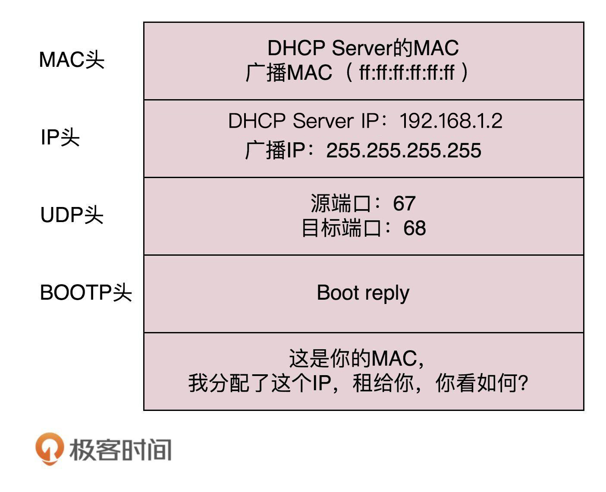

# 网络协议


## 一、通信协议综述


### 1、网络分层的真实含义

#### （1）网络为何要分层？

因为复杂的程序都要分层，这是程序设计的要求，比如一个系统有数据库层、缓存层、Dao层、Service层，Controller层


#### （2）程序是如何工作的？


**收到网络数据报的处理流程：**

当一个网络包从一个网口经过的时候，首先看看要不要进行处理。有些网口配置了混杂模式，凡是经过的，全部都需要进行处理。

拿到网络数据包之后，先从buffer中摘掉二层的头（也即是MAC）。

如果MAC地址和当前MAC相符，说明是发给本机的，于是摘掉三层的头（IP），看看到底是发给本机的还是希望从本机转发出去的。

如果IP地址不是本机，就应该转发出去。如果IP地址是本机的，就是发给自己的。

根据IP头里面的标示，拿掉三层的头，进行下一层的处理，判断到底是TCP还是UDP。

假设是TCP，此时Buffer里面没有三层的头，需要查看四层的头，判断是发起还是应答，又或是一个正常的数据报，然后分别处理不同的逻辑。如果是发起或应答，就可能要发送一个回复包；如果是一个正常的数据包，就需要较给上层应用处理。

交给哪个应用？在四层的头里有端口号，不同的应用监听不同的端口号。如果发现浏览器应用在监听此端口，那就发给浏览器。


类似于离职流程。


**发送网络数据包的流程：**

发起一个Http请求，Buffer里面的Http请求的内容，会在TCP层添加TCP头，记录源端口号和目的端口号

流转到IP层，添加了一个IP头，记录下源IP地址和目的IP地址。

然后就是链路层，添加MAC头，记录源MAC地址和目的MAC地址。


类似于一个资源批复流程


**只要在网络上跑的包，都是完整的，可以有下层没上层，绝对不能有上层没下层**

__所以，对TCP协议来说，三次握手、重试这些操作，只要想发出去包，就要有IP层和MAC层，不然是发不出去的。__


一个HTTP协议的包经过一个二层设备，二层设备收进去的是整个网络包，这里面HTTP、TCP、IP、MAC都有。

**二层设备：**

只把MAC头摘下来，看是丢弃、转发，还是自留

**三层设备：**

把MAC头摘下来后再把IP头摘下来，看到底是丢弃、转发，还是自留。


### 2、ifconfig

```shell
root@test:~# ip addr
1: lo: <LOOPBACK,UP,LOWER_UP> mtu 65536 qdisc noqueue state UNKNOWN group default 
    link/loopback 00:00:00:00:00:00 brd 00:00:00:00:00:00
    inet 127.0.0.1/8 scope host lo
       valid_lft forever preferred_lft forever
    inet6 ::1/128 scope host 
       valid_lft forever preferred_lft forever
2: eth0: <BROADCAST,MULTICAST,UP,LOWER_UP> mtu 1500 qdisc pfifo_fast state UP group default qlen 1000
    link/ether fa:16:3e:c7:79:75 brd ff:ff:ff:ff:ff:ff
    inet 10.100.122.2/24 brd 10.100.122.255 scope global eth0
       valid_lft forever preferred_lft forever
    inet6 fe80::f816:3eff:fec7:7975/64 scope link 
       valid_lft forever preferred_lft forever
```

IP地址是一个网卡在网络世界的通讯地址，相当于门牌号码


#### 无类型域间选路（CIDR）

将32位的IP地址一分为二，前面是网络号，后面是主机号。

例如一个IP地址 10.100.122.2/24，后面有一个斜杠，斜杠后面有个数字24，这种地址表示形式，就是CIDR。

后面24的意思就是在32位的IP地址中，前24位是网络号，后8位是主机号。


伴随着CIDR存在的，一个是**广播地址**，10.100.122.255，如果发送这个地址，所有10.100.122网络里的机器都可以收到，另一个是子网掩码，255.255.255.0。

**将子网掩码和IP地址按位进行AND计算，就是网络号**

例如，IP是10.100.122.2，子网掩码是255.255.255.0，那么网络号就是10.100.122.0。


**公有IP地址和私有IP地址**


私有IP地址允许组织内部的人员自行管理、分配，并且可以重复，比如学校A的某个私有IP地址和学校B的某个私有IP地址是可以一样的

比如家用的Wi-Fi地址一般是192.168.0.x，/24基本够用。

此时192.168.0即为网络号，后面是主机号，而一般192.168.0.1是私有网络的出口地址。192.168.0.255是广播地址。


例如对16.158.165.91/22求网络的第一个地址，子网掩码和广播地址。


这五类地址中，还有一类 D 类是组播地址。使用这一类地址，属于某个组的机器都能收到。这有点类似在公司里面大家都加入了一个邮件组。

在 IP 地址的后面有个 scope，对于 eth0 这张网卡来讲，是 global，说明这张网卡是可以对外的，可以接收来自各个地方的包。对于 lo 来讲，是 host，说明这张网卡仅仅可以供本机相互通信。

lo 全称是 loopback，又称环回接口，往往会被分配到 127.0.0.1 这个地址。这个地址用于本机通信，经过内核处理后直接返回，不会在任何网络中出现。


**MAC地址**

在 IP 地址的上一行是 link/ether fa:16:3e:c7:79:75 brd ff:ff:ff:ff:ff:ff，这个被称为 MAC 地址，是一个网卡的物理地址，用十六进制，6 个 byte 表示。

一个网络包要从一个地方传到另一个地方，除了要有确定的地址，还需要又定位功能，而有门牌号码属性的IP地址，才有远程定位功能。

MAC地址更像是一个身份证，而IP地址就是门牌号。

比如可以根据IP查找到主机在哪一栋楼，用MAC可以在用IP找到的楼中查找到对应的主机。

MAC地址有一定的定位功能，不过范围非常有限，只能局限在一个子网里面。


**网络设备的状态标识**

<BROADCAST,MULTICAST,UP,LOWER_UP>是干什么的？这个叫做 net_device flags，网络设备的状态标识。

UP 表示网卡处于启动的状态；

BROADCAST 表示这个网卡有广播地址，可以发送广播包；

MULTICAST 表示网卡可以发送多播包；

LOWER_UP 表示 L1 是启动的，也即网线插着呢。


~~qdisc pfifo_fast 是什么意思呢？~~

qdisc 全称是 queueing discipline，中文叫排队规则。内核如果需要通过某个网络接口发送数据包，它都需要按照为这个接口配置的 qdisc（排队规则）把数据包加入队列。

最简单的 qdisc 是 pfifo，它不对进入的数据包做任何的处理，数据包采用先入先出的方式通过队列。pfifo_fast 稍微复杂一些，它的队列包括三个波段（band）。在每个波段里面，使用先进先出规则。

三个波段（band）的优先级也不相同。band 0 的优先级最高，band 2 的最低。如果 band 0 里面有数据包，系统就不会处理 band 1 里面的数据包，band 1 和 band 2 之间也是一样。

数据包是按照服务类型（Type of Service，TOS）被分配到三个波段（band）里面的。TOS 是 IP 头里面的一个字段，代表了当前的包是高优先级的，还是低优先级的。


### 3、DHCP与PXE：IP是如何来的，又是怎么没的

**如何配置IP地址：**

使用net-tools：

```
$ sudo ifconfig eth1 10.0.0.1/24
$ sudo ifconfig eth1 up
```

使用iproute2：

```
$ sudo ip addr add 10.0.0.1/24 dev eth1
$ sudo ip link set up eth1
```

Linux上跨网段的调用个流程是，不会直接将包发送到网络上，而是企图将包发送到网关。

比如将机器IP配置位16.157.23.4，需发送数据包到192.168.1.5，是发不出去的。

因为除了源IP和目标IP，还需要MAC，那么目标192.168.1.5的MAC如何获取？

首先Linux会判断目标IP是否是同一网段的，如果是，才会发送ARP请求获取目标主机的MAC地址。

如果不是，就会将包发送到网关。


如果没配置网关的话，那么包根本就发不出去。

如果想要将网关配置成192.168.1.5，是不会配成功的，因为网关要和当前的网络至少一个网卡是同一网段的。


#### **动态主机配置协议DHCP**

当需要对网络随连随用，不需要手动配置静态IP时，就需要这个DHCP。

只需配置一段共享的IP地址，每台新接入的机器都通过DHCP协议，向这个共享的IP地址里申请，然后自动配置好就可以了。用完即还，就相当于是一个IP池，能重复使用。


如果是数据中心里面的服务器，IP一旦配置好，基本不会变化，相当于买断了，而DHCP的方式就是租赁，都是配置好的，即租即用，用完退租即可。


**DHCP的工作方式**

（1）当一台机器新加入一个网络时，只知道自身MAC地址，就会发一个广播数据包，这一步称为**DHCP Discover**

新机器使用IP地址0.0.0.0发送一个广播包，目的IP是255.255.255.255，广播包封装了UDP，UDP封装了BOOTP。

其实DHCP是BOOTP的增强版，抓包可能看到的名称还是BOOTP协议。


（2）如果配置了DHCP Server（相当于IP管理员），收到广播包会立刻知道来了一个新机器

只有 MAC 唯一，IP 管理员才能知道这是一个新人，需要租给它一个 IP 地址，这个过程我们称为**DHCP Offer**。同时，DHCP Server 为此客户保留为它提供的 IP 地址，从而不会为其他 DHCP 客户分配此 IP 地址。



DHCP Server仍然使用广播地址作为目的地址，因为此时新机器还没有IP。服务器还发送了子网掩码、网关和IP地址租用期等信息。

（3）如果新机器收到多个DHCP Offer，一般会选择最先收到的哪个，并向网络发送一个**DHCP Request**广播数据包，包含客户端的MAC地址、接受的IP地址、对应的DHCP Server地址等，并告诉所有DHCP Server它将接受哪台服务器提供的IP地址，请求撤销他们提供的IP地址。


此时，由于还没有得到 DHCP Server 的最后确认，客户端仍然使用 0.0.0.0 为源 IP 地址、255.255.255.255 为目标地址进行广播。在 BOOTP 里面，接受某个 DHCP Server 的分配的 IP。


当 DHCP Server 接收到客户机的 DHCP request 之后，会广播返回给客户机一个 DHCP ACK 消息包，表明已经接受客户机的选择，并将这一 IP 地址的合法租用信息和其他的配置信息都放入该广播包，发给客户机，欢迎它加入网络大家庭。


**IP地址的收回和续租：**

客户机会在租期过去 50% 的时候，直接向为其提供 IP 地址的 DHCP Server 发送 DHCP request 消息包。客户机接收到该服务器回应的 DHCP ACK 消息包，会根据包中所提供的新的租期以及其他已经更新的 TCP/IP 参数，更新自己的配置。这样，IP 租用更新就完成了。


#### 预启动执行环境（PXE）


## 二、底层网络知识详解：从二层到三层


### 1、从物理层到MAC层


**数据链路层**

1. 这个包是发给谁的？谁应该接收？
2. 大家都在发，会不会产生混乱？有没有谁先发、谁后发的规则？
3. 如果发送的时候出现了错误，怎么办？

MAC的全程是Medium Access Control，即媒体访问控制。控制在往媒体上发数据的时候，谁先发，谁后发的问题。防止发生混乱。解决第二个问题，此问题中的规则，学名叫多路访问。

有三种方式解决此问题：

（1）分多车道，每辆车一车道，各走各的，这在计算机网络里叫做信道划分。

（2）限号出行协议，在计网中叫做轮流协议。

（3）先出门，发现很堵，返回，错峰出行，叫随机接入协议。以太网用的就是这种方式。


【发给谁，谁接收？】

此时用到一个物理地址，叫做链路层地址。但是因为第二层主要解决媒体接入控制的问题，所以常被称为MAC地址


第二层的网络包格式。


类型：大部分类型是IP数据包，然后IP里面包含TCP、UDP以及HTTP等。


对于以太网，第二层最后面是CRC，也就是循环冗余检测，通过XOR异或的算法，来计算整个包是否在发送的过程中出现了错误，主要解决第三个问题。


**ARP协议**

已知IP地址，求MAC地址的协议。


发送一个广播数据包，询问某个IP是哪台机器的。


机器本地会有ARP高速缓存，避免每次都是用ARP请求。


**局域网**

需要有一个能把MAC头拿下来，检查一下目标MAC地址，然后根据策略转发的设备，此设备是个二层设备，称为**交换机**


交换机如何知道每个口的电脑的MAC地址？

一个数据包从A发送到B，当交换机收到这个包时，交换机也不知道B在哪，所以只能转发到除源端口的其它所有的口，此时，交换机就会记住MAC_A是A主机的。之后有包的目的地址是MAC_A的，就直接发送到这个口。


在经过多次的数据交换后，交换机就知道了每个口对应的MAC地址，之后就可以进行准确转发了。

每个机器的IP地址会变，所在的口也会变，因而交换机上的学习的结果，称为转发表，是由一个过期时间的。


**重点：**

（1）MAC层是用来解决多路访问的堵车问题的。

（2）ARP通过广播的方式寻找目标MAC地址的，然后会将结果缓存下来。

（3）交换机是有MAC地址学习能力的，学完之后能做到准确转发。


### 2、交换机与VLAN

**拓扑结果是怎么形成的？**

当一个交换机不够用的时候，需要多台交换机，交换机之间连接起来，就形成了一个拓扑结构。


例如两台交换机连着三个局域网，每台局域网上都有多台机器

如果机器1知道机器4的IP但不知道MAC地址，此时机器1发起广播，机器2收到，但IP信息不符，所以不管。交换机A收到广播后，广播到所有其它网口，所以机器3跟机器2一样。

此时交换机B也会收到，也是广播到所有网口，这时机器4发生了应答，于是一个ARP请求就成功完成了。

上述过程中，交换机A和B都知道机器1是左边的网口。当机器2访问机器1时，在不知道机器1的MAC地址时，也会发送ARP请求，此时交换机A知道根据MAC地址知道机器1是在左边的，也就不会进行广播。


**如何解决常见的环路问题？**


当机器1访问机器2的时候，一开始不知道机器2的MAC地址，所以发起一个ARP请求的广播，广播到达机器2，机器2返回MAC地址。

但是问题来了，这两个交换机还是都能够收到广播包的。交换机 A 一开始是不知道机器 2 在哪个局域网的，所以它会把广播消息放到局域网二，在局域网二广播的时候，交换机 B 右边这个网口也是能够收到广播消息的。交换机 B 会将这个广播信息发送到局域网一。局域网一的这个广播消息，又会到达交换机 A 左边的这个接口。交换机 A 这个时候还是不知道机器 2 在哪个局域网，于是将广播包又转发到局域网二。左转左转左转，好像是个圈哦。

当机器1的广播到达A、B时，A和B都存了机器1在左边的情况，如果交换机A转发到局域网2，此时交换机B收到局域网2的转发，交换机B又认为机器1是在右边，此时便造成了混乱。

这就是环路问题。


### 3、ICMP与PING

PING是基于ICMP协议工作的。

ICMP全称是Intenet control message protocol，就是互联网控制报文协议。

类似于侦察兵

  


ICMP报文是封装在IP报文里面的，因为传输指令的时候，肯定是要带上源地址和目的地址，携带信息有限，作为侦察兵要轻装上阵。

ICMP报文有多种类型，不同类型有不同的代码。

最常用的类型是主动请求是8，主动请求的应答是0。


**查询报文类型：**

主动探查敌情，对应的是ICMP的查询报文类型

PING就是查询报文，是一种主动请求，并且获得主动应答的ICMP协议。PING发出的包是符合ICMP协议格式的，不过PING在后面追加了专属的格式。

对PING的主动请求，进行网络抓包，称为**ICMP ECHO REQUEST**，同理主动请求的应答称为**ICMP ECHO REPLY**。

比起原生的ICMP报文，多了两个字段

**标识符**，标识用处，比如派出一小队做敌情侦查，派出另一小队做水源查找

**序号**，派出去的侦察兵进行编号，派10回10，战况良好，派10回1，战况惨烈。

在选项数据中，PING还会存放发起请求的时间，用来计算往返时间。


**差错报文类型：**

由于某种原因导致报文出错，就称为差错报文。

例如：

终点不可达 为 3

源抑制 为 4

超时 为 11

重定向 为 5


**终点不可达：** 小兵：报告，传送粮草到张将军处，结果没送到

原因如下： 网络不可达代码为 0，主机不可达代码为 1，协议不可达代码为 2，端口不可达代码为 3，需要进行分片但设置了不分片位代码为 4。 

网络不可达：没找到地方

主机不可达：找到地方没找到人

协议不可达：到地儿找到人，暗号对不上

需分片单设置了不分片：粮车到半路了，道路狭窄无法通过，无法送达


**源站抑制：** 让源站放慢发送速度。物资太多，消耗不了。


**超时：** 超过设定的时间还未送达


**重定向：** 地址发错了，


 差错报文的结构相对复杂一些。除了前面还是 IP，ICMP 的前 8 字节不变，后面则跟上出错的那个 IP 包的 IP 头和 IP 正文的前 8 个字节。 


**PING：查询报文类型的使用**


1、ping命令执行的时候，源主机首先回构建一个ICMP请求数据包，ICMP数据包内包含多个字段，最重要的有两个。

第一个是类型字段，对于请求数据包来说是 8 ，另一个是顺序号，主要用于区分连续piong的时候发出的多个数据包。

每发出一个请求数据包，顺序号会自动加1，为了能够计算往返时间RTT，会在报文的数据部分插入发送时间。

2、然后，由ICMP协议将此数据包连同源IP地址和目的IP地址一起交至IP层，加上其它信息，构建一个IP数据包。

3、然后，加入MAC头。获取MAC地址后，由数据链路层构建一个数据帧，目的地址是IP层传过来的MAC地址。源地址则是本机的MAC地址还要附加上一些控制信息，依据以太网的介质访问规则，将它们传送出去。

4、主机 B 收到这个数据帧后，先检查它的目的 MAC 地址，并和本机的 MAC 地址对比，如符合，则接收，否则就丢弃。接收后检查该数据帧，将 IP 数据包从帧中提取出来，交给本机的 IP 层。同样，IP 层检查后，将有用的信息提取后交给 ICMP 协议。

5、主机B会构建一个ICMP应答包，应答数据包的类型字段为0，顺序号为接收到的请求数据包中的顺序号，然后在发送给主机B。

6、在规定的时间内，源主机如果没有接到ICMP的应答包，则说明目标主机不可达；如果接收到了ICMP应答包，则说明目标主机可达。此时，源主机会检查，用当前时间减去数据包最初从源主机上发出的时间，就是ICMP数据包的时间延迟。

7、如果跨网段，会涉及到网关的转发、路由器的转发等。但是对于 ICMP 的头来讲，是没什么影响的。会影响的是根据目标 IP 地址，选择路由的下一跳，还有每经过一个路由器到达一个新的局域网，需要换 MAC 头里面的 MAC 地址。


PING是使用了ICMP里面的ECHO REQUEST和ECHO REPLY类型的。


**Traceroute：差错报文类型的使用**

Traceroute的第一个作用就是能设置特殊的TTL，来追踪去往目的地时沿途经过的路由器。

Traceroute的参数指向某个目的IP地址，会发送一个UDP的数据包，将TTL设置成1，一旦遇到一个路由器或一个关卡，请求就结束，返回给源主机。

如果中间的路由器不止一个，遇到第一个就结束，于是，返回一个ICMP包，也就是网络差错包，类型是时间超时。

接下来，将 TTL 设置为 2。第一关过了，第二关就“牺牲”了，那我就知道第二关有多远。如此反复，直到到达目的主机。这样，Traceroute 就拿到了所有的路由器 IP。当然，有的路由器压根不会回这个 ICMP。这也是 Traceroute 一个公网的地址，看不到中间路由的原因。

1、如何知道UDP有没有到达目的主机？

Traceroute会发送一份UDP数据包给目的主机，但它会选择一个不可能的值作为UDP端口号（大于3000）。当数据包到达时，目的主机的UDP模块产生一份“端口不可达”错误ICMP报文。如果数据包没有到达，则可能时超时。


**Traceroute还有一个作用是故意设置不分片，从而确定路径的MTU。**

要做的工作首先是发送分组，并设置“不分片”标志。发送的第一个分组的长度正好与出口 MTU 相等。如果中间遇到窄的关口会被卡住，会发送 ICMP 网络差错包，类型为“需要进行分片但设置了不分片位”。其实，这是人家故意的好吧，每次收到 ICMP“不能分片”差错时就减小分组的长度，直到到达目标主机。


### 4、网关和路由

一旦配置了IP地址和网关，往往就能指定目标地址进行访问了，由于在跨网关访问的时候，牵扯到MAC地址和IP'地址的变化。


在任何一台机器上，当要访问另一个IP地址时候，会先判断目标IP地址和当前IP地址是否在同一个网段。


**如何判断是否处于同一网段？**

需要CIDR和子网掩码


如果是同一网段，不需要用到网关，直接将源地址和目标地址放入IP头中，然后通过ARP获得MAC地址，将源MAC和目的MAC放入MAC头中，发送出去即可。

如果不是同一网段，需要发往默认网关Gateway。网关的地址一定是和源IP地址处于同一网段，往往不是第一个就是第二个，例如192.168.1.0/24这个网段，Gateway一般会是192.168.1.1/24或者192.168.1.2/24


**如何发往默认网关？**

由于是在同一网段，所以只需要在交换机上进行通信即可，也即是使用ARP获取MAC地址，然后封装源IP、目的IP、源MAC、目的MAC发送出去。

网关往往是一个路由器，是一个三层转发的设备。

三层设备就是把MAC和IP头取下来，根据里面的内容，看看数据包具体是往哪里发的。 


路由器是一台设备，有五个网口或网卡，相当于有五只手，分别连着五个局域网，每只手的IP地址都和局域网的IP地址是相同的网段，每只手都是它握住的哪个局域网的网关。

任何一个想发往其它局域网的包，都会到达其中一只手，拿进来后拿下MAC和IP头，然后根据路由算法，选择另一只手，加上IP头和MAC头，发出去。


那么该如何选择哪一只手呢？


**静态路由是什么？**

静态路由，其实就是在路由器上，配置一条一条的规则。按照规则进行出口匹配，也就是选择哪一只手

每当要选择哪个出口时，就一条一条规则匹配，找到符合的规则，就按规则中设置的出口发出去，找下一跳IPX。


**IP头和MAC头是否需要改变？**

MAC地址是一个局域网内才有效的地址，所以，MAC地址只要过了网关，就一定会改变，因为已经换了局域网。

两者主要区别在于IP地址是否改变？不改变IP地址的网关称为**转发网关**；改变IP地址的网关，称为**NAT网关**。


**转发网关：**


在此过程中，每到一个新的局域网，MAC地址都是变化的，但是IP地址都不变，在IP头里卖弄，不会保存任何网关的IP地址。

IP地址在三个局域网内都是可见的，所以网段不会冲突，IP头不改变。

所谓的下一跳就是某个IP要将这个IP地址转换为MAC放入MAC头。


**NAT网关：**

IP地址在局域网内不可见，会发生IP冲突，比如局域网A的192.168.1.101发往局域网B的192.168.1.101，IP是一样的。

类似于是快递地址，首先是广东省，比如外省发往深圳，首先要经过广东省的集散中心。

比如服务器B有一个全国通用IP，定为192.168.56.2，在网关B上，192.168.56.2对应的是192.168.1.101，凡是要访问192.168.56.2的，都转成192.168.1.101


