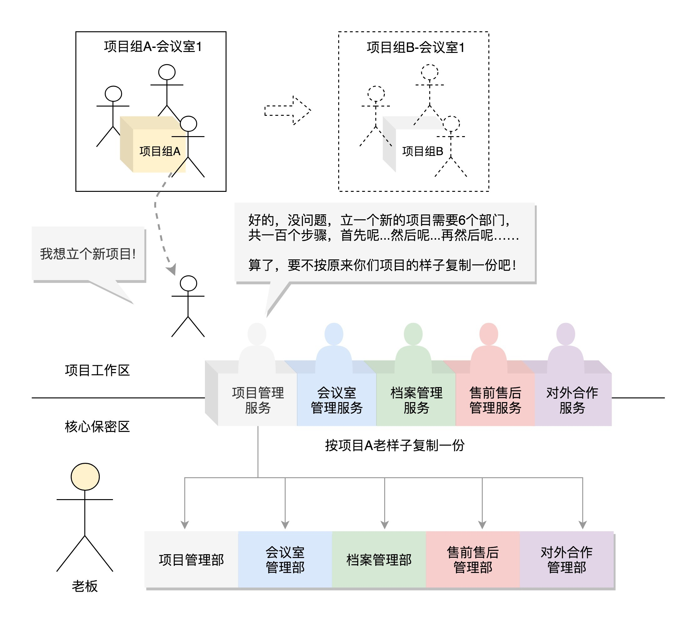
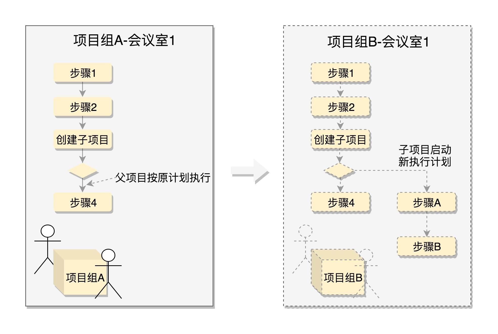
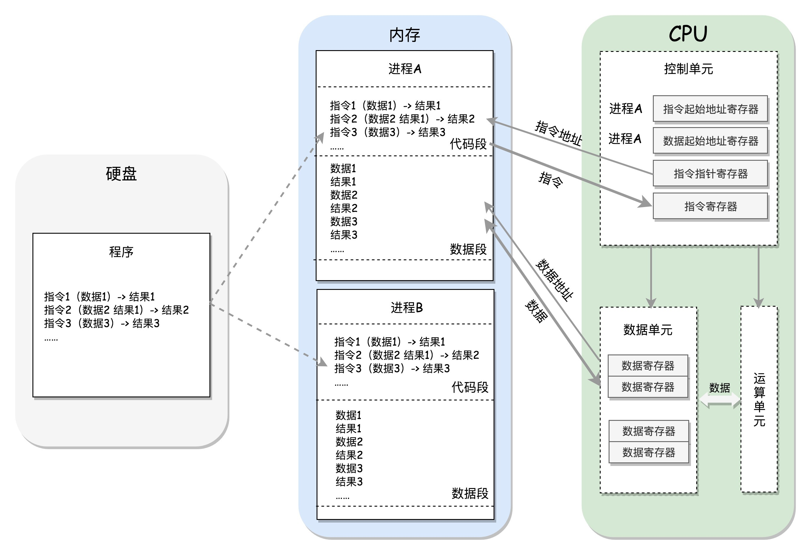
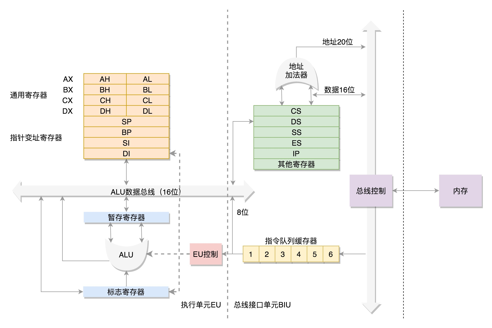

[toc]

# 操作系统

## 一、综述

### 1、简单命令

（1）修改密码 passwd

（2） 新建用户 useradd userName
 		 删除用户 userdel username

 添加的用户指定相应的group用户组
 useradd -g userName group

创建用户的时候，没有说加入哪个组，于是默认就会创建一个同名的组。

（3） 给用户设置密码 passwd password

通过命令创建的用户，其实是放在 /etc/passwd 文件里的
用户组的信息我们放在 /etc/group 文件

（4） 用户组
groupadd groupname　　添加用户组
groupdel groupname　　删除用户组

（5） 查看文件

ls -l 查看所有

如： drwxr-xr-x 6 root root 4096 Oct 20 2017 apt

文件权限

第一个字段剩下的 9 个字符是模式
rwx 表示“读（read）”“写（write）”“执行（execute）” - 表示没有权限

第二个字段是硬链接（hard link）数目

第三个字段是所属用户，第四个字段是所属组。第五个字段是文件的大小，第六个字段是文件被修改的日期，最后是文件名。

（6） 安装软件

CentOS 下面使用rpm -i jdk-XXX_linux-x64_bin.rpm进行安装

Ubuntu 下面使用dpkg -i jdk-XXX_linux-x64_bin.deb

其中 -i 就是 install 的意思。

或者 wget url地址 下载 软件安装文件

（7） 管道技术 |

rpm -qa | grep jdk

grep 表示 筛选搜索带关键词 jdk 的行，并且输出出来。grep 支持正则表达式。

不知道关键词，可以使用rpm -qa | more和rpm -qa | less这两个命令，它们可以将很长的结果分页展示出来

软件管家下载

软件管家，CentOS 下面是 yum，Ubuntu 下面是 apt-get。

例：
安装
yum install java-11-openjdk.x86_64
apt-get install openjdk-9-jdk

卸载
yum erase java-11-openjdk.x86_64
apt-get purge openjdk-9-jdk

软件管家

CentOS 来讲，配置文件在/etc/yum.repos.d/CentOS-Base.repo里
Ubuntu 来讲，配置文件在/etc/apt/sources.list里

（8） 解压

tar.gz tar vxzf xxx.tar 解压

（9） 编辑文件
 vi或者vim ： vim 文件名

i 意思是 insert。进入编辑模式，可以插入、删除字符

先按 esc
然后：wq 保存
然后 :q! 不保存

（10） 启动
一般进入文件bin下 或者指定目录 ./xxx 就可以启动 如：tomcat 启动 ./start

后台运行
nohup xxx & 表示当前启动的进程后台运行 如： nohup COMMAND &

指定进程日志输出
nohup command >out.file 2>&1 &。

这里面，“1”表示文件描述符 1，表示标准输出，“2”表示文件描述符 2，意思是标准错误输出，“2>&1”表示标准输出和错误输出合并了。合并到哪里去呢？到 out.file 里。
查看进程
启动后如何查看进程 ps -ef | grep jdk 查看 jdk的进程

杀进程
kill -9 pid ，pid可以通过 ps -ef | grep jdk 查看 jdk的进程号

（11） 关机重启
shutdown -h now是现在就关机
reboot就是重启。 

### 2、系统调用

#### （1）进程管理

创建进程的系统调用叫**fork**

在Linux中，要创建一个新的进程，需要一个老的进程调用fork来实现，其中老的进程叫**父进程**，新的进程叫**子进程**

  

当父进程调用fork创建进程的时候，子进程将各个子系统为父进程创建的数据结构也全部拷贝了一份，连程序代码都是拷贝过去。

对于fork系统调用的返回值，如果当前进程是子进程，就返回0；如果当前进程是父进程，就返回子进程的进程号。这样就能通过返回值做判断，如果是父进程，接着做原来应该做的事情，如果是子进程，需要请求另一个系统调用execve来执行另一个程序。此时，子进程和父进程就彻底分开了，也就产生了一个分支（fork）。

  

**对于操作系统来说，启动的时候先创建一个所有用户进程的“祖宗进程”。** 

 进程id为1的init进程是用户态所有进程的祖宗，进程id为2的kthread是内核态所有进程的祖宗 

有时，父进程需要知道子进程的运行情况，有个系统调用**waitpid** ，父进程可以调用它，将子进程的进程号作为参数传给它，这样父进程就知道字进程运行完没有，以及是否成功。

#### （2）内存管理

**在操作系统中，每个进程都有自己的内存，互相之间不干扰，有独立的进程内存空间。**

对于进程的内存空间来说，放程序代码的部分称为**代码段**

放进程运行中产生数据的部分，称为**数据段**，其中局部变量的部分，在当前函数执行的时候起作用，当进入另一个函数时，这个变量就释放了，也有动态分配的，会保存较长时间，指明才销毁的，这部分称为**堆**；

进程在写入数据时，发现没有对应的物理内存，会触发一个中断，现分配物理内存。

 两个在堆里面分配内存的系统调用，brk和mmap 

 当分配的内存数量比较小的时候，使用 brk，会和原来的堆的数据连在一起 

 当分配的内存数量比较大的时候，使用 mmap，会重新划分一块区域， 

#### （3）文件管理

 对于文件的操作，下面这六个系统调用是最重要的： 

- 对于已经有的文件，可以使用open打开这个文件，close关闭这个文件；
- 对于没有的文件，可以使用creat创建文件；
- 打开文件以后，可以使用lseek跳到文件的某个位置；
- 可以对文件的内容进行读写，读的系统调用是read，写是write。 

**Linux中，一切皆文件：**

-  启动一个进程，需要一个程序文件，这是一个二进制文件。
- 启动的时候，要加载一些配置文件，例如 yml、properties 等，这是文本文件；启动之后会打印一些日志，如果写到硬盘上，也是文本文件。
- 但是如果我想把日志打印到交互控制台上，在命令行上唰唰地打印出来，这其实也是一个文件，是标准输出 stdout 文件。
- 这个进程的输出可以作为另一个进程的输入，这种方式称为管道，管道也是一个文件。
- 进程可以通过网络和其他进程进行通信，建立的 Socket，也是一个文件。
- 进程需要访问外部设备，设备也是一个文件。
- 文件都被存储在文件夹里面，其实文件夹也是一个文件。
- 进程运行起来，要想看到进程运行的情况，会在 /proc 下面有对应的进程号，还是一系列文件。 

每个文件，Linux都会分配一个**文件描述符**，这是一个整数。通过这个文件描述符，可使用系统调用，查看或干预进程运行的方方面面。

#### （4）信号处理

 经常遇到的信号有以下几种：

- 在执行一个程序的时候，在键盘输入“CTRL+C”，这就是中断的信号，正在执行的命令就会中止退出；
- 如果非法访问内存，例如你跑到别人的会议室，可能会看到不该看的东西；
- 硬件故障，设备出了问题，当然要通知项目组；用户进程通过kill函数，将一个用户信号发送给另一个进程。 

 像 SIGKILL（用于终止一个进程的信号）和 SIGSTOP（用于中止一个进程的信号）是不能忽略的，可以执行对于该信号的默认动作。每种信号都定义了默认的动作，例如硬件故障，默认终止；也可以提供信号处理函数，可以通过sigaction系统调用，注册一个信号处理函数。 

#### （5）进程间通信

 进程间通信方式，消息队列和共享内存 

#### （6）网络通信

 不同机器的通过网络相互通信，要遵循相同的网络协议，也即 TCP/IP 网络协议栈。Linux 内核里有对于网络协议栈的实现。 

 网络服务是通过套接字 Socket 来提供服务的。  在通信之前，双方都要建立一个 Socket 

 以通过 Socket 系统调用建立一个 Socket。Socket 也是一个文件，也有一个文件描述符，也可以通过读写函数进行通信。 

#### （7）Glibc

 Glibc 是 Linux 下使用的开源的标准 C 库，它是 GNU 发布的 libc 库。Glibc 为程序员提供丰富的 API，除了例如字符串处理、数学运算等用户态服务之外，最重要的是封装了操作系统提供的系统服务，即系统调用的封装。 

 每个特定的系统调用对应了至少一个 Glibc 封装的库函数，比如说，系统提供的打开文件系统调用 sys_open 对应的是 Glibc 中的 open 函数。

有时候，Glibc 一个单独的 API 可能调用多个系统调用，比如说，Glibc 提供的 printf 函数就会调用如 sys_open、sys_mmap、sys_write、sys_close 等等系统调用。

也有时候，多个 API 也可能只对应同一个系统调用，如 Glibc 下实现的 malloc、calloc、free 等函数用来分配和释放内存，都利用了内核的 sys_brk 的系统调用。 

  

## 二、系统初始化

### 1、x86架构

  

####  （1）CPU 

包括: 运算单元, 数据单元, 控制单元

- 运算单元 不知道算哪些数据, 结果放哪
- 数据单元 包括 CPU 内部缓存和寄存器, 暂时存放数据和结果
- 控制单元 获取下一条指令, 指导运算单元取数据, 计算, 存放结果

  

#### （2）进程

包含代码段, 数据段等, 以下为 CPU 执行过程:

- 控制单元 通过指令指针寄存器(IP), 取下一条指令, 放入指令寄存器中

- 指令包括操作和目标数据

- 数据单元 根据控制单元的指令, 从数据段读数据到数据寄存器中

- 运算单元 开始计算, 结果暂时存放到数据寄存器

- 两个寄存器, 存当前进程代码段和数据段起始地址, 在进程间切换

  

  

#### （3）总线

  包含两类数据: 地址总线和数据总线

其实总线上主要有两类数据，一个是地址数据，也就是我想拿内存中哪个位置的数据，这类总线叫地址总线（Address Bus）；另一类是真正的数据，这类总线叫数据总线（Data Bus）。 

 地址总线的位数，决定了能访问的地址范围到底有多广。例如只有两位，那 CPU 就只能认 00，01，10，11 四个位置，超过四个位置，就区分不出来了。位数越多，能够访问的位置就越多，能管理的内存的范围也就越广。 

 而数据总线的位数，决定了一次能拿多少个数据进来。例如只有两位，那 CPU 一次只能从内存拿两位数。要想拿八位，就要拿四次。位数越多，一次拿的数据就越多，访问速度也就越快。 

#### （4）x86 开放, 统一, 兼容

- 数据单元 包含 8个 16位通用寄存器, 可分为 2个 8位使用
- 控制单元 包含 IP(指令指针寄存器) 以及 4个段寄存器 CS DS SS ES
-  IP 存放指令偏移量
- 数据偏移量存放在通用寄存器中
    `段地址<<4 + 偏移量` 得到地址

  

 为了暂存数据，8086 处理器内部有 8 个 16 位的通用寄存器，也就是刚才说的 CPU 内部的数据单元，分别是 AX、BX、CX、DX、SP、BP、SI、DI。这些寄存器主要用于在计算过程中暂存数据。 

 这些寄存器比较灵活，其中 AX、BX、CX、DX 可以分成两个 8 位的寄存器来使用，分别是 AH、AL、BH、BL、CH、CL、DH、DL，其中 H 就是 High（高位），L 就是 Low（低位）的意思。 

 IP 寄存器就是指令指针寄存器（Instruction Pointer Register)，指向代码段中下一条指令的位置。CPU 会根据它来不断地将指令从内存的代码段中，加载到 CPU 的指令队列中，然后交给运算单元去执行。 

 如果需要切换进程呢？每个进程都分代码段和数据段，为了指向不同进程的地址空间，有四个 16 位的段寄存器，分别是 CS、DS、SS、ES。 

 其中，CS 就是代码段寄存器（Code Segment Register），通过它可以找到代码在内存中的位置；DS 是数据段的寄存器，通过它可以找到数据在内存中的位置。SS 是栈寄存器（Stack Register）。栈是程序运行中一个特殊的数据结构，数据的存取只能从一端进行，秉承后进先出的原则，push 就是入栈，pop 就是出栈 

#### （5）32 位处理器

- 通用寄存器 从 8个 16位拓展为 8个 32位, 保留 16位和 8位使用方式
- IP 从 16位扩展为 32位, 保持兼容
- 段寄存器仍为 16位, 由段描述符(表格, 缓存到 CPU 中)存储段的起始地址, 由段寄存器选择其中一项
- 保证段地址灵活性与兼容性

\- 16位为实模式, 32位为保护模式
\- 刚开机为实模式, 需要更多内存切换到保护模式 

### 2、bios

- 实模式只有 1MB 内存寻址空间(X86)
- 加电, 重置 CS 为 0xFFFF , IP 为 0x0000, 对应 BIOS 程序
- 0xF0000-0xFFFFF 映射到 BIOS 程序(存储在ROM中), BIOS 做以下三件事:
    - 检查硬件
    - 提供基本输入(中断)输出(显存映射)服务
    - 加载 MBR 到内存(0x7c00)
- MRB: 启动盘第一个扇区(512B, 由 Grub2 写入 boot.img 镜像)
- boot.img 加载 Grub2 的 core.img 镜像
- core.img 包括 diskroot.img, lzma_decompress.img, kernel.img 以及其他模块
- boot.img 先加载运行 diskroot.img, 再由 diskroot.img 加载 core.img 的其他内容
- diskroot.img 解压运行 lzma_compress.img, 由lzma_compress.img 切换到保护模式

-----------

- 切换到保护模式需要做以下三件事:
    - 启用分段, 辅助进程管理
    - 启动分页, 辅助内存管理
    - 打开其他地址线
- lzma_compress.img 解压运行 grub 内核 kernel.img, kernel.img 做以下四件事:
    - 解析 grub.conf 文件
    - 选择操作系统
    - 例如选择 linux16, 会先读取内核头部数据进行检查, 检查通过后加载完整系统内核
    - 启动系统内核

### 3、内核初始化

- 内核初始化, 运行 `start_kernel()` 函数(位于 init/main.c), 初始化做三件事
    - 创建样板进程, 及各个模块初始化
    - 创建管理/创建用户态进程的进程
    - 创建管理/创建内核态进程的进程
---
- 创建样板进程,及各个模块初始化
    - 创建第一个进程, 0号进程. `set_task_stack_end_magic(&init_task)` and `struct task_struct init_task = INIT_TASK(init_task)`
    - 初始化中断, `trap_init()`. 系统调用也是通过发送中断进行, 由 `set_system_intr_gate()` 完成.
    - 初始化内存管理模块, `mm_init()`
    - 初始化进程调度模块, `sched_init()`
    - 初始化基于内存的文件系统 rootfs, `vfs_caches_init()`
        - VFS(虚拟文件系统)将各种文件系统抽象成统一接口
    - 调用 `rest_init()` 完成其他初始化工作
---
- 创建管理/创建用户态进程的进程, 1号进程
    - `rest_init()` 通过 `kernel_thread(kernel_init,...)` 创建 1号进程(工作在用户态).
    - 权限管理
        - x86 提供 4个 Ring 分层权限
        - 操作系统利用: Ring0-内核态(访问核心资源); Ring3-用户态(普通程序)
    - 用户态调用系统调用: 用户态-系统调用-保存寄存器-内核态执行系统调用-恢复寄存器-返回用户态
    - 新进程执行 kernel_init 函数, 先运行 ramdisk 的 /init 程序(位于内存中)
        - 首先加载 ELF 文件
        - 设置用于保存用户态寄存器的结构体
        - 返回进入用户态
        - /init 加载存储设备的驱动
     - kernel_init 函数启动存储设备文件系统上的 init
---
- 创建管理/创建内核态进程的进程, 2号进程
    - `rest_init()` 通过 `kernel_thread(kthreadd,...)` 创建 2号进程(工作在内核态).
    - `kthreadd` 负责所有内核态线程的调度和管理

### 4、系统调用

系统调用是操作系统提供给程序设计人员使用系统服务的接口

系统调用流程

Linux 提供了 glibc 库, 它封装了系统调用接口, 对上层更友好的提供服务, 系统调用最终都会通过 DO_CALL 发起, 这是一个宏定义, 其 32 位和 64 位的定义是不同的
- 32 位系统调用
   - 用户态
      - 将请求参数保存到寄存器
      - 将系统调用名称转为系统调用号保存到寄存器 eax 中
      - 通过软中断 ENTER_KERNEL 进入内核态
   - 内核态
      - 将用户态的寄存器保存到 pt_regs 中
      - 在系统调用函数表 sys_call_table 中根据调用号找到对应的函数
      - 执行函数实现, 将返回值写入 pt_regs 的 ax 位置
      - 通过 INTERRUPT_RETURN 根据 pt_regs 恢复用户态进程

- 64 位系统调用
   - 用户态
      - 将请求参数保存到寄存器
      - 将系统调用名称转为系统调用号保存到寄存器 rax 中
      - **通过 syscall 进入内核态**
   - 内核态
      - 将用户态的寄存器保存到 pt_regs 中
      - 在系统调用函数表 sys_call_table 中根据调用号找到对应的函数
      - 执行函数实现, 将返回值写入 pt_regs 的 ax 位置
      - **通过 sysretq 返回用户态**

