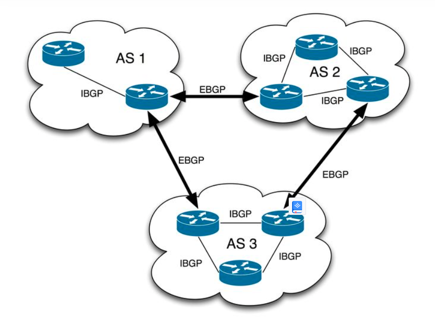

[toc]

## 软件定义网络

## 一、BGP

https://blog.csdn.net/qq_38265137/article/details/80439561

**什么是BGP？**

BGP全称是Border Gateway Protocol，边界网关协议。

BGP是互联网上一个核心的去中心化自治路由协议。

先看看几个相关的概念：

- **AS（Autonomous system）：**自治系统，指在一个组织管辖下的所有IP网络和路由器的全体，他们对互联网执行共同的路由策略，也就是说，对于互联网来说，一个AS是一个独立的整体网络，而BGP实现的网络自治也是指各个AS自治。每个AS有自己唯一的编号。
- **IGP（Interior Gateway Protocol）：**内部网关协议，在一个AS内部所使用的一种路由协议。一个AS内部也可以有多个路由器管理多个网络，各个路由器之间需要路由信息以知道自网络的可达西悉尼，IGP就是用来管理这些路由，代表实现有RIP和OSPF
- **EGP（Exterior Gateway Protocol）：** 外部网关协议，在多个AS直接按使用的一种路由协议，现在被BGP取而代之。

由于BGP就是为了替换EGP而创建，地位与EGP相似，但是BGP也可以应用在一个AS内部。

因此BGP又可以分为IBGP（Interior BGP：同一个AS之间的连接）和EBGP（Exterior BGP：不同AS之间的BGP连接）。

既然EGP已经被替代，那么EBGP存在就较好理解，但是IGP协议都还存在，那IBGP的意义何在？

IGP的协议是针对同一个AS网络来设计的，一个自治网络的规模一般都不大，所以设计的时候就没有考虑大规模网络的情况。而当一个自治网络足够大时，OSPF存在性能瓶颈（后面会说明）。BGP本身就是为了在Internet工作，其设计就是为了满足大型网络的要求，所以大型私有IP网络内部可以使用IBGP。总的来说，这几类路由协议，小规模私有网络IGP，大规模私有网络IBGP，互联网EBGP。

**为什么需要BGP**

**BGP协议**

BGP可以说是最复杂的路由协议，它是应用层协议，其传输层使用TCP，默认端口号是179，因为是应用层协议，可以认为它的连接时可靠的，并且不用考虑底层的工作，例如fragment，确认、重传等等，BGP是唯一使用TCP作为传输层的路由协议，其他的路由协议可能都还到不了传输层。

TCP连接的窗口时65k字节，也就是说TCP连接允许在没有确认包的情况下，连接发送65k的数据，而其他的路由协议，例如EIGRP和OSPF的窗口只有一个数据包，也就是说前一个数据包收到确认包之后，才会发送下一个数据包。当网络规模巨大时，需要传输的数据也相应变大，这样效率是非常低的，这也是他们不适合大规模网络的原因。而正是由于TCP可以可靠的传输大量数据，且互联网的路由信息是巨大的，TCP被选为BGP的传输层协议，并且BgP适合大规模网络环境。

和大部分协议一样，BGP的数据由header和data组成。Header有19个字节，所有的BGP数据的Header格式是一样的。

Marker有16个字节长，存储着同步信息和加密信息。Length2个字节，包含header在内的长度。Type1个字节，表示当前BGP数据的类型，具体有4类：

- Open（Code 1）：TCP连接建立之后，BGP发送的第一个包，收到Open之后，BGP Peer会发送一个Keepalive消息以确认Open，其它所有的消息都只会在Open消息确认之后，并且BGP连接已经建立之后发送。
- Update（Code 2）：BGP连接后的首次Update会交换整个BGP route table，之后的Update只会发送变化了的路由信息，所以说BGP是动态的传输路由消息的变化
- Notification（Code 3）：出错时发送的消息，整个消息一旦发送，BGP连接将会中断
- Keepalive（code 4）：没有data，只有header。用来保持BGP连接，通常是1/3的BGP session hold time。默认是60秒，如果hold time是0，不会发送Keepalive。

每一种BGP数据的data都不相同，这些都由网络设备商实现了，简单看一下Open和Update的data

BGP Open 数据，由于是发送的第一个包，因此就是一些配置信息。例如自身的AS号，BGP连接的超时时间（hold time），BGP id。

BGP Update 数据，主要就是交换Network Layer Reachability Information (NLRI)。一个Update数据包里面只会有一条path的路由信息，因此只有一组path attribute，但是路由可以有多条。具体的说，一个BGP router可能连接了多个BGP peer router，那么它在发送BGP Update数据时，一次只会发送一个它的BGP peer router的信息。

**BGP如何工作**

BGP是一种路径矢量协议（Path vector protocol）的实现，它的工作原理也是基于路径矢量。

BGP route指的是BGP自身维护的路由信息，区分于设备的主路由表

BGP route是BGP协议传输的数据，并存储在BGP router的数据库中，并非所有的BgP route都会写到主路由表。每条BGP route都包含了目的网络、下一跳和完整的路径信息。

路径信息是由AS号组成，当BGP router收到了一条路由信息，如果里面的路径包含了自己的AS号，那他就能判定这是一条自己曾经发出的路由信息，收到的这条路由信息就会被掉地。

把每个BGP服务的实体叫做BGP router，而与BGP router连接的对端叫BGP peer。每个BGP router在收到了peer传来的路由信息，会存储在自己的数据库，路由信息包含很多其他的信息，BGP router会根据自己本地的policy结合路由信息中的内容判断，如果路由西悉尼符合本地policy，BGP router会修改自己的主路由表。

本地的policy可以有很多，举个例子，如果BGP router收到两条路由信息，目的网络一样，但是路径不一样，一个是AS1->AS3->AS5，另一个是AS1->AS2，如果没有其他的特殊policy，BGP router会选用AS1->AS2这条路由信息。policy还有很多其他的，可以实现复杂的控制。

除了修改主路由表，BGP router还会修改这条路由信息，将自己的AS号加在BGP数据中，将下一跳改为自己，并且将自己加在路径信息里。在这之后，这条消息会继续向别的BGP peer发送。而其他的BGP peer就知道了，可以通过指定下一跳到当前BGP router，来达到目的网络地址。

所以说，BGP更像是一个可达协议，可达信息传来传去，本地根据收到的信息判断决策，再应用到路由表。

