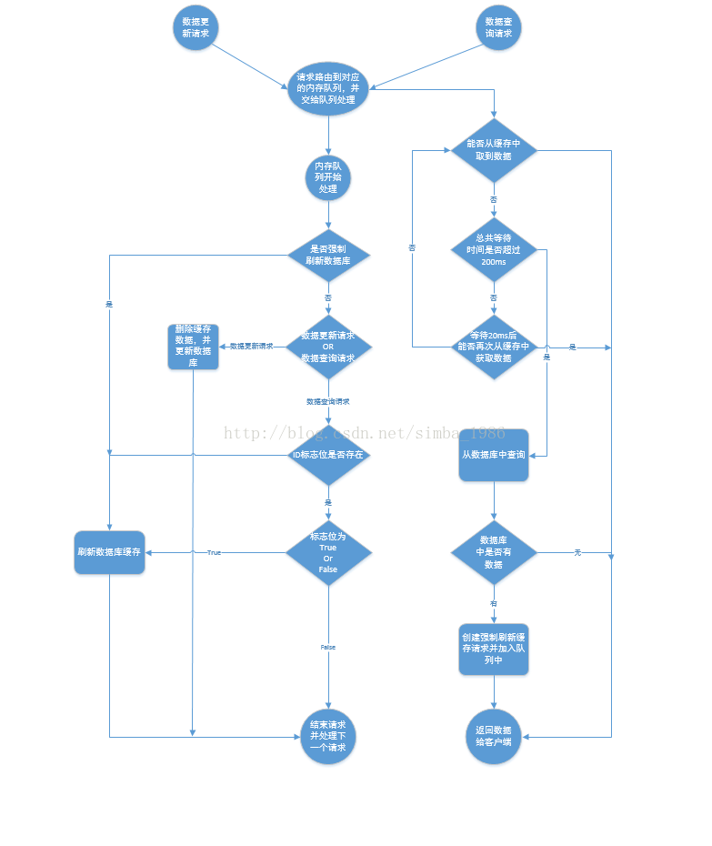
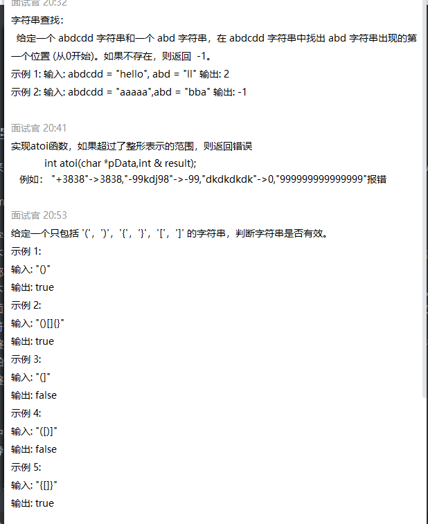

## 阿里境外银行一面：

​	低代码平台类之间如何解耦？

​	redis的在低代码平台的用处？

​	redis集群模式有几种，分别有什么区别？

​	redis集群模式下如果需要增加一台机器怎么进行处理？

​    rabbitmq如何保证可靠性？rabbitmq与kafka有什么区别？

​    dubbo的注册中心用处？在分布式环境下需要有什么特性支撑？

​    hadoop的用法以及es的用处，es的倒排索引是怎么样的，跟正排索引有什么区别？

​	有没有做过数据库的优化？

​	悲观锁和乐观锁的区别？有什么应用场景？

​	有没有做过jvm的优化？G1收集器和cms收集器有什么区别？


## 阿里菜鸟一面：

​	对多线程的看法？

​	线程池的创建方式？

​	线程池的原理？

​	HashMap和ConcurrentHashMap的原理？红黑树原理？

​	高并发如何进行性能优化？

​	如何防止商品超卖？

​	MySQL存储引擎有什么，区别是什么？

​	B树和B+树原理，查找耗时

​	问项目


## 腾讯teg运营开发一面：

​	java构造器有几种

​	java中线程安全是什么

​	java中可变、不可变是什么

​	线程、进程的区别，系统在线程和进程方面如何进行调度

​	类加载机制是怎么样的，

​	是从什么地方进行加载的，如果路径中找不到会怎么样

​	加载了不同版本的jar包会报错吗

​	class文件是如何验证的？具体流程说一下

​	验证失败怎么进行处理？

​	准备过程是怎么样的，如何分配空间，分配多大的空间

​	初始化是怎么样的，具体流程说一下？

​	

**算法题：**

​	将有序链表转换成二叉搜索树

​	


## 阿里菜鸡一面：

1、redis缓存是怎么做的？redis缓存跟数据库不一致的情况怎么处理，数据更新后如何更新缓存和数据库。

解决思路：先删除缓存，再修改数据库。如果数据库修改失败了，那么数据库中是旧数据，缓存中是空的，那么数据不会不一致。因为读的时候缓存没有，则读数据库中旧数据，然后更新到缓存中。

数据发生了变更，先删除了缓存，然后要去修改数据库，此时还没修改。一个请求过来，去读缓存，发现缓存空了，去查询数据库，**查到了修改前的旧数据**，放到了缓存中。随后数据变更的程序完成了数据库的修改。完了，数据库和缓存中的数据不一样了...

遇到这种情况，可以用队列的去解决这个问，创建几个队列，如20个，根据商品的ID去做hash值，然后对队列个数取摸，当有数据更新请求时，先把它丢到队列里去，当更新完后在从队列里去除，如果在更新的过程中，遇到以上场景，先去缓存里看下有没有数据，如果没有，可以先去队列里看是否有相同商品ID在做更新，如果有也把查询的请求发送到队列里去，然后同步等待缓存更新完成。
这里有一个优化点，如果发现队列里有一个查询请求了，那么就不要放新的查询操作进去了，用一个while（true）循环去查询缓存，循环个200MS左右，如果缓存里还没有则直接取数据库的旧数据，一般情况下是可以取到的。





2、为什么重写了equals方法之后一定要重写hashcode方法

​	为了效率

​	hashcode相等，对象不一定相等

​	hashcode不相等，对象一定不相等

3、分库分表是什么，会导致什么问题

4、说一下RabbitMQ，如何进行消息幂等处理


## 腾讯qq音乐：

一面：三道算法题




二面：

1、介绍下java gc

2、介绍下JUC，线程安全方面的

3、mysql事务相关、锁、索引、事务如何实现

4、redis集群模式、数据结构

5、kafka副本是怎么样的、kafka为什么快？

5、select、poll、epoll是怎么样的

6、TCP三次握手、四次挥手、为什么需要三次握手，四次挥手、滑动窗口

7、粘包是什么情况，如何解决？

8、介绍下项目：项目架构、多少人维护、做了多久、用户量、我在其中担任什么角色，做了什么功能。


三面：

1、算法题

（1）去除字符串中的空格

（2）获取字符串的所有子序列

递归解决，每来到一个位置，决定要或不要该位置上的元素，递归边界为直到最后一个位置的后一个位置，打印当前选择好的字符串

```java
public class SubSequences {
    /**
     * 打印字符串的所有子序列
     *
     * @param chars   字符数组
     * @param index 当前所在的字符位置
     * @param res   之前获得的子序列
     */
    public static void printSubSequences(char[] chars, int index, String res) {
        if (index == chars.length) {
            System.out.print(res + " ");
            return;
        }
        printSubSequences(chars,index+1,res);
        printSubSequences(chars,index+1,res+chars[index]);
    }

    public static void main(String[] args) {
        String test = "12345";
        printSubSequences(test.toCharArray(),0,"");
    }
}
```

2、聊一下项目

3、说一下用到的存储系统

4、说一下redis的key是怎么进行hash的？一致性hash算法？Hash的负载因子是多少

5、TCP三次握手中的backlog是怎么样的


backlog这个参数值和三次握手的概念有着密切关联。backlog队列大小 = 未完成三次握手队列 +  已经完成三次握手队列。


未完成三次握手队列：服务器处于listen状态时，收到客户端syn报文（connect）时放入未完成队列中。


已完成三次握手队列：三次握手的第二个状态即服务器syn+ack响应client后，此时第三个状态ack报文到达前（客户端对服务器syn的ack）一直保留在未完成连接队列中。若三次握手完成，该条目将从未完成连接队列搬到已完成连接队列尾部。当server调用accept时，从已完成三次握手队列中的头部取出一个socket连接给进程。


backlog参数设置既可在linux内核参数设置(修改文件/etc/sysctl相关参数)，也可在socket系统调用listen函数时设置(第二个参数)。这二者区别是前者为全局性的，影响所有socket，后者为局部性的，影响当前socket。


若backlog设置过小可能会出现以下情况：server的accpet速度跟不上，导致A、B队列满了，导致新的客户端无法连接。


6、kafka的源码有没有看过

7、linux如何查看磁盘读写性能等


## 字节飞书一面：

1、算法题：

（1）单链表部分反转

（2）旋转数组中查找元素

2、聊项目

3、JVM内存结构，垃圾收集器，GC等

4、多路复用，redis使用了Reactor模式，它为什么快？

5、spring的依赖注入解决了什么问题？

6、说一下java锁机制？对象锁？公平锁？非公平锁？可重入锁？不可重入锁？自旋锁？


二面：

1、算法题

（1）二叉树的最长路径

```java
public int getHeight(TreeNode node){
        if(node == null)
            return 0;
 
        int left = getHeight(node.left);
        int right = getHeight(node.right);
 
        res = Math.max(res, left+right);
        return 1+Math.max(left, right);
    }
```


2、kafka partition底层存储是怎么样的

3、kafka如何确保消息一次消费且只被消费一次

4、kafka如何确保生产者消息发送成功

5、kafka 的消费者在消费成功、失败该怎么处理

6、mysql的innodb底层存储是怎么样的

7、mysql跟hbase的存储结构有什么不一样

8、内存池如何设计

9、进程间通信，最快的方式是什么，内存在内核还是用户态操作

10、TCP/IP如何解决粘包问题


## 腾讯微保

只问项目


## 深信服

### 一面：

项目

JVM

Kafka

spring cloud


编程题：两个线程打印一个列表


## 商汤

### 一面：

1、创建线程方式

2、线程池参数

3、线程池任务怎么执行

4、怎么停止线程池的某个任务

5、泛型是怎么样的

6、泛型有哪几种，运行期能获取泛型参数类型吗，？号怎么用

7、什么时候进行full gc

8、频繁full gc如何排查

9、内存溢出怎么排查

10、mysql的隔离级别、以及会导致什么问题

11、幻读如何解决

12、mysql中要手动加锁还是自动加锁，一条sql是怎么加锁的

13、怎么优化慢查询

14、mvcc是什么

15、mysql索引类型

16、mysql存储引擎以及区别

17、spring ioc、aop等信息，aop底层实现有什么

18、spring cloud全家桶

19、有没看过spring 全家桶源代码

20、spring eureka的流程

21、linux一堆命令，比如查看某个进程pid、只查看PID用什么、查看磁盘使用量、查看线程所用cpu：top -H

22、restful是什么

23、如何设计一个接口：图片和其它信息一起上传？然后扯一堆问题

24、短信接口如何实现，需要考虑什么问题

25、如何方式恶意刷接口行为？人机校验接口如何实现？


## 顺丰数科一面

### **1、tcp粘包是如何导致的？tcp是长连接吗？tcp和http的keepalive有什么区别**

在TCP的socket编程中，发送端和接收端都有成对的socket。发送端为了将多个发往接收端的包，更加高效的的发给接收端，于是采用了优化算法（Nagle算法），将多次间隔较小、数据量较小的数据，合并成一个数据量大的数据块，然后进行封包。那么这样一来，接收端就必须使用高效科学的拆包机制来分辨这些数据。

TCP粘包就是指发送方发送的若干包数据到达接收方时粘成了一包，从接收缓冲区来看，后一包数据的头紧接着前一包数据的尾，出现粘包的原因是多方面的，可能是来自发送方，也可能是来自接收方。


**造成TCP粘包的原因**

（1）发送方原因

TCP默认使用Nagle算法（主要作用：减少网络中报文段的数量），而Nagle算法主要做两件事：

只有上一个分组得到确认，才会发送下一个分组
收集多个小分组，在一个确认到来时一起发送
Nagle算法造成了发送方可能会出现粘包问题

（2）接收方原因

TCP接收到数据包时，并不会马上交到应用层进行处理，或者说应用层并不会立即处理。实际上，TCP将接收到的数据包保存在接收缓存里，然后应用程序主动从缓存读取收到的分组。这样一来，如果TCP接收数据包到缓存的速度大于应用程序从缓存中读取数据包的速度，多个包就会被缓存，应用程序就有可能读取到多个首尾相接粘到一起的包。


**如何处理粘包现象？**
（1）发送方

对于发送方造成的粘包问题，可以通过关闭Nagle算法来解决，使用TCP_NODELAY选项来关闭算法。

（2）接收方

接收方没有办法来处理粘包现象，只能将问题交给应用层来处理。

（2）应用层

应用层的解决办法简单可行，不仅能解决接收方的粘包问题，还可以解决发送方的粘包问题。

解决办法：循环处理，应用程序从接收缓存中读取分组时，读完一条数据，就应该循环读取下一条数据，直到所有数据都被处理完成，但是如何判断每条数据的长度呢？

格式化数据：每条数据有固定的格式（开始符，结束符），这种方法简单易行，但是选择开始符和结束符时一定要确保每条数据的内部不包含开始符和结束符。
发送长度：发送每条数据时，将数据的长度一并发送，例如规定数据的前4位是数据的长度，应用层在处理时可以根据长度来判断每个分组的开始和结束位置。


TCP为了保证可靠传输并减少额外的开销（每次发包都要验证），采用了基于流的传输，基于流的传输不认为消息是一条一条的，是无保护消息边界的（保护消息边界：指传输协议把数据当做一条独立的消息在网上传输，接收端一次只能接受一条独立的消息）。

UDP则是面向消息传输的，是有保护消息边界的，接收方一次只接受一条独立的信息，所以不存在粘包问题。


**HTTP中的keep-alive和TCP中keepalive又有什么区别？**

https://zhuanlan.zhihu.com/p/224595048

1、TCP连接往往就是我们广义理解上的长连接，因为它具备双端连续收发报文的能力；开启了keep-alive的HTTP连接，也是一种长连接，但是它由于协议本身的限制，服务端无法主动发起应用报文。

2、TCP中的keepalive是用来保鲜、保活的；HTTP中的keep-alive机制主要为了让支撑它的TCP连接活的的更久，所以通常又叫做：HTTP [persistent connection](https://www.zhihu.com/search?q=persistent+connection&search_source=Entity&hybrid_search_source=Entity&hybrid_search_extra={"sourceType"%3A"article"%2C"sourceId"%3A224595048})（持久连接） 和 HTTP connection reuse（连接重用）。


### **2、udp会有粘包吗**

### **3、netty的粘包如何处理**

### **4、io多路复用是怎么样的**

### **5、select、poll、epoll是怎么样的**

### **6、mysql索引是如何加快搜索的**

### **7、慢sql如何进行优化**

### **8、limit分页如何进行优化**

### **9、spring transaction会失效吗？**

### **10、数据库和缓存不一致如何处理？**

https://zhuanlan.zhihu.com/p/361997696


**三种**更新策略：

1. 先更新数据库，再更新缓存
2. 先删除缓存，再更新数据库
3. 先更新数据库，再删除缓存


#### (1)先更新数据库，再更新缓存

这套方案，大家是普遍反对的。为什么呢？有如下两点原因。

**原因一（线程安全角度）**

同时有请求A和请求B进行更新操作，那么会出现

- （1）线程A更新了数据库
- （2）线程B更新了数据库
- （3）线程B更新了缓存
- （4）线程A更新了缓存

这就出现请求A更新缓存应该比请求B更新缓存早才对，但是因为网络等原因，B却比A更早更新了缓存。这就导致了脏数据，因此不考虑。


#### (2)先删缓存，再更新数据库

该方案会导致不一致的原因是。同时有一个请求A进行更新操作，另一个请求B进行查询操作。那么会出现如下情形:

（1）请求A进行写操作，删除缓存
（2）请求B查询发现缓存不存在
（3）请求B去数据库查询得到旧值
（4）请求B将旧值写入缓存
（5）请求A将新值写入数据库

上述情况就会导致不一致的情形出现。而且，如果不采用给缓存设置过期时间策略，该数据永远都是脏数据。

**采用[延时双删策略](https://www.zhihu.com/search?q=延时双删策略&search_source=Entity&hybrid_search_source=Entity&hybrid_search_extra={"sourceType"%3A"article"%2C"sourceId"%3A361997696})**


#### (3)先更新数据库，再删缓存

首先，先说一下。老外提出了一个缓存更新套路，名为[《Cache-Aside pattern》](https://link.zhihu.com/?target=https%3A//docs.microsoft.com/en-us/azure/architecture/patterns/cache-aside)。其中就指出

- **失效**：应用程序先从cache取数据，没有得到，则从数据库中取数据，成功后，放到缓存中。
- **命中**：应用程序从cache中取数据，取到后返回。
- **更新**：先把数据存到数据库中，成功后，再让缓存失效。


### **11、性能优化操作时如何利用arthas进行操作的？**

### **12、spring cloud有哪些组件**

### **13、为什么会有Feign组件，跟Ribbon需要自构建http请求如何区分**

### **14、微服务之间怎么进行调用，pod之间如何在网络层相互调用**

### **15、spring循环依赖如何处理？构造注入的循环依赖处理？**

https://blog.csdn.net/u010013573/article/details/90573901


### **16、spring 拦截器、过滤器**


（1）过滤器(Filter)：它依赖于servlet容器。它可以对几乎所有请求进行过滤，但是缺点是一个过滤器实例只能在容器初始化时调用一次。使用过滤器的目的，是用来做一些过滤操作，获取我们想要获取的数据，比如：在Javaweb中，对传入的request、response提前过滤掉一些信息，或者提前设置一些参数，然后再传入servlet或者Controller进行业务逻辑操作。通常用的场景是：在过滤器中修改字符编码（CharacterEncodingFilter）、在过滤器中修改HttpServletRequest的一些参数（XSSFilter(自定义过滤器)），如：过滤低俗文字、危险字符等。


（2）拦截器（Interceptor）：它依赖于web框架，在SpringMVC中就是依赖于SpringMVC框架。在实现上，基于Java的反射机制，属于面向切面编程（AOP）的一种运用，就是在service或者一个方法前，调用一个方法，或者在方法后，调用一个方法，比如动态代理就是拦截器的简单实现，在调用方法前打印出字符串（或者做其它业务逻辑的操作），也可以在调用方法后打印出字符串，甚至在抛出异常的时候做业务逻辑的操作。由于拦截器是基于web框架的调用，因此可以使用Spring的依赖注入（DI）进行一些业务操作，同时一个拦截器实例在一个controller生命周期之内可以多次调用。拦截器可以对静态资源的请求进行拦截处理。


https://blog.csdn.net/zxd1435513775/article/details/80556034


### **17、如何在生产中查看日志，除了elk或其它日志平台，大文本日志如何查看相应时间段的日志？**

https://cloud.tencent.com/developer/article/1579977


### 18、ES如何进行文档搜索


## 字节国际化电商二面：

1、linux进程、线程是什么样的，协程是怎么样的

2、进程线程模型，1:n和1:1有什么区别   https://www.cnblogs.com/Survivalist/p/11527949.html

2、tcp如何确保消息顺序、消息不丢失

3、TCP发送端没接收到接收端返回的ack应该怎么处理

4、传输协议有了解过吗？像protobuf等，该怎么去设计消息体结构，要是文本类消息该如何设计消息体结构

3、https如何进行单方面认证，比如客户端认证服务端

4、线程之间如何进行通信

5、mysql的原子性时怎么样的，如何保证原子性

6、脏读是怎么造成的

7、余额表添加扣减操作，同时添加流水表，如何敲代码，代码演示

8、奇偶链表排序

