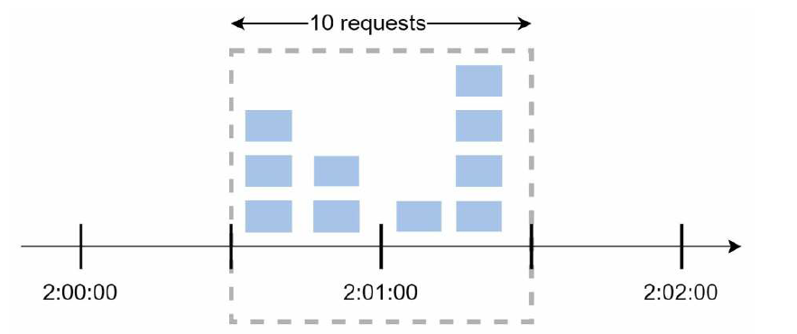
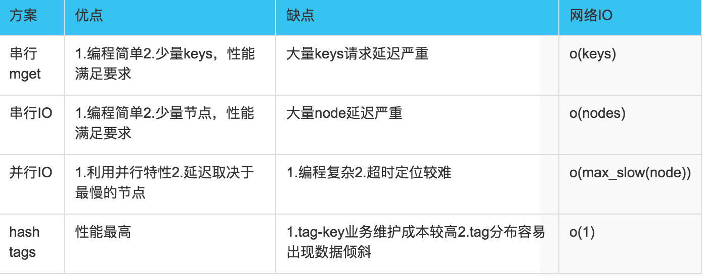
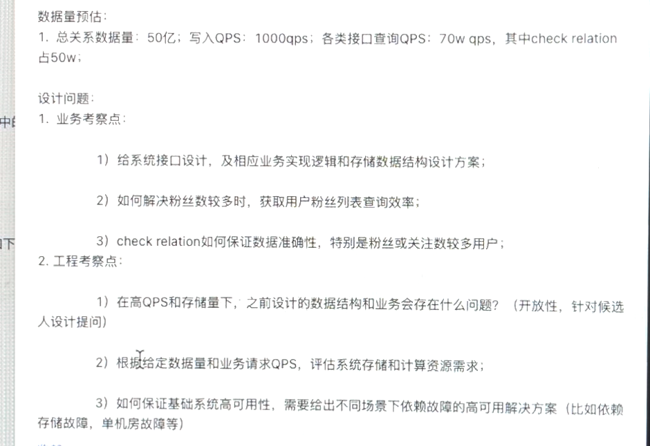
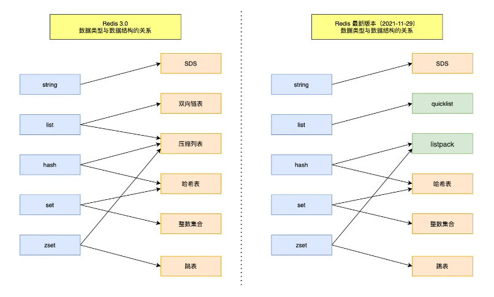

<!-- vscode-markdown-toc -->
* 1. [后端](#)
	* 1.1. [限流器的设计](#-1)
	* 1.2. [短网址系统](#-1)
	* 1.3. [索引FAQ](#FAQ)
	* 1.4. [计数系统设计](#-1)
	* 1.5. [Redis提供了哪几种持久化方式](#Redis)
	* 1.6. [直播消息服务设计](#-1)
		* 1.6.1. [问题：](#-1)
	* 1.7. [秒杀系统设计](#-1)
	* 1.8. [设计一个海量评论系统](#-1)
	* 1.9. [SQL中的Inner、Left、Right Join的区别](#SQLInnerLeftRightJoin)
	* 1.10. [推送去重系统设计](#-1)
	* 1.11. [设计类似微博timeline功能实现，考虑怎么设计支持热门](#timeline)
	* 1.12. [分布式缓存系统设计](#-1)
	* 1.13. [开放API设计](#API)
	* 1.14. [关系系统设计](#-1)
	* 1.15. [Redis过期策略和内存淘汰策略](#Redis-1)
	* 1.16. [乐观锁与悲观锁的区别](#-1)
	* 1.17. [小于n的最大数](#n)
	* 1.18. [Redis实现分布式锁](#Redis-1)
	* 1.19. [Cache设计](#Cache)
	* 1.20. [事务隔离级别](#-1)
	* 1.21. [分布式定时任务管理系统](#-1)
	* 1.22. [B和B+树的区别](#BB)
	* 1.23. [SELECT * FROM table WHERE a > 1and b=2：如何建立索引？](#SELECTFROMtableWHEREa1andb2)
	* 1.24. [区间重复值检测](#-1)
	* 1.25. [Redis热点问题](#Redis-1)
	* 1.26. [从输入网址到获取页面的过程](#-1)
	* 1.27. [Redis数据结构的实现](#Redis-1)
	* 1.28. [并发、并行和异步的区别](#-1)
	* 1.29. [爬虫URL去重](#URL)
	* 1.30. [什么是MVCC](#MVCC)
	* 1.31. [流式join系统该如何设计](#join)
	* 1.32. [什么情况下会进行回表查询、如何解决回表查询、什么是覆盖索引？](#-1)
	* 1.33. [分布式环境下，如何防止RocketMQ被重复消费](#RocketMQ)
	* 1.34. [select/poll/epoll三者的区别](#selectpollepoll)
	* 1.35. [何为对称加密、非对称加密、区别是啥？](#-1)
	* 1.36. [HTTP和HTTPS的区别](#HTTPHTTPS)
	* 1.37. [什么是僵尸进程](#-1)
	* 1.38. [线程同步的方式有哪些](#-1)
	* 1.39. [协程与线程的区别](#-1)
* 2. [算法](#-1)

<!-- vscode-markdown-toc-config
	numbering=true
	autoSave=true
	/vscode-markdown-toc-config -->
<!-- /vscode-markdown-toc -->

##  1. 后端
###  1.1. 限流器的设计
**请设计一个分布式限流器，实现以下功能：**
- 限流器能work，精确度达到99%以上
- 限流阈值大小可以调节，大到1000w qps，小到100 qps
- 通用限流器，不局限在某个业务领域

**答案**

限流算法：
  - 令牌桶
  - 漏桶
  - 固定窗口计数器
  - 滑动窗口日志
  - 滑动窗口计数器

`令牌桶`

令牌桶是固定数量的容器
- 一方面，按照固定速率向桶中添加令牌，桶满后，多余的令牌会被丢弃
- 另一方面，一个请求消耗一个令牌，如果桶中没有令牌了，那么这个请求就被丢弃。

重要参数有桶的大小和填充速率，同时对于不同的api，可能需要不同的桶去控制不同的速率，在高并发时候，对于这两个参数的调整可能会有比较大的挑战。

`漏桶`

也是固定数量的容器
- 一方面，请求进来时，填充到桶中，桶满后请求会被拒绝
- 另一方面，桶中的请求以固定的速率进行处理

重要参数是桶的大小和处理速率，优点是使用队列易实现，缺点是，面对突发流量时，虽然有的请求已经推到队列中了，但是由于消费的速率是固定的，存在效率问题。

`固定窗口计数器`

把时间划分成固定大小的时间窗口，每个窗口分配一个计数器，接收到一个请求，计数器就加一，一旦计数器达到设定的阈值，新的请求就会被丢弃，直到新的时间窗口，新的计数器

缺点在于如果在时间窗口的边缘出现突发流量时，可能会导致通过的请求数超过阈值。
比如前一个窗口快结束时候流量徒增，后一个窗口开始时候流量依旧保持高位，会导致这个时间点的流量qps大于设置阈值

固定窗口计数器的优点是，简单易于理解，缺点是，时间窗口的边缘应对流量高峰时，可能会让通过的请求数超过阈值。

`滑动窗口日志`

假如设定1分钟内最多允许2个请求，每个请求都需要记录请求时间，比如保存在 Redis 的 sorted sets 中，保存之后还需要删除掉过时的日志

过时日志如何算：从当前时间点往前推算一个时间窗口，窗口外的数据就是过时日志。

`滑动窗口计数器`

算法与滑动窗口日志类似，滑动窗口把固定的窗口又分成了很多小的窗口单位，比如下图，每个固定窗口的大小为1分钟，又拆分成了6份，每次移动一个小的单位，保证总和不超过阈值。

**实现**

使用Redis实现高效计数器

利用redis的原子自增和过期淘汰策略
- 限流器的计数存放在redis中，用redis的过期淘汰策略实现限流器的计数的定期更新
- 例如针对 接口A 限流 10000 QPS。redis的key为：“接口A”，value为计数值-每次接口调用Redis
用INC原子自增命令，自增1，并设音过期时间为1s
- 初次调用时，因为redis中该key没有，就直接设置为1，并设音过期时间为1s
- 在这一秒以内的后续调用，每次都自增1-客户端拿到自增后的值如果没有超过限制10000，就放行
  - 如果超过 10000 限制，就不放行，说明超限了
  - 细节实现：为遊免超限后无谓的redis 调用，第一次发现超限时可以记录该值的TTL时间，例如只过去100ms就有1x个请求过来，剩下的900ms就不用请求redis而是直接返回超限即可。不然这种情况会给redis带去额外无谓的流量，例如前面的例子，不做这个细节逻辑的话,redis的请求量是 10W QPS
- 精度可调节。假如限流闻值很大，比如100W，可以把INC自增步进/步长调整大一些，例如100，那么redis的QPS直接降低100倍，为1W QPS

应用：Lyft 是一个开源的限速组件

###  1.2. 短网址系统
1. 分为两个接口
   - 从一个长网址生成一个短网址。需要考虑：同一个长网址，多次创建的短网址是否相同
   - 用户访问短网址时，需要能跳回到原始的长网址
2. 需要考虑跨机房部署问题

**答案**

1. 一开始需要能考虑系统承载容量，例如：
    - 每天100亿访问量
    - 每天生成100ov条短网址记录
2. 然后考虑短网址的生成算法，方案有很多种
    - 最简单实现：白增id实现，这个不可逆，同一个长网址会生成多个短网址
    - hash+序号冲突
    - 使用kv存储双向对应关系，可逆，但存储用量比较大
3. 302跳转问题，附带可以讨论网址访问量计数问题

考虑点：
1. 重定向是用301还是302
   1. 301，代表 永久重定向，也就是说第一次请求拿到长链接后，下次浏览器再去请求短链的话，不会向短网址服务器请求了，而是直接从浏览器的缓存里拿，这样在 server 层面就无法获取到短网址的点击数了，如果这个链接刚好是某个活动的链接，也就无法分析此活动的效果。所以我们一般不采用 301。
   2. 302，代表 临时重定向，也就是说每次去请求短链都会去请求短网址服务器（除非响应中用 Cache-Control 或 Expired 暗示浏览器缓存）,这样就便于 server 统计点击数，所以虽然用 302 会给 server 增加一点压力，但在数据异常重要的今天，这点代码是值得的，所以推荐使用 302！
2. 短链生成的几种方法
   1. 哈希算法
      1. 解决冲突：如果数据存储在mysql中，可以用唯一索引检测，如果有冲突，在长链接上拼接固定字符再进行hash，后续去除固定字符即可。优化：可以使用布隆过滤器在插入数据的时候先检测一遍。
      2. 缩短域名：得到hash值之后可以转换成62进制字符串。6 位 62 进制数可表示 568 亿的数，应付长链转换绰绰有余
   2. 自增ID算法
      1. UUID
         1. UUID是一类算法的统称，具体有不同的实现。UUID的有点是每台机器可以独立产生ID，理论上保证不会重复，所以天然是分布式的，缺点是生成的ID太长，不仅占用内存，而且索引查询效率低。
      2. 多台mysql服务器，
         1. 假设用8台MySQL服务器协同工作，第一台MySQL初始值是1，每次自增8，第二台MySQL初始值是2，每次自增8，依次类推。前面用一个 round-robin load balancer 挡着，每来一个请求，由 round-robin balancer 随机地将请求发给8台MySQL中的任意一个，然后返回一个ID。
      3. Redis自增
      4. 雪花算法
         1. 最高位不用，永远为0，其余三组bit占位均可浮动，看具体的业务需求而定。默认情况下41bit的时间戳可以支持该算法使用到2082年，10bit的工作机器id可以支持1023台机器，序列号支持1毫秒产生4095个自增序列id。
3. 预防攻击
   1. 限制IP请求数

###  1.3. 索引FAQ
`什么时候应该创建索引？`
- 主键
- 需要进行排序和范围检索的字段
- 需要进行检索的字段

`什么时候不应该创建索引？`
- 查询中很少使用的字段
- 区分度很低的字段，比如性别
- 类型是text、image或者二进制的字段
- 当修改性能远远大于检索性能时，不应该创建索引。因为修改性能和检索性能是矛盾的，

###  1.4. 计数系统设计
主要功能要求根据业务需求直询指定的文章的计数统计（播放数，问读数，评论数等）
要求：支持实时更新各种计数，支持高并发查询，需要给出系统存储设计方案，对外输出接口设计；

**答案：**
- 方案一
  - 数据库+cache，数据量大之后可以采用分库分表，扩展性有限，但是开发运维成本低，性能方面通过cache优化，存在热点数据。
- 方案二
  - 使用Redis作为kv存储，查询效率够高，有资源问题，假设有10亿数据，如何保证以更低的成本满足该需求。
- 方案三
  - 自研counter模块，需要考感kv存储方案，value的设计，保证使用更少内存；还需要考虑的点：容灾备份机制；数据扩展问题；
- 方案四
  - 可能业务方经常新增计数需求，需要考虑counter服务的列扩展性，故设计的数据结构需要考虑列扩展问题；

数据库 + 缓存的方案是计数系统的初级阶段，完全可以支撑中小访问量和存储量的存储服务。如果你的项目还处在初级阶段，量级还不是很大，那么你一开始可以考虑使用这种方案。

通过对原生 Redis 组件的改造，我们可以极大地减小存储数据的内存开销。

使用 SSD+ 内存的方案可以最终解决存储计数数据的成本问题。这个方式适用于冷热数据明显的场景，你在使用时需要考虑如何将内存中的数据做换入换出。

###  1.5. Redis提供了哪几种持久化方式
`AOF`

记录每次对服务器写的操作，当服务器重启的时候就会读取aof文件执行命令进行恢复数据，在aof文件大于64m的时候，会进行重写，重写后对每个key的命令只保留最新一条，进行体积压缩。

`RDB`

RDB持久化方式能够在指定的时间间隔能对你的数据进行快照存储

###  1.6. 直播消息服务设计

直播间内的聊天、弹幕、礼物等消息，都是通过消息服务发送。
####  1.6.1. 问题：
1. 设计一个消息服务，支持直播问内的用户进行聊天、发弹幕等操作
2. 衡量一个消息服务的核心指标有哪些？
3. 基于候选者的方案，如何监控和优化这些核心指标？
4. (深入）拉模型的分布式方案

**答案**

主要有推模型和拉模型

`推模型`

基于长链接，直播间内产生的消息，异步通过长链接发送给直播间内的其他观众

1. 长连接的架构（协议、鉴权、折容、重连、到达率等）
2. 消息放大问题如何解洪（比如一个有1万人的房间，任何一个人发的消息，都会产生1万个消息，相当于放大了1万倍）
   
    消息聚合、消息多級推送（类似CDN的方式）
3. 直播间用户列表怎么存储和优化

    推送消息时，需要房间内所有用户消息，对于观众比较多的房间，需要考虑数据分片、本地缓存等手段进行优化

`拉模型`

拉模型是把直播间的消息都存储在消息队列中，直播间内的用户通过前端轮询拉取消息

1. 房间的消息如何存储（由于消息有时效性，所以只需要存储最近一段时间的数据)
2. 轮询方式如何优化
3. 拉接口如何优化 (ocal cache等）

`核心指标`

消息每秒吞吐量、消息到达率、消息延时 （像稳定性这种，属于通用的基本指标）

`核心的优化方式（提供一些方式，其它的只要合理即可)`

监控方式：
1. 吞吐量（类似于 qps，打metrics等都可以）
2. 到达率：对于推模型，基本等价于长连接的到达率监控：对于拉模型，性价比较高的是只监控主播的（因为只有主播是全程在直播间的)
3. 延时：需要关注手机和服务端的时间不一致的问题

优化：
1. 吞吐量：批量发送、多级推送等
2. 到达率：一股推模型需要重点关注，主要是对于长连接的到达率优化，包含死连接检测等
3. 延时：一般拉模型需要重点关注，对于每次都拉到消息的房间，减少轮询间隔和长连接拉模式等。

###  1.7. 秒杀系统设计

设计要点：
1. 可以支撑QPS 100万，能分析系统的瓶颈
2. 如何尽快把商品卖完，但不能超卖
3. 考察系统扩展性、容灾能力

`答案`

参考： 
- https://cloud.tencent.com/developer/article/1520361
- https://blog.51cto.com/u_13540373/5457725
- https://gongfukangee.github.io/2019/06/09/SecondsKill/

秒杀系统特点：
- 高性能：秒杀涉及大量的并发读和并发写，因此支持高并发访问这点非常关键
- 一致性：秒杀商品减库存的实现方式同样关键，有限数量的商品在同一时刻被很多倍的请求同时来减库存，在大并发更新的过程中都要保证数据的准确性。
- 高可用：秒杀时会在一瞬间涌入大量的流量，为了避免系统宕机，保证高可用，需要做好流量限制

优化思路：
- 后端优化：将请求尽量拦截在系统上游
  - 限流：屏蔽掉无用的流量，允许少部分流量走后端。假设现在库存为 10，有 1000 个购买请求，最终只有 10 个可以成功，99% 的请求都是无效请求
  - 削峰：秒杀请求在时间上高度集中于某一个时间点，瞬时流量容易压垮系统，因此需要对流量进行削峰处理，缓冲瞬时流量，尽量让服务器对资源进行平缓处理
  - 异步：将同步请求转换为异步请求，来提高并发量，本质也是削峰处理
  - 利用缓存：创建订单时，每次都需要先查询判断库存，只有少部分成功的请求才会创建订单，因此可以将商品信息放在缓存中，减少数据库查询
  - 负载均衡：利用 Nginx 等使用多个服务器并发处理请求，减少单个服务器压力
- 前端优化：
  - 限流：前端答题或验证码，来分散用户的请求
  - 禁止重复提交：限定每个用户发起一次秒杀后，需等待才可以发起另一次请求，从而减少用户的重复请求
  - 本地标记：用户成功秒杀到商品后，将提交按钮置灰，禁止用户再次提交请求
  - 动静分离：将前端静态数据直接缓存到离用户最近的地方，比如用户浏览器、CDN 或者服务端的缓存中
- 防作弊优化：
  - 隐藏秒杀接口：如果秒杀地址直接暴露，在秒杀开始前可能会被恶意用户来刷接口，因此需要在没到秒杀开始时间不能获取秒杀接口，只有秒杀开始了，才返回秒杀地址 url 和验证 MD5，用户拿到这两个数据才可以进行秒杀
  - 同一个账号多次发出请求：在前端优化的禁止重复提交可以进行优化；也可以使用 Redis 标志位，每个用户的所有请求都尝试在 Redis 中插入一个 userId_secondsKill 标志位，成功插入的才可以执行后续的秒杀逻辑，其他被过滤掉，执行完秒杀逻辑后，删除标志位
  - 多个账号一次性发出多个请求：一般这种请求都来自同一个 IP 地址，可以检测 IP 的请求频率，如果过于频繁则弹出一个验证码
  - 多个账号不同 IP 发起不同请求：这种一般都是僵尸账号，检测账号的活跃度或者等级等信息，来进行限制。比如微博抽奖，用 iphone 的年轻女性用户中奖几率更大。通过用户画像限制僵尸号无法参与秒杀或秒杀不能成功

###  1.8. 设计一个海量评论系统
如何设计海量评论存储系统，支持快速大量的写入及任意翻页的需求。

主要是看候选人对"复杂”业务的分解，在实际存储时是否会通过类似二級索引1的方式来优化翻页效率；
在业务上冷热数据的不同缓存处理；是否会考虑使用缓冲区避免突发流量的写入；

偶尔会关联问到全局唯一1D的设计方茶。

如果获取评论列表的时候，支持技照一定热度对评论进行排序，又该如何进行设计；

`答案`

1. 评论大量写入优化方案：id分配策略，写入量太多如何进行扩展（自己实现分片策略或者采用分布式存储系统）
2. 查询方面如果按照时间逆序，索引可以采用zset方式，但需要考虑单个文章评论索引太多问题，故可以采用自建索引或利用redis等拆分索引大小；其次需要考虑删除评论，索引中大片数据无法使用的情况，采用重建索引还是提供删除索引。
3. 个性化排序的情况下，索引该如何进行调整
4. 容错机制。

可供参考：
- https://www.bilibili.com/read/cv20346888/
- http://www.text3.cn/blog-343333439.html

###  1.9. SQL中的Inner、Left、Right Join的区别
- Inner Join： 内连操作，将符合on条件的A、B表的数据都筛选出来
- Left Join：左连接，A表全表输出，将符合on条件的B表数据左连接到A中进行输出，然后将合并后的A表进行输出。
- Right Join：右连接，右联顾名思义是，特符合ON条件的A表结果搜索出来，然后右联到B表上，然后将合并后的B表输出

###  1.10. 推送去重系统设计
推送系统去重模块设计：新闻app几亿的活跃设备数，运营日常推送时，会针对同一篇新闻进行多维度推送，比如先推送一次北京用户，再补推一次时政用户，再推一次全国用户。同一个用户可能会被匹配到多次，要如何避免用户收到重复的推送。

`答案`

去重必定会有状态，所以该系统设计的核心点在于状态的存储，特点就是数据量大，去重要求精确

1. 分布式kv存储，比如redis、memcache，去重模块本身无状态
2. 本地redis或memcache方案，去重模块按照用户分片
3. 能根据状态数据的特性，考点自己实现存储，并且实现半持久化（程序重启数据不丢），内存+磁盘存储可满足需求
4. 基于共享内存（或类似的础盘文件映射mmap等方式），并且能较好的给出基于块存储实现Hash的表，以及Hash表的增加和查询。因为数据量大，存储需要考虑很多优化方案，基于bit的探作等。
5. 进一步考虑到推送数据清除问题。只保留近一天的推送数据即可。

###  1.11. 设计类似微博timeline功能实现，考虑怎么设计支持热门
设计类似微博timeline功能，好友发表了最新的微博之后，能够在自己的feed流中按照时间顺序获取到最新的微博，也能通过加载更多功能获取之前历史中的微博数据。
如果考虑支特按照热度对好友微博进行排序展现，热度主要根据用户阅读，评论和点獎效据评估，该系统该如何扩展。

`答案`

- 写入系统
  - 设计写入服务、帖子Id分配器（全局ID分配器）
  - qps徒增问题使用限流等解决
  - qps较高时，采用分片等方式提高写入效率，也可以采用写入效率较高的分布式存储系统
- 索引构建
  - 由于要支持timeline或者其他的排序方式，故需要单独的排序策略，这里单独针对timeline排序详细说明，timeline按照发表者时间顺序，一般有3种处理方式
    - 拉的方式，按照发布者建立时间家引，需要考虑关注人数较多时，获取家引效率问题；
    - 推模式：发布的时通过异步消息队列，将消息投递到各 个阅读者，此处主要问题推的效率和存储室间的开销；
    - 混合模式：粉丝较多用户采用拉模式，在线用户直接投递等提高查询效率；
- 如果是热点排序：
  - 全局热点比较简单，可以直接维护一个热度计算模块。接入热度事件计算流，如果事件较多，则可以使用分布式实时计算框架提高计算效率，对于热度超过一定阈值的进入到热度排序系统中，按照从高到底排序即可 (热度排序系统技照一定量截断多余数据)；如果热度支持不同时间段分别组织；
  - 其次如果按照话题拆分呢？又如何设置热度排序系统？

参考： https://juejin.cn/post/7025208419875291166

###  1.12. 分布式缓存系统设计
对数据查询访问效率比较大，但数据量有比较大，单机cache无法满足业务需求，故需要实现一个分布式cache系统，满足业务查询效率和数据童要求，请设计这样一个系统。

答案：
- 基础数据结构采用hash或map都可以
- 线程安全性、查询效率、是否分桶等
- 分布式环境下，主要考虑分片方案，如何做到使用者透明、怎么解决单点故障问题、缓存雪崩等。

缓存带来的问题：
- 数据不一致性
- 代码复杂性增加
- 维护成本增加

可以从以下几个方面考虑缓存系统设计：
- 缓存的更新方面
  - 采用何种方案更新缓存
    - 比如LRU、LFU、FIFO，这三种都是内存不够用时采用的缓存淘汰策略，适合内存有限、数据变动较少
  - 超时剔除
    - 缓存过期时间，比如Redis可以设置expire，时间较难控制，会有缓存跟数据在一定时间内不一致的情况
  - 主动更新
    - 更新数据后需要同步更新缓存，一致性较高、维护成本高
  - 对一致性要求不高的，可以使用一二种结合，反之则使用二三结合。
- 缓存穿透优化
  - 缓存空对象
    - 如果大量数据不存在的情况下，容易造成内存被大量空对象占用，有效的数据反而不能被缓存起来
    - 优化：判断业务范围，对于不存在范围内的数据，直接返回；给空对象一个过期时间，防止长时间占用内存。
  - 布隆过滤器
  - 上述两种方案可以进行结合
- 雪崩优化
  - 保障缓存服务的高可用性，比如一主多从，Redis Sentinel机制
  - 后台服务在流量徒增的时候进行降级或限流，保护下游服务
  - 项目资源隔离，避免一个服务的崩溃影响其他服务
  - 超时时间需要带有随机性。
- 热点Key重建优化
  - 当缓存失效的瞬间，将会有大量线程来重建缓存，造成后端负载加大，甚至让应该崩溃。要解决这个问题有以下方案：
    - 互斥锁：保证只有一个线程在重建缓存，其他线程拿到旧值直接返回
    - 永不过期：定期更新数据或者主动更新
    - 后端限流：只有部分请求落到了后端, 其它的都打回去了。一个hot key 只要有一个重建请求处理成功了,后面的请求都是直接走缓存了，问题就解决了
- 无底洞优化：添加节点后，缓存并未增加效率，比如redis通过mget获取数据，会向多个节点请求数据，网络开销会比较大
  - 

参考：https://zhuanlan.zhihu.com/p/55303228

###  1.13. 开放API设计

考虑点：
- 鉴权
- 防攻击
- 限流
- 反爬取、封禁
- 参数签名、防篡改
- https、接口统一规范（错误码、格式）数据库、cache等

参考： https://www.cnblogs.com/huangjinyong/p/10508686.html

###  1.14. 关系系统设计
1. 获取用户的关注和粉丝列表；
2. 获取用户关注和粉丝计数；
3. 给定多个用户，判断用户是否关注，是否为指定用户的粉丝，是否为双向关系;

考虑点：
1. 接口设计：给出满足需求的接口设计
2. 业务逻辑：支持给出4中功能的系統实现方法 
3. 存储扩展性：数据库分库分表，或者使用kV系统单独提供均可，如果在kv系统中能够想到value的优化方案可适当加分； 
4. 优化：关注数较多情况下，如何提高查询效率；

参考：
  - https://cloud.tencent.com/developer/article/1677139
  - https://zhuanlan.zhihu.com/p/186197535

（1）好友业务是一个典型的多对多关系，又分为强好友与弱好友；

（2）数据冗余是一个常见的多对多业务数据水平切分实践；

（3）冗余数据的常见方案有三种：

         （3.1）服务同步冗余；

         （3.2）服务异步冗余；

         （3.3）线下异步冗余；

（4）数据冗余会带来一致性问题，高吞吐互联网业务，要想完全保证事务一致性很难，常见的实践是最终一致性；

（5）最终一致性的常见实践是，尽快找到不一致，并修复数据，常见方案有三种：

         （5.1）线下全量扫描法；

         （5.2）线下增量扫描法；

         （5.3）线上实时检测法；

###  1.15. Redis过期策略和内存淘汰策略
**过期策略：**

- 定期删除
  - 定期10秒，获取20个key，将过期的删除掉，如果超过1/4，则再次轮训重复，整体时间超过25ms退出循环
- 惰性删除

**内存淘汰策略：**

- 内存满了直接丢弃
- all-ttl
- all-random
- all-lru
- all-lfu
- 过期-ttl
- 过期-random
- 过期-lru
- 过期-lfu

###  1.16. 乐观锁与悲观锁的区别
`悲观锁`

假定会发生并发冲突，屏蔽一切可能违反数据完整性的操作。

- 对数据的更改必须要进行加锁，这样就会导致悲观锁的并发访问性低下。

`乐观锁`

假设不会发生并发冲突，只在提交操作时检查是否违反数据完整性，无法解决脏读问题。

###  1.17. 小于n的最大数
给定一个数n，如23121；给定一组数宇 A 如{2,4,9}，求由A 中元素组成的、小于n的最大数，如小于 23121 的最大数为 22999。

大体思路是，从最高位向最低位构造目标数，用 A 中尽量大的元素（但要小于等于n的相应位数宇）。一旦目标数中有一位数宇小于相应位的数宇，剩余低位可用 A 中最大元素填充。

###  1.18. Redis实现分布式锁
参考：https://juejin.cn/post/6844904082860146695#neading-

考虑点：过期时间、value的设置、超时锁被释放导致的数据更新等

**setnx**

- 需要设置过期时间，防止死锁、宕机等情况持续持有锁
- value可以设置为线程的id（唯一性），避免持有锁的线程A操作超时后，锁被其他线程B持有，A线程继续操作时把锁删除，此时B线程去删除锁的时候就很茫然，
  - 解锁的时候先获取值，然后再删除key，但这两步操作并非原子，所以需要使用lua脚本。

**redlock**

只要(N/2) + 1个节点加锁成功，那么就认为获取了锁， 解锁时将所有实例解锁。 流程为：

- 顺序向五个节点请求加锁
- 根据一定的超时时间来推断是不是跳过该节点
- 三个节点加锁成功并且花费时间小于锁的有效期
- 认定加锁成功

也就是说，假设锁30秒过期，三个节点加锁花了31秒，自然是加锁失败了。

**redisson**

###  1.19. Cache设计
设计一个对象cache，他支持下列两个基本操作：
- set(id, object)，根据id设置对象；
- get(id)：根据id得到一个对象：

同时它有下面几个性质：
1：x秒自动过期，如果cache内的对象，x秒内没有被get或 者set过，则会自动过期；
2：对象数限制，该cache可以设置一个n，表示cache最多能存储的对象数：
3: LRU蛋换，当进行set探作时，如果此时cache内对象数已经到达了口个，则cache自动将最久未被使用过的那个对象别除，腾出空间放置新对象
请你设计这样一个cache

`答案`

内部维护一个链表，list，其元素为一个三元组(ID, timestamp, obj)，分别为对象ID，上次被访问时间，和对象内容

在维护该list时，需要保持一个性质，越靠后的元素超新，既timestamp越大;

内部再维护一个map，该map表示一个ID到list节点的索引，格式为map(ID,node);

对于get(id)操作：
1. 先在map中查找1D对应的list node;
2. 特nodeAlist中取出，即list.Remove (node);
3. 检查node.timestamp，如果过期，则返回null，表示无数据，井将D从map中删除，
4. 如果未过期，设置node.timestamp =now0，并将node添加到list尾部，即list.Append(pode);
5. 返回node.obj;

对于set(id, obj)操作：
1. 同get(id)的1~3步操作，删除对应的ID;
2. 如果此时室间满了，既对象数为n，则将ist中表头的那个元索删除：
3. 更新list和map: node =new(ID, now0, obj), list.Append (node), map[ID]=node;

###  1.20. 事务隔离级别
（1）READ UNCOMMITTED  未提交读

事务所做的修改，即使未提交，对其他事务也是可见的。事务可以读取未提交的数据，也成为脏读。

（2）READ COMMITTED 提交读，也称不可重复读

一个事务从开始直到提交之前，所作的修改对其他事务是不可见的。也称为不可重复读，因为执行多次一样的查询，可能得到不一样的结果。

（3）REPEATABLE READ 可重复读

同一个事务中多次读取同样的记录的结果是一样的。可能导致幻读，在多次读取间隙中，可能有其它事务插入新的记录，就会出现幻读。

MySQL的默认事务隔离级别。

（4）SERIALIZABLE 可串行化

最高隔离级别，强制事务串行执行，避免了幻读的问题。

###  1.21. 分布式定时任务管理系统
设计一个分布式定时任务管理系统，按照业务需求，解決任务管理和资源分配问题

考虑点：
- 任务提交管理
- 定时器
- 分布式的任务调度
- 失败容错机制

**设计思路：**

核心就是将调度和任务进行解藕，任务节点是分布式的，通过特定的均衡调度算法触发指定节点上的任务执行，如果节点运行异常就将任务调度到其他节点上重试，提供系统整体稳定性和扩展性。

- 调度模块（调度中心）： 负责管理调度信息，按照调度配置发出调度请求，自身不承担业务执行。调度系统与任务解耦，提高了系统可用性和稳定性，同时调度系统性能不再受限于任务模块；支持可视化、简单且动态的调度信息管理，包括任务新建、更新、删除、调度运行和任务告警等。所有上述操作都会实时生效，同时支持监控调度结果以及执行日志，支持执行器故障转移。

- 执行模块（执行器）：负责接收调度请求并执行任务的业务逻辑。任务模块专注于任务的执行等操作，开发和维护更加简单和高效；任务一般是“无状态”的，在任何一个节点运行都可以。执行模块接收调度中心的执行请求、终止请求和日志请求等。

参考：
https://yeqown.xyz/2022/01/27/设计一个分布式定时任务系统
https://juejin.cn/post/7056704703559630856

###  1.22. B和B+树的区别
InnoDB的家引使用的是B+树实现，B+树对比B树的好处：
10次数少：B+树的中间结点只存放家引，数据都存在叶结点中，因此中间结点可以存更多的数据，让家引树更加矮胖；
范国查询效率更高：B树需要中序通历整个树，只B+树需要遮历叶結点中的链表;
查询效率更加稳定：每次查询都需要从根结点到叶结点，路径长度相同，所以每次查询的效率都羞不多

###  1.23. SELECT * FROM table WHERE a > 1and b=2：如何建立索引？
主要考察联合索引、最左匹配几个知识点。
1） 最左原则指的就是如果你的 SQL 语句中用到了联合索引1中的最左边的索引，那么这条 SQL 语句就可以利用这个联合索引去进行匹配，值得注意的是，当遇到范围查询(>,<,between,ike)就会停止匹配。
2）Mysql有优化器会自动调整a,b的顺序与索引顺序一致，比如对(a,b)宇段建立联合索引 ，查询条件是b=xx and a=xx，优化器会自动调整查询顺序以匹配索引

对(b,a)建立索引。如果你建立的是(a,b)索引，那么只有a字段能用得上家引，毕竟最左匹配原则遇到范围查询就停止匹配。
如果对(b,a)建立索引!那么两个字段都能用上，优化器会帮我们调整where后a b的顺序，让我们用上案引。

###  1.24. 区间重复值检测
在缓存系统中，想要知道最近一段时间中被访问次数最多的key，key的数量可能非常大。

`答案`

基本上，这是一个排序问题，并且通过滑动窗口对key的TTL进行控制，

**第一步：**
比如想要知道5分钟内访问次数最多的key，可以对每个key进行计数(+1)和排序，然后在TTL5分钟之后计数(-1)进行排序，就可以得到5分钟内的精确的计数
最快的实现方式：
用redis的zset
**第二步：**
因为缓存系統，qps非常高（假设100kaps），想要知道过去1个小时的热key，要怎么做。
考察点：
qps高，需要对zset进行分片。
如果用1小时的滑动窗口，t需要保存非常大的key列表。对滑动窗口进行切割，只保留topk

其他：
有一种计数方式是 logarithmic actess freauency counter 。在缓存中常见，比如redis。在LFU算法中使用。如果结合LFU，然后对TopK的key进行qps统计，也可以。

###  1.25. Redis热点问题
场景：某个热点站子内容，或者促销时热点商品信息

产生原因：redis 根据key进行分片计算，分配到redis实例中的一个，导致大部分流量集中访问到同一个redis实例上，即所谓的"访问量倾斜，导致redis实例达到性能瓶颈

解決方案：给hotkey加上后领，把hotkey数量变成redis实例数N的倍数M，从而由访问一个redis key
变成访问N*M个redis key

在写入的时候随机给hotkey加上后缀，比如_1、_2等，访问的时候也是随机加后缀进行访问

可以参考：https://juejin.cn/post/7142136519774437390

###  1.26. 从输入网址到获取页面的过程
1、DNS解析域名获取IP
2、通过ARP协议，将IP转换成MAC地址
3、三次握手建立连接
4、封装tcp报文
5、封装IP报文
6、进行数据包传输

- 浏览器查询 DNS，获取域名对应的IP地址：具体过程包括浏览器搜家自身的DNS缓存．搜索操作系统的DNS缓存、读取本地的Host文件和向本地DNS服务器进行查询等。对于向本地DNS服务器进行查询，如果要查询的域名包含在本地配置区域资源中，则返回解析结果给客户机，完成域名解析(此解析具有权威性)；如果要查询的域名不由本地DNS服务器区域解析，但该服务器已缓存了此网址映射关系，则调用这个P地址映射，完成域名解析 (此解析不具有权威性）。如果本地域名服务器并未緩存该网址映射关系，那么将根据其设置发起递归查询或者迭代查询；
- 浏觉器获得域名对应的IP地址以后，浏览器向服务器请求建立链接，发起三次握手；
- TCP/P链接建立起来后，浏览器向服务器发送HTTP请求；
- 服务器接收到这个请求，并根据路径参数映射到特定的请求处理器进行处理，并将处理结果及相应的视图返回给浏览器；
- 浏觉器解析并渲染视因，若遇到对js文件、css文件及图片等静态资源的引用，则重复上述步骤并向服务器请求这些资源；
- 浏览器根据其请求到的资源、数据渲染页面，最终向用户呈现一个完整的页面

###  1.27. Redis数据结构的实现

`string`

SDS

`list`

压缩列表、双向链表

`hash`

hash表、压缩列表

`set`

hash表、整数集合

`zset`

hash表+跳表

###  1.28. 并发、并行和异步的区别

- 并发：在一个时间段中同时有多个程序在运行，但其实任一时刻，只有一个程序在CPU上运行，宏观上的并发是通过不断的切换实现的；
- 多线程：并发运行的一段代码。是夹现异步的手段
- 并行（和串行相比）：在多CPU系统中，多个程序无论宏观还是微观上都是同时执行的
- 异步（和同步相比）：同步是顺序执行，昇步是在等待某个资源的时候继续做自己的事

###  1.29. 爬虫URL去重

用爬虫抓取网页时，一个较为重要的问题，就是对爬去的网页去重：
请你详细的设计一种数据结构，用来检验某个URL之前是否已经被爬取过；
并给出每次检验的复杂度，以及整体的空间复杂度；

- 一般应该会说hash表，要求他说出hash表详细的设计方案比如hash函数怎么设计，存储数据用什么数据结构;
- 时间复杂度应该是,O(en(URL)) + O(insert);
- 前部分表示hash函数的复杂度，后部分 表示将hash值插入到表的复杂度;
- 后部分通常来说应该是o(1);
- 如果底层存储用平衡树之类的结构比较坏的可能会到o(logn)：
- 空间复杂度应该是O(n*len(URL));
- 更好一点的方法为用字典树，每次拿到URL都将其插入到该字典树中，时间复杂度应该是O(len(URL));
- 空间复杂度应该小于 O(n*len(URL));

当面对海量数据时，上述两种方法可能会空间瓶颈;
解决空间复杂度的一个办法是用布隆过滤器

###  1.30. 什么是MVCC

多版本并发控制，在数据库表进行更新的时候，会通过事务id记录前后两个版本的数据

多版本并发控制 (Multi-Version Concurrency Control, MvCC)，MVCC在每行记录后面都保存有两个隐藏的列，用来存储创建版本号和制除版本号。包建版本号：创建一个数据行时的事务版本号（事务版本号：事务开始时的系统版本号；系统版本号：每开始一个新的事务，系統版本号就会自动递增)；删除版本号：删除操作时的事务版本号：各种操作：插入探作时，记录创建版本号；删除操作时，记录制除版本号；更新探作时，先记录用除版本号，再新增一行记录创建版本号：查询操作时要符合以下条件才能被查询出来：刷除版本号未定义或大于当前事务版本号（刷除操作是在当前事芬启动之后做的）；创建版本号小于或等于当前事务版本号（创建操作是事务完成或者在事务启动之前完成）通过版本号减少了锁的争用，提高了系统性能；可以实现提交读和可重复读两种隔离级别。未提交读无需使用MVCC

###  1.31. 流式join系统该如何设计
将多条实时数据流拼接成一条流是—个很常见的需求，拼接后的流会作为统计和推荐模型训练的输入数据等。

现在给定Impression和Action这两条数据流，即给用户的推荐内容和用户的反馈，分别抽象成数据结构：

Impression: uid, gid, timestamp, context

Action: uid, gid, timestamp, staytime

按uid+gid来进行join，并要求维护一个1小时的时间商口，对一个新出现的uid+gid，最多攒1小时的数据。要求输出：
JoinedAction: id, gid, timestamp, context, sum(staytime)

###  1.32. 什么情况下会进行回表查询、如何解决回表查询、什么是覆盖索引？

回表直询：先定位主键值，再定位行记录，它的性能较扫一遍紫引树更低

解決方法：将被查询的字段，建立到联合家引里，即实现丁紫引覆盖

###  1.33. 分布式环境下，如何防止RocketMQ被重复消费
1、记录消息消费
2、手动提交offset

消费方可以基于分布式锁来解決rocketma的消息暴等性的问题。用分布式锁可以从纯技术角度

messageid,或者业务角度业务主键唯一性都可以实现rocketma消息消费的幂等性。另外，rocketmg生产方发送消息，本身就保证了消息的幂等性，主要是消费方消费消息要保证幂等性。

###  1.34. select/poll/epoll三者的区别
- select：将文件描述符放入一个集合中，调用select时，将这个集合从用户空间拷贝到内核空间（缺点1：每次都要复制，开销大），由内核根据就绪状态修改该集合的内容。（缺点2）集合大小有限制，32位机默认是1024 (64位：2048)；采用水平触发机制。select两数返回后，需要通过通历这个集合，找到就绪的文件描述符 （缺点3：轮询的方式效率较低），当文件描述符的数量增加时，效率会线性下降；
- poll：和select几乎没有区别，区别在于文件描达符的存储方式不同，poll采用链表的方式存储，没有最大存储数量的限制；
- epoll：通过内核和用户空间共享内存，避免了不断复制的问题；支持的同时连接数上限很高（1G左右的内存支持10W左右的连接数）；文件描述符就绪时，采用回调机制，避免了轮询(回调西数将就绪的描述符添加到一个链表中，执行epoll_wait时，返回这个链表)；支持水平触发和边缘触发，采用边缘触发机制时，只有活跃的描达符才会触发回调西数。

总结，区别主要在于：
- 一个线程/进程所能打开的录大连接数
- 文件描述符传递方式（是否复制）
- 水平触发 or 边緣触发
- 查询就绪的描述符时的效率（是否轮询）

###  1.35. 何为对称加密、非对称加密、区别是啥？
- 对称加密：加密和解密采用相同的密钥。如：DES、 RC2、RC4
- 非对称加密：需要两个密钥：公钥和私铜。如果用公钥加密，需要用私钥才能解密。如：RSA
- 区别：对称加密速度更快，通常用于大量数据的加密：非对称加密安全性更高 （不需要传送私钥）

###  1.36. HTTP和HTTPS的区别
- 端口不同：HTTP使用的是80端口，HTTPS使用443端口：
- HTTP（超文本传输协议）信息是明文传输，HTTPS运行在SSL(Secure Socket Layer)之上，添加了加密和认证机制，更加安全；
- HTTPS由于加密解密会带来更大的CPU和内存开销；
- HTTPS通信需要证书，一般需要向证书颁发机构(CA)购买

###  1.37. 什么是僵尸进程

一个子进程结束后，它的父进程并没有等待它（调用wait或 者waitpid），那么这个子进程将成为一个僵尸进程。僵尸进程是一个已经死亡的进程，但是井没有真正被销毁。它已经放弃了几乎所有内存空间，没有任何可执行代码，也不能被调度，仅仅在进程表中保留一个位置，记载该进程的进程ID、终止状态以及资源利用信息(CPU时间，内存使用量等等)供父进程收集，除此之外，僵尸进程不再占有任何内存空间。这个僵尸进程可能会一直留在系统中直到系统重启。

危害：占用进程号，而系统所能使用的进程号是有限的；占用内存。

以下情况不会产生僵尸进程：

该进程的父进程先结束了。每个进程结束的时候，系统都会扫描是否存在子进程，如果有则用init进程接管，成为该进程的父进程，并旦会调用wait等待其结束。

父进程调用wait或者waitpid等待子进程结束(需要每隔一段时间查询子进程是否结束）。wait系统调用会使父进程暂停执行，直到它的一个子进程结束为止。waitpid则可以加入WNOHANG(wait-no-hang)选项，如果没有发现结束的子进程，就会立即返回，不会将调用waitpid的进程阻塞。同时，waitpid还可以选择是等待任一子进程（同wait)，还是等待指定pid的子进程，还是等待同一进程组下的任一子进程，还是等待组ID等于pid的任一子进程；

子进程结束时，系统会产生SIGCHLD(signal-child)信号，可以注册一个信号处理函数，在该函数中调用waitpid，等待所有结束的子进程 （注意：一般都需要循环调用waitpid，因为在信号处理函数开始执行之前，可能已经有多个子进程结束了，而信号处理西数只执行一次，所以要循环调用将所有结束的子进程回收）；

也可以用signal(SIGCLD, SIG_IGN) (signal-ignore)通知内核，表示忽略SIGCHLD信号，那么子进程结束后，内核会进行回收。

###  1.38. 线程同步的方式有哪些
1、共享变量
2、共享内存
3、信号量
4、锁

- 互斥量 Mutex：互斥量是内核对象，只有拥有互斥对象的线程才有访问互斥资源的权限。因为互斥对象只有一个，所以可以保证互斥资源不会被多个线程同时访问；当前拥有互斥对象的线程处理完任务后必须将互斥对象交出，以便其他线程访问该资源；
- 信号量 Semaphore：信号量是内核对象，它允许同一时刻多 个线程访问同一资源，但是需要控制同一时刻访问此资源的最大线程数量。信号量对系保存了最大资源计效和当前可用资源计数，每增加一个线程对共享资源的访问，当前可用资源计数就减1，只要当前可用资源计数大于0，就可以发出信号量信号，如果为0，则特线程放入一个队列中等待。线程处理完共享资源后，应在离开的同时通过ReleaseSemaphore函数将当前可用资源数加1。如果信号量的取值只能为0或1，那么信号量就成为了互斥量；
- 事件 Event：允许一个线程在处理完一个任参后，主动唤醒另外一个线程执行任务。事件分为手动重置事件和自动重置事件。手动重置事件被设置为激发状态后，会唤醒所有等待的线程，而且一直保特为激发状态，直到程序重新把它设置为未激发状态。白动重置事件被设置为激发状态后，会唤醒一个等待中的线程，然后自动恢复为未激发状态，
- 临界区 Critical Section： 任意时刻只允许一个线程对临界资源进行访问。拥有临界区对象的线程可以访问该临界资源，其它试图访问该资源的线程将被挂起，直到临界区对象被释放。

###  1.39. 协程与线程的区别

1. 一个线程可以有多个协程。
2. 大多数业务场景下，线程进程可以看做是同步机制，而协程则是异步。
3. 线程是抢占式，而协程是非抢占式的，所以需要用户代码释放使用权来切换到其他协程，因此同一时间其实只有一个协程拥有运行权，相当于单线程的能力。
4. 协程并不是取代线程，而且抽象于线程之上。线程是被分割的CPU资源, 协程是组织好的代码流程, 协程需要线程来承载运行。

参考：

https://cloud.tencent.com/developer/article/1839604

https://juejin.cn/post/6975852498393235487

##  2. 算法