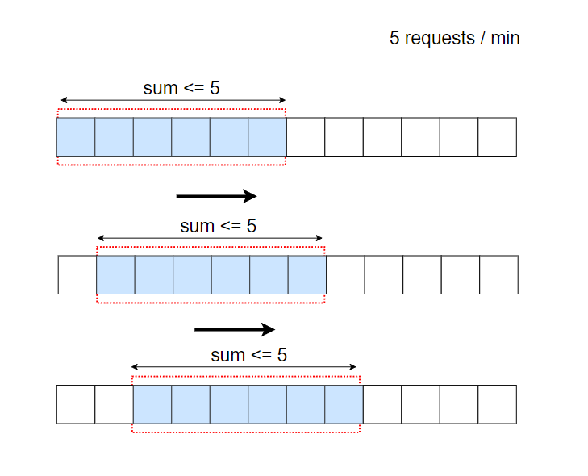

<!-- vscode-markdown-toc -->
* 1. [后端](#)
	* 1.1. [限流器的设计](#-1)
	* 1.2. [短网址系统](#-1)
* 2. [算法](#-1)

<!-- vscode-markdown-toc-config
	numbering=true
	autoSave=true
	/vscode-markdown-toc-config -->
<!-- /vscode-markdown-toc -->

##  1. 后端
###  1.1. 限流器的设计
**请设计一个分布式限流器，实现以下功能：**
- 限流器能work，精确度达到99%以上
- 限流阈值大小可以调节，大到1000w qps，小到100 qps
- 通用限流器，不局限在某个业务领域

**答案**

限流算法：
  - 令牌桶
  - 漏桶
  - 固定窗口计数器
  - 滑动窗口日志
  - 滑动窗口计数器

`令牌桶`

令牌桶是固定数量的容器
- 一方面，按照固定速率向桶中添加令牌，桶满后，多余的令牌会被丢弃
- 另一方面，一个请求消耗一个令牌，如果桶中没有令牌了，那么这个请求就被丢弃。

重要参数有桶的大小和填充速率，同时对于不同的api，可能需要不同的桶去控制不同的速率，在高并发时候，对于这两个参数的调整可能会有比较大的挑战。

`漏桶`

也是固定数量的容器
- 一方面，请求进来时，填充到桶中，桶满后请求会被拒绝
- 另一方面，桶中的请求以固定的速率进行处理

重要参数是桶的大小和处理速率，优点是使用队列易实现，缺点是，面对突发流量时，虽然有的请求已经推到队列中了，但是由于消费的速率是固定的，存在效率问题。

`固定窗口计数器`

把时间划分成固定大小的时间窗口，每个窗口分配一个计数器，接收到一个请求，计数器就加一，一旦计数器达到设定的阈值，新的请求就会被丢弃，直到新的时间窗口，新的计数器

缺点在于如果在时间窗口的边缘出现突发流量时，可能会导致通过的请求数超过阈值。
比如前一个窗口快结束时候流量徒增，后一个窗口开始时候流量依旧保持高位，会导致这个时间点的流量qps大于设置阈值

固定窗口计数器的优点是，简单易于理解，缺点是，时间窗口的边缘应对流量高峰时，可能会让通过的请求数超过阈值。

`滑动窗口日志`

假如设定1分钟内最多允许2个请求，每个请求都需要记录请求时间，比如保存在 Redis 的 sorted sets 中，保存之后还需要删除掉过时的日志

过时日志如何算：从当前时间点往前推算一个时间窗口，窗口外的数据就是过时日志。

`滑动窗口计数器`

算法与滑动窗口日志类似，滑动窗口把固定的窗口又分成了很多小的窗口单位，比如下图，每个固定窗口的大小为1分钟，又拆分成了6份，每次移动一个小的单位，保证总和不超过阈值。

**实现**

使用Redis实现高效计数器

利用redis的原子自增和过期淘汰策略
- 限流器的计数存放在redis中，用redis的过期淘汰策略实现限流器的计数的定期更新
- 例如针对 接口A 限流 10000 QPS。redis的key为：“接口A”，value为计数值-每次接口调用Redis
用INC原子自增命令，自增1，并设音过期时间为1s
- 初次调用时，因为redis中该key没有，就直接设置为1，并设音过期时间为1s
- 在这一秒以内的后续调用，每次都自增1-客户端拿到自增后的值如果没有超过限制10000，就放行
  - 如果超过 10000 限制，就不放行，说明超限了
  - 细节实现：为遊免超限后无谓的redis 调用，第一次发现超限时可以记录该值的TTL时间，例如只过去100ms就有1x个请求过来，剩下的900ms就不用请求redis而是直接返回超限即可。不然这种情况会给redis带去额外无谓的流量，例如前面的例子，不做这个细节逻辑的话,redis的请求量是 10W QPS
- 精度可调节。假如限流闻值很大，比如100W，可以把INC自增步进/步长调整大一些，例如100，那么redis的QPS直接降低100倍，为1W QPS

应用：Lyft 是一个开源的限速组件

###  1.2. 短网址系统
1. 分为两个接口
   - 从一个长网址生成一个短网址。需要考虑：同一个长网址，多次创建的短网址是否相同
   - 用户访问短网址时，需要能跳回到原始的长网址
2. 需要考虑跨机房部署问题

**答案**

1. 一开始需要能考虑系统承载容量，例如：
    - 每天100亿访问量
    - 每天生成100ov条短网址记录
2. 然后考虑短网址的生成算法，方案有很多种
    - 最简单实现：白增id实现，这个不可逆，同一个长网址会生成多个短网址
    - hash+序号冲突
    - 使用kv存储双向对应关系，可逆，但存储用量比较大
3. 302跳转问题，附带可以讨论网址访问量计数问题

考虑点：
1. 重定向是用301还是302
   1. 301，代表 永久重定向，也就是说第一次请求拿到长链接后，下次浏览器再去请求短链的话，不会向短网址服务器请求了，而是直接从浏览器的缓存里拿，这样在 server 层面就无法获取到短网址的点击数了，如果这个链接刚好是某个活动的链接，也就无法分析此活动的效果。所以我们一般不采用 301。
   2. 302，代表 临时重定向，也就是说每次去请求短链都会去请求短网址服务器（除非响应中用 Cache-Control 或 Expired 暗示浏览器缓存）,这样就便于 server 统计点击数，所以虽然用 302 会给 server 增加一点压力，但在数据异常重要的今天，这点代码是值得的，所以推荐使用 302！
2. 短链生成的几种方法
   1. 哈希算法
      1. 解决冲突：如果数据存储在mysql中，可以用唯一索引检测，如果有冲突，在长链接上拼接固定字符再进行hash，后续去除固定字符即可。优化：可以使用布隆过滤器在插入数据的时候先检测一遍。
      2. 缩短域名：得到hash值之后可以转换成62进制字符串。6 位 62 进制数可表示 568 亿的数，应付长链转换绰绰有余
   2. 自增ID算法
      1. UUID
         1. UUID是一类算法的统称，具体有不同的实现。UUID的有点是每台机器可以独立产生ID，理论上保证不会重复，所以天然是分布式的，缺点是生成的ID太长，不仅占用内存，而且索引查询效率低。
      2. 多台mysql服务器，
         1. 假设用8台MySQL服务器协同工作，第一台MySQL初始值是1，每次自增8，第二台MySQL初始值是2，每次自增8，依次类推。前面用一个 round-robin load balancer 挡着，每来一个请求，由 round-robin balancer 随机地将请求发给8台MySQL中的任意一个，然后返回一个ID。
      3. Redis自增
      4. 雪花算法
         1. 最高位不用，永远为0，其余三组bit占位均可浮动，看具体的业务需求而定。默认情况下41bit的时间戳可以支持该算法使用到2082年，10bit的工作机器id可以支持1023台机器，序列号支持1毫秒产生4095个自增序列id。
3. 预防攻击
   1. 限制IP请求数

##  2. 算法