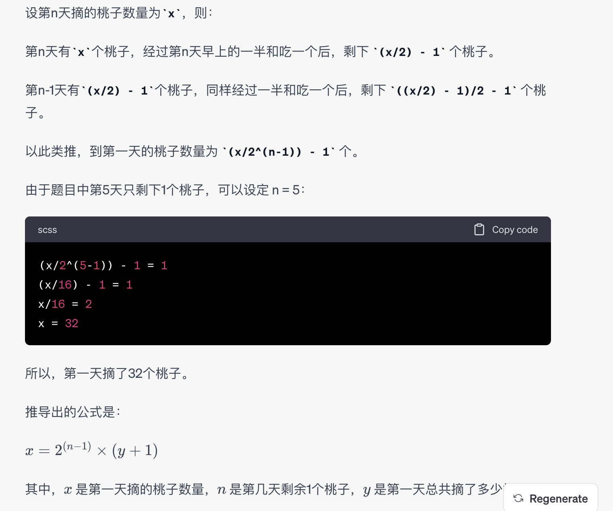

[toc]

## 富途证券-增长业务-Go后台-视频二面-60min
### 1.编程题：有个一次只能处理50个请求的接口，现在有1000个请求，怎么更快的获取到这1000个请求的结果
```go
package main

import (
	"fmt"
	"sync"
)

// 模拟接口请求的函数
func makeRequest(requestID int, wg *sync.WaitGroup, resultChan chan string) {
	defer wg.Done()

	// 模拟请求的处理
	response := fmt.Sprintf("Request %d - Status Code: 200", requestID)

	// 将结果发送到通道
	resultChan <- response
}

func main() {
	// 总请求数
	totalRequests := 1000

	// 每次处理的请求数
	batchSize := 50

	// 创建等待组和结果通道
	var wg sync.WaitGroup
	resultChan := make(chan string, totalRequests)

	// 并发处理请求
	for i := 0; i < totalRequests; i += batchSize {
		wg.Add(batchSize)

		for j := 0; j < batchSize; j++ {
			requestID := i + j
			go makeRequest(requestID, &wg, resultChan)
		}

		// 等待当前批次的请求处理完成
		wg.Wait()
	}

	// 关闭结果通道
	close(resultChan)

	// 读取结果
	for result := range resultChan {
		fmt.Println(result)
	}
}
```
### 2.设计题：10亿个用户，1000万日活，每个用户有一个积分，需要支持：1. 获取top1000的用户积分 2. 支持更改积分 3. 查询积分变更流水
存储层：
用户信息存储： 使用分布式数据库（如Cassandra、HBase、或者分库分表的MySQL等）存储用户的基本信息，包括用户ID、积分等。

日活信息存储： 用一个分布式缓存系统（如Redis）存储每日活跃用户的信息。可以使用Redis的Sorted Set来存储用户ID和积分，方便获取Top 1000的用户积分。

积分变更流水存储： 使用日志存储系统（如Kafka、RabbitMQ等）记录用户积分的变更流水，每次变更积分都产生一条日志，方便查询积分变更流水。

服务层：
获取Top 1000用户积分服务： 通过查询日活缓存中的Sorted Set，获取Top 1000的用户ID，然后再通过分布式数据库查询用户详细信息，包括积分。

更改积分服务： 提供API用于更改用户积分，每次更改积分后，需要更新分布式数据库中的用户积分信息，并产生一条积分变更流水。

查询积分变更流水服务： 提供API用于查询积分变更流水，根据用户ID和时间范围，查询对应的积分变更日志。

性能优化：
缓存： 使用缓存系统加速Top 1000用户积分的查询，可以考虑将查询结果缓存到Redis中。

异步处理： 积分变更流水的记录可以通过异步方式写入日志存储系统，提高更改积分的性能。

分片： 如果系统规模继续增大，可以考虑将用户信息和积分变更流水按照用户ID进行分片存储，减轻单个存储节点的压力。

这样的设计能够支持大规模用户量、高并发的场景，并且提供了灵活的查询和更改积分的接口。需要根据具体的业务需求和系统规模进行进一步优化和调整。

### 3.项目问题
### 4.Kafka rebalance机制
Consumer加入： 当一个新的Consumer加入消费者组时，或者一个已有的Consumer退出消费者组时，触发rebalance。

Coordinator选举： 每个消费者组有一个Coordinator，它负责协调rebalance过程。Coordinator的选举通常基于ZooKeeper或者Kafka自身的GroupCoordinator。

分区分配： Coordinator负责确定分区的分配方案。它首先根据消费者的订阅信息和分区的分配策略来计算新的分区分配方案。

Revoke和Assign： Coordinator将计算得到的分区分配方案发送给所有的消费者。每个消费者在rebalance时会收到两个阶段的通知：Revoke和Assign。

Revoke阶段： 在这个阶段，Coordinator通知消费者它即将失去哪些分区。消费者在Revoke阶段应该停止处理这些分区。

Assign阶段： 在这个阶段，Coordinator通知消费者它将要获得哪些分区。消费者在Assign阶段应该开始处理这些新分区。

消费者重新分配： 每个消费者根据Coordinator计算得到的分区分配方案，执行相应的Revoke和Assign操作。

分区的重新分配完成： 当所有消费者都完成了Revoke和Assign，rebalance过程完成。此时，每个消费者都处理着新的分区集合。

## 富途-GO-二面
### 主要围绕项目问，流程编排
### 1. 给了批量获取用户信息的接口，接口耗时50ms，最大限制50人，要求提供一个并发接口，查询1000人信息，要求尽可能快和处理异常
问题在不同cpu核数下性能表现
### 2. 用户积分系统设计，提供获取topn接口，变更用户积分接口，获取用户变更记录接口
### 聊项目相关的，业务流程， 项目中 kafka ,redis 如何使用
### Kafka 如何保证消息不丢
### redis 大量数据key 同时过期， 会产生什么后果，如果这些是热点key 或者不是 热点key 分别有什么表现？
### 两个 goroutinu 交替打印 6到100
第一种方式，创建一个struct，加锁
第二种方式，使用channel
### mysql 给 身份证，年纪 性别，三个字段给出建表语句


## 富途增长业务GO-初面代码题
代码题：(10分钟)有下面两张表，user(用户表)和thread(帖子表)，假设有50W用户，500W帖子，写一条 SQL ，显示 发帖最多的前十名用户的名字及帖子数量，并针对该语句指出如何设计合理的索引字段。如何确认你 写的sql会用到哪个索引，另外请说明下你写的SQL是否是最优解。 
表名      字段 
user     uid, username, password, create_time 
thread   tid, uid, title, content, create_time

代码题：(10分钟)请用尽可能少的代码实现一个函数，用于计算用户一个月共计交费多少港元。（代码请写的尽量清晰简洁，我们希望能够看到你的编码风格和习惯） 用户在富途的平台上进行交易，需要交平台使用费。平台使用费的梯度收费方案如下：
每月累计订单数           每笔订单（港元） 
梯度1：1-5笔            30.00 
梯度2：6-20笔           15.00 
梯度3：21-50笔          10.00 
梯度4：51-100笔         9.00 
梯度5：101-500笔        8.00 
梯度6：501-1000笔       7.00 
梯度7：1001-2000笔      6.00 
梯度8：2001-3000笔      5.00 
梯度9：3001-4000笔      4.00 
梯度10：4001-5000笔     3.00 
梯度11：5001-6000笔     2.00 
梯度12：6001笔及以上     1.00 
假设一个用户，一个月交易了6笔订单，则在梯度1交费共计： 30港元*5=150港元，在梯度二交费：15港元，一共交 费165港元。


## 富途增长业务GO-初面
### 介绍项目
### go多协程等待退出、协作方式，map gc的优化
### sql，创建索引，创建完如果走了全表扫描是什么原因，如何优化sql
### 编程题
协程交替打印1-10
```go
func verbPrint() {
	isA := true
	num := 1
	cond := sync.NewCond(&sync.Mutex{})

	go func() {
		for {
			cond.L.Lock()

			if !isA {
				cond.Wait()
			}
			fmt.Printf("A: %v\n", num)
			if num == 10 {
				return
			}
			num++
			isA = false
			cond.L.Unlock()
			cond.Broadcast()
		}

	}()

	go func() {
		for {
			cond.L.Lock()

			if isA {
				cond.Wait()
			}
			fmt.Printf("B: %v\n", num)
			if num == 10 {
				return
			}
			num++
			isA = true
			cond.L.Unlock()
			cond.Signal()
		}
	}()

	c := make(chan os.Signal)
	signal.Notify(c, os.Interrupt) 　　　　　　　　　　
	<-c
}
```

## 富途证券-增长业务-Golang-第二轮面试
### 1、经历
### 2、tcp time_wait
### 3、mysql 隔离级别
### 4、猴子吃桃，猴子第一天摘下若干个桃子，当即吃了一半，还不过瘾，又多吃了一个。第二天早上又将第一天剩下的桃子吃掉一半，有多吃了一个。以后每天早上都吃了前一天剩下的一半零一个。到第 5 天早上想再吃时，发现只剩下一个桃子了。问第一天摘了多少桃？问推导公式是什么?y=f(n)，n是第几天剩余1个桃子，y是第一天总共摘了多少桃子?(思路正确，推导出的公式多了1)

### 5、红球白球各50个，两个相同箱子，怎么放拿到红球的概率最大？
### 6、切绳子，有代码框架，填关键逻辑的空

## 富途证券-增长业务-C++/Go-第一轮面试
### 聊下目前做的项目
### C++多态与智能指针
### Redis热点数据清除会有什么影响
### 如何在两台或多台服务器进行分布式部署
### 编程题：两个线程交替打印1到100


## 富途深圳-增长业务Web后端（Go）开发工程师-90min
### tcp为什么是三次握手，不是四次？浏览器输入baidu.com之后发生了什么？如果后端返回502,代码什么，你作为开发，要怎么去寻找错误
### https和http 
### ssl过程
### tcp和udp区别
### tcp和udp能绑定同一个端口吗
### B+树介绍
### mysql有哪些锁
### 索引失效
### 给表写sql
### 如何分析慢查询
### 如何建索引
算法题1：

算法题2 
阶梯计费（你的文档有
算法题3 
买卖股票最佳时机


## 富途证券-增长业务-Golang-第二轮面试
### 1 time_wait 原因，怎么解决
- 增加端口范围
- 调整time_wait持续时间
- 使用 SO_REUSEADDR 选项，对于新连接可以复用处于time_wait状态的端口
- 优化程序设计，避免频繁创建和关闭http请求，可以使用长链接
### 2 mysql ddl表锁怎么办
选择合适的时间执行DDL： 尽量在系统负载较低的时间段执行DDL操作，避免对生产环境产生太大的影响。例如，在深夜或者低峰期执行DDL操作。

分批次进行DDL： 如果DDL操作涉及的表非常大，可以考虑分批次进行操作，每次只修改部分数据，降低锁的持有时间。

使用在线DDL工具： MySQL的一些版本支持在线DDL操作，例如Percona Toolkit中的pt-online-schema-change工具。这样可以在DDL操作进行的同时，不阻塞对表的读写操作。

考虑使用Percona Toolkit的pt-osc： Percona Toolkit中的pt-osc（Percona Online Schema Change）工具允许在进行DDL操作时维护表的复本，从而不会对原表产生锁。这样可以在DDL操作期间继续执行读写操作。

使用InnoDB存储引擎： InnoDB存储引擎相对于MyISAM存储引擎在DDL操作上更加灵活，支持在线DDL。如果可能的话，考虑使用InnoDB。

合理设计表结构： 在设计表结构时，尽量避免频繁的DDL操作。合理设计表结构可以减少对表的修改，降低DDL带来的风险。

### 3 io多路复用
### 4 猴子吃桃问题
### 5 红球白球各50个，两个相同箱子，怎么放拿到红球的概率最大
### 6 切绳子算法题

## 富途证券-增长业务-Golang-第一轮面试
### 聊下当前的项目
### Go的Gmp模型与调度
### Redis 分布式锁的实现
1、setnx+expire
2、redlock，循环加锁，n个节点加锁都成功即为成功
3、resession
### Mysql的事务隔离机制
### 编程题：两个线程交替打印1-100的奇偶数


## 富途证券-增长业务-Golang-第一轮面试
### 项目介绍
### MySQL的事务隔离级别有哪些？
### TCP的三次握手，TCP四次挥手
### HTTPS与HTTP区别，TCP与UDP区别
### 编程题：
Golang数据结构从Map到字符串
MySQL查询优化
梯度收费


## 富途-增长Go后台-视频初面-70min
### 先聊基础没聊项目
### redis持久化机制，mysql索引原理
### 给到一个网址打开浏览器，说一说其中的网络过程
### 算法：判断有效括号字符串。写出来了
### 算法：多层嵌套解析器。比较恶心，让面试官换了题目。
### 算法：判断一个数组是否为另一个数组的子集。写出来了。
### 算法：梯度交费，写出来了

/*
n个节点，时间复杂度
红黑树：log2N(查找节点)
B+树：logmN(查找节点) * log2m(节点内二分查找)
时间复杂度是否真的更优
*/
s1 := []int{1, 2, 3, 4}
s2 := s1[2:3]
s2[0] = 9
fmt.Println(s1, s2)
代码输出
var p *int = nil
var i1 interface{} = p
var i2 interface{}
fmt.Println(i1 == nil)
fmt.Println(i2 == nil)
代码输出

}

数据集库中主键查找和*查找那个更快？

## 富途证券-Golang-第一轮视频面试
### Go的gmp模型与调度
### Https加密与DNS解析
### Redis的分布式锁怎么实现的
### Mysql索引的数据结构与数据库事务
### 编程题：给出两个数据表，写SQL查询
### 逻辑题
### 8瓶药水中有一瓶毒药，至少需要几只小白鼠才能一次实验出结果
### 有十箱金币，每个金币一斤，但是有一箱金币每个都缺了一两，怎么称重一次便把这箱金币找出来？

## 富途证券-Golang-第一轮视频面试
### tcp和b+树的问题问的比较多，b+树和红黑树的区别
### tcp收包可靠性的问题，问了下收包乱序的话，服务端会怎么处理，是否要排序什么的
### 还问了Kafka容灾之类的
### 逻辑题：2*10的地板，铺1*2地砖有多少种铺法
### 算法题：最近n天的最高股价

## 富途证券-Golang-第一轮视频面试
### 缓存框架设计和实现
### 编程：两个有序数组求交集
### 编程：删除单向链表中的节点
### 概率：城市有100W人，河东80W人，河西20万人，每天平均电话10万通，求河西打电话到河东的概率

## 富途-GO后端-视频复试-1H
### 问题有tcp的time wait状态，nagale算法
### tcp流式的理解
### nohup命令和&的用法
### 50个人里相同生日的概率
### 算法题是给一个数组，求(a[i]-a[j])/a[i]的最大值
### 有十箱金币，每个金币一斤，但是有一箱金币每个都缺了一两，怎么称重一次便把这箱金币找出来？


富途证券-Golang-第一轮视频面试
项目介绍
tcp为什么是三次握手，不是四次？浏览器输入
baidu.com之后发生了什么？
http和https的区别对称加密和非对称加密的区别股票买卖时机，可多次交易且没有手续费
现在有三个箱子，分别装了苹果、梨子、苹果和梨子。箱子外边有标签，而且所有标签都是不对的。如果只能从三个箱子里面取一个水果出来，能不能够把标签对应的箱子给确认下来？


1 在40亿个无符号不重复整数中，寻找是否存在指定的数，给方案
2 猴子偷桃的问题，5个猴子分一堆桃，每个猴子依次先吃掉一个再从剩下的里面拿走五分之一（单个桃不能再分），问这堆桃一开始至少有几个
3 设计这样一个微信朋友圈，用户发一个朋友圈简称发动态，实现3个功能：1 最近发的动态排在最前，越久发的动态排后面；2 能够设置3天或者7天可见； 3 朋友发完动态，在好友界面可以看到一个红点（应该类似消息通知，朋友发最新动态会通知给你，然后你的界面就有一个红点）

富途证券-后台开发工程师（GO )-初试-60mim
项目问很多。例如业界如何进行鉴权的，建议先了解一下jwt
网络：
四次挥手
tcp的拥塞控制，滑动窗口，慢启动原理和算法，以及如何通信传递消息；
http和https差异；
操作系统：
ping的底层原理；
简述一个自己精通的命令或者知识点；多路复用原理
epoll细节
go知识点
内存逃逸
nil和make
struct｛｝使用场景
如何实现map
gmp调度

## 富途-Go复试
### 1）15-20分钟的项目介绍
### 2）mysql innodb 是怎么上锁的
### 3）在有primary key 和 索引 num 情况下查询 select * from table where num = 9，索引最后加在哪里？
### 4）算法题：给出一个字符串N “ABBCDB”（大小英文字母组成） ，按照一下任意一个规则，一：从头部删除一个字母，并追加到新字符串尾；二：从尾删除一个字母，并追加到新字符串尾；期望最后得到一个字典排序最小的字符串
```go
package main

import (
	"fmt"
)

func getMinLexicographicalString(s string) string {
	var result string

	for len(s) > 0 {
		// 比较字符串的首尾字符，选择较小的一个
		if s[0] < s[len(s)-1] {
			result += string(s[0])
			s = s[1:]
		} else if s[0] > s[len(s)-1] {
			result += string(s[len(s)-1])
			s = s[:len(s)-1]
		} else {
			// 如果首尾字符相等，则比较剩余部分的字典序
			if s < reverseString(s) {
				result += string(s[0])
				s = s[1:]
			} else {
				result += string(s[len(s)-1])
				s = s[:len(s)-1]
			}
		}
	}

	return result
}

// 辅助函数：反转字符串
func reverseString(s string) string {
	runes := []rune(s)
	for i, j := 0, len(runes)-1; i < j; i, j = i+1, j-1 {
		runes[i], runes[j] = runes[j], runes[i]
	}
	return string(runes)
}

func main() {
	inputStr := "ABBCDB"
	resultStr := getMinLexicographicalString(inputStr)
	fmt.Println(resultStr)
}

```
### 5）算法题：有一个任意的整形数组，[]int，从数组取出任意一个元素是的它是符合下面条件的，一：它的左边都比它小，二它的右边都比它大。

富途证券-后台（go）-初试-60分钟
golang channel底层结构
设计一个延时队列，怎么设计
用redis做限流，有什么实现方式
算法：
给一个任意整数组，剔除一个元素后，得出最大乘积例如：[4]int{2,3,4,-4}  最大乘积 24
先给数组排序，然后统计负数个数，如果是奇数，将负数最小的去掉，如果是偶数并且数组全是负数，将最大的数去掉，反之则将最小的正数去掉


## 富途-GO后台-视频复试-1h
### 1. 判断大小端；
### 2. 输入字符串，可能是10K转化后为10*1024，5.7M转化后为5.7*1024*1024、1G转化1*1024*1024*1024，实现这个函数；
```go
package main

import (
	"fmt"
	"regexp"
	"strconv"
)

func convertSizeToBytes(sizeStr string) (uint64, error) {
	// 使用正则表达式匹配输入字符串
	re := regexp.MustCompile(`^(\d+(\.\d+)?)\s*([KMG]?)$`)
	matches := re.FindStringSubmatch(sizeStr)

	if len(matches) != 4 {
		return 0, fmt.Errorf("Invalid size format")
	}

	// 解析数字部分
	size, err := strconv.ParseFloat(matches[1], 64)
	if err != nil {
		return 0, fmt.Errorf("Error parsing size: %v", err)
	}

	// 根据单位进行转换
	unit := matches[3]
	switch unit {
	case "K":
		size *= 1024
	case "M":
		size *= 1024 * 1024
	case "G":
		size *= 1024 * 1024 * 1024
	}

	return uint64(size), nil
}
```
### 3. 10亿条日志，uin,时间戳，支持两个接口1）查询某个用户时间范围日志；2）查询某个范围内所有用户，不允许用mysql、redis，自己设计数据结构；
### 4. 如何快速排查超时；
### 5. TCP序列号作用


富途证券-高级后台go-视频初试1小时
个人面试过程：
1、自我介绍
2、项目介绍
3、一些场景的分析
- 微信这种级别的应用和客户端通信是用tcp还是udp更合理，为什么？
- 设计一个客户之间传文件的系统，结构是什么样的。
- 设计一个千万级用户的积分系统，需要获取top10的榜单。给出增删改查接口定义和存储设计。
4、算法题
- 给定一个整数数组，使得去除一个数后，剩余数相乘最大
写出来了，但开始没考虑全负数情况。也做了多次遍历。
更优一点应该是一次遍历统计负数、零、正数的值和下标，以及最小负数，最大负数，零，最小正数。根据零值和负数的数量，判定去除哪个数，输出下标。


富途-go后台开发-初面
面试官比较关注数据库方面的问题，redis, es，mysql 索引、mysql索引的底层实现原理、mysql的索引优化，tcp握手连接，排序算法

富途-GO后台-视频初试-1h
1、讲一个流量器htts://futu.com 经历了哪些，分析链路，   如果后端返回502,代码什么，你作为开发，要怎么去寻找错误
2、黑产注册n多小号，在你的平台上发广告，设计一个方案规避
3、mysql 为什么主键建议用int类型，且自增
4、mysql binlog和redolog的区别
5、什么是幻读，什么用隔离级别，原理是什么 
6、限流算法有哪些
7、两个有序数组，找子集，说思路就行
8、Tcp创建和关闭的过程， time_wait出现在哪一方


富途-Go后台-70min-视频
go的gmp模型，调度过程
针对你讲的gmp调度进行提问：从其他队列窃取多少过来，系统调用完成后m会休眠吗，goroutine发生死循环p会怎么调度
go的内存逃逸是什么，函数里的声明一个对象指针会发生逃逸吗
gmp 模型及死循环怎么调度
浏览器打开一个网站 具体是一些什么流程，里面的内容点涉及到网络通信相关的知识。
（以上部分都是之前面试总结过的资料）
redis问了 根据IP 设计存储结构
go 问了数组和切片 区别等
channel 的底层实现结构
笔试题：一个是找出两个有序数组的重复元素；一个是关于输入 各天的问题[10,20,30]  ，输出[1,1,0] 表示多少天温度超过

富途-Go后台-50min-视频
- 自我介绍
- 消息队列怎么保证不重复消费
- mysql的事务有哪些隔离级别，可重复读是怎么实现的，生成快照的具体过程
- 项目里缓存怎么保证一致性
- redis的分布式锁怎么实现的，有哪些缺点
- go的gmp模型，调度过程
- 针对你讲的gmp调度进行提问：从其他队列窃取多少过来，系统调用完成后m会休眠吗，goroutine发生死循环p会怎么调度
- go的内存逃逸是什么，函数里的声明一个对象指针会发生逃逸吗
- 项目问题
- 编程题


## 富途证券-Golang后台开发-第三轮视频面试
### 1，用数组实现队列，实现入队，出队，判空，判满接口
### 2，把数组所有的0移到末尾，要求其他元素的相对顺序不变
### 3，设计朋友圈
### 4，进程和线程的区别
### 5，每个猴子拿3个桃子剩59个，拿5个不足5个。


富途 - 后台开发（python,go,c)-90min - 视频 + 电话
算法：
1. 写一个函数，把字符串里面的空格全部去掉，并返回删除的空格的个数，不允许新开辟空间，只能申请简单类型的自动变量。时间复杂度O(n) 
```go
   func removeSpacesAndCount(s string) (int, string) {
	// 计数删除的空格个数
	count := 0

	// 将字符串转换为可修改的字节数组
	strBytes := []byte(s)

	// 遍历字节数组，inPlaceIdx 记录不包含空格的字符位置
	inPlaceIdx := 0
	for i := 0; i < len(strBytes); i++ {
		if strBytes[i] != ' ' {
			// 遇到非空格字符，移动到 inPlaceIdx 处
			strBytes[inPlaceIdx] = strBytes[i]
			inPlaceIdx++
		} else {
			// 遇到空格，增加删除计数
			count++
		}
	}

	// 使用原有的字节数组，长度截取到 inPlaceIdx 处
	resultStr := string(strBytes[:inPlaceIdx])

	return count, resultStr
}
```   

2. int a[n], 对于任意0 <= i < n, a[i]>0 ，求 max(a[i] – a[j]), 其中 0 <= i < j < n ，要求时间复杂度为o(n) 
3. 写一个 函数，从n个不同的物品里等概率的选出m个物品
4. 一个长度为N的大数组，找出最大k个数，最优解（k远小于N），并且给出算法的时间复杂度 
 逻辑题：
班上来了甲 乙 丙三个新同学，大家都不知道丙的生日，丙给出了下面10种可能：
3月15日，3月16日，3月19日
4月17日，4月18日
5月14日，5月16日
6月14日，6月15日，6月17日
然后丙分别告诉了 甲 是哪一个月，告诉了 乙 是哪一日。接着：
甲说：“我不知道丙的生日，但我确定乙肯定也不知道。”
乙说：“刚开始我也不知道是哪一天，现在我知道了。”
甲说：“那我现在也知道了。”
求丙的生日是哪一天？______5.16
技术点：
一致性哈希，分布式锁等
面试官没有问他一些具体的语言问题


富途证券-go后端开发工程师60分钟-视频初面
gmp调度原理，调度过程中协程的状态扭转，m的数量可以大于核数吗？
数据库索引相关，给了四条sql语句，看哪些会命中索引，并说出原因；
go channel底层数据结构；
sync.map底层数据结构
redis分布式锁的实现以及它的缺点
编程题：判断链表是否有环；
智力题：两个容器，一个5L,一个6L，怎么得到3L水

富途-GO开发-第一轮面试-1h
1. 一个整数数组，找出其中不存在的最小正整数
2. 数据库题，考察聚族索引以及组合索引
3. 平衡二叉树和二叉树的区别
4. 平衡二叉树和红黑树的区别
5. map 和 hashmap差别
6. go中map
7. tcp如何保证可靠，滑动窗口
8. CAP
9. kafka如何保证高可靠，如何选主
10. zookeeper如何选主

## 富途证券-go后端开发工程师-视频二面90分钟
### 缓存击穿，缓存穿透，缓存血崩，怎么处理
### 编程题：找到所有左边数字比它小，右边数字比它大的数
### 编程题：将一个数组中的0都移到数据末尾，其他数相对位置不变
### 智力题：25匹马 五个赛道，几次比赛可以得到前三名
https://blog.csdn.net/niaolianjiulin/article/details/76125113


## 二面重点关注
### - 介绍项目，问项目细节比较多，介绍项目技术架构图，个人负责哪些模块
### - 项目的数据库缓存一致性方案介绍，为什么选择删除缓存的策略而不是直接更新缓存，为什么不选择全量缓存
### - 问项目中各模块业务量级，对应使用组件的容量量级计算等
### - 项目中使用redis分布式锁，介绍锁实现，介绍简单实现的问题，锁释放的安全性怎么保证
### - 分布式锁的过期时间怎么确定的
### - 电商超卖问题，业务和技术上的细节聊了一下，主要关注和订单交易模块的交互流程，画时序图
### - 解释为什么不直接使用redis原子操作实现库存/限购扣除，为了保证业务扩展性
### - 解释为什么不先支付后再扣除限购，防止超卖
### - 为什么不直接使用数据库支撑这个业务量级？历史的设计原因
### - 没有使用数据库如何保证业务数据可靠性？redis数据丢失的话怎么恢复数据？
### - 介绍一致性哈希，如何解决节点负载不均衡问题？介绍虚拟节点
### - 编程题：给定double a[i]，0<=i<n，求(a[j]-a[i])/a[i]的最大值，0<=i<=j<n
```go
func findMaxRatio(a []float64) float64 {
    n := len(a)
    if n < 2 {
        return 0.0
    }

    min_val := a[0]
    max_ratio := 0.0

    for j := 1; j < n; j++ {
        if a[j] < min_val {
            min_val = a[j]
        }

        ratio := (a[j] - min_val) / min_val
        if ratio > max_ratio {
            max_ratio = ratio
        }
    }

    return max_ratio
}

```

富途证券-后端Go-第一轮视频面试
Gmp调度原理
Channel底层数据结构
Redis分布式锁和数据结构
服务器高可用及容灾解决方案
服务器宕机有状态和无状态的处理方法
HTTPS与TCP 各自的加密过程及其原理
编程题：Go语言交替打印AB 10次
了解云原生吗

富途证券-Golang-第一轮视频面试
SQL调优
kafka生产端和消费端
线程并发安全问题怎么处理
TCP的 Time_Wait 状态怎么处理
Redis缓存控制逻辑在宕机后如何恢复
Redis分布式锁的实现及锁冲突的处理
undo日志结构、日志链表、回滚段，undo log原理
算法编程：
在数组中找到未出现过的最小整数（编程）
平衡二叉搜索树查找的时间复杂度（口述）

后台开发工程师（GO）-初面-80分钟
算法题：
1. 给一个无序的正整数数组，求i/j最大值，i<j;
2. 给二维数组N*N，及M ，M<N*N，实现等概率取值
原理：
1. HashMap的实现；
2. 网络粘包
3. 并发Map的golang实现；

后台开发工程师-初面-90分钟
5 mysql有没有遇到深分页？如何解决？
6 mysql的慢查询有舞蹈吗？如何解决
7 mysql的索引怎么用？哪些场景会失效？
8 mysql有哪些锁？分别讲一下
9 线上慢查询有监控吗？结合实际线上场景说下处理流程
10 网络的tcp和udp有了解吗？为什么tcp更加可靠
11 黏包有了解吗
12 tcp的超时重连有了解吗
13 ping的底层原理了解吗？
14 除了ping还有哪些测试通信命令？telnet curl
15 上云和微服务做了哪些事？
16 k8s部署有涉及网络方面问题吗？答静态ip
17 go的切片是什么？
18 go的channel讲一下？结合实际使用情况讲
19 java里面的aop可以讲一下吗
前面几题问的业务上面的问题

富途GO-四面：
- 编程：给定如"10K","1.2M","3.4G"字符串，输出代表的字节数量取整（10240），异常和溢出时输出-1
- 设计：10万用户一年的操作记录，10亿条数据，用户ID，时间戳，操作号，如"12344,1629182983,1"
  1、设计接口查询指定用户某个日期范围的记录
  2、查询某个日期范围内有多少用户？
  考虑内存用量，不使用DB/redis等外部存储，要求接口快速响应
- 接手不熟悉系统，反馈系统慢，接口超时，如何排查，具体行动？
- TCP序列号的作用有哪些？列举


-自我介绍
-基础题
mysql索引有哪些
mysql索引为什么用b+树
对象逃逸有几种方式

-智力题
有8瓶药1瓶毒药，最小需要多少只老鼠进行区分

-算法题
给出两个有序数组，求子集
去除数组中的0元素

富途证券-GO后台-1.5h
1.介绍项目，自己负责的模块，开发流程
2.场景题：如果让你做一个翻译系统，首先要调研，你会从哪些方面做；让你设计一个翻译系统，画出系统架构图
3.channel协程关闭后还能继续读写吗
4.并发安全了解吗
5.http缓存了解吗
6.tcp粘包了解吗
7.场景题：一个系统有多个任务，任务之前存在依赖关系，设计算法判断有没有循环依赖
8.线程池的核心参数，核心思想
9.字节序了解吗
10.线程和协程的区别
11.两个线程同时cout++ 10次，最小可能输出的值是多少
12.智力题：52张扑克牌随机抽五张，抽到顺子的概率
上来问项目比较多，没考算法，场景题还是挺有难度的


- 自我介绍
- 项目架构介绍，负责的模块业务等，随便聊了一下
- 一些存储消息组件的使用，哪些场景使用，没问细节
- 编程题1：用户账户n=1000，设计存钱和取钱两个函数，用于多线程并发环境
- 编程题2：给60亿身高数据，只有身高如：189.0,178.5等，小数点后只可能.0或者.5，设计程序找到最高的1000个身高数据，要求O(N)
- 编程题3：股票ID对应股票信息，设计set/get存取股票信息，时间复杂度均为O(1)；如果内存存储股票数量有上限，达到上限时，在set新数据前删除最近最久未使用数据，存入DB，设计方案

富途证券-GO后台-视频三面-1.5h
1.介绍项目，自己负责的模块，开发流程
2.场景题：如果让你做一个翻译系统，首先要调研，你会从哪些方面做；让你设计一个翻译系统，画出系统架构图
3.channel协程关闭后还能继续读写吗
4.并发安全了解吗
5.http缓存了解吗
6.tcp粘包了解吗
7.场景题：一个系统有多个任务，任务之前存在依赖关系，设计算法判断有没有循环依赖
8.线程池的核心参数，核心思想
9.字节序了解吗
10.线程和协程的区别
11.两个线程同时cout++ 10次，最小可能输出的值是多少
12.智力题：52张扑克牌随机抽五张，抽到顺子的概率
上来问项目比较多，没考算法

富途-GO-第二轮-1h
1.离职原因
2.主键，索引，唯一键的区别
3.Mysql 什么情况下，不建立索引比建立索引要好
4.5个猴子分一堆桃，每个猴子依次先吃掉一个再从剩下的里面拿走五分之一（单个桃不能再分），问这堆桃一开始至少有几个
5.工作中最有成就感的事
6.在40亿个无符号不重复整数中寻找是否存在指定的数。给方案。


富途证券-后台开发工程师（go）-60mim
1.2个有序数组求交集&优化
2.已知对应节点指针，O(1)删除链表中的某个节点
3.3箱水果贴错标签，只许在其中一筐取一次，如何把标签都进行修正
4.河南30万人，河北50万人，两岸一年通电话总数100w次，求两岸互相通电话的概率

富途证券-后台开发工程师（go）-复试-60mim
1.问项目
2.二叉排序树的特点及删除一个节点的算法思路
3.线程与协程的区别
4.线程安全
5.https2.0与https3.0的区别，https的缓存机制
6.视频通话用的是udp还是tcp，为什么
7.count++的过程
8.算法：求数组中两个数之和为n的数对
9.智力题：扑克牌抽五张，是顺子的概率

富途GO-第一轮视频面试
1.interface 默认类型 nil值是否相等。考察点（interface内部实现包含两个字段（类型T和值v））
2.interface 底层结构体
3.二叉搜索树和avl树的区别，查询效率。为什么avl树效率高
4.b+树，红黑树，为什么mysql选用b+树作为索引。（问的比较详细，需要明确数据结构的实现，不然容易被问死）
5.mysql 索引命中的问题。

给你一个只包含正整数的非空数组 nums 。请你判断是否可以将这个数组分割成两个子集，使得两个子集的元素和相等。


富途GO-第一轮视频面试-60min
1.  channel缓冲数据的读写有几次数据的拷贝。
2. 讲讲GMP模型。
算法题：一个是基于前序遍历和中序遍历。生成二叉树，另一个是 leetcode 只有一个数字2