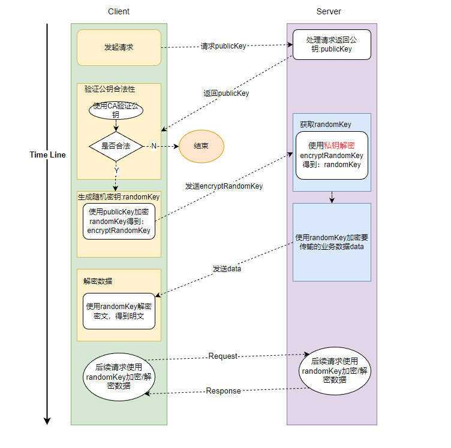
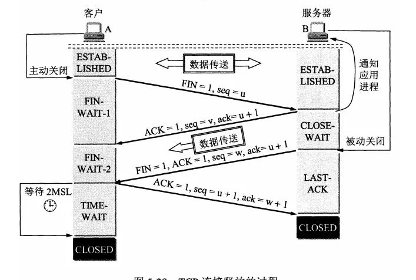

# 计算机基础

### 1、TCP如何实现可靠传输

- 应用数据被分割成TCP认为最适合发送的数据块
- 超时重传：当tcp发送一个段后，它启动了一个定时器，等待目的端确认收到这个报文段，如果不能及时收到一个确认，将重发这个报文段。
- TCP给发送的每一个包进行编号，接收方对数据包进行排序，把有序数据传送给应用层。
- 校验和：TCP将保持它首部和数据的校验和，这是一个端到端的校验和，目的是检测数据在传输过程中的任何变化，如果收到段的校验和有差错，TCP将丢弃这个报文段和不确认收到此报文段。
- TCP接收端会丢弃重复的数据。
- 流量控制：TCP链接的每一方都有固定大小的缓冲空间，TCP的接收端只允许发送段发送接收端缓冲区能接纳的数据，当接收方来不及处理发送方的数据，能提示发送方降低发送的速率，防止包丢失。TCP使用的流量控制协议是可变大小的华东窗口协议。
- 拥塞控制：当网络拥塞时，减少数据的发送。

### 2、进程跟线程的联系和区分

- 区别与联系
  - 线程是CPU调度的基本单位，同一个进程中可以有多个线程，但至少有一个线程
  - 进程是操作系统分配资源的最小单位
- 一个进程中有哪些数据段
  - 代码段：保存代码
  - 静态数据段：静态数据
  - 未初始化数据段
  - 栈： 向下增长
  - 堆：向上增长
  - .rodata
- 进程中的不同线程间有哪些数据段是共享的
  - 除了栈之外均可共享

### 3、HTTPS密钥的交换过程

- 使用 **非对称加密** 处理用于加密数据的密钥
- 使用 **对称加密** 处理具体的数据



```
1.客户端获取公钥
	客户端发送请求，服务端返回公钥
	客户端用证书验证公钥，如果合法，继续下一步
2.客户端生成用于加密数据的密钥
	客户端生成随机密钥
	然后用服务器返回的公钥对这个密钥加密，得到加密后的密钥
3.服务端验证密钥
	客户端将加密后的密钥发给服务端
	服务端使用私钥解密得到密钥
4.使用密钥加密数据进行传输，使用密钥解密数据得到明文
	服务端使用获得的密钥加密数据，发送给客户端
	客户端使用密钥解密得到明文。
```

### 4、进程通信的几种方式

- 匿名管道( pipe )：管道是一种半双工的通信方式，数据只能单向流动，而且只能在具有亲缘关系的进程间使用。进程的亲缘关系通常是指父子进程关系。

  ```
  通过匿名管道实现进程间通信的步骤如下：
  父进程创建管道，得到两个⽂件描述符指向管道的两端
  父进程fork出子进程，⼦进程也有两个⽂件描述符指向同⼀管道。
  父进程关闭fd[0],子进程关闭fd[1]，即⽗进程关闭管道读端,⼦进程关闭管道写端（因为管道只支持单向通信）。⽗进程可以往管道⾥写,⼦进程可以从管道⾥读,管道是⽤环形队列实现的,数据从写端流⼊从读端流出,这样就实现了进程间通信。
  ```

- 高级管道(popen)：将另一个程序当做一个新的进程在当前程序进程中启动，则它算是当前程序的子进程，这种方式我们成为高级管道方式。

- 命名管道 (named pipe) ： 命名管道也是半双工的通信方式，但是它允许无亲缘关系进程间的通信。

- 消息队列( message queue ) ： 消息队列是由消息的链表，存放在内核中并由消息队列标识符标识。消息队列克服了信号传递信息少、管道只能承载无格式字节流以及缓冲区大小受限等缺点。

- 信号量( semophore ) ： 信号量是一个计数器，可以用来控制多个进程对共享资源的访问。它常作为一种锁机制，防止某进程正在访问共享资源时，其他进程也访问该资源。因此，主要作为进程间以及同一进程内不同线程之间的同步手段。

- 信号 ( sinal ) ： 信号是一种比较复杂的通信方式，用于通知接收进程某个事件已经发生。

- 共享内存( shared memory ) ：共享内存就是映射一段能被其他进程所访问的内存，这段共享内存由一个进程创建，但多个进程都可以访问。共享内存是最快的 IPC 方式，它是针对其他进程间通信方式运行效率低而专门设计的。它往往与其他通信机制，如信号两，配合使用，来实现进程间的同步和通信。

- 套接字( socket ) ： 套接口也是一种进程间通信机制，与其他通信机制不同的是，它可用于不同机器间的进程通信。

### 5、TCP四次挥手为什么要有TIME_WAIT状态



- 保证TCP协议全双工连接能够可靠关闭，直接关闭的话，如果服务器没有收到ACK，会重复发FIN
- 保证这次连接的重复数据从网络中消失，如果上次的socket和这次的socket处理的程序一样，就会导致这次连接把上次的数据加进来了。

### 6、TCP/IP拥塞控制的含义是什么，有什么拥塞控制的方法？

- 拥塞控制：防止过多的数据注入到网络中，这样可以使网络中的路由器或链路不致过载。
- 对比流量控制：拥塞控制是一个全局的过程，涉及到所有的主机、路由器、以及降低网络相关的所有因素。流量控制往往指点对点通信量的控制。是端对端的问题。
- 几种拥塞控制的方法：慢开始，拥塞避免，快重传，快恢复。
  - 慢开始：主机开发发送数据报时，如果立即将大量的数据注入到网络中，可能会出现网络的拥塞。
    - 慢启动算法就是在主机刚开始发送数据报的时候先探测一下网络的状况，如果网络状况良好，发送方每发送一次文段都能正确的接受确认报文段。那么就从小到大的增加拥塞窗口的大小，即增加发送窗口的大小。
  - 拥墨避免：是让ewnd煲惯的增加而公是加信的增长，每经历过一次住返时问就使ownd馆加1，而不是加倍，这样使cwnd缓慢的增长，比慢启动要慢的多。
  - 快重传：快重传算法要求首先接收方收到一个失序的报文段后立刻发出重复确认，而不要等待自己发送数据时才进行捎带确认。
  - 快恢复：当发送方连续接到三个确认时，就执行乘法减小算法，把慢开始门限减半，但是接下来井不执行慢开始算法。而是把cwndQ置为ssthresh的一半，然后执行拥塞避免算法，使拥塞窗口缦慢增大。

### 7、TCP的三次握手和四次挥手

引申问题：为什么不能两次握手，三次握手会出现什么问题。

### 8、TCP和UDP的对比

- TCP是面向连接且可靠的，UDP是面向非连接且非可靠
- TCP是面向字节流的，UDP是面向报文流
- TCP的传输效率低，UDP传输效率高
- TCP有流量控制，拥塞控制等，MUDP没有
- TCP适用于对可靠性要求比较高，但对效率要求低的场景，而UDP适用于对可靠性要求比较低，对效率要求比较高的场景
- TCP协议应用：HTTP/FTP/TELNET/SMTP UDP协议应用：DNS/SNMP

### 9、select、poll、epoll的区别

- IO多路复用都是一个进程可以监控多个文件描述符，一旦某个描述符就绪，能够通知程序进行相应的读写操
- select：调用过程a将fd_set从用户空间拷贝到内核空问 b：遍历fd_set 将就绪的fd拷贝到用户空间；缺点是aselect支持的fd数目是通过FD_SETSIZE指定，存在数目限制 b:select调用时需要在用户和内核空问进行fd_set的拷贝，开销比较大 c:select调用时需要在内核中遍历fd_ set,10效率低
- poll: select的增强版，用链表来实现fd_set,故没有fd数目的限制，但效率依1日不高
- epol：每次调用epoll_ct函数进行注册时候，会将fd_set拷贝到内核空间，避免每次调用时重复拷贝；无需遍历fd_set,epoll维护一个就绪列表，一旦某个fd就绪，就把fd插入到链表中，epoll wait只需遍历该链接即可;epoll没有fd数据限制，它所支持的fd上限是最大可以打开文件的数目
- epoll支持两种触发方式：水平触发(LT)和边缘触发 (ET),LT和ET最大的区别就是epollwait检测fd就绪后，应用程序可以不立即处理，下次调用epoll_wait会再次通知此事件；而ET则不支持，一旦通知之后就再通知。
  收起人

### 10、从输入URL到页面加载完成的过程

### 11、DSN解析的过程

### 12、用户态和内核态的区别

### 13、HashMap、HashTable的区别，ConcurrentHashMap的实现原理

### 14、进程调度策略

题目描述
-你知道哪些操作系统的进程调度策略？
-假设操作系统的进程优先级被分为0-9级，如果需要基于这些优先级实现一个0(1)的调度器，你会怎么做？工作流程是怎么样的？
一完全公平调度器 (CFS） 最核心的数据结构是什么？为什么采用这种数据结构？
答案
一些调度算法：
1. FCFS：先来先服务
2. 最短作业优先：每次选择所需处理时间最短的进程运行
3. 最短剩余时间优先：总是选择预期剩余时间最短的进程
4. 高回复率优先/最高响应比优先：根据等待时间W和需要服务的时间S计算响应比R=(w+S)/s，优先服务响应比高的
5. 轮转调度(roundrobin）：每个进程分配一个时间片，时间片用完还未结束则挂起
6. 优先级调度：每个进程分配一个优先级，优先服务高优先级的进程
    实现一个O(1)的调度器，清晰合理即可，参考：基于10个等级，使用两组各10个链表维护，每次从一组选优先级大的轮转执行，并放入另一组，一轮结束后交换两组链表
    CFS调度器：内部使用红黑树维护进程，优点：自平衡、高效、公平性好

### 15、进程间通信-共享内存

### 16、http和tcp keep-alive的机制

### 17、操作系统内存管理中，什么是段页式管理？在段页式分配中，cpu每次从内存中取一次数据需要访问多少次

- 段页式存储管理：在段页式存储中，每个分段又被分成若千个固定大小的页。段页式存储组织是分段式和分页式结合的存储组织方法，这样可充分利用分段管理和分页管理的优点。
- 1.用分段方法来分配和管理虛拟存储器。程序的地址空间按逻辑单位分成基本独立的段，而每一段有自己的段名，再把每段分成固定大小的若干页。
- 用分页方法来分配和管理实存。即把整个主存分成与上述页大小相等的存储块，可装入作业的任何一页。程序对内存的调入或调出是按页进行的。但它叉可按段实现共享和保护。
- 逻辑地址结构。一个逻辑地址用三个参数表示：段号S；页号P；页内地址d。
- 段表、页表、段表地址寄存器。为了进行地址转换，系统为每个作业建立一个段表，并且要为该作业段表中的每一个段建立一个页表。系统中有一个段表地址寄存器来指出作业的段表起始地址和段表长
  度。
- 
- -取一次数据需要访问3次内存
  - 在段页式存储管理方式中，取一次数据：首先要从内存中查找段表；再查找该段对应的页表；最后通过得到的物理地址访问内存获得数据。

### 18、同步IO和异步IO的区别

### 19、操作系统-页面置换算法LRU、FIFO

### 20、操作系统-作业调度

题目描述
＃1.先来先服务（FCFS） 有什么缺陷？
2.如何改进？改进算法有什么缺陷或者实现难点，
3.短作业优先如何预测作业时间？
答案
1.阻塞
2.

-短作业优先 （SJF)一必须知道作业时间、长作业饥饿、重要作业无法优先处理
-轮转时间片(RR)一时间片长度选择、平均等待时间长、上下文切换资源消耗多
-多级反馈队列(MLFQ)一关于每级队列的实现有多种说法（缺陷未知）
3.

-按無代码量预测
-根据代码中的操作类型预测（系统进程VS用户进程、根据1日操作预测）
--动态预测：实时更新作业时间的均值作为预测值
-指数平均、王滑因子等相比均值更加高级的数学方法

### 21、命令行前台运行一个程序时，ctrl_C的时候会发生什么？信号的常用方式和原理

1、ctrl-c给前台运行的进程发送了SIGINT信号，默认情况下，进程退出。

2、信号是一种用来通知进程发生了某些异步事件的机制。可以用于进程问的通信，也可以用于内核通知进程发生了某些内部事件。
3、内核在进程即将从内核态返回时处理信号，意味着发送给进程的信号并不会立即得到处理。

4、可以通过signal系统调用来指定信号的处理函数。
更多细节见：https://www.cnblogs.com/taobataoma/archive/2007/08/30/875743.html

### 22、设计一个内存池

满足内存申请、内存释放以及内存碎片管理等基本功能

可以使用内存块＋链表的方式，首先将一整块的内存分割成不同大小的内存块单元，例如8K、16K、32K、64K、128K。用hash链表将内存块串联起来。要点如下：
1. 申请内存：从满足条件的最小内存块链上摘下一块内存来分配；
2. 回收内存：内存释放时，将内存块清空并挂在对应大小的内存链上；
3. 大块内存申请：当申请大块内存无法满足时，需要考虑从小块内存链上合并内存碎片；
4. 小块内存申请：如果可选内存块远大于申请内存量，需要考虑将大块内存拆成小块内存之后再提供；
5. 内存链表有很多方式，上述hash链表是其中一种，也可以使用堆来实现。另外对性能、安全等方面也可以考察。

### 23、文件描述符

题目描述
1. 当一个新创建的进程打开第一个文件时返回的文件描述符是什么？-3

2. 每个fd描述什么？-0: STDIN、1:STDOUT、2:STDERR

3. 系统中同时打开着许多文件，因此存在着许多文件描述符这些描述符可以相同吗？

4. 进程根据fd如何找到文件？如何获取文件的字节数、时间戳等属性？

  答案

  1.新进程创建时会有标准输江 （0）、标准输出（(7） 和行准错误 （2)三个描达行，打开文件时会使用
  尽可能小的fd，所以答案是3
  2.0: STDIN、1: STDOUT、2：STDERR
  3.每个进程维护自己的文件描述符表，其中fd值在进程中不重复即可，所以不同表之间fd可能相同

  4.在fd表中每个fd对应一个系统文件表中的文件偏移量，根据偏移量可以读取；系统文件表中每个文件
  存储一个inode指针，对应inode表中存储的文件属性

### 24、多线程：同步交叉打印数组

### 25、http 499出现的原因和处理办法

499一般是nginx 返回的，表示"客户端提前关闭了连接”。 也就是说一次请求还没有处理完，nginx 就发现客户端关闭连接了。
2、有如下几种原因：
1)、客户端关闭过快。例如客户端在几毫秒就关闭了连接。这种一般是用户在刷新页面或者刷新view导致的。这种情况下，应该与客户端同学一起来分析，看是否能从客户端进行优化，减少这种情况的发生。
2）、服务端处理时间过长。例如服务端处理了5秒，客户端只等了2秒，就会导致499。这种情况下，服环端应进行优化。如果无法优化，则应该跟客户端协商，调大超时时问。

### 26、用户态、内核态的概念，区别和目的

1. 用户态和内核态的主要区别是权限不同，原因是处于性能和安全的考虑，用户程序不应该拥有执行一些关键操作，或者访问关键资源的权限。
2. 用户态到内核态转换的方法分为：系统调用（实际上也是异常)，异常，中断三种。

### 27、操作系统内存管理中，请求页面置换策路有哪些方式？每种方式具体的置换算法包括？

答案

- 页面置换策略：全局置换，局部置换；
  - 全局：在整个内存空间置换
  - 局部：在本进程中进行置换

1. 全局置换指的是进程缺页时，可能置换的是内存中所有可换出的物理页面。即要换进的是A进程的页面，出去的可以是B进程的页面，因此分配给进程的页面总数是动态变化的。
2. 局部置换只置换本进程内的物理页面。一个进程占用的物理页面总数是限定的，当需要置换时，即总数已经用完，新进来一个页面，本进程就需要出去一个老的页面。所谓，朋友圈就那么大，有人进来自然需要有人出去。但是需要注意的是，如果分配给你的总数还没用完，自然是不用置换的，那是最初的红利时期，竞争还不激烈，先到先得。
  - 全局：(1） 工作集算法(2）缺页率置换算法
  - 局部：（1） 最优算法 (OPT)（2)FIFO先进先出算法（3）LRU最近最久未使用 （4) 时钟算法
  - 最优置换算法 （OPT)是指，其所选择的被淘汰页面，将是以后永不使用的，或许是在最长(未来)时间内不再被访问的页面。
    - LRU是最近最少使用页面置换算法(Least Recently Used),也就是首先淘汰最长时间未被使用的页面！、
    - LFU是最近最不常用页面置换算法(Least Frequently Used),也就是淘汰一定时期内被访问次数最少的页！
    - 缺页率置换算法 cpu需要访问的页不在内存中．因为有缺页,所以就要调入页面,如果内存已慢,就要运用置换算法．所以所谓的缺页率是(置换的次数+内存的物理块数)/页数.

### 28、请描述HTTPS中单向认证和双向认证的流程

**SSL单向验证总共有四步**
第一步，客户端向服务器端发起Client Hello，请求内容包括：
客户端支持的SSL/TLS协议版本列表;
客户端支持的对称加密算法列表；
客户端生成的随机数A；
第二步，服务器端回应客户端Server Hello，回应内容包括：
双方都支持的SSL/TLS协议版本；
双方都支持的对称加密算法；
服务器秘钥库中的证书；
服务器端生成的随机数B；
第三步，客户端收到服务器端回应，客户端检查服务器端证书是否合法，验证内容如下：
服务器端证书是否过期；
服务器端证书是否被吊销；
服务器端证书是否可信；
服务器端证书域名和客户端请求域名是否一致。
验证通过后，客户端回应服务器端，回应内容包括：
客户端生成一个“随机数C〞，“随机数C"也被称为"pre-master-key”，然后使用服务器端证书中的公钥加密"随机数C"，将加密后的"随机数C"发送给服务器端；
第四步，服务器端使用秘钥库中的私钼解密加密后的"随机数C"得到”随机数
此时客户端和服务器端都拿到了随机数A、随机数B、随机数C，双发通过这3个随机数使用相同的秘钥交换算法计算得到相同的对称加密秘钥，这个对称加密秘钥就作为容户端和服务器端数据传输时对称加密使用的秘钥。
服务器端和客户端，握手结束，之后就可以用对称加密传输数据了。
**SSL双向验证**
SSL单向验证过程中，客户端会验证自己访问的服务器端，服务器端对容户端不做验证。如果服务器端验证客户端，则需要开启服务器端验证，这就是双向验证。
SSL双向验证和单向验证的不同之处在于：
第二步中服务器端第一次回应客户端的Server Hello消息中，会要求客户端提供客户端证书；
第三步中客户端验证完服务器端证书后，回应的内容中，会增加两个信息：
客户端证书；
客户端证书验证消息 (CertificateVerify message)：客户端将之前所有收到的和发送的消息组合起来，并用hash算法得到一个hash值，然后用客户端密钥库的私钥对这个hash进行签名，这个签名就是
CertificateVerify message;
服务器端收到客户端证书后，会做如下处理：
确认客户端发送的证书是有效合法的；
用客户端证书中的公铜验证收到管息中的签名，以确定这个证书是客户端发出的：
服务器端和客户端，握手结束，之后就可以用对称加密传输数据了。

### 29、IM软件中图片发送进度图是怎么实现的

题目描述
1. 简述如何实现这一功能
2．以微信为例，发送图片的进度条有什么规律，简单画一下曲线，说明原因
答案
1. 先考虑协议，如果要现应用层做，应用层不能使用HTTP协议，如果直接依赖传输层协议。将图片序列化，计算需要的TCP包数量，拿到每个包传递成功的ack就可以回调更新进度。
2.曲线的特点：建立链接的时候进度一直为0。所以曲线开始一段是一直在横坐标上的。
因为发送是段落式的，所以进度应该是段落式而不是平滑的，微信可能为了现实进度条平滑做了处理。
TCP链接刚建立的时候，可能因为网络不稳定，导致发送开始时速度偏慢。后来速度慢慢稳定变快

### 30、请简述内存颠簸的含义以及解决方案

题目描述
＃内存颠簸的含义以及解决策略
答案
颠簸本质上是指频繁的页调度行为。页面在内存和辅存问频繁交换的现象。会导致整个系统的效率急剧下降，这种现象称为颠簸（抖动）。
内存颠簸的解决策略包括：
-如果是因为页面替换策略失误，可以修改替换算法来解决这个问题；
-如果是因为进程太多，无法同时将所有频繁访问的页面调入内存，则要降低进程的数量;
一否则，增加物理内存容量。

### 31、slice的扩容策略是怎么样的

如果double当前capacity 后的容量不能容纳本次append的元素，则直接使用append后的总长度
否则，查看append前的长度是否小手1024
如果小于1024，则直接double 之前的capacity
否则，会按每次25%进行扩容，直到能承载住append后的容量

### 32、虚拟内存的实现方式

什么是虚拟内存：
虛拟内存就是说，让物理内存扩充成更大的逻辑内存，从而让程序获得更多的可用内存。虚拟内存使用
部分加载的技术，让一个进程或者资源的某些页面加载进内存，从而能够加载更多的进程，甚至能加载
比内存大的进程，这样看起来好像内存变大了，这部分内存其实包含了磁盘或者硬盘，井且就叫做虛拟内存。
虚拟内存中，允许将一个作业分多次调入内存。采用连续分配方式时，会使相当一部分内存空问都处于暂时或永久的空闲状态，造成内存资源的严重浪费，而且也无法从逻辑上扩大内存容量。因此，虛拟内存的实需要建立在离散分配的内存管理方式的基础上。虛拟内存的实现有以下三种方式：
请求分页存储管理。
请求分段存储管理。
请求段页式存储管理。
不管哪种方式，都需要有一定的硬件支持。一般需要的支持有以下几个方面：
一定容量的内存和外存。
页表机制（或段表机制），作为主要的数据结构。
中断机构，当用户程序要访问的部分尚未调入内存，则产生中断。
地址变换机构，逻辑地址到物理地址的变换


### 33、QUIC

1.QUIC是一种基于UDP实现的多路传输协议，应用于HTTP3，被期待于代替以TCP为基础的HTTP
2.ORTT建连、没有队头堵塞的多路复用、性能更好的拥塞控制、无连接迁移成本
3.适用于音视频、图文等大流量、低延时消费场景，以及适用于弱网环境优化，对于起播率、秒开率都有比较好的提升4.ORTT是指QUIC在建立连接是只需要Q-1个RTT的时延损耗。当与未知对端建连时，可以使用1个
RTT的成本完成迪菲赫尔曼密钥交换，之后便可以开始传输数据。与已知对端建连时，可以复用已经缓存好的加密密钥，从第一个包开始就传输数据，叉现ORTT建连
https://zhuanlan.zhihu.com/p/32553477

### 34、URL请求流程

从输入URL到页面展现都发生了什么

### 35、Reactor模式和Proactor模式对比

### 36、TCP怎么保证错误重传

1、当报文使用TCP传输时，重传计时器启动，收到ACK时计时器停止

2、重传计时器有重传超时值（RTO）

3、当报文发送之后，在RTO时间内发送方未收到ACK应答，将重发数据，并将RTO值扩大两倍，如此持续下去，每次重传RTO都翻倍，直到收到ACK报文或重传次数达到3次。

### 37、什么是用户态和内核态

用户态和内核态是操作系统的两种运行状态。
内核态：处于内核态的 CPU 可以访问任意的数据，包括外围设备，比如网卡、硬盘等，处于内核态的
CPU 可以从一个程序切换到另外一个程序，并且占用 CPU 不会发生抢占情况，一般处于特权级0的状态我们称之为内核态。
用户态：处于用户态的 CPU 只能受限的访问内存，并且不允许访问外围设备，用户态下的 CPU 不允许独占，也就是说 CPU 能够被其他程序获取。
那么为什大要有用户态和内核态呢？
这个主要是访问能力的限制的考量，计算机中有一些比较危险的操作，比如设置时钟、内存清理，这些都需要在内核态下完成，如果随意进行这些操作，系统的安全也会收到影响

### 38、DNS的工作原理

将主机域名转换为ip地址，属于应用层协议，使用UDP传输

过程：
总结：浏览器缓存，系统缓存，路由器缓存，IPS服务器缓存，根域名服务器缓存，顶级域名服务器缓存，主域名服务器缓存。
一、主机向本地域名服务器的查询一般都是采用递归查询。
二、本地域名服务器向根域名服务器的查询的迭代查询。
1)当用户输入域名时，浏览器先检查自己的缓存中是否 这个域名映射的ip地址，有解析结束。
2）若没命中，则检查操作系统缓存（如Windows的hosts） 中有没有解析过的结果，有解析结束。
3）若无命中，则请求本地域名服务器解析 ( LDNS)。
4） 若LDNS没有命中就直接跳到根域名服务器请求解析。根域名服务器返回给LDNS一个 主域名服务
器地址。
5） 此时LDNS再发送请家给上一步返回的gTLD（通用顶级域），接受请求的gTLD查找并返回这个域名对应的Name Server的地址
6) Name Server根据映射关系表找到目标ip，返回给LDNS
7)LDNS缓存这个域名和对应的ip,把解析的结果返回给用户，用户根据TTL值缓存到本地系统缓存
中，域名解析过程至此结束

### 39、mac地址

编程题
题目描述

1、mac地址是用来做什么的？

2、为什么有ip地址还要有mac地址？
3、了解mac地址是在哪里生成存储的吗？它全世界唯一吗？可以修改吗？
4.同一网络中，mac地址冲突了会怎么样？
答案
1.mac地址是用来标识一台网络设备在网络中的位置的
2.mac地址更早于ip地址出现，由于网络设备越来越多，存储所有mac地址变得不现实。随着子网概念的出现需要ip地址进行子网间的数据包传递，ip地址提供的是路由寻址功能。实际数据包在链路中传递
时mac地址才是寻找网络设备实际位置的地址
3.mac地址是存储在物理网卡上的，它是由网卡厂商烧录进EPROM中的，生产时全世界唯一。但操作
系统可以自己调整自己的mac地址，也可以用程序强行修改EPROM中烧录的mac地址
4.mac地址冲突会造成同一网络中二层设备学习mac紊乱，冲突的设备的网络都会不可用

### 40、用户态和内核态是如何切换的

### 41、TCP滑动窗口机制描述一下

滑动窗口机制是TCP的一种流量控制方法，该机制允许发送方在停止并等待确认前连续发送多个分组，而不必每发送一个分组就停下来等待确之人，从而增加数据传输的速率提高应用的吞吐量。
滑动窗口协议的基本工作流程就是由接收方通告窗口的大小，这个窗口称为提出窗口，也就是接收方窗口。接收方提出的窗口则是被接收缓冲区所影响的，如果数据没有被用户进程使用那么接收方通告的窗口就会相应得到减小，发送窗口取决于接收方窗口的大小。可用窗口的大小等于接收方窗口减去发送但是没有被确认的数据包大小。

### 42、什么是跨域？解决方法有哪些？原理是什么

https://juejin.cn/post/6844903767226351623

第十七页